# 将你的应用程序与 WordPress 连接起来，完善你的 Python 印章

> 原文：<https://kinsta.com/blog/python-wordpress/>

WordPress 已经成为使用最多的内容管理系统(CMS ),这在很大程度上归功于它的应用编程接口(API)。 [WordPress REST API](https://kinsta.com/blog/wordpress-rest-api/) 使 WordPress 能够与用各种语言编写的其他应用程序“对话”——包括 Python。

Python 是一种可扩展的编程语言，具有多种用途和人类可读的语法，使其成为远程管理 WordPress 内容的强大工具。

以下是一些你的应用程序的 WordPress REST API 用例，以及你如何使用 Python 来支持它们:

*   使用预定义的模板，使您的应用程序能够快速将原始数据转换为带解释的格式化帖子。
*   在 Django 和 Python 上构建一个后台应用程序，在每次特定对象的折扣或销售活动发生时，向您的客户显示限时优惠。
*   集成 Python 脚本，在你的 WordPress 站点内部运行

本教程将帮助您创建一个简单的 Python 控制台应用程序，它与 WordPress REST API 通信并在其上执行操作。完整的项目代码也是可用的。

## 安装和配置 WordPress

首先，让我们在你的开发机器上安装并运行一个 WordPress 网站。这是开始使用 WordPress 的一个很好的方法，因为你不需要为虚拟主机创建一个帐户或者购买一个域名。


> 需要在这里大声喊出来。Kinsta 太神奇了，我用它做我的个人网站。支持是迅速和杰出的，他们的服务器是 WordPress 最快的。
> 
> <footer class="wp-block-kinsta-client-quote__footer">
> 
> 
> 
> <cite class="wp-block-kinsta-client-quote__cite">Phillip Stemann</cite></footer>

[View plans](https://kinsta.com/plans/)

在本地安装 WordPress 之前，需要在您的计算机上运行一些组件，包括 Apache web 服务器、本地数据库和编写 WordPress 的 PHP 语言。

幸运的是，我们可以使用 [DevKinsta](https://kinsta.com/devkinsta) ，这是一个免费的本地 WordPress 开发套件，适用于所有主要的操作系统(你不必是 Kinsta 的客户就可以使用它)。

DevKinsta 可用于 Windows、Mac 和 Linux，并在您的本地机器上安装 WordPress plus 及其所有依赖项。

在安装 DevKinsta 之前，您必须在本地运行 Docker，所以如果您还没有安装 Docker 引擎的话，请下载并[安装 Docker 引擎](https://docs.docker.com/engine/install/)。

安装 Docker Desktop 后，可以[自动下载](https://kinsta.com/devkinsta/download)适合你的 OS 的包。


DevKinsta 安装页面。


当您运行 DevKinsta 安装程序时，Docker 会立即开始初始化:


DevKinsta 在本地启动 Docker。


接下来，从**创建新站点**菜单中选择**新的 WordPress 站点**:


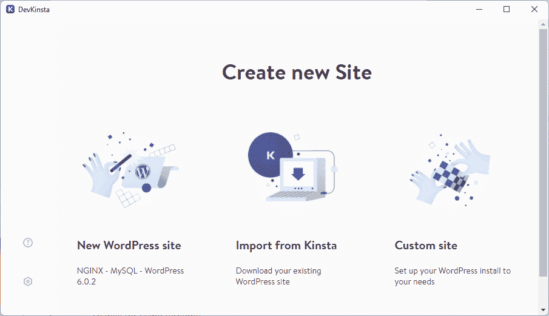

DevKinsta 的创建新站点菜单。


现在 DevKinsta 安装程序要求你为 WordPress 管理帐户创建凭证:


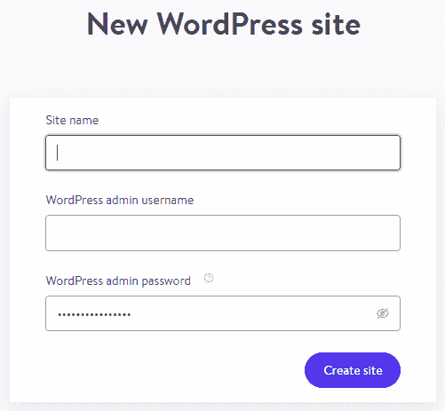

DevKinsta 显示新的 WordPress 站点表单。


一旦安装，DevKinsta 就是一个独立的应用程序。现在你可以访问 WordPress 站点(通过**打开站点**按钮)和 WordPress 管理仪表板( **WP 管理**按钮)。


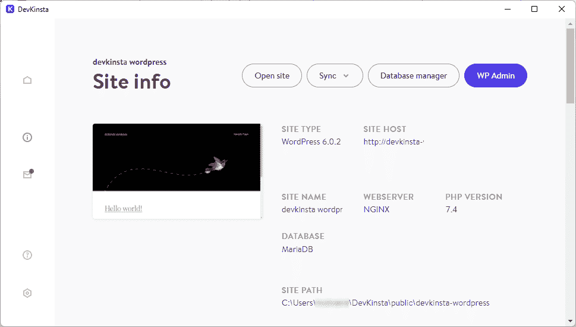

DevKinsta 的网站信息面板。


接下来，您需要为您的网站启用 [SSL 和 HTTPS](https://kinsta.com/knowledgebase/how-ssl-works/) 。这通过 SSL 证书提高了网站的安全性。


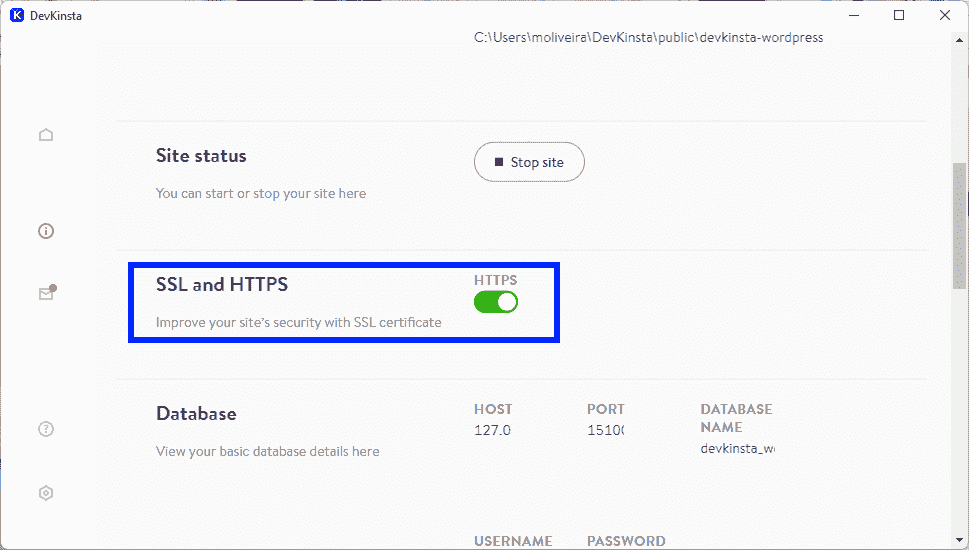

DevKinsta 的“SSL 和 HTTPS”选项。


现在进入 DevKinsta 应用程序，点击**打开网站**按钮。一个新的浏览器标签将显示你的 WordPress 站点的主页:


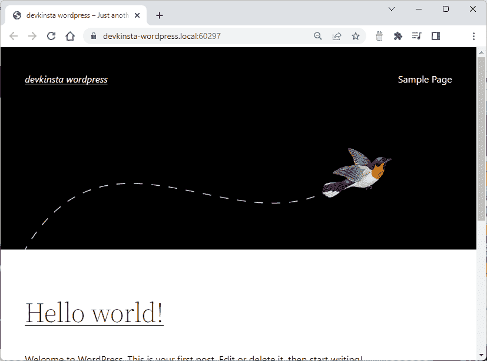

WordPress 主页。


这是你的 WordPress 博客，你可以在这里开始写作。但是为了使 Python 能够访问和使用 WordPress REST API，我们必须首先配置 WordPress Admin。

现在点击 DevKinsta 应用程序上的 **WP 管理**按钮，然后提供你的用户和密码来访问 **WordPress 仪表盘**:


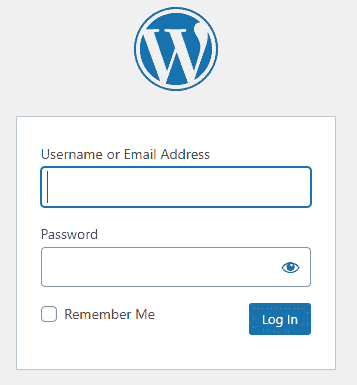

WordPress 登录表单。


一旦你登录，你会看到 **WordPress 仪表盘**:


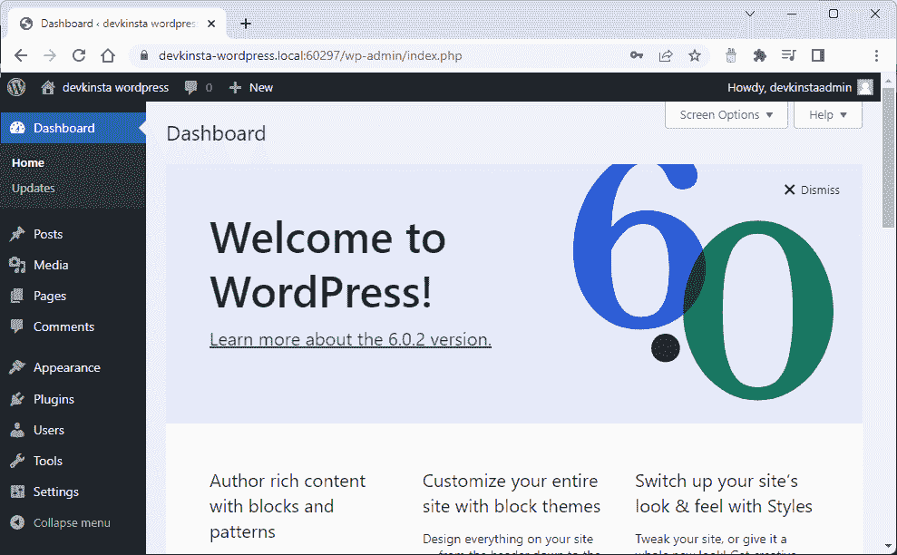

WordPress 仪表盘页面。


WordPress 使用 cookie 认证作为它的标准方法。但是如果你想使用 REST API 来控制它，你必须使用一种技术来授权访问 WordPress REST API。

为此，您将使用[应用程序密码](https://make.wordpress.org/core/2020/11/05/application-passwords-integration-guide/)。这些是 WordPress 生成的 24 个字符长的字符串，与有权限管理你的网站的用户档案相关联。

要使用应用程序密码，请单击仪表板上的**插件**菜单，然后搜索同名插件。然后安装并激活应用程序密码插件:


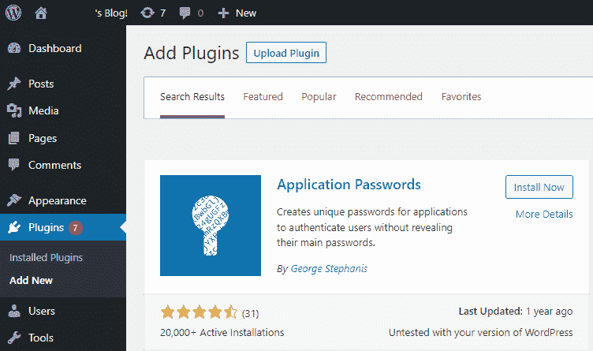

WordPress 的应用密码插件。


要开始创建您的应用程序密码，首先展开**用户**菜单并点击**所有用户**:


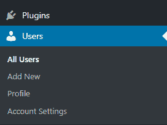

展开用户菜单。


现在，点击管理员用户名下方的**编辑**:


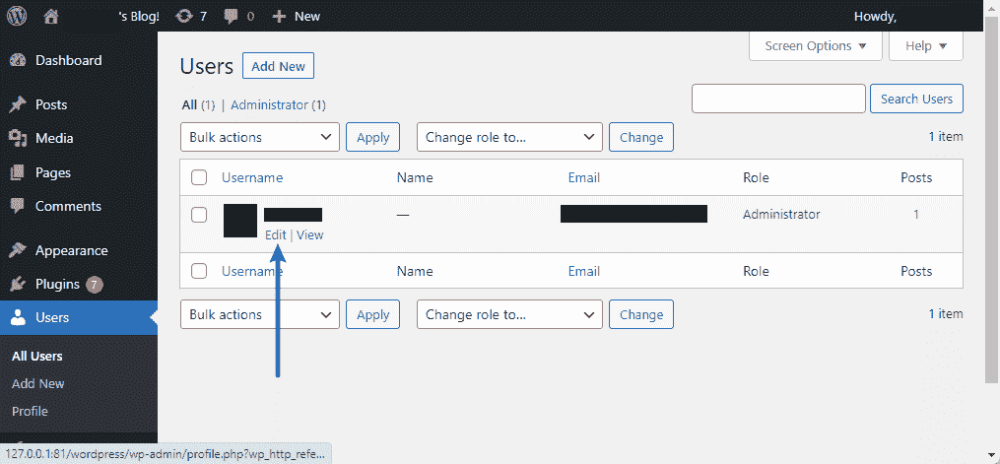

WP-Admin 界面。


向下滚动**编辑用户**页面，找到**应用密码**部分。在这里，为应用程序密码提供一个名称，稍后您将使用它来验证您的 Python 应用程序请求并使用 REST API:


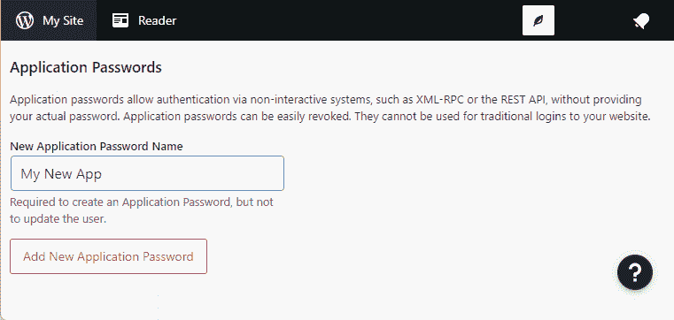

申请密码页面。


点击**添加新的应用程序密码**,这样 WordPress 可以为你生成一个随机的 24 个字符的密码:


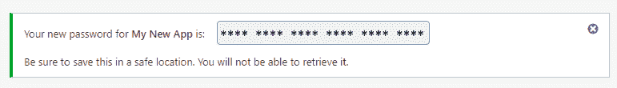

新增申请密码页面。


接下来，复制这个密码，并将其保存在一个安全的位置，以便以后使用。请记住，一旦关闭此页面，您将无法找回此密码。

最后，您必须配置永久链接。WordPress 允许你为你的永久链接和档案创建一个自定义的 URL 结构。让我们改变它，这样一篇标题为“你的第一个 WordPress 网站”的文章可以通过直观的 URL https://Your-Website . local:port/Your-First-WordPress-Website/访问。这种方法带来了几个好处，包括提高可用性和美观性。

要配置永久链接，展开**设置**部分并点击**永久链接**菜单。这里将**常用设置**改为**帖子名称**:

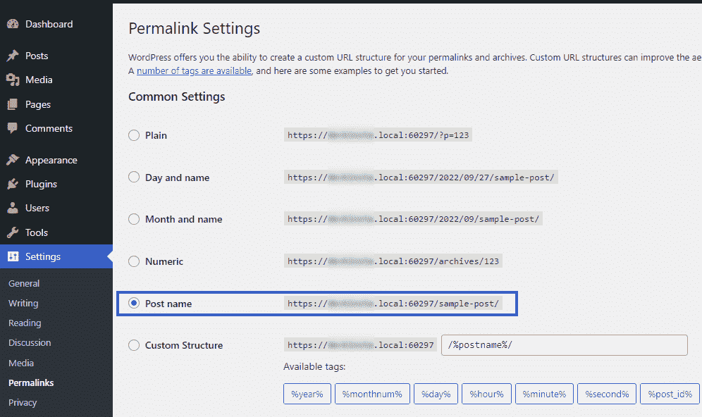

使用 **Post name** 结构设置 permalink 结构也是必要的，因为它将允许我们稍后使用 JSON 格式在 Python 代码中检索帖子。否则，将会抛出 JSON 解码错误。

## 如何从 Python 控制 WordPress

WordPress 是用 PHP 编写的，但它有一个 REST API，允许其他编程语言、网站和应用程序使用它的内容。在 REST 架构中公开 WordPress 内容使得它以 JSON 格式可用。因此，其他服务可以与 WordPress 集成并执行创建、读取、更新和删除(CRUD)操作，而不需要安装本地 WordPress。

接下来，您将构建一个简单的 Python 应用程序，看看如何使用 WordPress REST API 来创建、检索、更新和删除帖子。

为新的简单 Python 项目创建一个新目录，并将其命名为类似于`PythonWordPress`的名称:

```
../PythonWordPress
```

现在，您将为您的项目创建一个虚拟环境，允许它维护一组独立的已安装 Python 包，将它们与您的系统目录隔离开来，并避免版本冲突。通过执行`venv`命令创建一个虚拟环境:

```
python3 -m venv .venv
```

现在，运行一个命令来激活**。虚拟环境。该命令因操作系统而异:**

*   视窗:`.venvScriptsactivate`
*   Mac/Linux: `.venv/bin/activate`

接下来，存储与你的 WordPress 账户相关的配置。要将应用程序配置从 Python 代码中分离出来，需要创建一个**。env** 文件，并将这些环境变量添加到该文件中:

```
WEBSITE_URL="<>"

API_USERNAME="<>"

API_PASSWORD="<>"
```

幸运的是，从 Python 应用程序中读取上面的数据很容易。您可以安装 **Python-dotenv** 包，这样您的应用程序就可以从**中读取配置。env** 文件:

## 注册订阅时事通讯


### 想知道我们是怎么让流量增长超过 1000%的吗？

加入 20，000 多名获得我们每周时事通讯和内部消息的人的行列吧！

[Subscribe Now](#newsletter)

```
pip install python-dotenv
```

然后，安装 **aiohttp** ，Python 的异步 http 客户端/服务器:

```
pip install aiohttp
```

现在添加一个名为 **app.py** 的文件，代码如下:

```
import asyncio

menu_options = {

1: 'List Posts',

2: 'Retrieve a Post'

}

def print_menu():

for key in menu_options.keys():

print (key, '--', menu_options[key] )

async def main():

while(True):

print_menu()

option = input_number('Enter your choice: ')

#Check what choice was entered and act accordingly

if option == 1:

print('Listing posts...')

elif option == 2:

print('Retrieving a post...')

else:

print('Invalid option. Please enter a number between 1 and 5.')

def input_number(prompt):

while True:

try:

value = int(input(prompt))

except ValueError:

print('Wrong input. Please enter a number ...')

continue

if value < 0:

print("Sorry, your response must not be negative.")

else:

break

return value

def input_text(prompt):

while True:

text = input(prompt)

if len(text) == 0:

print("Text is required.")

continue

else:

break

return text

if __name__=='__main__':

asyncio.run(main())
```

上面的代码显示了一个控制台菜单，并要求您输入一个数字来选择一个选项。接下来，您将扩展这个项目并实现代码，使您能够列出所有文章并使用文章 id 检索特定文章。

## 获取代码中的帖子

要与 WordPress REST API 交互，您必须创建一个新的 Python 文件。创建一个名为**的文件，包含以下内容:**

```
import aiohttp

import base64

import os

import json

from dotenv import load_dotenv

load_dotenv()

user=os.getenv("API_USERNAME")

password=os.getenv("API_PASSWORD")

async def get_all_posts():

async with aiohttp.ClientSession(os.getenv("WEBSITE_URL")) as session:

async with session.get("/wp-json/wp/v2/posts") as response:

print("Status:", response.status)

text = await response.text()

wp_posts = json.loads(text)

sorted_wp_posts = sorted(wp_posts, key=lambda p: p['id'])

print("=====================================")

for wp_post in sorted_wp_posts:

print("id:", wp_post['id'])

print("title:", wp_post['title']['rendered'])

print("=====================================")

async def get_post(id):

async with aiohttp.ClientSession(os.getenv("WEBSITE_URL")) as session:

async with session.get(f"/wp-json/wp/v2/posts/{id}") as response:

print("Status:", response.status)

text = await response.text()

wp_post = json.loads(text)

print("=====================================")

print("Post")

print("     id:", wp_post['id'])

print("     title:", wp_post['title']['rendered'])

print("     content:", wp_post['content']['rendered'])

print("=====================================")
```

注意上面的 **aiohttp** 库的使用。现代语言提供了支持异步编程的语法和工具。这通过允许程序在执行诸如 [web 请求](https://kinsta.com/knowledgebase/what-is-an-http-request/)、数据库操作和磁盘 I/O 等操作的同时执行任务来提高应用程序的响应能力。Python 提供了 [asyncio](https://docs.python.org/3/library/asyncio.html) 作为其异步编程框架的基础，并且 [aiohttp](https://docs.aiohttp.org/en/stable/) 库构建在 **asyncio** 之上，以将异步访问引入 Python 中的 http 客户端/服务器操作。

上面的`ClientSession`函数异步运行并返回一个`session`对象，我们的程序用它对`/wp-json/wp/v2/posts`端点执行 HTTP GET 操作。检索所有帖子的请求和特定帖子的请求之间的唯一区别是最后一个请求在 URL 路由中传递了一个`post id`参数:`/wp-json/wp/v2/posts/{id}`。

现在，打开 **app.py** 文件，添加`import`语句:

```
from wordpress_api_helper import get_all_posts, get_post
```

接下来，修改`main`函数来调用`get_all_posts`和`get_post`函数:

```
if option == 1:

print('Listing posts...')

await get_all_posts()

elif option == 2:

print('Retrieving a post...')

id = input_number('Enter the post id: ')

await get_post(id)
```

然后运行应用程序:

```
python app.py
```

然后您会看到应用程序菜单:


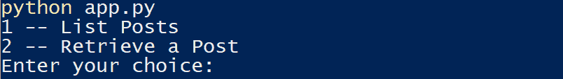

Python 应用菜单。


现在，尝试选项 1 来查看 Python 应用程序检索的帖子列表，并尝试选项 2 来选择帖子:


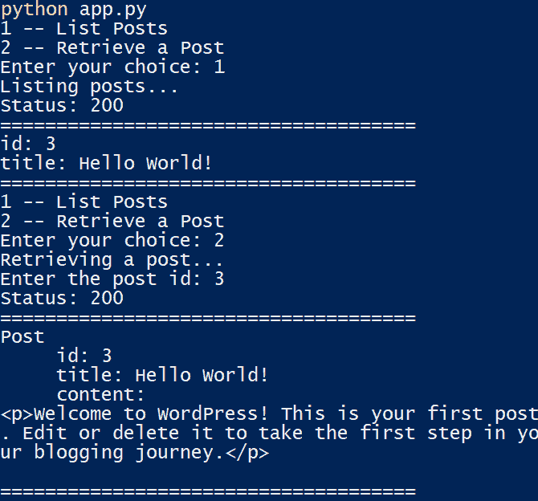

Python 应用显示帖子列表和单个用户选择的帖子。


## 在代码中创建帖子

要用 Python 创建一篇 WordPress 文章，首先打开 **wordpress_api_helper.py** 文件，并添加`create_post`函数:

Struggling with downtime and WordPress problems? Kinsta is the hosting solution designed to save you time! [Check out our features](https://kinsta.com/features/)

```
async def create_post(title, content):

async with aiohttp.ClientSession(os.getenv("WEBSITE_URL")) as session:

async with session.post(

f"/wp-json/wp/v2/posts?content={content}&title={title}&status=publish"

, auth=aiohttp.BasicAuth(user, password)) as response:

print("Status:", response.status)

text = await response.text()

wp_post = json.loads(text)

post_id = wp_post['id']

print(f'New post created with id: {post_id}')
```

这段代码调用`session`对象中的`post`函数，传递 REST API 端点 URL 旁边的`auth`参数。`auth`对象现在包含了您使用应用程序密码创建的 WordPress 用户和密码。现在，打开 **app.py** 文件，添加代码导入`create_post`和菜单:

```
from wordpress_api_helper import get_all_posts, get_post, create_post

menu_options = {

1: 'List Posts',

2: 'Retrieve a Post',

3: 'Create a Post'

}
```

然后添加第三个菜单选项:

```
elif option == 3:

print('Creating a post...')

title = input_text('Enter the post title: ')

content = input_text('Enter the post content: ')

await create_post(title, f"{content}") 
```

然后，运行应用程序并尝试选项 3，传递标题和内容以在 WordPress 中创建新帖子:


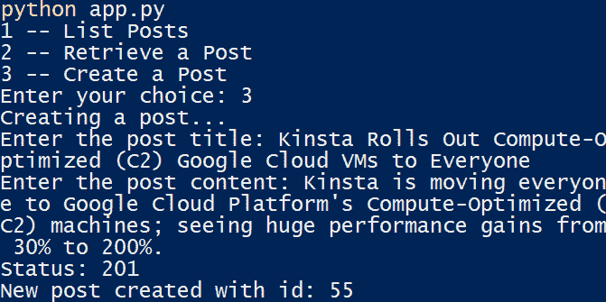

Python 应用程序显示新创建的 WordPress 帖子。


再次选择选项 1 将返回新添加文章的 id 和标题:


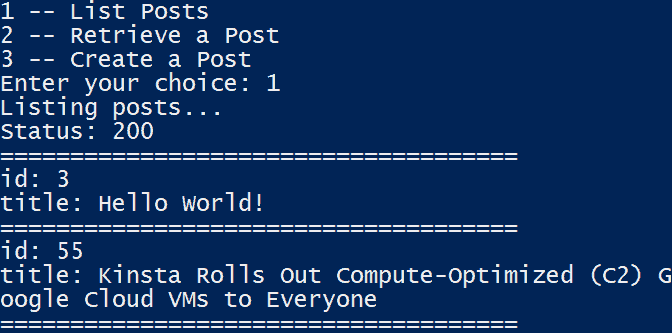

Python app 返回新帖的标题和 id。


你也可以打开你的 WordPress 网站查看这篇新文章:


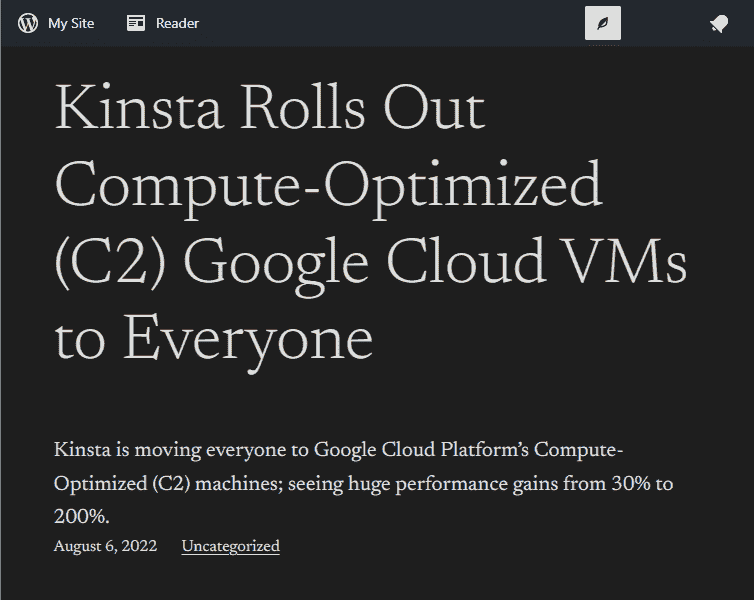

新 WordPress 帖子的浏览器图片。


## 更新代码中的帖子

打开 **wordpress_api_helper.py** 文件，添加`update_post`函数:

```
async def update_post(id, title, content):

async with aiohttp.ClientSession(os.getenv("WEBSITE_URL")) as session:

async with session.post(

f"/wp-json/wp/v2/posts/{id}?content={content}&title={title}&status=publish"

, auth=aiohttp.BasicAuth(user, password)) as response:

print("Status:", response.status)

text = await response.text()

wp_post = json.loads(text)

post_id = wp_post['id']

print(f'New post created with id: {post_id}')
```

然后打开 **app.py** 文件，添加代码导入`update_post`和菜单:

```
from wordpress_api_helper import get_all_posts, get_post, create_post, update_post

menu_options = {

1: 'List Posts',

2: 'Retrieve a Post',

3: 'Create a Post',

4: 'Update a Post'

}
```

然后，添加第四个菜单选项:

```
elif option == 4:

print('Updating a post...')

id = input_number('Enter the post id: ')

title = input_text('Enter the post title: ')

content = input_text('Enter the post content: ')

await update_post(id, title, f"{content}") 
```

然后运行应用程序并尝试选项 4，传递帖子 id、标题和内容来更新现有帖子。


Python app 显示更新后的菜单。


选择选项 2 并传递更新后的帖子 id 将返回新添加帖子的详细信息:


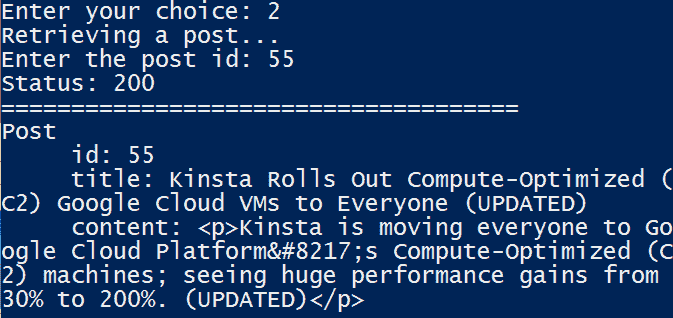

Python app 显示更新后的帖子。


## 删除代码中的帖子

您可以将帖子 id 传递给 REST API 来删除帖子。

打开 **wordpress_api_helper.py** 文件，添加`delete_post`函数:

```
async def delete_post(id):

async with aiohttp.ClientSession(os.getenv("WEBSITE_URL")) as session:

async with session.delete(

f"/wp-json/wp/v2/posts/{id}"

, auth=aiohttp.BasicAuth(user, password)) as response:

print("Status:", response.status)

text = await response.text()

wp_post = json.loads(text)

post_id = wp_post['id']

print(f'Post with id {post_id} deleted successfully.')
```

现在打开 **app.py** 文件，添加代码导入`delete_post`和菜单:

```
from wordpress_api_helper import get_all_posts, get_post, create_post, update_post, delete_post

menu_options = {

1: 'List Posts',

2: 'Retrieve a Post',

3: 'Create a Post',

4: 'Update a Post',

5: 'Delete a Post',

}
```

然后，添加第五个菜单选项:

```
elif option == 5:

print('Deleting a post...')

id = input_number('Enter the post id: ')

await delete_post(id)
```

现在运行应用程序并尝试选项 5，传递一个 id 来删除 WordPress 中现有的帖子:


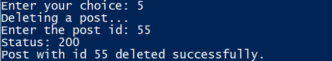

Python app 显示删除选中的帖子。


注意:如果运行**列表帖子**选项，被删除的帖子可能仍然会出现:


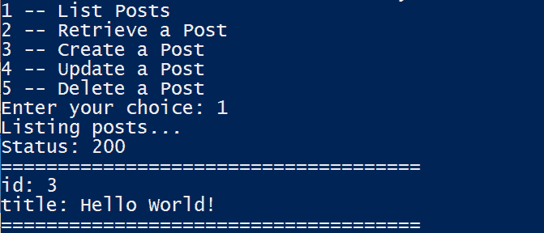

Python app 显示原创帖子列表。


为了确认你已经删除了这篇文章，等待几秒钟，然后再次尝试**列表文章**选项。就是这样！
T3】

## 摘要

多亏了 WordPress REST API 和 Python 的 HTTP 客户端库，Python 应用和 WordPress 可以合作并互相交流。REST API 的好处在于，它允许你从 Python 应用程序远程操作 WordPress，Python 强大的语言支持按照你想要的结构和频率自动创建内容。

DevKinsta 使得创建和开发一个本地 WordPress 站点变得快速和简单。它为开发 WordPress 主题和插件提供了一个本地环境，并由于其基于 Docker 的独立安装模型而提供了一个简化的部署模型。

你使用 Python 和 WordPress 有什么体验？

当你准备好扩展这种体验时，你可以阅读[WordPress REST API 基础完整指南](https://kinsta.com/blog/wordpress-rest-api/)来探索其他可能性。

* * *

让你所有的[应用程序](https://kinsta.com/application-hosting/)、[数据库](https://kinsta.com/database-hosting/)和 [WordPress 网站](https://kinsta.com/wordpress-hosting/)在线并在一个屋檐下。我们功能丰富的高性能云平台包括:

*   在 MyKinsta 仪表盘中轻松设置和管理
*   24/7 专家支持
*   最好的谷歌云平台硬件和网络，由 Kubernetes 提供最大的可扩展性
*   面向速度和安全性的企业级 Cloudflare 集成
*   全球受众覆盖全球多达 35 个数据中心和 275 多个 pop

在第一个月使用托管的[应用程序或托管](https://kinsta.com/application-hosting/)的[数据库，您可以享受 20 美元的优惠，亲自测试一下。探索我们的](https://kinsta.com/database-hosting/)[计划](https://kinsta.com/plans/)或[与销售人员交谈](https://kinsta.com/contact-us/)以找到最适合您的方式。