# 查询监控——调试 WordPress 并提高网站性能

> 原文：<https://kinsta.com/blog/query-monitor/>

当在安装了几十个或更多插件的 WordPress 开发项目上工作时，经常会遇到性能问题。然而，找到导致性能问题的原因并不总是容易的。

你已经排除了通常的怀疑:[主机是足够的](https://kinsta.com/)，没有明显的 [JavaScript 或 PHP 错误](https://kinsta.com/blog/wordpress-errors/)，没有其他任何问题。您怀疑是您安装的一个或多个插件导致了问题，但是您如何找出是哪个插件导致了问题呢？

识别问题插件的通常方法是停用插件，直到找到性能瓶颈。

然而，有一种更快更有效的方法。这就是免费查询监控插件要解决的问题。它可以帮助你调试性能问题，更有效地开发站点，更好地处理你的 WordPress 站点。

在本指南中，您将了解到查询监视器的所有知识——它是什么，它有什么作用，以及如何使用它。

 T2】

## 什么是查询监视器？

The Query Monitor plugin.

查询监视器是一个 100%免费的插件，帮助你调试你的 WordPress 站点的性能和开发。

你可以把它想象成 Chrome 开发者工具，但专门针对 WordPress。您可以深入研究数据库查询、脚本、计时等等。您还可以查看大量有用的信息，例如一般环境信息和特定页面的详细信息。

然后，Query Monitor 以一种易于访问的方式显示所有这些信息，您可以从站点上的任何地方访问这些信息。

Query Monitor 由 John Blackbourn 维护，他是人工制造的网站的首席工程师。他还有其他几个有用的插件，包括 [WP Crontrol](https://wordpress.org/plugins/wp-crontrol/) (非常适合 [wp-cron 调试](https://kinsta.com/knowledgebase/disable-wp-cron/))和[用户切换](https://wordpress.org/plugins/user-switching/)(非常适合调试[不同用户角色](https://kinsta.com/blog/wordpress-user-roles/)的体验)。

John 反应非常迅速，并一直致力于维护和改进 Query Monitor。Automattic 和其他赞助商支持他的工作。

如果在你完成这篇文章的时候，你发现了这个插件的价值，你可以通过赞助 GitHub 上的项目来支持 Query Monitor [，每月只需 1 美元。](https://github.com/sponsors/johnbillion)

[试图确定哪个插件导致了您网站上的问题？😅这就是免费查询监视器插件解决⬇️ 点击推文](https://twitter.com/intent/tweet?url=https%3A%2F%2Fbit.ly%2F2txX2Xz&via=kinsta&text=Trying+to+determine+which+plugin+is+causing+issues+on+your+site%3F+%F0%9F%98%85+This+is+the+sort+of+scenario+that+the+free+Query+Monitor+plugin+was+made+to+resolve+%E2%AC%87%EF%B8%8F&hashtags=QueryMonitor%2CSitePerformance)的场景

## 查询监视器是做什么的？

不管名称如何，查询监视器可以帮助你调试不止是对 WordPress 数据库的查询。

不要误解我们——调试[数据库查询](https://kinsta.com/blog/wp-query/)是 Query Monitor 擅长的事情，也是该插件最重要的好处之一。

然而，它也深入到许多其他领域，包括关注性能的调试和一般的开发调试。

以下是查询监视器可以帮助您分析和调试的许多细节的示例:

*   数据库查询，包括向您显示来自特定插件的查询
*   PHP 错误
*   内存使用
*   HTTP API 调用
*   入队的脚本和样式，包括依赖性
*   钩子和动作
*   主题模板文件
*   语言和翻译
*   重写规则
*   块编辑器块
*   一般环境信息
*   WordPress 管理屏幕

Query Monitor 的一个显著限制是它主要用于“即时”调试。当它向您显示数据库查询、计时等信息时，它只是针对当前的页面负载进行操作。

它通常不跟踪或显示历史信息/趋势，尽管 John 说这个功能计划在未来的版本中实现。

## 如何使用查询监视器调试 WordPress 并提高性能

现在您已经知道了什么是查询监视器及其功能，让我们来了解一下如何使用查询监视器来调试您的站点的性能以及其他一些用于一般开发调试的工具。

我们将向您简要介绍查询监视器接口及其工作原理。然后，我们将深入界面中的每个区域。

有 12 个以上不同的高级接口区域，所以有很多要涵盖。然而，您看到的界面菜单的确切数量将取决于您正在分析的页面。

让我们开始吃吧。

### 查询监视器界面简介

查询监视器没有自己单独的界面区域。相反，它会在前端和后端的 WordPress 管理栏中显示新的信息。

查询监视器最初显示一个包含四条信息的快速摘要:

*   **页面生成时间**–截图中 0.05 s。
*   **内存使用峰值**–截图中 7.7 MB。
*   **SQL 查询花费的总时间**(秒)–截图中为 0.00 秒。
*   **截图中 SQL 查询总数**–54。

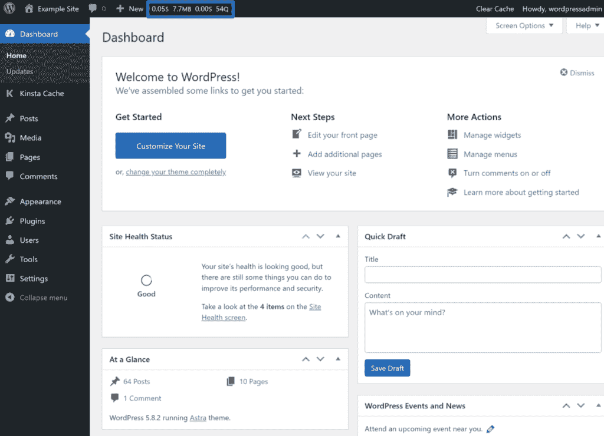

Query Monitor’s summary on the WordPress admin bar.

如果您单击该摘要，您将打开整个查询监视器界面，该界面显示为您当前正在查看的前端或后端页面上的窗口覆盖图。

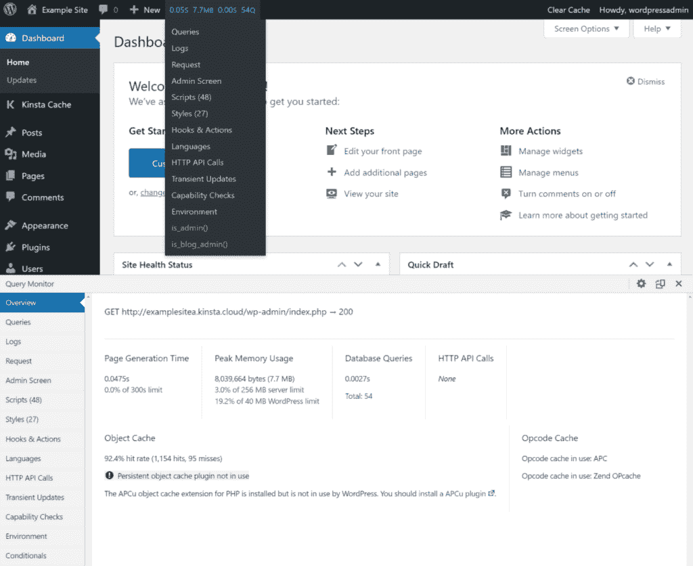

The Query Monitor interface.

Query Monitor 提供的所有功能和信息都包含在这个覆盖窗口中。

如果你更喜欢改变覆盖窗口的布局，你可以点击右上角的按钮将其切换到侧边栏界面。您也可以使用拖放来改变窗口的大小。

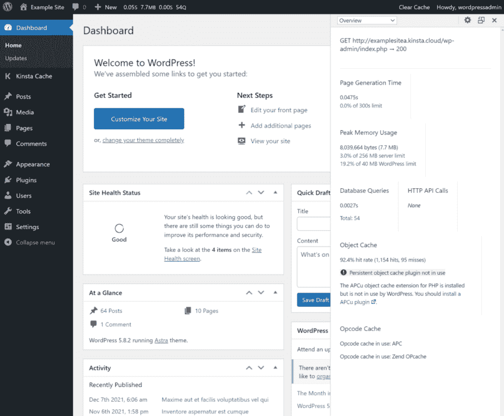

How to switch to a sidebar interface.

查询监控界面及其信息只有管理员(或 [WordPress multisite](https://kinsta.com/blog/wordpress-multisite/) 上的超级管理员)可见。

还有一个选项可以设置一个身份验证 cookie 来查看查询监视器的输出，即使您没有登录(或者您作为一个具有较低用户角色[的用户登录)。我们将在稍后的指南中分享如何做到这一点。](https://kinsta.com/blog/wordpress-user-roles/)

让我们浏览界面中的每个标签，并解释如何使用它来调试你的 WordPress 站点。

### 概观

**概述**选项卡显示来自管理栏摘要的更多详细信息和一些常规环境信息。

例如，除了查看内存使用的峰值，Overview 标签更进一步查看这个峰值与你的服务器和 WordPress 内存限制的比较。

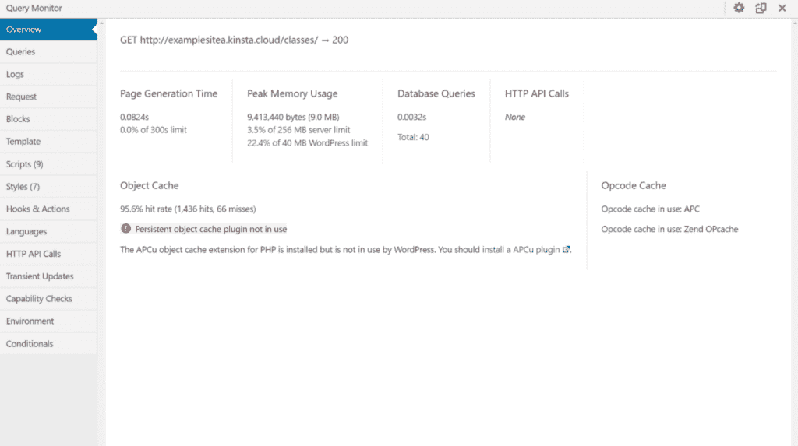

The Overview tab in Query Monitor.

这里没有什么太详细的内容，只是一个概述(因此得名)。

### 问题

**查询**选项卡允许您深入到您正在查看的页面的每个数据库查询中。这是 Query Monitor 中信息最丰富的领域之一，当您考虑插件的名称时，这是有意义的。

对于每个查询，您可以看到以下信息:

1.  完整的查询
2.  查询呼叫者
3.  查询组件(例如，它是来自核心、主题还是插件)
4.  行数
5.  查询花费的时间

在一般的调试中，你可以用它来查找那些限制你站点性能的缓慢加载的查询。

Query Monitor 会根据你的主题和单独的插件进行查询，这样你就可以看到每个扩展的影响。

假设一个特定的插件导致了大量加载缓慢的查询。在这种情况下，你需要找到一种方法来解决这个问题——要么优化插件的设置或服务器的配置(例如，使用数据库或[对象缓存](https://kinsta.com/help/redis-cache/)),要么切换到更高效的[不同插件](https://kinsta.com/best-wordpress-plugins/)。

在主选项卡中，您可以看到每个查询的所有高级信息。

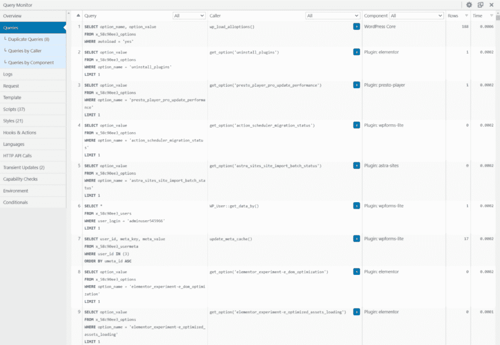

The main Queries tab shows a list of all queries.

如果要了解特定查询的更多信息，请单击加号图标展开更多详细信息。

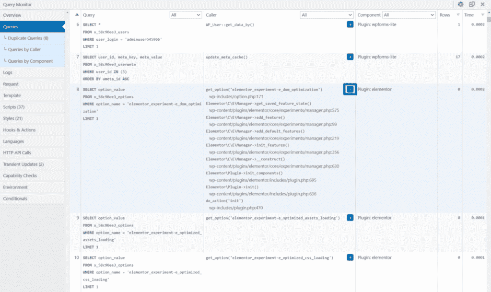

How to view expanded details for a query.

如果你在这里看到异常低的数字，这可能是因为[某种类型的缓存](https://kinsta.com/blog/wordpress-cache/)——例如页面缓存或插件[缓存其数据库查询](https://kinsta.com/help/redis-cache/)。因此，在调试时禁用缓存会很有帮助。

该区域中还有一些子菜单可以帮助您查找特定类型的查询:

*   重复查询
*   呼叫者的查询
*   按组件查询

#### 重复查询

**重复查询**区域突出显示了重复查询，并列出了“潜在的麻烦制造者”,以帮助您调试它们并提高效率。

How to see a list of duplicate queries.

#### 呼叫者的查询

通过呼叫者的**查询**区域，您可以查看该页面上的所有呼叫者。如果你点击其中一个，你可以看到这个呼叫者的查询列表。

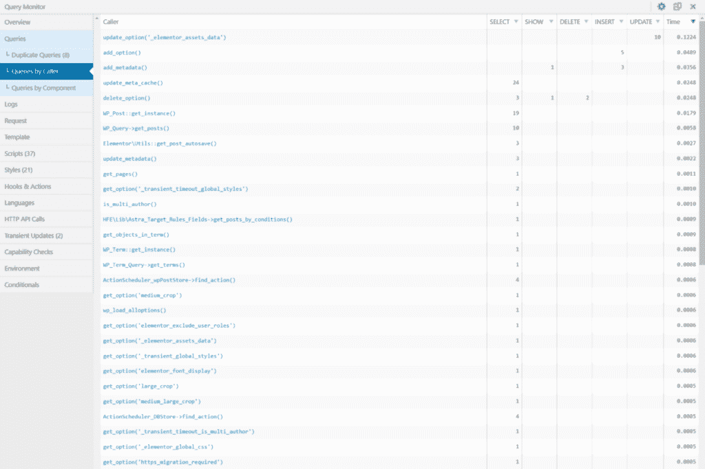

How to view queries by the caller.

#### 按组件查询

通过组件的**查询区域显示了进行查询的所有组件的列表，包括 WordPress 核心、你的主题和单独的插件。**

您可以单击特定组件来查看其所有查询。

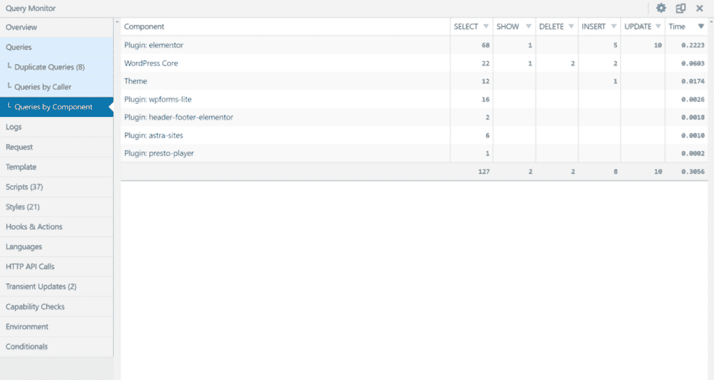

How to view queries by component.

再说一次，这是最有价值的报告之一，因为它可以让你找到降低你的网站查询性能的特定插件。

#### 如果您没有看到按组件的查询，请阅读此处

如果在查询监视器中没有看到组件信息，可能是因为查询监视器无法对其 db.php 文件进行符号链接。在这些情况下，您会看到如下所示的错误消息。

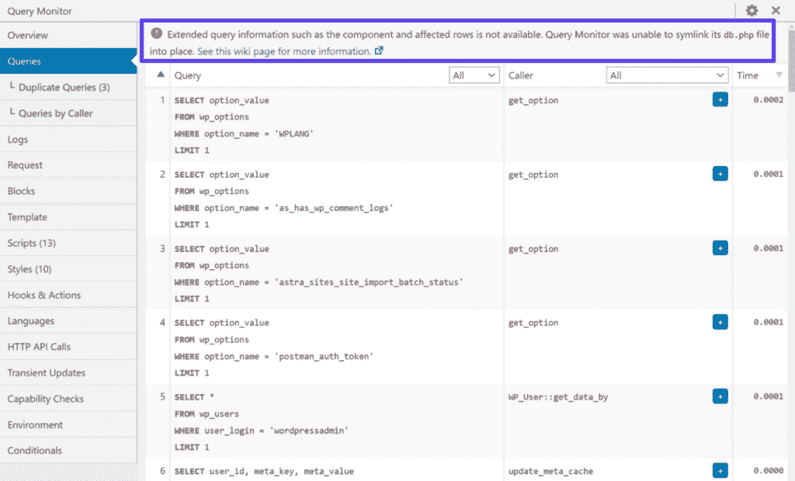

If this error displays, you won’t be able to see queries by component.

这里有两个可能的原因:

1.  [您站点的](https://kinsta.com/blog/wordpress-permissions/) [wp-content 文件夹](https://kinsta.com/knowledgebase/wordpress-files/)的文件权限。
2.  wp-content/db.php 文件已经存在(可能是因为[一个类似](https://kinsta.com/blog/wordpress-caching-plugins/) [W3 总缓存](https://kinsta.com/blog/w3-total-cache/)的缓存插件)。

你可以在这篇 GitHub 文章中看到一些[修复和解决方法。如果你觉得](https://github.com/johnbillion/query-monitor/wiki/db.php-Symlink)[通过 SSH](https://kinsta.com/blog/how-to-use-ssh/) 连接到你的服务器很舒服，你可以用 [WP-CLI 命令](https://kinsta.com/blog/wp-cli/)来解决这个问题(尽管还有其他方法)。

查询监视器的大部分功能仍然可以解决这个问题，但是在解决这个问题之前，您将看不到任何组件信息。

### 日志

**Logs** 选项卡是一个高级选项卡，允许您设置要记录的消息和变量。这可以帮助您调试技术问题，或者关注您的站点以发现问题。

当您第一次安装查询监视器时，该选项卡不会显示任何内容，因为您没有设置任何日志记录变量。

但是，如果您想设置自定义日志记录变量，可以使用如下简单语法:

`do_action( 'qm/debug', 'This happened!' );`

查询监视器支持以下操作，这些操作允许您记录不同级别的问题:

*   质量管理/应急
*   质量管理/预警
*   质量管理/关键
*   质量管理/误差
*   质量管理/警告
*   质量管理/通知
*   质量管理/信息
*   质量管理/调试

如果您想了解更多并查看一些示例，请查看[查询监视器日志记录变量页面](https://querymonitor.com/docs/logging-variables/)。

### 请求

主**请求**选项卡显示当前请求的查询变量。

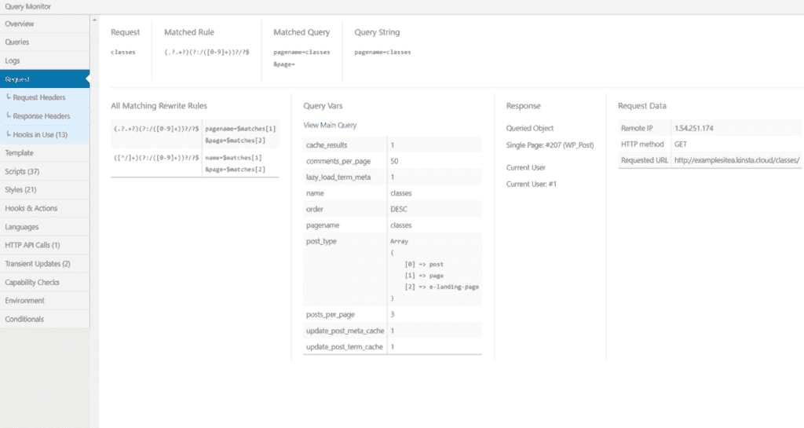

The main Request tab.

还有子菜单可以看到**请求头**和**响应头**，这对性能调试可能更有帮助。

例如，您可能想要调试缓存行为或 CDN 行为。在**响应头**子菜单中，您可以看到缓存控制行为，让您调试您站点上的[浏览器缓存。](https://kinsta.com/blog/leverage-browser-caching/)

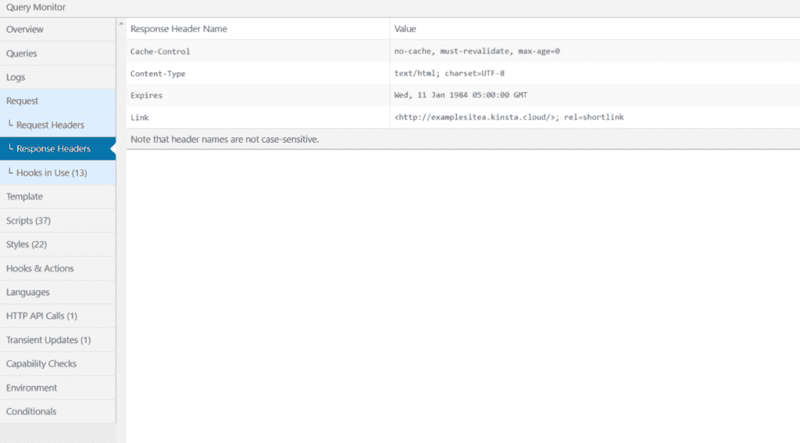

How to view response headers.

### 阻碍

只有当你查看用本地 WordPress 块编辑器[(又名古腾堡)](https://kinsta.com/blog/gutenberg-wordpress-editor/)构建的页面时，**块**标签才可见。

在这些情况下，该页面将列出页面上每个单独块的[，以及该块的详细信息。](https://kinsta.com/blog/gutenberg-blocks/)

这里一个聪明的事情是，它会告诉你这个块是来自 WordPress 核心还是一个不同的插件。

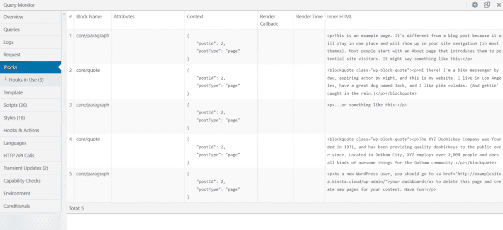

The Blocks area only appears if you created the block editor’s content.

### 模板

只有当你在网站前端使用查询监视器时，**模板**标签才可见。它帮助你查看和调试[你正在看的页面的模板层次](https://kinsta.com/blog/wordpress-template-hierarchy/)。

## 注册订阅时事通讯

### 想知道我们是怎么让流量增长超过 1000%的吗？

加入 20，000 多名获得我们每周时事通讯和内部消息的人的行列吧！

[Subscribe Now](#newsletter)

您可以看到该页面的特定模板文件以及各种模板部件和主体类。

这和性能没有任何关系，但是对于[自定义主题开发](https://kinsta.com/blog/how-to-customize-wordpress-theme/)来说可以是有益的。

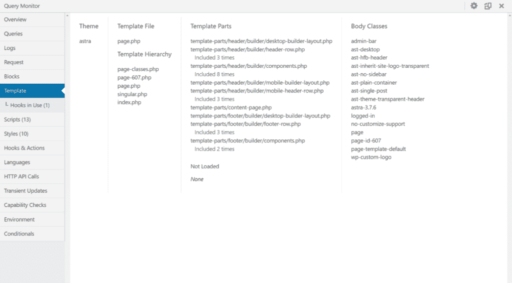

How to view the template hierarchy.

### 管理屏幕

只有当你在[的 WordPress 管理仪表板](https://kinsta.com/knowledgebase/wordpress-admin/)中使用查询监视器时，**管理屏幕**标签才可见。您可能不会经常使用它，但如果您需要在自定义管理屏幕中调试行为，它会很有帮助。

如果您查看一个带有列表的管理屏幕，它会向您显示自定义的列过滤器和操作。它还会显示 get_current_screen 的状态。

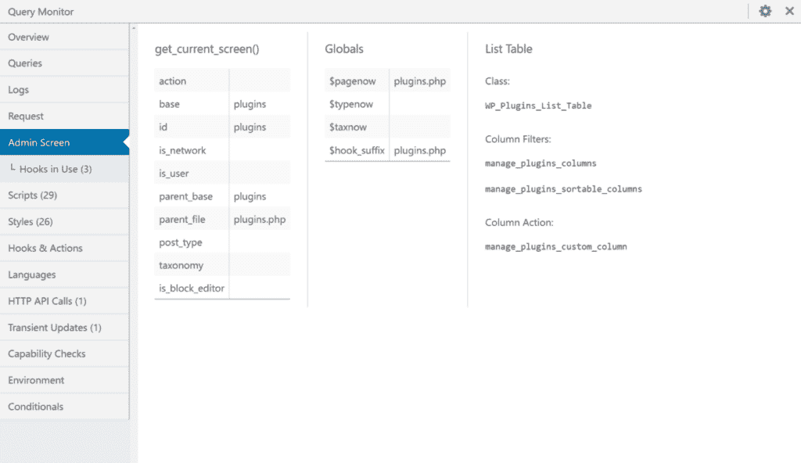

The Admin Screen details.

T2】

### 剧本

在**查询**选项卡之后，**脚本**选项卡可能是查询监视器中下一个最有帮助的性能调试区域。

该选项卡显示页面上每个排队的 [JavaScript 脚本](https://kinsta.com/knowledgebase/what-is-javascript/)及其依赖项和从属项。您还可以使用过滤器来快速查找来自特定主机或具有显式依赖项/从属项的脚本。

作为一个粗略的规则，更多的脚本相当于一个较慢的网站，因为它们增加了页面大小和 HTTP 请求。

您可以使用这个区域来发现不同扩展的影响，并找到减少每页上加载的[入队脚本](https://kinsta.com/blog/wp-enqueue-scripts/)数量的方法。

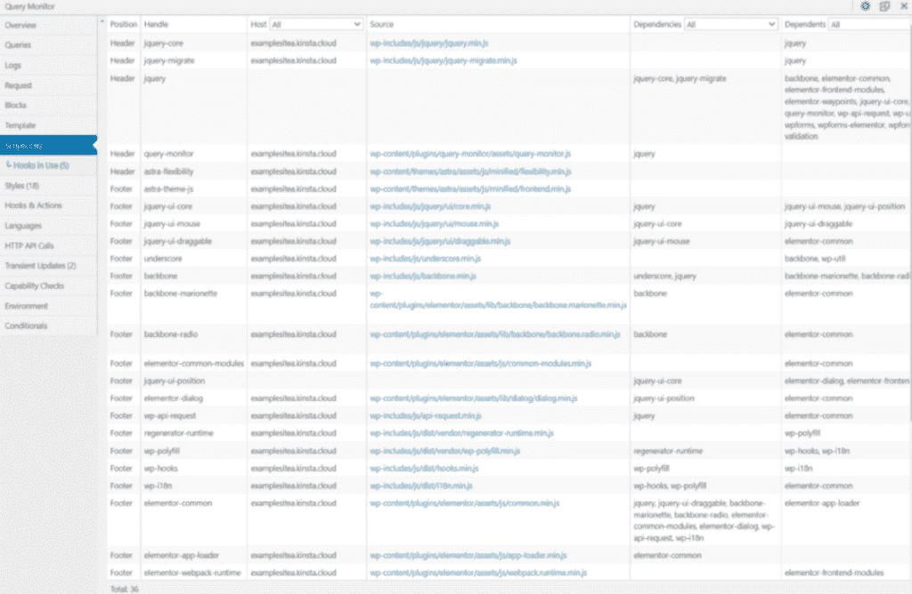

The Scripts area shows all enqueued scripts.

不过，Query Monitor 不会显示所有这些脚本加载的时间。如果你想看到这一点，你需要[使用一个速度测试工具](https://kinsta.com/blog/website-speed-test/)并深入瀑布分析—[Pingdom](https://kinsta.com/blog/pingdom-speed-test/)和 [GTmetrix](https://kinsta.com/blog/gtmetrix-speed-test/) 都是很好的选择。

如果你需要帮助使用这些细节来优化你的站点脚本，我们有很多有价值的指南来优化 WordPress 上的 JavaScript:

*   [如何推迟 JavaScript 解析](https://kinsta.com/blog/defer-parsing-of-javascript/)
*   [如何消除渲染阻塞 JavaScript](https://kinsta.com/blog/eliminate-render-blocking-javascript-css/)
*   [如何减少 HTTP 请求](https://kinsta.com/blog/make-fewer-http-requests/)

### 风格

**样式**选项卡类似于**脚本**选项卡，但是它[显示排队的 CSS](https://kinsta.com/blog/wordpress-css/) 而不是 JavaScript。这是调试站点性能的另一个方便的选项卡。

就像脚本一样，在一个页面上加载更多的样式表通常会导致站点加载速度变慢。

在这个区域中，您可以发现不同扩展对您站点的影响。您可以使用这些信息来减少页面上需要加载的样式表的数量，这将减少文件大小和加载页面所需的 [HTTP 请求。](https://kinsta.com/blog/make-fewer-http-requests/)

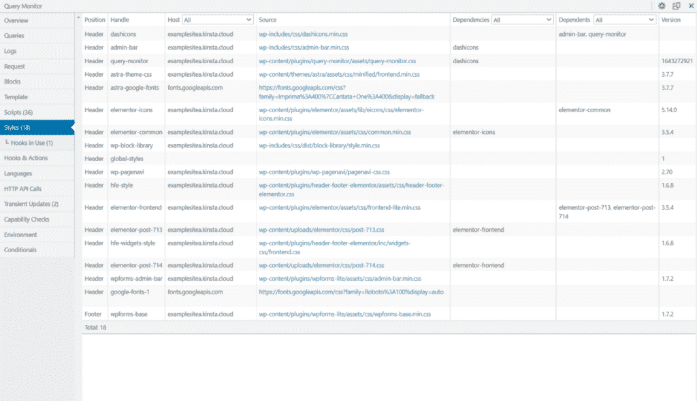

The Styles area shows all enqueued stylesheets.

与脚本一样，Query Monitor 不会对 CSS 如何加载以及它是否阻止了站点关键部分的加载进行深入分析。为此，您需要再次使用瀑布分析。

我们有一些有用的帖子来帮助你优化你的网站的 CSS:

*   [如何优化 CSS](https://kinsta.com/blog/optimize-css/)
*   [如何优化关键渲染路径](https://kinsta.com/blog/critical-rendering-path/)

### 挂钩和动作

**钩子&动作**标签列出了当前页面的所有钩子和动作，以及它们的优先级。

对于操作，您可以展开单个操作来查看与该操作关联的实际文件和代码行。你也可以通过组件过滤动作，从 WordPress 核心、插件和主题中寻找动作。

这一领域并不真正关注性能，但是对于定制开发来说很方便。

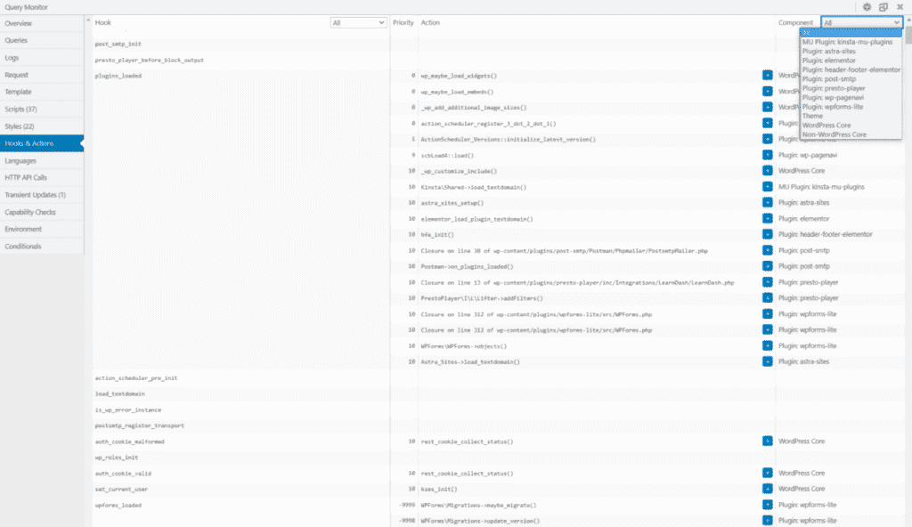

How to view hooks and actions.

### 语言

**Languages** 选项卡向您显示您站点上的语言和文本域，以及[用于每个扩展的语言文件](https://kinsta.com/blog/how-to-translate-a-website/)。

Struggling with downtime and WordPress problems? Kinsta is the hosting solution designed to save you time! [Check out our features](https://kinsta.com/features/)

如果你有一个英语的单一语言网站，这不是很有用。但是，如果您[有一个多语言网站](https://kinsta.com/blog/wordpress-multilingual/)和/或您的网站使用的语言可能没有完整的翻译包覆盖，此选项卡会很有帮助。

### HTTP API 调用

**HTTP API Calls** 选项卡显示页面加载期间发生的所有服务器端 HTTP 请求，包括请求细节、时间和 [HTTP 状态代码](https://kinsta.com/blog/http-status-codes/)。

如果一个插件或主题正在进行缓慢的 HTTP API 调用，这通常可能是低性能的一个“隐藏”原因，你需要找到一种方法来解决这个问题，要么通过改变扩展的设置，要么切换到一个不同的扩展。

对于许多页面，您应该看到“没有 HTTP API 调用”，这是一个好迹象，因为这意味着没有任何东西会妨碍您的站点的性能。

### 能力检查

**功能检查**区域让您看到哪些用户功能可以访问您正在查看的当前内容。这可以方便地查看不同的[用户是否可以访问特定的前端](https://kinsta.com/knowledgebase/wordpress-private-page/)或后端内容。

但是，出于性能原因，这个特性在默认情况下是禁用的。如果你想启用它，你需要编辑[你的站点的**wp-config.php**文件](https://kinsta.com/blog/wp-config-php/)并添加下面的代码片段:

`define( 'QM_ENABLE_CAPS_PANEL', true );`

### 环境

**环境**选项卡提供了您的站点环境的详细摘要，包括:

*   [PHP](https://kinsta.com/knowledgebase/what-is-php/)
*   数据库ˌ资料库
*   WordPress
*   计算机网络服务器

您可以看到重要的细节、限制、版本号、配置设置等。

这也可以为有关绩效的重要决策提供信息。

例如，如果你发现你的站点的内存限制是有限的，你可能想要[增加内存限制](https://kinsta.com/knowledgebase/php-memory-limit/)到[以避免内存限制相关的错误](https://kinsta.com/knowledgebase/wordpress-memory-limit/)。

类似地，如果你发现你使用的是旧版本的 PHP，你可能会想把 T2 升级到最新版本，以获得 T4 改进的性能。

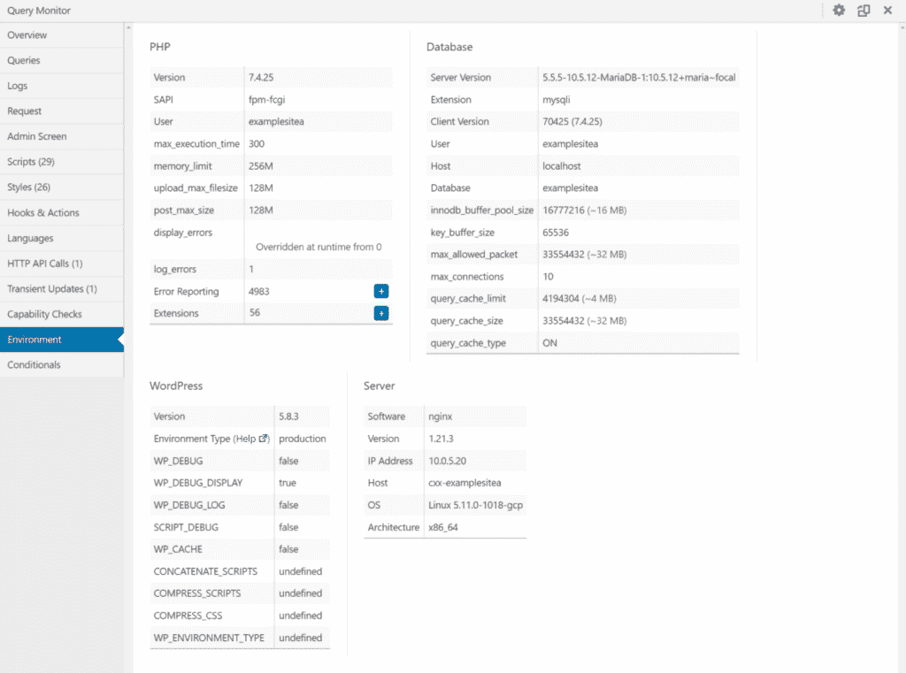

How to view environment information.

### 条件式

**Conditionals** 选项卡帮助您查看哪些条件语句适用于您正在查看的页面，这对定制开发很有帮助。

你既可以看到“真”条件句，也可以看到“假”条件句。

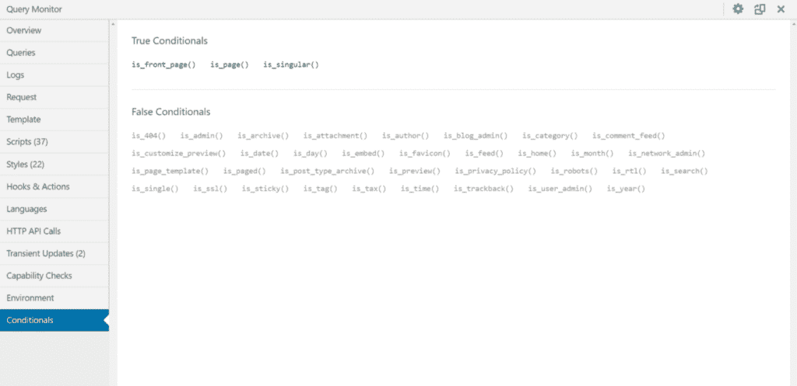

How to view page conditionals.

### 如何以非管理员用户的身份查看查询监视器信息

在某些情况下，您可能希望以不同用户角色或注销用户的身份查看查询监视器信息。这对 [WooCommerce 商店](https://kinsta.com/blog/woocommerce-tutorial/)、[会员网站](https://kinsta.com/blog/create-a-membership-website/)以及类似的网站非常有用。

您需要在浏览器中设置一个身份验证 cookie 来实现这一点。一旦设置了 cookie，您就可以在访问该站点时查看查询监视器信息，即使您已注销。

要设置身份验证 cookie，请单击查询监视器面板右上角的齿轮图标。然后，点击**设置认证 cookie** 按钮。

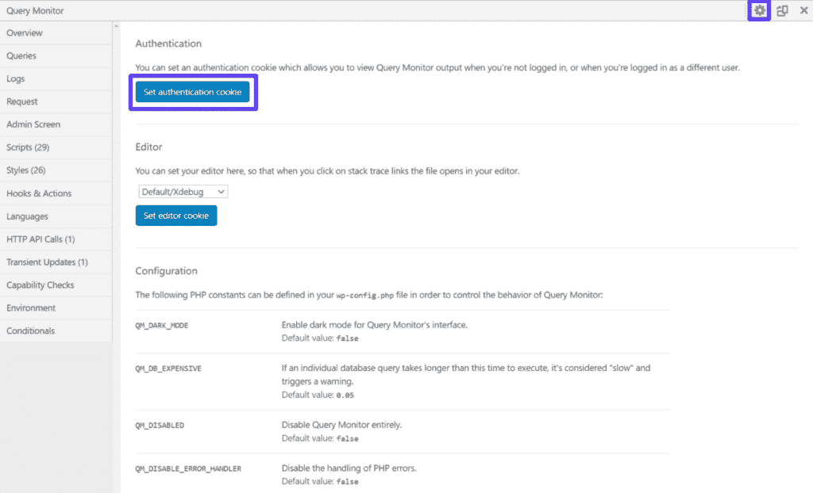

How to set the authentication cookie in Query Monitor.

如果您想禁用此功能，可以返回此界面，点击**清除认证 cookie** 按钮删除 cookie。

如果你将这与来自同一开发者的另一个有用的插件结合起来，你可以在你的网站上的[不同用户角色](https://kinsta.com/blog/wordpress-user-roles/)之间快速切换。

### 如何用附加组件扩展查询监视器

到目前为止，我们只关注核心查询监控插件中的特性和分析选项。但是，一些第三方附加组件可以进一步扩展查询监视器。

这些可以添加对特定性能技术的支持，比如 Memcached 和 [Redis](https://kinsta.com/help/redis-cache/) ，以及特定的 WordPress 插件，比如 [WooCommerce](https://kinsta.com/blog/woocommerce-tutorial/) 或 [GiveWP](https://kinsta.com/partners/give/) 。

Query Monitor 还支持调试栏插件的所有插件[，该插件集成了](https://wordpress.org/plugins/debug-bar/) [ElasticPress](https://kinsta.com/blog/wordpress-search/) 、 [Elementor](https://kinsta.com/partners/elementor/) 、缓存查找等等。

您可以在 GitHub 页面上看到一个[完整的查询监视器附加组件列表。](https://github.com/johnbillion/query-monitor/wiki/Query-Monitor-Add-on-Plugins)

## 调试和提高 WordPress 性能的其他有用工具

虽然 Query Monitor 是调试 WordPress 性能的一个方便的免费工具，但它并没有涵盖所有的内容。你应该考虑一些其他有用的工具来分析 WordPress 性能的不同方面。

### 应用性能监控

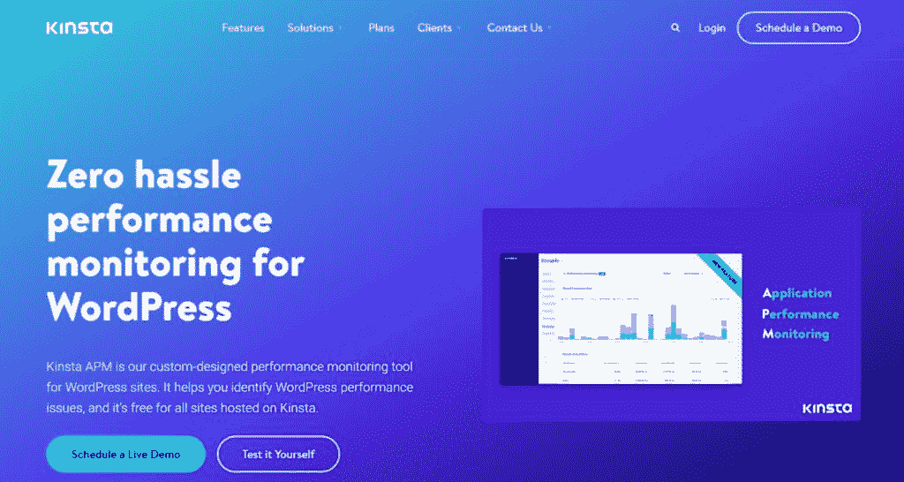

The Kinsta APM tool.

如果您[在 Kinsta](https://kinsta.com/plans/) 托管您的站点，您可以免费访问 [Kinsta 应用程序性能监控(APM)](https://kinsta.com/apm-tool/) 。

[像 Kinsta APM](https://kinsta.com/blog/apm-tools/) [这样的 APM 工具](https://kinsta.com/blog/application-performance-monitoring/)比 Query Monitor 更深入，具有以下类型的分析:

*   缓慢的 PHP 进程
*   缓慢的数据库查询
*   长 API 调用
*   长外部 URL 请求
*   全堆栈跟踪到有问题的区域

您还可以查看这些信息如何随时间变化，这是 Query Monitor 无法做到的。另外，你可以分析你的整个网站，而不是一页一页地浏览。

对于一般的教程，你可以[跟随我们的 Kinsta APM 指南](https://kinsta.com/help/apm-tool/)。

我们也有关于使用 APM 优化资源密集型 WordPress 站点的具体指南:

*   [使用 APM 优化 WooCommerce 商店](https://kinsta.com/blog/woocommerce-apm/)
*   [使用 APM 优化会员网站](https://kinsta.com/blog/membership-website-speed/)

### 新遗迹

[New Relic](https://newrelic.com/) 是另一个类似于 Kinsta APM 的有用的性能监控工具。

如果你不在 Kinsta 主持，这可能是一个访问类似分析的好方法。即使你在 Kinsta 托管，如果需要的话，你仍然可以[启用新遗迹追踪](https://kinsta.com/help/custom-new-relic-tracking/)，尽管你需要有自己的许可证。

要学习如何使用新遗物，你可以[跟随我们的新遗物表演教程](https://kinsta.com/blog/wordpress-performance-new-relic/)。

### 质量速度测试工具

我们之前在讨论瀑布分析的时候提到过这一点，但是一个好的速度测试工具对于调试*你的站点加载什么*和*你的站点如何加载*是非常宝贵的。

为了帮助你使用你选择的工具，我们有一个关于正确进行速度测试的专用指南。我们还发布了关注一些最流行工具的帖子:

*   [GTmetrix 教程](https://kinsta.com/blog/gtmetrix-speed-test/)
*   [Pingdom 教程](https://kinsta.com/blog/pingdom-speed-test/)
*   [PageSpeed 洞察教程](https://kinsta.com/blog/google-pagespeed-insights/)

### WordPress 调试模式

WordPress 包含了自己内置的调试模式，可以查看所有 PHP 错误、通知和警告。您还可以选择将这些问题保存到日志文件中。

更多细节，请查看我们的 WordPress 调试模式的完整指南。

### Web 浏览器开发工具

Chrome 包括非常详细的开发工具，可以帮助你调试网站的性能，其他一些浏览器也是如此。

例如， **Network** 选项卡让您可以查看站点上每个 HTTP 请求的计时，以及瀑布分析。**性能**选项卡给你一个非常详细的性能分析。

您也可以从 **Lighthouse** 选项卡运行 Lighthouse 审计。这与 PageSpeed Insights 使用的[性能测试算法相同。](https://kinsta.com/blog/google-pagespeed-insights/)

如果你想学习如何使用 Chrome 开发者工具来调试性能，[这个帮助中心](https://developer.chrome.com/docs/devtools/overview/)是一个很好的起点。

[不要一个接一个地停用插件，在这里学习如何更快更准确地定位和调试 WordPress 的问题🐛⬇️ 点击推文](https://twitter.com/intent/tweet?url=https%3A%2F%2Fbit.ly%2F2txX2Xz&via=kinsta&text=Instead+of+deactivating+plugins+one+by+one%2C+learn+how+to+pinpoint+and+debug+WordPress+issues+more+quickly+and+with+greater+accuracy+right+here+%F0%9F%90%9B%E2%AC%87%EF%B8%8F&hashtags=QueryMonitor%2CSitePerformance)

T2】

## 摘要

如果你想在你的 WordPress 站点上调试性能和开发问题，查询监控插件是最好的免费工具之一。

为了分析你的站点的性能，你可能想把注意力集中在界面的这些区域:

*   概观
*   问题
*   日志(针对更高级的用户)
*   剧本
*   风格
*   HTTP API 调用
*   环境

然而，如果你开发 WordPress 站点的话，其他领域也是很方便的。

今天试试 Query Monitor，看看它有什么帮助。如果你不想把它安装在你的实时站点上，你总是可以[创建一个临时站点](https://kinsta.com/blog/wordpress-staging-site/)并把它安装在那里，看看你的站点下面发生了什么。

* * *

让你所有的[应用程序](https://kinsta.com/application-hosting/)、[数据库](https://kinsta.com/database-hosting/)和 [WordPress 网站](https://kinsta.com/wordpress-hosting/)在线并在一个屋檐下。我们功能丰富的高性能云平台包括:

*   在 MyKinsta 仪表盘中轻松设置和管理
*   24/7 专家支持
*   最好的谷歌云平台硬件和网络，由 Kubernetes 提供最大的可扩展性
*   面向速度和安全性的企业级 Cloudflare 集成
*   全球受众覆盖全球多达 35 个数据中心和 275 多个 pop

在第一个月使用托管的[应用程序或托管](https://kinsta.com/application-hosting/)的[数据库，您可以享受 20 美元的优惠，亲自测试一下。探索我们的](https://kinsta.com/database-hosting/)[计划](https://kinsta.com/plans/)或[与销售人员交谈](https://kinsta.com/contact-us/)以找到最适合您的方式。