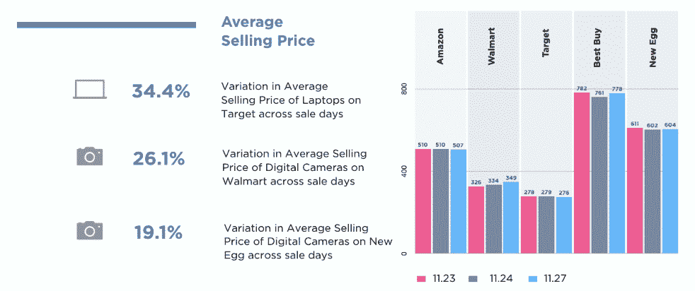
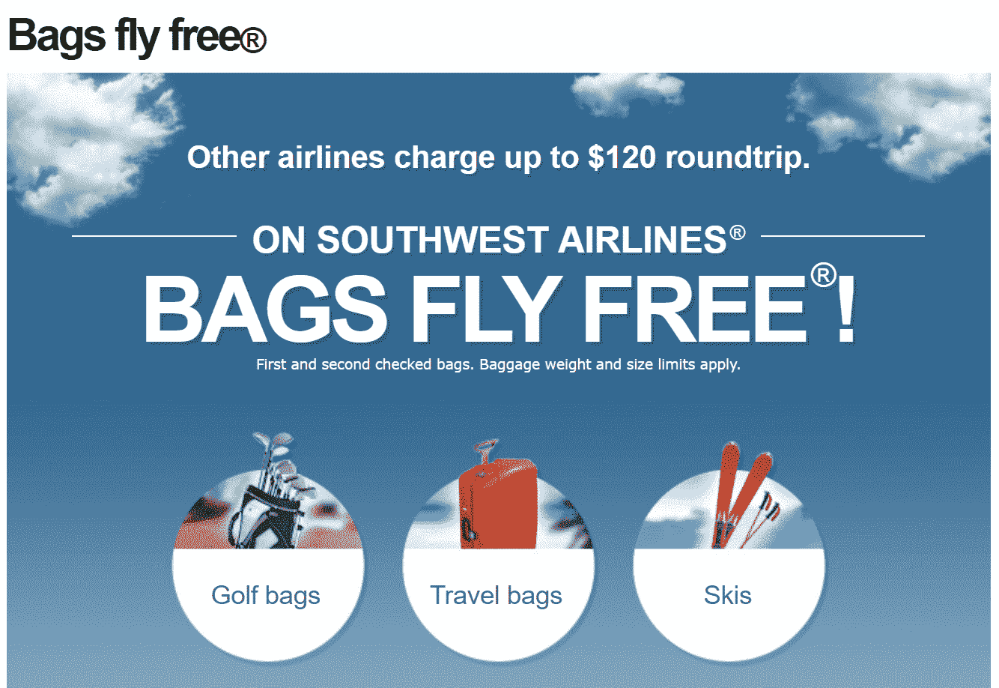
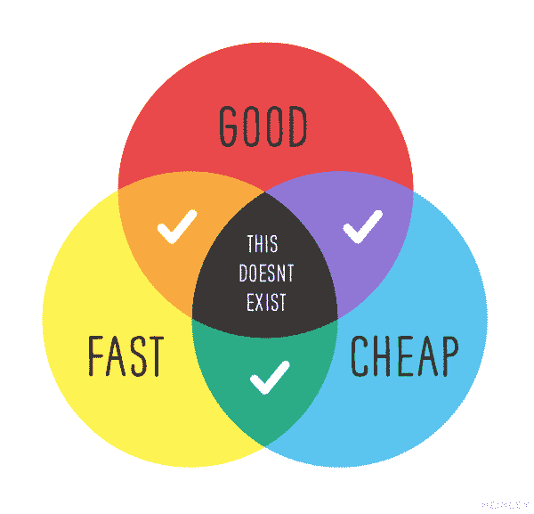
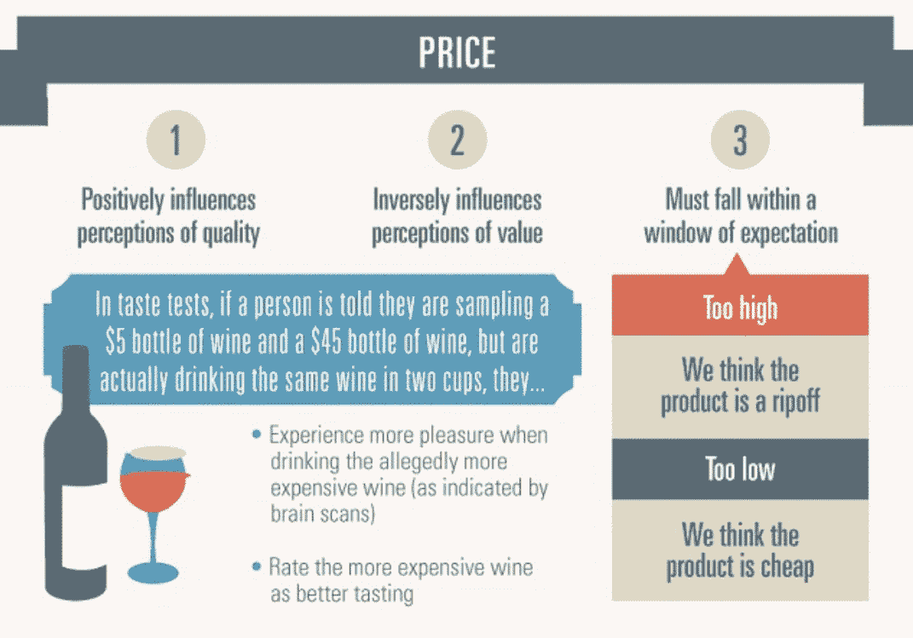
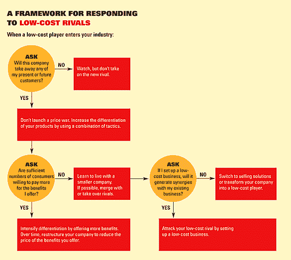
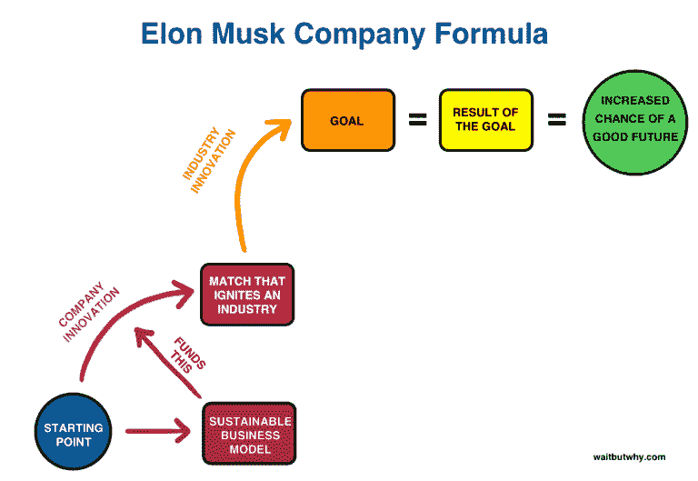
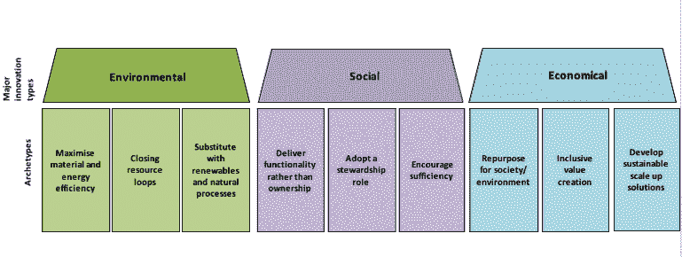
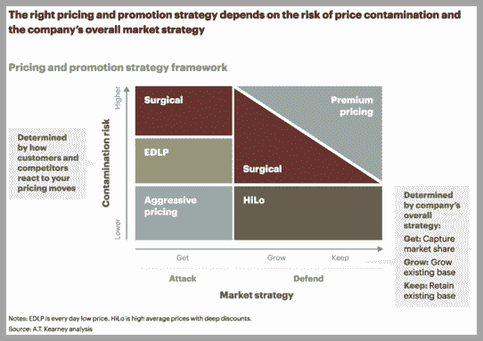

# 竞争到底如何伤害你的企业底线

> 原文：<https://kinsta.com/blog/race-to-the-bottom/>

我曾经见过我的一个朋友，他的生意还没走出第一年，就差点毁了。

这不是因为不计后果的支出、糟糕的营销或任何你可能想到的商业失败的常见原因。事实上，我认为他犯了一个在每个行业都很常见的错误。

想知道他做了什么吗？

他创造了一场竞争。或者换句话说，他开始了价格战。在他开始销售他的产品之前，他去调查了他所在地区的竞争对手的价格。他没有试图区分和提高价格(他的产品客观上更好)，而是认为明智的做法是降低价格，希望偷走客户。

但他最大的错误是，虽然他收费较低，但由于他需要的材料和劳动力的质量，他的成本也高于竞争对手。他开始时利润很低，最终意识到当生产推迟一个小时时，他就在赔钱。

接下来的一年，他不得不把自己从一个坑里挖出来，这个坑让他失去了一半的客户，还可能失去多年的盈利能力。

这个故事是一个非常激烈的例子，说明了逐底竞争是如何影响一个企业的，但我不认为这是什么异常现象。全世界的行业都在试图看看他们能把价格降到多低来削弱竞争，这伤害了所有人。听说过 [MoviePass](https://techcrunch.com/2018/05/08/moviepass-parent-drops-31-on-looming-cash-crunch/) 吗？

这就是为什么这种趋势需要停止。我想帮助你了解竞争到底只会损害你的业务的来龙去脉，即使短期内一切似乎都很好。为了让事情开始，我想充实这个想法，到底是什么样子的。

*   什么是逐底竞赛？
*   [负面#1:它扼杀创新](#kills-innovation)
*   [负面#2:表示你的品牌“便宜”](#cheap-brand)
*   消极 3:这会让你的未来处于危险之中

## 什么是逐底竞赛？

如果你喜欢照本宣科的定义，那么你会喜欢《金融时报》词汇中关于“逐底竞赛”的澄清:

> 需要在这里大声喊出来。Kinsta 太神奇了，我用它做我的个人网站。支持是迅速和杰出的，他们的服务器是 WordPress 最快的。
> 
> <footer class="wp-block-kinsta-client-quote__footer">
> 
> 
> 
> <cite class="wp-block-kinsta-client-quote__cite">Phillip Stemann</cite></footer>

[View plans](https://kinsta.com/plans/)

> 公司和国家试图通过削减工人的工资和生活水平来相互竞争，商品的生产转移到工资最低的地方，工人的权利最少的情况。

因此，从根本上来说，这是一种在不牺牲整体盈利能力的情况下降低价格的情况。但丑陋的事实是，在这种情况下，总有人被迫买单。

在许多情况下，公司不会牺牲质量，而是选择降低工资或工作条件，以更低的成本赚同样多的钱。

如果你想要一个现代的例子，只需要看看竞争异常激烈的电子商务行业就可以了。

截至去年，亚马逊产品的平均价格比其主要竞争对手低 11%左右。价格差异从 1%到高达 17%不等，这意味着有人在某个地方赔钱。

从表面上看，亚马逊似乎赢了。他们已经连续 11 个季度盈利，甚至在 2017 年假日季赚了 19 亿美元。

但是在过去的几个月里，一些非常严重的虐待工人事件被曝光，这表明亚马逊似乎在偷工减料。工人们报告说，他们不断受到监视，没有足够的时间上厕所，甚至因为压力而恐慌哮喘发作。

虽然亚马逊反驳了这些说法，但当你开始联系这些点时，很难将它们视为理想的商业模式。

这些趋势甚至已经开始影响主要零售商在其实体店中设定的价格。看看感恩节、黑色星期五和网络星期一的缩影中主要零售商的价格差异就知道了。

Average selling price (Image Source: [DataWeave](https://blog.dataweave.com/infographic-thanksgiving-vs-black-friday-vs-cyber-monday-the-electronics-price-war-heats-up-4c014f191fd2))

这个行业完全分散，即使在一年中收入最高的日子里，也很难感觉到消费者真正从这些主要零售商那里获得了价值。

但是电子商务和零售业并不是唯一发生价格战的地方。这也是一个困扰在线自由职业社区的问题。

像 Fiverr 这样的网站一度允许商家只花 5 美元就能买到原本要花费数百美元的产品。他们后来把平台改成了[，允许自由职业者收取更多的费用](https://blog.fiverr.com/level-systems-update-what-fiverr-sellers-need-to-know/)，但即使这样也遇到了不同的反应。

就连新兴的手机 app 行业也经历了一场逐底竞赛，也不过十几年的时间。

app store 开始的时候，你一次付费买了一个高质量的 app，它就永远是你的了。现在，你可以免费下载任何应用程序，然后向你出售持续更新或展示广告以获取收入。

但是，在这些价格战中，总有人要吃亏，在这种情况下，吃亏的是最终用户。

如果这个例子没有吓到你，我不知道什么会。在不到十年的时间里，一个全新的、创新的行业从上到下，尽可能不引人注目。如今，如果你想在一个应用上赚钱，你要么顺从，要么创新。

所有这些例子的关键是，在这些例子中，只有顶级公司，或“[大品牌](https://kinsta.com/blog/kinsta-kingpin-interview-with-kevin-ohashi/)”真正脱颖而出。他们是唯一能够通过这种方式生存下来的人，但这仍然是小企业尝试的一种做法。

当这种情况发生时，它会伤害你的底线，并在长期内产生一些严重的负面影响。我想看看其中的一些，向你展示如果你决定卷入一场恶性竞争，这场恶性竞争会有多糟糕。

[Jumping on the price war train 🚄 is a recipe for disaster when it comes to the longevity of your business.Click to Tweet](https://twitter.com/intent/tweet?url=https%3A%2F%2Fbit.ly%2F31FvjaX&via=kinsta&text=Jumping+on+the+price+war+train+%F0%9F%9A%84+is+a+recipe+for+disaster+when+it+comes+to+the+longevity+of+your+business.&hashtags=startups%2Csmallbusiness)

## 负面#1:它扼杀创新

首先也是最重要的一点，一场恶性竞争会扼杀你成为你所在领域下一个创新公司的希望和梦想。

当一家公司开始创新时，他们需要考虑很多因素。早在 2011 年，当《哈佛商业评论》公布了一份他们称为“关键成功因素”的九个要素的清单时，有些人感到惊讶。以下是他们的列表:

1.  创新的好理由
2.  一个集体的、崇高的未来目标
3.  每个人都认同的创新战略
4.  高级管理层的参与
5.  基于团队合作的决策支持热情的领导者
6.  一个有才华和创造力的团队
7.  对市场变革驱动因素采取开放的态度
8.  冒险的意愿，即使是荒谬的
9.  灵活的执行参数

你有没有注意到所有这些都缺少了什么？没有提到钱，利润，或任何金融方面的东西。有些人可能会对这一观点嗤之以鼻，但这里似乎表明的是，赚钱通常不是真正创新的一个因素。

当然，如果你有效地创新，你很可能会赚钱。看看[苹果](https://www.apple.com/)就知道了。他们开始制造电脑，但后来创新发生了，他们创造了我们所知的智能手机行业。现在，他们的净资产超过 9000 亿美元(T2)。

你观察的时间越长，通过积极环境进行创新的证据就越多。这里有一个分享的关于信用社如何在竞争激烈的银行业中创新的很好的例子。

Innovation (Image Source: [Ezassi](https://ezassi.com/credit-unions-innovate-using-innovation-software-infographic/))

同样，这个过程中很小一部分与赚钱有关。即便如此，它还是关注“可以在最短的时间内实现的想法或改进，并带来最大的回报。”我觉得这不像是削减员工福利。

让这幅图显得更加及时的是当前的银行业价格战，这场价格战甚至有可能削弱信用社创新者的努力。又一次，逐底竞争无处不在。

一项又一项的研究表明[环境是创新的关键](https://www.forbes.com/sites/stephaniedenning/2017/12/28/the-driver-of-innovation-environment-or-people/#681f72714ee0)，我们已经对目前进行价格战的公司所创造的环境进行了长时间的仔细观察。他们很烂。

你不能制造价格战，然后要求你的文化创新。你必须创造一个空间，让员工感到足够投入和安全，让*希望*创新。没有犯错的余地(可能会赔钱)，你的员工就会缺乏真正做出改变的动力。

## 注册订阅时事通讯

### 想知道我们是怎么让流量增长超过 1000%的吗？

加入 20，000 多名获得我们每周时事通讯和内部消息的人的行列吧！

[Subscribe Now](#newsletter)

因此，创新战略的明显赢家不是价格。是文化。成为同事和朋友的专家是更大的创新资源。

但是商业是关于利润的，所以我们还是要处理通过创新赚钱的问题。虽然文化似乎是明显的赢家，但也值得看看如何在保持收支平衡的同时不断创新。

Bridget McCrea 在 Ted 杂志发表的[文章中对这一过程做了最好的描述。她称之为“培养极端价值”在她的文章中，她采访了蒂姆·杨，一位来自 T2 州际电力供应公司的战略家。他用自己的话最好地表达了这一点:](https://tedmag.com/avoiding-the-race-to-the-bottom-on-price-part-ii/)

“分销商必须努力创新，创造价值，并成为做出重要购买决策的客户的‘首选来源’。”

他在这里说的是，如果公司想要创新并避免价格战，他们必须专注于创造一种非常有价值的产品或服务。如果你的价值足够好，利润和创新就会到来。

如果你想要一个很好的例子来说明这个原则，看看西南航空公司对航空业做了什么。他们的“行李免费飞”口号表面上看起来像是一场价格战，但老实说，这只是他们将成本巧妙地转移到其他领域。

Create a product with value (Image Source: [Southwest](https://www.southwest.com/html/air/bags-fly-free.html))

他们不提供餐食、飞行表演、头等舱座位，或者航空飞行中的任何其他物质享受。他们把你从 A 点带到 B 点，这就是他们卖的产品。它实际上是一个飞行的金属管，里面有免费的花生、苏打水和旅行袋。

可能会让你惊讶的是，即使除去这些舒适，西南航空公司多年来都不是最便宜的航空公司。尽管如此，他们还是保持了[连续 45 年的盈利。](http://investors.southwest.com/news-and-events/news-releases/2018/01-25-2018-113046083)

通过对他们所呈现的价值进行创新，西南航空实际上避免了一场巨大的价格战，并在他们的行业中创造了令人印象深刻的存在。如果专注于提供更低的价格，很难说这种方法是否会产生相同的结果。

## 负面#2:这意味着你的品牌“便宜”

价格战的另一个负面影响与你的整体品牌形象有关。你通过品牌努力创造的形象是一家公司盈利能力的终极[信号之一。这是你知道自己已经“成功”的方式](https://www.brandingmag.com/2017/05/16/the-power-of-brand-image-in-b2b/)

所以，当你问你的顾客他们会把什么词和你的品牌联系在一起时，你最不想听到的就是“便宜”

但是，如果低价是说服你的客户与你合作的唯一方法，那么很可能这就是他们与你交谈的原因。他们到处都是，因为你很便宜。

商业上的一个事实是，总会有人想要便宜的东西。做生意的一部分就是做交易，争取更好的价格，每个人都有自己的底线要考虑。但是你也有你的底线。

不过，便宜和优质通常并不总是相伴而行。不需要太多的搜索就可以找到流行的文氏图，它讨论了好、快、便宜的真正本质。

Brand image (Image Source: [InReach Solutions LLC](https://inreachsolutions.com/blog/2017/7/20/good-fast-cheap-the-modern-project-management-triangle))

简单来说，在一场逐底竞赛中，你不可能得到你想要的一切。如果你想生产廉价产品，你就必须在某个地方做出牺牲。当你开始这样妥协时，你的客户很快就会注意到质量的下降。

Struggling with downtime and WordPress problems? Kinsta is the hosting solution designed to save you time! [Check out our features](https://kinsta.com/features/)

大量的研究试图证明这一事实。国家经济研究局 2014 年发表的一项研究似乎显示了价格竞争和整体服务质量之间的因果关系。也就是说，当零售商店的价格具有竞争力时，商店的整体服务水平会从以前的水平下降。

另一项研究表明，价格会反过来影响消费者对价值的感知。如果价格太低，产品就便宜。如果价格太高，这种产品就是骗人的。

Price consumer perception (Image Source: [iamwire](http://www.iamwire.com/2017/02/perception-of-value/148933))

仅仅把价格压得尽可能低只会让你的品牌整体形象受损。所以低价永远不应该成为你和你的竞争对手之间的主要区别。这只会造成持久的形象问题。

相反，找到一种方法来应对你的低成本竞争对手，这有助于你长期向前推进。这个概念也不是新的。《哈佛商业评论》在 2006 年发布了一份有用的流程图，讨论你是否应该参与价格战。压倒性的答案是“不”

Responding to low-cost rivals (Image Source: [HBR](https://hbr.org/2006/12/strategies-to-fight-low-cost-rivals))

相反，专注于将你自己与你的竞争对手区分开来。这可能并不容易，但从来没有人声称竞争应该是容易的。

例如，你可以一直寻找方法[振兴你的营销](https://www.entrepreneur.com/article/302097)并接近新的客户群。如果所有这些都失败了，西蒙·西内克的[著名的黄金圈](https://www.ted.com/talks/simon_sinek_how_great_leaders_inspire_action)仍然是正确的。从一个足够好的为什么开始，成功就会随之而来。

你也可以专注于[寻找利基](https://tedmag.com/avoiding-the-race-to-the-bottom-on-price-part-i/)，然后创造具体的利润。T2 有很多指南可以带你找到合适的位置，帮助你的企业避免“廉价”的污名。

请记住，参与到竞争中只会让你显得廉价，最终失去你的生意。关注质量不仅会帮助你成功，还会提高你的客户忠诚度，让你在未来几年有更好的定位。

这也是我们没有 Kinsta 优惠券的原因之一。

## 消极 3:这会让你的未来处于危险之中

我的最后一点使我们兜了一圈。就像我的一个朋友，由于竞相杀价，他的生意几乎失败，你必须明白，当价格过低时，你公司的未来会发生什么。

如果你没有赚到足够的钱，你就不能投资未来，更不能保证未来。多年来，企业家们记录了大量的负面长期影响。

暂时的降价会很快变成永久的降价。利润率下降意味着增长的选择更少。当你试图提高价格时，很有可能只会赶走顾客。

看看宝洁公司和 T2 赌博公司目前面临的困境就知道了。由于降价和“冲突”，他们可能会在未来几个月面临预算削减。虽然前景不确定，但他们的处境已经足够危险，足以成为头条新闻，这绝不是一件好事。

看待这个问题的另一个有启发性的方法是通过从长远来看是什么让一个企业成功。克雷格·奥米斯顿最近分享了他对埃隆·马斯克公司公式的看法，你会注意到可持续发展是创造实现长期目标能力的一个要素。

Elon Musk Business Model (Image Source: [WaitButWhy](https://waitbutwhy.com/2017/04/neuralink.html#part4))

虽然这是一个相当基本的模型，但它很好地代表了您的企业应该如何处理定价问题。你应该把重点放在收入和客户增长上，而不是降价。

这应该是常识，但如果你想在这里呆上几个月以上，你必须是可持续的。如果种子资金会被浪费掉，那么你得到多少种子资金并不重要。在任何领域发展的唯一方法是创造一种可持续的商业模式，这种模式对所有人都有利。

Nine sustainable business model archetypes (Image Source: [Nancy Bocken](http://nancybocken.com/sustainable-business-model-adoption-among-sp-500-firms/))

竞相逐底不是一个可持续的解决方案。如果你以更低的价格出售你的产品，基础数学会告诉你，如果你继续这样做，你很快就会亏本出售。我从未听说过一个企业通过保持赤字而获得长期成功。

避免阻碍未来的恶性竞争的最好方法之一是坐下来制定一个商业战略。如果你成功了，你可以找到新的方法来鼓励购买者为优质产品或服务支付高价。

Market strategy (Image Source: [Omnia Retail](https://www.omniaretail.com/blog/how-to-avoid-a-race-to-the-bottom-with-dynamic-pricing))

请记住，最低价格并不总是最佳价格。即使你的主要优势是一些简单的东西，如更快的运输或更好的客户服务，但正是这些小事情将使你脱颖而出，并为你赢得好评。从长远来看，这些好评会带来更多的生意。

简单地匹配价格会适得其反。它削弱了你的生意，最终会让你陷入困境。当你的企业破产时，很难赚钱，所以帮你自己一个忙，永远不要到那个地步。

## 摘要

这不仅仅是一些牵强的末日预言。这是真正的谈话。除非你已经是一家价值数十亿美元的公司，否则参与一场逐底竞争无异于自杀。你不会赢的。

事实上，没有人会赢。你的客户将得到一个次优产品。你的员工的工作环境会受到影响。最终你会没钱的。

1.  价格战的事实很简单，但却很戏剧化。如果你想成为一个创新者，你不能打价格战。创新来自稳定的环境和愿意失败的心态。降低竞争对手的价格会让你失去平衡，扼杀创新。
2.  如果你想成为一个高端品牌，避免“廉价”的污名，你就不能打价格战。便宜、快速或好的问题是一个真实的问题，当价格不合适时，你的客户会注意到。世界上所有的营销都不会改变这一点。
3.  最后但同样重要的是，如果你想在商业上有一个未来，你不能打价格战。更低的价格意味着更低的利润，这种利润会在瞬间消失。**专注于创造可持续发展的商业模式**并实施合理的战略，而不是竞相杀价。

我们从一开始就专注于这些战略，这也是我们能够[将 Kinsta 的收入从 0 美元提升到 7 位数的原因](https://kinsta.com/blog/bootstrapping-startup/)。无论你的最终目标是什么，如果价格竞争力是你的第一要务，你肯定会失败。采纳你在这里看到的建议，开始实践吧。你的顾客、员工和未来的自己都会为此感谢你。

* * *

让你所有的[应用程序](https://kinsta.com/application-hosting/)、[数据库](https://kinsta.com/database-hosting/)和 [WordPress 网站](https://kinsta.com/wordpress-hosting/)在线并在一个屋檐下。我们功能丰富的高性能云平台包括:

*   在 MyKinsta 仪表盘中轻松设置和管理
*   24/7 专家支持
*   最好的谷歌云平台硬件和网络，由 Kubernetes 提供最大的可扩展性
*   面向速度和安全性的企业级 Cloudflare 集成
*   全球受众覆盖全球多达 35 个数据中心和 275 多个 pop

在第一个月使用托管的[应用程序或托管](https://kinsta.com/application-hosting/)的[数据库，您可以享受 20 美元的优惠，亲自测试一下。探索我们的](https://kinsta.com/database-hosting/)[计划](https://kinsta.com/plans/)或[与销售人员交谈](https://kinsta.com/contact-us/)以找到最适合您的方式。