# rank Math vs Yoast SEO:SEO 哪个好？(2022 版)

> 原文:# t0]https://kinta . com/blog/rank-math-vs-yoast/

试图在 Rank Math 和 Yoast SEO 之间做出选择，来处理你的 WordPress 站点上的搜索引擎优化。

如果你想优化 [WordPress SEO](https://kinsta.com/blog/wordpress-seo/) ，你绝对需要一个 SEO 插件。当谈到 [WordPress SEO 插件](https://kinsta.com/blog/best-seo-plugins-for-wordpress/)时，Yoast SEO 绝对是镇上最大的名字，而且几乎是从 WordPress 开始的。

然而，虽然 Yoast SEO 确实得到了大多数媒体的关注，但这并不意味着它是你在 WordPress 上进行 SEO 的唯一优质选择。还有其他几个流行的插件，包括 Rank Math，我们将与 Yoast SEO 进行比较。

与 Yoast SEO 相比，Rank Math 相对来说是一个新人，但它的受欢迎程度迅速增长，并拥有大量忠实的粉丝，其官方脸书集团就是证明。

那么，在 Rank Math 和 Yoast SEO 的比较中，你应该选择哪一个呢？这就是这篇文章的主题。

我们不一定要选出“赢家”和“输家”。相反，我们只是要强调每个插件做得好的地方以及它们之间的比较，这样你就可以选择最适合你的需求、知识水平和预算的选项。

我们将从更详细地介绍每个选项开始。然后，我们将在各种类别中对它们进行深入比较。

准备好了吗？让我们开始吧！

 [一场 SEO 大战的时间到了——Rank Math vs Yoast SEO。哪个插件更适合你的网站？💥所有的细节都在这里👇 点击推文](https://twitter.com/intent/tweet?url=https%3A%2F%2Fbit.ly%2F2L6Mk7w&via=kinsta&text=It%27s+time+for+an+SEO+battle+-+Rank+Math+vs+Yoast+SEO.+Which+plugin+is+better+for+your+site%3F+%F0%9F%92%A5+All+the+details+are+right+here+%F0%9F%91%87&hashtags=SEOTips%2CSearchEngineOptimization)

> Kinsta 把我宠坏了，所以我现在要求每个供应商都提供这样的服务。我们还试图通过我们的 SaaS 工具支持达到这一水平。
> 
> <footer class="wp-block-kinsta-client-quote__footer">
> 
> 
> 
> <cite class="wp-block-kinsta-client-quote__cite">Suganthan Mohanadasan from @Suganthanmn</cite></footer>

[View plans](https://kinsta.com/plans/)

## 排名数学 vs Yoast SEO 简介

首先，我们将快速介绍 Yoast SEO 和 Rank Math，为我们更实际的比较打下基础。

### Yoast SEO

最初于 2010 年推出的， [Yoast SEO](https://kinsta.com/blog/best-seo-plugins-for-wordpress/#yoast-seo) 是目前最流行的 WordPress SEO 插件。它是由 Joost de Valk 创建的，他在推出 Yoast SEO 之前是一名 SEO 顾问。

在许多方面，Yoast SEO 是一种“事实上的”WordPress SEO 插件。例如，如果你读了一篇关于 WordPress SEO 的教程，它可能会假设你正在使用 Yoast SEO。

除了是最受欢迎的 WordPress SEO 插件之外，它也是有史以来最受欢迎的 WordPress 插件之一，迄今为止有超过 2 . 88 亿次下载。

### 排名数学

[排名数学](https://kinsta.com/blog/best-seo-plugins-for-wordpress/#rank-math)则是 WordPress SEO 新贵。它于 2018 年底推出，尽管在此之前已经开发了多年。虽然 SEO 插件是新的，但 Rank Math 来自一个位于 [MyThemeShop](https://mythemeshop.com/) 的 WordPress 开发团队。

自推出以来，Rank Math 的受欢迎程度迅速增长，现在它无愧于第二大最受欢迎的 WordPress SEO 插件*的桂冠。在不到两年的时间里，它从几乎为零到活跃安装数超过 50 万，这对一个 [WordPress 插件](https://kinsta.com/knowledgebase/wordpress-plugin/)来说是令人印象深刻的。正如你将在下面看到的，它的成长很大程度上是建立在一个冗长的免费功能列表上的。

*从技术上来说，All In One SEO Pack 是 WordPress.org 活跃安装数排名第二的插件。然而，排名数学肯定有更多的势头，并有更高的新下载计数。

## 排名数学与 Yoast SEO 功能

现在，让我们进入 Rank Math 与 Yoast SEO 比较的实践部分，首先看看每个插件的特性。

就可用功能的数量而言，Rank Math 比 Yoast SEO 提供的更多，尤其是在比较免费版本时。这并不一定意味着它“更好”,因为这里的关键是你是否真的会使用那些额外的特性。

然而，如果你将使用这些额外的功能，这是一个数学排名的优势。

### 排名数学

**免费功能:**

*   **设置 SEO 标题/元描述**–创建自动应用于内容的模板，并为单个内容手动调整 SEO [标题](https://kinsta.com/blog/headline-analyzer/) / [描述](https://kinsta.com/blog/meta-description-wordpress/)。
*   **为脸书和推特设置社交媒体描述**–控制文本和[图片。](https://kinsta.com/blog/social-media-image-sizes/)
*   **焦点关键词分析(支持多个关键词)**–输入一个或多个焦点关键词，查看您的内容针对这些关键词的优化程度。
*   创建一个比默认的 [WordPress 网站地图](https://kinsta.com/blog/wordpress-sitemap/)功能允许的更加可定制的 XML 网站地图。
*   **结构化数据/模式**–建立站点范围内的[模式标记](https://kinsta.com/blog/schema-markup-wordpress/)，并控制单个内容的模式标记。
*   **搜索控制台**–[将你的网站连接到谷歌搜索控制台](https://kinsta.com/blog/google-search-console/)以自动提交网站地图并在你的 WordPress 仪表盘中查看搜索控制台分析。
*   **本地搜索引擎优化和知识图表**–为本地搜索引擎优化优化您的网站(只有一个免费位置)
*   **图片 SEO**——改进图片 SEO，自动设置 alt 和 title 标签。
*   **内部链接建议**–当你在编辑器中工作时，Rank Math 会建议你网站上的其他内容进行链接。
*   **面包屑**–添加[面包屑](https://kinsta.com/blog/wordpress-breadcrumbs/)到你的网站。
*   **链接计数器**–计算内容中的内部和外部链接的数量。
*   **重定向**——创建和管理 [301 和 302 重定向](https://kinsta.com/blog/wordpress-redirect/)。
*   **404 监控**——监控你的站点[的 404 错误](https://kinsta.com/blog/error-404-not-found/)。然后，您可以将常见的 404 错误重定向到站点上的其他页面。
*   **谷歌分析**–添加跟踪代码并查看信息。
*   **基础 woo commerce SEO**–设置产品/店铺名称/描述。

**高级功能:**

*   关键词排名跟踪——跟踪你的网站在过去 12 个月中的[搜索引擎](https://kinsta.com/blog/alternative-search-engines/)排名和关键词表现(非常独特)
*   谷歌趋势整合
*   谷歌视频搜索引擎优化网站地图
*   谷歌新闻搜索引擎优化网站地图
*   本地搜索引擎优化的多个位置
*   更多预定义的模式类型(20 多种)
*   Google AdSense 收入历史
*   自动为社交媒体图像添加水印

Rank Math 的一个好处是所有这些特性都是模块化的——所以你可以很容易地禁用任何你不打算使用的特性。

### Yoast SEO

Yoast SEO 在其免费版本中有一个更有限的功能列表，但 Yoast SEO 团队确实提供了多个专业插件，您可以使用它们来扩展核心功能。然而，正如我们上面提到的，你会看到 Yoast SEO 对 Rank Math 免费提供的几个功能收费，比如重定向管理器、多关键字分析和内部链接建议。

**基本特征:**

*   **设置 SEO 标题/元描述**–创建自动应用于内容的模板，并手动调整单个内容的 SEO 标题/描述。
*   **XML 站点地图**——创建一个比详细的 WordPress 功能允许的更加可定制的 [XML 站点地图](https://kinsta.com/blog/submit-website-to-search-engines/#how-do-i-submit-my-website-to-google)。
*   **焦点关键词分析(只有一个关键词)**–输入一个[焦点关键词](https://kinsta.com/blog/keyword-research/)，查看您的内容针对该关键词的优化程度。
*   ****全站点架构****–添加全站点架构标记。
*   **内容模式类型**–为个别内容设置自定义模式类型(您也可以设置站点范围的默认值)。
*   **搜索控制台**–使用搜索控制台验证您的网站。
*   **设置社交媒体描述**–控制脸书和推特的文字和图片。
*   **基本的 woo commerce SEO**-例如，为产品和商店页面设置标题/描述。
*   基石内容(Cornerstone content)–将重要页面标记为“基石”，以帮助优化它们并获得更多内部链接。
*   面包屑–将面包屑添加到您的网站。
*   **链接计数器**——统计你的内容中[内部链接的数量](https://kinsta.com/blog/google-sitelinks/#6-build-internal-links)。

**核心高级功能:**

*   **重定向管理器**–创建和管理 301 和 302 重定向。
*   **内部链接建议**–Yoast SEO 会建议您链接网站上的其他内容。
*   **内部链接块**–添加一个自动包含相关链接的块，而不是手动添加。
*   **多焦点关键词**–分析您内容中的多焦点关键词。
*   **相关关键短语**——根据来自 [SEMrush](https://kinsta.com/blog/website-traffic-analysis/#2-semrush) 的数据生成相关关键短语。

Yoast SEO 还为特定类型的 SEO 提供其他付费插件。这些给你的功能也大多只在高级版的 Rank Math 中可用，尽管 Rank Math 在其免费版中包含一些本地 SEO 功能:

*   **本地 SEO**–为本地企业/知识图表添加结构化数据，增强您的联系页面，并支持多个物理位置。
*   **视频搜索引擎优化**–将您的视频列在谷歌视频中，并添加其他视频搜索引擎优化增强功能。
*   新闻搜索引擎优化(News SEO)-为谷歌新闻优化你的网站，当你发布一篇文章时 ping 谷歌，创建一个 XML 新闻网站地图，等等。
*   **WooCommerce SEO(高级)**-获得更多 WooCommerce SEO 功能，如社交媒体图表信息、更简洁的 XML 网站地图等。

## 排名数学与 Yoast SEO 设置过程

Rank Math 和 Yoast SEO 都很好地为你提供了重要的设置。两者都非常用户友好。

总的来说，这个类别是一个掷地有声的东西，实际上只是个人偏好的问题。

### 排名数学

当您第一次启动 Rank Math 时，它会打开一个设置向导来帮助您配置重要的基本功能。你也可以选择链接你的免费数学帐户来解锁一些功能。你不需要*和*来使用这个插件，但是你需要连接一个免费账户来解锁所有的功能。

总的来说，该向导做得很好，为初级用户和高级用户提供了定制的体验:

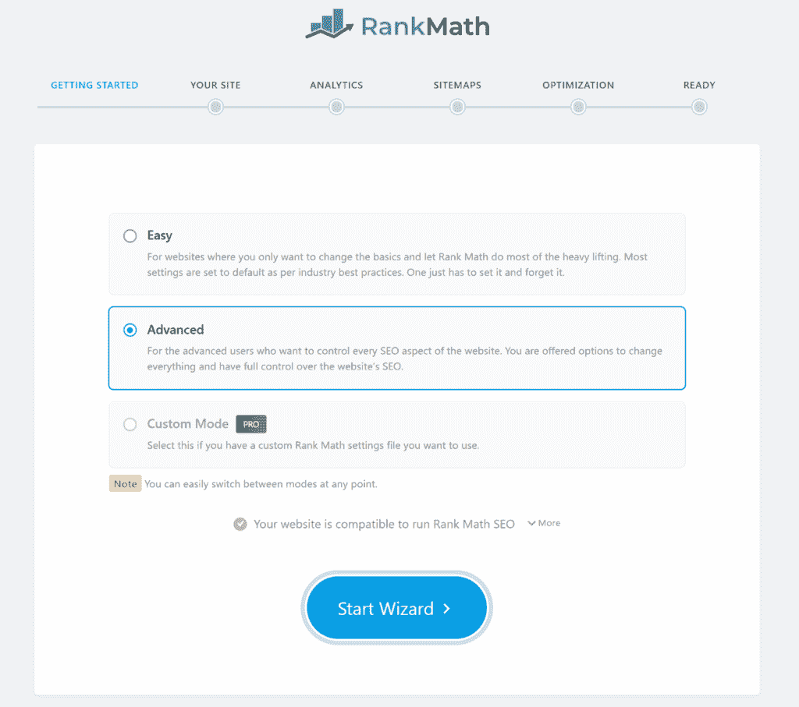

The Rank Math setup wizard

在设置向导中，您将配置:

*   基本模式信息
*   谷歌分析和谷歌搜索控制台集成，如果你想使用它们。
*   XML 站点地图。
*   其他基本设置，如是否索引空类别和标记档案。

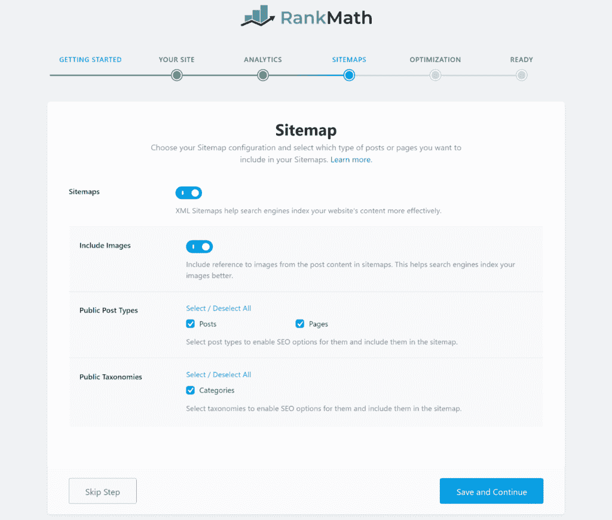

Using the setup wizard to configure features

完成设置向导后，您还可以选择设置高级选项，这将解锁一些附加步骤，例如:

*   角色管理器(控制哪些 WordPress 角色可以访问 Rank Math)。
*   404 错误监控。
*   重定向。
*   更详细的模式标记设置，例如为不同的帖子类型设置默认的模式类型。

完成设置向导后，它还会将您启动到模块管理器，该管理器列出了每一项功能，并允许您:

*   启用/禁用每个模块。
*   配置您已经启用的所有模块。

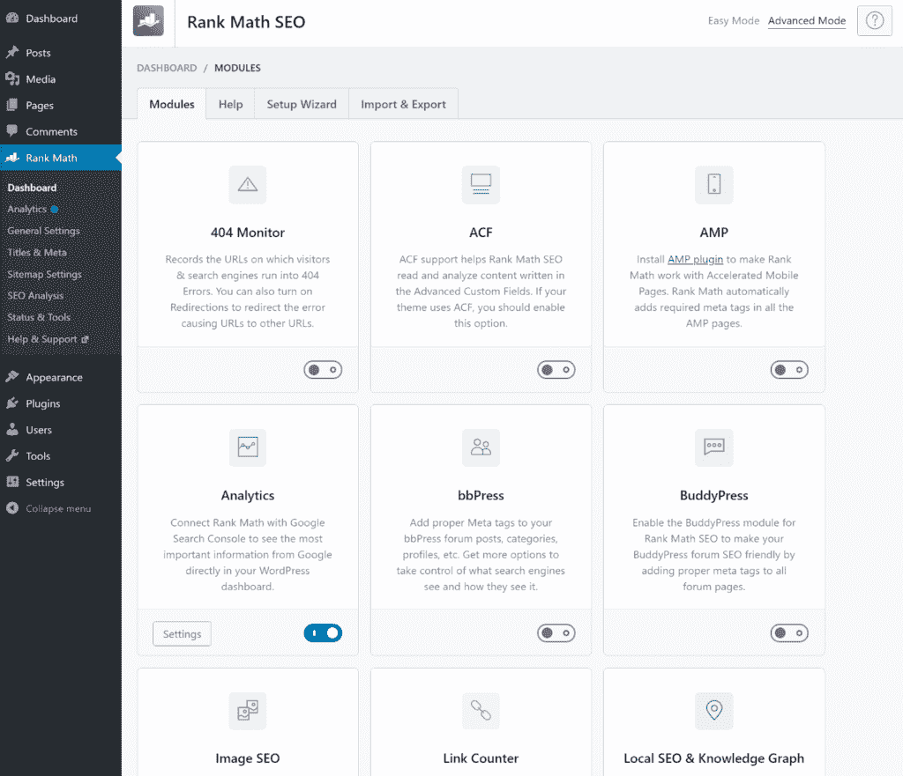

The modular feature managed in Rank Math

如果您处于**简易模式**，您将看不到所有模块。你需要启用**高级模式**来查看每一个模块。

### Yoast SEO

像 Rank Math 一样，Yoast SEO 包括一个配置向导来帮助你快速启动和运行，尽管你需要从 WordPress 工具栏启动它。

该向导还能很好地引导您完成所有重要的设置，例如:

*   基本站点范围架构数据
*   是否索引你的网站
*   SEO 标题模板

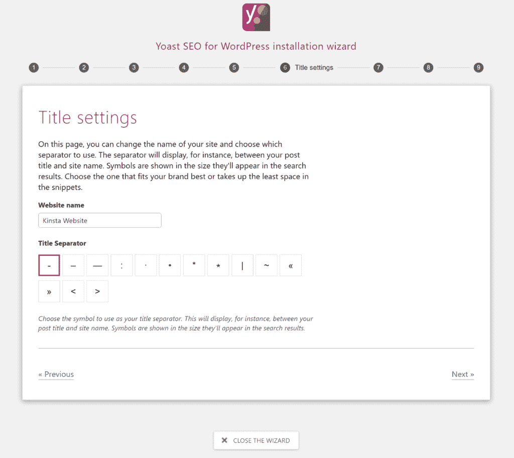

Yoast SEO 仪表板还包括一些提示/建议，并将标记您网站的任何潜在问题:

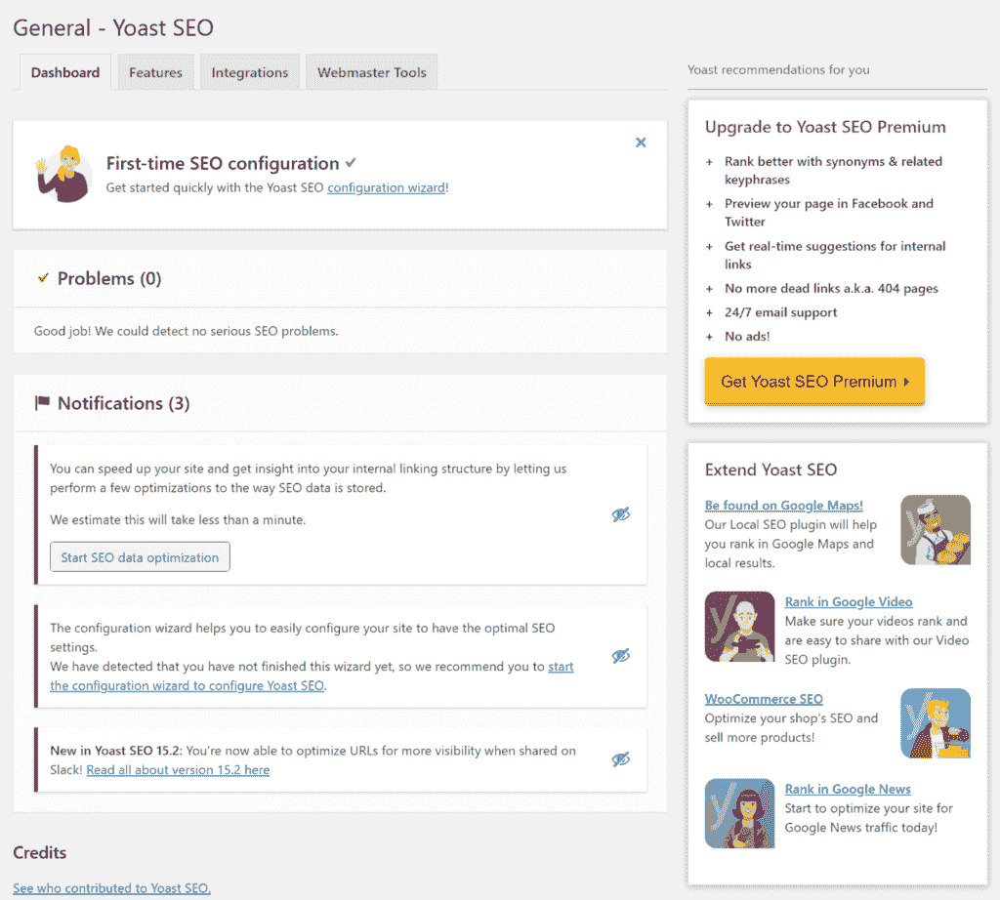

像 Rank Math 一样，Yoast SEO 也使用模块化方法，让您禁用不想使用的功能。您可以在**功能**选项卡中查看功能，并使用开关关闭特定功能:

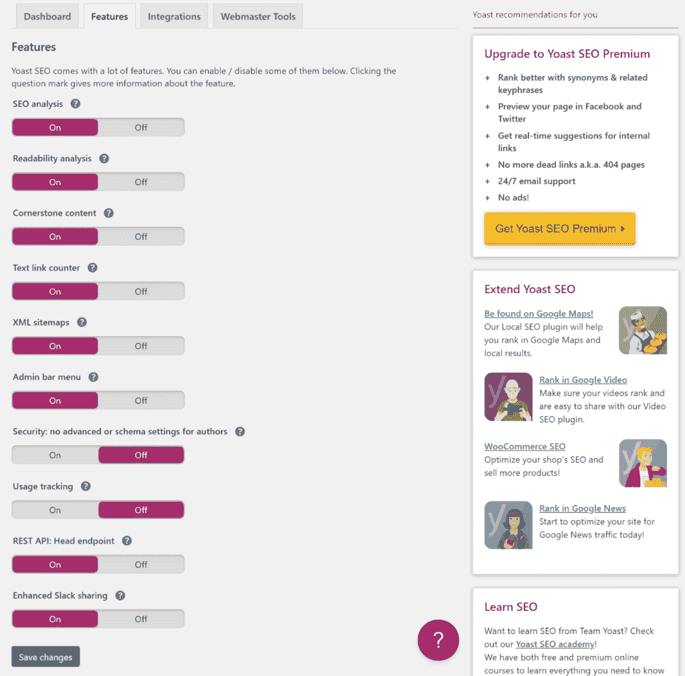

Managing Yoast SEO’s features

## 排名数学与 Yoast SEO 用户界面

当我们比较上面的设置过程时，您已经看到了一些用户界面。接下来，我们将看看日常操作的用户界面是什么样的，例如为单个帖子或页面设置优化。

除此之外，我们还将展示一些最独特的界面部分。

### 排名数学

如果你使用的是 WordPress 块编辑器( [Gutenberg](https://kinsta.com/blog/gutenberg-wordpress-editor/) )，Rank Math 完全集成到块编辑器中。也就是说，您不会使用经典编辑器中的“元框”方法。

你可以通过点击工具栏上的图标来打开等级数学设置。“设置”边栏分为四个标签:

*   **常规**–编辑片段细节，设置焦点关键词，查看分析。
*   **高级**–配置机器人元信息，如添加 noindex 标签。
*   **模式**–设置模式标记/结构化数据。
*   **社交**–为脸书和 Twitter 设置社交图片信息。

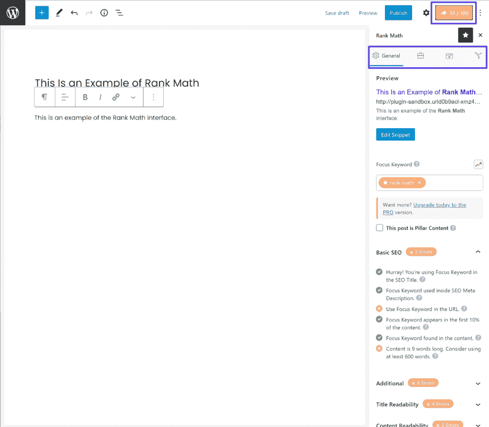

The Rank Math interface in the block editor

Rank Math 的另一个独特之处是它的**分析**界面。根据您使用的是免费版还是专业版，您将能够跟踪:

*   搜索控制台报告(例如，搜索印象和关键字位置)。免费。
*   [关键词排名](https://kinsta.com/blog/decline-seo-rankings/)/表现。已支付。
*   来自谷歌分析的流量统计。已支付。排名数学也将匹配这些内容的搜索引擎优化分数。

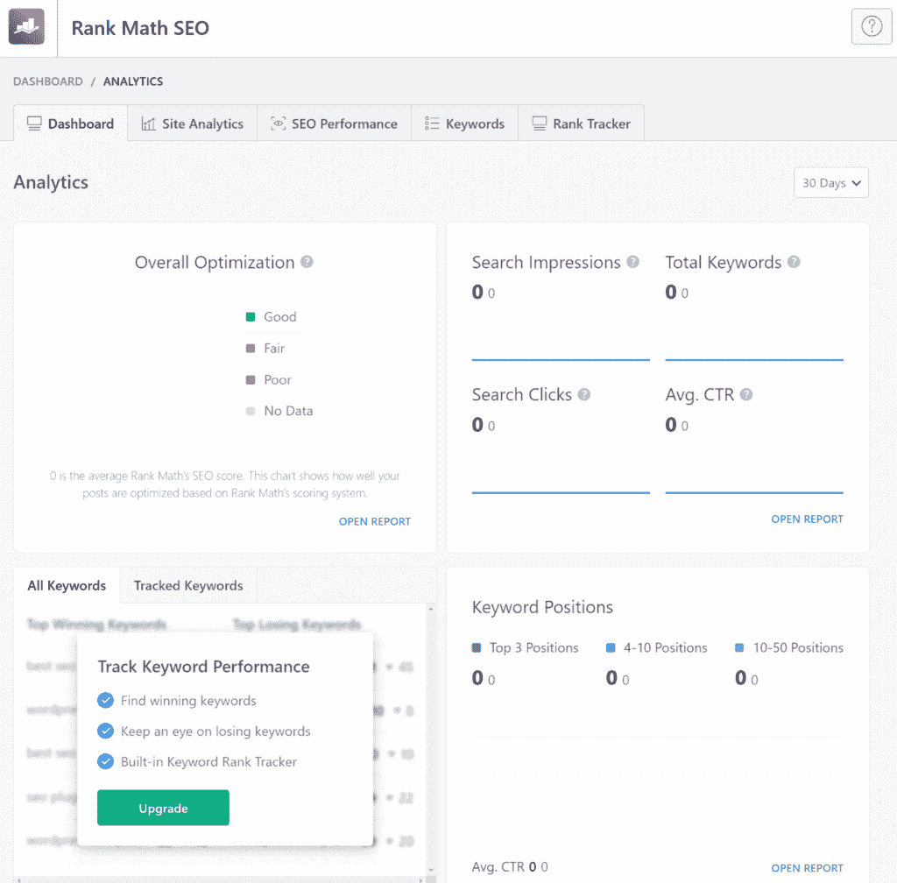

## 注册订阅时事通讯

### 想知道我们是怎么让流量增长超过 1000%的吗？

加入 20，000 多名获得我们每周时事通讯和内部消息的人的行列吧！

[Subscribe Now](#newsletter)

### Yoast SEO

Yoast SEO 为您提供了两种方式来设置您的 SEO 信息，同时在编辑器中处理单个内容:

1.  编辑器下面有一个元框，它同时出现在块编辑器和[经典编辑器](https://kinsta.com/blog/disable-gutenberg-wordpress-editor/)中。这是配置 Yoast SEO 的“老”方法。
2.  如果您使用的是块编辑器，您将在编辑器侧边栏中获得一个新的 Yoast SEO 选项。

您可以选择适合您的方法，如果您喜欢元框方法，这很好(因为 Rank Math 不会在块编辑器中提供元框)。

如果使用块编辑器中的侧栏，您将可以访问一列中的所有选项:

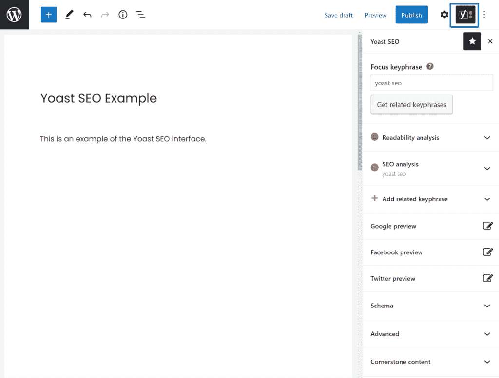

The Yoast SEO sidebar interface

您可以展开每个部分以查看更多信息。例如，如果您启用了模式标记设置，您可以从**模式**部分设置单个内容的模式类型。

您也可以单击“预览”选项，在弹出窗口中查看您的片段信息:

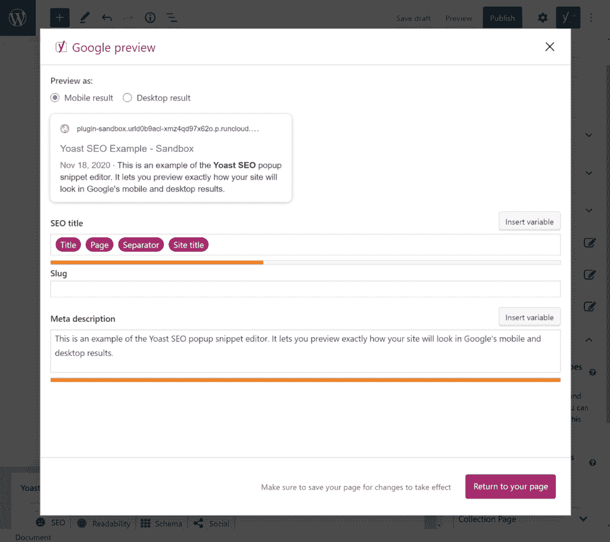

The Yoast SEO snippet editor

另一个选项是使用元框，它出现在编辑器下方，将其设置分为四列:

*   **SEO**–设置标题/描述，查看关键词分析，控制 robots 标签和规范链接等高级设置。
*   **可读性**–查看可读性分析提示。
*   **模式**–为这段内容选择一种模式类型。
*   **社交**–为脸书和推特建立公开的图表信息。

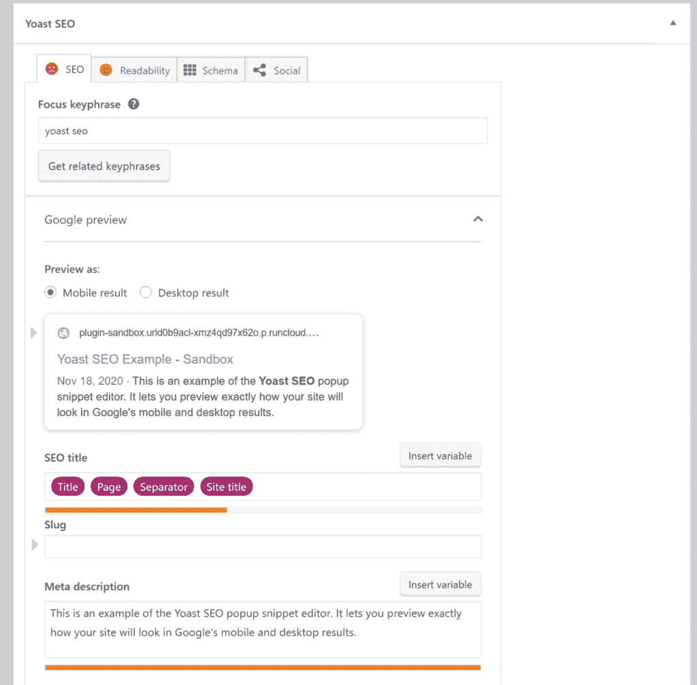

The Yoast SEO meta box

## 排名数学 vs . Yoast SEO—关键词分析

当你在[创建内容](https://kinsta.com/learn/content-marketing/)时，Rank Math 和 Yoast SEO 都支持关键词分析。也就是说，你可以添加你的目标关键词，插件会分析你的内容，告诉你它的优化程度，以及你是否需要做任何改变。

这是另一个部分，取决于你的个人偏好和你喜欢的界面/方法。然而，排名数学的一个优点是，它让你免费分析多个关键词。使用 Yoast SEO 的免费版本，您只能分析单个关键字(尽管高级版本允许多个关键字分析)。

### 排名数学

即使是免费版，Rank Math 也可以让你一次分析多达五个焦点关键词。你所要做的就是输入你想要的关键词，然后给 Math will 排名:

1.  给你打个 0-100 分。还有一些颜色编码。如果你得分在 80 分以上，你会得到“绿色”，这很好。
2.  列出具体的建议，以及你是否遇到过。比如你的焦点关键词在 SEO 标题里吗？你在内容里用了几次？

Rank Math 的建议列表包括页面搜索引擎优化以及其他因素，如标题/内容可读性:

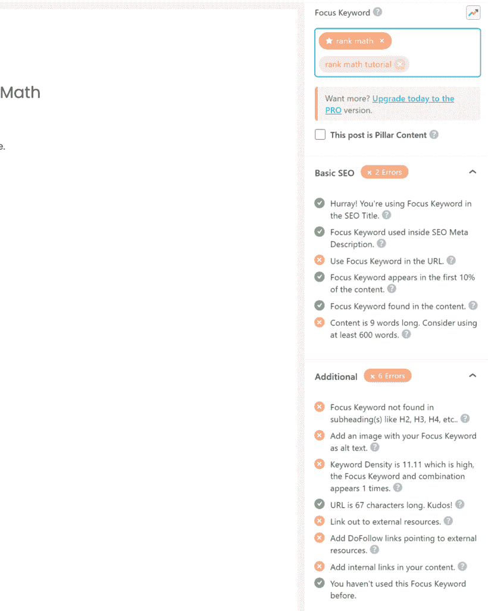

您可以通过单击列表中的关键字来切换不同的关键字。例如，如果您选择了一个不同的焦点关键字，那么分析将会改变为关注该特定关键字。

### Yoast SEO

在 WordPress.org 的免费版本中，Yoast SEO 只允许你为每一条内容分析一个关键词。然而，如果你升级到高级版本，你将能够分析多个关键词。

同样，正如我们在用户界面部分向您展示的那样，您可以在块编辑器的侧边栏或任一编辑器下面的元框中访问分析提示。

这种分析的工作原理与排名数学非常相似——你输入你的关键词，然后 Yoast SEO 会给你一个分数，还会将你的内容与它的具体建议列表进行比较。

需要一流的，快速，安全的新网站托管？Kinsta 提供超快的服务器和来自 WordPress 专家的 24/7 世界级支持。[查看我们的计划](https://kinsta.com/plans/?in-article-cta)

不过，Yoast SEO 的得分没有那么具体。没有数字评级，只有三个选项:

*   绿色(好)
*   黄色(正常)
*   红色(坏)

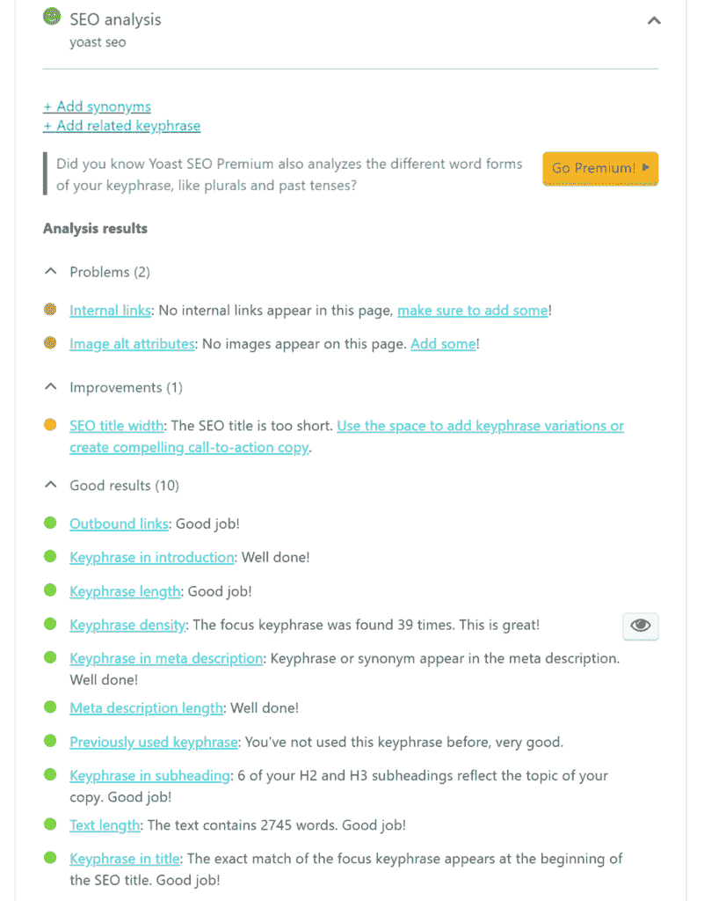

The Yoast SEO keyword analysis

Yoast SEO 还将其可读性分析分离到自己的评分中，也使用相同的评分系统。可读性分析可能有点古怪，因为分数权重有时感觉是任意的。

例如，只需改变内容中的一个字母，就可以从红色跳到绿色。一般来说，比起你的实际分数，你更应该关注具体的可读性提示。

The Yoast SEO readability analysis

## 排名数学与 Yoast SEO 定价

在 WordPress.org，Rank Math 和 Yoast SEO 都是免费的。然后，两家开发商还销售具有更多功能的高级版本。

对于 Rank Math 来说，这是一个很大的变化，因为在很长一段时间里，它只提供免费版本。然而，开发者在 2020 年 11 月推出了该插件的 Pro 版本。它增加了新功能，并且不影响任何已经免费提供的现有功能。

总体而言，Rank Math 的 premium 版本比 Yoast SEO 更实惠，原因有三:

*   Rank Math 的顶级价格低于 Yoast SEO(尽管这可能会改变)。
*   Rank Math 的 premium 计划支持无限制的网站，而 Yoast SEO 不提供无限制的许可证。
*   Rank Math 只有一个包含所有功能的高级计划，而 Yoast SEO 有多个高级扩展。例如，如果你想增加本地搜索引擎优化支持，那就需要单独购买。

### 排名数学

目前，Rank Math [为其高级版](https://rankmath.com/pricing/)提供了两种方案:

*   **Pro**——59 美元——在无限的个人网站上使用它，并跟踪多达 1000 个关键词。
*   **商务**——199 美元——在无限制的**个人和客户网站**上使用，跟踪多达 20，000 个关键词。

这些价格被标记为特殊的“发布优惠”。如果 Rank Math 开始收取全部标价，您将支付:

*   **Pro**–129 美元
*   **商务**——429 美元

很难判断 Rank Math 是否真的会在未来收取这些价格，或者这是否会成为一种常青树折扣策略，以增加紧迫性。

### Yoast SEO

Yoast SEO 有两种高级服务。

首先，有一个核心高级插件[，它可以让你访问多关键字分析、内部链接建议等功能。核心高级服务在单个站点使用的费用**为 99 美元/年**–您还可以获得多站点许可折扣:](https://yoast.com/wordpress/plugins/seo/)

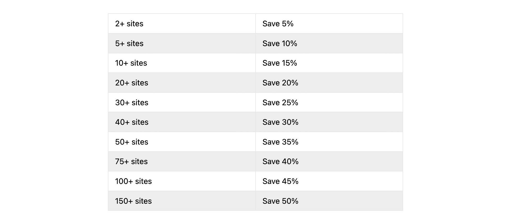

Yoast SEO site usage discounts

此外，还有四种针对特定类型 SEO 的高级扩展:

1.  WordPress 的视频搜索引擎优化——单个网站 79 美元/年起。
2.  WordPress 的本地搜索引擎优化(SEO)——单个网站 79 美元/年起。
3.  WordPress 的新闻搜索引擎优化——单个网站每年 79 美元起。
4.  Yoast woo commerce SEO-单个网站 79 美元/年起。

Yoast 还允许你购买全部 5 个插件，每年总共 229 美元。

## Math 与 Yoast 排名—常见问题

最后，让我们回顾一下比较后您可能还会遇到的一些常见问题。

### 哪个 WordPress 插件提供了更多的功能？

总的来说，Rank Math 比 Yoast SEO 拥有更多的功能，尤其是在比较免费版本的时候。

### 哪个插件更受欢迎？

Yoast SEO 更受欢迎——事实上，它是有史以来最受欢迎的插件之一。然而，它也比排名数学存在得更久。鉴于排名数学还很年轻，它还是很受欢迎的。

据 WordPress.org 称，Yoast SEO [在**500 多万个网站**上活跃](https://wordpress.org/plugins/wordpress-seo/advanced/)(这是 WordPress.org 的最高称号——很可能比这多得多)，而 Rank Math [在 60 多万个网站上活跃](https://wordpress.org/plugins/seo-by-rank-math/advanced/)。

### 哪个插件评论比较好？

Yoast SEO 和 Rank Math 在 WordPress.org 都有很好的评价。事实上，它们都被评为 4.9 分(满分 5 分)，尽管 Yoast SEO 的评论基数要大得多:

*   **Yoast SEO**–超过 27，284 条评论的 4.9 星评价。
*   **对超过【2,064 条评论进行数学排名**–4.9 星评价。

### Rank Math 安全吗？

由于 Rank Math 是一个较新的插件，而 Yoast SEO 已经存在多年，一些人担心 Rank Math 的安全性。

放心吧！Rank Math 仍然来自于一个成熟的 WordPress 开发团队(MyThemeShop ),它在上市的时候也建立了良好的声誉。

2000 多人在 WordPress.org 给了它 4.9 星的评价，他们没有错。

### Rank Math 比 Yoast SEO 好吗？

嗯，这是一个非常主观的问题，也是我们在这篇文章中试图探讨的问题。Rank Math 确实比 Yoast SEO 提供了更多的功能，尤其是当你谈论免费版本的时候。

然而，这并不一定意味着它对你的网站更好——它真的只是取决于你是否认为你真的会使用这些功能，以及你有多重视在 [Yoast SEO](https://kinsta.com/blog/yoast-seo/) 中的“更成熟”选项。

[试图为你的网站找到合适的 SEO 插件？🔍不要再看了！这篇对比文章分解了你需要知道的关于两个最流行的 SEO 插件的一切...](https://twitter.com/intent/tweet?url=https%3A%2F%2Fbit.ly%2F2L6Mk7w&via=kinsta&text=Trying+to+find+the+right+SEO+plugin+for+your+site%3F+%F0%9F%94%8D++Look+no+further%21+This+comparison+post+breaks+down+everything+you+need+to+know+about+two+of+the+most+popular+SEO+plugins+out+there...&hashtags=SEO%2CWordPressPlugins)

## 摘要

在你的排名 Math vs Yoast SEO quest 中，很明显两者都是高质量的 SEO 插件。数字和评论不会说谎。基本上，选择任何一个插件都不会犯“错误”。更多的是挑选最能帮助你实现你的 [SEO 目标](https://kinsta.com/blog/wordpress-seo/)的插件。

总的来说，Rank Math 当然在免费版中给了你更多的特性。例如，您将获得对多个关键字、404 检测、重定向管理器、本地 SEO 功能、内部链接建议等的分析。这些都是 Yoast SEO 收费或不提供的东西。

如果你认为你会使用这些功能，那么也许排名数学是适合你的。然而，如果你是那种仅仅使用你的 SEO 插件来设置一些 SEO 标题/描述，并可能针对一个关键词进行优化的人，你并没有从这些特性中获得太多额外的价值。

Rank Math 的好处在于它是模块化的，所以你可以禁用任何你不想要的特性以避免臃肿(Yoast SEO 也是如此)。

总而言之:

*   如果你想要最多的功能，Rank Math 现在是领先的，尤其是在比较免费版本的时候。
*   如果你不打算利用这些额外的功能，你想要一些东西来控制你的 SEO 标题/描述和其他基本设置，你还不如根据你喜欢的界面来选择。或者，如果你看重 [Yoast SEO 的](https://yoast.com/wordpress/plugins/seo/)长期业绩记录，你可能想选择“既定选项”——拥有十年的业绩记录绝对有优势。

最后，如果你想知道我们在 Kinsta 使用哪一个，我们目前正在使用 Yoast SEO 来优化你现在正在阅读的帖子(和其他任何东西)。如果你想加入我们，你可以查看我们关于如何使用 Yoast SEO 的完整指南。

在比较 Rank Math 和 Yoast SEO 时，你还有其他问题或想法吗？你都试过了吗？如果是，你更喜欢哪一个？请在评论中告诉我们！

* * *

让你所有的[应用程序](https://kinsta.com/application-hosting/)、[数据库](https://kinsta.com/database-hosting/)和 [WordPress 网站](https://kinsta.com/wordpress-hosting/)在线并在一个屋檐下。我们功能丰富的高性能云平台包括:

*   在 MyKinsta 仪表盘中轻松设置和管理
*   24/7 专家支持
*   最好的谷歌云平台硬件和网络，由 Kubernetes 提供最大的可扩展性
*   面向速度和安全性的企业级 Cloudflare 集成
*   全球受众覆盖全球多达 35 个数据中心和 275 多个 pop

在第一个月使用托管的[应用程序或托管](https://kinsta.com/application-hosting/)的[数据库，您可以享受 20 美元的优惠，亲自测试一下。探索我们的](https://kinsta.com/database-hosting/)[计划](https://kinsta.com/plans/)或[与销售人员交谈](https://kinsta.com/contact-us/)以找到最适合您的方式。