# 关于如何减少 DNS 查找并提高其速度的 8 个技巧

> 原文：<https://kinsta.com/blog/reduce-dns-lookups/>

谈到 WordPress，你可以做很多不同的优化，有些比其他的更重要。一个经常被忽视的因素是与 DNS 相关的查找时间，以及它对你的站点有多大的影响。就像 [TTFB](https://kinsta.com/blog/ttfb/) 和[网络延迟](https://kinsta.com/blog/network-latency/)一样，当计算你的总页面加载时间时，这是一个重要的难题。所以今天我们将深入探讨一些关于**如何减少 DNS 查询并加速它们的建议**，为什么你应该这样做，以及它如何在你的 WordPress 站点的性能中发挥作用。

## 什么是 DNS 查找？

为了向您展示什么是 DNS 查找，您需要首先了解 DNS 是如何工作的。DNS(域名系统)本质上是互联网的主干。解释 DNS 如何工作的一个常见参考是把它想象成万维网的**电话簿。你访问的每个网站和域名都被映射到一个 [IP 地址](https://kinsta.com/blog/dedicated-ip-address/)。**

当您在地址栏中键入 Google.com 时，您的 ISP 会执行 DNS 查询，请求与该域名相关联的[域名服务器](https://kinsta.com/knowledgebase/what-is-a-nameserver/)。然后，到 IP 地址的映射由服务器在后台完成，这样您就可以使用域名来访问它。如果没有域名系统，你将不得不输入类似 216.58.217.206 这样的东西来进入谷歌。那岂不是很有趣！


How DNS works


当你浏览一个网站时，在下载任何东西之前，必须对每个域名进行 DNS 查询。然而，不需要在每个资源上执行 DNS 查找。例如，假设我们有以下 [HTTP 请求](https://kinsta.com/blog/make-fewer-http-requests/):

```
https://wpdev.ink/
https://js.stripe.com/v3/
https://cdn.wpdev.ink/wp-content/themes/twentyseventeen/asseimg/header.jpg
https://cdn.wpdev.ink/wp-content/themes/twentyseventeen/assets/js/skip-link-focus-fix.js
https://cdn.wpdev.ink/wp-content/themes/twentyseventeen/assets/js/global.js
https://cdn.wpdev.ink/wp-content/themes/twentyseventeen/assets/js/jquery.scrollTo.js
https://cdn.wpdev.ink/fonts/open-sans-v13-latin-regular.woff2
https://cdn.wpdev.ink/fonts/open-sans-v13-latin-700.woff2
```

尽管上面总共有八个 HTTP 请求，但是总共只有三个唯一的域。这意味着有三次 DNS 查找。


> 需要在这里大声喊出来。Kinsta 太神奇了，我用它做我的个人网站。支持是迅速和杰出的，他们的服务器是 WordPress 最快的。
> 
> <footer class="wp-block-kinsta-client-quote__footer">
> 
> 
> 
> <cite class="wp-block-kinsta-client-quote__cite">Phillip Stemann</cite></footer>

[View plans](https://kinsta.com/plans/)

```
https://wpdev.ink
https://js.stripe.com
https://cdn.wpdev.ink
```

不先访问 [域名服务器](https://kinsta.com/knowledgebase/what-is-dns/)，就无法访问网站。如果出现 DNS 问题，您可能会面临错误“ [DNS 服务器没有响应](https://kinsta.com/knowledgebase/dns-server-not-responding/)”，这表明负责将[主机名](https://kinsta.com/knowledgebase/mysql-hostname/)转换为 IP 地址的分散式命名系统没有响应。

### Pingdom 中的 DNS 查找

下面是上面的请求是如何出现在 [Pingdom](https://kinsta.com/blog/pingdom-speed-test/) 网站速度测试工具中的。DNS 以粉色条表示，以毫秒为单位。当你第一次通过 Pingdom 运行你的网站时，它会执行一次新的查找，它必须查询每个域的 DNS 记录以[获得 IP 信息](https://kinsta.com/tools/what-is-my-ip/what-is-my-ip/)。注意，它不需要在 cdn.wpdev.ink 域上多次查询 DNS。这就是 DNS 的工作方式。它只需要查询一个域一次。所以下面总共有 **8 个请求，但是只有 3 个 DNS 查找。**

这种 DNS 查找会导致额外的加载时间，因为在 DNS 查找完成之前不会加载任何内容。请注意，在一个 CDN URL 上的 DNS 查找花费了 300 多毫秒，这还不包括在 wpdev.ink 或 js.stripe.com 上的查找。所以你可以看到这是如何随着时间的推移而增加的。

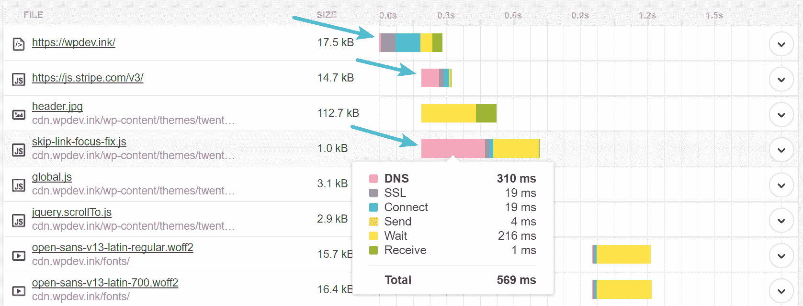

DNS lookups in Pingdom


当你多次通过 Pingdom 运行你的网站时，它**会缓存 DNS** ，因为它已经知道了 IP 信息，不需要再次执行查找。这就是为什么你的网站在多次运行 Pingdom 后会显示得更快的一个原因。正如您在下面的屏幕中看到的，在第二次测试中，CDN URL 上的 DNS 查找时间是 0 毫秒。这是许多人误解的一个方面。但是不要担心，我们将在下面深入研究 DNS 缓存。

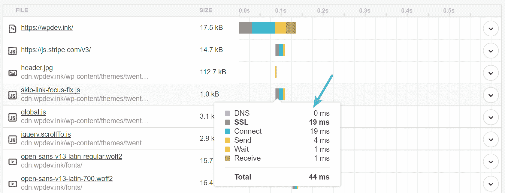

DNS cache in Pingdom


### GTmetrix 中的 DNS 查找

每个网站速度测试工具的工作原理略有不同，但几乎所有的工具都会为您计算 DNS 查找时间。下面是相同的请求如何出现在 [GTmetrix](https://kinsta.com/blog/gtmetrix-speed-test/) 中。DNS 用绿条表示，单位为毫秒。

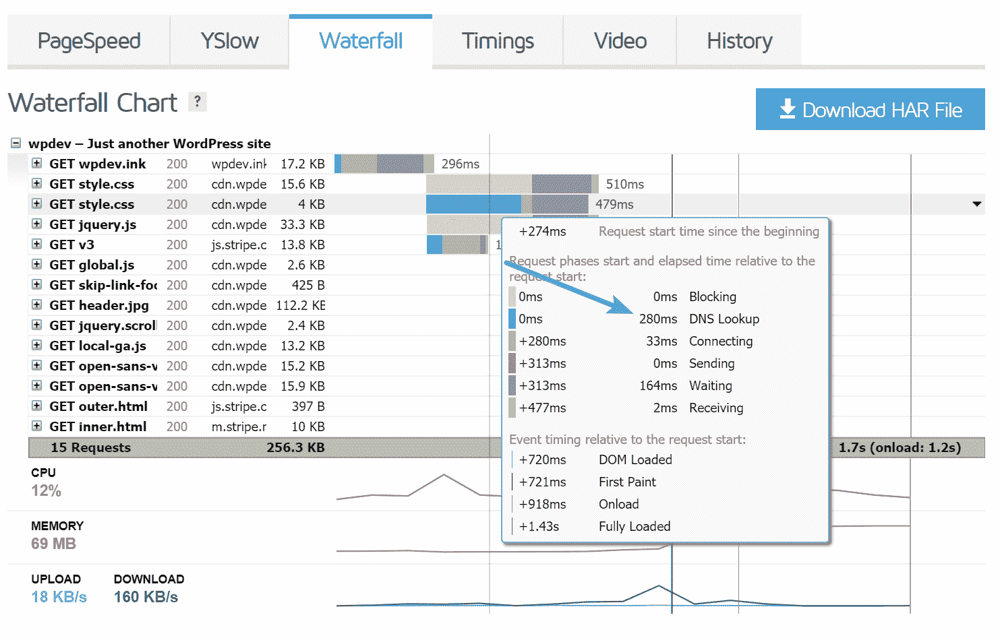

DNS lookups in GTmetrix


### 网页测试中的 DNS 查找

这里有一个使用 [WebPageTest](https://www.webpagetest.org/) 的例子。他们实际上对您的请求细节有一个快速概览，您可以点击“DNS 查找”栏，并按最高响应时间对其进行排序。作为一个例子，我们通过该工具运行 usatoday.com，仅 **DNS 查找时间就花了 6.5 秒！**

这是相当普遍的许多新闻网站没有高度优化，由于他们所有的外部请求。但是如你所见，他们网站的 DNS 查找时间可能比大多数人的整个网站都要长。这就是为什么 **DNS 对**很重要。

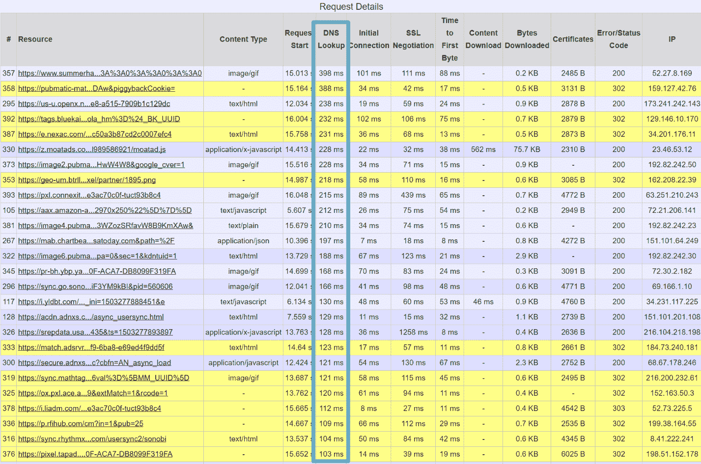

Long DNS lookup times (webpagetest)


## 如何减少和加快 DNS 查找

现在你对 DNS 的工作原理有了更多的了解，我们将向你展示一些建议，关于如何在你的 WordPress 站点上减少 DNS 查询并提高它们的速度。在一些[网站速度测试工具](https://kinsta.com/blog/website-speed-test/)中，这有时也被称为“最小化 DNS 查找”

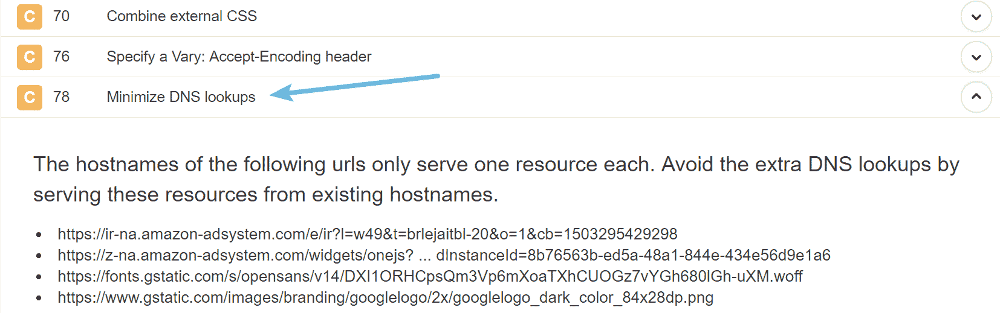

Minimize DNS lookups in Pingdom


### 提示 1-使用快速 DNS 提供商

理解这一点很重要，就像主机一样，有更快和更慢的 DNS 提供商。这应该是您首先要解决的问题之一。

通常情况下，GoDaddy 和 Namecheap 等[域名注册商提供的免费 DNS 非常慢。DNS 提供商通常就像一个](https://kinsta.com/blog/best-domain-registrar/) [CDN](https://kinsta.com/blog/wordpress-cdn/) 一样工作，他们在全球有多个 pop。像 Amazon、Cloudflare、Dyn 和 DNS Made Easy 这样的大型 DNS 提供商都有专门为低延迟环境中的 DNS 设计的大型基础架构。

我们运行了一些测试来比较一些流行的 DNS 提供商的速度。我们使用了 KeyCDN 的[性能工具](https://tools.keycdn.com/performance)以及 [SolveDNS 速度测试](http://www.solvedns.com/dnsspeedtest/)，取平均值。速度是从全球多个地点测量的。如你所见，除了 Cloudflare 之外，免费的 DNS 提供商肯定要慢一些。这就是为什么如果你认真对待你的业务和网站，我们强烈建议你选择一家[顶级域名服务提供商](https://kinsta.com/blog/premium-dns/)。

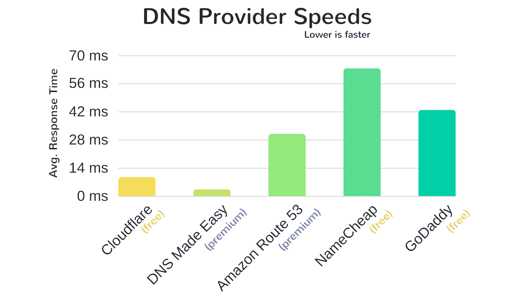

DNS provider speeds


在某些地区，上面的一些提供商也比其他提供商更快，因此确定您在哪里需要快速的 DNS 查找时间是很重要的，无论是地区性的还是全球性的。 [DNSPerf](https://www.dnsperf.com/) 是另一款较新的 DNS 速度比较工具，您可以在选择提供商时使用。您知道吗，您也可以使用没有 CDN 功能的 [Cloudflare 的 DNS](https://woorkup.com/cloudflare-dns/)？

### 技巧 2–更改 TTL 值以利用 DNS 缓存

令人欣慰的是，就像我们上面提到的，由于 DNS 缓存，您不必担心每次加载页面时都会发生查找。这实际上是关于第一次请求。DNS 缓存的工作方式类似于你缓存你的 WordPress 站点的方式。DNS 由缓存提供服务，直到它过期(这里是[如何刷新您的 DNS 缓存](https://kinsta.com/knowledgebase/flush-dns/))。DNS 缓存的长度由他们所谓的 [TTL(生存时间)](https://kinsta.com/knowledgebase/what-is-ttl/)值决定。TTL 越高，浏览器需要执行另一次 DNS 查找的可能性就越小。

**TTL 值可以通过您的域名注册商或第三方 DNS 提供商进行更改**,以缩短您的 DNS 缓存时间。值得注意的是，ISP 也会缓存 DNS。下面是一些常见的 TTL 值。

*   300 秒 = 5 分钟
*   1800 秒 = 30 分钟
*   **3600 秒** = 1 小时
*   43200 秒 = 12 小时
*   86400 秒 = 24 小时

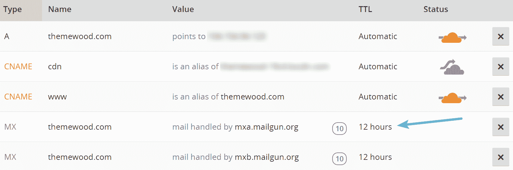

Cloudflare TTL


30 分钟到 1 小时通常是最常用的 TTL 值。然而，一些也将它们的 TTL 设置得很低，以允许快速更新。例如，如果您使用 Cloudflare 的自动 TTL，则默认为 5 分钟。查看不同类型的 DNS 记录并根据它们更改的频率进行相应的设置也是有益的。这里有一个例子:

*   **A 和 AAAA 记录:**变化比较频繁，从 5 分钟到一个小时的任何地方通常都可以
*   **CNAME 记录:**几乎从不改变，更高的 TTL 如 24 小时通常是可以的
*   NS 记录:几乎从不改变，更高的 TTL 如 24 小时通常是可以的
*   **MX 记录:**更改频率较低，12 小时这样的高 TTL 通常是可以的
*   **TXT 记录:**不经常更改，像 12 小时这样的高 TTL 通常是可以的

说到 TTL 真的没有对错之分。但是它可以通过选择一个与站点更改频率相一致的 TTL 来提高 DNS 查找时间。

## 注册订阅时事通讯


### 想知道我们是怎么让流量增长超过 1000%的吗？

加入 20，000 多名获得我们每周时事通讯和内部消息的人的行列吧！

[Subscribe Now](#newsletter)

### 技巧 3–减少域名(主机名)的数量

减少您站点上 DNS 查询的最简单的方法是简单地**去除查询不同主机名** 的请求。请记住，DNS 查找与请求的数量无关，而是与不同域的数量有关。通过类似 Pingdom 的工具运行你的 WordPress 站点，确定每个请求是否真的有必要。既然 DNS 是主机名到 IP 的映射，你可能会想为什么人们不直接指向 IP 呢？这是因为一个 [IP 地址可以经常改变](https://kinsta.com/tools/what-is-my-ip/what-is-my-ip/)，而主机名则不会。

### 技巧 4–使用 DNS 速度更快的替代服务

虽然简单地减少域名(主机名)的数量说起来容易做起来难，但我们建议首先查看那些 DNS 查找时间较长的域名。例如，在我们下面测试的这个站点中，我们可以很容易地发现疯狂鸡蛋跟踪脚本的 DNS 查找时间比其他的要长得多。这很可能是因为他们的 DNS 提供商不如其他一些提供商快。

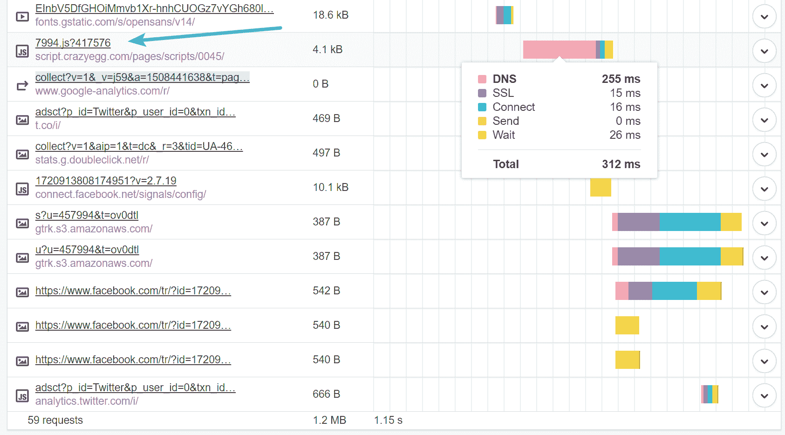

Find long DNS lookup times


在这种情况下，也许你可以**看看其他提供商**，比如 Hotjar，他们提供相同的服务，但是可能使用更快的 DNS 提供商。向你的 WordPress 站点添加外部服务时，评估它们的性能是非常重要的。

### 技巧 5–在 CDN 上移动和托管资源

减少 DNS 查找的最简单的方法之一是将尽可能多的资源转移到你的 CDN 提供商。如果您通过 Pingdom 运行您的站点，您可以看到域的请求总数。正如您在本例中看到的，93.8%的请求都是针对 CDN URL 的。一个是对主机的请求，一个是对 Google Analytics 的请求。通过将尽可能多的资源移动到 CDN，这减少了所涉及的 DNS 查找的数量，因此减少了加载时间。

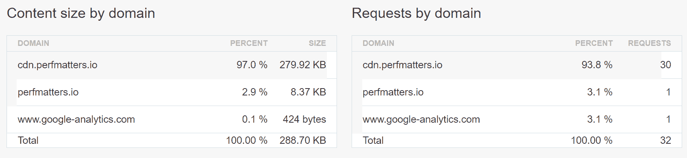

Requests by domain


当然，现在不可能总是把所有东西都转移到你的 CDN 上。总会有一些外部资源或服务需要你从它们的服务器上加载。但是我们建议浏览你的网站。很多时候，我们看到 WordPress 用户的 CDN 上有很多资源没有正确托管。通过这样做，您还可以更好地利用 [HTTP/2](https://kinsta.com/learn/what-is-http2/) 和[并行化](https://kinsta.com/blog/pingdom-speed-test/#parallelize-downloads-across-hostnames/)。下面是一些我们经常看到的可以改进的资源:

#### **字体牛逼**

我们偶尔会在 WordPress 网站上看到插件开发者和主题包含字体 Awesome，但有时会以这样的方式排队，默认情况下像 **CDN enabler 这样的插件不会捕捉到它**。在这种情况下，我们建议联系开发人员，询问他们如何从您的 CDN 加载它。

字体 Awesome 的另一个常见场景是，它有时从默认的 [BootstrapCDN](https://www.bootstrapcdn.com/fontawesome/) (MaxCDN)加载。虽然这没有什么错，但它增加了另一个您不需要的 DNS 查找。在大多数情况下，**从你自己的 CDN** 加载字体 Awesome 会更好，这样就不用再查找了。

#### **掘墓人**

如果你使用 WordPress 本地评论，你可能需要额外查找 secure.gravatars.com 来加载 gravatar。一个简单的解决方案是利用[惰性加载注释](https://wordpress.org/plugins/lazy-load-for-comments/)插件。虽然这不会减少 DNS 查找，但会延迟它，直到用户向下滚动页面。所以在某种意义上，你减少了第一页加载时的 DNS 查找。请务必查看我们关于[加速评论](https://kinsta.com/blog/wordpress-comments/)的博客文章。

Struggling with downtime and WordPress problems? Kinsta is the hosting solution designed to save you time! [Check out our features](https://kinsta.com/features/)

#### **谷歌字体**

有了谷歌字体，你有一个额外的 DNS 请求来查找 fonts.googleapis.com 抓取 CSS 文件。然后你有额外的请求 fonts.gstatic.com 下载字体文件。当你在本地托管时，所有的请求都来自同一个域或 CDN，很可能你不需要另一个 CSS 文件，因为它在你的 WordPress 主题的 CSS 文件中。这样做有好处也有坏处，但是请查看我们关于如何在本地托管字体的深入文章。

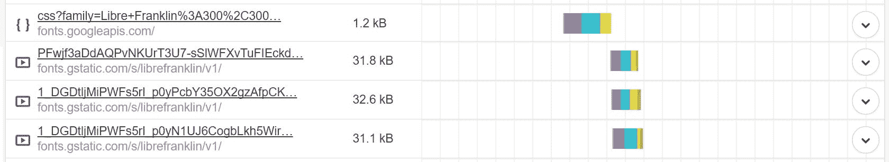

Google fonts DNS lookup


[Font Awesome](https://kinsta.com/blog/wordpress-icon-fonts/) 、Gravatars 和 [Google Fonts](https://kinsta.com/blog/best-google-fonts/) 只是通过确保它们从你的 CDN 加载来减少 DNS 查找的几个例子。你目前是否从你的 CDN 中加载了所有可能的东西？看一看总是好的。

### 技巧 6–利用 DNS 预取

加速 DNS 的另一个技巧是使用 DNS 预取。这允许浏览器**在后台**的页面上执行 DNS 查找。你可以通过在你的 WordPress 站点的标题中添加一些代码来做到这一点。请看下面的一些例子。

```
<!-- Prefetch DNS for external assets -->

 

```

DNS 预取也是除 iOS Safari、Opera Mini、Android 浏览器之外的所有主流浏览器都[支持](http://caniuse.com/#search=dns-prefetch)。

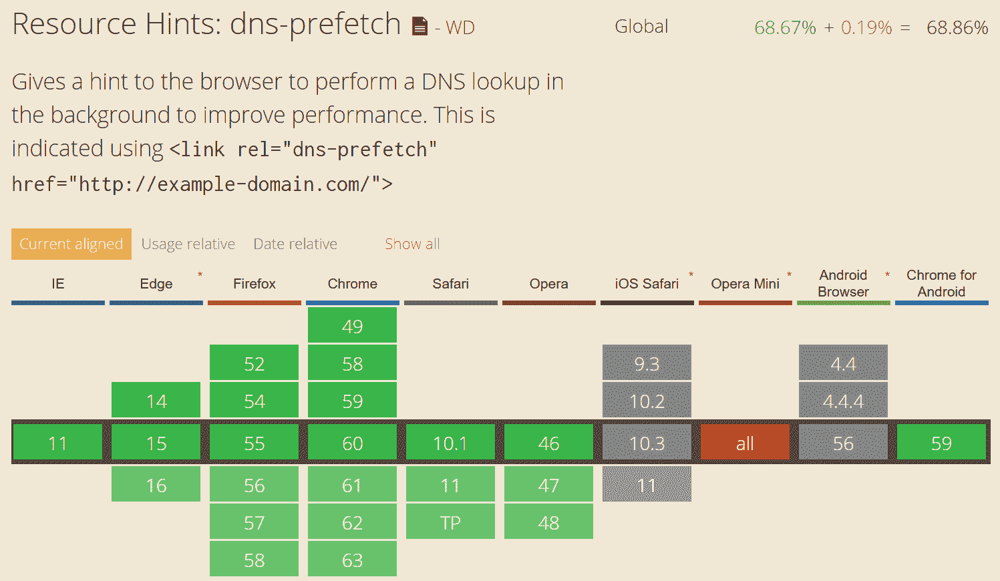

DNS prefetch browser support


或者如果你运行的是 WordPress 版本 4.6 或更新版本，你可能想要使用[资源提示](https://make.wordpress.org/core/2016/07/06/resource-hints-in-4-6/)。开发者可以使用 wp_resource_hints 过滤器为 dns 添加自定义域和 URLs 预取、预连接、预取或预呈现。
T3】

### 技巧 7——推迟加载 JavaScript

如果您推迟 JavaScript 的加载，这可能会阻止加载，直到文档完全加载之后。这不会减少所需的 DNS 查找次数，但会防止它们被立即调用，这可以加快用户体验。Varvy 对如何推迟 JavaScript 有一个很好的解释。他在自己的网站上使用的一个例子是他的谷歌分析脚本，因为它没有理由加载到折叠之上。

在 WordPress 中，你可以使用一个免费的插件，比如 [Async JavaScript](https://wordpress.org/plugins/async-javascript/) 来延迟 JavaScript 的加载。但是，重要的是要知道，您很可能必须仔细检查并列出您希望从 defer 应用中排除的任何脚本。为什么？因为需要一些 JavaScript 在文件夹上方呈现。异步 JavaScript 也完全兼容[自动优化](https://kinsta.com/blog/autoptimize-settings/)插件。

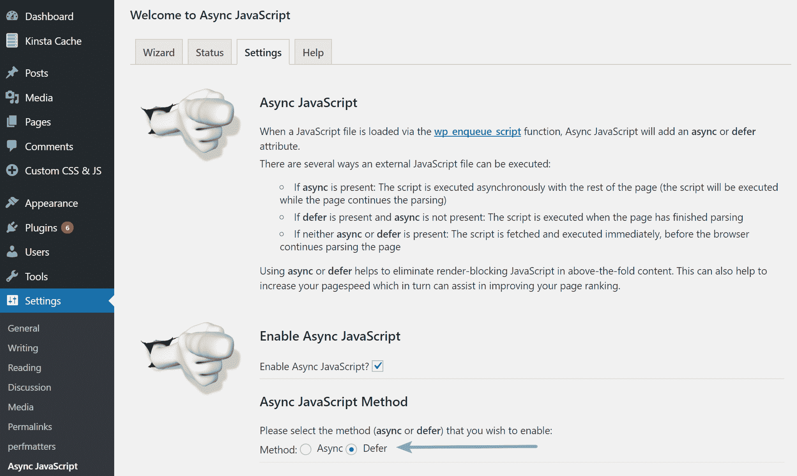

Defer JavaScript in WordPress


请务必查看我们关于如何[消除渲染阻塞的 JavaScript 和 CSS](https://kinsta.com/blog/eliminate-render-blocking-javascript-css/) 的深度帖子。

### 技巧 8——利用匿名记录和 CNAME 扁平化

像[DNS Easy](https://dnsmadeeasy.com/)和 [Cloudflare](https://kinsta.com/knowledgebase/install-cloudflare/) 这样的提供商提供了额外的记录，可以帮助减少后端的请求数量。

#### **通过 DNS 轻松记录姓名**

一个名字记录给你一个 CNAME 记录的功能，但是在根级别。例如，假设您为 www.domain.com 配置了一个 CNAME。www 必须首先解析主机名，然后解析 IP 地址。这需要两个请求。有了姓名记录，您可以跳过其中一个请求！如果设置正确，这些也可以与 CDN 结合使用。

**cnname**的缩写形式

```
ANSWER SECTION:
www.domain.com. 1799 IN CNAME domain.com.
domain.com. 1799 IN A 192.168.1.2
```

**ANAME**

```
ANSWER SECTION:
www.domain.com. 1799 IN A 192.168.1.2
```

然而，事实并非总是如此。如果主机名在同一个 DNS 区域中，A 记录可能会在同一个请求中检索到。

#### **CNAME 被云闪拉平**

与 ANAME 记录类似，Cloudflare 为他们的客户在区域顶点(或根)提供自动 [CNAME 拉平](https://support.cloudflare.com/hc/en-us/articles/200169056-CNAME-Flattening-RFC-compliant-support-for-CNAME-at-the-root)。

## 摘要

DNS 通常是被忽略的性能因素之一，但是如果您不小心的话，它很容易造成很大一部分的总加载时间。重要的是要了解 DNS 如何工作，有更快和更慢的提供商，以及如何减少查找来加快您的网站。

关于加快 DNS 速度或减少查找，你有什么额外的建议吗？如果是这样的话，我们很乐意在下面的评论中听到它们！

* * *

让你所有的[应用程序](https://kinsta.com/application-hosting/)、[数据库](https://kinsta.com/database-hosting/)和 [WordPress 网站](https://kinsta.com/wordpress-hosting/)在线并在一个屋檐下。我们功能丰富的高性能云平台包括:

*   在 MyKinsta 仪表盘中轻松设置和管理
*   24/7 专家支持
*   最好的谷歌云平台硬件和网络，由 Kubernetes 提供最大的可扩展性
*   面向速度和安全性的企业级 Cloudflare 集成
*   全球受众覆盖全球多达 35 个数据中心和 275 多个 pop

在第一个月使用托管的[应用程序或托管](https://kinsta.com/application-hosting/)的[数据库，您可以享受 20 美元的优惠，亲自测试一下。探索我们的](https://kinsta.com/database-hosting/)[计划](https://kinsta.com/plans/)或[与销售人员交谈](https://kinsta.com/contact-us/)以找到最适合您的方式。