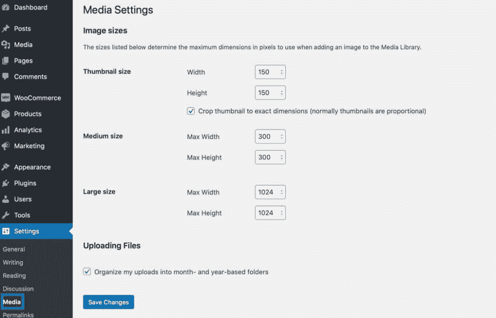
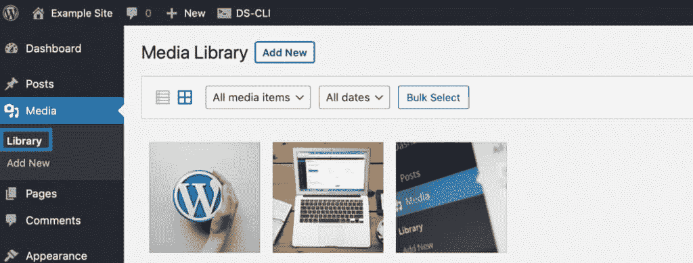
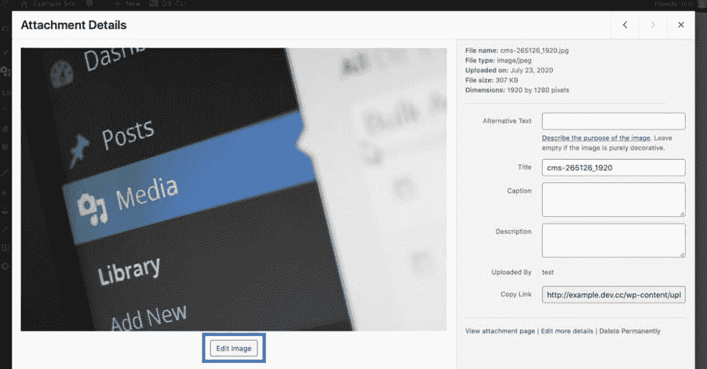
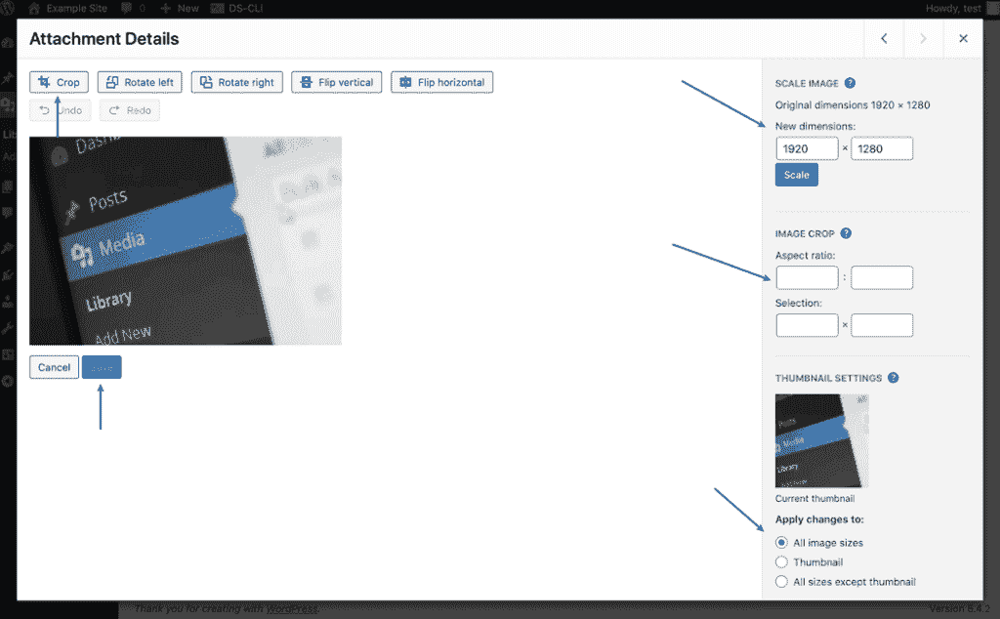
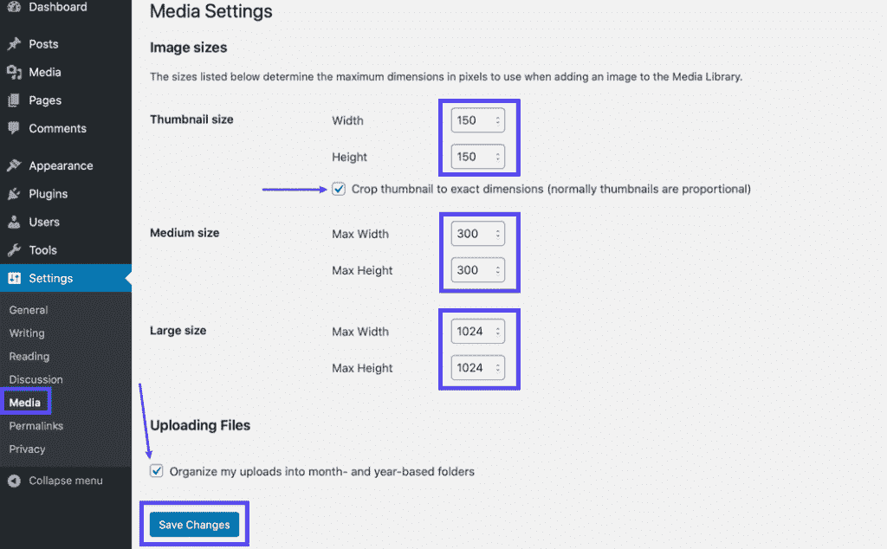
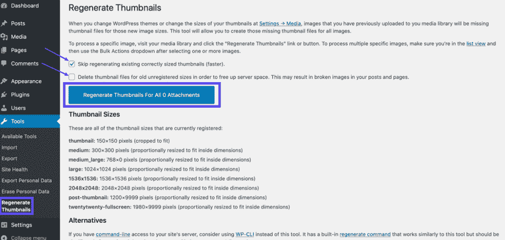
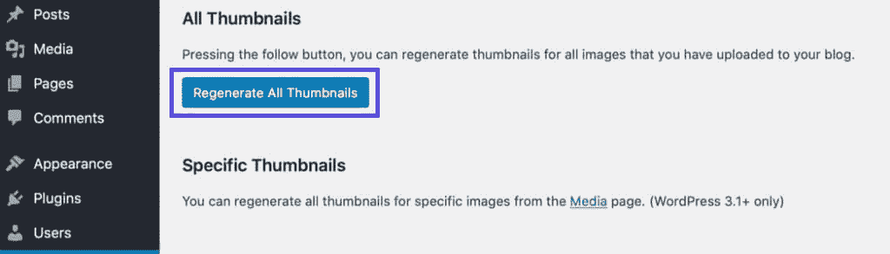
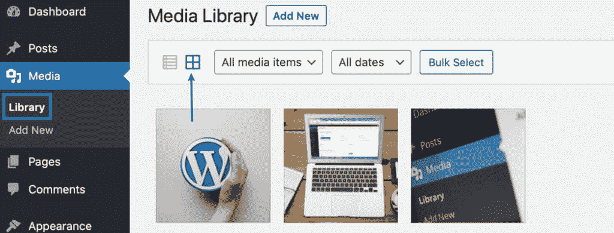
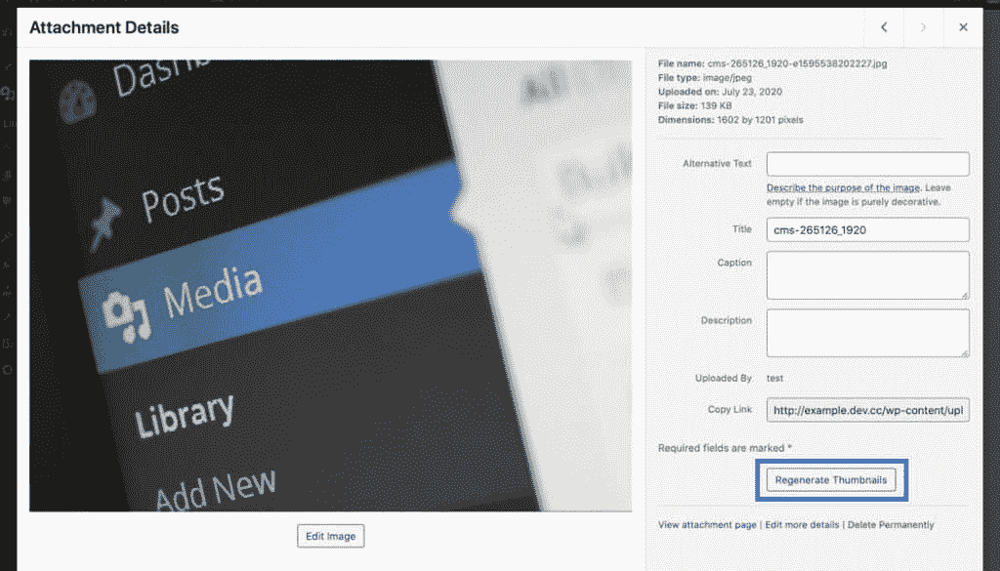
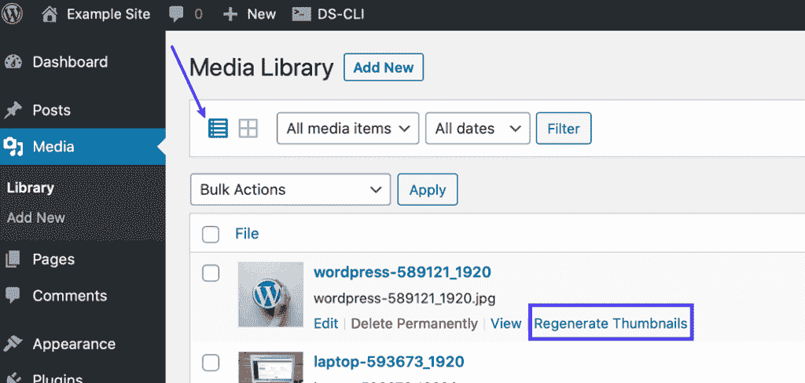

# 如何在 WordPress 中重新生成缩略图(通过插件和 WP-CLI)

> 原文：<https://kinsta.com/blog/regenerate-thumbnails/>

当您更改 WordPress 主题时，您现有的图片可能大小不合适。

WordPress 的解决方案？重新生成缩略图。这意味着在 WordPress 核心设置中重新设置你的图片尺寸。也可以通过使用插件快速完成。

在这篇文章中，我们将深入探讨 WordPress 重新生成缩略图解决方案，并向您展示如何使用重新生成缩略图插件和手动使用 WP-CLI 来修复图像问题。

开始吧！

### 更喜欢看[视频版](https://www.youtube.com/watch?v=CNoBoUWcPlc)？


## 你的图像会怎么样

为了弄清楚如何重新生成 WordPress 风格的缩略图，有必要先了解如何处理[图像和图像尺寸](https://kinsta.com/blog/optimize-images-for-web/)。


> 需要在这里大声喊出来。Kinsta 太神奇了，我用它做我的个人网站。支持是迅速和杰出的，他们的服务器是 WordPress 最快的。
> 
> <footer class="wp-block-kinsta-client-quote__footer">
> 
> 
> 
> <cite class="wp-block-kinsta-client-quote__cite">Phillip Stemann</cite></footer>

[View plans](https://kinsta.com/plans/)

WordPress 有自动裁剪你上传的图片的设置。这些设置可以在管理仪表板的**设置>媒体**下找到。



WordPress will automatically crop your images.


在**媒体设置**页面上，有“缩略图”、“中等”和“大”的尺寸您可以根据需要更新每个像素的像素数。

但是，如果您确实更新了尺寸，请不要忘记点击页面底部的**保存更改**。

以下是默认的调整选项:

*   **缩略图**–150 像素 x 150 像素
*   **中型**–600 像素 x 600 像素
*   **大尺寸**–1024 像素 x 1024 像素

请记住，您正在使用的[主题](https://kinsta.com/blog/fastest-wordpress-theme/)可能有特定的图像大小，这将覆盖**媒体设置**页面上的选项。如果您[切换到新主题](https://kinsta.com/blog/change-wordpress-theme/)，设置将更新为新主题设置的尺寸。

但是，您之前上传的旧图像不受影响。

这就是事情变得有点棘手的地方。您需要能够调整您之前上传的所有图像的大小，以符合新设置的图像大小。不幸的是，没有任何设置可以做到这一点。

解决方案是进行所谓的“重新生成缩略图”

[When you change WordPress themes, your existing images may not be the right size. 🤦‍♂️ The solution? Regenerate thumbnails. Learn more about this easy fix right here ⬇️Click to Tweet](https://twitter.com/intent/tweet?url=https%3A%2F%2Fkinsta.com%2Fblog%2Fregenerate-thumbnails%2F&via=kinsta&text=When+you+change+WordPress+themes%2C+your+existing+images+may+not+be+the+right+size.+%F0%9F%A4%A6%E2%80%8D%E2%99%82%EF%B8%8F+The+solution%3F+Regenerate+thumbnails.+Learn+more+about+this+easy+fix+right+here+%E2%AC%87%EF%B8%8F&hashtags=WordPressTips%2CWPThemes)

## 如何在 WordPress 中调整缩略图的大小？(3 种方法)

在探索如何在 WordPress 中重新生成缩略图之前，重要的是要注意在 [WordPress 仪表盘](https://kinsta.com/knowledgebase/wordpress-admin/)中调整图像大小的方法。

可能更需要注意的是，这些解决方案不一定会调整你的旧图片的大小，所以你仍然需要进入 WordPress，在没有插件的帮助下重新生成缩略图，或者使用插件。

如果您想要调整缩略图或图像的大小，有三种主要方法:

### 1.更改主题中的图像大小

由于你的主题可以修改默认的图片尺寸，你可以选择切换主题或者查看是否有专门针对 T2 调整图片尺寸的设置。

每个主题都是不同的，所以一定要检查相应的文档，看看是否有一种方法可以改变你的主题的图像大小，而不用安装一个不同的主题。

或者，你可以选择[创建一个子主题](https://kinsta.com/blog/wordpress-child-theme/)并用 PHP 代码改变图像尺寸[。](https://kinsta.com/knowledgebase/edit-wordpress-code/)

### 2.在媒体库中裁剪图像

另一个选择是通过在**媒体库**中裁剪图像来改变图像的大小。

#### 第一步

在 WordPress 管理仪表板中进入**媒体>图书馆**。



You can change image sizes in the Media Library.


然后，单击列出的要调整大小的图像。

在弹出窗口中，点击**编辑图像**按钮。



Click the button under the image to edit it.


#### 第二步

之后，您有几个选项来编辑图像。

你可以点击图片，拖动鼠标到图片上，当你选择了你想要保留的区域后，放开鼠标。然后，您可以点击**裁剪**。

如果您想要精确裁剪图像，您可以通过输入想要的比例来调整纵横比。

例如，您可以使用 1:1 来创建一个正方形，也可以使用 4:3、16:9 以及您想要的任何其他比例。

然后，按住 shift 键，同时在图像上拖动鼠标。当您选择了想要保留的图像部分时，放开鼠标。你可以点击它并四处移动选择，这样你就可以裁剪你需要的图像的确切部分。

如果您最初没有获得想要的图像大小，也可以单击并拖动选区的角。

或者，您可以进行选择，然后在右侧**图像裁剪**下的**选择**字段中输入您想要的图像的确切尺寸(以像素为单位)。

完成后，点击**裁剪**，然后点击**保存**按钮。

#### 第三步

如果您更愿意调整图像的大小而不是裁剪它，您可以在右侧的设置中缩放图像。

输入您想要的图像尺寸，然后点击**缩放**。



You have several options available to resize your image.


#### 第四步

您也可以在**缩略图设置**下选择您想要更改的标准图像尺寸。

您可以选择将调整应用于:

*   所有图像尺寸
*   拇指甲
*   除缩略图外的所有尺寸

### 3.在媒体设置中调整图像大小

如果你只需要编辑一两张图像，这很有帮助，但如果你想调整所有图像的大小，最好通过设置页面来完成。

#### 第一步

在您的管理仪表板中，进入**设置>媒体**。



You can adjust default image sizes on the Media Settings page.


#### 第二步

为所有缩略图、中型或大型图像输入您想要的新尺寸。根据需要，只为一种类型的图像或所有类型的图像输入所需的宽度和高度。

## 注册订阅时事通讯


### 想知道我们是怎么让流量增长超过 1000%的吗？

加入 20，000 多名获得我们每周时事通讯和内部消息的人的行列吧！

[Subscribe Now](#newsletter)

如果您想将缩略图调整到不成比例的大小，请选中**缩略图大小**部分下的**裁剪缩略图到精确尺寸**框。

#### 第三步

然后，如果你不想让你所有的新图片在[上传文件夹](https://kinsta.com/knowledgebase/bulk-upload-files-wordpress-media-library-ftp/)中杂乱无章，你可以勾选**将我的上传组织到基于月份和年份的文件夹**框。

当您对调整感到满意时，点击页面底部的**保存更改**按钮。

## 如何在 WordPress 中重新生成缩略图

更改这些设置或更改主题后，如果您的公共网站上的图像没有更新，您将不得不重新生成缩略图，如前所述。

最简单的方法之一是使用免费的 WordPress 插件[重新生成缩略图](https://wordpress.org/plugins/regenerate-thumbnails/)来快速修复你之前上传的图片。

这个插件也兼容 [WooCommerce](https://kinsta.com/blog/woocommerce-tutorial/) 。

### 第一步

首先，[安装并激活](https://kinsta.com/knowledgebase/how-to-install-wordpress-plugins/)重新生成缩略图插件。

然后，进入**工具>重新生成缩略图**，这里有 WordPress 图片相关的设置。



You can regenerate thumbnails, medium, and large image sizes as well.


### 第二步

默认情况下，**跳过重新生成现有尺寸正确的缩略图**选项被选中。取消选中此框，使用重新生成缩略图插件来调整您的所有图像。

但是，如果您想节省服务器的资源，请保持选中状态。

如果你已经更新了一些图片尺寸，比如通过你的主题，这是推荐的。您也可以选择勾选此选项下的复选框来**删除旧的未注册尺寸的缩略图文件**。选择它[释放你服务器上的空间](https://kinsta.com/blog/disk-space-wordpress-hosting/)。

在选择此设置之前，请确定您不需要这些图像。如果您的网站正在使用某些图像，并且您选择了此选项，**它们将被删除**，并且将不再显示在您的网站上。游客会看到一个破碎的形象。

你可能还会看到**更新帖子的内容以使用新的尺寸**复选框，如果你想更新你当前在帖子中使用的图像，你可以选择它。

### 第三步

选择所需选项后，点击按钮**重新生成缩略图**，包括中、大、新文件尺寸。

然后，等待该过程完成。根据你的网站上有多少图片，这可能需要一段时间，所以在你等待的时候喝杯咖啡或一杯水。在高性能服务器上，大型网站通常只需要几分钟。

您将看到“全部完成！”过程完成时的消息。

就是这样。

与宕机和 WordPress 问题做斗争？Kinsta 是一款考虑到性能和安全性的托管解决方案！[查看我们的计划](https://kinsta.com/plans/?in-article-cta)

您的缩略图和图像现在应该重新生成。

### 如何强制重新生成缩略图

你也可以使用[强制重新生成缩略图插件](https://wordpress.org/plugins/force-regenerate-thumbnails/)作为替代。顾名思义，它通过删除旧的图像尺寸来推动缩略图的重新生成，因此 WordPress 被迫重新生成图像。这个插件也兼容 WooCommerce 在线商店。

请记住，在发布的时候，这个插件还没有在最近的 3 个主要版本中更新，所以要小心使用。在你把它用在你的网站上之前，一定要在一个[试运行](https://kinsta.com/help/staging-environment/)或[本地测试环境](https://kinsta.com/blog/install-wordpress-locally/)中测试它。

你需要使用这个插件而不是重新生成缩略图插件的原因是，后者只是调整图像大小，它不会删除旧的图像大小，除非你选择了那个选项。

但是，如果你有困难，你可以尝试强制重新生成缩略图。

#### 第一步

要强制 WordPress 重新生成缩略图，安装并激活强制重新生成缩略图插件。

然后，在 WordPress 管理仪表板中进入**工具>强制重新生成缩略图**。



You can force-regenerate thumbnails in one click.


#### 第二步

要删除所有旧设置尺寸的图像并强制 WordPress 重新生成缩略图，点击**重新生成所有缩略图**按钮。

请稍候，您的图像将被调整大小。如果你有一个较小的网站，这几乎不需要时间，但是对于有大量图片的较大网站，这可能需要几分钟。

## 重新生成特定图像

有些情况下，你不需要重新生成所有的缩略图，只需要重新生成一些特定的缩略图。在重新生成缩略图插件仍然安装的情况下，你也可以这样做。以下是方法。

### 第一步

前往**媒体>图书馆**。在网格视图中，单击特定图像。



By default, the Media Library is in grid view.


#### 第二步

然后在右侧点击**重新生成缩略图**按钮。



You can regenerate thumbnails in the attachment details.


如果您正在列表视图中查看**媒体库**，将鼠标悬停在您想要重新生成的图像上后，单击**重新生成缩略图**链接。



Click the link to regenerate thumbnails in the list view.


## 使用 WP-CLI 重新生成缩略图

如果你不喜欢使用插件，WordPress 还有另一个解决方案:用 [WP-CLI](https://kinsta.com/blog/wp-cli/) 手动重新生成没有插件的缩略图。

请记住，对于这个选项，您需要能够访问服务器上的[命令行。](https://kinsta.com/blog/how-to-use-ssh/)

使用 WP-CLI 重新生成缩略图是比使用 WordPress 插件更好的选择，因为它更快，并且不受 HTTP 限制和[超时](https://kinsta.com/blog/504-gateway-timeout/)的限制。

重新生成缩略图的基本命令如下:

```
wp media regenerate
```

输入之后，通过按下键盘上代表“是”的字母“y”来确认您想要重新生成所有缩略图。

### 用 WP-CLI 重新生成所有缩略图

一旦你启动了命令行，你可以输入下面的[命令让 WordPress](https://kinsta.com/blog/ssh-commands/) 在几秒钟之内不用插件就能重新生成缩略图:

```
wp media regenerate --yes
```

使用此命令，缩略图将重新生成，无需手动确认。

#### 使用 WP-CLI 重新生成特定缩略图

您还可以选择使用 WP-CLI 和您想要更新的图像的 id 来重新生成特定的缩略图。

下面是执行该操作的命令:

```
wp media regenerate 12 34 567
```

只需确保将三个示例 id“12”、“34”和“567”替换为您想要重新生成的特定图像的实际 id。

您可以包含任意数量的 id。一定要用空格将它们分开。

[Learn to quickly fix your WordPress images after changing your theme with this guide 🚀Click to Tweet](https://twitter.com/intent/tweet?url=https%3A%2F%2Fkinsta.com%2Fblog%2Fregenerate-thumbnails%2F&via=kinsta&text=Learn+to+quickly+fix+your+WordPress+images+after+changing+your+theme+with+this+guide+%F0%9F%9A%80&hashtags=WordPressThemes%2CWebDesign)

## 摘要

当[你切换主题](https://kinsta.com/blog/change-wordpress-theme/)时，看到[你的图像](https://kinsta.com/blog/free-images-for-wordpress/)不能正常显示会令人沮丧。

幸运的是，WordPress 有两个快速的解决方案。在重新生成缩略图插件的帮助下，只需点击几下就可以完成。或者，您可以使用 WP-CLI 在比煮一杯咖啡更短的时间内完成。

* * *

让你所有的[应用程序](https://kinsta.com/application-hosting/)、[数据库](https://kinsta.com/database-hosting/)和 [WordPress 网站](https://kinsta.com/wordpress-hosting/)在线并在一个屋檐下。我们功能丰富的高性能云平台包括:

*   在 MyKinsta 仪表盘中轻松设置和管理
*   24/7 专家支持
*   最好的谷歌云平台硬件和网络，由 Kubernetes 提供最大的可扩展性
*   面向速度和安全性的企业级 Cloudflare 集成
*   全球受众覆盖全球多达 35 个数据中心和 275 多个 pop

在第一个月使用托管的[应用程序或托管](https://kinsta.com/application-hosting/)的[数据库，您可以享受 20 美元的优惠，亲自测试一下。探索我们的](https://kinsta.com/database-hosting/)[计划](https://kinsta.com/plans/)或[与销售人员交谈](https://kinsta.com/contact-us/)以找到最适合您的方式。