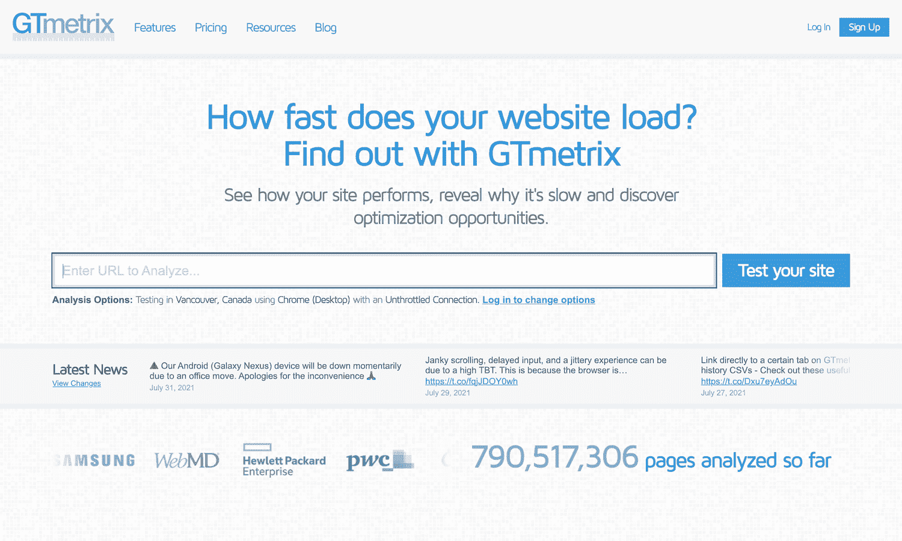
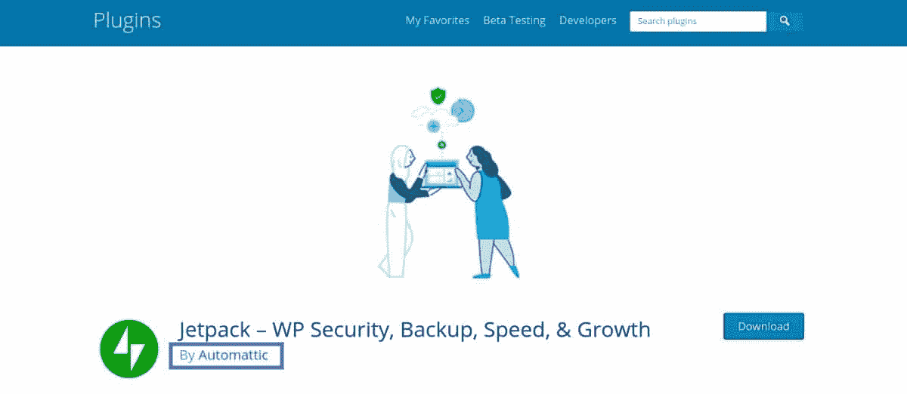
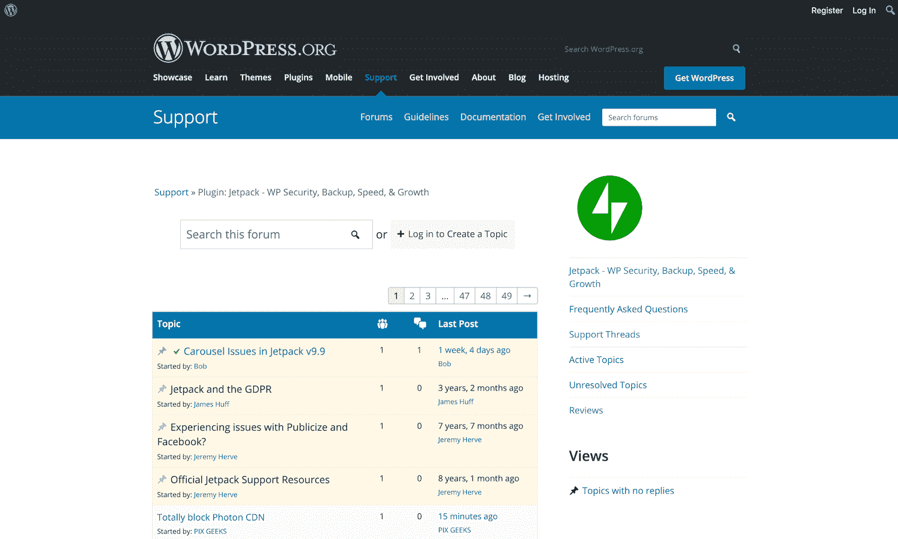
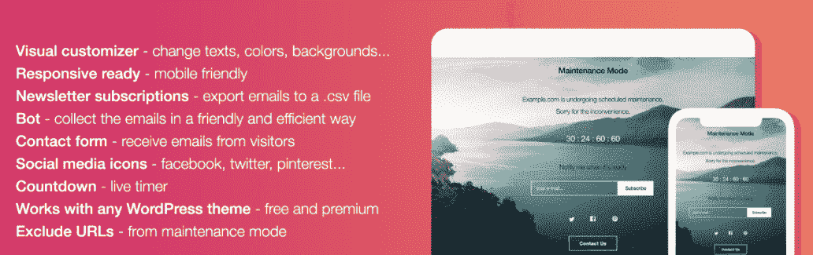
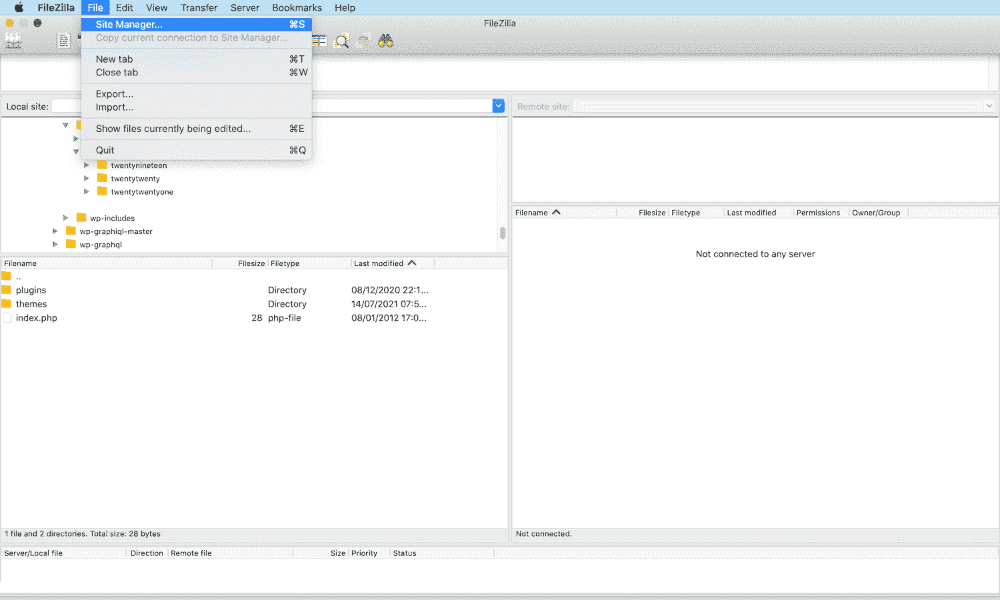
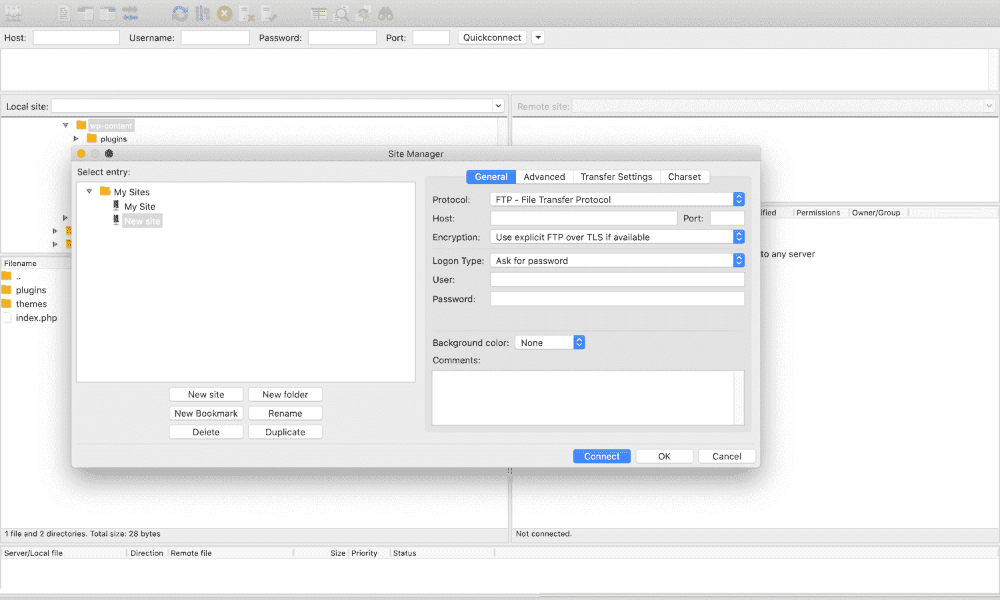

# 如何解决“删除以下重定向链”错误(4 种方法)

> 原文：<https://kinsta.com/blog/remove-the-following-redirect-chain-if-possible/>

为了让你的网站保持最佳状态，你需要定期测试。然而，有一个 GTmetrix 错误信息一直困扰着 WordPress 网站所有者:“如果可能的话，删除下面的重定向链。”

如果您遇到这个错误，有一些方法可以找出导致这么多重定向的原因。一旦你确定了罪魁祸首，去除所有那些影响性能的重定向可能就像在你的 WordPress 仪表盘上按几个按钮[一样简单。](https://kinsta.com/knowledgebase/wordpress-admin/)

在本帖中，我们将讨论什么是[重定向链](https://kinsta.com/tools/redirect-checker/)以及为什么它们对你的流量、转化率和搜索引擎排名是坏消息。然后我们将分享四种方法来解决这个错误，让你的 WordPress 网站回到正轨。

我们开始吧！

### 查看我们的[视频指南](https://www.youtube.com/watch?v=oZ-Ha8wjSeU)来修复“移除跟随重定向链”错误

## 介绍重定向链(以及为什么它们对你的网站有害)

定期测试你的网站是很重要的。有很多工具可用，但 [GTmetrix 是一个受欢迎的选择](https://kinsta.com/blog/gtmetrix-speed-test/)。它提供了实时的性能跟踪，以及安排测试的选项。

> 需要在这里大声喊出来。Kinsta 太神奇了，我用它做我的个人网站。支持是迅速和杰出的，他们的服务器是 WordPress 最快的。
> 
> <footer class="wp-block-kinsta-client-quote__footer">
> 
> 
> 
> <cite class="wp-block-kinsta-client-quote__cite">Phillip Stemann</cite></footer>

[View plans](https://kinsta.com/plans/)

gt metrix 性能测试工具。

但是，GTmetrix 可能会偶尔警告您，您的站点上存在许多[重定向链](https://kinsta.com/blog/wordpress-redirect/)。如果您更详细地研究这些消息，GTmetrix 会建议您“尽可能删除以下重定向链”

当请求的 URL 和目标 URL 之间有多个重定向时，就会产生一个链。这些链需要多次往返服务器和额外的请求。

因此，目标网页将花费[更长的时间来加载](https://kinsta.com/blog/ttfb/)。

缓慢的[页面加载时间](https://kinsta.com/learn/page-speed/)会对访客体验产生负面影响。事实上， [40%的人](https://neilpatel.com/blog/loading-time/)会放弃一个加载时间超过三秒的网站。这样，重定向链可以影响你的流量水平，转换和销售。

这些链不仅仅影响你的访问者，因为搜索引擎爬虫也会注意到缓慢的页面加载时间。当把你的网站放在搜索结果中时，[谷歌会考虑许多不同的排名因素](https://kinsta.com/blog/google-patents-seo-ranking-factors/)，包括速度。特别是，[谷歌的核心网络生命指标](https://kinsta.com/blog/core-web-vitals/)计划衡量访问者如何看待你的网站的速度、响应能力和视觉稳定性。

随着超过 50%的流量来源于有机搜索，搜索引擎优化(SEO)对实现在线成功至关重要。如果重定向链损害了你的页面加载时间，那么你的[搜索引擎排名](https://kinsta.com/cheatsheets/wordpress-seo-checklist/)几乎肯定会受到[的影响](https://kinsta.com/blog/decline-seo-rankings/)。

如果你打算[提高你的排名](https://kinsta.com/blog/wordpress-seo/)并赢得潜在客户，你必须优化你网站的加载时间。因此，如果 GTmetrix 就重定向向您发出警告，删除这些链应该是当务之急。

### 什么导致了 GTmetrix 的重定向链错误

各种问题似乎导致重定向错误。然而， [WordPress 插件](https://kinsta.com/blog/best-seo-plugins-for-wordpress/)似乎是最常见的罪魁祸首。

特别是，据报道，WordPress 社区的成员在安装以下插件后遇到了 GTmetrix 的重定向警告:

*   短像素自适应图像
*   a3 懒人装
*   压碎
*   自动优化
*   打碎气球
*   W3 总缓存

这些工具中有许多都与优化相关。在重定向链和通过[内容交付网络(CDN)](https://kinsta.com/blog/wordpress-cdn/) 交付的优化活动之间似乎有着直接的联系。

这意味着如果您使用替代的[图像优化](https://kinsta.com/blog/optimize-images-for-web/)插件或具有这些功能的 CDN，您可能会遇到 GTmetrix 的警告，即使您的具体软件没有在上面列出。

在[将你的网站](https://kinsta.com/blog/wordpress-migration-plugins/)迁移到一个新的平台或者[改变你的域名](https://kinsta.com/blog/wordpress-change-domain/)之后，你可能还会纠结于重定向链。作为迁移的一部分，你经常需要[实现大量的重定向](https://kinsta.com/blog/wordpress-redirect/)。久而久之，这些会变成难以驾驭的锁链。

如果您怀疑 GTmetrix 的警告可能与最近的站点迁移有关，我们建议您手动检查所有重定向。虽然这可能很耗时，但它给了你发现网站问题的最好机会。

现在，让我们开始解决这个问题。

## 如何解决“删除以下重定向链”错误(4 种方法)

令人沮丧的是，这个错误可能是由于各种不同的插件、设置和第三方软件[，如防火墙](https://kinsta.com/blog/what-is-a-firewall/)。

虽然没有放之四海而皆准的解决方案，但是有很多方法可以找到你的网站的根本原因。让我们来看看如何消除混乱，去掉那些破坏性能的重定向链。

### 1.查看您的 CDN 设置

如果您使用 CDN 和防火墙，您的防火墙可能会阻止服务器访问您的图像。

如果您怀疑可能是这种情况，我们建议在您的 CDN 上“允许列出”IP 地址。“allowlisting”过程会因所涉及的 CDN 和防火墙而异，因此您可能需要参考提供商的文档以了解更多信息。

同样，您的图像文件也不能公开。例如，你可能让[对你的网站](https://kinsta.com/blog/password-protect-wordpress-site/)设置了密码保护，或者定义了无意中阻止 CDN 访问你的图片的规则。

如果这听起来合理，尝试禁用所有可能阻止你的 CDN 的设置和规则。特别是，如果你已经创建了[规则来阻止热链接](https://kinsta.com/blog/hotlinking/)，这通常会干扰 cdn，导致重定向链。

根据您的 CDN 订阅情况，您也有可能超出每月流量配额。出现这种情况时，一些提供者会将请求重定向到原始映像，从而产生链。

要检查您的订阅状态，请尝试登录您的 CDN 帐户或控制台。你应该在这里看到更多关于你的用法的信息。

如果这些修复都不能解决你的问题，你可以通过[从你的 CDN 中清除重定向图像](https://kinsta.com/blog/wordpress-clear-cache/)来获得积极的结果。

刷新过程可能有所不同，但通常包括登录到您的提供商的仪表板或访问 CDN 插件设置。然后，您可以查找与缓存相关的任何选项。

如果您遇到了困难，查看 CDN 文档以获得更多信息是个好主意。或者，您可以随时向您的提供商寻求帮助。

厌倦了自己找出错误吗？Kinsta 的支持团队完全由 WordPress 开发者和专家组成，他们可以全天候聊天。[查看我们的计划](https://kinsta.com/plans/)开始行动。

### 2.检查特定插件的错误消息

检查错误消息本身也有好处，因为它可能会指出导致重定向链的插件。举一个 WordPress 社区的成员发布的关于在 GTmetrix 中接收的例子:

## 注册订阅时事通讯

### 想知道我们是怎么让流量增长超过 1000%的吗？

加入 20，000 多名获得我们每周时事通讯和内部消息的人的行列吧！

[Subscribe Now](#newsletter)

> 如果可能，删除以下重定向链:WP-content/plugins/a3-lazy-load/asseimg/lazy _ placeholder . gif

这条消息似乎表明 a3 惰性加载插件正在生成重定向链。

如果您的错误消息指定了一个特定的插件，请检查以确保您运行的是最新版本的。如果您在更新上落后了，开发人员可能已经在后续的补丁中解决了这个错误。

如果你有最新的版本，下一步就是联系插件的开发者。他们可能完全没有意识到这个问题。

如果你从官方的 [WordPress 插件目录](https://wordpress.org/plugins/)下载了插件，这个列表应该包含这个特定插件背后的人或团队的名字:

JetPack 插件页面。

更好的是，这个页面可能包含到开发者网站的链接。从那里，你经常可以找到他们的联系方式。

或者，每个 WordPress 知识库列表包含一个**支持**标签。通过发布你的问题，你可以从开发者甚至其他用户那里得到帮助。

官方 WordPress 知识库中的一个支持标签。

理想情况下，如果你设法联系上了，开发者会确认他们已经意识到了这个问题，并且已经在做补丁了。

然而，开发者放弃他们的插件并不罕见，这会使事情变得复杂。如果您怀疑这个特定的软件不再处于开发中，您可能需要禁用它并寻找一个替代软件。

好消息是，仅 WordPress 库中就有近 60，000 个免费插件，你应该没有问题[找到合适的替代品](https://kinsta.com/best-wordpress-plugins/)。

### 3.禁用(然后重新启用)所有插件

有时，错误消息可能没有提到具体的插件。如果 GTmetrix 含糊不清，那么是时候做你的调查工作了。

你可以通过关闭你网站上的每个插件来检查一个插件是否有责任。如果错误信息消失了，你就会知道是 WordPress 插件的问题。

但是，停用这些加载项会影响站点的显示和功能。这对用户体验来说通常是个坏消息(UX)。出于这个原因，明智的做法是在整个测试过程中让你的站点进入[维护模式](https://kinsta.com/blog/wordpress-maintenance/)。

需要一流的，快速的，安全的主机为您的新电子商务网站？Kinsta 提供超快的服务器和来自 WooCommerce 专家的 24/7 世界级支持。[查看我们的计划](https://kinsta.com/plans/?in-article-cta)

如果你不喜欢用[来编写你的维护信息](https://kinsta.com/blog/wordpress-maintenance-mode/)，你可以使用像 [WP 维护模式](https://wordpress.org/plugins/wp-maintenance-mode/)这样的插件:

WP 维护模式插件。

为了增加安全性，我们还建议[在你开始关闭插件之前创建一个备份](https://kinsta.com/blog/backup-wordpress-site/)。如果你遇到任何严重的问题，这对[将你的站点](https://kinsta.com/blog/restore-wordpress-from-backup/)恢复到之前的配置是非常宝贵的。

你的主机可能会提供自动备份选项，[，就像 Kinsta 提供的](https://kinsta.com/help/wordpress-backups/)。如果没有，有[多个可用的备份插件](https://kinsta.com/blog/wordpress-backup-plugins/)供你使用。

现在你已经准备好了备份和维护模式，你可以禁用你的插件。

这种做法有助于验证插件是否正在生成所有这些重定向。然而，如果你仍然能找到确切的罪魁祸首，那会有所帮助。

下一步是逐个重新启用每个插件，在每个插件之后运行新的 GTmetrix 测试。一旦错误再次出现，您就已经确定了行为不端的插件。

不过，停用和删除一个麻烦的插件并不总是可行的。也许它与你的网站主题太过紧密，或者你没有找到一个快速替换的好方法。

如果是这种情况，您可以考虑联系开发人员。他们可能会告诉你什么时候可以得到补丁，或者分享一个解决方法。例如，禁用特定设置可能使您能够继续使用插件，而不会遇到重定向链错误。

然而，有时开发人员可能不打算修复这个问题，主要是如果软件不再处于活动开发中。如果是这种情况，寻找一种提供类似功能但不会产生许多不必要的重定向的替代方法通常是有意义的。

### 4.回顾你的。htaccess 文件

如果你之前已经设置了重定向或者安装了任何为你管理重定向的插件，那么看看你的[站点的](https://kinsta.com/knowledgebase/wordpress-htaccess-file/) [是值得的。htaccess](https://kinsta.com/knowledgebase/wordpress-htaccess-file/) [文件](https://kinsta.com/knowledgebase/wordpress-htaccess-file/)。“超文本访问”的缩写，这是一个安装 WordPress 时自动创建的关键配置文件。

注意**。htaccess** 文件只在运行 Apache 的[服务器上可用。](https://kinsta.com/knowledgebase/what-is-apache/) [Nginx 服务器](https://kinsta.com/blog/nginx-vs-apache/)，就像我们[在 Kinsta](https://kinsta.com/knowledgebase/what-is-nginx/) 运行的那些服务器一样，没有这个特定于 Apache 的文件。

对此文件的修改偶尔会导致大量重定向链。幸运的是，有几种方法可以查看这个文件，包括通过文件管理器或者像 cPanel 这样的[控制仪表板。你会找到**。你网站的 **public_html** 文件夹中的 htaccess** 文件。](https://kinsta.com/knowledgebase/what-is-cpanel/)

或者，您可以使用 FileZilla 等[客户端，通过](https://kinsta.com/blog/best-ftp-clients/)[安全文件传输协议(SFTP)](https://kinsta.com/knowledgebase/wordpress-files/#accesswordpressfiles) 连接到您的服务器。

在 FileZilla 客户端中，导航到**文件** > **站点管理器**:

FileZilla FTP 客户端。

如果您是第一次连接到您的服务器，请选择**新站点**。然后，您可以为此连接指定一个名称:

使用 FileZilla FTP 客户端连接到服务器。

如果您通过 SFTP 连接，请输入**端口**的值`22`。否则，输入`21`。

然后可以打开**登录类型**框，选择**询问密码**。接下来，输入你的 SFTP 用户名和密码，然后点击**连接**按钮。

如果连接成功，您网站的所有文件都应该出现在 FileZilla 的右侧窗口中。

在这个面板中，导航到您站点的 **public_html** 目录。你现在应该可以访问你的**了。htaccess** 文件。(如果看不到，您可能需要先选择[来显示隐藏文件](https://kinsta.com/knowledgebase/filezilla-show-hidden-files/)。)

如果你在这个文件中发现了任何独特的代码，最好将这个奇怪的代码复制并粘贴到你最喜欢的搜索引擎中。这通常是最快也是最简单的方法来解释这段代码对你的网站有什么影响，以及它是否是所有这些重定向链的幕后黑手。

[GTmetrix:有助于让你的网站以⚡️的最高速度运行，当它弹出这个错误消息时令人困惑😫在这里了解如何修复⬇️ 点击推文](https://twitter.com/intent/tweet?url=https%3A%2F%2Fkinsta.com%2Fblog%2Fremove-the-following-redirect-chain-if-possible%2F&via=kinsta&text=GTmetrix%3A+helpful+for+keeping+your+site+running+at+top+speed+%E2%9A%A1%EF%B8%8F%2C+confusing+when+it+pulls+up+this+error+message+%F0%9F%98%AB+Learn+how+to+fix+it+here+%E2%AC%87%EF%B8%8F&hashtags=GTmetrix%2CSiteSpeed)

## 摘要

似乎有许多不同的插件和设置会导致重定向链。但是，通过遵循一些简单的步骤，您可以缩小特定网站的问题范围。

为了恢复您站点的性能，让我们快速回顾一下解决 GTmetrix 重定向链错误的四种可能方法:

1.  回顾你的 CDN。
2.  检查特定插件的错误消息。
3.  禁用(然后重新启用)所有插件。
4.  复习你的**。htaccess** 文件。

按照这些故障诊断步骤，您应该很快就能排除“如果可能，请删除下面的重定向链”错误。

关于如何减少 WordPress 中的重定向，你有什么问题吗？请在下面的评论区告诉我们！

* * *

让你所有的[应用程序](https://kinsta.com/application-hosting/)、[数据库](https://kinsta.com/database-hosting/)和 [WordPress 网站](https://kinsta.com/wordpress-hosting/)在线并在一个屋檐下。我们功能丰富的高性能云平台包括:

*   在 MyKinsta 仪表盘中轻松设置和管理
*   24/7 专家支持
*   最好的谷歌云平台硬件和网络，由 Kubernetes 提供最大的可扩展性
*   面向速度和安全性的企业级 Cloudflare 集成
*   全球受众覆盖全球多达 35 个数据中心和 275 多个 pop

在第一个月使用托管的[应用程序或托管](https://kinsta.com/application-hosting/)的[数据库，您可以享受 20 美元的优惠，亲自测试一下。探索我们的](https://kinsta.com/database-hosting/)[计划](https://kinsta.com/plans/)或[与销售人员交谈](https://kinsta.com/contact-us/)以找到最适合您的方式。