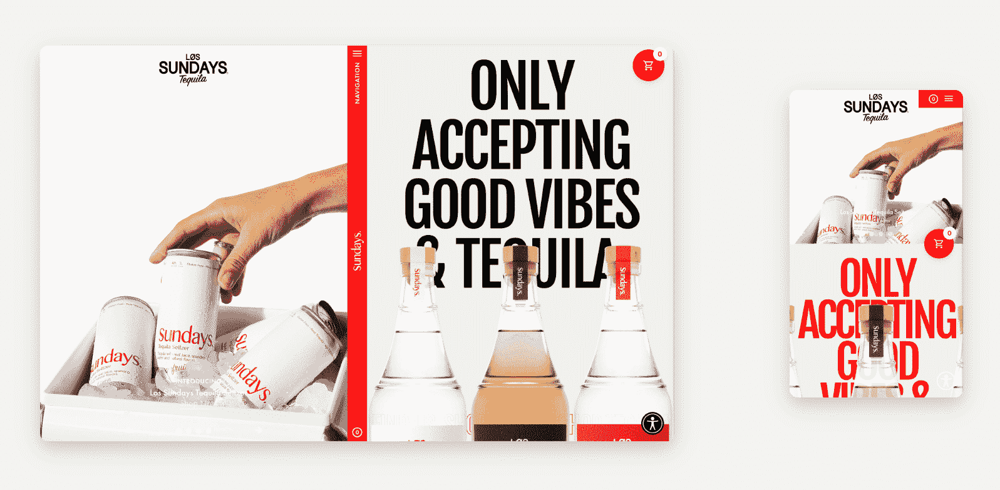
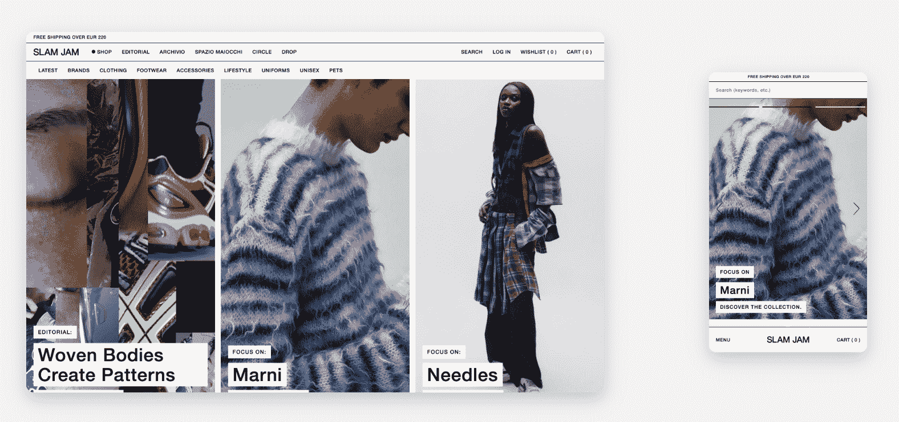
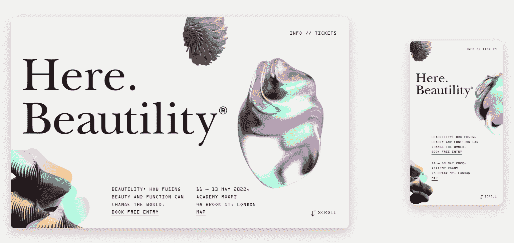
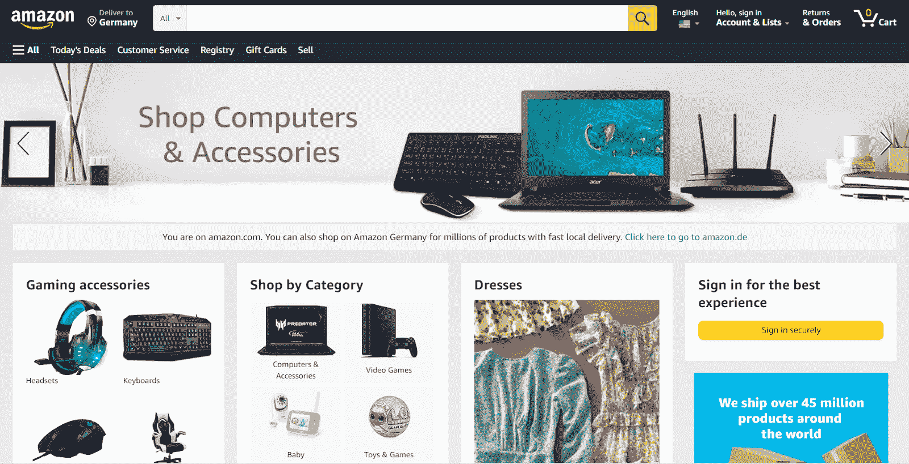
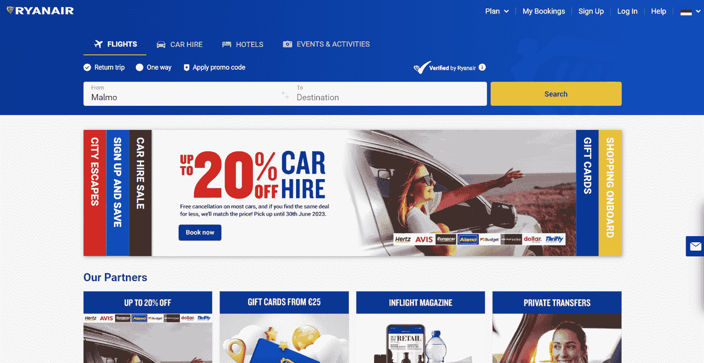

# 响应与适应:如何选择正确的设计方法

> 原文：<https://kinsta.com/blog/responsive-vs-adaptive/>

就在几年前，设计师可以创建一个单一的僵化的网站版本，然后就可以收工了。现在不再是这样了。现在，他们需要考虑无数的智能手机、可穿戴设备、平板电脑和其他智能设备——你也一样。

对于电子商务企业来说尤其如此。大多数品牌再也不能专注于单一设备。超过 [58%](https://gs.statcounter.com/platform-market-share/desktop-mobile-tablet) 的互联网流量来自移动设备，而桌面设备占 40%。接近 [60%](https://kinsta.com/blog/ecommerce-statistics/) 的电子商务销售是通过移动设备完成的。

[移动流量的份额](https://kinsta.com/mobile-vs-desktop-market-share/)只会不断增长，这意味着设计师也要迎合不同的用户需求和浏览风格。移动用户没那么有耐心——他们希望网站内容很小，易于处理。另一方面，个人电脑用户通常愿意花更多的时间研究具体的报价。

问题是，你如何确保你的设计在任何屏幕上都很棒，并且覆盖各种用户需求？响应式设计是唯一的出路吗？适应性设计在某些情况下不是更好的选择吗？响应性设计和适应性设计到底有什么不同？

让我们找出答案。

## 响应式设计与适应性设计:区别在哪里？

在我们继续之前，我们应该定义我们在处理什么。

> Kinsta 把我宠坏了，所以我现在要求每个供应商都提供这样的服务。我们还试图通过我们的 SaaS 工具支持达到这一水平。
> 
> <footer class="wp-block-kinsta-client-quote__footer">
> 
> 
> 
> <cite class="wp-block-kinsta-client-quote__cite">Suganthan Mohanadasan from @Suganthanmn</cite></footer>

[View plans](https://kinsta.com/plans/)

[响应式设计](https://kinsta.com/blog/responsive-web-design/)让你的内容响应用户的屏幕大小，并相应调整。使用响应式设计，您可以创建一个单一的布局，并使其各个元素灵活，以确保它们可以在不同的屏幕上正确显示。

把响应式设计想象成一套告诉你的内容如何行为的规则。您可以使用 [CSS 媒体查询](https://kinsta.com/blog/optimize-css/)来指定目标设备类型并设置断点，这意味着诸如屏幕的最大或最小宽度等条件。断点决定何时应该更改布局。

自适应设计反过来意味着你的内容以预定的方式适应用户的设备参数。您有多个现成的布局来应对不同的屏幕尺寸、方向等。您可以根据用户的设备类型决定内容在用户浏览器中的显示方式。

简而言之，在响应式设计中，你决定了你的内容应该如何反应，而在适应性设计中，你也决定了最终的结果。无论你选择哪一个，你都可以为智能手机和台式机用户创造流畅、无缝的体验。这反过来会提高你在搜索引擎中的排名。

这种并排比较将帮助您理解响应式设计和自适应设计之间的主要区别:

| **响应式设计** | **适应性设计** |
| 一种布局适合不同的屏幕尺寸 | 根据屏幕大小显示多个模板 |
| 相对单位更有利 | 绝对单位更有利 |
| 灵活、流畅的布局 | 固定的静态布局 |
| 瞄准所有可能的设备 | 针对最流行的设备 |
| 更广泛的关注 | 更高的精度 |

两种方法都是绝对可行的；他们帮助你遵循通用的[网页设计原则](https://kinsta.com/blog/web-design-principles/)并创建一个客户友好的网站。响应式设计和适应性设计的主要区别在于它们是如何执行的。

[Wondering how to perfect your web design? 🤔Check out this guide to the differences between responsive and adaptive design! 🛠Click to Tweet](https://twitter.com/intent/tweet?url=https%3A%2F%2Fbit.ly%2F3EFHlo2&via=kinsta&text=Wondering+how+to+perfect+your+web+design%3F+%F0%9F%A4%94Check+out+this+guide+to+the+differences+between+responsive+and+adaptive+design%21+%F0%9F%9B%A0&hashtags=WebDesign%2CUX)

## 响应式网页设计的利弊

让我们从响应式设计的优点开始:

*   你不需要高级的编码技能。如果你使用像 [Squarespace](https://kinsta.com/blog/squarespace-vs-wordpress/) 这样的拖放式网站构建器，默认情况下，你最终会得到一个响应式网站。你也可以很容易地找到轻量级的、完全可定制的、反应灵敏的 [WordPress 主题](https://kinsta.com/knowledgebase/what-is-a-wordpress-theme/)。
*   响应式设计才是王道。这已经变得非常普遍，几乎每个 UX 设计师都很熟悉它。Bootstrap 是最流行的 [CSS](https://kinsta.com/blog/css-best-practices/) 框架，主要用于设计响应式、[移动优先](https://kinsta.com/blog/google-mobile-first-index/)网站。
*   您可以充分利用可用的屏幕空间。响应式布局给你更多的控制，让你更有效地管理空白。因此，你的设计永远不会显得杂乱或空洞。
*   更实惠。如前所述，你可以使用无代码工具自己创建一个基本的响应式网站。或者，你可以雇佣一个自由职业者或者一个代理机构，即使你的预算有限。查看我们的[可信代理客户名单](https://kinsta.com/agency-directory/)，寻找可靠的合作伙伴。
*   响应迅速的页面需要更少的维护。即使市场上出现了一个新玩意儿，每个人都在突然使用它，但有了一个响应迅速的网站，你也没什么可担心的。你可能需要做一些改变，但你不必重新设计你的整个布局。
*   响应式设计意味着快速交付。一个布局比六个布局需要更少的设计时间，这意味着你的新网站可以在几天内建立并运行。

现在谈谈响应式设计的缺点:

*   你创造的目标体验更少。当试图考虑所有现有设备时，您不可避免地会失去某种程度的个性化。
*   响应式设计需要大量的计划和实验。这不是一种放手不管的方法——在投入使用之前，您仍然需要在各种视窗尺寸上测试您的设计。分配一些时间来修复不一致，因为它们将不可避免地出现。

## 响应式设计:例子和用例

响应式设计的用例似乎是无穷无尽的，因为响应式设计是如此的多才多艺和平易近人。任何个人和商业网站都可以从响应性和灵活性中受益，正如你将从这里描述的例子中看到的。

龙舌兰酒品牌 Los Sundays 的这一响应式设计在 PC 和移动设备上看起来同样令人惊叹。设计师巧妙地为不同的视窗区分了内容的优先级，并确保字体设计保持大胆但不过度。

A responsive design example from Los Sundays (**Source:** [The Responsive](https://the-responsive.com/))

催眠视差效应只能在更大的屏幕上才能看到——从而得到欣赏。在这里，当用户从智能手机访问页面时，可以获得美观而快速的轻量级体验。

下一个在线服装店 Slam Jam 的例子也是如此。一旦你切换到一个屏幕更小的设备，网站就会平稳地转变。产品显示在两列中，而不是四列，菜单移动到底部，使搜索栏更容易访问。旋转木马允许用户发现新产品，而不必放大和缩小。

A responsive website from Slam Jam (**Source:** [The Responsive](https://the-responsive.com/))

我们的下一个例子取自 [Here Design](https://craftweek.heredesign.co.uk/) 证明了充满内容和特效的响应式页面也能以合理的速度[加载](https://kinsta.com/learn/page-speed/)并在任何设备上看起来都很棒。即使在小屏幕上，这个页面感觉也一样和谐，动画显示没有任何尴尬的延迟、故障或不一致。

A responsive page from Here Design  (**Source:** [The Responsive](https://the-responsive.com/))

## 适应性网页设计的利与弊

现在还不要下任何结论——有很多成功的企业利用适应性设计，并在这样做的过程中茁壮成长。

## 注册订阅时事通讯

### 想知道我们是怎么让流量增长超过 1000%的吗？

加入 20，000 多名获得我们每周时事通讯和内部消息的人的行列吧！

[Subscribe Now](#newsletter)

适应性设计有多种优势:

*   适应性强的网站通常速度很快。 [加载时间](https://kinsta.com/cheatsheets/site-speed-cheat-sheet/)对于 SEO、用户体验和转化率来说至关重要，只需花费较少的时间就能获得一个流畅的专用页面版本。将适应性设计与[快速托管](https://kinsta.com/plans/?plan=visits-business1&interval=month)结合起来，你会得到一个闪电般快速的网站。
*   这是一种量身定制的高精度方法。你可以完全控制布局的外观，因为它是静态的。您是决定以哪些设备为目标的人。这使您能够为用户设计更个性化的体验，并考虑他们的偏好。
*   你可以更容易地整合广告。当您知道广告周围元素的确切大小和比例时，就更容易配置广告。
*   适应性设计对改造现有网站很有用。您可以创建单独的移动和平板版本，并保持主站点版本不变。
*   你可以调整单个模板，而不是对整个网站或页面进行****的重新编码。当你的设计由单独的静态布局组成时，对其进行修改就不那么痛苦了，尤其是当你需要解决一个小问题的时候。****

 **你也应该意识到适应性设计的缺点:

*   你不能保证你的设计会像预期的那样展示出来。如果你的访客使用了你没有说明的设备，该怎么办？在这种情况下，结果将更难预测。
*   自适应网站更贵。你需要一个开发团队来设计和支持你的网站，这意味着更高的设置费用和运营费用。与此同时，[网页设计师的平均工资](https://kinsta.com/blog/web-designer-salary/)约为 5.7 万美元，他们的工资可能高达 11.4 万美元。
*   不太受欢迎。你将很难找到关于适应性设计的直观学习材料和最新指南。由于响应式设计风靡一时，大多数[的网页设计课程](https://kinsta.com/blog/web-design-courses/)都聚焦于此。
*   设计不同的体验既麻烦又费力。每个布局都必须像素完美，因此，自然地，你的设计师会花更多的时间来工作和测试它们。
*   它不适合初学者。最受欢迎的视觉[网站建设者](https://kinsta.com/blog/website-design-software/)给你创造一个统一的响应式设计的工具，但你很难找到一个简单的服务，让你建立单独的移动，PC 和平板电脑版本。这是因为适应性设计需要更多的专业知识和技能。

## 适应性设计:例子和用例

对于目标受众更喜欢使用移动应用购物的电子商务企业来说，适应性网站可能是更好的选择。这些企业旨在为他们的受众创造高度有针对性的体验，因为他们已经收集了足够的数据来了解他们的购物习惯和偏好，他们希望鼓励应用程序下载。

要查看世界上访问量最大的适应性网站，只需前往亚马逊。从台式电脑上，你可以获得很好的体验。主页相对来说比较忙但不至于让人应接不暇，你可以立刻找到你要找的东西。

An adaptive website example from Amazon

但是，如果您尝试调整浏览器窗口的大小，会发生以下情况:

How Amazon’s website looks when the browser window is significantly resized

您只能看到桌面内容的一小部分，因为这种不常见的浏览器宽度没有考虑在内。

这种做法伤害了亚马逊吗？一点也不。近年来，它的销售额翻了两番，因为它的移动网站版本和应用程序都提供了非常直观、快速和方便的购物体验。

像亚马逊这样的大公司可以放弃“一刀切”的方法，在网站设计上稍微保守一点，以保持全球数百万客户的熟悉和即时访问，包括老年人和视力有问题的用户。

Struggling with downtime and WordPress problems? Kinsta is the hosting solution designed to save you time! [Check out our features](https://kinsta.com/features/)

此外，如果你仔细观察，亚马逊的网站是部分响应的——它添加或删除了额外的和现有的元素，这取决于视口。

广受欢迎的欧洲廉价航空公司瑞安航空(Ryanair)也有一个自适应网站，让预订廉价航班变得轻而易举。它的界面看起来略显保守但并不落伍，在 [Pingdom 速度测试工具](https://kinsta.com/blog/pingdom-speed-test/)上的评分是 82/100，这是一个不错的成绩。

Ryanair’s adaptive website

有一个有点僵化的网站并不能阻止该航空公司一次又一次地打破交通记录，因为大多数旅客更喜欢从桌面设备或使用瑞安航空的移动应用程序预订航班。

对这个网站做太多的改动将会让已经习惯了当前外观的用户感到困惑。瑞安航空没有转向更时尚、反应更迅速的版本，而是有意选择保持网站设计不变，而是专注于尽可能降低票价。

## 如何在响应式设计和适应性设计之间做出选择

仅仅因为一种方法比另一种更普遍，并不意味着你必须采用它。不要忽视大图——你的主要目标是让你的网站直观、易访问、有吸引力、视觉上有凝聚力。要做到这一点，你需要采取整体的方法，并求助于[网页设计最佳实践](https://kinsta.com/blog/web-design-best-practices/)。

按照以下步骤确定哪种设计策略最适合您:

1.  首先考虑你的目标受众和他们的需求。请记住，用户的意图并不是基于他们正在使用的设备。进行[用户研究](https://kinsta.com/blog/website-usability-testing/)来发现现实生活中的用户如何与你的界面互动。针对特定设备优化设计对您来说有意义吗？
2.  **关注您的具体使用案例。**例如，如果你销售现代艺术印刷品，你应该专注于为你的用户创造完美的桌面体验，因为他们在购买任何东西之前都希望在大屏幕上看到印刷品。
3.  不要过度采用移动优先的方法。试图消除用户旅程中所有可能的摩擦，并将相同的逻辑应用于桌面版本，这很容易使移动布局过于简化。然而，一个简单的、单列的汉堡菜单设计在桌面上看起来可能太单调了。
4.  评估你的资源和限制。在你考虑投资适应性布局之前，先弄清楚你的预算、当前需求和长期目标。对于你的品牌来说，拥有一个即使在超大智能电视上看起来也很棒的最先进的网站是否至关重要？或者你只是需要一个可靠的老黄牛来向你现有的观众销售产品，这些观众无论如何都会购买你的产品？
5.  优先考虑你的装载速度。商业网站可以有也可以没有修饰，但必须加载快，避免跳出率增加。[如果一个网站的加载时间超过 6 秒，超过一半的用户会放弃这个网站。](https://digital.com/1-in-2-visitors-abandon-a-website-that-takes-more-than-6-seconds-to-load/)
6.  **运行竞争对手分析**。很有可能，你的主要竞争对手已经进行了用户研究，并且已经搞清楚了一切。不要只是照搬他们的方法；相反，试着分析他们在迎合哪些用户群，为什么。

响应式设计不再是一种趋势——它逐渐成为网页设计的黄金标准，它的一些缺点很快就会成为过去。

例如，可视化网站构建器 [Webflow](https://kinsta.com/blog/webflow-to-wordpress/) ，通过[自动优化](https://kinsta.com/blog/optimize-images-for-web/)上传的图像，使响应页面的速度提高了 10 倍，这解决了响应网站的一个主要问题:它们的加载速度。

有可能两全其美——结合响应性和适应性策略来处理不同的搜索行为。这样做，自适应布局可以有媒体查询，而响应网站可以包括自适应元素。可以肯定地说，响应式和适应性之间的矛盾不再那么重要了——一个理想的网站设计是两者的巧妙结合。

## 如何判断一个网站是响应性的还是适应性的

首先，检查一下当你在台式电脑上调整浏览器窗口大小时会发生什么。一个反应灵敏的网站会无缝地适应你的视窗大小——你会立刻注意到它是多么的灵活。

自适应网站不会改变，直到你到达某个断点或切换到另一个设备。在此之前，它的一些内容将被隐藏而不是调整大小，你必须拖动水平滚动条才能看到它。

或者，您可以在 Windows 上点击 **CTRL + U** ，或者在 Mac 上点击 **Option + Command + U** ，在主页源代码中查找媒体查询。您也可以右击页面，从下拉菜单中选择“**查看页面来源**”。

查看网站在各种屏幕上的表现的一个简单方法是用谷歌 Chrome 设备模式模拟移动设备。打开想要测试的网站，在 Windows 上按 **CTRL + Shift + I** 或者在 Mac 上按 **Command + Option + I** 打开开发者工具。

[How do you make sure that your design looks great on any screen and covers various user needs? ✨ Find the answers you need in this guide 💪Click to Tweet](https://twitter.com/intent/tweet?url=https%3A%2F%2Fbit.ly%2F3EFHlo2&via=kinsta&text=How+do+you+make+sure+that+your+design+looks+great+on+any+screen+and+covers+various+user+needs%3F+%E2%9C%A8+Find+the+answers+you+need+in+this+guide+%F0%9F%92%AA&hashtags=WebDesign%2CUX) ## 摘要

你可能听说过搜索引擎优先考虑响应站点，因为它们

反应灵敏。那不完全正确。一个自适应的网站可以像一个响应性的网站一样对 SEO 友好。谷歌确实表示，它更喜欢能够提供积极用户体验的手机友好网站，但它并没有限制你只能通过一种方式来实现这一点。

有很多方法可以让你的网站在手机上完美运行。例如，你可以试试 [WordPress 移动插件](https://kinsta.com/blog/wordpress-mobile-plugin/)——你甚至不需要成为一名程序员就可以使用其中的一些。如果你有开发技能，确保使用我们的[WordPress staging environments](https://kinsta.com/wordpress-staging/)来测试你的网站在上线前的变化。

有一些移动插件可以把你的 WordPress 网站变成一个应用程序，这是一种提供定制体验的奇妙方式，而无需在一个全新的自适应网站上花费大量金钱。如果你已经有了移动网站，你可以用插件如 [WP Mobile Menu](https://wordpress.org/plugins/mobile-menu/) 来显著改善它们的外观和可用性。

无论您选择哪种方法，请记住，跨平台设计要求您为您的用户创造极快的体验，无论他们何时或如何访问您的资源。[选择正确的主机](https://kinsta.com/plans/?plan=visits-business1&interval=month)是成功的一半——它可以让你的网站更快，默认情况下[更安全](https://kinsta.com/cloudflare-integration/)，你不必担心计划外停机或低带宽。

* * *

让你所有的[应用程序](https://kinsta.com/application-hosting/)、[数据库](https://kinsta.com/database-hosting/)和 [WordPress 网站](https://kinsta.com/wordpress-hosting/)在线并在一个屋檐下。我们功能丰富的高性能云平台包括:

*   在 MyKinsta 仪表盘中轻松设置和管理
*   24/7 专家支持
*   最好的谷歌云平台硬件和网络，由 Kubernetes 提供最大的可扩展性
*   面向速度和安全性的企业级 Cloudflare 集成
*   全球受众覆盖全球多达 35 个数据中心和 275 多个 pop

在第一个月使用托管的[应用程序或托管](https://kinsta.com/application-hosting/)的[数据库，您可以享受 20 美元的优惠，亲自测试一下。探索我们的](https://kinsta.com/database-hosting/)[计划](https://kinsta.com/plans/)或[与销售人员交谈](https://kinsta.com/contact-us/)以找到最适合您的方式。**