# 从 50 年代到 90 年代的 50 多种令人惊叹的复古字体

> 原文：<https://kinsta.com/blog/retro-font/>

复古的网页字体充满了个性，它们可以给你的网站或平面设计项目带来怀旧的感觉。但是找到特定十年的字体并不容易，所以我们按照十年整理了这个老式字体列表。

从 20 世纪 90 年代明亮活泼的印刷字体到 50 年代专业字体后设计的优雅字体，“复古”是一个多样化的描述符，这里有很多选择。

T3】

## 什么是复古字体？

即使那些从未亲眼目睹的人也对 20 世纪的流行字体很熟悉。从 50 年代的早期漫画书到 60 年代和 70 年代大胆活泼的剧本，再到 90 年代有趣的卡通字体，每个时代都迸发出独特的个性。

“复古”指的是 20 世纪制造并幸存下来用于日常使用的字体，或者是今天的设计师试图模仿其中一种风格而创造的字体。

20 世纪 50-90 年代的标牌、海报、封面、广告、电视节目和视频游戏、标志和著名品牌都是灵感的来源。

这些大胆的复古字体在大尺寸时看起来最好，无论你是在印刷设计中使用它们，[电子邮件](https://kinsta.com/blog/best-fonts-for-email/)，还是在你的网站上展示它们。

[借助这 50 多种复古字体选项，为您的网站增添一丝怀旧气息✨ 点击推文](https://twitter.com/intent/tweet?url=https%3A%2F%2Fbit.ly%2F3H9wPmO&via=kinsta&text=Add+a+dose+of+nostalgia+to+your+site+with+help+from+these+50%2B+retro+font+options+%E2%9C%A8&hashtags=Typography%2CFonts)

## 复古 50 年代复古字体

### 1.工会

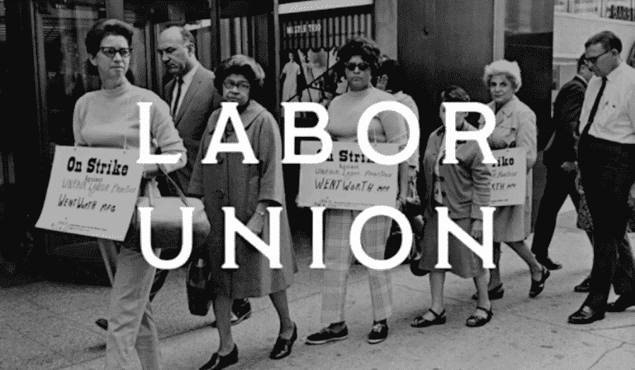

Labor Union font

受 20 世纪中期印刷术启发的[工会](https://pixelsurplus.com/collections/free-fonts/products/labor-union-free-vintage-serif-font)字体非常适合任何需要复古工业感的项目。它是完全免费的，包括商业用途，所以继续把这些粗体衬线放在任何类型的项目中。

> 需要在这里大声喊出来。Kinsta 太神奇了，我用它做我的个人网站。支持是迅速和杰出的，他们的服务器是 WordPress 最快的。
> 
> <footer class="wp-block-kinsta-client-quote__footer">
> 
> 
> 
> <cite class="wp-block-kinsta-client-quote__cite">Phillip Stemann</cite></footer>

[View plans](https://kinsta.com/plans/)

### 2\. TOOM

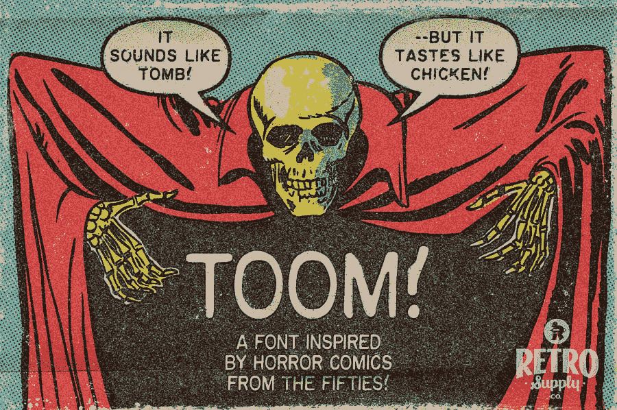

TOOM font

《TOOM》在很大程度上基于 EC Comics 的作品，这家公司在 20 世纪 40 年代和 50 年代出版了恐怖、黑暗幻想和科幻漫画。他们标志性的不可思议的文字是用一台机器模仿[的手写风格](https://kinsta.com/blog/calligraphy-fonts/)创造出来的。老漫画迷会喜欢这个的。

### 3.三伏天

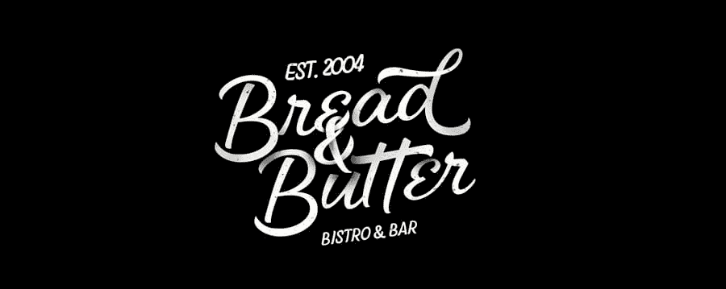

Dog Days font

[三伏天](https://www.myfonts.com/fonts/fenotype/dog-days/)设法完美地捕捉过去流行的手写[书法毛笔字](https://kinsta.com/blog/calligraphy-fonts/)。它借鉴了一个老式泳装广告的风格。虽然它可能基于一种老式字体，但它有许多引人注目的 OpenType 特性。

### 4.冷饮柜

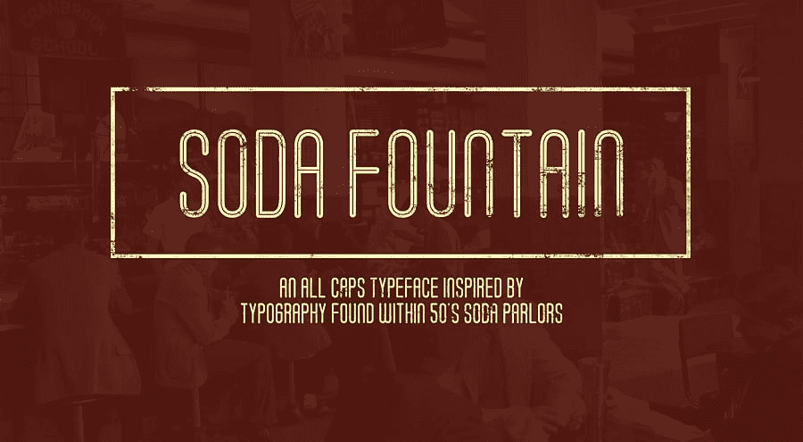

Soda Fountain font.

[Soda Fountain](https://www.behance.net/gallery/29016679/Soda-Fountain-%28Free-Typeface%29) 是一种全大写字体，基于 20 世纪 50 年代餐车和苏打店的排版。它光滑、柔和的线条看起来非常复古，个人和商业使用都是免费的。

### 5.旅行

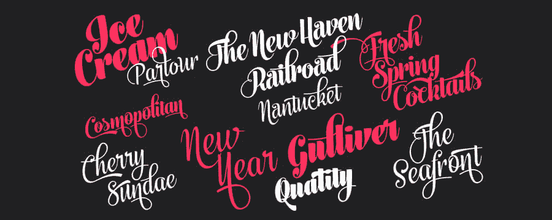

Journey font.

[Journey](https://www.myfonts.com/fonts/fenotype/journey/) 是一种老式的毛笔字体，捆绑了装饰和备用字符，使其非常通用。如果你想模仿 50 年代优雅的广告，试试这个。

### 6.新鲜压榨

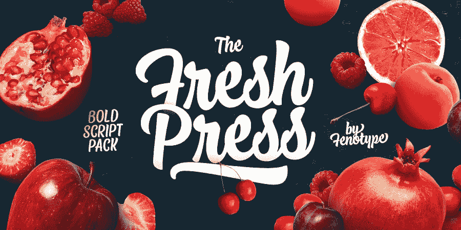

Fresh Press font.

许多 50 年代的草书字体细长而优雅，但是,[出版社的](https://www.myfonts.com/fonts/fenotype/fresh-press/)采用了更大胆的外观，这肯定会令人惊叹。如果你想要旧时代的感觉，还有一种更粗糙、更有质感的字体。

### 7.粉末脚本

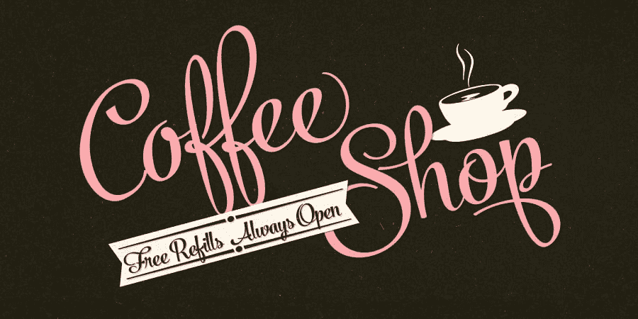

Powder Script font.

需要迷人的东西吗？试试[粉剧本](https://www.behance.net/gallery/18997707/Powder-Script-Typeface)。每个字母上的花体都很精致，字体每种粗细包括 800 个字形，所以你输入的每个字母都是独一无二的。

### 8.投手

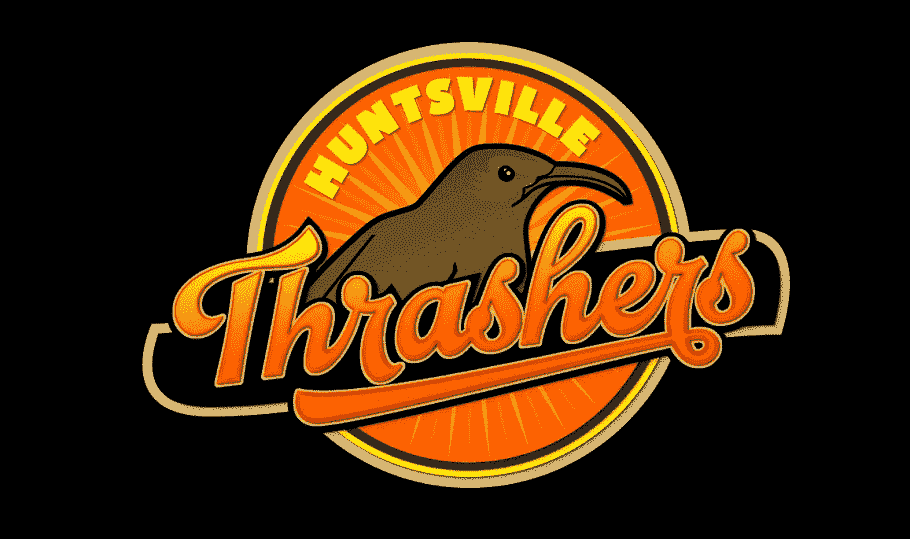

Pitcher font.

[Pitcher](https://creativemarket.com/Fenotype/4747068-Pitcher-baseball-script) 试图用充满个性的大胆字体捕捉上世纪四五十年代美国文化的一点味道。有干净的版本和纹理，grungier 可供选择。

### 9.模板 1952

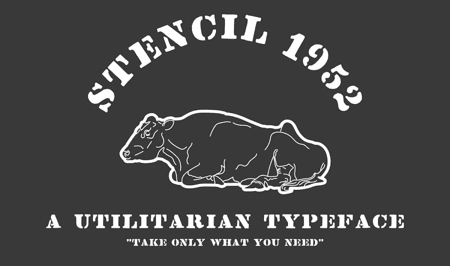

Stencil 1952 font.

[Stencil 1952](https://creativemarket.com/JeffryMacpherson/2643959-Vintage-Stencil-Font-from-the-1950s) 是在一本旧印刷书籍中发现的一种干净、实用的模板字体，所以你知道它是真的。许多字体试图模仿这个时代的印刷字体，但这一个是从过去的权利。

### 10.无的小屋

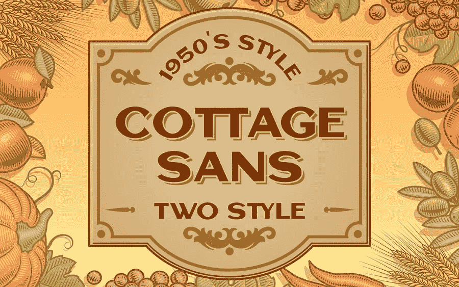

Cottage Sans font.

Cottage Sans 是一种漂亮、质朴的字体，具有规则和圆润的风格。强烈的无衬线将在任何设计中看起来很好，以钉旧怀旧的感觉。
T3】

## Groovy 60s 年代字体

### 11.拉姆多内

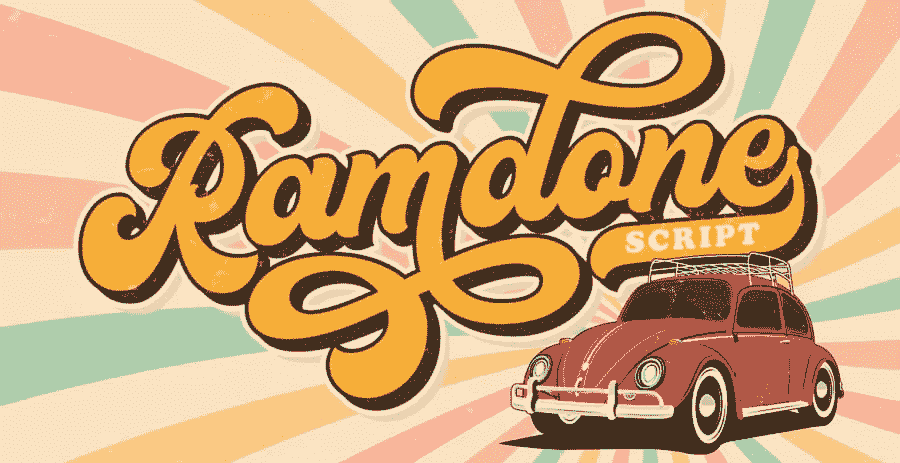

Ramdone font.

在 [Ramdone](https://elements.envato.com/ramdone-retro-script-L6FZGVP) 字体中，你可以看到从 50 年代的[笔刷脚本](https://kinsta.com/blog/cursive-fonts/)到类似的东西的过渡，但是多了一点活力。它还包括挤压效果，所以你可以让你的字体看起来三维。

### 12.绝妙的

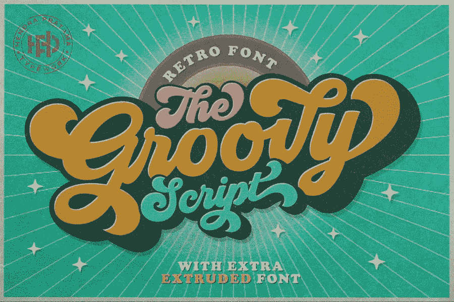

Groovy font.

这些大胆的 3D 脚本在 60 年代和 70 年代很流行，而 [Groovy](https://elements.envato.com/groovy-retro-font-8M4TS9R) 完美地抓住了这一点。由于字体带有突出效果，所以很容易使字体看起来像预览图片一样。

### 13.太远了！

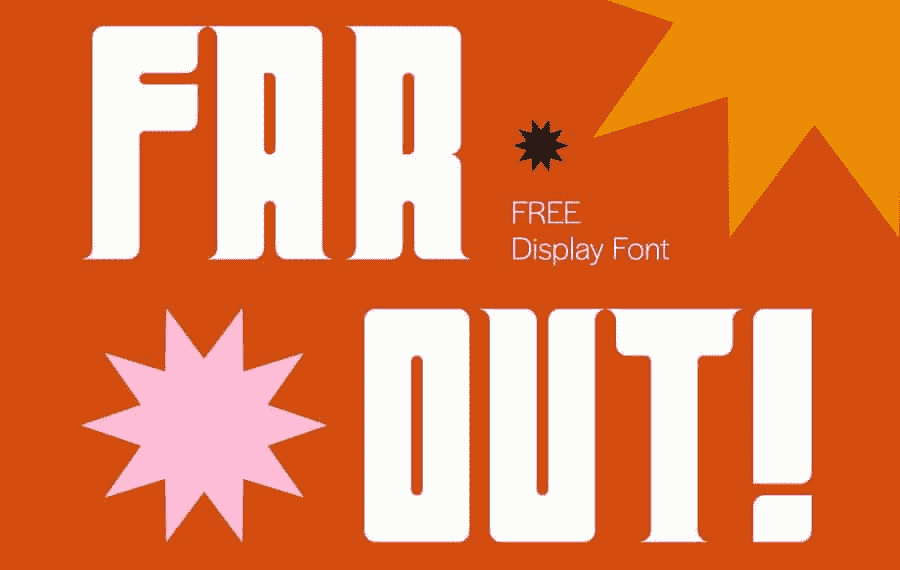

Far Out! font.

[Far Out 的](https://www.behance.net/gallery/98211911/Far-Out-A-Free-Display-Font)灵感稍微宽松一点，但还是能看到 60 年代的独特风格织入其中。由于它对所有类型的使用都是免费的，如果你想要一些有点不同但仍然明确属于这个时代的东西，你应该尝试一下。

### 14.送牛奶的人

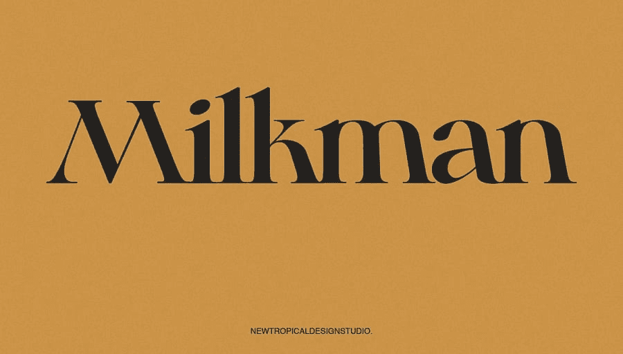

Milkman font.

这是一个有趣的问题。[送奶工](https://creativemarket.com/NewTropical/5663966-Milkman-Serif-Font)结合了复古和[现代排版](https://kinsta.com/blog/modern-fonts/)来创造一些容易融入 21 世纪，但保留了复古氛围的东西。

### 15.海盗

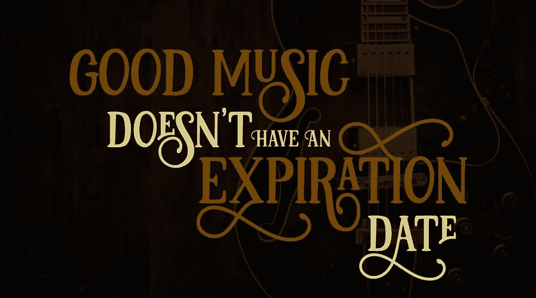

Pirates font.

这个时髦的剧本在海报上看起来会很完美。这些小的艺术标志很漂亮，给字体增加了很多特色，但是即使没有它们, [Pirates](https://creativemarket.com/Unicode/950309-Pirates) 仍然非常优雅和细致。

### 16.童话故事

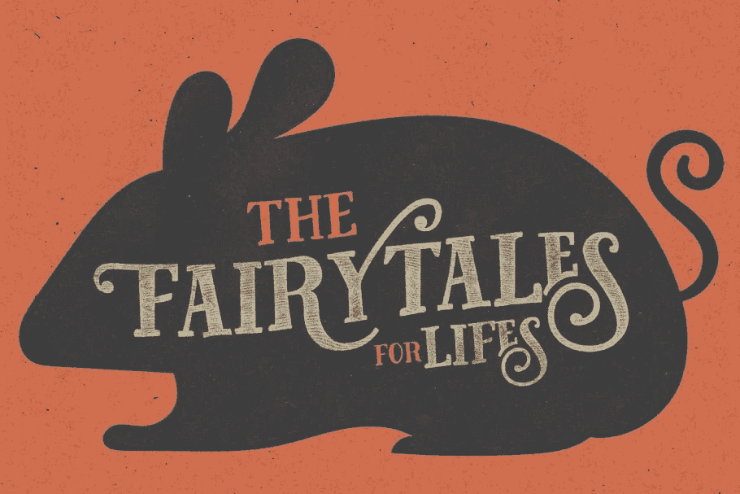

Fairy Tales font.

古老的童话总是能唤起怀旧之情，虽然这种设计是永恒的，但它仍然让人想起 20 世纪中期异想天开的广告。这个[童话](https://creativemarket.com/artimasa/159205-Fairy-Tales-Bonus)包也有一些矢量动物设计，与神秘字体搭配得很好。

### 17.托皮卡岛

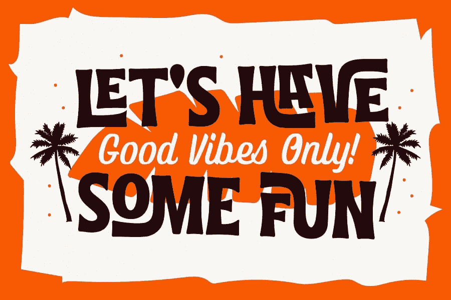

Tropika Island font.

本世纪中叶，人们痴迷于这种生动的热带风格，而热带岛屿让人想起了当时的广告和标志。这种字体既有加粗的主字体，也有柔和但风格化的字体。

### 18.乱穿马路的人

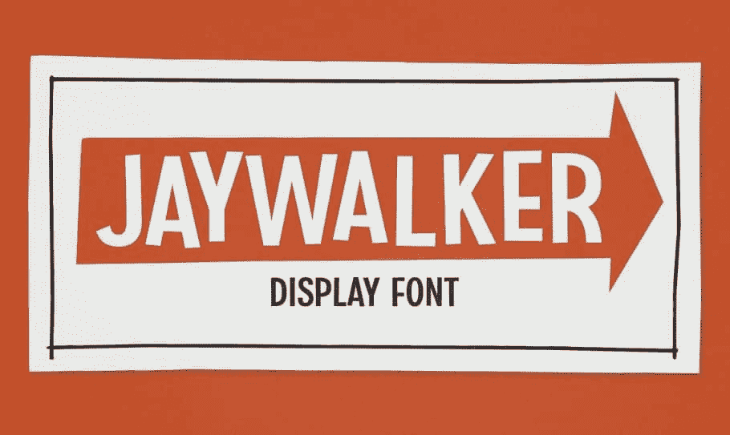

Jaywalker font.

虽然设计简单，但“乱穿马路者”对 20 世纪 60 年代的海报、广告和卡通充满了怀旧之情。这是一种全大写字体，包括数字、特殊字符和相当数量的重音字母。

### 19.霜

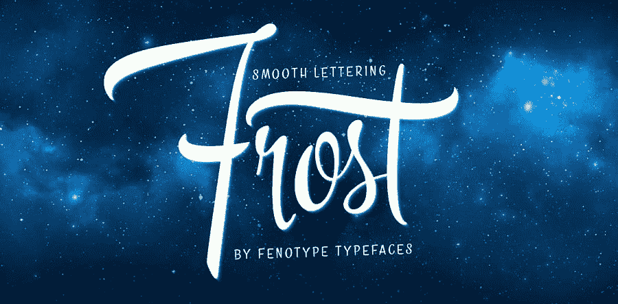

Frost font.

如果你在寻找一种既忠实于经典风格又符合现代设计的复古字体，那么[弗罗斯特](https://www.myfonts.com/fonts/fenotype/frost/)是最佳人选。它包括三个重量，一个大写字母和小大写字母版本，以及各种装饰来美化文本。每个字母至少有三种字形，所以看起来不会重复。

### 20.大胡子

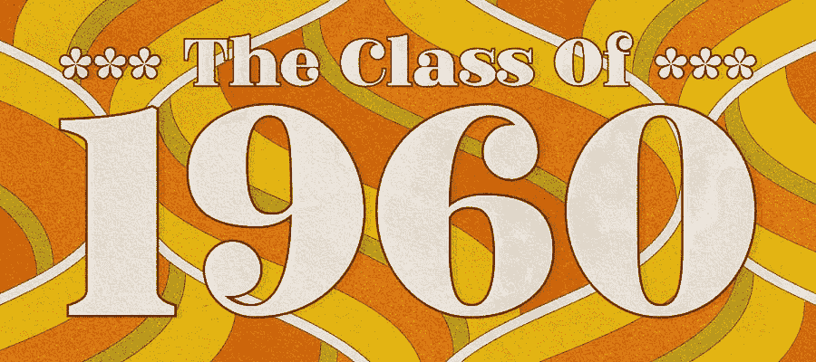

The Beardy font.

胡子是一种大而明亮的衬线字体，是对六七十年代流行文化的一种回拨。粗体字体最适合标题、徽标和大型海报，可以立即将您的项目传送回过去。

## 活泼的 70 年代复古字体

### 21.迪伦

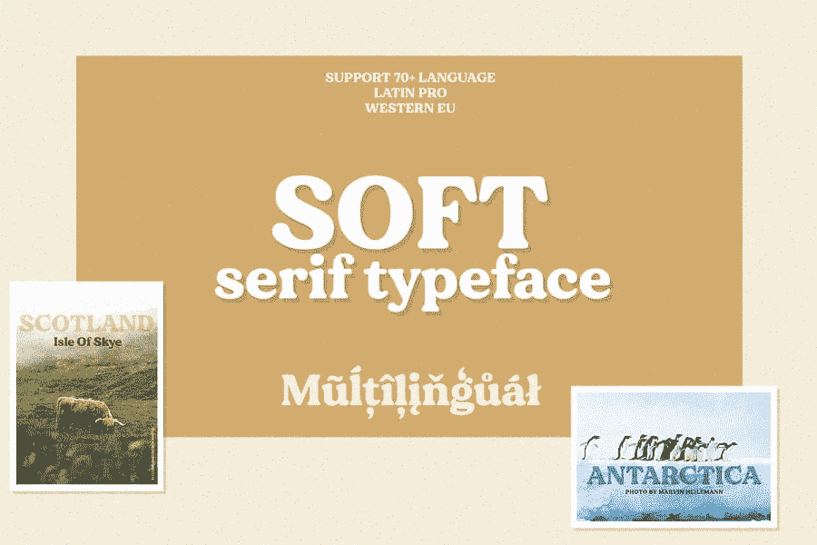

Dillan font.

Dillan 的特色是柔和的衬线，特别适合老式海报，如演示图片所示，尽管这是一种可以在任何地方工作的通用字体。

### 22.洛伐他汀

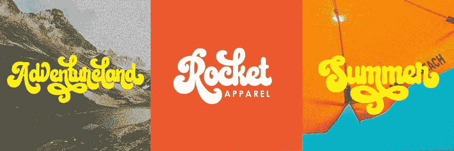

Lovadelic font.

虽然 [Lovadelic](https://creativemarket.com/Aiyari/1772484-Lovadelic-Extras) 与许多其他“groovy”脚本字体相似，但正如其名称所暗示的那样，它采用了一种更加迷幻的方法，使用了艳丽的连字和字形。也有一些粗略的图形捆绑在一起，与字体相结合。

### 23.弗里托·万迪托

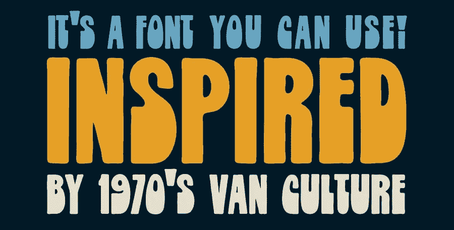

Frito Vandito font.

20 世纪 70 年代的货车文化对那个时代的字体设计有其独特的见解，Frito vandi to(T1)完美地概括了这一点。底部厚重、不完美的边缘为这种 70 年代风格的字体增添了独特的味道。

### 24.恢复原状

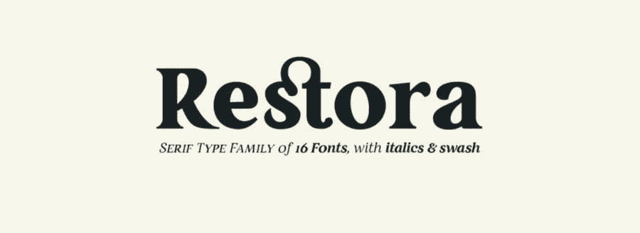

Restora font.

Restora 是一种罗马衬线字体，由于使用了花体和连字，它有点像喇叭。虽然它比这个时代的一些字体有点过时，但它非常适合更专业但仍然复古的作品。

### 25.老方法

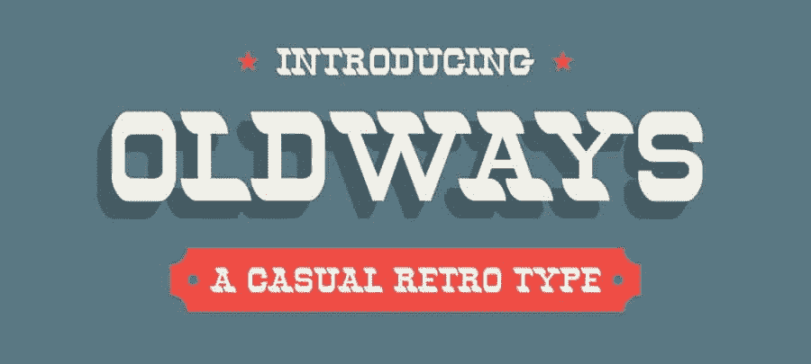

Oldways font.

古老的风格类似于古老的[西式字体](https://kinsta.com/blog/western-fonts/)，有着风格化的衬线，但它混合了现代风格。它对个人和商业用途都是免费的，它对任何希望抓住西方市场的项目都是一个很好的补充。

### 26.幼子

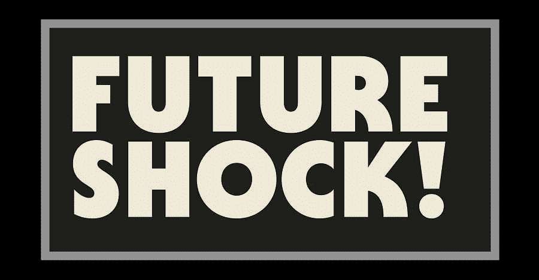

Cadet font.

学员的根在包豪斯，这是一种在 20 世纪 20 年代和 30 年代流行的艺术设计，尽管它在 70 年代再次兴起。它也是基于 20 世纪 70 年代的几种字体，所以它是一种非常真实的复古字体。

### 27.传家宝

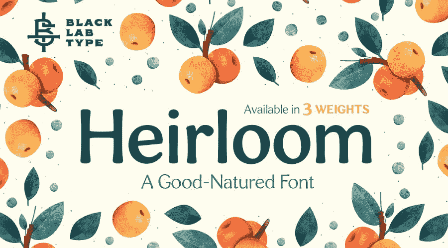

Heirloom font.

忠于它的口号，[传家宝](https://creativemarket.com/BlackLabType/3924262-Heirloom-A-Good-Natured-Font)是一种活泼友好的字体，适合任何老式的审美，尤其是那些自然和朴实的根源。70 年代的许多字体风格化程度很高，但传家宝更柔和，可读性更强。

## 注册订阅时事通讯

### 想知道我们是怎么让流量增长超过 1000%的吗？

加入 20，000 多名获得我们每周时事通讯和内部消息的人的行列吧！

[Subscribe Now](#newsletter)

### 28.76 年夏天

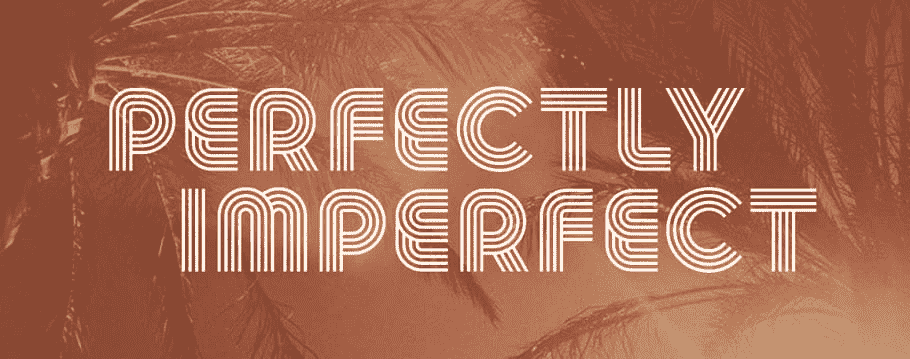

Summer of 76 font.

[76 年夏天](https://creativemarket.com/Darumo/2700198-Summer-0f-76-Multi-Line-Font)是一种多行字体，让人想起 70 年代的霓虹灯。尽管它有独特的外观，但它是一种非常轻松的字体。如果你想要更具可读性和实用性的东西，还有一个可靠的版本。

### 29.橄榄村

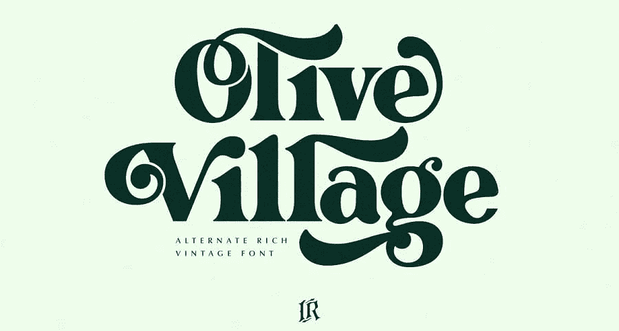

Olive Village font.

橄榄村成功地将活泼的时髦风格转化为优雅。这种字体在专业印刷品或海报中不会显得格格不入。它保持了经典的感觉，同时在当前的项目中仍然看起来很好。

### 30.橘子

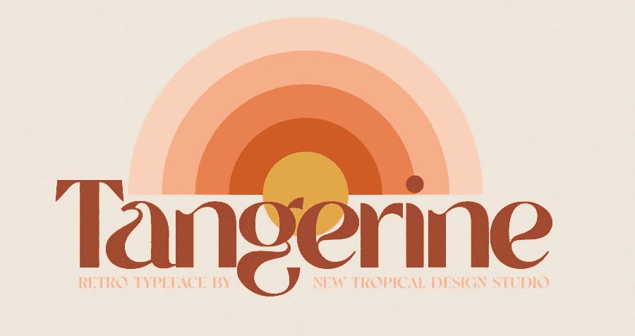

Tangerine font.

橘红色的设计唤起了人们对 70 年代及其设计的怀旧之情。设计师们没有直接复制旧的印刷字体，而是在保持对十年的真实的同时，对这种风格进行了诠释。

### 31.迷幻泡沫

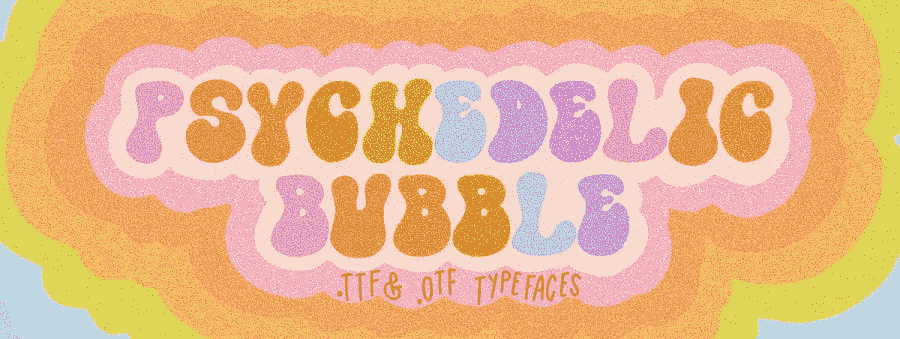

Psychedelic Bubble font.

彩色泡泡字体在 70 年代很流行，而[迷幻泡泡](https://creativemarket.com/DDDesignStudio/5929319-Psychedelic-Bubble-70s-Font)获得了这种有趣的美感。如果你想给你的项目打上复古的烙印，这是个不错的选择。

## 有趣的 80 年代复古字体

### 32.周六晚上

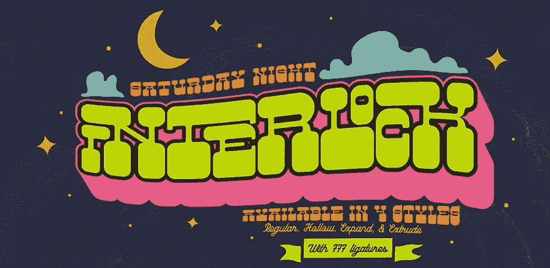

Saturday Night font.

80 年代和 90 年代导致了大量的实验，像这样的狂野设计是司空见惯的。[周六夜](https://elements.envato.com/saturday-night-font-family-LQ28Z98)是为了向迪斯科场景致敬而设计的，与其独特的设计如出一辙，联锁变体有 777 个连字。

### 33.逆转录醇

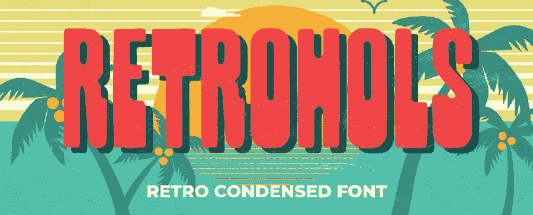

Retrohols font.

你可以看到 70 年代时髦的、拉长的、垂直不对称的风格一直延续到下一个十年。Retrohols 是一种奇特的字体，稍微精致一些，但同样生动。

### 34.大雷雨

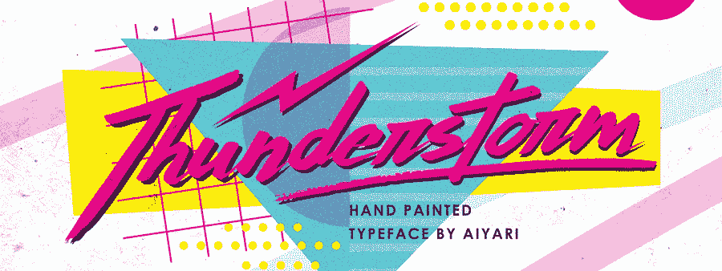

Thunderstorm font.

《雷雨》用大胆、倾斜的笔触让人想起八九十年代的流行文化设计。如果你需要一个充满活力的显示字体，这是完美的选择。

### 35.西侧字体

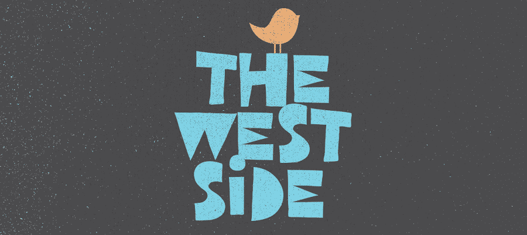

West Side font.

[West Side](https://www.webdesignerdepot.com/2017/07/free-download-west-side-font/) 是一种可爱的字体，可以在任何项目中免费使用。块状的风格让人想起 80 年代的漫画和海报，独特而美丽的风格会立即生效。

### 36.雷泽 84

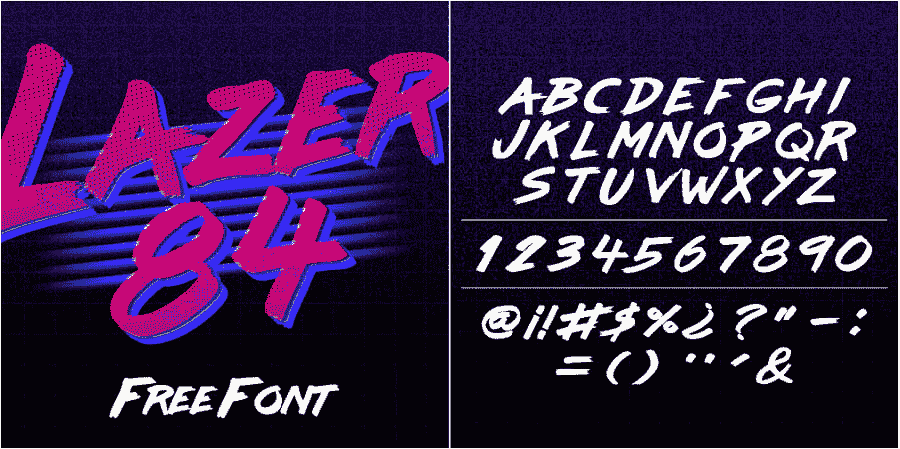

LAZER 84 font.

LAZER 84 是一个粗糙的笔刷脚本，在 80 年代流行的高科技/合成波风格的图形中看起来很棒。这款是个人免费使用的，可以随意试用。

### 37.瘫痪了

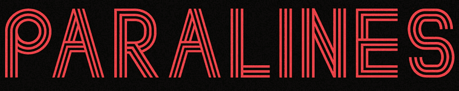

Paralines font.

Paralines 字体的创造者将其描述为复古未来主义，灵感来自 80 年代复古风格和现代设计。这是免费的，只要你在你的网站上注明设计师的名字。

需要为你的 WordPress 站点提供超快的、可靠的、完全安全的托管服务吗？Kinsta 提供所有这些以及 WordPress 专家提供的 24/7 世界级支持。[查看我们的计划](https://kinsta.com/plans/?in-article-cta)

### 38.阿斯特尔

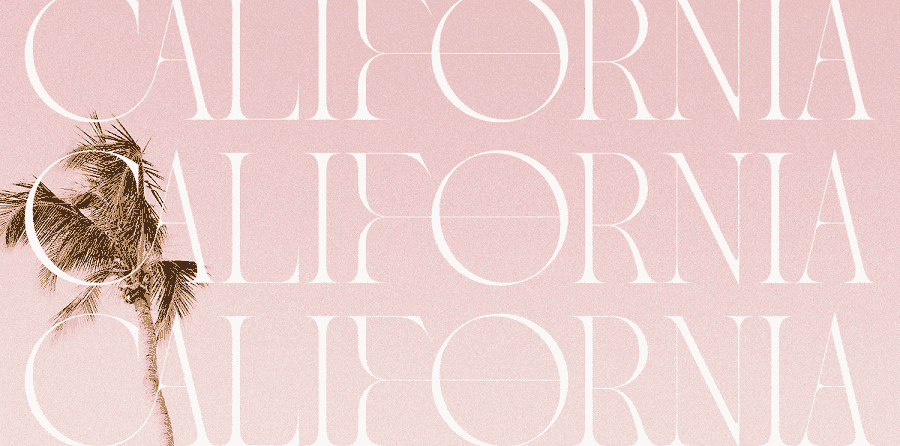

Asther font.

当人们想到 80 年代的字体时，他们的脑海中可能会出现特定的“技术”风格或 70 年代遗留下来的泡沫，但 80 年代也有大量优雅和专业的字体。as her 是一种纤细的老式字体，用在时尚网站或广告海报上会很好看。

### 39.霉事无边

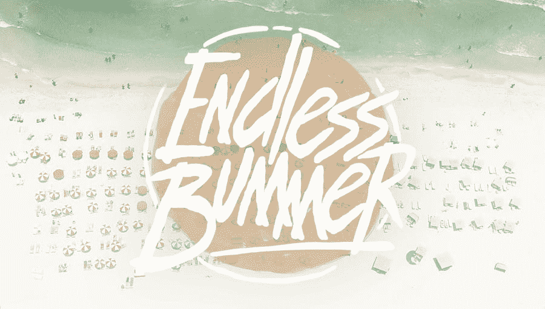

80 年代的滑板文化带来了自己的文化和字体，而[无尽的烦恼](https://www.behance.net/gallery/25209871/ENDLESS-BUMMER-HAND-DRAWN-FONT)将你带回到那些古老的图形和品牌。个人和商业使用也是免费的。

### 40.立体声

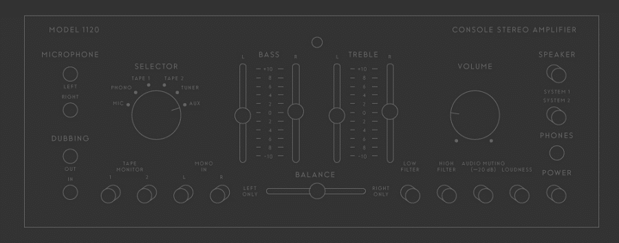

Stereo font.

[Stereo](https://www.behance.net/gallery/35961883/Stereo) 是一种自由字体，类似于旧的 90 年代立体声扬声器上使用的字体。这是一个独特的想法，结果是一个简单而有吸引力的，但无疑是复古的字体。个人使用也是免费的。

### 41.罗思科

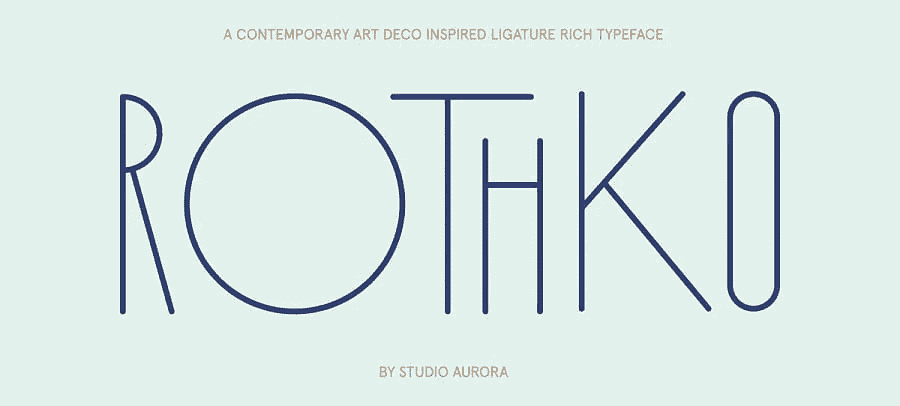

Rothko font.

这种独特的装饰艺术风格在整个世纪中时好时坏，但在 20 世纪 80 年代经历了复兴。 [Rothko](https://creativemarket.com/StudioAurora/4590812-Rothko-Modern-Art-Deco-Display-Font) 是多语言的，支持十几种语言，所以任何人都可以使用这种独特的字体。

### 42.字母魔法

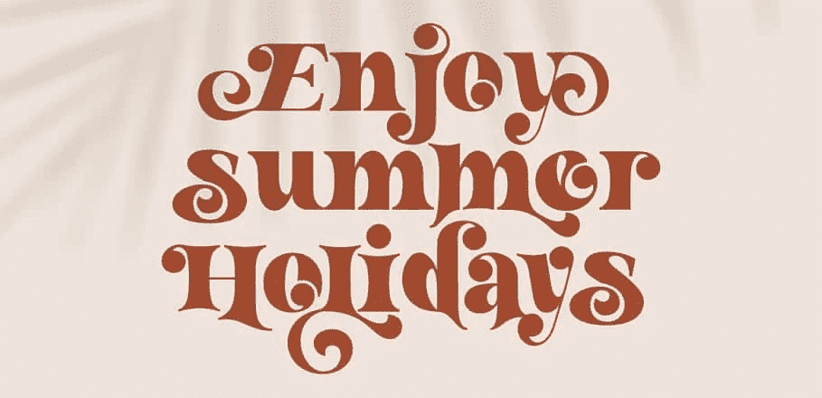

[字母魔术](https://creativemarket.com/hansco.studio/6293692-Letter-Magic-Retro-Serif-Font)是一种有趣、好玩的字体，带有各种艺术装饰和花体。这将非常适合任何需要老式、轻松主题的项目。

### 43.复兴 80

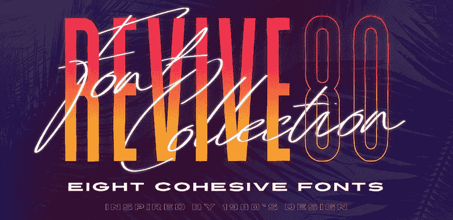

Revive 80 font.

[Revive 80](https://creativemarket.com/TomChalky/3998402-Revive-80-Retro-1980s-Font-Pack) 字体包捕捉了 80 年代字体的大胆和块状外观。它包括字体的 Phatt、Wide、Tall 和 Signature 版本，每个版本都有一个轮廓版本，以形成 8 种字体的捆绑。

## 怀旧 90 年代复古字体

### 44.埃斯库尔

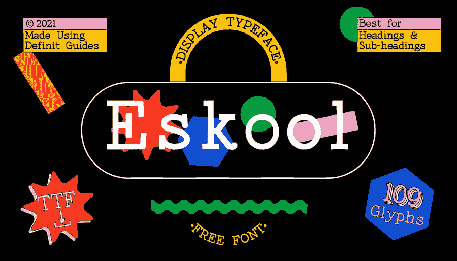

Eskool font

如果你在 90 年代上过学，或者玩过那个时代的教育娱乐游戏，那么你应该对埃斯库尔非常熟悉。在任何个人项目中免费使用它，体验 20 世纪 90 年代的怀旧味道。

### 45.热潮

Hot Rush font.

受 80 年代和 90 年代快节奏汽车文化的启发， [Hot Rush](https://creativemarket.com/SamParrett/4623482-Hot-Rush-Font-Duo) 是一种非常棒的字体，包括几种变体:标准变体加斜体、带斜体的条纹和脚本字体。还有 swashes，alternates，多语言支持！

### 46.90 九十

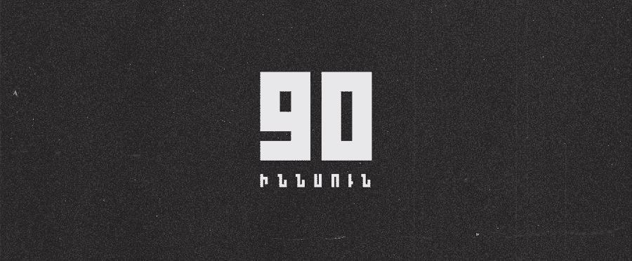

90 Ninety font.

这是一种完全免费的亚美尼亚字体，有点老派，但仍然很酷。光是数字在技术设计中就很棒。

### 47.浪费的青春

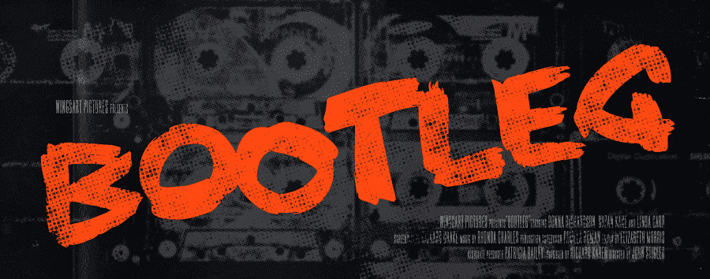

Wasted Youth font.

浪费的青春是一种肮脏的字体，从溜冰者文化、恐怖电影海报和 90 年代的朋克乐队中汲取灵感。它有三种风格:干净的版本和两种用记号笔和毛笔手绘的版本。

### 48.孟斐斯

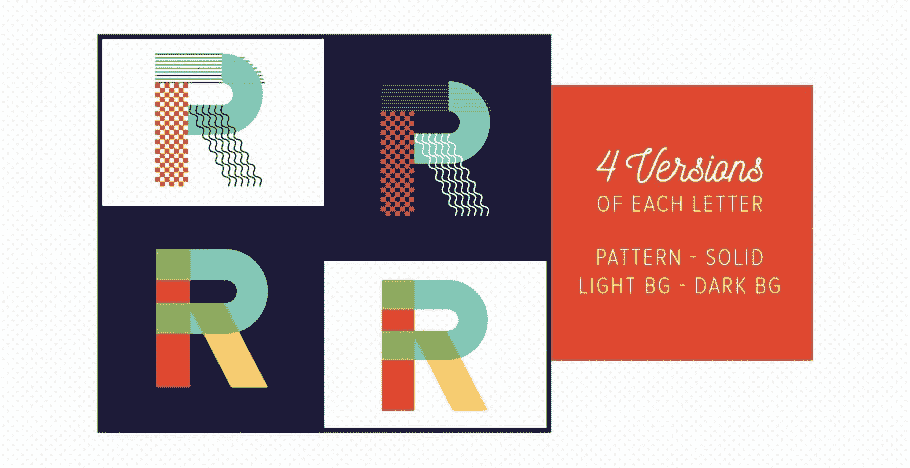

MEMPHIS font.

彩色字体并不常见，因为它们并不总是网络安全的，但是 T2 孟菲斯使用了这项新技术。这种有趣的字体类似于拼接，可以在家中巧妙的或卡通式的设计。还有四种风格可供选择，以适应不同的背景或设计需求。

### 49.幼稚的幻想

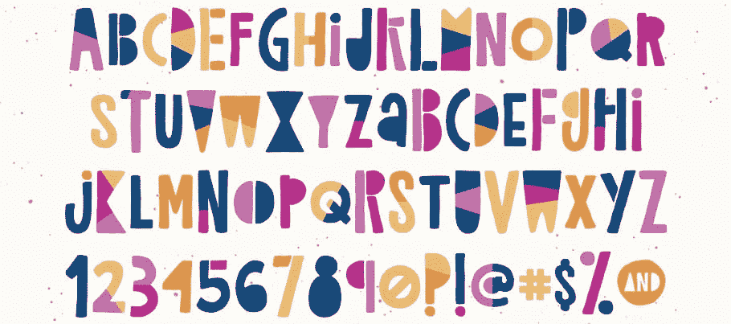

Childish Reverie font.

90 年代还是孩子的人会对幼稚的幻想有很多怀念。它不仅完美地捕捉了那个时代儿童媒体的排版风格，而且它还包括常规字体、 [SVG 和 PNG](https://kinsta.com/blog/svg-vs-png/) 中的彩色字体，以及各种可以用来装饰文本的涂鸦。

### 50.巴欧

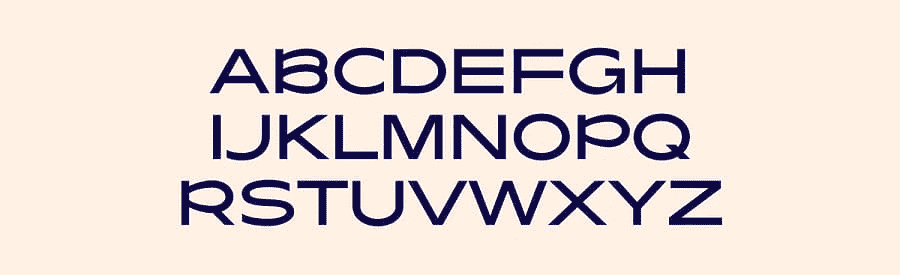

Baou font.

乍一看，这看起来像一个标准的无衬线字体，但一些独特的风格使它与众不同。 [Baou](https://creativemarket.com/ThatThatCreative/6179046-Baou-Modern-Sans-Logos) 适用于各种尺寸和场合。

### 51.地狱建造者

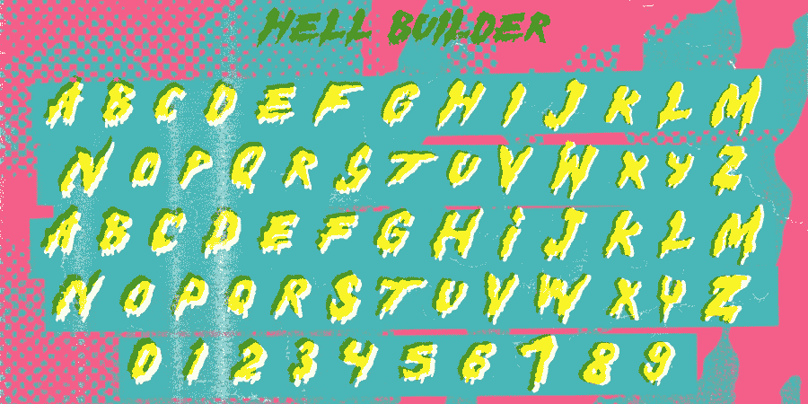

Hell Builder font.

90 年代的青少年恐怖小说有着非常独特的风格，而《地狱建造者》完美地诠释了这一风格。把它用在标志和海报上来模仿这个恐怖的时代，没有人会知道它来自这个时代。

### 52.科姆巴

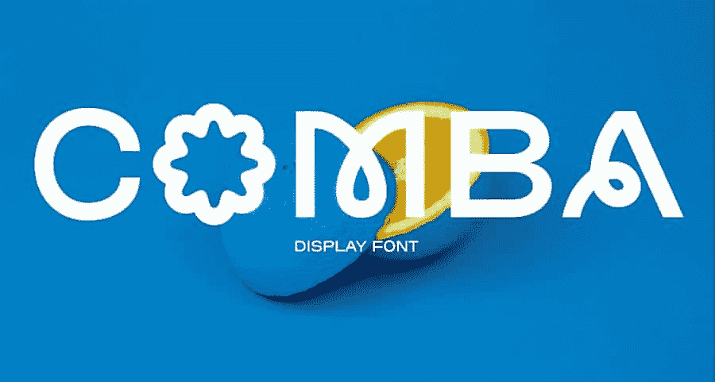

Comba font.

[科姆巴](https://creativemarket.com/ThatThatCreative/6046683-Comba-Display-Font-Logos)是一种古怪的全大写字体，充满了 90 年代印刷的趣味和时尚。如果你想要一种不太正常的字体，并且能立刻突出来，就使用它。

### 53.狂野之星

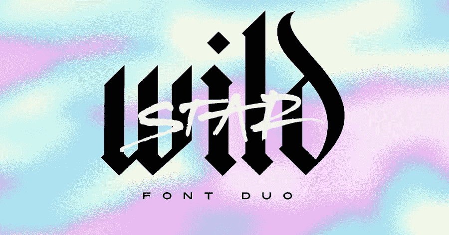

Wild Star font.

[Wild Star](https://creativemarket.com/SamParrett/6242374-Wild-Star-Font-Duo) font duo 搭配得非常好，很容易让人想起 90 年代的摇滚文化。这使得它非常适合作为专辑封面，尽管你可以在任何需要大胆和响亮的字体组合的地方使用它。

### 54.终极 90 年代字体包

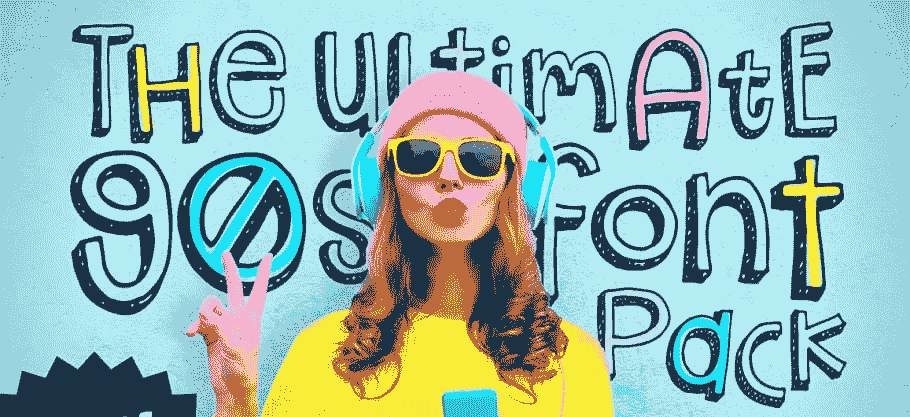

The Ultimate 90s Font Pack font.

虽然最终的 90 年代字体包不只是一种字体，但它是一个很好的 90 年代风格的字体包，包括这个列表中的一种，孩子气的幻想。它包括一个独家气泡字体，以增加交易的甜头。有了这个包，你将有机会接触到 20 世纪 90 年代所有的古怪，高能印刷。

## 如何挑选最好的复古字体

有这么多字体可供选择，你可能会感到有点不知所措！让我们缩小一点选择范围。

首先，选择一个你想要模仿的特定的十年或二十年可能是最容易的。每个时代都有一些重叠，但 90 年代毫不掩饰的独特字体与 50 年代更优雅的品牌和标牌相去甚远。

根据您的目标受众以及您选择的是旧时代还是新时代，复古字体可以为您的项目带来优雅和怀旧的氛围，或者更舒适和怀旧的感觉。

一旦你选择了一个十年，根据更严格的标准挑选一种字体就容易多了。决定预算——或者从列表中选择一种免费字体——看看字体的字符集是否符合您的需要(例如，如果您需要多语言字体或某些特殊字符)。

您可以根据大小和可读性要求进一步缩小范围。如果你要在 logo、网站标题或大型图片/海报中使用这种字体，可读性就不那么重要了，你可以选择适合大尺寸的字体。

如果你打算在整段文字中使用它，这些更具装饰性的字体选择中的许多都不会起作用。你需要选择一种易读的字体，在较小的尺寸下看起来也不错。

很多这种复古字体非常有风格，不适合小字体，但是这里有一些可以做到。

[想要一场来自过去的疾风？👀看看这些 50 多种漂亮的复古字体选项😍](https://twitter.com/intent/tweet?url=https%3A%2F%2Fbit.ly%2F3H9wPmO&via=kinsta&text=Want+a+blast+from+the+past%3F+%F0%9F%91%80+Check+out+these+50%2B+beautiful+retro+font+options+%F0%9F%98%8D&hashtags=Typography%2CFonts)

## 摘要

20 世纪是一个多元文化的世纪。每个时代都有独特的东西可以提供。无论你是在寻找一个优雅的毛笔字体还是一个活泼的显示字体，这些 50+怀旧字体之一有你需要的。

需要更多的字体吗？查看一下[前 15 种谷歌字体](https://kinsta.com/blog/best-google-fonts/)和 [50 多种现代字体](https://kinsta.com/blog/modern-fonts/)，了解一下现在流行什么。

* * *

让你所有的[应用程序](https://kinsta.com/application-hosting/)、[数据库](https://kinsta.com/database-hosting/)和 [WordPress 网站](https://kinsta.com/wordpress-hosting/)在线并在一个屋檐下。我们功能丰富的高性能云平台包括:

*   在 MyKinsta 仪表盘中轻松设置和管理
*   24/7 专家支持
*   最好的谷歌云平台硬件和网络，由 Kubernetes 提供最大的可扩展性
*   面向速度和安全性的企业级 Cloudflare 集成
*   全球受众覆盖全球多达 35 个数据中心和 275 多个 pop

在第一个月使用托管的[应用程序或托管](https://kinsta.com/application-hosting/)的[数据库，您可以享受 20 美元的优惠，亲自测试一下。探索我们的](https://kinsta.com/database-hosting/)[计划](https://kinsta.com/plans/)或[与销售人员交谈](https://kinsta.com/contact-us/)以找到最适合您的方式。