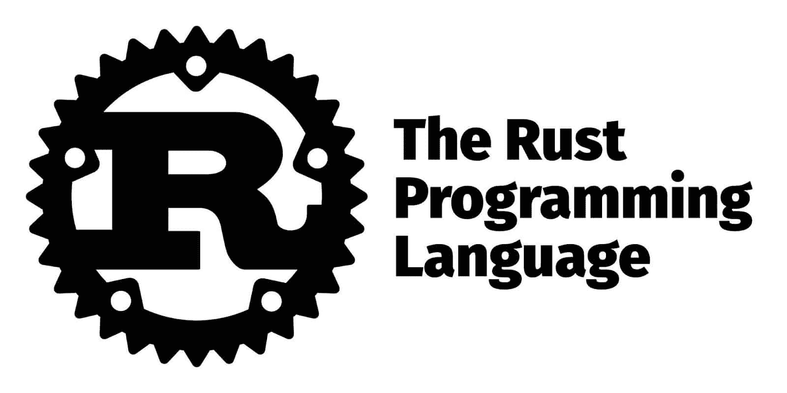
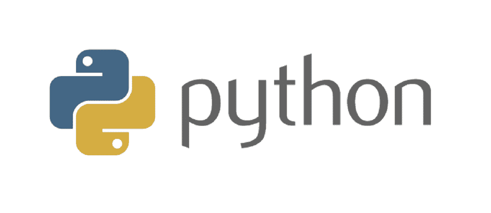
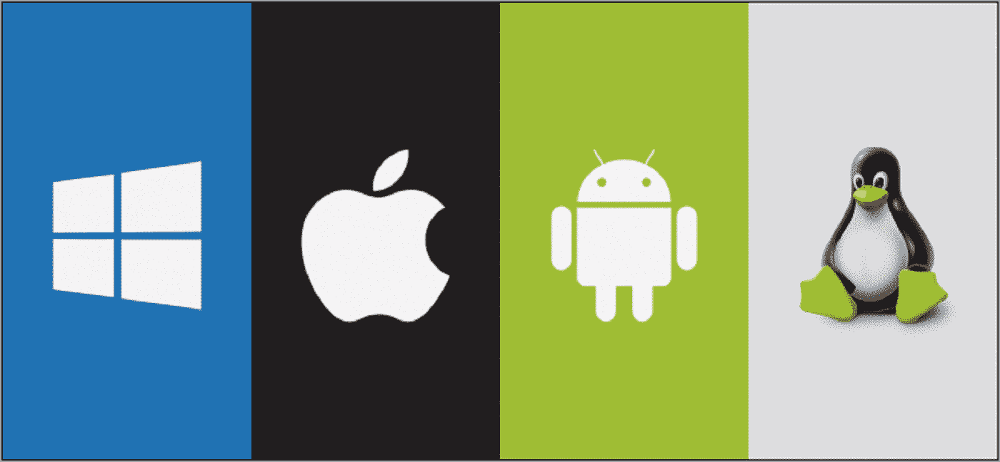

# Rust vs Python:哪个最适合你的项目？

> 原文：<https://kinsta.com/blog/rust-vs-python/>

Rust vs Python 是最近的热门话题。虽然这两种语言都可以用于通用编程，但在某些情况下，一种语言比另一种语言更好。[锈？Python？哪个适合你的项目？👀在这里了解更多⬇️ 点击推文](https://twitter.com/intent/tweet?url=https%3A%2F%2Fkinsta.com%2Fblog%2Frust-vs-python%2F&via=kinsta&text=Rust%3F+Python%3F+Which+one+is+right+for+your+project%3F+%F0%9F%91%80+Learn+more+here+%E2%AC%87%EF%B8%8F&hashtags=Python%2CWebDev)

要知道哪一个应该用于您的项目，您应该对两者的特性和架构有很好的理解。这篇 Rust vs Python 的文章将帮助您解决这个问题。

我们开始吧！

## 什么是铁锈？

Rust programming language Logo. (Image source: [Rust Official Site](https://www.rust-lang.org/))

Rust 是一种相对较新的[编程语言](https://kinsta.com/blog/best-programming-language-to-learn/),因为它能够创建高性能、高内存效率和可靠的应用程序而迅速流行起来。这种静态类型的编程语言具有与 C++相似的语法。

它没有任何垃圾收集或运行时。因此，Rust 为 C++中的许多问题提供了解决方案，包括并发性和内存管理问题。虽然 Rust 是一种相对年轻的语言，但它在 2022 年 StackOverflow 开发者调查中也将第七年标记为最受欢迎的技术。

### 谁会用铁锈？

Companies that use Rust. (Image source: [OpenXcell](https://www.openxcell.com/blog/golang-vs-rust/))

自从 Rust 问世以来，许多公司，从初创公司到大型组织，都开始采用它来增强现有的和构建新的软件应用程序和服务。现在，许多世界领先的科技公司都在使用 Rust。以下是他们如何使用它。

> 需要在这里大声喊出来。Kinsta 太神奇了，我用它做我的个人网站。支持是迅速和杰出的，他们的服务器是 WordPress 最快的。
> 
> <footer class="wp-block-kinsta-client-quote__footer">
> 
> 
> 
> <cite class="wp-block-kinsta-client-quote__cite">Phillip Stemann</cite></footer>

[View plans](https://kinsta.com/plans/)

1.  **亚马逊:**亚马逊将 Rust 用于其[云服务](https://kinsta.com/blog/what-is-cloud-storage/)，如亚马逊弹性计算云(EC2)、亚马逊简单存储[服务(S3)](https://kinsta.com/knowledgebase/wordpress-amazon-s3/) 和 CloudFront。亚马逊也是促成 Rust 的公司之一。
2.  **Dropbox:** 世界领先的文件托管提供商 Dropbox 在其文件同步服务中使用了 Rust，这是其关键组件之一。
3.  谷歌:谷歌是 Rust 基金会的另一家公司。它使用 Rust 进行 Android 开发，是开发 Linux 内核操作系统的主要语言。
4.  **微软:**微软在其 Windows 操作系统中使用 Rust，他们将推出新版本的 Rust，使开发者能够使用 Windows API 进行软件开发。
5.  Coursera: 世界领先的在线学习平台之一使用 Rust 作为其编程作业功能。

## Python 是什么？

Logo of Python.

Python 是 2022 年最[流行的脚本语言之一。Python 被用于许多领域，包括机器学习、数据科学、](https://kinsta.com/blog/scripting-languages/)[、数据可视化](https://kinsta.com/blog/data-visualization-tools/)、数据分析、开发运维、自动化和测试。

Python 的简单语法使它成为全世界开发新手的理想选择。2022 年栈溢出开发者调查显示，在专业人士和学习编码的人群中，它是第三受欢迎的语言。Python 优先考虑[面向对象编程](https://kinsta.com/blog/python-object-oriented-programming/)，尽管您也可以将它用于函数式编程。

### 谁用 Python？

Popular companies that use Python. (Image source: [DailySmarty](https://www.dailysmarty.com/posts/top-10-python-development-company-to-hire-8e5b806b-eff6-48c9-bb77-05b10127f22f))

Python 广泛应用于 IT、教育、政府、金融等行业。以下是使用 Python 的顶级科技公司。

1.  **脸书:**脸书的工程师将 [Python 和 PHP](https://kinsta.com/blog/php-vs-python/) 一起使用，因为 Python 让他们可以更快地开发和部署应用程序和功能。Python 用于脸书基础设施管理和多种服务，包括脸书 Ads API 和 Python 异步 IRCbot 框架。
2.  **Google:** Google 在脚本工作中使用 Python 是因为它的简单高效。谷歌用 Python 代替了其第一个基于 java 的网络爬行蜘蛛，用于网络抓取的。
3.  **网飞:**网飞是一家使用 Python 进行数据分析的公司。此外，他们在中央警报网关中使用它来发送用户警报和跟踪安全变化的猴子应用程序。
4.  **Spotify:** Spotify 是另一家使用 Python 进行数据分析的公司。还有很多其他地方他们使用 Python。他们使用 [Django 框架](https://kinsta.com/blog/django-vs-laravel/)和 ZeroMQ 网络库用于[后端](https://kinsta.com/blog/backend-vs-frontend/)应用。此外，他们使用它来创建流程、脚本和原型。
5.  Instagram: Instagram 是一款支持图片和视频分享的社交媒体应用，它已经使用 Python 扩展了其基础设施。

## 铁锈的主要特征

Rust 带来了最好的 C++和额外的特性。Rust 的四个主要关键特性是内存安全、线程安全和零成本抽象。

### 内存安全

当使用像 C++这样的语言时，许多内存问题会影响应用程序的性能。Rust 通过其“所有权模型”和类型系统解决了大多数内存管理问题，使程序能够在编译时而不是运行时分析内存。

这意味着变量拥有其内存的所有权，并且可以从其他变量中挖掘内存。这个特性消除了对垃圾收集器的需要，并保证 Rust 程序在编译时没有错误。

### 线程安全

[线程安全](https://web.mit.edu/rust-lang_v1.25/arch/amd64_ubuntu1404/share/doc/rust/html/book/first-edition/concurrency.html)是一种保证在运行时没有竞争条件的系统。当两个或多个线程同时访问同一个内存位置时，就会发生争用情况，这会导致程序中出现异常行为。

使用 Rust 的数据所有权模型，线程只能在拥有或可变地借用变量的情况下写入变量。它确保一次只有一个线程可以访问一个变量。

### 零成本抽象

随着开发的继续，您可能需要在代码中使用更多的抽象来改进代码维护，并使添加更多的功能变得更容易。在代码中使用更多的抽象会影响程序的运行时性能。

Rust 确保抽象是零成本的。这意味着抽象没有运行时开销，或者有抽象的代码类似于没有任何抽象的代码。

### 跨平台支持

Rust 允许在多个平台上开发应用程序，比如 Windows、[、Linux、](https://kinsta.com/blog/linux-commands/)、macOS 等。Rust 可以轻松处理跨不同平台的配置。此外，它的货物构建工具有助于用一个命令将代码部署到多个平台上。

## Python 的主要特性

Python 最初是为了代码可读性而开发的。因此，它的语法接近英语。此外，Python 还被各种学术团体用于数学和科学工作。因此，它有一个大型的数学库和大量的计算。

### 简单的类似英语的语法

Python 是喜欢代码的人最喜欢的通用编程语言之一，因为它简单的类似英语的语法使编写代码变得容易。因此，业余开发人员发现学习很容易，许多人把它作为他们最初的编程语言。

此外，其简单的语法结构支持更快的开发。您可以用比其他语言更少的代码行编写 Python 程序。这最终会减少将应用程序部署到市场的时间。

### 动态类型化

您不需要在 Python 中定义变量类型，因为 Python 解释器会在程序运行时根据变量表达式为您完成这项工作。因此，您可以直接关注功能，而不是花时间来正确定义变量类型。

### 大型社区

Python 有一个庞大的社区，全世界有数百万人支持它的开发并为之做出贡献。这个大型社区对任何 Python 开发人员来说都是一笔财富，因为他们可以快速找到开发中遇到的任何问题的解决方案。

此外，这意味着有大量的[资源供您学习 Python](https://kinsta.com/blog/python-tutorials/) ，比如文档、开发者指南、视频和教程。

### 大型标准图书馆

蟒蛇；标准库由大量框架、模块和库组成，带有可重用代码，几乎可以开发任何您想要的东西。因此，您不必花费时间和精力从零开始开发一切。

### 跨平台支持

Python support across multiple platforms. (Image source: [TheGameRoof](https://thegameroof.com/the-best-operating-systems-for-online-casinos/))

Python 允许应用程序在多个平台上运行，如 Windows、Linux、macOS 等。，消除了为每个平台编写单独代码的需要。

## 使用 Rust 的利与弊

与缺点相比，生锈有很多优点。让我们来看看它们是什么。

### 优势

Rust 的主要优势是性能高。但这不是唯一的一个。下面的列表给出了 Rust 的所有主要优点。

*   Rust 是性能关键型应用程序的理想选择，因为 Rust 无需垃圾收集或运行时间，内存效率高。
*   Rust 是内存和线程安全的，因为它的所有权模型和类型系统。
*   Rust 是一种静态的强类型语言，确保没有代码错误与错误声明的变量有关。
*   Rust 的低开销使其成为开发嵌入式程序的理想选择
*   [Rust community](https://www.rust-lang.org/community) 帮助您与其他人讨论问题和想法，组织活动、会议等。，并提供许多学习资源。
*   Rust 有丰富的文档。
*   它提供了几个工具来提高您的生产力。例如，它包括一个集成的包管理器和构建工具、带有有用特性的编辑器支持，以及带有有用错误消息的编译器。
*   您可以找到命令行工具来简化您在 crates.io 生态系统中的工作。
*   Rust 允许跨平台支持的软件开发。

### 缺点

Rust 也有一些缺点，您应该在使用该语言之前了解它们。这些缺点包括:

*   Rust 的编译时间比其他语言慢。它在编译时符合整个包或机箱。因此，编译时间可能会更长。
*   与 Python 等其他语言相比，学习它需要更多的时间。你至少应该知道一门语言，以便有效地使用它。这使得 Rust 不适合第一次学习编码的人。
*   Rust 没有为 monkey 补丁提供太多支持。
*   它可以创建更大的二进制文件。

## 使用 Python 的利与弊

既然我们已经研究了 Rust，让我们更仔细地看看使用 Python 的利弊。

### 优势

许多开发人员喜欢 Python，很容易看出为什么。一些主要的好处包括:

*   Python 是最容易学习的语言之一，因为它的语法简单。因此，与 Rust 或 [PHP](https://kinsta.com/php/) 等复杂语言相比，它的学习曲线更短，非常适合业余开发人员。
*   Python 是一种通用的语言，在数据 web 开发、数据科学、机器学习、脚本编写、原型开发、测试自动化等多个用例中使用。
*   Python 广泛的标准库允许您用较少的代码开发从简单的数值计算到复杂的数据分析项目的任何东西。
*   动态类型节省了声明变量类型的时间。
*   互联网上有很多学习 Python 的资源，比如[教程、文档、开发者指南](https://kinsta.com/blog/python-tutorials/)等。
*   大量支持 Python 开发的[工具](https://kinsta.com/blog/web-development-tools/)，如 Python 特有的 ide、[代码审查工具](https://kinsta.com/blog/code-review-tools/)等。Python 还有一个名为 GitPython 的工具，用于与 git 存储库进行交互。[学习 Git 工作流对 web 开发很有价值](https://kinsta.com/blog/git-for-web-development/)。
*   允许开发具有跨平台支持的软件。
*   因为 Python 是一种解释型语言，这使得调试过程更加容易
*   大型社区支持可帮助您快速获得问题支持，并更快地解决问题。
*   Python 可以和像。NET 和 PHP，并且很容易与其他组件如数据库集成。等等？你以为 [PHP 已经死了吗？不，不是，至少根据使用统计数据](https://kinsta.com/blog/is-php-dead/)。事实上， [PHP 开发人员的薪水很高](https://kinsta.com/blog/php-developer-salary/)。

### 缺点

直到最近，Python 还不是 web 开发的好选择。Python 的目标是不同的领域。虽然 Python 在各个方面都做了很多改进，但是 Python 还是有一些缺点。

## 注册订阅时事通讯

### 想知道我们是怎么让流量增长超过 1000%的吗？

加入 20，000 多名获得我们每周时事通讯和内部消息的人的行列吧！

[Subscribe Now](#newsletter)

*   Python 不适合要求高速度的应用程序，因为 Python 是一种比其他语言慢的语言，这是由于它的逐行执行和动态类型。
*   Python 消耗大量内存，因为它具有灵活的数据类型等特性。因此不适合内存密集型应用。
*   动态类型化还会导致运行时的 eros，这些 eros 在编译时无法检测到。
*   它不适合移动应用程序，因为它的速度慢，内存使用率高。
*   使用 Python 访问数据库会变得很困难，因为它不像其他语言那样发达。

## Rust vs Python:面对面的比较

接下来，我们将从就业机会、功能、可伸缩性、可扩展性和性能等多个方面对 Rust 和 Python 进行比较。

### 易于使用/学习

关于易用性和易学性，Python 领先于 Rust 语言。如前所述，Python 已经成为世界范围内使用的顶级编程语言之一，因为它易于学习。

如果有人第一次学习编码，他们应该选择 Python 而不是 Rust。Rust 的语法结构比 Python 更复杂。因此，它需要事先掌握编码知识。

Pythons 更简单的开发经验和许多可用的模块、库和框架使得它更容易在许多领域使用。由于这个原因，与任何其他编程语言相比，Python 被广泛应用于各种领域。

研究人员发现它很容易使用。即使没有任何编程背景，他们也能轻松掌握它的概念。此外，他们可以使用更少的代码行编写 Python 程序，而这需要更多的代码行。因此，就易用性和易学性而言，Python 是赢家。

### 就业机会

Employment opportunities Rust vs Python. (Image source: [SEEK](https://www.seek.com.au/career-advice/role/software-developer))

python 是全球许多行业的技术堆栈中不可或缺的工具。熟练的 Python 程序员就业机会多。由于其广泛的用例，Python 程序员可以在许多领域工作。

例如，Python 开发人员可以作为数据分析、机器学习和数据科学的研究助理，或者作为使用 Django 等框架的全栈开发人员。尽管 JavaScript 是专门为 web 开发而构建的， [Python 甚至正在成为 Nodejs](https://kinsta.com/blog/nodejs-vs-python/) 的竞争对手。

与 Python 相比，Rust 是一门新语言。但是，在过去的几年里，铁锈的使用在稳步增长。还有，Rust 开发者的数量远低于业内 Python 开发者的数量。因此，现在各个行业对 Rust 程序员的需求都比较高。

事实上，Rust web 开发人员是收入最高的专业人员之一。因此，当你考虑就业机会时，Python 程序员比 Rust 开发人员有更多的机会，但 Rust 在未来几年有潜力增加就业机会。

### 错误处理

Rust 和 Python 有不同的错误处理机制。Pythons 的错误处理在编译时没有提供太多的改进空间。当遇到错误时，Python 会在运行时抛出一个异常，但是它不会提供任何关于如何修复它们的建议。

相比之下，Rust 在编译时发现错误时会返回值，并且不会停止。它还提供了可能的修复方法。因此，在 Rust 程序中处理错误比在 Python 中更容易。此外，在编译时而不是运行时查明错误有助于构建高质量的 Rust 程序。

### 展开性

Python 仍然领先于 Rust，因为它在可扩展性方面有大量可用的库、模块、框架和工具。因此，您可以使用 Python 编写一个简单的脚本来自动化日常活动，并构建一个复杂的 web 应用程序，而无需编写太多代码。Python 因其高度可扩展性而被广泛应用于各行各业。

相比 Python，Rust 的生态系统还在不断成长。但是在过去的几年里，它经历了快速的增长。Rust 社区板条箱登记处不断增加新的板条箱。然而，当前的板条箱数量不像 Python 中那样可扩展。

### 特征

如果考虑每种语言的特点，Rust 比 Python 有更直观、更鲜明的特点。如前所述，Rust 在内存和线程方面比 Python 更安全。Rust 程序比 Python 更高效，没有垃圾收集和运行时间。

Struggling with downtime and WordPress problems? Kinsta is the hosting solution designed to save you time! [Check out our features](https://kinsta.com/features/)

零成本抽象帮助程序员用 Rust 编写复杂的应用程序。Rust 中提供了几个有用的工具来简化部署过程。

另一方面，Python 没有 Rust 那么明显的特征。Python 的显著语言特性包括动态类型、简单语法和解释型通用语言。跨平台支持在两种语言中都很常见。

所以在特性上，我们可以得出 Rust 比 Python 拥有更多的特性。

### 碎片帐集

Rust 在运行时没有垃圾收集，但是 Python 有。因此，Rust 不会在运行时检查是否有任何未使用的内存会降低程序的执行速度。另一方面，Python 在运行时检查未使用的内存，这是 Python 程序比 Rust 慢的原因之一。

### 内存管理

Python 和 Rust 以两种不同的方式管理内存。Python 使用垃圾收集器进行内存管理，垃圾收集器总是搜索代码中未使用的变量并释放它们的内存。相反，Rust 使用所有权模型进行内存管理，在编译时检查任何违反所有权规则的情况。

此外，Rust 使用堆栈和堆来存储值。堆栈存储标量值，而堆用于非标量值。Rusts 的内存管理方法比 Python 更具创新性，因为它在运行时比通常的垃圾收集器更有效地管理内存。

### 表演

当你考虑这两种语言的性能时，Rust 无疑是赢家。Rust 旨在构建高性能的应用程序。正如 Rust 声称的那样，Rust 由于其固有的特性，如没有解释器和高效的内存管理，速度非常快。

另一方面，速度慢是 Python 的缺点之一，这使得它不适合性能密集型应用程序。Pythons 的低性能包括其解释器和运行时通过垃圾收集进行的低效内存管理。

### 流行

如果你比较这两种语言的受欢迎程度，Python 是专业人士和学习编码的人中最受欢迎的编程语言。行业领先的编程使用调查揭示了 Pythons 的持续流行。例如， [2020 栈溢出开发者调查](https://insights.stackoverflow.com/survey/2020#technology-most-loved-dreaded-and-wanted-languages-loved)显示，Python 是全球第三大流行语言，Rust 与它相差甚远。

有趣的是，在最新的 [2022 Stack Overflow 开发者调查](https://survey.stackoverflow.co/2022/#technology)中，Python 也能够保持其受欢迎的地位。然而，2022 年的调查结果显示，Rust 是它保持了几年的最受欢迎的编程语言。

### 可量测性

Python 的一些特性，如缓慢的性能、低效的内存管理和解释语言，限制了它为更大的用户群扩展 python 应用程序的能力。但是 Pythons 的可伸缩性限制可以通过底层基础设施的水平和垂直伸缩等技术来克服。

随着用户群的增长，许多科技公司都在使用 Python。因此，Python 可以通过适当地使用基础设施伸缩来使其可伸缩。另一方面，Rust 被设计成高性能的。因此，您可以使用 Rust 构建可伸缩的 web 服务，而不需要太多的基础设施扩展和成本。

### 安全性

Security comparison between Rust vs Python. (Image source: [TechRepublic](https://www.techrepublic.com/article/best-ways-to-incorporate-security-into-the-sdlc/))

Rust 还旨在实现比 Python 更高的安全性。 [Secure Rust Guidelines](https://anssi-fr.github.io/rust-guide/) 描述了它如何专注于成为一种内存安全语言。所有的内存问题都在编译时被检测出来，防止对变量的非法访问。

此外，Rust 团队也在不断致力于修复 Rust 生态系统的安全漏洞。你可以通过他们的 [Rust 安全公告邮件列表](https://groups.google.com/group/rustlang-security-announcements/subscribe)看到所有的安全补丁。

相反，Python 不是内存安全和线程安全到生锈的程度。开发人员需要管理内存并消除内存泄漏。

### 速度

速度直接关系到程序的内存和执行效率。由于 Rust 的内存和性能效率更高，因此 Rust 程序的执行速度高于 Python 程序。

### 支持(社区和文档)

与 Rust 不同，Python 有一个庞大而多样的社区和文档。Python 社区是一个大型且活跃的社区，在这里您可以为 Python 开发做出贡献，并轻松找到任何问题的答案。它有一个庞大的知识库，从这里你可以学到关于 Python 的一切。

另一方面，Rust 的社区相对较小。然而，Rust 社区正在迅速扩大，它的文档写得很好，也很全面。你可以从头学到尾。

## Rust 与 Python 的对比参考表

下表总结了 Rust 和 Python 之间的直接比较。

| **功能** | **Python** | **生锈** |
| --- | --- | --- |
| 易于使用/学习 | 简单的语法和丰富的库易于学习和使用 | 复杂难学。需要预先的编程知识 |
| 就业机会 | 更高的机会 | 较低的机会，但却是可以赚取较高底薪的语言之一。 |
| 错误处理 | 在运行时引发异常。没有修复错误的建议 | 编译时的错误处理以及修复错误的建议 |
| 展开性 | 大量的库使它具有高度的可扩展性 | 与 Python 相比扩展性较低 |
| 特征 | 没有太多明显和直观的特征 | 更加独特和直观的功能 |
| 碎片帐集 | 有空的 | 不是垃圾收集 |
| 内存管理 | 通过垃圾收集 | 通过类型系统和所有权模型 |
| 表演 | 低性能 | 高性能 |
| 流行 | 比铁锈更受欢迎 | 比 Python 受欢迎程度低 |
| 可量测性 | 比 Rust 扩展性差 | 高度可扩展 |
| 安全性 | 没有内存或线程安全 | 在内存和线程安全方面比 Python 更安全 |
| 速度 | 比铁锈还慢 | 最适合高速应用 |
| 支持 | 庞大多样的社区和全面的文档 | 与 Python 相比，社区更小，但是有大量的文档 |

## Rust vs Python:应该用哪个？

Rust vs Python 的选择完全基于您将使用这两种编程语言开发什么。两种语言各有利弊。从本文可以看出，如果你想构建高效率、内存密集型、可伸缩的应用，Rust 是最合适的。

例如，它是嵌入式系统和命令行程序开发的理想编程语言。还有，说到[前端开发](https://kinsta.com/blog/front-end-developer-salary/)，有更好的语言比如 React 和 Vue，比 Python 或者 Rust 更受欢迎。

然而，尽管 Python 不如 Rust 安全和高效，但由于它具有更快的开发能力和大量可用的库，您应该选择它来完成原型制作、脚本编写、数据科学、机器学习和数据分析任务。

很多公司把它用于数据分析，而不是网站开发。此外，如果你是一个对任何语言都没有概念的程序员新手，或者想更快地成为一名 web 开发人员，那么你必须选择 Python 而不是 Rust，因为它很容易学习和编写代码。

正如你所理解的，当涉及到开发 web 应用程序或电子商务网站时，你需要一个比这两种编程语言更好的解决方案。WordPress 可能是你正在寻找的解决方案。如果你正在为你的网站选择 WordPress，Kinsta 可以在很多方面帮助你。

Kinsta 提供[托管服务](https://kinsta.com/)，让你从处理托管问题的痛苦中解脱出来。此外，Kista 提供了一套[免费开发套装](https://kinsta.com/devkinsta/)，让你在本地机器上设计和开发 WordPress 网站。

另外， [Kinsta APM](https://kinsta.com/apm-tool/) 将帮助你监控你的 WordPress 站点的性能。最后，通过 Kista，你可以得到一个[免费的暂存环境](https://kinsta.com/wordpress-staging/)，在这里你只需点击一下鼠标就可以测试和部署你的 WordPress 站点。

## 摘要

对于许多不同的用途，Python 是最流行的编程语言。虽然 Rust 比 Python 年轻，但由于其相对于 Python 的优势，它已经变得越来越受欢迎。世界上顶尖的科技公司在很大程度上同时使用 Python 和 Rust。线程和内存安全以及零成本抽象是 Rust 的突出特点。

相比之下，Python 因其简单的语法、动态类型、大型社区支持和许多库而广受欢迎。Rust 的主要缺点是编译速度慢和对猴子补丁的支持不足。Python 的主要缺点是速度慢，对数据库连接和移动开发的支持少。虽然两种 Python 都可以用于通用编程，但只有一种完全适合你的项目...🛠 点击推文

就易用性、就业机会和[应用程序开发人员薪水](https://kinsta.com/blog/app-developer-salary/)、可扩展性、受欢迎程度和支持而言，Python 是明显的赢家。然而，尽管 Rust 是一种新语言，但当您考虑错误处理、垃圾收集、内存管理、性能、可伸缩性、安全性和速度时，它比 Python 更好。

总的来说，Rust 是一种比 Python 好得多的语言，并且比 Python 有更好的竞争优势，成为世界上占主导地位的编程语言之一。所以它是 2022 年你应该学习的[最好的编程语言之一。](https://kinsta.com/blog/best-programming-language-to-learn/)

在你的下一个项目中，你会选择哪种语言——Rust 还是 Python？请在评论区告诉我们。

* * *

让你所有的[应用程序](https://kinsta.com/application-hosting/)、[数据库](https://kinsta.com/database-hosting/)和 [WordPress 网站](https://kinsta.com/wordpress-hosting/)在线并在一个屋檐下。我们功能丰富的高性能云平台包括:

*   在 MyKinsta 仪表盘中轻松设置和管理
*   24/7 专家支持
*   最好的谷歌云平台硬件和网络，由 Kubernetes 提供最大的可扩展性
*   面向速度和安全性的企业级 Cloudflare 集成
*   全球受众覆盖全球多达 35 个数据中心和 275 多个 pop

在第一个月使用托管的[应用程序或托管](https://kinsta.com/application-hosting/)的[数据库，您可以享受 20 美元的优惠，亲自测试一下。探索我们的](https://kinsta.com/database-hosting/)[计划](https://kinsta.com/plans/)或[与销售人员交谈](https://kinsta.com/contact-us/)以找到最适合您的方式。