# 我们用 40 多种 SaaS 产品来发展我们的虚拟主机公司

> 原文：<https://kinsta.com/blog/saas-products/>

二十年前，如果你提到首字母缩略词 **SaaS** ，99%的企业主会茫然地盯着天空。

如今，不使用市场上众多 SaaS 产品中的至少一种，几乎不可能经营一家企业。

2019 年，[拥有 0-50 名员工的公司](https://www.blissfully.com/saas-trends/2019-annual/)平均使用 40 种 SaaS 产品。这几乎和 SaaS 的员工人数一样多。

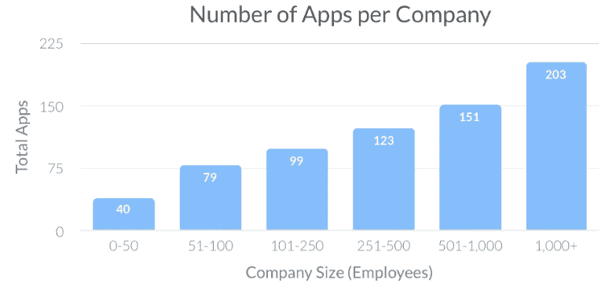

Average number of SaaS products per company

这不是一件坏事。如果你坚持只使用少数几种，你的公司可能没有充分发挥效率。

在本帖中，我们仔细看看什么是 SaaS，以及它如何帮助你的业务。我们还将深入研究我们用来发展自己公司的 40 多种 SaaS 产品。

准备好开始了吗？让我们摇滚吧！

T3】[Get a sneak peek of all SaaS tools Kinsta uses to generate leads, analyze data, collaborate, and ultimately grow its hosting company! 📊🔧Click to Tweet](https://twitter.com/intent/tweet?url=https%3A%2F%2Fkinsta.com%2Fblog%2Fsaas-products%2F&via=kinsta&text=Get+a+sneak+peek+of+all+SaaS+tools+Kinsta+uses+to+generate+leads%2C+analyze+data%2C+collaborate%2C+and+ultimately+grow+its+hosting+company%21+%F0%9F%93%8A%F0%9F%94%A7&hashtags=saas%2Cwebhost)

## SaaS 定义:什么是 SaaS？

缩写 **SaaS** 代表**软件即服务**。这是一种软件分发方式，通常包括为产品、工具或服务支付[订阅模式](https://kinsta.com/blog/recurring-revenue-model/)。

> 需要在这里大声喊出来。Kinsta 太神奇了，我用它做我的个人网站。支持是迅速和杰出的，他们的服务器是 WordPress 最快的。
> 
> <footer class="wp-block-kinsta-client-quote__footer">
> 
> 
> 
> <cite class="wp-block-kinsta-client-quote__cite">Phillip Stemann</cite></footer>

[View plans](https://kinsta.com/plans/)

(建议阅读:确保阅读我们关于 [SaaS 营销](https://kinsta.com/blog/saas-marketing/)的深度指南)。

在大多数情况下，SaaS 的产品现在[被托管在云](https://kinsta.com/blog/cloud-market-share/)中，可以通过你的网络浏览器或移动设备从任何地方访问。

过去，软件公司依靠授权模式来销售他们的数字产品并赚钱。

许可软件产品和 SaaS 的区别在于，您可以在自己的计算机或服务器上安装和运行传统软件。对于 SaaS，公司通常会为您托管和管理软件解决方案。

因此，你不仅仅是购买代码，而是为托管、更新和维护软件、服务器和数据库的服务付费。

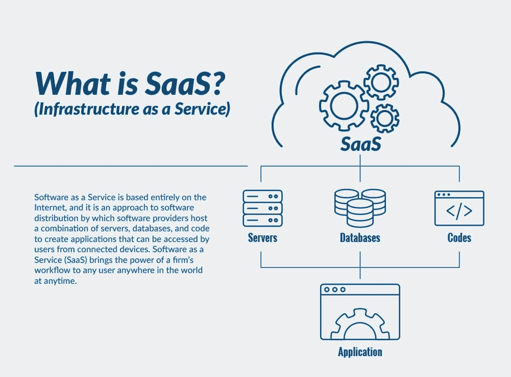

SaaS Diagram (Image source: atlantic.net)

## SaaS vs PaaS vs IaaS

你可能对 SaaS 工业中所有不同的缩写代表什么感到困惑。

在本节中，我们将快速介绍 SaaS、PaaS 和 IaaS 之间的区别。

### 软件即服务(SaaS)

正如我们上面提到的，SaaS 代表软件即服务。它通常是一个托管软件解决方案，帮助企业或个人[提高他们的生产力](https://kinsta.com/blog/gmail-add-ons/)。

#### SaaS 有哪些例子？

SaaS 产品通常是帮助企业或个人解决特定问题的软件解决方案。 [Salesforce](https://www.salesforce.com/) 帮助公司跟踪客户和潜在客户，并更好地了解他们。

[Dropbox](https://kinsta.com/blog/best-tools-for-freelancers/#3-dropbox) 帮助企业和个人在云端安全保存文件并分享。

**更多例子** : [BigCommerce](https://kinsta.com/blog/woocommerce-alternative-bigcommerce/) ， [Google Workspace](https://kinsta.com/blog/google-workspace/) ，HubSpot，微软 Office 365， [Shopify](https://kinsta.com/blog/shopify-alternatives/) ， [WooCommerce](https://kinsta.com/blog/woocommerce-vs-shopify/) ，Slack，Zendesk， [Zoom](https://kinsta.com/blog/best-tools-for-freelancers/#49-zoom) 。

### 平台即服务(PaaS)

PaaS 是平台即服务的简称。PaaS 解决方案侧重于为他们的服务提供一个开发平台，而不是直接解决业务问题的软件。这些工具帮助企业实例化、测试和部署其软件的原始代码和分支。

**例子:** AWS 弹性豆茎，Heroku，OpenShift，Magento 商业云。

### 基础设施即服务(IaaS)

[基础设施即服务或 IaaS](https://kinsta.com/blog/what-is-iaas/) 几乎等同于[云计算平台](https://kinsta.com/blog/types-of-cloud-computing/#iass)。这些解决方案允许企业部署、托管和扩展基于 web 的应用程序。虚拟机几乎可以无限扩展服务器容量。

定价模式通常是现收现付，而不是固定的月费。

**举例:** [亚马逊网络服务(AWS)](https://kinsta.com/blog/google-cloud-vs-aws/#amazon-web-services-aws) ，[谷歌云](https://kinsta.com/blog/google-cloud-hosting/)，[微软 Azure](https://kinsta.com/blog/cloud-market-share/#microsoft-azure) ， [Rackspace](https://kinsta.com/rackspace-alternative/) 。

## B2B vs B2C SaaS 产品

这些云服务之间的最后一个区别是它们的目标受众。B2B 和 B2C 产品的功能、设计甚至定价模式都有很大不同。

### 什么是 B2B SaaS 产品？

B2B 或企业对企业 SaaS 产品是托管软件解决方案，旨在解决业务问题。

想想软件解决方案，如 [CRM](https://kinsta.com/blog/wordpress-crm/) 、[电子商务平台](https://kinsta.com/blog/wordpress-ecommerce-plugins/)、[分析](https://kinsta.com/blog/google-analytics-alternatives/)等等。

### 什么是 B2C SaaS 产品？

B2C 或企业对消费者 SaaS 产品是基于云的软件解决方案，旨在解决个人问题。

想想[在线编辑](https://kinsta.com/blog/free-html-editor/)，文件共享，[网站建设者](https://kinsta.com/blog/wix-vs-wordpress/)，流媒体服务，甚至社交媒体网络。

要深入了解不同之处，请务必阅读我们的 [B2B 与 B2C 营销指南](https://kinsta.com/blog/b2b-vs-b2c/)。

## 横向 SaaS 与纵向 Saas

SaaS 应用程序不仅仅根据它们的目标市场是消费者还是企业来分类。

也有基于公司如何设计他们的产品和他们服务于什么需求的分类。

### 水平 SaaS

水平 SaaS 模型包括服务于各种公司业务需求的 SaaS 解决方案。

它们不是专注于解决某个特定行业的特定业务问题，而是提供更广泛的工具，为跨行业和跨国公司服务。

在 SaaS 市场取得成功的供应商通常是更成熟的公司。在多个行业和垂直领域站稳脚跟几乎是必须的。

示例:

*   [Salesforce](http://salesforce.com) 提供适用于几乎任何行业的 CRM 和工作流自动化工具。
*   QuickBooks 主要向在线专业人士提供会计、簿记和发票工具，但并不仅限于此。我们在金斯塔也使用他们的服务(更多信息请见下文)。

大多数成功的横向 SaaS 供应商已经“跨越了鸿沟”,并设法赢得了大部分的大众市场。

### 垂直 SaaS

垂直 SaaS 指的是专门为特定行业需求设计的软件解决方案。

与公司需要集成和定制的通用解决方案不同，用户只需很少的前期工作就可以即插即用。这是可能的，因为该软件不需要对大众市场的使用足够通用。

示例:

*   [Opentable](https://www.opentable.com/) 是为餐厅量身定制的订桌系统。
*   [凯德维亚](https://www.guidewire.com/)是专为财产保险公司设计的保险平台。

一些 SaaS 公司从提供垂直解决方案开始，并在稍后阶段扩展到水平解决方案，或者通过交叉销售和追加销售推出新的相关产品/服务。

现在你对 SaaS 的产品有了更多的了解，你想知道我们用哪些产品来壮大我们的公司吗？

他们在这里…

## 40 多种我们喜爱的 SaaS 产品

如果你是一个全新的创业公司，我们不建议你立即订阅下面的所有工具。我们只是在强调帮助我们作为一个公司更加有效的 SaaS 产品。

许多企业家已经取得了巨大的成功，他们白手起家创办了自己的公司，并随着收入的增长增加了额外的工具。

这就是我们在金斯塔所做的。像这样的工具和服务可以很快增加，所以做你的研究，聪明点，确定你可能首先需要哪些来帮助你更快地完成你的优先目标。

### 接受付款

这些是我们用来接受和处理在线支付的 SaaS 产品。

#### 1.种类

大多数公司必须决定的第一件事是他们将使用什么支付处理器来接受客户的支付。有很多可供选择，如 PayPal、 [Stripe、Braintree](https://kinsta.com/blog/stripe-vs-braintree/) 等。

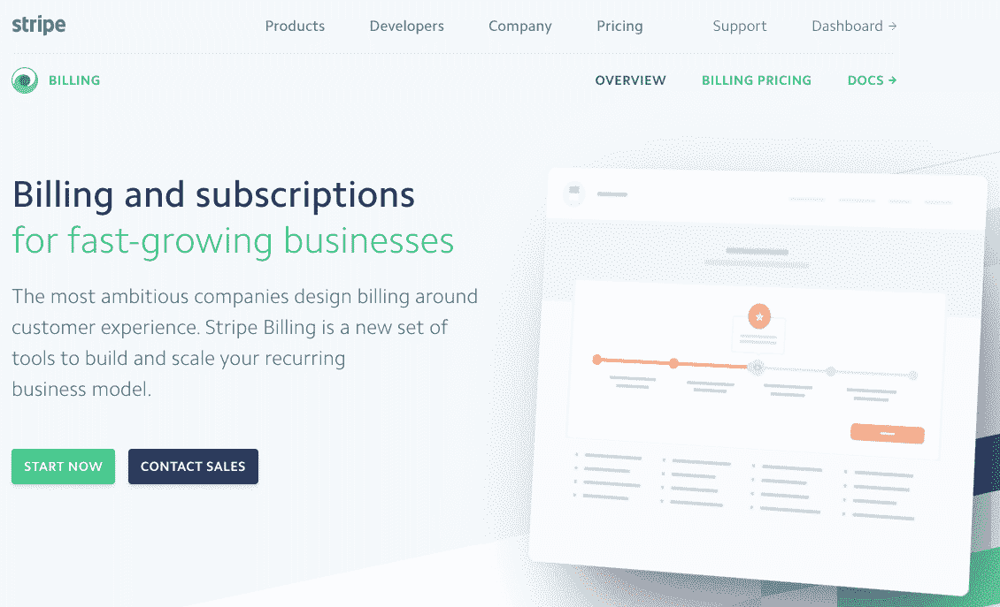

Stripe

在 Kinsta，我们决定使用 [Stripe](https://stripe.com/) ,因为它对开发人员非常友好，信用卡处理交易费用低，并且易于集成到我们的后端仪表板中。

那些已经关注我们一段时间的人知道，我们的 [Stripe 关系在 2014 年有一个艰难的开始](https://kinsta.com/blog/startups-avoid-stripe/)。但所有公司都会在某个时候犯错误，Stripe 尽其所能来解决我们遇到的情况。

快进两年，我们可以说我们仍然热爱条纹！我们认为这是自 PayPal 以来在线支付领域发生的最好的事情，并且很乐意称他们为商业伙伴。要点是客户支持比以往任何时候都更重要！

推荐继续阅读:[如何利用条纹雷达预防和减少 98%的信用卡诈骗](https://kinsta.com/blog/credit-card-fraud-stripe/)

#### 2.贝宝

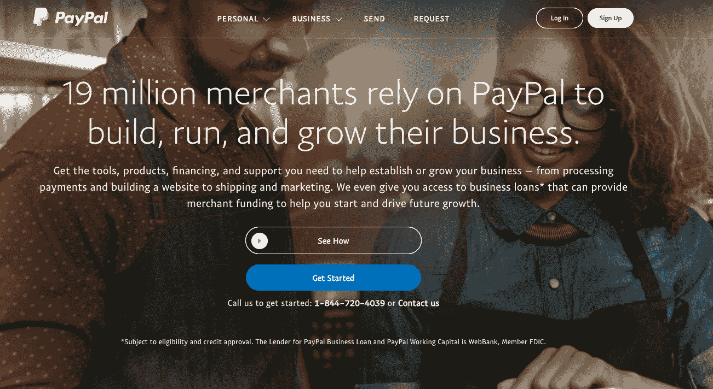

PayPal

PayPal 是另一个为企业和个人处理、发送和接受在线支付的领先工具。

您可以转账、创建和发送发票、创建定期付款订阅等。

在 Kinsta，我们主要使用 Paypal 处理[关联支付](https://kinsta.com/affiliates/)，而不是处理经常性的客户付款或发票。

建议阅读: [PayPal vs Stripe，你应该用哪个支付网关](https://kinsta.com/blog/stripe-vs-paypal/)？

### 跟踪收入

除了 Stripe 的内部工具，这些是我们用来保持收入的 SaaS 产品。

#### 3.公平度量

[Baremetrics](https://baremetrics.com/) 就像它的品牌名称所说的那样:一切都与指标有关！它为支付处理商提供分析和见解，如 [Braintree](https://kinsta.com/blog/woocommerce-payment-gateways/#braintree) 、Stripe 和 Recurly。

当谈到选择一些 SaaS 产品为您的业务，这是一个必须具备的。

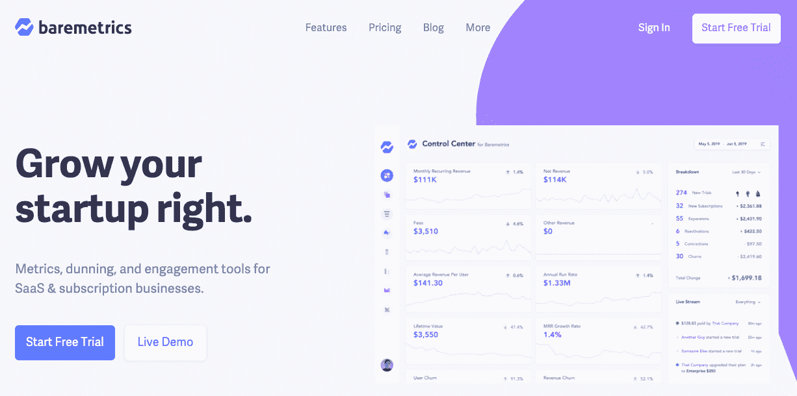

Baremetrics

为什么需要 Baremetrics？它简化了了解企业收入流的过程，并帮助您做出数据驱动的决策。

你可以立即看到有趣的信息，如每月经常性收入、每用户平均收入、退款、升级、终身客户价值、用户流失，可能还有两个最重要的信息:你的净收入和收入增长率。

你可以自己在电子表格中计算所有这些信息，但是接下来，你应该立即权衡这样做的时间成本。

查看它的[仪表盘演示](https://demo.baremetrics.com/)(见下图)。我们喜欢在 Kinsta 使用 Baremetrics，以及条带集成。它让我们对我们的业务表现有一个即时的了解。

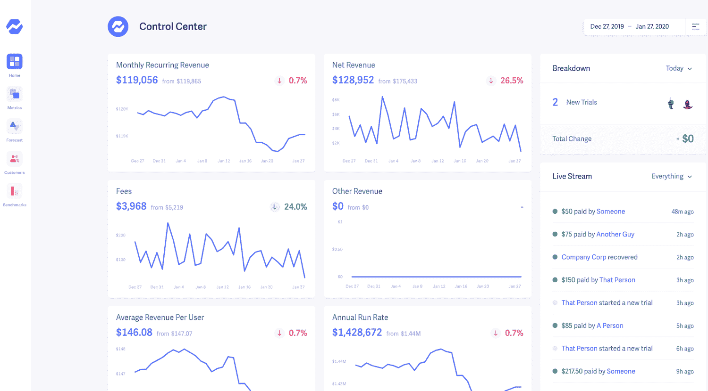

Baremetrics dashboard analytics

### 客户支持

这些是我们在 Kinsta 用来处理客户请求和询问的工具。

#### 4.对讲机

[Intercom](https://www.intercom.io/) 是一个客户平台，包含一套用于实时聊天、营销、反馈和支持的产品。记住，[支持是任何成功公司的关键。所以，如果你想要我们的建议，确保你有一个完善的支持系统，无论是聊天，门票等。](https://kinsta.com/blog/2019-year-in-review/#we-take-support-seriously-check-out-these-stats)

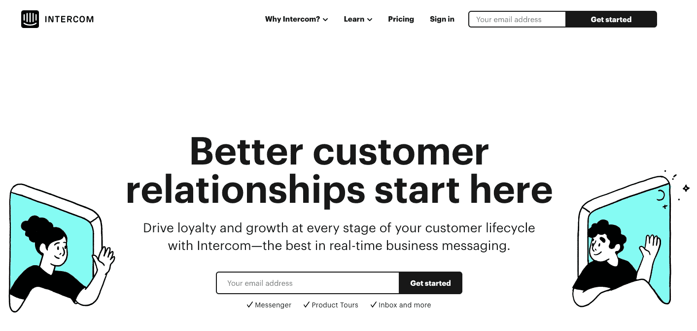

Intercom

从金斯塔的第一天起，我们就开始使用对讲机，而且效果很好。我们为来自团队成员的支持感到自豪，他们是专业的开发人员，每天与 WordPress 一起工作，为 WordPress Core 和其他开源项目做出贡献。

因此，我们支持部门的专业知识是首屈一指的。最糟糕的事情莫过于发起一个聊天会话，感觉自己比电话那头的人知道得更多。这在金斯塔永远不会发生！

Intercom 为我们提供了一种简单的方法，将聊天和支持票证(见下文)集成到我们的控制面板中，因此客户知道我们随时随地都是一键操作。我们 2019 年**中位支持票响应时间**为 **1 分 27 秒**！

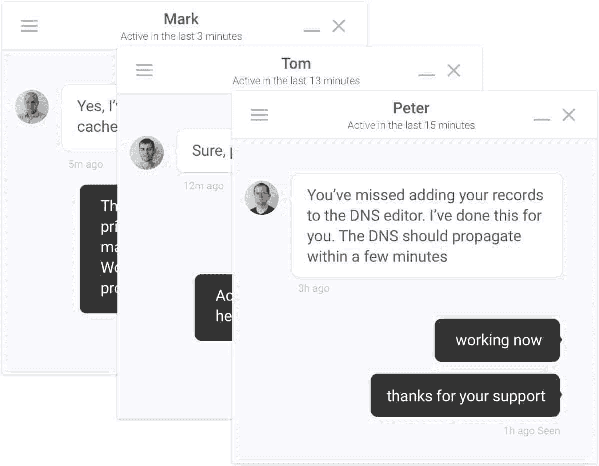

Intercom chat

这是我们最喜欢的 SaaS 产品之一。

### 协作和内部沟通

我们使用一系列 SaaS 产品来帮助改善我们的协作和内部沟通。

#### 5.松弛的

你现在可能已经听说过 [Slack](https://slack.com/) 了！如果没有，你应该立即尝试一下。

Slack 是一款面向团队的消息应用程序，旨在让您与同事之间的交流变得快速而简单，无论他们在什么平台上。

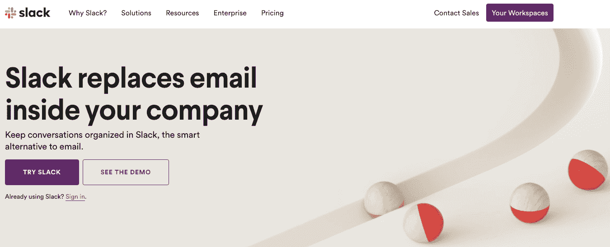

slack

Kinsta 团队的每个成员每天都在使用 Slack，或者可能每小时都在使用。它可以帮助我们做任何事情，从谈论行业新闻，在团队项目上合作，当然，还可以分享偶尔的照片。

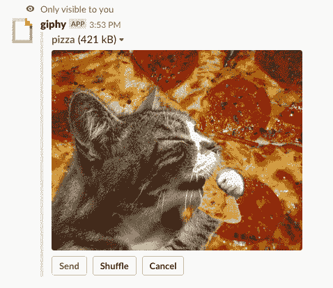

Giphy preview in Slack

我们使用付费版本，但是如果几个限制不打扰你的话，免费版本也很好。Slack 对于任何刚起步的公司都是极好的，尤其是对于[远程团队](https://kinsta.com/blog/working-remotely/)。

Kinsta 的团队分布在多个大洲，因此我们依赖 Slack 进行跨时区和跨平台的通信。说到 SaaS 产品，这是一个必须具备的。

请务必查看我们的指南[如何有效利用 Slack】。](https://kinsta.com/blog/how-to-use-slack/)

显然，有一些真正伟大的松弛替代品。我们在这个[详细帖](https://kinsta.com/blog/slack-alternatives/)里一起收集了。

#### 6.特雷罗

Trello 是一个在线协作工具，它可以让你轻松地创建公告板、列表和卡片来组织你的项目。世界各地的企业都在使用 Trello，其中包括 Adobe、Pixar、Google、PayPal 和国家地理。

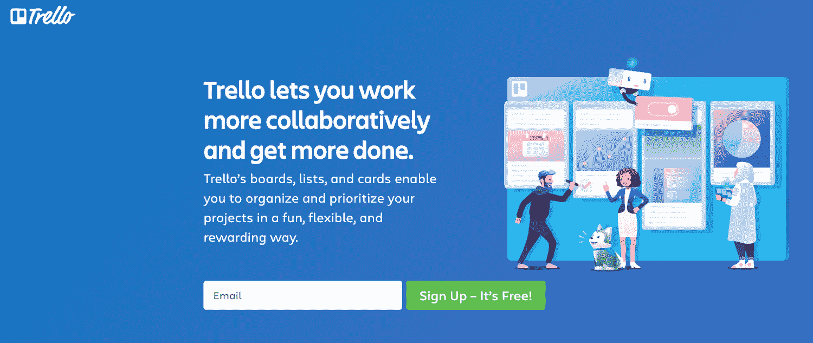

Trello

我们爱金斯塔的特雷罗！

Trello 允许我们轻松地创建任务，并跟踪谁在做什么。甚至对于我们的博客和[集客营销活动](https://kinsta.com/blog/inbound-marketing/)，我们也有一个 Trello 板来跟踪新的话题、想法和设定截止日期。

共享板就像一次点击一样简单。我们使用免费计划，这使它成为创业公司的另一个必备工具！

顺便说一句，Asana 是另一个值得一看的伟大的项目管理工具。为了比较这些特点，请务必查看我们详细的 [Trello vs Asana](https://kinsta.com/blog/trello-vs-asana/) 指南或关于[最佳 Trello 选择](https://kinsta.com/blog/trello-alternative/)的比较。

#### 7.谷歌工作空间(电子邮件+协作工具)

在 2022 年，没有人喜欢收到电子邮件，似乎每个人都在不断努力，但都没有达到收件箱零目标(是吗？🤔).

但是每个公司都需要一种通过电子邮件交流的方式。说到邮件托管，有很多选项可以选择，比如 Zoho、Office 365、Rack Space、 [Google Workspace](https://workspace.google.com/) 。

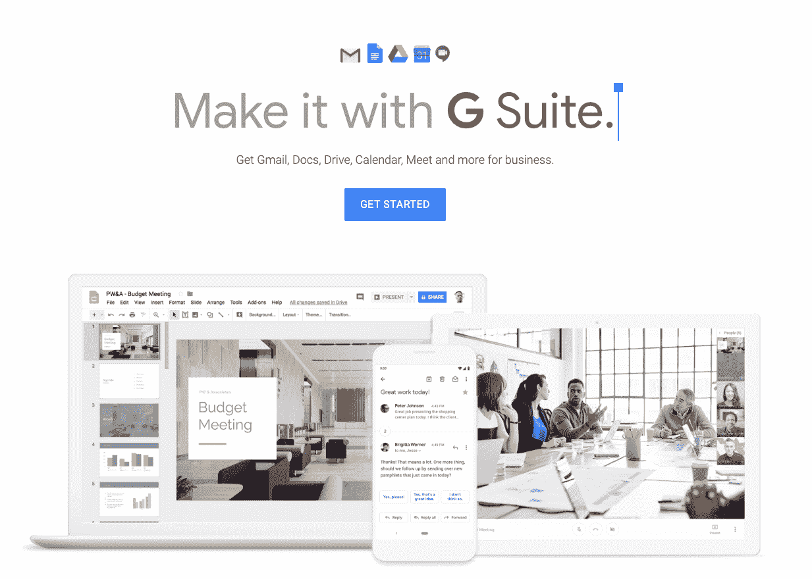

Google Workspace

[谷歌云平台](https://kinsta.com/blog/google-cloud-hosting/)为 Kinsta 的[应用托管](https://kinsta.com/application-hosting/)、[数据库托管](https://kinsta.com/database-hosting/)、以及[托管 WordPress 托管](https://kinsta.com/wordpress-hosting/)提供动力，所以很明显，我们是其基础设施和应用的忠实粉丝。

我们使用 Google Workspace 进行电子邮件托管，这允许每位员工[拥有一个专业且唯一的@kinsta.com 电子邮件地址](https://kinsta.com/blog/professional-email-address/)，并通过 Gmail 或他们最喜欢的电子邮件客户端访问它。

说到 Gmail(及其插件和扩展功能)，你几乎不会出错。根据[电子邮件市场份额](https://emailclientmarketshare.com/)，截至 2019 年 12 月，根据打开次数，Gmail 占电子邮件客户端使用量的 25%。

基本的 Google Workspace 计划，也就是我们在 Kinsta 使用的计划，定价合理，每个用户每月 6 美元。它还为每个人提供了 30 GB 的 Google drive 在线存储空间和访问 Google Docs 的权限，这是我们在 Kinsta 经常使用的。

关于我们如何以及为什么使用它的更多提示，请查看我们的详细指南:[Google Workspace 对您业务的益处](https://kinsta.com/blog/google-workspace/)。

#### 8.Dropbox

全球有 5 亿人和超过 20 万家企业经常使用 [Dropbox](https://www.dropbox.com/) 在旅途中访问和共享文档和文件。

Dropbox

我们在 Kinsta 使用 Dropbox 来共享大文件，并使远程团队成员能够从任何地方更容易地访问它们，无论他们在什么平台上工作。

#### 9\. Zeplin

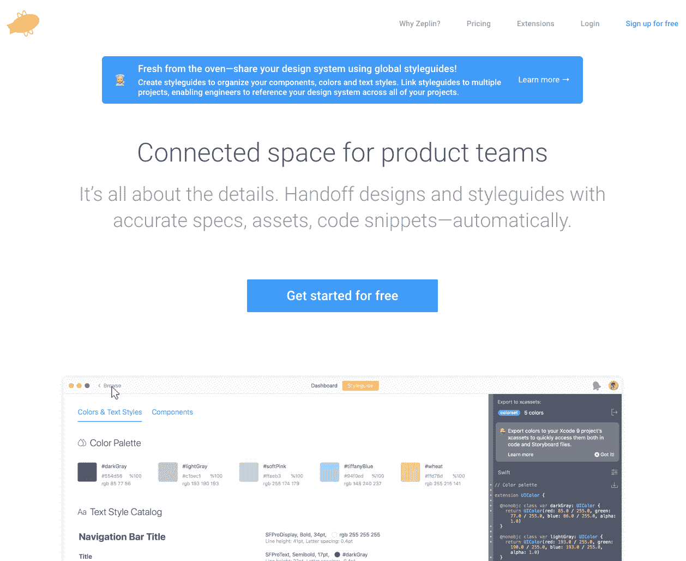

Zeplin

Zeplin 是一个专门为 T2 开发者和设计师设计的协作工具。它使创建、协作和共享包含资产、规格和代码片段的设计和风格指南变得容易。

我们的开发团队使用它们来确保每个人都遵循相同的标准，并在复杂的项目中保持一致。

#### 10.一款云视频会议软件

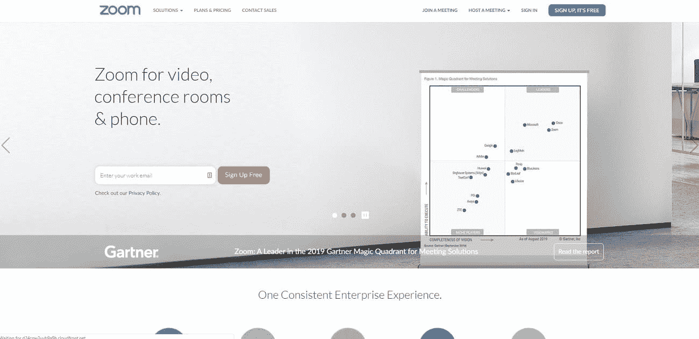

Zoom

Zoom 是下一代视频会议工具。它适用于所有设备，从智能手机到平板电脑再到台式机。

在 Kinsta，我们使用 Zoom 来实现全球各个角落的团队成员之间的紧密协作。此外，我们还每月举办一次 ama，让团队成员分享更多关于他们在公司中的角色和个人爱好的细节。

#### 11.Atlassian: Jira +融合

Jira

对于软件开发、部署和文档，我们使用 Atlassian 的[吉拉软件](https://www.atlassian.com/software/jira)和 [Confluence](https://www.atlassian.com/software/confluence) 的组合。

这有助于我们的团队维持现代高效的工作流程，并从长远来看最大限度地减少错误。最重要的是，我们有一个内部资源，其中记录了所有程序，因此新员工可以在入职后方便地浏览。

#### 12.充气台

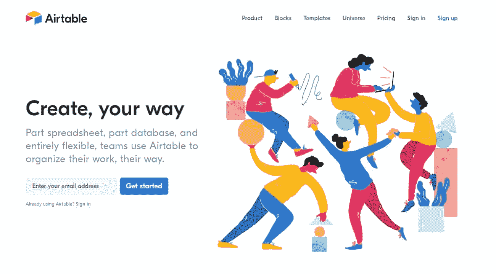

Airtable

Airtable 是一款独特的任务管理工具，让您的团队能够以自己喜欢的方式组织工作。

我们的团队大多使用 Airtable 进行协作，管理与客户关系相关的项目和任务，并作为一个非常高级的电子表格进行线索生成和培育，这可能会多次调用数据库。

### 营销和销售

下面，我们将介绍一套用于改进营销和销售流程的工具。

#### 13.提到

在社交媒体上持续关注你的品牌是一个永无止境的过程，有时会让人不知所措，耗费时间。[提及](https://mention.com/en/)扫描超过 40 种语言的数十亿个来源，因此你不会错过任何人对你品牌的评论。

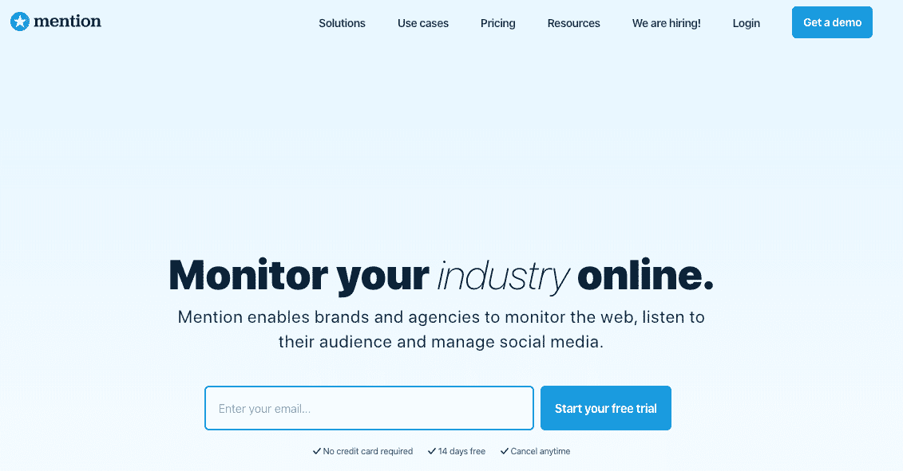

Mention

我们使用“提及”来跟踪金斯塔在网络上的社交提及。他们的一个很大的特点是与 Slack 的集成。

它允许我们在私人 Slack 频道中快速查看推文和提及，以及影响者分数。

这样，我们再也不用浪费时间登录到一个单独的仪表板或接收另一封电子邮件。

#### 14.关闭

[Close](http://close.com) 是销售人员为销售人员打造的 SaaS 产品。

没有人喜欢手工输入，Close 试图尽可能自动化。从电话、电子邮件和活动中，您可以花更多时间完成交易，而不是输入数据。

Close

我们在 Kinsta 的销售团队使用 Close 进行销售线索管理，并使用强大的 [Zapier 集成](https://zapier.com/zapbook/closeio/)来进一步实现自动化。当然，其中一些自动化包括松散集成。

#### 15.猎手

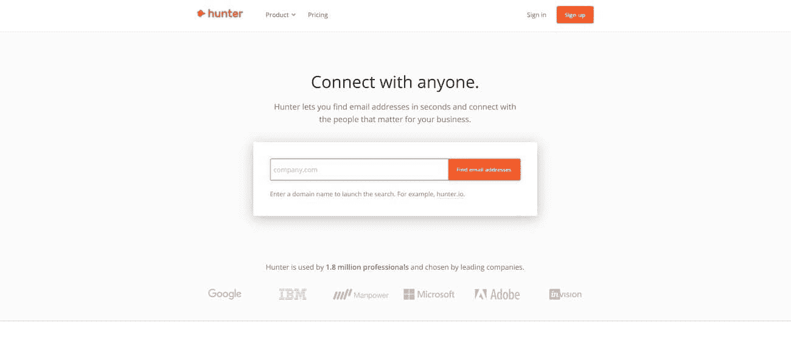

Hunter

[Hunter](https://hunter.io/) 是[寻找潜在客户电子邮件地址](https://kinsta.com/blog/find-email-address/)的最可靠解决方案，无需每次都手动打电话询问。有了 Hunter.io，电子邮件外联成为一种更有价值、更高效的销售工具。

## 注册订阅时事通讯

### 想知道我们是怎么让流量增长超过 1000%的吗？

加入 20，000 多名获得我们每周时事通讯和内部消息的人的行列吧！

[Subscribe Now](#newsletter)

我们的销售团队使用它来帮助他们联系潜在的销售线索，并开始销售过程。

#### 16.Mailchimp

超过 2000 万的企业和个人使用 Mailchimp 发送电子邮件和时事通讯。

就像他们说的，“钱在单子里。”建立和维护一个高质量的电子邮件列表是一个公司创造更多销售并让现有客户了解信息的绝佳方式。

MailChimp 让这一过程变得简单而愚蠢，多年来一直在完善其软件。

Mailchimp

我们在 Kinsta 使用 MailChimp，我们有付费计划，但也有免费计划，允许最多 2000 名订户。

我们正在[创造大量内容](https://kinsta.com/blog/evergreen-content/)，MailChimp 是让我们每周与订户分享这些内容的好方法。确保[订阅我们的时事通讯](https://kinsta.com/wordpress-newsletter/)！

总而言之，MailChimp 的免费计划是一个很好的解决方案，可以让你在开始建立电子邮件列表的时候就开始工作。

#### 17.缓冲器

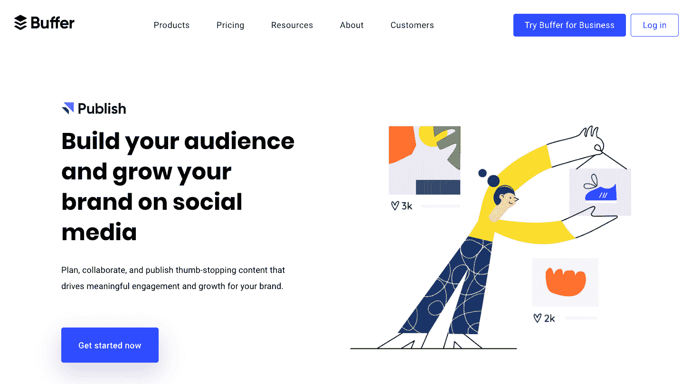

Buffer

[Buffer](https://buffer.com/) 是一个集成的一体化解决方案，用于管理和推动多个社交媒体账户的更多参与。

我们用它来帮助在推特、T2、脸书和更多渠道建立我们的品牌。它帮助我们自动化日常任务，并让我们进一步了解哪些内容在社交渠道上效果最好。

### 搜索引擎优化和内容营销

在构建我们的平台时，内容营销和 [SEO](https://kinsta.com/blog/what-does-seo-stand-for/) 是我们在 Kinsta 的主要关注点。因此，我们使用大量 SaaS 工具来帮助改进我们的流程，并帮助对我们的内容进行排名。

#### 18.精确器

如果你在你的网站上做任何集客营销或者 [SEO，你必须记录你的关键词排名。2022 年，搜索引擎优化仍然生机勃勃，关键词仍然必不可少。](https://kinsta.com/blog/wordpress-seo/)

尽管事情已经将焦点更多地转移到了“主题”写作上，但关键字将永远存在，因为谷歌的算法毕竟是一种计算机算法。

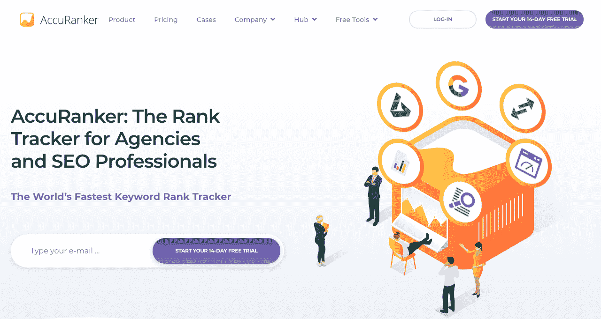

AccuRanker

我们在 Kinsta 使用 [AccuRanker](https://www.accuranker.com/) 来跟踪我们关注排名的关键关键词。它告诉我们是否需要给一篇文章多一点爱。

AccuRanker 允许我们跟踪一篇博客文章周围的关键词，添加我们优化的内容的注释，然后稍后返回来查看我们的排名如何受到这些变化的影响。

#### 19.塞姆拉什

[SEMrush](https://www.semrush.com/) 是一款面向数字营销专业人士的一体化竞争数据和分析工具。[关键词研究](https://kinsta.com/blog/keyword-research/)首先是至关重要的[，如果你正在为你的公司做集客营销](https://kinsta.com/blog/inbound-marketing/)，以及了解你的竞争对手的立场。

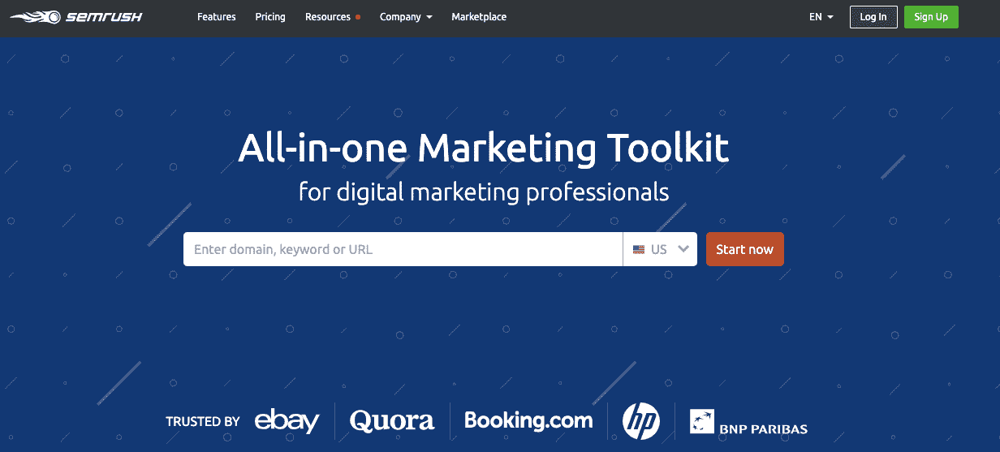

SEMrush

我们在 Kinsta 使用 SEMrush 来研究新的博客帖子想法，并战略性地为我们的集客营销做出数据驱动的决策。这个工具让我们可以快速看到诸如关键词或主题的搜索量以及该关键词的竞争力。

说到关键词研究，永远不要假设人们在搜索它。总是测试它，看看是否值得在它上面投入时间和资源。

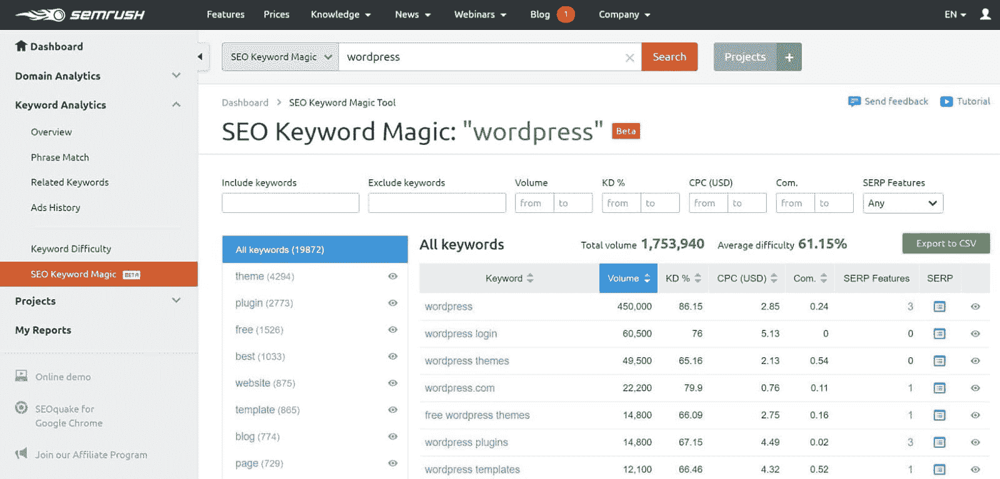

SEMRush keyword research

#### 20.BuzzSumo

BuzzSumo 是内容营销研究的绝佳工具。它可以帮助您识别趋势，并找到有价值的影响者来招募到您的品牌中。

凭借独特的内容洞察力，您可以快速为您的内容策略产生新的想法。

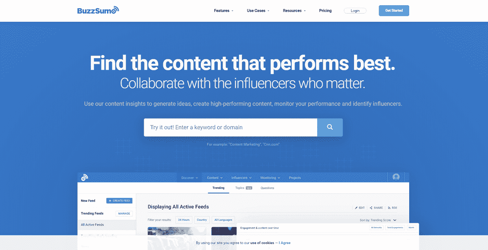

BuzzSumo

在 Kinsta，我们使用 BuzzSumo 来确保我们在内容营销方面的努力是正确的。

我们不再盲目依赖关键词和搜索数据，而是用它来发现我们可以利用博客帖子和文章的趋势。

他们的网络内容研究工具非常适合我们的内容策略。

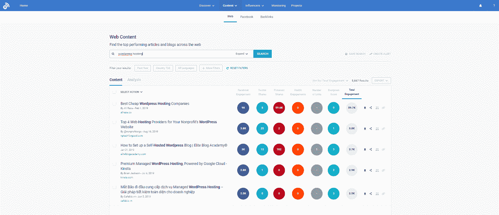

BuzzSumo web content research

它有助于我们在行业中保持领先地位，而不用整天担心内容。

#### 21.市场缪斯

[MarketMuse](https://www.marketmuse.com/) 是一个基于人工智能的内容规划和优化解决方案。它分析谷歌上搜索术语和关键词的热门内容。

通过这种深入的分析，它可以突出你应该在你的内容中涵盖的基本主题、关键词和问题。

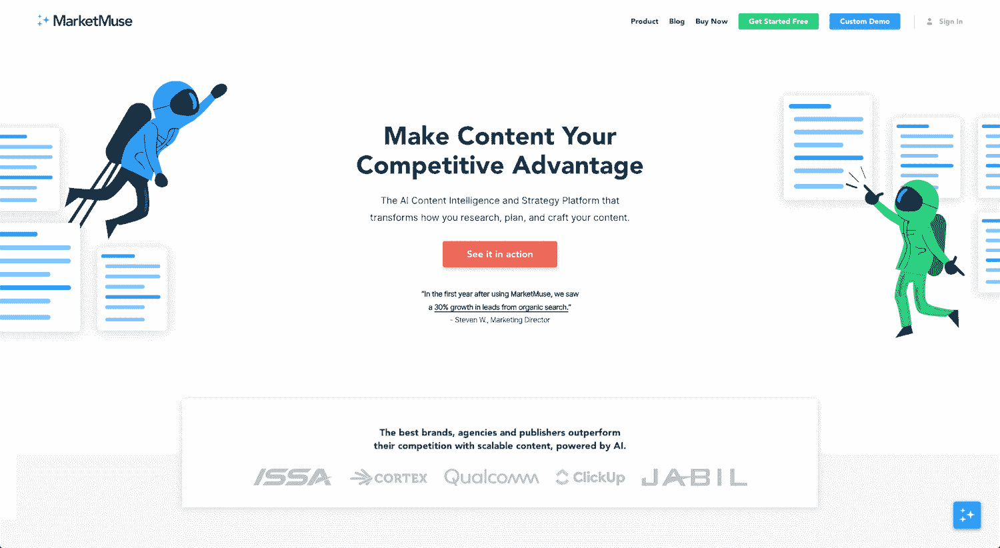

MarketMuse

在 Kinsta，我们使用 MarketMuse 来确保我们在撰写帖子时涵盖所有相关主题和问题。

我们的强项是[长篇内容](https://kinsta.com/blog/long-form-articles/)，所以这对我们来说是天作之合。它帮助我们在搜索引擎优化和内容方面打点一切。

#### 22.Ahrefs

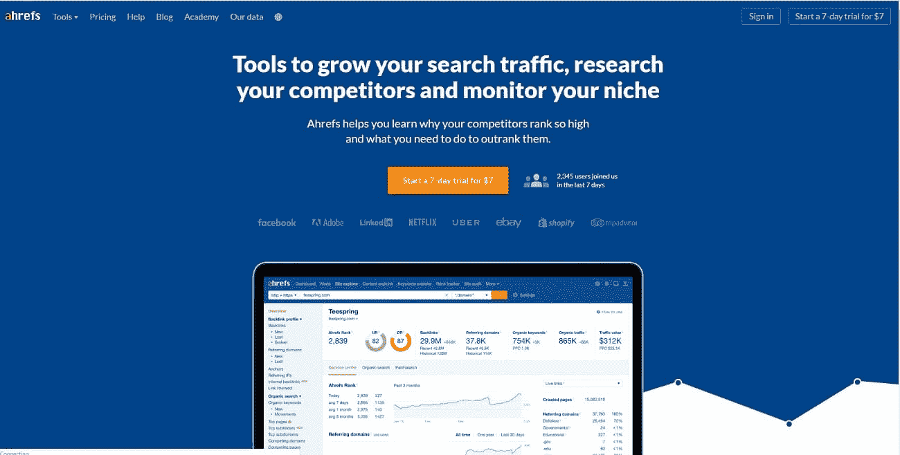

Ahrefs

Ahrefs 是一个一体化的搜索引擎优化解决方案，可以帮助你进行大量的活动，如[关键词研究](https://kinsta.com/blog/keyword-research/)、竞争对手研究、SERP 和关键词监控等等。

我们使用它来帮助我们识别高价值、低竞争的关键词，以我们的博客和其他页面的内容为目标。Ahrefs 在增加我们的有机流量和使内容营销成为我们获取客户的最佳渠道之一方面发挥了[关键作用。](https://kinsta.com/blog/content-length/#keyword-optimization)

#### 23.克劳丁

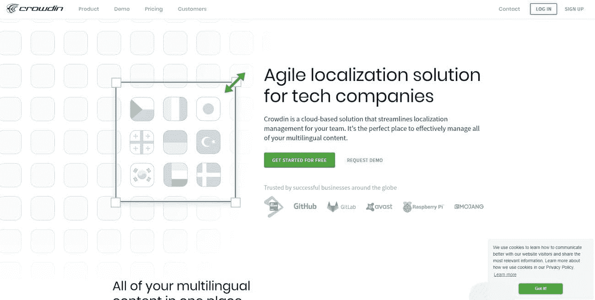

Crowdin

Crowdin 是一个本地化管理工具，帮助分布式公司管理他们的[多语言内容](https://kinsta.com/blog/wordpress-multilingual/)。

我们使用 Crowdin 来确保我们使用客户的语言，无论他们身在何处。这有助于我们为全球客户提供更好的体验。

#### 24.Quuu 提升

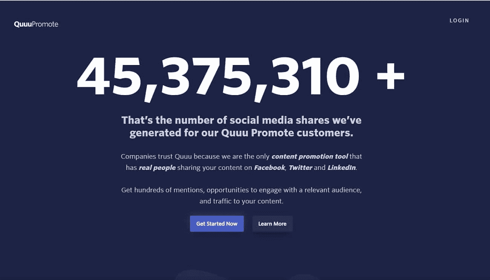

Quuu Promote

Quuu Promote 是一个社交媒体推广解决方案，帮助你获得分享，并通过每篇新帖子接触到新的受众。它让你在脸书、推特和 LinkedIn 上接触到真实的人。

厌倦了 WordPress 的问题和缓慢的主机？我们提供世界一流的支持，由 WordPress 专家提供 24/7 服务和超快的服务器。[查看我们的计划](https://kinsta.com/plans/?in-article-cta)

在 Kinsta，我们将 Quuu Promote 作为社交媒体营销策略的一部分。这有助于我们通过每篇帖子接触到更多的受众，并在新的领域建立我们的品牌。

### 分析网络流量

在 Kinsta，我们相信在我们所做的一切中采用数据驱动的方法。这就是为什么我们依赖分析 SaaS 产品来帮助我们保持领先。

#### 25.疯狂的蛋

[疯狂彩蛋](https://www.crazyegg.com/)是一个热图和网站数据分析工具，帮助你深入了解人们是如何与你的网站互动的。

Crazy Egg

我们在《疯狂的蛋》中使用的一个主要功能是出色的热图功能！你可以建立一个实验，让它运行，然后回来看看人们点击你网站的确切位置。

看看有多少人向下滚动页面，他们停在哪里，什么来源的流量点击什么。疯狂蛋对提高你的 CRO 和测试新的登陆页面很有帮助。

#### 26.谷歌分析

2022 年，每个有网站的公司都听说过[谷歌分析](https://kinsta.com/blog/how-to-use-google-analytics/)。但是很少有人充分利用网站分析工具的潜力。

从按来源显示浏览量、跳出率和转换率的详细渠道细分，到显示用户如何与你的网站互动的流程图，谷歌分析应有尽有。

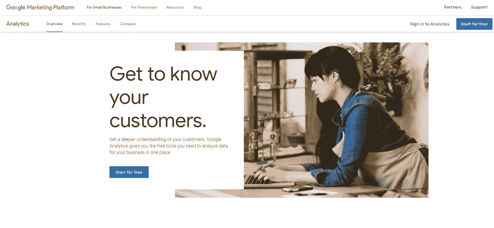

Google Analytics

在 Kinsta，[我们使用谷歌分析](https://kinsta.com/blog/how-to-use-google-analytics/)来帮助我们更好地了解我们的读者和用户。

详细的报告让我们更好地了解哪些内容有效，哪些内容无效。

我们还可以通过检查我们的用户流报告来识别导航的问题[和具体的弱点。](https://kinsta.com/blog/website-navigation/)

查看我们关于如何将谷歌分析添加到你的 WordPress 网站的深度指南[。](https://kinsta.com/blog/google-analytics-wordpress/)

#### 27.热罐

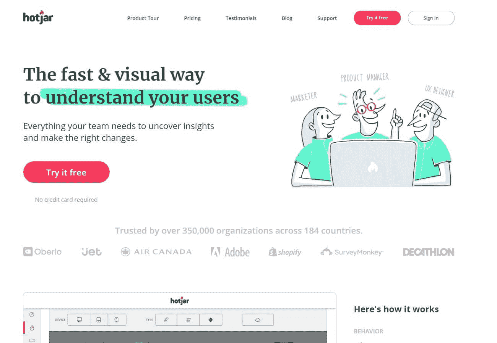

Hotjar

[Hotjar](https://www.hotjar.com/) 是一款高级分析和用户体验映射工具，可帮助您改善 UX、设计和网络应用/网站。您可以在视频中跟踪访问者的旅程，您的设计/开发团队可以深入研究和分析这些视频。

您还可以查看热图和其他用户如何与您的网站或应用程序交互的可视化分解。

我们使用 Hotjar 来改善所有用户的体验，以确保我们在托管解决方案中提供最简单、最直观的 UI 和 UX。

### 服务器和主机

为了确保我们的托管解决方案是尖端的，我们依赖于一些特定的 SaaS 产品，例如:

#### 28.新遗迹

[New Relic](https://newrelic.com/) 提供各种服务，从[应用性能监控](https://kinsta.com/blog/apm-tools/)，服务器监控，移动监控，以及实时用户洞察。

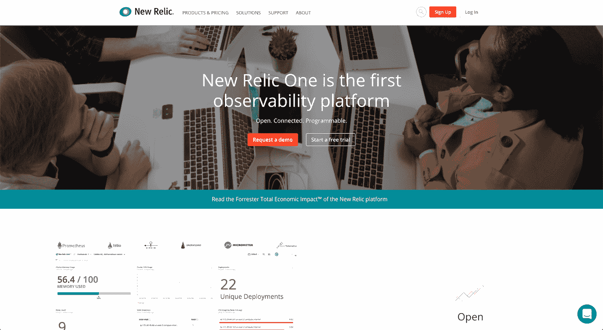

SaaS products: New Relic

虽然我们在这里使用内置的 Kinsta APM 工具进行站点监控，但您也可以选择使用 New Relic，但需要有自己的许可证。

查看我们关于[如何在 Kinsta 使用 New Relic](https://kinsta.com/blog/wordpress-performance-new-relic/) 解决客户网站性能问题的深度帖子。

#### 29.云耀斑

[Cloudflare](https://www.cloudflare.com/) 是一款免费的全球 CDN(或者更确切地说是完全代理服务) [DNS](https://kinsta.com/knowledgebase/what-is-dns/) 、 [DDoS 防护](https://kinsta.com/blog/what-is-a-ddos-attack/)和 web 安全提供商，可以加速和保护您的网站。

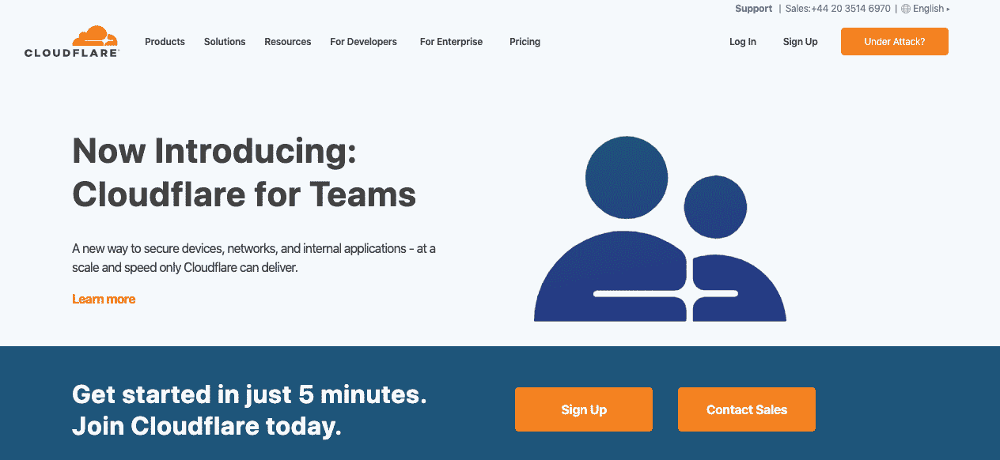

Cloudflare

Kinsta 使用 CloudFlare 为客户提供免费和/或高级解决方案，以加快其全球网站的速度，同时提供 DDoS 保护。我们客户的另一个优势是他们可以节省大量带宽。

通常，CDN 将处理网站 60-70%的流量负载。因此，通过将资产卸载到 CDN，这可以确保您不会超过 Kinsta 的带宽限制。请务必查看我们的 [CloudFlare 集成指南](https://kinsta.com/knowledgebase/install-cloudflare/)、我们的[key dn 集成指南](https://kinsta.com/knowledgebase/how-do-i-add-keycdn-to-my-site/)和我们的 [CloudFlare APO 指南](https://kinsta.com/blog/cloudflare-apo-wordpress/)。

#### 30.开源代码库

正如你们中的许多人可能知道的那样， [Github](https://github.com/) 是一个免费的开源库，被个人、公司和开发者用来帮助构建软件。GitHub 允许团队贡献和分叉超过 3800 万个项目，包括 [WordPress](https://github.com/WordPress/WordPress) 本身。

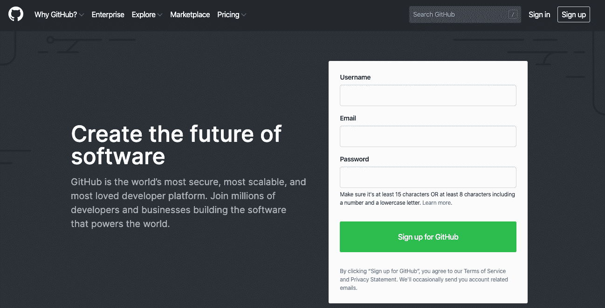

GitHub

我们不做任何对 GitHub 上的人公开可用的事情，但 Kinsta 的团队使用 GitHub 来管理我们网站和其他项目的内部开发。

如果你在一个团队环境中使用任何代码，那么 GitHub 是不可思议的，因为它提供了一个[版本控制系统](https://kinsta.com/blog/wordpress-version-control/)，允许多个开发人员轻松地贡献和提交更新。

想了解更多关于版本控制的知识？查看我们的 [git vs GitHub 指南](https://kinsta.com/knowledgebase/git-vs-github/)。

#### 31.亚马逊 53 号公路

[Amazon Route 53](https://aws.amazon.com/route53/) 是一种高度可用且可扩展的云 DNS 服务。它旨在为开发人员和企业提供一种极其可靠且经济高效的方式，将最终用户引导至互联网应用程序。

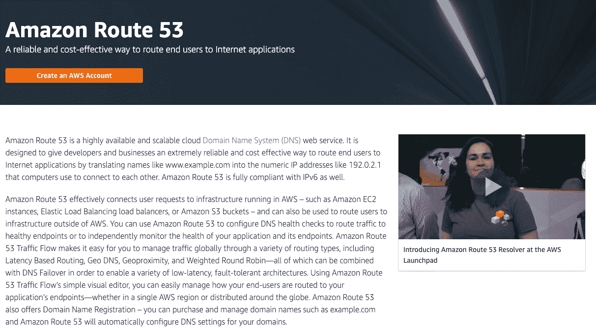

Amazon Route 53

在 Kinsta，我们不会满足于平庸的网络性能和可靠性。DNS 只是我们非常重视的一个领域。我们包括亚马逊 Route 53 [premium DNS](https://kinsta.com/blog/premium-dns/) 服务，为每一个在我们这里托管 WordPress 网站的客户提供服务。

Amazon 拥有庞大的基础设施和提供额外 DNS 功能的悠久历史，如基于延迟的路由、地理 DNS、流量，以及最重要的 DNS 故障转移。Kinsta 客户甚至可以直接从他们的 MyKinsta 仪表板上[修改他们的 DNS 记录](https://kinsta.com/help/dns/)。

#### 32.状态页面

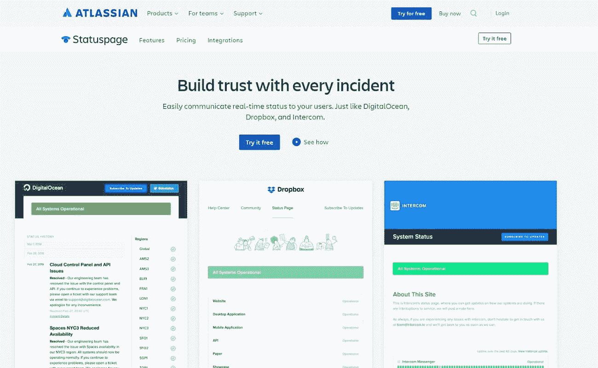

Statuspage

[Statuspage](https://www.atlassian.com/software/statuspage) 是一款帮助您向客户传达服务器、应用和服务实时状态的工具。像 Dropbox 这样的主要平台利用这一点来确保他们的用户群总是最新的。

这正是我们在 Kinsta 使用它的原因。它有助于我们在事故期间自动沟通，因此我们的技术团队可以专注于尽快解决问题。

#### 33.威斯特亚

[Wistia](https://wistia.com/) 是一个高端视频托管和分析平台。我们喜欢将 Wistia 视为视频托管领域的劳斯莱斯，Moz、MailChimp 和 HubSpot 等公司都使用它。

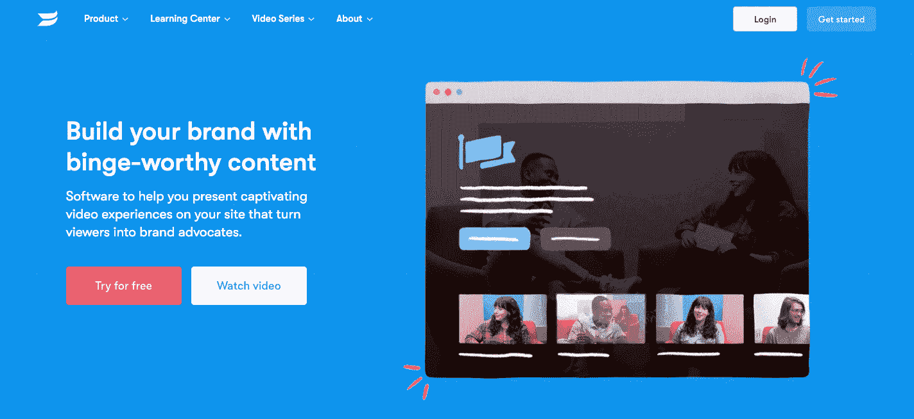

Wistia

我们在 Kinsta 使用 Wistia 展示我们的客户评价视频。虽然我们可以使用其他类似的平台，如 [YouTube 和 Vimeo](https://kinsta.com/blog/wordpress-iframe/) ，但我们选择了 Wistia，因为它提供了与我们网站的无缝集成。

如果你想要一个优雅的 HTML5 视频播放器集成，那么你应该看看 Wistia。如果你同意在你的播放器上使用 Wistia 品牌，他们会免费提供多达 5 个视频。对于新的创业公司来说，它可能是 YouTube 的一个很好的[替代品。](https://kinsta.com/blog/alternatives-to-youtube/#best-free-youtube-alternatives)

### 计费和会计

经营企业最有趣的方面不是记账和会计。但是有了正确的工具，事情就变得简单多了。

#### 34\. SendGrid

SendGrid 是另一个电子邮件营销平台和服务，专注于交易电子邮件。它的一些客户包括优步、Spotify、Airbnb 和 Yelp。

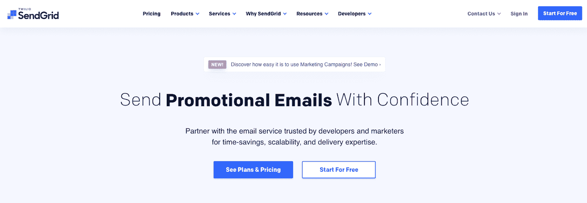

SendGrid

虽然 MailChimp 非常适合我们的入站和内容营销，但我们在 Kinsta 使用 SendGrid 来处理事务。例如，服务器和应用程序之间的电子邮件。

像许多其他公司一样，我们以前使用 Mandrill(由 MailChimp 所有)，直到它被关闭。

对于基于[交易的电子邮件](https://kinsta.com/help/transactional-email/)，SendGrid 是一个更具成本效益的解决方案。如果你从你的软件或应用程序发送大量的电子邮件，SendGrid 做得非常好。如果你想开始，看看这个[完整的 Sendgrid 设置指南](https://kinsta.com/knowledgebase/sendgrid-wordpress/)。

然而，我们不一定向典型的营销人员推荐它们。有些小事情，如 UTM 参数必须手动更新每个活动，这可能有点令人沮丧。不过，它的 WYSIWYG builder 在过去几年中有了巨大的改进，Sendgrid 团队正在努力提供与 MailChimp 等服务类似的功能。但请记住，Sendgrid 的重点是交易型电子邮件，而不是营销。

#### 35.ClearBooks

不幸的是，任何业务中不那么有趣的部分是必须管理账簿、工资单和会计。但这是每个企业主必须做的事情之一。

ClearBooks 是一款在线会计软件，它试图简化初创公司、小企业甚至会计的流程。

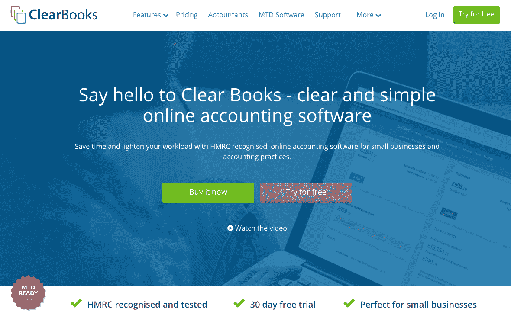

Clear Books

我们在 Kinsta 使用 ClearBooks，部分原因是因为他们是一家英国公司，但也因为他们在简化在线会计流程方面有很多经验。

我们在金斯塔的人都不是会计师。它们于 2008 年推出，对金融市场来说并不陌生，并得到了 ICB、ICAEW 和 ACCA 的认证。如果你在英国，ClearBooks 可能是你想去看看的。

#### 36\. QuickBooks

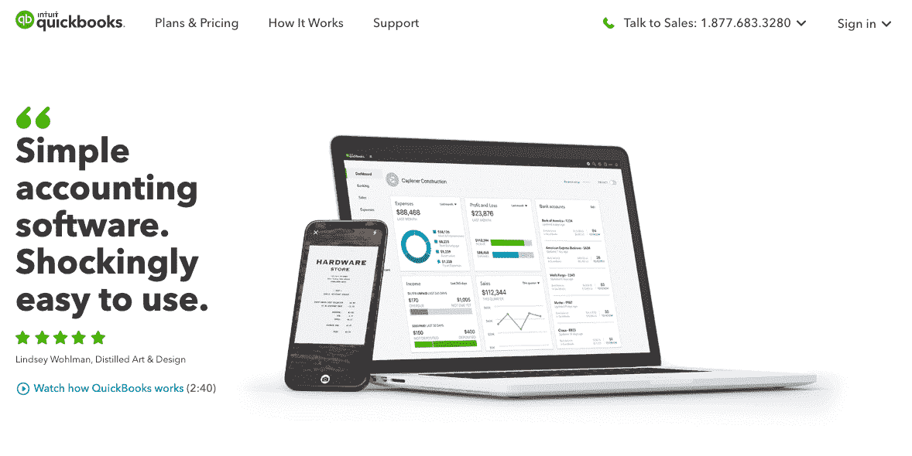

QuickBooks

Quickbooks 是一个简单的会计解决方案，可以帮助你组织你的支付、费用和总收入。它易于使用，并为您提供了可视化您企业的确切财务状况的报告。

在 Kinsta，我们已经过渡到使用 QuickBooks 来开具发票，因为它支持批量开具发票，并且更容易通过 API 进行集成。

#### 37.当我工作的时候

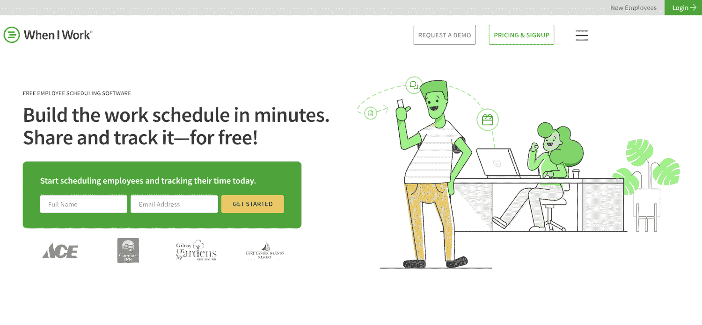

When I Work

[我工作的时候](https://wheniwork.com/)是一款在线员工排班软件和打卡。它允许在多个州/国家拥有远程员工的雇主轻松跟踪每个人的工作时间。

在 Kinsta，我们使用它来帮助我们的客户支持和应急工程师团队合作覆盖必要的时间段。它简化了我们的轮班管理流程，减少了我们过去过多的沟通。

### 设计

最后，我们使用几个 SaaS 产品来设计我们的内容。

#### 38.图标查找器

每个好的网站都需要好的视觉效果，这也是 Iconfinder 蓬勃发展的地方。它目前有一个超过 390 万个图标的数据库，包含超过 60，000 组图标。

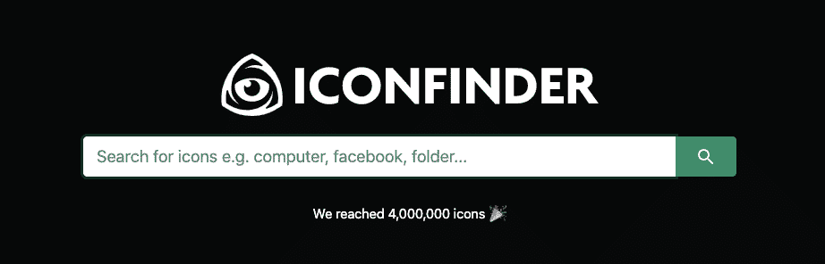

Iconfinder

我们在我们的网站和 Kinsta 博客上使用 Iconfinder 来显示图标。我们从 Iconfinder 的博客和知识库文章中获取了您在这里看到的大多数特色图片。

Iconfinder 最好的特性之一是，它们提供了所有四种格式， [SVG，PNG](https://kinsta.com/blog/svg-vs-png/) ，AI 和 CSH。我们通常更喜欢使用 [SVG](https://kinsta.com/blog/what-is-an-svg-file/) ，因为它们可以缩放到任何分辨率，而不会损失任何图像质量。

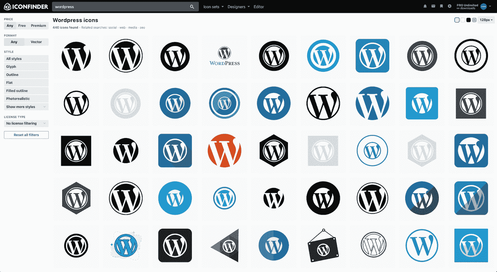

Iconfinder search

#### 39.帆布

Canva 是一款网络应用，承诺帮助你“设计任何东西，并在任何地方发布。”

它有一个拖放界面，选项和工具比 Photoshop 少得多，很容易学习和使用。

即使是自认为没有创作能力的人，也可以利用现有的模板，在短短几分钟内创作出看起来很棒的博客图形和社交媒体广告。

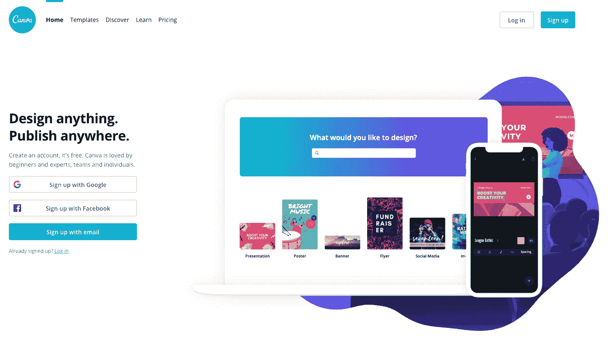

Canva

在 Kinsta，我们使用 Canva 为我们的设计师团队绘制草图，以便稍后定稿。它有助于加快内容的视觉设计过程，因为错误传达的空间更小。

### 数据可视化

由于我们在提供服务和营销工作中要处理大量的数据，仅通过查看表格和数字很难获得有价值的见解。

这也是我们使用 SaaS 产品进行数据可视化的原因。

#### 40\. Kibana

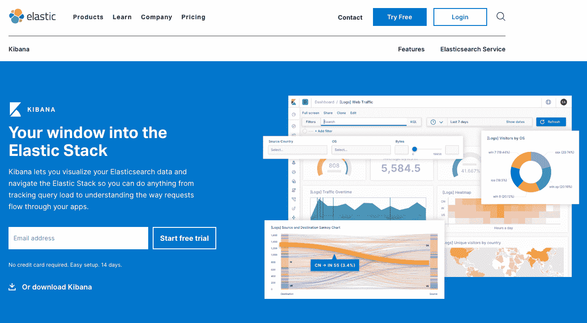

Kibana

Kibana 是一个用于 Elastic Stack 的数据可视化工具，可以让你的团队可视化你的 ElasticSearch 数据。

简而言之，你可以创建和探索可视化的表格和[报告，它们会给你独特的见解](https://kinsta.com/blog/analyzing-log-entries/)。你还可以部署机器学习来找出人眼无法发现的模式。

在 Kinsta，我们使用 Kibana 以一种易于理解的格式来理解数据。

### 密码管理

担心跟踪 40 多种不同的 SaaS 产品的密码？有了密码管理解决方案，您就不必这么做了。

#### 41.1 密码

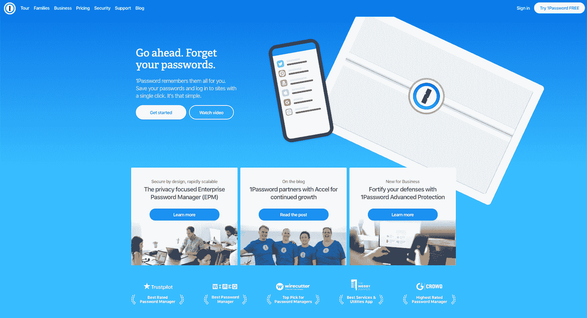

1Password

使用[1 密码](https://1password.com/)，您只需一个密码即可登录您公司的所有社交媒体档案和 SaaS 工具。真的就这么简单。每周通过电子邮件重设密码不会浪费更多的宝贵时间。

在 Kinsta，我们使用 1 密码来确保每个人都能随时访问他们需要的工具。它消除了停机时间，提高了我们整个团队的效率。

### 数字签名

最后，我们使用一个工具来处理数字签名。

#### 42.数字签名者

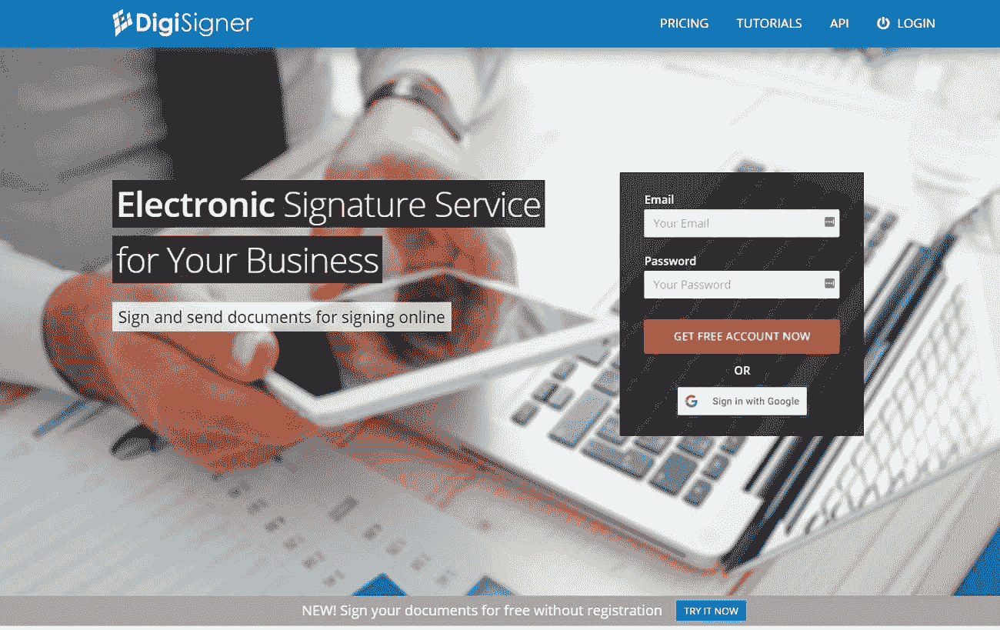

DigiSigner

Digisigner 是一个免费的工具，可以在数字文档上接收和留下签名，比如通过电子邮件发送的 PDF 格式的合同。

在 Kinsta，我们使用 Digisigner 处理员工和自由职业者的合同，大大加快了招聘过程。它还可以轻松地保存我们所有重要文档的数字记录。

[Check out this behind the scenes look at all SaaS tools Kinsta uses to run and grow its hosting company! 📊👩🏻‍💻Click to Tweet](https://twitter.com/intent/tweet?url=https%3A%2F%2Fkinsta.com%2Fblog%2Fsaas-products%2F&via=kinsta&text=Check+out+this+behind+the+scenes+look+at+all+SaaS+tools+Kinsta+uses+to+run+and+grow+its+hosting+company%21+%F0%9F%93%8A%F0%9F%91%A9%F0%9F%8F%BB%E2%80%8D%F0%9F%92%BB&hashtags=saas%2Cwebhost)

## 摘要

如你所见，我们在金斯塔的各种不同领域使用了相当多不同的 SaaS 产品。它们中的每一个都有特定的用途，帮助我们更有效率，专注于重要的事情。那就是尽可能为你提供[最好的主机体验](https://kinsta.com/plans/)！

您目前使用的 SaaS 创新产品中，有没有我们可能会喜欢的？如果有，欢迎在下面分享。

* * *

让你所有的[应用程序](https://kinsta.com/application-hosting/)、[数据库](https://kinsta.com/database-hosting/)和 [WordPress 网站](https://kinsta.com/wordpress-hosting/)在线并在一个屋檐下。我们功能丰富的高性能云平台包括:

*   在 MyKinsta 仪表盘中轻松设置和管理
*   24/7 专家支持
*   最好的谷歌云平台硬件和网络，由 Kubernetes 提供最大的可扩展性
*   面向速度和安全性的企业级 Cloudflare 集成
*   全球受众覆盖全球多达 35 个数据中心和 275 多个 pop

在第一个月使用托管的[应用程序或托管](https://kinsta.com/application-hosting/)的[数据库，您可以享受 20 美元的优惠，亲自测试一下。探索我们的](https://kinsta.com/database-hosting/)[计划](https://kinsta.com/plans/)或[与销售人员交谈](https://kinsta.com/contact-us/)以找到最适合您的方式。