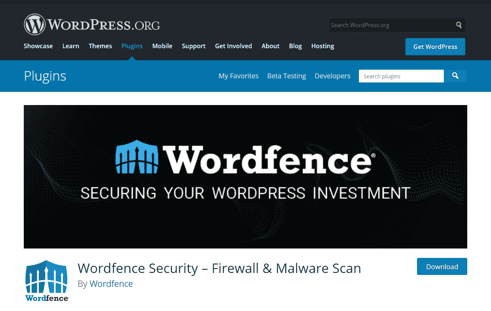
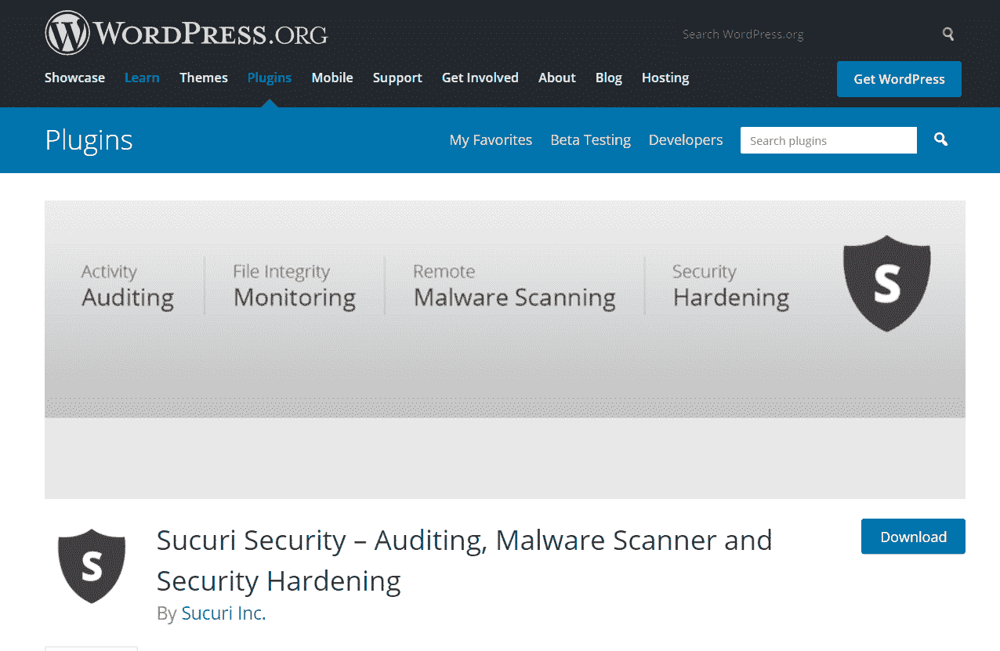
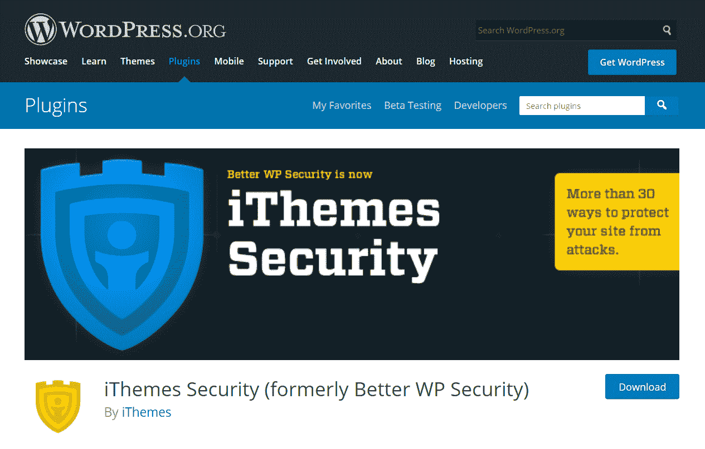
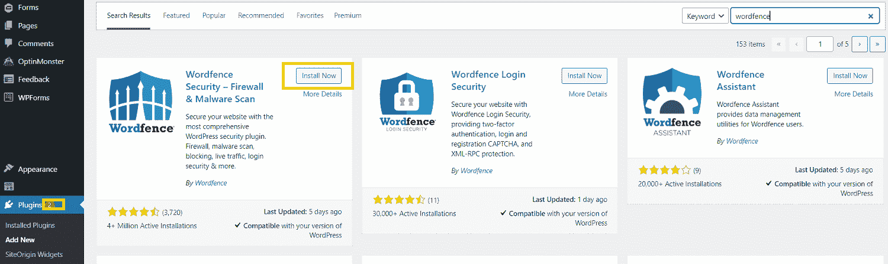
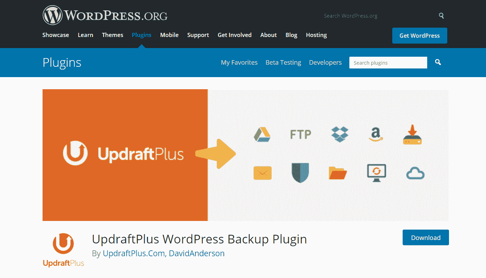
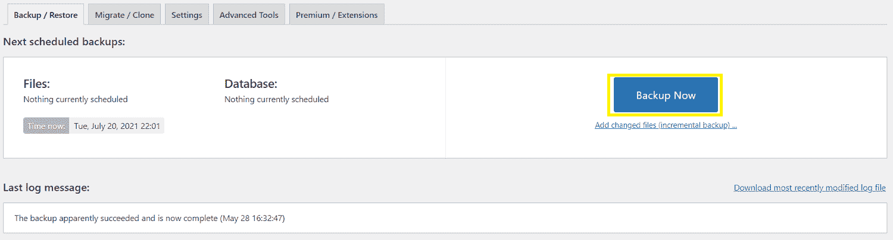
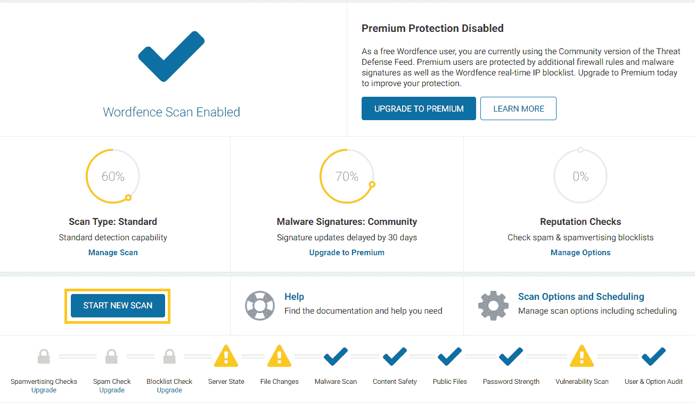
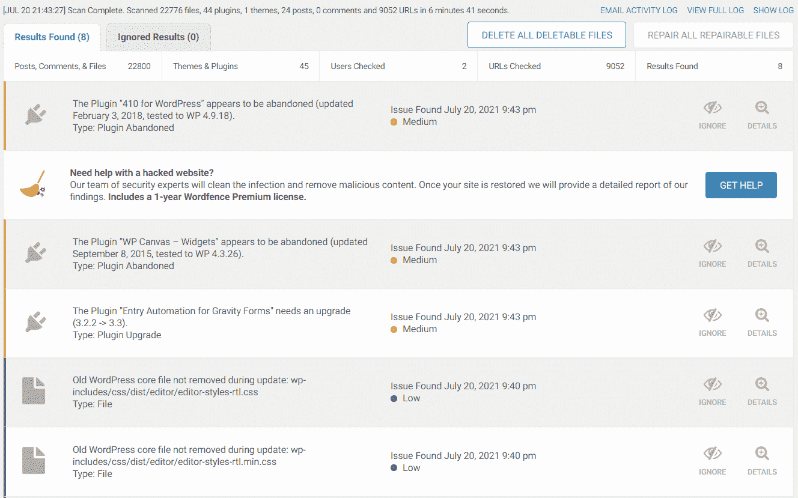
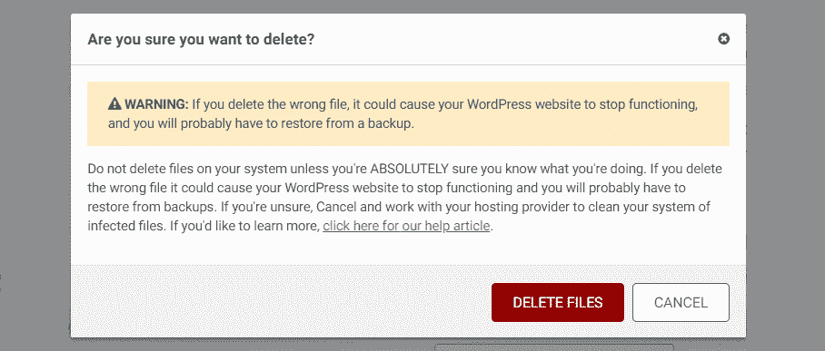

# 如何用 4 个简单的步骤扫描 WordPress 的恶意软件

> 原文：<https://kinsta.com/blog/scan-wordpress-for-malware/>

每分钟大约有 9 万起针对 WordPress 网站的攻击。恶意软件攻击不是开玩笑的事。如果你不妥善管理你的网络安全，它可能会把你的网站和业务置于风险之中。

然而，恶意活动并不一定是可怕的事情。如果你的网站已经受损，扫描 WordPress 的恶意软件可以帮助你识别和消除任何有害的内容。将来也有很多方法可以防止对你网站的攻击。

这篇文章将涵盖什么是恶意软件，以及为什么搜索它对网站维护至关重要。我们还将解释如何扫描恶意软件，如果你认为你的网站被黑客攻击，如何删除它。

我们开始吧！

T3】

## 什么是恶意软件？

[恶意软件](https://kinsta.com/blog/types-of-malware/)代表“恶意软件”这是一个涵盖所有有害软件的术语，黑客使用这些软件来获得未经授权的访问或破坏你的 WordPress 网站。它会在许多方面对您的网站产生负面影响，并对您和您的网站访问者都构成严重的安全风险。

如果恶意软件出现在你的网站上，你通常会知道。您可能会注意到以下迹象:

*   你的[网站性能](https://kinsta.com/blog/performance-testing-tools/)变慢了。
*   你网站的访问者看到一个[“前面的网站包含恶意软件”错误](https://kinsta.com/knowledgebase/the-site-ahead-contains-malware/)。
*   您的服务器中有未知文件或脚本。
*   您的页面被损坏或充满有害链接。
*   您无法登录。
*   您的网站正在生成不想要的弹出窗口。

虽然这些问题都可能有多种原因，但如果您看到了其中的一种或多种原因，就有必要研究一下恶意软件已经感染了您的站点的可能性。

> Kinsta 把我宠坏了，所以我现在要求每个供应商都提供这样的服务。我们还试图通过我们的 SaaS 工具支持达到这一水平。
> 
> <footer class="wp-block-kinsta-client-quote__footer">
> 
> 
> 
> <cite class="wp-block-kinsta-client-quote__cite">Suganthan Mohanadasan from @Suganthanmn</cite></footer>

[View plans](https://kinsta.com/plans/)

## 恶意软件是如何被安装在 WordPress 网站上的

恶意软件可以通过多种方式安装在 WordPress 网站上。通常，黑客或机器人会利用一些安全漏洞。

例如，如果您没有适当的安全措施来防止重复不正确的登录尝试，或者如果您的密码很弱，黑客可能会访问您的站点。然后他们可以通过暴力攻击安装恶意软件。这是当一个机器人在你的登录页面上循环通过数百个用户名和密码组合，直到他们找到正确的一个。

过时的插件和主题也是黑客可以利用的安全漏洞。僵尸网络通过互联网搜索具有这些漏洞的网站，并使用它们来安装恶意软件。

恶意软件还可以通过网络钓鱼链接渗透到您的网站。如果您不小心点击了电子邮件中的网络钓鱼链接或访问了被入侵的网站，就会发生这种情况。这样做，您可能会无意中将恶意软件下载到您的计算机上。这可能会找到你的 WordPress 服务器。

## 为什么扫描 WordPress 的恶意软件很重要

正如我们提到的，通常会有一些迹象表明恶意软件出现在你的网站上。然而，情况并非总是如此。有时候，你可能没有意识到你的网站已经被破坏了。

幸运的是，有一个简单的方法可以发现:你必须运行恶意软件扫描。定期扫描恶意软件非常重要，尤其是因为 83%被黑的基于 CMS 的网站都是建立在 WordPress 上的。

如果您不定期扫描恶意软件，您将面临许多风险，例如:

*   搜索引擎优化处罚:谷歌经常否认被入侵的网站。这可能会导致你在搜索引擎结果页面的排名(以及有机搜索流量)下降。
*   **网站性能差:**恶意软件可以让黑客利用你的服务器资源攻击其他网站。从你的站点转移资源会导致性能问题，比如页面加载缓慢。
*   **Denylisted IP 地址:**黑客还可以利用恶意软件从你网站的 IP 发送垃圾邮件。这可能会导致您的 IP 地址被主要的电子邮件提供商除名。
*   **网站访问者面临的风险:**恶意软件甚至会给网站访问者带来安全风险。它可能会在您的网站上加载危险的弹出窗口，并向您的用户传播恶意软件。

除了扫描您的网站上的恶意软件，您还可以采取主动的安全措施。查看我们的[网站安全备忘单](https://kinsta.com/cheatsheets/site-security-cheat-sheet/)，获取如何加强网站安全防范的建议。

## 何时扫描 WordPress 是否有恶意软件

不要等到你看到警告信号才扫描你的 WordPress 网站上的恶意软件。恶意代码可以长时间不被注意。因此，定期检查你的网站是个好主意，即使没有任何迹象表明有问题。

我们建议至少每月检查一次恶意软件。每当你改变你的网站结构或者安装新的插件时，你应该运行一次扫描。此外，如果您注意到我们之前提到的任何迹象，我们建议进行扫描。

你可以设置一个定期提醒[扫描你的网站是否有恶意软件](https://kinsta.com/blog/website-security-check/)。例如，你可以在每个月的第一天这样做来养成这个习惯。

## 扫描恶意软件的最佳工具

扫描你的 WordPress 站点是否有恶意软件的最简单的方法是使用安全插件。以下是我们推荐您用来进行扫描的一些工具。

### 文字围栏

Wordfence 是最容易用于恶意软件检测的插件之一。

Wordfence 安全插件。

一旦你安装了插件，它会定期自动搜索恶意软件。或者，如果您认为您的站点可能存在安全问题，您可以运行手动扫描。

一旦扫描完成，WordFence 还会建议您可以采取的措施来纠正安全问题。它有免费版和付费版。我们强烈推荐这个插件，因为它很容易使用。此外，[免费版本](https://kinsta.com/blog/sucuri-vs-wordfence/#wordfence-review)非常适合运行基本扫描和纠正轻微的恶意软件问题。

### 苏库里

Sucuri 是另一个提供基本恶意软件扫描功能的优秀工具。

Sucuri 安全插件。

使用 [Sucuri SiteCheck](https://sitecheck.sucuri.net/) ，你可以通过输入你的站点的 URL 来快速方便地扫描你的站点的问题。你也可以通过在你的 WordPress 网站上安装插件来使用扫描功能。

免费的 Sucuri 插件还提供关于安全问题和防火墙保护的电子邮件提醒，有助于防止网站上的恶意活动。这是一个构建良好的插件，声誉极佳，特别是付费计划，为 WordPress 用户提供全面的恶意软件防护。

如果您是 Kinsta 的客户，并且您想使用它，您可以遵循本 [Sucuri 安装指南](https://kinsta.com/help/sucuri/)。

### iThemes 安全

另一个很好的选择是 iThemes 安全插件。

## 注册订阅时事通讯

### 想知道我们是怎么让流量增长超过 1000%的吗？

加入 20，000 多名获得我们每周时事通讯和内部消息的人的行列吧！

[Subscribe Now](#newsletter)

iThemes 安全插件。

这个插件，以前被称为更好的 WP 安全，有超过 30 个安全功能，可以保护您的网站免受各种攻击。您可以使用 iThemes 的免费版本来运行基本的恶意软件扫描并识别任何问题。

另一方面，您可以使用专业版来设置预设的恶意软件扫描和电子邮件更新。这使得它非常容易留在您的网站安全检查的顶部。

这些工具都可以帮助你扫描 WordPress 是否有恶意软件。对于本文，我们将使用 Wordfence 插件。

但是，如果 Kinsta 托管您的站点，则可能没有必要遵循这些步骤。相反，你可以依靠 [Kinsta 安全保证](https://kinsta.com/knowledgebase/security-guarantee/)来保护你的网站。

## 如何用 4 个简单的步骤扫描 WordPress 的恶意软件

如果你认为你的 [WordPress 网站被黑了](https://kinsta.com/blog/wordpress-hacked/)，你可以按照下面的四个步骤。我们将解释如何使用 Wordfence 扫描你的站点和插件，以及如何保护你的站点免受未来的攻击。

### 步骤 1:安装 Wordfence 安全插件

首先，我们要安装免费版的 Wordfence 插件。为此，登录你的 WordPress 仪表盘并导航到**插件>添加新的**。然后搜索 **Wordfence** ，点击 **Wordfence 安全-防火墙&恶意软件扫描**下的**立即安装**:

安装 Wordfence 安全插件。

一旦插件安装完毕，点击**激活** *。*您可能会收到接受使用条款的提示，并指定您的电子邮件地址以完成安装。

### 步骤 2:备份你的 WordPress 站点

在你继续下一步之前，我们建议[备份你的网站](https://kinsta.com/blog/backup-wordpress-site/)。下一步，您将删除可能被恶意软件感染的文件。

如果出现问题，这可能会意外删除关键数据，并导致重大网站问题。首先备份您的网站意味着如果发生意外，您可以恢复到它。

需要为您的电子商务网站提供超快的、可靠的、完全安全的托管服务吗？Kinsta 提供所有这些服务，并由 WooCommerce 专家提供 24/7 的世界级支持。[查看我们的计划](https://kinsta.com/plans/?in-article-cta)

备份网站最简单的方法之一是安装免费的 [UpdraftPlus 插件](https://wordpress.org/plugins/updraftplus/)。

updraft plus WordPress 备份插件。

您可以按照与 Wordfence 相同的过程安装和激活它。然后，导航到**设置>升级加备份**，点击**立即备份**:

找到【立即备份】按钮

你现在要做的就是等待这个过程完成。如果在后面的步骤中出现任何问题，您可以从同一个页面恢复备份数据。

### 步骤 3:运行扫描并删除恶意软件文件

接下来要做的是运行恶意软件扫描。Wordfence 应该每天自动扫描您的站点，但您也可以手动启动该过程。

为此，从你的 WordPress 仪表盘导航到 **Wordfence > Scan** 。然后点击**开始新的扫描**:

使用 Wordfence 开始新的扫描。

Wordfence 将开始在您的网站上搜索恶意软件、文件更改等内容。这个过程可能需要一段时间才能完成。您可以在扫描屏幕上的时间线中监控进度。

扫描完成后，您将看到结果的详细分类。

恶意软件扫描的详细结果。

该日志显示发现的所有安全问题的列表。根据它们的严重程度，它将它们标记为高、中或低优先级。标有“WordPress 核心中的未知文件”的结果表明可能存在恶意软件。

幸运的是，Wordfence 可以轻松删除这些文件。您只需点击结果日志上方的**删除所有可删除文件**。然后，您应该会看到一条警告消息:

删除所有文件的警告信息。

请务必仔细阅读此警告信息。检测到的文件可能不是恶意软件，并且对您网站的正常运行至关重要。这就是为什么我们在上一步中建议备份您的站点。

如果您确信检测到的文件是恶意软件，您可以点击**删除文件**。这将删除你网站上的所有恶意软件。如果它导致任何问题，您可以从备份中恢复网站的先前版本。

一旦恶意软件被处理，您可能还想解决扫描发现的任何其他问题。例如，您可能想要解决任何过期的插件。

### 第 4 步:采取措施来完全保护你的网站

一旦您删除了恶意文件，您可能需要采取一些额外的步骤来完全保护您的站点:

*   **更改您的密码:**如果您的网站上有恶意软件，很可能您的密码也遭到了破坏。因此，最好[更改你网站上的所有密码，](https://kinsta.com/blog/change-wordpress-password/)以及你在网上用过的任何地方的密码。
*   **设置双因素认证(2FA):** [在你的网站上设置 2FA](https://kinsta.com/help/two-factor-authentication/) 可以增加一层额外的安全性。如果您的密码被泄露，攻击者在没有完成额外检查的情况下仍然不会进一步行动。
*   **审核用户档案:**恶意软件可能在您的网站上创建了一个新的用户角色。您可以检查您的用户配置文件，并从您的数据库中删除任何不应该存在的文件来解决这个问题。
*   **实施定期安全检查:**你可以切换 Wordfence 的设置，让它定期检查恶意软件。你也应该采取进一步措施[锁定你的网站](https://kinsta.com/blog/wordpress-security/)。
*   **再次备份** **你的网站:**一旦你清除了恶意软件，为你的网站创建一个新的备份。这样，如果将来出现任何问题，您可以随时将其恢复到一个干净的、无恶意软件的版本。

采取以上步骤可能看起来工作量很大，但是很值得。它们将有助于确保您的网站在未来免受恶意软件的侵害。

恶意软件的攻击会给你的🦹‍♂️带来毁灭性的打击，但是在这些建议的帮助下，你可以将恶意活动拒之门外。💪

## 摘要

恶意软件对 WordPress 用户来说一直是个威胁。然而，通过定期扫描并遵循严格的网站安全程序，很容易保持您的网站安全和无恶意软件。

以下是如何扫描 WordPress 网站的恶意软件以及如何保护你的网站免受恶意活动攻击的快速回顾:

1.  安装 Wordfence 安全插件。
2.  备份你的 WordPress 站点。
3.  运行扫描并删除恶意软件文件。
4.  采取措施彻底保护您的网站。

关于扫描你的 WordPress 站点是否有恶意软件的问题吗？在下面的评论区问我们吧！

* * *

让你所有的[应用程序](https://kinsta.com/application-hosting/)、[数据库](https://kinsta.com/database-hosting/)和 [WordPress 网站](https://kinsta.com/wordpress-hosting/)在线并在一个屋檐下。我们功能丰富的高性能云平台包括:

*   在 MyKinsta 仪表盘中轻松设置和管理
*   24/7 专家支持
*   最好的谷歌云平台硬件和网络，由 Kubernetes 提供最大的可扩展性
*   面向速度和安全性的企业级 Cloudflare 集成
*   全球受众覆盖全球多达 35 个数据中心和 275 多个 pop

在第一个月使用托管的[应用程序或托管](https://kinsta.com/application-hosting/)的[数据库，您可以享受 20 美元的优惠，亲自测试一下。探索我们的](https://kinsta.com/database-hosting/)[计划](https://kinsta.com/plans/)或[与销售人员交谈](https://kinsta.com/contact-us/)以找到最适合您的方式。