# 如何给 WordPress 和 WooCommerce 站点添加模式标记(SEO 插件 vs 手动)

> 原文：<https://kinsta.com/blog/schema-markup-wordpress/>

模式标记为搜索引擎提供了额外的数据，并更好地利用了其他工具，如社交媒体平台和谷歌知识面板。如果使用得当，它可以让你的页面有资格显示特殊的 SERP 特性，给你在搜索结果中额外的可见性，从而提升你的 SEO。

有几种方法可以将这种标记添加到您的站点中，要么安装一个插件，要么手动添加正确的代码。

在这篇文章中，我们将解释什么是模式标记，向您展示一些好处，并给出一些例子。你还将学习如何向你的 WordPress 站点添加模式标记。

请记住，你的最终目标是增加商店的收入。所以一定要下载我们的免费电子书**， [10 种提高你的网络商务产品页面转化率的方法](https://kinsta.com/ebooks/wordpress/ecommerce-conversion-rate/?utm_source=Blog&utm_medium=Link&utm_campaign=WooCommerce+Conversions+Ebook)。**

 **## 什么是模式标记？

模式标记是一种元数据(称为微数据),它被添加到你的站点中，为搜索引擎提供更多的信息。过去，我们使用 HTML 标签向搜索引擎提供这类信息。

像[标题标签](https://kinsta.com/blog/what-does-seo-stand-for/#title-tags)、[元描述](https://kinsta.com/blog/meta-description-wordpress/)和[元关键词](https://kinsta.com/blog/meta-description-wordpress/#meta-description-vs-meta-keyword)(不再相关)都有助于告诉搜索引擎一个网站是关于什么的。

但是这并没有给搜索引擎提供他们所需要的所有信息来完全理解你的网站是关于什么的以及它会吸引谁。这就是向 WordPress 添加模式标记的原因。


> Kinsta 把我宠坏了，所以我现在要求每个供应商都提供这样的服务。我们还试图通过我们的 SaaS 工具支持达到这一水平。
> 
> <footer class="wp-block-kinsta-client-quote__footer">
> 
> 
> 
> <cite class="wp-block-kinsta-client-quote__cite">Suganthan Mohanadasan from @Suganthanmn</cite></footer>

[View plans](https://kinsta.com/plans/)

架构标记被添加到站点页面的 HTML 中。它赋予单个元素额外的属性，比如它们包含什么样的信息以及上下文是什么。

举个例子，你可能会在页面上看到这样的内容:

```
<div itemscope itemtype ="http://schema.org/Movie">
  <h1 itemprop="name">Avatar</h1>
  <span>Director: <span itemprop="director">James Cameron</span> (born August 16, 1954)</span>
  <span itemprop="genre">Science fiction</span>
  <a href="../movies/avatar-theatrical-trailer.html" itemprop="trailer">Trailer</a>
</div>
```

架构标记为您的内容添加了额外的数据层。它告诉搜索引擎这是关于一个组织，一个人，一个地方，甚至是一部电影。

这意味着当人们搜索这些东西时，他们更有可能得到准确的结果。这不仅让你的页面更有可能出现在搜索结果中，还能让你在谷歌获得准确的知识板块，让你的社交媒体账户有效链接到你的网站，提升你的搜索排名。

通过展示一些如何使用模式标记以及它提供何种信息的例子，可以更好地解释这一点。我们很快就会看到这一点。

[你的 WordPress 站点是否使用了模式标记？如果没有，这里有一个关于它是什么，为什么它很重要，以及几种正确添加它的方法的深入指导！📈🦾 点击推文](https://twitter.com/intent/tweet?url=https%3A%2F%2Fkinsta.com%2Fblog%2Fschema-markup-wordpress%2F&via=kinsta&text=Is+your+WordPress+site+tagged+with+Schema+markup%3F+If+not%2C+here%27s+an+in-depth+guide+on+what+it+is%2C+why+it%27s+important%2C+and+several+ways+to+add+it+properly%21+%F0%9F%93%88%F0%9F%A6%BE&hashtags=seo%2Cschema)


## 向 WordPress 站点添加模式标记的好处

因此，在我们开始研究如何将模式标记添加到你的 WordPress 站点之前，让我们先确定一下好处。

主要的好处是搜索引擎优化。通过向搜索引擎提供上下文数据，你使得你的 WordPress 站点更有可能在 SERPs 中排名靠前。这意味着 2020 年搜索引擎所要求的粒度细节更有可能是准确的，更能反映你的网站的真实情况。

因此，如果你用自己的博客运营一个个人网站[，你可以告诉搜索引擎，你的网站代表一个人，这个人是谁。多亏了模式标记，你还可以将你的网站链接到你的个人社交媒体账户。](https://kinsta.com/learn/blogging-tips/)

### 查看我们的[视频指南](https://www.youtube.com/watch?v=VTv8QWfWkow&t=173s)添加社交媒体标记


另一方面，如果你的网站代表一个组织，你将告诉搜索引擎一些不同的东西。

位置相关的搜索引擎优化也有好处。您可以使用模式标记告诉搜索引擎您的网站位于何处，或者它所代表的组织位于何处。如果人们在你的区域寻找一个特定的商业类型，你会得到更高的搜索引擎排名。

和 SEO 一样，模式标记将有助于 Google 中的知识面板。知识面板是显示在搜索结果右侧的信息区域。它们与搜索词相关，并将提供来自各种来源的信息丰富的表格。

例如，如果我搜索马特·莫楞威格，我会看到一个知识面板告诉我更多关于他的信息。

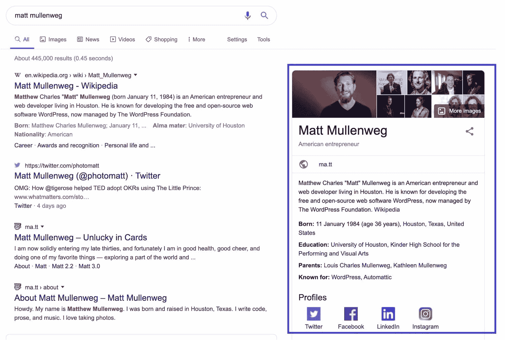

Matt Mullenweg knowledge panel


如果你在你的 WordPress 站点上添加模式标记，Google 会知道你的站点是代表个人还是组织，以及你的页面上有什么样的内容。它可以用它来填充你的知识面板，并确保它包含更多(更准确)来自不同来源的信息，如你的社交媒体账户。

模式标记也有助于丰富的片段和站点链接。这是指你的搜索引擎列表不仅仅包括你的主页，还包括额外的信息，比如你网站的内容或者你网站的子页面列表。模式标记提供了帮助搜索引擎提取信息并将其添加到 SERPs 中的信息。这些丰富的搜索结果[被证明提高了平均点击率](https://kinsta.com/blog/google-sitelinks/#1-google-sitelinks-improve-clickthrough-rate-ctr)。

排名靠前的网站选择 Kinsta 来处理他们从搜索中获得的高流量。[免费试用 kin sta](https://hubs.ly/H0pklC_0)。

模式标记还可以帮助您将网站链接到您的社交媒体帐户。你可以在你的网站中包含的微数据项目之一是各种社交媒体账户的链接，包括[脸书](https://kinsta.com/blog/how-to-create-a-facebook-page/)和[推特](https://kinsta.com/blog/twitter-marketing/)这将有助于搜索引擎一起使用这两个信息来源，为人们提供他们在搜索你时需要的结果。


## 模式标记的示例

现在你知道为什么你应该在你的 WordPress 站点上添加模式标记了。但是在这样做之前，您需要知道可以添加哪种标记以及支持哪些数据类型。

在[schema.org](https://schema.org/)有完整的数据类型列表，最常用的有:

*   创意作品:创意作品、书籍、电影、音乐录音、食谱、电视剧等。
*   嵌入的非文本对象:AudioObject、ImageObject、VideoObject。
*   事件。
*   组织。
*   人。
*   地点、本地商业、餐馆等等。
*   产品，报价，总报价。
*   审查，汇总评级。
*   常见问题解答
*   基本知识的
*   播客。

这只是可用数据类型的一小部分:即使没有几百种，也有几十种。Google 制作了一个[便捷页面](https://developers.google.com/search/docs/advanced/structured-data/search-gallery)来展示当你在页面中添加结构化数据时，你会看到哪些 SERP 特性。

而且还在不断增加。例如， [schema 版本 6.0](http://blog.schema.org/2020/01/schemaorg-60.html) 增加了新的数据类型，包括 MediaGallery、SportsEvent、FloorPlan 和 JobPosting 的额外属性。

随着最近与冠状病毒相关的[事件，Schema.org 现在还包括特别公告、新冠肺炎测试设施等的方案。](http://blog.schema.org/2020/03/schema-for-coronavirus-special.html)

### 用模式标记标记播客的好处

随着我们越来越多的人依赖语音助手，如亚马逊的 Echo 或谷歌助手，标记[你的内容是播客](https://kinsta.com/blog/wordpress-podcast/)变得越来越重要。事实上，Google now [在搜索结果中包含了音频源](https://developers.google.com/search/docs/guides/podcast-overview)，并开始在使用 Android 的设备、其应用程序及其主页的搜索结果中优先考虑音频格式，让你的[播客](https://kinsta.com/blog/what-is-a-podcast/)更具可见性。

### 使用数据类型

假设您的站点代表一家餐馆。要告诉搜索引擎这一点，您应该使用模式标记，特别是组织和餐馆数据类型，将这些信息添加到您的页面中。

除此之外，您可能还需要一个位置页面和在您的餐馆即将举行的活动的页面，在这种情况下，您可以使用 Event 数据类型为搜索引擎提供更多相关信息。

通过这样一个简单的例子，您可以看到多种数据类型如何与一个特定的网站或页面相关联。

在这篇文章的后面，你会看到如何使用一个插件将 schema.org 提供的微数据添加到你的 WordPress 网站的各个页面中。

首先，让我们看看一些实际的模式标记例子。

### 模式标记示例:Kinsta.com

Kinsta 网站是一个很好的起点。

如果我们搜索 Kinsta，我们得到的结果不仅包括该网站的链接，还包括人们用来查找 Kinsta 的其他搜索词以及该网站中一些最常搜索的子页面。

## 注册订阅时事通讯


### 想知道我们是怎么让流量增长超过 1000%的吗？

加入 20，000 多名获得我们每周时事通讯和内部消息的人的行列吧！

[Subscribe Now](#newsletter)

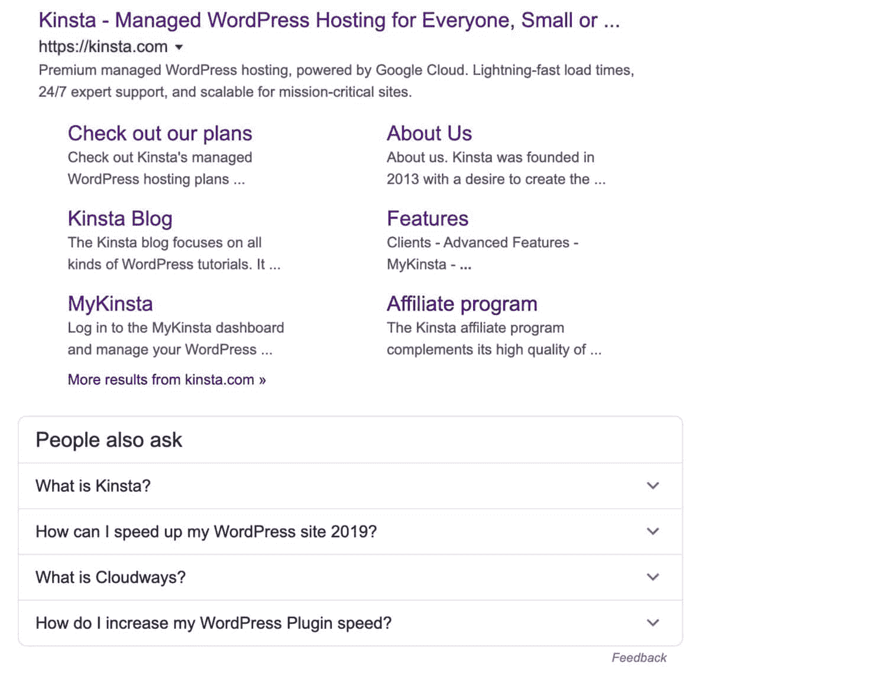

Kinsta search results


如果你将 Kinsta 网站接入[谷歌的结构化数据测试工具](https://search.google.com/test/rich-results)，你会发现我们的网站中包含了更多的微观数据。

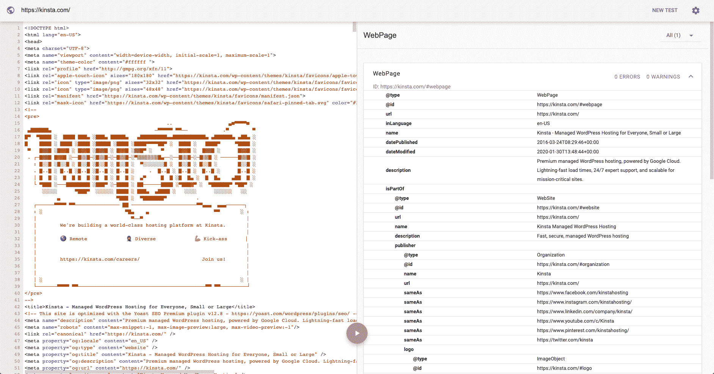

Testing Kinsta’s structured data


(还有一个相当酷的复活节彩蛋，以徽标和其他图形信息的形式呈现为代码！)

检查数据测试工具的结果会显示正在使用的模式标记数据类型，其中一些是:

*   @type:网页。
*   Publisher @type: Organization。
*   出版商 same as:[https://www.facebook.com/kinstahosting](https://www.facebook.com/kinstahosting)(也有 Instagram、Twitter 和其他社交媒体渠道的数据)。
*   isPartOf name: Kinsta 托管 WordPress 主机。

这只是提供的关于 Kinsta 的微数据的一个例子。你可以在[谷歌结构化数据测试工具](https://search.google.com/test/rich-results)找到其余的。

### 模式标记示例:Yoast.com

让我们来看另一个在站点中使用模式标记的例子。我选择了 [Yoast](https://kinsta.com/blog/yoast-seo/) ，因为他们的 SEO 插件包含模式标记。

如果你用谷歌搜索 Yoast，你会得到一些[站点链接](https://kinsta.com/blog/google-sitelinks/)(就像 Kinsta 一样)，但你也会得到一个知识面板，其中包括关于 Yoast 及其社交媒体账户的信息。

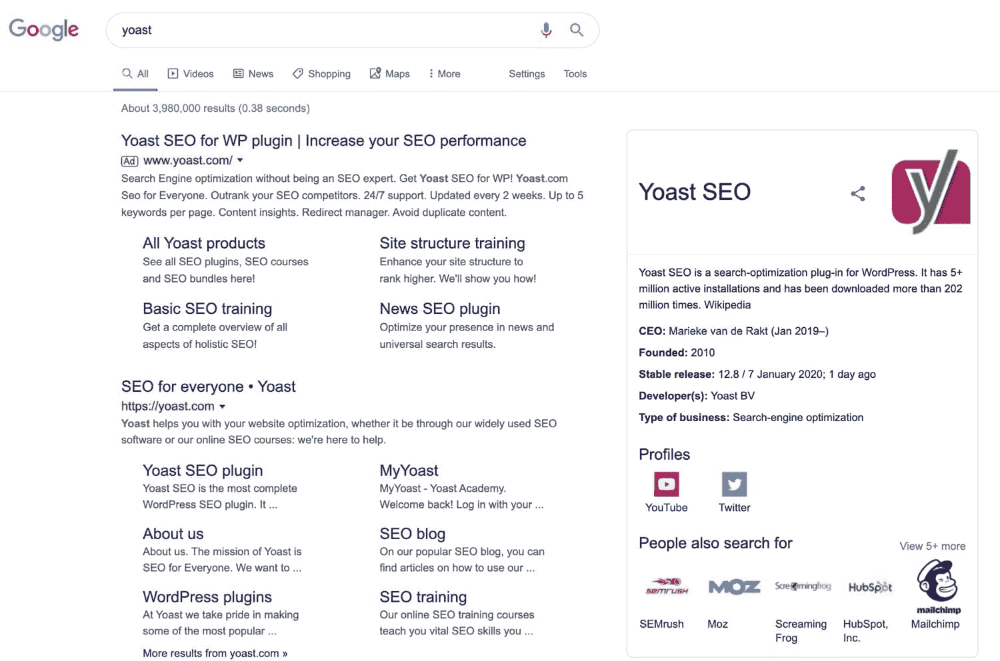

Yoast’s knowledge panel


如果您通过结构化数据测试工具运行 Yoast 网站[，您会发现他们正在使用模式标记来提供这些信息(正如预期的那样)。](https://search.google.com/test/rich-results)

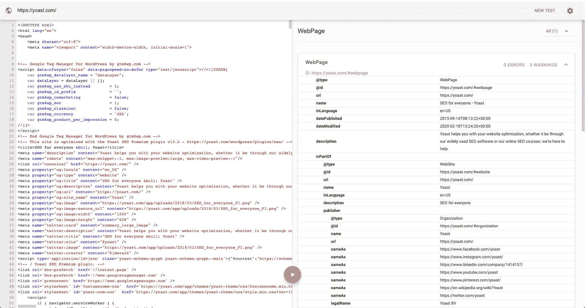

Testing Yoast’s structured data


模式标记主要由组织和技术组织使用。这是因为，从历史上看，向站点添加模式标记并不容易。然而，WordPress 网站所有者有一个优势，他们可以使用插件来添加它。

让我们看看怎么做。


## 如何给你的 WordPress 站点添加模式标记

有不同的方法可以用来添加 schema.org 标记。让我们看看他们！

### 通过主题添加模式标记

向你的 WordPress 站点添加模式标记的一个方法是[安装一个已经包含模式标记的主题](https://kinsta.com/blog/how-to-install-a-wordpress-theme/)。如果你在 WordPress 主题目录中搜索**模式**，你会得到很多结果。

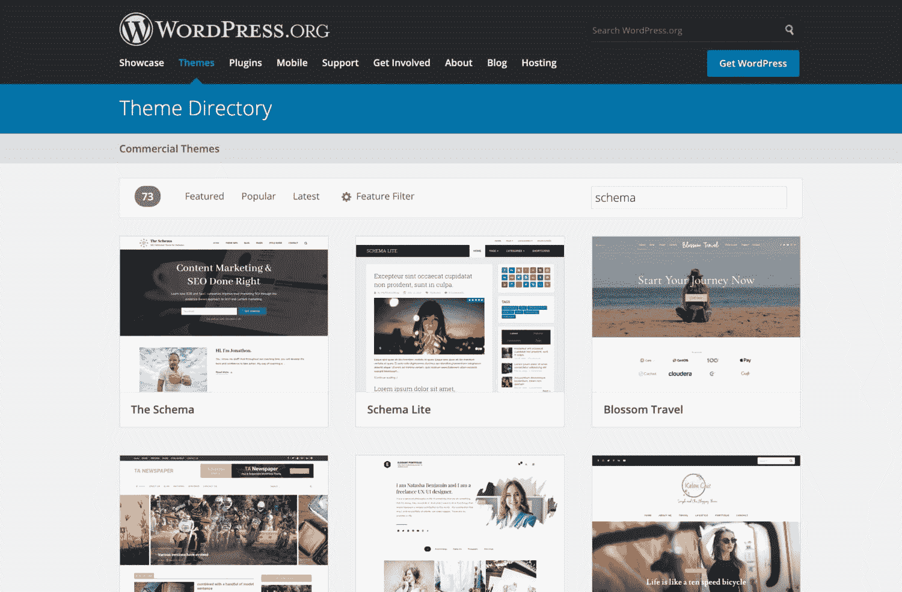

Schema theme search results


让我们来看看其中的一些主题。

#### 该模式

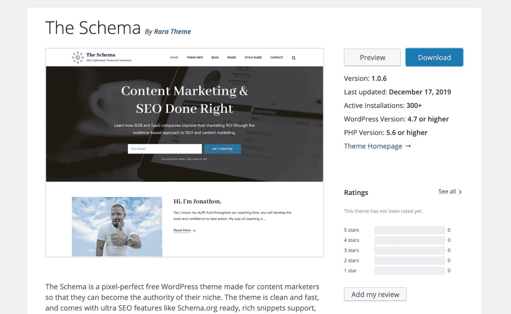

The Schema theme


免费的模式主题旨在提升你的搜索引擎优化。它将 schema 作为其代码的一部分，并声称它将帮助[提升你的搜索引擎排名](https://kinsta.com/blog/google-patents-seo-ranking-factors/)。它还内置了性能增强功能。

#### 你有时间吗

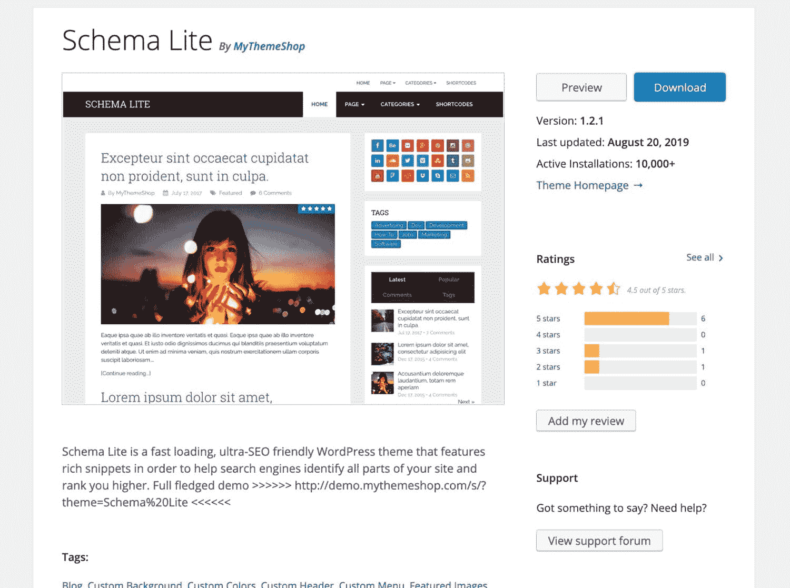

Schema Lite theme


[Schema Lite](https://en-gb.wordpress.org/themes/schema-lite/) 主题是高级模式主题的免费版本。它不包括高级主题的所有功能，但这是一个很好的尝试方式，看看该主题是否适合您。

#### (计划或理论的)纲要

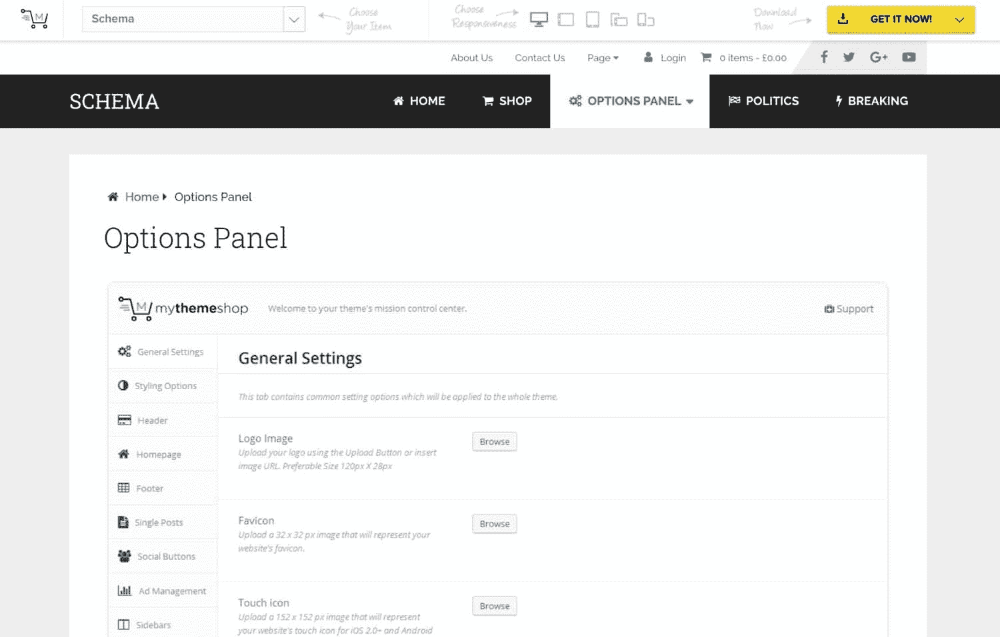

Schema theme


premium [Schema](https://mythemeshop.com/themes/schema/) 主题的设计与 Schema Lite 相似，但是有更多的 SEO 增强特性。它包括一个选项页面，您可以在其中添加有关站点的信息，这些信息将作为模式标记添加。

### 通过专门的 WordPress 插件添加模式标记

大多数网站已经安装了主题，所以你可能不想仅仅为了得到模式标记而改变你的主题。好消息是，你可以使用插件将模式标记添加到你的 WordPress 站点。

让我们来看看一些选项。

#### 模式插件

[模式](https://wordpress.org/plugins/schema/)插件使得向 WordPress 添加模式标记变得容易。它有一些有用的特性，比如在每个类别或每个帖子类型的基础上启用不同的模式类型，并且它与[定制帖子类型](https://kinsta.com/blog/wordpress-custom-post-types/)兼容。它也可以与其他已安装的插件一起工作，包括 [SEO 插件](https://kinsta.com/blog/best-seo-plugins-for-wordpress/)来利用你已经在使用的标记。

这个插件使用 JSON-LD(一种轻量级链接数据格式)，这是 Google 推荐的格式，Bing 也支持。注意[审查标记](https://kinsta.com/blog/best-wordpress-review-plugins/)不包含在核心模式插件中。然而，有一个免费的[模式审查](https://kinsta.com/blog/best-wordpress-review-plugins/#schema)配套插件将增加这一功能。

让我们看看如何设置模式插件。

[通过进入**插件>添加新的**并搜索**模式**，以通常的方式](https://kinsta.com/knowledgebase/how-to-install-wordpress-plugins/)安装它。点击**安装**，然后**激活**。

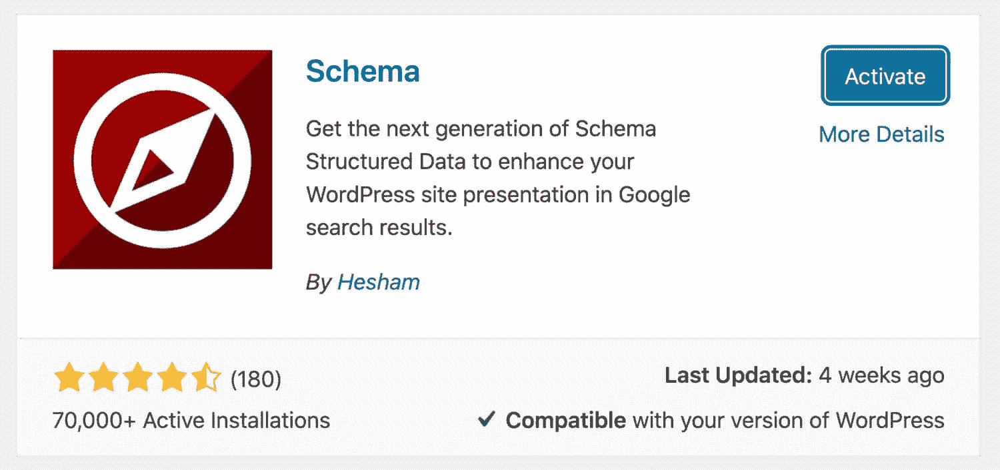

Installing the Schema plugin


一旦插件安装并激活，进入**模式>设置**开始添加模式标记到你的站点。填写基本信息，如“关于”和“联系人”页面的位置，并添加徽标。

然后，点击**快速配置向导**按钮开始设置。

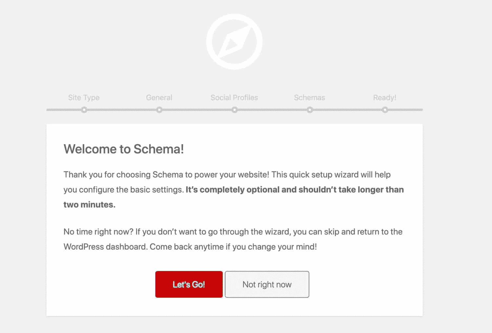

Schema Quick Configuration Wizard


按照向导进行操作，提供关于您的网站和您的社交媒体资料的信息，然后单击末尾的按钮编辑您的自定义帖子类型。

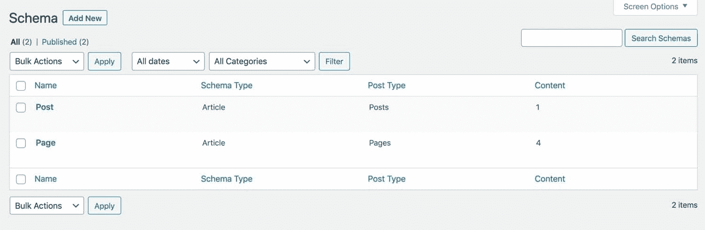

Editing schema types


通过点击**添加新的**按钮并填写详细信息，将您网站中的任何额外的自定义帖子类型添加到列表中。您还可以使用此屏幕向类别添加模式标记。查看[插件文档](https://schema.press/docs/)，了解一些更高级的使用功能

如果您想进一步调整您的设置，请转到**设置**选项卡。你也可以通过进入**模式>扩展**来添加扩展。在这里，你可以为[的 WooCommerce](https://kinsta.com/blog/woocommerce-tutorial/) 添加额外的插件，以及其他插件。您还可以安装模式插件的高级版本，它包括以下额外功能:

*   选择 schema.org 脚本标记的输出位置。
*   缩小脚本。
*   向您的管理工具栏添加一个链接，用于测试 schema.org 标记。
*   启用属性说明。
*   将 schema.org 标记添加到帖子类型归档和标签归档。

另一种快速简单的方法来缩减脚本和提高你的整体优化，也考虑缩减你的代码。Kinsta 已经在 [MyKinsta 仪表板](https://kinsta.com/mykinsta/) 中内置了一个 [代码缩小功能](https://kinsta.com/help/kinsta-cdn/#code-minification-1) ，允许客户通过简单的点击实现 CSS 和 JavaScript 的自动缩小

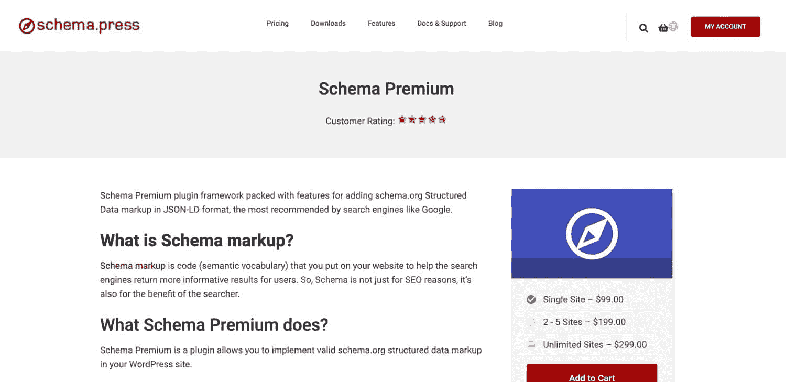

Schema Premium plugin


如果您的站点需要高级模式标记，您可能会发现额外付费是值得的。

#### Schema Pro 插件

另一个高级插件是 [Schema Pro](https://wpschema.com/) 插件，它将为你的 WordPress 站点添加高级模式标记。

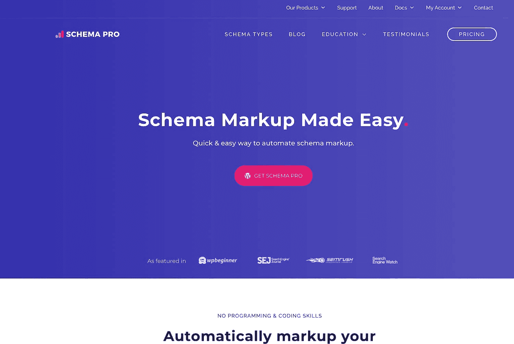

Schema Pro plugin


其特点包括:

1.  支持多种数据类型。
2.  完全自动化，所以模式数据被添加到新的和现有的职位和页面。
3.  支持自定义文章类型、分类和归档。
4.  自定义字段支持。
5.  扩展它并添加更多标记的能力。

排名靠前的网站选择 Kinsta 来处理他们从搜索中获得的高流量。[免费试用 kin sta](https://hubs.ly/H0pklC_0)。

#### 替代插件

Schema 和 Schema Pro 并不是唯一能给你的网站添加 schema.org 标记的插件。其他包括:

*   [WordLift AI powered SEO](https://wordlift.io/)
*   [WP SEO 结构化数据模式](https://wordpress.org/plugins/wp-seo-structured-data-schema/)
*   [全在一个模式中丰富的片段](https://wordpress.org/plugins/all-in-one-schemaorg-rich-snippets/)
*   [WP&AMP](https://wordpress.org/plugins/schema-and-structured-data-for-wp/)的模式和结构化数据
*   [WPSSO 模式 JSON-LD 标记](https://wordpress.org/plugins/wpsso-schema-json-ld/)
*   [在 schema.org 构建的标记(JSON-LD)](https://wordpress.org/plugins/wp-structuring-markup/)
*   [Schema App 结构化数据](https://wordpress.org/plugins/schema-app-structured-data-for-schemaorg/)
*   [秒按](https://wordpress.org/plugins/wp-seopress/)
*   [WP 审查](https://wordpress.org/plugins/wp-review/)(专门为审查添加模式标记)。

### 通过 Yoast SEO 插件添加模式标记

如果你已经在你的 WordPress 站点上使用了 SEO 的 [Yoast 插件，好消息是你可以使用这个插件来添加模式标记。它不像上面列出的一些高级插件那样添加那么多标记，也不专用于模式标记，但这意味着您不必安装和配置额外的插件。](https://kinsta.com/blog/yoast-seo/)

让我们来看看这是如何工作的。

当您第一次安装 Yoast 时，您会被要求提供网站所代表的实体以及社交媒体链接等信息。这都是向你的 WordPress 站点添加模式标记的一部分。

首先，你会被问到这个网站代表什么类型的组织。

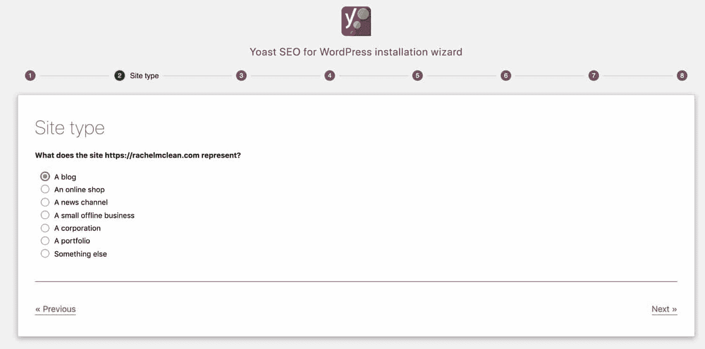

Yoast wizard – website type


然后你会被问到这个人或组织的名字。如果是一个组织，你还需要上传一个标志。在下面的截图中，我选择了一个用户作为网站代表的人。如果您需要更改此人的详细信息，您可以通过其个人资料页面进行更改。

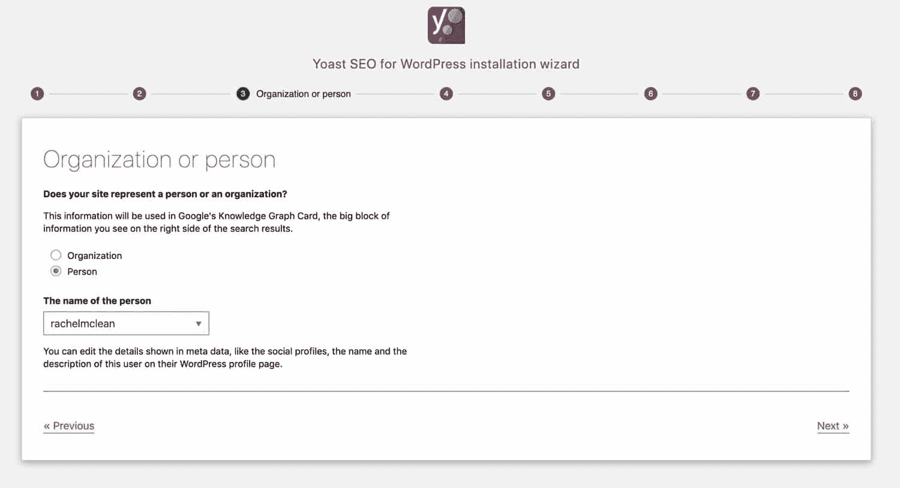

Assigning a user as the person the site represents


如果你的网站代表一个没有用户帐户的人，你有两个选择。要么选择 **Organization** 选项并填写详细信息，就好像此人是一个组织，要么设置一个用户帐户，其电子邮件地址是您自己的别名，这样您的客户就不会开始从系统接收电子邮件。

如果您需要随时更新您的网站所代表的实体类型，请进入 **SEO >搜索外观**并选择**常规**选项卡。向下滚动到【Schema.org】的**知识图表&部分，并在那里填写正确的详细信息。**

如果你的站点代表一个个人，你可以从下拉列表中选择一个用户，插件将从用户的个人资料中提取关于该用户的信息。因此，如果是你，请确保在你的用户资料中填写你的姓名和社交媒体账户信息。

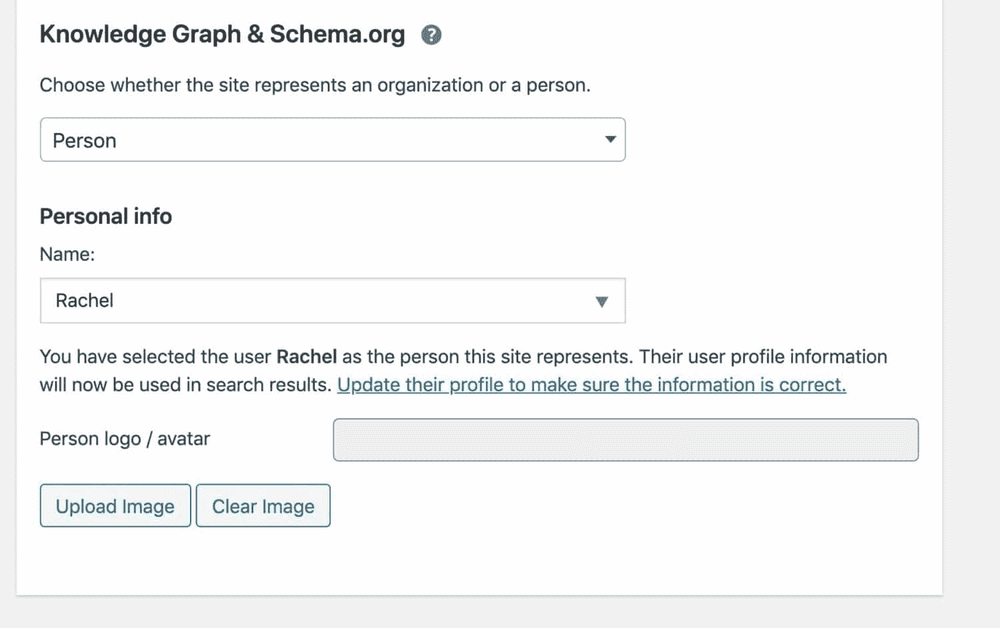

Editing schema.org markup in Yoast


如果该站点代表一个没有用户帐户的组织或个人，您只需输入该个人或组织的信息，而无需选择用户。为此，请访问 **SEO > Social** 。

一旦你设置了网站类型，Yoast 会自动添加数据类型和模式标记到你的 WordPress 站点。

Yoast 如何向你的 WordPress 站点添加模式标记的例子包括:

*   完整的[实体图](https://yoast.com/yoast-seo-11-0/)，基于您站点中的内容类型和站点类型的设置。这是您站点中的实体和内容类型的列表，当您在 Google 结构化数据测试工具中测试时会显示出来。
*   用文章和作者数据类型标记单个帖子和页面。
*   用适当的数据类型标记归档页面，例如用于分类和日期归档的 CollectionPage 和用于作者归档的 ProfilePage。
*   将搜索结果标记为 SearchResultsPage。

另一个有趣的特性是 **Yoast 结构化数据块**。你可以使用这些来[添加常见问题](https://kinsta.com/blog/wordpress-faq-plugins/)，如何到你的文章或页面，相关的模式标记将被用来告诉搜索引擎它们是什么。

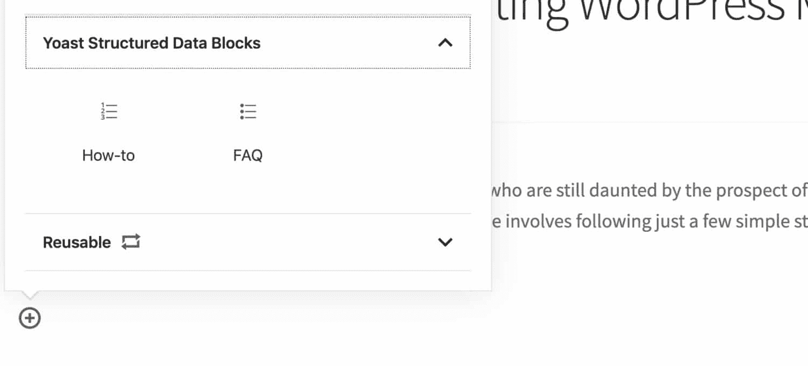

Yoast structured data blocks


您还可以使用 Yoast 附加组件添加额外的模式标记，例如使用[本地 SEO 附加组件](https://yoast.com/wordpress/plugins/local-seo/)添加位置数据类型，使用[新闻 SEO 附加组件](https://developer.yoast.com/features/schema/news-seo/)添加新闻数据。

## 如何向 WooCommerce 商店添加模式标记

如果你正在运行一个 [WooCommerce 商店](https://kinsta.com/learn/woocommerce-guide/)，实现模式标记会带来更多的好处。如果搜索引擎完全了解你的商店卖什么和它的主要市场在哪里，他们更有可能向你想要的访问者展示你的商店。因此，为你的 [WooCommerce](https://kinsta.com/blog/woocommerce-update/) 商店添加模式标记来增强 SEO 是值得的。

### 为什么要在存储中添加模式标记？

将模式标记添加到您的存储中告诉人们两件重要的事情。

第一个是品牌:组织类型及其子类型将告诉搜索引擎这个网站是为哪个商店服务的，它是哪种零售商。您还可以使用本地业务的数据类型来吸引本地客户。

您还可以使用模式标记来标记您的文章类型。这样，搜索引擎就知道你在卖产品。这最大化了你进入购物搜索结果的机会。

### 通过专门的 WordPress 插件向 WooCommerce 商店添加模式标记

有几个插件可以让你添加模式标记到你的 [WooCommerce 商店](https://kinsta.com/blog/woocommerce-tutorial/):

*   Yoast WooCommerce SEO 是一个高级插件，它可以让你将类似的模式标记添加到你的商店，就像普通的 Yoast 插件可以让你添加到一般的网站一样。
*   WordLift 的电子商务搜索引擎优化增加了结构化数据和扩展的产品标记，有助于让你的产品在谷歌的零售列表中更加显眼。
*   [WPSSO 核心(高级)](https://wpsso.com/extend/plugins/wpsso/)包括 WooCommerce 商店的电子商务加价。它有一个基于你运行的 WordPress 安装数量的费用结构。
*   [模式 WooCommerce](https://schema.press/downloads/schema-woocommerce/) 是一个 [WooCommerce 扩展](https://kinsta.com/blog/woocommerce-extensions/)，用于我们上面已经看过的模式插件，它将相关的模式标记添加到你的电子商务商店中。

## 如何手动添加模式标记到 WordPress

向你的 WordPress 站点添加模式标记的最后一个选择是手动完成，不需要插件。这样做的好处是不需要额外的代码，但是需要更多的工作。

你可以通过编辑你的主题中的模板文件来做到这一点。

例如，如果您有一个输出单个帖子的 loop-single.php 文件，该文件可能包含如下代码:

```
<article id="post-<?php the_ID(); ?>" <?php post_class(); ?>>

 <h2 class="entry-title"><?php the_title(); ?></h2>

 <?php if ( has_post_thumbnail() ) { ?>                            
  <?php the_post_thumbnail( medium, array(
   'class' => 'left',
   'alt'      => get_the_title()
  ) );
 ?>                  
 <?php } ?>

 <section class="entry-content">
  <?php the_content(); ?>
 </section><!-- .entry-content -->

</article>
```

您可以编辑代码以包含模式标记，如下所示:

```
<article itemscope itemtype ="http://schema.org/Article" id="post-<?php the_ID(); ?>" <?php post_class(); ?>>

 <h2 itemprop="name" class="entry-title"><?php the_title(); ?></h2>

 <?php if ( has_post_thumbnail() ) { ?>                            
  <?php the_post_thumbnail( medium, array(
   'class' => 'left',
   'alt'      => get_the_title()
  ) );
  ?>                  
  <?php } ?>

 <section itemprop=”articleBody”>class="entry-content">
  <?php the_content(); ?>
 </section><!-- .entry-content -->

</article>
```

例如，您可能会添加更多内容到专题图片和任何元数据中。在[Schema.org 网站](https://schema.org/docs/full.html)上找出哪些项目类型和属性适用于您的内容。

然后，您需要向每个模板文件添加相关的标记，或者在您的主题中包含文件，包括您的 header.php 文件。

一旦你这样做了，它将自动添加到使用该模板文件的每个页面。您可能会发现需要为使用层次结构中较高位置的文件的 post 类型添加额外的模板文件，但这只是意味着复制和重命名现有文件，然后添加模式标记。

## 测试您的模式标记

一旦你在你的 WordPress 站点上添加了模式标记，或者在你做比较之前，测试它是一个好主意。

使用[谷歌结构化数据测试工具](https://search.google.com/test/rich-results)。

在 web 浏览器中打开该工具，然后输入您站点的 URL。一些插件会给你一个按钮，链接到 WordPress 仪表盘的右边。

Google 的测试工具将指出模式标记的哪些方面出现在您的站点中，哪些方面缺失。如果有你认为需要的缺失，你可以返回并调整你的插件设置或者手动添加缺失的标记。

[Schema markup and SEO go hand in hand 🤝 Learn how you can improve your site's ranking with this in-depth guide 🚀Click to Tweet](https://twitter.com/intent/tweet?url=https%3A%2F%2Fkinsta.com%2Fblog%2Fschema-markup-wordpress%2F&via=kinsta&text=Schema+markup+and+SEO+go+hand+in+hand+%F0%9F%A4%9D+Learn+how+you+can+improve+your+site%27s+ranking+with+this+in-depth+guide+%F0%9F%9A%80&hashtags=seo%2Cschema)

## 摘要

给你的 WordPress 站点添加模式标记会给你一个 SEO 提升，因为它会告诉搜索引擎更多关于你的站点和它存在的上下文。在搜索引擎的列表页面上直接显示相关信息可能是销售成功与否的关键。

大多数网站还没有使用模式标记，所以如果你花一点时间来添加它，你将立刻领先于你的竞争对手。你可以手工操作，使用像 Yoast 这样的 SEO 插件，或者在你的站点上安装一个专用的模式插件。

现在问你:你在你的站点上利用模式标记了吗？请在评论中告诉我们！

* * *

让你所有的[应用程序](https://kinsta.com/application-hosting/)、[数据库](https://kinsta.com/database-hosting/)和 [WordPress 网站](https://kinsta.com/wordpress-hosting/)在线并在一个屋檐下。我们功能丰富的高性能云平台包括:

*   在 MyKinsta 仪表盘中轻松设置和管理
*   24/7 专家支持
*   最好的谷歌云平台硬件和网络，由 Kubernetes 提供最大的可扩展性
*   面向速度和安全性的企业级 Cloudflare 集成
*   全球受众覆盖全球多达 35 个数据中心和 275 多个 pop

在第一个月使用托管的[应用程序或托管](https://kinsta.com/application-hosting/)的[数据库，您可以享受 20 美元的优惠，亲自测试一下。探索我们的](https://kinsta.com/database-hosting/)[计划](https://kinsta.com/plans/)或[与销售人员交谈](https://kinsta.com/contact-us/)以找到最适合您的方式。**