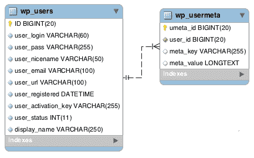
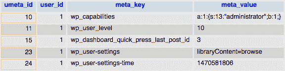
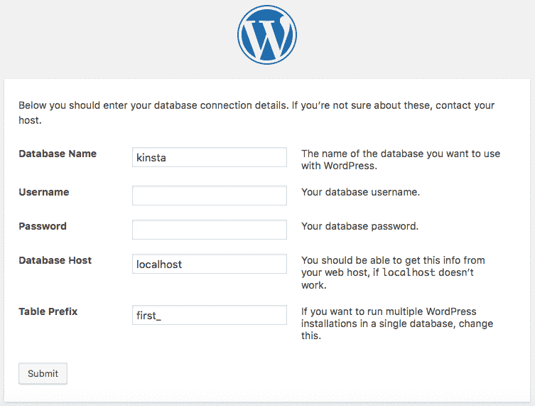
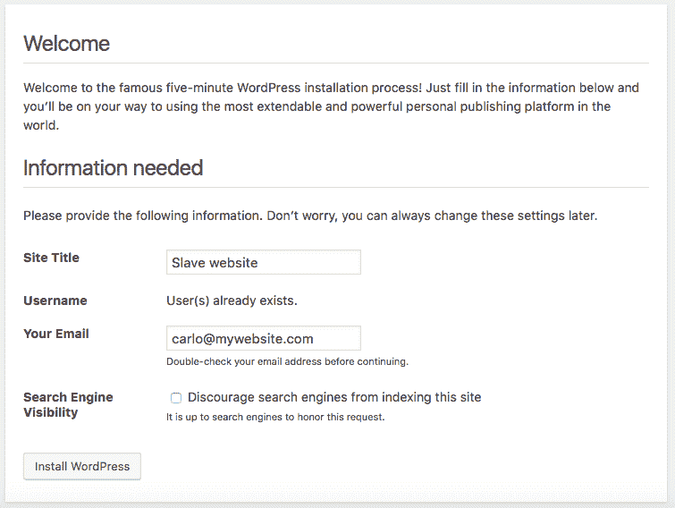
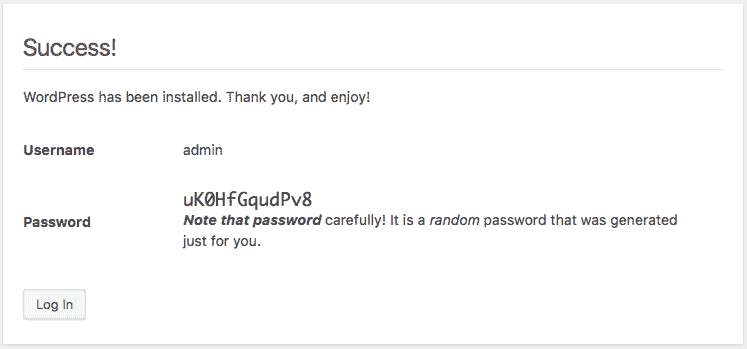
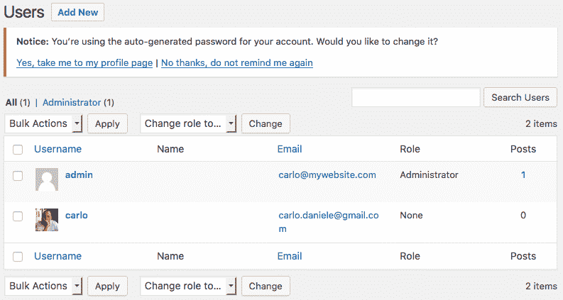
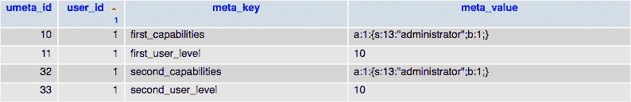

# 如何在多个 WordPress 站点之间共享登录和用户

> 原文：<https://kinsta.com/blog/share-logins-wordpress/>

我们的目标是建立两个 WordPress 网站，将共享登录和相同的用户。一旦用户订阅了一个网站，她将能够以相同的角色和功能访问另一个网站。

为了实现这个目标，我们应该能够编辑 [WordPress 配置文件](https://kinsta.com/blog/wp-config-php/)并更新数据库表。对 WordPress 架构和[数据库结构](https://codex.wordpress.org/Database_Description)有一个大致的了解，以及 WordPress 开发的基础知识是必不可少的。如果你不是专业的，不用担心。只要遵循这个帖子的指示，并在评论中提出你的问题。

在我们开始编码之前，我们需要知道 [WordPress 用户角色](https://kinsta.com/blog/wordpress-user-roles/)和功能存储在哪里。因此，我们的第一步是深入研究数据库表。

**重要提示:**由于我们只允许每个站点安装一个 WordPress(除非你运行的是 [WordPress multisite](https://kinsta.com/wordpress-multisite-hosting/) )，以下内容在 Kinsta 环境中不能开箱即用。在我们的平台上实现这一点也许是可能的，但这需要一些额外的设置或开发。我们建议与一位 [WordPress 开发者](https://kinsta.com/blog/hire-wordpress-developer/)讨论这个问题。

*   [用户数据和元数据](#user-data-metadata)
*   [定义自定义用户表–共享登录](#custom-user-tables)
*   [安装 WordPress](#installing-wordpress)
*   [角色和能力](#roles-capabilities)
*   [使用功能](#duplicate-caps-and-levels)自动复制上限和级别

## 用户数据和元数据

默认情况下，WordPress 将用户相关数据存储在三个表中:`{$pref}options`、`{$pref}users`和`{$pref}usermeta`。

*   `{$pref}options`表在其 option_key 字段为`{$pref}user_roles`的行中存储了可用角色和能力的完整列表。
*   `{$pref}users`表存储基本的用户数据，如登录名、密码、电子邮件、url 等。
*   `{$pref}usermeta`表存储用户元数据。

当在新的 WordPress 安装上工作时，我们不必关心`{$pref}options`表中的`{$pref}user_roles`行，因为相应的 option_value 字段总是有相同的值。我们应该考虑这一行，以防我们在角色或功能已经改变的现有安装上工作。
不用担心`{$pref}users`表，因为它存储了基本的用户数据，当我们在网站之间共享用户时，这些数据不会改变。
`{$pref}usermeta`表是我们为了实现目标而要更新的唯一一个表。


> Kinsta 把我宠坏了，所以我现在要求每个供应商都提供这样的服务。我们还试图通过我们的 SaaS 工具支持达到这一水平。
> 
> <footer class="wp-block-kinsta-client-quote__footer">
> 
> 
> 
> <cite class="wp-block-kinsta-client-quote__cite">Suganthan Mohanadasan from @Suganthanmn</cite></footer>

[View plans](https://kinsta.com/plans/)



users and usermeta table structure
(source: Codex [Database Description](https://codex.wordpress.org/Database_Description))


`{$pref}usermeta`以键/值对的形式存储用户元数据。在这个表中，五行存储了我们必须考虑的数据。



Five rows in usermeta table store data concerning user capabilities, level and dashboard settings


第一行的 meta_key 字段设置为`{$pref}capabilities`，对应的 meta_value 字段是一个保存用户角色的序列化数组。第二行存储用户级别(注意，WordPress 3.0 不支持用户级别)。剩下的三行是关于仪表板设置的，我们不会在这篇文章中深入讨论。
用户角色、级别和设置特定于 WordPress 安装，并由相同的`$pref`值标识。当我们的目标是在网站之间共享用户时，这是一个重要的信息，因为我们将不得不复制这些行并相应地更改`meta_key`字段。

当我们打算在新的 WordPress 安装之间共享登录和用户时，这就是我们必须知道的关于用户表的全部内容。在现有网站上工作时，我们应该考虑到许多插件给`{$pref}usermeta`添加了额外的行，我们可能需要更深入地查看数据库表。

说到用户表，我们可以向前迈进一步。现在我们必须将两个特定的常数定义到*wp-config.php*文件中。
T3】

## 定义自定义用户表–共享登录

WordPress 允许我们设置自定义表格，而不是`{$pref}users`和`{$pref}usermeta`。这意味着如果两个(或更多)WordPress 网站共享一个[数据库](https://kinsta.com/knowledgebase/wordpress-database/)，我们可以为它们设置相同的用户和用户元表。因此，共享这些表的所有网站将共享相同的用户。

Note: In order to share the same users and usermeta tables, WordPress installations must share the same database.

我们只需要将`CUSTOM_USER_TABLE`和`CUSTOM_USER_META_TABLE`定义到【wp-config.php】文件*中，如下面的代码所示:*

```
// custom users and usermeta tables
define( 'CUSTOM_USER_TABLE', 'my_users_table' );
define( 'CUSTOM_USER_META_TABLE', 'my_usermeta_table' ); 
```

Note: On existing websites it’s mandatory to back-up WordPress installations before you make any changes to *wp-config.php* files and data tables

现在我们知道了要做什么，是时候运行我们的两个 WordPress 安装程序了。

## 安装 WordPress

为了方便起见，我将 WordPress 根文件夹命名为第一个*和第二个*分别为*和*。`first_`和`second_`将是各自的表格前缀。现在让我们运行第一次安装。



In this example, we set the table prefix field to first_


Note: All installations will share a single database, and we should provide each installation with a unique table prefix.

当第一个 WordPress 网站建立并运行时，我们可以编辑它的配置文件。*打开/first/wp-config.php* ，在*‘停止编辑’*注释上方添加以下几行:

## 注册订阅时事通讯


### 想知道我们是怎么让流量增长超过 1000%的吗？

加入 20，000 多名获得我们每周时事通讯和内部消息的人的行列吧！

[Subscribe Now](#newsletter)

```
$table_prefix  = 'first_';

define('WP_DEBUG', true);
define( 'WP_DEBUG_LOG', true );
define( 'WP_DEBUG_DISPLAY', false );
@ini_set( 'display_errors', 0 );

// custom users and usermeta tables
define( 'CUSTOM_USER_TABLE', $table_prefix . 'users' );
define( 'CUSTOM_USER_META_TABLE', $table_prefix . 'usermeta' );

/* That's all, stop editing! Happy blogging. */ 
```

我们已经[启用了调试模式](https://kinsta.com/blog/wordpress-debug/)，强制 WordPress 将错误通知和警告存储到 *debug.log* 文件中(在[如何配置 WordPress](https://kinsta.com/blog/wp-config-php/) 的深度视图中阅读更多关于这个主题的内容)。
然后，我们给`first_users`和`first_usermeta`表定义了`CUSTOM_USER_TABLE`和`CUSTOM_USER_META_TABLE`常量。这样我们就不会改变 WordPress 的默认设置。

我们完成了第一次安装。接下来我们必须从第一个安装文件夹中复制*wp-config.php*并粘贴到第二个安装的根文件夹中。注意相应地更改 *$table_prefix* 值:

```
$table_prefix  = 'second_';

define('WP_DEBUG', true);
define( 'WP_DEBUG_LOG', true );
define( 'WP_DEBUG_DISPLAY', false );
@ini_set( 'display_errors', 0 );

// custom users and usermeta tables
define( 'CUSTOM_USER_TABLE', 'first_users' );
define( 'CUSTOM_USER_META_TABLE', 'first_usermeta' ); 
```

`CUSTOM_USER_TABLE`和 C `USTOM_USER_META_TABLE`设置为第一次安装的值:`first_users`和`first_usermeta`。第一次安装就这些了。



WordPress is aware of existing users and we should set a non-existent email address for admin user


当运行第二次安装时，我们应该为管理员用户设置一个不存在的电子邮件地址，因为 WordPress 从`first_users`表中找到了一些现有的用户。



WordPress creates an admin username for the second installation


以管理员身份登录第二个安装管理面板，列出 WordPress 用户。您会发现新的管理员用户和第一个网站的所有用户(这允许他们共享登录)。此时，一个网站的用户将无法登录到另一个网站。



The users in the second website won’t inherit their roles from the first website


为了在两个网站中授予用户相同的功能，我们必须更新`{$pref}usermeta`表。

Struggling with downtime and WordPress problems? Kinsta is the hosting solution designed to save you time! [Check out our features](https://kinsta.com/features/)

## 角色和能力

如果你运行新的 WordPress 安装，你不必关心`{$pref}options`表。你只需要更新`{$pref}usermeta`表。

在我们的例子中，当在第一个网站中创建新用户时，WordPress 在`first_usermeta table`中添加`first_capabilities`和`first_user_level`行。要访问第二个网站，应复制这些行，如下图所示:



当在第二个网站中创建新用户时，`second_capabilities`和`second_user_level`行将被添加到`first_usermeta`表中。
为了给跨网站的用户相同的角色和帽子，在`second_capabilities`和`second_user_level`中要复制`first_capabilities`和`first_user_level`行。有了同一个`first_usermeta`表中的这两对行，用户将能够以相同的权限访问两个网站。

要更新所有现有的 usermeta 行，您可以运行一个 SQL 查询或从 [phpMyAdmin](https://kinsta.com/help/wordpress-phpmyadmin/) 更新表。但是对于从现在开始订阅我们网站的用户来说呢？根据 [WordPress Codex](https://codex.wordpress.org/Editing_wp-config.php#Custom_User_and_Usermeta_Tables) ，我们将使用一个插件或建立一个自定义功能。
我们走吧！


## 使用函数自动复制上限和级别

`set_user_role`是一个动作挂钩，在创建新用户或编辑现有用户的角色时触发。由于这个动作，我们可以自动更新用户元表。
所以，在一个插件的主文件中添加以下函数:

```
function ksu_save_role( $user_id, $role ) {

	// Site 1
	// Change value if needed
	$prefix_1 = 'first_';

	// Site 2 prefix
	// Change value if needed
	$prefix_2 = 'second_';

	$caps = get_user_meta( $user_id, $prefix_1 . 'capabilities', true );
	$level = get_user_meta( $user_id, $prefix_1 . 'user_level', true );

	if ( $caps ){
		update_user_meta( $user_id, $prefix_2 . 'capabilities', $caps );
	}

	if ( $level ){
		update_user_meta( $user_id, $prefix_2 . 'user_level', $level );
	}
}

add_action( 'set_user_role', 'ksu_save_role', 10, 2 ); 
```

回调函数保留三个参数，其中两个是必需的:`$user_id`和`$role`。
这个函数的作用不言自明。get_user_meta 返回指定的用户元字段值。我们调用了这个函数两次来检索`first_capabilities`和`first_user_level`字段。然后我们使用这些值将`second_capabilities`和`second_user_level`字段添加到`first_usermeta`表中。

上传广告激活此插件到第一个网站。

为了让安装对称地工作，我们只需要在任何安装中上传并激活插件，但是要给前缀设置正确的值。例如，如果我们要在第二个网站中激活此功能，我们只需如下声明变量:

```
$prefix_1 = 'second_';
$prefix_2 = 'first_'; 
```

因此，编辑并安装插件到第二个网站，并创建一个新用户或改变现有的用户角色。然后查看第一个网站。用户角色将与第二个网站完全相同。

## 摘要

在这篇文章中，我解释了如何在独立的 WordPress 安装中授予用户相同的权限。注册到网站后，用户将能够访问共享相同用户和用户元表的所有网站。我本该和新装置一起工作。如果你在现有的网站上工作，你应该考虑一些插件可能已经更新了用户元表，或者甚至创建了存储用户相关数据的新表。在这种情况下，对数据库进行更精确的分析是合适的。

如果你对如何在 WordPress 中分享[登录有任何疑问，或者你想与我们分享你的经验，请随时加入讨论，发表你的评论。](https://kinsta.com/blog/wordpress-login-url/)

我们插件的完整代码可以在[这个公共要点](https://gist.github.com/carlodaniele/dcaa60b3cf6145e7f242efea24a2d9f9)中找到

* * *

让你所有的[应用程序](https://kinsta.com/application-hosting/)、[数据库](https://kinsta.com/database-hosting/)和 [WordPress 网站](https://kinsta.com/wordpress-hosting/)在线并在一个屋檐下。我们功能丰富的高性能云平台包括:

*   在 MyKinsta 仪表盘中轻松设置和管理
*   24/7 专家支持
*   最好的谷歌云平台硬件和网络，由 Kubernetes 提供最大的可扩展性
*   面向速度和安全性的企业级 Cloudflare 集成
*   全球受众覆盖全球多达 35 个数据中心和 275 多个 pop

在第一个月使用托管的[应用程序或托管](https://kinsta.com/application-hosting/)的[数据库，您可以享受 20 美元的优惠，亲自测试一下。探索我们的](https://kinsta.com/database-hosting/)[计划](https://kinsta.com/plans/)或[与销售人员交谈](https://kinsta.com/contact-us/)以找到最适合您的方式。