# 2022 年 11 个最佳 Shopify 替代方案(免费、付费和开源)

> 原文：<https://kinsta.com/blog/shopify-alternatives/>

电子商务已经发展成为一股不可阻挡的力量，2019 年仅在美国就有 6017.5 亿美元的销售额。随着越来越多的人在网上购物，大多数企业都开始寻找自己的网上商店。

Shopify 是全球领先的电子商务平台之一，拥有成千上万的供应商和商店。这并不意味着它是您的唯一选择，因为有大量功能齐全的平台可用，甚至一些不可能的竞争对手也为特定受众提供了更好的解决方案。没有行业经验，很多企业主对 Shopify 这样的平台能给他们提供什么只有一个模糊的概念。

所以，如果你想知道“我可以用什么来代替 Shopify？”，我们有这篇适合您的文章，因为我们将涵盖顶级 Shopify 替代方案的优缺点、用户体验和定价明细。

准备好了吗？我们开始吧！

## 1.伍尔科贸易公司

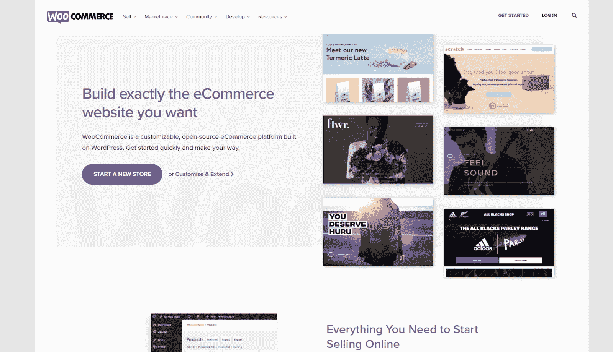

WooCommerce

WooCommerce 是一个建立在 WordPress 之上的自托管电子商务平台。它是开源的和可扩展的，适合那些想要完全控制和拥有自己内容的严肃的电子商务企业家和企业。

### 赞成的意见

*   免费开源。
*   100%拥有和控制内容。
*   根据费用自由选择支付处理器。
*   大型店更便宜。
*   可扩展大量的免费[插件](https://kinsta.com/blog/woocommerce-plugins/)和[扩展](https://kinsta.com/blog/woocommerce-extensions/)。
*   从各种免费和付费的 WooCommerce 主题中选择你想要的外观。
*   利用 WordPress 强大的基础进行内容营销和 SEO。

### 骗局

*   如果没有一个专门的 WooCommerce 主机，就像 Kinsta 的 [WooCommerce 主机](https://kinsta.com/woocommerce-hosting/)一样，速度会很慢。

### 用户界面

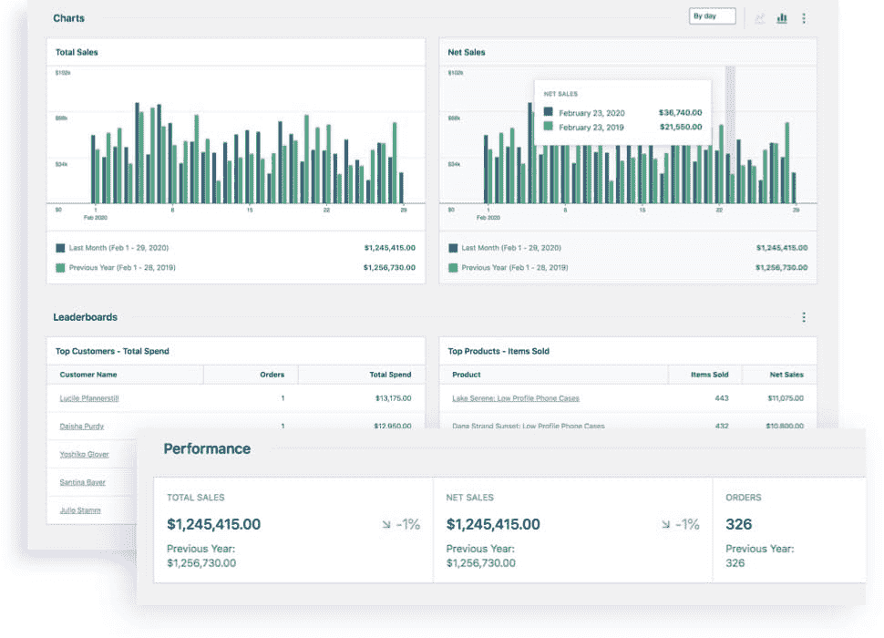

WooCommerce dashboard

WooCommerce 的仪表盘直接内置在 WordPress 中，直观易用。

> Kinsta 把我宠坏了，所以我现在要求每个供应商都提供这样的服务。我们还试图通过我们的 SaaS 工具支持达到这一水平。
> 
> <footer class="wp-block-kinsta-client-quote__footer">
> 
> 
> 
> <cite class="wp-block-kinsta-client-quote__cite">Suganthan Mohanadasan from @Suganthanmn</cite></footer>

[View plans](https://kinsta.com/plans/)

### 计划和定价

WooCommerce 是免费的，没有月费，只要你已经有一个网站和一个主机。注意:您必须使用外部支付处理器，它将根据您选择的提供商对交易收取一定比例的费用。

在我们专门的比较中，阅读更多关于 WooCommerce 与 Shopify 的利弊。

## 2.大商业

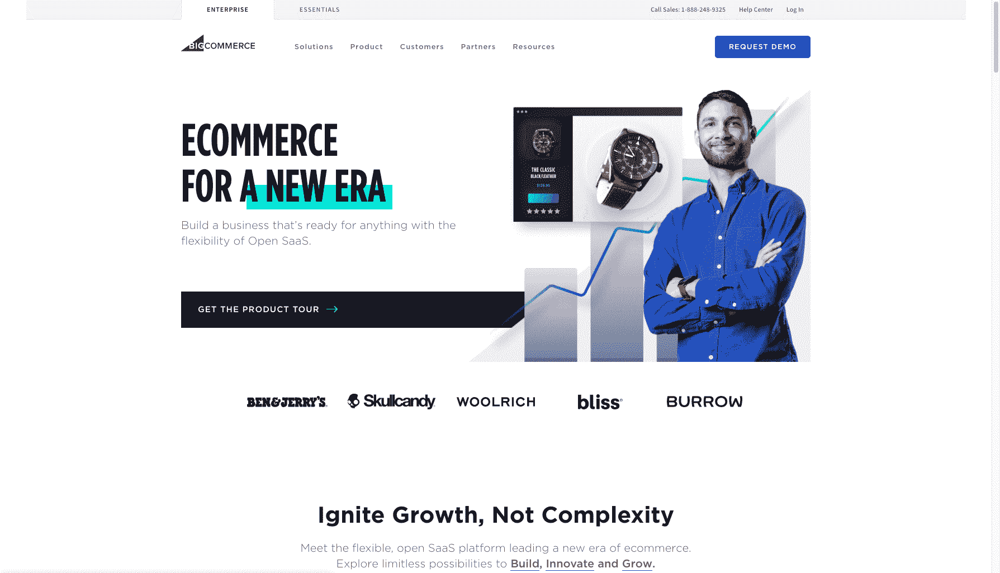

BigCommerce

[BigCommerce](https://kinsta.com/blog/woocommerce-alternative-bigcommerce/) 是一个专门的电子商务平台，具有先进的营销功能，如内置于其核心的[购物车放弃电子邮件](https://kinsta.com/blog/shopping-cart-abandonment/)。高级功能使其成为精明的数字营销人员和希望扩大电子商务销售的公司的绝佳选择。

### 赞成的意见

*   核心中包含的营销功能(放弃购物车， [Google AMP 页面](https://kinsta.com/blog/google-amp/))。
*   自由选择自己选择的[支付网关](https://kinsta.com/blog/woocommerce-payment-gateways/)，无需额外费用(不像 Shopify)。
*   对[多渠道商务](https://kinsta.com/blog/ecommerce-statistics/)的原生支持。
*   可通过各种插件和第三方合作伙伴进行扩展。

### 骗局

*   对内容和功能的有限所有权和控制。
*   获取高级功能的高额月费(79.95 美元至 299.95 美元)。

### 用户界面

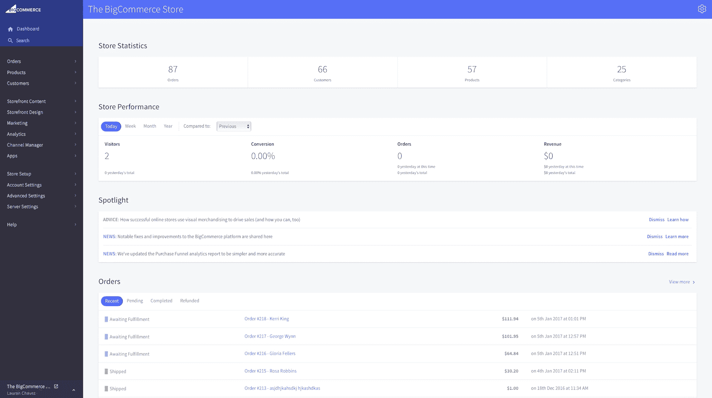

BigCommerce dashboard

BigCommerce 的用户体验和 Shopify 一样直观，导航清晰，设计简洁。

### 计划和定价

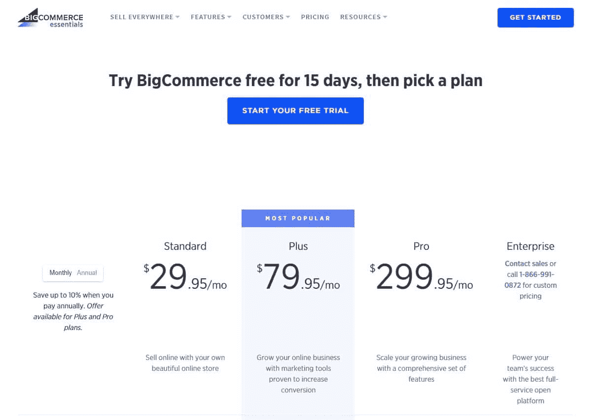

BigCommerce pricing

对于有限的功能和高达 5 万美元的年收入，标准计划每月 29.95 美元起。此外，还包括自动购物车恢复等营销功能，每月费用为 79.95 美元。支付处理:第三方支付网关起价 2.9%，每次支付 0.3 美元。

## 3.体积

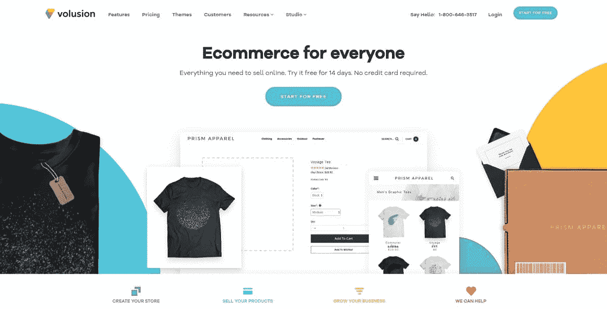

Volusion

[Volusion](https://www.volusion.com/) 是一个电子商务平台，专注于需要易于使用的解决方案的中小型企业。简单的界面和一步一步的教程使创建你的第一个商店变得容易。

### 赞成的意见

*   简单的界面。
*   帮助您入门的交互式分步教程。
*   电话订单和 [CRM](https://kinsta.com/blog/wordpress-crm/) 。
*   支持[多渠道商务](https://kinsta.com/blog/ecommerce-statistics/)(商业计划书及以上)。
*   你可以轻松雇佣内部营销团队提供帮助(广告、创意、分析等等)。

### 骗局

*   高级功能仅包含在商务版(每月 299 美元)及以上版本中。
*   基本计划仅限于 100 种产品。
*   有限的集成。

### 用户界面

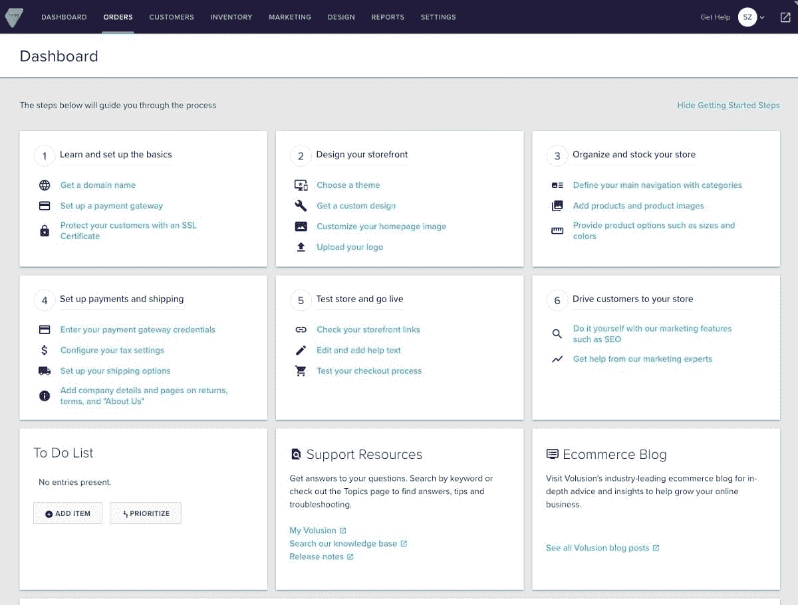

Volusion’s dashboard tutorial

Volusion 的主要卖点是它的易用性，它提供了一步一步的教程和简单易用的界面，可以帮助任何人快速入门。

### 计划和定价

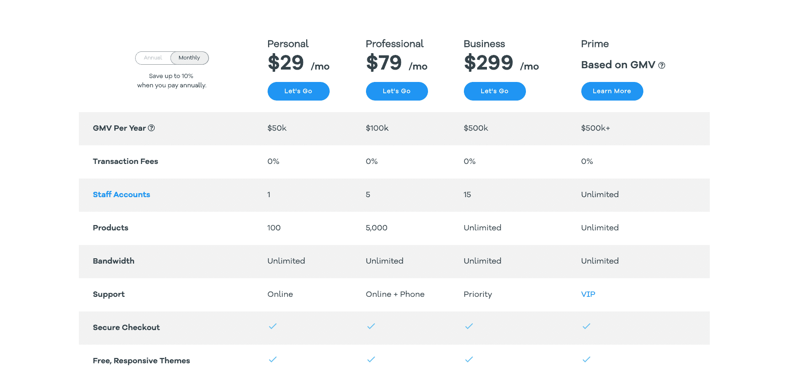

Volusion pricing

Volusion 的个人计划起价为每月 29 美元，涵盖多达 100 种产品，年销售额为 5 万美元。对于电话销售和 CRM，您需要升级到每月 79 美元的专业计划。**支付处理:**第三方解决方案，起价 2.9%，每次支付 0.3 美元。

## 4.PinnacleCart

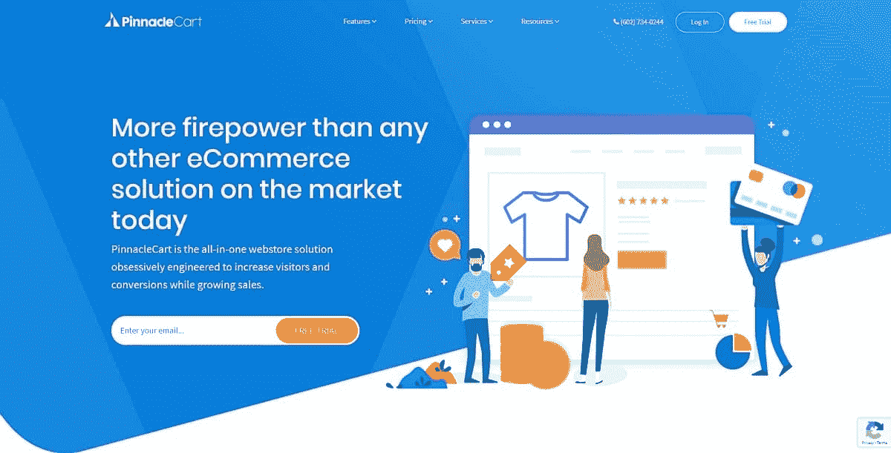

PinnacleCart

PinnacleCart 宣称自己是[电子商务平台市场](https://kinsta.com/blog/ecommerce-platforms/)的营销和转化领导者。有了内部设计和营销服务，对于在这些领域需要帮助的[店主](https://kinsta.com/blog/woocommerce-plugins/)来说，这是一个不错的选择。

### 赞成的意见

*   核心中包括 [SEO](https://kinsta.com/blog/wordpress-seo/) 工具、购物车恢复和其他高级营销功能。
*   易于使用的界面。
*   所有计划的无限产品。
*   提供内部设计、开发和营销服务。

### 骗局

*   有限的集成。
*   标准计划仅包括 20GB 带宽。

### 用户界面

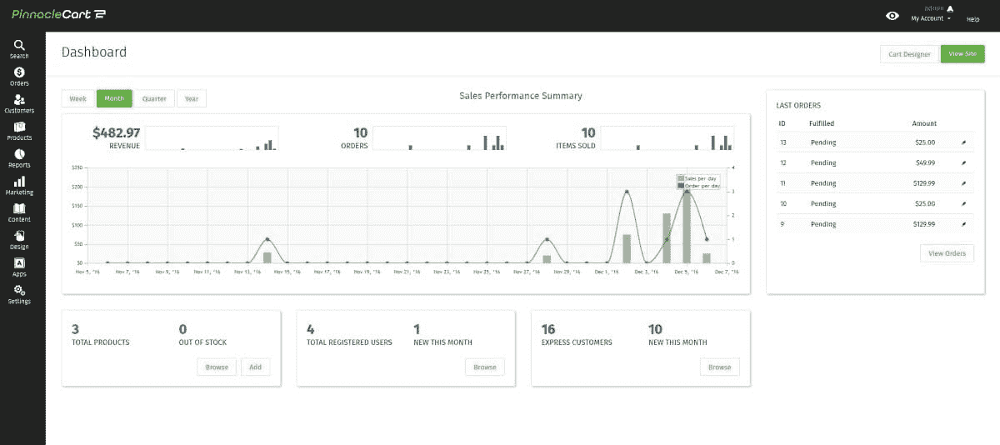

PinnacleCart Dashboard

PinnacleCart 仪表板直观、易于使用和理解，为销售和营销提供了强大的报告。

### 计划和定价

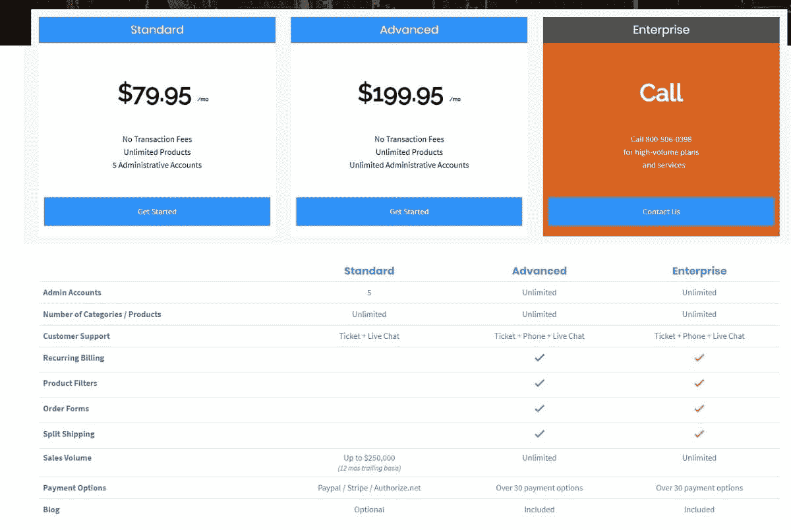

PinnacleCart pricing

PinnacleCart 的标准计划每月费用为 79.95 美元，包括所有功能、无限产品和高达 25 万美元的销售额。主机被限制为 10GB 磁盘空间和 20GB 带宽。

高级计划包括私有的 SSL 和无限的硬盘空间和带宽。还有一个永久许可的本地选项，您需要联系他们的销售团队。**付款处理:**第三方解决方案，起价 2.9%，每次付款 0.3 美元。

## 5.辛沃利

Simvoly

Simvoly 是一个网站和 T2 的漏斗建立者，同时也为 T4 的电子商务和在线商店提供支持。对于习惯于使用 ClickFunnels 或类似软件的企业家和企业来说，这是一个很好的选择，但也希望创建一个拥有多种产品的在线商店。

### 赞成的意见

*   通过追加销售实现强大的结账流程，以最大化平均订单价值(AOV)。
*   全功能漏斗生成器。
*   直观而强大的拖放式商店生成器。
*   简单的界面。

### 骗局

*   有限的电子商务管理功能(如库存管理等)。
*   有限的电子商务和营销分析和报告。

### 用户界面

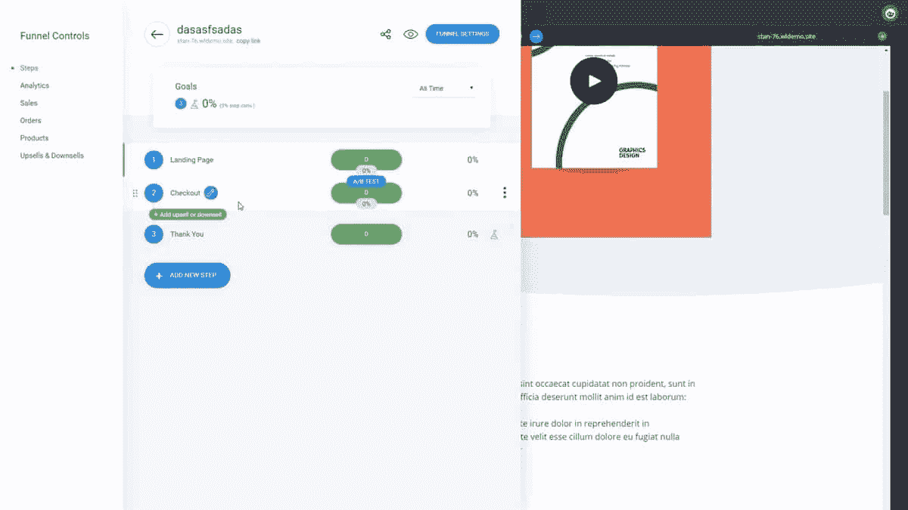

Simvoly UI funnels

Simvoly 的突出特点是其高级页面和漏斗生成器，这对于专注于少数产品或销售流程较长的公司来说非常有用。

### 计划和定价

Simvoly Pricing

个人计划仅支持最多 5 个产品、20 个页面和 10GB 带宽，但每月仅花费 12 美元。商业计划是每月 24 美元，不限页面，多达 100 个产品，60 GB 带宽。**支付处理:**第三方解决方案，起价 2.9%，每次支付 0.3 美元。

## 6.大卡特尔

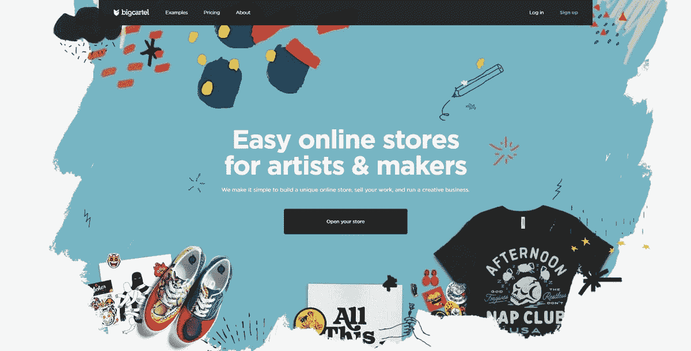

Big Cartel

[Big Cartel](https://www.bigcartel.com/) 是一个简单的电子商务解决方案，面向艺术家、创意者和有影响力的人。有限的功能使它易于使用，但也使它不适合现有的企业和商店。

### 赞成的意见

*   简单易用。
*   提供免费计划(最多 5 种产品)。
*   比其他方案便宜(全功能方案每月 9.99 美元起)。

### 骗局

*   有限的集成。
*   有限的营销功能和应用。
*   缺乏原生分析和测试(虽然它与谷歌分析集成)。

### 用户界面

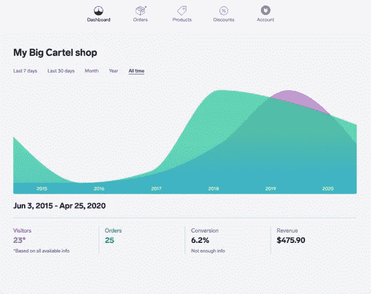

Big Cartel Dashboard

Big Cartel 的 UI 丰富多彩、简单易用，但它没有大多数竞争对手的强大功能或深入数据。它非常适合艺术家销售商品，但不适合成熟的电子商务企业。

## 注册订阅时事通讯

### 想知道我们是怎么让流量增长超过 1000%的吗？

加入 20，000 多名获得我们每周时事通讯和内部消息的人的行列吧！

[Subscribe Now](#newsletter)

### 计划和定价

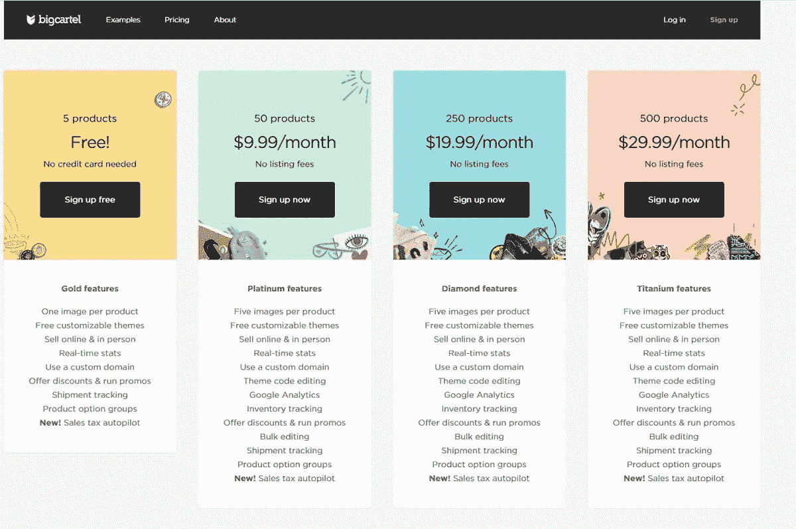

Big Cartel Pricing

有了大卡特尔，你可以创建一个最多有五种产品和有限功能的免费商店。付费计划每月 9.99 美元起，最多可购买 50 种产品，包括所有功能，包括库存跟踪和折扣。**支付处理:**第三方支付处理，每次支付 2.9%和 0.3 美元起。

## 7.预车间

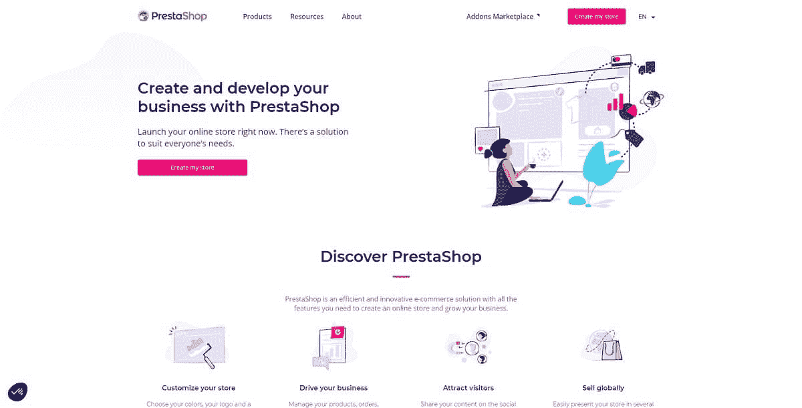

PrestaShop

[PrestaShop](https://www.prestashop.com/en) 是一个 100%免费和开源的[电子商务平台](https://kinsta.com/blog/ecommerce-platforms/)，具有与大多数付费解决方案相当的功能。由于它是开源的，对于那些想要拥有自己内容的公司来说，这是一个合适的选择，这些公司还没有在他们的网站上使用[WordPress](https://kinsta.com/knowledgebase/what-is-wordpress/)。

### 赞成的意见

*   免费开源。
*   对[内容](https://kinsta.com/learn/content-marketing/)的 100%所有权和控制权。
*   可扩展大量模块和主题(5000+)。
*   产品、销量、流量不限。

### 骗局

*   需要自己的[主持](https://kinsta.com/features/)。
*   对于初学者来说，设置起来可能很有挑战性。
*   不与 WooCommerce 等现有的 [CMS 集成。](https://kinsta.com/blog/cms-software/)

### 用户界面

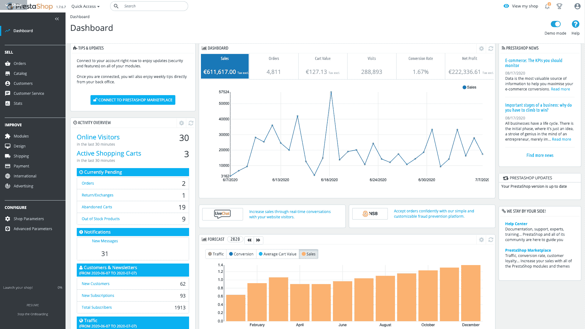

PrestaShop dashboard

信息丰富的仪表板可能会让一些用户不知所措。然而，只要点击几下鼠标就可以浏览所有数据，这是渴望数据的商店经理们所喜欢的。

### 计划和定价

PrestaShop 100%免费下载、安装和使用。你需要为你自己的主机服务、主题和你要使用的扩展付费，费用从 30 美元到 550 美元不等。**付款处理:**第三方解决方案，起价 2.9%，每次付款 0.3 美元。

## 8.方形空间

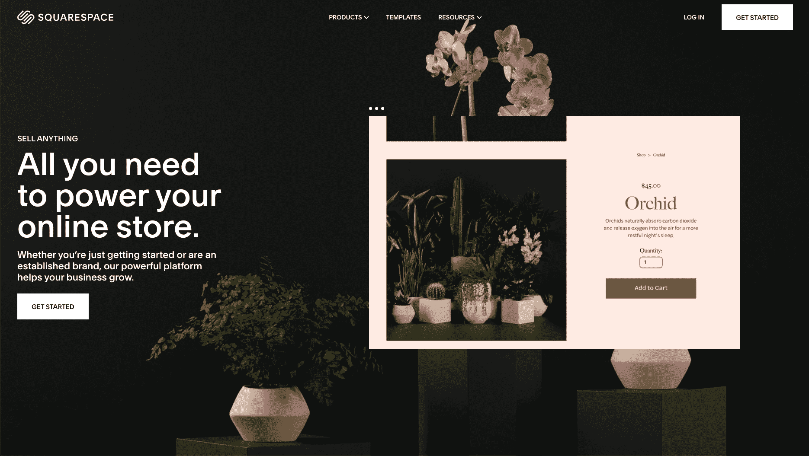

Squarespace

Squarespace 是一家领先的网站建设商，也通过其 Squarespace 电子商务计划提供全面的电子商务支持。对于没有[设计经验的小团队](https://kinsta.com/blog/web-design-best-practices/)，Squarespace builder 可能是一个强大的工具。

### 赞成的意见

*   强大、直观的[拖放生成器](https://kinsta.com/blog/wordpress-page-builders/)。
*   易于使用的界面。
*   内置强大的[分析](https://kinsta.com/blog/google-analytics-alternatives/)和营销功能。
*   与 Squarespace 电子邮件营销的本机集成。

### 骗局

*   商业计划书的 3%交易费。
*   有限的插件和集成。

### 用户界面

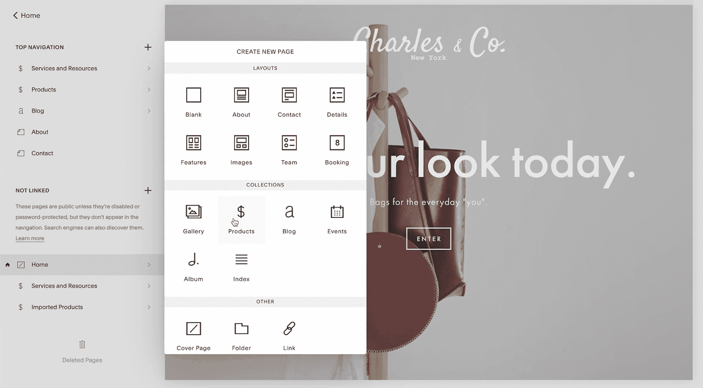

Squarespace dashboard

优雅的仪表板允许您轻松地添加、删除、更新和管理您的产品或服务。此外，您可以利用 Squarespace Analytics，这是一款内置的报告工具，可提供高级报告，如按[流量来源](https://kinsta.com/blog/how-to-drive-traffic-to-your-website/)或活动细分收入和订单。

你的电子商务网站需要一个超快的、可靠的、完全安全的主机吗？Kinsta 提供所有这些服务，并由 WooCommerce 专家提供 24/7 的世界级支持。[查看我们的计划](https://kinsta.com/plans/?in-article-cta)

### 计划和定价

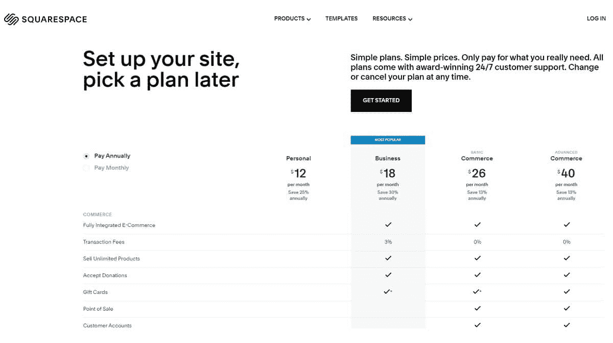

Squarespace pricing

个人计划不包括电子商务功能，而商业计划没有电子商务分析，并附带 3%的交易费用。所以它们不是可行的选择。基本的商务计划每月 26 美元起，产品和流量不限。

对于购物车恢复、高级运输选项等，您需要以每月 40 美元的价格升级到高级商务。**支付处理:**第三方解决方案，起价 2.9%，每次支付 0.3 美元。

## 9.广场网上商店

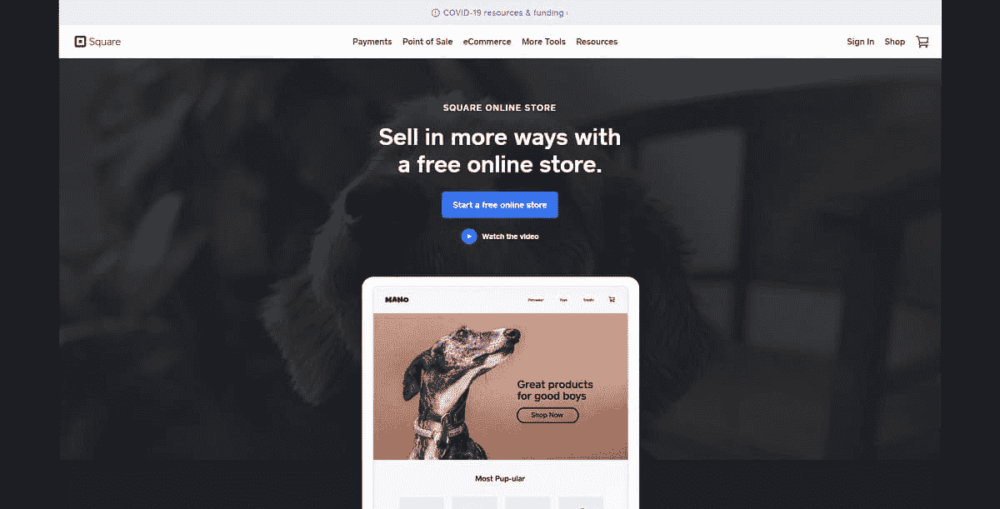

Square Online Store

[Square 在线商店](https://squareup.com/us/en/online-store)是 Square 的基本电子商务解决方案，提供 100%免费计划。对于希望销售有限数量产品或测试产品创意的新企业家来说，这是一个可行的选择。

### 赞成的意见

*   包括免费计划。
*   直观且易于上手。
*   与 [Square 的仪表盘和报告](https://kinsta.com/blog/stripe-vs-square/)的原生集成。

### 骗局

*   有限的集成和扩展。
*   乏善可陈的营销和优化功能。

### 用户界面

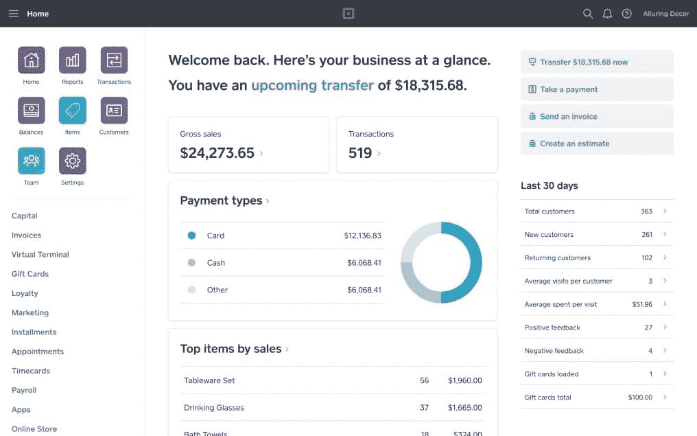

Square dashboard

在线商店的用户界面非常简单，但是您也可以从 Square 的主要产品中访问强大的财务仪表盘。

### 计划和定价

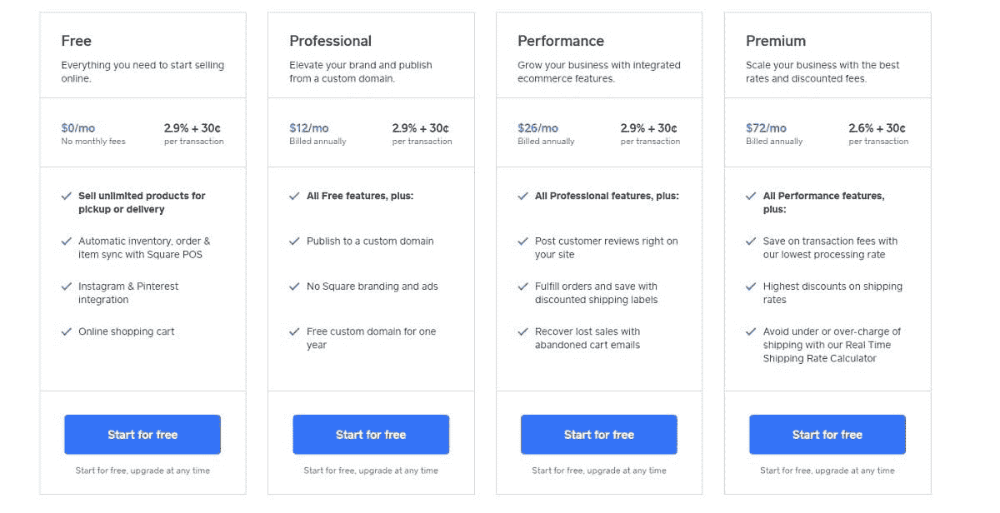

Square Online Store pricing

免费计划包括基本的电子商务功能，但你不能将它绑定到一个定制域。专业计划包括一个自定义域，并删除广场广告和品牌。**支付处理:** Square 支付，起价 2.9%(保费计划为 2.6%)，每次支付 0.3 美元。

## 10.塞菲

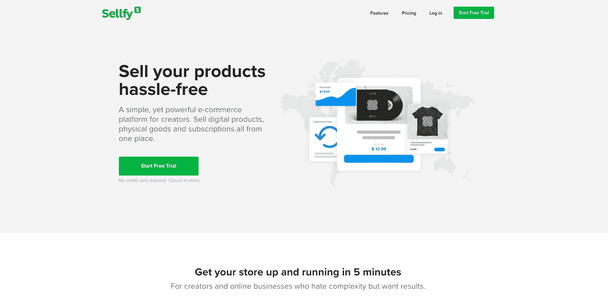

Sellfy

Sellfy 是另一个简单的 Shopify 替代解决方案，适合那些迎合创作者和艺术家的人。从商店设置到数字营销的一步一步的教程使它成为一个非常适合初学者的解决方案。

### 赞成的意见

*   易于使用和建立您的第一个网上商店。
*   伟大的拖放商店建设者。

### 骗局

*   有限的集成和扩展。
*   非常基本的营销和分析功能。

### 用户界面

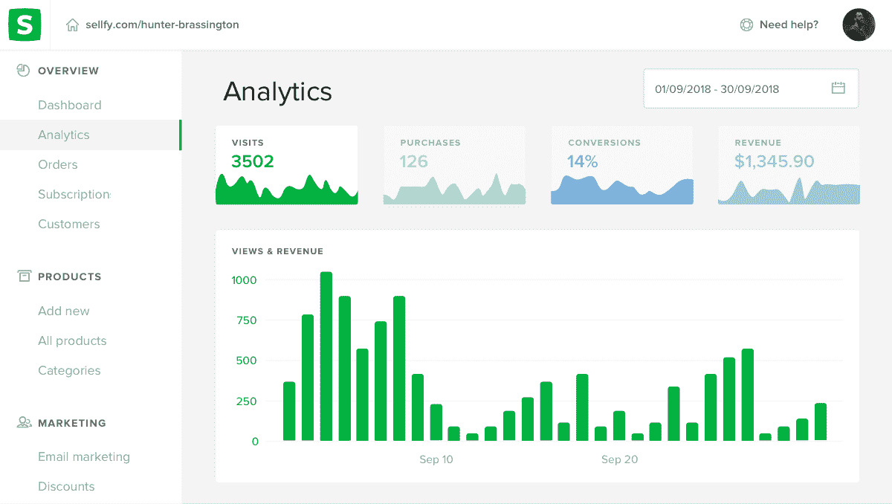

Sellfy dashboard

仪表板简洁直观，包括管理、运行和发展在线商店的所有关键功能。

### 计划和定价

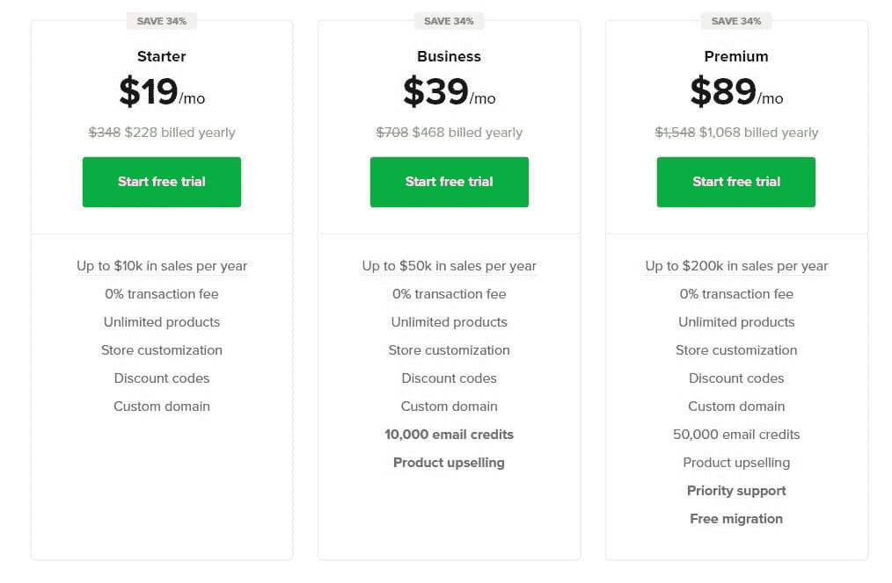

Sellfy pricing

每月 19 美元的入门计划除了最基本的功能外，年收入最多只能达到 1 万美元。要使用[电子邮件营销](https://kinsta.com/blog/email-marketing-best-practices/)功能，你需要每月 39 美元的商业计划，这涵盖了高达 50，000 美元的年收入。**付款处理:**第三方解决方案，起价 2.9%，每次付款 0.3 美元。

## 11.塞尔兹

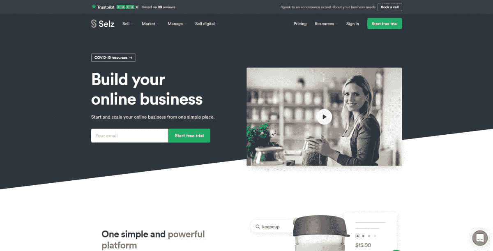

Selz

Selz 是一个完整的电子商务平台，具有原生购物车恢复和其他高级营销功能。有了智能的[拖放生成器](https://kinsta.com/blog/wordpress-page-builders/)，这是电子商务企业家应该考虑的一个可靠的 Shopify 替代方案。

### 赞成的意见

*   圆滑的拖放商店建设者。
*   营销自动化功能，如购物车恢复。
*   所有计划的多渠道销售。
*   WordPress 插件整合产品，并在现有网站上进行销售。

### 骗局

*   运输标签集成仅限于高级计划(179 美元/月)或以上。
*   使用 Selz Pay 以外的其他提供商收取 0.5-2%的交易费。
*   有限的集成和插件。

### 用户界面

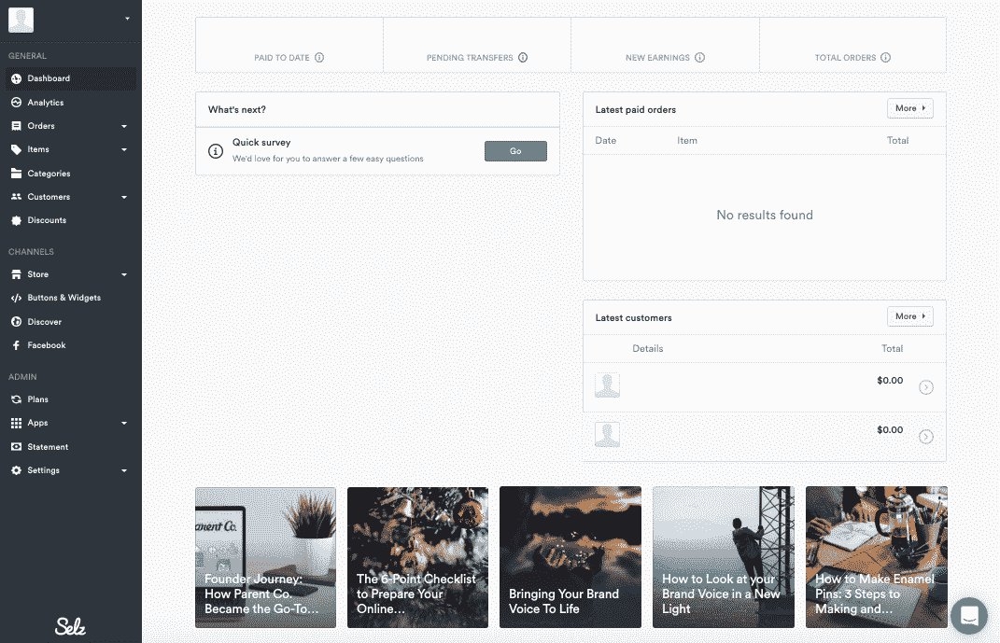

Selz dashboard

Selz 仪表盘非常直观。感谢[设置清单](https://help.selz.com/article/256-selz-checklist)和其他资源，你将拥有建立你的第一个电子商务商店所需的一切。

### 计划和定价

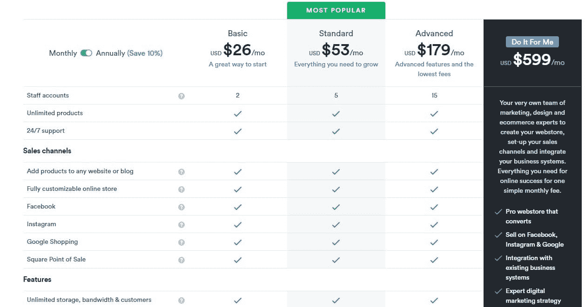

Selz pricing

基本计划每月 26 美元起，包括大多数功能，无限的产品、带宽和[销售额](https://kinsta.com/learn/woocommerce-guide/)。标准计划将花费你每月 53 美元，但包括税务发票、自定义字段等等。

要使用运输标签集成来加速履行，您需要以每月 179 美元的价格升级到高级计划。**支付处理:** Selz Pay 起价为 2.9%(高级版为 2.7%)，每次支付 0.3 美元。使用第三方支付网关收取 0.5-2%的额外费用。

[In the US alone, ecommerce brought in $601.75 billion in 2019\. 🤯 There's never been a more lucrative time to start an online store, and these 11 Shopify alternatives will help you get it up and running. 🛍Click to Tweet](https://twitter.com/intent/tweet?url=https%3A%2F%2Fkinsta.com%2Fblog%2Fshopify-alternatives%2F&via=kinsta&text=In+the+US+alone%2C+ecommerce+brought+in+%24601.75+billion+in+2019.+%F0%9F%A4%AF++There%27s+never+been+a+more+lucrative+time+to+start+an+online+store%2C+and+these+11+Shopify+alternatives+will+help+you+get+it+up+and+running.+%F0%9F%9B%8D&hashtags=ecommerce%2Conlinestore)

## 摘要

对你的生意来说，拥有一个网上店面比以往任何时候都重要。确保您获得运输、营销、税务等所需的所有功能。，从一开始就可以节省你一吨的时间和未来的头痛。

有很多解决方案可供选择。这就是为什么我们创建了这份 Shopify 替代品列表，以帮助您做出正确的选择。如果 WooCommerce 引起了你的兴趣，别忘了查看它的一长串[扩展](https://kinsta.com/blog/woocommerce-extensions/)和[主题](https://kinsta.com/blog/woocommerce-themes/)来增强你的在线商店。

* * *

让你所有的[应用程序](https://kinsta.com/application-hosting/)、[数据库](https://kinsta.com/database-hosting/)和 [WordPress 网站](https://kinsta.com/wordpress-hosting/)在线并在一个屋檐下。我们功能丰富的高性能云平台包括:

*   在 MyKinsta 仪表盘中轻松设置和管理
*   24/7 专家支持
*   最好的谷歌云平台硬件和网络，由 Kubernetes 提供最大的可扩展性
*   面向速度和安全性的企业级 Cloudflare 集成
*   全球受众覆盖全球多达 35 个数据中心和 275 多个 pop

在第一个月使用托管的[应用程序或托管](https://kinsta.com/application-hosting/)的[数据库，您可以享受 20 美元的优惠，亲自测试一下。探索我们的](https://kinsta.com/database-hosting/)[计划](https://kinsta.com/plans/)或[与销售人员交谈](https://kinsta.com/contact-us/)以找到最适合您的方式。