# 如何从 Shopify 迁移到 woo commerce(8 步)

> 原文：<https://kinsta.com/blog/shopify-to-woocommerce/>

Shopify 是推出第一家在线商店的绝佳平台。然而，随着你的商店的发展，你可能会开始注意到这个托管平台的局限性。如果你觉得你已经超越了它，从 Shopify 迁移到 WooCommerce 比你想象的要容易。

通过 [WooCommerce](https://kinsta.com/blog/woocommerce-tutorial/) ，你可以完全控制你的商店。您可以配置从税费到添加定制运输方式的所有内容。此外，你可以免费发布成百上千的产品。

本文将讨论将 Shopify 迁移到 WooCommerce 需要了解的内容。我们将带你完成准备工作，并在你搬迁店铺时一步一步地指导你。让我们开始工作吧！

T3】

### 查看我们的[视频指南](https://www.youtube.com/watch?v=HvP21obqCg4)从 Shopify 迁移到 WooCommerce

## 为什么你应该考虑从 Shopify 转向 WooCommerce

从 Shopify 转移到 WooCommerce 的主要原因是后者是建立在 T2 开源软件之上的。它使用 WordPress，使你能够在你选择的任何托管平台上[创建任何你想要的网站](https://kinsta.com/blog/why-use-wordpress/)。与 Shopify 不同，WooCommerce 不收取解锁功能的费用。你也不需要支付任何加工费来销售产品。

如果你同时使用 WordPress 和 WooCommerce，你仍然需要付费。然而，您并不局限于任何特定的平台。因此，您可以选择任何符合您整体需求的主机。

> 需要在这里大声喊出来。Kinsta 太神奇了，我用它做我的个人网站。支持是迅速和杰出的，他们的服务器是 WordPress 最快的。
> 
> <footer class="wp-block-kinsta-client-quote__footer">
> 
> 
> 
> <cite class="wp-block-kinsta-client-quote__cite">Phillip Stemann</cite></footer>

[View plans](https://kinsta.com/plans/)

## 从 Shopify 迁移到 WooCommerce 之前的考虑

任何时候你计划将一个网站从一个平台迁移到另一个平台，你都需要考虑几个因素。例如，您可能需要考虑托管、备份数据等等。让我们逐一分析这些因素。

### 寻找一个 WordPress 友好的网络主机

如果你已经开始使用 WordPress 和 WooCommerce，你可能会想找一个适合内容管理系统(CMS)的虚拟主机提供商。由于这个平台的受欢迎程度，你会发现很多为 WordPress 用户设计的主机选项。

Kinsta 就是这样一个网络主机。我们为 WordPress 和 WooCommerce 提供广泛的[托管计划。无论您选择哪种 Kinsta 软件包，您都可以获得运行和发展在线商店所需的高级功能。](https://kinsta.com/wordpress-hosting/)

我们的托管计划包括以下功能:

*   [固态硬盘存储](https://kinsta.com/blog/what-is-ssd/)
*   高流量网站的优化
*   [自动每日备份](https://kinsta.com/help/wordpress-backups/)
*   全天候支持和恶意软件删除
*   [暂存](https://kinsta.com/help/staging-environment/)功能
*   免费的 SSL 证书

当然，我们建议你在为你的商店选择主机提供商之前做好调查。只要你选择一个声誉好的虚拟主机，你仍然可以使用 WordPress 和 WooCommerce 提供的所有功能。

### 备份您的 Shopify 商店

每当你对网上商店做出重大改变时，提前备份所有数据是个好主意。使用 Shopify 的一个缺点是该平台不提供备份功能。

Shopify 使您能够以 CSV 格式导出产品数据(这在迁移过程的[中会派上用场)。但是，您不能使用平台的内置功能备份您商店的其他细节和设计。](https://kinsta.com/blog/migrate-wordpress-site/)

如果你想使用真正的备份功能，你需要求助于 [Shopify 应用商店](https://apps.shopify.com/)。在这里，您可以找到为 Shopify 添加基本备份功能的工具，例如[倒带备份](https://apps.shopify.com/backup):

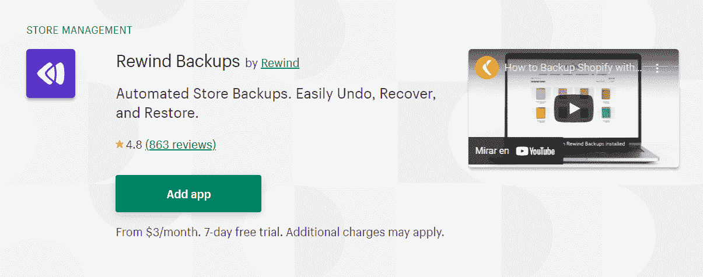

倒带备份

需要注意的是，即使使用了 Rewind Backups 等应用程序，您也可能无法创建 Shopify 商店的完整副本。您也不能使用 Shopify 备份应用程序来迁移您的商店。

从 Shopify 迁移到 WooCommerce 对你现有的商店来说理论上是一个无风险的过程。你不会丢失任何商店的数据，但备份任何网站的数据以防出现问题仍然是一个好主意。

[Shopify 是一个很好的平台，可以让你开设第一家店铺，但是随着店铺的发展，你可能会注意到它的局限性。🙅‍♀️输入😌 点击推文](https://twitter.com/intent/tweet?url=https%3A%2F%2Fbit.ly%2F3GimTrp&via=kinsta&text=Shopify+is+a+good+platform+for+launching+your+first+store%2C+but+as+your+shop+grows%2C+you+may+notice+limitations.+%F0%9F%99%85%E2%80%8D%E2%99%80%EF%B8%8F+Enter%2C+WordPress+%F0%9F%98%8C&hashtags=Shopify%2CWordPress)

## 如何从 Shopify 迁移到 WooCommerce (8 步)

现在你已经有了一个网络主机，是时候开始把你的商店从 Shopify 转移到 WooCommerce 了。这个过程包括迁移你的商店的所有产品，并在 WooCommerce 中重新创建它的布局和设计。然而，在这之前，我们需要设置 WordPress。

### 步骤 1:设置 WordPress

WordPress 根据你使用的网络主机类型提供了几种安装方法。例如，当你创建一个新网站时，托管 WordPress 主机通常会自动为你设置 CMS:

在 MyKinsta

安装 WordPress

如果你的网络主机不提供自动 WordPress 安装，我们建议你检查你的主机控制面板。在这里，你可以使用一个软件安装程序[，比如 Softaculous](https://softaculous.com/) ，它可以让你在几分钟内安装好 WordPress。

或者，你也可以下载并[手动设置 WordPress】，这比听起来更简单。该软件可在 WordPress.org](https://kinsta.com/knowledgebase/manually-install-wordpress/)的[下载。它还配有一个著名的“](https://wordpress.org/download/)[五分钟安装程序](https://kinsta.com/knowledgebase/manually-install-wordpress/)，一旦你把文件上传到你的服务器，它会引导你完成整个过程。

### 第二步:安装 WooCommerce

一旦你安装了 WordPress，你就可以访问仪表盘了。从这里，您可以完全控制网站的设置、布局和发布的内容:

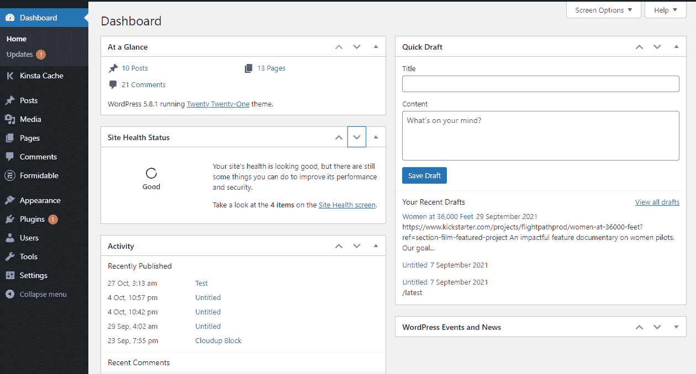

既然你想搬到网上商店，你首先需要安装 WooCommerce。为此，请前往**插件** *>* **添加新的**，并在屏幕顶部的搜索栏中键入“WooCommerce”。

WooCommerce 应该是你看到的第一批结果之一:

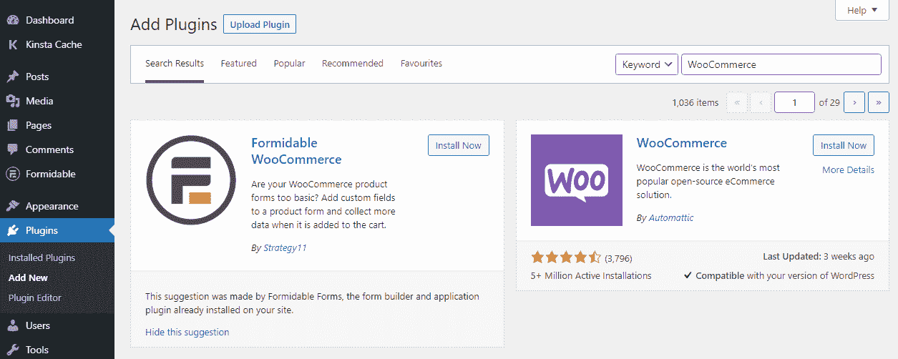

找到 WooCommerce 插件

点击 WooCommerce 选项旁边的 **Install Now** 按钮。然后，等待 WordPress 下载并安装插件。

这个过程会在后台发生，所以在 WooCommerce 旁边出现**激活**按钮之前不要离开页面。一旦出现，点击它:

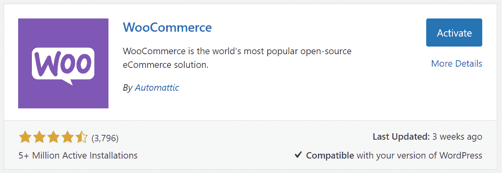

激活 WooCommerce 插件

就是这样！现在，WooCommerce 已经准备就绪。这意味着你可以[开始出版和销售产品](https://kinsta.com/blog/woocommerce-tutorial/)。但是，您在 Shopify 上已经有了完整的产品列表，所以让我们将您的目录转移到 WooCommerce 上。
T3】

### 步骤 3:从 Shopify 导出产品

正如我们之前提到的，Shopify 允许您以 CSV 格式导出整个产品目录。该文件包括您迁移的产品的标题、slugs、标签、变体和价格。

要导出您的 Shopify 产品数据，请进入您的帐户并导航至**产品>所有产品。**该页面将显示您商店中所有产品的完整列表。它还包括导入和导出数据的选项:

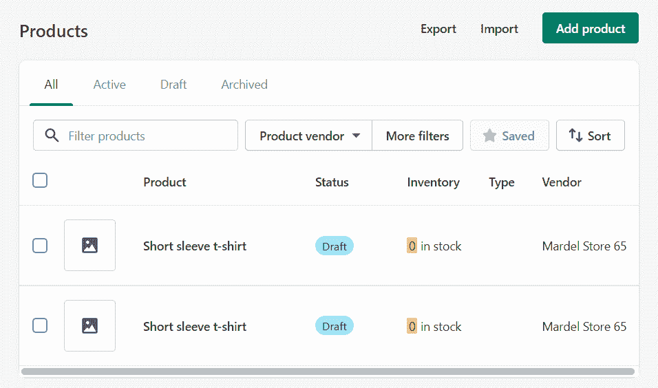

在 Shopify 中找到要出口的产品

选择屏幕上方的**导出**按钮，Shopify 会询问你要导出哪些产品。点击**所有产品**，选择**导出为**下的 **CSV for Excel、Numbers 或其他电子表格程序**选项:

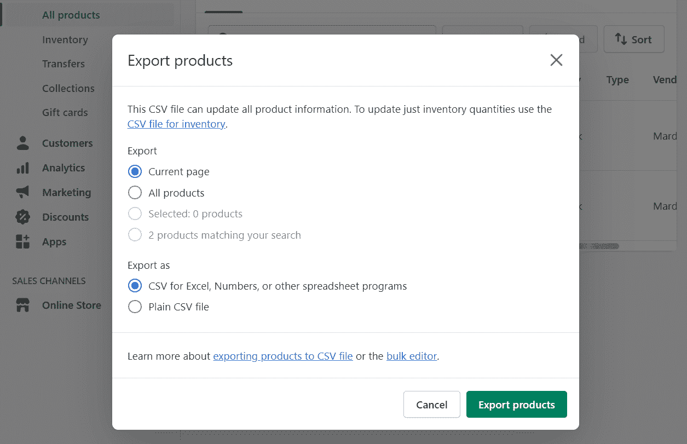

导出为 CSV

一旦您点击**导出产品**，Shopify 将编译一个包含您所有产品数据的 CSV 文件，并通过电子邮件发送给您。该电子邮件可能需要一段时间才能到达，具体取决于您的库存有多大:

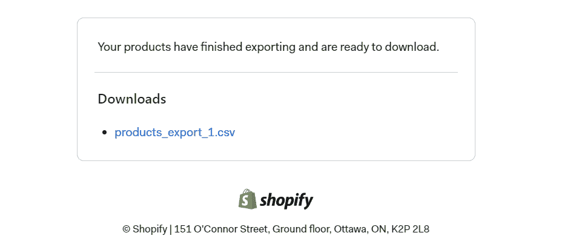

等待你的 CSV 文件编译

Shopify 电子邮件将包含一个链接，用于下载包含您所有产品信息的 CSV 文件。将该文件保存到您的计算机上，因为您将在下一步中用到它。

### 步骤 4:将你的 Shopify 产品导入 WordPress

这一步是最重要的一步。有两种方法可以将 Shopify 产品导入 WooCommerce。一种方法是使用 WooCommerce 使用的内置产品导入器，另一种是通过迁移服务。

让我们回顾一下这两种方法，从手动选项开始。

#### 使用 WooCommerce 产品导入程序

WooCommerce 附带了一个工具，可以让你导入 CSV 格式的产品列表。在上一步中，您将整个 Shopify 目录下载到一个整洁的 CSV 文件中，这使得下载过程变得非常简单。

这种方法的缺点是你只进口产品。您商店的所有数据，如顾客、订单历史、图片和评论，都将保留在 Shopify 中。本质上，你是在用你现有的库存和一张空白的店铺名单重新开始使用 WooCommerce。

如果这还不算是一个障碍，那么让我们继续在 WooCommerce 中导入 Shopify CSV 文件。进入 WordPress 仪表盘，进入**工具>导入**。

找到 **WooCommerce 产品(CSV)** 选项，点击**运行进口商**:

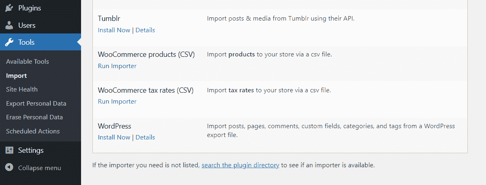

WooCommerce 产品进口国

在下一页，WooCommerce 会让你选择想要导入的文件。还有一个使用 CSV 文件中的数据更新现有产品的选项。因为我们从一个干净的库存开始，所以不要选中它:

选择您想要导入的产品

选择您在步骤三中下载的 CSV 文件，并点击**继续**。下一个屏幕包括几个选项，用于将 CSV 文件中的产品数据匹配到 WooCommerce 字段:

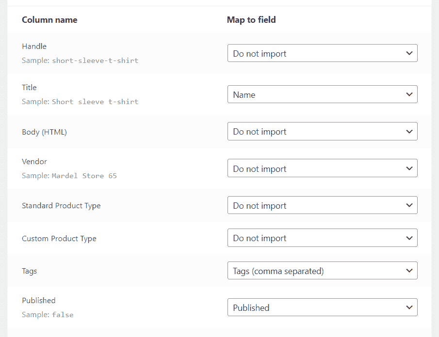

将 CSV 文件中的产品数据匹配到 WooCommerce 字段

浏览选项列表，决定哪些数据你想导入 WooCommerce，哪些数据你不想导入。有些字段，比如 **SEO 标题**和 **SEO 描述，**在 WooCommerce 中没有对应的选项，这样你就可以排除那些了。

一旦您对自己的选择感到满意，点击**运行导入程序**。WooCommerce 将需要一分钟(或更长时间)来导入您的 Shopify 产品数据。

当该过程结束时，您将看到一条类似如下的成功消息:

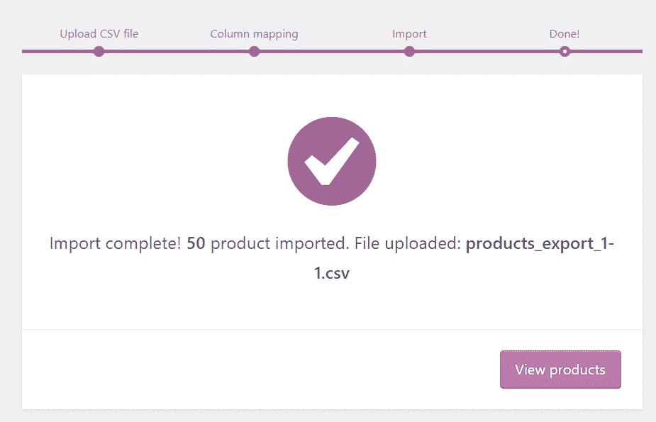

进口产品流程完成

如果你点击**查看产品**，WordPress 会把你带到**产品>所有产品**标签。在这里，您将看到刚刚导入的所有项目的概述:

## 注册订阅时事通讯

### 想知道我们是怎么让流量增长超过 1000%的吗？

加入 20，000 多名获得我们每周时事通讯和内部消息的人的行列吧！

[Subscribe Now](#newsletter)

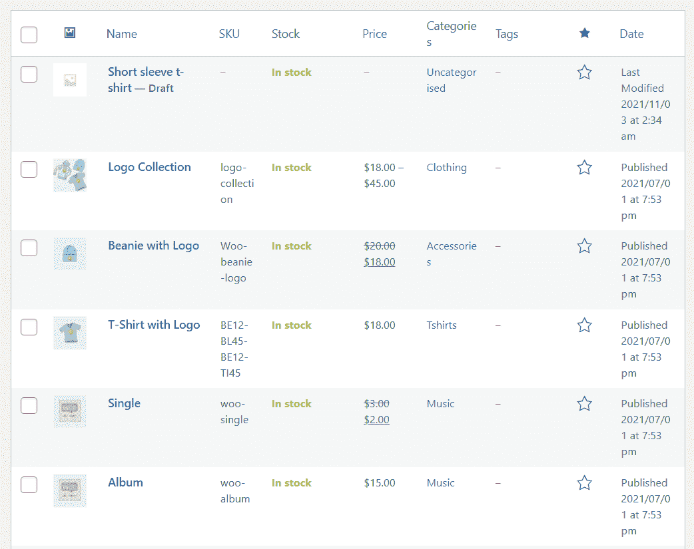

进口产品概述

请记住，WooCommerce 不会导入产品图片，因此您必须手动上传这些图片。我们还建议检查每个条目，以确保它没有遗漏任何关键信息。

如果产品数据丢失，您可以随时重新运行导入程序，并确保将正确的字段导入到 WooCommerce。总的来说，使用手动导入器很简单，但是它需要您进行一些微观管理。

#### 使用服务将 Shopify 数据导入 WooCommerce

从 Shopify 迁移到 WooCommerce 很常见。有很多插件和服务致力于简化这个过程。使用 Shopify [迁移工具](https://kinsta.com/blog/wordpress-migration-plugins/)的优势在于它们自动化了整个过程*和*使你能够移植那些你不能用简单的 CSV 文件移植的数据。

Cart2Cart 是一个有用的工具。它使您能够通过将每个数据点从一个平台迁移到另一个平台来连接 WooCommerce 和 Shopify:

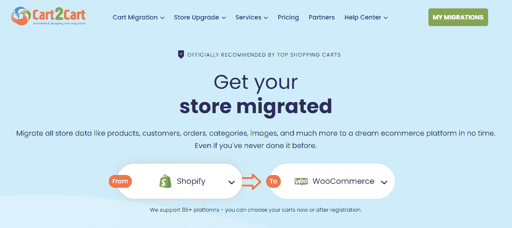

卡特琳娜

Cart2Cart 提供有限的免费迁移，让你可以将部分 Shopify 库存转移到 WooCommerce。然而，如果你想使用该工具的全部功能，你需要付费。价格的变化取决于你想要进口多少产品，以及你是否希望包括客户和订单数据和博客文章。

Cart2Cart 在其网站上提供了一个[评估工具](https://www.shopping-cart-migration.com/migration-pricing)。然而，为了让你了解这项服务的成本，将一个包含 100 种产品的完整 Shopify 商店迁移到 WooCommerce 大约需要 120 美元。

如果你想使用 Cart2Cart，那就去注册一个账户吧。一旦您访问您的仪表板，平台将要求您选择来源和目的地购物车。

在本例中，源是 Shopify，而 WooCommerce 是目的地:

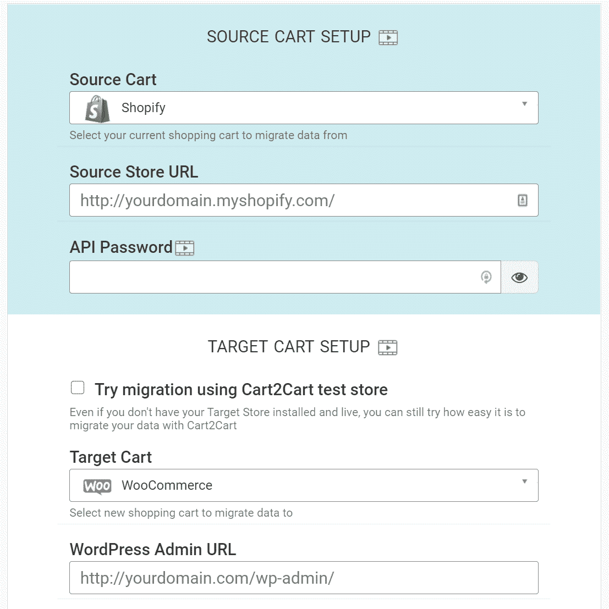

Cart2Cart 设置流程

为了让 Cart2Cart 导入器工作，您需要生成一个 Shopify API 密匙。返回 Shopify 仪表盘，进入**应用程序**屏幕。滚动到页面底部，找到链接，上面写着**管理私人应用**:

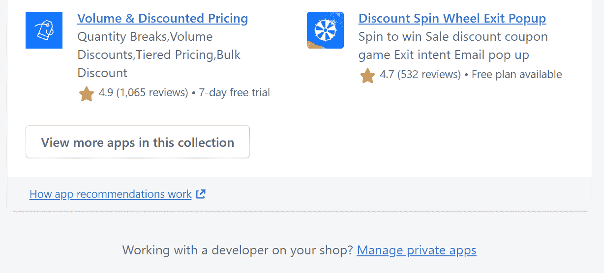

查找管理私人应用链接。

如果您还没有在 Shopify 中启用私人应用程序开发，您将会看到类似这样的屏幕。点击**启用私人应用开发**按钮:

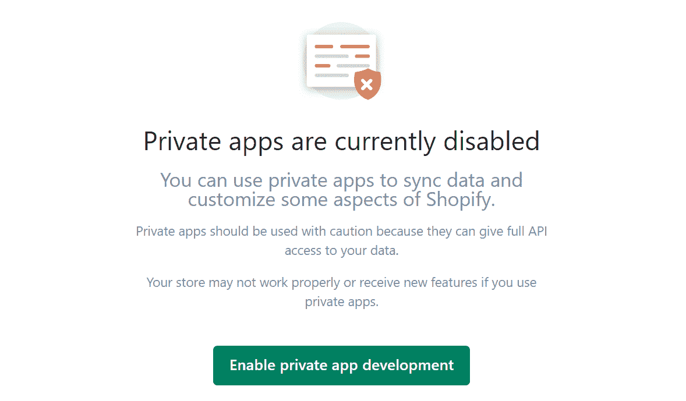

启用私人 app 开发

Shopify 将要求您启用私人应用程序开发。它还会警告您与未知方共享 API 密钥。

确认您的选择，现在您将获得创建私人应用程序的选项:

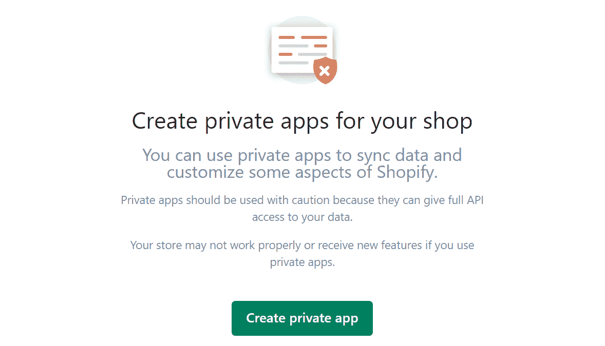

【创建私人应用】选项。

创建一个私人应用程序将生成 API 密码 Cart2Cart 需要访问 Shopify 和导出您的数据。

首先，为您的应用程序设置一个名称(可以是任何名称)，并输入您的电子邮件:

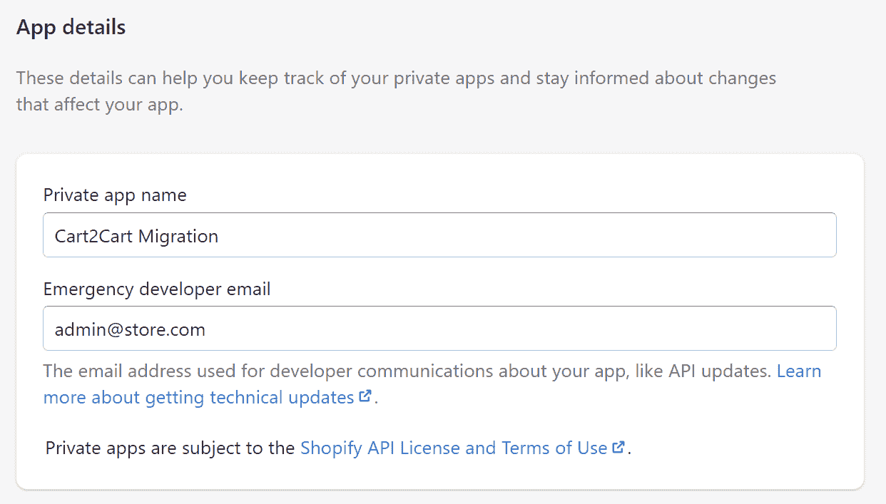

为你的应用程序设置一个名称并输入一个电子邮件。

向下滚动到权限部分，让应用程序访问列表中的所有权限。当可用时，您将使用**读和写**选项，或者如果前者不出现，则只使用**读权限**:

需要为您的电子商务网站提供超快的、可靠的、完全安全的托管服务吗？Kinsta 提供所有这些服务，并由 WooCommerce 专家提供 24/7 的世界级支持。[查看我们的计划](https://kinsta.com/plans/?in-article-cta)

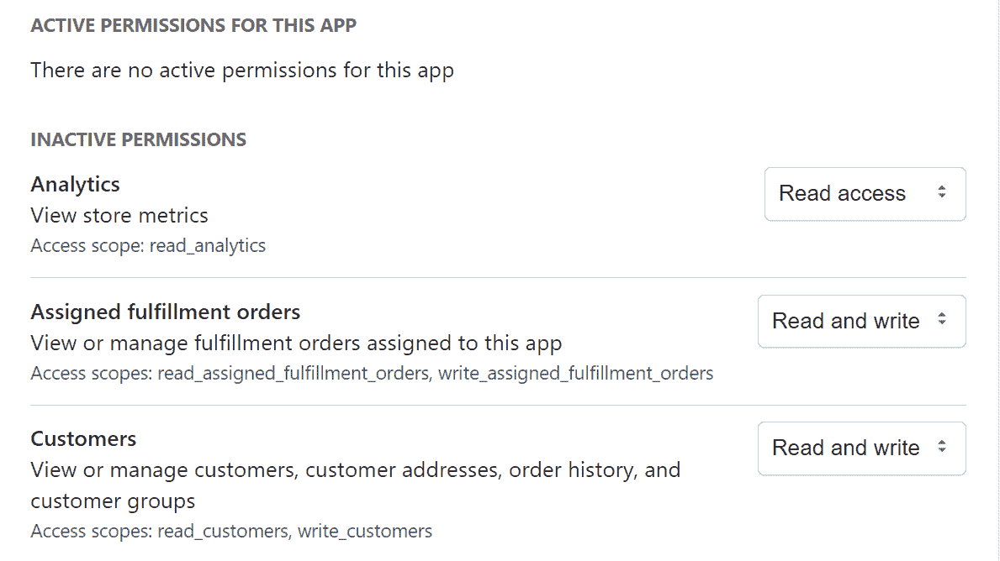

输入活动权限。

传统上，你不应该给一个应用程序完全的权限。不过，只要你不分享 API 密匙，事后不删除 app，应该没问题。

接下来，选择最新版本的 webhook API:

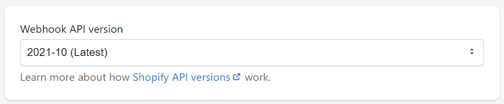

Webhook API 版本。

点击**保存**创建应用程序，并在弹出的屏幕上确认您的选择。一旦应用程序启动并运行，其 API 密码将出现在应用程序详细信息屏幕上。

在 Cart2Cart migration 菜单中复制并粘贴 API，并在旁边输入您商店的 URL:

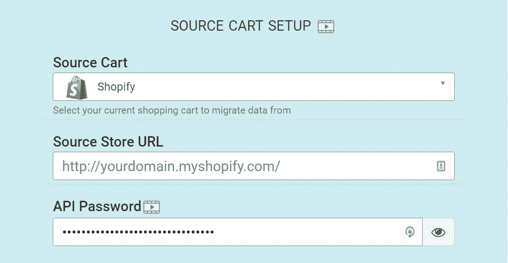

Copy and paste the API.

配置目标购物车(你的 WooCommerce 商店)要容易得多。你所要做的就是输入你的 WordPress 登录信息(管理员账户)，然后你就可以开始了。

输入这些详细信息并点击**选择实体**:

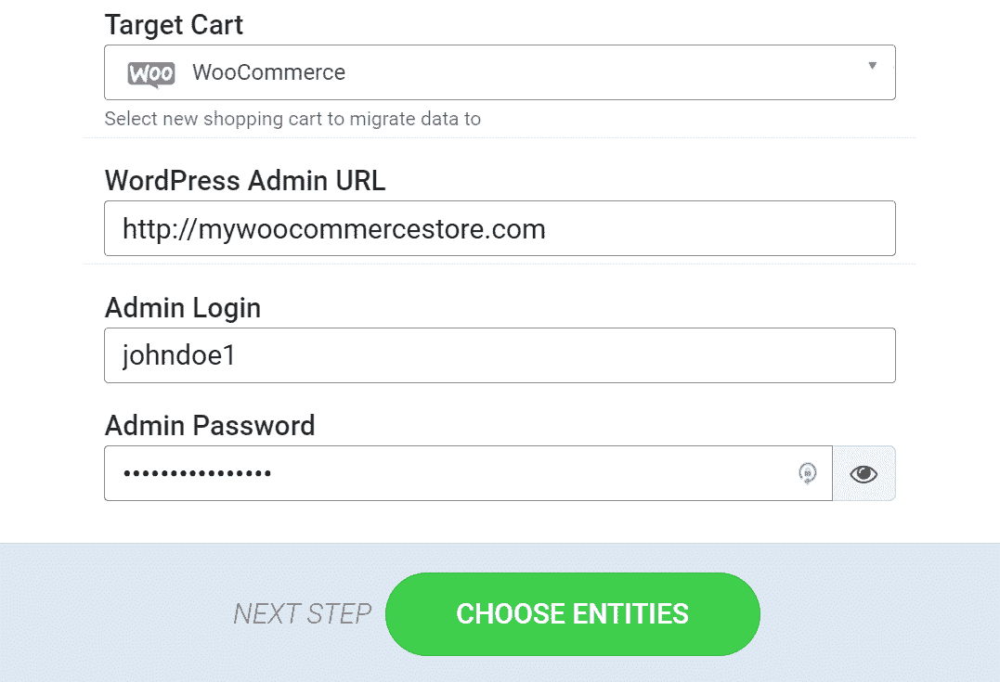

输入 WordPress 登录详情。

Cart2Cart 需要一些时间来准备迁移过程。如果凭据正确，程序会询问您希望将哪些数据从 Shopify 转移到 WooCommerce:

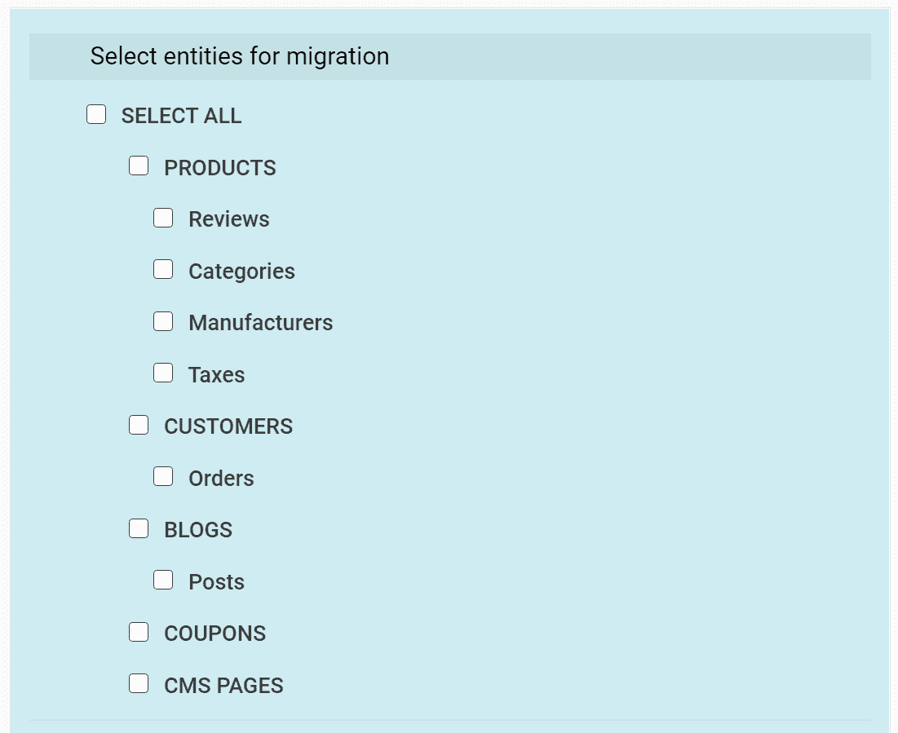

选择你想要移动的适当数据。

该服务还将为迁移提供几项付费附加服务，包括图像、订单 id 等。选择所需的选项并开始迁移。根据您需要导出/导入的数据量，此过程可能需要一段时间。

之后，Cart2Cart 将向您显示一个成功屏幕，并让您选择将您发送到您的 WooCommerce 商店，在那里您将能够看到结果。

### 第五步:将你的域名指向 WooCommerce

在这个阶段，你应该已经有了一个完整的 WooCommerce 商店，其中包含了你所有的 Shopify 产品。然而，还有几件事要做，包括更新您的域记录，使它们指向您的新 web 主机。

目前，您的域名仍指向您的 Shopify 商店。你可能不想注册一个新的域名，因为这意味着你需要从头开始建立流量。因此，你可能会失去很大一部分客户群。

更改域所指向的站点的过程因管理它所使用的服务而异。如果你使用域名注册商，你需要在那里更新你的记录。该流程因注册服务商而异:

域名列表显示您所有注册的域名。

如果你直接通过 Shopify 注册域名，你需要使用该平台[编辑你的 DNS 设置](https://help.shopify.com/en/manual/domains/managing-domains/edit-dns-settings)。或者，一些网络主机如 Kinsta 可以让你从你的主机控制面板[更新你的域名记录](https://kinsta.com/knowledgebase/what-is-a-nameserver/)。例如，MyKinsta 让[将域名指向你的网站](https://kinsta.com/knowledgebase/add-domain/)变得很容易。

### 步骤 6:配置你的 WordPress 永久链接

WordPress 允许你决定你的 URL 结构，包括 WooCommerce 产品。默认情况下，WordPress URLs 看起来像这样:

`yourwoocommercestore.com/?p=534`

那种类型的 URL 对用户不友好。从搜索引擎优化(SEO)的角度来看，这也没有什么好处。

要更改您商店的 [URL 结构](https://kinsta.com/knowledgebase/what-is-a-url/)，请前往**设置>永久链接>产品永久链接**并选择您喜欢的选项:

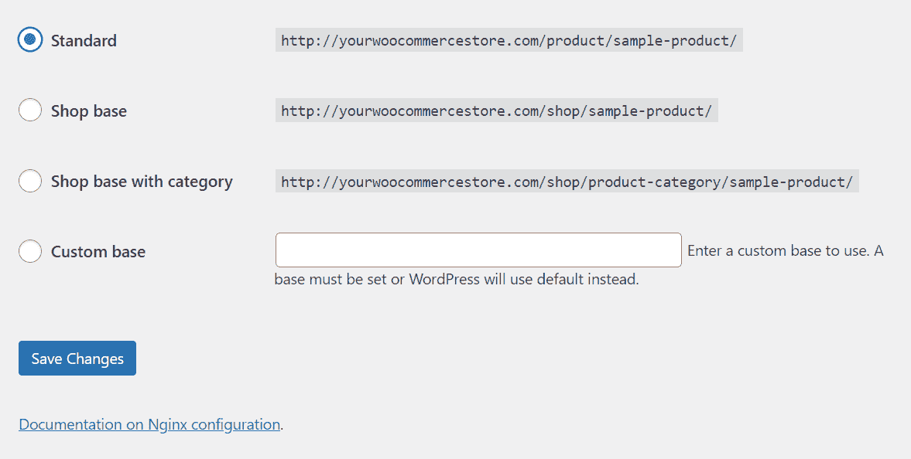

改变 WordPress 中的商店 URL 结构。

在大多数情况下，我们建议您使用**标准**结构。有了它，一个 WooCommerce 产品的 URL 将看起来像这样:

`yourwoocommercestore.com/product/sample-name`

这种类型的 URL 给访问者提供了他们正在看的产品的信息，迫使你使用描述性的 slugs。一旦你选择了一个永久链接结构，保存对你的 WordPress 网站的修改。

值得注意的是，在开始你的网上商店时，你需要选择一个永久链接结构。以后改变链接结构会影响网站的搜索引擎优化，导致网站出现重大错误。你越早建立永久链接结构，你遇到的麻烦就越少。

### 第七步:重新设计你的 Shopify 商店的设计(或者重新开始)

如果你查看了你的 WooCommerce 商店的任何页面，你可能会注意到它们看起来一点也不像 Shopify 的同类产品。那是因为你仍然在使用默认的主题之一[。](https://kinsta.com/knowledgebase/what-is-a-wordpress-theme/)

在这一阶段，你有两种选择来实现你的[新店的设计](https://kinsta.com/blog/responsive-web-design/):

1.  重塑您的 Shopify 商店风格
2.  从一个新的 WooCommerce 模板开始

这两种方法都是有效的，它们都涉及到为你的商店寻找[完美的 WooCommerce 主题](https://kinsta.com/blog/fastest-woocommerce-theme/)。一方面，重新创建你的 Shopify 商店设计可以让现有客户的过渡更加无缝。

另一方面，WordPress 比 Shopify 提供了更多的定制选项。有了 CMS，你可以访问多个[页面构建器插件](https://kinsta.com/blog/wordpress-page-builders/)，这些插件[与 WooCommerce](https://kinsta.com/blog/woocommerce-plugins/) 一起工作，让你以任何你认为合适的方式定制你的商店。

为了定制你的商店，你还可以使用内置的块编辑器，这个编辑器有一个对 WooCommerce 友好的主题。这两种方法都是可行的。所以，决定如何利用 WordPress 和 WooCommerce 提供给你的所有功能吧！

### 步骤 8:配置你的 WooCommerce 设置

将产品导入 WooCommerce，定制你的店铺风格，只是一个开始。在开始通过 WooCommerce 销售产品之前，您还需要配置各种设置，包括:

*   支付和运输选项
*   安全设置
*   电子邮件通知选项
*   产品设置
*   税收选项

如果您还记得配置 Shopify 商店的过程，那么所有这些设置听起来应该都很熟悉。然而，WooCommerce 让你对如何建立网上商店有更多的控制权:

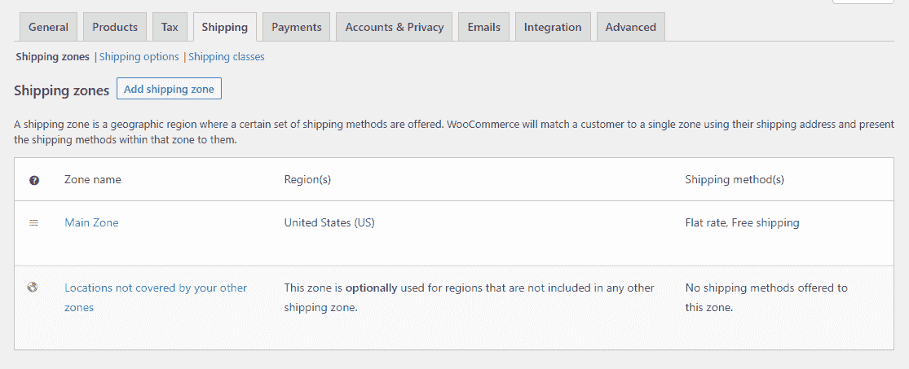

WooCommerce 设置。

WooCommerce 的官方文档包括一个关于如何配置设置的完整指南。一旦你完成了商店配置的调整，我们建议你查看一些 [WooCommerce 扩展](https://kinsta.com/blog/woocommerce-extensions/)。

[不要错过一次销售有了这个从 shopify➡️WordPress🛍点击推文](https://twitter.com/intent/tweet?url=https%3A%2F%2Fbit.ly%2F3GimTrp&via=kinsta&text=Don%27t+miss+a+sale+with+this+guide+to+moving+your+store+from+Shopify+%E2%9E%A1%EF%B8%8F+WordPress+%F0%9F%9B%8D&hashtags=Shopify%2CWordPress)

## 摘要

从 Shopify 迁移到 WooCommerce 需要做很多工作。你不仅需要从一个商店向另一个商店进出口产品，还需要从头开始重新设计你的整个网站。幸运的是， [WordPress 可以让你的新店看起来像你想要的一样。](https://kinsta.com/blog/learn-wordpress/)

有了 WooCommerce，你可以获得比 Shopify 更多的商店控制权。这要归功于 WordPress 的开源特性和它的广泛流行。因此，你可能永远也不会在商店里尝试不完的新功能。

关于如何将 Shopify 迁移到 WooCommerce，您有什么问题吗？请在下面的评论区提问！

* * *

让你所有的[应用程序](https://kinsta.com/application-hosting/)、[数据库](https://kinsta.com/database-hosting/)和 [WordPress 网站](https://kinsta.com/wordpress-hosting/)在线并在一个屋檐下。我们功能丰富的高性能云平台包括:

*   在 MyKinsta 仪表盘中轻松设置和管理
*   24/7 专家支持
*   最好的谷歌云平台硬件和网络，由 Kubernetes 提供最大的可扩展性
*   面向速度和安全性的企业级 Cloudflare 集成
*   全球受众覆盖全球多达 35 个数据中心和 275 多个 pop

在第一个月使用托管的[应用程序或托管](https://kinsta.com/application-hosting/)的[数据库，您可以享受 20 美元的优惠，亲自测试一下。探索我们的](https://kinsta.com/database-hosting/)[计划](https://kinsta.com/plans/)或[与销售人员交谈](https://kinsta.com/contact-us/)以找到最适合您的方式。