# 19 种免费 Slack 替代方案(托管、自托管和开源)

> 原文：<https://kinsta.com/blog/slack-alternatives/>

Slack 已经发展成为领先的协作工具之一。但上市后，它已将重点转向企业客户，试图成为一家盈利的公司。

这就是为什么如果你是一家初创企业或小企业，你可能会想看看这 19 个 slack 替代品中的一个。从微软 360 和谷歌 Workspace 的企业解决方案，到注重速度、可用性和效率的创业友好型选项，这个列表为那些有需要的人提供了可靠的替代方案。

准备好见他们了吗？

让我们开始吧！

## 什么是懈怠？

[Slack](https://kinsta.com/blog/how-to-use-slack/#what-is-slack) 是一款公司内部聊天工具，支持快节奏协作。本质上，它是一个增强的实时聊天室，集成了许多第三方应用程序。

由于网络应用为该工具提供了动力，你可以编辑消息，甚至删除错误发送的消息(不像[电子邮件](https://kinsta.com/blog/email-marketing-best-practices/))。此外，还有额外的功能，如提醒，业务工具集成等。阅读我们关于[如何有效利用 Slack 的指南](https://kinsta.com/blog/how-to-use-slack/)。

## 免费备用方案(托管解决方案)

Slack 是一个托管解决方案，这意味着你可以注册它，创建你的工作空间，并开始协作。由于它提供了大量免费的功能，我们决定把重点放在所有免费托管解决方案上。

### 1.微软团队

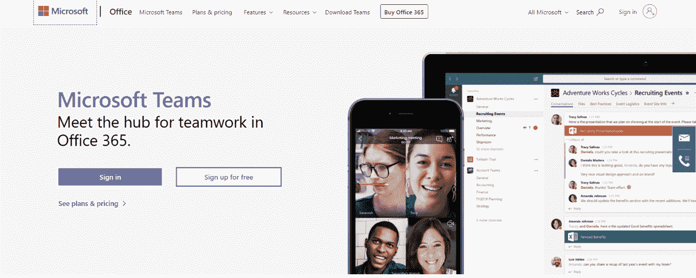

Microsoft Teams

[微软团队](https://kinsta.com/blog/microsoft-teams-vs-slack/)是微软对 Slack 的回应。它提供了相同的基本功能，并与 Office 360 套件的其余部分完美集成，从而可以轻松共享和协作实时文件。

对于任何依赖 360 套件的公司来说，微软团队都是一个可行的选择。

#### 特征

*   渠道(团队)
*   私人信息
*   全面的邮件搜索
*   访客访问
*   屏幕共享
*   视频/音频通话(一对一)
*   网络、桌面和移动应用程序(iPhone 和 Android)

#### 连接

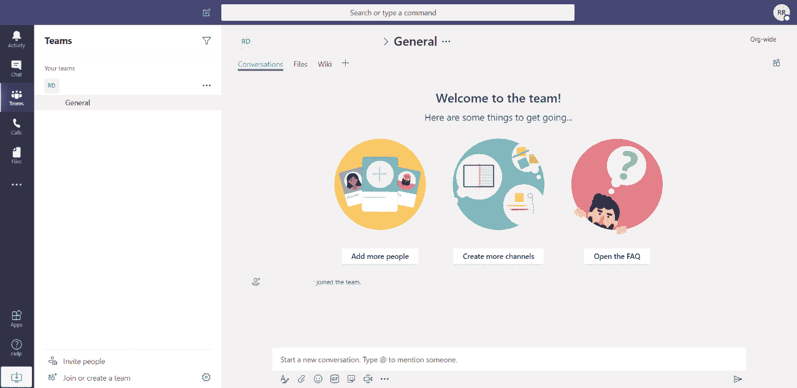

Microsoft Team interface

与 Slack 相比，登录访问界面需要一点时间。打开一看，有些眼熟。菜单在左手边，团队(频道)列在下面，包括默认的“常规”

Slack 的一个不同之处在于，微软团队将不同类型的交流分成不同的标签。“聊天”是您与其他同事进行私人对话的选项卡。“团队”是您的渠道所在的常规选项卡。在“呼叫”选项卡中，您可以快速拨打频繁合作者和核心队友的电话。在“文件”中，您可以看到人们正在处理的文件的明细。

#### 免费计划

免费计划不是一个试验，因此它没有时间限制。

*   多达 300 名用户
*   每位用户 2GB 存储空间，总共 10 GB。
*   没有日程安排、录制或会议功能。
*   无限的消息和搜索历史。

为了更深入的比较，请确保查看[微软团队 vs Slack](https://kinsta.com/blog/microsoft-teams-vs-slack/) 。

### 2.脸书工作场所团体

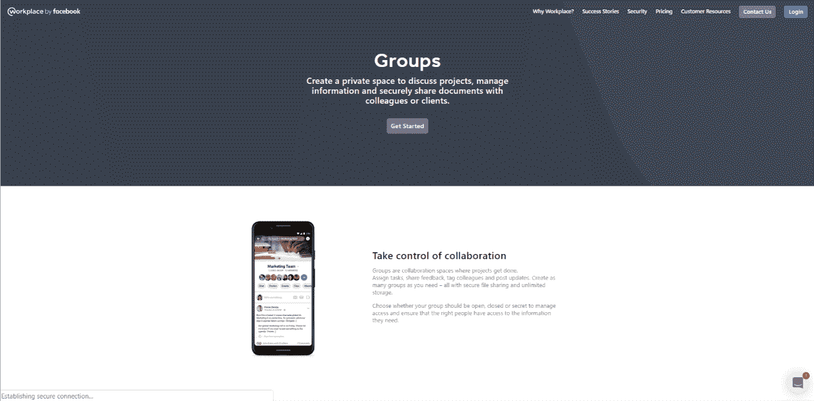

Facebook Workplace Groups

脸书的 Workplace Groups 是 Workplace suite 的一部分，Workplace suite 是[脸书](https://kinsta.com/blog/how-to-create-a-facebook-page/)的企业协作工具箱。与[的谷歌工作区](https://kinsta.com/blog/google-workspace/)不同，谷歌有一个免费的计划，所以群组不会隐藏在付费墙后面。

在其免费计划中提供群组视频通话是一种罕见的选择。因此，对于希望降低视频会议成本的小型企业来说，这是一个很好的选择。

#### 特征

*   频道(群聊)
*   私人信息
*   全面的邮件搜索
*   屏幕共享(1 对 1)
*   除了聊天之外，发布时间表。
*   视频/音频通话(一对一和电话会议)
*   直播视频。
*   提供网络、桌面和移动应用程序(iPhone 和 Android)

#### 连接

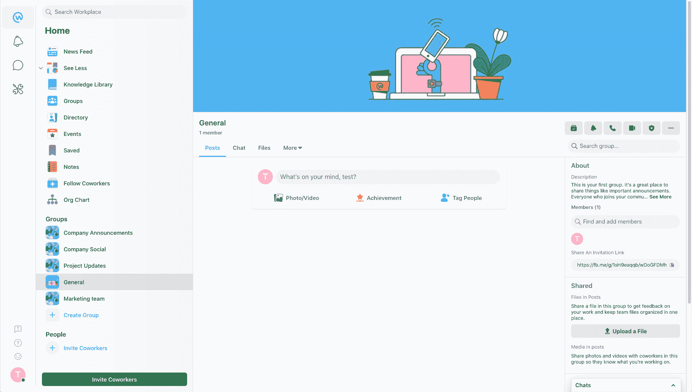

Facebook Workplace Groups post timeline

每个组的默认视图实际上是帖子。它给各个小组一种论坛或服务台的性质。这个特性对于团队成员生活在不同时区的协作非常有用。

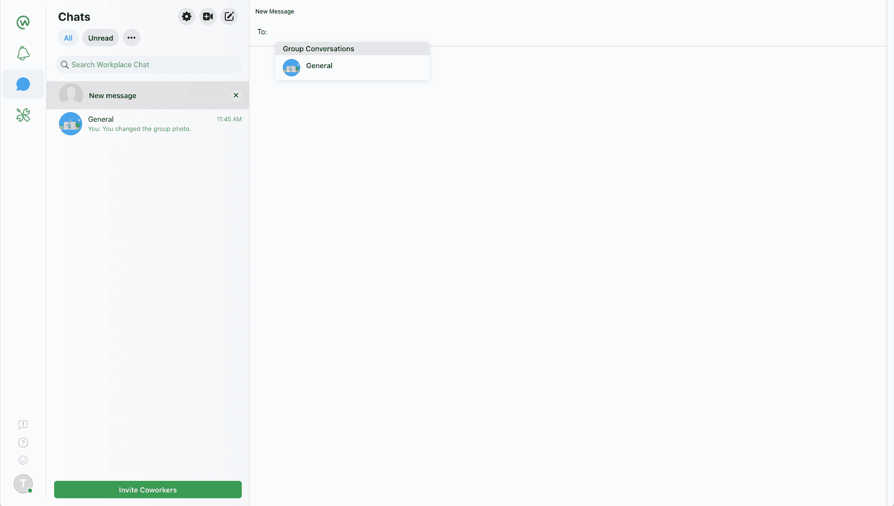

Facebook Workplace Groups Chat interface

但是，当然，如果没有聊天室，它也不会是一个真正无聊的选择。每个群组都有一个单独的聊天室，在那里您可以使用许多 messenger 功能。例如，你可以发送语音剪辑、[发送 gif](https://kinsta.com/blog/wordpress-gifs/)，甚至设置投票。

#### 免费计划

同样，免费计划可以无限期使用，但对某些功能有限制。

*   5 GB/使用者
*   没有第三方工具集成。(对不起 API 爱好者。)
*   会议/群组视频通话限于 20 人。
*   无限的信息和搜索历史。

### 3.船歌

Chanty

Chanty 是一个交流和实时协作工具，除了聊天之外，它还包括其他功能。您可以使用它来创建和分配任务，以及进行视频会议。这是一个积极进取的新贵，投资于为小企业免费提供他们所需要的东西。

#### 特征

*   渠道(公共对话)
*   私人信息
*   人工智能驱动的搜索
*   屏幕共享(1 对 1)
*   除了聊天之外，发布时间表。
*   视频/音频通话(一对一和群组通话)

#### 连接

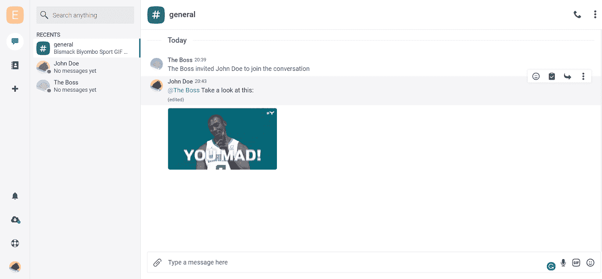

Chanty interface

Chanty 的界面很干净，可能会让你想起另一个 [SaaS 应用](https://kinsta.com/blog/saas-products/)。频道被称为公共对话，但在应用程序中以相同的方式显示。

它直观且易于使用。您可以通过单击加号开始通话、公共对话，或者创建和分配任务。

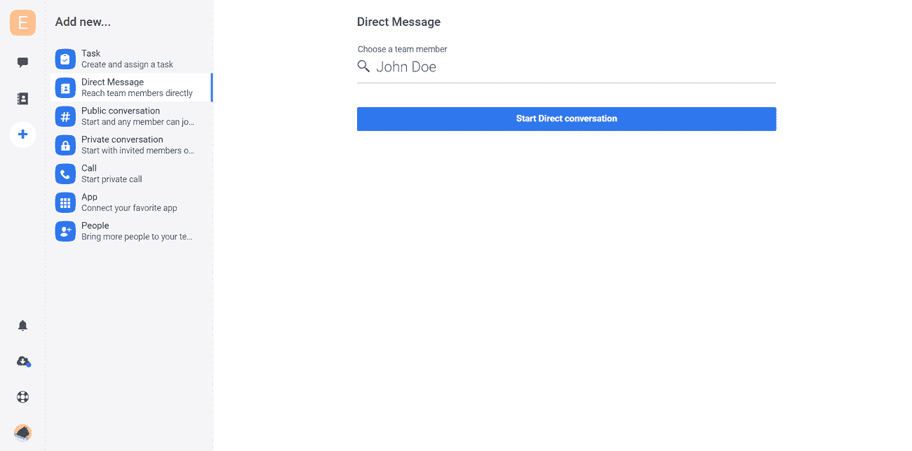

Creating a new message or task in Chanty

这里也是你处理应用集成的地方。

#### 免费计划

*   每个团队 20GB 存储
*   最多 10 个用户
*   任务管理
*   多达 10 个第三方集成。
*   无限的信息和搜索历史。
*   没有群组视频/音频通话。

### 4\. Bitrix24

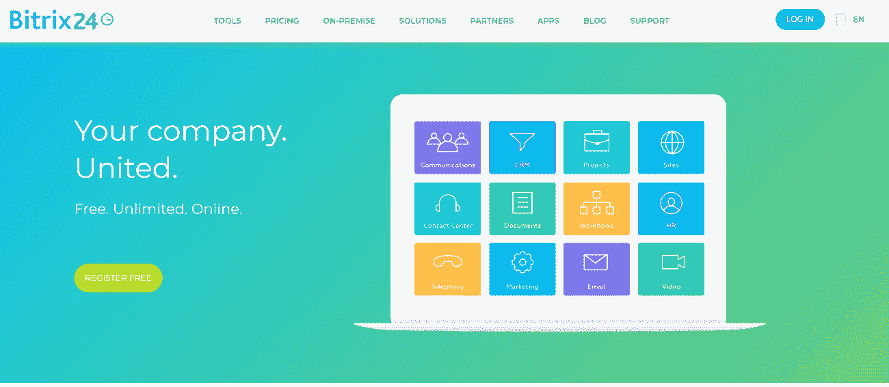

Bitrix 24

Bitrix24 是一个免费的营销和通信套件，而不仅仅是一个实时通信应用程序。他们的协作解决方案提供频道、任务创建、搜索、视频通话等功能。除此之外，它还提供[电子商务工具](https://kinsta.com/blog/ecommerce-platforms/)、 [CRM](https://kinsta.com/blog/wordpress-crm/) 和联络中心软件。

#### 特征

*   频道
*   私人信息
*   基本搜索功能
*   屏幕共享(1 对 1)
*   除了聊天之外，发布时间表。
*   视频/音频通话(一对一)
*   CRM 和营销自动化

#### 连接

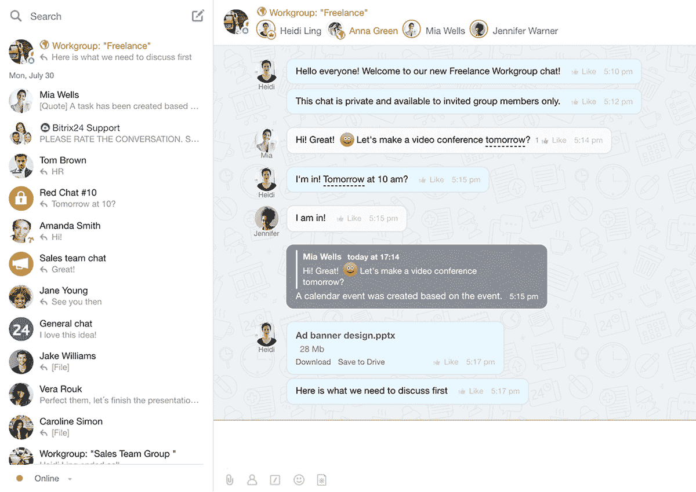

Bitrix 24 Workgroup interface

对于过去使用过类似工具的人来说，这个界面是干净和直观的。所有工作组都列在左侧，而实际内容列在右侧。你可以轻松地在新邮件中共享文件或标记某人，就像你对 Slack 替代品的期望一样。

#### 免费计划

该计划对 12 名用户免费，没有时间限制。

*   最多 12 个用户
*   5 GB 在线存储
*   无限制的消息传递和搜索
*   音频和视频通话(一对一)
*   任务管理

### 5.弗利普

### 

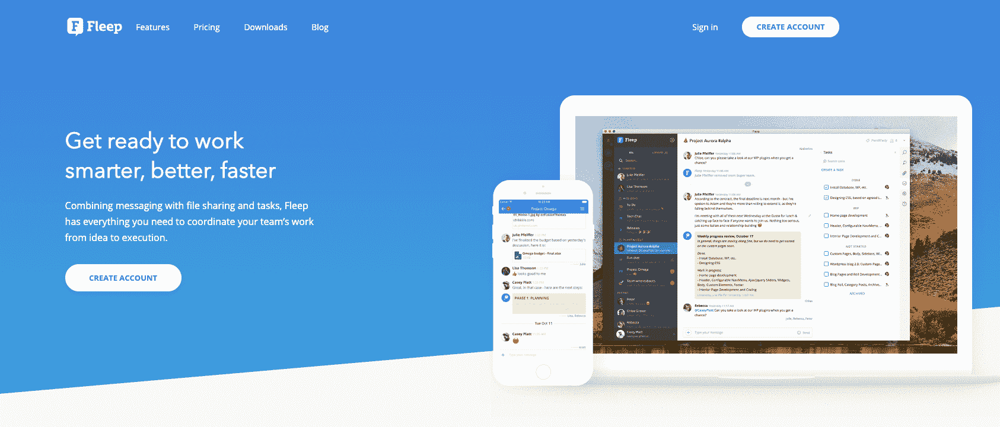

Fleep

Fleep 承诺帮助你更聪明、更好、更快地工作。它不仅仅是一个团队聊天或协作应用程序；它还涉及[项目管理](https://kinsta.com/blog/wordpress-project-management-plugins/)。任务、插接板、团队和文件管理使其区别于最基本的竞争对手。

#### 特征

*   频道(群组对话)
*   组
*   私人信息
*   任务管理
*   插接板
*   共享文件管理
*   视频和音频通话(通过整合)
*   Web、桌面和移动应用程序

#### 连接

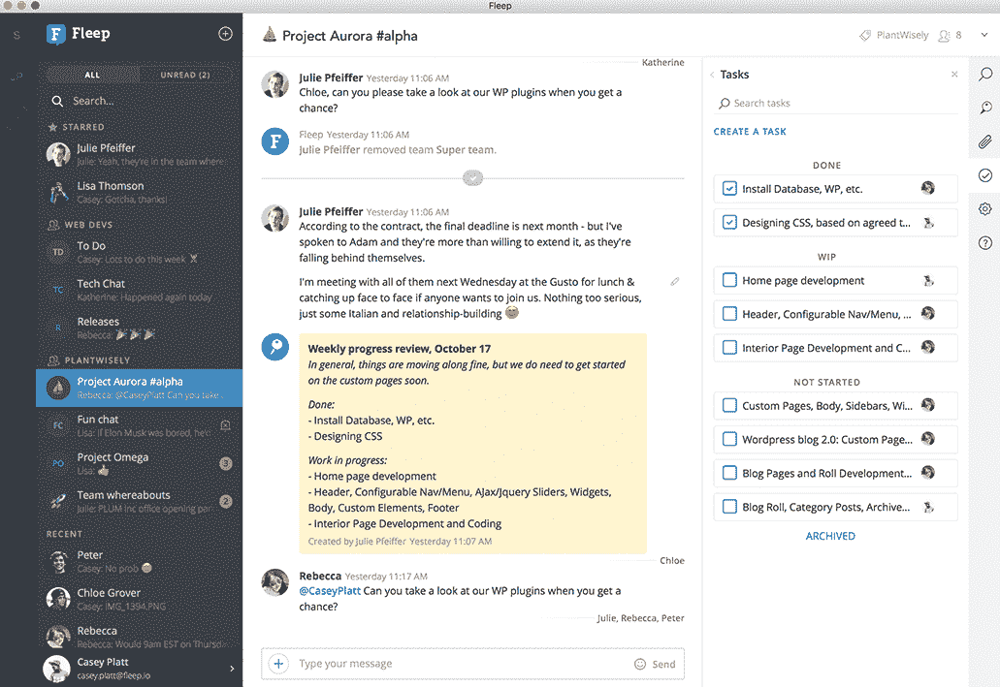

Fleep interface

Fleep 的界面包括分类待办事项列表格式的任务。它最大限度地降低了团队成员忘记通过聊天分配的任务的风险。一个缺点是，它有时看起来有点杂乱，但这是一个很小的代价。

#### 免费计划

他们的免费计划只包括基本的团队聊天功能。

*   无限的消息和搜索
*   最多 3 个小组对话
*   10 GB 用于文件存储
*   没有眼泪
*   没有任务

### 6.呼叫中心，呼叫中心，呼叫中心，呼叫中心，呼叫中心，呼叫中心，呼叫中心，呼叫中心，呼叫中心，呼叫中心，呼叫中心，呼叫中心，呼叫中心，呼叫中心

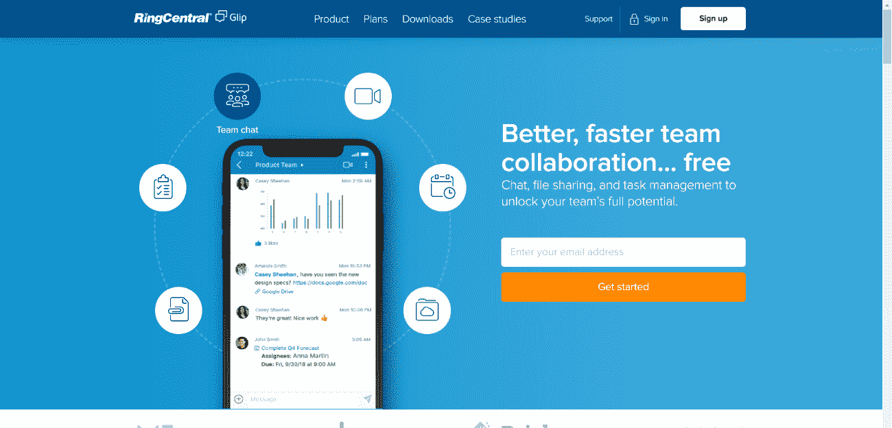

Glip

2015 年被 RingCentral 收购并与其产品合并， [Glip](https://glip.com/) 是一款团队协作应用程序，与 Fleep 一样，它提供任务管理功能，帮助您的员工保持正轨。

#### 特征

*   渠道(团队)
*   私人信息
*   全面的邮件搜索
*   屏幕共享
*   任务管理
*   视频和音频通话
*   客人

#### 连接

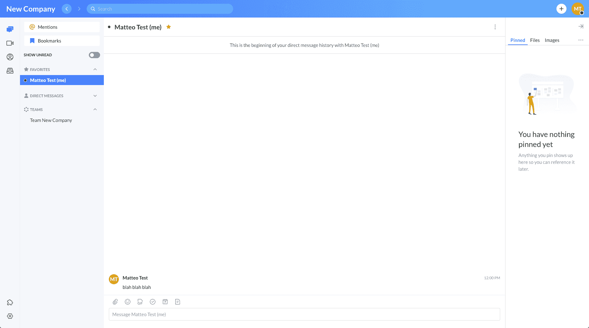

Glip

如果你曾经使用过其他聊天工具，你不会觉得在 Glip 中格格不入。聊天功能可能会感觉很熟悉，总体布局也是如此。你可以在左边的菜单上看到相关的用户和团队，也可以快速搜索消息。有一个方便的功能可以直接从信息中创建[日历](https://kinsta.com/blog/wordpress-events-plugin/)、笔记和任务。

#### 免费计划

它包括无限的团队和用户，但只有 500 分钟的共享视频。对于不经常使用视频的组织来说，这可能是这个列表中最好的免费计划。

*   无限的消息和搜索历史
*   无限存储
*   无限用户
*   无限团队
*   无限集成
*   500 分钟的共享视频
*   任务管理
*   团队日历

### 7.部队信使

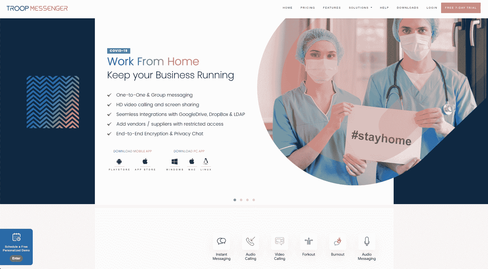

Troop messenger

部队信使具有即时消息、视频会议、屏幕共享和其他协作功能。它还在包括 Linux 在内的所有主流操作系统上提供原生应用。

#### 特征

*   频道(群聊)
*   私人信息
*   全面的邮件搜索
*   屏幕共享
*   任务管理
*   视频和音频通话
*   自毁信息
*   指纹安全
*   网络、桌面和移动应用程序(iPhone 和 Android)

#### 连接

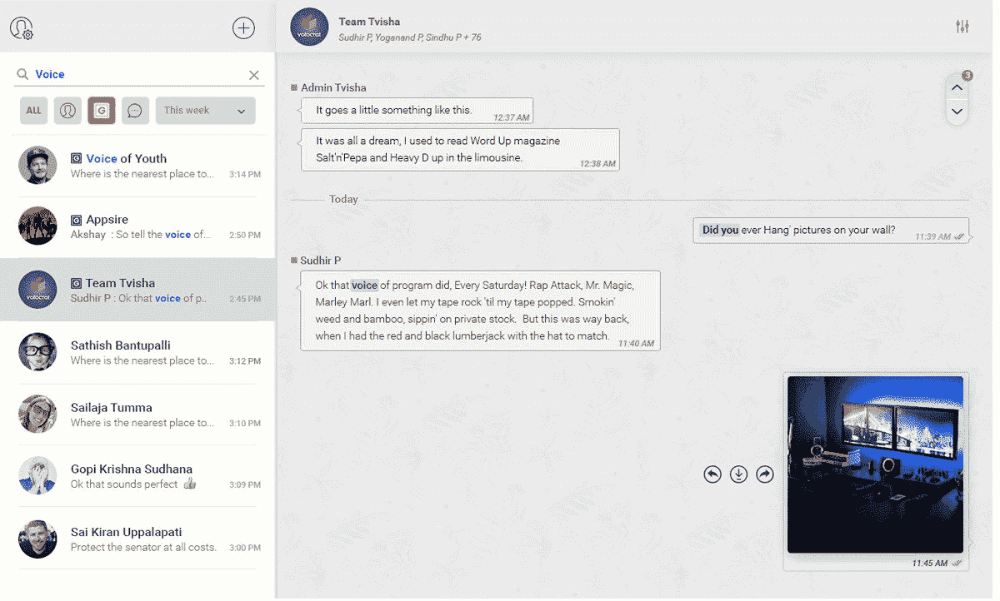

Troop Messenger interface

该界面看起来更像一个标准的聊天，而不是一个团队协作应用程序(有点过时)。因为它最初是一体的。但是在这个引擎盖之下是所有主要 Slack 替代品提供的所有功能。

#### 免费计划

免费计划不包括视频或音频通话或屏幕共享。值得一提的是，付费计划的起价是每个用户每月 1 美元。

*   多达 50 个用户
*   50 GB 的存储空间
*   无限的消息和搜索历史
*   最多 5 次群聊
*   没有视频或音频通话
*   没有屏幕共享
*   没有自毁信息

### 8.祖利普

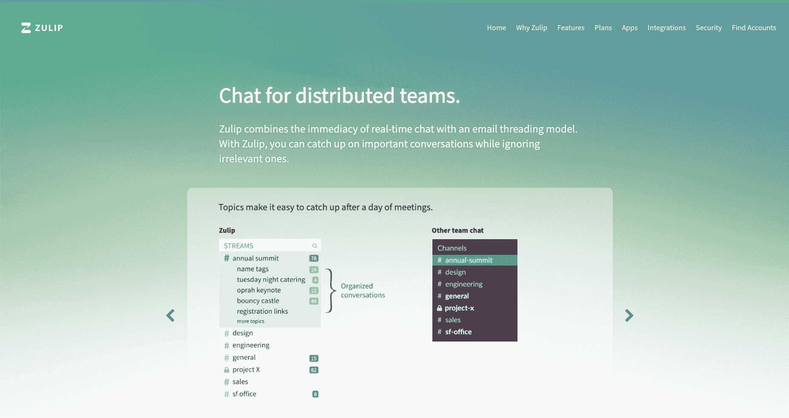

Zulip

Zulip 结合了实时聊天和电子邮件风格的线程。该功能创造了独特的团队聊天体验，并帮助其脱颖而出。目标是消除花在对你不重要的信息上的时间。

#### 特征

*   电子邮件风格的线程(流)
*   频道(群聊)
*   私人信息
*   全面的邮件搜索
*   警示词
*   视频和音频通话(由 Zoom 等第三方应用提供支持。)
*   网络、桌面和移动应用程序(iPhone 和 Android)
*   客人

#### 连接

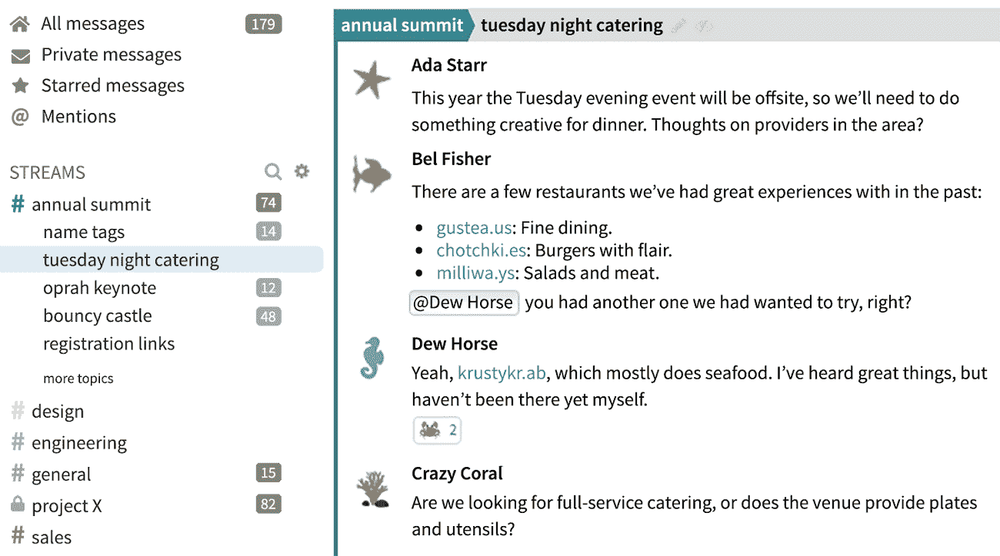

Zulip thread interface

Zulip 的流使界面独一无二。它们模仿典型电子邮件的线程。它让你的员工[在重要项目上跨团队合作](https://kinsta.com/blog/saas-products/#collaboration-and-internal-communication)，而不必创建大量的渠道。

#### 免费计划

Zulip 将免费计划上的消息搜索历史限制为 10，000 条消息。

*   无限消息，搜索历史上限为 10，000
*   5 GB 总存储空间
*   主要功能包括

Zulip 也是一个内部部署的开源解决方案，因此您可以选择在您的服务器上免费安装它，并且所有功能都是免费的。

### 9.群众

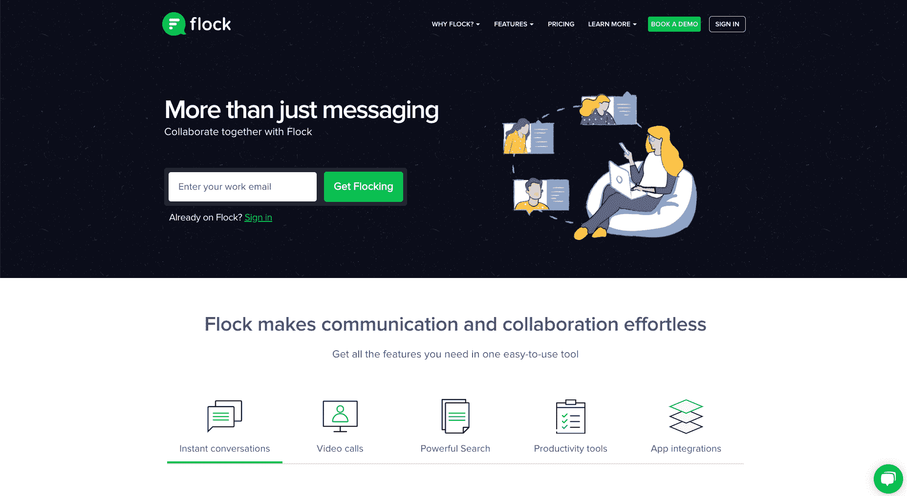

Flock

Flock 是一款团队聊天应用，包括待办事项列表和其他生产力工具，是其 DNA 的一部分。它不是唯一这样做的消息平台，但它比这里概述的大多数 Slack 替代方案都更好地包含了它。

#### 特征

*   频道
*   私人信息
*   全面的邮件搜索
*   视频和音频通话
*   网络、桌面和移动应用程序(iPhone 和 Android)
*   客人
*   笔记
*   代码片段共享

#### 连接

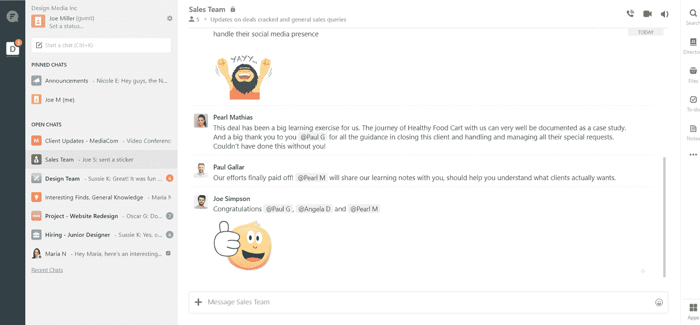

Flock interface 

Flock 的界面干净简约。重点是开放的聊天，所以所有“不必要的”渠道和 DMs 是隐藏的。你可以随时打开你的待办事项列表，只需点击一个按钮，你可以为团队和个人用户创建这些。

## 注册订阅时事通讯

### 想知道我们是怎么让流量增长超过 1000%的吗？

加入 20，000 多名获得我们每周时事通讯和内部消息的人的行列吧！

[Subscribe Now](#newsletter)

#### 免费计划

免费计划拥有 Flock 的大多数核心功能，但它将最近的消息搜索限制在 10，000 条。你也可以不通过电子邮件注册就试驾。

*   无限群组频道
*   10 个公共频道
*   无限消息，10，000 条消息的搜索历史
*   无限制一对一视频通话

### 10.拧

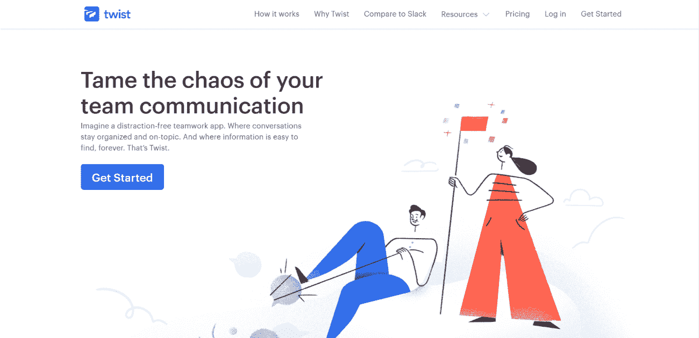

Twist

Twist 是另一个 Slack 的替代品，它使用基于线程的模型进行即时通讯。该功能减少了混乱，并允许用户只关注与他们相关的消息。这个解决方案是由 [Doist](https://doist.com/) 开发的，该公司开发了一个最著名的生产力应用程序 Todoist。

#### 特征

*   线索消息
*   频道
*   私人信息
*   全面的邮件搜索
*   视频和音频通话(通过整合显示)
*   网络、桌面和移动应用程序(iPhone 和 Android)
*   通过 Todoist 进行任务管理

#### 连接

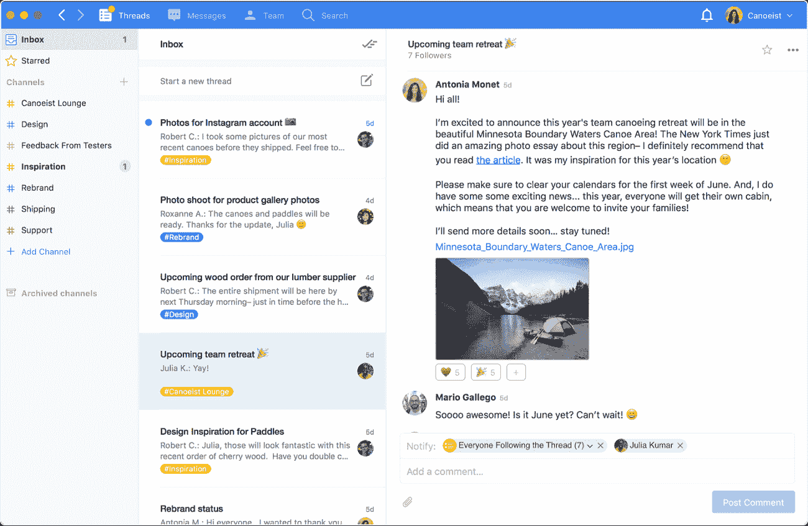

Twist interface

界面简洁，可能比实时聊天应用更能让你想起你的电子邮件收件箱。每个通道中的消息都被分成线程。它使事情井井有条，团队中的每个人都可以掌控他们的项目。当然，你也可以私信其他没有线索的用户。

#### 免费计划

Twist 的免费计划将消息访问限制为 30 天，但在其他方面包括大多数主要功能。

*   无限用户/访客
*   无限量邮件(但只有 30 天的搜索和存档权限)
*   5 GB 存储空间
*   多达 5 个集成

### 11.信件

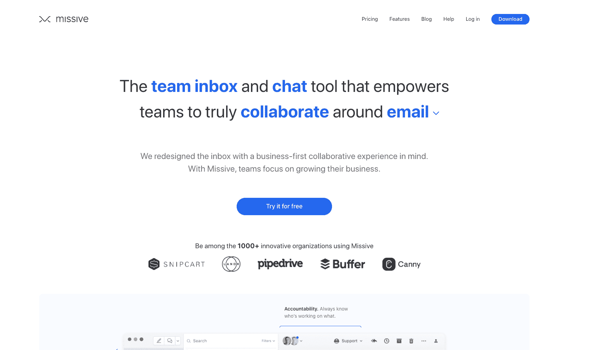

Missive

[Missive](https://missiveapp.com/) 的独特之处在于，它不仅仅是一款团队沟通和协作应用。它将电子邮件、[、Twitter](https://kinsta.com/blog/twitter-marketing/) 、Facebook Messenger、[、社交媒体](https://kinsta.com/blog/wordpress-social-media-plugins/)和其他渠道都整合到一个单一的仪表盘中。这些整合对于销售和[服务专业人员](https://kinsta.com/blog/web-developer-salary/)尤其有用。

使用 Missive，您可以在通过电子邮件发送回复之前快速协作并找出客户的问题，而无需离开应用程序。

#### 特征

*   频道(房间)
*   私人信息
*   与电子邮件、短信、Twitter 和 Messenger 集成
*   合作写作
*   任务管理器
*   全面的邮件搜索
*   网络、桌面和移动应用程序(iPhone 和 Android)

#### 连接

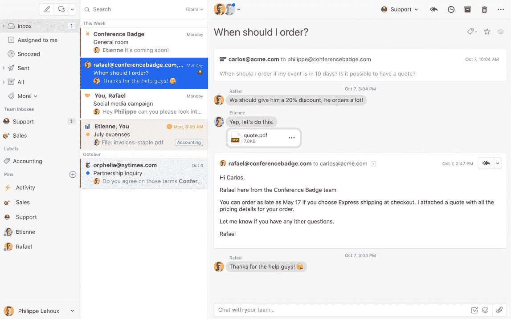

Missive interface

该界面与常规协作软件略有不同，因为它是一个三栏式用户界面。在它里面，你可以查看你的收件箱，发送电子邮件，其他信息，你有标准的聊天界面，以及待办事项列表。

#### 免费计划

免费计划只允许三个用户，并将消息历史限制为 15 天。

*   最多 3 个用户
*   最多 2 个个人账户(电子邮件/脸书)
*   最多 2 个共享账户
*   没有集成
*   没有工作流规则

### 12\. Jandi

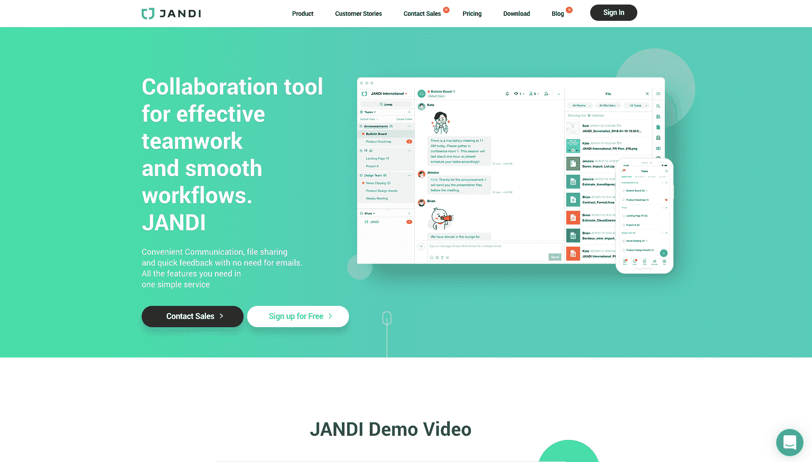

Jandi

Jandi 是另一个有全面免费计划的 Slack 替代方案。一个独特的特点是它的公告栏。你还可以在常规的[表情符号](https://kinsta.com/knowledgebase/disable-emojis-wordpress/)上使用可爱的线条贴纸。

#### 特征

*   频道(聊天室)
*   私人信息
*   任务管理
*   布告牌
*   贴纸
*   全面的邮件搜索
*   网络、桌面和移动应用程序(iPhone 和 Android)

#### 连接

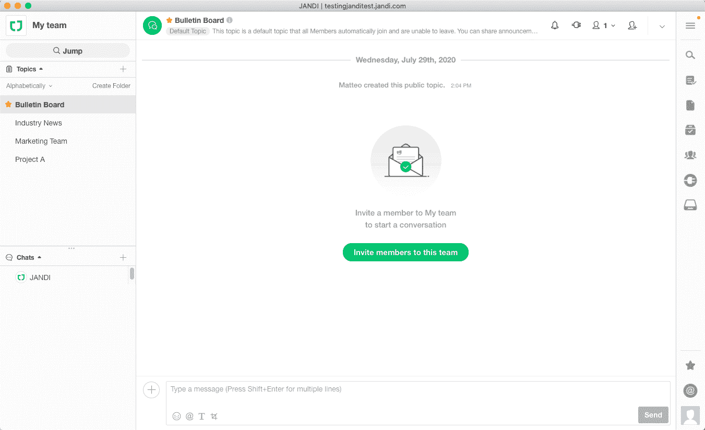

Jandi interface

Jandi 界面简洁，非常以聊天为中心。对于喜欢公开合作制定计划和策略的团队来说，公告牌是一个不错的选择。

#### 免费计划

该免费计划覆盖多达 500 名成员。

*   5 GB 存储(团队总容量)
*   无限短信，但搜索历史 15000。
*   待办事项列表
*   没有文件共享
*   没有视频聊天
*   没有公告板

## 免费试用的备用方案(托管解决方案)

以下 Slack 替代品没有免费计划，但提供了限时免费试用。

与宕机和 WordPress 问题做斗争？Kinsta 是一款考虑到性能和安全性的托管解决方案！[查看我们的计划](https://kinsta.com/plans/?in-article-cta)

### 13.谷歌视频聊天

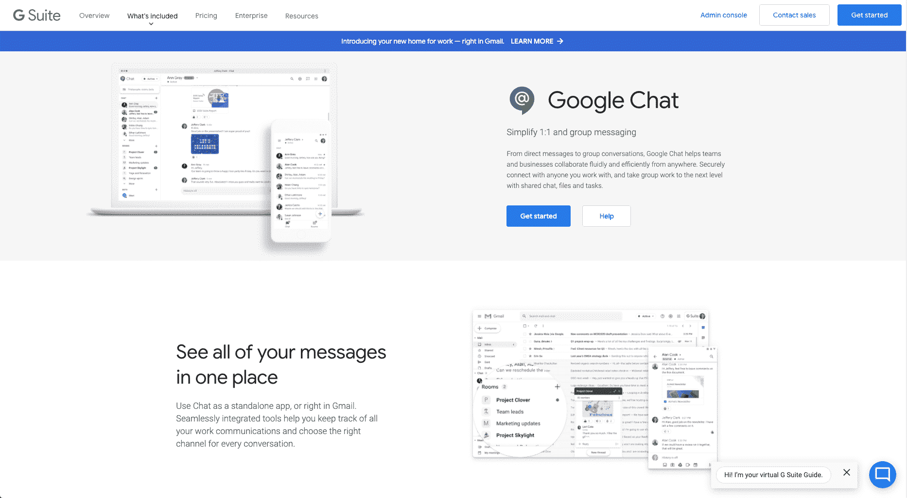

Google Chat

[Google Chat](https://gsuite.google.com/products/chat/) 是谷歌的团队聊天解决方案。它是 Google Workspace 的一部分，这意味着实际上没有免费计划。然而，你可以注册一个为期 14 天的[谷歌工作空间](https://kinsta.com/blog/google-workspace/)试用版。它还能让你进入谷歌视频会议工具 Google Hangouts Meet。

#### 特征

*   频道(聊天室)
*   私人信息
*   全面的邮件搜索
*   屏幕共享
*   多人视频/音频通话(内置 Hangouts Meet)
*   网络、桌面和移动应用

#### 连接

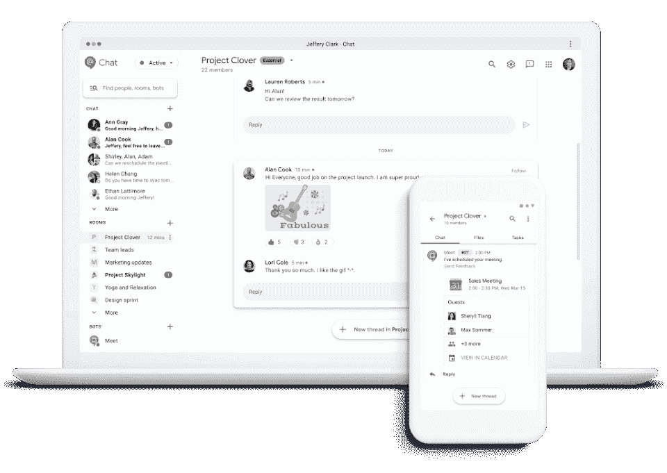

Google Chat interface

界面很光滑。像 Slack 一样，它默认为频道，但这些频道被称为聊天室。你可以在应用程序的顶部看到一个聊天室的所有成员。你可以在应用程序中轻松搜索相关的 Google Workspace 文件。

#### 免费试用和定价

免费试用持续 14 天。之后，Google Workspace Business Starter 是最便宜的计划，每个用户每月 6 美元。然而，如果你的公司已经将 Google Workspace 用于其他用途，它实质上就成了一个免费的选项。

### 14.CA Flowdock

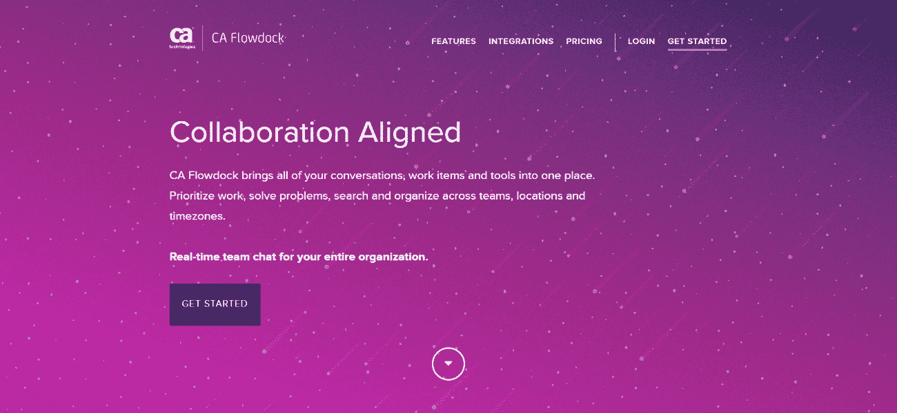

CA Flowdock

CA Flowdock 是另一个关注线程通信的 Slack 替代产品。与一些竞争对手不同，该界面的手感与 Slack 不同。

#### 特征

*   线索消息
*   渠道(流量)
*   私人信息
*   全面的邮件搜索
*   视频和音频通话
*   网络、桌面和移动应用程序(iPhone 和 Android)

#### 连接

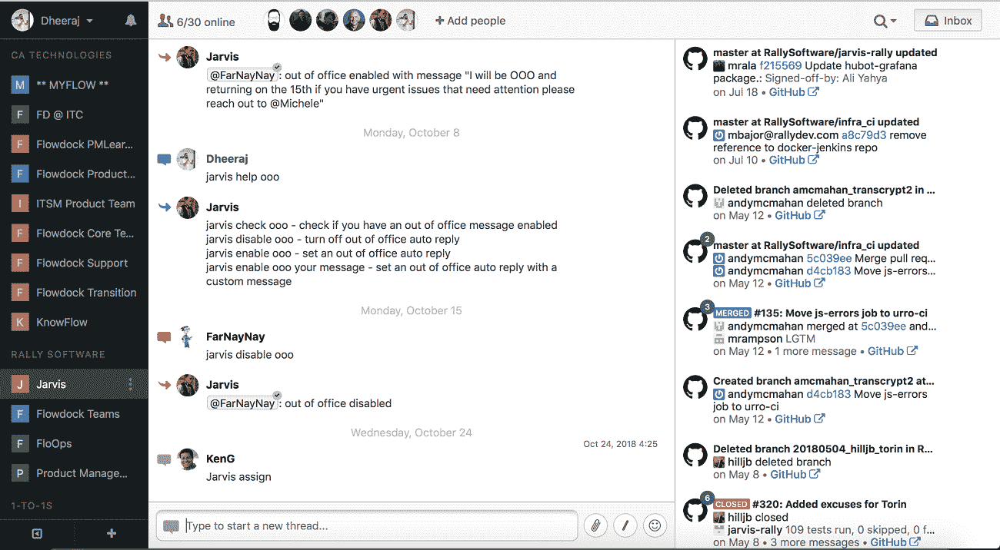

CA Flowdock interface

流(这是 CA Flowdock 中调用通道的方式)被分离到线程中，但界面显然仍是一个实时消息应用程序。不过，它的收件箱感觉不像其他一些松散的线索邮件。创建新的流和线程很简单，向它们添加人员也很简单。

#### 免费试用和定价

免费试用持续 30 天。最便宜的方案是每个用户每月 3 美元起，可以提供无限的流量和整合。如果您的团队只有五名或更少的成员，您也可以联系他们获得免费计划。

### 15.里弗

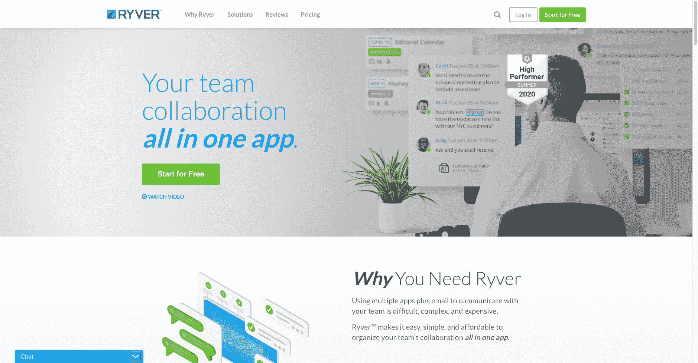

Ryver

Ryver 不仅关注聊天和协作，还关注项目管理。它提供任务、[看板风格的板](https://kinsta.com/blog/trello-alternative/)、自动工作流程等等。

#### 特征

*   渠道(论坛)
*   群组消息(团队)
*   私人信息
*   全面的邮件搜索
*   工作流自动化工具
*   任务管理
*   视频和音频通话
*   网络、桌面和移动应用程序(iPhone 和 Android)

#### 连接

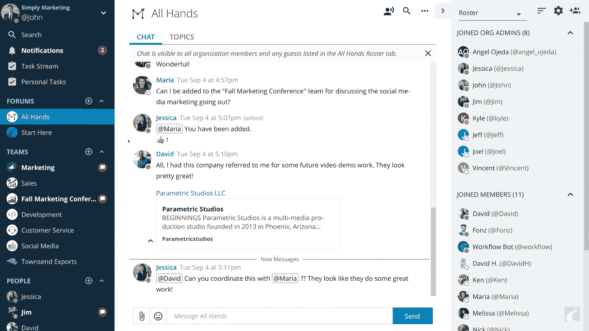

Ryver interface

主聊天仪表盘干净直观，但这并不是 Ryver 界面的最大卖点。它在同一个应用程序中有一个复杂的任务管理系统。

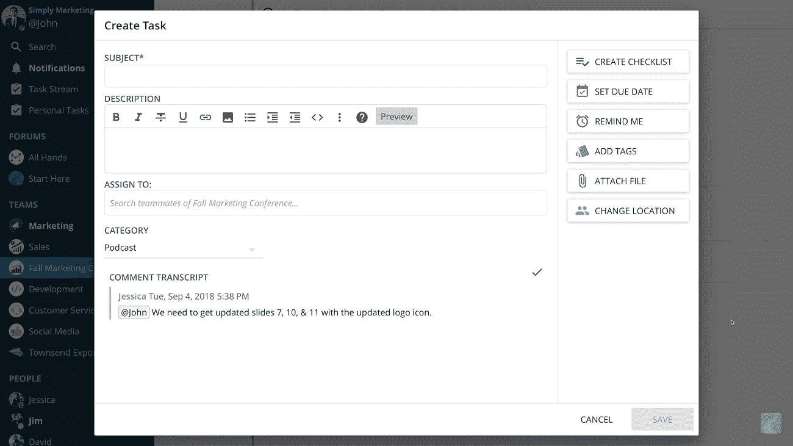

Ryver task interface 

创建任务并将其分配给适当的人很容易。您还可以标记与您创建的任务相关的注释或消息。

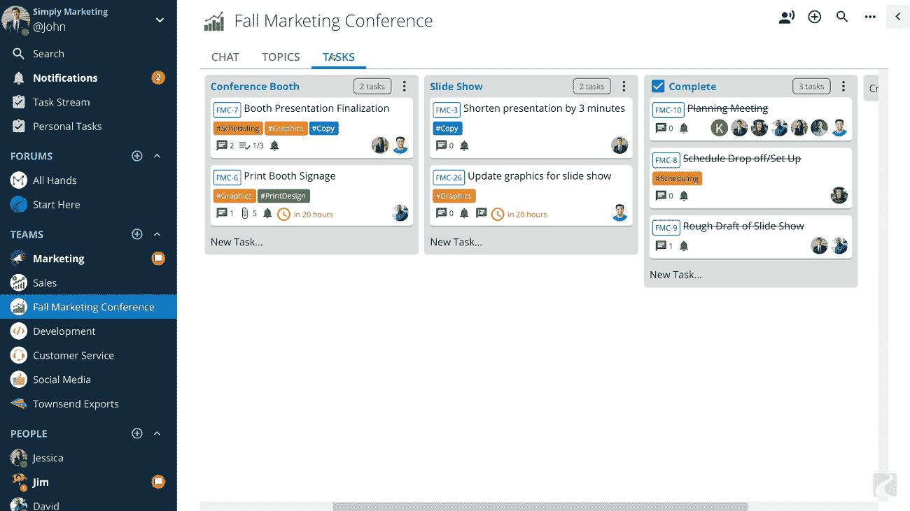

Ryver task board

Ryver 提供了看板风格的任务总览，而不是简单的待办事项列表。你可以将任务从一列拖放到下一列，就像你使用 [Trello 或它的任何替代品](https://kinsta.com/blog/trello-alternative/)一样。

#### 免费试用和定价

免费试用期为 14 天。最便宜的方案是 49 美元/月，最多 12 个用户。但他们的无限计划对无限用户每月收费 79 美元。由于大多数协作 SaaS 应用程序是按用户收费的，这对于大公司来说意味着显著的成本节约。

### 16.电线

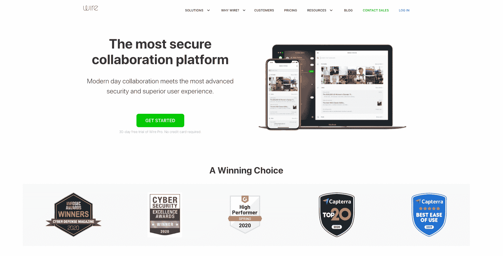

Wire

[Wire](https://wire.com/) 宣称自己是世界上最安全的协作平台。每一条信息、每一次通话、每一次会议都受到[端到端加密](https://kinsta.com/blog/cloud-security/)的保护。它还在包括 Linux 在内的所有主流操作系统上提供原生应用。

#### 特征

*   端到端加密
*   频道
*   私人信息
*   全面的邮件搜索
*   视频和音频通话
*   网络、桌面和移动应用程序(iPhone 和 Android)
*   代码片段共享

#### 连接

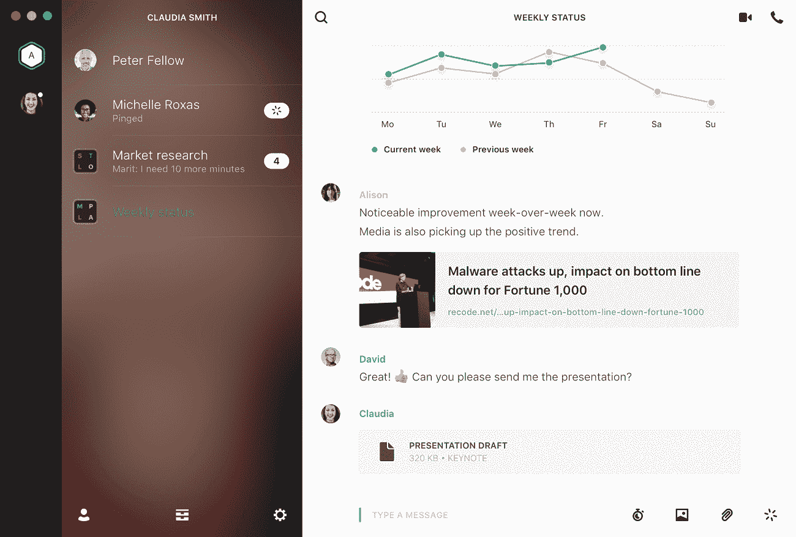

Wire interface

在这个列表中，Wire 的接口是所有 Slack 中最光滑的。使用起来直观又省力。因为它是如此的整洁，当你检查内部交流时，你也会感觉压力更小。

#### 免费试用和定价

30 天免费试用，然后 7 美元/用户/月。如果按年支付，价格降至 5.83 美元。

## 开源 Slack 替代方案(自托管解决方案)

由于我们的许多用户都是开源软件的粉丝，我们也包括了几个值得考虑的自托管 Slack 替代方案。

### 17.元素(以前为 Riot.im)

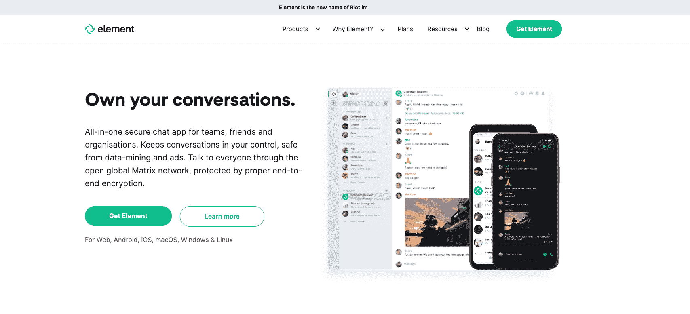

Element

[元素](https://element.io/)使用矩阵开放标准对所有消息进行端到端加密。这是一个[安全第一的](https://kinsta.com/blog/wordpress-security/)开源协作解决方案。

#### 特征

*   端到端加密
*   频道
*   私人信息
*   全面的邮件搜索
*   视频和音频通话
*   网络、桌面和移动应用程序(iPhone 和 Android)
*   聊天桥接
*   笔记

#### 连接

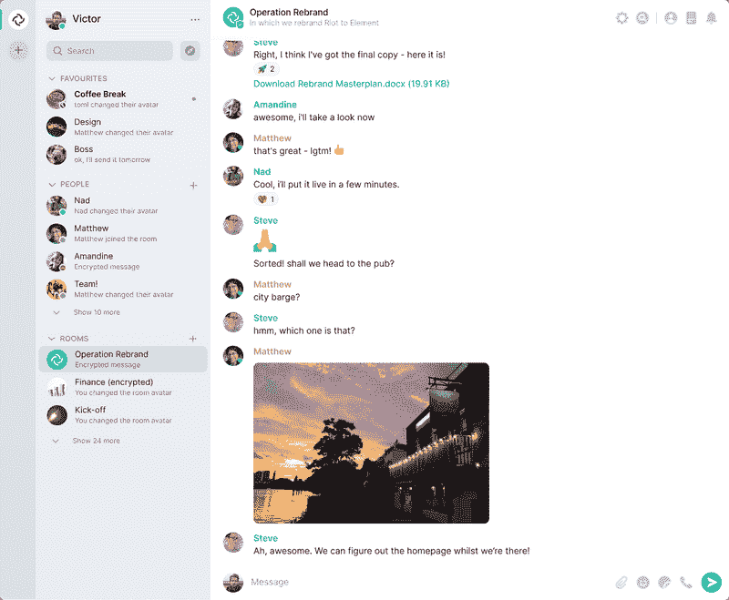

Element interface

界面本身是非常现代的，你可以很容易喜欢的频道留在顶部的事情。你还可以与其他聊天工具进行沟通，比如 Slack，这样你就可以在不离开各自应用的情况下进行协作。

Element app 可以在你的服务器上免费使用，也可以在 matrix.org 这样的免费公共服务器上免费使用。相反，如果你正在寻找一个托管解决方案，付费方案的起价是每个用户每月 2 美元。

### 18.火箭。聊天(服务器安装)

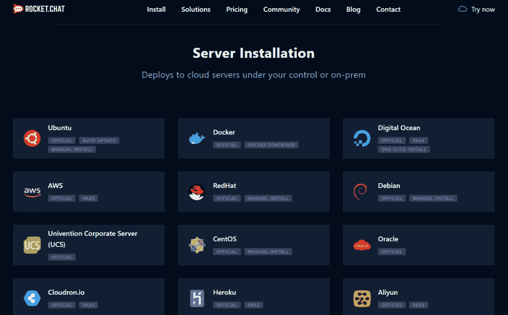

Rocket.Chat

[火箭。Chat](https://rocket.chat/install) 是一款高级协作工具，除了视频会议、频道和直接消息之外，它还提供了大量的集成、分级权限和定制功能。而火箭。聊天只有托管计划的付费选项，软件本身是开源的。因此，如果您选择自己托管，就不会有经常性成本。

#### 特征

*   频道
*   私人信息
*   全面的邮件搜索
*   视频和音频通话
*   网络、桌面和移动应用程序(iPhone 和 Android)

#### 连接

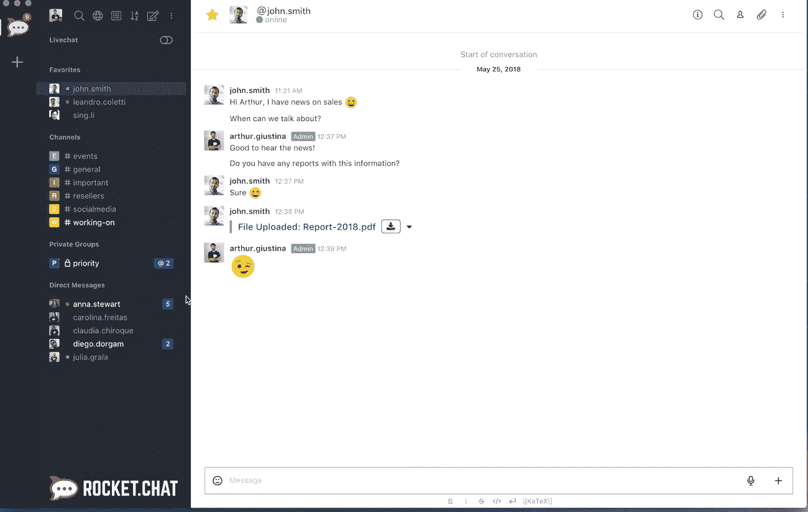

Rocket.Chat interface 

界面直观，易于使用。其独特之处之一是高度的可定制性。您不仅可以收藏频道和人物，还可以自定义频道视图。

你可以[在 GitHub](https://github.com/RocketChat/Rocket.Chat) 上克隆它，或者按照[他们的安装指南](https://rocket.chat/install)部署在你的云服务器上。

### 19.Mattermost

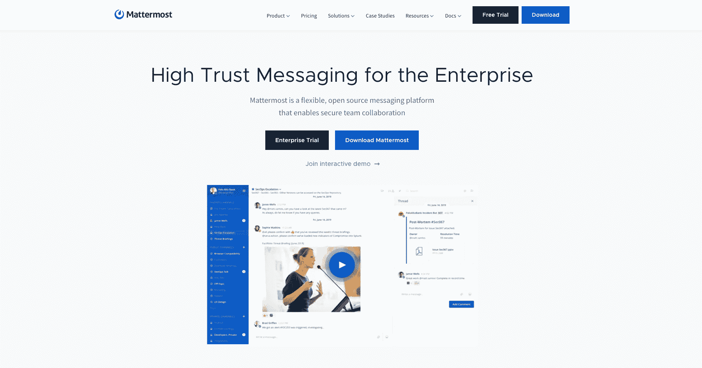

Mattermost

[Mattermost](https://mattermost.com/) 又是一款安全第一的开源即时通讯 app。它提供了您期望从 Slack 替代产品中获得的所有功能，并被英特尔、纳斯达克和美国社会安全管理局等大公司用于其内部通信和 DevOps 工作流。

#### 特征

*   基于角色的权限
*   频道
*   私人信息
*   全面的邮件搜索
*   视频和音频通话(一对一和群组)
*   网络、桌面和移动应用程序(iPhone 和 Android)

#### 连接

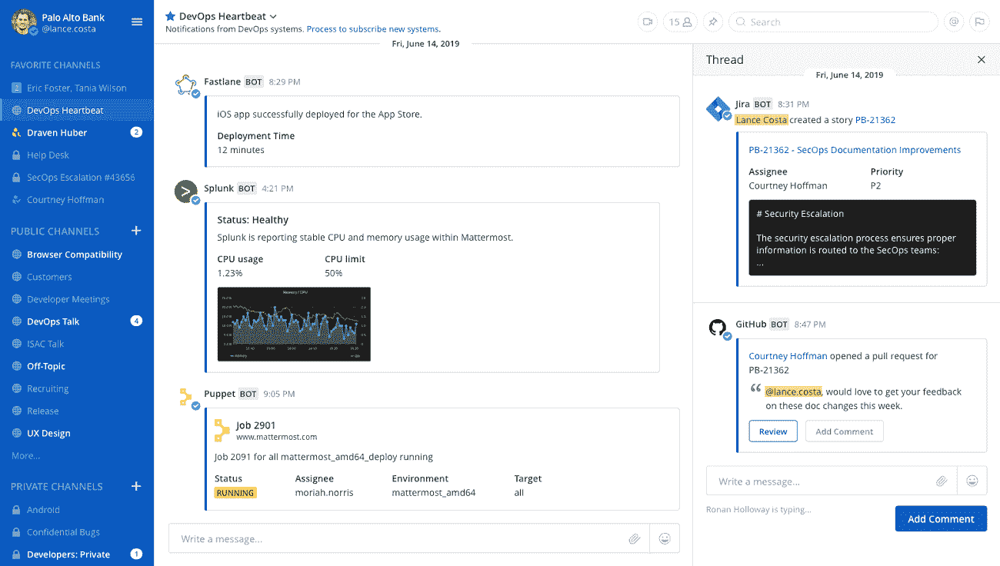

Mattermost interface

这个界面看起来和感觉上非常接近 Slack 的 UI 和这里列出的其他选择，所以如果你正在离开 Slack，这可能是你和你的团队最平稳的过渡。

matter most Team Edition[完全免费](https://github.com/mattermost/mattermost-server)提供，但如果你正在寻找一个托管解决方案，你需要查看企业版，起价为每个用户每月 3.25 美元。

## 摘要

在这篇文章中，我们列出了 19 种松弛时间的选择，但是网上还有更多选择。市场上充斥着类似的应用(有时是模仿者？)，因此找到一款值得使用的应用可能会很有挑战性。

在这个列表中，我们精选了适用于各种不同业务的 Slack 替代品。最佳选择取决于您现有的软件堆栈、文化和团队规模。最终，什么最适合你的公司。

现在轮到你了:在你寻找可靠的 Slack 替代品的过程中，你尝试过哪些应用程序？我们在列表中漏掉了哪一个？请在评论中分享你的想法！

* * *

让你所有的[应用程序](https://kinsta.com/application-hosting/)、[数据库](https://kinsta.com/database-hosting/)和 [WordPress 网站](https://kinsta.com/wordpress-hosting/)在线并在一个屋檐下。我们功能丰富的高性能云平台包括:

*   在 MyKinsta 仪表盘中轻松设置和管理
*   24/7 专家支持
*   最好的谷歌云平台硬件和网络，由 Kubernetes 提供最大的可扩展性
*   面向速度和安全性的企业级 Cloudflare 集成
*   全球受众覆盖全球多达 35 个数据中心和 275 多个 pop

在第一个月使用托管的[应用程序或托管](https://kinsta.com/application-hosting/)的[数据库，您可以享受 20 美元的优惠，亲自测试一下。探索我们的](https://kinsta.com/database-hosting/)[计划](https://kinsta.com/plans/)或[与销售人员交谈](https://kinsta.com/contact-us/)以找到最适合您的方式。