# 2022 年你应该检查的 25 个节省时间的松弛集成

> 原文：<https://kinsta.com/blog/slack-integrations/>

你可能每天都会用到很多软件程序。借助 Slack 集成，您可以将日常使用的软件与生产力应用程序集成在一起。

从你的[日历](https://kinsta.com/blog/wordpress-calendar-plugin/)应用到你的[客户关系管理](https://kinsta.com/blog/wordpress-crm/)，总有一个数据点被孤立在另一个软件中，你无法立即到达。

如果他们都可以交流，让你更容易知道所有方面发生了什么，这不是很好吗？您将获得警报、改进流程，并且只需点击几下鼠标就能访问您需要的内容。

但是有这么多松散的集成，您应该选择哪一个呢？

在本文中，我们将回顾 20 多个 Slack 集成，您可以实现这些集成来提高您的 Slack 生产率。

准备好了吗？我们开始吧！

[If you use @SlackHQ on a daily basis (🙋‍♀️), then you need these quick & easy integrations to make your workflow more efficient 🚀Click to Tweet](https://twitter.com/intent/tweet?url=https%3A%2F%2Fbit.ly%2F3p82lJv&via=kinsta&text=If+you+use+%40SlackHQ+on+a+daily+basis+%28%F0%9F%99%8B%E2%80%8D%E2%99%80%EF%B8%8F%29%2C+then+you+need+these+quick+%26amp%3B+easy+integrations+to+make+your+workflow+more+efficient+%F0%9F%9A%80&hashtags=RemoteWork%2CProductivityTips)

### 更喜欢看[视频版](https://www.youtube.com/watch?v=Oq-Q0jh7H3o)？

> Kinsta 把我宠坏了，所以我现在要求每个供应商都提供这样的服务。我们还试图通过我们的 SaaS 工具支持达到这一水平。
> 
> <footer class="wp-block-kinsta-client-quote__footer">
> 
> 
> 
> <cite class="wp-block-kinsta-client-quote__cite">Suganthan Mohanadasan from @Suganthanmn</cite></footer>

[View plans](https://kinsta.com/plans/)

## 什么是松散集成？

Slack integrations 是插件和定制应用程序，帮助您将 Slack 与其他各种软件解决方案连接起来，以推动您的业务发展。

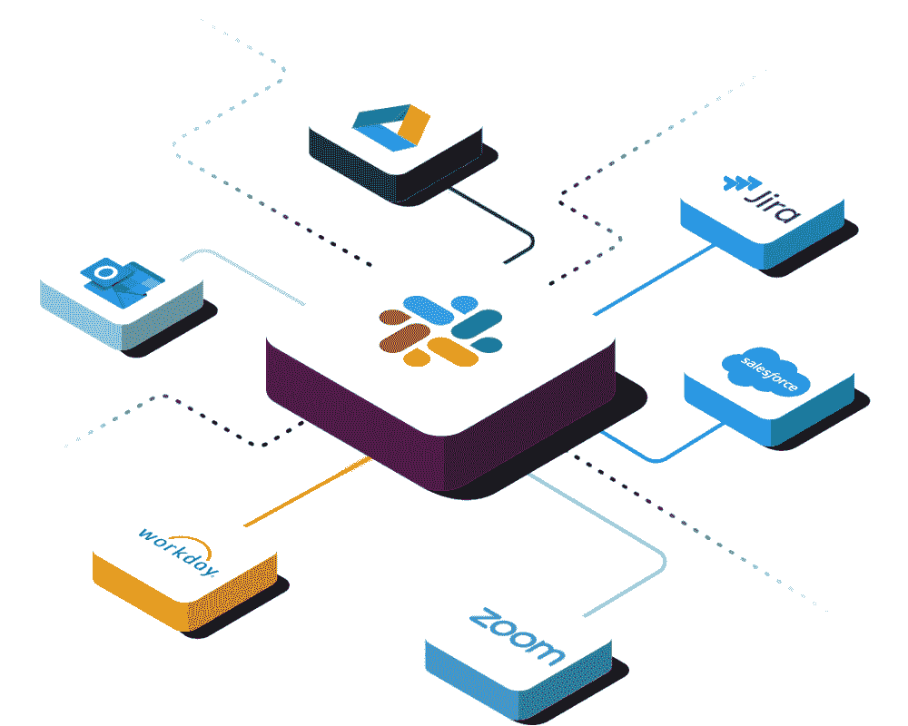

Slack integrations

这种集成可以向你发送警报，让你更容易使用应用程序中的其他程序，并统一来自许多不同平台的数据。

它们使您的工作空间更具协作性，并有助于提高您的工作效率。您将不再需要登录其他软件平台，从而节省时间。

与 [Gmail 插件](https://kinsta.com/blog/gmail-add-ons/)类似，Slack 集成将你需要的一切都放在你的聊天应用中。通过个性化您的工作空间并不断添加更多符合您目标的集成，希望您能更高效地工作，完成更多工作。

### Slack 提供了多少集成？

Slack 提供了【2,000 多个集成，你可以安装这些集成来个性化和塑造你的 [Slack 体验](https://kinsta.com/blog/how-to-use-slack/)成为一个适合你的体验。

该系统提供了与众多领先软件选项的集成，包括微软、谷歌、Salesforce、Twitter、Box、Dropbox、Zoom 等。

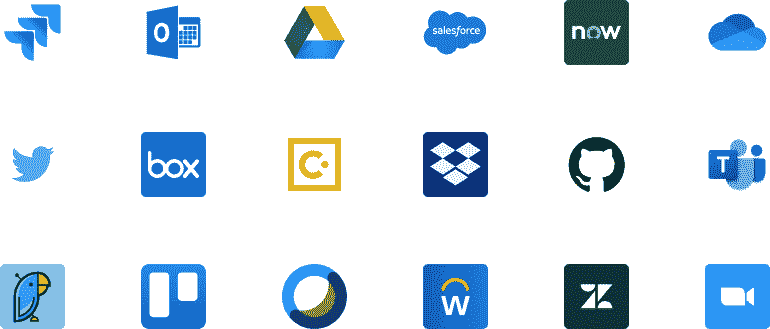

Softwares that provide Slack integrations

您日常使用的程序可能已经在市场上或者在他们未来的产品路线图中有了松散的集成。

对于那些希望让自己的产品无处不在、与客户的日常生活更加紧密地联系在一起、提高用户保留率和整体使用率的公司来说，发布 Slack 的集成是一个有价值的卖点。

### 如何添加松弛集成

所有这些关于松散集成的讨论是不是让你想为自己增加一个？

幸运的是，添加一个松弛集成(或十几个)非常容易。用户可以在 [Slack 的应用目录](https://slack.com/apps)中下载集成，这是一个充满各种选项的在线市场。

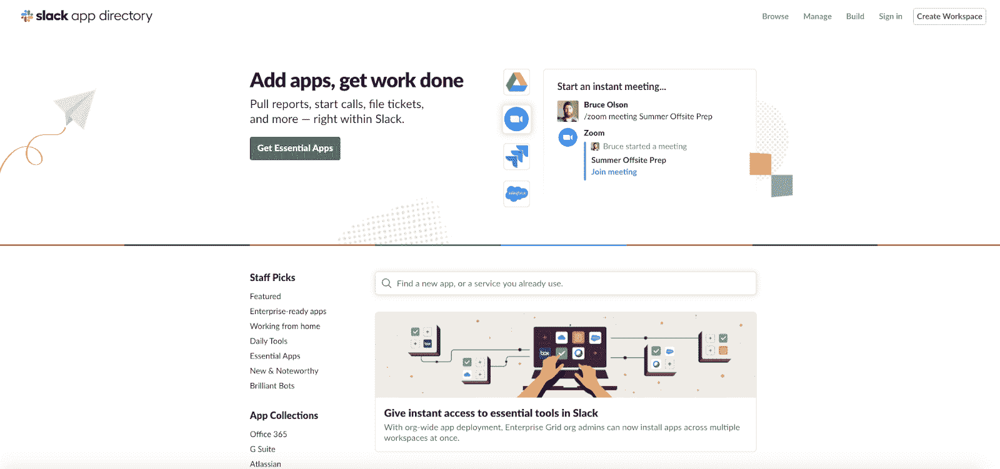

Slack’s app directory

有些集成涵盖了广泛的用途。从日历到簿记，有很多不同的选项可以帮助你节省时间，更有效地工作。

每个集成都有自己明确列出的说明，供您在完成安装过程时遵循。

然而，大多数涉及以下步骤:

选择集成后，单击“登录安装”按钮。如果您已经登录，该按钮将显示“松弛时打开”

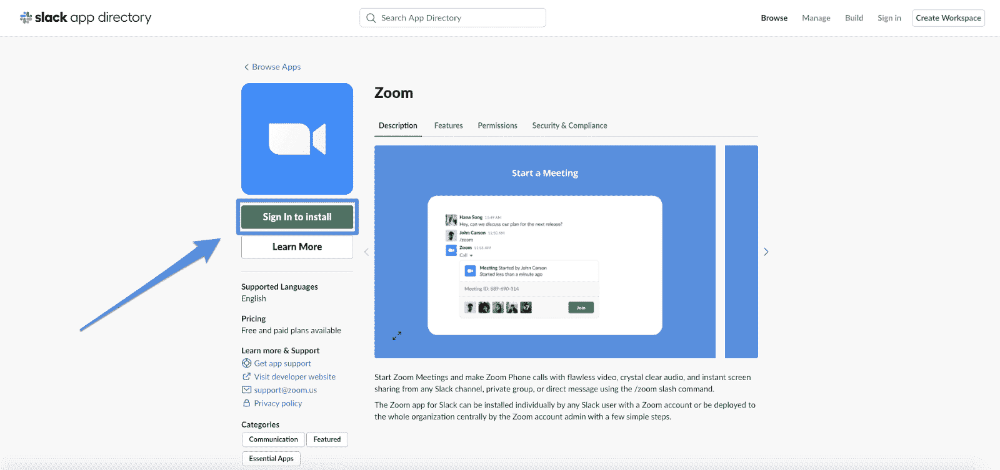

Installing Zoom on Slack

登录后，您可以点击“在空闲时间打开”，集成将出现在您的空闲窗口中。

通常，它会解释集成、共享 Slack 短代码(如果应用程序使用)并要求您授权集成:

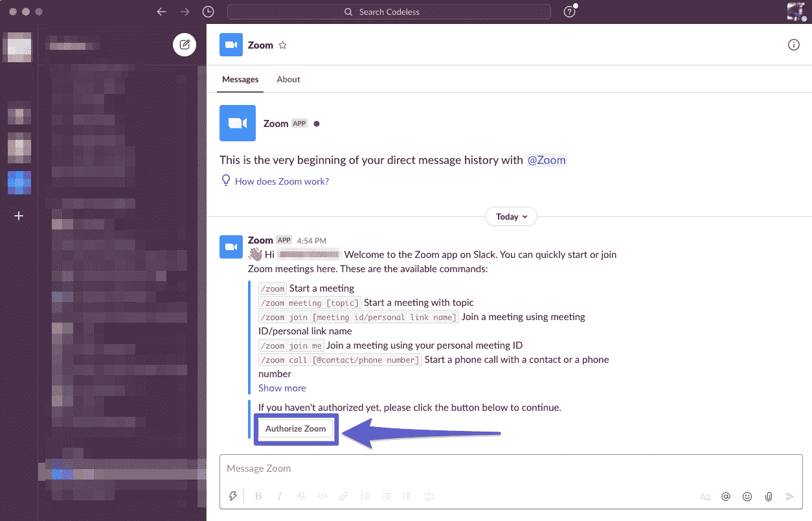

Onboarding and activation process for Slack integrations

点击“授权”,一切就绪！

只需点击几下，您就可以拥有一个根据您的需求定制的更加集成的界面。

## 您需要下载的 25 个顶级松弛集成

为了从 Slack 中获得最佳体验，你需要定制平台，让它做你需要它做的事情。这包括下载正确的集成，将您现有的所有软件连接到 Slack workspace 中。

使用这些顶级应用提高您的日历、通信、生产力、写作和管理工作的效率。

### 日历集成

使用日历应用程序在空闲的工作空间中，永远不会错过会议或任务。这些集成将让您的一天没有任何停顿或遗漏的连接。

#### 1.谷歌日历

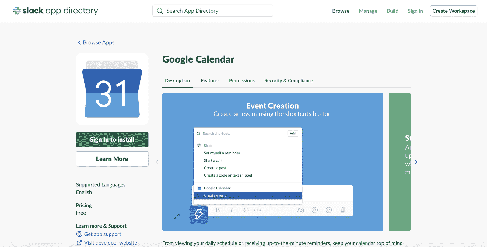

Google Calendar app for Slack

[谷歌日历](https://slack.com/apps/ADZ494LHY-google-calendar)将你的日常日程安排与你的空闲工作场所联系起来，并在空闲时间提供状态更新、提醒和事件变化。

谷歌日历的一个主要好处是，它使用户能够接受或拒绝平台中的活动请求，并允许他们只需点击几次就可以创建新的活动。

您可以将 Google 日历与您的时差状态同步，以便在您忙碌且无法沟通时通知团队。您将不再需要手动更新您的状态；这些变化是自动的，会节省你的时间。

此外，当会议开始时，您可以立即获得通知。您将获得所需的所有信息，包括直接在时差通知中加入 Hangout、Zoom、Webex 或 Microsoft Teams 会议的链接或拨入号码。

定价:这种集成是免费的。

#### 2.Outlook 日历

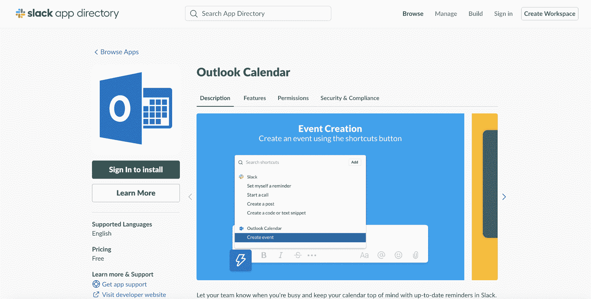

Outlook Calendar for Slack

[Outlook 日历](https://slack.com/apps/AFV5ECLBZ-outlook-calendar)集成是为那些在微软产品中存储事件而设计的。与 Google Calendar 集成类似，您可以在 Slack workspace 中创建新事件并接收提醒和更新。

Outlook 还提供了“斜杠命令”来将事件添加到您的日历中。输入*/ocal[today][tomorrow][settings]*查看您今天和明天的日程安排，或者调整设置。

一个缺点是:Outlook 日历仅适用于 Office 365。该应用不支持内部部署的 Microsoft Exchange 客户。

定价:这种集成是免费的。

#### 3.日历盒

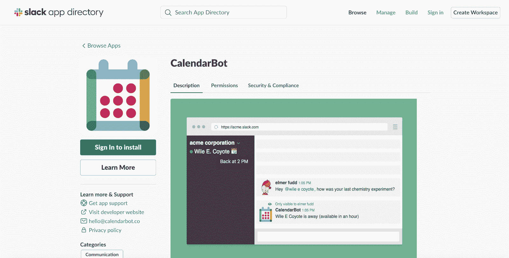

CalendarBot app for Slack

CalendarBot 是一个超级简单的 Slack 应用程序，可以让你的团队知道你在开会。它给出了会议持续时间的估计，这样你的队友就知道你什么时候回来。

有了 CalendarBot，您可以让整个团队使用它，也可以简单地将其集成到您自己的工作空间中。知道你什么时候有空，什么时候没有空，从长远来看，你的团队会受益匪浅。

定价:CalendarBot 提供 14 天的免费试用，然后需要每月 2.50 美元/人的订阅。

#### 4.Eventbot 日历

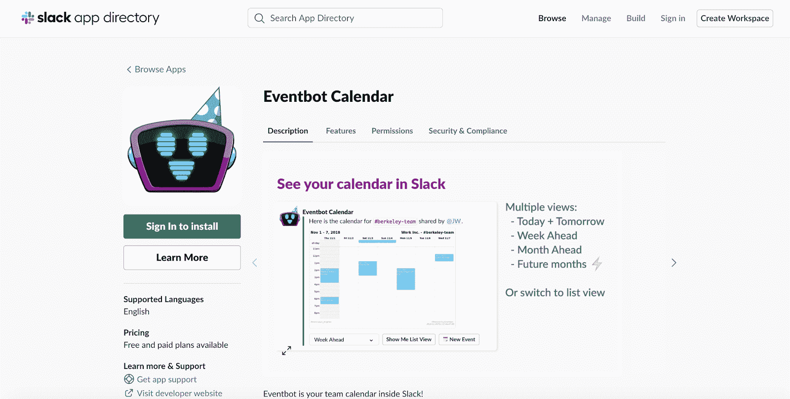

Eventbot Calendar app for Slack

如果你想统一团队的可用性，Eventbot 是一个很好的日历集成。

您可以从多个程序中导入现有日历，Eventbot 将显示您的团队何时有空参加会议。

Eventbot 有一些独特的功能，包括从 Slack 中取消事件和将事件导出到任何日历中的能力。它可以与任何日历平台通信和工作，包括谷歌和微软。

定价:有免费版和付费版，每月 26 美元起。

### 通信集成

通过一些电话、视频聊天和电子邮件应用程序集成，简化您的语音、面部和[书面交流](https://kinsta.com/blog/email-marketing-software/)。

甚至不用离开空闲时间，您就可以与那些对您的业务至关重要的人联系。

#### 5.一款云视频会议软件

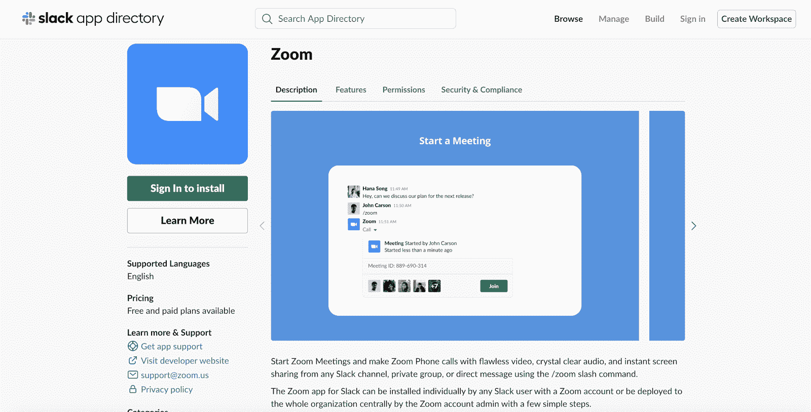

Zoom app for Slack

[Zoom](https://slack.com/apps/A5GE9BMQC-zoom) 集成有助于减轻您在进行下一次视频通话时必须打开 Zoom 平台的麻烦。相反，你可以在你的空闲工作区参加一个缩放会议。

Zoom 也可以设置为默认的空闲通话，允许您在每次需要拨打电话时自动打开平台。

这款应用在 Slack 中提供了一个“斜杠命令”，这意味着如果你输入/缩放[帮助、会议、加入、通话]，你就可以启动其中一个动作。

该集成还为您提供了会议摘要和记录。

定价:这是一个与付费组件的免费集成，取决于您的缩放计划。

#### 6.Google+ Hangouts

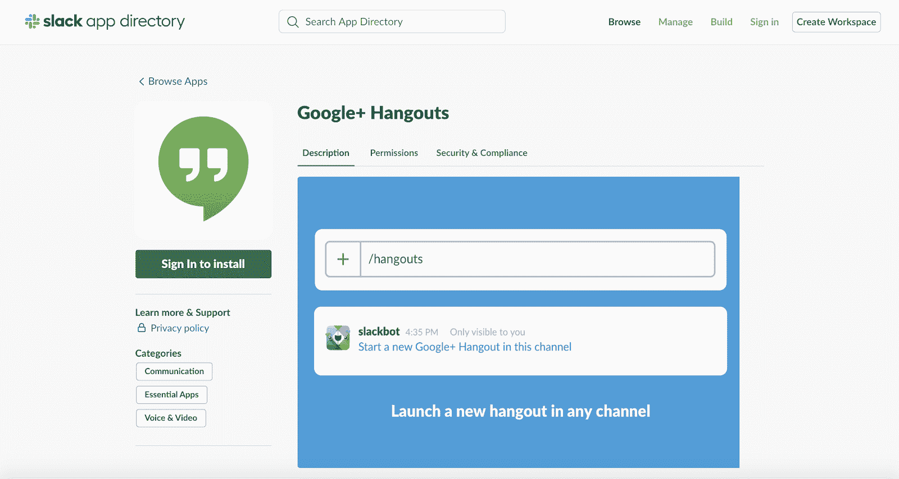

Google+ Hangouts app for Slack

[Google+ Hangouts](https://codeless.slack.com/apps/A0F7YS351-google-hangouts) 是一个必要的集成，它将把你的 Google+帐户与你的 Slack workspace 连接起来，使你更容易通过语音、即时消息和视频与你的团队沟通。

这种 Slack 集成直接连接到您的 Google+ Hangout 帐户，可以轻松地开始会议并给联系人打电话，而无需离开应用程序。通过键入/hangout，您可以立即与需要加入的人开始一个 hangout。

定价:这款 Slack 应用是免费的。

#### 7.Microsoft 团队呼叫

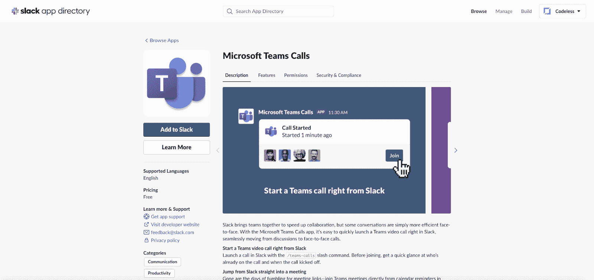

Microsoft Teams Calls app for Slack

[Microsoft Teams Calls](https://slack.com/apps/ARRK29W8N-microsoft-teams-calls) 帮助您的团队进行高效、无摩擦、无争议的会议。

该应用程序会在会议开始时提醒您。在同一封邮件中，将有一个按钮，单击该按钮可以立即开始会议—所有这些都在您的 Slack 窗口中进行。

您甚至可以使用 Microsoft Teams Calls slack 命令开始通话。只需键入/teams-calls，您就可以加入您的通话，并查看谁已经加入。

定价:这种集成是免费的。

阅读我们的[微软团队与 Slack](https://kinsta.com/blog/microsoft-teams-vs-slack/#microsoft-teams-vs-slack--features-overview) 深入比较指南。

#### 8.电子邮件

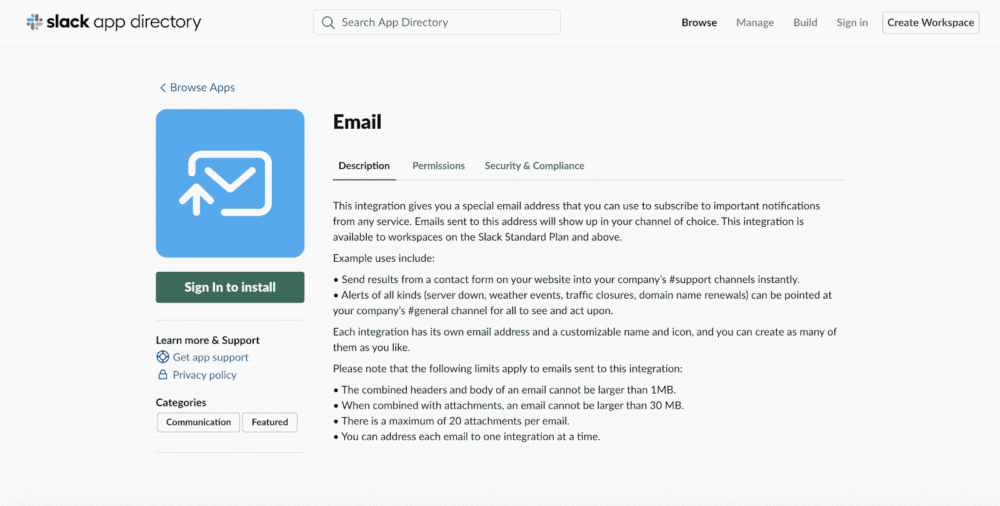

Email app for Slack

[Email](https://slack.com/apps/A0F81496D-email) 是一款 Slack 应用，可以帮助你将电子邮件通信更加无缝地整合到平台中。

您可以链接电子邮件应用程序，将特定收件箱收到的所有电子邮件发送到指定的闲置频道。

例如，如果您有一个共享的[【电子邮件保护】](/cdn-cgi/l/email-protection)或[【电子邮件保护】](/cdn-cgi/l/email-protection) [电子邮件地址](https://kinsta.com/blog/professional-email-address/)，您可以将这些收件箱链接到一个特定的 Slack 频道，该频道将向所有订阅者展示您的新邮件。

这种集成也可以很容易地链接到您网站上的[表单。](https://kinsta.com/blog/wordpress-registration-form/)

定价:这种集成是免费的。

## 注册订阅时事通讯

### 想知道我们是怎么让流量增长超过 1000%的吗？

加入 20，000 多名获得我们每周时事通讯和内部消息的人的行列吧！

[Subscribe Now](#newsletter)

#### 9.前面

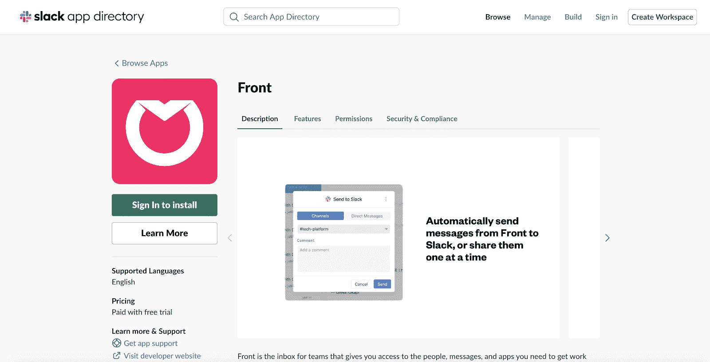

Front app for Slack

[Front](https://slack.com/apps/A0H4MTN4T-front) 对于共享收件箱来说是一个有用的集成。如果您的团队正在管理多个收件箱，这些收件箱被分配给多个人员，那么 Front 将在 Slack 中提供这种可见性。

有了共享收件箱，您的团队将能够共享工作，并立即从一个人停止的地方继续工作。您将享受收件箱中打开的邮件的实时更新，提供可见性和最新信息。

通过将 Front 连接到 Slack，您将能够自动或手动地将消息从 Slack 发送到 Front，一次一条。

定价:这是一个付费应用程序(起价为 9 美元/用户/月)，有 7 天的免费试用期。

#### 10.稍后发送

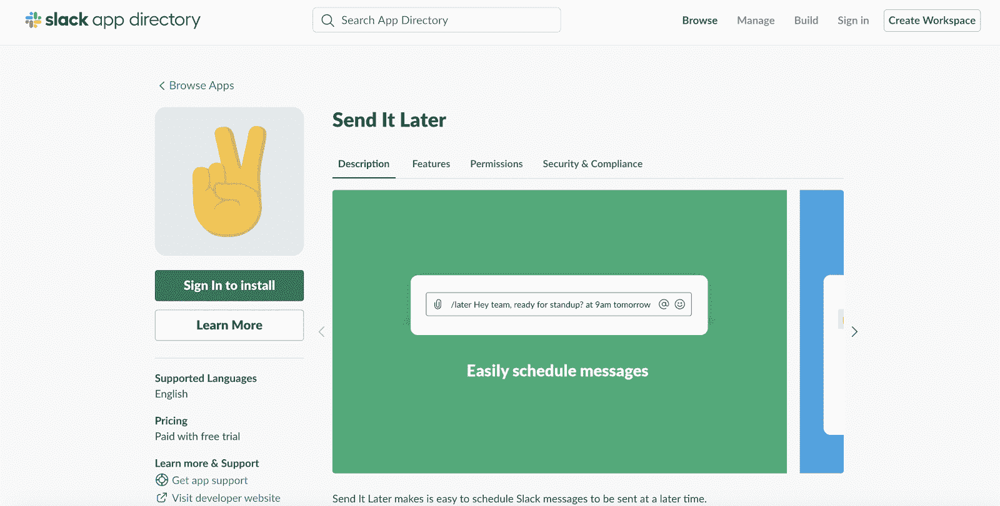

Send It Later app for Slack

[稍后发送](https://slack.com/apps/AL3SX1B6J-send-it-later)控制信息的发送时间。你有没有工作到很晚，不想打扰同事，但是真的想从你的盘子里拿点东西？

“稍后发送”允许您安排时差消息，以便在正确的时间发送。从您的 Slack 应用程序中选择消息的日期、时间、收件人和渠道。

定价:这是一个付费应用程序(每个工作空间每月 9 美元起)，提供为期两周的免费试用。

### 生产力集成

需要帮助保持正轨吗？将你的生产力软件整合到你的空闲工作空间中，让你自己(和你的团队)专注于未来的任务。

#### 11.阿萨纳

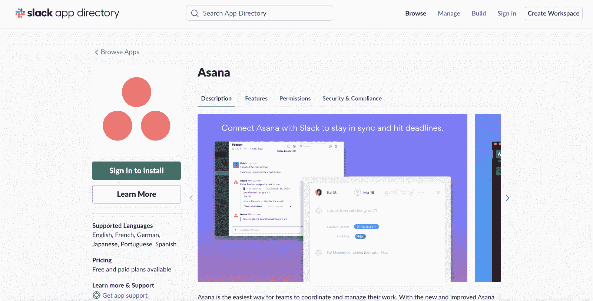

Asana app for Slack

如果[你已经在使用 Asana](https://kinsta.com/blog/trello-vs-asana/#asana) 作为你的项目管理工具，那么 [Asana](https://slack.com/apps/A01734836JY-asana) Slack integration 将帮助你保持所有任务的一致性。

有了这个应用程序，你可以将一个松弛的消息请求转化为一个体式任务，直接将消息添加到软件中，并在发生变化时接收更新。所有这一切都没有留下一丝懈怠。

定价:这种集成是免费的。

#### 12.特雷罗

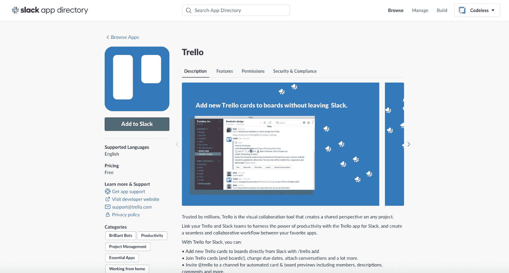

Trello app for Slack

如果你是一个特雷罗用户，这里有一个 T2 的特雷罗松弛集成。该应用程序使您的团队能够在 Slack 中获得所需的可见性，以准确了解他们在产品构建中的位置。

此外，只需点击几下鼠标，您就可以创建协作工作区、向您的论坛添加新卡、调整截止日期以及向特定的 Trello 论坛添加 Slack 成员。

定价:这种集成是免费的。

#### 13.开源代码库

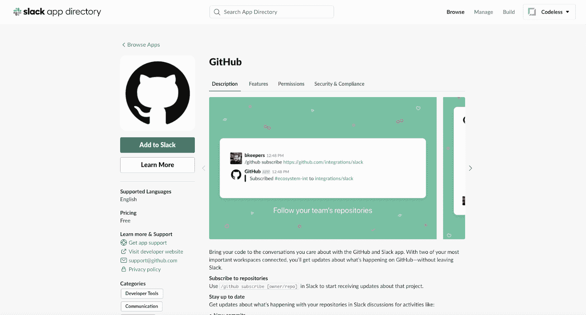

GitHub app for Slack

如果你的公司[使用 GitHub](https://kinsta.com/blog/bitbucket-vs-github/#github-overview) 作为它的首选代码库， [GitHub](https://slack.com/apps/A8GBNUWU8-github) 的集成使你的团队无需离开你的空闲工作空间就能访问你需要的信息。有了它，您只需点击几下鼠标，就可以看到提交、拉取请求、问题、代码审查以及所有部署的状态。

这有助于在事件发生时对其进行分类，并减轻这些事件的负面影响。

定价:这种集成是免费的。

#### 14.用于工作流构建器的 Google 工作表

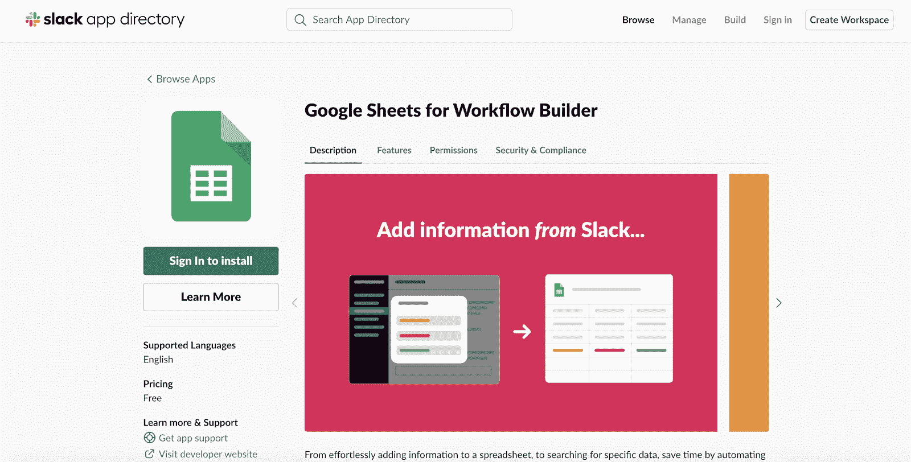

Google Sheets for Workflow Builder app for Slack

[Google Sheets for Workflow Builder](https://slack.com/apps/A01AWGA48G6-google-sheets-for-workflow-builder)自动执行 Slack 中的任务，并将其格式化为新的 Google Sheet 文档供您使用。它提供了一种简单的方法让你在空闲时自动完成日常任务，这样你就不必浪费时间在谷歌表单中输入数据或理解数据。

该应用程序使您能够在不离开工作空间的情况下添加、选择、更新或删除电子表格行。

定价:这种集成是免费的。

需要一个给你带来竞争优势的托管解决方案吗？Kinsta 为您提供了令人难以置信的速度、一流的安全性和自动伸缩功能。[查看我们的计划](https://kinsta.com/plans/?in-article-cta)

### CRM 集成

需要访问您的最新机会吗？不要浪费时间。通过这些 CRM 集成，您将能够立即获得潜在客户信息。

#### 15.销售力量

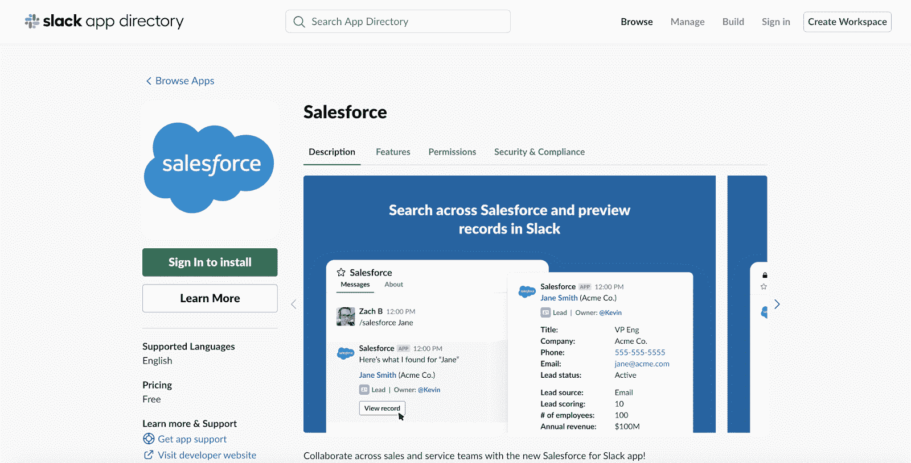

Salesforce app for Slack

[Salesforce](https://slack.com/apps/AKGPGUFP1-salesforce) 集成提高了您的交易流程、销售线索和开放机会的透明度。

通过这种集成，您将能够让每个人都在同一页面上。您可以查看特定 Slack 渠道中的 Salesforce 记录，并将 Slack 中发生的客户互动或内部备忘录与其在 Salesforce 中的指定帐户同步。

定价:这种集成是免费的。

#### 16.轮毂点

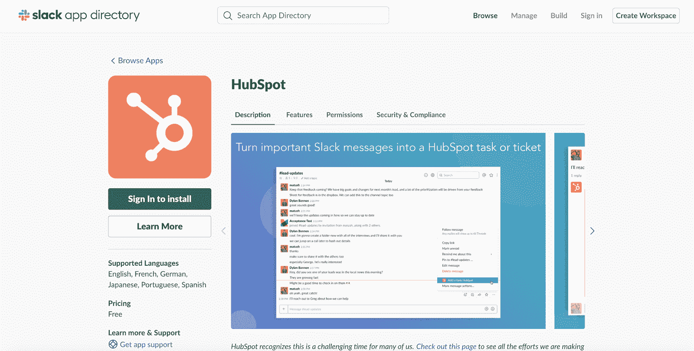

HubSpot app for Slack

[HubSpot](https://slack.com/apps/A9RRCCG73-hubspot) 是一个一体化营销平台，可以帮助您掌握销售和营销机器的方方面面。

通过这种集成，您可以在 HubSpot 中将一条 Slack 消息转化为一个新的机会，并直接在 Slack 窗口中回复您网站上的聊天内容。

HubSpot 的 Slack 集成让您可以完成所有工作。从访问您的实时聊天到通过营销中心、销售中心和服务中心的工作流发送通知，您将能够更新、查看和了解您手头的开放机会的各个方面。

定价:这种集成是免费的。

#### 17.概念

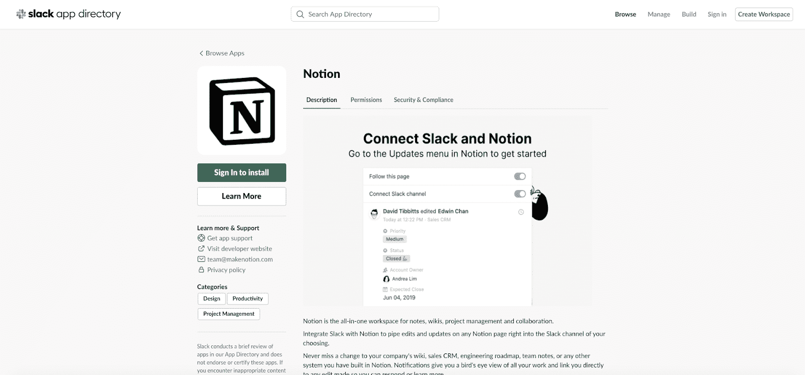

Notion app for Slack

有了[概念](https://slack.com/apps/A0VK5EP7Z-notion)的松散集成，你所有的笔记、维基、客户数据、线索等等都将唾手可得。具体来说，您将收到对您的概念文档和页面所做的任何更改或编辑的通知，以确保您始终对正在进行的工作有一个完整的视图。

此外，您可以在 Slack 工作区中更改或编辑任何概念页面，包括 CRM、路线图或注释。

注意:你需要按照本页上的[说明，让 Slack 和 idea 进行交流。](https://www.notion.so/Integrate-with-Slack-46d081bdacdb4269aed1333bb195addb)

定价:这是一个免费的应用程序。

### 存储和管理集成

通过将集成连接到您的空闲工作空间，消除简单管理任务的麻烦，让您的生活更加轻松。

#### 18.Google Drive

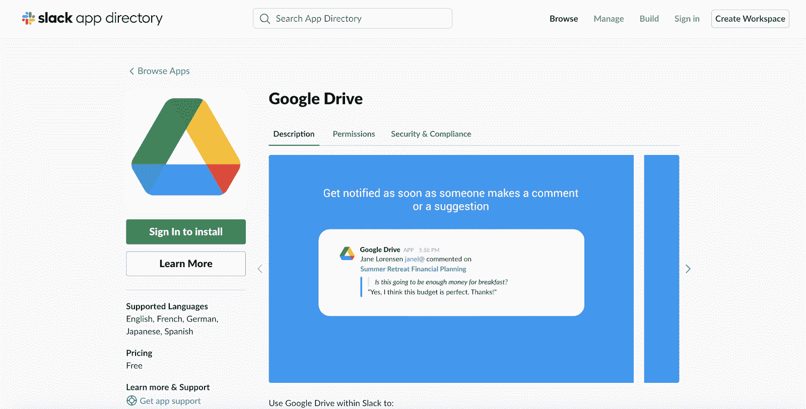

Google Drive app for Slack

在 Kinsta，我们非常依赖 [Google Drive 和 Google Workspace](https://kinsta.com/blog/saas-products/#7-g-suite-email--collaboration-tools) 。对我们(以及所有使用 Drive 的公司)来说幸运的是， [Google Drive](https://slack.com/apps/A6NL8MJ6Q-google-drive) 集成将你保存的文件带到了你的 Slack 工作区的最前面。当有人编辑您的文档、请求访问或共享文件链接时，集成会发布一条新消息。

不喜欢有人评论时打开谷歌文档的想法？现在，你可以在 Slack 中直接回复这些评论。您的回复将自动显示在文档中。

定价:这种集成是免费的。

#### 19.OneDrive 和 Sharepoint

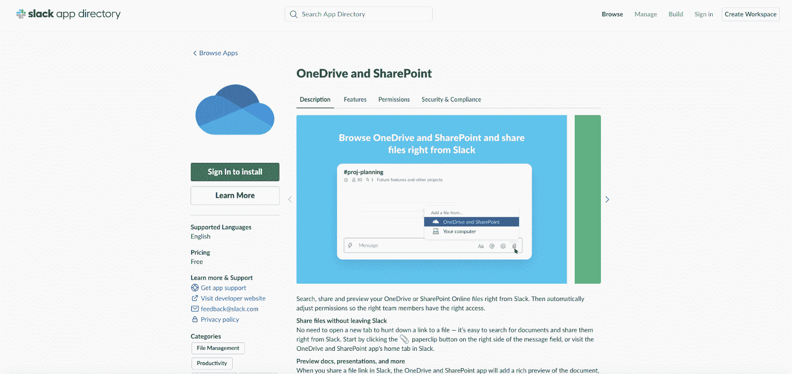

OneDrive and Sharepoint app for Slack

OneDrive 和 SharePoint 的集成消除了为与同事分享而挖掘文件和复制链接的麻烦。相反，您可以直接在 Slack 中定位和共享您的文件，并调整访问控制来管理谁可以查看和编辑它们。

最好的部分是:这种集成将确保频道中的每个人都可以在共享文件时访问它。没有更多的时间浪费在调整设置上！

定价:集成是免费的。

#### 20.Dropbox

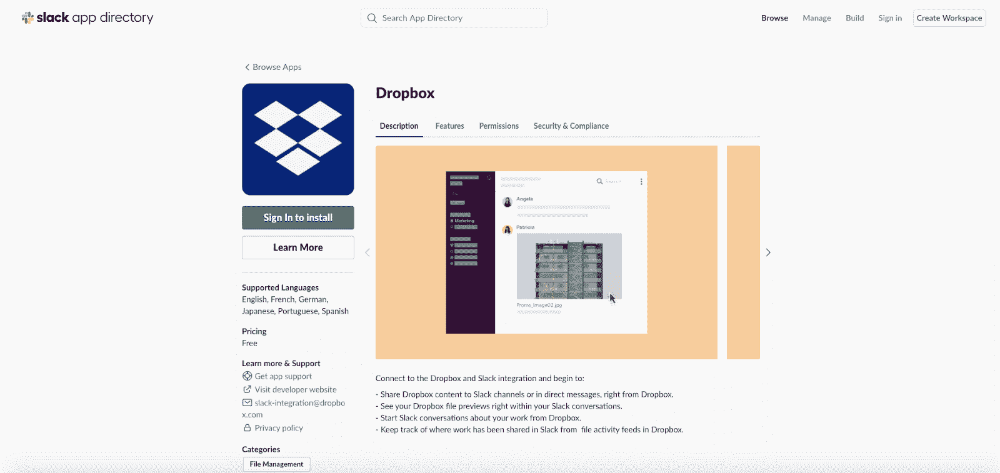

Dropbox app for Slack

[Dropbox](https://slack.com/apps/AES7B2V7D-dropbox) 提供了一个松散的集成，让你可以在工作区内直接轻松访问所有的 Dropbox 文件。您可以毫不费力地在 Slack 界面中与团队的其他成员分享这些内容。

此外，这种集成还提供了 Slack 对话中的文件预览和活动提要，因此您可以了解谁在访问您的文件以及这些文件是如何被共享的。

定价:这种集成是免费的。

#### 21.箱子

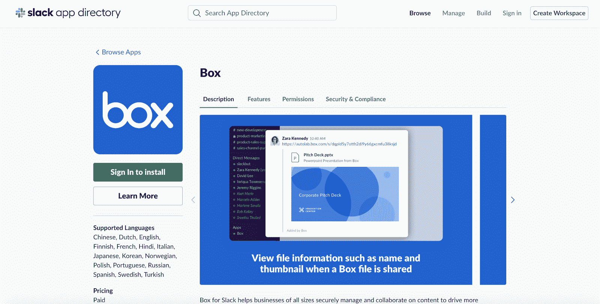

Box app for Slack

由于 [Box](https://slack.com/apps/ALQ9XG76D-box) 的集成，你的 Box 文件将被导入 Slack，这样你就可以查看并与同事和团队成员分享你需要的一切。

框集成的额外好处是易于访问和编辑。事实上，您导入的文件会自动实时更新，从而方便您访问、更新和共享保存到您的在线存储提供商的文件。

定价:这种集成是免费的。

#### 22.你好啊

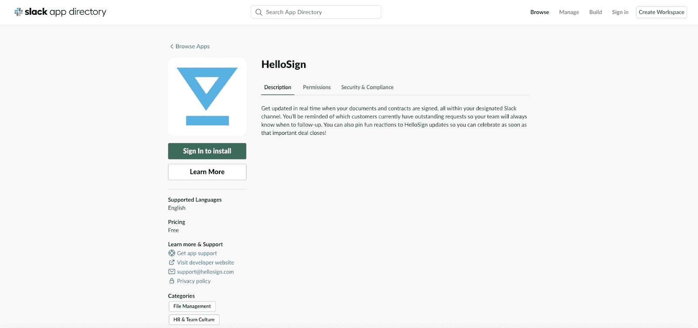

HelloSign app for Slack

[HelloSign](https://slack.com/apps/A08Q84QDV-hellosign) 提供了一个松散的集成，帮助您与所有需要签名的合同和文件保持同步。当你的一份合同签署后，你会在 Slack 中收到通知。

这将帮助您跟踪哪些客户、合作伙伴或员工需要签署他们的合同，以便您的团队可以适当地跟进。

定价:这种集成是免费的。

### 远程工作集成

#### 23.迪斯科舞厅

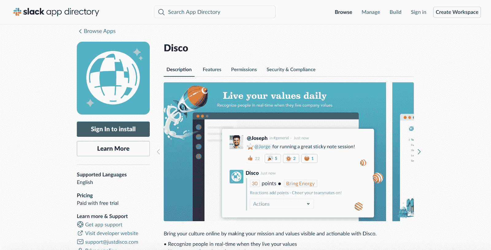

Disco app for Slack

有时，公司文化和员工参与度的努力可能会半途而废。有了 [Disco](https://slack.com/apps/A0DV3EEN4-disco) ，你可以对员工的情绪、成功和成就保持数据驱动的脉搏，这样你们就可以一路庆祝。

有了它，您可以实时庆祝您的员工，发现员工趋势，并分享团队统计数据和成功。

定价:这是一个带免费试用的付费集成(每个员工每月 3 美元起)。

#### 24.织布机

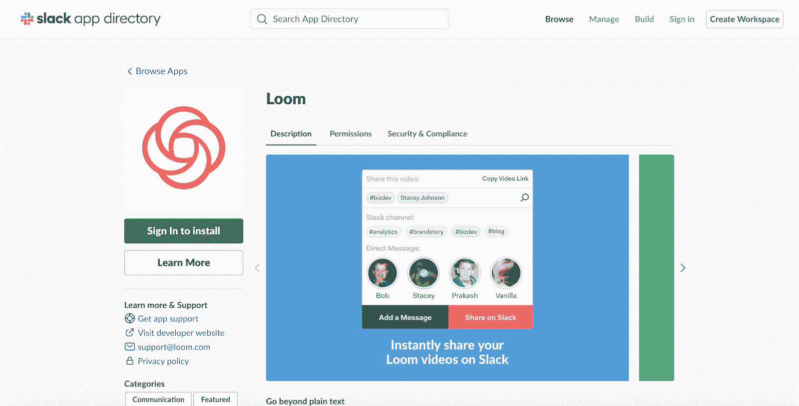

Loom app for Slack

[Loom](https://slack.com/apps/A9G1TH4S2-loom) 通过向同事发送录音来提供反馈、解释项目或传递信息，帮助你超越纯文本写作。Loom 的集成使得所有这些都可以在 Slack 中实现。

使用 Loom 应用程序，您可以查看 Loom 视频，检查视频时间戳以将用户引导至特定时刻，并提及需要查看视频的频道或用户。

定价:这种集成是免费的。

#### 25.涂鸦机器人

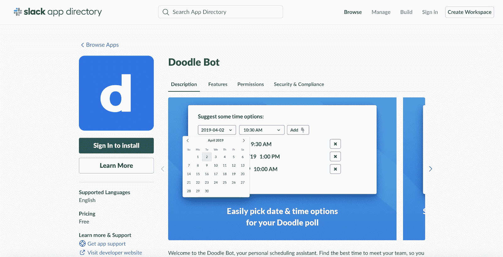

Doodle Bot app for Slack

涂鸦机器人省去了来回寻找一个对双方都有利的会面或聚会时间的麻烦。

有了这个 Slack 应用程序，每个人都可以建议或选择对他们最合适的时间。您将能够看到其他人选择的内容，并找到获胜的时间段进行会面。

定价:这种集成是免费的。

[Wouldn’t it be great if everything from your calendar app to your CRM could communicate, making it easier for you to know what’s happening across the board? 📊 Check out these easy Slack integrations to make it happen👆Click to Tweet](https://twitter.com/intent/tweet?url=https%3A%2F%2Fbit.ly%2F3p82lJv&via=kinsta&text=Wouldn%E2%80%99t+it+be+great+if+everything+from+your+calendar+app+to+your+CRM+could+communicate%2C+making+it+easier+for+you+to+know+what%E2%80%99s+happening+across+the+board%3F+%F0%9F%93%8A+Check+out+these+easy+Slack+integrations+to+make+it+happe...&hashtags=WFH%2CProductivity)

## 摘要

Slack 是一个有用的沟通工具，可以改善你的工作日，提高你的效率，促进同事之间更好的沟通。

然而，为了最大化使用 Slack 的好处，您需要定制您的工作场所。

为了实现这一点，Slack 的应用程序目录和我们选择的 Slack 集成列表是开始研究的好地方。有了它们，你可以在不离开空闲时间的情况下完成更多的工作。

现在轮到你了:你认为哪些 Slack 应用和集成是必备的？请在评论中告诉我们！

* * *

让你所有的[应用程序](https://kinsta.com/application-hosting/)、[数据库](https://kinsta.com/database-hosting/)和 [WordPress 网站](https://kinsta.com/wordpress-hosting/)在线并在一个屋檐下。我们功能丰富的高性能云平台包括:

*   在 MyKinsta 仪表盘中轻松设置和管理
*   24/7 专家支持
*   最好的谷歌云平台硬件和网络，由 Kubernetes 提供最大的可扩展性
*   面向速度和安全性的企业级 Cloudflare 集成
*   全球受众覆盖全球多达 35 个数据中心和 275 多个 pop

在第一个月使用托管的[应用程序或托管](https://kinsta.com/application-hosting/)的[数据库，您可以享受 20 美元的优惠，亲自测试一下。探索我们的](https://kinsta.com/database-hosting/)[计划](https://kinsta.com/plans/)或[与销售人员交谈](https://kinsta.com/contact-us/)以找到最适合您的方式。