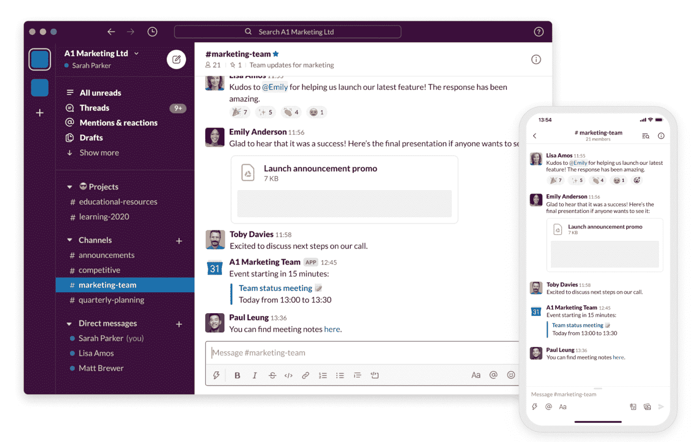
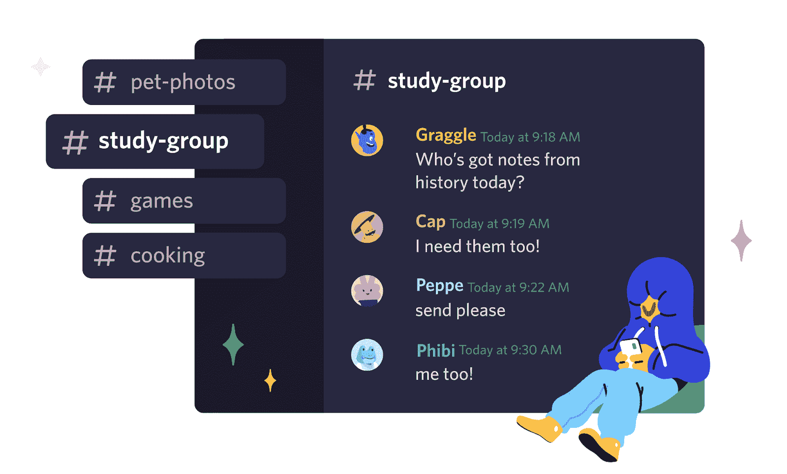
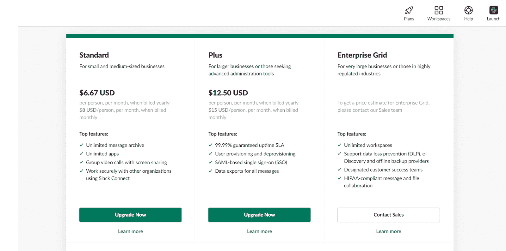
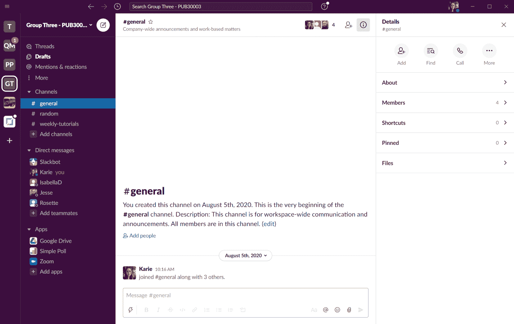
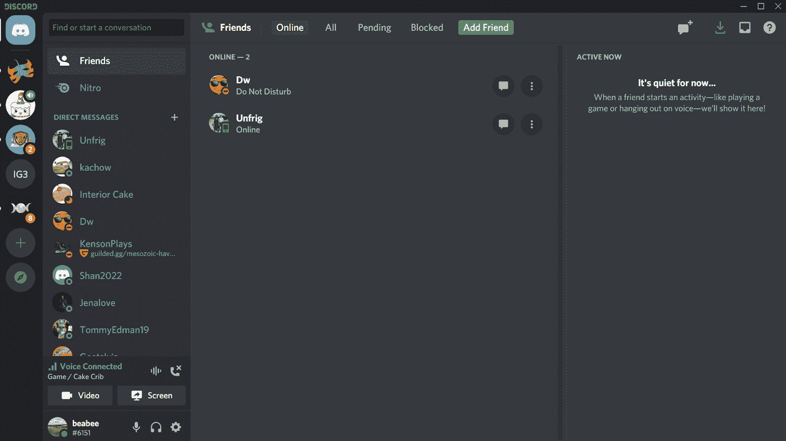
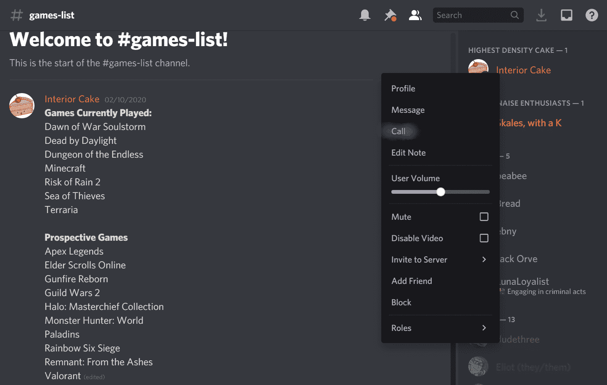
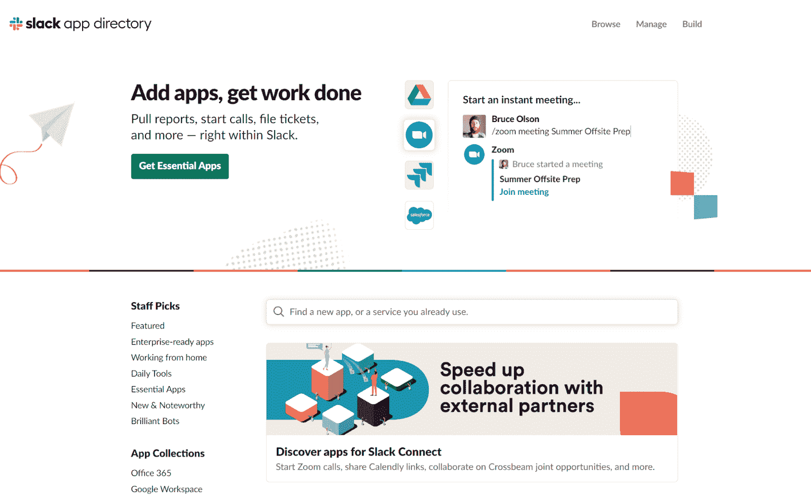
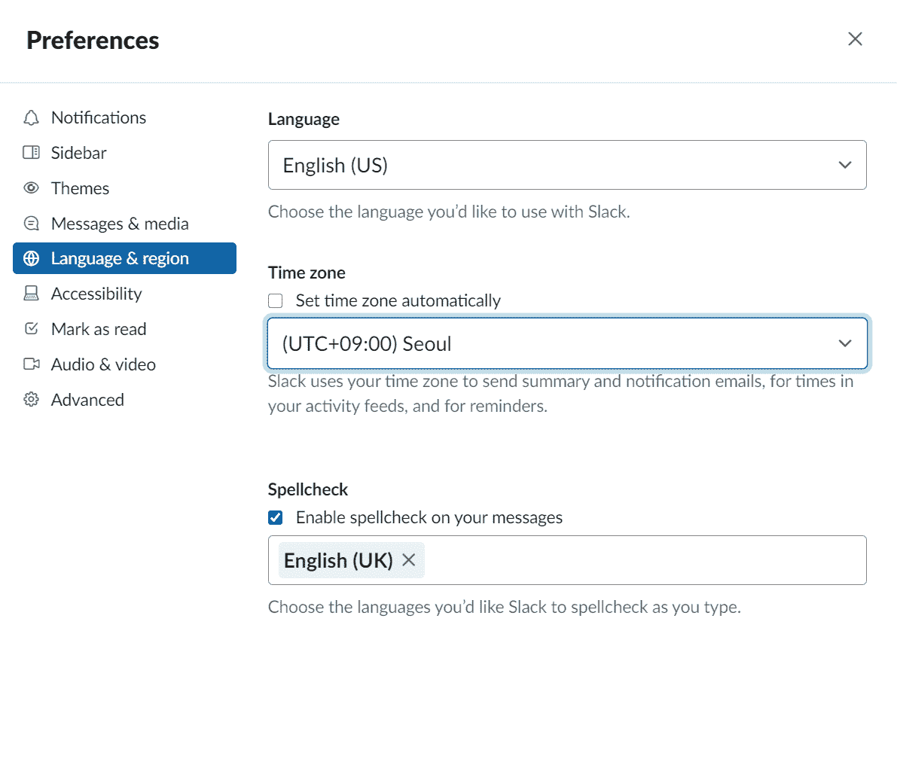
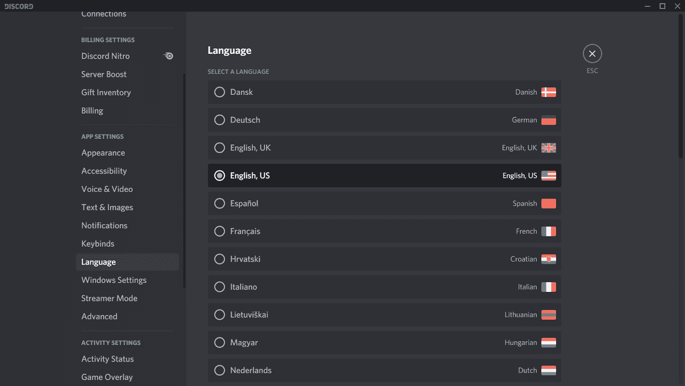

# Slack vs Discord:哪个聊天 App 更适合你的团队？

> 原文：<https://kinsta.com/blog/slack-vs-discord/>

随着[远程工作](https://kinsta.com/blog/working-remotely/)在全球范围内的增加，选择合适的消息应用程序已经成为一项关键的商业决策。你不会想错的。当企业想到“消息应用”时，他们通常会直接比较两个行业巨头的利弊:Slack vs Discord。

选择合适的聊天应用程序，您将加快团队沟通，并在团队成员之间搭建桥梁。但是如果你选择了错误的聊天应用，你很快就会回到起点。

这就是我们将在这篇文章中探讨的。

让我们开始吧！

## 懈怠和不和谐的区别？

Slack 和 Discord 都是为团队设计的基于渠道的消息传递工具。在这两个应用程序中，您可以通过直接消息、私人群组和聊天室进行交流。

懈怠和不和谐之间的许多相似之处会让你很难在它们之间做出选择。两者都提供免费和付费计划，有视频聊天和语音聊天选项，并允许用户共享文件。自然，这两款应用都非常适合小型、中型和大型团队。

然而，懈怠和不和谐之间也有许多不同之处。我们也将深入研究这些应用，但在我们详细比较这些应用之前，让我们先来看看每个应用的故事。

> Kinsta 把我宠坏了，所以我现在要求每个供应商都提供这样的服务。我们还试图通过我们的 SaaS 工具支持达到这一水平。
> 
> <footer class="wp-block-kinsta-client-quote__footer">
> 
> 
> 
> <cite class="wp-block-kinsta-client-quote__cite">Suganthan Mohanadasan from @Suganthanmn</cite></footer>

[View plans](https://kinsta.com/plans/)

[你是团队懈怠还是团队不和？💥 点击推文](https://twitter.com/intent/tweet?url=https%3A%2F%2Fkinsta.com%2Fblog%2Fslack-vs-discord%2F&via=kinsta&text=Are+you+Team+Slack+or+Team+Discord%3F+%F0%9F%92%A5&hashtags=Slack%2CDiscord)

### 松弛的

Slack 在桌面和移动设备上的平台。

斯图尔特·巴特菲尔德的公司 Tiny Speck 创建了 Slack，作为开发视频游戏“Glitch”的开发者的内部团队交流工具 Slack 的创造者随后在 2013 年向公众推出了它。

五年后，Slack 的开发商 Slack Technologies 通过直接公开募股 195 亿美元将公司上市。Salesforce 在 2021 年 1 月以[277 亿美元](https://slack.com/intl/en-au/blog/news/salesforce-signs-definitive-agreement-to-acquire-slack)收购 Slack 后，现在拥有该公司。

如今，Slack 拥有超过[1200 万日活跃用户，](https://slack.com/intl/en-au/about)其中超过 119，000 人是付费用户。团队目前在 65 家财富 100 强公司使用 Slack，包括塔吉特、松下和 21 世纪福克斯。

当人们第一次[被介绍给 Slack](https://kinsta.com/blog/how-to-use-slack/) 时，他们最大的疑问围绕着 Slack 这个不寻常的名字。“Slack”这个名字是首字母缩写，代表“所有对话和知识的可搜索日志”

现在，来谈谈不和谐！

### 不调和

Discord 是一款强大的消息应用，方便个人或专业人士使用。

Jason Citron 和 Stan Vishnevskiy 通过他们的公司 Hammer & Chisel 发展了 Discord，该公司后来更名为 Discord Inc .

Discord Inc .创建了 Discord，作为用户在用互联网协议语音(VoIP)软件玩游戏时分享策略的工具。该公司在 2015 年向公众发布了 Discord，全球的游戏玩家立即接受了它。

与 Slack 不同,“不和谐”这个名字并不是首字母缩写。根据 Citron 在 Reddit 上发布的帖子，他和 Vishnevskiy 选择了 Discord 这个名字，因为它“[听起来很酷，而且与交谈有关](https://blog.discord.com/2015-05-21-ama-transcript-3968de391c53)

如今，Discord 在全球拥有超过 1 . 4 亿用户。这些用户一起通过 1900 万台 Discord 服务器进行通信。Discord 服务器将用户聚集在一起，讨论从游戏设计到生产力到网络和应用程序开发的任何事情，因为 Discord 的用户群有着不同的品味。

### 信息

你知道有一个 [Kinsta Discord 服务器](https://discord.gg/stT5Azcqwp)吗？这是一个寻找和讨论各种开发和托管项目的好地方！

从初学者到专家，我们邀请并鼓励每个人[加入我们的 Discord 服务器](https://discord.gg/stT5Azcqwp)并开始今天的聊天。

2021 年，Discord Inc .仍然拥有 Discord，它作为一家私营公司运营。

### 懈怠与不和谐:如何比较它们

由于 86%的员工认为工作场所的失败是由于无效的沟通或缺乏协作，选择正确的信息对良好的团队沟通至关重要。

选择正确的沟通工具还将:

*   帮助您的团队更快地沟通
*   减少沟通失误
*   培养开放沟通的文化
*   建立对等关系
*   帮助您更智能地工作

尽管它们看起来很相似，但不和谐和懈怠在几个方面却有着惊人的不同。

在比较两者时，重要的是考虑它们的优势和劣势，以选择最适合您需求的应用程序。

让我们从定价计划开始比较。

## 定价

Slack 和 Discord 使用免费增值定价模式，让用户在免费计划或具有额外功能的更高级选项之间进行选择。在这一部分，我们将对两者的定价进行细分。

### 松弛的

Slack 提供许多付费计划。

Slack 提供了四种付费定价方案:Slack Free、Slack Standard、Slack Plus 和 Slack Enterprise Grid。以下是每个计划的价格和功能的简要分类:

*   **Slack Free:** 使用 Slack Free，您可以搜索您最近的 10，000 条消息，连接多达 10 个应用程序，共享文件，并使用 Slack 进行一对一的语音和视频通话。
*   **松弛标准:**松弛标准按年计费时每人每月 6.67 美元，按月计费时每人每月 8 美元。Slack Standard 包括所有免费功能，加上无限制的消息搜索、无限制的应用程序和 Google sign-on。
*   **Slack Plus:** Slack Plus 按年计费时每人每月 12.50 美元，按月计费时每人每月 15 美元。它包括所有空闲和空闲标准功能，加上 99.99%保证正常运行时间 SLA、用户配置和取消配置以及数据导出。
*   Slack Enterprise Grid:Slack Enterprise Grid 适用于医疗保健等受到严格监管的行业中的大型企业。松弛企业网格的定价是特定于组织的。它包括 Slack 的所有其他功能，加上符合 HIPAA 的消息传递、[数据丢失预防措施](https://kinsta.com/help/disaster-recovery/)，以及无限制的工作空间。

### 不调和

Discord 的特色是一个免费计划和两个付费选项。

不和谐提供三种定价方案:不和谐免费，不和谐硝基，不和谐经典。以下是每个计划价格及其内容的简要概述:

*   **无不和谐音:**有了无不和谐音，您可以获得无限的消息、最多八个人的视频会议以及 8 MB 的文件上传。Discord 的大多数用户目前使用 Discord Free。
*   **Discord Nitro:**Discord Nitro 每月花费用户 9.99 美元，每年花费 99.99 美元。使用 Discord Nitro，您可以上传 100 MB 的文件，两次 Discord 服务器升级，自定义表情符号，个人资料，高清视频功能，屏幕共享，以及直播。
*   **Discord Classic:**Discord Classic 每月收费 4.99 美元，每年收费 49.99 美元。它包括除了不和谐服务器增强所有硝基功能。

#### 赢家:不和谐

不和谐自由现在比松弛自由有更多的能力。如果你有一个小团队，不和对你来说是最划算的选择。

## 连接

一个[通讯应用](https://kinsta.com/blog/microsoft-teams-vs-slack/)的界面影响着我们与团队的互动方式。这就是为什么在做出选择之前，必须权衡不和谐与懈怠的关系。

### 松弛的

Slack 的界面简单有效。

Slack 围绕主聊天窗口构建了自己的界面。要打开群组、私人聊天、线程或空闲频道，用户可以点按屏幕左侧的按钮。

在右侧，您会注意到“Details”选项卡下的几个按钮。这些按钮允许您搜索您的信息、查找文件、开始通话以及将人添加到聊天中。

Slack 最大的优点就是简单。它的界面简洁易用，非常适合那些努力适应新软件的人。Slack 的界面也非常可定制——它有八个不同的主题供用户选择，并提供创建自定义主题的选项。

### 不调和

Discord 的界面可以以亮暗两种模式呈现。

Discord 的布局比 Slack 稍微细致一些，其界面围绕主聊天窗口构建，联系人和服务器列在左侧。在聊天窗口的右侧，您可以看到谁当前是活跃的和在线的。

不和谐有两个主题:光明和黑暗。然而，你可以下载不和谐机器人，让你进一步定制不同的字体，颜色和主题的平台。

Discord 最大的优势是它的屏幕功能。在 Discord 的主屏幕上，您可以看到服务器中任何活跃的语音或视频聊天，谁在线，以及您收到的任何新消息。

#### 赢家:懈怠

虽然 Discord 的界面很详细，但 Slack 的界面是高度可定制的，同时仍然易于任何人使用。它显然是这里的赢家。

## 文字通信

接下来，我们来对比一下 Slack 和 Discord 的文字交流能力的优劣。

### 松弛的

在 Slack 中有三个地方可以进行通信:通过直接消息传递、通道和线程。

每个组有几个松弛通道。这些频道鼓励围绕一个中心主题进行讨论，比如**#公告**。

由于聊天应用中的消息往往会堆积如山，Slack 允许你通过一个线程直接回复评论。一个线程将出现在通道内左侧的一个单独的窗口下，使它们易于跟踪。

Slack 的直接消息系统是相对标准的。你只需点击一个人的图标就可以开始私人聊天。

### 不调和

虽然 Discord 非常适合语音和视频通信，但用户仍然可以通过文本聊天和直接消息发送基于文本的消息。

Discord 上的文本聊天也是围绕类似于 **#notes** 这样的主题设计的，直接消息是相当标准的。您可以点按一个人的个人资料来开始对话。

不幸的是，Discord 的文本特性有一个相当大的缺点。由于不和谐的线程往往会变得非常繁忙，因此很容易忽略新消息。

然而，Discord 确实有一个“查看新消息”功能，这在这种情况下很有帮助。

#### 赢家:懈怠

由于 Discord 面向语音和视频聊天，它很难用于文本聊天。相比之下，Slack 的系统简单易用。懈怠获胜。

## 音频通话

如果你的团队经常使用语音通话，你会想要仔细考虑任何潜在的消息应用程序的功能。现在来对比一下 Slack 和 Discord 上的语音通话。

### 松弛的

Slack 的语音通话功能取决于您的计划。在 Slack Free 上，你可以进行一对一的语音通话。使用付费计划，您可以同时拥有多达 15 个用户。

在 Slack 中开始语音通话非常简单:

1.  导航到屏幕的右侧
2.  按下**呼叫**按钮
3.  等待其他人加入通话

### 不调和

Discord 拥有丰富的语音通话功能，最多可容纳 5000 人。

语音通话是不和谐的根源。有了 Discord Free，您的语音通话中可以包含多达 15 个用户。这使 Discord Nitro 和 Discord Nitro Classic 计划的用户增加到 5，000 人。

## 注册订阅时事通讯

### 想知道我们是怎么让流量增长超过 1000%的吗？

加入 20，000 多名获得我们每周时事通讯和内部消息的人的行列吧！

[Subscribe Now](#newsletter)

Discord 还包括一个“一键通”功能，可以自动静音，以防止电话变得无法接听。

以下是如何开始不和谐的通话:

1.  选择语音频道或用户
2.  右键单击
3.  按下**呼叫**

#### 赢家:不和谐

Discord 的语音通话功能允许您主持更多人，并通过一键通保持您的讨论正常进行。如果你需要语音通话功能，Discord 是一个明确的选择。

## 视频通话

视频通话在全球和本地团队中越来越受欢迎。虽然您可以在松弛和不和谐的情况下进行视频通话，但它们的视频通话功能是独一无二的。

### 松弛的

Slack 的视频通话功能依赖于套餐。在 Slack Free 上，你可以包含两个用户(也就是你和其他人)，但是一次最多可以有 15 个付费用户。

它的视频功能很简单，但如果用户想要高级功能，他们可以将 Zoom 集成到他们的频道中。Slack 的视频通话也支持屏幕共享，非常适合开会。

### 不调和

Discord 的视频通话功能也依赖于套餐。有了 Discord Free，可以同时视频通话八个人；付费计划的用户增加到 25 个。

Discord 的视频通话布局简单，功能丰富，包括屏幕共享、回声消除、噪音抑制和一键通。

#### 赢家:不和谐

Discord 的视频聊天功能比 Slack 更强大。Discord 允许您主持 8 到 25 人(取决于您的计划)，并为用户提供增强通话的功能。说到视频通话，它显然是赢家。

## 集成

集成是在团队即时消息中创造和谐的关键。通过集成，您可以将其他商业应用程序连接到您的聊天中，并增强 Discord 和 Slack 的功能。

现在让我们比较一下松散集成和不协调集成。

### 松弛的

Slack 的应用程序可以让你集成自己喜欢的工具。

Slack 的集成被称为“应用”。一般来说，Slack 已经将其应用程序面向生产力和工作，目前有超过 2400 个独特的应用程序可供选择:

*   谷歌日历
*   一款云视频会议软件
*   特雷罗
*   销售力量
*   谷歌工作表
*   Dropbox
*   OneDrive 和 SharePoint
*   ZenDesk
*   吉菲
*   IFTTT
*   [体式](https://kinsta.com/blog/trello-alternative/#1-asana)
*   工作日

你可以用 Slack Free 集成多达 10 个应用，并在 Slack 的付费计划中集成无限数量的应用。一些应用程序需要额外的订阅费，尽管这些都有明确的标记。

在 Slack 中添加应用只需三个步骤:

需要为你的 WordPress 站点提供超快的、可靠的、完全安全的托管服务吗？Kinsta 提供所有这些以及 WordPress 专家提供的 24/7 世界级支持。[查看我们的计划](https://kinsta.com/plans/?in-article-cta)

1.  访问 [Slack 应用目录](https://slack.com/apps)
2.  选择您想要的应用程序
3.  点击**添加到松弛时间**按钮

### 不调和

Discord 的机器人增加了额外的功能，可以由第三方用户创建。

Discord 称其集成为“机器人”。不和谐机器人是由第三方或想要特定功能的不和谐用户创建的。例如，虽然一些 Discord 机器人是为游戏设计的，但其他人通过额外的功能增强了 Discord 的语音和视频通话。

一些最受欢迎的不和谐机器人包括:

*   绝妙的
*   会议
*   简单投票
*   会议

以下是如何添加不和谐的机器人:

1.  访问 Discord 的 bot 网站 top.gg
2.  找到您想要的应用程序
3.  按下**加入不和谐**
4.  选择你想要集成机器人的不和谐服务器，点击**继续**，然后**授权**
5.  点击**欢迎**并根据屏幕上的指示定制您的机器人

#### 赢家:懈怠

Slack 显然是这里的赢家。它有更多的集成选项，并能与生产力软件顺畅地合作，这使它成为团队的理想选择。

## 文件共享

忙碌的团队需要在他们的聊天工具中共享文件。通过文件共享，您可以在几秒钟内将文档发送给整个团队，从而节省您的时间并保证文档的安全。

让我们比较一下 Slack 和 Discord 的文件共享能力。

### 松弛的

Slack 让你从两个地方分享文件: [Google Drive](https://kinsta.com/blog/google-workspace/#google-drive) 和你的电脑。从你的设备上传文件时，Slack 允许你一次共享 1 GB。

Slack 的存储能力取决于计划。使用 Slack Free，您可以存储高达 5 GB 的数据，而对于付费计划，您可以为每个用户存储高达 10 GB 的数据。

### 不调和

Discord 允许您在基于文本的渠道和直接消息中共享设备中的文件。它给每个用户无限的文件存储空间，尽管共享是非常有限的。您可以在 Discord Free 上共享高达 8 MB 的文件，在 Discord Nitro 和 Discord Nitro Classic 上共享高达 100 MB 的文件。

#### 赢家:懈怠

如果您的团队需要定期共享文件，Slack 是您的最佳选择。它允许你分享更大的文件和 Google Drive 文档。

## 支持的语言、国家和时区

这两款应用的用户遍布全球。这一部分将从支持的语言、国家和时区方面比较 Slack 和 Discord。

### 松弛的

Slack 允许你改变你的时区和语言。

Slack 在跨国团队中很受欢迎，因为这款应用在超过 150 个国家的 T2 有用户。Slack 目前有 11 种语言版本，包括:

*   中国人
*   英语(英国和美国)
*   德国人
*   法语
*   意大利的
*   日本人
*   韩国的
*   葡萄牙语
*   西班牙语(西班牙或拉丁美洲)

Slack 还可以让你轻松改变自己的语言偏好。方法如下:

1.  点击右上角的个人资料图片
2.  选择**偏好设置**
3.  点击**语言和地区**
4.  选择您的首选语言

作为一名 Slack 用户，你可以将你的应用个性化到 60 多个不同的时区。如果您打开了位置设置，Slack 还会自动为您更新时区。

Slack 还提供五种语言的本地化客户服务:英语、法语、德语、日语和西班牙语。

### 不调和

不和谐音有 28 种不同的语言。

不和谐在跨国团队中也很流行。该应用程序目前有 28 种语言版本，包括:

*   英语(英国和美国)
*   保加利亚的
*   中国人
*   克罗地亚人
*   捷克人
*   丹麦的
*   荷兰人
*   芬兰人的
*   法语
*   德国人
*   希腊的
*   印地语
*   匈牙利的
*   意大利的
*   日本人
*   韩国的
*   立陶宛的
*   挪威的
*   抛光剂
*   葡萄牙语
*   罗马尼亚的
*   俄语
*   西班牙语
*   瑞典的
*   泰国的
*   土耳其的
*   乌克兰的
*   越南人

您可以按照以下说明更改不一致的语言首选项:

1.  点按齿轮图标以打开“设置”
2.  寻找**选择一种语言**
3.  点击您的语言

与 Slack 不同，Discord 没有内置的设置让你调整时区。但是，您可以使用 [TimeZoneBot](https://top.gg/bot/437598259330940939) 不一致地更改您的时区。

#### 赢家:不和谐

虽然 Slack 的多语言客户服务很方便，但 Discord 只提供更多语言版本。如果你有一个多语言团队，不和可能对你更好。

## 松弛:利弊

Slack 对于需要一个聊天工具来工作的小团队来说是一个极好的选择。它有超过 2，400 个集成应用程序，支持高达 1 GB 的文件共享，并有八个主题选项。它还提供多语言客户服务，并在 Slack Free 中存储 10，000 条消息。

然而，Slack 将用户限制为 10 个集成和两个用户的免费通话。它也没有一键通功能。

虽然 Slack 的语音和视频通话功能过于简单，但你可以通过集成 [Zoom 的](https://kinsta.com/blog/best-tools-for-freelancers/#49-zoom) Slack 应用来升级它们。

## 不和谐:利弊

Discord 的优势在于其语音和视频通话能力。该软件支持 2 到 5，000 名用户的语音通话(取决于计划)，最多 25 人的视频通话，甚至支持增强语音和视频通话的一键通功能和机器人集成。

然而，Discord 不太适合文件共享或专业交流。文件共享在 Discord Free 上限制为 8 MB，在 Discord Nitro 和 Discord Nitro Classic 上限制为 100 MB。

Discord 的机器人也大量面向游戏，这意味着你不能通过机器人将 Discord 与[你现有的工作系统整合。](https://kinsta.com/blog/chatbot/)

## 松弛与不协调比较表

|  | 松弛的 | 不调和 |
| --- | --- | --- |
| **定价** | 

*   Relaxation free of charge
*   Standard for Relaxation ($6.67 per person per month)
*   Relaxation Plus ($14 per person per month)

 | 

*   Disharmonious and free
*   Discord Nitro Classic ($4.99 per month or $49.99 per year)
*   Discordant Nitro ($9.99 per month or $99.99 per year)

 |
| **文字交流** | 是 | 是 |
| **集成** | 支持超过 2，400 个应用 | 允许用户添加第三方机器人 |
| **积分极限** | 

*   10 free relaxation integrations
*   Unlimited relaxation standard integration and relaxation plus integration

 | 

*   unlimited

 |
| **屏幕共享** | 是 | 是 |
| **存储限制** | 

*   5gb when idle
*   10 GB per user when idle, plus when idle

 | 

*   unlimited

 |
| **文件共享** | 

*   1 GB once

 | 

*   8 MB disharmony free of charge
*   100 MB dissonant nitro and dissonant nitro classic

 |
| **纯语音频道** | 是 | 是 |
| **语音通话** | 

*   2 users per call are free of charge for relaxation time
*   Every 15 users in the call add the relaxation time standard and relaxation time.

 | 

*   Disharmonious and free
*   15 users per call Discord Nitro and Discord Nitro Classic

每次通话多达 5000 个用户 |
| **视频通话** | 

*   2 users per video on Slack
*   15 users per video on Slack

 | 

*   Call every 25 users

 |
| **一键通** | 不 | 是 |
| **主题选项** | 8 个主题选项 | 2 个主题选项(亮或暗)，加上机器人定制 |
| **消息历史记录** | 

*   10000 idle messages
*   10000 idle messages and unlimited messages

 | 

*   Unlimited message

 |
| **手机 App** | 是 | 是 |
| **支持的语言** | eight | Twenty-eight |

[随着全球范围内远程工作的增加，选择合适的消息应用程序已成为一项关键的业务决策🌏在此了解哪种服务最适合您的团队🤝](https://twitter.com/intent/tweet?url=https%3A%2F%2Fkinsta.com%2Fblog%2Fslack-vs-discord%2F&via=kinsta&text=As+remote+work+ramps+up+worldwide%2C+choosing+the+right+messaging+app+has+become+a+critical+business+decision+%F0%9F%8C%8F+Find+out+which+service+is+right+for+your+team+right+here+%F0%9F%A4%9D&hashtags=Slack%2CDiscord)

## 摘要

最终，比较懈怠和不和谐是很有挑战性的。这两款应用都很强大，易于使用，适合国际团队。每个应用程序更适合略有不同的受众。

如果你的团队需要一个基于文本的沟通工具，与你的其他工作系统集成，并支持文件共享，Slack 是更好的选择。但是如果你需要更好的语音和视频通话功能，Discord 是完美的备用选择。

关于懈怠和不和谐，你还有其他想法吗？我们想听他们说！请在下面的评论区分享。

* * *

让你所有的[应用程序](https://kinsta.com/application-hosting/)、[数据库](https://kinsta.com/database-hosting/)和 [WordPress 网站](https://kinsta.com/wordpress-hosting/)在线并在一个屋檐下。我们功能丰富的高性能云平台包括:

*   在 MyKinsta 仪表盘中轻松设置和管理
*   24/7 专家支持
*   最好的谷歌云平台硬件和网络，由 Kubernetes 提供最大的可扩展性
*   面向速度和安全性的企业级 Cloudflare 集成
*   全球受众覆盖全球多达 35 个数据中心和 275 多个 pop

在第一个月使用托管的[应用程序或托管](https://kinsta.com/application-hosting/)的[数据库，您可以享受 20 美元的优惠，亲自测试一下。探索我们的](https://kinsta.com/database-hosting/)[计划](https://kinsta.com/plans/)或[与销售人员交谈](https://kinsta.com/contact-us/)以找到最适合您的方式。