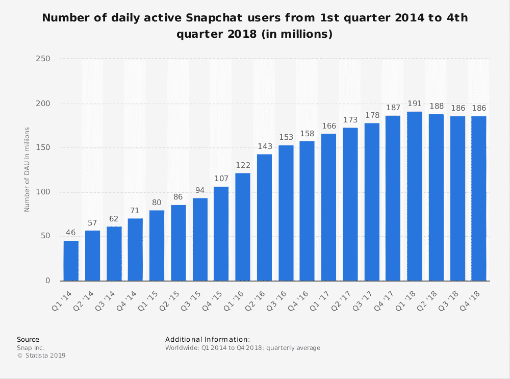
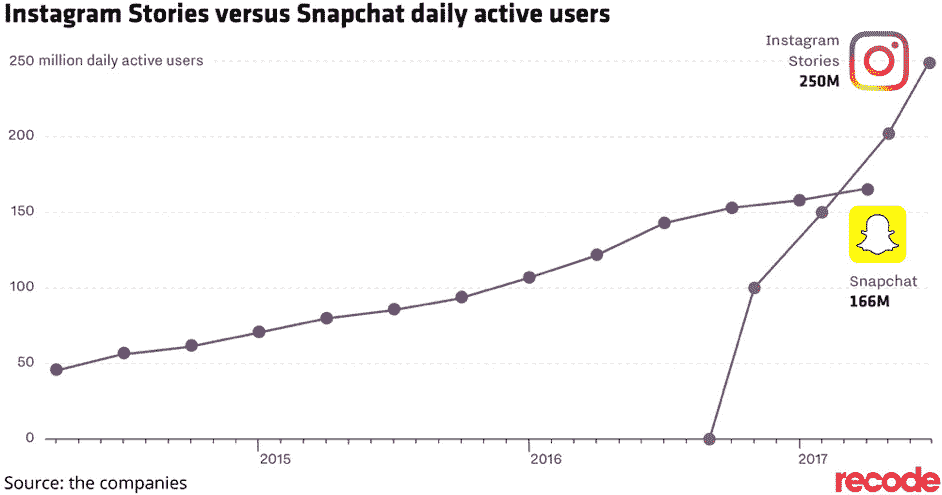
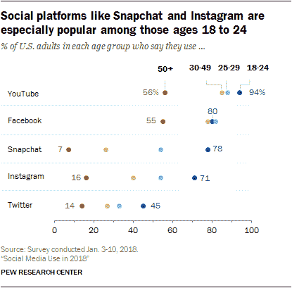
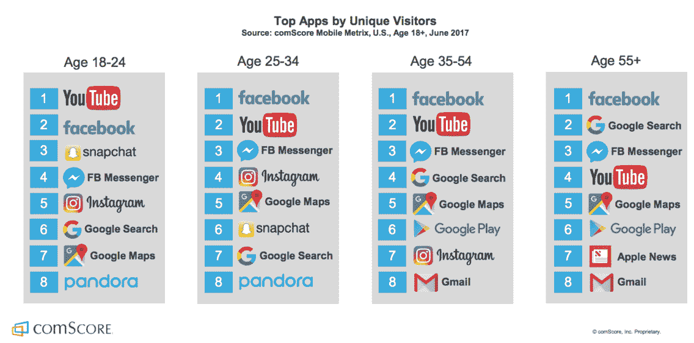
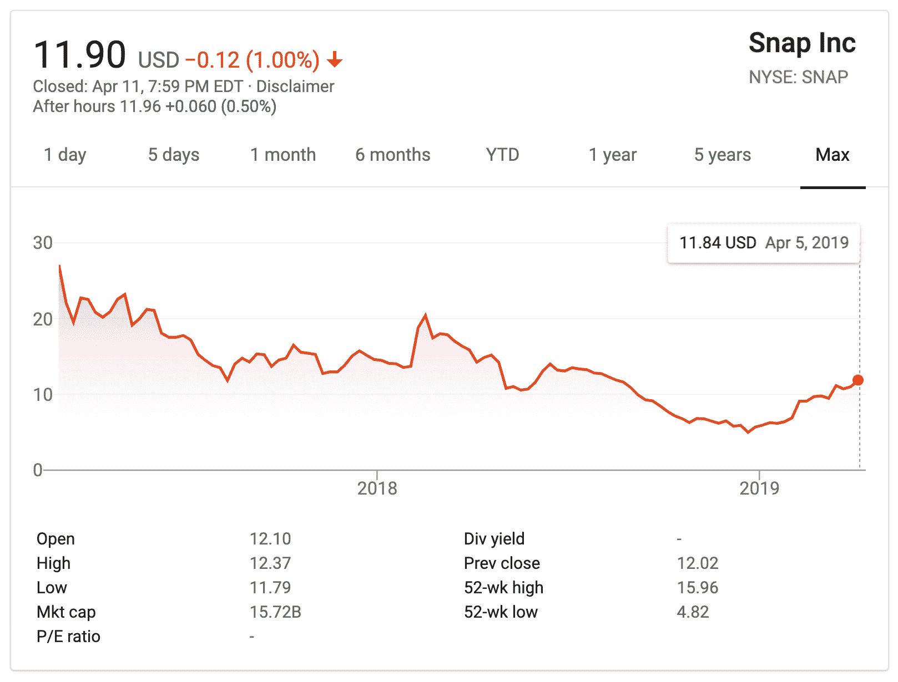
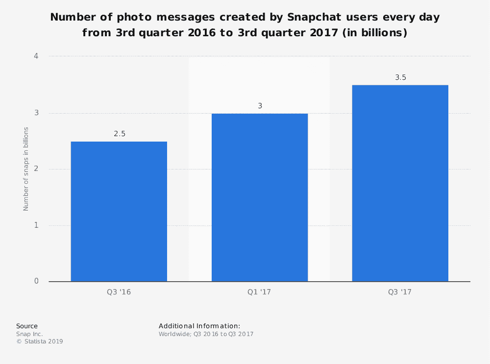
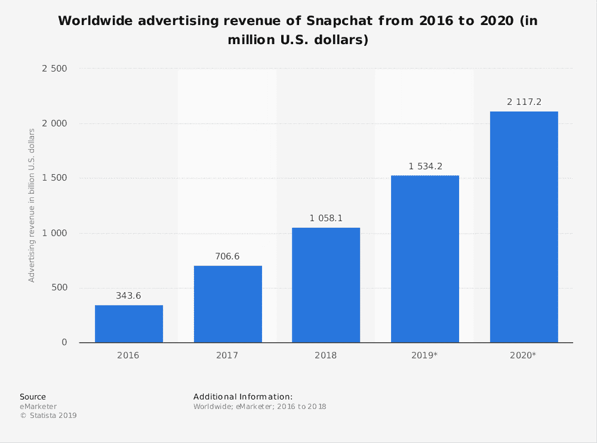
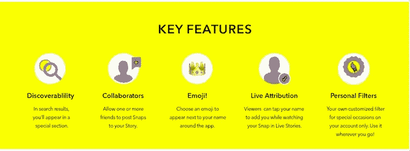
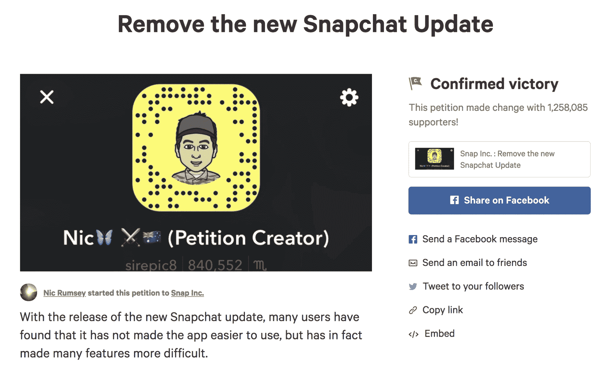

# 狂野有趣的 Snapchat 统计数据和事实(2022)

> 原文：<https://kinsta.com/blog/snapchat-statistics/>

2011 年，斯坦福大学的学生埃文·斯皮格尔、鲍比·墨菲和雷吉·布朗创建了 Snapchat，作为人们发送照片和视频的新方式。Snapchat 作为更具影响力的社交媒体平台之一的崛起，可以伴随着 Snapchat 统计数据、Snapchat 用户以及其他一些非常奇怪的 Snapchat 统计数据的增长。

布朗首先把 Snapchat 的想法带给了有商业经验的 Spiegel 和有编码经验的 Murphy。结果，这家初创公司在所有权和公司最终价值方面经历了与脸书相似的商业困境。

The three creators of Snapchat (Image source: [TechCrunch](https://techcrunch.com/2017/02/02/snapchat-reggie-brown/))

2013 年，被驱逐的布朗试图就公司所有权重新谈判他的股份，但没有收到股票。相反，[他以 1.575 亿美元的价格获得了和解，并被誉为 Snapchat 的创始人之一。](https://techcrunch.com/2017/02/02/snapchat-reggie-brown/)

当 Snapchat 于 2011 年 7 月首次推出时，它最初被赋予了一个更可爱的名字 [Picaboo](https://www.telegraph.co.uk/technology/0/owns-snapchat-created/) 。然而，到 9 月份，这个被誉为向世界介绍短暂(正在消失的)内容的社交媒体平台被更名为 Snapchat。

一开始，Snapchat 用户只能发送和接收长达 10 秒钟的照片和视频信息，超过这个时间他们就会消失。2013 年 10 月，Snapchat 推出了 Stories(脸书、T2、Instagram 和许多其他社交网络最终都将这些故事锁定并整合到他们的平台上)，这些故事 24 小时开放。与标准的消息功能不同，任何关注一个人的用户都可以查看 Snapchat 故事(假设公开共享)。

然而，也许 Snapchat 超越其最初概念的最大突破是过滤器。这些过滤器将增强现实对象引入图片，允许 Snapchat 用户炫耀胡须或礼帽(或任何数量的对现实的古怪、有趣的调整)。

谁*没给自己*过 Snapchat 花冠或者小狗耳朵？

Snapchat filters (Image source: [US Magazine](https://www.usmagazine.com/celebrity-news/pictures/celebs-love-the-puppy-dog-snapchat-filter-w200857/gigi-hadid-w200866/))

“Snapchat [不是为了捕捉传统的柯达瞬间](https://wearesocial.com/us/thought-leadership/snapchat-impermanence-stay)。首席执行官埃文·斯皮格尔解释说:“这是关于用人类的全部情感进行交流——而不仅仅是那些看起来漂亮或完美的东西。”。这一立场与 Instagram 形成了鲜明对比，insta gram 以制作展示最佳自我的个人精彩片段而闻名于世。

> Kinsta 把我宠坏了，所以我现在要求每个供应商都提供这样的服务。我们还试图通过我们的 SaaS 工具支持达到这一水平。
> 
> <footer class="wp-block-kinsta-client-quote__footer">
> 
> 
> 
> <cite class="wp-block-kinsta-client-quote__cite">Suganthan Mohanadasan from @Suganthanmn</cite></footer>

[View plans](https://kinsta.com/plans/)

此外，Spiegel 指出，消失内容是对永久留在互联网上的内容所造成的压力的一种回应。即使你把自己从脸书的照片中剥离出来，网上的任何东西总能被重新发现。

然而，Snapchat 的统计数据甚至比该公司的使命宣言更能说明问题。

## Snapchat 是谁拍的？Snapchat 用户一览

截至 2014 年第一季度，Snapchat 拥有[4600 万活跃用户](https://www.statista.com/statistics/545967/snapchat-app-dau/)，截至 2018 年第四季度，他们拥有 1.86 亿活跃用户。这是相当大的增长！

Daily active Snapchat users (Image source: [Statista](https://www.statista.com/statistics/545967/snapchat-app-dau/))

尽管用户数量的增加可能看起来很多，但实际上，自从 Instagram Stories 推出以来，Snapchat 的增长已经放缓(正如你在上面看到的), insta gram Stories 几乎是 Snapchat 的“我的故事”概念的翻版。Instagram 的用户现在发布的故事[是 Snapchat 用户](https://www.businessinsider.com/instagram-stories-400-million-daily-active-users-snapchat-2018-6)的两倍。

Instagram vs Snapchat (Image source: [Recode](https://www.recode.net/2017/6/20/15836248/instagram-stories-250-million-users-snapchat))

尽管 Snapchat 平台人口统计的准确数据因来源不同而有所不同，但所有人都认为 Snapchat 主要由 25 岁以下的用户组成。根据皮尤研究中心的数据，78%的 18 到 24 岁的美国人使用这个平台。

Snapchat and Instagram ages (Image source: [Pew Research Center](https://www.pewinternet.org/2018/03/01/social-media-use-in-2018/))

在这个年龄段，Snapchat 落后于脸书，但领先于 Instagram。

Social media apps usage age brackets (Image source: [Business Insider](http://www.businessinsider.com/fresh-data-shows-millennials-favorite-apps-and-its-bad-news-for-snapchat-2017-8))

eMarketer 预测脸书 12 至 17 岁年龄段的用户数量将下降 3.4%(这是该公司首次预测任何年龄段的脸书用户数量下降)，而 Snapchat 和 Instagram 的使用量预计将会回升。

尽管脸书仍然是社交网络世界无可争议的巨头，但一些人预测，如果没有额外的平台变化，它可能会失去抓住下一代互联网用户的机会，因为大多数千禧一代和 Z 世代主要通过视觉交流。

[Snapchat has over 186 million daily active users! 😮 Check out some stats and facts about this huge social network.Click to Tweet](https://twitter.com/intent/tweet?url=https%3A%2F%2Fkinsta.com%2Fblog%2Fsnapchat-statistics%2F&via=kinsta&text=Snapchat+has+over+186+million+daily+active+users%21+%F0%9F%98%AE+Check+out+some+stats+and+facts+about+this+huge+social+network.&hashtags=snapchat%2Csmm)

## Snapchat 统计 Snapchat 使用情况

根据皮尤研究中心的数据，63%的 Snapchat 用户每天都会访问该网站。这与 Instagram 基本相同，但远远落后于脸书，后者约有 75%的用户每天都会访问该网站。

同样，在 18 至 24 岁的人群中表现强劲，其中 82%的人每天都会查看 Snapchat，71%的用户每天会登录多次。当你把这个年龄段扩大一点，把所有千禧一代都包括进来时，结果是这些 Snapchat 用户每天在这个平台上花 40 分钟。

为了帮助推动平台上的日常互动，Snapchat 引入了“条纹”当两个 Snapchat 用户至少连续三天交换直接消息时，他们的用户名旁边会出现一个火符号和数字。通过这种方式，Snapchat 引入了游戏化元素，以鼓励用户不断登录和使用该应用。

然而，在使用方面，Instagram Stories 仍然胜过 Snapchat，更多的影响者更喜欢前者而不是后者。Instagram 继续发布故事的新更新，例如允许拥有超过 10，000 名粉丝的帐户发布故事的链接，使其成为广告商和影响者的更好平台。影响者发布的 Instagram 故事是 Snapchat 故事的两倍。

自从 Instagram Stories 推出以来，Snapchat 用户和参与度[下降了 15-40%](https://techcrunch.com/2017/01/30/attack-of-the-clone/) 。

## Snapchat 收入？更像是 Snapchat 关于金融下跌的统计数据

Snapchat 可能错过了 2013 年的套现机会，据报道，当时脸书提出以 30 亿美元收购该公司。2018 年 5 月，公司股票从他们的[原值 27.09 美元](https://finance.yahoo.com/quote/SNAP/history/?guccounter=1)/股跌至 10.95 美元/股。

以下是他们的股票从首次公开募股到本文发表之日的表现:

Snap Inc stocks

当然，在 Snap 上市之前，市场有很多上涨，首先是 Snapchat，Inc .经历了一次更名，他们在 2016 年将公司更名为 Snap，Inc. ,作为将自己重新定位为相机公司的努力的一部分。

Snap 的收入在 2017 年达到了[8.25 亿美元](https://www.nasdaq.com/symbol/snap/financials?query=income-statement)，是他们 2016 年收入的两倍多。同年 2 月，Snap 公司申请上市。然而，它没有达到公司的目标。事实上，尽管收入为 1.496 亿美元，但据[福布斯](https://www.forbes.com/sites/tomward/2017/08/03/is-snapchat-worth-the-headache/#6964e28912e9)报道，Snap 报告称，2017 年 Q1**净亏损 22 亿美元。他们在未售出的眼镜上损失了近 4000 万美元，这是他们仓促生产的，没有考虑到匹配的需求。**

在 2018 年的 Q1，Snap 的收入[增长到 2.307 亿美元](https://investor.snap.com/news-releases/2018/05-01-2018-211516272)，由于 Snap 广告的增加，增长了 54%，但由于用户拒绝重新设计，环比下降了 19%。

那么，Snap 是错过了向脸书销售的机会，还是打算继续利用年轻一代的互联网用户赚钱呢？很难说。

## Snapchat 内容是怎么回事？

Snapchat 的推介组合中的一个亮点是 Snapchat 的统计数据:92%观看品牌故事快照的人观看了整个视频。

## 注册订阅时事通讯

### 想知道我们是怎么让流量增长超过 1000%的吗？

加入 20，000 多名获得我们每周时事通讯和内部消息的人的行列吧！

[Subscribe Now](#newsletter)

目前，Snapchat 上 57%的品牌内容是视频。而且，在其最受欢迎的时候，Snapchat 达到了每天 100 亿的视频浏览量，每天有超过 30 亿的照片被发送到 T2。

3 Billion Snaps (Image source: [Statista](https://www.statista.com/statistics/257128/number-of-photo-messages-sent-by-snapchat-users-every-day/))

该公司还在继续开发该应用的游戏化方面，因为 Snapchat 用户可以在使用特定过滤器、完成特定任务、发送创意照片或在直播页面上发布视频时解锁奖杯。奖杯以表情符号的形式出现，比如太阳表情符号，如果你在 100 度的天气里发了一张照片。

但这并不是 Snapchat 对平台游戏化兴趣的全部——他们最近还推出了新的被称为“Snappables”的 AR 自拍游戏。

## Snapchat 成长:Snapchat 广告面临的逆境

自从 2014 年 Snapchat 平台开始向用户提供广告以来，Snapchat 短暂内容的前提就给广告商制造了一个障碍。

消失的内容意味着有影响力的人和营销人员不断需要[创造新的内容](https://kinsta.com/learn/content-marketing/)，不像[脸书](https://kinsta.com/blog/facebook-marketing/)和 [Instagram](https://kinsta.com/blog/instagram-stats/) 那样，内容可以很容易地被重新利用。此外，如果营销人员想要进入 Snapchat 的 Discover 页面，他们必须证明他们可以持续创作高质量的视频，这意味着他们必须提前提交一个月的内容以获得批准！

此外，Snapchat 让广告商很难确定广告的有效性，因为该公司不提供详细的分析。相反，他们使用付费的第三方分析工具，这些工具提供非常基本的信息，例如查看者的数量以及他们查看帖子的时间。

当广告商使用地理过滤器(Geofilters)时，类似的洞察力(或缺乏洞察力)是可用的，地理过滤器是基于位置围栏对所有用户可用的特殊过滤器。

Snapchat filters

尽管如此，预计营销人员将在 2019 年花费 15 亿美元在 Snapchat 广告上。作为 Snapchat 广告最受欢迎的[品牌](http://variety.com/2016/data/news/snapchat-content-survey-how-much-millennials-actually-use-live-stories-discover-and-more-1201736616/)，位居榜首的是 BuzzFeed、Comedy Central 和 iHeartRadio。

Advertising revenue Snapchat (Image source: [Statista](https://www.statista.com/statistics/603550/snapchat-worldwide-advertising-revenue/))

2018 年 5 月，Snapchat 推出了[不可抓取广告](https://www.engadget.com/2018/05/15/snapchat-unskippable-ads-arrived/)来吸引更多的广告商。然而，这些广告只出现在 Snapchat 的 Discover 部分的专业制作的节目中。这意味着只有主要的出版合作伙伴，如迪斯尼和维亚康姆，将能够利用它们。

## Snapchat 影响者呢？

虽然 Snapchat 有很多影响者，但它可能只是少数人最喜欢的平台。影响者和 Snapchat 之间的裂痕可能可以追溯到甚至在一次事件之前，一名 Snapchat 高管告诉一名抱怨 Snapchat 的[影响者，“Snapchat 是一款面向朋友的应用，而不是创造者。”](https://digiday.com/marketing/dicey-situation-snapchat-gives-influencers-cold-shoulder/)

Struggling with downtime and WordPress problems? Kinsta is the hosting solution designed to save you time! [Check out our features](https://kinsta.com/features/)

然而，Snapchat 似乎软化了自己的强硬立场，因为它见证了使用率的下降。最近，他们引进了[经过验证的影响者](https://digiday.com/marketing/snapchat-warms-social-stars-extending-verified-accounts-influencers/)。经验证的影响者可以获得官方报道，而以前只有公众人物才能获得，如蕾哈娜和凯莉·詹娜。

Snapchat key features

在很长一段时间里，有影响力的人受到和其他 Snapchat 用户一样的对待，这意味着他们只能看到他们的故事在直播时有多少人在观看。

但现在，Snapchat 也让这些影响者能够访问[分析数据](https://www.recode.net/2018/2/14/17010490/snapchat-celebrities-influencer-data-insights)，其中包括:

*   总视图数
*   独特的观点
*   完成率
*   观看时间
*   观众人口统计，包括性别、年龄、地点
*   他们的追随者关心的话题，可以是旅游、美食、时尚、运动等。

对影响者态度的改变是一个好迹象，表明 Snapchat 正在采取措施适应这种变化。在低于预期的用户增长和 22 亿美元的收入损失之后，如果他们想在持续的社交媒体平台战争中生存下来，他们真的需要加快步伐。

底线是他们需要有影响力的人来创造内容以吸引他们的观众，这反过来可以带来更多的广告商。

## 了解 Snapchat 的新功能

Snapchat 正在尽最大努力保持创新，一些想法比其他想法获得了更多的关注。

### 没有人抢购 Snapchat 眼镜

为了与相机公司的更名保持一致，Snap 发布了 Spectacles by Snap，用户可以轻松录制视频并发布到 Snapchat。

基本上，眼镜可以通过查看用户的 Snapchat 代码并按下眼镜框架上的按钮或通过蓝牙连接来链接到 Snapchat 帐户。视频存储在相机的内部存储器中，可以在 Snapchat 的“Memories”部分查看和上传。

该产品是在 Snapchat 更名为 Snap 的同时发布的。这款眼镜于 2016 年 11 月 10 日首次通过 Snapchat 总部附近的专有自动售货机 Snapbot 销售。

产品销售远低于公司预期，迫使 Snap 注销了超过 4000 万美元的未使用零件和产品。到 2018 年 5 月，仅售出 22 万双。

Snap 最近发布了 Snapchat Spectacles 2.0，似乎没有被平淡的反应所吓倒，它包括一些新功能，如支持照片功能(第一个版本只支持视频)，更轻的镜头，更薄的框架，处方选项，更多更经典的颜色选项，以及水下功能(等等)。

Snapchat spectacles

Snapchat Spectacles 2.0 在 17 个国家在线销售。

### 快照现金

2014 年，Snapchat 与 Square payments 合作提供了 [Snapcash](https://support.snapchat.com/a/about-snapcash) ，允许用户发送和接收资金。所有用户需要做的是链接信用卡或借记卡。唯一的缺点是，两个 Snapchat 账户都需要有一张借记卡与之关联，不像其他应用程序那样，可以将钱放在应用程序内的“钱包”中。用户还必须年满 18 岁才能使用该功能。

但似乎 Snapcash 是 Snap 的又一次失败。根据 [Snapchat 支持](https://support.snapchat.com/en-US/a/about-snapcash)，Snapcash 将于 2018 年 8 月 30 日后不再提供。

### Snapchat 重新设计

去年，Snap 发布了一个[新应用更新](https://metro.co.uk/2018/01/10/new-snapchat-update-2018-making-lot-people-angry-7218900/)，这对其受欢迎程度毫无帮助。事实上，这些变化对 Snapchat 用户来说太麻烦了，以至于超过一百万的用户在 Change.org 请愿反对这些变化。

Bad Snapchat update

重新设计的重点是将故事和朋友页面结合起来，这最终使用户更难重新观看故事或找到朋友。该公司还分离了 Discover 页面，以更好地展示专业制作的内容。

重新设计背后的想法是提高广告商的 Snapchat 统计数据，它做到了。事实上，Snapchat 报告称，自从重新设计以来, [publisher stories 增长了 40%](https://techcrunch.com/2018/02/06/snap-inc-earnings-q4-2017/), 35 岁以上的用户越来越多地使用该应用。

## 最后的想法:疯狂而有趣的 Snapchat 统计数据和事实

从 Snapchat 凭借三名斯坦福大学研究生的智慧和技能崛起，到数十亿美元的报价，Snapchat 的统计数据和事实提供了对该公司、其发展轨迹和用户的许多见解。

当然，还有很多有趣的事实没有出现在 Snapchat 的统计数据列表中，例如 Snapchat 的吉祥物“鬼面奇拉”(以吴唐部落的格斯特菲斯·基尔拉命名)是由布朗设计的。或者说[最长的 Snapchat 连胜记录](https://www.techjunkie.com/longest-snapchat-streak/)(截至 2018 年 7 月)是 1286。

没看到你喜欢的 Snapchat 统计？在下面的评论区分享吧！

* * *

让你所有的[应用程序](https://kinsta.com/application-hosting/)、[数据库](https://kinsta.com/database-hosting/)和 [WordPress 网站](https://kinsta.com/wordpress-hosting/)在线并在一个屋檐下。我们功能丰富的高性能云平台包括:

*   在 MyKinsta 仪表盘中轻松设置和管理
*   24/7 专家支持
*   最好的谷歌云平台硬件和网络，由 Kubernetes 提供最大的可扩展性
*   面向速度和安全性的企业级 Cloudflare 集成
*   全球受众覆盖全球多达 35 个数据中心和 275 多个 pop

在第一个月使用托管的[应用程序或托管](https://kinsta.com/application-hosting/)的[数据库，您可以享受 20 美元的优惠，亲自测试一下。探索我们的](https://kinsta.com/database-hosting/)[计划](https://kinsta.com/plans/)或[与销售人员交谈](https://kinsta.com/contact-us/)以找到最适合您的方式。