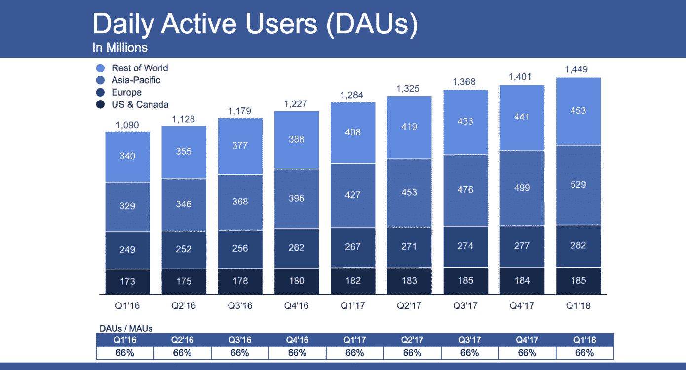
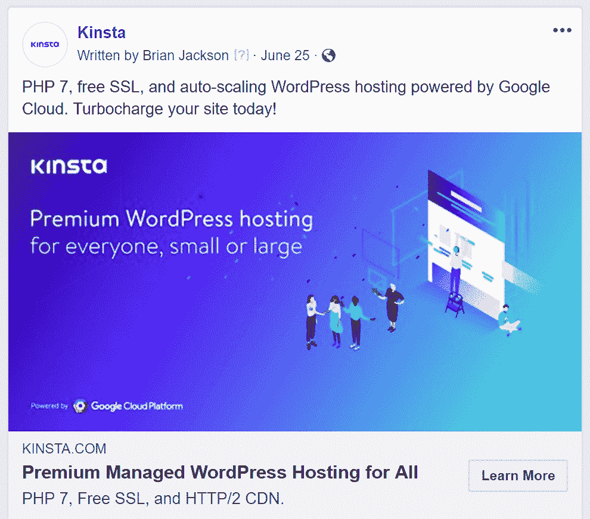
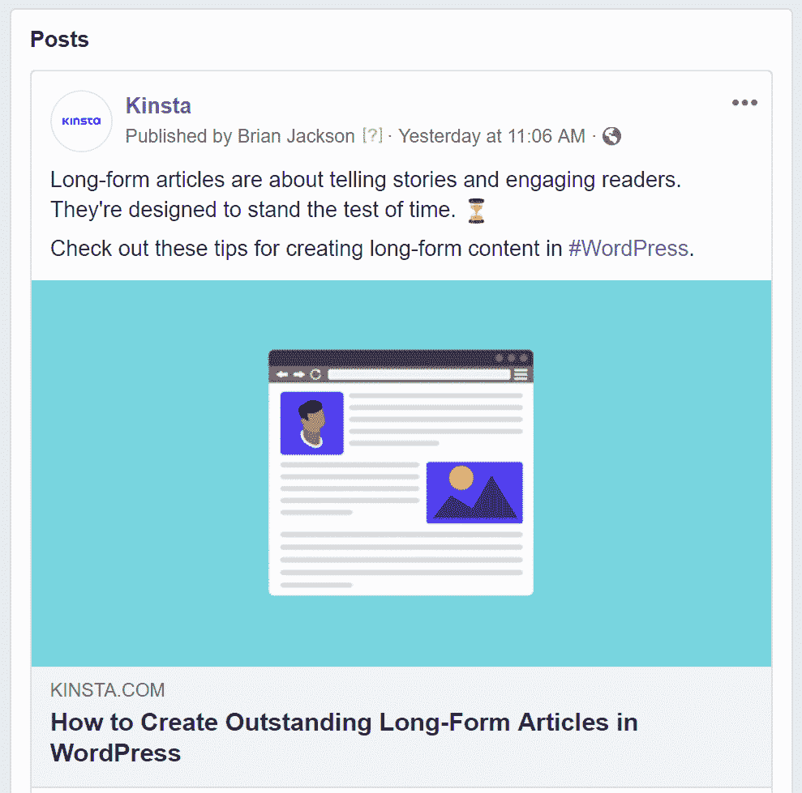
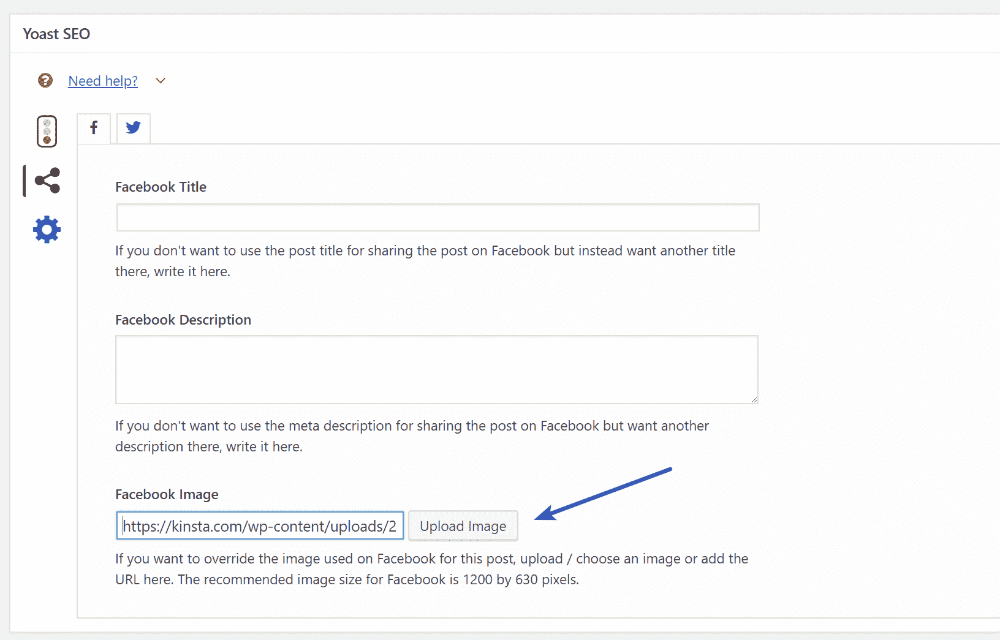
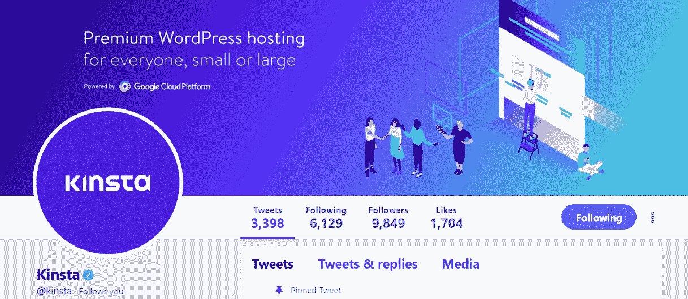

# 2022 年社交媒体图片尺寸和快速提示

> 原文：<https://kinsta.com/blog/social-media-image-sizes/>

尽管像剑桥分析/脸书事件这样的数据隐私泄露令人不安，但毫无疑问，社交媒体将继续存在。毕竟，每个人都在上面，它让每个人都保持联系，它是企业营销和销售产品的有用工具。

社交媒体的问题？噪音过饱和了！即使你有一些有用的东西要说，你如何吸引(并保持)你的听众的注意力？

使用图像可能会有所帮助。一项 Skyword 研究发现，平均而言，与没有图片的内容相比，在内容中包含图片会使页面浏览量增加 94%。认识到人们短暂的注意力持续时间(他们甚至[比金鱼的](http://time.com/3858309/attention-spans-goldfish/)还短！)，现在使用视觉图像来吸引人们的注意力变得比以往任何时候都更加重要。

## 使用正确的社交媒体图片尺寸的重要性

仅仅创建一张图片，把它上传到你所有的社交媒体上，并认为你的工作已经完成是不够的。

创建社交媒体图片并不是一刀切的事情:每个社交网络在不同的个人资料区域需要不同的图片大小。每个社交媒体网站*也*不同地裁剪和优化上传的图像，因此确定如何以展示你的品牌的最佳方式定位你的图像是很重要的(查看你的页面的[最佳图像格式](https://kinsta.com/blog/image-file-types/))。

如果你在寻找**TLDR；**关于社交媒体图片尺寸的这篇文章，想要一个懒惰的视觉营销方法，你可以在这一节之后停止阅读。根据 [Buffer](https://blog.bufferapp.com/ideal-image-sizes-social-media-posts) 的说法，尽管大多数社交网站要求不同的图片尺寸，但他们发现这些尺寸通常适用于与新闻源更新分享图片:

*   横向(水平):1024 x 512 像素
*   纵向(垂直):800 x 1200 像素

但是如果你想创造一个更好的视觉体验，并且总是能够完美呈现，看看我们经常更新的社交媒体图片尺寸指南:包括脸书图片尺寸、推特图片尺寸和其他主要社交平台的指南！

*   [脸书图像尺寸](#facebook-image-sizes)
*   [推特图片尺寸](#twitter-image-sizes)
*   [LinkedIn 图片尺寸](#linkedin-image-sizes)
*   [Instagram 图片尺寸](#instagram-image-sizes)
*   [Pinterest 图片尺寸](#pinterest-image-sizes)
*   [社交媒体图片工具](#tools-social-media-images)

## 脸书图像尺寸

[脸书](https://www.facebook.com/)是最大的社交网站，拥有超过[22 亿月活跃用户](https://techcrunch.com/2018/04/25/facebook-q1-2018-earnings/)(截至 Q1 2018 年)。

> Kinsta 把我宠坏了，所以我现在要求每个供应商都提供这样的服务。我们还试图通过我们的 SaaS 工具支持达到这一水平。
> 
> <footer class="wp-block-kinsta-client-quote__footer">
> 
> 
> 
> <cite class="wp-block-kinsta-client-quote__cite">Suganthan Mohanadasan from @Suganthanmn</cite></footer>

[View plans](https://kinsta.com/plans/)

Facebook daily active users (Image source: TechCrunch)

这是一个不可或缺的社交网站，尤其是对于那些想要接触到目标受众的企业来说:这一切都是因为脸书强大的定向广告功能。但是，即使企业不使用脸书广告(虽然他们应该！)，很难找到还没有脸书页面的企业。

以下是你需要知道的关于脸书图片在你个人资料和新闻帖子上的大小:

### 脸书封面照片

当人们访问你的脸书个人资料或页面时，你的封面照片只能被整体查看(但人们可以在脸书的其他区域看到缩略图)。封面照片比个人资料照片大，这就是为什么大多数人把他们的封面照片像横幅一样用来展示他们的品牌或身份。

脸书的封面照片在桌面上显示为 820 x 312 像素，在智能手机上显示为 640 x 360 像素。如果你上传比这个小的东西，它会被拉伸。请注意，您考虑作为封面照片的照片也有一个最小尺寸:400 x 150 像素。如果你对高分辨率显示器的质量有任何问题，你也可以尝试 1640 x 624 像素。

Facebook cover example ([Kinsta Facebook page](https://www.facebook.com/kinstahosting/))

为了获得最佳图像质量，建议:

*   将带有徽标或文本的照片保存为 PNG 文件。
*   上传一个小于 100 KB 的 sRGB JPG 文件。

### 脸书个人资料照片

您的个人资料照片是品牌的关键部分，因为它向访问您的个人或商业资料/页面的人展示了您和/或您的品牌。无论是你的个人或商业页面的个人资料照片，都必须至少为 180 x 180 像素。对于更高分辨率的显示器，我们推荐 480 x 480 像素。

当用户通过桌面访问脸书时，你的脸书个人资料照片显示为 170 平方像素，在智能手机上显示为 128 平方像素，在大多数功能手机上显示为 36 平方像素。您的个人资料照片也会以 32 平方像素的图标形式出现在整个脸书。

Facebook profile photo

如果您想将个人资料照片与封面照片的设计融为一体，请记住个人资料照片位于:

*   桌面上的封面照片左侧 16 像素，顶部 176 像素。
*   智能手机上的封面照片左侧 24 像素，底部 24 像素，顶部 196 像素。

### 脸书新闻图片

在你的新闻订阅源上分享图片是发布消息的最常见方式之一。图像(和视频)有助于抓住目标受众的注意力。

理想情况下，上传的图像应该是 1200 x 630 像素的尺寸，但是一旦上传到脸书，它们将被调整为 476 像素宽的图像。

Facebook news feed image

此外，您还需要记住以下脸书图像尺寸注意事项:

*   **方形照片**，无论你上传多大尺寸，都会显示为 **476 x 476 像素**。如果你上传的图像小于 400 像素，它会显得模糊。
*   **横向(水平)照片**将被缩放至 476 像素宽，高度也相应调整。
*   **纵向(垂直)照片**将被缩放至 476 像素宽，高度也相应调整，但最大值仅为 714 像素。

### 脸书链接图片

除了在新闻订阅上分享图片，脸书还支持图片分享链接。有两种不同的布局与此操作相关:

*   链接左侧的一个较小的正方形图像(文本在右侧)。这要求提要至少有 154 平方像素，页面至少有 116 平方像素。
*   文本片段下面的大图。这要求图像的尺寸至少为 470 x 246，页面尺寸至少为 484 x 252。

推荐的上传图片尺寸为 **1200 x 628 像素**，这与非链接生成的共享图片尺寸相差不大。

Facebook link image

你可以上传更大的图像，但脸书会缩放图像以适应这些尺寸，这意味着他们会在顶部和底部裁剪图像以适应。为了获得最佳效果，请在满足最低要求的情况下获得更大的图像分辨率。

### 脸书如何从共享链接中选择图片

当脸书选择要在链接上显示的图像时，它会查看页面上的 [Open Graph 标签](https://yoast.com/advanced-technical-seo-social-image-ogimage-tags/)，特别是 **og:image 标签。**

og:image 标签由 [Open Graph 协议](http://ogp.me/)提供支持，该协议允许网站管理员告诉第三方提供商(如脸书、Twitter 和其他社交网站)他们页面上的内容类型。它负责确定在社交媒体上共享您的内容时显示哪张照片，以及照片的外观。

请注意，每个平台在图像大小或裁剪方面显示图像的方式都不同。如果没有指定特定平台的图片，你的图片在脸书上可能看起来不错，但在 LinkedIn 上就显得很奇怪。

您可以在网站每个页面的`<head>`部分添加和编辑 og 图像标签。如果你想防止它在所有平台上看起来不一样，你可以使用像 [Yoast SEO](https://kinsta.com/blog/yoast-seo/) 或[Social war](https://warfareplugins.com/)这样的插件，它可以识别和指定你分享内容的每个平台的最佳图像(通过适当的设置)。你甚至可以用 Yoast SEO 插件手动设置每页或每篇文章的脸书图片(如下所示)。

Yoast SEO Facebook image

如果你的图像不够大或者没有合适的 og 图像标签，脸书可能不会完整显示图像或者根本不会显示图像*。发生这种情况时，您的链接显示为第一种图像类型(位于文本字符串左侧的小缩略图)。你也可以使用[脸书调试器](https://kinsta.com/knowledgebase/facebook-debugger/)来修复这个问题。
*

 *### 脸书高光图像

突出显示的图像仅出现在您的脸书页面上。脸书允许你在每次达到一个里程碑时发布亮点。图片是可选的，但由于它们看起来比共享的图片或链接要大，这是一个吸引人们注意你的成就或里程碑的好方法。

突出显示的图像在您的页面上显示为 **843 x 504 像素**，但推荐的大小是 1200 x 717 像素。

### 脸书活动图片

随着如此多的广告和帖子充斥着脸书的新闻，创建一个脸书活动将有助于吸引你的观众的注意力。除了向他们发送邀请他们参加活动的通知之外，他们还会被提醒该活动——特别是对于启用了脸书日历连接的智能手机用户。

事件图像在您的订阅源上显示为 470 x 174 像素，但建议的大小为 1920 x 1080 像素。

### 脸书集团封面图片

脸书集团封面图片可能会有所不同。对于高分辨率的脸书集团封面图像，我们建议尺寸为 **1920 x 1080** 。

Facebook group cover image

请务必查看这些额外的[脸书营销策略](https://kinsta.com/blog/facebook-marketing/)。

## Twitter 图片大小

Twitter 允许人们轻松地与他人联系(甚至是名人！)，主要用于发送和接收简短的实时更新(推文限制在 280 个字符以内)。尽管没有脸书大，Twitter 拥有[3.3 亿月活跃用户](https://blog.hootsuite.com/twitter-statistics/)。

通过使用@mentions 和#hashtags 与他人联系是可能的。当你点击一个标签或搜索一个词时，所有包含该搜索词或标签的(公开)推文都会出现。企业使用这一功能来听取用户的反馈或加入对话。

### Twitter 个人资料照片

像所有其他社交网站一样，Twitter 用户可以选择定制代表他们自己/他们品牌的个人资料照片。这出现在三个地方:

*   **您的 Twitter 个人资料**。如果不上传个人资料照片，个人资料照片区会显示一个蓝色背景的彩蛋。
*   **在 Twitter feed 上**。粉丝或通过 Twitter 搜索阅读你的推文的人可以看到你的个人资料照片。
*   **追随谁**。“关注谁”框出现在您的 Twitter 订阅源的右侧。Twitter 通常会推荐与你相似的账户，或者你可能认识的人。

Twitter 个人资料照片最小为 **400 平方像素**，最大文件大小为 2MB。它们可以是 JPG，PNG 或 GIF 格式。推荐一张正方形大小的照片，尽管 Twitter 会把它显示成一个圆圈。

Twitter profile photo

### Twitter 标题照片

这是推特上相当于脸书的封面照片，比你的个人资料照片大得多。确保你上传了高分辨率的图片。

推荐的 Twitter 头像照片大小为 **1500 x 500 像素**，最大文件大小为 5MB。不幸的是，在这些显示器上，我们注意到没有办法在更高分辨率的显示器上获得清晰的图像。

## 注册订阅时事通讯

### 想知道我们是怎么让流量增长超过 1000%的吗？

加入 20，000 多名获得我们每周时事通讯和内部消息的人的行列吧！

[Subscribe Now](#newsletter)

Twitter header photo

### Twitter 发布照片

以前，你只能在推特上一次上传一张图片，但现在，你可以在一条推特上上传多达四张照片。图片过去也包括在 Twitter 的字符数中，但幸运的是现在不再包括了。值得注意的是，有图片的推文比没有图片的推文产生了多 313%的参与度。

Twitter 图片的最小尺寸为 440 x 220 像素(2:1 宽高比)。最好的推荐尺寸是 **1024 x 512 像素**。在 Twitter 上，任何介于 2:1 和 1:1 之间的纵横比都很好。

在台式机上，图像最小显示为 **506 x 253 像素**，而 **1200 x 675 像素** (16:9 宽高比)是在移动设备上完整显示图像的理想图像尺寸(这对于台式机也非常适用)。

> Twitter[#营销](https://twitter.com/hashtag/Marketing?src=hash&ref_src=twsrc%5Etfw)增强你社交游戏的策略💪【https://t.co/qvie7tLTtlT2[# SMM](https://twitter.com/hashtag/smm?src=hash&ref_src=twsrc%5Etfw)
> 
> —金斯塔(@ Kinsta)[2018 年 7 月 4 日](https://twitter.com/kinsta/status/1014546399755718657?ref_src=twsrc%5Etfw)*