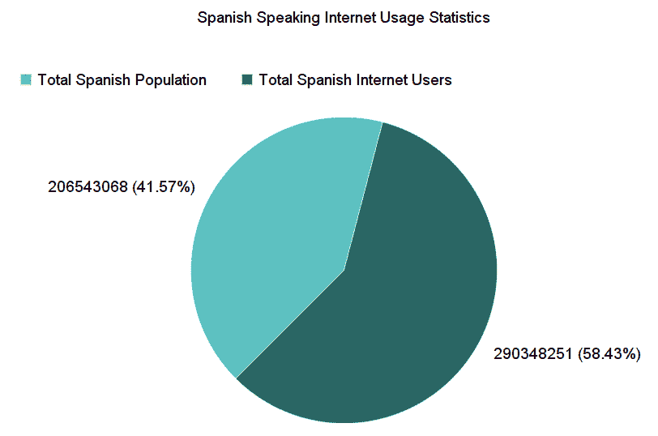
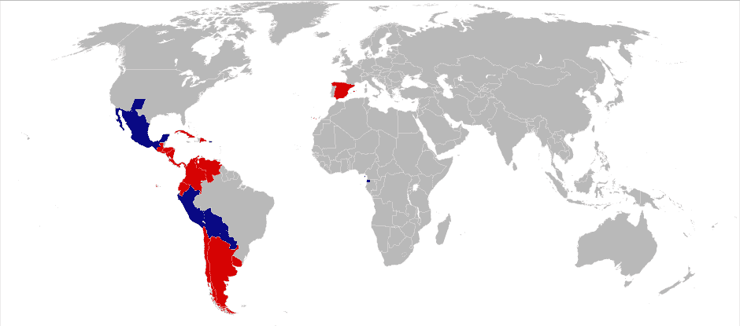
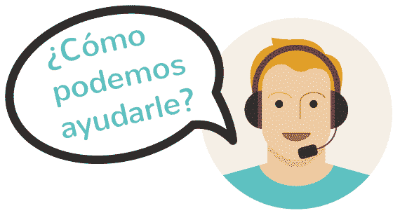
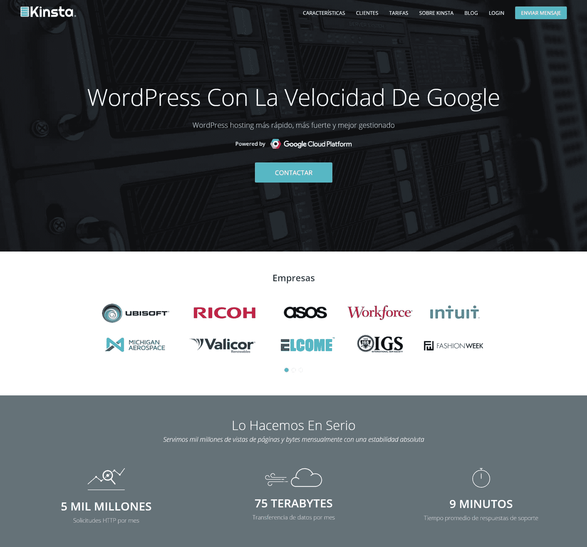
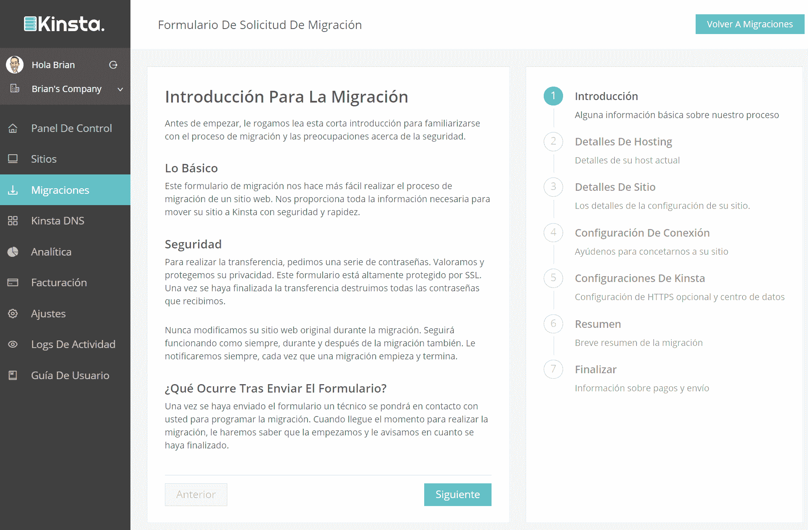

# 金士达推出西班牙托管倡议和网站

> 原文：<https://kinsta.com/blog/spanish-hosting/>

我们一直在寻找在 Kinsta 扩展的方法，所以我们很高兴宣布我们新的西班牙托管计划。为了实现这一点，已经做了大量的工作，我们很高兴最终与你们分享。这包括 Kinsta 团队中现在可以用西班牙语帮助您的成员，以及我们全新西班牙语网站的推出。你现在可以在 kinsta.com/es/查看。这将有助于我们把我们的主机服务带给全球更多使用母语的人。

## 金斯塔的西班牙托管倡议

世界上有数百种语言，但以下是我们选择推出西班牙语托管计划的几个原因，以及 Kinsta 西班牙语团队现在可以为您的网站提供帮助的其他方式。

### 1.大量西班牙语网站和用户

根据 W3Techs 的数据，截至 2016 年 11 月， [WordPress 现在为所有网站的 27%](https://w3techs.com/technologies/details/cm-wordpress/all/all) 提供支持。并且**超过 [5%的网站](https://w3techs.com/technologies/overview/content_language/all)** 使用西班牙语。虽然这听起来不是很多，但我们谈论的是成千上万的网站！像 YouTube.com、Facebook.com、Yahoo.com、Twitter.com，甚至 WordPress.com 这样的大网站都有西班牙语版本的网站，他们利用这些网站来吸引全球的观众。根据互联网世界统计，截至 2016 年 6 月，讲西班牙语的互联网用户超过 2.9 亿。

法语和德语等其他语言在过去一年中有所下降，而西班牙语在 2015 年 11 月至 2016 年 11 月期间的使用量增长了 0.3%。

### 2.到处都说西班牙语

西班牙语是 21 个州和几个属地的主要语言，总人口超过 4 . 4 亿。在墨西哥、哥伦比亚、西班牙、阿根廷、秘鲁、委内瑞拉等国家，西班牙语是大多数人口的主要或唯一的交流手段。

img src: [Wikipedia](https://en.wikipedia.org/wiki/List_of_countries_where_Spanish_is_an_official_language#/media/File:Countries_with_Spanish_as_an_official_language.svg)

美国实际上拥有第二大讲西班牙语的人口，超过 5000 万人积极地把它作为他们的主要或第二语言。这甚至比西班牙还多[！新墨西哥州、加利福尼亚州、得克萨斯州和亚利桑那州是人口密度最高的州。](https://www.theguardian.com/us-news/2015/jun/29/us-second-biggest-spanish-speaking-country)

我们认为这是一个巨大的市场，我们将全力以赴，因为我们将与西班牙企业、博客和电子商务网站发展新的关系。

### 3.金斯塔西班牙队

我们很高兴我们的团队中有一些母语为西班牙语的出色成员。他们夜以继日地努力工作，为你把我们的英文网站内容翻译成西班牙文。我们不外包翻译，都是我们内部团队做，保证最高质量。这里没有使用“谷歌翻译”。作为网站所有者，Kinsta 一直试图在网络上制作一些最好的内容，以帮助您发展业务并保持信息灵通。我们很高兴现在能以西班牙语提供相同的内容。

## 注册订阅时事通讯

### 想知道我们是怎么让流量增长超过 1000%的吗？

加入 20，000 多名获得我们每周时事通讯和内部消息的人的行列吧！

[Subscribe Now](#newsletter)

如果您有任何疑问或销售问题，我们的西班牙团队现在也可以为您服务。当然，他们现在将用西班牙语来称呼。所以请随时联系我们。

### 4.Kinsta 西班牙语网站

您可以访问我们位于 kinsta.com/es/的新西班牙网站。我们的主网站和我们所有的[知识库文章](https://kinsta.com/es/base-de-conocimiento/)已经全部翻译完毕。在这个过程中，我们也学到了一些东西，我们当然愿意与你们分享。所以本周晚些时候请继续关注，因为我们将发布关于如何配置 WordPress 多语言网站的终极指南。

[T2】](https://kinsta.com/es/)

### 5.西班牙语 MyKinsta 仪表盘

MyKinsta v2 现在也有西班牙语版本。我们的团队已经翻译了所有的屏幕，以便用您的母语为您提供更方便的访问和管理。只需点击“设置”，现在有一个选项来改变你的语言。将您的网站迁移到西班牙语的 Kinsta 从未如此简单！

MyKinsta v2 Spanish migration wizard

### 6.推特和脸书你好

我们的网站现在不仅有西班牙语版本，您还可以通过我们新的西班牙语 Twitter [@Kinsta_ES](https://twitter.com/Kinsta_ES) 与我们联系！随时欢迎用西班牙语给我们发推文。我们会让你了解最新的消息，比如我们赞助的[巴塞罗那](https://2016.barcelona.wordcamp.org/)世界夏令营，我们也参加了。因此，如果你碰巧在那里，一定要停下来，向 Kinsta 团队的成员问好。

> 巴塞罗那世界语言营队长！？[https://t.co/MpVkL7vQSn](https://t.co/MpVkL7vQSn)[# WCBarcelona](https://twitter.com/hashtag/WCBarcelona?src=hash)[# WordPress](https://twitter.com/hashtag/WordPress?src=hash)[@ WCBcn](https://twitter.com/WCBcn)[pic.twitter.com/l3Hupw4jmS](https://t.co/l3Hupw4jmS)
> 
> -金沙萨(@金沙萨 _ es)[2016 年 11 月 22 日](https://twitter.com/Kinsta_ES/status/801111969470283777)

不是推特用户？https://www.facebook.com/kinsta.es/时间[我们也在脸书。](https://www.facebook.com/kinsta.es/)

## 摘要

我们的西班牙托管计划只是一个更大计划的第一部分，该计划旨在用母语为全球更多人带来更好的托管服务！我们很好奇，接下来有没有你希望看到的语言？如果有，请在下面的评论中告诉我们！

* * *

让你所有的[应用程序](https://kinsta.com/application-hosting/)、[数据库](https://kinsta.com/database-hosting/)和 [WordPress 网站](https://kinsta.com/wordpress-hosting/)在线并在一个屋檐下。我们功能丰富的高性能云平台包括:

*   在 MyKinsta 仪表盘中轻松设置和管理
*   24/7 专家支持
*   最好的谷歌云平台硬件和网络，由 Kubernetes 提供最大的可扩展性
*   面向速度和安全性的企业级 Cloudflare 集成
*   全球受众覆盖全球多达 35 个数据中心和 275 多个 pop

在第一个月使用托管的[应用程序或托管](https://kinsta.com/application-hosting/)的[数据库，您可以享受 20 美元的优惠，亲自测试一下。探索我们的](https://kinsta.com/database-hosting/)[计划](https://kinsta.com/plans/)或[与销售人员交谈](https://kinsta.com/contact-us/)以找到最适合您的方式。