# 构建网站的 15 个最佳选择

> 原文：<https://kinsta.com/blog/squarespace-alternatives/>

Squarespace 可能看起来像是网站建设者的“首选”，但它不是唯一的选择。事实上，[有很多选择](https://kinsta.com/blog/squarespace-vs-wordpress/)对某些用户来说往往更好。

由于其简单的界面和时尚的模板(也许还有其积极的营销活动)，Squarespace 迅速成为世界上最受欢迎的网站建设者。虽然这可能是一个快速简单的选择，但它可能不具备一个成功网站所需要的一切。

在本帖中，我们将介绍一些我们最喜欢的 Squarespace 替代品，以及在选择时应该注意的事项。请继续阅读，了解更多信息。

## 为什么要使用 Squarespace 替代方案？

尽管它很受欢迎，界面也很简单，但 Squarespace 的一些功能缺乏深度。

虽然该平台提供了时尚的设计选项和一些基本的电子商务工具，但它们相当有限。因此，越来越多的 Squarespace 用户发现他们正在寻找更好的替代方式来发展他们的网站。

当然，这并不是说 Squarespace 是一个“糟糕”的网站建设者——它绝不是。然而，那些不仅仅想从模板中构建一个基本网站的人可能会考虑一些 Squarespace 替代方案。

但是你怎么知道你是否首先需要一个替代品呢？

为了帮助你，我们收集了许多 Squarespace 用户经常遇到的场景列表。无论你是已经在使用 Squarespace，还是仍在货比三家，在决定是换还是买的时候，都要考虑这些因素。

### 功能范围

虽然 Squarespace 有很多内置特性和集成，但它们确实是:*内置的。*

因此，用户也被限制在这些功能上，无法集成第三方应用程序来改善其网站的功能。对于希望构建一个基本网站之外的网站的用户来说，这个限制是非常有限的。

正如我们稍后将在我们的顶级 Squarespace 备选方案中看到的，许多其他[网站建设者](https://kinsta.com/blog/wordpress-elementor/)允许第三方应用程序或定制功能和软件的集成。

除了应用集成，Squarespace 用户的设计功能也很有限。尽管 Squarespace 的模板和设计非常时尚，布局也很好，但它们几乎没有提供定制和个性化设计的空间。

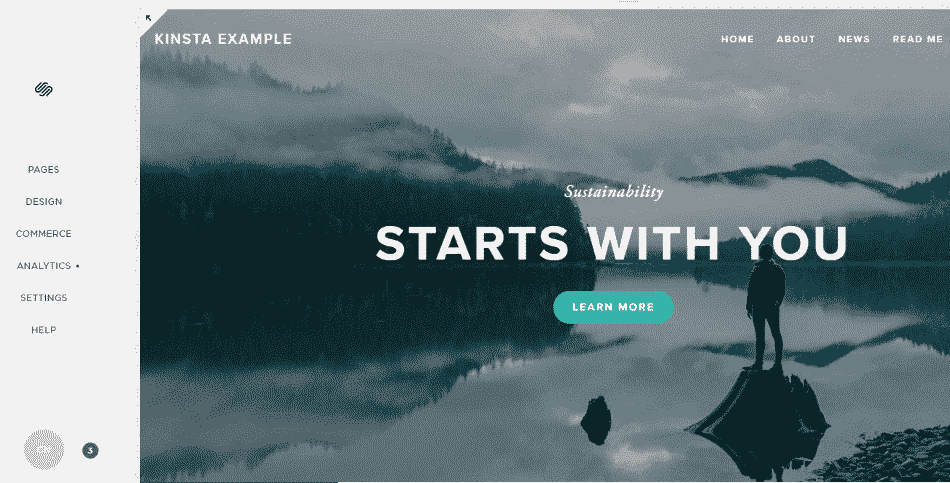

The Squarespace interface

### 更多灵活性

Squarespace 用户的设计灵活性也有限。虽然我们在前面的部分已经提到了这一点，但是 Squarespace 和 leading alternatives 之间的一些细微差别还是值得注意的。

首先，许多替代方案为用户提供了一个“空白画布”。无论你是一个完全的初学者还是网页设计专家，大多数选择都让你在设计网页时拥有完全的灵活性。相比之下，Squarespace 只提供相对较少的模板。

说到模板，很多替代品也为用户提供了可定制的模板。对于像 [WordPress](https://kinsta.com/blog/squarespace-vs-wordpress/) 这样的网站建设者来说，这也可以包括访问[第三方模板](https://kinsta.com/blog/elementor-templates/)和定制设计。因此，大多数替代方案允许用户构建他们能想象的任何东西——不管最终结果如何。

[Looking to move away from Squarespace? 👀 Check out this roundup 🚀Click to Tweet](https://twitter.com/intent/tweet?url=https%3A%2F%2Fbit.ly%2F3RghAPk&via=kinsta&text=Looking+to+move+away+from+Squarespace%3F+%F0%9F%91%80+Check+out+this+roundup+%F0%9F%9A%80&hashtags=Squarespace%2CWordPress)

### 电子商务选项

尽管 Squarespace 也有一些可靠的电子商务选项，但它们仅限于基本的店面、购物车和预约安排。

作为一个基本网站的扩展，这可能足以运行在线商店，但它没有提供足够的功能和可扩展性来支持更多的电子商务专用网站。因此，那些希望推出在线零售、订购平台或其他更“完整”的电子商务解决方案的人应该考虑更强大的 Squarespace 替代方案。

Squarespace 有限的第三方电子商务应用程序也使得它无法集成更受欢迎的工具，如 [Shopify](https://kinsta.com/blog/shopify-alternatives/) 和 PayPal。

### 第三方应用

Squarespace 不提供应用程序，只提供预批准工具的集成。因此，用户被限制在 Squarespace *认为他们需要的任何东西上，并且通常不能使用他们想要的应用和工具。*

我们已经提到了电子商务工具的这一限制，但它适用于几乎所有其他类别。

其中一个类别是网络分析。虽然 Squarespace 提供了专有的分析工具，但它还不足以与专业的搜索引擎优化(SEO)和商业智能平台相竞争。

虽然 Squarespace *在支持与 [Google Workspace](https://kinsta.com/blog/google-workspace/) 等流行应用的集成方面做得很好，但那些有专业第三方应用需求的人可能需要一个更加定制的解决方案。*

### 简单

尽管 Squarespace 的简单性和直观界面是其主要优势，但在该平台上建立一个网站仍然需要一些努力。幸运的是，有几种替代方案提供了更简单的设置，有些甚至具有全自动设计选项。

### 多用户协作

建立和管理一个网站可能需要一个团队，尤其是对于一个公司或小型企业。

在这种情况下，最好选择一个促进多用户协作的网站建设者。虽然 Squarespace 允许额外的用户作为“贡献者”提供内容，但它不像有多个管理员或 web 开发人员那样灵活。因此，团队应该考虑更灵活的包来促进协作。

### 定价和费用

截至 2022 年 4 月，个人计划的起价为每月 14 美元，Squarespace 肯定比建立和管理自己的网站要贵一些。虽然额外的便利可能证明了一些人的成本，但仍有其他成本和费用要考虑。

一个例子是 Squarespace 对商业计划用户收取 3%的交易费。虽然 Squarespace 的其他高级计划没有这项费用，但下一个可用的选择是每月支付 27 美元的商业计划。

由于有许多更便宜的 Squarespace 替代品，对于已经在处理商户和销售点费用的小企业来说，这可能不是一个好的选择。

## 2022 年 15 大方形空间选择

Squarespace 是一个伟大的网站建设者，但也有许多同样伟大的替代品。为了帮助缩小你的搜索范围，我们汇编了 15 个 Squarespace 备选方案，几乎涵盖了所有的需求和应用。

### 1.WordPress

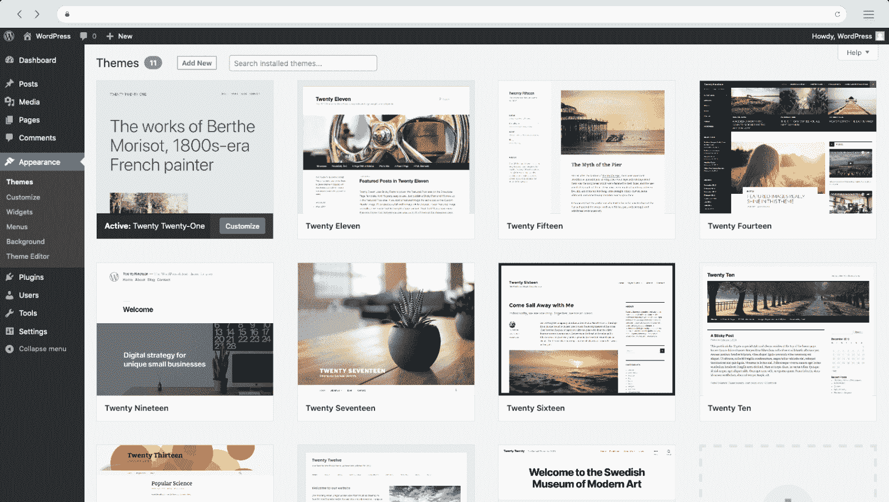

The WordPress user dashboard

WordPress 是建立网站的最强大的工具之一。虽然它比 Squarespace 这样的“拖放”工具需要更多的技术知识，但它提供了完全的定制，并与店面的 [Woocommerce](https://kinsta.com/blog/woocommerce-tutorial/) 这样的插件集成。

虽然 WordPress 可以免费使用，但是用户必须为他们自己的模板、插件等等付费。然而，有了许多免费的模板和插件，无需付费订阅就可以进行大量的定制。

**顶级功能:**

*   完全可定制
*   无限插件
*   基于使用的价格

**价格:**各不相同

### 2.金斯塔

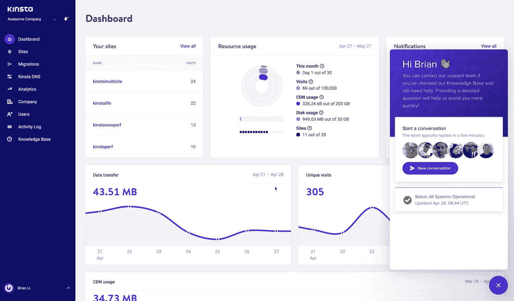

MyKinsta hosting dashboard

当我们谈到 WordPress 的时候，通过 WordPress 托管和自托管有很大的不同。虽然一开始直接通过 WordPress 托管可能更方便，但是自托管是一个更灵活的选择。

自托管有两种形式:在自己的服务器上托管或使用托管服务。

虽然您肯定可以建立和管理自己的服务器，但它会带来很多开销。在必须执行例行(阅读:乏味)管理和定期安全检查之间，自己托管可能很快变得耗时、昂贵，并且难以扩展和适应。

因此，许多人使用托管 WordPress 主机来轻松地构建、缩放和维护他们的网站，因为他们的需求发生了变化。

有了 Kinsta 的[应用](https://kinsta.com/application-hosting/)、[数据库](https://kinsta.com/database-hosting/)和[托管 WordPress 托管](https://kinsta.com/wordpress-hosting/)服务，团队可以快速构建强大的托管解决方案，根据他们网站的需求和用例进行定制。

此外，由于一切都在云中，监控资源使用、访问者流量和其他统计数据都可以在单个仪表板上获得。

**顶级功能:**

*   [高可扩展性](https://kinsta.com/add-ons/?plan=visits-business1&interval=month)
*   快速基础设施
*   不同网站的定制解决方案
*   便捷的仪表板
*   [全天候安全、支持和正常运行时间监控](https://kinsta.com/kinsta-support/)

**价格:**$ 30-$ 1500/月(也提供企业计划)

### 3.威克斯

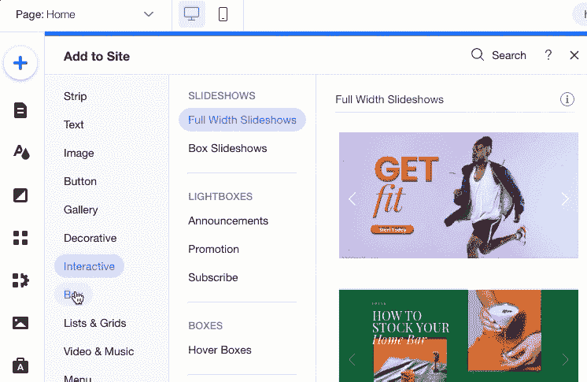

The Wix Editor interface

就像 Squarespace 一样受欢迎(如果不是更受欢迎的话)， [Wix](https://kinsta.com/wix-market-share/) 是运行时间最长、最灵活的站点构建器之一。

Wix 提供 500 多个完全可定制的模板，是企业家和预算有限的人的理想选择。有了这么多的灵活性，你可以使用一套简单直观的工具设计几乎任何网站。

虽然免费计划将要求您使用 wix.com 子域，付费用户可以使用自己的域名和托管包。

**顶级功能:**

*   500 多个模板
*   无限的存储空间和页数
*   拖放编辑器

**价格:**$ 0-$ 49/月(也提供企业计划)

### 4\. Weebly

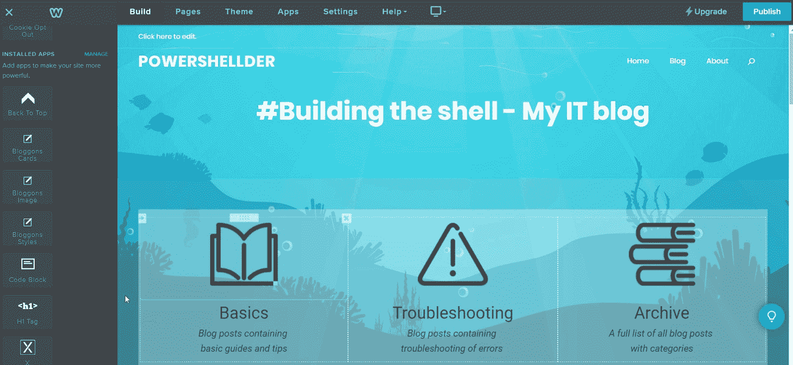

The Weebly site editor interface

虽然与 Wix 非常相似，但 T2 比 T3 更容易使用。事实上，它可能是我们见过的最简单和用户友好的网站生成器。

然而，简单性的增加是以更少的功能为代价的。尽管付费会员可以解锁定制域名和电子商务工具等功能，但它仍然比大多数网站建设商更加简单。即便如此，它仍然是构建简单网站的绝佳选择。

**顶级功能:**

*   非常方便用户
*   简单界面
*   广泛的模板和应用选择

**价格:**$ 0-$ 30/月

### 5\. Shopify

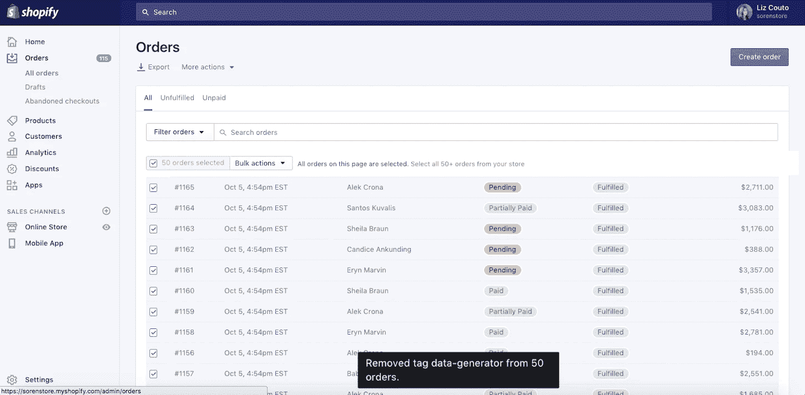

Shopify ecommerce dashboard

Shopify 在全球拥有超过 500，000 家活跃商户，是电子商务的黄金标准。虽然 Squarespace 和其他网站建设者可能提供尚可的电子商务工具，但没有一个能提供 Shopify 的可扩展性、声誉和可靠性。

在这一点上，Shopify 的每一个功能都是为在线销售而优化的。这意味着，无论你是在配置产品页面，还是在设计网站的购物车界面，Shopify 都会帮助你优化每一步的销售。

**顶级功能:**

*   优秀的电子商务工具
*   应用商店
*   经得起未来考验的销售点

**价格:**$ 26-$ 2000/月

### 6.Webnode

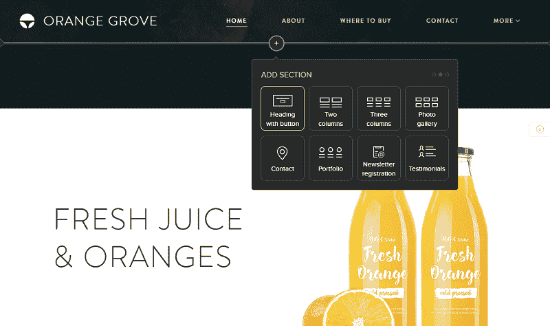

Adding a section with Webnode’s site editor

尽管在大多数方面，Webnode 是一个相当典型的站点构建器，但在构建多语言站点方面，它是首屈一指的。由于支持大多数语言，标准计划用户(12+/月)可以让他们的网站自动翻译成多种受众。

另一个独特的功能是电子邮件支持。大多数网站建设者和主机要求你建立自己的网络电子邮件，Webnode 默认提供。

**顶级功能:**

*   多语言网站
*   吸引人的模板
*   包含电子邮件

**价格:**$ 3.90-$ 22.90/月

## 注册订阅时事通讯

### 想知道我们是怎么让流量增长超过 1000%的吗？

加入 20，000 多名获得我们每周时事通讯和内部消息的人的行列吧！

[Subscribe Now](#newsletter) ### 7.吉姆多

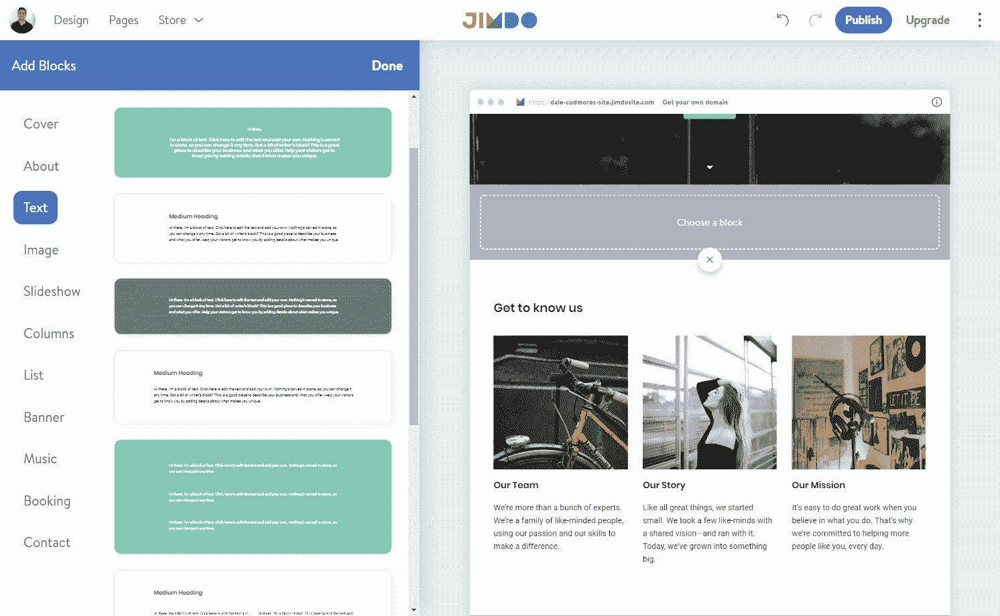

The Jimdo site builder interface in action

另一个简单的站点构建器，Jimdo 的工具和界面比 Squarespace、Wix 和许多其他流行的选项更容易使用。虽然在许多方面与 Weebly 相似，但 Jimdo 也针对速度进行了优化。仅这个特性就让它成为构建简单、[高速网站](https://kinsta.com/blog/speed-up-woocommerce/)的另一个绝佳选择。

**顶级功能:**

*   非常方便用户
*   简单界面
*   速度优化的页面

**价格:**$ 0-$ 39/月

### 8.Webflow

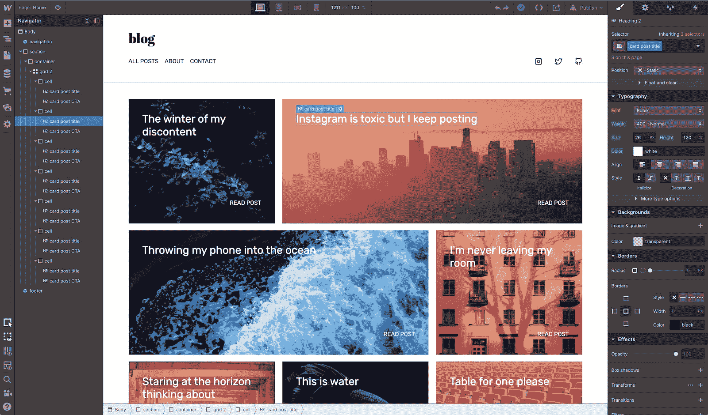

Webflow’s front-end design interface

[Webflow](https://kinsta.com/blog/webflow-vs-wordpress/) 主要面向前端设计人员和开发人员，提供了一些非常前沿的网页设计工具。然而，虽然 Webflow 用户可以享受完全的定制和控制，但高端包需要一点学习曲线。

**顶级功能:**

*   完全定制和灵活性
*   尖端设计工具
*   将代码导出到其他应用程序

**价格:**$ 12-$ 200/月(也提供企业计划)

### 9.Gator 网站构建器

Adding content with the Gator website builder

Gator 网站生成器是另一个简单的“拖放”选项，由流行的虚拟主机服务 [HostGator](https://kinsta.com/hostgator-alternative/) 提供。虽然它和 Wix 一样易于使用，并提供了几个有吸引力的设计，但它的功能并不丰富。

尽管如此，对于那些已经使用 HostGator 进行虚拟主机或域名注册的人来说，这仍然是一个非常方便的选择。

**顶级功能:**

*   使用方便
*   站点回滚功能
*   精心设计的模板

**价格:** $9.22-$19.98

### 10.你怀疑吗

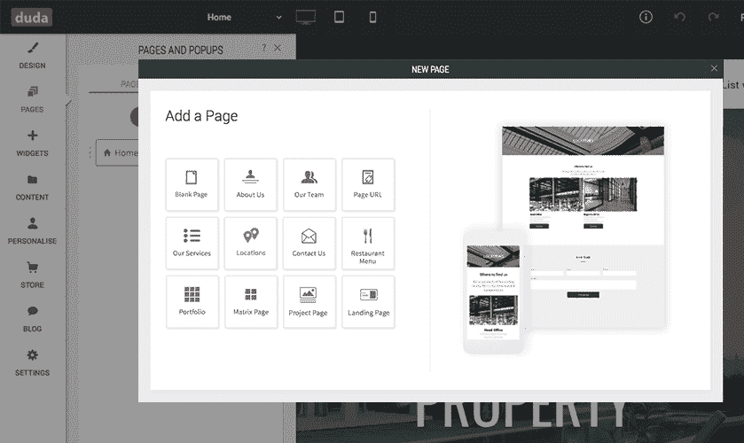

The many different page options available in Duda

除了一些很棒的页面模板，杜达在支持多语言网站和页面个性化方面是独一无二的。有了个性化功能，你可以为不同的访问者以不同的方式显示你的网站。

**顶级功能:**

*   使用方便
*   多语言网站
*   访问者网站个性化

**价格:**$ 14-$ 44/月(也提供企业计划)

### 11.显著地

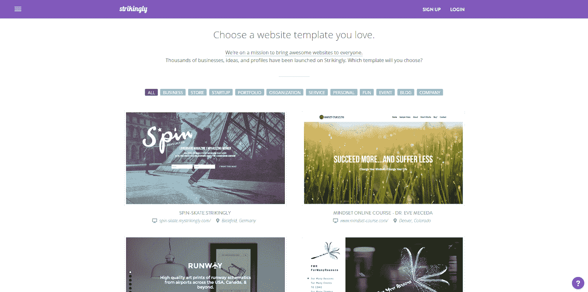

Some of the many templates available from Strikingly

没有什么比一个好的首页更能给人留下“引人注目”的第一印象了——而这正是引人注目的意义所在。作为少数几个专注于单页网站的网站建设者之一，它是构建登陆页面、作品集等等的绝佳选择。

**顶级功能:**

*   单页网站设计的优秀模板
*   使用方便
*   包括域名

**价格:**$ 0-$ 49/月

Struggling with downtime and WordPress problems? Kinsta is the hosting solution designed to save you time! [Check out our features](https://kinsta.com/features/)

### 12.GoDaddy

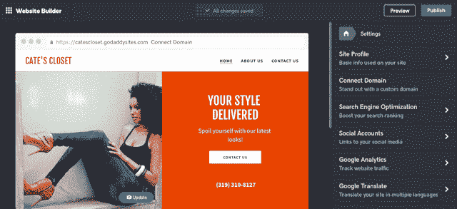

The GoDaddy Website Builder dashboard

另一个 web 主机站点构建器，GoDaddy 让现有用户可以很容易地在他们当前的域名或主机包中快速建立一个网站。然而，它也提供了一些令人惊讶的令人印象深刻的和可扩展的电子商务、营销、搜索引擎优化等工具。

**顶级功能:**

*   使用方便
*   内置的应用程序和工具
*   支持可伸缩性

**价格:**$ 6.99-$ 17.49/月

### 13.货物

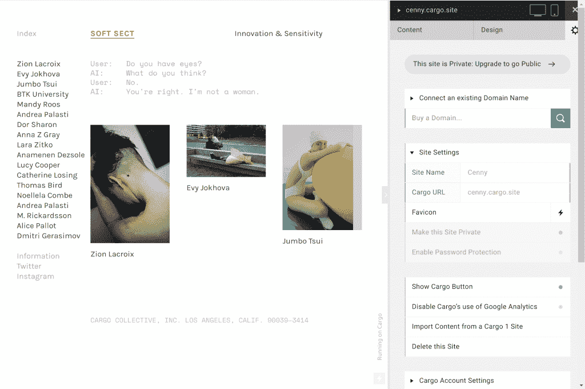

The Cargo site editor interface

如果你是一个有创造力的人，不要再看货物了。作为艺术家的网站建设者，Cargo 的 70 多个不同寻常(但令人惊叹)的模板是完全可定制的，从颜色到字体，以及介于两者之间的一切。

**顶级功能:**

*   独特的模板和布局
*   专为艺术家打造
*   完全可定制

**价格:**$ 19-$ 28/月(但学生免费！)

### 14.CMS 集线器

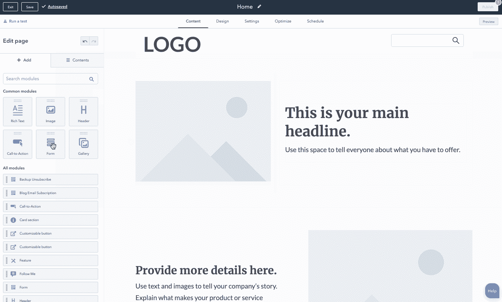

Building a basic page in CMS Hub

作为 HubSpot 的网站建设者，CMS Hub 更像是一个完整的[内容管理系统(CMS)](https://kinsta.com/cms-market-share/) 而不是一个页面建设者。即便如此，它提供了你可能从其他提供商那里期待的同样的拖放编辑器工具，所有这些工具都与 HubSpot 著名的营销和销售工具集成在一起。

**顶级功能:**

*   拖放式设计
*   集成的[内容管理系统](https://kinsta.com/blog/cms-software/)
*   额外的站点安全性

**价格:**$ 23-$ 1200/月

### 15.前导页

Editing a site header in Leadpages

将访客转化为顾客是一个巨大的挑战。Leadpages 帮助其用户克服了专门用于转换的布局和模板之间的差距。凭借内置的销售和分析工具，它是销售和营销团队的绝佳选择。

**顶级功能:**

*   为转换优化的模板
*   包含的销售工具
*   性能分析

**价格:**$ 49-$ 99/月

## 如何选择适合你的网站建设者

虽然每个网站建设者都有其独特的优势(和独特的缺点)，只有少数可能适合你。但是有这么多选择，你怎么能选择一个正确的呢？

不管是不是 Squarespace，最好的网站建设者应该满足你的需求。当你开始搜索的时候，问问你自己你想达到什么目的，你想使用什么工具，你期望什么功能，这样你就能确切地知道要找什么。

### 考虑你的需求

你肯定知道你需要一个网站，否则，你可能不会选择一个网站建设者。真正的问题是你需要那个网站做什么。

虽然每个网站建设者都可以从技术上建立一个网站，专业网站往往需要专业的工具。例如，虽然 Squarespace 可以快速部署主页和基本的购物功能，但企业级电子商务网站可能需要更强大的硬编码解决方案。

在任何情况下，总是考虑你到底想要你的网站做什么。它甚至可能有助于列出一个清单，看看你审查的每一个网站建设者是否能勾选你所有的框。这样做，你将确保自己不会在支付订阅费后被一个缺失的功能吓到。

### 检查设计选项(和限制)

即使你需要的只是一个“简单”的网站，设计仍然是一个重要的考虑因素。

好的设计不仅能让访问者更容易地使用和浏览你的网站，还能说明很多关于你或你的公司的事情。同样，设计也会影响用户对你网站目的的理解。例如，你可能不想把你的[个人博客](https://kinsta.com/blog/best-blogging-platform/)当作公司主页来显示。

诚然，大多数网站建设者提供足够的模板，以涵盖大多数类型的网站。然而，这些模板正是:模板。因此，拥有定制设计选项以脱颖而出并传达您的品牌身份非常重要。

正如我们之前提到的，Squarespace 用户经常面临非常有限的设计选择。虽然设计和模板都很时尚，但从大多数标准来看，它们也很普通。虽然这对于许多用途来说可能是好的，但对于更有创造力的类型来说，这可能会令人窒息。

在任何情况下，确保你的网站建设者的设计选项符合你的需求和创意。上面列出的许多 Squarespace 备选方案允许用户从头开始创建设计，甚至构建他们自己的模板。

### 确定您的电子商务需求

无论你是一个小精品店还是一个成熟的零售商，电子商务将是选择网站的最大因素之一。

虽然几乎每一个现代网站建设商都提供某种形式的电子商务集成，但它们在特性和功能上有很大不同。例如，虽然 Squarespace 的电子商务选项可能非常适合简单的店面，但拥有大量目录和销售点系统的在线服装店可能更适合使用类似 Shopify 的[产品。](https://kinsta.com/blog/woocommerce-vs-shopify/)

当然，你的电子商务平台不一定来自你选择的网站建设者。如果您已经使用了一个特定的平台或者已经有了一个这样的平台，那么检查您的站点构建器是否支持集成可能更重要。正如我们所见，像 Squarespace 这样的网站建设者很少允许这种选择。

### 检查与您的应用的兼容性

如果你使用应用程序进行网络分析或搜索引擎优化，你肯定会希望确保你的网站建设者支持它们——即使它已经提供了自己的版本。

如果您正在使用现有的技术，例如电子商务、分析、CRM 和 SEO 工具的组合，这一点尤其重要。除非你愿意做一些大规模的(昂贵的)改变，否则你将需要一个支持与你已经拥有的集成的站点构建器(或者一个定制的解决方案)。

### 问问你的团队

如果你计划和一个团队一起建设和/或管理你的网站，那么他们应该完全了解(并且完全熟悉)你选择的网站建设者。

即使你找到了“完美”的网站建设者，它也只能和你团队的能力一样完美。例如，许多人选择网站建设者为他们的易用性。然而，如果即使是一个“简单”的网站建设者为你的团队提供了一个陡峭的学习曲线，那么它并不比最差的选择更好。

这可能是一个不太可能的场景，但却是一个需要考虑的重要问题。在决定平台之前，一定要检查团队的偏好和能力。

### 考虑成本

似乎大量的功能还不够，网站建设者也有大量的价格。这些价格从完全免费到每月数百美元不等。

在大多数情况下，你会得到你所付出的。总的趋势是，更高的价格要么提供更多的定制、更多的功能，要么为用户、交易等提供更大的容量。

然而，简单地多付钱并不总是保证网站建设者会满足你的确切需求。例如，Squarespace 的商业计划比个人计划多提供 10 美元的电子商务工具，但在使用他们的工具时，还会额外收取 3%的交易费。

### 别忘了主持

虽然许多网站建设者包括托管作为他们的软件包的一部分，使用它可以有几个警告。

首先，你对主机服务器几乎没有控制权，这可能会影响你的流量或搜索引擎优化工作。此外，由于许多网站建设者在一个共享服务器上托管多个网站，如果你的网站服务器上的其他网站排名很低，或者在最糟糕的情况下，有犯罪历史，你的网站可能会受到负面影响。

在大多数情况下，最好选择一个独立于你的网站建设者的托管计划。选择自己的托管计划不仅让你更加灵活和安全，而且比网站建设商提供的托管计划更便宜、更可靠。

[Want to use something other than Squarespace to build your site? ✅ This post has plenty of options... 😄Click to Tweet](https://twitter.com/intent/tweet?url=https%3A%2F%2Fbit.ly%2F3RghAPk&via=kinsta&text=Want+to+use+something+other+than+Squarespace+to+build+your+site%3F+%E2%9C%85+This+post+has+plenty+of+options...+%F0%9F%98%84&hashtags=Squarespace%2CWordPress) ## 摘要

Squarespace 可能是最受欢迎的网站建设者，但像 WordPress 和 Shopify 这样的替代者提供了额外的功能和更好的性能——通常价格更具 T2 竞争力。

如果你正在用 WordPress 建立你的下一个网站，你需要一个强大的托管计划来支持它。有了 Kinsta 的[托管 WordPress 主机](https://kinsta.com/blog/managed-wordpress-hosting/),您可以享受闪电般的性能和 24/7 全天候的安全和支持。

探索我们的[托管计划](https://kinsta.com/plans/)或[联系我们](https://kinsta.com/schedule-demo/)今天就和来自 Kinsta 的 WordPress 专家一起安排演示！

* * *

让你所有的[应用程序](https://kinsta.com/application-hosting/)、[数据库](https://kinsta.com/database-hosting/)和 [WordPress 网站](https://kinsta.com/wordpress-hosting/)在线并在一个屋檐下。我们功能丰富的高性能云平台包括:

*   在 MyKinsta 仪表盘中轻松设置和管理
*   24/7 专家支持
*   最好的谷歌云平台硬件和网络，由 Kubernetes 提供最大的可扩展性
*   面向速度和安全性的企业级 Cloudflare 集成
*   全球受众覆盖全球多达 35 个数据中心和 275 多个 pop

在第一个月使用托管的[应用程序或托管](https://kinsta.com/application-hosting/)的[数据库，您可以享受 20 美元的优惠，亲自测试一下。探索我们的](https://kinsta.com/database-hosting/)[计划](https://kinsta.com/plans/)或[与销售人员交谈](https://kinsta.com/contact-us/)以找到最适合您的方式。