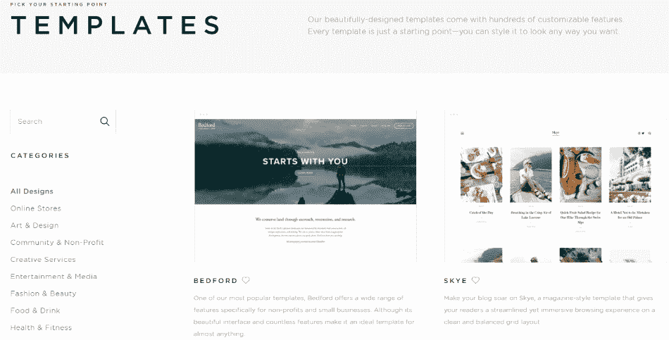
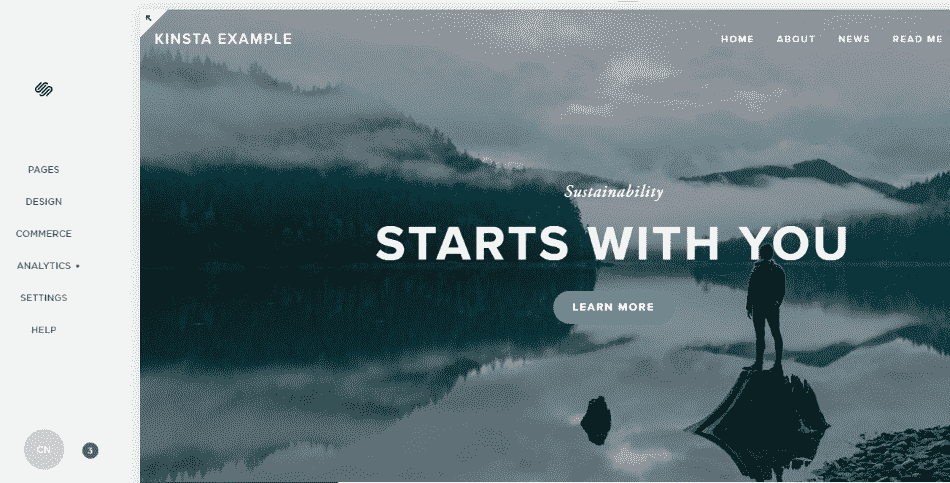
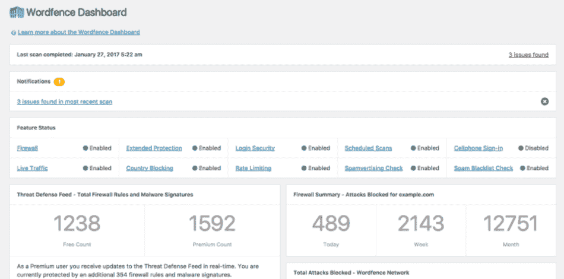
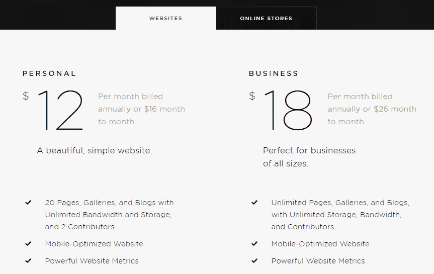

# Squarespace 和 WordPress——哪个更好？(赞成和反对)

> 原文：<https://kinsta.com/blog/squarespace-vs-wordpress/>

虽然 WordPress 是迄今为止世界上最受欢迎的内容管理系统，但这并不意味着它是制作网站的唯一方式。近年来，我们已经看到了像 Squarespace 和 Wix 这样的初学者友好型网站建设者的崛起。在本帖中，我们将前者 Squarespace 与 WordPress 进行比较，后者是为全球 43.3%的网站提供支持的内容管理系统[。](https://kinsta.com/wordpress-market-share/)

我们将会给你一个 Squarespace 和 WordPress 的详细对比，并向你展示两者的优势。最后，你应该掌握了选择适合你的网站的平台所需的所有知识。

## Squarespace vs WordPress:快速概览

在深入研究 Squarespace 和 WordPress 之前，我们想给你一个关于每种工具构建网站方法的快速概述。此概述将有助于更具体功能的讨论。这个想法有点过于简单——但总的来说，每个平台都在试图平衡两种对立的力量:

*   易用性和对初学者的可及性
*   定制站点和添加附加功能的灵活性

虽然与许多其他内容管理系统相比，WordPress 仍然易于使用，但它牺牲了一些初学者友好性，以便让您对网站的外观和功能有更高程度的控制。另一方面，Squarespace 试图让事情变得尽可能容易和简单……但却牺牲了灵活性。

还有其他哲学上的差异——比如开源(WordPress)和闭源(Squarespace)之间的差异。但是对于大多数临时用户来说，易用性和灵活性之间的动态性是最重要的。下面，我们将深入探讨这种差异是如何发生的一些具体实例。

## 在各个平台上建立一个网站有多容易？

如果你正在寻找建立一个基本网站的绝对最简单的方法——**Squarespace 赢了**。Squarespace 可能没有那么灵活(稍后会有更多介绍！)，但没人能否认它让创建一个基本网站变得尽可能轻松。话虽如此，WordPress 仍然让建立网站变得很容易。这并不像《T4》中的 Squarespace 那么简单。

### 方形空间

有了 [Squarespace](https://www.squarespace.com/) ，你无需担心注册托管或购买域名的问题。相反，你只需注册一个 Squarespace 账户。然后，在几秒钟内，你已经为你的网站选择了一个模板:

> Kinsta 把我宠坏了，所以我现在要求每个供应商都提供这样的服务。我们还试图通过我们的 SaaS 工具支持达到这一水平。
> 
> <footer class="wp-block-kinsta-client-quote__footer">
> 
> 
> 
> <cite class="wp-block-kinsta-client-quote__cite">Suganthan Mohanadasan from @Suganthanmn</cite></footer>

[View plans](https://kinsta.com/plans/)

Choosing a Squarespace template

一旦你回答了几个更简单的问题，你就已经有了一个可以工作的网站——你所需要做的就是定制文本和图片(稍后会有更多的*！):*

 *

The Squarespace interface

整个过程可能只需要一分钟。

### WordPress

与 Squarespace 不同，你需要注册自己的虚拟主机并购买一个域名来开始使用。然后，一旦你有了主机，你需要安装实际的 WordPress 软件才能继续。虽然这听起来有点吓人，但是现在大多数主机都让你点击一下就可以安装 WordPress。有些，像 Kinsta，甚至预装了[WordPress](https://kinsta.com/help/new-site/)。

因此，虽然这里有一个额外的步骤——这是初学者肯定可以处理的事情，它实际上只延长了 5-10 分钟的创建过程。一旦你安装了 WordPress，你就有了一个基本的工作网站。像 Squarespace 一样，你可以通过[安装一个 WordPress 主题](https://kinsta.com/blog/how-to-install-a-wordpress-theme/) ( *大致相当于 Squarespace 的模板*)来改变你网站的外观。

How to add a WordPress theme

根据从获取主题的[，这个过程可能比选择 Squarespace 模板稍微复杂一点*。不过还是那句话，大部分初学者都不会有问题。看看这 7 个*](https://kinsta.com/blog/change-wordpress-theme/)*[流行的网络商务主题](https://www.designbombs.com/top-woocommerce-wordpress-themes/)，让你开始运作。
*

## 你对网站的功能有多少控制力？

得益于其庞大的第三方插件和主题库， **WordPress 在控制深度和功能性方面是明显的赢家**。WordPress 有数以万计的插件来增加功能，然而，使用 Squarespace，你会受到 Squarespace 所支持的集成的限制。

### 方形空间

有了 Squarespace，您可以在一个界面上进行更改。在此界面中，您可以:

*   更改内容
*   调整设计样式
*   添加自定义 CSS
*   设置分析
*   选择要显示的社交分享按钮
*   控制页面的基本 SEO 设置

您甚至可以使用基于内容块的拖放界面来创建自己的设计:

Building a page with Squarespace drag and drop editor

你实际上比许多 WordPress 粉丝给 Squarespace 的评价更有控制力…

但是，话虽如此，你仍然无法控制 WordPress。这是因为 Squarespace 缺少一个关键要素——**第三方插件**。

### WordPress

当涉及到改变你的网站时，WordPress 拥有 Squarespace 拥有的一切… [再加上一个捆绑包](https://kinsta.com/blog/why-use-wordpress/)。看，WordPress 有成千上万的插件，你可以添加到你的网站来增强它的功能。

例如，假设您喜欢 Squarespace 的页面设计器让您通过拖放来构建设计。为了在 WordPress 上获得同样的功能，你需要做的就是安装[众多优质页面生成器插件](https://kinsta.com/blog/wordpress-page-builders/)中的一个:

Example of a WordPress page builder

想加[社交分享按钮](https://kinsta.com/blog/wordpress-social-media-plugins/)？[安装一个插件](https://kinsta.com/knowledgebase/how-to-install-wordpress-plugins/)。需要帮助[管理广告](https://kinsta.com/blog/wordpress-advertising-plugin/)？简单——安装一个插件。因为 WordPress 社区是如此的庞大，你可以找到几乎所有东西的插件…这意味着你可以给你的网站添加几乎任何功能。

再说一次——增加灵活性的代价是事情不太适合初学者。你需要为你可能想要的许多特性寻找插件，而不是把所有的东西都放在一个界面上。但是对于大多数人来说，为了功能和灵活性的巨大收益，这种权衡是绝对值得的。
T3】

## 每个平台如何处理电子商务？

虽然电子商务可能不是每个人都要考虑的，但是如果你打算通过你的网站销售产品，如果你使用 WordPress ，你会有更多的灵活性。

### 方形空间

Squarespace eCommerce

Squarespace 支持电子商务。但与 WordPress 相比，它相当有限。除了一般的电子商务功能，Squarespace 的一个亮点是它包括内置的[购物车恢复电子邮件](https://kinsta.com/blog/abandoned-cart-email/)。这当然可以从你的 WordPress 电子商务商店获得，但是它需要一个第三方插件。

但尽管如此，在 Squarespace 和电子商务方面，你仍然受到限制。首先，您只能从三个支付网关中选择:

*   种类
*   贝宝
*   Apple Pay

与 WordPress 的支付网关相比，这只是一个很小的列表。其次，你又错过了 WordPress 庞大的插件生态系统。有大量专注于电子商务的插件，所以你失去了大量的功能。

最后，还有一个巨大的不利因素，除非你升级到更昂贵的电子商务计划(每月 30 美元起)， **Squarespace 除了信用卡手续费之外，还收取 2-3%的交易费** *。因此，如果你想在 Squarespace 上经营一家电子商务商店，并避免交易费用，你每年的最低费用是 312 美元。*

### WordPress

有许多不同的插件可以把 WordPress 变成一个功能齐全的电子商务商店。最受欢迎的两个是:

## 注册订阅时事通讯

### 想知道我们是怎么让流量增长超过 1000%的吗？

加入 20，000 多名获得我们每周时事通讯和内部消息的人的行列吧！

[Subscribe Now](#newsletter)

*   [woo commerce](https://kinsta.com/learn/woocommerce-guide/)——针对实体产品(虽然你也可以用它来销售虚拟产品)。
*   [轻松的数字下载](https://kinsta.com/blog/easy-digital-downloads/)-专注于帮助您销售数字产品。

WooCommerce welcome screen

除了这些基本的电子商务插件，你可以添加大量的附加插件来增加你的商店的功能。而且你永远也不会支付任何交易费用(*超过你的支付处理器收费*)。此外，你甚至可以找到插件来为你的商店创建更高级的功能，如代销商网络。

## 每个平台上谁控制着你的数据？

我们所说的“控制”本质上是指—*如果您想迁移到一个新的平台，那么移动您的内容有多容易？*如果你关心数据所有权和可输出性(*你应该是*)， **WordPress 是明显的赢家**，因为它是开源的，你总是能控制你的网站。

建议阅读:[如何导出一个 WordPress 站点](https://kinsta.com/knowledgebase/export-wordpress-site/)。

### 方形空间

Squarespace 允许您将部分内容导出到. xml 文件中。您可以导出的内容是:

*   普通页面
*   图库页面
*   一个博客页面及其所有帖子
*   文本块
*   图像块
*   来自嵌入块、Twitter 块和 Instagram 块等其他块的文本将以最小结构导出。
*   评论

但是有一大堆内容不能导出，包括:

*   产品页面
*   文件夹
*   索引页面
*   活动页面
*   相册页面
*   封面
*   不止一个博客页面
*   音频块
*   视频块
*   产品块
*   草稿
*   风格变化
*   自定义 CSS

此外，你永远也不能下载你的数据库或服务器文件的完整副本。这很重要，因为这意味着你永远不会真正“拥有”你的整个网站。

### WordPress

有了 WordPress，你拥有所有文件和数据的 100%所有权。除了 WordPress 的内置工具帮助你[以一种与其他流行的](https://kinsta.com/knowledgebase/wordpress-export-users/)[内容管理系统](https://kinsta.com/knowledgebase/content-management-system/)兼容的格式导出用户和数据，你还可以随时下载你的数据库和文件的完整副本。这都是你的，其他任何人都无权使用。

## 每个平台如何处理日常维护？

因为 Squarespace 是一个封闭的生态系统，所以你根本不需要担心维护问题。另一方面，因为 WordPress 是一个开放的生态系统，你需要采取更积极的方法来维护你的网站。

Struggling with downtime and WordPress problems? Kinsta is the hosting solution designed to save you time! [Check out our features](https://kinsta.com/features/)

### 方形空间

有了 Squarespace，你就不需要担心更新或维护之类的细节问题。Squarespace 为您处理所有这些，这使它变得非常简单。也就是说，当涉及到一些基本的维护功能(如备份)时，Squarespace 会让您陷入困境。它似乎没有提供任何方法来备份你的整个站点，这是一个相当大的疏忽。

### WordPress

使用 WordPress，您负责处理:

*   更新(软件和插件/主题)
*   备份
*   安全性

这看起来令人生畏——但是大部分都很简单，可以通过插件自动完成。例如，你可以找到为你保护安全的[插件](https://kinsta.com/blog/wordpress-security/)。

Example of a WordPress security plugin

另外，如果你选择一个托管的 WordPress 主机，你的主机会为你处理很多细节。或者，你可以雇佣一个 [WordPress 维护](https://kinsta.com/blog/wordpress-maintenance/%E2%80%8E)服务。

## 每个平台多少钱？

**Squarespace 的定价更简单**，但这并不意味着它更便宜。不幸的是，我们无法给出哪个更便宜的单一声明——实际的答案取决于你选择哪个 Squarespace 计划以及你对你的 WordPress 站点做出的决定。

### 方形空间

Squarespace 有明确的定价计划，这让你很容易知道你会在你的网站上花多少钱。最便宜的计划每年 96 美元(或每月 16 美元)起，最贵的电子商务计划每年 480 美元(或每月 46 美元):

Squarespace pricing

请记住，如果你想创建一个电子商务商店，最便宜的 Squarespace 计划会将你的页面限制在 20 页以内，并收取额外的交易费。

### WordPress

有了 WordPress，就很难确定一个确切的成本。WordPress 网站唯一不可避免的成本是你所支付的费用:

*   主办；主持
*   你的领域

如果你愿意使用廉价的共享主机，那可能只需要你每年花费大约 50 美元。另一方面，[面向性能的托管 WordPress hosting](https://kinsta.com/wordpress-hosting/) 每月可以运行数百个。除此之外，[你可能想花额外的钱](https://kinsta.com/blog/wordpress-website-cost/)购买优质的第三方主题和插件。你不需要*去*。但是高级主题和插件通常提供更好的功能。

## 从 Squarespace 迁移到 WordPress

如果你目前正在使用 Squarespace，并且正在寻找一种简单的方法来将[迁移到 WordPress](https://kinsta.com/blog/squarespace-to-wordpress/) ，我们推荐你去看看[wordheld](https://wordherd.io/partners/kinsta/)。他们是 Kinsta 的官方合作伙伴，提供全方位的网站迁移服务，将数据从任何 CMS (Squarespace)平台转移到 WordPress 。

[T2】](https://wordherd.io/partners/kinsta/)

WordHerd 处理从小型企业到大型企业的各种规模的迁移。除了 CMS 迁移之外，WordHerd 团队也非常擅长协助 CRM 数据迁移。

以下是其他几种可选的迁移方法:

*   Squarespace 提供了一种从他们的平台导出内容的方法。查看如何[导出你的 Squarespace 网站](https://support.squarespace.com/hc/en-us/articles/206566687-Exporting-your-site#toc-step-1---export-your-content)。
*   CMS2CMS 提供了一个[高级迁移解决方案](https://cms2cms.com/cms/supported-cms/squarespace-to-wordpress-migration/)，将你所有的数据从 Squarespace 转移到 WordPress。

推荐阅读:[Weebly vs WordPress——哪个最适合你的网站？](https://kinsta.com/blog/weebly-vs-wordpress/)

## Squarespace vs WordPress:你该选哪个？

如果你只想尽可能容易地创建一个简单的网站，而不在乎灵活性或内容所有权，Squarespace 是一个可靠的选择。*这样对*有好处。但是绝大多数站长更适合使用 WordPress。是的，WordPress 的开放性需要稍微高一点的学习曲线，以及对安全性、性能和维护的高度关注。

但是 WordPress 的核心团队和社区在将 WordPress 变成初学者的无障碍工具方面取得了巨大的进步。仅仅因为 Squarespace 比 T2 容易，并不意味着 WordPress 没有 T4 容易。总而言之，当你使用 WordPress 时，你将拥有更多:

*   功能
*   灵活性
*   所有权

你甚至还可以省钱！你怎么想呢?你觉得 Squarespace 和 WordPress 谁更厉害？请在评论中告诉我们。

[Squarespace](https://www.squarespace.com/) 是 Squarespace 的注册商标。

* * *

让你所有的[应用程序](https://kinsta.com/application-hosting/)、[数据库](https://kinsta.com/database-hosting/)和 [WordPress 网站](https://kinsta.com/wordpress-hosting/)在线并在一个屋檐下。我们功能丰富的高性能云平台包括:

*   在 MyKinsta 仪表盘中轻松设置和管理
*   24/7 专家支持
*   最好的谷歌云平台硬件和网络，由 Kubernetes 提供最大的可扩展性
*   面向速度和安全性的企业级 Cloudflare 集成
*   全球受众覆盖全球多达 35 个数据中心和 275 多个 pop

在第一个月使用托管的[应用程序或托管](https://kinsta.com/application-hosting/)的[数据库，您可以享受 20 美元的优惠，亲自测试一下。探索我们的](https://kinsta.com/database-hosting/)[计划](https://kinsta.com/plans/)或[与销售人员交谈](https://kinsta.com/contact-us/)以找到最适合您的方式。*