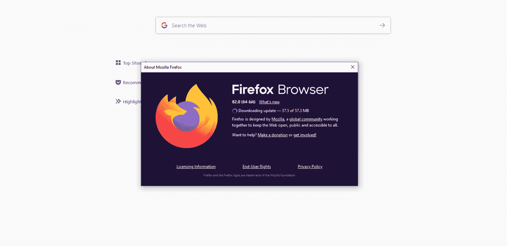
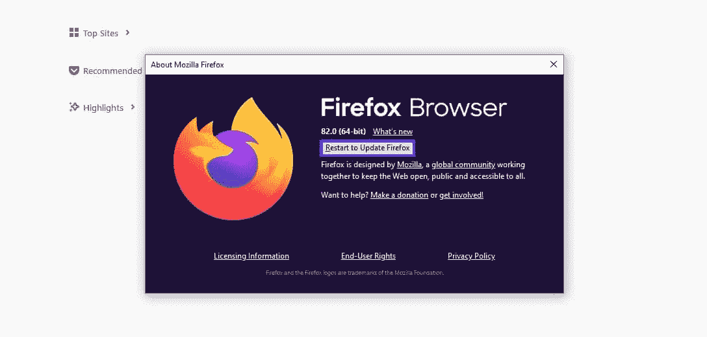
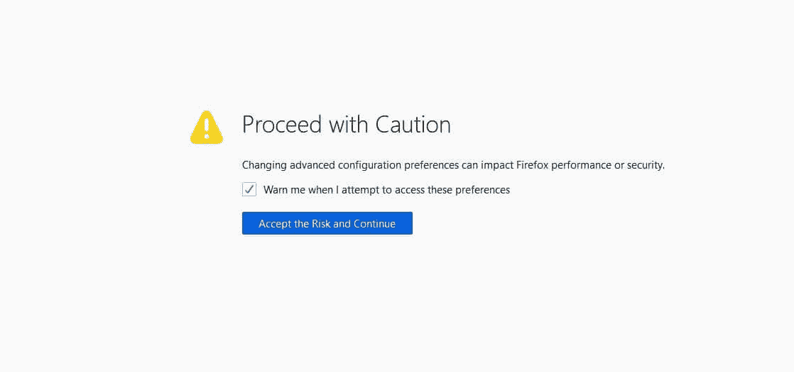
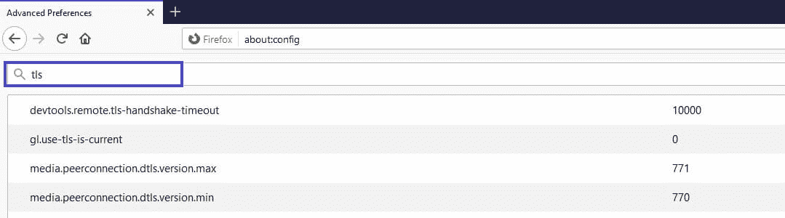
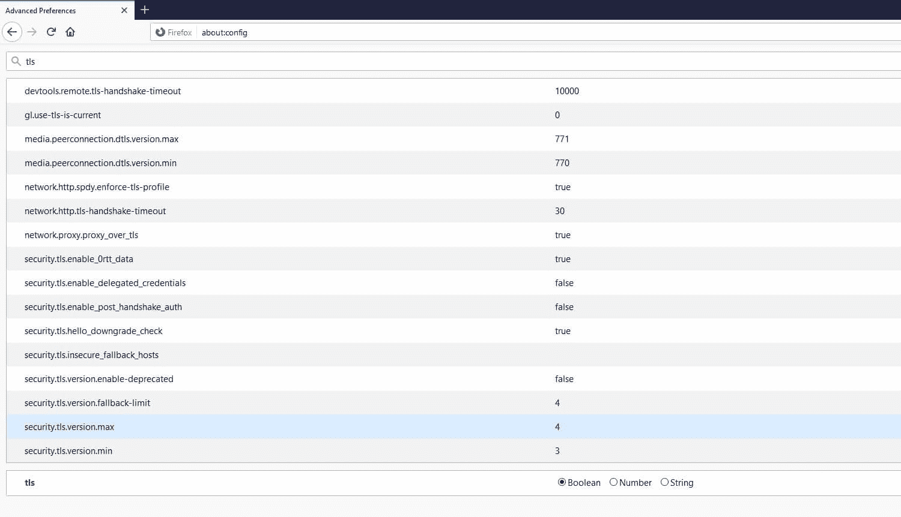
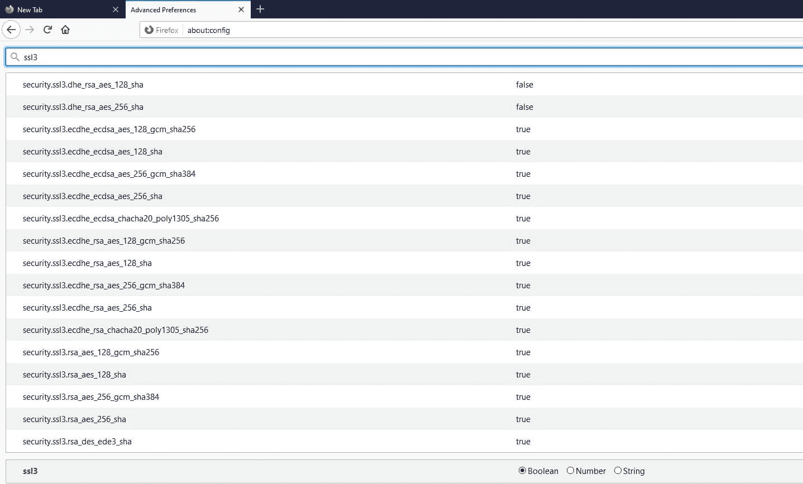
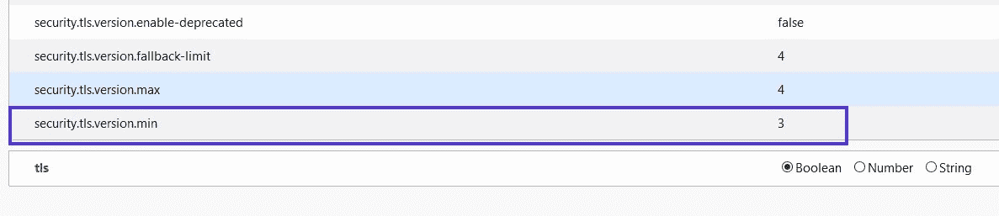
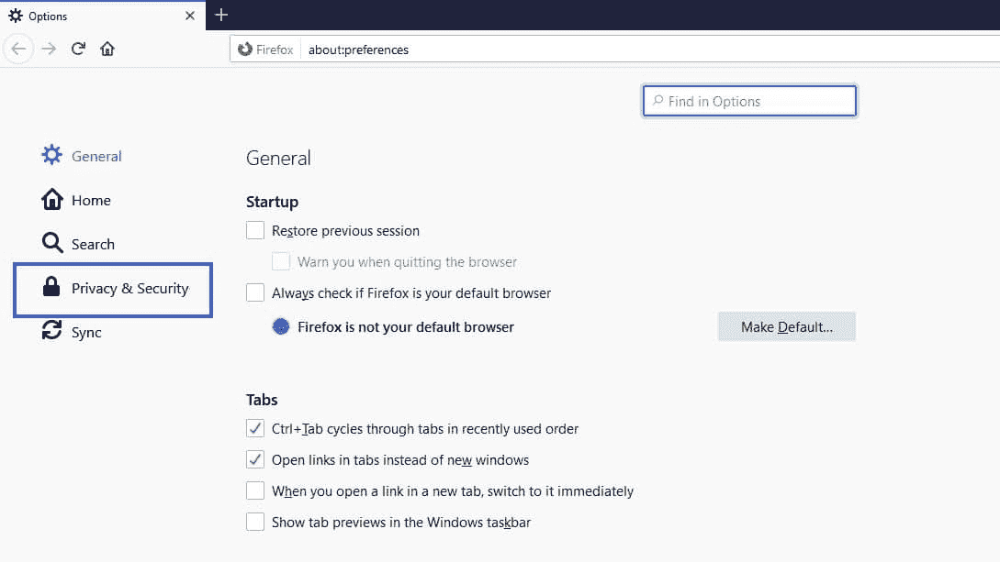
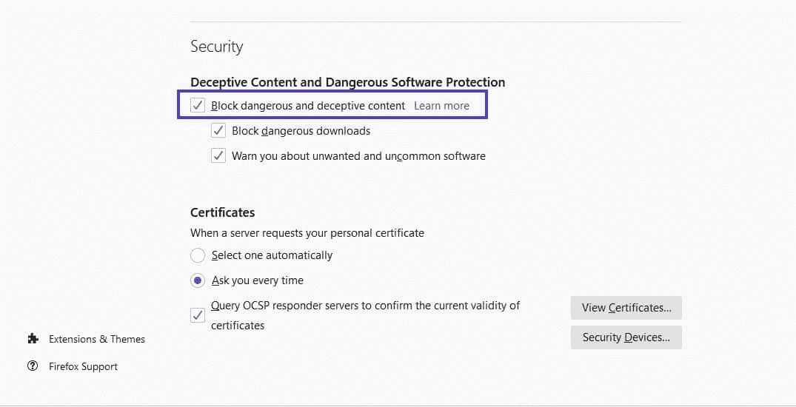

# 修复“SSL_ERROR_NO_CYPHER_OVERLAP”错误的 3 种方法

> 原文：<https://kinsta.com/blog/ssl_error_no_cypher_overlap/>

你可能会在网上遇到各种各样与浏览器相关的问题。如果你使用的是 Mozilla Firefox 浏览器，其中一个潜在的问题就是**SSL _ ERROR _ NO _ CYPHER _ OVERLAP**错误。和任何错误一样，它既令人沮丧又令人担忧，尤其是当你不知道是什么原因造成的时候。

您可以采取一些简单的步骤来诊断和解决此问题。更好地理解这个错误背后的原因将有助于您立即修复它。

在本帖中，我们将解释`SSL_ERROR_NO_CYPHER_OVERLAP`错误的含义及其一些可能的原因。然后，我们将向您介绍如何使用三种可能的方法来修复它。

我们开始吧！

### 更喜欢看[视频版](https://www.youtube.com/watch?v=KRvymG27y08)？

## 什么是“SSL_ERROR_NO_CYPHER_OVERLAP”错误？

与其他浏览器错误不同，**SSL _ ERROR _ NO _ CYPHER _ OVERLAP**错误专门发生在 Firefox 上。谷歌 Chrome 有一个类似但略有不同的版本，它的消息是“[ERR _ SSL _ VERSION _ OR _ CIPHER _ MISMATCH](https://kinsta.com/knowledgebase/err_ssl_version_or_cipher_mismatch/)”。

> 需要在这里大声喊出来。Kinsta 太神奇了，我用它做我的个人网站。支持是迅速和杰出的，他们的服务器是 WordPress 最快的。
> 
> <footer class="wp-block-kinsta-client-quote__footer">
> 
> 
> 
> <cite class="wp-block-kinsta-client-quote__cite">Phillip Stemann</cite></footer>

[View plans](https://kinsta.com/plans/)

简而言之，当 Firefox 无法从您试图访问的网站获取安全数据时，就会出现这种错误。通常，当你试图访问的网站较旧，没有更新的[安全套接字层(SSL)保护](https://kinsta.com/knowledgebase/ssh-vs-ssl/)时，就会发生这种情况。

如果你不熟悉的话， [SSL 是你的电脑和网站服务器之间的加密技术](https://kinsta.com/knowledgebase/how-ssl-works/)。如果您遇到这个错误消息，这意味着您的浏览器不能在它们之间安全地通信。需要注意的是，SSL 本质上与[传输层安全性(TLS)](https://kinsta.com/knowledgebase/tls-vs-ssl/) 是一样的，稍后将再次提到。

[If you've ever seen this error, you know how frustrating it can be 🤯 Luckily, you can take some simple steps to troubleshoot it, and it all starts with this guide 👇Click to Tweet](https://twitter.com/intent/tweet?url=https%3A%2F%2Fkinsta.com%2Fblog%2Fssl_error_no_cypher_overlap%2F&via=kinsta&text=If+you%27ve+ever+seen+this+error%2C+you+know+how+frustrating+it+can+be+%F0%9F%A4%AF+Luckily%2C+you+can+take+some+simple+steps+to+troubleshoot+it%2C+and+it+all+starts+with+this+guide+%F0%9F%91%87&hashtags=Firefox%2CSSL)

### “SSL_ERROR_NO_CYPER_OVERLAP”错误的潜在原因

除了错误信息，Firefox 可能还会显示“数据的真实性无法验证”如果是这样，该消息可能还会建议您联系网站所有者。然而，虽然问题可能是由网站引起的，但也可能与浏览器有关。

更具体地说，有可能是你的 Firefox 版本或你的特定浏览器设置导致了网站和你的电脑之间的错误通信。另一个潜在原因可能是 TLS 或 SSL3 设置被禁用或配置错误。

此外，您的浏览器和服务器必须使用相同的加密密码进行连接。由于存在漏洞，一些密码(如 RC4)不再被主流浏览器支持。如果您尝试连接的网站的服务器使用不支持的加密方法，您可能会看到此错误。

一些用户[报告在](https://community.cloudflare.com/search?q=SSL_ERROR_NO_CYPHER_OVERLAP)[安装 Cloudflare](https://kinsta.com/knowledgebase/install-cloudflare/) 后遇到这个错误。这通常是因为浏览器不支持 Cloudflare 的 SSL 证书使用的[服务器名称指示(SNI)协议](https://support.cloudflare.com/hc/en-us/articles/200170566-Why-am-I-getting-a-SSL-mismatch-error-#h_c1a6e78e-150d-4db6-89ab-eec7cb1ab03f)。

## 修复“SSL_ERROR_NO_CYPHER_OVERLAP”错误的 3 种方法

现在我们对这个问题有了更多的了解，是时候解决它了。下面是三个潜在的解决方案，你可以用来解决 Firefox 中的 SSL_ERROR_NO_CYPHER_OVERLAP 错误消息。

### 1.更新你的火狐浏览器

解决这个错误的第一个也是最简单的方法是确保你使用的是最新版本的 Firefox 浏览器。为了让你的互联网体验尽可能的顺畅，这是你应该经常做的事情。

要将你的火狐浏览器更新到最新版本，打开浏览器，点击汉堡菜单图标，然后导航到**帮助** > **关于火狐**:

浏览器菜单中的“关于火狐”选项。

如果有任何可用的更新，Firefox 应该立即开始下载:

火狐浏览器通知用户更新正在下载。

下载完成后，点击**重启以更新 Firefox** 按钮:

火狐的“重启更新”选项。

或者，你可以从[火狐网站](https://www.mozilla.org/en-US/)获得最新版本的浏览器。在下载它之前，记得从你的计算机上卸载你的当前版本。

要在 Windows 上这样做，点击 **Windows** + **R** 键，然后在搜索框中键入“appwix.cpl”并按下**回车**。在程序管理器下，找到 Firefox，右键点击，选择**卸载**。

## 注册订阅时事通讯

### 想知道我们是怎么让流量增长超过 1000%的吗？

加入 20，000 多名获得我们每周时事通讯和内部消息的人的行列吧！

[Subscribe Now](#newsletter)

在 macOS 上，点击顶部工具栏中的**转到>应用程序**。然后把 Mozilla Firefox 拖到垃圾桶里删除。

### 2.重置您的 TLS 和 SSL3 设置

如果你使用的是最新的 Firefox 版本，或者更新它没有帮助，下一步你可以尝试重置你的 [TLS 和 SSL3](https://kinsta.com/knowledgebase/tls-vs-ssl/) 设置。一些网站需要这些协议来建立连接。因此，如果您的被禁用，这可能是您看到“SSL_ERROR_NO_CIPHER”错误的原因。

要重置它们，请在 Firefox 浏览器中打开一个新标签，并在地址栏中键入“about:config”。您可能会看到一条消息说，“这可能会使您的保修失效！”或者“小心行事”:

来自火狐的一个“小心行事”的安全警告通知。

这个警告是 Firefox 防止你不小心对你的浏览器设置作出重大改变的一种方式。点击**接受风险并继续**继续。

在下一个高级首选项屏幕的搜索栏中，键入“tls”:

火狐高级首选项屏幕的搜索栏。

键入以下内容将生成所有 TLS 配置的列表:

Firefox 中 TLS 配置列表。

寻找任何加粗的值，因为它们是最近发生变化的值。对于任何加粗的值，右击它们并选择 **Reset** 将其恢复到默认设置。

需要一个给你带来竞争优势的托管解决方案吗？Kinsta 为您提供了令人难以置信的速度、一流的安全性和自动伸缩功能。[查看我们的计划](https://kinsta.com/plans/?in-article-cta)

接下来，对 SSL3 重复相同的过程。在搜索栏中键入“ssl3”，并重置任何最近更改的值:

Firefox 中 SSL3 配置列表。

此外，确保以下两项设置为**假**:

*   security . SSL 3 . dhe _ RSA _ AES _ 128 _ sha
*   security . SSL 3 . dhe _ RSA _ AES _ 256 _ sha

出于安全目的，阻止这些设置至关重要。

### 3.绕过您的安全协议和浏览器配置

一般来说，我们建议您不要绕过浏览器安全协议，因为它们的目的是防止您访问[不安全的网站](https://kinsta.com/blog/wordpress-security/)。但是，如果您知道您尝试访问的站点是安全的，您可以通过手动输入密码验证来绕过此错误。

为此，请返回 Firefox 浏览器的 **about:config** 屏幕。再次在搜索栏中键入“tls”。从列表中，导航到 **security.tls.version.min** :

Locating the security.tls.version.min preference in the Firefox browser.

单击最右边的铅笔图标编辑项目，然后输入“0”作为值。接下来，对**security . TLS . version . fallback-limit 重复相同的过程。**

你可以绕过加密协议的最后一个方法是改变你浏览器的隐私设置。为此，打开你的 Firefox 菜单，然后导航到**选项** > **隐私&安全**:

火狐设置中的

隐私&安全菜单选项。

在**安全**部分下，取消选择**拦截危险和欺骗性内容**:

火狐设置的“安全”部分。

希望在这一点上，您已经成功地解决了错误。如果不是，那么很可能是服务器端的问题。最常见的情况是，当一个站点使用 RC4 专用的密码套件时，就会出现这种情况。

由于存在漏洞，包括 RC4 在内的一些密码不再被主流浏览器支持。您可以[运行 SSL 检查](https://kinsta.com/knowledgebase/ssl-check/)来验证您的 SSL 证书没有使用过时的密码。

如果你不是网站所有者，剩下唯一要做的就是联系他们，确保他们知道问题所在。

[It's time to get to the bottom of this annoying error once and for all 😅, thanks to this walkthrough ⬇️Click to Tweet](https://twitter.com/intent/tweet?url=https%3A%2F%2Fkinsta.com%2Fblog%2Fssl_error_no_cypher_overlap%2F&via=kinsta&text=It%27s+time+to+get+to+the+bottom+of+this+annoying+error+once+and+for+all+%F0%9F%98%85%2C+thanks+to+this+walkthrough+%E2%AC%87%EF%B8%8F&hashtags=Firefox%2CSSL)

## 摘要

被拒绝访问你想访问的网站一点都不好玩。当您面前的错误消息像**SSL _ ERROR _ NO _ CYPHER _ OVERLAP**错误一样令人困惑时，这可能会特别令人沮丧。幸运的是，您可以采取一些简单的步骤来解决这个与 Firefox 相关的问题:

1.  将您的 Firefox 浏览器更新至最新版本。
2.  重置您的 TLS 和 SSL3 设置。
3.  绕过您的安全协议和浏览器配置。

关于解决此错误，您有什么问题吗？请在下面的评论区告诉我们！

* * *

让你所有的[应用程序](https://kinsta.com/application-hosting/)、[数据库](https://kinsta.com/database-hosting/)和 [WordPress 网站](https://kinsta.com/wordpress-hosting/)在线并在一个屋檐下。我们功能丰富的高性能云平台包括:

*   在 MyKinsta 仪表盘中轻松设置和管理
*   24/7 专家支持
*   最好的谷歌云平台硬件和网络，由 Kubernetes 提供最大的可扩展性
*   面向速度和安全性的企业级 Cloudflare 集成
*   全球受众覆盖全球多达 35 个数据中心和 275 多个 pop

在第一个月使用托管的[应用程序或托管](https://kinsta.com/application-hosting/)的[数据库，您可以享受 20 美元的优惠，亲自测试一下。探索我们的](https://kinsta.com/database-hosting/)[计划](https://kinsta.com/plans/)或[与销售人员交谈](https://kinsta.com/contact-us/)以找到最适合您的方式。