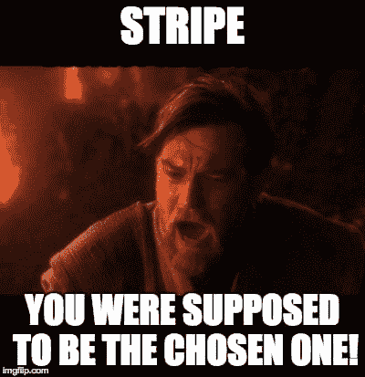

# 创业公司应该避免条纹吗？我们如何找回我们的账户

> 原文：<https://kinsta.com/blog/startups-avoid-stripe/>

**更新:**本帖最初写于 2014 年。这篇文章发表几个小时后，Stripe 的很多人联系了我们，并恢复了我们的账户。从那以后我们再也没有遇到过任何问题。[跳到后续](#follow-up)。

## 为什么我们选择条纹

近年来，我们听到了许多关于 Stripe 的消息，但作为一家欧洲公司，我们在很长一段时间内都无法签约。直到他们最终开始接受英国公司。自 2007 年以来，我们一直是 PayPal 的大用户，无论是作为商家还是买家，在他们的平台上交易超过 100 万美元。我们与 PayPal 支持团队有过公平的争议和长时间的聊天，但没有什么不可收拾的。

PayPal 有两个主要问题:

1.  他们的声誉，很多客户告诉我们，他们想尽一切办法避免用贝宝支付。
2.  他们的 API 是一场噩梦；它过于复杂，缺乏 2014 年应该默认的功能。长话短说，我们很高兴用 Stripe 构建了 Kinsta 的信用卡受理程序[。](https://kinsta.com/blog/stripe-for-wordpress/)

注册过程很简单，尽管你必须提交很多文件，这是可以理解的。当你在等待你的 live 帐户的确认时，你已经可以开始为他们的 API 构建你的客户端了，他们为最常见的语言提供了库，这些语言是基于现代编程标准编写的，因此，它们非常容易使用。这并不奇怪，因为 Stripe 的诞生源于创始团队对当时可用的支付处理器的失望，他们打算颠覆这个行业。

他们做到了:这个 API 不像 PayPal 那样让人觉得只是一种事后的想法，使用它是一种真正的乐趣。使用 Stripe 设置并开始接收付款非常简单。

## 然后问题开始了

我不记得上一次我们不得不在网上处理欺诈性支付是什么时候了，也许我们是幸运的(或者也许 PayPal 的欺诈保护根本不是那么糟糕)。在我们开始在我们的网站上使用 Stripe(包括 PayPal 和比特币)大约一周后，第一个骗子来了。有趣的是，他支付了服务费用(显然是用偷来的信用卡)，却从未使用过这项服务！那笔款项被退回一周后，由于我们的团队已经认为可疑，我们立即退款。

随着我们交易数量的增加，欺诈活动也在增加。同样，奇怪的是，除了一个人(他试图使用一个帐户发送电子邮件，但他很快被抓住并被禁止)以外，所有被盗信用卡滥用者都只想付给我们钱，然后什么也不做，这在我看来似乎不合逻辑。如果他们想测试一堆卡号，他们可以通过一项收费 1 美元左右的服务来完成，如果他们想用它来发送垃圾邮件或做其他事情，为什么他们不至少尝试一下呢？

不幸的是，Stripe 收取 15 美元的退款费用，因此我们在每笔交易上都在赔钱，在我看来，Stripe 甚至应该在交易发生之前就停止这些交易。例如，有一个人使用了同一个电子邮件地址，在 15 分钟内尝试了来自 3 个不同大陆的卡片。除非他是闪电侠，否则这是不可能的，这对于我所知道的所有支付处理商来说都是一个巨大的警告，但 Stripe 没有眨一下眼睛。

由于我们正在亏损，而 Stripe 没有提供任何帮助来阻止这些事情，我们开始寻找一家专门从事在线欺诈防范的公司。这里有几个我们听说过但还没有机会去验证的例子:MaxMind 的 [minFraud](https://www.maxmind.com/en/minfraud-services) 、 [Sift Science](https://siftscience.com/) 和 [Signifyd](https://signifyd.com/) 。即使对小企业来说，它们也非常实惠。我真的不知道为什么 Stripe 不与这些公司合作，对我来说这似乎是显而易见的。

在我们完成上述任何服务的实施之前，一天晚上(我想强调一下*晚上*的部分),我们收到了 Stripe 发来的一封电子邮件，内容如下:

> 嗨，
> 
> 感谢您注册 Stripe！
> 
> 很遗憾，目前我们需要停止为 kinsta.com 提供服务。目前，Stripe 只能支持客户纠纷风险较低的用户-在审查您提交的信息和网站后，您的网站似乎比我们目前所能支持的风险更高。遗憾的是，我们无法代表您接受任何额外付款。

就这样。

[T2】](https://kinsta.com/wp-content/uploads/2014/11/500px-Anchorman-well-that-escalated-quickly.jpg)

我想强调的是，我们的合法用户没有任何争议，只有被盗信用卡的所有者通过他们的银行要求退款，这是你所期望的。然而，我在任何情况下都没有想到的是，Stripe 会在半夜关闭我们的账户，没有任何合理的通知。或者帮忙。这与之前我们在 Stripe 上经历的一切完全不同。

他们本可以给我们一些建议，告诉我们如何最大限度地减少欺诈，我们本可以改变我们的表单或任何东西。再加上一个警告，比如“如果这种情况继续下去，我们将不得不暂停你的帐户”，在最终决定前几周也是不错的。最重要的是，他们没有回答关于这个问题的询问。这是一个如何不处理客户关系的完美案例。

是我们的问题吗？在谷歌上搜索了一下，发现这是如今在 Stripe 做生意的一种相当常见的方式。看[这里](https://ecommerce.shopify.com/c/payments-shipping-fulfilment/t/stripe-all-store-owners-please-read-212164)，这里[这里](https://garridodiaz.com/fraud-payments-stripe/)，这里[这里](http://lowendtalk.com/discussion/25447/anyone-else-had-a-stripe-account-closed)，这里[这里](https://ecommerce.shopify.com/c/payments-shipping-fulfilment/t/worst-experience-with-stripe-payment-gate-how-many-people-using-stripe-151491)。如果你需要更多，你可以自己搜索一下，并特别注意评论部分。

## 注册订阅时事通讯

### 想知道我们是怎么让流量增长超过 1000%的吗？

加入 20，000 多名获得我们每周时事通讯和内部消息的人的行列吧！

[Subscribe Now](#newsletter)

事实证明我们很幸运，我们有程序员，可以在短时间内转移到另一个 API。当日常销售和运输有形产品的人被诈骗时，这可能会破坏他们的整个业务，有时还会破坏他们的生活(正如我们在上面链接的主题中所读到的)。认为实施一个良好的欺诈检测系统可以解决所有这些问题，然而他们却对此无所作为，这令人难以置信。

## 外卖食品

不久前，Stripe 还只是一家为所有新客户感到高兴的初创公司，旨在颠覆 PayPal 处理客户服务和整体业务的方式。几年后，他们变成了同样的无名企业。即使当你扩展的时候很困难，你也不应该忘记你最初的目标，这样你才能保持真实的自我，并提供用户最初注册的价值。这应该是每个与客户打交道的人最重要的一点，包括 Kinsta。

当你在建立一家你想长期经营的公司时，不要忘记你目前的小客户(我还没有自大到认为自己在 Stripe 眼里除了微小之外什么都不是)可以在任何时候变得巨大，毕竟这是我们正在谈论的互联网！我们生活在超大规模的时代。

同样重要的是，作为一家初创公司，你要为客户提供多种支付方式。不是所有人都喜欢贝宝，但也不是所有人都信任使用信用卡的网上商家——还有一些人喜欢使用比特币。如果你现在正在创业，最好为“下一件大事”做好准备。比特币可能是其中之一。

我们真诚地希望比特币(或基于比特币奠定的基础的其他东西)在未来几年成为主流，它让这一切变得如此简单(没有争议，没有退款，费用低得离谱)。虽然现在我们会和其他几家信用卡处理公司谈谈(但我们倾向于 [Braintree](https://www.braintreepayments.com/) )，一旦我们有了解决方案，我们会更新这篇文章。在那之前，我们只能建议你远离 Stripe，他们不再是以前的伟大创业公司了。

## 跟进——几小时后

我们都会犯错。我们只是一个小型的托管创业公司，但我们不时会犯错误，我可以想象照顾成千上万的客户有多难。不过，这不是借口，你必须积极主动，如果你犯了错误，你最好承认并从中吸取教训。

Struggling with downtime and WordPress problems? Kinsta is the hosting solution designed to save you time! [Check out our features](https://kinsta.com/features/)

这正是 Stripe 所做的，我很高兴地说，我们重新激活了我们的帐户，公司的许多友好的人联系了我们，并确保我们不会感到落后。我甚至有机会与帕特里克·科利森和 T4 的联合创始人聊天，帕特里克·是 T2 条纹公司的联合创始人，安迪·杨是条纹公司英国分部的负责人。这些人正在建立一家价值超过 10 亿美元的公司，但仍然花时间亲自联系我们，现在*这就是*模范客户服务。

当你处理大量的客户时，你必须有一个(高)水平的自动化，否则你将不得不操作一个大到可以填满一个城市的客户支持团队。自动化从来都不是完美的，作为一个在搜索引擎优化(SEO)行业工作了五年的人，我对被算法搞砸并不陌生。

在谷歌的情况下，我们习惯于无法接触任何人，我们唯一的选择是掸掉身上的灰尘，重新开始。然而，我并不指望我们作为付费客户的公司会有同样的表现。在我看来，这是最令人伤心的事情:无法为你的问题寻求帮助，以及缺乏与商业伙伴的沟通。

## 外卖

如果你直接与客户打交道，客户服务就是一切，在当今的社交媒体时代更是如此。Stripe 不是唯一的在线支付处理器，就像他们在 PayPal 的阴影下成长一样(PayPal 没有提供足够的客户支持，使开发者很难集成他们的服务)，他们可能会被当前或未来的竞争对手淘汰，这些竞争对手可能会以相同的定价水平提供更好的支持和/或更好的产品。在今天所有相互联系的世界里，每天都有巨头崛起*和*倒下。

坏消息和差评比好消息传播得快得多，这是事实。你必须尽可能地监控社交媒体。不管你喜不喜欢，关于你的品牌的讨论正在发生，你唯一的选择是加入或者视而不见，假装社交媒体不存在。现在，如果你想建立一个长期的业务，这不是一个真正的选择。

在我看来，要想创业成功，你必须具备三样东西:有价值的支持、你所在领域最好的产品(或服务)和有竞争力的价格。

然而，客户支持就是一切。有可能创始人和管理层在联系支持团队时甚至不知道客户面临的问题。或者一夜之间，账户立即被关闭。不时地直接询问客户的反馈，并与他们一起努力使你的产品变得更好，这一点很重要。

金斯塔所在的行业(虚拟主机)因糟糕的客户服务而臭名昭著。我想在过去，很容易组装一个好的服务器盒子，并在上面放置尽可能多的客户，拿走他们的钱，当他们抱怨时，你让他们觉得他们没有资格获得任何支持，因为服务太便宜了。

尽管 Kinsta 在我们目前的所有竞争对手中提供了最好的虚拟主机性能，但这只是成功秘诀的 10%。我认为是附加值(备份、安全性、自定义管理功能等。)是另外的 10%，另一个 *80%是客户支持*。每个了解 Linux 的人都可以组装一个托管服务器，他们中的一些人甚至可以构建出色的服务器，但如果他们不提供狂热的支持(我希望 [Rackspace](https://kinsta.com/rackspace-alternative/) 不会因为使用他们的商标术语而起诉我们……)这是远远不够的。

## 摘要

正如我前面提到的，我们真的很喜欢条纹。作为我们团队的首席开发人员，我认为这是自 PayPal 以来在线支付领域发生的最好的事情。他们犯了一个错误，对他们来说可能是一个小错误，但对我们来说却是一个大错误，当我指出他们的错误时，他们会承认错误，并尽他们所能去弥补。我很乐意称他们为商业伙伴。

**更新:**快进 5 年，我们仍然对 Stripe 感到满意。事实上，你可以看看[我们是如何利用条纹雷达将信用卡诈骗减少 98%的。](https://kinsta.com/blog/credit-card-fraud-stripe/)

* * *

让你所有的[应用程序](https://kinsta.com/application-hosting/)、[数据库](https://kinsta.com/database-hosting/)和 [WordPress 网站](https://kinsta.com/wordpress-hosting/)在线并在一个屋檐下。我们功能丰富的高性能云平台包括:

*   在 MyKinsta 仪表盘中轻松设置和管理
*   24/7 专家支持
*   最好的谷歌云平台硬件和网络，由 Kubernetes 提供最大的可扩展性
*   面向速度和安全性的企业级 Cloudflare 集成
*   全球受众覆盖全球多达 35 个数据中心和 275 多个 pop

在第一个月使用托管的[应用程序或托管](https://kinsta.com/application-hosting/)的[数据库，您可以享受 20 美元的优惠，亲自测试一下。探索我们的](https://kinsta.com/database-hosting/)[计划](https://kinsta.com/plans/)或[与销售人员交谈](https://kinsta.com/contact-us/)以找到最适合您的方式。