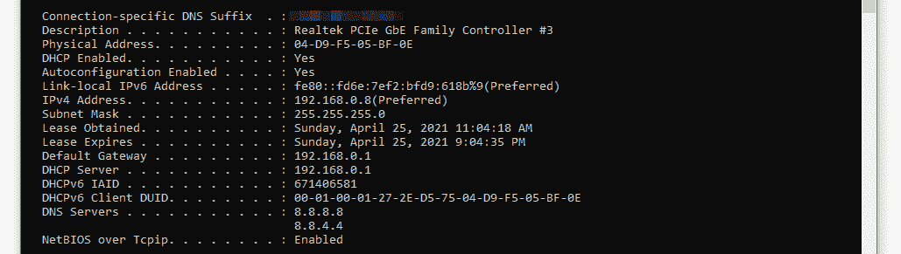
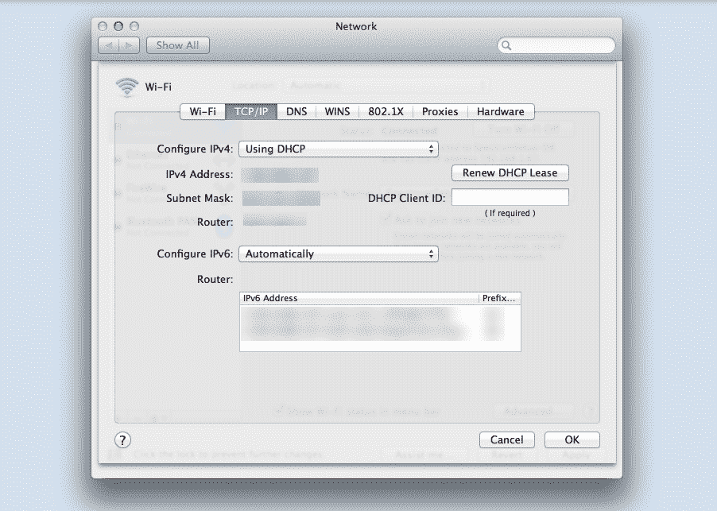
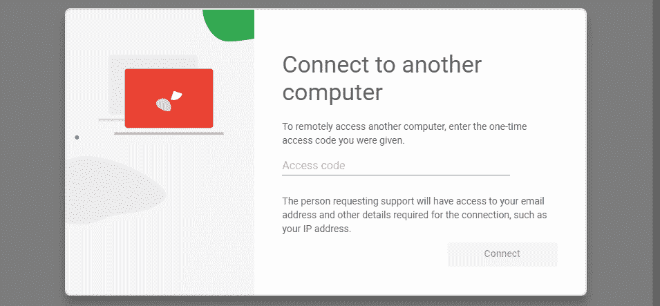
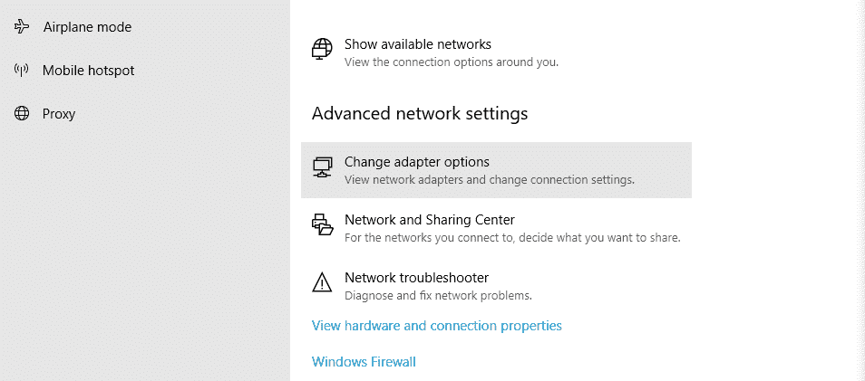
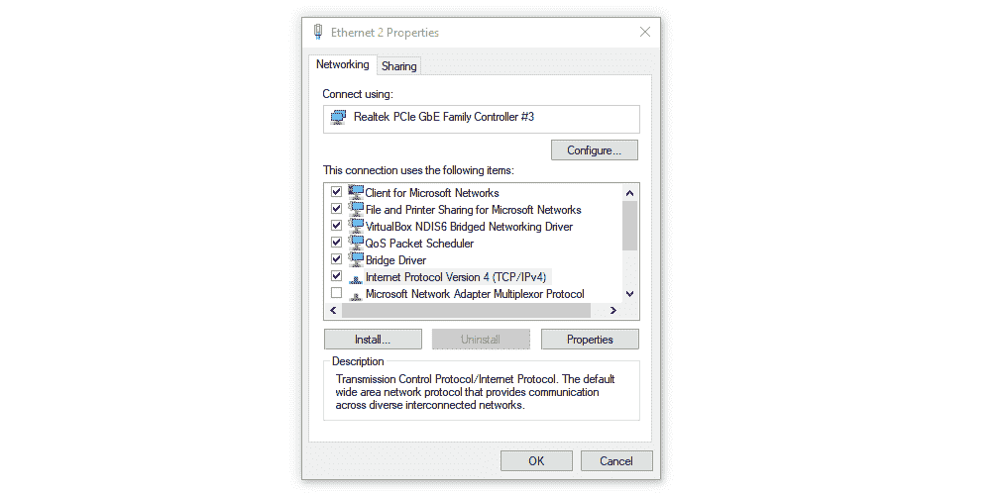
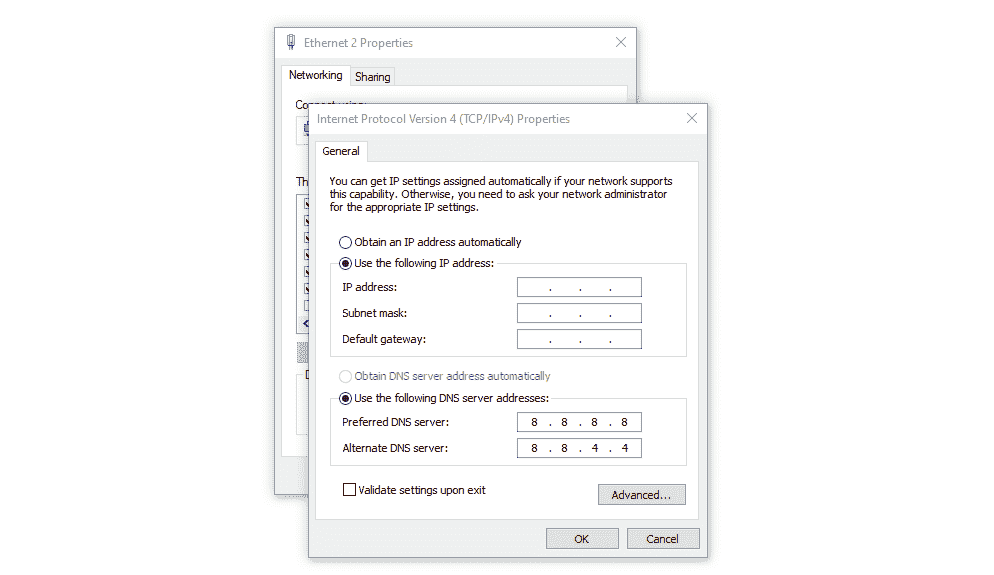
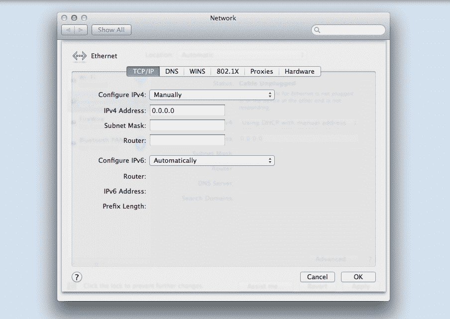

# 静态与动态 IP 地址:您需要知道的一切

> 原文：<https://kinsta.com/blog/static-vs-dynamic-ip/>

每台连接到互联网的计算机都有一个[互联网协议(IP)地址](https://kinsta.com/tools/what-is-my-ip/what-is-my-ip/)。然而，并非所有 IP 地址的外观或行为都相同。

如果您正在使用计算机网络或服务器，了解动态和静态 IP 之间的区别是至关重要的。通过了解每种协议，您可以选择最适合您需求的解决方案。

在本文中，我们将讨论静态和动态 IPs 之间的区别。我们还会帮你算出你的 IP 地址，并解释如何给它分配一个固定的号码(如果你愿意的话)。

我们开始工作吧！

## 静态 IP 和动态 IP 地址简介

正如我们之前提到的，每个支持互联网的设备都有一个 IP 地址。它可以是唯一的数字或字母数字字符串，具体取决于您使用的协议。大多数设备使用 IPv4 地址，看起来像这样:*151.164.152.92。*

虽然 IP 地址起初看起来可能是随机的，但它们包含了许多关于您当前网络的信息。以下是上例中每个分段所代表的含义:

*   **151.164 . xx . xx**—IP 地址的前半部分标识您的网络。根据您所在的位置，它可以指互联网提供商，甚至更广泛的一组设备。
*   **xx . xx . 152.92**—IP 地址的后半部分标识您的主机和网络中的每台机器。并非本地网络中的所有设备都共享同一个 IP 地址。

请记住，这只是 IP 地址的一个例子。当我们谈论“静态”地址时，我们指的是一系列识别您的设备并且永远不会改变的数字。

> 需要在这里大声喊出来。Kinsta 太神奇了，我用它做我的个人网站。支持是迅速和杰出的，他们的服务器是 WordPress 最快的。
> 
> <footer class="wp-block-kinsta-client-quote__footer">
> 
> 
> 
> <cite class="wp-block-kinsta-client-quote__cite">Phillip Stemann</cite></footer>

[View plans](https://kinsta.com/plans/)

如果您有一个动态 IP 地址，数字标识符将定期更改。通常，这种调整是由您的互联网服务提供商(ISP)做出的，通常您甚至不会意识到这一点(因为这通常不会影响浏览体验)。

[Understanding the difference between dynamic and static IPs is key if you’re working with computer networks or servers. 👩‍💻 This guide will help you get started. ⬇️Click to Tweet](https://twitter.com/intent/tweet?url=https%3A%2F%2Fkinsta.com%2Fblog%2Fstatic-vs-dynamic-ip%2F&via=kinsta&text=Understanding+the+difference+between+dynamic+and+static+IPs+is+key+if+you%E2%80%99re+working+with+computer+networks+or+servers.+%F0%9F%91%A9%E2%80%8D%F0%9F%92%BB+This+guide+will+help+you+get+started.+%E2%AC%87%EF%B8%8F&hashtags=IP%2CTechTips)

## 确定你的知识产权是什么

[查找您的 IP 地址](https://kinsta.com/help/ipv4-address/)的工作方式因您使用的操作系统(OS)而异。让我们回顾一下 Windows 和 macOS 设备的流程。

### 如何在 Windows 中找到您的 IP 地址

在 Windows 中找到您的 IP 地址的最简单的方法是打开开始菜单，键入“cmd”并启动命令提示符。一旦命令提示符打开，键入“ipconfig /all”并按下 **Enter** 键。

命令提示符将返回所有网络适配器的信息，因此您需要确定您使用的是哪一个:

使用 Windows 命令提示符查找您的 IP 地址。

需要整理的信息很多，但目前只有两个要素很重要:

1.  **IPv4 地址:**这是您的 IP 地址，在本例中，我们使用的是 IPv4 协议。
2.  **DHCP Enabled:** 如果[动态主机配置协议(DHCP)](https://www.networkworld.com/article/3299438/dhcp-defined-and-how-it-works.html) 被启用，则意味着*没有*静态 IP 地址。

我们稍后将讨论动态和静态 IPs 的优缺点。现在，让我们来看看如果你使用 macOS，如何找到你的 IP 地址。

### 如何在 macOS 中找到您的 IP 地址

如果您正在使用 macOS，找到您的 IP 地址的最快方法是打开**网络偏好设置**菜单并选择您正在使用的网络。点击相关的**高级**按钮，然后选择 **TCP/IP** 选项卡:

在 macOS 上查找自己的 IP 地址。

您的 IP 地址将显示在 **IPv4 地址**或 **IPv6 地址**旁边，这取决于您的网络使用的协议。我们将在后面的章节中讨论这些协议之间的区别。现在，检查使用 DHCP 的**选项是否在任一部分下启用。**

如果启用了 DHCP，您将拥有一个动态 IP 地址。您已经知道了动态和静态 IP 地址之间的区别，但是现在是时候讨论您应该使用哪个选项了。

## 静态与动态 IP 地址(4 个关键考虑因素)

使用静态或动态 IP 地址各有利弊。在接下来的几节中，我们将分解选择这些类型时要记住的四个重要因素。

### 1.何时应该使用静态 IP 地址

最常被分配静态 IP 的两种设备是服务器和外围设备。如果你正在使用你的设备浏览网页，那么从技术上来说，你的 IP 地址是否一直在改变并不重要。

但是，静态 IP 地址在某些情况下是必需的，包括:

*   使用允许的 IP 地址连接到[虚拟专用网络(VPN)](https://kinsta.com/blog/proxy-vs-vpn/)
*   使用允许的 IP 地址访问网站管理部分
*   远程访问您的设备

许多网络主机和电子邮件提供商提供静态 IP 地址，作为特定计划的额外服务。然而，你不一定需要一个静态的 IP 地址来运行一个网站。

如果你远程工作，你需要连接到 VPN 来访问工作文件，你的雇主可能会要求你设置一个静态 IP 地址。[允许现有 IP 地址](https://www.csoonline.com/article/3562429/whitelisting-explained-how-it-works-and-where-it-fits-in-a-security-program.html)使雇主和其他网络管理员能够决定谁有权访问系统，这对安全目的至关重要。

在这两种情况下拥有一个静态 IP 地址也意味着你是唯一使用它的人。使用共享的 IP 地址，如果其他用户发送垃圾邮件或建立被认为不安全的网站，您可能会受到惩罚。

然而，在实践中，任何有信誉的网络主机或电子邮件提供商都会确保你不会遇到任何问题，即使你使用的是共享的 IP 地址。例如，在 Kinsta，我们使用 Cloudflare 提供的一系列共享 IP 地址[，您的网站不会因此受到任何负面影响。](https://kinsta.com/knowledgebase/cloudflare-integration/)

### 2.何时应该使用动态 IP 地址

在大多数情况下，你的 IP 地址是否定期更改并不重要。如果您不需要经常访问专用网络，或者没有人需要远程访问您的设备，您可以不使用静态 IP 地址。

需要注意的是，IP 地址的数量是有限的，即使它们是动态变化的，一些 IP 地址最终还是会重复或被共享。过去，共享 IP 地址给网站和个人使用带来了严重的问题。然而，如今没有静态 IP 地址的*几乎没有缺点。*

### 3.家庭网络的静态与动态 IP 地址:使用哪一个

在大多数情况下，您的互联网提供商将决定您使用动态还是静态 IP 地址。但是，即使您的提供商默认提供动态 IP 地址，也总有办法设置静态 IP 地址。

## 注册订阅时事通讯

### 想知道我们是怎么让流量增长超过 1000%的吗？

加入 20，000 多名获得我们每周时事通讯和内部消息的人的行列吧！

[Subscribe Now](#newsletter)

如果您需要连接到 VPN 或具有允许的 IP 地址列表的网站，您将需要一个静态 IP。然而，如果您只需要远程访问您的家庭网络设备，大多数现代工具使您能够连接到它们*而无需*输入 IP 地址。

[例如，谷歌 Chrome 远程桌面](https://remotedesktop.google.com/)会要求您输入唯一的访问代码，而不是 IP 地址:

使用谷歌 Chrome 远程支持连接到远程设备。

这种工具的可用性意味着您的家庭网络很少需要静态 IP 地址，而不是动态 IP 地址。

### 4.动态 IP 与静态 IP:安全考虑

如果有人知道您的服务器或个人设备的 IP 地址，他们可以尝试连接到它。即使您的家庭设备或服务器不包含任何宝贵的信息，恶意行为者也可能会试图闯入。如果你有一个静态的 IP 地址，这意味着那些黑客总是知道在哪里找到你。

动态 IP 地址是现成的更安全的选择。然而，需要注意的是，即使攻击者知道在哪里可以找到你，也不一定意味着他们会进入。有了适当的安全措施，静态 IP 地址和动态 IP 地址一样安全。

## IPv4 和 IPv6 地址的区别

到目前为止，我们只关注了 IPv4 地址。然而，这不是唯一可用的协议。IPv6 是另一种选择，它在某个时候可能会成为 IP 地址的标准。

这些协议之间有几个不同之处。世界慢慢过渡到 IPv6 的主要原因是，由于 IPv4 的配置方式，它只能支持大约 40 亿个 IP 地址。

由于人们拥有多台支持互联网的设备变得越来越普遍，即使有 DHCP 的帮助，40 亿个 IP 地址也是不够的。IPv6 协议通过使用字母数字地址解决了这个问题，这与 IPv4 的纯数字方法形成对比。

以下是 IPv6 地址的一个示例:

2001 年:0db 8:0000:0000:0000:ff00:0042:7879

增加的长度以及字母和数字的混合意味着 IPv6 地址可以支持 340 万亿个地址。这么大的数量，我们不应该用很长时间。

目前，[全球只有大约 35%](https://www.google.com/intl/en/ipv6/statistics.html) 的设备在使用 IPv6 地址。像 IPv4 一样，IPv6 协议支持静态和动态地址。这意味着我们到目前为止讨论的所有考虑因素也适用于这个新协议。

## 如何获得静态 IP 地址

如果你需要一个静态 IP 地址，有几种方法可以得到，这取决于你的情况。在本节中，我们将讨论所有这些问题，无论您是想为 web 服务器还是本地网络设备(有线或无线)设置或更改静态 IP。

需要一个给你带来竞争优势的托管解决方案吗？Kinsta 为您提供了令人难以置信的速度、一流的安全性和自动伸缩功能。[查看我们的计划](https://kinsta.com/plans/?in-article-cta)

### 如何为 Web 或电子邮件服务器设置静态 IP

如果你想为一个不是你自己托管的[网站或电子邮件服务器](https://kinsta.com/blog/gmail-smtp-server/)设置一个静态(非共享)IP，你需要向你的提供商申请一个。在许多情况下，如果你使用 VPS 或云托管计划，虚拟主机或电子邮件提供商会额外提供静态 IP。

请记住，为专用服务器付费并不一定意味着你会得到一个静态 IP。动态 IP 是大多数情况下的标准，所以即使你注册了专门的计划，你可能仍然需要支付额外的费用。

### 如何为本地设备分配静态 IP 地址

如果你有一个动态的 IP 地址，而想要一个静态的，许多人建议联系你的互联网提供商。然而，根据我们的经验，大多数互联网提供商不能为住宅用户分配静态 IP 地址。

您最好的选择是通过您的操作系统或路由器(如果包括您的话)自己配置一个静态 IP。如果您需要一个静态 IP 来连接到另一个具有允许列表地址的网络，您也可以使用提供固定地址的 [VPN。](https://www.comparitech.com/blog/vpn-privacy/vpn-dedicated-ip-static-ip/)

### 如何为 Windows 设备分配静态 IP

您可能还记得，IPv4 地址包括网络和主机标识符。在大多数情况下，您可以将设备配置为使用静态 IP，而不必担心与其他地址冲突。

如果你使用的是 Windows，你可以通过访问操作系统设置下的**网络&互联网**部分，然后选择**更改适配器选项**来完成:

在 Windows 中更改您的网络适配器选项。

您将看到所有可用网络连接的概览。右键单击您的活动网络连接并选择**属性**。接下来，在弹出的窗口中点击**互联网协议版本 4 (TCP/IPv4)** 选项，然后点击**属性**按钮:

在 Windows 中访问您的 IPv4 设置。

将会打开一个新窗口，允许您选择**使用以下 IP 地址**设置。单击该选项，然后设置您想要使用的静态 IP 地址:

在 Windows 中设置静态 IP。

请记住，您不能只输入您想要的任何值。以下是填写每个字段的一些指导，这样您就不会遇到任何错误:

*   **IP 地址:**你设置的静态 IP 要复制你当前地址的前三段。如果你现在的地址是“XXX”。XXX.XXX.XXX”，新的应该是“XXX。XXX.XXX.YYY”。这是因为这些第一段标识了您的网络和主机。
*   **子网掩码:**如果您使用的是住宅网络，您的子网掩码应该是“255.255.255.0”，这意味着您的网络使用 24 位作为其标识符。
*   **默认网关:**这应该是您路由器的 IP 地址，您可以通过打开命令提示符并键入“ipconfig /all”来找到它

填写完每个字段后，点击**确定**。如果您的设置是正确的，您将有一个新的静态 IP。

### 如何将静态 IP 分配给 macOS 设备

在 macOS 设备上分配静态 IP 地址的方式非常相似。您还必须输入一个 IP 地址、一个子网掩码和您的默认网关(您可以在前一节中读到)。

唯一的区别是到达这些设置需要不同的路线。以下是在 macOS 中访问活动网络的**配置 IPv4** 菜单的三个步骤:

1.  打开苹果菜单，点击**系统偏好**，然后选择**网络**选项。
2.  点击左侧面板中的**以太网**。
3.  在**配置 IPv4** 菜单设置下选择**手动**选项。

完成这些步骤后，您需要填写以下字段，包括新的静态 IP 地址、子网掩码和默认网关:

在 macOS 上设置静态 IP 地址。

保存对网络配置的更改，您就可以开始工作了。现在，只要您不将更改恢复到您的网络，您的 IP 地址将保持静态。

[Once you understand the difference between dynamic and static IPs, you can choose the right solution for your needs with confidence 😌 Get started here 👇Click to Tweet](https://twitter.com/intent/tweet?url=https%3A%2F%2Fkinsta.com%2Fblog%2Fstatic-vs-dynamic-ip%2F&via=kinsta&text=Once+you+understand+the+difference+between+dynamic+and+static+IPs%2C+you+can+choose+the+right+solution+for+your+needs+with+confidence+%F0%9F%98%8C+Get+started+here+%F0%9F%91%87&hashtags=IP%2CIPAddress)

## 摘要

大多数互联网和虚拟主机提供商会给你分配动态 IP 地址。通常，这不是一件坏事。但是，在某些情况下，静态 IP 是必要的，例如，如果您需要使用允许列表中的地址访问工作 VPN。

然而，如果你在运营一个网站，你可能不需要一个静态 IP。在 Kinsta，我们向所有客户提供由 Cloudflare 提供的共享 IP 地址。即使没有专用 IP，我们的大多数客户[也能看到他们网站性能的显著提高](https://kinsta.com/blog/boosting-wordpress-performance/)。

关于静态和动态 IP 地址，您有什么问题吗？请在下面的评论区告诉我们！

* * *

让你所有的[应用程序](https://kinsta.com/application-hosting/)、[数据库](https://kinsta.com/database-hosting/)和 [WordPress 网站](https://kinsta.com/wordpress-hosting/)在线并在一个屋檐下。我们功能丰富的高性能云平台包括:

*   在 MyKinsta 仪表盘中轻松设置和管理
*   24/7 专家支持
*   最好的谷歌云平台硬件和网络，由 Kubernetes 提供最大的可扩展性
*   面向速度和安全性的企业级 Cloudflare 集成
*   全球受众覆盖全球多达 35 个数据中心和 275 多个 pop

在第一个月使用托管的[应用程序或托管](https://kinsta.com/application-hosting/)的[数据库，您可以享受 20 美元的优惠，亲自测试一下。探索我们的](https://kinsta.com/database-hosting/)[计划](https://kinsta.com/plans/)或[与销售人员交谈](https://kinsta.com/contact-us/)以找到最适合您的方式。