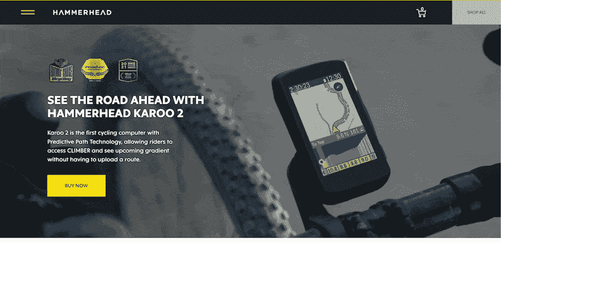
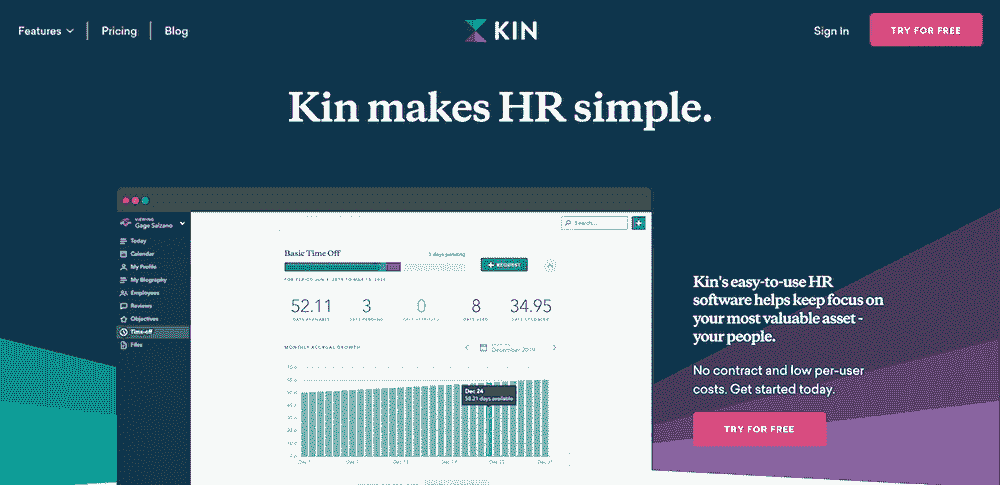
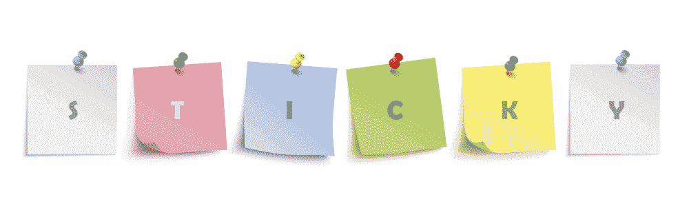
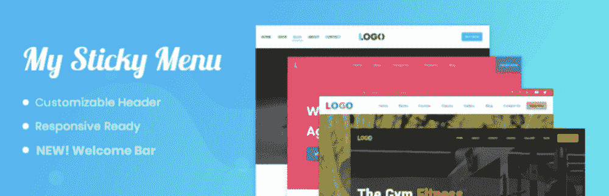
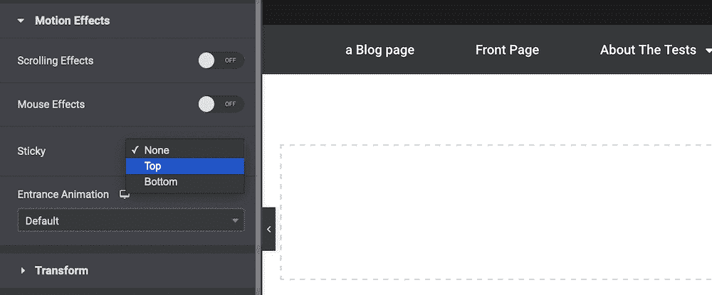
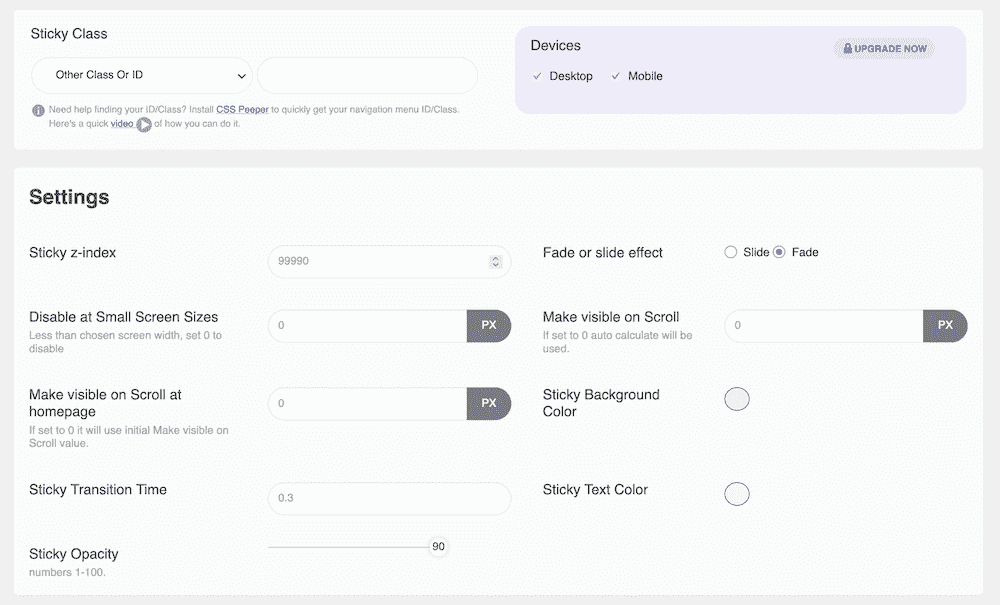
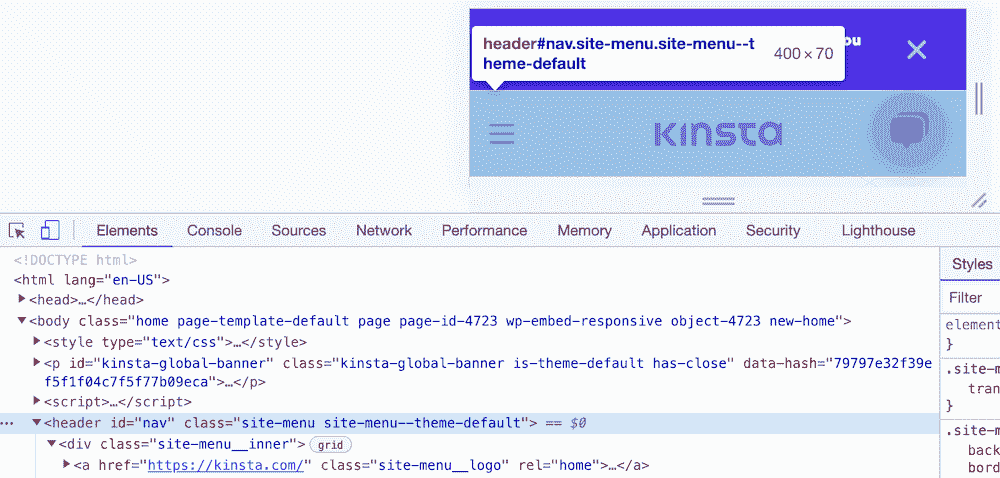
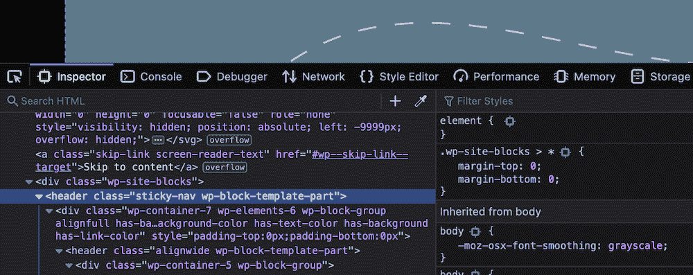

# 如何用 WordPress 为你的网站创建完美的粘性标题

> 原文：<https://kinsta.com/blog/sticky-header/>

导航是一个设计优秀的 WordPress 网站的重要方面。因此，有必要花些时间来思考一下访问者是如何通过你的导航与你的页面进行交互的。一种方法是使用粘性头。

这是当用户滚动时，你的站点的标题部分保持在屏幕顶部的地方。这提供了无数的好处，但是一个主要的优点是你的导航元素保持在用户的视野之内，不管它们在页面上的什么位置。仅仅因为这个原因，粘性头是一个受欢迎的用户界面(UI)元素。

在本教程中，我们将向你展示如何在 WordPress 中创建一个粘性标题。它将涵盖很多方面，比如网络上的例子，可以帮助你的 WordPress 插件，以及如何开发你自己的粘性标题的指南。不过，首先让我们更详细地讨论一下什么是粘性头。

## 多粘的头球啊


A header section of Kotaku’s website.


你网站的页眉部分有点像你网站的信息咨询台。这将是大多数用户最先发现的东西，他们将总是在某个地方检查以找出一些关键信息，并执行某些操作:


> Kinsta 把我宠坏了，所以我现在要求每个供应商都提供这样的服务。我们还试图通过我们的 SaaS 工具支持达到这一水平。
> 
> <footer class="wp-block-kinsta-client-quote__footer">
> 
> 
> 
> <cite class="wp-block-kinsta-client-quote__cite">Suganthan Mohanadasan from @Suganthanmn</cite></footer>

[View plans](https://kinsta.com/plans/)

*   例如，你的徽标或网站名称会出现在这里，作为你的用户的一个接地点。在大多数情况下，他们可以通过点击图标回到主页。
*   如果你在你的网站上运行用户账户，标题通常会提供一个链接来登录这些账户和个人资料页面。
*   这里可能有[搜索功能](https://kinsta.com/blog/google-search-operators/)，特别是如果你有一个在不同区域有大量内容的大型网站。
*   当然，你的[站点的导航](https://kinsta.com/blog/website-navigation/)也是页眉不可或缺的一部分。

总的来说，你的页眉是用户的一个接触点。你会发现它通常是 F 型阅读模式的“标杆”，所以它能在直觉层面上吸引用户的注意力。

你可能已经知道什么是粘性头，即使是直觉上的。当你滚动的时候，你的网站的标题部分会“粘”在屏幕的顶部。与静态标题不同，静态标题保持不变，当你滚动时就会消失，而粘性标题是一个始终可见的元素。

虽然粘滞标题的典型方法是将其静态版本粘在屏幕顶部，但有几种不同的方法可以使其更有用、更节省屏幕空间和更动态。接下来，我们将看一些真实世界的例子。

[Navigation is an essential facet of a good WordPress website... and one way you can do this is by using a ‘sticky header.’ ✅ Learn more here ⬇️Click to Tweet](https://twitter.com/intent/tweet?url=https%3A%2F%2Fkinsta.com%2Fblog%2Fsticky-header%2F&via=kinsta&text=Navigation+is+an+essential+facet+of+a+good+WordPress+website...+and+one+way+you+can+do+this+is+by+using+a+%E2%80%98sticky+header.%E2%80%99+%E2%9C%85+Learn+more+here+%E2%AC%87%EF%B8%8F&hashtags=WebDesign%2CUX)

## 网上粘性标题的例子

你会发现网上到处都是粘性标题，看看你能实现的范围是个好主意。一个最基本的例子来自于[锤头](http://hammerhead.io)。这个网站使用了一个“弹出菜单”和一个粘性标题，而且很简单:它致力于在静态布局中坚持在页面的顶部:



The sticky header on the Hammerhead site.


另一个简单的实现来自 [Kin](https://kinhr.com/) 。这使用了一个典型的粘性标题，但是这次加入了一些很酷的设计元素。

您会注意到，对比度会根据您滚动浏览的网站部分而变化，而且还有一些不错的过渡效果:



The sticky header on the Kin website.


我们不能不提到 [Kinsta sticky header](https://kinsta.com/) 就结束这一节。这也保持了标题元素的简单性，但也包含了简洁的易用性，为访问者提供了价值:


The sticky header on the Kinsta website.


这一次，当您向下滚动页面时，您将看到页眉消失。但是，当您向上滚动时，它会重新出现，您可以将其称为“部分持久标题”

这里的前提是向下滚动意味着你把时间投入到页面本身，所以可能不需要导航，登录页面，或前往其他地方。然而，当你向上滚动的时候，你更有可能想去网站的另一个页面。在这里，粘性标题将出现，以挽救这一天。

正是这些小小的用户体验(UX)造就了一个访问者想要再次访问的网站。对于你自己的粘性标题设计，你会想考虑你能做些什么来制作一个关注访问者需求的 UX 和用户界面。

## 为什么你应该为你的网站使用粘性标题

许多网站使用粘性标题，这是有充分理由的。它们是你整个网站体验的关键部分，对你的 UX 和用户界面有很大的影响。

假设你要在标题中包含的元素是用户一直想要访问的，那么让它们一直显示出来是有意义的。对于小屏幕设备和格式来说尤其如此。

虽然在视口空间非常宝贵的情况下，拥有一个“永远打开”的标题似乎有悖常理，但这只是一个小小的牺牲。真正的好处是减少了移动用户滚动屏幕的理由——这在较小的设备上是必要的。如果你能在不需要滚动的情况下提供你的站点导航，用户就能更容易地在你的站点上移动。

### 粘性标题的利弊

我们讨论了粘性标题的一些优点，所以让我们快速总结一下:

*   您可以提供用户可以随时访问的导航，这有助于在您的网站上保持自然的阅读模式。
*   你可以[根据不同的需求](https://kinsta.com/blog/elementor-sticky-header/)调整标题，比如对比度、配色方案，甚至用户意图。
*   桌面和小屏幕都有机会为用户提供价值。

然而，粘性报头并不是增加 UX 的灵丹妙药，使用它们有一些缺点:

*   我们简要地介绍了这一点，但是对于各种尺寸的屏幕，你需要为你的标题分配空间。
*   一个粘性的标题会自然地从你的其他内容中带走，因为它本身的元素会把注意力从页面主体上引开。
*   一个好的粘性标题需要更多的开发工作，因为你需要实现它，确保它能在不同的浏览器中工作，并在较小的屏幕上检查它的错误。

但是，如果您考虑您的设计选择、用户需求和站点目标，您可以减轻或消除所有这些缺点，同时保留优点。一种方法是通过 WordPress 插件。

## 3 个插件帮助你创建粘性标题

在接下来的几节中，我们将展示一些领先的 WordPress 粘性标题插件。稍后，我们将讨论这种类型的解决方案是否适合您。不管怎样，一个插件可以帮助你实现功能而不需要代码，如果你的主题不包含它，这是很有价值的。

更重要的是，您可以通过插件利用专家的设计和开发经验。开发人员将为您做出一些更重要的技术选择，并将其包装在一个直观易用的 UI 中。

### 1.粘性菜单和粘性标题

Webfactory 的[粘性菜单&粘性标题](https://wordpress.org/plugins/sticky-menu-or-anything-on-scroll/)插件是一个很好的首选，因为它有丰富的功能、有用的灵活性和预算友好的价格。



The Sticky Menu & Sticky Header plugin.


这里的吸引力在于你可以让你的站点上的任何元素粘在屏幕上。这可能在很多方面有所帮助，但这意味着实现粘性头是轻而易举的事。

该插件还提供了一系列强大的选项来帮助您实现粘性标题:

*   你可以设定你想要的“顶级”定位。这意味着您可以在页眉上方的区域添加空间，以满足您的设计目标。
*   还有其他的定位选项，比如使用 [z-index CSS 属性](https://developer.mozilla.org/en-US/docs/Web/CSS/z-index)来设计你的站点的“从前到后”
*   您可以仅在您选择的页面上启用粘性标题，如果您有[登录页面](https://kinsta.com/blog/website-color-schemes/)或其他不合适的内容，这可能会很有用。

粘性菜单和粘性标题还包括一个调试模式，以帮助您修复任何“非粘性”元素。动态模式也有助于解决响应式设计的问题。

最好的消息是粘性菜单&粘性标题是免费下载和使用的。更重要的是，有一个[高级版本](https://wpsticky.com/)可以带走你需要的更多技术知识。

对于插件的免费版本，您需要知道元素的选择器，以便在选项中指定它。然而，高级版本(每年 49-199 美元)提供了一个视觉元素选择器来绕过这一点。

### 2.221 的选项

虽然我们不会为大多数以客户为中心的网站推荐一个 WordPress 默认主题，但是对于博客和类似类型的网站来说，它们已经足够了。

在我们看来，Twenty Twenty One 是一个出色的默认主题，但缺乏粘性标题功能。如果你想增加这个功能，221 个插件的[选项可以实现你所需要的。](https://webd.uk/product/options-for-twenty-twenty-one-upgrade/)


The Options for Twenty Twenty-One plugin.


这个版本的插件是众多插件中的一个。每个最近的默认主题都有一个版本，但还没有一个版本适合 222 个 T1。不管怎样，插件的核心功能提供了许多额外的功能:

*   有一个[全网站编辑(FSE)](https://developer.wordpress.org/block-editor/getting-started/full-site-editing/) 工具，准备全面推出。
*   您可以更改正文的字体大小，删除超链接下划线，以及其他简单的自定义设置。
*   您可以处理最大宽度的容器和元素，而无需编写代码。

对于导航、内容、页脚和页眉，还有很多其他选项。对于后者，你可以隐藏它，使它全幅显示，添加一个背景图片和颜色，以及许多其他的改变。

虽然[核心插件是免费的](https://wordpress.org/plugins/options-for-twenty-twenty-one/)，但你需要一个[高级升级(25-50 美元)](https://webd.uk/product/options-for-twenty-twenty-one-upgrade/)来访问粘性标题选项。这允许你从 WordPress 定制器中调整移动和桌面标题的设置:


The WordPress Customizer, showing sticky header options.


鉴于这个名字，你不应该期望这个插件能与任何其他主题一起工作，除了 221(或者任何你选择的‘风格’)。)然而，如果你确实使用了这个默认主题，并且不想编码，它将非常理想地帮助你在你的站点上添加一个粘性标题。

### 3.浮动的通知栏，滚动的粘性菜单，任何主题的粘性标题

这是一个插件，它把自己的卡片放在桌子上。Premio 的 [myStickymenu 插件](https://wordpress.org/plugins/mystickymenu/)提供了几乎所有你想要包含在你自己的粘性头中的东西，并且打包了大量的功能。



The myStickymenu plugin.


它在 [WordPress 插件目录](https://wordpress.org/support/plugin/mystickymenu/reviews/)上的正面评价数量惊人——799 个五星评价，平均 4.9 分。部分原因在于您可以随意使用的综合功能集:

## 注册订阅时事通讯


### 想知道我们是怎么让流量增长超过 1000%的吗？

加入 20，000 多名获得我们每周时事通讯和内部消息的人的行列吧！

[Subscribe Now](#newsletter)

*   它提供了使用灵活性。例如，您可以创建一个欢迎栏以及粘性菜单和标题。
*   插件适应你的站点的响应速度。这意味着您不需要使用代码来实现更多的功能。
*   事实上，插件不需要你知道如何编码来充分利用它。
*   myStickymenu 插件与许多领先的页面生成器插件兼容，如 [Elementor](https://kinsta.com/blog/wordpress-elementor/) 、 [Beaver Builder](https://kinsta.com/blog/wordpress-page-builders/#beaver-builder) 、[原生块编辑器](https://kinsta.com/blog/gutenberg-wordpress-editor/)、 [Divi Builder](https://kinsta.com/blog/divi-vs-elementor/) 等等。

你也有许多定制选项来让你的粘性标题按照你喜欢的方式工作。例如，您可以选择制作部分持久化的页眉，更改简单的方面，如背景颜色、版式选择等等。

此外，由于你可以用不同的方式展示你的粘性标题(比如菜单和欢迎栏选项)，你可以选择它们在你的站点上的显示方式和位置。

尽管 myStickymenu 的免费版本可能足以满足您的需求，但也有一个高级版本(每年 25-99 美元。)这提供了更多的方法来禁用特定条件下的粘性标题，倒计时定时器，添加多个欢迎栏的能力，以及更多的定制选项。


## 如何在 WordPress 中创建粘性标题

在本教程的剩余部分，我们将向你展示如何在 WordPress 中创建一个粘性标题。这里有几种方法可供您选择，我们将同时介绍这两种方法。然而，我们的第一步将帮助您做出决定。

从那里开始，你将使用你喜欢的方法制作你自己的粘性标题，然后应用我们的一些技巧，使你的标题在将来更加有效和有用。

### 1.决定如何创建你的粘性标题

WordPress 对各种用户如此灵活的一个原因是它的插件生态系统和开源扩展性。因此，你可以选择现成的解决方案，也可以“自己动手”

你的第一个任务是决定是使用插件还是深入代码来实现你的粘性头。让我们来分解这两种解决方案:

*   **外挂。**这将是一个 [WordPress 认可的方法](https://kinsta.com/blog/wordpress-menu-plugins/)，尤其是如果你手头没有技术知识的话。它将提供灵活性，但是您将受到开发人员认为重要的东西以及他们编码能力的支配。
*   **编码。如果你心中有一个清晰的愿景，你可能想为你的网站编写一个粘性的标题。当然，你需要[的专业技术](https://kinsta.com/knowledgebase/edit-wordpress-code/)来完成这件事([主要是 CSS](https://kinsta.com/blog/wordpress-css/) )，但是结果将会是你想要的。然而，您将有更多潜在的维护要执行，它的成功将取决于您自己的编码能力。**

我们会说，对于大多数 WordPress 用户来说，插件将是创建粘性标题的理想解决方案。它将很好地与平台兼容，如果您遇到问题，也更容易进行故障诊断。然而，在未来的步骤中，我们将涵盖编码解决方案以及插件选项。

### 2.选择是修改当前主题还是选择一个专用主题

你要考虑的下一个方面是你是否要修改你当前的主题，或者选择一个已经有粘性标题功能的主题。如果你的主题没有处理粘性标题的功能，这将是很重要的。

许多主题和页面生成器插件将包含一个粘性标题选项，这是因为它的好处和为你提供设计灵活性。你会发现一些更大的通用主题和插件提供了这种标准，比如 [Elementor](https://kinsta.com/blog/best-elementor-themes/) 、 [Astra](https://kinsta.com/blog/generatepress-vs-astra/) 、Divi、Avada 和无数其他的。



The sticky header option within Elementor.


要做出这个决定，你需要考虑一些关于你当前主题和站点的事情:

*   你的网站看起来已经是你想要的样子了，还是需要更新？
*   你当前的主题在引擎盖下容易定制吗？开发者文档应该会告诉你这些。
*   你想要一个复杂的首选粘性头实现还是一个更简单的？

根据你在这里给出的答案，你会选择其中之一。如果你需要一个新的主题，你也可以选择一个提供粘性头实现的主题。然而，如果你想继续使用你当前的主题，并且它还没有粘性标题功能，你可以卷起袖子，按照下面的一个子步骤来做。

#### 2a。使用带有特定主题的插件

如果你没有开发经验，我们建议你选择一个插件来为你的网站添加粘性标题功能。有太多的变量需要你去考虑、构建和维护。相比之下，一个插件已经有了一个代码库来支持这些元素，所以它将为大多数情况提供一个几乎理想的选择。

Struggling with downtime and WordPress problems? Kinsta is the hosting solution designed to save you time! [Check out our features](https://kinsta.com/features/)

对于教程的这一部分，我们将使用 myStickymenu 插件，因为它为大多数用例提供了一个全面而丰富的特性集。然而，你将使用的大多数插件的一般用法是相同的。

一旦你[安装并激活你的插件](https://kinsta.com/knowledgebase/how-to-install-wordpress-plugins/)，你将需要前往主题选项所在的地方。对于一些插件，这将在 WordPress 定制器中；对于其他人，一个专门的管理面板。在这里，你将在 WordPress 的 **myStickymenu >仪表盘**中使用一个定制管理面板:


The myStickymenu admin panel within WordPress.


然而，默认屏幕显示的是欢迎栏的设置，对于本教程来说，这不是我们想要的。因此，点击切换按钮关闭工具条，并点击进入**粘性菜单设置**屏幕:



The Sticky menu settings screen.


虽然这里有很多选项，但你只需要 **Sticky Class** 面板。将粘性标题切换到“开”后，在与**其他类别或 ID** 下拉菜单一致的相关字段中输入标题的相关 HTML 标签:


Changing the HTML selector tag within the myStickymenu plugin.


保存更改后，这将应用于您的网站。从这里，您可以研究一些样式功能。例如，您可以设置淡入淡出或幻灯片过渡效果，设置 **z-index** ，处理不透明度、颜色和过渡时间，以及一系列其他选项。

#### 2b。编写代码来创建你的粘性头

不言而喻，这个部分是为有开发经验的人准备的。稍后您将会看到，代码本身是如此简单，令人难以置信。然而，考虑到额外的工作，维护和一般保养来创建一个自定义的粘性标题，你也需要利用你的经验的其他方面。

但是，在开始之前，您需要以下内容:

*   一个[像样的代码编辑器](https://kinsta.com/blog/free-html-editor/)，虽然在这种情况下(取决于实现)，您可以使用默认的操作系统(OS)文本编辑器。
*   你需要[访问你网站的文件](https://kinsta.com/knowledgebase/wordpress-files/)，你[应该备份这些文件](https://kinsta.com/blog/backup-wordpress-site/)，然后下载到[本地 WordPress 开发环境](https://kinsta.com/knowledgebase/devkinsta/creating-a-site/)。

值得一提的是，你不想在你的网站文件上工作。相反，在一个[临时环境](https://kinsta.com/help/staging-environment/)或[本地设置](https://kinsta.com/blog/install-wordpress-locally/)中工作，然后在测试完成后将文件上传回你的服务器。

你还需要[使用一个子主题](https://kinsta.com/blog/wordpress-child-theme/)，因为你正在对你的父主题进行定制修改。这有助于你组织你的代码，并确保如果主题得到更新，任何改变(字面上)都不会改变。

#### 使用代码实现粘性头:找到正确的头标记

记住所有这些，你可以开始了。第一项工作是为你的导航找到正确的 HTML 标签。这里的结果将取决于您使用的主题，尽管在大多数情况下， **header** 标签是一个安全的选择。最好的方法是使用你的[浏览器的开发工具](https://kinsta.com/blog/inspect-element/)并选择标题:



The Inspect Element tool showing the Kinsta site and the tag.


你可能会发现这并不像一个标签那么简单，所以我们建议你看一下你的主题文档(或者直接和开发者交流),以便找到你需要的[标签](https://kinsta.com/knowledgebase/wordpress-tags/)。

#### 使用代码实现粘性头:使用样式表

接下来，您应该在您的子主题目录中创建或打开一个 **style.css** 文件。这将把您的 CSS 附加到核心安装的 CSS 上，在标签重复的地方，覆盖它。

在这个文件中，[添加你需要注册的典型元数据](https://kinsta.com/blog/twenty-twenty-two-theme/#1-setting-up-a-child-theme-for-twenty-twentytwo)子主题:


Creating a child theme using Onivim2.


接下来，您需要添加代码来启用您的粘性头。这需要一些 CSS 继承的知识，根据你使用的主题，这可能是一个令人愤怒的经历。

例如，Twenty Twenty Two 2 主题使用两个 header 标记，很难找到合适的 CSS 混合来使您的代码在正确的元素上工作。这与块编辑器中的模板类对话框是一样的(如果你使用 [FSE 功能](https://kinsta.com/blog/wordpress-5-9/)):



The Brave Inspector showing multiple header tags for the Twenty Twenty-Two theme.


无论如何，您需要的代码都是一样的:

[Akhil Arjun](https://dev.to/akhilarjun/one-line-sticky-header-using-css-5gp3) 为此提供了双线解决方案:

```
 ​​header {

    position: sticky; top: 0;

} 
```

然而，您可能还想考虑使用**位置:固定的**属性，它使用了多几行代码:

```
 header {

    position: fixed;

    z-index: 99;

    right: 0;

    left: 0; 

} 
```

这使用了 **z-index** 将标题放在堆栈的前面，然后使用一个固定的属性使它停留在屏幕的顶部。

请注意，您可能需要在这里添加一个新的类，以便应用粘性头。不管怎样，这应该实现了你的粘性头的框架。一旦你确定了这一点，你会想在设计上做进一步的工作，使它与你的网站的其余部分一起工作。

## 让你的粘性标题更有效的小贴士

一旦你有了一个创建粘性标题的方法，你会想知道如何完善它。有很多方法可以改进基本设计，并确保它满足网站访问者的需求。

对于你自己的粘性头球，一个很好的类比是确保它像一个好的体育裁判。很多时候，你不会知道他们在那里。然而，当一名球员或教练需要他们时，他们会打电话并到场。

你的粘性标题也应该这样做——躲在暗处，或者在用户需要之前不要放在心上。你可以用一些经验法则来实现这一点，如果设计需要，你可以选择打破这些法则:

*   保持紧凑。屏幕空间将会很珍贵，所以尽量保持小标题。你可以实现一个解决方案，让你的标题以一种动态的方式伸缩，基于它所在的站点区域。
*   在小屏幕上使用隐藏的标题和菜单。通过扩展，你可以选择隐藏一个菜单，就像前面的 Hammerhead 例子一样。这有助于保持标题紧凑，并与下一个要点相联系。
*   确保你不会让别人分心。屏幕上的元素数量越多，它们争夺的注意力就越多。如果粘性标题不需要显示某个元素，就删除它——你的正文内容会欣赏它，你的指标也会欣赏它。
*   **提供对比。**这是行动号召(CTA)行动手册中的一个技巧。如果你将对比作为一个整体应用于粘性标题，以及它的单个元素，你可以将注意力吸引到你需要的地方——或者把它推到别的地方。

总的来说，你的粘性头只会做你需要它做的事情，仅此而已。有时你需要保持事情最少，其他时候你需要用链接、徽标和[注册表格](https://kinsta.com/blog/wordpress-user-registration-plugins/)来包装它。不管怎样，如果你记住了 UX 和用户界面，你就会做出以用户为中心的决定。

借助粘性标题，让你的导航元素在网站访问者的视线范围内，不管它们在页面的什么位置。✨ 点击推文


## 摘要

网站的可用性和 UX 是如此重要，以至于当你设计和构建网站时，它们应该是你首先、其次和第三要考虑的事情。你的网站导航只是其中的一个方面，但是你需要找出让用户在你的网站上自由移动的最佳方式。粘性标题是实现它的一个好方法。

如果你把标题固定在屏幕的顶部，用户就可以随时看到导航元素。这在需要滚动来移动正文内容的设备上尤其有用，但无论外形如何都有好处。如果你是一个 [WordPress 用户](https://kinsta.com/blog/wordpress-user-roles/)，你可以选择一个插件或者代码来实现粘性标题。然而，您可能会在您最喜欢的主题中发现该功能，在这种情况下，您可以使用它，并对灵活性造成影响。

你认为粘性标题是一个网站的 UX 和用户界面的基本元素吗？如果不是，什么是？请在下面的评论区告诉我们！

* * *

让你所有的[应用程序](https://kinsta.com/application-hosting/)、[数据库](https://kinsta.com/database-hosting/)和 [WordPress 网站](https://kinsta.com/wordpress-hosting/)在线并在一个屋檐下。我们功能丰富的高性能云平台包括:

*   在 MyKinsta 仪表盘中轻松设置和管理
*   24/7 专家支持
*   最好的谷歌云平台硬件和网络，由 Kubernetes 提供最大的可扩展性
*   面向速度和安全性的企业级 Cloudflare 集成
*   全球受众覆盖全球多达 35 个数据中心和 275 多个 pop

在第一个月使用托管的[应用程序或托管](https://kinsta.com/application-hosting/)的[数据库，您可以享受 20 美元的优惠，亲自测试一下。探索我们的](https://kinsta.com/database-hosting/)[计划](https://kinsta.com/plans/)或[与销售人员交谈](https://kinsta.com/contact-us/)以找到最适合您的方式。