# 如何在 WordPress 中添加一个条纹捐赠按钮(2 个免费选项)

> 原文：<https://kinsta.com/blog/stripe-donate-button/>

想在你的 WordPress 站点上添加一个条纹捐赠按钮吗？ [Stripe 使接受信用卡支付变得容易](https://kinsta.com/blog/stripe-for-wordpress/)，这是你的访问者向你的网站捐款的一种便捷方式。

虽然还有很多功能更全的捐赠插件，但在这篇文章中，我们将重点创建一个非常简单的条纹捐赠按钮。

为此，我们将分享两个不同免费插件的教程:

*   WP 简单支付:如果你想提供**固定捐赠金额**，这个插件不错。但是如果你想让你的访问者能够捐赠定制的数量，你需要付费。*这是最流行的条纹支付插件*。
*   **Stripe Payments** :这个插件可以让你免费接受**自定义捐赠金额**，如果你预算有限，想要接受访客的自定义捐赠金额，这可能会更有吸引力。

我们将从如何创建你的 Stripe 账户的快速教程开始，并找到配置任一插件所需的 API 密钥。

然后，我们将深入探讨如何创建一个带 WP 简单支付或条纹支付条纹捐赠按钮。

## 如何获得你的 Stripe API 密钥？

无论你选择两个插件中的哪一个，你都需要输入你的 Stripe API 键来创建你的 Stripe 捐赠按钮。

> 需要在这里大声喊出来。Kinsta 太神奇了，我用它做我的个人网站。支持是迅速和杰出的，他们的服务器是 WordPress 最快的。
> 
> <footer class="wp-block-kinsta-client-quote__footer">
> 
> 
> 
> <cite class="wp-block-kinsta-client-quote__cite">Phillip Stemann</cite></footer>

[View plans](https://kinsta.com/plans/)

这些 API 键将你的 WordPress 站点连接到 Stripe 支付处理服务。它们是必不可少的，但也很容易用条纹打造。所以不用担心！

我们现在只解释一次，而不是试图一步一步地解释每个插件。这样，当您配置任一插件时，您将确切地知道在哪里可以找到您的 API 键。

### 1.创建一个免费的条纹帐户

若要开始，您需要注册一个免费的 Stripe 帐户。没有复杂的信息——你只需要输入你的电子邮件、姓名和密码(*尽管你需要提供更多的信息来开始真正接受付款*)。

为此，[前往此处](https://dashboard.stripe.com/register)。

### 2.查找 API 密钥

要查找您的 API 密钥，[请点击这里](https://dashboard.stripe.com/account/apikeys)。

请注意测试 API 密钥和实时 API 密钥之间的区别:

*   ****测试 API 密匙**** 帮助你安全地测试你的捐赠按钮，无需发送任何真实的支付细节。
*   **Live API 密匙**是当你真正想要开始接受支付时使用的。

您可以通过单击切换按钮在它们之间切换，这两个插件都将包含允许您输入测试和实时键的框，以及允许您在测试和实时模式之间切换的设置:

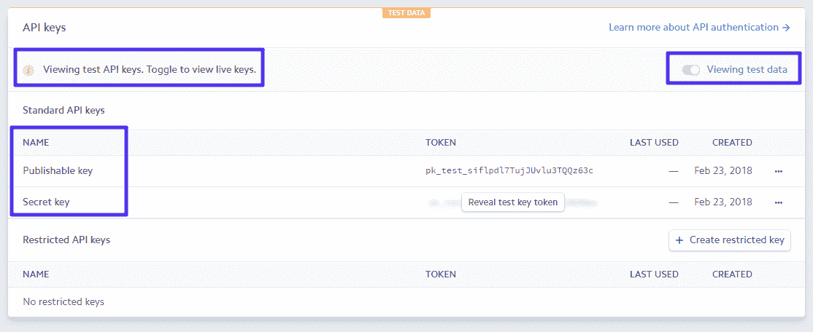

Your Stripe API keys

把这些键放在手边，因为你需要它们来配置任何一个插件。

## 如何用 WP 简单支付添加条纹捐赠按钮？

首先，安装并激活 WordPress.org 的免费 WP 简单支付插件。

然后，这里是如何设置你的捐赠按钮…

### 1.输入 API 密钥

要开始，进入**简单支付建兴→设置**并输入您的测试和现场 API 密钥。确保**测试模式**暂时保持**启用**:

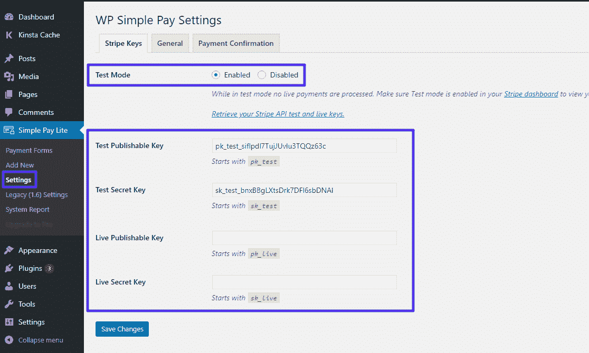

Enter API keys and make sure Test Mode is enabled

### 2.配置货币(默认为美元)

默认情况下，WP 简单支付使用美元作为捐款按钮的货币。如果您想使用不同的货币，您可以通过进入**常规**设置选项卡进行更改:

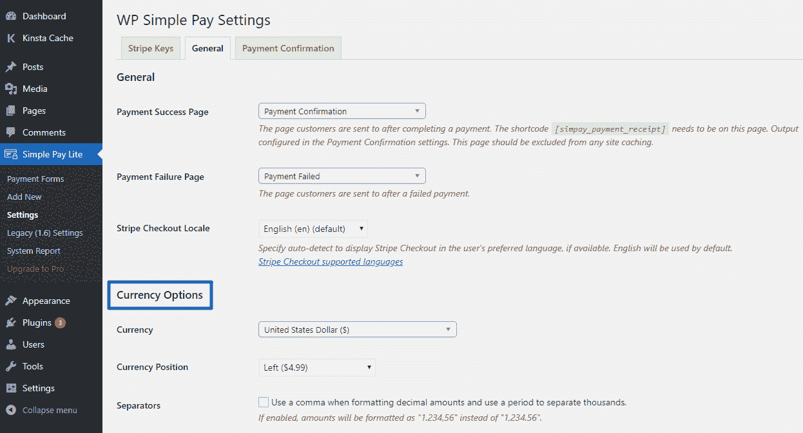

How to change the currency

### 3.创建新的付款表单

一个**支付** **表单**本质上是一个你想要使用的特定捐赠按钮。要创建一个，请转到**简单支付精简版→添加新的**。

在**支付选项**选项卡中，输入您希望访客能够捐赠的金额(*如果您希望访客能够捐赠自己定制的金额，您将* [*需要付费版本的*](https://wpsimplepay.com/template/one-time-custom-amount-form/) 插件):

## 注册订阅时事通讯

### 想知道我们是怎么让流量增长超过 1000%的吗？

加入 20，000 多名获得我们每周时事通讯和内部消息的人的行列吧！

[Subscribe Now](#newsletter)

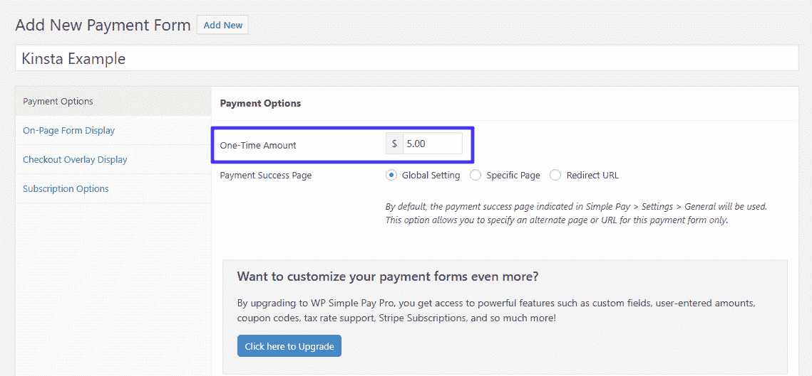

Enter the fixed donation amount

从技术上来说，这就是你需要做的一切。但是为了提供更加个性化的表单，您可以在**页面表单显示**和**结帐覆盖显示**选项卡中更改表单上显示的文本。

例如，在**页面表单显示**区域，您可以更改文本，使按钮显示“用卡捐赠”而不是“用卡支付”:

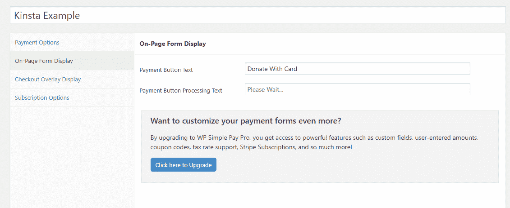

Change donate button text

完成后，单击**创建**发布您的表单。

要在站点的前端显示表单，您需要将短代码添加到您希望它显示的帖子、页面或文本小部件中:

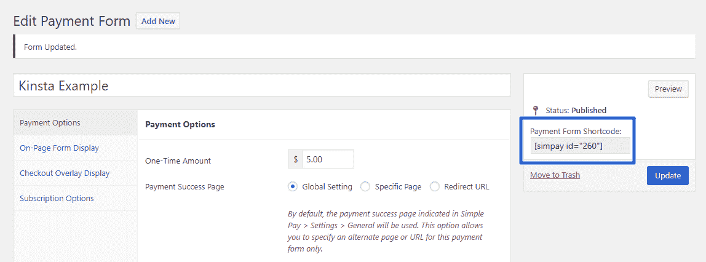

The WP Simple Pay shortcode

### 4.测试您的表单，然后启用实时模式

因为您启用了测试模式，所以您可以通过输入[一些测试数据](https://stripe.com/docs/testing#cards)来测试表单:

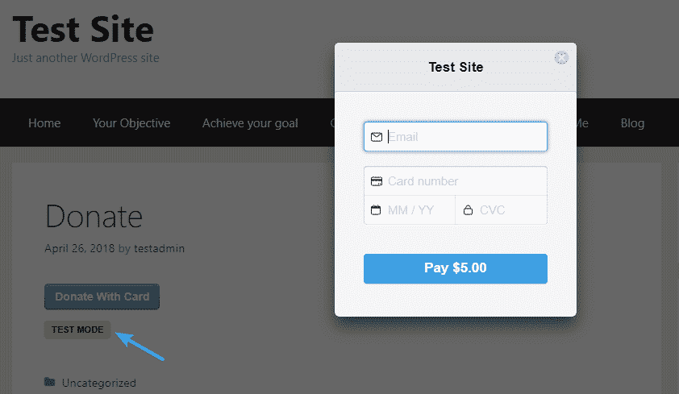

Example of the donate button

一旦你对一切正常运行感到满意，你可以通过进入**简单支付精简版→设置**和**禁用** **测试模式**来启用实时模式，开始接受实际支付:

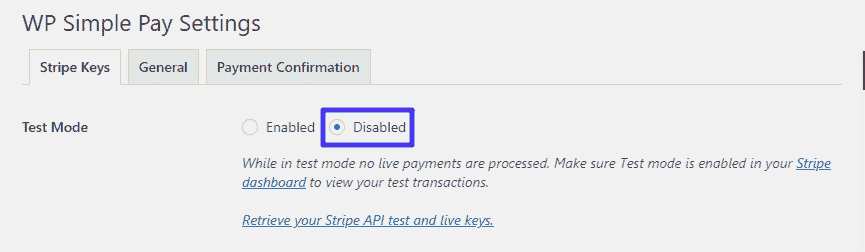

How to disable test mode

如果你想编辑用户提交付款后看到的页面，你只需要编辑 WP Simple Pay 创建的**付款确认**页面。

## 如何用条纹支付添加条纹捐赠按钮？

虽然[Stripe pays](https://wordpress.org/plugins/stripe-payments/)不像 WP Simple Pay 那么受欢迎，但它的优势是你可以接受定制的捐赠金额，而无需为高级版本付费。

Struggling with downtime and WordPress problems? Kinsta is the hosting solution designed to save you time! [Check out our features](https://kinsta.com/features/)

一旦你从 WordPress.org 安装并激活了它，以下是如何使用它…

### 1.添加 API 密钥并配置基本设置

要开始，请进入**条纹支付→设置**添加您的 API 密钥:

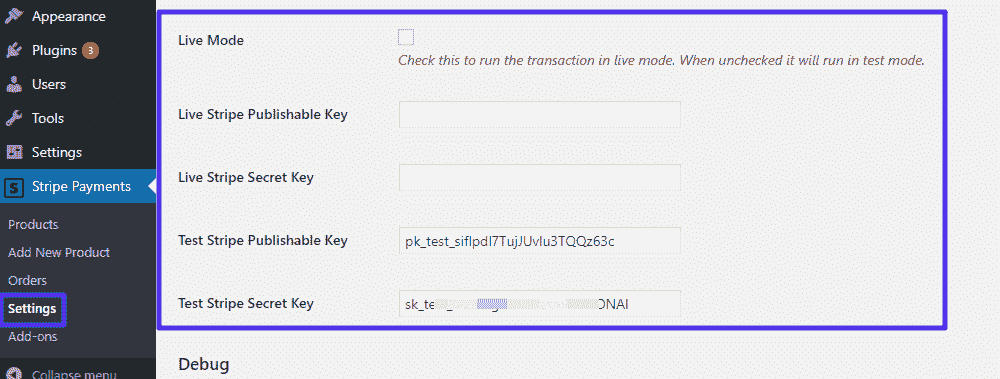

How to enter your API keys

确保**实时模式**是**而不是现在选中的**。

您还可以在此区域为您的捐赠按钮配置货币，以及按钮文本。您可能希望将**按钮文本**字段更改为类似“捐赠”的内容:

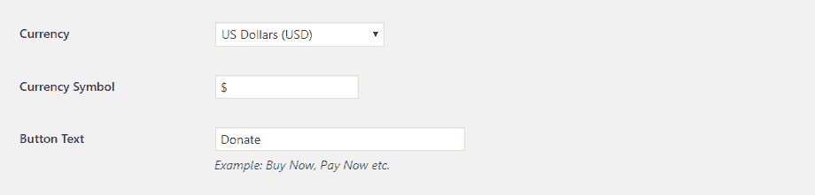

Configure currency and button text

### 2.添加新产品

接下来，进入**条纹支付→添加新产品**。选项很多，但是对于一个基本的捐款按钮来说，大部分都是不必要的。

您应该配置的部分包括:

*   **简短描述**–显示在条纹支付窗口上。
*   **价格&货币**–如果您希望访问者能够输入自定义金额，请将**价格**留空。
*   ****感谢页面 URL****–这可以让你在用户捐款后将他们重定向到一个特殊的感谢页面。

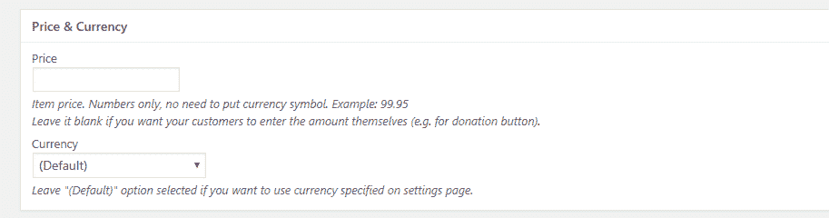

Choose fixed or custom donation amount

完成配置后，点击**发布。**然后，从编辑器底部复制短代码，并将其添加到您想要显示条纹捐赠按钮的帖子、页面或文本小部件中。

### 3.测试捐赠按钮，然后上线

因为您仍处于测试模式，所以您可以通过输入 [Stripe 的虚拟数据](https://stripe.com/docs/testing#cards)来安全地测试您的捐赠按钮:

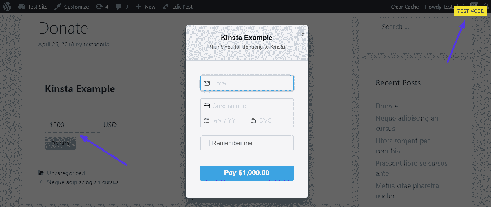

Example of the custom donation amount form

一旦您确认一切正常，您就可以通过进入**条纹支付→设置**并打开**实时模式**来启用真正的支付:

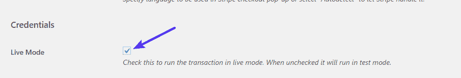

How to disable test mode

## 摘要

无论你选择哪个插件，在你的 WordPress 站点上添加一个条纹捐赠按钮都是相当简单和没有痛苦的。这两个插件还允许你创建多个按钮，所以你可以很容易地为不同的用途创建不同的捐赠按钮。

如果你在创建自己的按钮后对 Stripe 不满意，你还可以考虑通过 [PayPal](https://kinsta.com/blog/paypal-donate-button-wordpress/) 或[比特币](https://kinsta.com/blog/bitcoin-donate-button/)接受捐赠。在本指南中，我们收集了使用 Stripe 或 PayPal 的所有[利弊。](https://kinsta.com/blog/stripe-vs-paypal/)

关于在你的 WordPress 网站上添加一个捐赠按钮，你还有其他问题吗？或者需要我们没有提到的不同功能？请留下您的评论，我们会尽力帮助您！

* * *

让你所有的[应用程序](https://kinsta.com/application-hosting/)、[数据库](https://kinsta.com/database-hosting/)和 [WordPress 网站](https://kinsta.com/wordpress-hosting/)在线并在一个屋檐下。我们功能丰富的高性能云平台包括:

*   在 MyKinsta 仪表盘中轻松设置和管理
*   24/7 专家支持
*   最好的谷歌云平台硬件和网络，由 Kubernetes 提供最大的可扩展性
*   面向速度和安全性的企业级 Cloudflare 集成
*   全球受众覆盖全球多达 35 个数据中心和 275 多个 pop

在第一个月使用托管的[应用程序或托管](https://kinsta.com/application-hosting/)的[数据库，您可以享受 20 美元的优惠，亲自测试一下。探索我们的](https://kinsta.com/database-hosting/)[计划](https://kinsta.com/plans/)或[与销售人员交谈](https://kinsta.com/contact-us/)以找到最适合您的方式。