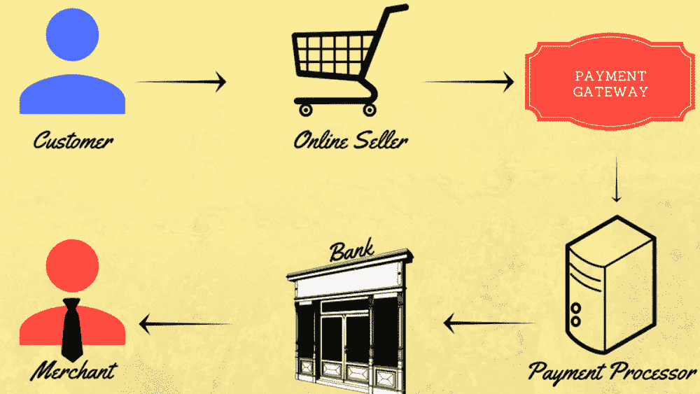
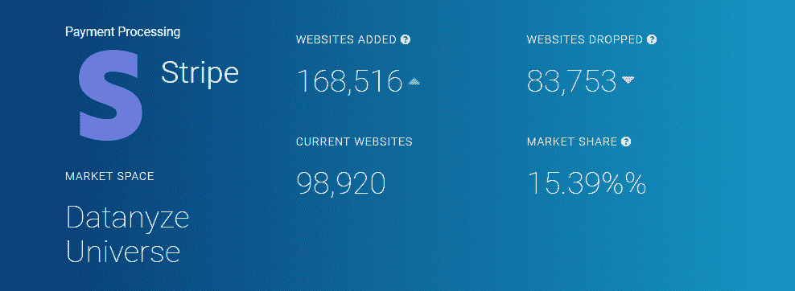
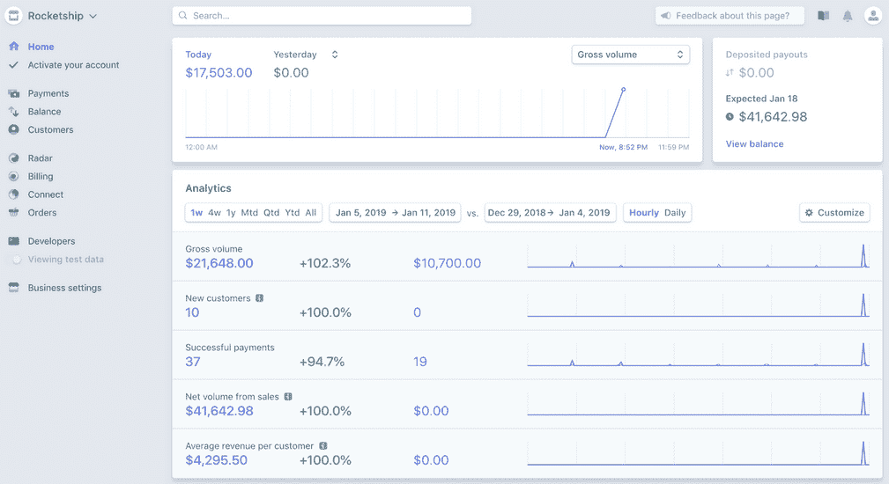
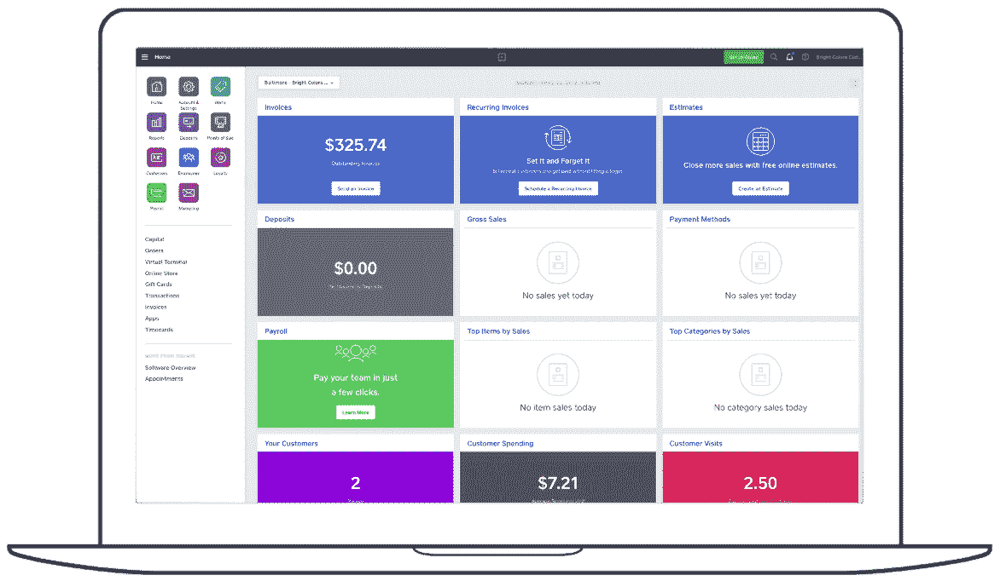
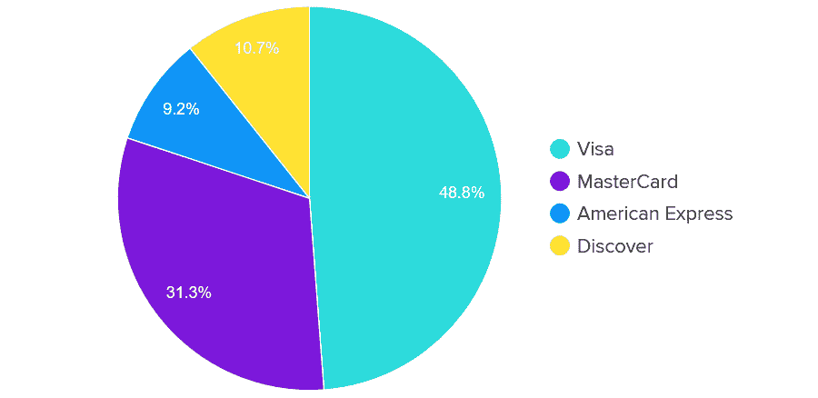
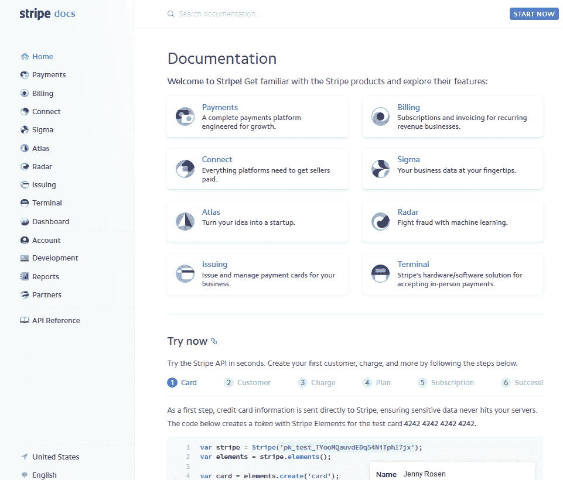

# 条纹 vs 方形:2022 年你该用哪种支付网关？

> 原文：<https://kinsta.com/blog/stripe-vs-square/>

支付网关行业的顶级玩家总是在前进，这样他们才能成为第一。毕竟，如今的电子商务店主比以往任何时候都多，他们都需要一种可靠的方式来让 T2 从顾客那里收款。

当今市场上两个最成熟的支付网关选项是**条形和方形**。两者都为企业提供了处理在线支付的简单方法、领先的技术和大量的电子商务工具，让试图经营企业和赚钱的电子商务店主变得简单。

> 条纹 vs 方形:它们有什么不同？

条纹和方形有自己独特的功能，旨在满足非常不同的需求。坦率地说，这可能会让决定使用哪个支付网关变得比你希望的更难。这就是为什么我们要进行**条纹对比**方形对比，这样您就可以为您的小型企业做出数据驱动的决策。

你准备好了吗？让我们来看看。

## 条纹 vs 方形:他们做什么？

[Stripe](http://stripe.com/) 成立于 2011 年，是一个支付网关，通过在您的商户账户和支付处理器之间转账，您可以接受信用卡支付(*当面支付或在线支付*)。这是使用物理信用卡终端或在线处理器来完成的。

*还觉得这个概念很混乱吗？*这里有一个直观的表示来帮助你:

Payment gateway process (Image source: Orioly)

Stripe 拥有基于云的基础设施，旨在提高可靠性、可扩展性和安全性。更不用说，它非常以开发者为中心，适用于商业网站和应用程序，并且植根于代码和设计。

此外，Stripe 可以作为独立的解决方案，用于那些需要发送发票和收取产品或服务付款的人。虽然这不是使用 Stripe 的最常见方式，因为大多数人都集成到电子商务网站中，但这只是使用这种灵活而强大的支付网关的另一种方式。

[Stripe 的市场份额](https://kinsta.com/stripe-revenue/)约为 20%，仅次于 Paypal([*)Stripe vs Paypal*](https://kinsta.com/blog/stripe-vs-paypal/)*)一直在争夺第一的位置*:

Stripe Market Share (Image source: Datanyze)

为了让你了解 Stripe 有多强大，你要知道:Lyft、亚马逊和微软等零售巨头都在使用 Stripe。谈到公司， [Kinsta 也使用 Stripe](https://kinsta.com/blog/startups-avoid-stripe/#follow-up) 。

另一方面， [Square](https://squareup.com/us/en) 有点老(*成立于 2009 年*)，从技术上来说并不是支付网关。其实更多的是一个端到端的支付处理器或者虚拟终端。此外，与可以在任何兼容平台上使用的 Stripe 不同，Square 不是一个独立的支付网关解决方案。相反，它是一个更大的电子商务解决方案的一部分。

这款软件非常通用，因为它本质上将您客户的设备变成了便携式销售点终端。正因为如此，你会经常发现 Square 的核心产品实际上是他们的个人 POS 系统。它为商家提供了一种通过使用智能设备读取信用卡或手动输入信用卡信息(*亲自或通过电话*)向客户收取款项的方式。

也就是说，多年来，Square 已经开始与 Stripe 等老牌公司竞争。事实上，您现在可以使用 Square 轻松地向在您的在线商店购物的客户收取费用。

## 条纹与方形:设置(易于使用)

### 条带设置

在你的网站上设置条纹支付体验从超级简单到超级复杂，取决于你需要你的支付网关来做。而这恰好是 Stripe 的卖点之一。

以开发人员为中心的焦点使您能够灵活地为客户创建定制的结账流程。借助 [Stripe Elements](https://stripe.com/payments/elements) ，借助实时验证、动态本地化、自动填充功能以及改进的格式和屏蔽，您可以确保您的客户快速、正确地输入信息。

更好的是，Stripe Elements 消除了您网站上托管支付页面的需要。取而代之的是，只需创建你自己的结帐表单，或者在你的网站上添加一个条纹捐赠按钮，就可以轻松地从人们那里收钱。

如果你没有太多的技术知识或团队中的开发人员来帮助你，*不要担心*。要使用 Stripe，你所要做的就是剪切一行 javaScript 并粘贴到你的网站上。如果你用的是 WordPress 的 [Stripe，你所要做的就是安装一个开源的 Stripe 插件。](https://kinsta.com/blog/stripe-for-wordpress/)

当您使用 Stripe 时，管理您的电子商务网站上的支付也很简单，因为它有直观的仪表板:

Stripe dashboard

快速浏览网站活动，查看实时图表，甚至查看是否有您需要的任何操作，如未解决的争议或身份验证(*非常适合* [*最大限度地减少信用卡欺诈*](https://kinsta.com/blog/credit-card-fraud-stripe/) )。

### 方形设置

另一方面，正方形的一切都以简单为中心。接受支付和管理业务所需的所有软件都在一个集中的系统中。事实上，您可以直接从 Square 帐户的仪表板访问高级报告工具、管理工时记录卡，甚至创建营销活动:

Square dashboard

至于设置 Square，有几个不同的选项。首先，您可以剪切并粘贴一段代码(*就像 Stripe* )并在您的网站上为客户创建一个结账选项。或者，你可以使用 WooCommerce Square 这样的插件来扩展你的[电子商务平台](https://kinsta.com/blog/ecommerce-platforms/)并接受支付。

但是也许最简单的解决方案是建立你自己的[weely](https://kinsta.com/blog/squarespace-alternatives/#4-weebly)商店。

2018 年 4 月，Square 收购了 Weebly 电子商务平台，并将其支付网关集成到其中，因此一旦[您的 Weebly 网站启动并运行](https://kinsta.com/blog/weebly-vs-wordpress/)，就无需配置任何东西。不像[的自托管 WordPress 网站](https://kinsta.com/blog/is-wordpress-free/)，Weebly 是完全托管的，所以你永远不用担心为你的网站找到[合适的虚拟主机提供商](https://kinsta.com/wordpress-hosting/)。

总之，Square 是一个简单的全渠道解决方案，适用于希望在任何地方销售产品的商家，而无需处理复杂的代码或一系列第三方集成。

**获胜者:方块**

## 条纹 vs 方形:交易费和设置成本

### 种类

使用 Stripe 的成本相当简单。这是一个现收现付的平台，没有注册费用，使其成为各种规模企业的负担得起的选择。

下面简单介绍一下 Stripe 的交易费:

*   **基本交易:**交易的 2.9%+$ 0.30。
*   **国际交易:**每笔交易 3.9%(*可能收取转换费*)。
*   **大额交易:**每笔交易折扣 0.8%(*上限为 5 美元——支付方式包括 ACH 直接借记、ACH 贷记和电汇*)。

对于每次退款，Stripe 将向您收取 15 美元的费用，除非退款决定对您有利。与除 Square 之外的[其他支付网关](https://kinsta.com/blog/stripe-vs-paypal/)、*相比，这是非常有竞争力的。*

### 平方

就像 Stripe 一样，Square 不收取任何注册费用，也不会将你局限于任何类型的合同。此外，他们吹嘘没有任何其他类型的隐藏费用，如授权，声明，退款，PCI 合规，名片等。

也就是说，由于 Square 同时提供面对面交易和在线交易，以及其他商业功能，使用它们会产生更多相关成本:

以下支付类型将产生 **2.9% + $0.30 交易费**:

*   方形发票。
*   在线 API。
*   网上商店。
*   文件支付电子商务卡。

这些支付类型将产生**3.5%+0.15 美元的交易费**:

*   存档卡交易。
*   在物理硬件上手动输入信用卡。
*   POS API 键入付款。
*   在线手动输入信用卡。

而且，正如我们上面提到的，Square **不收取退单费**，这是很罕见的，*非常吸引人的*。除此之外，Square 还为客户每月合格交易提供高达 250 美元的退款保护。这只是向您展示 Square 有多关心他们的客户和业务。

#### 附加平方定价

请记住，Square 确实为网站所有者提供了创建 Weebly 商店或 Square 在线商店的机会。但是如果那是你想要走的路线，你将不得不支付额外的费用。

为了使用 Weebly 平台建立一个电子商务商店，Square 计划起价为每月 8 美元。随着网上商店的扩张，你会发现自己需要更多的功能，这可能会变得更加昂贵。

如果您想创建一个 Square 在线商店，您可以创建一个免费商店，或者投资每月 12-72 美元的高级计划，以获得以下功能:

*   购物车。
*   [免费 SSL。](https://kinsta.com/blog/free-ssl-certificate/)
*   [自定义域名](https://kinsta.com/blog/choose-domain-name/)。
*   [废弃购物车邮件](https://kinsta.com/blog/shopping-cart-abandonment/#shopping-cart-abandonment-emails)。
*   实时发货。
*   还有更多。

**获胜者:条纹**

## 条纹与方形:接受的付款类型

### 种类

Stripe 使事情变得简单，因此使用 Stripe 的企业不必处理额外的商家帐户。以下是您可以在 Stripe 网上商店接受的付款类型:

*   信用卡。
*   借记卡。
*   国际卡。
*   ACG 直接借记和贷记(*一个功能方块没有*)。
*   电汇。

Stripe 也接受比特币，这表明 Stripe 不害怕探索新的领域，并参与尖端技术。你甚至可以通过几个简单的步骤[创建一个带条纹的比特币捐赠按钮](https://kinsta.com/blog/bitcoin-donate-button/#option-1--create-bitcoin-donate-button-with-stripe-and-plugin)。

此外，Stripe 还接受 Masterpass by Mastercard 和 Visa Checkout 等钱包(*等*)。最棒的是，Visa 和 MasterCard 占据了令人印象深刻的 [80.1%的信用卡网络](https://wallethub.com/edu/credit-card-companies/20409/)。

Credit card market share (Image source: WalletHub)

Stripe 还支持超过 135 种不同的货币，因此接触国际客户群从来都不是问题。使用 Stripe 的唯一缺点是，您目前无法接受当面付款。

### 平方

多年来，随着 Square 扩展其服务以满足希望面对面和在线开展业务的公司的需求，Stripe 与 Square 的比较变得越来越重要。

Square 在线处理所有主要信用卡:

## 注册订阅时事通讯

### 想知道我们是怎么让流量增长超过 1000%的吗？

加入 20，000 多名获得我们每周时事通讯和内部消息的人的行列吧！

[Subscribe Now](#newsletter)

*   签证。
*   万事达卡。
*   发现。
*   美国运通。

此外，它将接受 Apple Pay、Android Pay 和电子钱包支付。Square 提供给顾客的东西，Stripe 没有，就是结账硬件。而且最赞的是，当面接受移动支付的读卡器和 POS 机 *100%免费*。

**获胜者:平局**

## 条纹与方形:客户服务质量

### 条带客户支持

在客户支持方面，Stripe 的声誉并不总是最好的。事实上，在 2018 年之前，Stripe 客户没有办法实时获得支持。

为了解决这个问题，Stripe 在 2018 年透露，所有 Stripe 客户现在都可以获得 24/7 实时聊天和电话支持，以补充现有的工作时间(*周一至 Fri 上午 9 点至下午 5 点*)提供的电子邮件支持。如果你想和其他 Stripe 用户取得联系，还有 Freenode 论坛( *#stripe* )。

现在可以肯定地说，Stripe 在客户支持方面表现出色，尤其是在面对 Square 的支持水平时。这是在您意识到除了大量文档之外，Stripe 还有一个[专门的支持中心](https://support.stripe.com/)，里面满是文章和视频，解答您最迫切的支持问题:

Stripe support center

可能会让一些人反感的一点是，Stripe 还提供每月高达 1000 美元的高级支持，这对于处理大量支付的大型企业来说很好，但对于预算有限的小型企业来说就不那么好了。

虽然这对那些负担不起每月 1000 美元的人来说可能不公平，但我们认为 Stripe 通过每个人都可以访问的 24/7 实时聊天和电话支持来弥补这一不足。

### Square 客户支持

Square 目前为客户提供以下支持选项:

*   电话和电子邮件支持。
*   实时聊天。
*   专门的 Twitter 支持:@SqSupport。

您还可以通过搜索问题或关键词进入 [Square 社区论坛](https://www.sellercommunity.com/t5/Seller-Community-US/ct-p/Seller_Community_US?profile.language=en)，与其他 Square 用户建立联系:

Square communities forum

虽然表面上看起来很棒，但值得注意的是，Square 的客户服务并不总是最好的。许多人抱怨他们的账户被无故冻结或终止。更糟糕的是，当这种情况发生时，Square 会自动切断你的电话支持，只会通过电子邮件与你沟通，这使得解决问题更加困难。

正因为如此，尽管 Square 提供了与 Stripe 相同的支持渠道(*实时聊天、电话、电子邮件，甚至社区论坛*)，但它无法与 Stripe 多年来努力建立的质量相媲美。

**获胜者:条纹**

## 条纹与正方形:文档

### 种类

Stripe 拥有非常高级且对开发人员友好的文档，这意味着要阅读大量文档，您将需要一些编码、开发或技术技能。

Stripe documentation

这并不是说它没有帮助。但是如果你的团队中没有开发人员(这里你可以[雇佣一名 WordPress 开发人员](https://kinsta.com/blog/hire-wordpress-developer/))，你很可能会遇到一些你难以理解的事情。

想让你的电子商务商店比你的竞争对手更快？我们提供世界一流的全天候支持和超快的服务器。查看我们的计划！

### 平方

另一方面，Square 坚持认为所有的东西都应该简单易懂，适合所有技能水平的人。他们有一个带文档的[方形指南](https://squareup.com/guides)部分来帮助你开始。

Square guides

如果你是一名开发者，总会有[开发者文档](https://developer.squareup.com/docs/)、[开发者博客](https://developer.squareup.com/blog/)，以及开发者专用的 Slack 频道(阅读:[如何使用 Slack](https://kinsta.com/blog/how-to-use-slack/) )。

总之，Square 支持刚起步的用户和更高级的用户，而 Stripe 主要支持高级文档，帮助人们在他们的网站上创建完全可定制的结账体验。

**获胜者:方块**

## 条纹 vs 方形:电子商务集成

Stripe 和 Square 都有电子商务插件集成，可以与[流行的电子商务平台](https://kinsta.com/learn/woocommerce-guide/)协同工作。他们也有一个开放的 API 和开发者工具，虽然 Stripe 的更先进，有更多的功能，并包括用于构建完全可定制的结帐的资源。

但这就是相似之处的终点。

### 种类

条纹是非常多才多艺的，尽管没有正方形的功能。例如，它集成了几十个购物车，包括[简易数字下载](https://kinsta.com/blog/easy-digital-downloads/)、 [Ecwid](https://kinsta.com/blog/wordpress-ecommerce-plugins/#ecwid-ecommerce-shopping-cart) 和 X-Cart。它还可以与各种电子商务平台合作，如 [Squarespace](https://kinsta.com/blog/squarespace-vs-wordpress/) 、 [Shopify](https://kinsta.com/blog/woocommerce-vs-shopify/) 和 [Shopify 替代品](https://kinsta.com/blog/shopify-alternatives/)，如 [WooCommerce](https://kinsta.com/blog/woocommerce-tutorial/) 。

由于 Stripe 是为在线卖家设计的，它可以连接到几乎任何类型的网站、在线销售平台或电子商务平台。有超过 98 个应用程序来增强支付过程，只有使用 Stripe，您才能真正扩展您的在线商店。

#### Stripe 和 WordPress/WooCommerce

Stripe 没有官方的 WordPress 插件或集成。但是 WordPress 社区中有很多插件开发者，他们使得将 Stripe 集成到 WordPress 站点变得轻而易举。

以下是为 WordPress 设置 Stripe 的一些常用方法:

*   作为一个没有电子商务功能的基本 WordPress 网站的一次性支付页面。
*   使用一个表单插件，比如 Gravity Forms 来收取付款、存款或捐款。
*   免费使用你的 WooCommerce 网站。
*   [轻松数字下载](https://kinsta.com/blog/stripe-for-wordpress/#stripe-easy-digital-downloads)，这是一个销售数字产品的流行平台。

### 平方

Square 是唯一一个具有免费在线商店功能的支付网关，可以自动连接到 Square payments。这也是唯一的选择，与一个[电子商务平台( *Weebly* )](https://kinsta.com/blog/weebly-vs-wordpress/#weebly) 合作，并通过该平台提供广场支付供人们使用。

Square 是一个包含电子商务功能的全渠道解决方案。虽然你不能定制 Stripe 允许的那么多东西，但 Square 对初学者来说足够友好，任何人都可以使用，而且足够先进，开发者或大公司也可以利用它。

Square 整合了 [Wix](https://kinsta.com/blog/wix-vs-wordpress/) 、Weebly、Ecwid、 [BigCommerce](https://kinsta.com/blog/woocommerce-alternative-bigcommerce/) 和 3dcart 供刚起步者使用。对于那些需要更多的人来说，Square 与 [Drupal](https://kinsta.com/blog/wordpress-vs-drupal/) 、 [WooCommerce](https://kinsta.com/blog/woocommerce-payment-gateways/) 、 [Magento、](https://kinsta.com/magento-market-share/)和定制网站配合得很好。

#### Square 和 WordPress/WooCommerce

Square 可以轻松集成到你现有的[WordPress.com 网站](https://kinsta.com/blog/wordpress-com-vs-wordpress-org/)。要开始，你所要做的就是拥有一个高级商务 WordPress 计划(*每月 25 美元起*，并使用任何 Square 支持的 WordPress 电子商务插件，如 WooCommerce 或 [WP EasyCart](https://kinsta.com/blog/wordpress-ecommerce-plugins/#wp-easycart) 。

如果你有一个自托管的 WordPress.org 网站，你也可以将 Square 整合到你的网上商店中，就像你对 Stripe 所做的那样。例如，WooCommerce Square 将为您提供在 WooCommerce 和 Square POS 之间同步库存和产品数据的最佳方式。

最后，如果你是多渠道卖家，Square 就赢了。如果你是一家纯在线企业，Stripe 会胜出，因为它接受更多的支付类型，支持更多的货币。

**获胜者:条纹**

## 条纹 vs 方形:利弊

### 种类

**优点**

*   透明、统一费率和有竞争力的定价。
*   全球可扩展性和覆盖范围。
*   没有月度合同。
*   完全可定制的结帐解决方案。
*   客户永远不会离开你的网站来完成购买。
*   多个支持渠道，有些全天候可用。
*   完全符合 [PCI 规范](https://kinsta.com/knowledgebase/pci-compliant-hosting/)。

**缺点**

*   许多人抱怨缓慢的电子邮件响应时间和其他客户支持问题。
*   未由 Stripe 解决的退款，如果您在争议中败诉，将会产生费用。
*   对于技术知识有限的人来说，学习曲线很陡。
*   不适合高风险业务。

### 平方

**优点**

*   特别人性化。
*   非常适合寻找全渠道支付解决方案的人。
*   非常适合低交易量的商家。
*   极具竞争力的定价，包括按存储容量使用计费保护。
*   独特的电子商务解决方案。

**缺点**

*   很多关于没有通知就终止账户的投诉。
*   缺乏功能，特别是订阅工具。
*   不适合高风险业务。
*   对于有大量业务的大公司来说价格昂贵。

## 条纹 vs 方形，哪个更好？

因为支付网关是如此相似*直到它们不是*，所以当谈到 Stripe vs Square 时，很难说出一个明显的赢家:

*   如果你需要网上销售和面对面销售的灵活性，Square 凭借其全渠道特性遥遥领先。
*   如果您需要一个可以全球扩展的严格的在线解决方案，或者一个独立的发票/付款收集解决方案，Stripe 是首选。

[Stripe vs Square, which payment option should you use? We looked closely at their key features, costs, documentation, and more. The winner is... 💵🤝Click to Tweet](https://twitter.com/intent/tweet?url=https%3A%2F%2Fkinsta.com%2Fblog%2Fstripe-vs-square%2F&via=kinsta&text=Stripe+vs+Square%2C+which+payment+option+should+you+use%3F+We+looked+closely+at+their+key+features%2C+costs%2C+documentation%2C+and+more.+The+winner+is...+%F0%9F%92%B5%F0%9F%A4%9D&hashtags=payment%2Cecommerce)

## 摘要

选择正确的支付网关并不是一个容易的选择。由于条纹与方形如此势均力敌，这将归结到个人特点，以帮助您做出最终决定。

如果你是经营网店的新手，而且技术知识有限，Square 将是更好的选择。与 Stripe 相比，它的价格极具竞争力，并且附带简单的设置过程和初学者友好的文档来指导您。

然而，对于那些寻求更加[定制化的结账流程](https://kinsta.com/blog/shopping-cart-abandonment/)的人来说，Stripe 将是你的最佳选择。如果你经营一家依赖于销量的电子商务商店，你将需要你能得到的每一个功能来扩大你的业务并确保更多的销售。这意味着覆盖全球，可获得 24/7 全天候支持，并且可以灵活地将 Stripe 支付网关添加到您轻松选择的任何网站或平台。

* * *

让你所有的[应用程序](https://kinsta.com/application-hosting/)、[数据库](https://kinsta.com/database-hosting/)和 [WordPress 网站](https://kinsta.com/wordpress-hosting/)在线并在一个屋檐下。我们功能丰富的高性能云平台包括:

*   在 MyKinsta 仪表盘中轻松设置和管理
*   24/7 专家支持
*   最好的谷歌云平台硬件和网络，由 Kubernetes 提供最大的可扩展性
*   面向速度和安全性的企业级 Cloudflare 集成
*   全球受众覆盖全球多达 35 个数据中心和 275 多个 pop

在第一个月使用托管的[应用程序或托管](https://kinsta.com/application-hosting/)的[数据库，您可以享受 20 美元的优惠，亲自测试一下。探索我们的](https://kinsta.com/database-hosting/)[计划](https://kinsta.com/plans/)或[与销售人员交谈](https://kinsta.com/contact-us/)以找到最适合您的方式。