# 如何向谷歌新闻和谷歌发现提交你的网站

> 原文：<https://kinsta.com/blog/submit-to-google-news/>

谷歌新闻的目的是过滤全世界的新闻，让读者以一种容易阅读、理解和使用的方式获得及时的新闻。

那么这对你的网站和你的站点意味着什么呢？大量的流量、可信度和权威性。

如果这听起来像是你想为你的网站做的事情(说实话，谁不想呢),那么继续读下去，找出你需要知道的关于如何将你的网站提交到谷歌新闻的一切。

## 什么是谷歌新闻？

Google News 是一个新闻聚合器，可以定制最近 30 天的新闻文章和故事。

如今，随着谷歌新闻报道可以出现在其他谷歌产品中，它甚至还不止于此，例如:

*   谷歌新闻提要(咄)
*   SERP 页面中的“头条新闻”部分
*   SERP 页面中的“新闻标签”(可以这么说，就像你拥有的用于[图片](https://kinsta.com/blog/optimize-images-for-web/)的标签)
*   Google Discover， [Google 的新 feed](https://www.blog.google/products/search/introducing-google-discover/) 基于改进的[知识图](https://kinsta.com/blog/schema-markup-wordpress/)能够根据单个用户的搜索历史提供定制结果。

以下是谷歌新闻的样子:

> Kinsta 把我宠坏了，所以我现在要求每个供应商都提供这样的服务。我们还试图通过我们的 SaaS 工具支持达到这一水平。
> 
> <footer class="wp-block-kinsta-client-quote__footer">
> 
> 
> 
> <cite class="wp-block-kinsta-client-quote__cite">Suganthan Mohanadasan from @Suganthanmn</cite></footer>

[View plans](https://kinsta.com/plans/)

[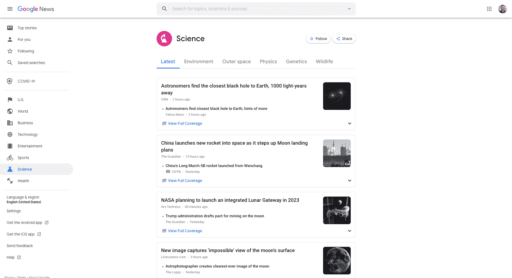](https://kinsta.com/wp-content/uploads/2020/02/google-news-example-2.png)

An example page of science stories on Google News

根据您的位置和语言设置，内容被组织成不同的类别。作为读者，您还可以定制订阅源，以涵盖您感兴趣的故事。

[你的站点+谷歌新闻=流量、可信度、权威性。✅，这是一个我们可以支持的等式！🤓使用本指南了解如何将您的网站提交到谷歌新闻 点击发送推文](https://twitter.com/intent/tweet?url=https%3A%2F%2Fkinsta.com%2Fblog%2Fsubmit-to-google-news%2F&via=kinsta&text=Your+site+%2B+Google+News+%3D+traffic%2C+credibility%2C+authority.+%E2%9C%85+That%27s+an+equation+we+can+stand+behind%21+%F0%9F%A4%93+Learn+how+to+submit+your+site+to+Google+News+with+this+guide&hashtags=GoogleNews%2CSEO)

## 如何让你的网站上谷歌新闻，发现，和新闻相关的来源

谷歌新闻与谷歌搜索引擎不同。

后者发送爬虫扫描网络更新并索引这些更新。谷歌新闻也有爬虫，但它们大多抓取和索引被认为是高质量的网站和内容，符合谷歌新闻内容政策，或者在过去已经被批准。

事实上，直到 2019 年 12 月，你必须手动将你的网站提交给谷歌新闻，才能被考虑。但是情况不再是这样了，因为谷歌宣布了这个消息:

> “出版商会被自动列入头条新闻或搜索的新闻标签。”

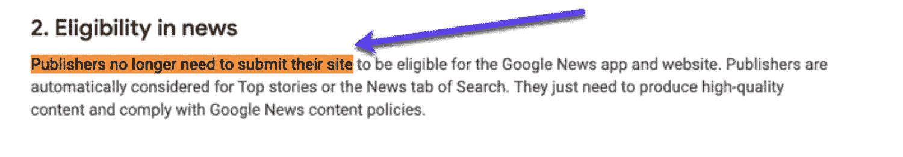

The official word from Google about being eligible for Google News

巴瑞·亚当斯首先发现了这一点:

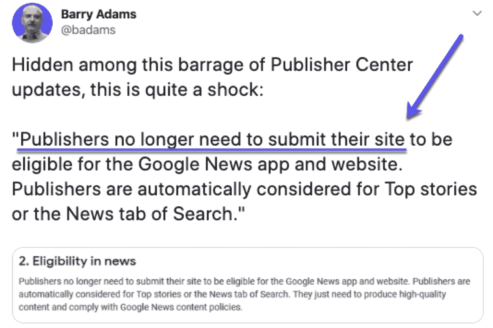

Barry Adams spotted that publishers don’t need to submit their sites

很好。所以你不需要担心做什么，对不对？

只是坐以待毙，等待谷歌新闻报道你的网站，为它带来更多的流量？不完全是。

虽然任何人都可以进入谷歌新闻，但你仍然需要满足某些标准，如:

*   你必须每天创造引人注目的内容。它必须是与你的观众相关的新闻。
*   你必须遵循[谷歌新闻内容政策](https://support.google.com/news/publisher-center/answer/6204050?hl=en&ref_topic=9603441)，它涵盖了[写作](https://kinsta.com/blog/proofreading-tips/)的标准、责任性、权威性、可读性、技术指南和新闻质量指南。
*   你永远不应该忽视[谷歌搜索要素](https://support.google.com/webmasters/answer/35769)，其中包括你内容的[质量](https://kinsta.com/blog/content-length/)，你内容的设计，你网站的技术方面(使用[专业主题](https://kinsta.com/best-wordpress-themes/)将满足这一点——[只要确保它加载快](https://kinsta.com/learn/page-speed/))。
*   一旦你满足了这些准则，就该开始向谷歌新闻提交你的网站了。在这篇文章的后面，我会告诉你如何正确地做这件事。

在此之前，让我澄清一件重要的事情:

### 你需要把你的网站提交给谷歌新闻吗？

是也不是。

让我们回顾一下。2019 年底，[谷歌宣布了](https://www.blog.google/products/search/smarter-organization-top-stories-search/)新的谷歌新闻，除了几项改进和新的用户界面，还带来了一些新东西:

> “我们开发了一种新的故事理解技术，来绘制新闻故事中涉及的人、地方和事情，然后在它们之间建立联系。”

推动谷歌新闻的新技术是几种机器学习技术的结合，包括 [BERT 模型](https://www.blog.google/products/search/search-language-understanding-bert/)。

#### **伯特是什么？**

我知道你在想什么。和芝麻街没关系。

为了这篇博文的目的，你应该知道 BERT 是一个自然语言处理模型，它能够通过查看单词前后的单词来考虑单词的完整上下文。

基本上，这是谷歌更好地理解页面上[内容的一种方式。](https://kinsta.com/blog/long-form-articles/)

部分是因为这项新技术，谷歌不再要求你向谷歌新闻提交你的网站。

现在，你能自动出现在谷歌新闻中并不意味着你会。让我们增加你的机会，手动提交到谷歌新闻。

别担心，用不了多长时间。

## 如何向谷歌新闻提交你的网站

进入[谷歌发布中心](https://publishercenter.google.com/publications)，点击**添加发布**:

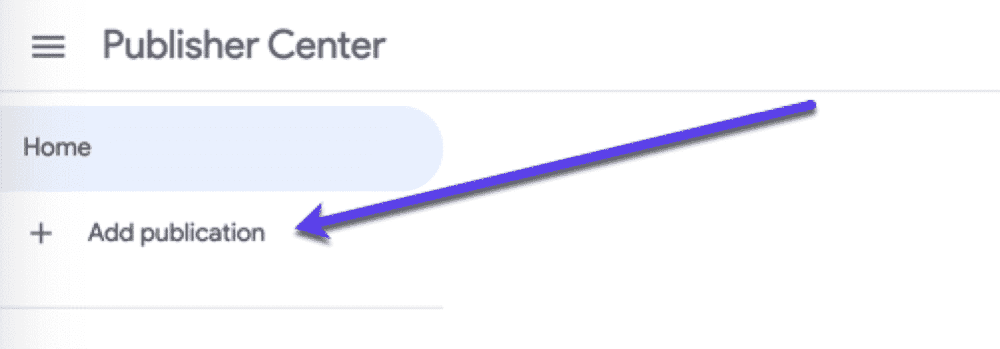

How to add a publication to Google News

现在，您需要填写一些具体信息。这是不言自明的:

*   您网站的描述。
*   最能描述你的网站的类别。
*   [主要语言](https://kinsta.com/blog/wordpress-multilingual/)。
*   [网址](https://kinsta.com/knowledgebase/wordpress-change-url/)。
*   接触点。
*   追踪(你的[谷歌分析代码](https://kinsta.com/blog/how-to-use-google-analytics/))。

如果你在谷歌新闻和谷歌搜索控制台使用同一个谷歌账户，你可以很容易地验证你的网站。

只需点击网站属性 URL 框旁边的搜索控制台中的**验证即可:**

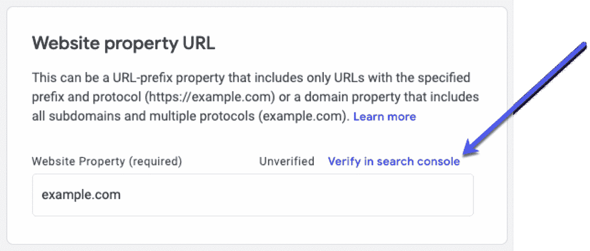

Verifying your domain using Google Search Console in Publisher Center

如果你需要更多帮助，你可以查看我们的 [GSC 安装指南](https://kinsta.com/blog/google-search-console/)。

接下来，你可以给你的出版物添加一个 [RSS 订阅源](https://kinsta.com/blog/wordpress-rss-feed/)，添加一个自定义标志，甚至可以设置[谷歌广告](https://kinsta.com/blog/how-to-add-google-adsense-to-wordpress/)，如果你想[将你的内容](https://kinsta.com/blog/how-to-monetize-a-blog/)货币化的话。

一旦您填写了所有必需的内容并同意条款和条件，您就可以发布:

Publishing status for your publication in Google News

我告诉过你提交你的网站不会花很长时间(如果你忽略了需要 2-4 周的审查过程)。

但是等等，还有更多。

## 充分利用谷歌新闻的 7 个额外步骤

如果你已经走到这一步，这意味着你真的想增加你自己获得一些甜蜜的谷歌新闻流量的机会。

让我们探讨一下你应该注意的几个方面，以便利用你最近提交的谷歌新闻。它们是谷歌新闻特定提示和谷歌喜欢的更通用提示之间的恰当平衡:

### 1.创建一个谷歌新闻网站地图

你不需要为谷歌新闻(和一般的谷歌)准备一个网站地图，但是当你提供一个的时候，你的内容被更快更好的抓取的几率会更高。

为什么？网站地图使得搜索引擎抓取和索引你的内容变得容易。

幸运的是，为你的站点创建一个[站点地图非常简单。这是我们的 XML 站点地图的一个例子:](https://kinsta.com/blog/wordpress-sitemap/)

[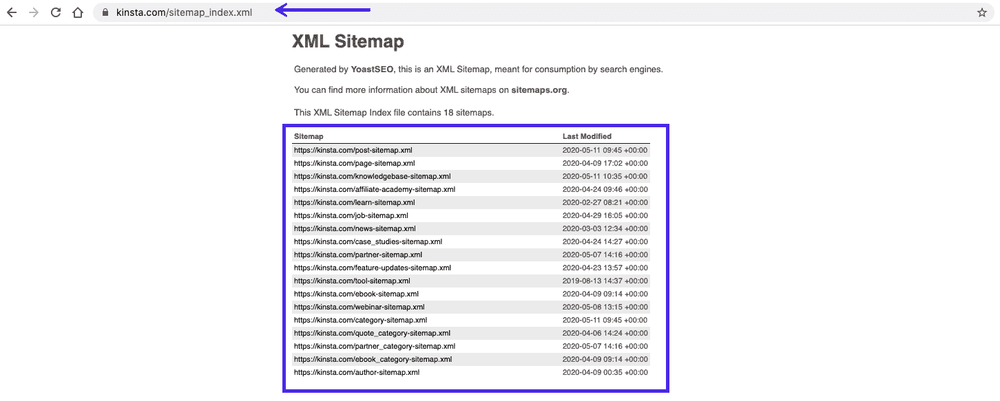](https://kinsta.com/wp-content/uploads/2020/05/kinsta-xml-sitemap.png)

Kinsta’s XML sitemap

不幸的是，谷歌新闻网站地图不同于“标准”的谷歌搜索网站地图，所以如果你想把你的网站提交给谷歌新闻，你需要创建一个新的。

#### 如何创建谷歌新闻网站地图

为了 100%确定并完全控制你提交给谷歌新闻的内容，你需要实现一个[谷歌新闻网站地图](https://support.google.com/news/publisher-center/answer/9606710?visit_id=637247859078479568-4208069007&rd=2)。

为此，你可以使用免费的 WordPress 插件 [XML Sitemap & Google News](https://wordpress.org/plugins/xml-sitemap-feed/) 或者选择一个高级解决方案，比如 Yoast 的[News SEO(69 美元)。](https://yoast.com/wordpress/plugins/news-seo/)

##### 如何使用 XML 网站地图和谷歌新闻插件创建谷歌新闻网站地图

XML 网站地图&谷歌新闻是一个免费的 WordPress 插件，它将创建一个 XML 网站地图并将你的更新发送到谷歌新闻。它非常好用，而且极其简单。

安装完成后，你必须在设置中启用谷歌新闻网站地图功能:

[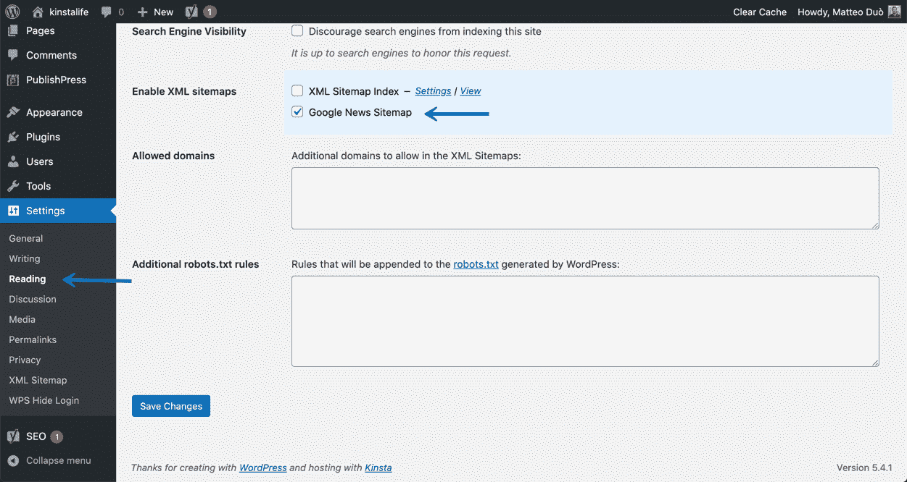](https://kinsta.com/wp-content/uploads/2020/05/enable-Google-News-sitemap.png)

Enabling the Google News sitemap

保存后，您将能够在`https://yoursite.com/sitemap-news.xml`访问您的谷歌新闻网站地图提要。它看起来会像这样:

## 注册订阅时事通讯

### 想知道我们是怎么让流量增长超过 1000%的吗？

加入 20，000 多名获得我们每周时事通讯和内部消息的人的行列吧！

[Subscribe Now](#newsletter)

[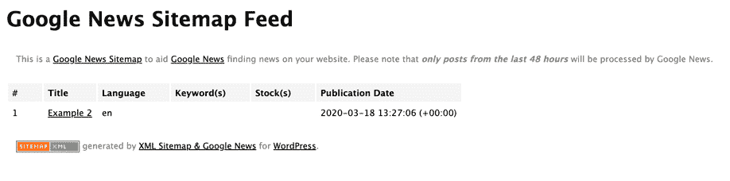](https://kinsta.com/wp-content/uploads/2020/05/Google-News-Sitemap-example.png)

Google News Sitemap Feed example

如果你已经[在使用 Yoast SEO 插件](https://kinsta.com/blog/yoast-seo/)，你可能会收到一个关于同时使用这两个插件的警告:

[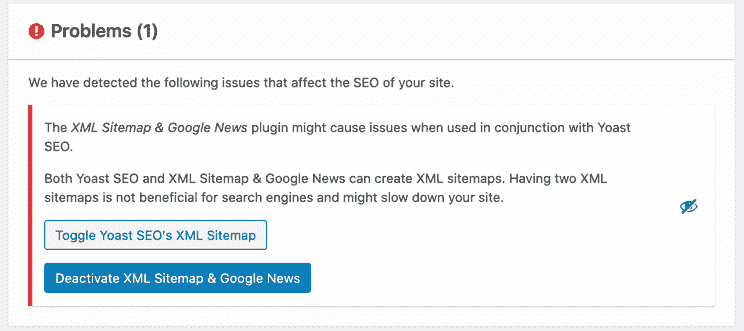](https://kinsta.com/wp-content/uploads/2020/05/XML-Sitemap-Google-News-yoast-conflict.png)

XML Sitemap & Google News conflicting with Yoast plugin

如果是这种情况，只需禁用“XML 站点地图索引”选项，因为最近安装了 XML 站点地图和谷歌新闻插件，现在可以在你的阅读>设置页面使用。这样，您就可以在 XML 站点地图上继续使用它们，而不会出现任何问题。

总而言之，XML Sitemap & Google News 插件的设置非常简单，而且它甚至可以和 [WordPress multisite](https://kinsta.com/wordpress-multisite-hosting/) 一起工作。

### 2.遵循谷歌新闻指南

你的网站正在与许多其他网站竞争，这些网站也试图在谷歌上曝光。每天，仅在[WordPress](https://kinsta.com/blog/best-blogging-platform/#1-wordpressorg)上就有数百万条帖子被发布。

说真的，看看这个关于 [WordPress 活动](https://wordpress.com/activity/)的现场报道:

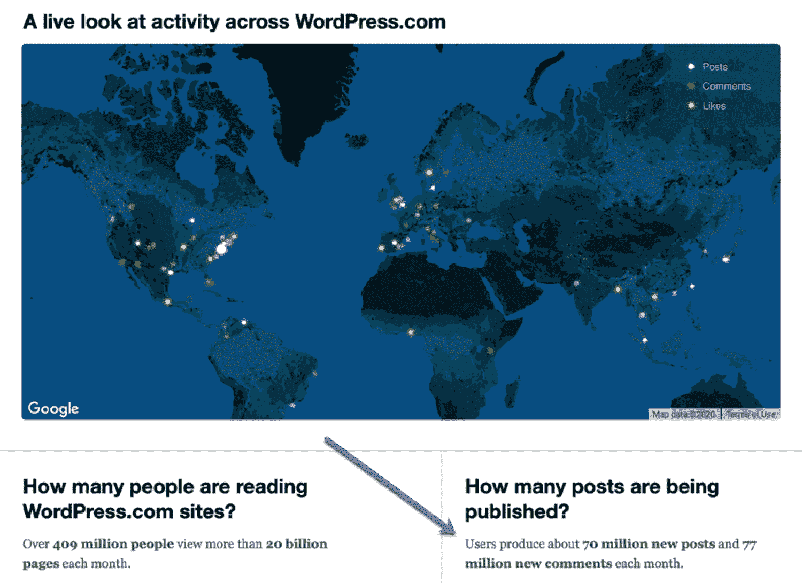

A WordPress map showing usage across the globe.

由于产生了如此多的内容，谷歌没有时间来处理不符合他们所有要求的页面。

避免你的网站因为没有遵守规则而被谷歌新闻拒绝，确保你网站的每个页面都符合谷歌新闻设定的[准则。](https://support.google.com/news/publisher-center/?hl=en-GB#topic=9603441)

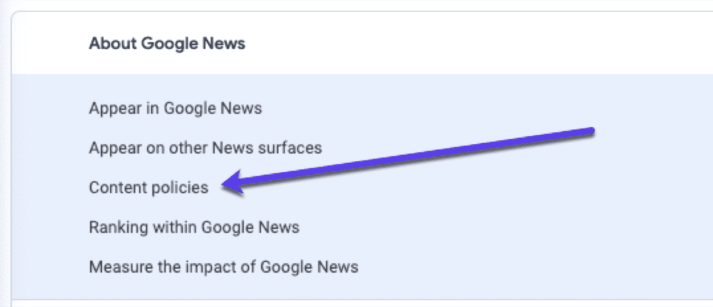

Google News content policies for getting published.

### 3.总是格式化你的内容

谷歌新闻可以阅读你页面上的所有文字。但是如果你的网站有很多多媒体(比如图片和视频),它可能需要一些帮助。

这就是为什么你应该确保你最有新闻价值的内容格式正确。例如，这篇文章是在谷歌新闻上推荐给我的:

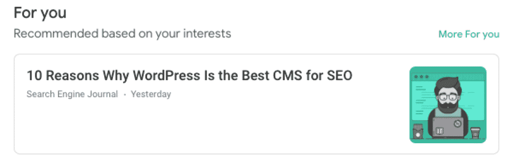

An article recommended to me on Google News

如果你点开它，你会看到[它结构很好](https://kinsta.com/blog/wordpress-seo/#8-use-proper-heading-tags)，有编号的副标题和最少的图片:

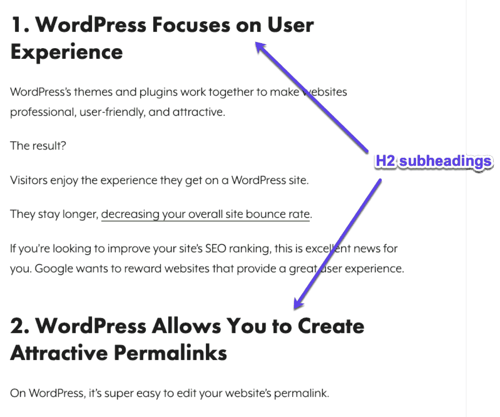

An example of a well-structured page recommenced to me on Google News

如果你真的想包含多媒体内容，使用[标题和标题标签](https://kinsta.com/blog/featured-snippets/)来给出内容的大概意思。理想的情况是，[写一篇关于你文章的描述，这样谷歌就能理解(并提供给搜索者)。](https://kinsta.com/blog/meta-description-wordpress/)

### 4.向谷歌新闻提交 YouTube 视频内容

视频无处不在,谷歌新闻也不能忽略它们。事实上，如果你的业务依赖于视频，你应该利用它们。

要向谷歌新闻提交您的视频内容，您需要[登录发布中心](https://publishercenter.google.com/publications)，点击顶部菜单栏中的**内容**标签。

从那里，您需要添加一个新的**部分**:

[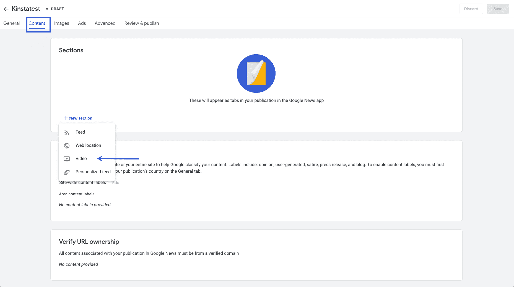](https://kinsta.com/wp-content/uploads/2020/05/add-video-submit-to-google-news.png)

Adding videos to Publisher Center

这将打开一个新窗口，您可以在其中添加来自您的 [YouTube](https://kinsta.com/blog/embed-youtube-video-wordpress/) 播放列表或频道的链接(如下例所示):

与宕机和 WordPress 问题做斗争？Kinsta 是一款考虑到性能和安全性的托管解决方案！[查看我们的计划](https://kinsta.com/plans/?in-article-cta)

[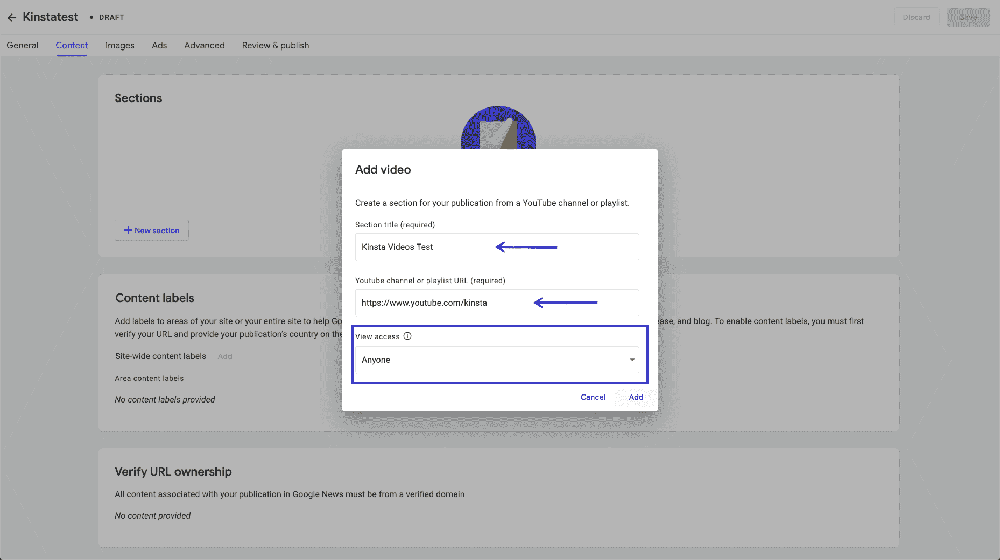](https://kinsta.com/wp-content/uploads/2020/05/adding-youtube-channel-google-news.png)

Adding a YouTube channel in Publisher Center

这不是添加视频的唯一选择，因为你还可以通过[`<iframe>`](https://kinsta.com/blog/wordpress-iframe/)或媒体`<RSS>`标签[将 YouTube 视频嵌入你的文章](https://kinsta.com/blog/embed-youtube-video-wordpress/)、你的订阅源。

相关:[2022 年值得考虑的最佳视频托管解决方案](https://kinsta.com/blog/video-hosting/)

### 5.创建友好和可读的网址

你需要注意你的 [URL 结构](https://kinsta.com/blog/wordpress-permalinks/)。当试图了解质量和相关性时，Google 会查看整个页面寻找线索，包括 URL。

事实上，URL 是它首先寻找的地方之一。因此，如果你的网站的网址是由随机字符组成的，谷歌将无法理解他们，你的观众也不会。

例如，看看这些网址，哪个会带你去一篇关于[如何给你的网站](https://kinsta.com/blog/how-to-drive-traffic-to-your-website/)增加流量的文章？

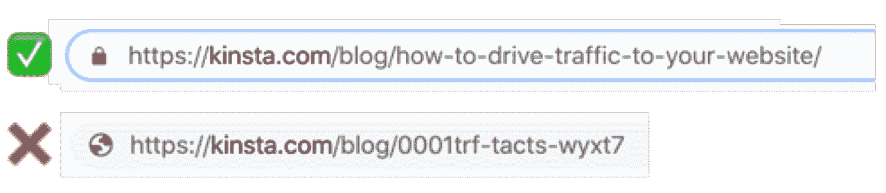

A good (& descriptive) URL vs a messy and confusing one.

我想你能明白我的意思。

确保你的[网址是搜索引擎优化友好和独特的](https://kinsta.com/blog/wordpress-seo/#3-set-up-friendly-permalinks)。为每个页面创建独特的 URL 是必要的，这样谷歌和其他搜索引擎就能理解他们的内容。是 [SEO 101](https://kinsta.com/blog/what-does-seo-stand-for/) 。

选择 URL 时要慢慢来。一旦创建了 URL，以后更改它可能会导致问题。

#### 重定向呢？

以前发表的文章会被谷歌新闻抓取器抓取，但是，如果你重定向到一个新的网站或新的页面，你需要[确保你使用的是 301 重定向](https://kinsta.com/blog/wordpress-redirect/)。

定期检查你的[抓取错误](https://kinsta.com/blog/google-search-console/#checking-the-health-of-your-website-with-google-search-console)并尽快修复任何问题是有好处的。此外，确保新网站没有任何 404 错误。

##### 延伸阅读:

*   [如何更改你的 WordPress 网址](https://kinsta.com/knowledgebase/wordpress-change-url/)
*   [WordPress 永久链接和 URL 重写](https://kinsta.com/blog/wordpress-permalinks/)

### 6.优化您的所有页面

谷歌新闻显示最近的头条新闻，但它也允许访问者定制他们的订阅源，只查看首选类别的新闻。

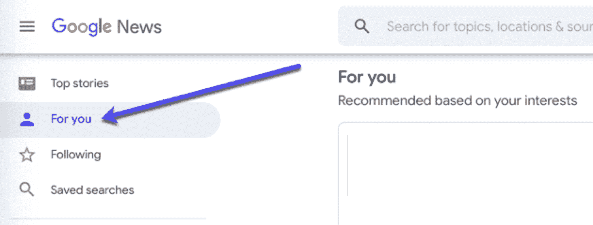

Customized news feeds in Google News.

因此，你的内容在谷歌新闻上就像在搜索引擎上一样可搜索，所以要确保它得到了优化。

将标题放在首位。他们需要为你的听众提供与[相关的关键词](https://kinsta.com/blog/keyword-research/)，如果可能的话，包括数字，并且要有说服力。

### 7.提供作者和公司的明确联系信息

谷歌新闻报道需要几个明确的方面，这些方面通常会被网站所有者忽略。具体来说，根据[谷歌新闻内容政策](https://support.google.com/news/publisher-center/answer/6204050):

> “……谷歌上的新闻来源应该提供明确的日期、署名、关于作者、出版物、出版商、背后的公司或网络的信息，以及联系信息。”

为了帮助证明您的内容的有效性，您需要在每个新闻报道中包含[联系方式](https://kinsta.com/blog/wordpress-contact-form-plugins/)信息。

署名文章应该在结尾包括一个简短的作者简介，包括一个职业头衔、[电子邮件地址](https://kinsta.com/blog/find-email-address/)，甚至是[到社交档案的链接](https://kinsta.com/blog/wordpress-social-media-plugins/)。

## AMP 呢？

[加速移动网页(AMP)](https://kinsta.com/blog/google-amp/) 旨在尽可能快地在手机上浏览网页。谷歌新闻在其所有移动平台(网络、安卓和 iOS)上都显示 AMP。

### 谷歌新闻需要 AMP 吗？

AMPs 不需要被谷歌新闻收录。但是如果没有 AMP 页面，一个以新闻为主的网站可能会错过来自移动搜索的大量潜在流量。

因此，如果您有一个发布大量新闻文章的网站，那么实现您的文章的有效 AMP 版本来为 SERPs 中专门以 AMP 故事为特色的 carousel 部分评分是值得的。

如果你对通过你的内容收集线索感兴趣，你可能想暂时搁置 T2 的 AMP 页面。

## 向谷歌新闻提交网站的最佳实践

让我们快速回顾一下您可以遵循的谷歌新闻最佳实践:

*   发布独特、[优质内容](https://kinsta.com/learn/blogging-tips/)。
*   内容必须[写得](https://kinsta.com/blog/proofreading-tips/)好，引人入胜。
*   定期发布。
*   内容一定要及时。
*   将你的标题设计成描述主题的新闻文章。请记住，这些是新闻文章，不像博客文章。
*   分离你的内容，这样只有新闻文章被提交到谷歌新闻。谷歌新闻不包括诸如操作指南和招聘信息之类的文章。
*   使用[相关图像](https://kinsta.com/blog/free-images-for-wordpress/)。
*   如果可能的话，有多个作者。
*   有[联系](https://kinsta.com/contact-us/)和[关于](https://kinsta.com/about-us/)的页面。
*   使用一个[专业主题](https://kinsta.com/blog/wordpress-free-vs-paid-themes/)让它看起来像一个新闻网站。
*   [建立谷歌分析](https://kinsta.com/blog/google-analytics-wordpress/)和[学习如何使用它](https://kinsta.com/blog/how-to-use-google-analytics/)
*   创建一个谷歌新闻网站地图。
*   利用发布中心管理您在 Google 新闻上的出版物。

一旦所有的标准都满足了，就该把你的网站提交给[谷歌新闻](https://partnerdash.google.com/partnerdash/d/news#p:id=pfehome)来帮助搜索引擎了解你的网站了。

[Extra! Extra! Read all about it...and by it, we mean your site on Google News. 🗞 Learn how to submit your site thanks to this guideClick to Tweet](https://twitter.com/intent/tweet?url=https%3A%2F%2Fkinsta.com%2Fblog%2Fsubmit-to-google-news%2F&via=kinsta&text=Extra%21+Extra%21+Read+all+about+it...and+by+it%2C+we+mean+your+site+on+Google+News.+%F0%9F%97%9E+Learn+how+to+submit+your+site+thanks+to+this+guide&hashtags=webtraffic%2CSEO)

## 摘要

让更多人看到你的内容对内容创作者来说是每天的挑战。说到新闻网站，竞争非常激烈。这就是为什么你应该考虑让谷歌新闻试试[给你的网站](https://kinsta.com/blog/how-to-drive-traffic-to-your-website/)带来更多流量。

别忘了:你的新闻故事可能会在不同的地方结束。例如，想想 Google Discover，即使你是在新闻行业，它也能每月带动成千上万的人访问你的网站。看看我们上个月的流量:将近 8k！

[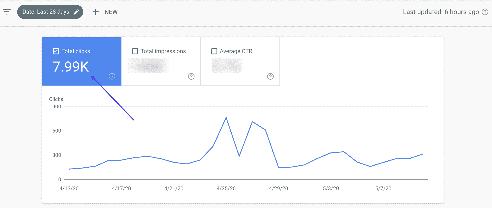](https://kinsta.com/wp-content/uploads/2020/05/google-discover-traffic-1.png)

Google Discover traffic stats

这是底线:

虽然你可以等待谷歌新闻选择你的网站，但是通过提交一个正确创建的谷歌新闻网站地图来简化这个过程也不失为一个好主意。

这个过程如此简单快捷，只需几分钟……为什么不试一试呢？

现在，我们想听听你的意见:你曾经向谷歌新闻提交过你的网站吗？你在那里有什么经历？关于如何向谷歌新闻提交网站，你有什么要补充的吗？

请在下面的评论区告诉我们您的体验！

* * *

让你所有的[应用程序](https://kinsta.com/application-hosting/)、[数据库](https://kinsta.com/database-hosting/)和 [WordPress 网站](https://kinsta.com/wordpress-hosting/)在线并在一个屋檐下。我们功能丰富的高性能云平台包括:

*   在 MyKinsta 仪表盘中轻松设置和管理
*   24/7 专家支持
*   最好的谷歌云平台硬件和网络，由 Kubernetes 提供最大的可扩展性
*   面向速度和安全性的企业级 Cloudflare 集成
*   全球受众覆盖全球多达 35 个数据中心和 275 多个 pop

在第一个月使用托管的[应用程序或托管](https://kinsta.com/application-hosting/)的[数据库，您可以享受 20 美元的优惠，亲自测试一下。探索我们的](https://kinsta.com/database-hosting/)[计划](https://kinsta.com/plans/)或[与销售人员交谈](https://kinsta.com/contact-us/)以找到最适合您的方式。