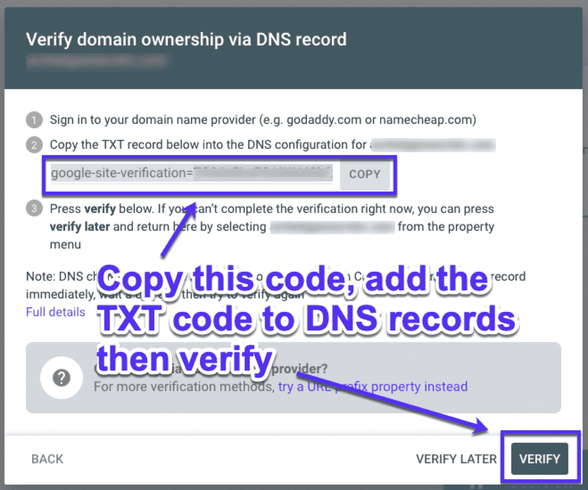
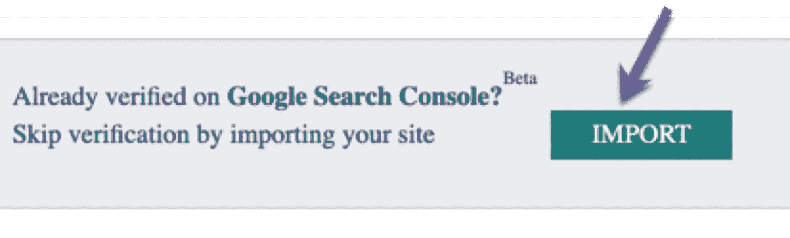
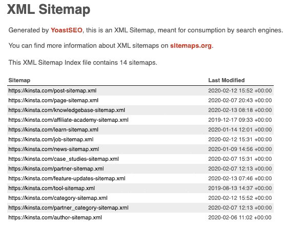
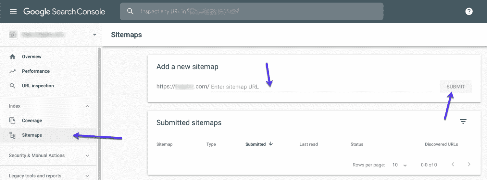
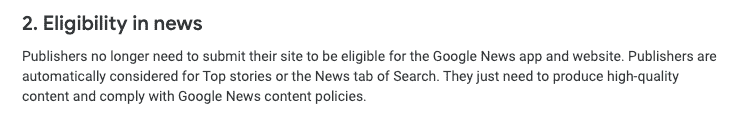
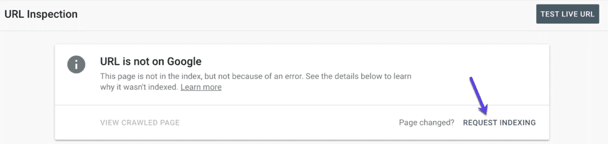
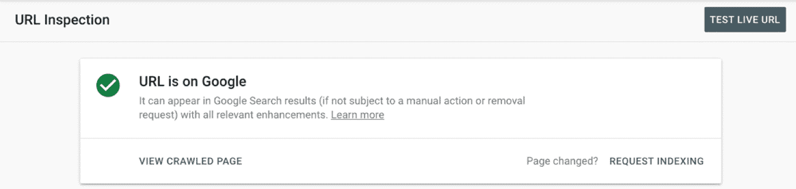
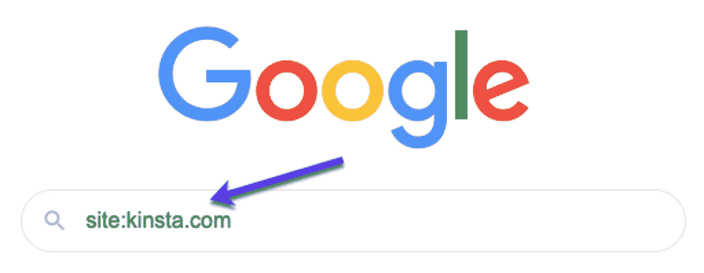
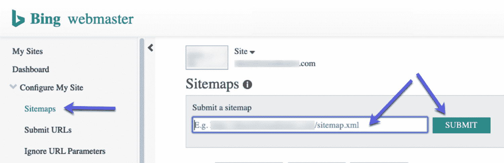
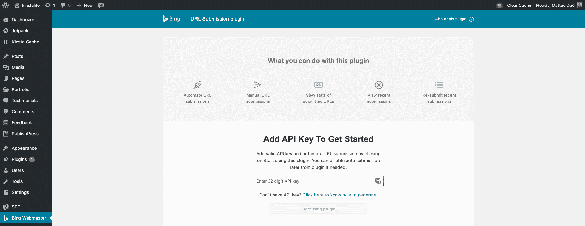

# 将你的网站提交给搜索引擎(何时以及如何提交)

> 原文：<https://kinsta.com/blog/submit-website-to-search-engines/>

在谷歌和其他搜索引擎上获得索引是让你的网站获得免费流量的最有效的方法之一。但是你可能想知道:

如何向搜索引擎提交我的网站？

简单的回答是:这取决于搜索引擎。更长的答案是，每种方法都有具体的步骤可循。以下是您将在本文中学到的内容:

 但是首先:

## 我需要把我的网站提交给搜索引擎吗？

是也不是。

搜索引擎的设计并不依赖于人工提交。就是效率不高。这就是为什么他们的[机器人会抓取网页来寻找网站来索引](https://kinsta.com/blog/wordpress-sitemap/#how-an-xml-sitemap-benefits-your-wordpress-site)。

如果你以前没有听说过这个术语:爬行是搜索引擎在网站上寻找新的链接，然后“跟随”这些链接。如果一个链接指向一些有用的东西(例如一个有用的网站)，那么这个页面就会被编入索引。

> Kinsta 把我宠坏了，所以我现在要求每个供应商都提供这样的服务。我们还试图通过我们的 SaaS 工具支持达到这一水平。
> 
> <footer class="wp-block-kinsta-client-quote__footer">
> 
> 
> 
> <cite class="wp-block-kinsta-client-quote__cite">Suganthan Mohanadasan from @Suganthanmn</cite></footer>

[View plans](https://kinsta.com/plans/)

这意味着搜索引擎很擅长自己寻找新网站，只要它们是从网上的某个地方链接来的。

但是话虽如此…

### 为什么你应该把你的网站提交给搜索引擎

以下是你应该手动将网站提交给搜索引擎的几个原因:

*   **安心**–[说到 SEO](https://kinsta.com/blog/what-does-seo-stand-for/#generate-a-robotstxt-file) ，安全总比后悔好。手动提交你的站点有多快，值得一试。
*   **直接告诉搜索引擎你的网站**–通过以下方法提交你的网站，你可以告诉谷歌(和其他人)关于你网站的重要信息，主要是关于内容更新和重要变化。
*   **这是一个简单的改进机会**–通过提交您的网站，您可以使用各种工具来帮助改进您的网站。此外，您可以通知他们内容现在已经更新，需要再次爬网。

## 向搜索引擎提交网站:入门

在你开始向搜索引擎提交你的网站之前，这里有一些你需要的东西。首先，你需要能够[访问和编辑你的网站](https://kinsta.com/blog/wordpress-login-url/)。

后端访问对于向搜索引擎提交网站来说并不是必须的，但是如果你需要在后面添加东西，它可能会有所帮助。

例如:

*   如果网站没有[站点地图](https://kinsta.com/blog/wordpress-sitemap/)。
*   如果网站需要一个 [robot.txt 文件](https://kinsta.com/blog/wordpress-robots-txt/)。
*   如果没有[谷歌搜索控制台](https://kinsta.com/blog/google-search-console/)或[必应站长工具](https://kinsta.com/blog/bing-webmaster-tools/)的实现。

有了对网站的访问，就可以更容易地添加他们。

这些是网站被索引的关键要求。事实上，拥有一个正确设置的网站地图是帮助你的网站被搜索引擎选中的最重要的事情之一。

不要忘记，访问两个主要的搜索引擎工具集也是必要的:

### 谷歌搜索控制台

在将您的网站提交给 Google 之前，您需要设置搜索控制台并验证网站所有权。

要验证您的网站，[复制 DNS TXT 记录并将其添加到您的域名提供商](https://kinsta.com/blog/google-search-console/#step-5--verify-your-account--alternative-methods)中，以验证域名所有权。

How to verify domain ownership using DNS records

用 DNS 记录验证你的站点是推荐的方法，因为你可以永久保留 DNS 记录，而且不会给你的站点增加额外的代码。

如果你不想(或不能)以这种方式验证你的域名，不要担心，还有其他方法来验证你的帐户。

### Bing 网站管理员工具

Bing 使得设置网站管理员工具变得非常容易。如果你已经设置了搜索控制台，你可以直接导入你的站点。

注册后，只需点击导入按钮:

Import Search Console settings into Bing

这是一个让你的网站进入 Bing 网站管理员工具的简单方法。

现在你已经设置好了你需要的一切，是时候开始向所有主要的搜索引擎提交你的站点了。

先说谷歌。

## 我如何向谷歌提交我的网站？

向谷歌提交网站非常容易。

事实上，提交你的网站的唯一方法是把你的网站地图添加到谷歌搜索控制台。

方法如下:

### 1.找到您的 XML 站点地图

站点地图是一个 XML 文件，它列出了网站上的所有页面。

通常可以通过以下方式找到它:

YOURWEBSITE.com/sitemap.xml

如果你使用 WordPress 来驱动你的站点，并且使用 Yoast [SEO 插件](https://kinsta.com/blog/best-seo-plugins-for-wordpress/)，你的站点地图将会是这样的:

Kinsta’s sitemap

一旦你找到了你的网站地图，你就可以进入下一步了:

### 2.将您的网站地图添加到谷歌搜索控制台

打开[谷歌搜索控制台](https://www.google.com/webmasters/tools/home)，在 Index 下，选择 sitemaps。

现在，你需要做的就是粘贴你的网站地图网址，点击提交:

Add a sitemap to Google Search Console

如果你有多个站点地图，只要重复这个过程，直到你所有的站点地图都在提交部分列出。

为了做到这一点，您需要添加并验证您的网站到 GSC。

## 注册订阅时事通讯

### 想知道我们是怎么让流量增长超过 1000%的吗？

加入 20，000 多名获得我们每周时事通讯和内部消息的人的行列吧！

[Subscribe Now](#newsletter)

如果您需要更深入的步骤，我们有一个[搜索控制台指南](https://kinsta.com/blog/google-search-console/)，它将带您了解您需要知道的一切。同样，我们也有这个指南，关于[如何向谷歌新闻](https://kinsta.com/blog/submit-to-google-news/)提交一个网站，如果你希望你的网站出现在那里。

#### 关于向谷歌新闻提交你的网站的快速说明

Google News’ content policies

出版商[不再需要提交他们的网站](https://support.google.com/news/publisher-center/answer/9607025)才有资格使用谷歌新闻应用和网站。具体来说，根据[巴瑞·亚当斯](https://www.seroundtable.com/google-news-submission-bert-28672.html):

> 出版商会被自动列入头条新闻或搜索的新闻标签。

### 3.向 Google 提交一个页面 URL

如果你只是想向谷歌提交一个单独的页面呢？这也很简单。

在搜索控制台中，[转到 URL 检查](https://kinsta.com/blog/google-search-console/#see-how-google-views-a-url)并粘贴您想要索引的页面 URL。

如果页面**没有被索引**，你会看到 GSC 说*‘网址不在谷歌上’*。要让它被抓取，只需点击**请求索引**:

Use URL inspection to request indexing

如果页面**被索引**，你会看到*‘网址在谷歌上’*:

Indexed page in Search Console

如果你最近更新了内容，并希望谷歌重新抓取页面，你可以点击**‘请求索引’**来索引这些页面变化。

### 如何检查你的页面是否在谷歌上？

要查看您的网站是否已成功提交并被编入索引，只需在 Google 上搜索您的网址。如果谷歌已经抓取并索引了你的网站，它会显示在搜索结果中。

你可以试着从你的网站上复制一两段文字，然后在“引号”中搜索。如果你的网页在谷歌上，它应该会出现。

你可以使用的另一种方法是在谷歌中搜索操作符命令 **"site:"** 。只需键入:

网址:www。YOURWEBSITE.com

How to perform a site search in Google

谷歌只会显示你输入的域名的搜索结果。您可以在网站的主页或内部页面上使用站点搜索操作符。

厌倦了低于 1 级的 WordPress 托管支持而没有答案？试试我们世界一流的支持团队！[查看我们的计划](https://kinsta.com/plans/?in-article-cta)

## 我如何向雅虎提交我的网站？

好的，这是最简单的一个。为了让你的网站出现在雅虎上…你把你的网站提交给 Bing。

那不是打字错误。向 Bing 提交您的网站也会自动向 Yahoo 提交。

因此，您不妨进入下一部分，让您的网站在 Bing 上列出:

## 如何向 Bing 提交我的网站？

首先你需要去 [Bing 站长工具](https://www.bing.com/toolbox/webmaster)。你需要确保你已经为你的网站设置好了。如果你需要帮助，这里有我们方便的[必应 WMT 指南](https://kinsta.com/blog/bing-webmaster-tools/)。

就像搜索控制台一样，在 Bing 中提交你的站点地图很简单。只需从菜单中选择“网站地图”，粘贴你的网站地图网址，点击提交。

Submit XML sitemaps in Bing Webmaster Tools

这不仅会将你的网站提交给 Bing，还会提交给 Yahoo(因为它们都是由 Bings Index 支持的)。

### Bing URL 提交插件

如果你的[站点是由 WordPress](https://kinsta.com/knowledgebase/what-is-wordpress/) 驱动的，那么你可以使用他们的 [Bing URL 提交插件](https://wordpress.org/plugins/bing-webmaster-tools/)向 Bing 提交你的内容。

Bing URL Submissions WordPress Plugin

免费使用且易于激活，在您添加 API 密钥后，该插件会自动将您的新内容或更新内容直接提交到 Bing 的搜索索引中:

Activating the Bing URL Submissions WordPress Plugin

您可以尝试一些功能，例如:

*   您可以根据需要打开和关闭自动提交功能。
*   手动提交 URL。
*   查看最近通过插件提交的 URL，也可以下载一个方便的列表来跟踪。
*   重新提交最近的网址的可能性。

## 我如何向 DuckDuckGo 提交我的网站？

这里的简短回答是:你没有。

DuckDuckGo 自动索引网页，所以你不需要手动提交你的网站给他们。

事实上，它使用了超过 400 个来源和 Bing 的搜索结果，所以如果你按照前面的步骤提交给 Bing(和 Yahoo ),你已经做了所有你需要的事情来加速你的网站在 DuckDuckGo 上的索引。

## 避免提交服务

让你的网站在谷歌、必应或雅虎上上市是免费的，所以你不应该支付提交服务来让你上市。

注册一个搜索引擎提交服务是没有意义的。如果你运气不好，你会被垃圾邮件轰炸，试图出售你的低质量搜索引擎优化服务。

重要的搜索引擎提供有用的资源来帮助网站提交并在 Google、Yahoo 和 Bing 上成功索引。你不需要服务来做这些。

### 其他搜索引擎提交资源

大多数搜索引擎都有特定的方式将网页提交到它们的索引中。以下是将您的网站提交给搜索引擎的官方页面链接:

*   [提交谷歌站长工具](http://www.google.com/webmasters/tools/)
*   [将站点提交给 Bing 网站管理员工具](http://www.bing.com/toolbox/webmaster)
*   [提交到谷歌新闻](https://support.google.com/news/publisher-center/answer/7526416?hl=en-GB)
*   [将我的网站提交给 Yandex](http://webmaster.yandex.com/addurl.xml)
*   [将我的网站提交给百度](http://zhanzhang.baidu.com/linksubmit/url)

[In 2020, it doesn't seem to be the case for manually submitting a website to search engines. Well, not 100% true: search engines could use some help sometimes! Check out how to submit your site to get it crawled faster! 🤖📈Click to Tweet](https://twitter.com/intent/tweet?url=https%3A%2F%2Fkinsta.com%2Fblog%2Fsubmit-website-to-search-engines%2F&via=kinsta&text=In+2020%2C+it+doesn%27t+seem+to+be+the+case+for+manually+submitting+a+website+to+search+engines.+Well%2C+not+100%25+true%3A+search+engines+could+use+some+help+sometimes%21+Check+out+how+to+submit+your+site+to+get+it+crawled+faster%21+%F0%9F%A4%96%F0%9F%93%88&hashtags=seo%2Ctraffic)

**看看下面的视频，了解更多关于使用 SEO 增加网站流量的信息:**

## 摘要

谷歌和其他搜索引擎最终将能够找到你的网站，即使你没有手动提交给他们。

尽管如此，强烈建议使用站点地图提交你的站点，如果你没有一个合适的设置，这是值得的。为什么？它给搜索引擎提供了关于你的网站的额外信息，作为回报，你得到了关于你的网站的额外索引数据(甚至可能是 [sitelinks](https://kinsta.com/blog/google-sitelinks/) )。

向搜索引擎提交网站对于**向搜索引擎发送内容更新和变化的信号**具有巨大的价值。强制进行新的抓取可以让你加快新添加的关键字的排名，而不是旧的关键字，旧的关键字不再相关。

由于 SEO 是一个不断变化的领域，让你的网站和页面被索引是最起码的。如果你想[增加你的流量](https://kinsta.com/blog/how-to-drive-traffic-to-your-website/)，还有更多的事情需要去做(这里有一个 [SEO 清单](https://kinsta.com/blog/wordpress-seo/)作为开始)，但是你现在已经在正确的轨道上了。

* * *

让你所有的[应用程序](https://kinsta.com/application-hosting/)、[数据库](https://kinsta.com/database-hosting/)和 [WordPress 网站](https://kinsta.com/wordpress-hosting/)在线并在一个屋檐下。我们功能丰富的高性能云平台包括:

*   在 MyKinsta 仪表盘中轻松设置和管理
*   24/7 专家支持
*   最好的谷歌云平台硬件和网络，由 Kubernetes 提供最大的可扩展性
*   面向速度和安全性的企业级 Cloudflare 集成
*   全球受众覆盖全球多达 35 个数据中心和 275 多个 pop

在第一个月使用托管的[应用程序或托管](https://kinsta.com/application-hosting/)的[数据库，您可以享受 20 美元的优惠，亲自测试一下。探索我们的](https://kinsta.com/database-hosting/)[计划](https://kinsta.com/plans/)或[与销售人员交谈](https://kinsta.com/contact-us/)以找到最适合您的方式。