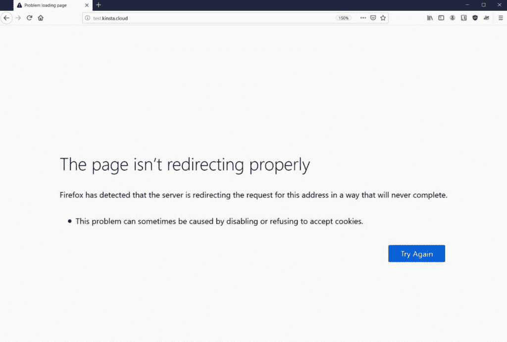
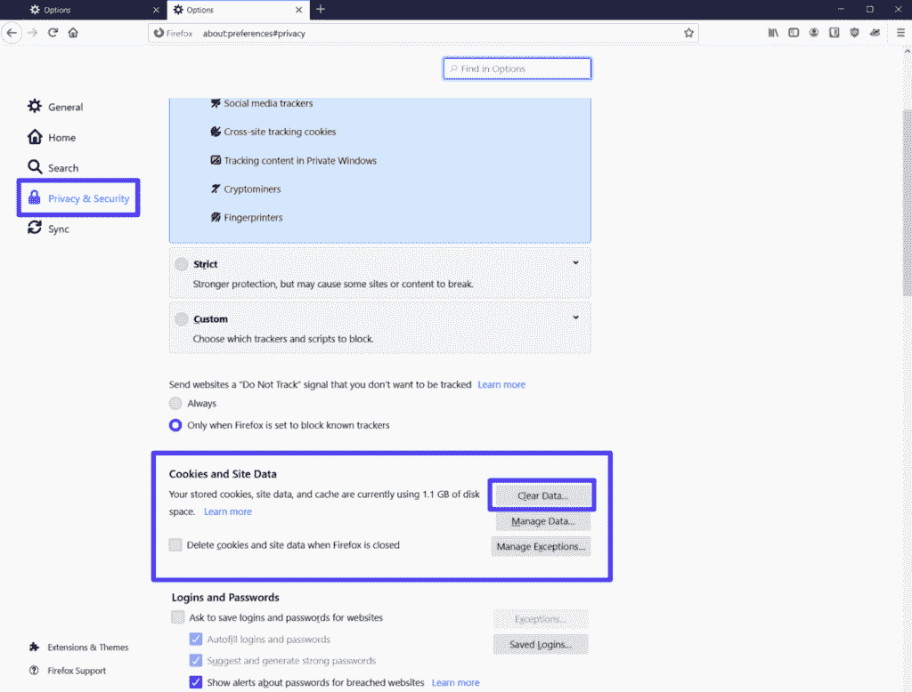
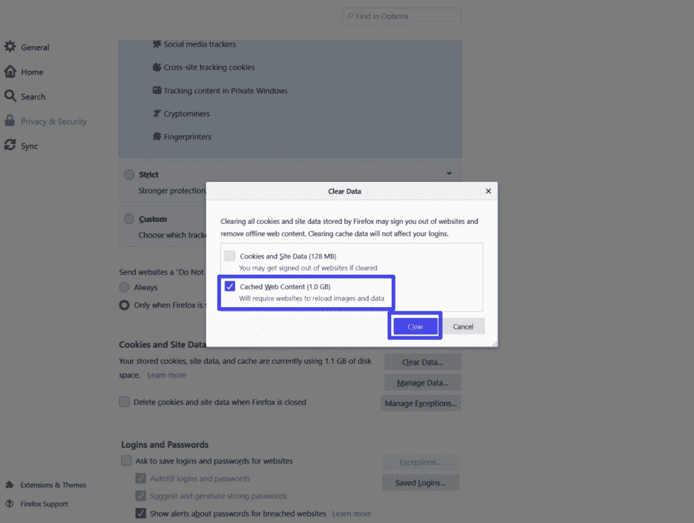
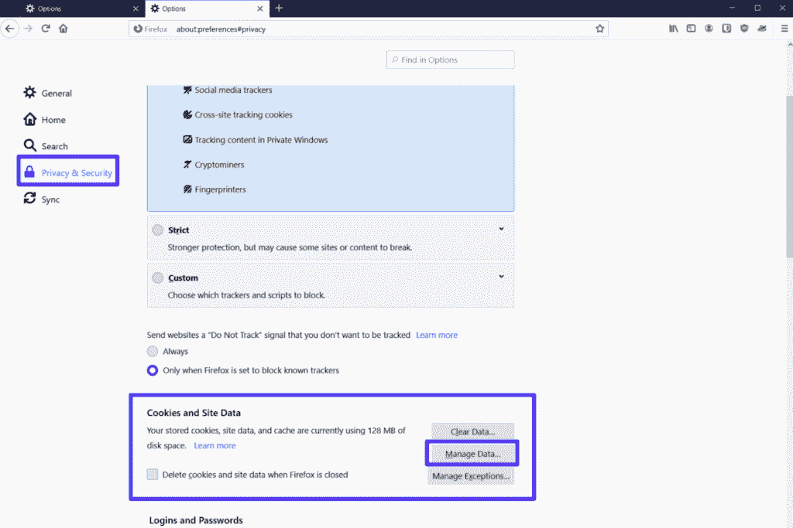
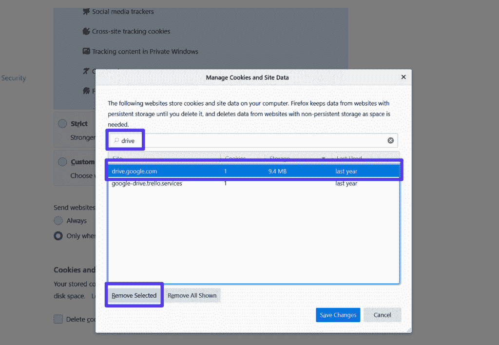
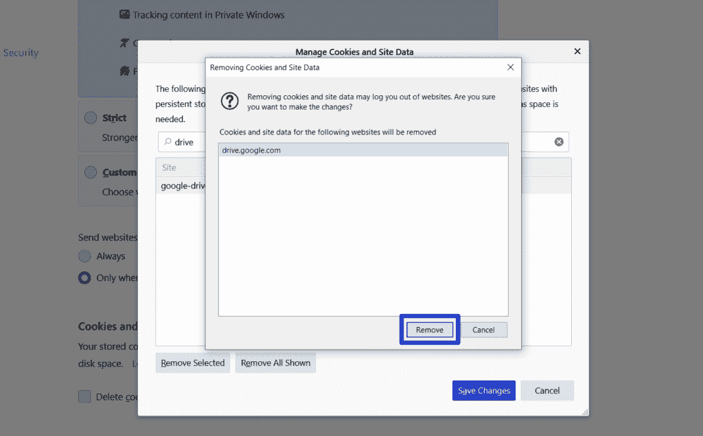
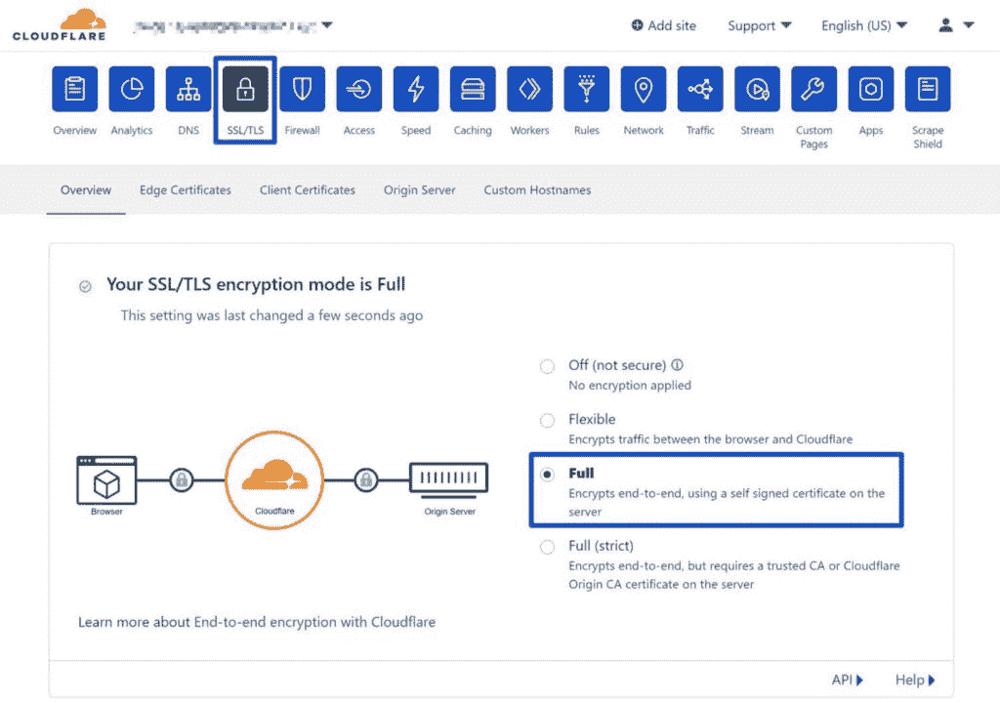
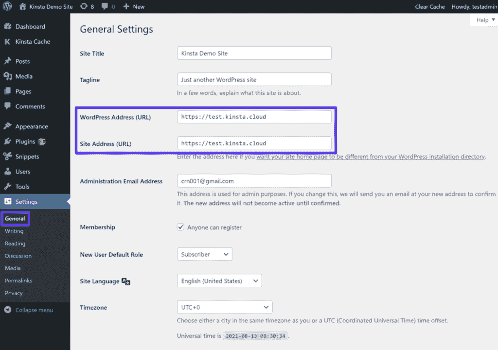
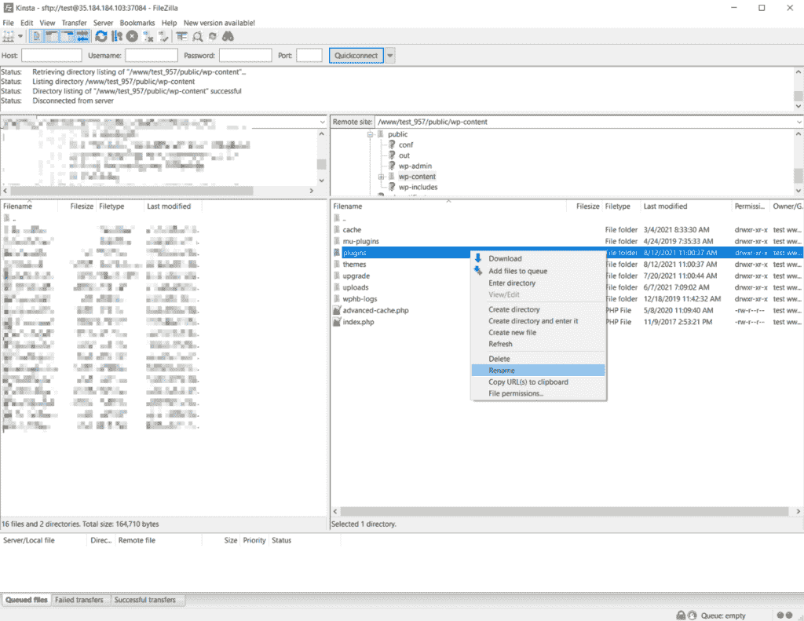
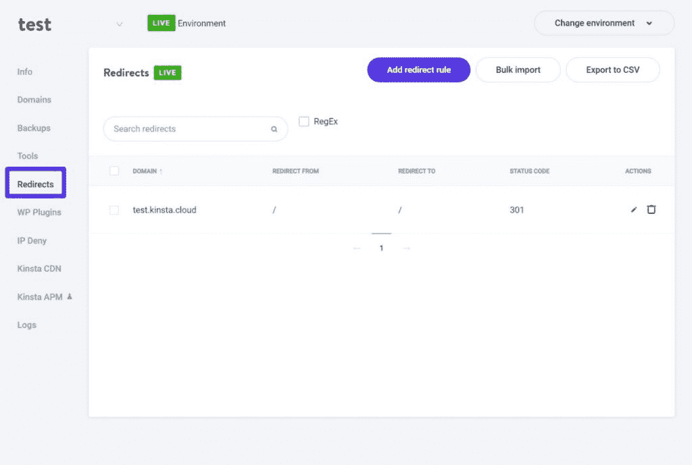

# 如何修复 Firefox 的“页面没有正确重定向”错误

> 原文：<https://kinsta.com/blog/the-page-isnt-redirecting-properly/>

你有没有试过在 Firefox 中访问你的网站，却收到一条信息告诉你“页面没有正确重定向”？

该错误消息是 Mozilla Firefox [web 浏览器](https://kinsta.com/browser-market-share/)特有的，表明您的站点上的重定向存在一些问题。这可能是由几个原因造成的，也可能只是一个原因。下面我们帮你弄清楚。

在这篇文章中，你将学习如何修复 WordPress 网站、 [Nginx](https://kinsta.com/knowledgebase/what-is-nginx/) 服务器和 [PHP](https://kinsta.com/knowledgebase/devkinsta/php-versions/) 应用的“页面没有正确重定向”错误信息。同样的步骤也可以解决您可能在 Google Drive 或您正在访问的其他网站上看到此消息的情况。

我们走吧！

## “页面没有正确重定向”是什么意思？

当 Firefox 陷入无限重定向循环时，会显示“页面没有正确重定向”错误。



An example of the “The page isn’t redirecting properly” error in Firefox.


例如，“第 1 页”可能会将你重定向到“第 2 页”，这可能会将你重定向回“第 1 页”，然后将你直接重定向回“第 2 页”，如此循环往复。


> Kinsta 把我宠坏了，所以我现在要求每个供应商都提供这样的服务。我们还试图通过我们的 SaaS 工具支持达到这一水平。
> 
> <footer class="wp-block-kinsta-client-quote__footer">
> 
> 
> 
> <cite class="wp-block-kinsta-client-quote__cite">Suganthan Mohanadasan from @Suganthanmn</cite></footer>

[View plans](https://kinsta.com/plans/)

Firefox 不会永远陷入这个重定向循环，而是会放弃并告诉你“页面没有正确重定向”

这个问题几乎可以出现在任何网站上。在某些情况下，你可能会在 Google Drive 或 YouTube 上看到它。或者，如果你是一个 [WordPress 网站管理员](https://kinsta.com/blog/why-use-wordpress/)，当你试图访问你的 WordPress 网站时，你可能会看到它。

如果你也使用 Chrome 浏览器，你可能会遇到同样的问题，但是名称不同:ERR_TOO_MANY_REDIRECTS。我们有一整篇关于如何修复 ERR_TOO_MANY_REDIRECTS 错误的帖子，该帖子中的所有提示也适用于 Firefox 的“页面没有正确重定向”错误，因为这是相同的基本问题。

[如果你使用 Mozilla Firefox，你可能会看到这条消息。👀万幸的是，解决的办法只是一键推开⬇️ 点击推文](https://twitter.com/intent/tweet?url=https%3A%2F%2Fkinsta.com%2Fblog%2Fthe-page-isnt-redirecting-properly%2F&via=kinsta&text=If+you+use+Mozilla+Firefox%2C+you+may+have+seen+this+message.+%F0%9F%91%80+Luckily%2C+the+solution+is+just+a+click+away+%E2%AC%87%EF%B8%8F&hashtags=Firefox%2CWordPress)


## 为什么会出现“页面没有正确重定向”的消息

这个[错误消息](https://kinsta.com/knowledgebase/error-521/)的根本原因总是你遇到问题的站点上的一些重定向错误配置。

然而，这种错误配置可能有许多不同的原因，这使得追踪问题变得有点棘手。

在这篇文章的其余部分，我们将分享一些提示和策略，你可以用来诊断和修复是什么导致了错误。

## 首先尝试这些修复

一会儿，我们将分享在 WordPress 站点、Nginx 和 PHP 上修复这个错误信息的具体故障排除步骤。

但是，在您执行这些步骤之前，或者如果您遇到了您无法控制的网站问题(如 Google Drive 或 YouTube)，我们建议您首先执行这两个基本的故障诊断步骤。

执行这两个步骤将自动修复许多重定向问题。如果这些方法不能解决问题，您可以继续进行更具体的修复。但是如果这些建议真的能让事情重新运转起来，你会为自己节省很多时间和挫折。

### 1.清除您的浏览器缓存

当遇到任何错误时，你应该做的第一件事就是[清空你的火狐浏览器缓存](https://kinsta.com/knowledgebase/how-to-clear-browser-cache/)。

Firefox(和所有其他浏览器)会将网站的静态文件存储在本地计算机的缓存中以提高性能。这样，Firefox 就可以直接从你的电脑上加载这些资源，而不是在每次加载新页面时重新下载。

但是，如果这些文件由于某种原因已经过期，那么就会触发许多不同的错误，包括“页面没有正确重定向”错误。通过清空你的缓存，你将迫使火狐重新下载文件的新版本，这通常可以解决问题。

首先，在浏览器的导航栏中输入以下文本，打开隐私设置:

`about:preferences#privacy`

或者，您可以按照以下说明手动打开此区域:

1.  点按右上角的汉堡图标。
2.  从下拉菜单中选择**选项**，打开设置区。
3.  转到**隐私&安全**选项卡。

在**隐私&安全**区域，找到 **Cookies 和站点数据**部分，点击**清除数据**按钮:



Access the Firefox browser cache data and click the “Clear Data” button.


在出现的弹出窗口中，选择**缓存网页内容**选项，然后点击**清除**:



Clearing the Firefox browser cache.


现在，重新加载你有问题的页面，看看它是否工作。如果不是，继续下一步。


### 2.为有问题的站点清除 Cookies

“页面没有正确重定向”消息的另一个常见原因是[网站的 cookie](https://kinsta.com/blog/wordpress-cookies-php-sessions/)有问题。

与浏览器缓存一样，解决方案是清除有问题站点的浏览器 cookies。

为了避免注销您访问的每个站点，您只需要清除您遇到问题的特定域的 cookies。删除你所有的 cookies 没有问题——只是不得不再次登录每个网站很痛苦，这就是为什么采用有针对性的方法可能更好。

要执行这种有针对性的删除，请返回到**cookie 和站点数据**设置(就像您对浏览器缓存所做的那样)，只是这一次，单击**管理数据**按钮:



Searching cookies for individual sites through the “Manage Data” button.


在弹出窗口中:

1.  搜索你遇到问题的网站的域名。
2.  从列表中选择它。
3.  点击**删除选中的**。



Clearing the cookies of a single site with the “Remove Selected” button.


在出现的确认提示中，再次点击**移除**:



Confirm that you want to clear cookies for the selected site.


然后，重新加载页面，看看它是否再次工作。请注意，如果网站需要用户名/密码，您需要再次登录。

如果这些提示都没有解决问题，你可以继续阅读一些更有针对性的解决方案。


## 如何修复 WordPress 中的“页面没有正确重定向”

如果你在你的 WordPress 网站上看到“页面没有正确重定向”的信息，并且上面的两个故障排除步骤没有解决问题，你可能需要钻研一些 WordPress 特有的修复。

正如我们上面提到的，这个错误是由你的网站上的一些重定向问题引起的。在 WordPress 上，这个重定向问题可能来自以下任何一个原因:

*   WordPress 设置(特别是当你最近迁移了一个站点或者改变了一个关键的设置)
*   [插件](https://kinsta.com/best-wordpress-plugins/)
*   [SSL 证书](https://kinsta.com/knowledgebase/how-ssl-works/)或 HTTPS 配置
*   Cloudflare SSL 配置
*   [服务器重定向](https://kinsta.com/help/redirect-rules/)

为了帮助您确定应该从哪里开始故障诊断，您可以使用重定向检查器工具，如 [HTTP Status 和重定向检查器](https://kinsta.com/tools/redirect-checker/)来分析您的重定向循环中发生了什么。只需输入您遇到问题的网站的 URL，该工具将按步骤分解重定向链。

例如，如果您看到您的网站在网站的 [HTTP 和 HTTPS](https://kinsta.com/blog/http-to-https/) 版本之间来回重定向，这是一个很好的迹象，表明问题与您网站上的 HTTPS 或 SSL 使用有关，因此您应该从那里开始故障排除。

如果您看不到任何模式，您可以按顺序完成以下故障诊断步骤。

### 检查您的 HTTPS 设置

您站点的 HTTPS 设置可能是重定向错误配置的常见来源。这里有一些潜在的问题:

## 注册订阅时事通讯


### 想知道我们是怎么让流量增长超过 1000%的吗？

加入 20，000 多名获得我们每周时事通讯和内部消息的人的行列吧！

[Subscribe Now](#newsletter)

*   **在未安装 SSL 证书的情况下强制 HTTPS**:如果您试图在未安装 SSL 证书的情况下强制使用 HTTPS，将会触发此错误。如果你在 Kinsta 托管，我们已经写了一个关于使用 SSL 证书的[指南。否则，请向您的主机支持寻求帮助。](https://kinsta.com/help/how-to-install-ssl-certificate/)
*   **使用 SSL 插件**:只要有可能，我们建议更新你的硬编码链接，使用 HTTPS，而不是使用像[真正简单的 SSL](https://wordpress.org/plugins/really-simple-ssl/) 这样的 SSL 插件。你可以通过[运行搜索并替换你网站数据库上的](https://kinsta.com/knowledgebase/wordpress-search-and-replace/)来做到这一点。如果您是 Kinsta 的客户，请寻求支持，我们可以为您做到这一点。
*   **有一个错误配置的 HTTP 到 HTTPS 的重定向:**强制重定向所有 HTTP 流量到 HTTPS 是好的，但是你要确保你已经[正确设置了重定向](https://kinsta.com/knowledgebase/redirect-http-to-https/)。

### 检查 Cloudflare SSL 设置

如果你已经[配置你的 WordPress 站点使用 Cloudflare](https://kinsta.com/knowledgebase/install-cloudflare/) ，你可能会看到由于 Cloudflare 的 SSL 设置导致的错误信息。通常，当您已经在站点的服务器上安装了 SSL 证书，但仍在使用 Cloudflare 的灵活 SSL 设置时，会发生此错误。

要解决这个问题，您需要从 Cloudflare 的**灵活的** SSL/TLS 加密模式切换到它的**完全**选项。

打开您的 Cloudflare 仪表盘，转到 **SSL/TLS** 选项卡。然后，将 **SSL/TLS 加密模式**从**灵活**改为**完全(**或**完全(严格)**):



Changing Cloudflare SSL settings to “Full.”


### 信息

如果您使用的是 [Kinsta 基于 Cloudflare 的内容交付网络](https://kinsta.com/knowledgebase/cloudflare-integration/)，您无需担心这一点，因为我们会为您配置一切。


### 检查你的 WordPress 站点设置

如果你仍然可以访问你的 WordPress 仪表盘，你应该检查你的站点 URL 设置(**设置>常规**)。

这些应该互相匹配。此外，如果你已经设置了从 **WWW** 到**非 WWW** 的重定向(反之亦然)，你需要确保你的网站设置与你设置的永久 URL 相匹配。

例如，如果你设置了一个重定向来发送从`https://yoursite.com`到`https://www.yoursite.com`的所有流量，你应该确保你的 WordPress 网站地址是`https://www.yoursite.com`。



Checking your WordPress site address.


如果你不能访问你的 WordPress 仪表盘，你可以通过编辑[你站点的 wp-config.php 文件](https://kinsta.com/blog/wp-config-php/)来手动覆盖这些值。你可以通过[用 FTP](https://kinsta.com/knowledgebase/how-to-use-sftp/) 连接到你的服务器来访问和管理这个文件。

将以下代码片段添加到文件中，确保将示例 URL 替换为您站点的实际 URL:

```
define('WP_HOME','https://yourdomain.com');
define('WP_SITEURL','https://yourdomain.com');
```

你可以学习更多关于[改变你的 WordPress URL](https://kinsta.com/knowledgebase/wordpress-change-url/) 来更深入地了解这些和其他方法。

### 暂时禁用 WordPress 插件

在某些情况下，如果出于某种原因触发了重定向循环，WordPress 插件会导致“页面没有正确重定向”的错误。这个问题可能是由于插件本身或兼容性(与另一个插件，主题，或其他自定义代码)。

为了快速测试是否是插件问题，你可以尝试[关闭你所有的插件](https://kinsta.com/knowledgebase/disable-wordpress-plugins/)。如果你的网站在你关闭它们后开始工作，你就会知道是你的插件导致了这个问题。

需要为您的电子商务网站提供超快的、可靠的、完全安全的托管服务吗？Kinsta 提供所有这些服务，并由 WooCommerce 专家提供 24/7 的世界级支持。[查看我们的计划](https://kinsta.com/plans/?in-article-cta)

如果你仍然可以访问你的 WordPress 仪表盘，你可以从**插件**区域停用你的插件。

如果您无法访问您的仪表板，您可以通过 FTP 禁用您的插件:

1.  使用 FTP/SFTP 和[连接到您的服务器](https://kinsta.com/blog/best-ftp-clients/)[，您的首选 FTP 客户端](https://kinsta.com/knowledgebase/ftp-vs-sftp/)。
2.  导航到 **wp-content** 文件夹。
3.  将**插件**文件夹重命名为**插件 _ 旧**。
4.  打开您的网站，看看问题是否仍然存在。



Manually disabling plugins using FTP.


如果你的网站开始工作，登录你的 WordPress 仪表盘。登录后，您可以返回 FTP 客户端，将文件夹重新命名为 **plugins** 。

当你进入 WordPress 仪表盘的**插件**区域时，WordPress 将会关闭你所有的插件。然后你可以通过你的仪表板一个接一个地重新激活它们，每次都再次测试你的站点，直到你找到导致问题的插件。

### 检查服务器上的重定向

如果您在服务器上设置了错误配置的重定向，这也可能导致重定向循环问题。

如何解决这个问题取决于您的主机是使用 [Apache 还是 Nginx web 服务器](https://kinsta.com/blog/nginx-vs-apache/)。Kinsta 只使用 Nginx，但其他一些 web 主机使用 [Apache](https://kinsta.com/knowledgebase/what-is-apache/) 。

#### 阿帕奇。htaccess 文件

使用 Apache，您可以通过使用[来设置重定向。htaccess 文件](https://kinsta.com/knowledgebase/wordpress-htaccess-file/)。然而，这里的错误配置可能会触发 Firefox 中的错误消息。

要解决这个问题，你可以告诉 WordPress 生成一个新的**。htaccess** 文件:

1.  使用 FTP 连接到您的服务器。
2.  找到你现有的**。htaccess** 文件—它应该在根文件夹中。
3.  将当前文件重命名为**。htaccess_old** 来禁用它(同时仍然保留它作为备份)。

此时，您可以尝试重新访问您的站点。如果可以，打开你的 WordPress 仪表盘，进入**设置>永久链接**。然后，点击**保存更改**(不更改任何设置)。这个设置将强制 WordPress 生成一个新的**。htaccess** 文件。

如果您无法访问您的 WordPress 仪表盘，您可以通过以下方式手动重新创建此文件:

1.  创建一个名为**的新文件。使用你的 FTP 客户端。**
2.  将下面的代码片段添加到文件中。

```
# BEGIN WordPress
<IfModule mod_rewrite.c>
RewriteEngine On
RewriteBase /
RewriteRule ^index\.php$ - [L]
RewriteCond %{REQUEST_FILENAME} !-f
RewriteCond %{REQUEST_FILENAME} !-d
RewriteRule . /index.php [L]
</IfModule>
# END WordPress
```

#### Nginx。会议文件

如果您的主机使用 nginx，那么故障诊断可能会有点棘手，因为配置文件的内容和位置(通常是 Nginx 服务器上的 **nginx.conf** )会因主机提供商而异。因此，我们建议向您寻求帮助。

如果你用 Kinsta 托管，你可以在你的站点仪表板上进入**重定向**工具，看看你是否不小心设置了一个错误配置的重定向。或者，[联系我们的支持团队](https://kinsta.com/kinsta-support/)，我们很乐意为您检查。



An example of a misconfigured redirect in Kinsta’s redirect tool.


如果你仍然对 Nginx 中的“页面没有正确重定向”和编辑**有问题。conf** 文件没有解决它们，最可能的问题是您添加了一系列重写指令，导致了无限重定向循环。

这个问题在任何重写规则中都可能发生，但是当编写规则从 **HTTP** 移动到 **HTTPS** 或者重定向 **WWW** 到 **non-WWW** 时，这是意料之中的(反之亦然)。

如果您最近在您的 **nginx.conf** 文件中添加了新的重写规则，这些规则很可能就是罪魁祸首。尝试移除它们，看看是否能解决问题。如果是这样，那么您知道您添加的重写规则的语法有问题。

## 如何修复 PHP 中的“页面没有正确重定向”

如果您在 PHP 中看到“页面没有正确重定向”[，两个常见的故障排除步骤是:](https://kinsta.com/knowledgebase/what-is-php/)

### 检查您的重定向

如果您已经使用 [PHP](https://kinsta.com/blog/php-benchmarks/) 设置了重定向，比如通过 **header()** 函数，这可能是重定向问题的常见来源。

您的第一步应该是调试该函数，并确保您没有以创建重定向循环的方式设置它。按照我们已经讨论过的步骤来修复任何错误的配置。

### 检查登录/会话问题

许多 PHP 问题都是由登录和会话行为引起的——例如，一个函数检查用户是否登录，如果用户没有登录，就将他们重定向到登录页面。

如果您没有正确地设置会话检查，您实际上可以将用户困在一个无限重定向循环中。

[看过这条消息吗？😅了解如何为 WordPress 站点、Nginx 和 PHP 解决这个问题，就在这里⬇️ 点击推文](https://twitter.com/intent/tweet?url=https%3A%2F%2Fkinsta.com%2Fblog%2Fthe-page-isnt-redirecting-properly%2F&via=kinsta&text=Ever+seen+this+message%3F+%F0%9F%98%85+Learn+how+to+resolve+it+for+WordPress+sites%2C+Nginx%2C+and+PHP+right+here+%E2%AC%87%EF%B8%8F&hashtags=Firefox%2CWordPress)

## 摘要

“页面没有正确重定向”错误是 Mozilla Firefox 特定的错误消息，当页面遇到无限重定向循环时会出现。与 Chrome 中的 ERR_TOO_MANY_REDIRECTS 错误消息[相同。](https://kinsta.com/blog/err_too_many_redirects/)

要解决此错误，您应该先尝试两件事:

1.  清除您的 Firefox 浏览器缓存。
2.  为您看到错误的站点清除 cookies。

如果你有一个 WordPress 站点，并且在尝试了这两个步骤后错误信息仍然存在，你可以按照这个指南中 WordPress 特有的步骤来进一步调查这个问题。并且确保[遵循重定向最佳实践](https://kinsta.com/blog/wordpress-redirect/),以最大限度地减少最初遇到这种错误的机会。

关于修复 WordPress 或其他情况下的“页面没有正确重定向”错误，您还有什么问题吗？留下评论让我们知道！

* * *

让你所有的[应用程序](https://kinsta.com/application-hosting/)、[数据库](https://kinsta.com/database-hosting/)和 [WordPress 网站](https://kinsta.com/wordpress-hosting/)在线并在一个屋檐下。我们功能丰富的高性能云平台包括:

*   在 MyKinsta 仪表盘中轻松设置和管理
*   24/7 专家支持
*   最好的谷歌云平台硬件和网络，由 Kubernetes 提供最大的可扩展性
*   面向速度和安全性的企业级 Cloudflare 集成
*   全球受众覆盖全球多达 35 个数据中心和 275 多个 pop

在第一个月使用托管的[应用程序或托管](https://kinsta.com/application-hosting/)的[数据库，您可以享受 20 美元的优惠，亲自测试一下。探索我们的](https://kinsta.com/database-hosting/)[计划](https://kinsta.com/plans/)或[与销售人员交谈](https://kinsta.com/contact-us/)以找到最适合您的方式。