# 在你的 WordPress 站点上分析第三方性能

> 原文：<https://kinsta.com/blog/third-party-performance/>

很多优化文章关注于如何提高你的 WordPress 站点的速度，比如优化你的图片或者转移到一个更快的主机上。虽然这些都很重要，但今天我们想和你讨论第三方性能的影响，以及它如何影响你的 WordPress 站点。基本上，您从站点外部调用的任何东西都有加载时间的后果。让这个问题变得更糟的是，其中一些只是间歇性地缓慢运行，这使得识别问题更加困难。今天，我们将探索识别和分析第三方服务和性能问题的方法。

*   什么是第三方外部服务？
*   [识别外部服务](#identifying-external-services)
*   [分析持续的第三方性能问题](#continuous-third-party-performance)
*   [分析间歇性第三方性能问题](#intermittent-third-party-performance)

## 什么是第三方外部服务？

第三方外部服务可以被认为是从你自己的服务器之外与你的 WordPress 站点通信的任何东西。以下是我们经常遇到的一些常见例子:

*   Twitter、脸书和 Instagram 等社交媒体平台( [widgets](https://kinsta.com/blog/wordpress-widgets/) 或转化像素)
*   第三方广告网络，如 Google Adsense、Media.net、BuySellAds、亚马逊联盟
*   像[谷歌分析](https://kinsta.com/blog/google-analytics-wordpress/)、疯狂鸡蛋、Hotjar 这样的网站分析
*   A/B 测试工具，如 Optimizely、VWO、Unbounce
*   [WordPress 评论系统](https://kinsta.com/blog/wordpress-comment-plugins/)如 Disqus、 [Jetpack](https://kinsta.com/knowledgebase/wordpress-jetpack/) 、脸书评论
*   备份和[安全工具](https://kinsta.com/blog/wordpress-security-plugins/)如 VaultPress、Sucuri、CodeGuard
*   社交分享工具如 SumoMe，HelloBar
*   CDN 网络如 KeyCDN、亚马逊 CloudFront、CDN77 和 StackPath
*   外部托管的 Javascript

### 外部服务如何导致问题

外部服务通常会带来两个问题。一个是由纯粹的数量带来的，另一个与等待他们加载有关。

*   如果你有很多外部服务，你需要加载所有的服务，并在每次页面加载时等待来自它们的信息。你接到的电话越多，你等待的时间越长，你自己的服务器上的负载就越高，你遇到第二个问题的几率就越大。
*   在某些情况下，**页面加载会一直等到站点和外部服务之间的数据传输完成**。如果在标题中调用了服务，并且出现了服务中断，那么您的页面将拒绝加载。

当然，可以做一些事情来加快速度，比如异步加载脚本，但是我们将在后面讨论这个问题。在大多数情况下，庞大的数量是您在调试第三方性能问题时必须处理的最大问题之一。


## 识别外部服务

识别这些服务并不太困难。最简单的方法之一是打开一个[网站速度测试工具](https://kinsta.com/blog/website-speed-test/)，无论是 [Pingdom](https://kinsta.com/blog/pingdom-speed-test/) 、 [GTmetrix](https://kinsta.com/blog/gtmetrix-speed-test/) 、WebPageTest 还是 Chrome Devtools，通过它运行你的网站。您应该会看到已加载的资源列表。将鼠标悬停在一个资源上，如果它的开头不包含您的域名，那么它就是您正在调用的外部服务或外部资产。


下面你可以看到缩小版的 [jQuery](https://kinsta.com/knowledgebase/what-is-jquery/) 是从外部源(https://ajax.googleapis.com)加载的。

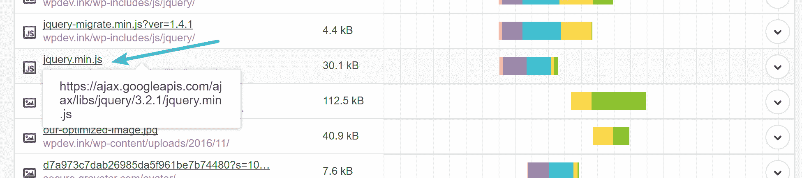

External service – JavaScript


如果你不知道外部服务是做什么的，你可以试着浏览到主域或者在 Google 中搜索它的名字，因为开发者或者相关的公司应该会出现。这是确定服务是否合法的好方法。正如您在下面看到的，搜索 jQuery 文件会出现一些知名的公司，比如 jQuery 和 Google，它们描述了托管这个文件的情况。所以你可能是安全的。

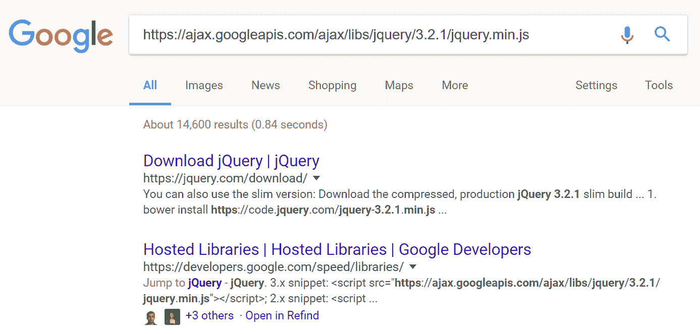

jQuery external script


## 分析持续的第三方性能问题

如果你的网站总是很慢，你需要找出是什么让它慢下来。如果你的网站有间歇性的问题，那就有点困难了。先说连续慢。我们在这里假设你的网站很慢是因为外部服务。虽然许多速度问题可能是由外部服务引起的，但还有大量其他问题，因此这可能无法解决您的问题。

[If your #WordPress site is always slow 🐌, you should figure out why right?Click to Tweet](https://twitter.com/intent/tweet?url=https%3A%2F%2Fkinsta.com%2Fblog%2Fthird-party-performance%2F&via=kinsta&text=If+your+%23WordPress+site+is+always+slow+%F0%9F%90%8C%2C+you+should+figure+out+why+right%3F)

首先，您需要确定是否有任何服务需要很长时间来加载，以及它如何影响您的站点的性能。因此，我们建立了一个测试网站，托管在 Kinsta 上，其中包含以下内容:

*   2 个谷歌广告
*   脸书喜欢盒子
*   Instagram Widget
*   质疑意见
*   脸书转换跟踪像素
*   谷歌分析

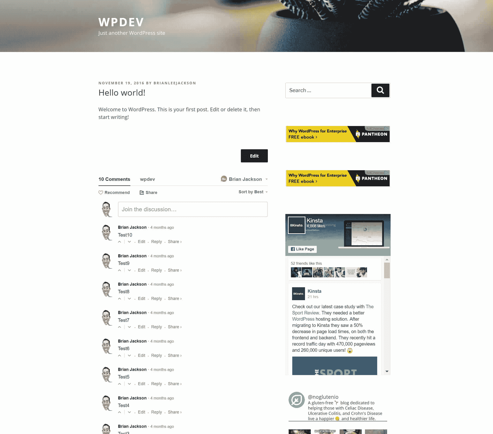

WordPress test site


这将允许我们逐个删除每个服务，并向您展示每个服务对您的整体站点负载的影响程度。我们还将分享一些加载它们的替代方法的策略。然后你可以将同样的策略应用到你自己的 WordPress 站点上。我们通过 Pingdom 运行了测试站点，您首先可以看到的是“按域划分的内容大小”和“按域划分的请求”如果您看到的请求不是来自您的域名，很可能是外部服务或外部资产。这是一个开始的好地方。正如你在下面看到的，static.xx.fbcdn.net 有 37 个请求，这并不好！

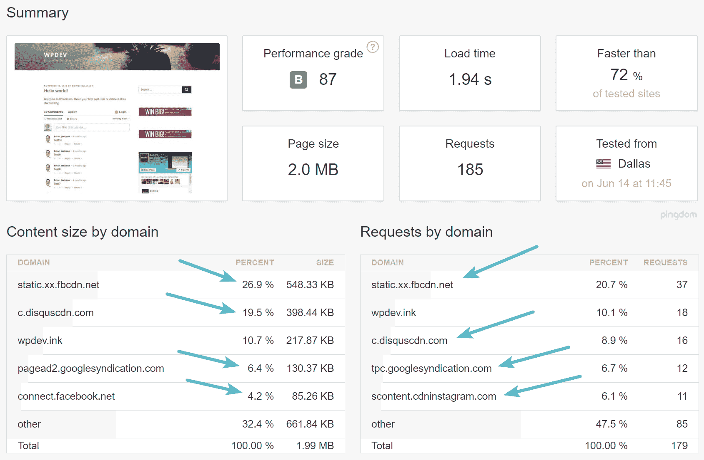

Pingdom external services – ([speed test](https://tools.pingdom.com/#!/UWplJ/https://wpdev.ink/hello-world/))


网站加载时间也是 1.94 秒，这实在是不太好，因为正如你在上面看到的，测试网站上没有任何内容。这是一个规模较小的测试，有助于您更好地分析第三方性能。WordPress 网站越大，问题就越大。但从根本上说，大多数问题都可以用类似的方式解决。


### 解决谷歌广告

我们首先要解决的是 Google Adsense。通常，当你运行一个速度测试时，你可以将鼠标悬停在每个条上，看看加载过程的每个部分花费了多长时间。你应该寻找特别长的酒吧(与其他酒吧相比)和酒吧只有在特定酒吧结束后才开始加载的地方——这些是你的瓶颈。一旦您发现某个元素花费的时间太长或者阻止了其他资源的加载，您需要弄清楚它为什么会在那里，以及它来自哪里。

这可能有点困难，对服务的调用可能被编码在你的主题中，或者它可能来自一个插件。然而，正如我们之前提到的，还有一个**绝对量**的问题。如果我们看一下下面来自 pagead2.googlesyndication.com**和 tpc.googlesyndication.com**的请求，我们可以看到这些条相当短，意味着它们没有造成太多的延迟。其中一些确实有更长的[接收时间](https://kinsta.com/blog/pingdom-speed-test/)(绿色条)，这是网络浏览器从服务器接收数据所花费的时间。最大的问题是一旦你把所有的请求加在一起。****

我们喜欢称 Google AdSense 为**可变的第三方服务**。这是因为每次加载页面时，都会加载不同数量的请求和资产。这使得很难确定是什么导致了性能问题，因为每次运行速度测试都会有所不同。下面是广告产生的一些第三方请求的一个片段。它们还生成[重定向](https://kinsta.com/blog/wordpress-redirect/)，它们有自己的延迟。

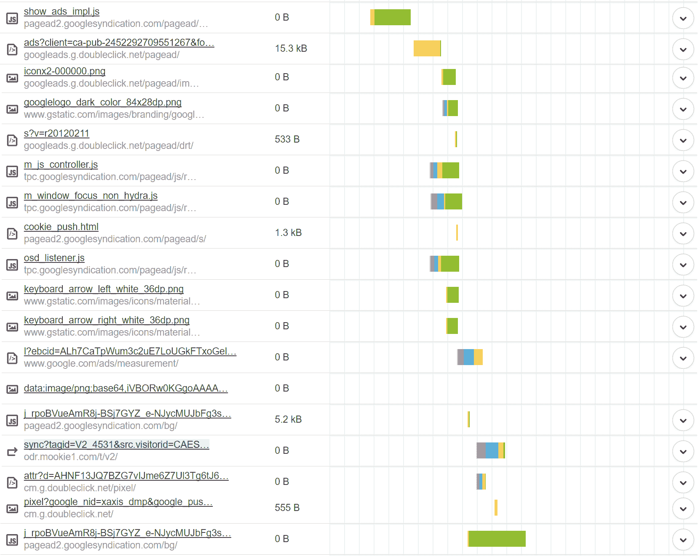

Google AdSense external requests


你可能认为仅仅两个广告就能产生如此多的请求是疯狂的，但这就是它们的工作方式。

#### 选项 1–异步加载

您的第一个选择是确保它们异步加载。async 属性基本上告诉浏览器在不减慢 HTML 解析的情况下立即开始下载资源。一旦资源可用，HTML 解析就会暂停，以便可以加载资源。默认情况下，Google AdSense 新生成的代码会有这个属性，但是如果您的代码仍然是几年前的，我们建议您检查一下。

```
<script async src="//pagead2.googlesyndication.com/pagead/js/adsbygoogle.js"></script>
<!-- nogluten-top-right-page-300x250 -->
<ins class="adsbygoogle" style="display: block;" data-ad-client="ca-pub-xxxxxxxxxxx" data-ad-slot="9805695044" data-ad-format="auto"></ins>
<script>
(adsbygoogle = window.adsbygoogle || []).push({});
</script>
```

请务必查看我们关于[消除渲染阻塞 JavaScript 和 CSS](https://kinsta.com/blog/eliminate-render-blocking-javascript-css/) 的另一篇文章。这可以帮助你更好地理解脚本是如何在你的 WordPress 站点上加载和运行的。

#### 选项 2–删除它们

你的另一个选择是完全删除谷歌广告。显然，对于一些依赖第三方广告收入的网站来说，这不是一个选项。但我们看到电子商务网站在他们的网站上投放 AdSense 广告，只是为了快速赚钱。您应该意识到这方面的性能问题。如果你在销售产品或服务，一个谷歌广告可能弊大于利，损害你的主要收入来源。对于博客作者，你也可以看看联盟广告和 AdSense。很多时候，对于联盟广告，你可以从你的 CDN 加载它们[，并且只有一个请求。](https://kinsta.com/blog/wordpress-cdn/)

在这个例子中，我们将删除广告，向你展示两个小广告是如何影响你的 WordPress 网站的整体性能的。因此，我们在删除它们后运行了另一个速度测试，正如你所看到的，我们的加载时间从 1.94 秒下降到 909 毫秒！我们的请求从 185 个减少到 138 个，我们的总页面大小从 2 MB 减少到 1.7 MB。

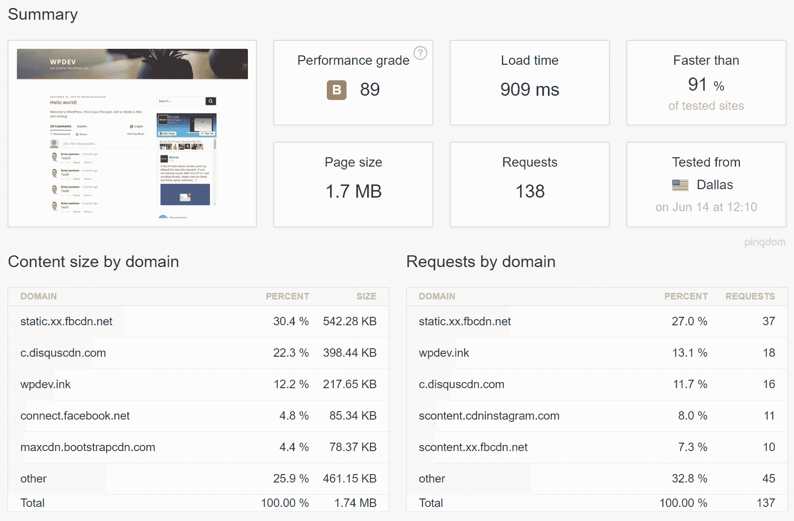

After removing Google AdSense ([speed test](https://tools.pingdom.com/#!/cUA6qC/https://wpdev.ink/hello-world/))


没错！两个小广告增加了大约一秒钟的总加载时间。这就是为什么除非你的收入模式围绕第三方广告，否则不要把它们放在你的 WordPress 网站上。如果你有一个广告网络的问题，而你[有一个插件为你处理广告网络](https://kinsta.com/blog/wordpress-advertising-plugin/)，禁用这个插件就有可能解决这个问题。如果它是在主题中编码的，你需要修改你的主题文件。如果你是开发者，我们建议你做以下两件事(如果你不在这里，你可以了解更多关于[如何找到一个好的 WordPress 开发者](https://kinsta.com/blog/hire-wordpress-developer/))。

### 像盒子一样处理脸书

接下来要看的是引起所有那些**static.xx.fbcdn.net**和**scontent.xx.fbcdn.net**请求的脸书类盒子。我们可以看到，条形相当短，这意味着它们不会造成太大的延迟。然而，一旦你把它们加在一起，这就是问题所在。同样，这是一个纯粹的量的问题。

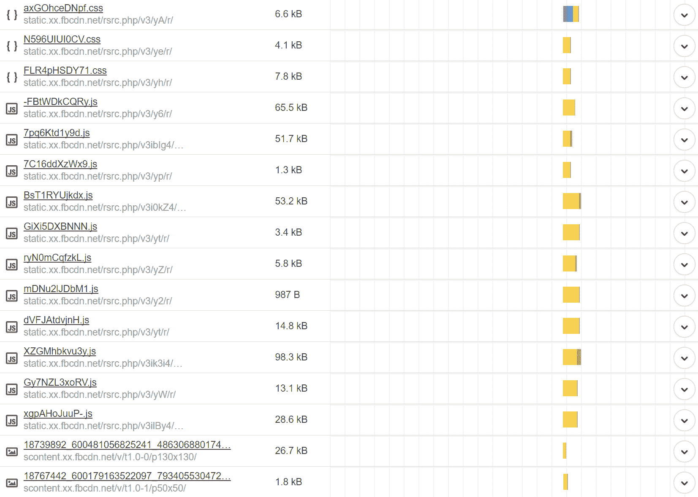

Facebook widget requests


我们建议每个网站所有者远离[脸书像框](https://developers.facebook.com/docs/plugins/page-plugin)！它不仅会对外部 JavaScript 生成大量请求，还会加载大量图像。这里有三个建议可以更好地解决这个问题。
T3】

#### 选项 1–异步加载

要使用脸书 like box，你或开发者必须在你的 WordPress 站点的标题中添加以下代码。也有一些 WordPress 小部件添加了这个框。

```
<script>(function(d, s, id) {
 var js, fjs = d.getElementsByTagName(s)[0];
 if (d.getElementById(id)) return;
 js = d.createElement(s); js.id = id;
 js.src = "//connect.facebook.net/en_US/sdk.js#xfbml=1&version=v2.9&appId=1697897870426976";
 fjs.parentNode.insertBefore(js, fjs);
}(document, 'script', 'facebook-jssdk'));</script>
```

上面代码的问题是它不能异步加载。async 属性基本上告诉浏览器在不减慢 HTML 解析的情况下立即开始下载资源。一旦资源可用，HTML 解析就会暂停，以便可以加载资源。我们不确定为什么脸书没有把这个属性添加到脚本中，但是你可以在下面看到修改后的版本，它将异步加载。

```
<script>(function(d, s, id) {
 var js, fjs = d.getElementsByTagName(s)[0];
 if (d.getElementById(id)) return;
 js = d.createElement(s); js.id = id;
 js.async=true; js.src = "//connect.facebook.net/en_US/sdk.js#xfbml=1&version=v2.9&appId=1697897870426976";
 fjs.parentNode.insertBefore(js, fjs);
}(document, 'script', 'facebook-jssdk'));</script>
```

如果您在 Pingdom 中检查，您可能不会注意到加载时间的差异，但是您的访问者肯定会注意到，因为它会影响脚本和资产的加载方式/时间。

#### 选项 2–使用图像横幅代替

下一个建议是用一个简单链接到你的脸书页面的横幅图片代替脸书 like 框。这将立即把 40 多个请求减少到 1 个，您将不再有外部依赖性。你可以通过这种方式变得非常有创意，这是设计和性能之间的一个很好的平衡。

#### 选项 3–摆脱它

最后，最后一个选择是完全摆脱它。我们在我们的测试站点上做到了这一点，正如您在下面看到的，它将我们的加载时间从 909 毫秒降至 786 毫秒。它将整体页面重量从 1.7 MB 降至 1.0 MB，并将请求总数从 138 个降至 78 个。这里需要指出的一点是页面权重的降低。脸书喜欢的盒子增加了 700 KB！这太糟糕了。

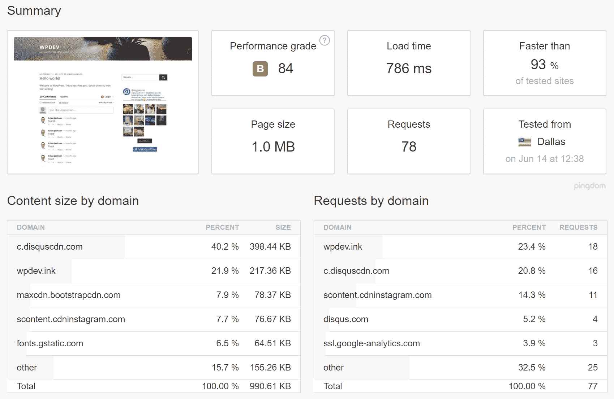

After removing Facebook like box ([speed test](https://tools.pingdom.com/#!/bqhpvr/https://wpdev.ink/hello-world/))


### 处理 Instagram 小工具

接下来要看的是 Instagram 小部件。在我们的例子中，我们使用免费的 [Instagram Feed](https://wordpress.org/plugins/instagram-feed/) 插件。插件实际上不是问题，而是来自 scontent.cdninstagram.com**的请求产生了。我们可以看到，条形相当短，这意味着它们不会造成太大的延迟。然而，一旦你把它们加在一起，这就是问题所在。同样，这是一个纯粹的量的问题。你可以看到这里形成了一种模式。WordPress 网站上的许多第三方性能问题不是来自单个请求的延迟，而是那些一开始就不关心性能的问题。**

## 注册订阅时事通讯


### 想知道我们是怎么让流量增长超过 1000%的吗？

加入 20，000 多名获得我们每周时事通讯和内部消息的人的行列吧！

[Subscribe Now](#newsletter)


Instagram external requests


我们也建议人们远离 Instagram widget，除非你真的需要它，因为它会产生很多请求。这里有一些建议可以更好地解决这个问题。

#### 选项 1–使用图像横幅代替

就像脸书的 like box 一样，除非你真的需要一个动态的 Instagram 小工具，否则就创建一个链接到你的 Instagram 页面的横幅。这将立即把 20 多个请求减少到 1 个，您将不再有外部依赖性。你可以通过这种方式变得非常有创意，这是设计和性能之间的一个很好的平衡。

#### 选项 2——扔掉它

当然，你可以完全摆脱它。我们在我们的测试站点上做到了这一点，正如您在下面看到的，它将我们的加载时间从 786 毫秒降至 690 毫秒。它将整体页面重量从 1.0 MB 降至 814.3 KB，并将请求总数从 78 个降至 57 个。

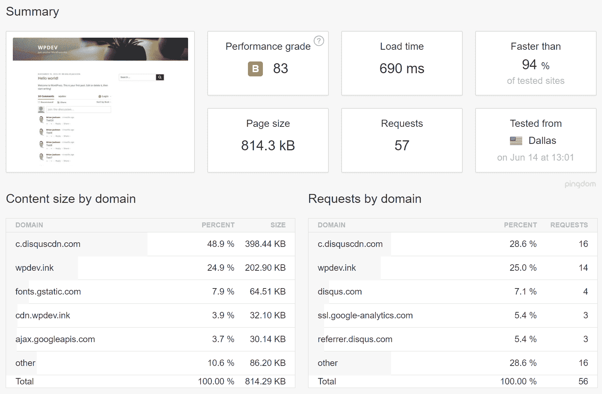

After removing Instagram widget ([speed test](https://tools.pingdom.com/#!/W5Sym/https://wpdev.ink/hello-world/))


### 处理质疑意见

接下来要看的是 Disqus 的评论。在我们的例子中，我们使用免费的 [Disqus 评论系统](https://wordpress.org/plugins/disqus-comment-system/)插件。Disqus 的一个大问题是它会产生大量的请求，并且必须为每个人的评论加载 gravatar。我们已经在关于[如何加速 WordPress 评论](https://kinsta.com/blog/wordpress-comments/)的文章中详细讨论了这个问题。

你可能还想彻底禁用 WordPress 上的评论。

如果你是一个大的商业网站，你可能还需要付费来删除 [Disqus 广告](https://kinsta.com/blog/disqus-ads/)，如果你不这样做，最终会有更多的请求出现在你的网站上。您可以在下面看到它生成的一些请求的一小部分。

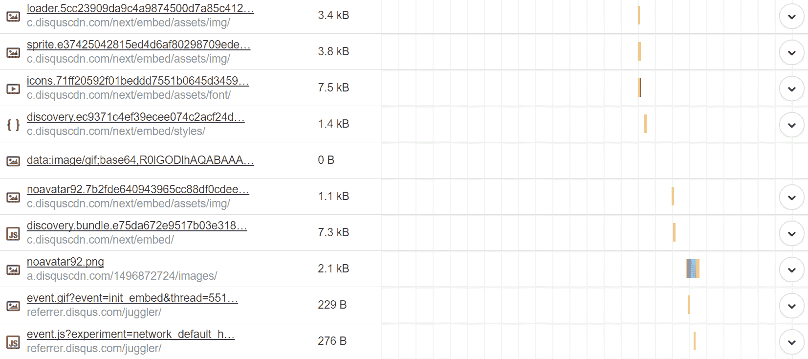

Disqus external requests


这里有一些处理评论的建议。

#### 选项 1–延迟加载 Disqus 注释

惰性加载是直到用户向下滚动页面时才加载资产和脚本的过程。这确保了第一页的加载速度更快。你可以使用 Joel James 提供的免费 [Disqus 条件加载](https://wordpress.org/plugins/disqus-conditional-load/)插件轻松地延迟加载 Disqus 评论。事实上，我们在 Kinsta 的博客上使用了这个。我们在我们的测试网站上安装了该插件，正如您在下面看到的，它将我们的加载时间从 690 毫秒降至 603 毫秒。它将整体页面重量从 814 KB 降至 366.1 KB，并将请求总数从 57 个降至 24 个。有一点要指出的是大规模的页面权重降低！


After lazy loading Disqus ([speed test](https://tools.pingdom.com/#!/blfEvl/https://wpdev.ink/hello-world/))


#### 选项 2–延迟加载本地 WordPress 评论

你的另一个最佳选择是延迟加载本地 WordPress 评论。Joel James 也是 lazy load Disqus 插件的开发者，他也有一个免费插件叫做 [Lazy Load for Comments](https://wordpress.org/plugins/lazy-load-for-comments/) 。这与上面的方式非常相似。我们在我们的测试网站上安装了插件，正如你在下面看到的，它导致了几乎相同的加载时间减少。

Struggling with downtime and WordPress problems? Kinsta is the hosting solution designed to save you time! [Check out our features](https://kinsta.com/features/)

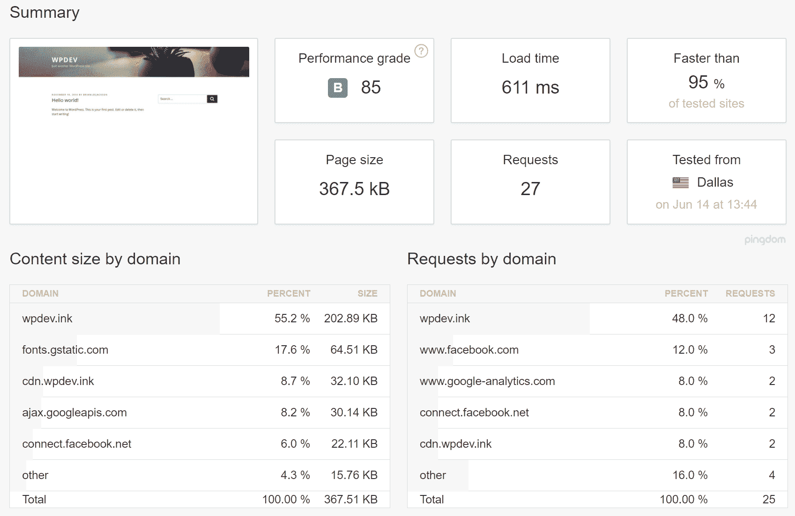

After lazy loading native WordPress comments ([speed test](https://tools.pingdom.com/#!/bHYbuT/https://wpdev.ink/hello-world/))


### 解决脸书转换跟踪像素

最后，我们来看看脸书[转换跟踪像素](https://kinsta.com/blog/conversion-tracking/)。显然，大多数人用这个来收集人们访问他们网站的数据，或者在运行脸书广告时跟踪转化率。因此，删除它可能并不总是一个选项，而且您确实无法做任何事情来提高它的性能。正如你在下面看到的，它负责生成 5 个不同的 HTTP 请求，不幸的是，它们不是最快的。

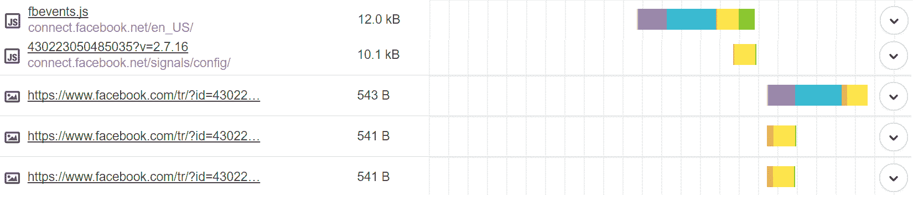

Facebook conversion tracking pixel external requests


我们将简单地删除它，向您展示它对您的网站性能的影响。将其从我们的网站上移除后，我们的加载时间从 611 毫秒降至 429 毫秒。它将整体页面重量从 367.5 KB 降至 343.2 KB，请求总数从 27 个降至 22 个。

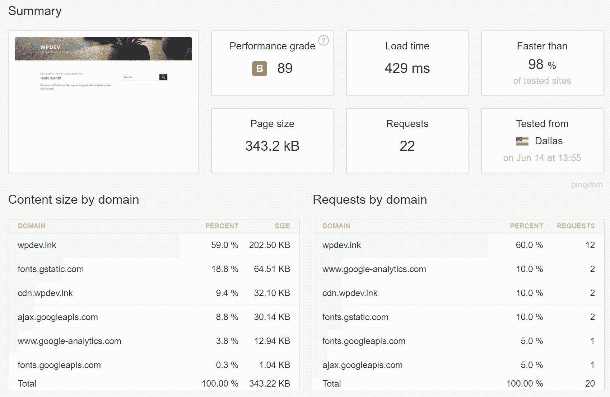

After removing FB pixel ([speed test](https://tools.pingdom.com/#!/ch7vSx/https://wpdev.ink/hello-world/))


上面的例子只是你可能在你的 WordPress 站点上运行的数千个外部服务中的几个。重要的是要看到每一个，并确定它对你的网站性能有多大影响。如你所见，仅仅一个坏苹果就能引起巨大的问题！

### 外部服务有助于提高性能

虽然大多数外部服务会损害网站的性能，但也有一些服务可以帮助网站。一个 CDN，比如 KeyCDN 或 Cloudflare，只需要很少的设置工作，就可以极大地提高站点的速度。查看我们的教程[如何设置 key dn](https://kinsta.com/knowledgebase/how-do-i-add-keycdn-to-my-site/)以及如何[安装 Cloudflare](https://kinsta.com/knowledgebase/install-cloudflare/) 。在下面的例子中，我们向测试站点添加了 KeyCDN。如您所见，它又减少了 100 毫秒的加载时间。

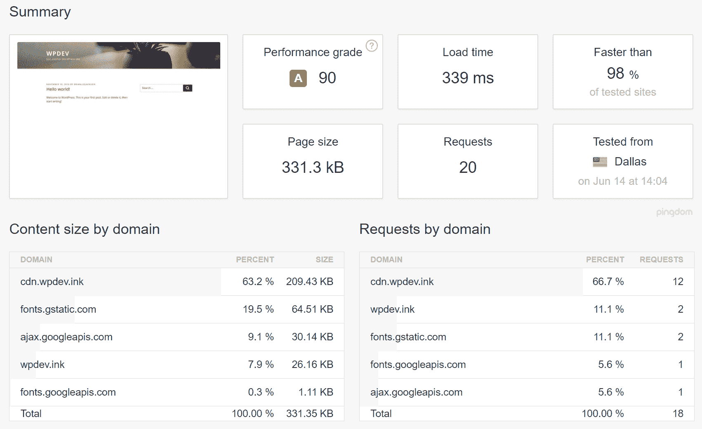

After CDN ([speed test](https://tools.pingdom.com/#!/d9sNUt/https://wpdev.ink/hello-world/))


### 进一步优化

然后，我们在 WordPress 网站上做了一些额外的优化，使我们获得了 100 的性能等级分数和 270 毫秒的加载时间。这些优化包括:

*   确保从 CDN 提供商加载所有内容。这意味着在本地托管 Google 字体并产生一个 HTTP/2 请求。
*   删除产生[不必要的 HTTP 请求](https://kinsta.com/blog/make-fewer-http-requests/)的附加资产，如表情符号、嵌入、jQuery 迁移等。我们使用了[性能插件](https://perfmatters.io)。

以下是一些更深入的优化教程:

*   [如何禁用表情符号](https://kinsta.com/knowledgebase/disable-emojis-wordpress/)
*   [如何禁用嵌入](https://kinsta.com/knowledgebase/disable-embeds-wordpress/)
*   [如何修复利用浏览器缓存警告](https://kinsta.com/blog/leverage-browser-caching/)
*   [如何从静态资源中移除查询字符串](https://kinsta.com/knowledgebase/remove-query-strings-static-resources/)
*   [如何用 New Relic 找到 WordPress 的性能瓶颈](https://kinsta.com/blog/wordpress-performance-new-relic/)
*   8 个鲜为人知(但很有用)的 WordPress 性能插件
*   如何禁用 WordPress 插件(不能访问 WP-Admin)

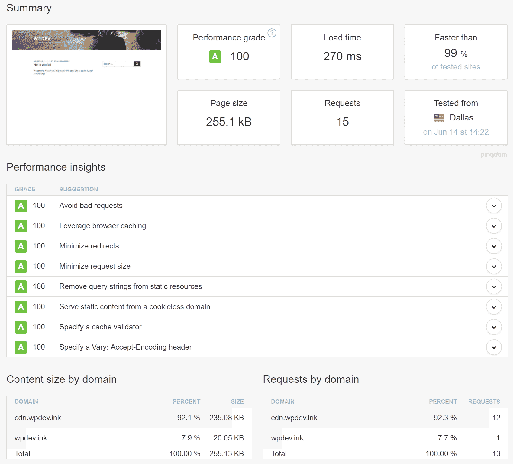

After optimizations ([speed test](https://tools.pingdom.com/#!/bBmTTA/https://wpdev.ink/hello-world/))


正如你所看到的，我们从 1.94 秒下降到 270 毫秒的加载时间！当然，你可能需要一些外部服务，每个企业都需要。但是重要的是不要忘记分析每一个。如果您发现加载时间过长，请联系负责该问题的开发人员或公司并提出问题。

### 防止失速装载

更大的问题是当一个脚本在完成自身加载时阻止加载。如果像这样的脚本包含在标题中[，它可以让你的网站无限期地保持空白](https://kinsta.com/blog/wordpress-white-screen-of-death/)。因此，任何在页眉中不是绝对必要的东西都应该放在页脚中。这将允许您的网站在有问题的脚本开始加载之前就完全加载。如果您使用`[wp_enqueue_script()](https://codex.wordpress.org/Function_Reference/wp_enqueue_script)`函数(您应该这样做)，您可以使用第五个参数来指示它应该在页脚中加载。

如果你注意到一个插件在页眉中无故加载了一个资产，你可以使用`[wp_dequeue_script()](https://codex.wordpress.org/Function_Reference/wp_dequeue_script)`将它从页眉中移除，然后使用`wp_enqueue_script()`以同样的方式注册它，但是是在页脚中。

### 利用谷歌标签管理器

帮助解决第三方性能问题的另一种方法是利用免费工具，如 [Google Tag Manager](https://www.google.com/analytics/tag-manager/) 。这允许你在一个地方管理所有的脚本和标签。这样做的一些好处是，它们将异步加载，管理变得更容易，并且您可以为脚本加载的页面设置触发触发器。

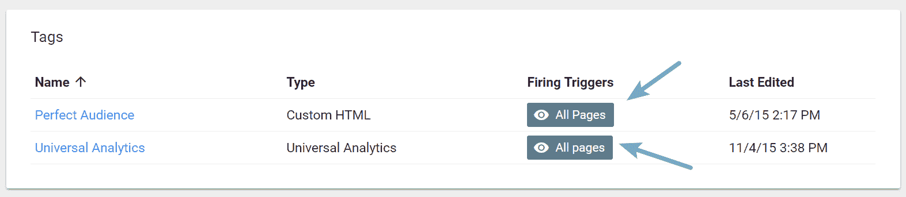

Google Tag Manager firing triggers


然而，这也有一些缺点:

> 谷歌标签管理器**不会减少你的网站或应用上的标签数量**，但它确实简化了管理标签的任务。对于网站，谷歌标签管理器异步执行，可以配置为仅在需要时触发标签，帮助您的页面更快地加载。([来源](https://support.google.com/tagmanager/answer/6103697?hl=en)

如果你使用谷歌标签管理器，你还会有另一个 HTTP 请求和 [DNS 查询](https://kinsta.com/blog/reduce-dns-lookups/)到【googletagmanager.com】T2，尽管这几乎可以忽略不计。

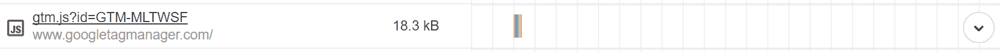

googletagmanager.com request


我们建议查看 Google Tag Manager，寻找那些拥有大量第三方服务和集成的大型未优化网站。对于有开发人员的小型站点，使用 GTM 很可能看不到太多的性能提升。

## 分析间歇性第三方性能问题

解决间歇性问题的方法与解决持续性问题的方法是一样的，但是找出问题的根源要困难得多。实现上面的解决方案可能已经有所帮助了，但是最好还是知道是什么导致了这个问题。你可以用做这件事的一个工具[是](https://kinsta.com/blog/wordpress-performance-new-relic/)[新遗迹(需要许可证)](https://newrelic.com/)。下面你可以看到一些第三方广告网络的例子，以及在一段时间内与它们相关的高负载时间。

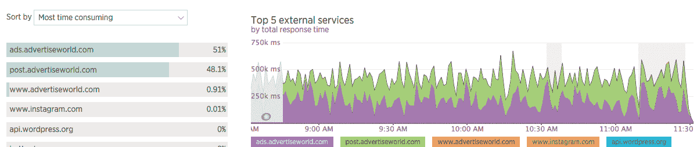

New Relic Monitoring – external ad network


具有讽刺意味的是，New Relic 也会导致性能问题。在这种情况下，我们建议将其用于故障排除和零星监控，而不是连续使用。你也可以使用像 [GTMetrix](http://gtmetrix.com/) 这样的工具在你的网站上安排每小时的速度检查。几天后，您可以回来查看，并在一个漂亮的小图表中看到结果:

[](https://kinsta.com/wp-content/uploads/2015/11/Screen-Shot-2015-11-10-at-16.56.51.png)

GTmetrix reporting times


这告诉你当你的站点比平均速度慢的时候。我们将首先单击最右侧的尖峰，进入在该时间点创建的报告。然后，我们将查看瀑布图，以了解哪个资源产生了问题。请务必查看我们关于[如何使用 GTmetrix](https://kinsta.com/blog/gtmetrix-speed-test/) 来诊断您站点上的问题的深度帖子。

[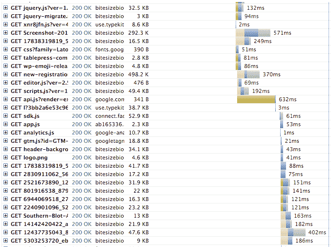](https://kinsta.com/wp-content/uploads/2015/11/Screen-Shot-2015-11-10-at-16.58.51.png)

GTmetrix waterfall chart


这里有一个资产，它似乎阻止了后续的资产，看看中间的绿色条。原来这是来自[谷歌 Recaptcha](https://kinsta.com/blog/wordpress-captcha/) 。632 毫秒看似一眨眼的时间，但实际上，这是一个**的数字**。一个真正的页面[应该在 2 秒左右](https://kinsta.com/learn/page-speed/)加载。其中超过三分之一被这一项资产占用。资产要么应该稍后加载，要么应该丢弃，以支持其他验证方法。

## 摘要

正如您所看到的，仅仅几个外部服务就可以产生巨大的影响。第三方性能不容忽视，它与现场和后端优化密切相关。不过值得庆幸的是，有很多事情可以做，尤其是当你涉及到一个开发者的时候。抛弃服务，调整它们以不同的方式加载，比如异步，以另一种方式提供同样的东西，比如横幅，所有这些都可以让你的网站更快！

* * *

让你所有的[应用程序](https://kinsta.com/application-hosting/)、[数据库](https://kinsta.com/database-hosting/)和 [WordPress 网站](https://kinsta.com/wordpress-hosting/)在线并在一个屋檐下。我们功能丰富的高性能云平台包括:

*   在 MyKinsta 仪表盘中轻松设置和管理
*   24/7 专家支持
*   最好的谷歌云平台硬件和网络，由 Kubernetes 提供最大的可扩展性
*   面向速度和安全性的企业级 Cloudflare 集成
*   全球受众覆盖全球多达 35 个数据中心和 275 多个 pop

在第一个月使用托管的[应用程序或托管](https://kinsta.com/application-hosting/)的[数据库，您可以享受 20 美元的优惠，亲自测试一下。探索我们的](https://kinsta.com/database-hosting/)[计划](https://kinsta.com/plans/)或[与销售人员交谈](https://kinsta.com/contact-us/)以找到最适合您的方式。