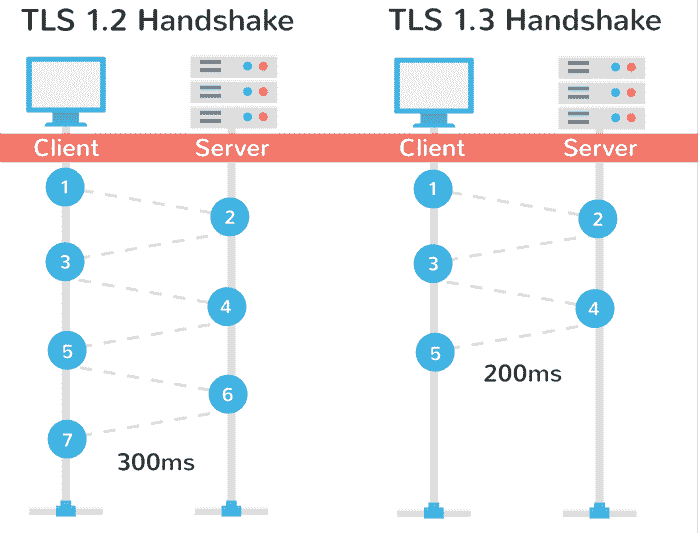

# TLS 1.3 概述—更快、更安全

> 原文：<https://kinsta.com/blog/tls-1-3/>

距离上一次加密协议更新已经过去了八年多，但截至 2018 年 8 月，最终版本 **TLS 1.3 现已发布。👏对于 WordPress 社区和 Kinsta 的客户来说，令人兴奋的是 TLS 1.3 包含了很多安全性和性能的改进。随着 2015 年末 [HTTP/2 协议更新](https://kinsta.com/learn/what-is-http2/)，以及 2018 年的 TLS 1.3，加密连接现在比以往任何时候都更加安全和快速。阅读下面更多关于 TLS 1.3 的变化，以及作为一个 [WordPress 网站](https://kinsta.com/knowledgebase/what-is-wordpress/)的所有者，它将如何使你受益。**

## 什么是 TLS？

TLS 代表[传输层安全](https://en.wikipedia.org/wiki/Transport_Layer_Security)，是 SSL(安全套接字层)的继任者。TLS 提供 web 浏览器和服务器之间的安全通信。连接本身是安全的，因为对称加密用于加密传输的数据。密钥是为每个连接唯一生成的，并且基于会话开始时协商的共享密钥，也称为 TLS 握手。

Support

许多基于 IP 的协议，如 HTTPS、 [SMTP](https://kinsta.com/blog/smtp-port/) 、POP3、FTP 都支持 TLS 加密数据。

['TLS 1.3: Faster, Safer, Better, Everything.' 🚀 -- Filippo ValsordaClick to Tweet](https://twitter.com/intent/tweet?url=https%3A%2F%2Fkinsta.com%2Fblog%2Ftls-1-3%2F&via=kinsta&text=%27TLS+1.3%3A+Faster%2C+Safer%2C+Better%2C+Everything.%27+%F0%9F%9A%80+--+Filippo+Valsorda&hashtags=TLS%2Cwebsec)

Web 浏览器使用一个 [SSL 证书](https://kinsta.com/blog/free-ssl-certificate/),这允许它们识别出它属于一个数字签名的认证机构。从技术上来说，这些证书也被称为 TLS 证书，但是大多数 SSL 提供者坚持使用术语“SSL 证书”,因为这通常更广为人知。

SSL/TLS 证书提供了许多人在浏览器地址栏中看到的 HTTPS 背后的魔力。

*   [TLS 1.3 vs TLS 1.2](#tls-1.3-vs-tls-1.2)
*   [TLS 1.3 的速度优势](#speed-tls-1.3)
*   [TLS 1.3 提高了安全性](#security-tls-1.3)
*   [TLS 1.3 浏览器支持](#tls-1.3-browser-support)
*   [TLS 1.3 服务器支持](#tls-1.3-server-support)
*   [Kinsta TLS 1.3 支持](#kinsta-tls-1.3-support)

## TLS 1.3 与 TLS 1.2

互联网工程任务组(IETF)是负责定义 TLS 协议的组织，该协议已经经历了多次不同的迭代。TLS 的前一版本 TLS 1.2 是在 RFC 5246 中定义的，并且在过去的八年中被 T2 大多数的网络浏览器使用。2018 年 3 月 21 日， [TLS 1.3 已经定稿](https://www.ietf.org/mail-archive/web/ietf-announce/current/msg17592.html)，历经 28 稿。截至 2018 年 8 月，TLS 1.3 的最终版本现已发布( [RFC 8446](https://tools.ietf.org/html/rfc8446) )。

像 Cloudflare 这样的公司已经在向他们的客户提供 TLS 1.3。 [Filippo Valsorda](https://twitter.com/FiloSottile) 就 TLS 1.2 和 TLS 1.3 之间的差异进行了精彩的演讲(见下面的演示)。简而言之，TLS 1.3 相对于 TLS 1.2 的主要优势是**更快的速度和更好的安全性**。

## 注册订阅时事通讯

### 想知道我们是怎么让流量增长超过 1000%的吗？

加入 20，000 多名获得我们每周时事通讯和内部消息的人的行列吧！

[Subscribe Now](#newsletter)

## TLS 1.3 的速度优势

当涉及到 web 性能时，TLS 和加密连接总是会增加一些开销。 [HTTP/2](https://kinsta.com/learn/what-is-http2/) 无疑有助于解决这个问题，但是 TLS 1.3 通过诸如 [TLS 错误开始](https://blogs.windows.com/msedgedev/2016/06/15/building-a-faster-and-more-secure-web-with-tcp-fast-open-tls-false-start-and-tls-1-3/)和零往返时间(0-RTT)等特性来帮助加速加密连接。

少花点时间担心网站安全和性能，多花点时间发展业务。[免费试用 kin sta](https://hubs.ly/H0pklC_0)。

简单来说，在 TLS 1.2 中，需要两次往返才能完成 [TLS 握手](https://kinsta.com/knowledgebase/ssl-handshake-failed/#3-configure-your-browser-for-the-latest-ssltls-protocol-support)。有了 1.3，它**只需要一次往返**、*和*，从而将加密延迟减少一半。这有助于那些加密的连接感觉比以前更快一点。

TLS 1.3 handshake performance

的另一个好处是，在某种意义上，**它记得**！在您以前访问过的网站上，您现在可以在第一封邮件中向服务器发送数据。这被称为“零往返”(0-RTT)。是的，这也缩短了加载时间。

> TLS 1.3 比 1.2 快多了…显示 TLS 握手时间中位数的 RUM 数据(30 天)[# web perf](https://twitter.com/hashtag/webperf?src=hash&ref_src=twsrc%5Etfw)[# istlsfast yet](https://twitter.com/hashtag/isTLSFastYet?src=hash&ref_src=twsrc%5Etfw)[pic.twitter.com/Mc4RHwg8Vt](https://t.co/Mc4RHwg8Vt)
> 
> ——Tim verre corner(@ timvercorner)[2019 年 5 月 16 日](https://twitter.com/TimVereecke/status/1129032997221609472?ref_src=twsrc%5Etfw)