# 如何安装和优化整个 WordPress 主题

> 原文：<https://kinsta.com/blog/total-wordpress-theme/>

有很多关于大型多用途 WordPress 主题的误解，比如 Avada 和 X 主题，它们可能会让你的网站爬行。诚然，大多数多用途主题确实有些臃肿(尤其是与 WooCommerce 搭配时)，但如果优化得当，它们可以快速加载。所以今天我们将深入研究一下多用途的 Total WordPress 主题，看看我们能以多快的速度将它加载到 Kinsta 的服务器上。这不是你的典型 WordPress 主题的简单回顾，我们将把整个 WordPress 主题放入 ringer！

*   WordPress 的总主题是什么？
*   [新 WordPress 安装](#fresh-wordpress-installation)
*   [安装总主题](#install-total-wordpress-theme)
*   [优化全部 WordPress 主题](#optimize-total-wordpress-theme)

## 总 WordPress 主题

首先，整个 WordPress 主题是由 WPExplorer 的团队创建的，他们也经营着一个流行的 WordPress 博客，你们中的许多人可能在某个时候读过这个博客。目前[在 theforest](https://themeforest.net/item/total-responsive-multipurpose-wordpress-theme/6339019)上售价 59.00 美元，12 个月的支持费用为 17.63 美元。这是一个现代的多功能主题，可以很容易地用于任何类型的 WordPress 站点，从在线商店([支持 WooCommerce](https://kinsta.com/blog/woocommerce-tutorial/) )，到博客，论坛(支持 [bbPress](https://kinsta.com/knowledgebase/bbpress/) )，甚至新闻网站。当谈到像这样的大型多用途主题时，真的什么都有可能。如果你能想象它，你就能建造它。查看一些使用总主题的网站的[真实例子。总站点有各种形状和大小，所以如果你想知道一个站点是否使用总主题，看看我们的主题检测工具。](http://www.wpexplorer.com/sites-using-total/)


### 特征

因为这是一个多用途的主题，它有很多特点！我们不会一一介绍，但有几个重要特性需要注意:

*   WPML 兼容–使翻译更加容易
*   拖放包含 90 多个构建块的页面生成器([可视化编辑器](https://kinsta.com/blog/wordpress-page-builders/#visual-composer))
*   包括旋转、层滑块和自定义文章类型
*   [子主题](https://kinsta.com/blog/wordpress-child-theme/)兼容并支持 RTL
*   SEO 优化，跨浏览器兼容，对[移动优先索引](https://kinsta.com/blog/google-mobile-first-index/)完全响应
*   40 多个带有 XML 演示数据的预建样式演示，让您快速上手
*   主题定制超过 300 个主题选项，易于改变一切，如[谷歌字体](https://kinsta.com/blog/best-google-fonts/)
*   兼容所有流行的 WordPress 插件，如 Yoast SEO
*   开发者直接提供免费主题更新和支持

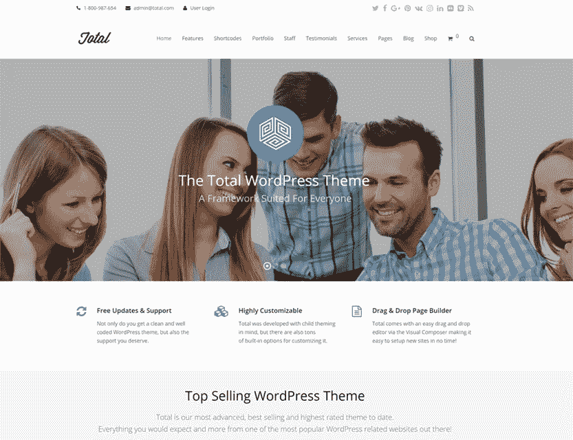

## 全新 WordPress 安装

我们开始在 Kinsta(美国中部谷歌云位置)上安装一个新的 WordPress，并安装了默认的 Twenty 主题。SSL 已设置，HTTPS 已启用。我们想在此之前先运行一些测试，这样我们就能确切地知道整个主题增加了多少加载时间。我们在 Pingdom 上运行了 5 个[速度测试，取平均值。正如你在下面看到的，我们新安装的时钟为 383 毫秒。](https://tools.pingdom.com/#!/f40Ik/https://wpdev.ink/)


> 需要在这里大声喊出来。Kinsta 太神奇了，我用它做我的个人网站。支持是迅速和杰出的，他们的服务器是 WordPress 最快的。
> 
> <footer class="wp-block-kinsta-client-quote__footer">
> 
> 
> 
> <cite class="wp-block-kinsta-client-quote__cite">Phillip Stemann</cite></footer>

[View plans](https://kinsta.com/plans/)

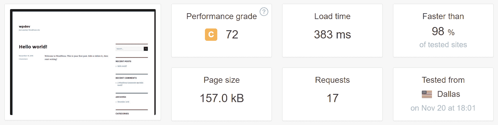

请务必查看我们关于【Pingdom 如何工作和理解瀑布分析的深入教程。

## 安装全部 WordPress 主题

我们要做的第一件事是安装整个 WordPress 主题并导入虚拟数据。您可以遵循他们的[安装文档](http://wpexplorer-themes.com/total/docs-category/getting-started/)或遵循我们下面的步骤。

### 第一步

你可以在 ThemeForest 购买整个 WordPress 主题。在本教程中，我们将使用虚拟数据来提高速度，因此我们选择“所有文件&文档”来下载。

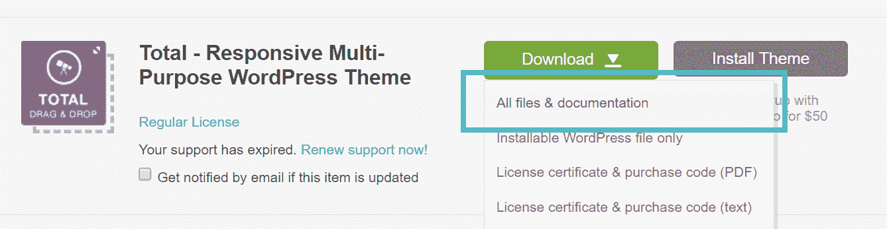

### 第二步

接下来，在你的 WordPress 仪表盘中点击外观下的主题。点击“添加新的”，然后“上传主题。”您将需要选择主题文件夹中的“Total.zip”文件。

```
\themeforest-6339019-total-responsive-multipurpose-wordpress-theme\Total-3.6.0\Installable-Theme\Total.zip
```

根据你的 WordPress 主机的速度，安装可能需要几秒钟。

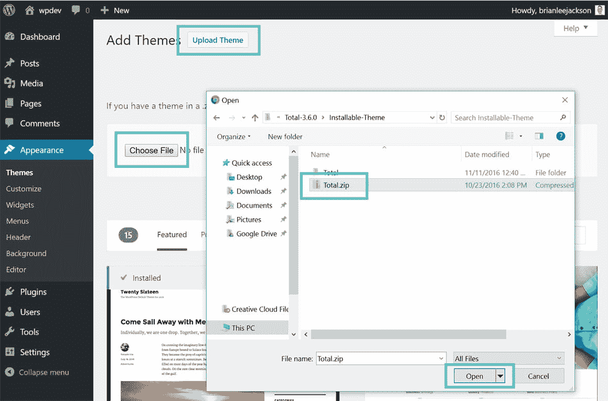

### 第三步

然后点击“激活”

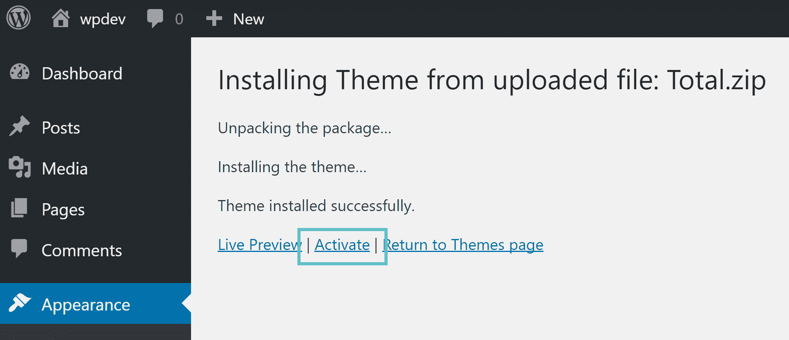

### 第四步

总的主题需要几个插件，你会想安装访问所有的功能包括在内。选择推荐的插件并点击“安装”

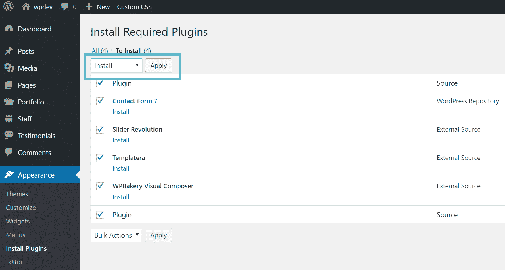

### 第五步

然后我们需要安装演示数据。在“Demo Importer”下，单击“Base Lite”主题。你可以做整个“基地”主题，但这是不推荐的，因为它非常大。基本精简版是一个稍微精简的版本。

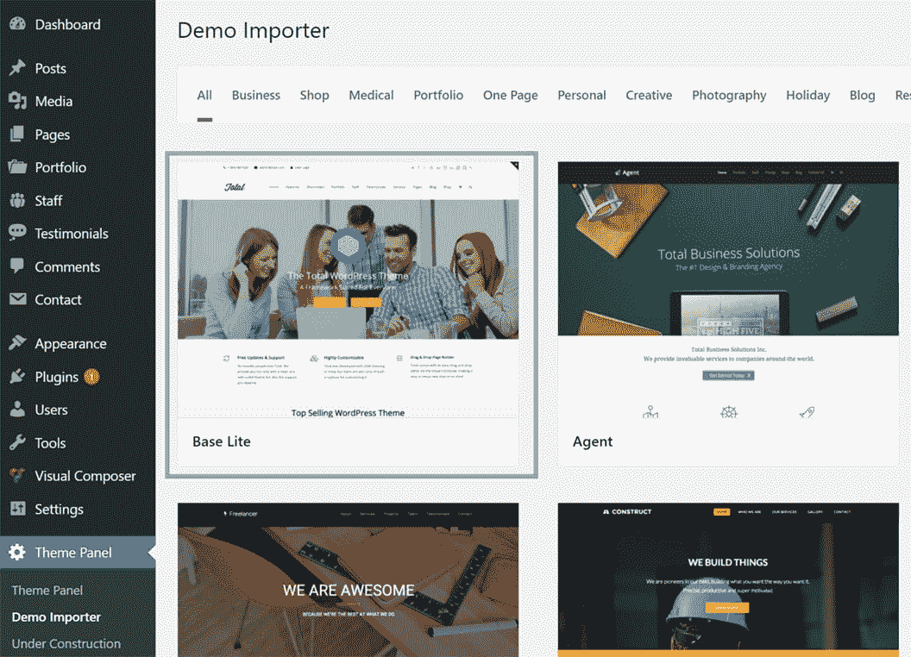

### 第六步

然后它会提示你安装“WooCommerce”如果你不使用它，我们建议禁用它，因为 WooCommerce 会增加不必要的负载。然而，对于本教程，我们将启用它，以便我们可以在以后优化它。只需点击它，它就会安装，然后点击“下一步。”


### 第七步

如果是全新安装，请选择所有内容，然后单击“确认导入”根据你的 WordPress 主机的速度，可能需要几分钟来导入所有的内容。在 Kinsta 的服务器上，只需要大约 20 秒。

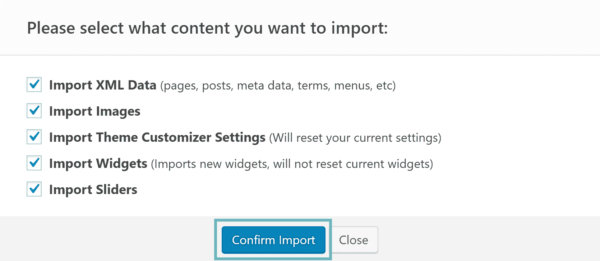

就是这样！你的演示数据现在已经导入，你的 WordPress 站点应该看起来像下面的基本 Lite 演示。

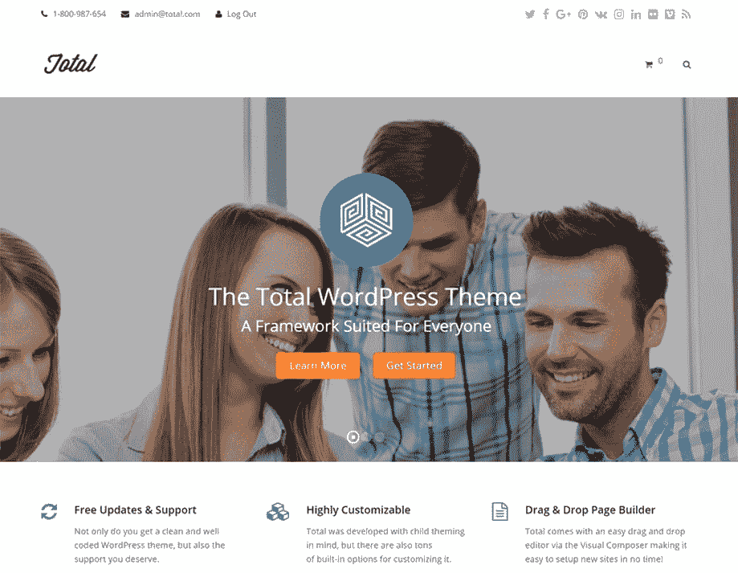

### 可选–woo commerce 设置

如果您使用 WooCommerce，系统会提示您完成安装向导。查看我们关于如何设置 WooCommerce 的深入教程。我们为下面的例子设置了 WooCommerce。


## 优化整个 WordPress 主题

现在是有趣的部分！我们将带你了解如何优化 WordPress 的主题。首先，我们需要从基本速度开始。所以我们在 Pingdom 上运行了 5 个[速度测试，取平均值。正如您在下面看到的，安装了演示数据的基线速度为 1.06 秒，有 54 个](https://tools.pingdom.com/#!/cayuJu/https://wpdev.ink/) [HTTP 请求](https://kinsta.com/blog/make-fewer-http-requests/)，总页面大小为 1.4 MB。

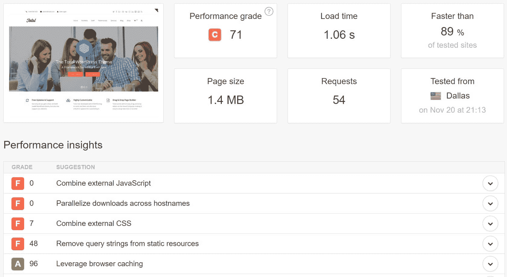

### 步骤 1–本地同步 Google Analytics(可选)

几乎每个人都使用 Google Analytics ，所以我们在测试中设置它是公平的，因为 99%使用总主题的人可能都在运行它。我们也会的。免费的 [Complete Analytics 优化套件插件](https://wordpress.org/plugins/host-analyticsjs-local/)允许你在本地同步你的 Google Analytic 的脚本，从而可以稍微加快速度。

[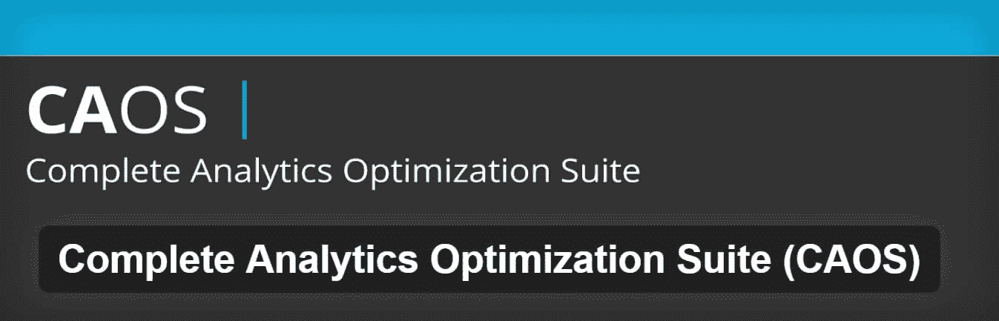T2】](https://wordpress.org/plugins/host-analyticsjs-local/)

## 注册订阅时事通讯


### 想知道我们是怎么让流量增长超过 1000%的吗？

加入 20，000 多名获得我们每周时事通讯和内部消息的人的行列吧！

[Subscribe Now](#newsletter)

我们说这是可选的，因为谷歌没有正式推荐这种方法，但是，我们已经在几个大流量的网站上使用了这种方法，效果很好。通过在本地同步您的 Google Analytic 脚本，您可以帮助提高浏览器缓存警告的利用率和速度，因为用户的浏览器不必往返从 Google 的外部服务器下载文件。下面是一个安装了上述插件的区别的例子。请随意在您自己的站点上尝试并运行您自己的测试。

**普通谷歌分析安装**

首先，我们在正常安装了 Google Analytics 的 Pingdom 上运行了 [5 个测试。正如你所看到的，仅仅添加 Google Analytics 就增加了大约 0.25 秒的总加载时间和 4 个额外的 HTTP 请求。WPExplorer 的团队在多用途总体主题上做得很好，因为这些都是非常快的加载时间。当然，Kinsta 的服务器在性能方面进行了大量优化。Kinsta 使用服务器级缓存，所以](https://tools.pingdom.com/#!/LJdfz/https://wpdev.ink/)[不需要缓存插件](https://kinsta.com/blog/wordpress-cache/)。

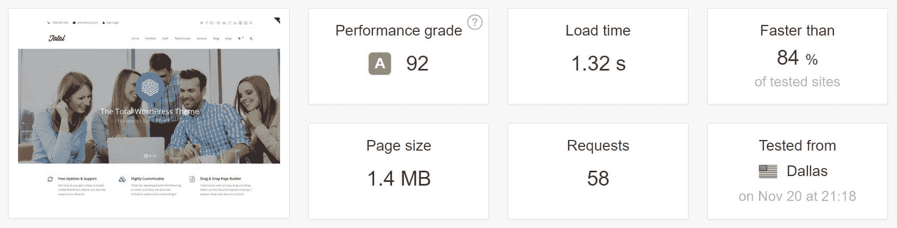

**本地同步的谷歌分析**

然后，使用上面提到的 CAOS 插件，我们将其配置为在本地同步 Google Analytics。然后我们在 Pingdom 上运行了另一个 [5 测试。这使我们的 HTTP 请求总数减少了 2 个，装载时间减少到 1.26 秒。这不是很多，但略快于正常的谷歌分析设置。](https://tools.pingdom.com/#!/dJLGWu/https://wpdev.ink/)

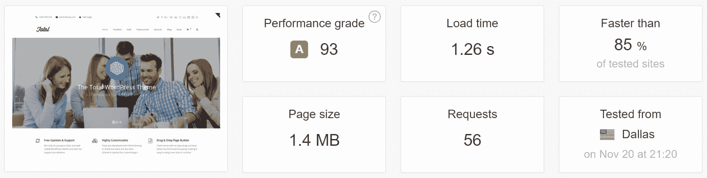

### 步骤 2–禁用嵌入

如果你不使用自动嵌入，首先要做的是禁用嵌入。这将在你的 WordPress 站点上生成一个额外的 HTTP 请求(如下所示)来加载 wp-embed.min.js 文件。这在每一页上都有体现。

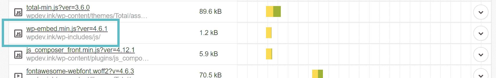

虽然这个文件只有 1.2 KB，但是随着时间的推移，这样的东西会越来越多。请求本身有时比内容下载量更大。最简单的方法是简单地安装一个名为[的免费插件，禁用嵌入](https://wordpress.org/plugins/disable-embeds/)。

[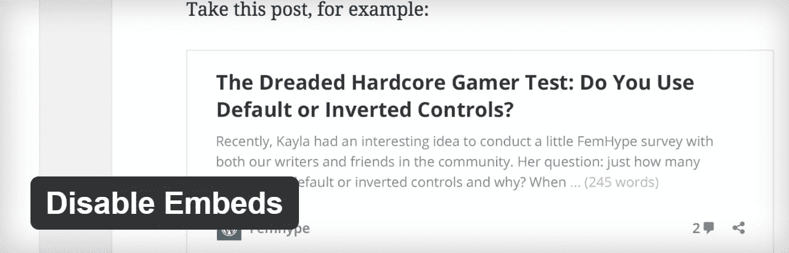T2】](https://wordpress.org/plugins/disable-embeds/)

如果你对替代方法感兴趣，请看我们关于[如何禁用嵌入](https://kinsta.com/knowledgebase/disable-embeds-wordpress/)的深度文章。然后我们在 Pingdom 上运行了另一个 [5 测试。这使我们的 HTTP 请求总数减少了 1 个，装载时间减少到 1.25 秒。再次提醒你，当我们结束的时候，所有这些事情都会累积起来。](https://tools.pingdom.com/#!/duGw4p/https://wpdev.ink/)

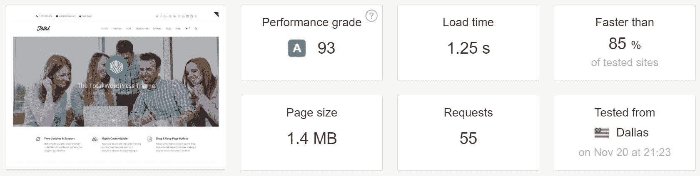

### 步骤 3–从 URL 中删除查询字符串

另一个常见问题是处理查询字符串。你的 CSS 和 JavaScript 文件通常在它们的 URL 末尾有文件版本，比如 https://domain.com/file.min.css?ver=4.5.3.一些服务器和代理服务器不能缓存查询字符串。因此，通过删除它们，您有时可以改善您的缓存。WordPress 中有一些免费的插件，比如[查询字符串移除器](https://wordpress.org/plugins/query-strings-remover/)，可以自动为你完成这项工作。

Struggling with downtime and WordPress problems? Kinsta is the hosting solution designed to save you time! [Check out our features](https://kinsta.com/features/)

[T2】](https://wordpress.org/plugins/query-strings-remover/)

然后我们在 Pingdom 上运行了另一个 [5 测试。正如你所看到的，它根本没有提高我们的速度，但它确实提高了我们的性能等级。从 93 分提高到 99 分。](https://tools.pingdom.com/#!/dNdn8Z/https://wpdev.ink/)

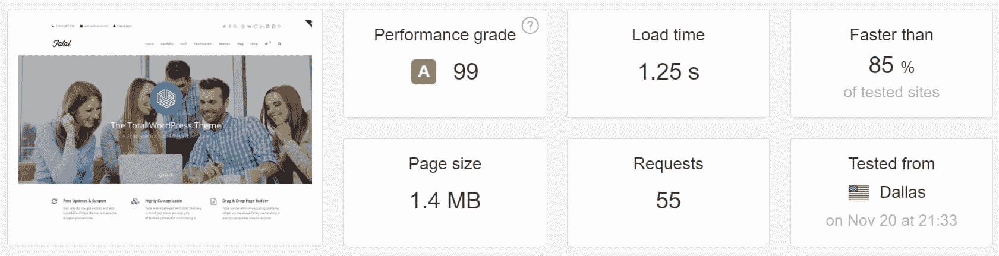

参见我们关于如何从 URL 中移除查询字符串的深入教程。

### 步骤 4–图像优化

下一步是在我们的 WordPress 媒体库上运行图像优化。这是迄今为止你能做的最重要的优化之一，因为图片平均占一个页面重量的 60%以上。尤其是当你在总主题的[滑块](https://kinsta.com/blog/wordpress-slider/)中使用大图片的时候。在这个例子中，我们使用 WP Rocket 团队的 [Imagify 图像优化插件](https://wordpress.org/plugins/imagify/)。

[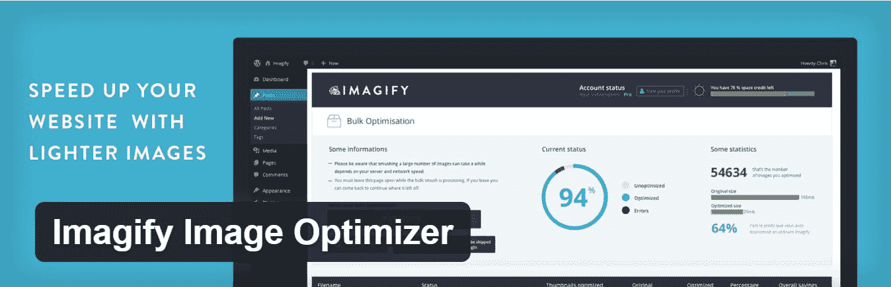T2】](https://wordpress.org/plugins/imagify/)

在插件中，我们进入媒体库下的“批量优化”。我们保留积极设置的默认压缩级别，并单击“全部图像”**我们从 11.89mb 中节省了 7.63mb！**只需轻轻一点。

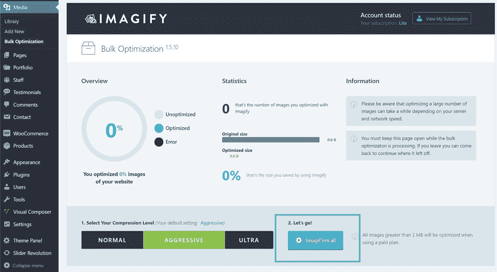

然后我们在 Pingdom 上运行了另一个 [5 测试。这又一次减少了我们的加载时间，并使我们的页面大小减少了 30%。虚拟数据中包含的默认图像非常小，因此在未优化的现场运行时，您会很容易看到更快的性能提升。](https://tools.pingdom.com/#!/enxxY0/https://wpdev.ink/)

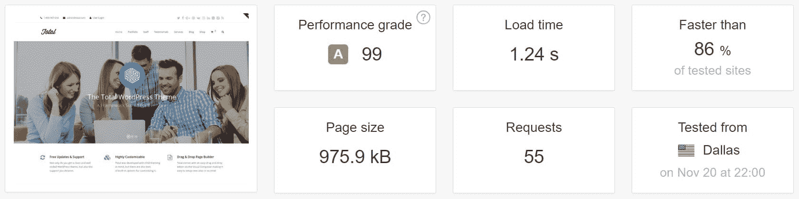

### 步骤 5–启用 CDN

下一步是在网站上启用一个[内容交付网络(CDN)](https://kinsta.com/blog/wordpress-cdn/) 。这使我们能够在全球范围内更快地提供我们的内容。

[Kinsta 客户](https://kinsta.com/plans/?plan=visits-business1&interval=month)可以使用其设置附带的 Kinsta CDN。这与[代码缩小功能](https://kinsta.com/help/kinsta-cdn-code-minification/)一起被直接内置在 [MyKinsta 仪表板](https://kinsta.com/mykinsta/)中。这使得客户只需简单的点击就可以实现 CSS 和 JavaScript 的自动缩小，从而有效地加速他们的网站，而无需手动操作。

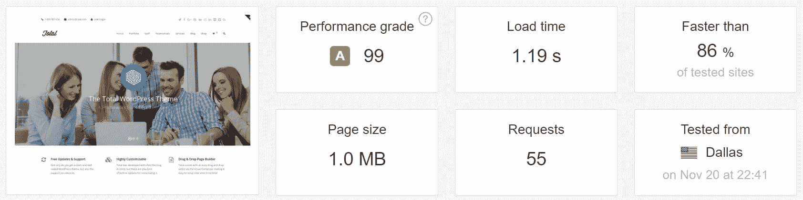

### 第 6 步-禁用主页上不必要的脚本

另一种提高网站速度的方法是禁止不必要的脚本加载到主页和网站的其他地方。WooCommerce 有几个不需要加载到主页上的脚本。如果你没有使用 lightbox 功能，你也可以禁用它。为此，我们使用了高级的 [Gonzalez 插件](https://tomasz-dobrzynski.com/wordpress-gonzales)，它允许我们单独禁用我们选择的脚本，如下所示。

```
//wpdev.ink/wp-content/plugins/woocommerce/assets/js/frontend/woocommerce.min.js
//wpdev.ink/wp-content/plugins/woocommerce/assets/css/woocommerce.css
//wpdev.ink/wp-content/themes/Total/assets/css/wpex-woocommerce-responsive.css
//wpdev.ink/wp-content/themes/Total/assets/lib/ilightbox/minimal/ilightbox-minimal-skin.css
```

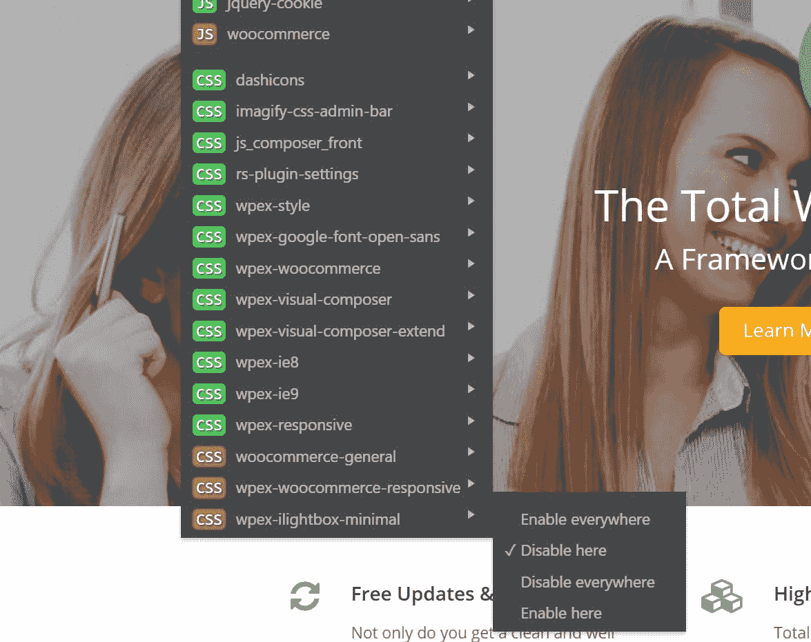

然后我们在 Pingdom 上运行了另一个 [5 测试。这将我们的加载时间缩短到了 1.18 秒，并将 HTTP 请求的总数减少了 5。](https://tools.pingdom.com/#!/cImc7u/https://wpdev.ink)


### 步骤 7–优化滑块转速

我们并不热衷于滑块，但它们仍然被广泛使用。谢天谢地，你可以在滑块旋转设置中做一些事情来加速它。我们建议同时打开“将 JavaScript 插入页脚”和“推迟 JavaScript 加载”选项。

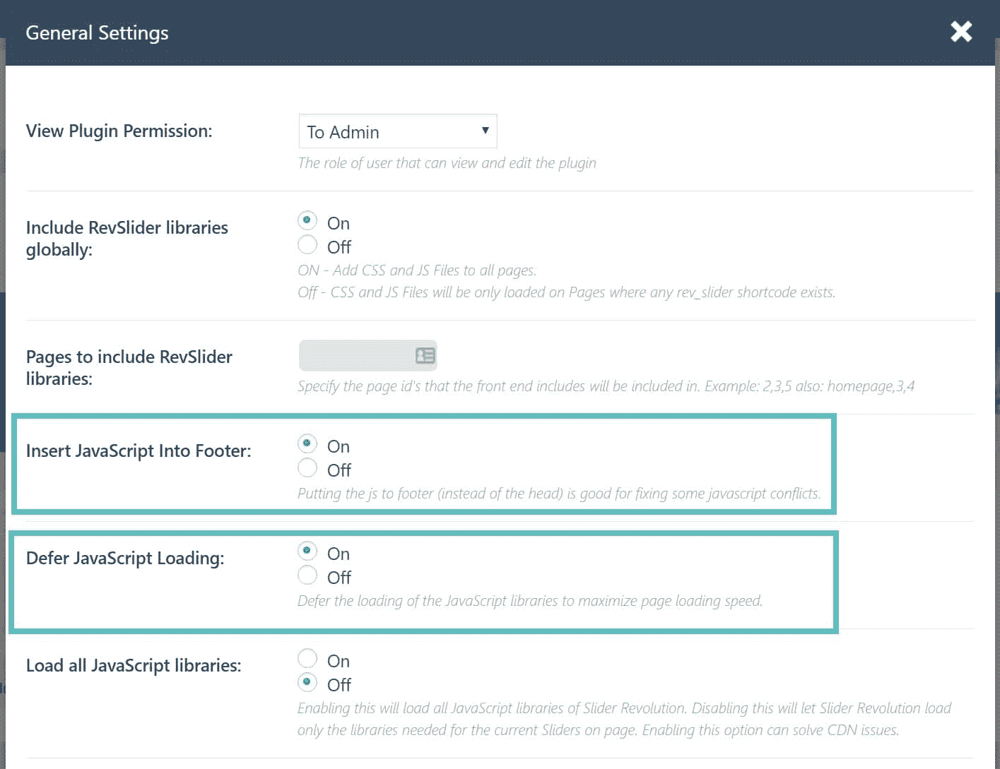

然后我们在 Pingdom 上运行了另一个 [5 测试。这使我们的加载时间缩短到了 1.15 秒。](https://tools.pingdom.com/#!/Vs5Gd/https://wpdev.ink)


我们发现 Slider Revolution 的一个问题是，默认情况下，它不会加载 CDN 的所有资产。我们发现以下三个脚本仍在从我们的原始服务器加载:

```
https://wpdev.ink/wp-content/plugins/revslider/public/assets/js/extensions/revolution.extension.slideanims.min.js
https://wpdev.ink/wp-content/plugins/revslider/public/assets/js/extensions/revolution.extension.layeranimation.min.js
https://wpdev.ink/wp-content/plugins/revslider/public/assets/js/extensions/revolution.extension.navigation.min.js
```

这可能是插件开发者应该解决的问题。

### 记得 HTTP/2 吗

同样重要的是要记住，有了 [HTTP/2](https://kinsta.com/learn/what-is-http2/) ，不再需要连接(组合)脚本。在某些情况下，它甚至可以降低你的网站速度。为了测试这一点，我们安装了免费的[自动优化插件，启用 HTML/CSS/JS 优化](https://kinsta.com/blog/autoptimize-settings/)，以及 CDN 选项。然后我们在 Pingdom 上运行了另一个 [5 测试。最后其实对站点一点帮助都没有，而且其实更慢。有了 HTTP/2 和并行性，它在快速加载多个小文件方面做得很好。然而，如果你还没有运行在 HTTPS 之上，这是 HTTP/2 所要求的，自动优化插件会有很大帮助！](https://tools.pingdom.com/#!/ew89dw/https://wpdev.ink)

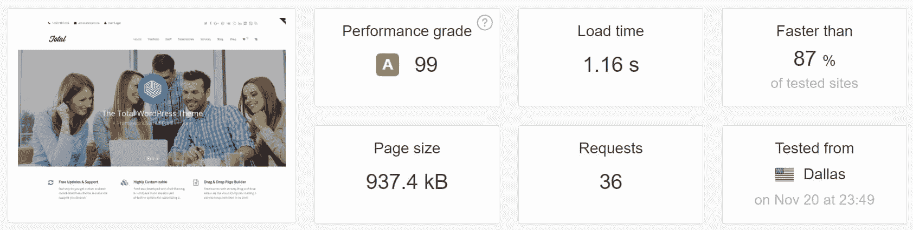

## 摘要

总之，我们对 WPExplorer 团队的整个 WordPress 主题印象深刻。由于 Kinsta 的快速服务器，即使是一个新安装的谷歌分析也能以 1.26 秒的速度运行。一旦稍加优化，对于一个安装了 WooCommerce 的网站来说，1.15 秒的加载时间是相当快的！如果这个 WordPress 主题评论有帮助，请在下面的评论中告诉我们。如果你愿意的话，我们可以对阿瓦达主题或 X 主题做进一步的探讨。

* * *

让你所有的[应用程序](https://kinsta.com/application-hosting/)、[数据库](https://kinsta.com/database-hosting/)和 [WordPress 网站](https://kinsta.com/wordpress-hosting/)在线并在一个屋檐下。我们功能丰富的高性能云平台包括:

*   在 MyKinsta 仪表盘中轻松设置和管理
*   24/7 专家支持
*   最好的谷歌云平台硬件和网络，由 Kubernetes 提供最大的可扩展性
*   面向速度和安全性的企业级 Cloudflare 集成
*   全球受众覆盖全球多达 35 个数据中心和 275 多个 pop

在第一个月使用托管的[应用程序或托管](https://kinsta.com/application-hosting/)的[数据库，您可以享受 20 美元的优惠，亲自测试一下。探索我们的](https://kinsta.com/database-hosting/)[计划](https://kinsta.com/plans/)或[与销售人员交谈](https://kinsta.com/contact-us/)以找到最适合您的方式。