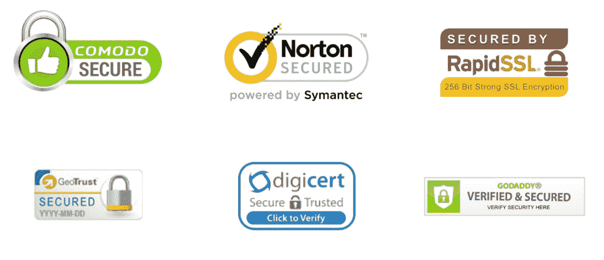
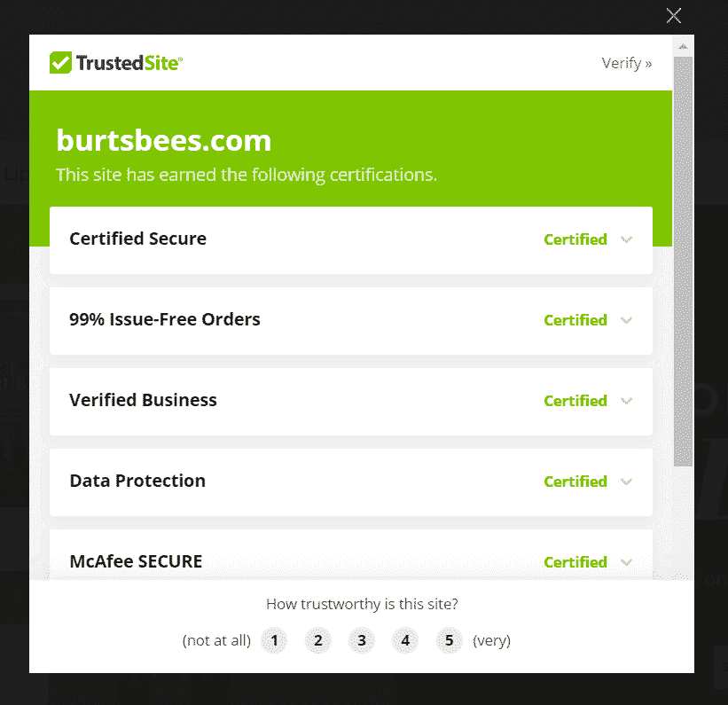
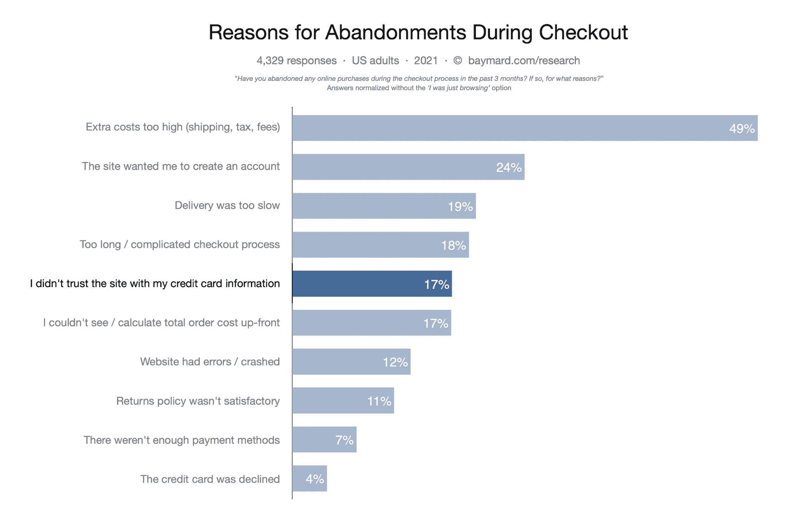
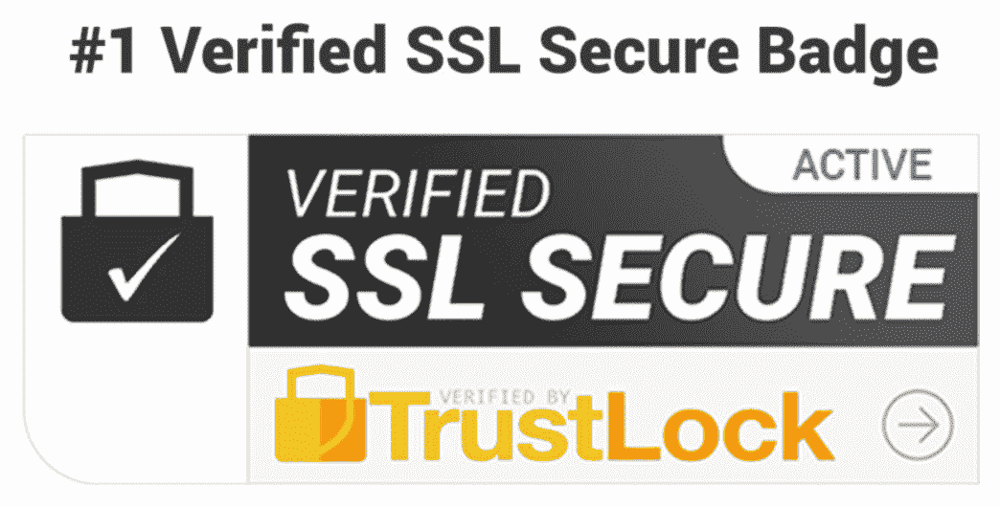
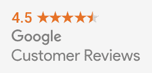
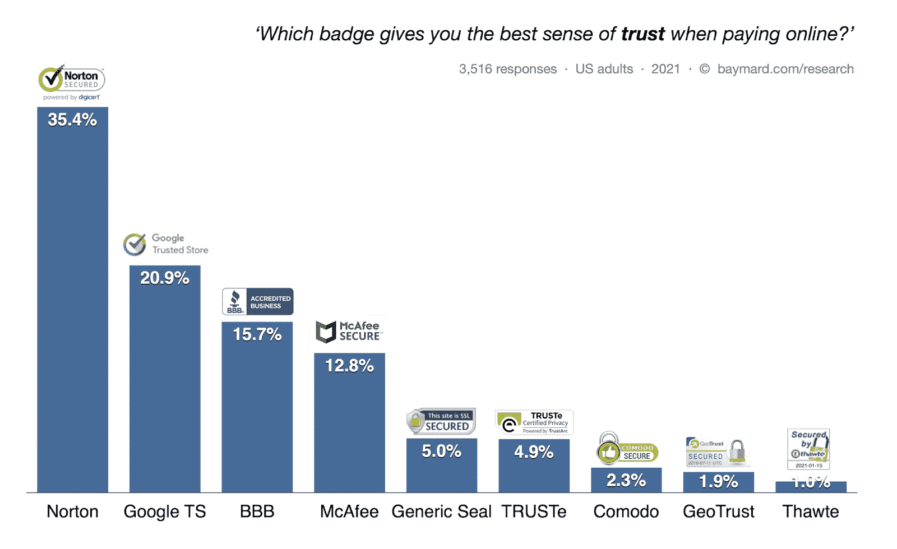
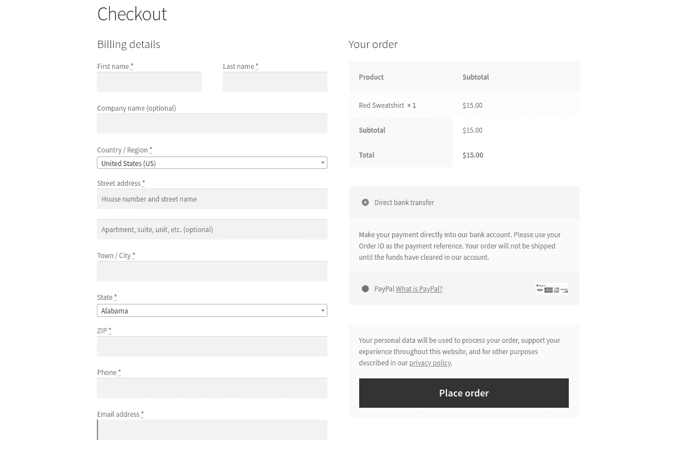
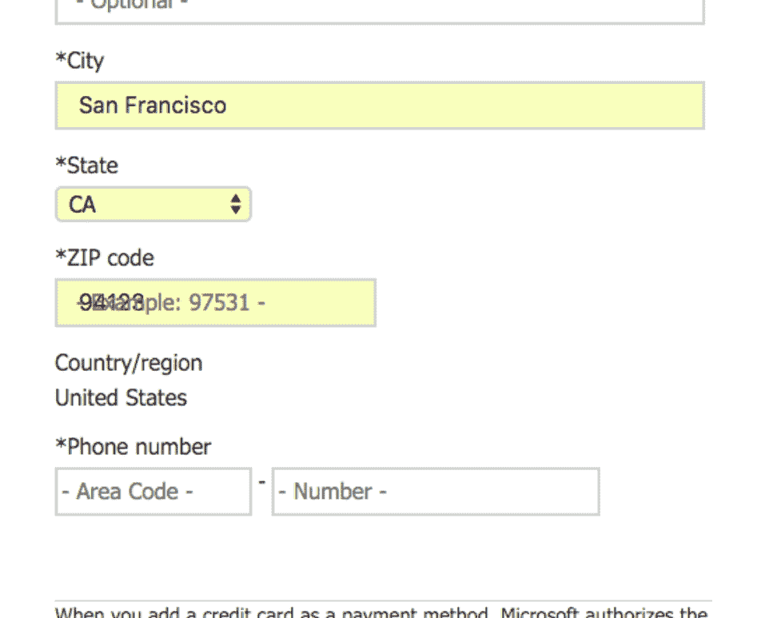

# 信任徽章 101:如何建立信任和促进电子商务转换

> 原文：<https://kinsta.com/blog/trust-badges/>

电子商务企业有取得巨大成功的潜力，但他们有一个问题:潜在客户不愿意从他们不太了解的企业购买产品，无论产品听起来有多棒。

这是可以理解的——35%的美国人至少经历过一次 T2 信用卡诈骗。随着消费者越来越意识到网上购物的风险，他们更倾向于谨慎行事。他们不确定哪些网站可以信任——也许他们只会选择亚马逊和沃尔玛！

这就是信任徽章发挥作用的地方。这是向你的客户表明你的业务是合法的，他们的信息在你这里是安全的。

在本指南中，我们将向您介绍信任徽章的类型，以及您如何使用它们来促进您企业的销售。

T3】

## 什么是信任徽章？

信任徽章是一个放在网站上的符号，让访问者知道该品牌是合法的和值得信赖的。你也可能听说过它们被称为站点印章或信任印章。

它们对收集个人或支付信息的网站至关重要，比如电子商务或会员网站。潜在客户很容易被那些没有表明其数据安全的粗略网站吓跑。

第三方创造了许多信任徽章。当你达到他们的标准时，他们同意让你在你的网站上使用一个，这可能意味着从购买 SSL 证书到接受对你的业务实践的审查的任何事情。

[你知道你的电子商务业务有取得重大成功的潜力📈但是你有一个问题:你的潜在客户很紧张😅在这篇文章中学习如何建立信任&可信度👇 点击推文](https://twitter.com/intent/tweet?url=https%3A%2F%2Fbit.ly%2F3BHNzig&via=kinsta&text=You+know+your+ecommerce+business+has+the+potential+for+major+success+%F0%9F%93%88+But+you+have+a+problem%3A+Your+potential+customers+are+nervous+%F0%9F%98%85+Learn+how+to+build+trust+%26amp%3B+credibility+in+this+post+%F0%9F%91%87&hashtags=UX%2CEcommerce)

> Kinsta 把我宠坏了，所以我现在要求每个供应商都提供这样的服务。我们还试图通过我们的 SaaS 工具支持达到这一水平。
> 
> <footer class="wp-block-kinsta-client-quote__footer">
> 
> 
> 
> <cite class="wp-block-kinsta-client-quote__cite">Suganthan Mohanadasan from @Suganthanmn</cite></footer>

[View plans](https://kinsta.com/plans/)

### 信任徽章是什么样子的？

信任徽章通常是带有名称和徽标的图标，表示徽章的提供商。

这里有几个例子:

Various SSL trust badges. (Image source: [TrustedSite](https://blog.trustedsite.com/2019/05/30/mcafee-secure-certification-vs-ssl-certificates-whats-the-difference/))

你最有可能在主页或任何要求输入信用卡号码或个人信息的页面上看到它们。

有些徽章只是图像。在其他情况下，当您单击徽章时，会显示一个弹出窗口或页面，其中包含有关该网站认证的更多信息:

Example of a trust badge pop-up. (Image source: [BurtsBees](https://www.burtsbees.com/))

## 为什么你的网站需要信任徽章

信任徽章有助于说服客户，他们可以信任您的网站，并提供他们的个人和支付信息。

对于电子商务网站来说，[放弃购物车](https://kinsta.com/blog/shopping-cart-abandonment/)是流失转化的一个重要来源。 [17%的人](https://baymard.com/blog/perceived-security-of-payment-form)放弃购物车是因为他们不信任网站提供的信用卡信息:

Reasons for shopping cart abandonment. (Image source: [Baymard](https://baymard.com/blog/perceived-security-of-payment-form))

在结帐过程中的适当位置显示的信任徽章表明他们的数据是安全的。

对于会员制网站，围绕支付的信任问题同样适用。如果您有免费版本或免费试用版，您可能仍然需要确保用户可以在注册时安全地输入他们的个人信息。一个放置得当的信托印章可以做到这一点。

### 信任徽章有用吗？

一个小图标能影响顾客行为吗？

这听起来可能不太可能，但是我们有证据表明信任徽章是有效的，这要归功于 Baymard Institute 正在进行的[检验可用性研究](https://baymard.com/blog/perceived-security-of-payment-form)。

研究发现，普通人对网站的信任通常归结于直觉，而不是技术知识。这种直觉很大程度上受到网站视觉安全性的影响。

事实证明，在网站上添加任何视觉图标都会增加用户的安全感。这是真的，即使徽章没有真正的意义——在这项研究中，研究人员创造的通用印章仍然增加了用户的信任。

不过，我们不建议使用任何通用的东西。影响最大的信任徽章来自那些名字可识别的提供商。

## 网站上的信任徽章放在哪里？

关于 Baymard 的研究，还有一些有趣的事情:他们发现，根据网站的设计，用户认为页面的某些部分比其他部分更安全。

你把信任徽章放在哪里很重要。

你可以把信任徽章放在你网站的任何地方。不过，它可能会在买家质疑网站安全性的地方产生最大的影响，比如收银台或注册页面。让我们探索一些流行的放置选项。

### 主页

主页上的信任徽章会立即开始建立用户信任。许多公司在主页的折页上方有一个信任徽章，但其他人认为这有损主页设计。

主页上的信任徽章应该是可见的，但很微妙。如果你觉得你的站点印章不适合你的页面设计，你可以在其他地方放置一个。

### 网站页脚

在页脚放一个信任徽章是在你的网站上传播它的最简单的方法之一。将它添加到你网站的页脚意味着它将出现在每一页，包括主页。

不过，这可能不是你选择的唯一地点。许多客户永远不会看页脚，尤其是当他们考虑是否在结账表单中输入信用卡号时。

你也不希望页脚太多站点印章、社交媒体图标和其他信息。

### 产品页面

在产品页面上放置信任印章的典型位置是“添加到购物车”或“立即购买”按钮旁边。在顾客走向收银台之前，这给了他们额外的信心。

### 结帐页面

对于大多数企业来说，放置信任徽章的最重要的地方是[结账页面或表格](https://kinsta.com/blog/woocommerce-checkout/)。

你希望用户在质疑输入支付信息是否安全的时候看到信任的印记。

## 信任徽章的类型

信任徽章可以是任何网站图标，旨在给网站访问者一种安全感。以下是几种最常见的类型。

### SSL 证书徽章

SSL 代表[安全套接字层](https://kinsta.com/knowledgebase/how-ssl-works/)。这是一种对两个应用程序(如浏览器和 web 服务器)之间发送的数据进行加密和认证的协议。

TLS 是[传输层安全性](https://kinsta.com/knowledgebase/tls-vs-ssl/)的缩写，是 SSL 的更新版本，但 SSL 仍然是更常用的术语。虽然一些提供商引用 SSL/TLS 证书，但其他提供商将使用 SSL 来引用这两种协议。

您可能很熟悉浏览器中 URL 旁边的小挂锁，它表示安全连接(或警告消息，表示您的连接不是私有的)。这些都是基于拥有一个有效的 SSL 证书。

许多 SSL 证书提供商也提供信任徽章，放在您的网站上。

The TrustLock SSL trust badge.

### 安全徽章

SSL 站点印章并不是表明您的站点值得信赖的唯一标志。

一些提供商为您获取徽章所需的安全功能设定了标准。例如，TRUSTe 根据企业对 GDPR 等国际隐私标准的遵守情况授予企业信任徽章。

### 接受付款徽章

你会注意到，在上面的 Baymard Institute 研究中，7%的受访者放弃了购物车，因为缺乏付款选择。

消费者通常希望看到有品牌认知度的支付选择，比如 Visa、MasterCard 或 PayPal。当购物者可以使用他们通常的支付方式时，网站会感觉更加安全和合法。

一个被接受的支付信任徽章向你的网站访问者宣传你[接受那些方法](https://kinsta.com/blog/woocommerce-payment-gateways/)并且在那些支付提供商严格的安全要求下工作。

PayPal’s accepted payment trust badge.

这些徽章通常是免费的，很容易从支付卡或在线支付公司获得。你可以访问他们的网站了解更多信息。

### 第三方认可徽章

有几个信任徽章可以从整体上认可你的企业。

一个令人印象深刻但很难获得的徽章是由商业改善局(BBB)提供的。获得 BBB 认证后，您可以展示此徽章。申请认证将花费你 75 美元。假设 BBB 调查了你的商业实践，发现你符合它的标准。在这种情况下，根据企业的规模，你每年至少要支付几百美元来维持认证。

还可以通过谷歌评论免费获得代言徽章。只要你去年至少有 100 个评论，这个徽章就会显示你的卖家评分。你所要做的就是遵守谷歌评论的服务条款。

Google Customer Reviews trust badge.

BBB 徽章会给你的老顾客留下深刻印象。然而，如果你的网站受众包括千禧一代和 Z 世代购物者，谷歌将会有更多的品牌认知度。

如果你是一家 [SaaS 公司](https://kinsta.com/blog/growing-saas-company/)，那么你也可以加入由 G2 Crowd 这样的众包评论网站提供的徽章。这会提高你在潜在客户中的信任度。

Kinsta’s badges from G2 Crowd for the hosting platform category.

正是因为这个原因，你会在 Kinsta 的网站上看到这些 G2 徽章的显著特征[。](https://kinsta.com/kinsta-reviews/)

## 注册订阅时事通讯

### 想知道我们是怎么让流量增长超过 1000%的吗？

加入 20，000 多名获得我们每周时事通讯和内部消息的人的行列吧！

[Subscribe Now](#newsletter)

### 担保徽章

担保徽章与我们讨论过的其他类型的信任印章略有不同。

它们通常不是由第三方提供的，也不依赖于认证过程。它们只是一个图像，表明你的公司对你的客户的承诺。

一些标准担保徽章包括:

*   免运费
*   免费退货
*   退款保证

这些徽章至关重要，因为数据安全并不是客户对电子商务的唯一担忧。他们还想证明你能提供顺畅的购物体验。

保证徽章有效。一个网站通过增加一个简单的 30 天退款保证徽章，销售额增加了 32.57%。

## 促进电子商务转化的最佳信任徽章

你的网站访问者感觉越安全，[他们就越有可能转变](https://kinsta.com/blog/conversion-rate-optimization-tips/)。

从 SSL 徽章开始。如果你在经营电子商务或收集个人信息，拥有 SSL 证书是至关重要的。如果你有证书，为什么不让你的顾客知道呢？

接受支付徽章是免费的，谨慎的，很容易添加到您的网站上，所以它们也是一个很好的电子商务选择。

除此之外，你选择的徽章取决于你的业务和你的观众。对于某些客户群体来说，BBB 认证带来的提升可能值得您削减预算。对于其他人来说，意义不会很大。

如果你有自己引以为豪的政策，比如退款保证，那么设计你的徽章来宣传你的产品就很有价值。

要考虑的一个因素是名字识别。虽然任何徽章都可以激发客户或会员的信任，但影响最大的徽章是那些我们都知道的徽章:赛门铁克、谷歌、商业改善局和迈克菲。

The most trusted site badges. (Image source: [Baymard](https://baymard.com/blog/perceived-security-of-payment-form))

## 从哪里获得信任徽章

你可以看到信任徽章的价值。但是你从哪里得到它们呢？

就像“免费送货”图标一样，一些信任徽章只是你可以自己创建的图像。但是大多数需要第三方的许可。

### WooCommerce 证书

如果你在你的 WordPress 电子商务网站上使用 WooCommerce，[有必要用 SSL](https://kinsta.com/knowledgebase/woocommerce-ssl/) 保护它。在过去，网站所有者总是不得不为 SSL 认证付费，但是现在你有了一些免费的选择。

如果 Kinsta 托管您的网站，我们将通过内置的 [Cloudflare 集成](https://kinsta.com/cloudflare-integration/)为所有网站提供免费的带通配符支持的 Cloudflare SSLs。Cloudflare 在其网站上提供信任徽章。

大多数主机提供的另一个流行的免费 SSL 证书是[让我们加密](https://letsencrypt.org/)。然而，请注意，尽管 Let's Encrypt 是一个很好的安全选项，但该公司明确不允许使用 Let's Encrypt 徽标的信任徽章。

一些付费的 SSL 提供商确实授予站点印章，包括:

*   方便
*   [数字证书](https://www.digicert.com/)
*   [地理信任](https://www.geotrust.com/ssl/)
*   [Thawte](https://www.thawte.com/ssl/)

### WordPress 的其他徽章

使用 WordPress 或 WooCommerce 的[插件，许多信任徽章可以很容易地添加到你的网站上。](https://kinsta.com/blog/woocommerce-plugins/)

所有的 Kinsta 托管计划都包括来自我们资深 WordPress 开发者和工程师的 24/7 支持。与支持我们财富 500 强客户的同一个团队聊天。查看我们的计划！

一个可以考虑的选项是 WooCommerce 插件的[客户评论。这个插件用额外的功能增强了标准的 WooCommerce 评论，包括你可以添加到你的网站上的信任徽章。徽章显示经过验证的客户评论摘要。](https://wordpress.org/plugins/customer-reviews-woocommerce/)

对于我们没有提到的任何信任徽章，请查看提供商的网站。大多数人都有领取徽章的说明。

## 如何将信任徽章添加到您的网站

在你的网站上放一个信任徽章并不需要太多的专业技术。使用[基本的 WordPress 编辑器](https://kinsta.com/blog/gutenberg-wordpress-editor/)或者其他简单的方法可以添加很多。

### WooCommerce 结账模板

默认的 WooCommerce 结帐表单已经显示了接受付款的图标，起到了信任徽章的作用。但是在你的[结账页面](https://kinsta.com/blog/woocommerce-checkout/)添加其他信任印章可能会更有利。

WooCommerce’s default checkout page.

如果你熟悉编码，你可以使用[动作钩子](https://kinsta.com/blog/wordpress-hooks/)自己添加元素到页面。你需要的是:

*   `woocommerce_before_checkout_form`
*   `woocommerce_checkout_before_customer_details`
*   `woocommerce_checkout_billing`
*   `woocommerce_checkout_shipping`
*   `woocommerce_checkout_after_customer_details`
*   `woocommerce_checkout_before_order_review`
*   `woocommerce_checkout_order_review`
*   `woocommerce_checkout_after_order_review`
*   `Woocommerce_after_checkout_form`

对于更基本的定制方法，浏览许多可用的 [WooCommerce 主题](https://kinsta.com/blog/woocommerce-themes/)，并找到一个允许您在信任徽章位置添加图像的主题。它不像定制编码那样灵活，但是很简单。

还有一些 WordPress 插件可以让你在结账页面和其他地方显示徽章。

### WordPress 插件

使用 WordPress 插件给你的网站添加印章有无穷无尽的选择。我们已经提到了一些客户评论的徽章:Google 评论和 WooCommerce 的客户评论。

审查插件是让你的网站获得信任的好方法。有些甚至提供额外的基于评论的徽章，比如 Yelp 评论的[小工具](https://wordpress.org/plugins/widget-yelp-reviews/)。

其他插件，如 [YITH WooCommerce 徽章管理](https://wordpress.org/plugins/yith-woocommerce-badges-management/)，让你创建各种风格的徽章，添加到你的产品目录中。这种徽章插件非常适合那些“免费送货”或“免费退货”的徽章。

最后，一些 WordPress 安全程序，如 [SiteLock](https://wordpress.org/plugins/sitelock/) ，如果你使用插件，会提供站点封条。 [TrustedSite](https://wordpress.org/plugins/trustedsite/) 是一个插件，可以让你获得一系列认证，包括信任徽章。

### 形象

你的信任徽章可以像添加到 WordPress 页面的图片一样简单。只需[上传图像文件](https://kinsta.com/blog/wordpress-media-library/)并将其有策略地放置在您选择的页面上。

### HTML 或 JavaScript

一些信任徽章提供源代码，将徽章插入到您的网站上。徽章通常包含指向证书信息的链接或弹出窗口。

你可以将这些徽章[添加到你的 WordPress 主题的页眉或页脚](https://kinsta.com/knowledgebase/edit-wordpress-code/)中。

## 在你的网站上建立客户信任的其他方法

第一印象至关重要。如果你的网站看起来不专业或者有技术问题，客户的第一反应会是退出。

这就像走进一家实体商店，看到闪烁的灯光和地板上的垃圾。你想去那里购物吗？

信任徽章是获得专业、可信外表的一种方式，但不是唯一的选择。尝试这些方法来建立消费者对你网站的信任。

### 专业网站设计

一个业余爱好者出现在你的网站上会让客户怀疑你是否有安全措施。幸运的是，即使你不是一个有经验的设计师，一个[时尚的 WordPress 主题](https://kinsta.com/knowledgebase/what-is-a-wordpress-theme/)也能给你一个专业的外观。

你选择的设计应该是[移动响应](https://kinsta.com/blog/responsive-web-design/)。没有什么比一个不能在客户智能手机上正确显示的网站更让人感到“过时”了。

请确保在结帐时避免任何布局错误，例如重叠文本。Baymard Institute 对信任徽章进行的同一项研究发现，这些小的设计错误极大地削弱了客户的安全感:

Layout errors on the checkout page. (Image source: [Baymard](https://baymard.com/blog/perceived-security-of-payment-form))

如果你的网站运行得不好，消费者也会很快感到沮丧，对你的公司失去信心。确保你的[网站速度是优秀的](https://kinsta.com/knowledgebase/what-is-a-wordpress-theme/)，访问者没有遇到任何关于错误或故障的。

### 在线评论

你的企业有很棒的东西可以提供给客户——但不要指望他们会相信你的话。这些天，大多数人转向在线评论来评估一家公司或产品。

77%的消费者认为顾客评论是他们购买决定的决定性因素。他们习惯了这些评论随时可用，因为它们在主要电子商务网站的产品页面上[。](https://kinsta.com/blog/conversions-woocommerce-product-pages/)

在你的网站上放评论通过透明建立信任。他们帮助客户做出购买决定，同时证明你对你的产品或服务没有任何隐瞒。

### 社交媒体存在

如果你已经有了一个网站，你可能也看不到对社交媒体页面的需求。毕竟，对于忙碌的小企业主来说，维护多个配置文件是额外的工作。

但如今，消费者希望在社交媒体上找到他们最喜欢的品牌。与用户互动有助于建立你公司的知名度，当他们看到使用你网站的用户群时，他们会对你更有信心。

你甚至可以加入 25%的小企业，与社交媒体有影响力的人一起工作，从而获得社会证明。

你网站上的社交媒体图标可以作为一种信任徽章——它们表明你在你的客户经常光顾的地方很活跃，并准备好与他们互动。

[不要只是告诉你的客户他们可以信任你的企业...给他们看看！(看着你的转化率飙升)💪🏅](https://twitter.com/intent/tweet?url=https%3A%2F%2Fbit.ly%2F3BHNzig&via=kinsta&text=Don%27t+just+tell+your+customers+they+can+trust+your+business...+show+them%21+%28And+watch+your+conversions+soar%29+%F0%9F%92%AA%F0%9F%8F%85&hashtags=Ecommerce%2CCustomerLoyalty)

## 摘要

你的网站访问者很谨慎，但是你可以赢得他们的信任。

信任徽章激励客户做出飞跃，从你的[电子商务企业](https://kinsta.com/blog/ecommerce-platforms/)购买，或者注册你的[会员网站](https://kinsta.com/blog/hosting-wordpress-membership-sites/)。

你是一个忙碌的企业主，你的时间是宝贵的。在你的网站上添加小徽章可能不是最重要的，但是数据显示它们可以增加转化率。另外，很多都是免费的，很容易放在你的网站上。

*希望超越信任徽章？了解更多回收废弃购物车的方法。*

* * *

让你所有的[应用程序](https://kinsta.com/application-hosting/)、[数据库](https://kinsta.com/database-hosting/)和 [WordPress 网站](https://kinsta.com/wordpress-hosting/)在线并在一个屋檐下。我们功能丰富的高性能云平台包括:

*   在 MyKinsta 仪表盘中轻松设置和管理
*   24/7 专家支持
*   最好的谷歌云平台硬件和网络，由 Kubernetes 提供最大的可扩展性
*   面向速度和安全性的企业级 Cloudflare 集成
*   全球受众覆盖全球多达 35 个数据中心和 275 多个 pop

在第一个月使用托管的[应用程序或托管](https://kinsta.com/application-hosting/)的[数据库，您可以享受 20 美元的优惠，亲自测试一下。探索我们的](https://kinsta.com/database-hosting/)[计划](https://kinsta.com/plans/)或[与销售人员交谈](https://kinsta.com/contact-us/)以找到最适合您的方式。