# 如何减少 TTFB 以改善页面加载时间

> 原文：<https://kinsta.com/blog/ttfb/>

说到你的[站点](https://kinsta.com/knowledgebase/what-is-wordpress/)的整体速度，很多时候我们关注前端性能和优化来[提高页面加载速度](https://kinsta.com/learn/speed-up-wordpress/)。

然而，有时从服务器端来看是很好的，在那里你的网站开始加载。

今天，我们将深入探讨 **TTFB(首字节时间)**如何影响你，并讨论一些简单的方法来减少它。TTFB 通常是一个被忽视的性能因素，但是在测试你的站点速度时，它应该被考虑在内。

*   [什么是 TTFB？](#what-is-ttfb)
*   [TTFB 重要吗？](#ttfb-importance)
*   [如何测量你的 TTFB](#measure-ttfb)
*   [4 种降低你的网站 TTFB 的方法](#reduce-ttfb-wordpress)

## 什么是 TTFB？

TTFB 代表第一个字节的**时间。简而言之，这是对浏览器在从服务器接收到第一个字节的数据之前必须等待多长时间的度量。获取数据的时间越长，显示页面的时间就越长。一个常见的误解是，这是在 [DNS 查找](https://kinsta.com/blog/reduce-dns-lookups/)次之后计算的，然而，[最初计算网络中的 TTFB](https://en.wikipedia.org/wiki/Time_To_First_Byte) 总是**包括网络延迟**。这涉及 3 个步骤的过程，延迟和等待时间可能发生在中间的任何地方，累积起来就是总的 TTFB。**

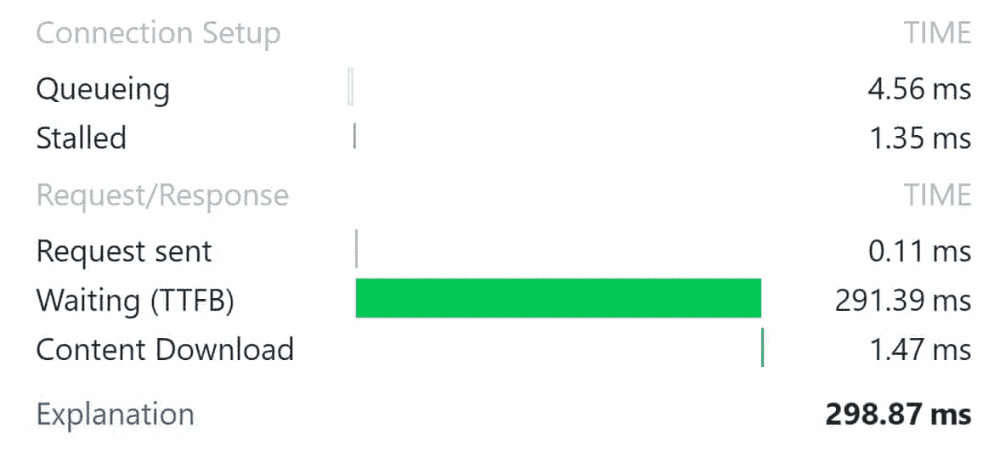

Waiting TTFB

### 1.对服务器的请求

当有人访问你的网站时，首先发生的是一个 HTTP 请求从客户端(浏览器)发送到服务器。在此步骤中，有多种因素会导致延迟。缓慢的 **DNS 查找时间**会导致请求时间增加。如果服务器的地理位置很远，这可能会在数据传输的距离中引入**延迟**。此外，如果您有复杂的防火墙规则，这可能会增加路由时间。还有别忘了客户端的网速。

### 2.服务器处理

请求发出后，服务器现在必须处理它并生成响应。这可能会引入许多不同的延迟，如**缓慢的数据库调用**，太多的第三方脚本，**没有缓存**您的第一次响应，糟糕的优化代码或主题，以及**低效的服务器资源**，如磁盘 I/O 或内存。

### 3.对客户的回应

在服务器处理完请求后，它必须将请求发送回客户机(或者说发送回第一个字节)。这受到服务器和客户端的网络速度的严重影响。如果客户端从 Wi-Fi 热点缓慢上网，这将反映在 TTFB 中。
T3】

## TTFB 重要吗？

重要的是要明白 TTFB(到达第一个字节的时间)并不等同于网站速度。这实际上是对反应能力的一种衡量。网络上有很多关于 TTFB 是否重要的讨论。有人说它毫无意义( [Cloudflare](https://blog.cloudflare.com/ttfb-time-to-first-byte-considered-meaningles/) 、 [LittleBizzy](https://www.littlebizzy.com/blog/ttfb-meaningless) )，也有人说它很重要([伊利亚·格里戈利克](https://plus.google.com/+IlyaGrigorik/posts/GTWYbYWP6xP)，谷歌的网络性能工程师)。双方都提出了一些关于为什么或为什么它不重要的有效观点，也提出了一些关于它实际上是如何计算的问题。

Moz 甚至对[搜索排名和首字节时间的相关性做了深入研究。](https://moz.com/blog/improving-search-rank-by-optimizing-your-time-to-first-byte)然而，很难知道这是不是原因，或者 TTFB 较低的网站通常也更快，这反过来可能会受到谷歌页面速度排名因素的影响。

[Does TTFB matter? It contributes to your overall speed, so what do you think? 😉Click to Tweet](https://twitter.com/intent/tweet?url=https%3A%2F%2Fbit.ly%2F2ty6eex&via=kinsta&text=Does+TTFB+matter%3F+It+contributes+to+your+overall+speed%2C+so+what+do+you+think%3F+%F0%9F%98%89)

然而，与其花时间纠结这是否重要，我们更愿意关注你可以做的优化来改进这个指标。你所做的一切都有助于网站的整体速度，而这反过来又会影响你的 TTFB。在我们的测试中，TTFB 大得多的站点只是加载速度慢了些。

一般来说，**任何低于 100 ms 的都是很棒很好的 TTFB** 。 [Google PageSpeed Insights](https://kinsta.com/blog/google-pagespeed-insights/) 推荐[服务器响应时间在 200 ms](https://developers.google.com/speed/docs/insights/Server) 以下。如果你在 300-500 毫秒范围内，这是相当标准的。如果你超过 600 毫秒，你可能在你的服务器上有一些错误的配置，或者是时候升级到一个更好的 web 栈了。或者遵循我们下面关于如何减少你的 TTFB 的建议。记住 [SSL/TLS 协商](https://kinsta.com/knowledgebase/tls-vs-ssl/)也是一个因素。

## 如何测量你的 TTFB

有许多不同的方法可以测试你的 TTFB。我们将在下面探索几个。但是请记住，每个工具都会给出稍微不同的结果，所以简单地使用一个工具并坚持使用它作为基线是很重要的。

### 使用 Google Chrome DevTools 测量 TTFB

你可以通过启动 [DevTools](https://developers.google.com/web/tools/chrome-devtools/) 在谷歌 Chrome 中测量 TTFB。但是请记住，如果您在计算机上测试，TTFB 会受到网络延迟和互联网连接的影响。因此，使用从数据中心进行测试的第三方工具(如下所示)可能更有效。

*   从 Chrome 菜单中选择更多工具>开发者工具。
*   右键单击页面元素并选择检查
*   使用键盘快捷键`Ctrl` + `Shift` + `I` (Windows)或`Cmd` + `Opt` + `I` (Mac)

您可以启动网络窗口并查看您站点的性能。

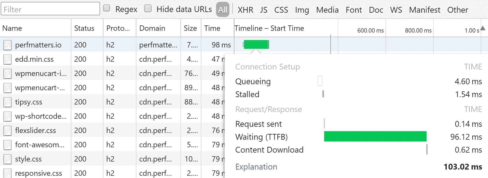

Google Chrome devtools TTFB

### 用 Geekflare 的工具测量 TTFB

Geekflare 有一个很棒的免费工具集，你可以用它来测试和解决你网站上的问题。 [Geekflare 的 TTFB 工具](https://gf.dev/ttfb-test)简单快捷，可以让你从全球三个地方看到你的第一个字节的时间有多快(低)。

## 注册订阅时事通讯

### 想知道我们是怎么让流量增长超过 1000%的吗？

加入 20，000 多名获得我们每周时事通讯和内部消息的人的行列吧！

[Subscribe Now](#newsletter)

Geekflare TTFB test tool

### 用 WebPageTest 测量 TTFB

你也可以用[网页测试](https://www.webpagetest.org/)来测量你的 TTFB。根据他们的术语表，目标时间是 DNS、套接字和 SSL 协商所需的时间+100 毫秒。每超出目标 100 毫秒，将扣除一个字母等级。正如你在下面的测试中所看到的，这个站点的 TTFB 为 0.256 秒或 256 毫秒。

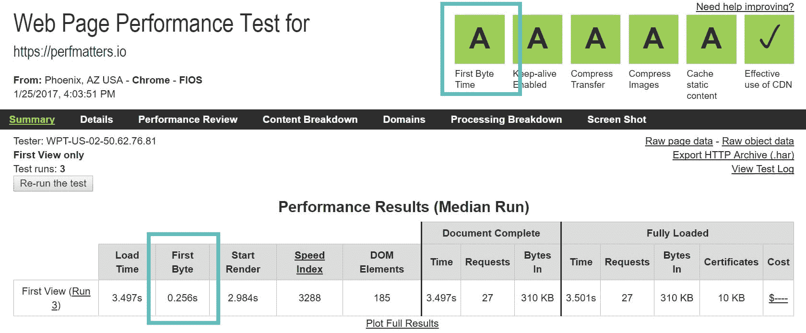

Webpagetest First Byte Time

### 使用 Pingdom 测量 TTFB

Chrome 和 WebPageTest 将其称为 TTFB。然而，如果您使用的是 [Pingdom](https://tools.pingdom.com/) ，它实际上被称为“等待”时间。请务必查看我们关于[如何使用 Pingdom](https://kinsta.com/blog/pingdom-speed-test/) 的深度指南。

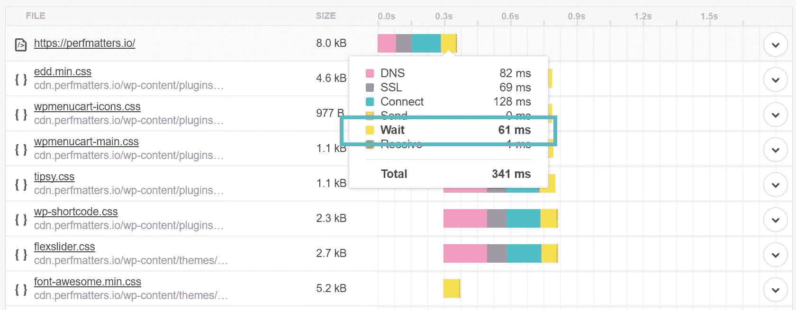

Wait time in Pingdom tools

### 用 GTmetrix 测量 TTFB

在 GTmetrix 中，与 Pingdom 一样，TTFB 被称为等待时间。请务必查看我们关于如何使用 GTmetrix 的深入指南[。](https://kinsta.com/blog/gtmetrix-speed-test/)

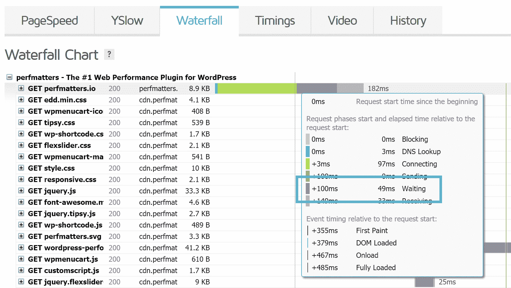

Measure TTFB in GTmetrix

### 使用 KeyCDN 工具测量 TTFB

KeyCDN 有一个很棒的 [web 性能测试工具](https://tools.keycdn.com/performance)，在这个工具中，你可以同时从 14 个不同的位置测量你的 TTFB。正如你在下面的测试中看到的，TTFB 在美国很低，而在海外要高得多。这是因为我们的服务器实际上位于美国。这证明了延迟和距离对 TTFB 的影响。

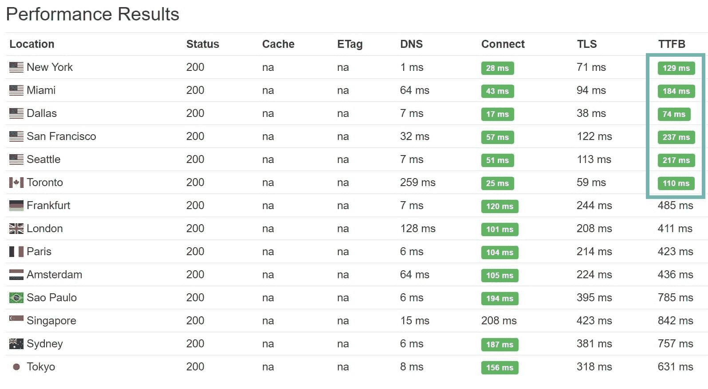

KeyCDN TTFB test

还有一些其他各种各样的工具来测量 TTFB，比如 [Sucuri 性能工具](https://performance.sucuri.net/)和 [ByteCheck](http://www.bytecheck.com/) 。你知道吗？甚至谷歌分析也有一个部分来查看你的平均响应时间。只需点击进入“行为>站点速度>概述”

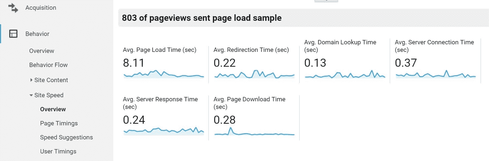

Google Analytics report for TTFB

## 4 种方法来减少你的网站上的 TTFB

现在，让我们深入探讨一下如何降低网站的 TTFB。

### 1.利用快速主机

减少 TTFB 的第一个方法是确保您使用的是快速主机。我们比较了第三方共享主机的 TTFB(位于亚利桑那州凤凰城)和 Kinsta 的 TTFB(位于爱荷华州康瑟尔布拉夫斯)。我们使用了完全相同的设置，运行默认的 217 主题。请记住，Kinsta 现在拥有所有 35 个[谷歌云平台位置](https://kinsta.com/knowledgebase/google-cloud-data-center-locations/),所以战略性地将你的网站放在离你的访问者更近的地方是很重要的。

切换到一个更快的主机可以减少你的网站高达 200%的 TTFB。[免费试用 kin sta](https://hubs.ly/H0pklC_0)。

Kinsta 还在所有托管计划中纳入了谷歌云平台的高级层网络。许多其他主机提供商使用谷歌云的标准层网络，这导致速度较慢。

**共享主机 TTFB**

在所有地区，**平均 TTFB 为 520 毫秒**。在美国和加拿大，**的平均 TTFB 是 240 毫秒**。

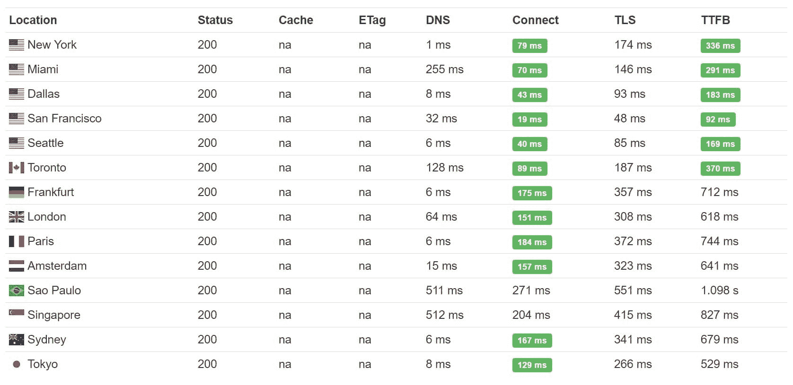

Shared hosting TTFB

**金斯塔 TTFB**

在所有地区，**平均 TTFB 为 412 毫秒**。在美国和加拿大，**的平均 TTFB 是 164 毫秒**。如果你用 Kinsta 托管，你也可以选择在欧洲或亚洲托管你的站点。参见[谷歌云数据中心位置列表](https://kinsta.com/knowledgebase/google-cloud-data-center-locations/)。

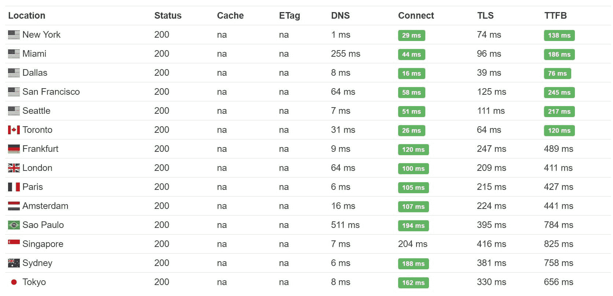

Managed WordPress hosting TTFB

简单地说，通过使用更快的主机，我们看到全球的 TTFB 下降了 20%。美国和加拿大的 TTFB 下降了 32%**。**

拥有一个好的[应用程序](https://kinsta.com/application-hosting/)、[数据库](https://kinsta.com/database-hosting/)和[管理的 WordPress 主机](https://kinsta.com/wordpress-hosting/)(比如 Kinsta)，以及一个精心设计的架构，对于降低你的 TTFB 是至关重要的。

这也是一个很好的例子，可以让你仔细选择一个位于你的客户所在地区的地方。如果你的大部分客户在美国，不要把你的服务器放在欧洲(尽管 CDN 可以帮助抵消一部分)。

### 2.实施 CDN

另一种降低 TTFB 的简单方法是利用[内容交付网络](https://kinsta.com/blog/wordpress-cdn/) (CDN)。如果你有一个网站，为全国各地或全球各地的访问者提供服务，这会大大降低你的 TTFB。正如我们上面看到的，位置非常重要。我们运行了一个小测试来展示 KeyCDN 作为我们的 CDN 提供商的区别。每个测试运行 5 次，取平均值。

**不带 CDN 的 TTFB】**

我们首先[在禁用 CDN 的情况下运行测试](https://tools.pingdom.com/#!/i7o38/https://perfmatters.io)，正如您所见，我们的总加载时间为 1.45 秒，资产的平均 TTFB 约为 136 毫秒。

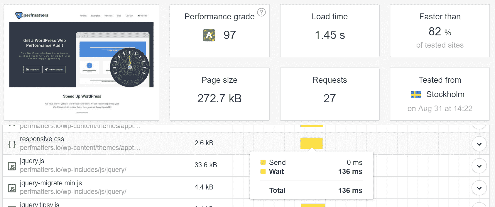

TTFB before adding a CDN

**带 CDN 的 TTFB】**

然后我们启用我们的 CDN，[再次运行测试](https://tools.pingdom.com/#!/8V7RO/https://perfmatters.io)。如您所见，我们的总加载时间下降到了 788 毫秒，平均 TTFB 现在是 37 毫秒！CDN 能带来多大的不同。另一个需要注意的重要事项是，我们选择了斯德哥尔摩的位置来执行该测试。为什么？因为我们想向您展示通过缩短物理距离可以实现的真正改进。斯德哥尔摩有一个 CDN POP，所以我们的内容是从斯德哥尔摩提供的。

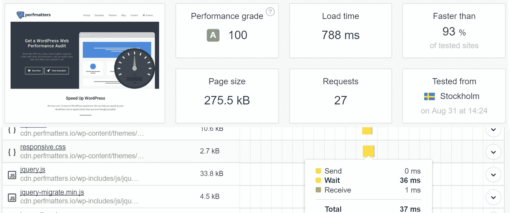

TTFB after adding a CDN

注意:如果您正在使用 Cloudflare，您可能会有一个稍微高一点的 TTFB 。这很可能是由于运行完全代理服务的额外开销和复杂性。请记住，Cloudflare 具有一些 CDN 提供商没有的额外防火墙和其他功能。所以你需要自己拿主意，这样对你更有利。如果你的整个网站没有得到适当的优化，那么牺牲稍微高一点的 TTFB 可能是值得的。

然而，你可能也想看看 WP Bullet 关于使用 [Cloudflare 页面缓存](https://guides.wp-bullet.com/cloudflare-cache-wordpress-posts-and-pages-guide/)来降低 TTFB 的指南。这可能需要一些额外的设置和测试。确保运行您自己的测试，因为每个环境都是不同的。

建议阅读:[如何为 WordPress](https://kinsta.com/blog/cloudflare-apo-wordpress/) 设置 Cloudflare APO。
T3】

### 3.在您的站点上使用缓存

减少 TTFB 的第三种方法可能也是最简单的方法是在站点上使用缓存。许多人只认为缓存有助于减少加载时间，但事实上，它也有助于减少 TTFB，因为它有助于减少服务器处理时间。我们在运行和不运行缓存的情况下再次运行了一些测试。每个测试运行 5 次，取平均值。

**无缓存运行**

我们通过 [Pingdom](https://tools.pingdom.com/#!/dhrdhX/https://wpdev2.ink/) 运行该网站，在没有运行缓存的情况下，我们的网站获得了 1.17 秒的加载时间和 560 毫秒的 TTFB。

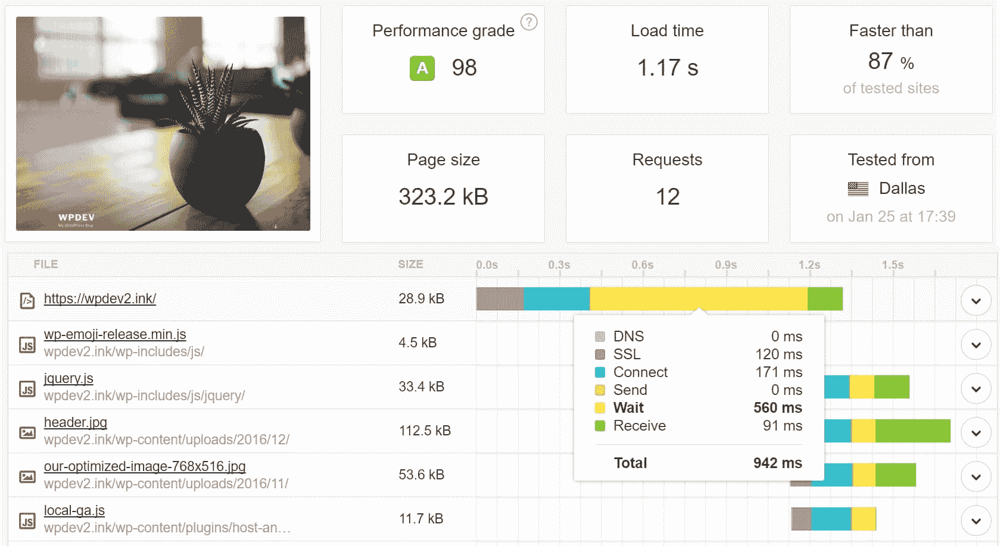

Non-cached TTFB

**启用缓存**

然后，我们启用缓存，并再次通过 [Pingdom](https://tools.pingdom.com/#!/blws5g/https://wpdev2.ink/) 运行站点。这次我们的站点获得了 643 毫秒的加载时间和 57 毫秒的 TTFB。

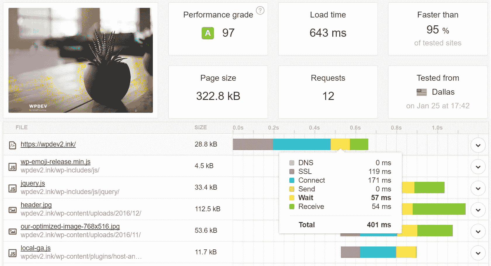

TTFB with WordPress caching enabled

因此，通过启用缓存，我们能够**将 TTFB 降低高达 90%！**你可以阅读更多关于[金斯塔的缓存](https://kinsta.com/blog/wordpress-cache/)。我们在服务器级别上这样做，这意味着不需要缓存插件。如果你没有使用托管的 WordPress 主机，我们推荐使用一个免费的缓存插件[，比如缓存使能器](https://kinsta.com/blog/wordpress-caching-plugins/)。

### 4.使用高级 DNS 提供商

最后但同样重要的是，DNS 在 TTFB 中也发挥了作用。很难准确计算它受到了多大的影响，但您仍然可以看到总的 DNS 查找时间，并看到有更快和更慢的提供商。我们用 [SolveDNS 速度测试](http://www.solvedns.com/dnsspeedtest/)工具运行了几个测试。下面是一个使用 NameCheap 的免费 DNS 的域名和响应时间的例子。

**免费域名廉价 DNS**

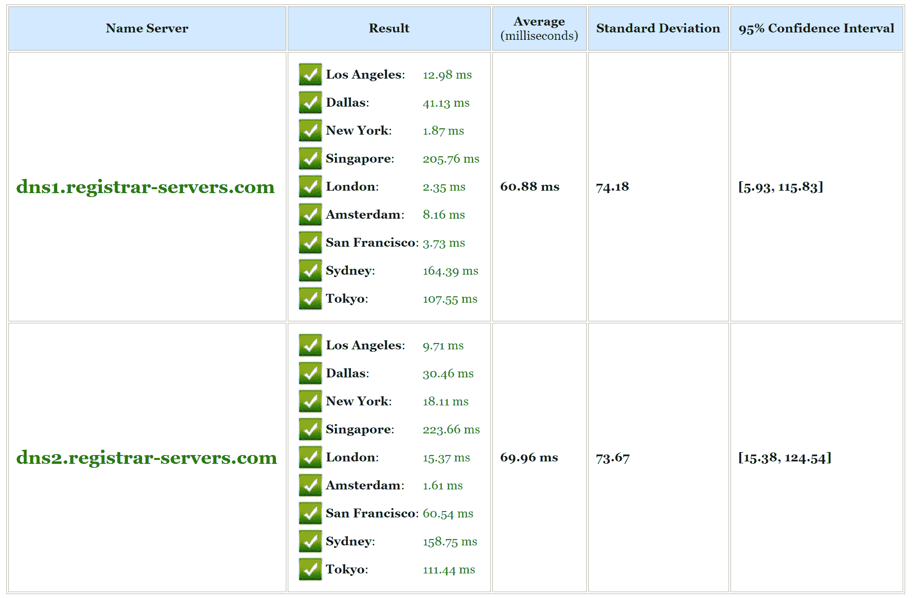

Free DNS speed

下面是一个使用亚马逊 Route 53 的高级域名系统的例子。正如你所看到的，亚马逊的 DNS 查询速度要快得多。通常，优质 DNS 提供商的速度会更快。Cloudflare 是一款免费的软件，性能也很棒。

**亚马逊 53 号路由域名系统**

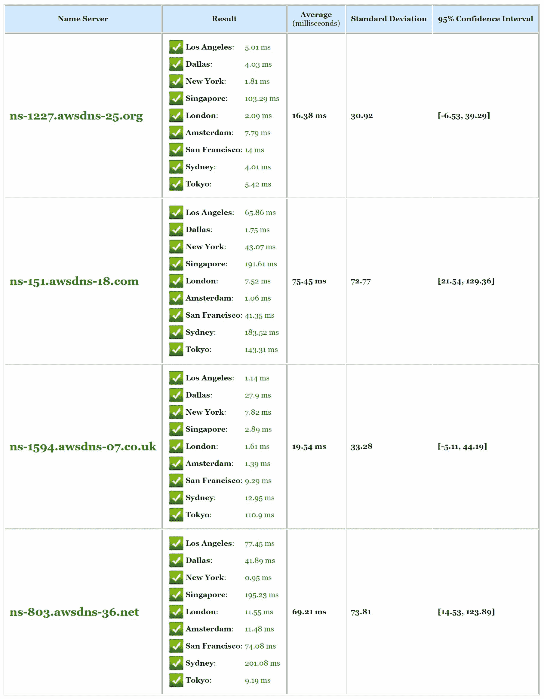

Amazon premium DNS speed

请务必查看我们关于为什么您应该使用[高级 DNS 提供商](https://kinsta.com/blog/premium-dns/)的帖子。我们与[亚马逊 Route 53](https://kinsta.com/help/dns/#nameservers) 在金斯塔合作，所有顾客都可以免费使用。

## 摘要

您可以优化或修复许多其他东西来减少 TTFB，例如数据库缓存、磁盘 IO、交换空间使用、RAM、PHP 设置、MySQL 设置、网络设置、TLS 开销等。但是上面提到的方法很容易实现，并且会给你最快的性能提升。所以下一次有人问你如何减少你的 TTFB，请记住，快速主机，CDN，缓存和 DNS 都发挥了巨大的作用。修复或改善这些瓶颈将会奏效。

你对 TTFB 有什么体验？我们很想听听下面的内容。

* * *

让你所有的[应用程序](https://kinsta.com/application-hosting/)、[数据库](https://kinsta.com/database-hosting/)和 [WordPress 网站](https://kinsta.com/wordpress-hosting/)在线并在一个屋檐下。我们功能丰富的高性能云平台包括:

*   在 MyKinsta 仪表盘中轻松设置和管理
*   24/7 专家支持
*   最好的谷歌云平台硬件和网络，由 Kubernetes 提供最大的可扩展性
*   面向速度和安全性的企业级 Cloudflare 集成
*   全球受众覆盖全球多达 35 个数据中心和 275 多个 pop

在第一个月使用托管的[应用程序或托管](https://kinsta.com/application-hosting/)的[数据库，您可以享受 20 美元的优惠，亲自测试一下。探索我们的](https://kinsta.com/database-hosting/)[计划](https://kinsta.com/plans/)或[与销售人员交谈](https://kinsta.com/contact-us/)以找到最适合您的方式。