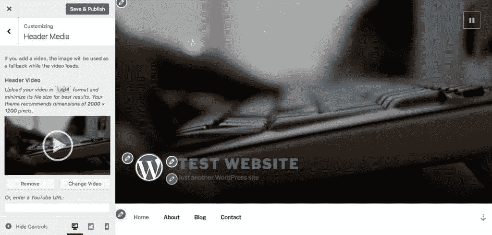
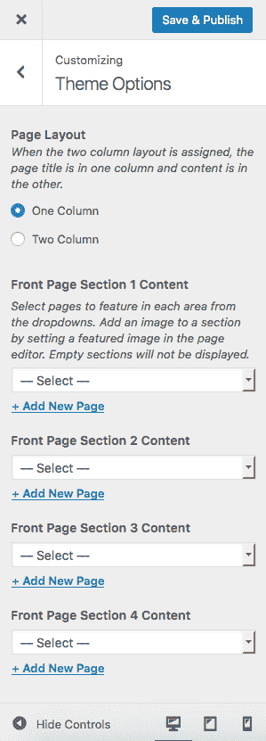
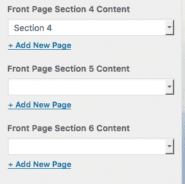
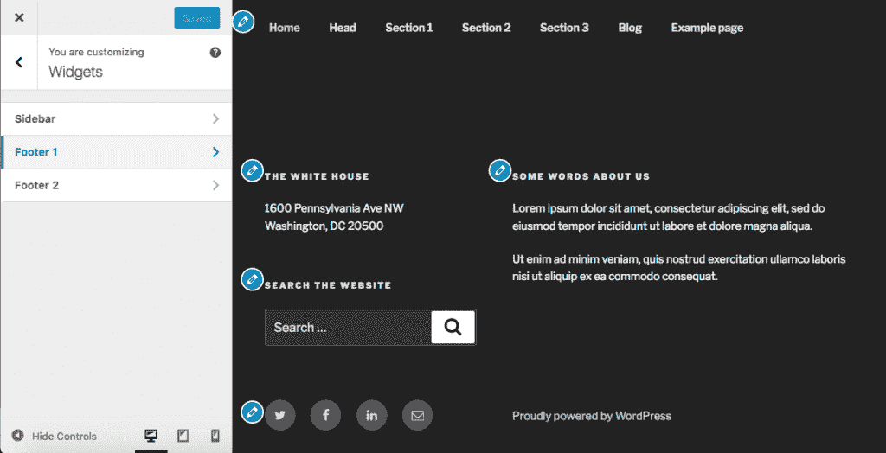
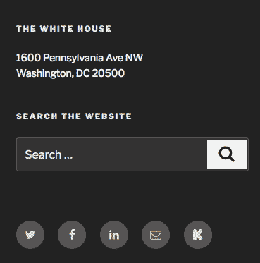
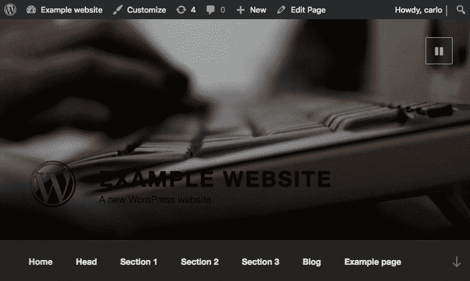
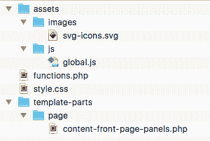
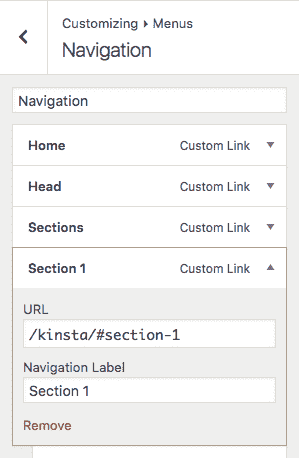

# 一个开发者对 2017 主题的介绍

> 原文：<https://kinsta.com/blog/twenty-seventeen-theme/>

随着 WordPress 4.7 的发布，还出现了新的[Twenty thicken 主题](https://wordpress.org/themes/twentyseventeen/)。新的默认主题比所有的前辈都更加易于用户和开发者定制，易于使用，非常适合个人和专业用途。此外，当谈到网站性能时，它是非常棒的，正如 Brian 在[中解释的如何用 WordPress](https://kinsta.com/blog/google-pagespeed-insights/) 在 Google PageSpeed Insights 中获得 100/100 分。

我们回顾了最新的默认主题 2019。如果你对新内容感到好奇，看看我们的深度分析:[2019 主题介绍](https://kinsta.com/blog/twenty-nineteen-theme/)(古腾堡主题)

2017 主题为新的令人惊叹的 WordPress 功能提供了完美的服装，如[可定制的视频标题](https://make.wordpress.org/core/2016/11/26/video-headers-in-4-7/)。此外，它还提供了特定于主题的特性，比如首页部分、 [SVG](https://kinsta.com/blog/what-is-an-svg-file/) 图标支持、定制器中的可视编辑图标。

(建议阅读:[二十二十主题介绍](https://kinsta.com/blog/twenty-twenty-theme/))

已经有很多关于 Twenty 主题的文章了，所以在这篇文章中，我不会列出它的新的很酷的特性和功能。相反，我将提出五个小教程，旨在帮助开发者和高级用户从新的 WordPress 默认主题中获得最大收益。借助儿童主题，我们将:

*   [自定义首页标题](#header)
*   [设置自定义视频标题控件](#video)
*   [在首页添加更多章节](#sections)
*   [向社交图标菜单添加自定义 SVG 图标](#svgs)
*   [制作首页滚动动画，构建一个单页网站](#scrolling)

## 增强 217 个主题功能的子主题

我假设你熟悉 [WordPress 子主题](https://kinsta.com/blog/wordpress-child-theme/)。如果你需要复习，花点时间阅读我们的 [WordPress 儿童主题——入门指南](https://kinsta.com/blog/wordpress-child-theme/)。完成后，在 */wp-content/themes/* 目录下创建一个新文件夹，用一个唯一的可识别的名字命名，比如**twenty tensey-child**。在这个文件夹中，创建下面的 *style.css* :

```
/*
 Theme Name:   Twenty Seventeen Child
 Theme URI:    http://example.com/
 Description:  Twenty Seventeen Child Theme
 Author:       Your Name
 Author URI:   http://example.com
 Template:     twentyseventeen
 Version:      1.0.0
 License:      GNU General Public License v2 or later
 License URI:  http://www.gnu.org/licenses/gpl-2.0.html
 Tags:         light, dark, two-columns, right-sidebar, responsive-layout, accessibility-ready
 Text Domain:  twentyseventeen-child
*/
```

样式表标题以注释的形式提供了所需的关于主题的细节。不需要额外的标签，我们也不会在示例中添加自定义样式声明。接下来，我们必须将父样式表和子样式表都放入队列。让我们将下面的函数添加到子主题的*functions.php*文件中:


> Kinsta 把我宠坏了，所以我现在要求每个供应商都提供这样的服务。我们还试图通过我们的 SaaS 工具支持达到这一水平。
> 
> <footer class="wp-block-kinsta-client-quote__footer">
> 
> 
> 
> <cite class="wp-block-kinsta-client-quote__cite">Suganthan Mohanadasan from @Suganthanmn</cite></footer>

[View plans](https://kinsta.com/plans/)

```
function childtheme_enqueue_styles() {
  wp_enqueue_style( 'parent-style', 
    get_template_directory_uri() . '/style.css' );

  wp_enqueue_style( 'child-style',
    get_stylesheet_directory_uri() . '/style.css',
    array( 'parent-style' ),
    wp_get_theme()->get('Version')
  );
}
add_action( 'wp_enqueue_scripts', 'childtheme_enqueue_styles' );
```

让我们激活儿童主题，并开始定制二十十七。


## 自定义首页页眉

2017 主题最吸引人的特征之一是首页的全屏标题。在 Customizer Header Media 部分，您可以设置一个或多个[背景图像](https://kinsta.com/blog/wordpress-background-image/)，或者一个背景视频。



由于有了**Twenty Seventeen _ custom _ header _ args**过滤器，twenty seven 允许从子主题的*functions.php*文件定制标题。通过这个过滤器，我们可以向回调函数传递以下参数的数组:

*   **default-image** ' ( *字符串*)背景图片 URL
*   **default_text_color** ' ( *字符串*)页眉文本的颜色；
*   **宽度** ' ( *整数*)表头宽度(默认为 2000)；
*   **高度** ' ( *整数*)表头高度(默认为 1200)；
*   **flex-height**'(*bool*)伸缩支持割台高度(默认为**true**)；
*   **视频** ' ( *布尔*)视频支持(默认为**真**)；
*   **WP-head-Callback**'(*string*)回调函数，用于对博客中的标题图片和文本进行样式化(默认值为**twenty seven _ header _ style**

例如，让我们将以下代码添加到函数文件中:

```
function my_custom_header_args( $args ) {
  $args['default-image'] = get_theme_file_uri( '/asseimg/header.jpg' );
  return $args;
}
add_filter( 'twentyseventeen_custom_header_args', 'my_custom_header_args' );
```

在 WordPress 4.7 中已经引入了 **get_theme_file_uri** 函数，它在儿童主题开发中帮助了我们很多。该函数首先在子主题中搜索指定的文件，如果没有找到文件，则返回到父主题。

> 注意:要使用 **get_theme_file_uri** 及其配套函数 **get_theme_file_path** ，子主题应该尊重父主题的文件结构。

## 设置自定标题视频控制

标题视频是 WordPress 的核心功能，由于 WordPress**header _ video _ settings**过滤器，它被 Twenty 修改。我们可以再次修改这些设置，通过相同的过滤器返回自定义的设置列表。让我们将下面的代码添加到子主题的 functions.php*中:*

```
function childtheme_setup() {
  remove_filter( 'header_video_settings', 'twentyseventeen_video_controls' );
}
add_action( 'after_setup_theme', 'childtheme_setup' );

function childtheme_video_controls( $settings ) {
  $settings['l10n']['play'] = __( 'Play', 'twentyseventeen-child' );
  $settings['l10n']['pause'] = __( 'Pause', 'twentyseventeen-child' );
  return $settings;
}
add_filter( 'header_video_settings', 'childtheme_video_controls' );
```

首先，我们移除了附属于 **header_video_settings** 滤镜的**twenty twenty 17 _ video _ controls**函数。然后，我们添加了自定义视频控件。在这个例子中，我们只使用了两个词，但是你明白了:你可以使用这个过滤器用你的自定义图形替换默认图标。

## 向首页添加更多部分

217 提供了一个分成几个部分的静态首页。每个部分的内容来自一个静态页面，上面是一个全屏图像(每个页面的特色图像)。



Front page sections can be configured in the Customizer Theme Options panel


默认情况下，Twenty Seventeen 最多允许四个部分，但是由于有了**Twenty seven _ front _ page _ sections**过滤器，我们可以添加任意数量的部分。作为一个例子，让我们在子主题的 functions.php 文件中添加下面一行:

```
add_filter( 'twentyseventeen_front_page_sections', function(){ return 6; } );
```

下图显示了新的定制器主题选项面板。



An enhanced version of the Theme Options panel


## 添加更多 SVG

对 SVG 图形的支持是 Twenty Tencent 最有趣的特性之一。主题提供了大量的 SVG 图标，分组在*/asseimg/SVG-icons . SVG*sprite 文件中。我们可以在页脚的社会链接菜单中欣赏 SVG。得益于 **get_theme_file_path** 核心功能和**twenty twenty seven _ social _ links _ icons**过滤器，我们可以替换这些图标或添加我们的自定义社交图标。



Twenty Seventeen footer


假设您想要添加一个链接到您令人惊叹的 Kickstarter 项目页面，但是 Twenty 没有提供相应的 SVG 图标。首先，你需要一个定制的 SVG sprite 文件，如下所示:

## 注册订阅时事通讯


### 想知道我们是怎么让流量增长超过 1000%的吗？

加入 20，000 多名获得我们每周时事通讯和内部消息的人的行列吧！

[Subscribe Now](#newsletter)

```
<svg style="position: absolute; width: 0; height: 0; overflow: hidden;" version="1.1"  xmlns:xlink="http://www.w3.org/1999/xlink">
<defs>
<symbol id="icon-kickstarter" viewBox="0 0 16 16">
<path d="M6.406 5.453L9.34 1.2C9.895.4 10.61 0 11.49 0c.715 0 1.335.254 1.86.762.522.51.784 1.117.784 1.826 0 .523-.138.986-.416 1.386L11.073 7.82l3.235 4.102c.323.408.485.886.485 1.433 0 .724-.254 1.345-.763 1.865-.508.52-1.124.78-1.848.78-.793 0-1.398-.258-1.814-.774l-3.962-4.944v2.726c0 .778-.135 1.383-.405 1.814C5.51 15.607 4.8 16 3.86 16c-.855 0-1.518-.29-1.987-.866-.44-.532-.66-1.237-.66-2.114V2.91c0-.83.224-1.516.67-2.055C2.348.285 2.995 0 3.82 0c.786 0 1.44.285 1.964.855.292.316.477.635.554.96.047.2.07.572.07 1.12v2.518z"/>
</symbol>
</defs>
</svg>
```

**符号**元素的 **id** 属性标识社交图标，其值将在我们的代码中稍后使用。
现在我们必须把新的 SVG sprite 从子主题的函数文件中包含到页面中:

```
function childtheme_include_svg_icons() {
  // Define SVG sprite file.
  $custom_svg_icons = get_theme_file_path( '/asseimg/svg-custom-icons.svg' );

  // If it exists, include it.
  if ( file_exists( $custom_svg_icons ) ) {
    require_once( $custom_svg_icons );
  }
}
add_action( 'wp_footer', 'childtheme_include_svg_icons', 99999 );
```

这个函数很像二十十七的【functions.php】文件中定义的对应**二十十七 _include_svg_icons** 函数。主要区别在于，在我们的自定义函数中，我们使用 **get_theme_file_path** 来获取子主题的 SVG 文件。
最后，我们可以将 Kickstarter 图标添加到受支持的社交链接图标列表中:

```
function childtheme_social_links_icons( $social_links_icons ) {
  $social_links_icons['kickstarter.com'] = 'kickstarter';
  return $social_links_icons;
}
add_filter( 'twentyseventeen_social_links_icons', 'childtheme_social_links_icons' );
```

将 Kickstarter 项目添加到社交链接菜单，并跳转到页面页脚来欣赏我们的工作成果。



A customized Social Links menu


## 构建一个可滚动的单页网站

即使 2017 主题提供了一个多部分的首页，动画滚动也不是一个特色。该主题使用 jQuery ScrollTo 插件来创建动画滚动效果。不幸的是，只有当用户点击向下导航箭头时，动画才会被激活，并且不能用于菜单项。但是我们是开发者，我们可以给 217 人更多的权力。因此，在最后一个例子中，我们将扩展动画滚动功能，以便网站管理员可以构建一个动画的单页网站。



When the user clicks on the arrow icon in the navigation menu, the front page scrolls down to the first page section


在 2017 主题中，动画效果由位于 */assets/js/* 文件夹中的 *global.js* 文件控制。因此，我们的第一个任务是将 *global.js* 从其原始位置复制并粘贴到子主题的相应文件夹中。



The file structure of the child theme


现在我们可以开始编码了。为了完成这一最终任务，我们将

*   强制 WordPress 加载子主题的 global.js 文件，而不是原始的父主题文件，
*   向菜单链接添加特定的 CSS 类，
*   在首页的每个部分添加一个 ID，
*   修改 global.js 文件以获得动画效果。

### 1.强制 WordPress 加载子主题的 *global.js* 文件

让我们将第一个示例中定义的**child theme _ enqueue _ styles**函数修改如下:

Struggling with downtime and WordPress problems? Kinsta is the hosting solution designed to save you time! [Check out our features](https://kinsta.com/features/)

```
function childtheme_enqueue_styles() {
  wp_enqueue_style( 'parent-style', get_template_directory_uri() . '/style.css' );

  wp_enqueue_style( 'child-style',
    get_stylesheet_directory_uri() . '/style.css',
    array( 'parent-style' ),
    wp_get_theme()->get('Version')
  );

  if( is_front_page() ){
    wp_enqueue_script( 'twentyseventeen-global', get_theme_file_uri( '/assets/js/global.js' ), array( 'jquery' ), '1.0', true );
  }
}
add_action( 'wp_enqueue_scripts', 'childtheme_enqueue_styles' );
```

如果当前页面是首页，WordPress 会将子主题的 *global.js* 文件加入队列。如果不存在，WordPress 加载父节点的 *global.js* 。

### 2.向菜单链接添加 CSS 类

为了给菜单添加一个 CSS 类**一个**元素，我们可以使用**的导航 _ 菜单 _ 链接 _ 属性**过滤器。在 functions.php 中添加以下代码:

```
function childtheme_theme_menu_class($atts, $item, $args) {
  if( is_array( $atts ) ) {
    $atts['class'] = 'nav-menu-scroll-down';
  }
  return $atts;
}
add_filter('nav_menu_link_attributes','childtheme_theme_menu_class', 0,3);
```

菜单项标记将发生如下变化:

```
<li id="menu-item-96" class="sections menu-item menu-item-type-custom menu-item-object-custom menu-item-96">
  <a href="/kinsta/#section-1" class="nav-menu-scroll-down">Section 1</a>
</li>
```

现在，我们可以很容易地从脚本中选择任何菜单链接。

### 3.将 id 添加到首页部分

为了使页面可滚动，我们必须通过为每个部分提供一个 **id** 属性来创建菜单链接目标。将 */template-parts/page/* 中的【content-front-page-panels.php】*文件复制粘贴到同一个子主题的文件夹中。然后转到第 30 行，将其更改如下:*

```
<div class="panel-content" id="<?php echo get_post()->post_name; ?>">
```

现在首页部分有了 id，允许我们从导航菜单中定位它们。以下是部分包装器的新标记:

```
<div class="panel-content" id="section-1">...</div>
```

> 请注意， **id** 属性的值将是 post slug。



The image shows the URL of a menu link


### 4.修改 global.js 文件

现在让我们打开子主题的 *global.js* 文件，并声明以下变量:

```
$navMenuScrollDown = $body.find( '.nav-menu-scroll-down' ),
```

跳到第 213 行，添加以下代码:

```
$navMenuScrollDown.click( function( e ) {
  // grab target URL
  var url = $(this).attr("href");
  // get # position
  var index = url.indexOf("#");
  if(index  == -1){
    return;
  }
  // extract the target id value
  var targetId = url.substring(index);

  e.preventDefault();
  // remove classes from any menu list items
  $("a[href*='#']").parent().removeClass("current-menu-item current_page_item");
  // add classes to current menu item
  $(this).closest("li").addClass("current-menu-item current_page_item");

  // scroll down
  $( window ).scrollTo( targetId, {
    duration: 800,
    offset: { top: menuTop - navigationOuterHeight }
  });
}); 
```

在这个函数中，我们检查 URL 是否包含一个英镑字符。如果没有，函数返回。接下来，我们获取目标部分 id，防止默认行为，并处理 CSS 类。最后， **scrollTo** 方法将视口移动到目标部分。

<iframe loading="lazy" title="animated scrolling" src="https://player.vimeo.com/video/200461705?h=875a47f747&amp;dnt=1&amp;app_id=122963" width="500" height="291" frameborder="0" allow="autoplay; fullscreen; picture-in-picture" allowfullscreen=""></p> <p><a href="https://kinsta.com/wp-content/uploads/2017/01/twentyseventeen-child.zip" target="_blank" rel="noopener noreferrer">在此下载</a>这篇文章中开发的儿童主题。</p> <h2>包扎</h2> <p>Header media、front page sections 和 SVG 是 Twenty Seventeen 主题为网站管理员提供的一些最令人兴奋的功能，可以轻松设置个人和专业网站。但是 Twenty 主题对开发者来说也是一个很好的工具，这要归功于大量的过滤器，它们可以在子主题中用来定制任何网站的外观和感觉。你已经建立了一个 217 儿童主题了吗？你能提出任何进一步的想法来增强默认功能吗？</p> <div class="user-content mt--40 pb--60"> <hr class="mini-divider"/> <p>让你所有的<a data-track-ga-category="single-post" data-track-ga-label="bottom-cta" href="https://kinsta.com/application-hosting/">应用程序</a>、<a data-track-ga-category="single-post" data-track-ga-label="bottom-cta" href="https://kinsta.com/database-hosting/">数据库</a>和<a data-track-ga-category="single-post" data-track-ga-label="bottom-cta" href="https://kinsta.com/wordpress-hosting/"> WordPress 网站</a>在线并在一个屋檐下。我们功能丰富的高性能云平台包括:</p> <ul> <li>在 MyKinsta 仪表盘中轻松设置和管理</li> <li>24/7 专家支持</li> <li>最好的谷歌云平台硬件和网络，由 Kubernetes 提供最大的可扩展性</li> <li>面向速度和安全性的企业级 Cloudflare 集成</li> <li>全球受众覆盖全球多达 35 个数据中心和 275 多个 pop</li> </ul> <p>在第一个月使用托管的<a data-track-ga-category="single-post" data-track-ga-label="bottom-cta" href="https://kinsta.com/application-hosting/">应用程序或托管</a>的<a data-track-ga-category="single-post" data-track-ga-label="bottom-cta" href="https://kinsta.com/database-hosting/">数据库，您可以享受 20 美元的优惠，亲自测试一下。探索我们的</a><a data-track-ga-category="single-post" data-track-ga-label="bottom-cta" href="https://kinsta.com/plans/">计划</a>或<a data-track-ga-category="single-post" data-track-ga-label="bottom-cta" href="https://kinsta.com/contact-us/">与销售人员交谈</a>以找到最适合您的方式。</p> </div> </body> </html></iframe>