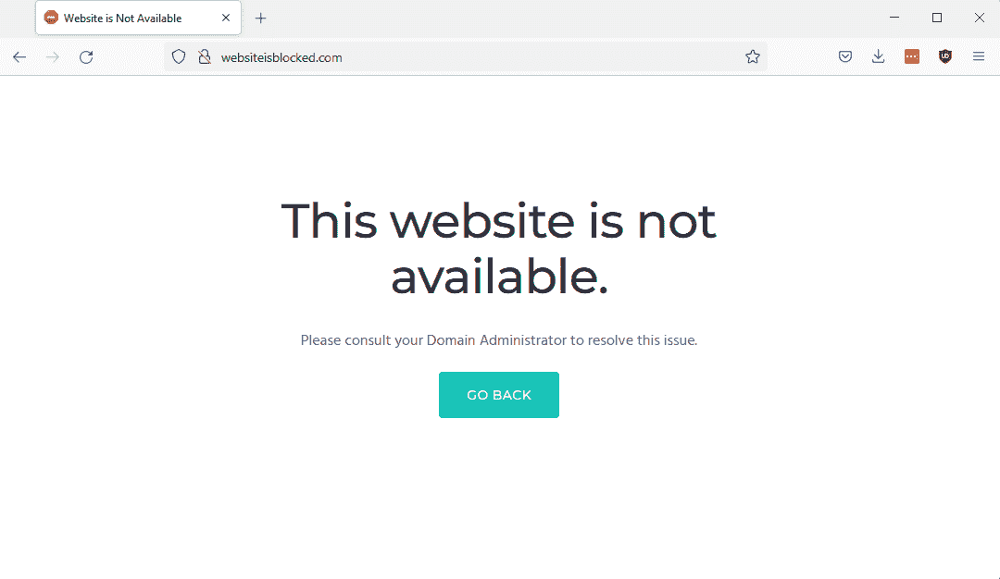
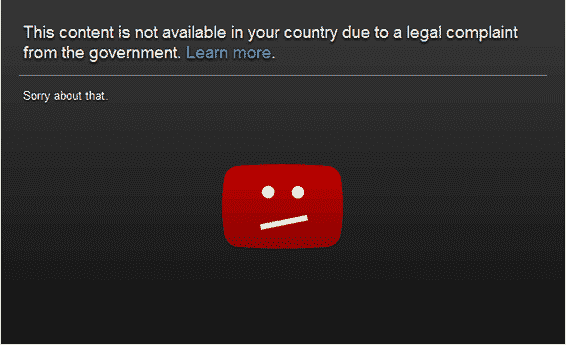
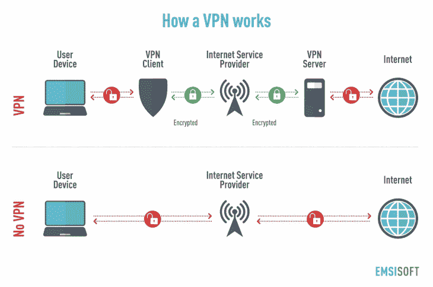
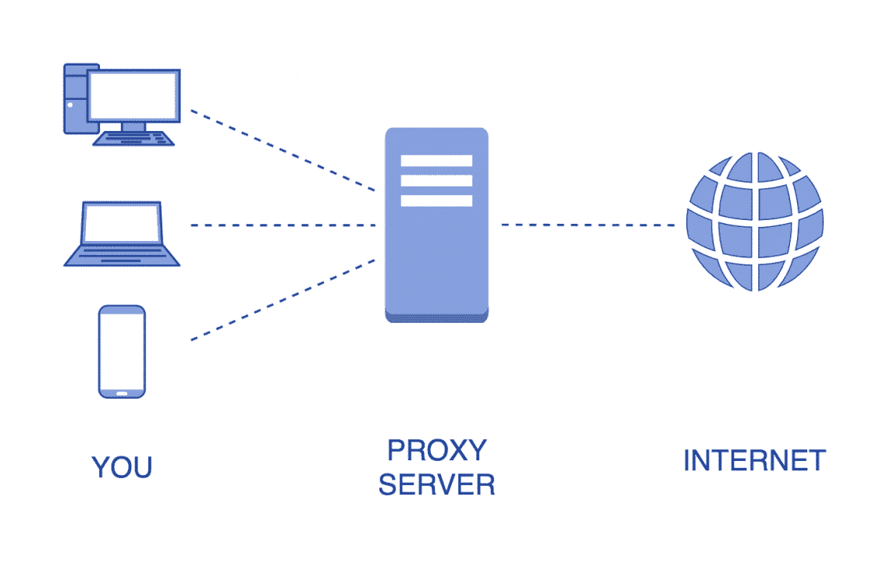
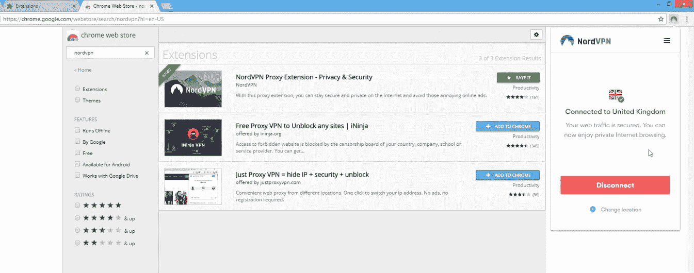
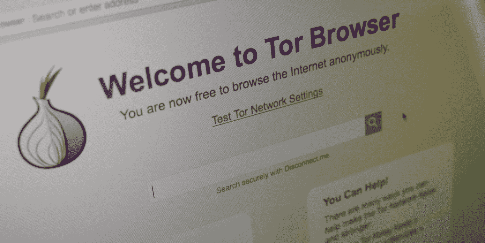
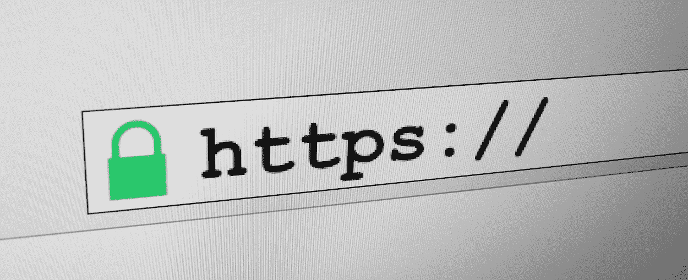
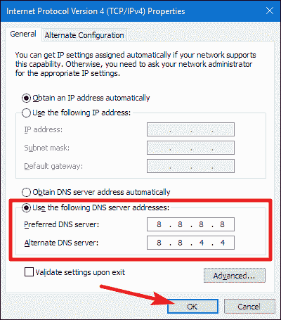

# 如何解锁网站:2022 年终极指南

> 原文：<https://kinsta.com/blog/unblock-websites/>

被屏蔽的网站是网络世界的不幸现实——以至于几乎每个人都会在某个时候遇到屏蔽。令人欣慰的是，有大量方便的工具和方法可以绕过封锁，访问受限制的内容。

如果你不能访问你最喜欢的网站，你并不孤单。超过 76 [%](https://freedomhouse.org/report/freedom-net/2016/silencing-messenger-communication-apps-under-pressure) 的互联网用户生活在至少有某种形式的网络审查的国家。此外，即使你不住在有审查制度的地方，你也可能会遇到来自工作、学校和其他地方的阻碍。

在本指南中，我们将深入探讨可用于从任何设备解除网站封锁的许多工具和方法。然而，在我们这样做之前，我们首先必须找出你最喜欢的网站为什么(以及如何)被屏蔽。请继续阅读以了解更多信息，并开始解除封锁。

## 为什么我被阻止访问某个网站？

虽然[阻止](https://kinsta.com/blog/how-to-block-a-website-on-chrome/)可能有很多原因，但通常是因为有人试图阻止你访问某个网站或应用程序。

Example of a blocked website

大多数屏蔽分为三大类:被你正在使用的网络(如你工作或学校的 WiFi)屏蔽，或被网站本身屏蔽。最后，你的互联网服务提供商(ISP)或政府可能会屏蔽你。

无论遇到什么情况，通常都有解决方法。但是，您使用的解决方法取决于块的类型和您试图访问的内容。请继续阅读，了解更多关于不同类型的块以及可以用来绕过它们的工具。

### 被你的工作或者学校挡住了

几乎每个人都有过被工作或学校屏蔽的内容。但是为什么这些块在适当的位置，它们是如何工作的？

原因很容易猜测:学校和工作场所在保持学生和员工的生产力方面有既得利益。因此，他们对某些类型的网站，如社交网络和在线游戏，设置了重重的屏蔽。

通常，你的学校或工作网络会通过 [URL](https://kinsta.com/knowledgebase/what-is-a-url/) 屏蔽网站。这意味着每当你在[浏览器](https://kinsta.com/blog/microsoft-edge-vs-chrome/)中输入一个地址，网络就会将这个地址与其黑名单进行比较。如果该地址在阻止列表中，它会限制访问并阻止您。

绕过这些障碍的常见方法是通过第三方，如代理或虚拟专用网络(VPN)重新路由您的浏览。

[Blocked websites are an unfortunate reality of the online world 😅 Thankfully, there are tons of handy tools and methods for bypassing blocks and accessing restricted content. ✅Click to Tweet](https://twitter.com/intent/tweet?url=https%3A%2F%2Fkinsta.com%2Fblog%2Funblock-websites%2F&via=kinsta&text=Blocked+websites+are+an+unfortunate+reality+of+the+online+world+%F0%9F%98%85+Thankfully%2C+there+are+tons+of+handy+tools+and+methods+for+bypassing+blocks+and+accessing+restricted+content.+%E2%9C%85&hashtags=WebTips%2CWebsiteTips)

### 它被政府封锁了

正如我们在本文开头提到的，世界上大多数人口面临着政府强加的封锁。但是为什么呢？

确切的答案可能各不相同，但都归结为一个共同的趋势:政府在维护其在公民中的声誉方面有既得利益。因此，许多政府限制访问分享关于过去事件的尴尬或罪证信息的网站。

政府封锁最著名的例子之一是中国的[“防火长城”](https://en.wikipedia.org/wiki/Great_Firewall)，它在 20 世纪 90 年代初互联网首次进入中国后迅速实施。防火墙的目的是阻止违反中国宪法和审查目标的外国网站和跨境流量。

由于防火长城，中国近 15 亿人口无法访问谷歌和脸书等热门网站。然而，这并没有阻止他们: [29](https://www.top10vpn.com/assets/2020/03/Top10VPN-GWI-Global-VPN-Usage-Report-2020.pdf) [%](https://www.top10vpn.com/assets/2020/03/Top10VPN-GWI-Global-VPN-Usage-Report-2020.pdf) 的中国互联网用户绕过了 VPN 的封锁。

当然，中国远不是唯一限制公民上网的国家。然而，无论哪个国家，屏蔽通常都是一样的，政府网络根据 URL 和主机 IP 地址过滤网络流量。

VPN 通常是绕过政府封锁的最佳方式。但是，有些用户可以通过使用[代理和其他方法](https://kinsta.com/blog/proxy-vs-vpn/)来获得。

### 它被您的 ISP 阻止了

虽然不像我们到目前为止讨论的其他类型的阻止那样常见，但许多用户面临来自他们的互联网服务提供商(ISP)的阻止。

虽然 ISP 阻止的原因可能各不相同，但通常都是为了阻止可能违反当地法律或提供商服务条款的网络流量。与政府级别的“硬块”相比，ISP 的“软块”通常更容易通过 VPN、代理和其他方法绕过。简单的切换 [DNS 服务器](https://kinsta.com/knowledgebase/what-is-dns/)甚至可以绕过一些 ISP 屏蔽。

许多互联网用户甚至没有意识到他们被 ISP 屏蔽了。一个常见的原因是，这些区块可以是一个有价值的附加服务，旨在保护您的浏览体验。然而，一些 ISP 也可能会限制访问以保护自己的利益。

但是你怎么知道你的 ISP 是否落后于一个街区呢？虽然这并不总是很容易辨别，但如果您无法访问在其他方面不受限制的网络上的网站，您通常可以断定某个阻止来自 ISP。例如，如果你生活在一个没有审查制度的国家，并且没有使用工作或学校网络，那么你遇到的任何屏蔽都可能来自你的 ISP。

### 这是地理限制的

许多网站阻止来自整个国家或地区的流量。也被称为‌"geo-restriction，“这种类型的阻止在网飞、YouTube、Prime Video 等流媒体服务中很常见。

YouTube video unavailable due to geo-restrictions

为什么要阻止外国交通呢？尤其是流媒体服务，还必须遵守规定哪些国家和地区可以访问特定内容的分发法律。这些法律就是为什么当你进入一个新的国家时，你的网飞经历经常会改变——即使是出于同样的原因。

正如你可能已经猜到的，绕过地理限制需要从一个“批准”的国家访问网站。虽然这在没有旅行的情况下似乎是不可能的，但 VPN 和代理通过远程外国服务器重新路由您的流量来提供这种能力。

其他网站的另一个原因是太多的外来流量会淹没服务器资源。

### 你被禁止了

有时候屏蔽来自网站本身。Omegle 和 Twitter 等许多热门网站可以禁止违反服务条款或促进非法活动的用户。

在这种情况下，很容易判断你是否被禁止。但是你怎么能避开它呢？

答案因网站和封禁方式而异。Twitter 等基于账户的服务将直接禁止账户本身，这意味着你无法通过使用 VPN 绕过它。相反，你必须创建一个新账户。

然而，许多禁令是基于[用户的 IP 地址](https://kinsta.com/knowledgebase/block-ip-address/)。网站可能会禁止来自用户的 [IP 地址](https://kinsta.com/tools/what-is-my-ip/)的所有流量，而不是禁止一个账户。VPN 和代理是绕过这些禁令的好方法，因为它们可以通过重新路由你的流量来有效地改变你的 IP 地址。

### 你能解锁一个网站吗？

是的，但是它取决于街区。VPN 和代理通常可以绕过大多数限制，但这并不总是有保证的。

正如我们将在下一节中看到的，解除阻塞的能力在不同的提供商和软件包之间会有很大的不同。让事情变得更加困难的是，许多流行的 web 服务一直在寻找 VPN 和代理服务器 IP，这导致了维护大量功能地址的无休止的斗争。

令人欣慰的是，即使 VPN 或代理对某项服务不起作用，仍然有很多方法可以绕过屏蔽。请继续阅读，了解更多关于 VPN、代理和一些有效的替代方法来解除对您最喜爱的网站的封锁。

## 解除网站封锁的四大方法

VPN 和代理是解封网站最流行和最有效的工具。然而，许多用户也从匿名浏览器如 [DuckDuckGo](https://kinsta.com/blog/duckduckgo-privacy/) 获得了很好的结果。虽然有许多其他方法来解除网站封锁，这四个是最广泛使用的。

### 1.虚拟专用网络

VPN 是目前最流行的解封网站的工具。然而，绕过块只是其功能的副产品。

顾名思义，虚拟专用网通过自己的一套安全服务器来重新路由您的流量，有效地将您的家庭、学校或工作场所的专用网络扩展到虚拟公共网络上。换句话说，在你的流量通常会被直接发送到一个网站的地方，VPN 作为“中间人”介入，获取你的数据并重新发送。

与代理不同，VPN 还会对你的流量进行加密。因此，您的流量和您的身份都保持隐私和安全。正如我们稍后将看到的，这是访问被屏蔽网站的部分关键。

How a VPN works (**Source:** [Yellowstone Computing](//blog.yourtarget.ch/en/whats-pestel-analysis%E2%80%9D))

这个过程听起来可能有点复杂，但实际上相当简单:

1.  你打开桌面上的 VPN 客户端或者[网络浏览器](https://kinsta.com/blog/microsoft-edge-vs-chrome/)。
2.  VPN 客户端对您的出站流量进行加密。根据提供商的不同，您还可以指定哪些应用程序将使用 VPN(此选项称为“切分通道”)。
3.  你的加密流量被发送到 VPN 的安全服务器网络。像任何连接一样，您的流量被分成“数据包”，每个数据包包括源和目的 IP 地址。在这里，源 IP 地址是您的私人家庭、工作或学校网络。
4.  VPN 服务器会从每个数据包中删除您的源 IP 地址，并用自己的地址替换它。这样做，接收端会认为你的流量来自 VPN 服务器，而不是你的电脑。
5.  你的流量被解密并被接收者接收，他不会知道它的真实来源。

好吧，也许不完全简单。然而，你可能不需要担心这个过程的细节。一旦它启动并运行，当 VPN 在幕后加密和重新路由你的流量时，你将能够正常浏览。

## 注册订阅时事通讯

### 想知道我们是怎么让流量增长超过 1000%的吗？

加入 20，000 多名获得我们每周时事通讯和内部消息的人的行列吧！

[Subscribe Now](#newsletter)

这当然很好，但是这个过程如何解除网站封锁呢？

答案就在你的 IP 里。由于许多屏蔽和禁令都是基于 IP 的(网站用它来推断你的位置)，在重新路由期间替换你的 IP 地址通常足以逃过限制。然而，由于大多数主要网站不断试图阻止来自已知 VPN 服务器的访问，提供商需要维护大型分布式服务器网络，以确保访问安全。

然而，不同的 VPN 提供商之间的服务器数量和功能差异很大。即使快速搜索 VPN 也会产生数百个不同的选项，每个提供商都有不同数量和种类的服务器。

正如你所想象的，价格也随着性能而变化，顶级提供商每月收取 10 美元或更多的费用来使用具有数千个安全 VPN 服务器的网络。虽然有一些免费的 VPN，但它们通常并不健壮——许多人转向代理寻求免费解封。

### 2.代理人

像 VPN 一样，代理也通过自己的服务器重新路由流量——但有一些关键的区别。

最大的区别是代理不像 VPN 那样加密数据。因此，你的流量对第三方来说是完全可见的，如果你使用的是声誉不佳的提供商，这会带来额外的安全风险。用户在使用代理时输入密码或发送其他安全信息时应该小心。

How a proxy works (**Source:** [Medium](//medium.com/@gleblepeshkin/what-is-a-proxy-server-and-how-do-proxies-work-b0353923d8fd%E2%80%9D))

大多数代理提供的服务器也比一般的 VPN 提供商少得多。虽然您仍然可以取消阻止网站，但它们可能不会像使用 VPN 那样可靠。

然而，这些缺点并不意味着代理没有他们的位置。由于免费且广泛可用，代理提供了一种快速解锁网站和保持匿名的方式。当[发送安全数据](https://kinsta.com/blog/secure-email-providers/)时要小心，并准备好尝试许多不同的服务器，然后才能访问受限制的内容。

### 3.VPN/代理浏览器扩展

许多 VPN 和代理也可以作为[浏览器扩展](https://kinsta.com/blog/best-chrome-extensions/)(而不是成熟的软件工具)。

Using the NordVPN browser extension

这些都是解除网站封锁的绝佳选择。传统的 VPN 会重新路由你的整个连接，而不是从单个应用程序发送的流量。虽然一些提供商确实允许用户挑选哪些应用程序使用 VPN 网络，但你可能需要为这一特权支付额外费用。

[浏览器扩展](https://kinsta.com/blog/firefox-extensions/)的另一个好处是，它们不会降低你其他应用程序的连接速度。由于 VPN 在源和目的地之间增加了一个额外的步骤，所以总是会出现稍微慢一点的连接。但是，如果只有 web 浏览器在使用 VPN，那么当您从浏览器取消阻止网站时，您将保持其他应用程序的高连接速度。

然而，对于代理人来说，这种差异并不显著。因为大多数代理通常是免费的，而且经常被过度使用，所以连接速度几乎没有差别，除非浏览器扩展提供对高级代理服务器的访问。

### 4.突岩

Tor 是“洋葱路由器”的简称，是一个免费的开源网络，致力于保持在线匿名。虽然它的主要目的是隐藏你的身份，但它也有通过其庞大的中继网络重新路由你的流量来解除网站封锁的好处。

Struggling with downtime and WordPress problems? Kinsta is the hosting solution designed to save you time! [Check out our features](https://kinsta.com/features/)

The Tor browser home page

虽然这听起来很像 VPN 或代理，但并不完全相同。在 VPN 和代理使用专用服务器的地方，Tor 网络依赖于一个完全由志愿者运行的大型覆盖网络。

当你使用 Tor 时，你的流量和数据会通过至少三个志愿者中继站重新路由，直到没有识别信息留下。截至 2022 年，Tor 网络拥有超过[6000 个](https://metrics.torproject.org/networksize.html)继电器。

使用 Tor 网络既免费又简单。您可以通过下载 [Tor 浏览器](https://www.torproject.org/download/)并简单选择连接来访问网络。虽然有些国家会屏蔽 Tor 本身，但您可以通过配置 Tor 在下载过程中使用自己的网络来绕过这些屏蔽。安装完成后，您就可以开始工作了。

然而，Tor 也有一些缺点。为了保护您的身份隐私，Tor 浏览器通常会阻止媒体插件(如 Flash ),这些插件可能会被操纵来泄露身份信息。类似地，它还会自动禁用脚本，导致功能稍微不丰富的浏览体验。

## 取消阻止网站的其他方法

虽然使用 VPN、代理和 Tor 网络都是解锁网站的好方法，但它们不是唯一的选择，在某些情况下甚至没有必要。

在购买高级 VPN 或者用 Tor 替换你最喜欢的浏览器之前，考虑一下这些更简单的选择。

### 从 HTTP 切换到 HTTPS

解封某些网站最简单的方法之一就是简单地切换到它的 [HTTPS 版本](https://kinsta.com/blog/http-to-https/)。为此，只需将 URL 中的“http://”替换为“https://”。

HTTPS in an address bar

如今，这不是一个万无一失的解决方案，因为 HTTPS 已经成为大多数网站的标准。但这可能是绕过工作或学校网络障碍的有效方法。

在这种情况下，管理员在将网站添加到网络的阻止列表时，通常会指定一个完整的 URL(例如，http://www.blocked-website.com/)。管理员可能会忘记包括 HTTPS 变体，这为您提供了一个方便的解决方法。

### 使用网站的 IP 地址

类似于切换到 HTTPS，你也可以尝试使用网站的 IP 地址，而不是它的网址。

要找到一个网站的网址，请使用此处列出的任意一种方法[。只需在你的浏览器中输入 IP 地址，你应该能够访问该网站，除非你的网络管理员已经做了尽职调查，也阻止了该 IP。](https://www.whatismyip.com/how-to-find-the-ip-address-of-a-website/)

例如，谷歌主页的几个 IP 地址之一是 172.217.204.102。试着在你的浏览器中输入这个地址，而不是 google.com——你会在同一个地方结束。

### URL 缩写

像 [TinyURL](https://tinyurl.com/app) 这样的网址缩写提供了另一种绕过某些区块的方法。

这些服务采用一个现有的网址，并返回一个缩短的版本，自动重定向到原来的网站。这样，您只能连接到缩短的 URL，而不能连接到原始的 URL，原始的 URL 可能会被管理员阻止。因此，URL 缩写有时可以对基于 URL 的阻止和阻止列表起作用，这取决于它们是如何实施的。

### 更改您的 DNS 服务器

如果您已被 IP 禁止，切换到不同的域名系统(DNS)服务器是取消阻止网站的有效方法。

不要太专业，您的 [DNS 服务器](https://kinsta.com/knowledgebase/what-is-dns/)负责将 URL 链接到它们的 IP 地址(例如，google.com 到 172.217.204.102)。由于专用网络和 ISP 从他们的 DNS 服务器管理块，切换到公共服务器通常是一个很好的解决办法。

Switching to Google’s public DNS

您可以通过在电脑的网络设置中输入 IP 地址来切换到不同的 DNS 服务器。最受欢迎(也容易记住)的选择之一是谷歌的公共 DNS 服务器，它的 IP 地址是 8.8.8.8。

### 在线翻译

向在线翻译者提交一个网址，比如谷歌翻译提供了一个替代链接，可以避开许多屏蔽过滤器。只需在翻译字段中输入 URL，选择您的语言，让翻译器发挥它的魔力。

### 缓存和网站档案

谷歌缓存和 archive.org 的 Wayback 机器存储了他们抓取的每个网站的副本，这些副本可供公众使用。由于您不需要原始 URL 来访问缓存的网站，因此这是查看被阻止网站的有效方法——尽管是旧版本。

要访问一个网站的缓存版本，你可以谷歌搜索网址，从结果中[访问缓存](https://support.google.com/websearch/answer/1687222?hl=en)，或者搜索 [Wayback 机器](https://archive.org/web/)。

### Opera 浏览器

Opera 浏览器包括一个免费的内置 VPN，使其成为一种快速简单的方式来取消阻止网站，而无需购买昂贵的订阅。然而，要小心:根据一些评论，这不是保护你的隐私或访问网飞等流媒体服务的最佳选择。

[Wondering why (and how) your favorite websites get blocked? 🤔 Read on to learn more (and start unblocking!) ✅Click to Tweet](https://twitter.com/intent/tweet?url=https%3A%2F%2Fkinsta.com%2Fblog%2Funblock-websites%2F&via=kinsta&text=Wondering+why+%28and+how%29+your+favorite+websites+get+blocked%3F+%F0%9F%A4%94+Read+on+to+learn+more+%28and+start+unblocking%21%29+%E2%9C%85&hashtags=WebTips%2CWebsiteTips) ## 摘要

尽管有许多方法可以解除网站封锁，VPN 仍然是最流行和最有效的解决方案。顶级提供商提供遍布全球网络的数千台服务器，VPN 是访问受限内容甚至保护您隐私的绝佳方式。

然而，代理、Tor 和我们已经讨论过的其他工具和方法在许多情况下也可以做得很好。不管你用什么，记住解封网站的关键是要么改变你的 IP 地址，要么尝试一个替代的网址。

寻找更多有用的提示？访问 [Kinsta 博客](https://kinsta.com/blog/)获取安全浏览、托管 [WordPress 托管](https://kinsta.com/wordpress-hosting/)、[应用托管](https://kinsta.com/application-hosting/)、[数据库托管](https://kinsta.com/database-hosting/)等方面的最新提示。

* * *

让你所有的[应用程序](https://kinsta.com/application-hosting/)、[数据库](https://kinsta.com/database-hosting/)和 [WordPress 网站](https://kinsta.com/wordpress-hosting/)在线并在一个屋檐下。我们功能丰富的高性能云平台包括:

*   在 MyKinsta 仪表盘中轻松设置和管理
*   24/7 专家支持
*   最好的谷歌云平台硬件和网络，由 Kubernetes 提供最大的可扩展性
*   面向速度和安全性的企业级 Cloudflare 集成
*   全球受众覆盖全球多达 35 个数据中心和 275 多个 pop

在第一个月使用托管的[应用程序或托管](https://kinsta.com/application-hosting/)的[数据库，您可以享受 20 美元的优惠，亲自测试一下。探索我们的](https://kinsta.com/database-hosting/)[计划](https://kinsta.com/plans/)或[与销售人员交谈](https://kinsta.com/contact-us/)以找到最适合您的方式。