# 2022 年要考虑的 10 个最佳视频托管解决方案(免费与付费)

> 原文：<https://kinsta.com/blog/video-hosting/>

根据行业预测，作为 2019 年最大的营销趋势之一，到 2021 年，视频将占所有互联网流量的 82%。但你的服务器的问题是，视频内容比基于文本的内容要重得多，给你的网站服务器带来了沉重的负担。

这就是为什么视频托管网站或服务是现代内容营销策略的一部分。您需要能够上传高质量的视频并与您的观众分享，而不会出现服务器延迟或您的网站宕机。

在这篇文章中，我们将涵盖十个最佳的企业视频托管网站，并帮助您找到适合您需求的解决方案。

 在看每一个之前，让我们先看看房间里的大象…

## 我自己托管视频好还是用视频托管网站好？

即使您有专用的服务器或虚拟机，即使流量很小，视频也会给服务器带来很大的负载。

一个普通的包含图片的网页通常应该小于几兆字节，而一个 720p 的视频通常超过 100 兆字节。

因此，仅仅十个观看一分钟高清视频的访问者就需要 1g 的服务器带宽。在同样的带宽下，一个基于文本和图像的页面可以吸引 1000 或更多的访问者。

> Kinsta 把我宠坏了，所以我现在要求每个供应商都提供这样的服务。我们还试图通过我们的 SaaS 工具支持达到这一水平。
> 
> <footer class="wp-block-kinsta-client-quote__footer">
> 
> 
> 
> <cite class="wp-block-kinsta-client-quote__cite">Suganthan Mohanadasan from @Suganthanmn</cite></footer>

[View plans](https://kinsta.com/plans/)

由于虚拟主机计划通常会限制带宽，仅仅一个视频就足以在几天内超出你的限制。这就是为什么通常使用第三方视频平台会更好。

## 2022 年 10 大最佳视频托管平台

## 免费视频托管选项

你们中的许多人可能正在寻找以下问题的答案:

哪里可以免费存放我的视频？

下面，我们将深入探讨 YouTube 和其他免费视频托管服务的利弊。

### 1.油管（国外视频网站）

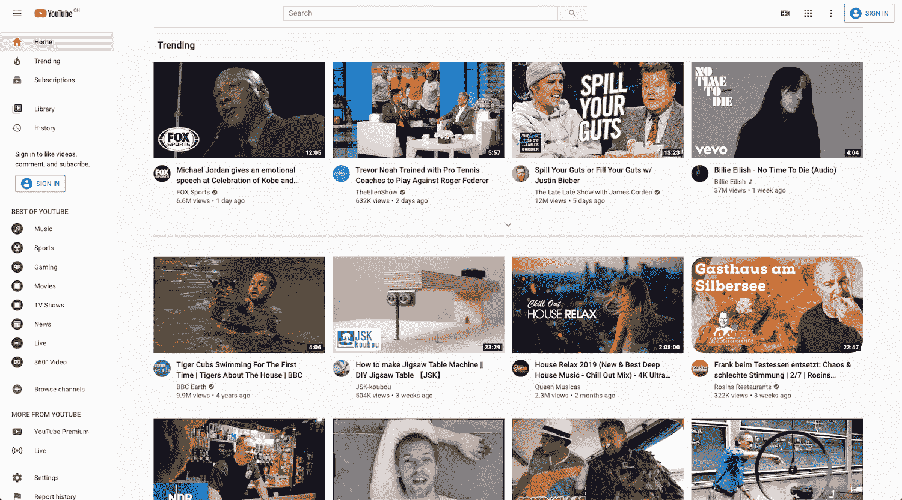

YouTube homepage

迄今为止，YouTube 是互联网上最大的视频分享网站。随着[每月有 19 亿登录用户](https://kinsta.com/blog/youtube-stats/#data-mining-youtube-stats)活跃在该网站上，任何东西都望尘莫及。

但这并不意味着它是在线托管视频的最佳选择。

对于一个内容创作者来说，通过 YouTube 推荐和搜索来挖掘大量固有观众的能力很难出错(这里有[如何创建一个 YouTube 频道](https://kinsta.com/blog/how-to-create-a-youtube-channel/)以及如何[提高你的 YouTube SEO](https://kinsta.com/blog/youtube-seo/) )。

对数据存储或带宽没有限制，你可以上传高达 128 千兆字节的单个视频。你也可以从你的视频产生的广告收入中赚取一定的百分比。

但如果你是一家企业，情况就不同了，一个疲惫的、打着[标签的 iframe 播放器](https://kinsta.com/blog/embed-youtube-video-wordpress/#embed-youtube-videos-in-wordpress)是你将视频嵌入网站的唯一选择。

YouTube 视频可能是你的内容营销战略的重要组成部分，但它不是 T2 举办课程视频或 T4 推介会的最佳选择。

让我们深入探讨他们的视频指南和其他利弊的细节。

#### YouTube 的视频上传指南和规范

*   **最小尺寸:** 240p (426 x 240)。
*   **最大尺寸:** 4K (3840 x 2160)。
*   **宽高比** : 16:9(自动为 4:3 视频添加黑框)。
*   **最大文件大小** : 128 GB。
*   **最大视频长度** : 12 小时。
*   **文件总存储量**:无限制。
*   **接受的视频格式**:。MOV，MPEG4，MP4，。AVI。WMV。MPEGPS，。FLV、3GPP 和 WebM。

#### 赞成的意见

*   为您的视频文件提供无限制的免费云存储空间
*   通过 YouTube 搜索、推荐和订阅，拥有 19 亿用户的行业领先的受众培养机会。
*   私人和未列出的选项从公众中删除视频。
*   可以使用[自定义生成的 iframe 代码](https://kinsta.com/blog/wordpress-iframe/)轻松嵌入视频。

YouTube 最大的优势在于，它是最能在网上吸引观众的地方，拥有超过 100，000，000 名订户。

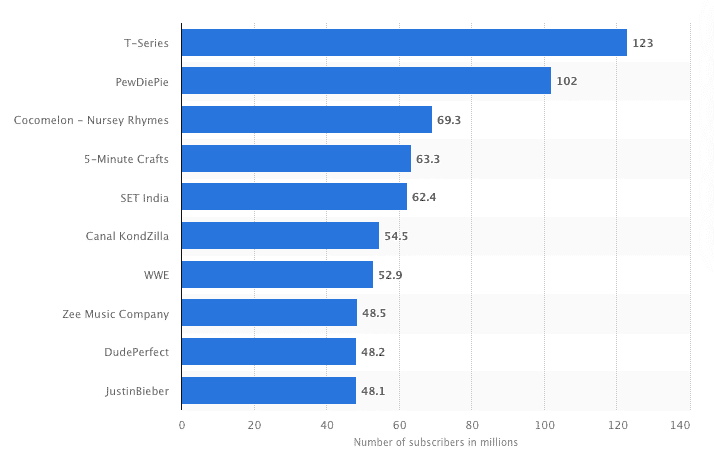

Most popular YouTube channels, ranked by num. of subscribers (Image source: Statista.com)

无限的云存储和上传单个 128GB 视频文件长达 12 小时的能力是其他巨大的好处。所有这些，都是免费的。

#### 骗局

*   基本嵌入选项。
*   广告会自动播放，甚至是你网站上嵌入的商业内容。
*   推荐视频出现在每个视频的末尾(过去你可以添加？rel=0，以防止这种情况发生，但[事情发生了变化](https://support.google.com/youtube/thread/992978?hl=en)，它不再工作)。
*   没有第三方服务就没有下载选项。
*   遵循合理使用规则时可能会出现版权问题。

当谈到使用 YouTube 作为视频托管平台时，对于希望托管专业视频以实现嵌入目的的企业来说，最明显的不利因素是广告。

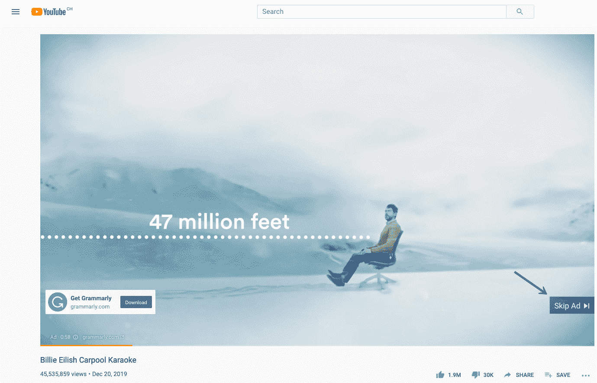

Example of YouTube ad

过去，你可以完全禁用广告，但现在唯一的选择是[仅](https://support.google.com/youtube/answer/6332943?hl=en)关闭单个视频上的广告。如果你已经发布了大量的视频，这可能需要很多时间。

如果这对一些企业来说不是一个障碍，那么在最后展示竞争对手的视频作为推荐的可能性仍然存在。

#### 适用于:

*   希望在社交平台上建立受众的内容创作者。
*   希望利用视频为网站带来更多流量并通过视频接触新受众的企业。

虽然我们选择了像 Wistia 这样的付费解决方案，但我们也在我们的 [YouTube 频道](https://www.youtube.com/kinsta)上发布了一些视频，以吸引大量观众。一定要在那里订阅！
T3】

### 2.日常运动

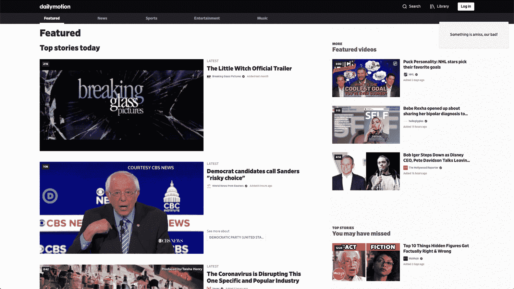

Dailymotion

Dailymotion 可能是这份名单中最明显的 [YouTube 竞争对手](https://kinsta.com/blog/alternatives-to-youtube/#who-are-youtubes-competitors)，因为它的目标是成为另一个视频分享平台。它声称拥有超过 3 亿独立用户，其中最大的 Dailymotion 用户 T 系列拥有近 9 万名粉丝:

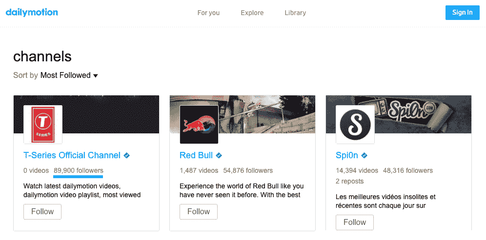

Dailymotion top users

客观地看，T 系列频道在 YouTube 上有超过 1.2 亿的订户。

#### Dailymotion 的视频上传指南和规范

*   **最小尺寸:** 240p (426 x 240)。
*   **最大尺寸:** 4K (3840 x 2160)。
*   **宽高比** : 16:9(自动为 4:3 视频添加黑框)。
*   **最大文件大小** : 2 GB。
*   **最大视频长度** : 1 小时。
*   **文件总存储量**:无限制。
*   **接受的视频格式**:。MOV，MPEG4，MP4，。AVI。WMV。FLV。MKV、3GPP 等。

#### 赞成的意见

*   免费无限视频托管。
*   选项，使视频私人，甚至密码保护。
*   在竞争较少的情况下获得一些受众发展的机会。

与 YouTube 相比，使用 Dailymotion 托管视频的潜在优势相当小。

竞争更少，所以你可能更容易从零开始建立一个观众群，但增长的潜力要低得多。

#### 骗局

*   观众总数比 YouTube 少。
*   较小的最大文件大小。
*   没有第三方服务，无法下载您的视频。
*   广告会在视频播放之前、期间和之后自动播放。

与 YouTube 一样，Dailymotion 通过广告支持自己。一个关键的区别是，他们不管用户的追随规模大小，都会播放广告。

Example of Dailymotion ads

除非您有一个[合作伙伴帐户](https://faq.dailymotion.com/hc/en-us/articles/115008808407-Become-a-partner)，否则您将无法编辑这些设置。它也有较低的上传限制和在网站上嵌入视频的类似问题。

#### 适用于:

*   寻找二级分销渠道的内容创作者。

### 3.Vimeo

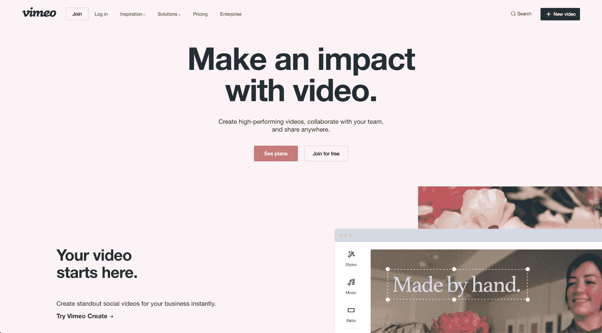

Vimeo

与社交视频分享平台 Dailymotion 和 YouTube 不同， [Vimeo](https://vimeo.com/) 是一款面向专业人士的视频托管/协作套件。

虽然 Vimeo 确实有一个观看视频的部分，由人类而不是算法管理，但它有一个特定的受众。Vimeo 是创意专业人士的首选平台，因此只有某些类型的视频表现良好:

*   原创短片。
*   原创动画。
*   独立音乐视频。
*   极限户外运动/自然视频。

如果你的视频不属于这些类别，你可能很难在 Vimeo 上吸引观众。

#### 视频上传指南和规范

*   **最小尺寸:** 240p (426 x 240)。
*   **最大尺寸:** 8K (8192 × 4320。
*   **宽高比:** 16:9(自动为 4:3 视频添加黑框)。
*   **最大文件大小:**免费用户 500 MB(专业用户最高 256 GB)。
*   **最大视频长度:**受文件大小限制。
*   **文件总存储量:**免费用户每周 500 MB(专业用户每周 20 GB)。
*   **可接受的视频格式:**。MOV，MPEG4，MP4，。AVI。WMV。FLV。MKV、3GPP 等。

#### 赞成的意见

*   没有广告。
*   谨慎，可定制的视频嵌入。
*   使用 Vimeo Create 创建专业的社交媒体视频。
*   在平台上宣传你的创意服务。
*   可以启用视频下载。
*   Pro 计划起价仅为每月 7 美元。

Vimeo 是为专业使用而设计的。没有广告和可定制的视频嵌入使它成为网站所有者在他们的[登陆页面](https://kinsta.com/blog/wordpress-landing-page-plugins/)上添加视频的完美选择。

嵌入式视频播放器时尚、快速，不包含广告或强制推荐。您可以选取响应或固定大小，并切换自动播放或循环播放。

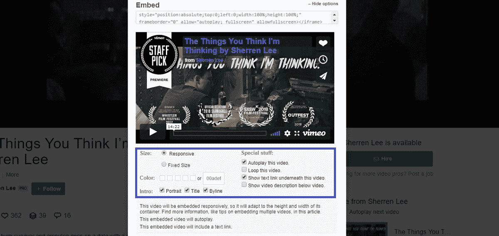

Embed options in Vimeo

付费用户甚至可以进一步定制他们的嵌入设置:

Customize embed

Vimeo 是想在网站上嵌入专业视频的网站管理员的最佳免费选择。

#### 骗局

*   免费帐户的低上传限制。
*   受众狭窄。

Vimeo 的主要缺点是其免费账户的上传限制较低，受众相对较窄。

除非你是一个制作电影杰作的创意者，否则你将很难在他们的平台上获得追随者。

#### 适用于:

*   希望与积极参与的观众分享他们的作品并推销他们的服务的创意专业人士。

### 4.脸谱网

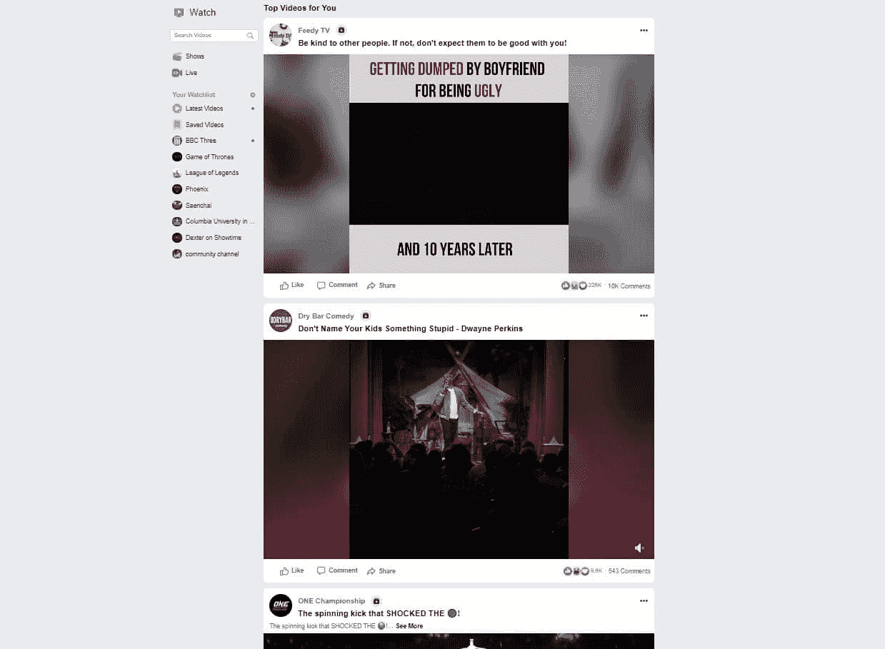

Facebook Watch

脸书是唯一一个在观众数量上可以和 YouTube 相提并论的平台。事实上，在[24.5 亿月活跃用户](https://investor.fb.com/investor-news/press-release-details/2019/Facebook-Reports-Third-Quarter-2019-Results/default.aspx)，它拥有更大的受众。

但脸书首先是一个社交媒体和信息平台，而不是视频分享平台。

#### 视频上传指南和规范

*   **推荐尺寸:** 720p (1280×720) px 至 1080p (1920×1080 px)。
*   **支持的长宽比:**横向(16:9)、纵向(9:16)、纵向(2:3、4:5)、方形(1:1)。
*   **最大文件大小:** 4 GB。
*   **最大视频时长:** 2 小时。
*   **文件总存储量:**无限制。
*   **可接受的视频格式:**。MOV，MPEG4，MP4，。AVI。WMV。FLV。MKV、3GPP 等。

#### 赞成的意见

*   无限制免费视频托管。
*   直接在脸书上分享视频。
*   在最大的社交媒体平台上建立受众。

将视频添加到时间轴和 Facebook Watch 使脸书成为互联网上领先的视频分销商之一。

每周有数十亿的视频被观看，成功的创作者直接在脸书上分享他们的视频。

2019 年，规模较小的脸书视频创作者似乎有更好的机会让视频传播开来，并从零开始培养观众。

#### 骗局

*   广告会自动在所有视频上播放。
*   非常基本的品牌嵌入式播放器选项。
*   视频质量上限低于其他选项。

脸书的嵌入式播放器选项很少。它只在静态下可用，没有自动播放或循环。

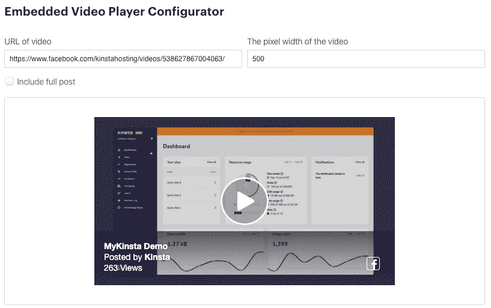

Facebook Video Player Configurator

它的视频质量也比同类产品差，可以在视频播放之前、之中和之后自动播放广告。

#### 适用于:

*   希望从零开始建立受众的内容创作者。
*   寻求建立品牌认知度并为相似广告创造种子受众的营销人员。

## 优质视频托管

下面，我们涵盖了最佳的商业视频托管选项。从简单、无品牌、高质量的视频托管平台，到面向企业的数据优先营销解决方案。

### 5.视频托管:Jetpack

Jetpack Video Hosting

即使你有一个安装了 Jetpack 插件的 [WordPress 网站，你可能不知道它提供了](https://kinsta.com/knowledgebase/wordpress-jetpack/)[视频托管](https://jetpack.com/features/design/video-hosting/)作为其高级和专业计划的一部分。

## 注册订阅时事通讯

### 想知道我们是怎么让流量增长超过 1000%的吗？

加入 20，000 多名获得我们每周时事通讯和内部消息的人的行列吧！

[Subscribe Now](#newsletter)

无限视频托管包含在高级 Jetpack 计划中，价格为**$ 19.95/月**(存储软限制为 2TB)。

#### 视频上传指南和规范

*   **最大文件大小:** 2 GB(建议 1 GB 或更低)。
*   **最大视频长度:**受大小限制。
*   **文件总存储量:**无限制。
*   **可接受的视频格式:**。MOV，MPEG4，MP4，。AVI。WMV。FLV。MKV、3GPP 等。

#### 赞成的意见

*   无品牌，可定制的嵌入式视频播放器。
*   无限制的视频托管。
*   你的 WordPress 仪表盘中的视频统计。

你可以使用 Jetpack [video blocks](https://jetpack.com/support/jetpack-blocks/video-block/) 将视频无缝嵌入到你的 WordPress 帖子和页面中。

它提供了自动播放、静音和循环播放等高级选项。你甚至可以隐藏所有的播放控制。

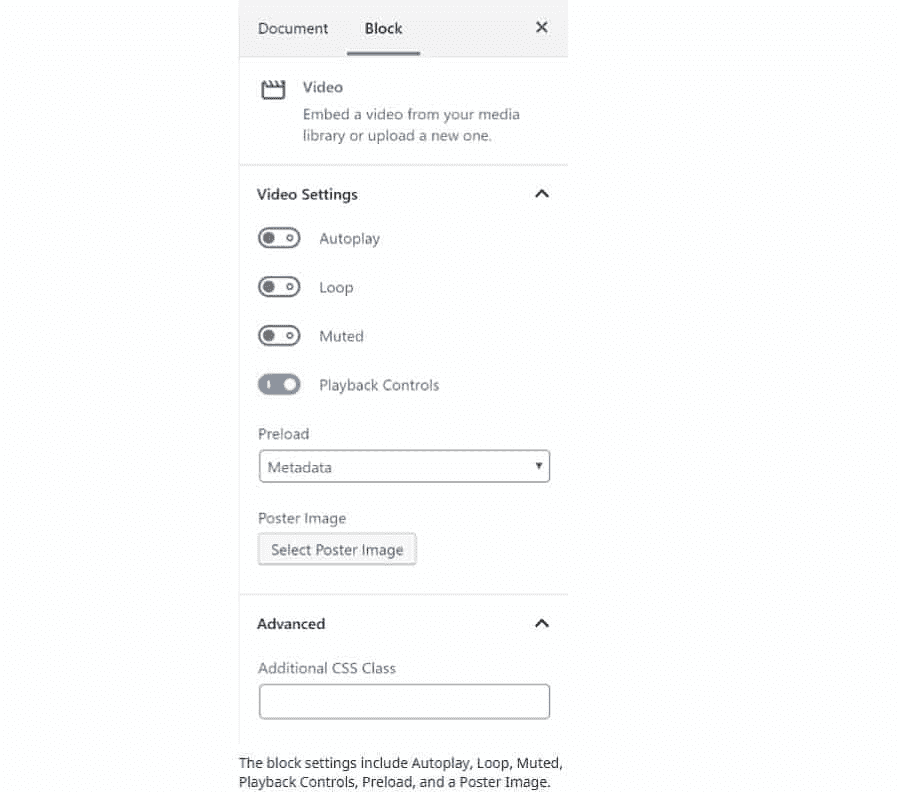

Embedding options in Jetpack

#### 骗局

*   缺少其他高级视频托管服务的高级功能。
*   没有固定的观众可以利用。

Jetpack 的缺点是它缺乏其他高级选项的高级功能。分析是相对基本的，你不能包括 CTA、[收集线索](https://kinsta.com/blog/wordpress-lead-generation/)或编辑视频。

与 YouTube 或脸书不同，它不是一个免费的选项，也不提供内置的观众来抵消负面影响。

#### 适用于:

*   已经订阅了 premium Jetpack 的 WordPress 网站所有者。

### 6.威斯特亚

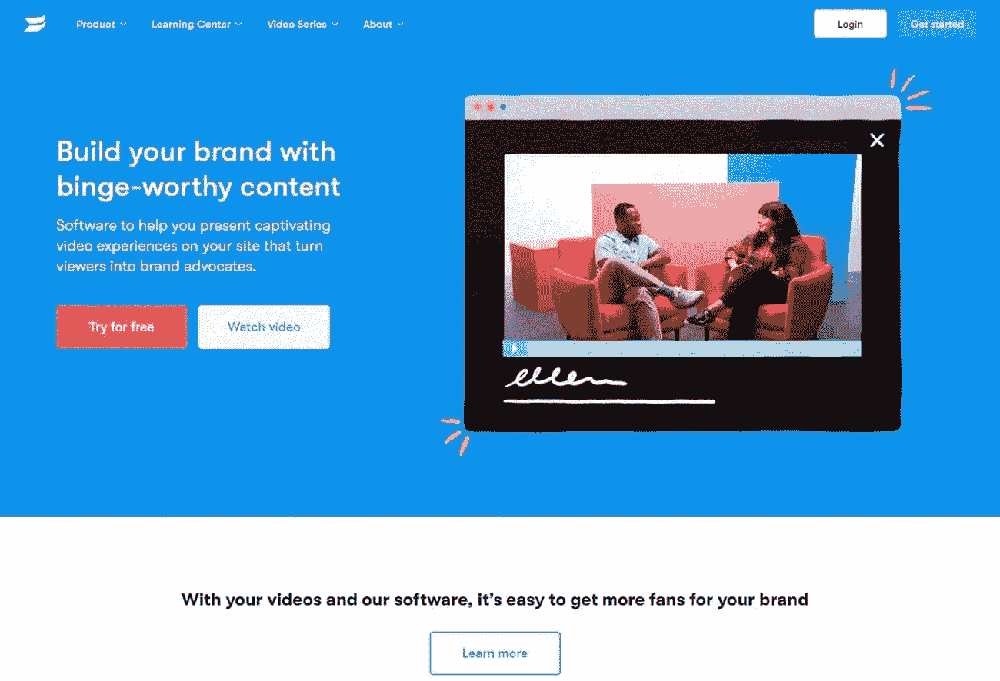

Wistia

与其说 Wistia 是一个视频托管网站，不如说它是一个 T2 的数字营销解决方案。当然，你可以用它来上传你的视频并嵌入到你的网站上，但这不是他们的主要卖点。

Wistia 提供高级功能，如在视频播放器中嵌入线索捕获表单或其他 CTA。

#### 视频上传指南和规范

*   **最高分辨率:** 4K (3840×2160 px)。
*   **支持的长宽比:**任何，有反应的玩家。
*   **最大文件大小:** 8 GB。
*   **最大视频时长:** 2 小时。
*   **总文件存储:**最多 10 个专业版视频(99 美元/月)，每个额外视频每月 0.25 美元。
*   **接受的视频格式:** .MP4(推荐)。MOV。AVI。WMV。FLV。MKV、3GPP 等。

#### 赞成的意见

*   没有广告。
*   100%可定制的嵌入式播放器。
*   突出显示您频道中的其他视频(无外部视频推荐)。
*   为脸书/Instagram 创建自定义受众。
*   从视频中捕捉线索。
*   定制品牌。
*   CRM 集成。

Wistia 的独特之处在于，它迎合了专业数字营销人员和数据驱动型企业的需求。它也是我们首选的视频托管平台，可以托管我们的大部分视频(例如: [MyKinsta demo](https://kinsta.com/feature-updates/mykinsta-demo/#how-to-access-the-mykista-demo) )。

您可以在网站上使用视频来为再营销活动创造定制受众。您甚至可以从您的视频播放器中捕捉线索，并将数据与一个 [CRM](https://kinsta.com/blog/wordpress-crm/) 整合。

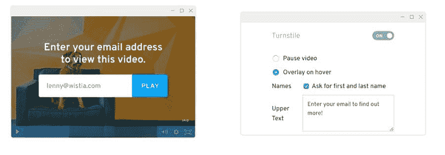

Wistia lead capture form

如果你努力为你的客户提供个性化的体验，Wistia 是一个很好的视频托管选择。

#### 骗局

*   价格昂贵。
*   没有固有的受众。

10 个视频每月 99 美元(T1)，Wistia 是这个列表中最贵的选择之一。但是对于[的企业](https://kinsta.com/blog/wordpress-enterprise/)和[成功的在线企业](https://kinsta.com/clients/)，这在他们的营销预算中甚至算不上什么。

#### 适用于:

*   具有个性化体验的数据驱动型企业。
*   [依赖销售线索](https://kinsta.com/blog/b2b-lead-generation/)和漫长销售过程的企业。
*   经验丰富的数字营销人员。

### 7.巫毒玩家

vooPlayer

vooPlayer 是另一个先进的视频托管服务，面向营销人员，而不是业余爱好者或个人博客。

它提供先进的视频见解，帮助您填充自定义受众，收集线索。这是一个将视频营销整合到您的营销和销售工作中的一体化解决方案。

厌倦了体验你的 WordPress 网站的问题？通过 Kinsta 获得最好、最快的主机支持！[查看我们的计划](https://kinsta.com/plans/?in-article-cta)

#### 视频上传指南和规范

*   **支持的来源:**脸书、YouTube、Vimeo、[亚马逊 S3](https://kinsta.com/knowledgebase/wordpress-amazon-s3/) 、 [Dropbox](https://kinsta.com/blog/saas-products/#8-dropbox) 等。
*   **最高分辨率:** 4K (3840×2160 px)。
*   **支持的长宽比:**任何，有反应的玩家。
*   **最大文件大小:**未列出最大文件大小。
*   **总文件存储:** 25GB 和 50GB 带宽，14 美元/月启动计划。
*   **接受的视频格式:** MP4(推荐)、Ogg、WebM、MOV、FLV(不推荐)等。
*   **支持 360°视频**

#### 赞成的意见

*   没有广告。
*   实惠。
*   可定制的品牌。
*   完全控制嵌入式视频播放器。
*   高级视频分析和热图。
*   用导联捕捉门捕捉导联。
*   通过按次付费入口获取视频观看费用。
*   通过视频安排比赛。
*   与谷歌、脸书和 Instagram 广告整合的受众生成器。

vooPlayer 提供了一个全面的工具箱，用于通过视频推动销售线索和收入。您可以完全自定义品牌和视频播放器，并使用它来增加观众，捕捉线索，甚至为您的观众举办比赛。

通过热图和高级[分析](https://kinsta.com/blog/google-analytics-alternatives/)深入了解用户与不同视频的互动方式。

如果你做视频的主要原因是营销和品牌推广，vooPlayer 应该在你的候选名单上。

#### 骗局

*   复杂。

由于所有增加的功能，vooPlayer 对于缺乏数字营销经验的企业主来说似乎有点难以招架。

#### 适用于:

*   具有个性化体验的数据驱动型企业。
*   依赖销售线索和漫长销售过程的公司。
*   经验丰富的数字营销人员。

### 8.布莱特科夫

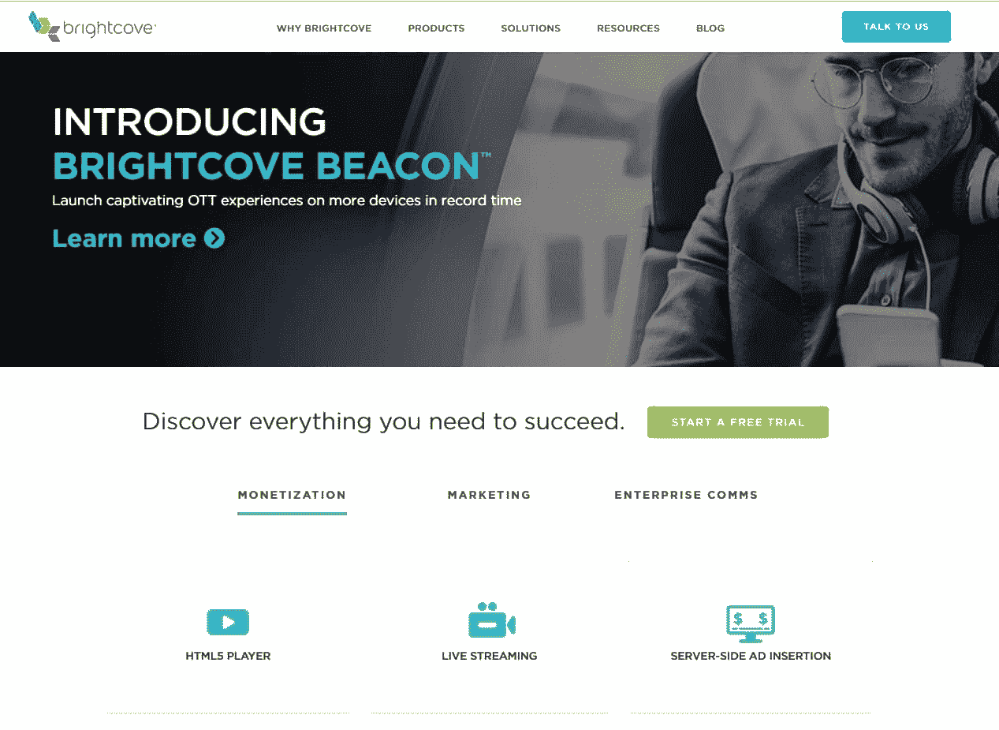

Brightcove

[Brightcove](https://www.brightcove.com/) 是一个企业视频托管解决方案，专注于与其他[营销自动化工具](https://kinsta.com/blog/saas-marketing/#email-marketing)和服务器端广告插入的集成。

这是一个可扩展的解决方案，被主要出版物和 50%的财富 500 强公司所采用。

#### 视频上传指南和规范

*   **最大分辨率:**无。
*   **支持的长宽比:**任何，有反应的玩家。
*   **最大文件大小:**无最大文件大小，经测试高达 100 GB 无问题。
*   **文件总存储量:**基于计划。
*   **接受的视频格式:** .MP4，.MOV。AVI。WMV。FLV。MKV、3GPP 等。

#### 赞成的意见

*   管理和销售您自己的视频广告库存。
*   直接传输到您的网站/应用程序。
*   企业友好型[内容管理系统](https://kinsta.com/knowledgebase/content-management-system/)。
*   高级营销自动化集成。

Brightcove 是真正的企业解决方案，将帮助您的组织在大规模营销和通信中集成视频。对于出版商，它提供了先进的服务器端广告插入，集成了主要的 DSP 解决方案。

#### 骗局

*   价格，他们的网站上没有定价模型。
*   复杂。

由于该平台是为企业设计的，因此对于小企业和个体创业者来说，它可能会很复杂，很难使用。

#### 适用于:

*   希望将数字视频纳入营销工作的企业。

### 9.SproutVideo

SproutVideo

SproutVideo 是另一个为企业设计的视频托管平台。

除了线索捕获表格、受众构建和高级视频分析之外，它还提供了[共享和协作工具](https://kinsta.com/blog/saas-products/#7-g-suite-email--collaboration-tools)。

#### 视频上传指南和规范

*   **最大分辨率:**无。
*   **支持的长宽比:**任何，有反应的玩家。
*   **最大文件大小:**高达 100GB。
*   **最大视频长度:**无限制。
*   **总文件存储:** 500GB，500GB 带宽(Seed 计划为 24.99 美元/月)。
*   **接受的视频格式:** .MP4，.MOV。AVI。WMV。FLV。MKV、3GPP 等。

#### 赞成的意见

*   从视频中捕捉线索。
*   借助高级视频分析获得更深入的见解。
*   用审计日志跟踪编辑。
*   基于角色的权限。
*   设计无限独特的视频播放器。
*   自定义播放列表。

你可以使用他们的在线创建器来设计无限独特的视频播放器。此功能允许您将每个视频播放器与网站上的特定页面相匹配，以实现无缝集成。

创建自定义播放列表，为您的客户创造一个引人入胜的旅程。它还提供线索捕捉和受众创建工具来帮助您的数字营销工作。

#### 骗局

*   复杂。
*   没有平台受众。

由于 seed 计划以每月 25 美元的价格提供了大部分必要的营销功能，SproutVideo 对于小企业和个体创业者来说是一个可行的选择。

但是，像 vooPlayer 和 Wistia 一样，它没有内置的受众，并且增加的功能对于没有经验的用户来说很难掌握。

#### 适用于:

*   依赖销售线索和漫长销售过程的公司。
*   经验丰富的数字营销人员。

### 10.Uscreen

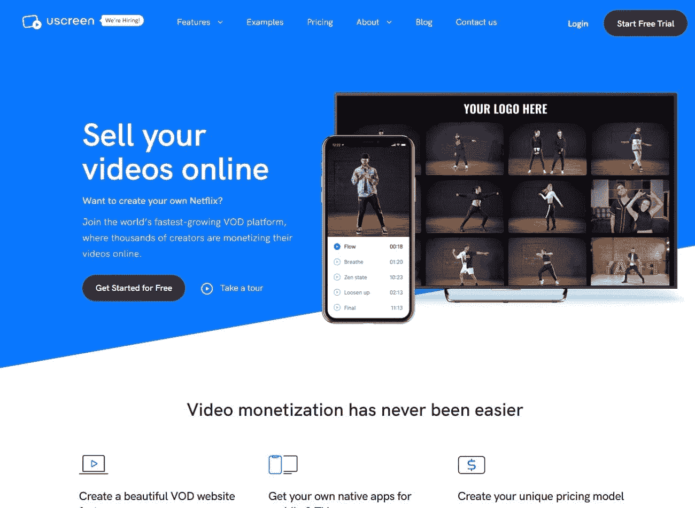

屏幕

us screen 与列表中的其他选项略有不同。这是一个视频点播或数字视频课程平台，旨在帮助教育工作者[从他们的在线视频中赚钱](https://kinsta.com/blog/spend-money-to-make-money/)。

你们中的一些人可能会因为这个原因寻找视频托管服务。

#### 视频上传指南和规范

*   **最大分辨率:** 1080p (1920×1080 px)。
*   **可接受的视频格式:** MP4。

#### 优点:

*   创建、组织和销售在线视频课程。
*   与手机和智能电视上的 OTT 应用集成。
*   定制定价模型。
*   平台中包含快速高清视频托管。

对于一些人来说，Uscreen 可能是比常规的 [WordPress 会员插件](https://kinsta.com/blog/wordpress-membership-plugins/)或 [LMS](https://kinsta.com/blog/wordpress-lms-plugins/) 更好的选择，因为视频托管是服务的一部分。

#### 缺点:

*   价格。

虽然这种解决方案使在线视频课程的计划、上传、管理和销售变得容易，但它比其他选择要贵一些。

基本计划起价为**$ 99/月**，上限为 300 名用户。

#### 适用于:

*   计划发布视频课程的教育工作者和企业主。

## 最好的视频托管解决方案是什么？

最佳视频托管提供商取决于您的视频托管和业务需求。

你想将无广告视频无缝集成到你的 WordPress 网站吗？Vimeo 拥有可定制的播放器和便宜的月费计划，可能是个不错的选择。如果你是付费的 Jetpack 用户，你也可以用它来满足你的视频需求。

您想要深入的分析、个性化和线索捕捉选项吗？Wistia 和 vooPlayer 带来了这一点。

Brightcove 是企业的最佳选择，Uscreen 是举办在线视频课程的最佳选择。

如果你想用顶级视频内容吸引新观众，那么 YouTube 和脸书是你最好的选择。

这个问题没有唯一正确的答案。一如既往，这取决于你想通过视频实现的目标和你的预算。

[Videos are taking over the internet as a great way to engage with your audience! Problem: hosting videos on your own site isn't the best option. Solution: video hosting platforms. Check out the best ones here! 📺👩🏻‍🎤Click to Tweet](https://twitter.com/intent/tweet?url=https%3A%2F%2Fbit.ly%2F2Apqgjy&via=kinsta&text=Videos+are+taking+over+the+internet+as+a+great+way+to+engage+with+your+audience%21+Problem%3A+hosting+videos+on+your+own+site+isn%27t+the+best+option.+Solution%3A+video+hosting+platforms.+Check+out+the+best+ones+here%21+%F0%9F%93%BA%F0%9F%91...&hashtags=videomarketing%2Cvideos)

## 摘要

在互联网上托管你的视频有很多选择。

对大多数视频制作者来说，YouTube 是首选，但对企业来说，它也有很多不利之处。嵌入选项可能看起来不专业，你的竞争对手可能会截取你的视频并在其中显示广告。

Vimeo 是一个非常便宜的选择，拥有时尚、可定制的播放器，以及专业创意人员的参与观众。

其他付费选项，如 Wistia、Brightcove 和 vooPlayer，为您提供分析、见解和直接从视频播放器中捕捉线索的能力。

要为你的企业找到正确的选择，你必须确定你的优先事项。

一个聪明的方法是在你的策略中结合不同的平台。你可以有一个付费的解决方案来托管你的视频，让你完全控制它们，同时利用免费的视频分享平台——如 YouTube 或脸书——作为一种有机增长你的影响力的方式。

现在轮到你了:你曾经尝试过视频托管平台吗？你最喜欢的选项是什么？请在评论中告诉我们！

* * *

让你所有的[应用程序](https://kinsta.com/application-hosting/)、[数据库](https://kinsta.com/database-hosting/)和 [WordPress 网站](https://kinsta.com/wordpress-hosting/)在线并在一个屋檐下。我们功能丰富的高性能云平台包括:

*   在 MyKinsta 仪表盘中轻松设置和管理
*   24/7 专家支持
*   最好的谷歌云平台硬件和网络，由 Kubernetes 提供最大的可扩展性
*   面向速度和安全性的企业级 Cloudflare 集成
*   全球受众覆盖全球多达 35 个数据中心和 275 多个 pop

在第一个月使用托管的[应用程序或托管](https://kinsta.com/application-hosting/)的[数据库，您可以享受 20 美元的优惠，亲自测试一下。探索我们的](https://kinsta.com/database-hosting/)[计划](https://kinsta.com/plans/)或[与销售人员交谈](https://kinsta.com/contact-us/)以找到最适合您的方式。