# 使用排名前 16 的视频搜索引擎查找任何视频

> 原文：<https://kinsta.com/blog/video-search-engine/>

每个人都喜欢视频——普通人每天花 [2.5](https://www.wyzowl.com/video-marketing-statistics/) 小时在线观看视频。企业主和营销人员应该注意:69%的消费者更喜欢观看解释产品或服务的视频。只有 18%的人希望阅读基于文本的文章，4%的人更喜欢信息图。

那么，如何找到自己想看的视频呢？

如果你正在制作视频，你如何确保互联网用户能找到你的视频内容？

就像你转向谷歌或其他搜索引擎来寻找令人兴奋的网站或博客帖子一样，你也可以使用搜索引擎来寻找视频。

本文向您展示了如何搜索视频，并介绍了顶级视频搜索引擎。

T3】

### 查看我们的视频指南[视频搜索引擎](https://www.youtube.com/watch?v=_X_RrmM5mxA)

## 如何搜索视频？

有几种类型的视频搜索引擎可以让你在网上找到视频。

> Kinsta 把我宠坏了，所以我现在要求每个供应商都提供这样的服务。我们还试图通过我们的 SaaS 工具支持达到这一水平。
> 
> <footer class="wp-block-kinsta-client-quote__footer">
> 
> 
> 
> <cite class="wp-block-kinsta-client-quote__cite">Suganthan Mohanadasan from @Suganthanmn</cite></footer>

[View plans](https://kinsta.com/plans/)

首先，你可以使用像谷歌这样的主要搜索引擎。所有顶级搜索引擎都有一个视频搜索选项，可以在网络上找到各种来源的视频。它们通常有过滤器来帮助您查找特定持续时间、质量等的视频内容。

你也可以使用内置于视频托管平台的搜索引擎，比如 [YouTube](https://kinsta.com/blog/embed-youtube-video-wordpress/) 。例如，你可以使用 YouTube 找到我们自己的 [Kinsta YouTube 频道](https://www.youtube.com/kinsta)上的信息视频。

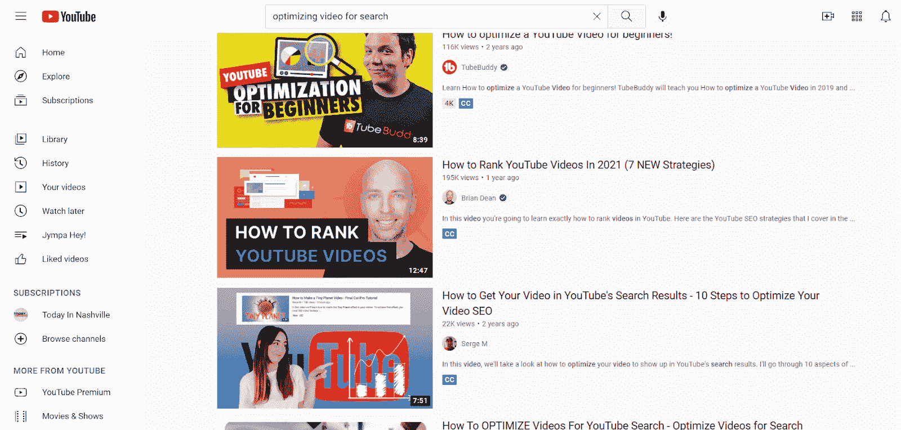

YouTube video search

最后还有[专门的视频搜索引擎](https://kinsta.com/blog/alternative-search-engines/)。例如，你可以使用 Social Searcher 搜索社交媒体上的视频，或者使用 Shutterstock 搜索股票素材。

[你知道平均每人每天花 2.5 小时在线看视频吗？👀确保你的观众通过这些视频搜索引擎找到你的📽 点击推文](https://twitter.com/intent/tweet?url=https%3A%2F%2Fkinsta.com%2Fblog%2Fvideo-search-engine%2F&via=kinsta&text=Did+you+know+that+the+average+person+spends+2.5+hours+per+day+watching+videos+online%3F+%F0%9F%91%80+Make+sure+your+audience+finds+yours+with+these+video+search+engines+%F0%9F%93%BD&hashtags=VideoContent%2CWebTips)

### 有没有反向视频搜索引擎？

你可能对谷歌和其他搜索引擎提供的[反向图片搜索](https://kinsta.com/blog/image-search-engine/)很熟悉。

反向图像搜索引擎可以让你输入一个图像文件来在线查找相同或相似的图像。

没有搜索引擎会反向搜索整个视频，但你可以使用反向图像搜索引擎来完成同样的事情。拍摄视频截图，或使用缩略图作为您的图像进行搜索。

我们推荐用于反向视频搜索的搜索引擎有:

*   谷歌
*   堆
*   核实
*   快门架

### 有移动视频搜索引擎吗？

移动设备占全球互联网流量的 [54.8%](https://kinsta.com/mobile-vs-desktop-market-share/#h-mobile-vs-desktop-traffic) 。

如果你从智能手机或平板电脑上进行视频搜索，你需要一个针对移动设备优化的搜索引擎，并且你希望视频能在你的设备上很好地显示。

幸运的是，我们名单上几乎所有的视频搜索引擎都有移动应用程序。谷歌应用程序可以很容易地进行常规视频搜索和反向视频搜索，从您的设备的相机或存储照片。

## 16 大视频搜索引擎

让我们来分析一下视频搜索引擎的 15 个最佳选择。

### 1.谷歌

谷歌提供顶级视频搜索引擎之一，这并不奇怪。

谷歌擅长各种搜索，包括视频。你可以在搜索栏下找到谷歌视频搜索，以及新闻和图片等其他搜索选项。

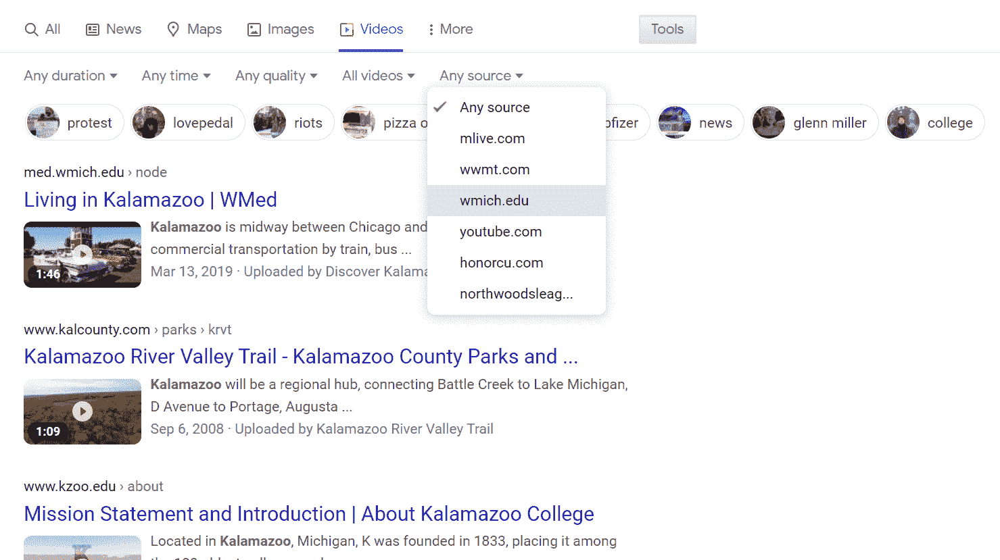

Google video search with filters

谷歌有许多过滤器，你可以用来找到合适的视频，包括:

*   视频的持续时间
*   发布视频的日期范围
*   质量(任何质量或高质量)
*   无论是隐藏字幕
*   来源(网站)

通过进入设置并选择高级搜索，你会得到更多的选项，比如搜索特定语言的视频。

2020 年，《华尔街日报》发表了一篇[报道](https://www.wsj.com/articles/google-steers-users-to-youtube-over-rivals-11594745232)称谷歌在搜索结果中将 YouTube 视频优先于竞争对手，但谷歌工程师否认了这一点。

#### 谷歌移动视频搜索

如上所述，您可以使用反向图像搜索引擎来搜索视频。

多亏了谷歌镜头，谷歌有了一个强大的移动解决方案。它可以让你用手机摄像头拍照，轻松裁剪，并找到相似的图像和视频。

### 2.油管（国外视频网站）

YouTube 不是传统的视频搜索引擎，因为它只会在 YouTube 上搜索视频。

但是考虑到每分钟有 [500+](https://blog.youtube/press) 小时的内容被[上传到 YouTube】，你很有可能在这个平台上找到你想要的东西。](https://kinsta.com/blog/how-to-create-a-youtube-channel/)

谷歌拥有 YouTube，所以它的搜索能力是一流的。

和谷歌视频搜索一样，YouTube 允许你根据时长和发布日期进行过滤。您还可以搜索以下类别的视频:

*   活着
*   4K
*   硬盘(hard disk)
*   字幕/抄送
*   知识共享
*   360°
*   VR180
*   三维（three dimension 的缩写）
*   直接热轧制
*   位置
*   购买

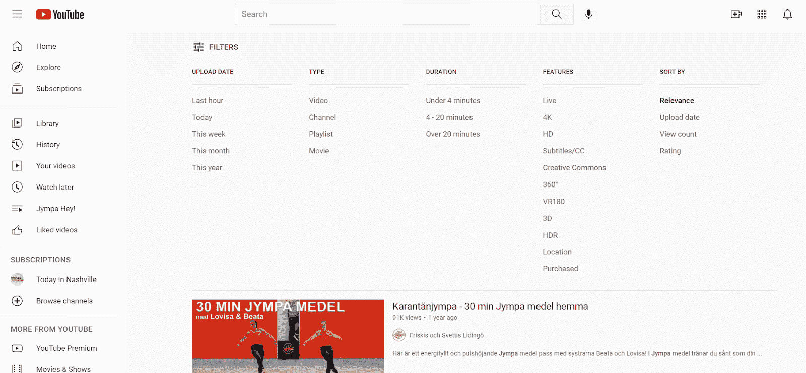

YouTube video search filters

除了视频，您还可以搜索频道、播放列表和电影。

### 3.堆

谷歌是一个比必应更受欢迎的搜索引擎，T2 的市场份额为 87%，而必应只有 7%。

但说到视频，你不应该放弃必应。在某些方面，必应视频搜索甚至超过了谷歌。

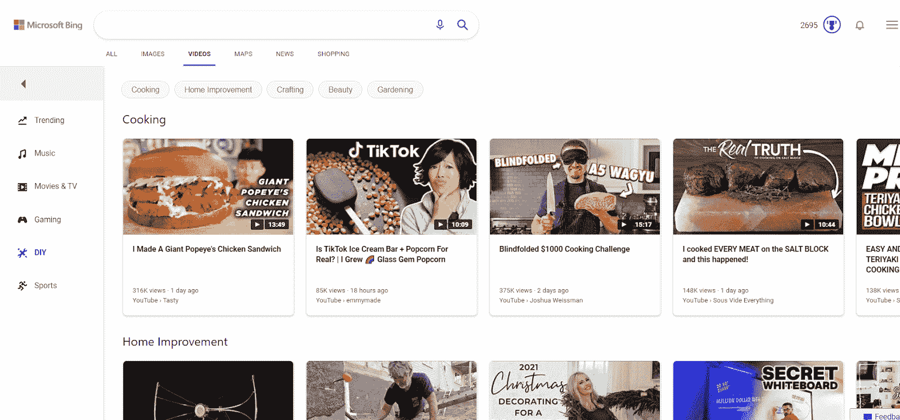

Bing video search engine

像谷歌一样，必应的过滤器包括持续时间、日期和来源。

它们还包括质量——但谷歌只搜索“任何质量”和“高质量”，必应有以下选项:

*   全部
*   低于 360 便士
*   360p 或更高
*   480p 或更高
*   720p 或更高
*   1080p 或更高

Bing 还可以让你根据视频是免费还是付费进行过滤。

必应视频搜索引擎结果页面(SERP)比谷歌的更直观，当你悬停在其上时，大缩略图会显示几秒钟的预览。你可以直接在必应上观看视频，而不是点击链接就被带到视频网站。

### 4.达克达克戈

不是每个人都喜欢使用传统的搜索引擎，比如谷歌和必应。

对隐私的担忧导致许多人转向 DuckDuckGo。该搜索引擎不会跟踪您的搜索历史，会阻止外部跟踪器，并在可能的情况下将您连接到网站的加密版本。

如果你不想让你的数据落入谷歌之手，我们有好消息:DuckDuckGo 也有视频搜索。

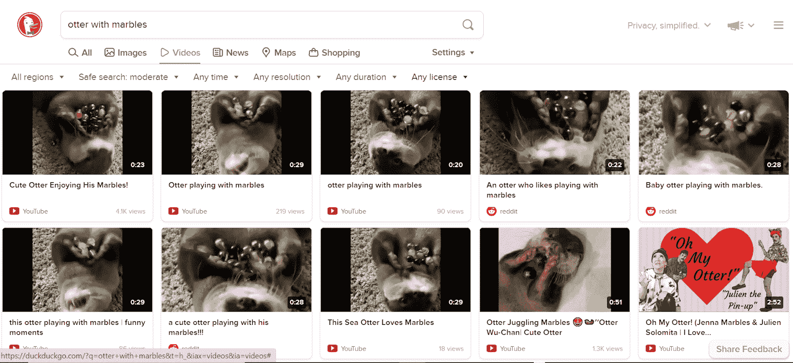

DuckDuckGo video search engine

[DuckDuckGo](https://kinsta.com/blog/duckduckgo-privacy/) 让你按视频时长、分辨率、日期和许可类型(知识共享或 YouTube 标准)进行搜索。

这项服务的一个巧妙之处在于，你可以改变搜索区域，以查看你所选择国家的搜索结果。

### 5.日常运动

Dailymotion 是一个视频托管服务，拥有超过 [3 亿](https://www.businesswire.com/news/home/20200417005588/en/%E2%80%98One-World-Home%E2%80%99-Digital-Global-Special-stream)用户，仅次于 YouTube。

像 YouTube 一样，这个“搜索引擎”只会返回来自其平台的结果。搜索 YouTube 和 Dailymotion 以获得更广泛的结果列表。

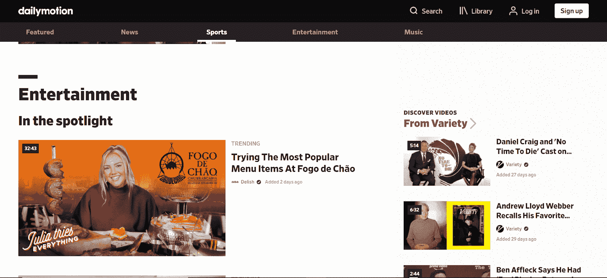

Dailymotion video platform

Dailymotion 的过滤器仅限于持续时间和上传日期。

### 6.脸谱网

数百万视频的另一个来源是脸书。

脸书是互联网第三大网站，仅次于谷歌和 YouTube。Facebook Watch 是脸书分享和观看视频的网站，每月有超过 12.5 亿人观看。

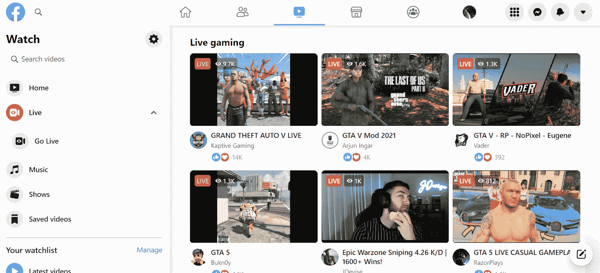

Facebook Watch

您可以从观看页面搜索视频，或者在主搜索栏中输入一个词，然后选择“视频”视频可以按发布日期过滤，你可以选择只看直播视频、音乐、节目或你自己保存的视频。

### 7.狗桩

Dogpile 创建于 1996 年，作为一个元搜索引擎，它将来自雅虎的搜索结果整合在一起。、Lycos、Excite、WebCrawler、Infoseek、AltaVista、HotBot、WhatUseek、万维网蠕虫。

虽然一些老派的搜索引擎已经不存在了，但 Dogpile 仍然存在。今天，它带给你搜索引擎的结果，包括谷歌，雅虎！，还有 Yandex。

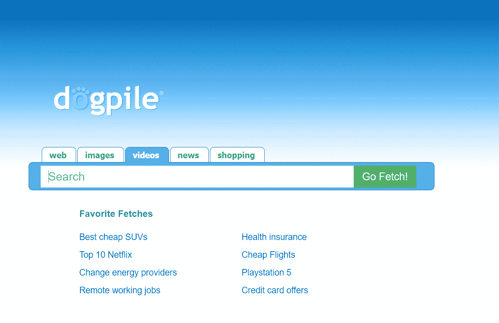

Dogpile search engine

Dogpile 的视频搜索没有过滤选项，但它可以是一种很好的方式来确保你从各种来源获得结果。

### 8.维欧

Veoh 是一个视频分享网站，成立于 2005 年，与 YouTube 同年。在 2000 年代中期，它是互联网上最受欢迎的视频网站之一，但它失宠了，最终申请破产并易主。

如今，Veoh 无法与 YouTube 和 Vimeo 等网站竞争，而且它的许多内容都很陈旧。但它确实有一个很酷的特点，值得列入这个名单。

除了时长和类型，Veoh 还允许你通过视频语言和字幕语言进行搜索。所以，如果你愿意，你可以找到所有保加利亚语的喜剧视频，并配有英语字幕。

我们列表中的其他搜索引擎都没有这样做。

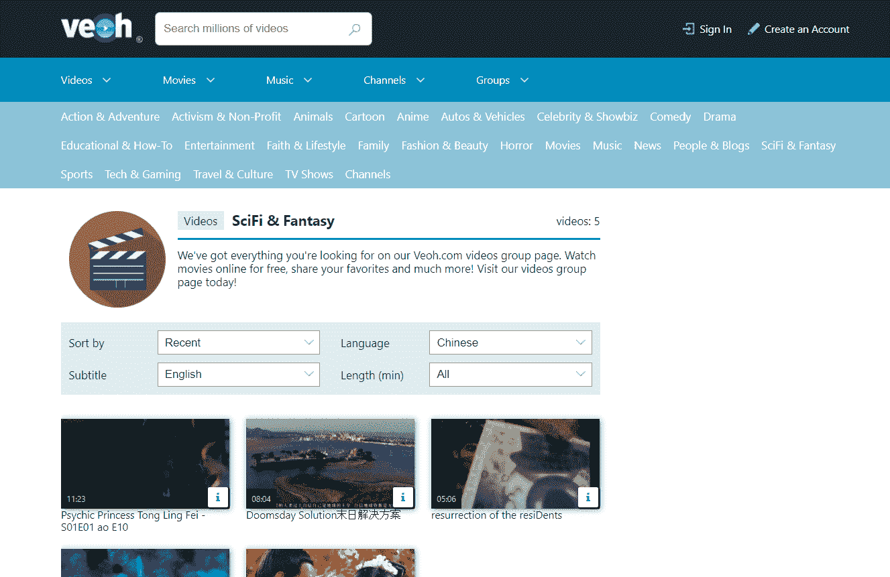

Veoh video hosting website

Veoh 上的视频包括用户生成的内容以及电影和电视节目。

### 9.贝里里

我们已经提到了几个搜索引擎，你可以用它们来做反向视频搜索。它们都要求你使用视频中的图像。

## 注册订阅时事通讯

### 想知道我们是怎么让流量增长超过 1000%的吗？

加入 20，000 多名获得我们每周时事通讯和内部消息的人的行列吧！

[Subscribe Now](#newsletter)

Berify 是一个非常全面的反向图片搜索，因为它会在谷歌、必应和其他主要搜索引擎上寻找你的视频截图。

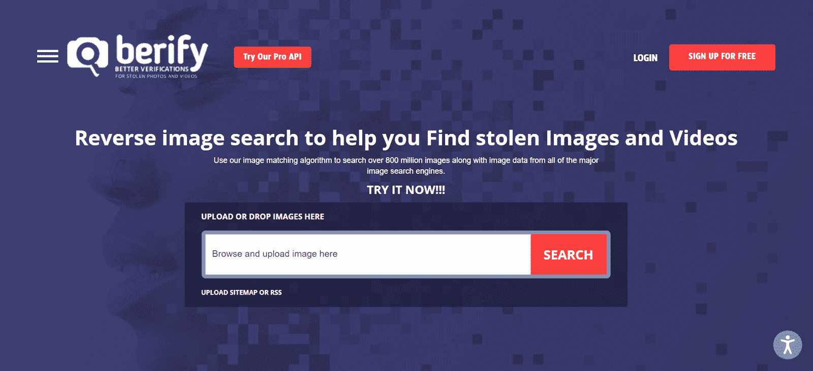

Berify reverse video search engine

你必须创建一个帐户才能使用 Berify。免费计划允许你反向搜索五张图片。

### 10.Vimeo

Vimeo 是仅次于 YouTube 和 Dailymotion 的第三大视频托管平台。

Vimeo 没有 YouTube 那么多视频，但它允许更高的视频和音频质量。有时，你可以在 Vimeo 上找到比特率更高的两个平台上的相同视频。

Vimeo video platform

在 Vimeo 上搜索视频时，您可以通过以下方式进行过滤:

*   种类
*   视频时长
*   上传日期
*   视频是否直播
*   视频是不是 360
*   视频是否是“员工精选”
*   免费或付费
*   许可证类型

Vimeo 对于营销和内容创作者来说也是一个极好的选择。

### 11.社交搜索者

脸书、Twitter、Instagram、Tumblr 等社交媒体平台都有视频内容。

社交搜索器让你一次搜索多个平台。

你可以从 11 个来源中选择你想要搜索的，并根据情绪(帖子的正面词或负面词更多)和语言进行过滤。

Social Searcher 还提供对聚合搜索结果的分析，因此您可以看到谁是最热门的发帖者、视频帖子的典型情绪、帖子中的常见关键词等等。

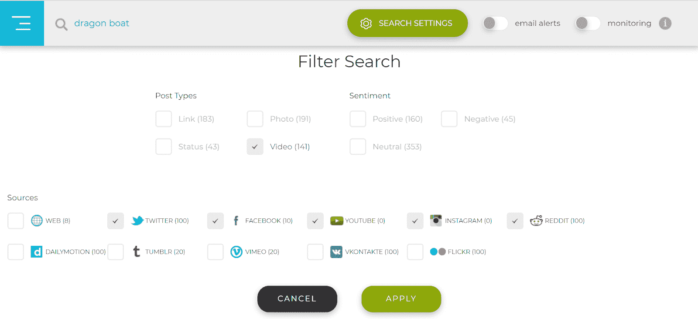

Social searcher social media search engine

社交搜索错过了很多视频。要获得最全面的结果，请单独搜索每个平台。

但社交搜索是一个很好的方式来查看所有社交媒体上有哪些关于某个主题的视频。

### 12.Ecosia

如果你坐在电脑屏幕前也能保护环境，会怎么样？

Ecosia 让这一切成为可能。Ecosia 使用来自你搜索的[广告收入](https://kinsta.com/blog/wordpress-advertising-plugin/)在需要的地方种树。根据 Ecosia 的数据，种一棵树大约需要 45 次搜索。

微软必应支持 Ecosia，所以你的结果可能是相似的。

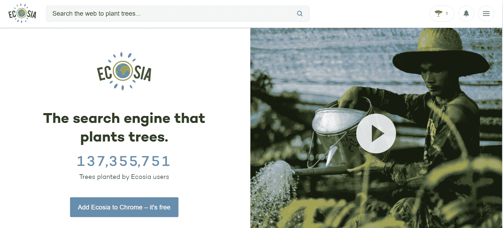

Ecosia

您可以按分辨率、持续时间和发布时间进行过滤。

一个计数器告诉你在 Ecosia 用户的帮助下种植了多少棵树。

### 13.Yandex

Yandex 是俄罗斯最大的搜索引擎，也是仅次于谷歌、必应和雅虎的世界第五大搜索引擎。(由 Bing 提供支持)和百度。

Yandex 是专门为俄罗斯市场创建的，因此你可能会得到与谷歌或必应略有不同的结果组合。但是可以用英文 Yandex。

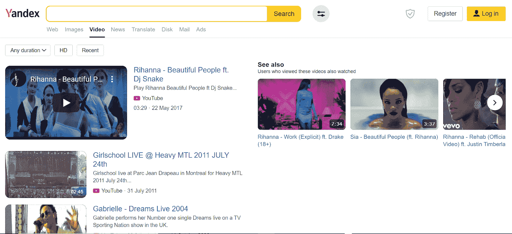

Yandex

当你在 Yandex 上搜索视频时，你可以根据时长、质量(高清与否)和发布时间(最近与否)进行过滤。

所有的 Kinsta 托管计划都包括来自我们资深 WordPress 开发者和工程师的 24/7 支持。与支持我们财富 500 强客户的同一个团队聊天。查看我们的计划！

搜索引擎还提供了“请参阅”部分。观看这些视频的人也观看了您的 SERP 中的视频。Yandex 还列出了一个可供选择的搜索引擎清单。

### 14.百度(全球最大的中文搜索引擎)

百度是最大的中文搜索引擎，也是全球第四大搜索引擎。中国的竞争甚至还没有接近，百度声称拥有 [70.5%](https://www.adchina.io/2020/09/14/guide-to-baidu-sem-ppc-search-advertising/) 的市场份额，而谷歌只有 1.6%

百度没有英文版，即使你搜索一个英文关键词，结果也会严重偏向中文来源。但如果你对中国视频感兴趣，或者想了解一下中国市场，百度是你最好的选择。

你可以用谷歌翻译来理解界面。

Baidu

百度没有视频过滤选项。

### 15.瑞士奶牛

Swisscows 是一个专注于隐私的搜索引擎，提供视频搜索。和 DuckDuckGo 一样，它不会收集你的数据，也不会创建搜索历史。

它也不索引或显示色情内容。

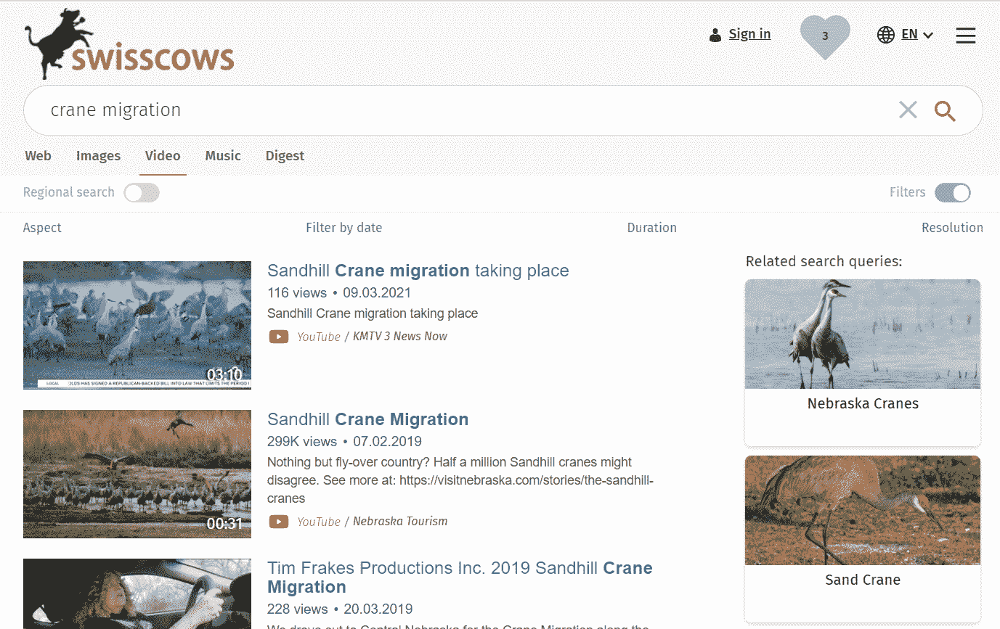

Swisscows

您可以按日期、持续时间、质量和宽高比(宽屏或标准)进行过滤。

### 16.快门架

你的网站需要一个免版税的视频吗？

[Shutterstock](https://www.shutterstock.com/royalty-free/reverse-image-search-for-video) 让你搜索和购买股票素材。

您也可以根据图像搜索视频。将你的图片拖放到搜索栏中，Shutterstock 会推荐相似主题的股票视频。

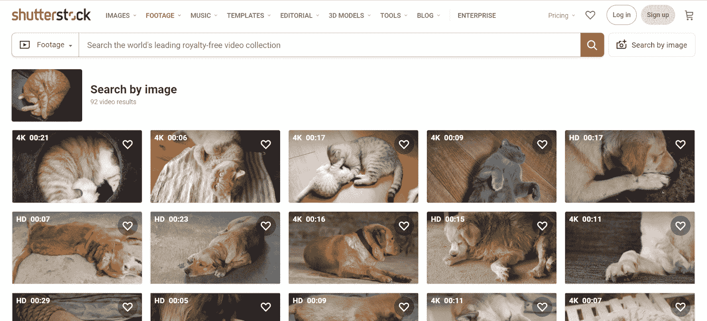

Shutterstock

## 最好的视频搜索引擎是什么？

最好的视频搜索引擎取决于你的需求。以下是我们的建议:

*   **最佳综合视频搜索引擎:**必应
*   **最佳移动视频搜索引擎:**谷歌
*   **最佳反向视频搜索引擎:** Berify
*   最佳私人搜索引擎: DuckDuckGo
*   **最佳社交媒体视频搜索引擎:**社交搜索引擎

## 如何为搜索引擎优化我的视频？

现在，我们已经介绍了所有可以在网上找到视频的方法，让我们来谈谈如何确保其他人找到您的视频。

第一步是决定在哪里上传你的视频。

### 选择托管平台

大多数人在决定将视频放在哪里时，会立即想到 YouTube。也许你也会考虑像 Vimeo 这样的 YouTube 竞争对手。

这些托管服务对于建立品牌知名度非常有用。许多人直接去 YouTube 搜索视频，你的内容可能会出现在谷歌搜索中。

但是如果你的目标是增加网站的流量，YouTube 可能不是最好的选择。

问题是很多人会去 YouTube 而不是你的网站看你的视频。即使你[将视频](https://kinsta.com/blog/embed-youtube-video-wordpress/)嵌入到你的网页中，你本质上也是在和自己竞争。

如果谷歌或其他搜索引擎在你的网页前显示 YouTube 的结果，流量就会流向 YouTube。

为了确保视频流量到达你的网站，你可以选择将你的视频放在像 Wistia 或 Brightcove 这样的服务上。这些解决方案旨在帮助您将视频放到您的网站上。

### 视频搜索引擎优化

就像你的网站本身一样，你的视频应该遵循 SEO 最佳实践。

#### 关键词研究

从研究你希望你的视频排名的关键词开始。如果你不熟悉关键词研究技术，你可以遵循我们的[分步指南](https://kinsta.com/blog/keyword-research/)。

您将在视频的元数据中使用这些关键词，如标题和描述。一些视频托管服务有一个地方可以输入您希望与您的视频相关联的关键词。

确保将范围缩小到几个关键术语——在视频标题中塞进 15 个关键词不会有助于它被发现。

#### 副本

转录你的视频有几个重要的原因。

首先，它有助于搜索引擎理解你的内容。谷歌听不到视频中的关键词，但它可以阅读文字记录。

它还能让更多的观众观看您的视频。在一些视频服务中，脚本被用来创建字幕。在其他情况下，文字记录会出现在视频下方，这样人们就可以跟着读了。

#### 极小的

大多数视频搜索引擎将搜索结果显示为缩略图。视频托管服务通常会让您选择将哪个图像用作缩略图。

如果你想让人们在 SERP 中点击你的视频，缩略图应该是令人兴奋和吸引人的。它还应该给出一些视频是关于什么的指示。

#### 网页优化

如果你把你的视频放在你的网页上，那么这个网页也应该针对搜索引擎进行优化。

查看我们的 [58 个增加有机流量的技巧](https://kinsta.com/blog/wordpress-seo/)获取最新的 SEO 建议。

### 为什么搜索引擎找不到我的 YouTube 视频？

你制作了一个很棒的视频，上传到 YouTube(或另一个托管服务)，然后急切地等待在 Google SERP 上看到它。

但它不在那里。哪里出了问题？

可能你只需要等几天。谷歌可能还没有索引你的全新视频。

如果已经有一段时间了，请检查您的视频的标题、描述和标签，以确保它们与您想要的搜索词相匹配。如果您还没有上传成绩单，请上传。

最后，查看你的频道的 YouTube 工作室。在“内容”下，查看您的视频是否被列为公开视频，或者它们是否有任何限制。

[69%的消费者更喜欢看解释产品或服务的视频——所以要确保你的视频内容能被看到🎥](https://twitter.com/intent/tweet?url=https%3A%2F%2Fkinsta.com%2Fblog%2Fvideo-search-engine%2F&via=kinsta&text=69%25+of+consumers+prefer+to+watch+a+video+explaining+a+product+or+service-+so+make+sure+your+video+content+gets+seen+%F0%9F%8E%A5&hashtags=VideoContent%2CWebTips)

## 摘要

如果你在网上找视频，你有很多搜索选项。所有主要的搜索引擎(加上相当多的小众解决方案)都提供视频搜索。

想为你的网站制作专业质量的视频吗？试试这些免费的视频编辑器。

*你还有其他喜欢的视频搜索引擎吗？请在下面的评论中分享给我们的社区！*

* * *

让你所有的[应用程序](https://kinsta.com/application-hosting/)、[数据库](https://kinsta.com/database-hosting/)和 [WordPress 网站](https://kinsta.com/wordpress-hosting/)在线并在一个屋檐下。我们功能丰富的高性能云平台包括:

*   在 MyKinsta 仪表盘中轻松设置和管理
*   24/7 专家支持
*   最好的谷歌云平台硬件和网络，由 Kubernetes 提供最大的可扩展性
*   面向速度和安全性的企业级 Cloudflare 集成
*   全球受众覆盖全球多达 35 个数据中心和 275 多个 pop

在第一个月使用托管的[应用程序或托管](https://kinsta.com/application-hosting/)的[数据库，您可以享受 20 美元的优惠，亲自测试一下。探索我们的](https://kinsta.com/database-hosting/)[计划](https://kinsta.com/plans/)或[与销售人员交谈](https://kinsta.com/contact-us/)以找到最适合您的方式。