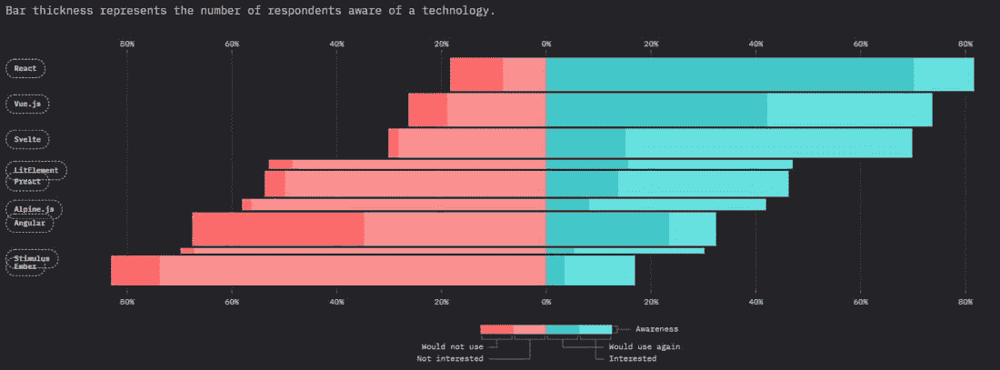

# 关于 Vue.js 前端框架你需要知道的 10 件事

> 原文:# t0]https://kinta . com/blog/view-js/

随着[前端 JavaScript 框架](https://kinsta.com/blog/javascript-libraries/)的不断崛起，包括新的 Vue.js 3，跟上它们并了解它们的所有新特性变得至关重要。

在本文中，我们将探索 Vue.js 3 及其[新添加的特性](https://blog.logrocket.com/new-features-in-vue-3-and-how-to-use-them-2/)。这些最新的添加使得 Vue.js 更加健壮，使它成为您下一个项目要考虑的一个很好的框架。您将详细了解关于 Vue.js 您应该知道的 10 件事，以及它将如何帮助您交付可扩展的高性能前端应用。

准备好了吗？我们走吧！

## Vue.js 是什么？

根据 Vue.js 创始人尤雨溪的说法:

> Vue.js 是一个更灵活、更少固执己见的解决方案。它只是一个界面层，所以你可以在 pages 中将其用作一个轻量级功能，而不是一个成熟的 SPA。”

他想创建一个像 Angular 一样强大的前端框架，但是也要“更轻”和更灵活，没有 Angular 带来的所有不必要的插件和概念。

其结果是 Vue.js，这是当今使用的最流行的前端框架之一。




Vue.js is the second most popular frontend framework. (Source: [State of JS 2020](https://2020.stateofjs.com/en-US/technologies/front-end-frameworks/#front_end_frameworks_experience_marimekko))


[Good news: the new features added to Vue.js 3 make it an even better choice for your next project 😄 Check them out in this guide ⬇️Click to Tweet](https://twitter.com/intent/tweet?url=https%3A%2F%2Fkinsta.com%2Fblog%2Fvue-js%2F&via=kinsta&text=Good+news%3A+the+new+features+added+to+Vue.js+3+make+it+an+even+better+choice+for+your+next+project+%F0%9F%98%84+Check+them+out+in+this+guide+%E2%AC%87%EF%B8%8F&hashtags=WebDev%2CJavaScript)

## 开发者为什么使用 Vue.js

不同的原因促使开发人员使用特定的技术。我们来讨论一下为什么我们认为你应该学习 Vue.js。

首先，Vue.js 是大多数开发人员可以直接进入的最简单的框架之一，因为这个框架使用 JavaScript。所以任何人只要有基本的 JavaScript 知识，就可以用 Vue.js 进行开发。

Vue CLI 工具与其他前端开发工具[相结合](https://kinsta.com/blog/web-development-tools/)使得设置 Vue.js 变得轻而易举。默认情况下，它设置了一些功能，但是您也可以用一个干巴巴的(不要重复自己)逻辑和结构来构建代码。

Vue.js 还内置了反应能力。这意味着在 [Angular framework](https://kinsta.com/blog/angular-vs-vue/) 上流行的实时功能在 Vue.js 中变得轻而易举。例如，您可以在 Vue.js 应用程序中轻松应用简单的指令，如`v-if`。

接下来，我们来讨论一下 Vue.js.
的主要利弊

## Vue.js 的利与弊

Vue.js 是当今使用的第二流行的框架。让我们看看是什么让 web 开发人员坚持下来，又是什么把他们推开。

### Vue.js Pros .检视. js Pros

我们将从探索 Vue.js 的积极方面开始。

#### 微小的尺寸

Vue.js 有一个非常小的可下载大小，大约 18 KB，与其他大尺寸的框架相比是非常优秀的。然而，在这样的规模下，Vue.js 将对你的前端应用程序的 SEO 和 [UX 产生积极的影响。](https://kinsta.com/blog/website-usability-testing/)

#### 单文件组件和可读性

Vue.js 使用基于组件的架构，从而将大块的代码分成更小的组件。此外，在 Vue.js 中，一切都是组件，每个组件都用 HTML、CSS 和 JavaScript 编写，从而鼓励可读性和简单性。

#### 固体工具系统

Vue.js 支持大量开箱即用的前端开发工具，几乎不需要您进行任何配置。比如 Vue.js 支持 Babel、 [Webpack](https://kinsta.com/developer-roles/coding-skills-at-kinsta/) 等工具。此外，它还提供单元测试、端到端测试库、灵活易用的路由系统、状态管理器、服务器端呈现(SSR)等等。

#### 使用方便

如果你以前用过 Vue.js，你会同意它非常容易使用。它使通常的 web 开发方法现代化，使得任何初学者都可以很容易地投入其中，并且只需少量的练习就能感到舒适。

### vue . js Cons(检视. js cons)

现在我们已经讨论了优点，让我们来探索 Vue.js 的缺点。

#### 反应复杂性

Vue.js 中双向绑定的实现是管理 Vue.js 组件的便捷工具。双向绑定指的是在一个组件类和它的模板之间共享数据，它的开发是为了如果一个位置的数据发生变化，它会自动更新其他位置。

然而，当反应性系统仅重新呈现那些被触发的数据块时，有一个关于反应性如何工作的问题。有时，在数据读取过程中会出现一些错误，因此需要对数据进行扁平化处理。你可以在 Vue.js 的网站上通读这个已知问题以及它是如何解决的[。](https://vuejs.org/v2/guide/reactivity.html)

#### 语言障碍

最初，Vue.js 主要被中国人采用，小米和阿里巴巴等大公司帮助推广该框架，并在劳动力市场创造需求。然而，随着许多中国公司的大量采用，许多论坛、讨论频道等主要是中文的，使得非母语开发人员很难采用。

时至今日，随着 Vue.js 发展到在许多语言中加入了[支持，这种情况已经不复存在，但仍有一些语言比其他语言受到的支持要少。](https://kinsta.com/help/multilingual-support/)

#### 过度灵活的风险

如上所述，Vue.js 非常灵活易用。因此，由于企业团队中的每个人都可能对如何做事情有不同的看法，所以很容易到处都有大量的意大利面条式代码。

从上面讨论的 Vue.js 的优缺点来看，你可能已经发现了一些你喜欢的特性和一些不适合你的特性。

## 关于 Vue.js 你应该知道的 10 件事

以下是你需要知道的关于 Vue.js 的十件事，以及为什么知道它们是必要的。

### 计算属性

计算属性是 Vue.js 中最常用的功能之一。计算属性使您能够创建可以修改、操作的属性，并以有效和可读的方式显示数据。

当您想要重复许多小方法，例如格式化、值的改变，或者在某些情况下需要触发的大过程时，它就派上了用场。

计算属性有助于移除模板中过多的逻辑。过多的这种逻辑会导致您的代码变得臃肿，难以快速维护。

假设您想将字符串格式化为大写字母，您可以这样做:

```
<template>
  <div>
    <p> I love {{ value.toUpperCase() }} </p>
  </div>
</template> 
```

如果需要在 50 个不同的地方改变`value`变量会怎么样？臃肿，对吧？嗯，[计算属性](https://kinsta.com/blog/python-object-oriented-programming/#2-inheritance)在这里帮忙:

```
<template>
  <div>
    <p> I love {{ value }} </p>
  </div>
</template>
<script>
  export default {
    computed:{
      value(){
        return this.value.toUpperCase()
      }
    }
  }
</script>
```

你可以很容易的把`toUpperCase()`改成`toLowerCase()`，它会从一个点反映到全身。

### 事件处理

Vue.js 通过使用`$emit`和`v-on`，让孩子和家长的沟通变得轻而易举。处理组件层次结构之间的通信变得轻松而直接。

`$emit`函数接受两个参数:一个名称字符串和一个要发出的可选值。

在子组件上使用`v-on:event-name`来接收父组件发出的事件:

```
<template>
  <section>
    <button @click="onClick">Add </button>
  </section>
</template>
<script>
export default {
  name: "AddEvent",
  methods: {
    onClick() { 
      this.$emit('add', this.data);
    }
  }
}
</script>
```

一旦您触发了`Add`按钮，`onClick`方法就会触发`$emit`事件，该事件会向监听`add`事件的子组件发出`add`事件。

让我们来看看如何倾听一个事件:

```
<template>
  <section>
  <p v-show="showSaveMsg">This component is listening to the ADD event</p>
  <add-event v-on:add="onAdd"></add-event>
  </section>
</template>
<script>
export default {
  data(){
    return {
      showSaveMsg: false
    }
  },
  components:{
    AddEvent: () => import('./AddEvent')
  },
  methods: {
    onAdd() { 
        this.showSaveMsg = true;
    }
  }
}
</script>
```

上面的代码监听`add`事件，并通过将`showSaveMsg`的值更改为`true`来做出响应，这再次显示了消息。

## 注册订阅时事通讯


### 想知道我们是怎么让流量增长超过 1000%的吗？

加入 20，000 多名获得我们每周时事通讯和内部消息的人的行列吧！

[Subscribe Now](#newsletter)

### 延迟加载/异步组件

[惰性加载](https://kinsta.com/blog/wordpress-lazy-load/)是 Vue.js 的最佳性能技巧之一，其中组件是异步或按需添加和呈现的，这将显著减少文件大小、HTTP 请求-响应时间等。

延迟加载是通过 Webpack 动态导入实现的，它也支持代码拆分。

Vue.js 允许组件的延迟加载，可以通过以下脚本全局实现:

```
import Vue from "vue";
Vue.component("new-component", () => import("./components/NewComponent.vue")); 
```

您可以使用如下组件在本地实现它:

```
<template>
  <div>
    <component></component>
  </div>
</template>
<script>
export default {
  components: {
    'Component': () => import('./Component')
  }
}
</script>
```

### 全球组件

我们可以通过全局组件在 Vue.js 中实现显著的可重用性，您只需注册一次组件，然后就可以在 Vue.js 实例中的任何地方使用它。

全局组件是一个重要的特性，可以节省您每次单独注册组件的时间，但是它很容易被滥用于全局注册所有组件。全局注册所有组件很容易导致较大的构建规模，导致较差的 SEO 和较慢的[页面加载时间](https://kinsta.com/learn/page-speed/)。

确保总是注册在您的项目中有许多用例的全局组件，如下所示:

```
import Vue from "vue";
Vue.component("new-component", () => import("./componetns/NewComponent.vue"));
```

### 单一文件组件

Vue.js 最强大的一个功能就是组件；它帮助您扩展基本的 HTML 元素、CSS 和 JavaScript 来封装可重用的代码。

组件可以帮助将大型项目分解成更小的、可重用的部分，我们可以在整个项目中扩展这些部分，从而鼓励[软件工程](https://kinsta.com/software-engineering-statistics/)的 DRY(不要重复自己)原则。

它可以为大型项目提供组织和封装，可重复使用的代码，并可以分成`.vue`文件。

```
<template>
  <section>
    <button @click="onClick">Add</button>
  </section>
</template>

<script>
export default {
  name: "CustomButtom",
  methods: {
    onClick() { 
      this.$emit('add', this.data);
    }
  }
}
</script>

<style scoped>
  button{
    /** Button Styles */
  }
</style>
```

上面的脚本创建了一个定制的按钮组件，我们可以在我们的项目中重用它。每个组件都有自己的 HTML、CSS 和 JavaScript。

### 测试

Vue.js 提供了一个最健壮的测试库，使得用 Jest 和 Mocha 进行单元测试或者端到端的[测试](https://kinsta.com/blog/performance-testing-tools/)变得轻而易举，几乎不需要配置。

使用这些工具进行快速测试对您来说是值得的。因此，让我们在下面探索安装、设置和测试一个演示项目。

如果您正在使用[推荐的 Vue CLI 工具](https://cli.vuejs.org/)来设置您的项目，请运行以下命令:

厌倦了没有答案的劣质 WordPress 托管支持？试试我们世界一流的支持团队！[查看我们的计划](https://kinsta.com/plans/?in-article-cta)

```
vue add unit-jest //to run unit test with jest

npm install --save-dev @vue/test-utils 
```

接下来，在设置之后，包含下面的代码，它演示了如何测试一个简单的组件:

```
// Import the `mount()` method from Vue Test Utils
import { mount } from '@vue/test-utils'

// The component to test
const MessageComponent = {
  template: '<p>{{ message }}</p>',
  props: ['message']
}

test('displays a message', () => {
  // mount() returns a wrapped Vue component we can interact with
  const wrapper = mount(MessageComponent, {
    propsData: {
      msg: 'Welcome to our testing world'
    }
  })

  // Assert the rendered text of the component
  expect(wrapper.text()).toContain('Welcome to our testing world')
})
```

Vue 测试库有两个很好的选项来测试你的组件:安装和浅层。

如果你想完全隔离地测试一个元件，使用`shallow`方法。否则，如果您需要在一个包含子组件的组件上工作，并且您想要确保通信，那么`mount`选项非常有效。

### 强大的 Vue CLI 工具

Vue CLI 是一款优秀的 CLI 工具，它为任何 Vue 开发人员提供了强大的功能。有了它，您可以快速测试出任何独立的组件。Vue CLI 的伟大之处在于，您可以完全独立地开发一个组件，对其进行测试，并且在迭代该特定组件时仍然可以进行热重装。

为了演示，让我们在全球范围内安装 Vue CLI:

```
npm install -g @vue/cli
```

接下来，您可以通过运行以下命令来测试任何组件:

```
vue serve ./components/views/Home.vue
```

如果您希望提取一个特定的组件，比如说，与您的同事共享，您可以使用下面的命令来实现:

```
vue build --target lib --name goldenRule ./components/views/Home
```

Vue CLI 非常强大，如果你掌握了使用它的艺术，它可以节省大量的生产时间。如果你想了解更多，可以看一下[官方文档](https://cli.vuejs.org/guide/)。

### 道具管理

道具管理对 Vue 组件至关重要，因为它可以用不同的方式创建。您还可以验证道具，创建多个道具，并根据需要进行修改。

要在 Vue 组件中创建新的属性，可以用几种不同的方法来完成。假设您有了自己的组件，您需要创建`isAdmin`道具。

让我们看看你可以做这件事的不同方法:

```
<template>
  <section>
    <component v-if="isAdmin"></component>
  </section>
</template>
<script>
export default {
  name: 'Component',

 // One
  props: {
    isAdmin: {
      type: Boolean,
      default: false,
      required: true
    }
  },

 // Two
  props: ['isAdmin'],

 // Three
  props: {
    isAdmin: Boolean
  }

}
</script>
```

验证你的道具是非常重要的。幸运的是，这也很简单:

```
// ...

 // One
  props: {
    isAdmin: {
      default: false,
      required: true,
      validator: function(value) {
        return typeof === 'boolean';
      }
    }
  },

// ...
```

### 最后，修改道具就像重新调整它们的值一样简单:

```
//...

methods: {
  isAdmin() {
    this.isAdmin = true;
  }
}

//.. 
```

要为父组件中的属性赋值，请执行以下操作:

```
<template>
  <section>
    <component :isAdmin="true"></component>
  </section>
</template>
```

### 服务器端呈现(SSR)

尽管使用 Vue.js 创建前端应用程序有很多很好的特性和好处，但 Vue.js 本身仍然是一个客户端库，只呈现和操作 DOM 元素。

服务器端渲染帮助 Vue.js 等客户端框架实现更好的效果。搜索引擎爬虫会在抓取时看到你的网站的完全呈现的页面。

为了让你的网站更快地被 Google 和 Bing 索引，你的网站需要有更快更高的时间-内容得分。这就是 Vue.js 中的服务器端渲染帮助你实现的。

服务器端呈现(SSR)是一种流行的技术，用于在服务器上呈现常规的客户端单页应用程序(SPA ),然后将完全呈现的页面发送给读者。

当页面呈现在服务器端时，它将页面作为响应发送给客户端。因此，当浏览器显示搜索引擎页面时，每条信息都已经被呈现。

在 Vue.js 中实现 [SSR 对于初学者来说比较难。使用](https://ssr.vuejs.org/) [Nuxt.js](https://nuxtjs.org/) 会更容易，它内置了 SSR，学习曲线非常低。

### 部署

Vue.js 在开发过程中会出现许多警告、错误和膨胀的文件大小，但是当您启动生产进行部署时，这些问题会立即消失。Vue.js 将自动配置 Webpack 构建工具、[minimization](https://kinsta.com/blog/autoptimize-settings/#css-options)、CSS 提取和清除、缓存、跟踪运行时错误等等。

[Kinsta 客户](https://kinsta.com/plans/?plan=visits-business1&interval=month)可以考虑使用内置的[代码缩小功能](https://kinsta.com/help/kinsta-cdn-code-minification)，他们可以在 [MyKinsta 仪表盘](https://kinsta.com/mykinsta/)中直接访问该功能。这使得他们只需简单的点击就可以轻松实现 CSS 和 JavaScript 的自动缩小。

Vue.js 通过自动配置和设置生产环境使您的部署过程变得非常简单，无需开发人员执行任何额外的步骤。

为了[部署你的 Vue.js 应用程序](https://cli.vuejs.org/guide/deployment.html#general-guidelines)，你可以通读它的一般指南。

[Curious about Vue.js 3? 👀 Learn how it can help you deliver scalable and high-performing frontend applications in this guide ⬇️Click to Tweet](https://twitter.com/intent/tweet?url=https%3A%2F%2Fkinsta.com%2Fblog%2Fvue-js%2F&via=kinsta&text=Curious+about+Vue.js+3%3F+%F0%9F%91%80+Learn+how+it+can+help+you+deliver+scalable+and+high-performing+frontend+applications+in+this+guide+%E2%AC%87%EF%B8%8F&hashtags=WebDev%2CJavaScript)

## 摘要

在本文中，我们详细探讨了什么是 Vue.js，为什么应该使用它，它的优点和缺点，以及关于它你应该知道的 10 件事。

希望您已经提高了对 Vue.js 的认识，能够交付可伸缩的高性能前端应用程序。

继续编码！

如果您有任何问题或建议，我们渴望听到您的意见。在下面的评论区和我们交流吧！

* * *

让你所有的[应用程序](https://kinsta.com/application-hosting/)、[数据库](https://kinsta.com/database-hosting/)和 [WordPress 网站](https://kinsta.com/wordpress-hosting/)在线并在一个屋檐下。我们功能丰富的高性能云平台包括:

*   在 MyKinsta 仪表盘中轻松设置和管理
*   24/7 专家支持
*   最好的谷歌云平台硬件和网络，由 Kubernetes 提供最大的可扩展性
*   面向速度和安全性的企业级 Cloudflare 集成
*   全球受众覆盖全球多达 35 个数据中心和 275 多个 pop

在第一个月使用托管的[应用程序或托管](https://kinsta.com/application-hosting/)的[数据库，您可以享受 20 美元的优惠，亲自测试一下。探索我们的](https://kinsta.com/database-hosting/)[计划](https://kinsta.com/plans/)或[与销售人员交谈](https://kinsta.com/contact-us/)以找到最适合您的方式。