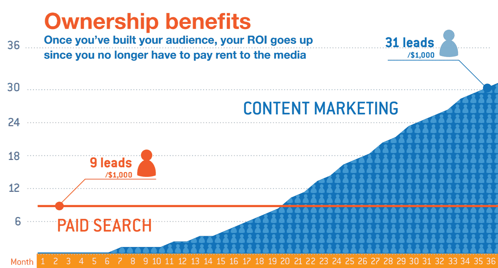
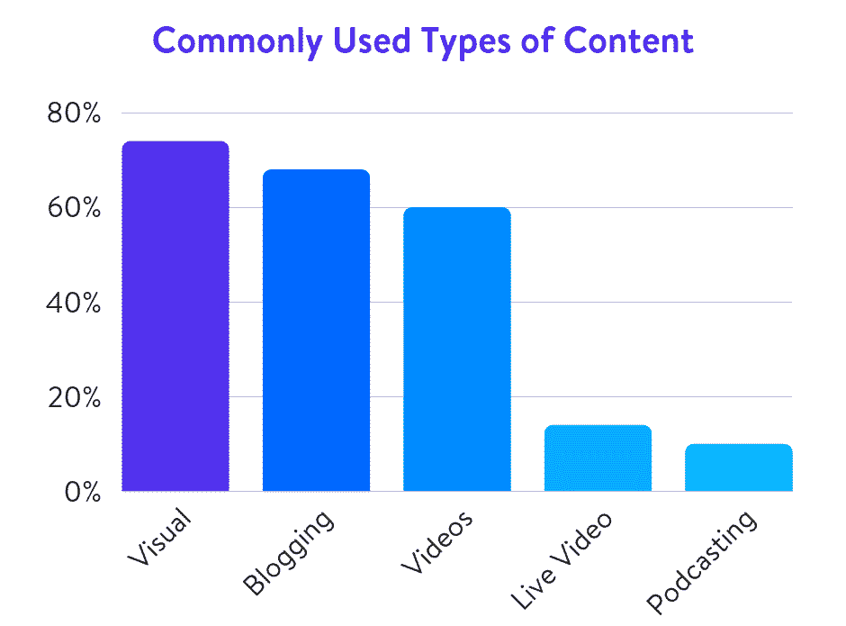
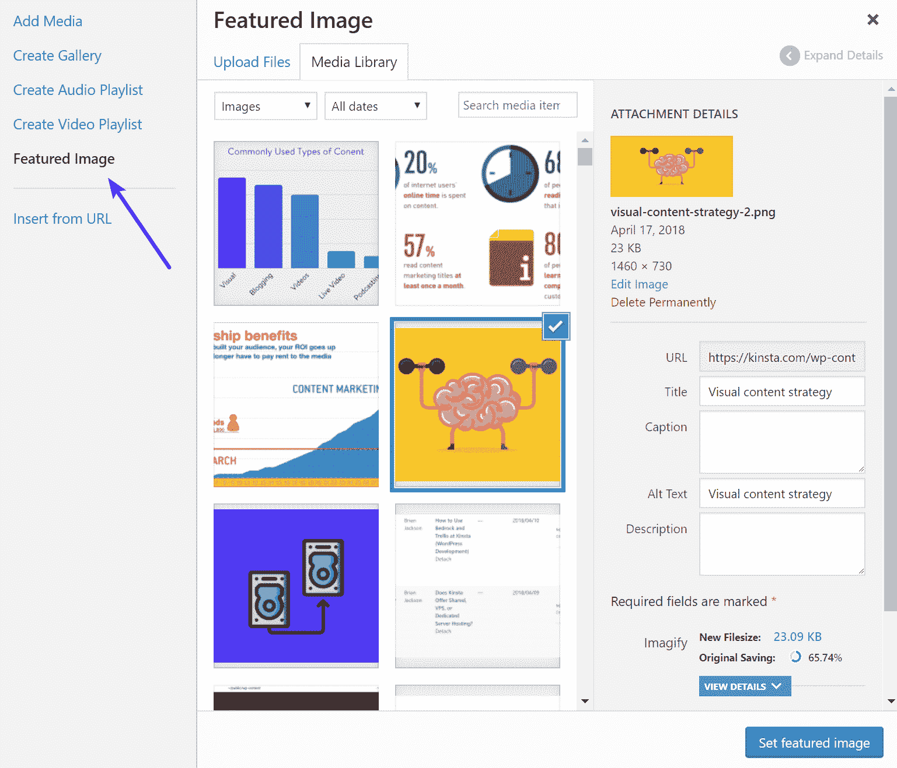
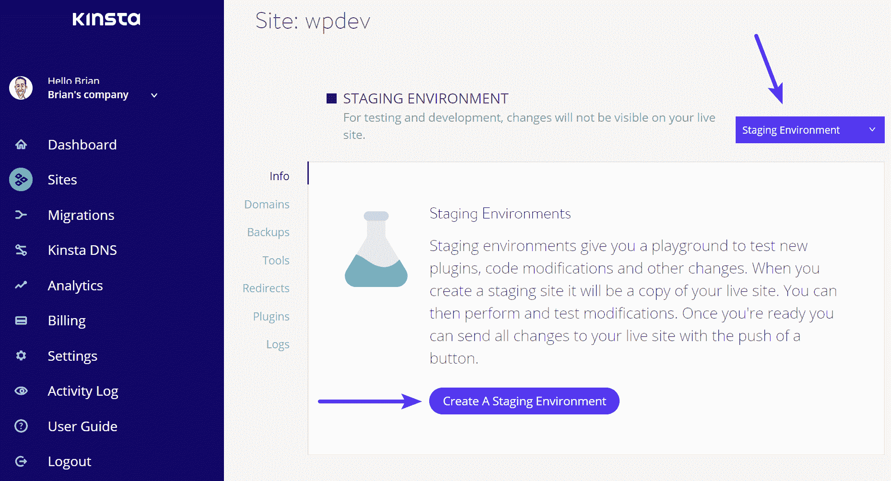
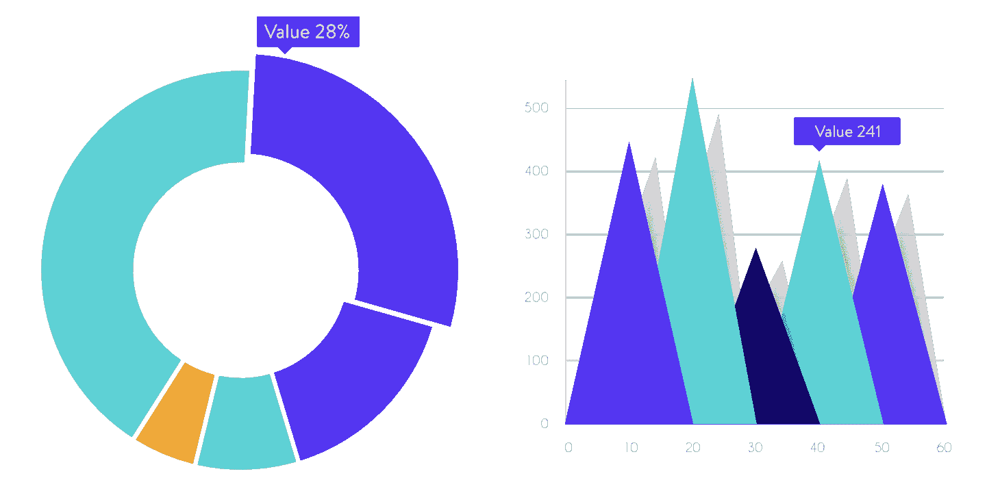
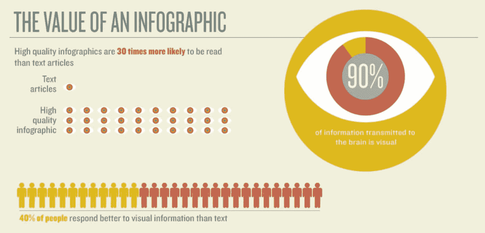
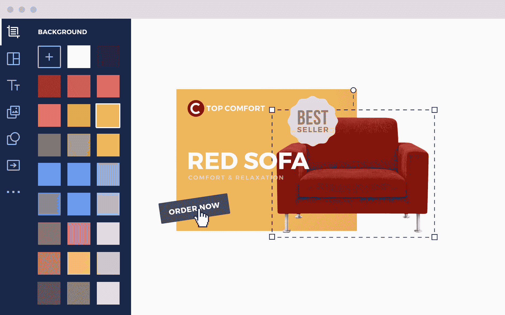
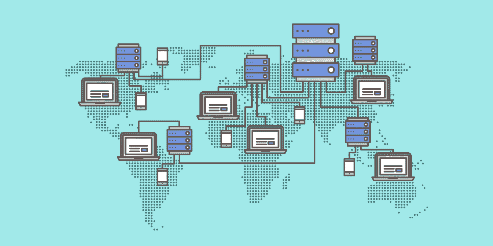
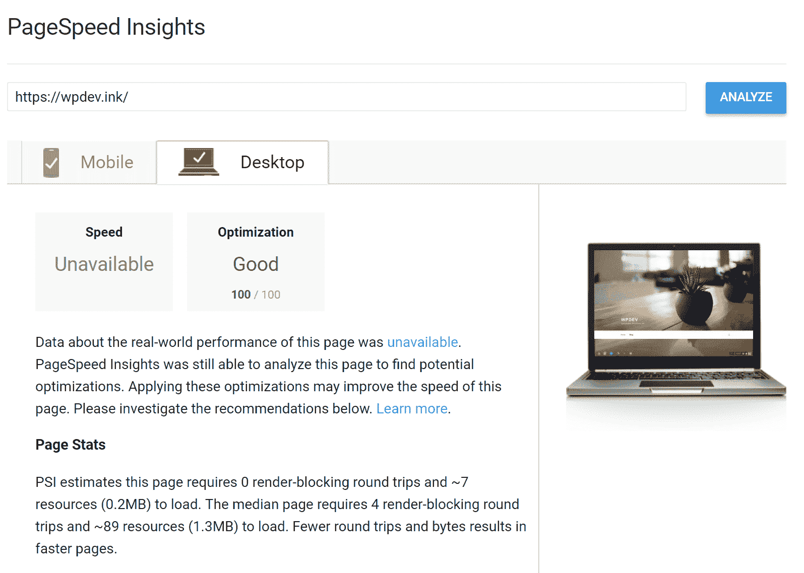

# 视觉内容策略:如何使用视觉来获得更多的流量

> 原文：<https://kinsta.com/blog/visual-content-strategy/>

拥有一个可以和你的读者分享有价值信息的博客对你的生意来说是必不可少的。博客是内容营销的一个很好的来源，如果你做得正确，收益可能会比预期的更高。有没有想过为什么你看到所有这些公司都在输出内容？这是因为如果做得好的话，**内容营销会奏效**。事实上，就潜在客户和投资回报率而言，T4 比付费搜索有效三倍。

Content marketing vs paid search (Image source: Oracle)

Kinsta 也看到了同样的质量结果，他们加倍努力，专注于增加网站的有机流量。

此外，人们更有可能通过内容营销来了解你的公司或品牌。68%的互联网用户花时间阅读品牌信息，80%的人喜欢通过定制内容了解公司。这可能是拥有博客的小企业比不从事内容营销的企业多获得 [126%的销售线索](https://www.impactbnd.com/blogging-statistics-55-reasons-blogging-creates-55-more-traffic)的主要原因。

## 视觉内容的重要性

但是，内容营销不是也不应该只是文字。视觉是营销活动的重要组成部分。他们有能力吸引和留住你的观众。他们有能力增强你的整个活动，并使其长期成功。你认为这是为什么？为什么视觉对博客很重要？

根据《社交媒体检查者》发布的一份报告，38%的营销人员表示博客是他们业务中最重要的内容形式。视觉内容排在第二位，37%的营销人员承认这是他们内容营销策略中最重要的部分。

此外，同一份报告指出，68%的营销人员将博客用于营销目的，而 74%的营销人员将视觉作为一种常见的内容类型。总的来说，内容营销让你的转化率比其他类型的营销高出六倍。

Commonly used types of content (Data source: Social Media Examiner)

然而，我们也应该考虑到人们倾向于只记住他们听到的 10%的内容。然而，如果你将文字和相关图片配对，65%的信息会在三天后被保留。令人印象深刻，不是吗？

## 特色图片

当谈到你的博客的视觉效果时，你首先应该从特色图片开始。当你发布的博客文章大多基于文本信息，而没有截图、图表和其他类型的视觉效果时，这种视觉效果就更加重要了。此外，如果你也从事社交媒体营销，特色形象也很重要。为什么？这是脸书或 Twitter 用户在你分享链接时看到的第一个东西。

### 如何在 WordPress 中添加特色图片？

如果你在基于 WordPress 的博客上写博客，我想你也是，事情就很简单了。今天的大多数主题已经突出了这个选项。如果没有，尝试更新主题或请专业的编码人员来帮助您包含特色图像选项。

这个过程类似于传统的图片上传/插入到帖子中。只有一点小小的不同。图片上传后，你应该点击“特色图片”按钮，而不是将图片插入帖子中。

Add featured image

## 在你的文章中加入视觉效果

现在你已经知道了如何添加特色图片，以及为什么这么做很重要，让我们来讨论一下可能与你发布的文本搭配的其他类型的视觉效果。作为一个博客作者，你可以使用哪些视觉效果，以及如何根据你的整体[内容营销策略](https://robertkatai.com/content-marketing-strategy-for-small-business-owners/)来使用它们？

### A.截屏

如果您想描述在计算机或移动设备上执行的某些操作和过程，它们是您的最佳选择。“如何做”指南在互联网用户中很受欢迎，截屏将帮助你使它们更容易理解。事实上，根据一项研究，那些按照有文字和插图的指示去做的人，比那些按照没有插图的指示去做的人，理解和 T2 表现好 323%。

Staging environment

### B.图形和图表

根据尼尔森诺曼集团发布的另一项有趣的研究，人们关注携带信息的图像，而倾向于忽略装饰性的图像。这是什么意思？

那么，为了抓住观众的注意力，你需要图像为他或她提供一种有价值的内容。图形和图表属于这一类，因为它们可以帮助观众更好地理解你的数字和统计数据，同时，更容易记住所提供的信息。查看如何在 WordPress 中[创建图形和图表。](https://kinsta.com/blog/wordpress-charts/)

Graphs and charts

### C.照片

如果你有什么特别的东西要和你的观众分享，推荐使用照片。为了吸引和取悦读者，旅游博客特别需要他们谈论的不同地方的出色视觉效果。

如果您不能拍摄自己的照片，或者除了发布文本之外您不需要其他任何东西，您可以选择使用库存图像。他们为绿色内容的博客文章制作了很棒的特色图片。

**从哪里获取股票图片，如何处理？**

*   嗯，你需要做的第一件事是建立一个预算。有几个优质的股票图片服务，如 Dreamstime 和股票专家，但它们都需要钱。
*   如果你没有预算，可以考虑从免费的来源获得你的视觉效果。在这个领域也有很多选择，但是有一个问题:这些图片中的大多数都不是免费的。你可以免费得到它们，但是你也应该感谢它的主人。查看这些 [11 个地方，获取免费图片](https://kinsta.com/blog/free-images-for-wordpress/)。
*   永远尊重你在博客上使用的每张照片的版权要求。如果你想避免法律问题，当然，如果你想被认可为专业人士，这是很重要的。
*   不要只拍用谷歌搜索或其他搜索引擎找到的图片。如果你通过网上搜索找到了你需要的那张照片，试着找出这张照片属于谁，问他们是否想把使用权卖给你，或者，也许，他们会允许你免费张贴给作者。

### D.产品图片

如果你想推销特定的产品，不管它们是来自你的商店还是来自合作伙伴的商店，你都需要出色的视觉效果来搭配描述或评论。你可以拍摄自己的照片，也可以要求制片人给你他们的照片。

## 注册订阅时事通讯

### 想知道我们是怎么让流量增长超过 1000%的吗？

加入 20，000 多名获得我们每周时事通讯和内部消息的人的行列吧！

[Subscribe Now](#newsletter)

如果你要求制作人提供最好的图像，确保你能够得到。如果你选择自己拍摄，购买或租用最好的技术设备，并确保在最好的环境中拍摄。或者，如果你有预算，你可以为这项工作聘请一名专业摄影师。

### E.信息图表

在所有能帮助你有效营销你的博客的视觉材料中，信息图表，袖手旁观是最好的选择之一。一个信息图表被阅读的可能性是一个简单的基于文本的博客帖子的 30 倍(T2)。此外，这些类型的视觉效果可以帮助你[增加你博客](https://kinsta.com/blog/how-to-drive-traffic-to-your-website/)的流量。事实上，根据[客户吸引力](https://www.customermagnetism.com/what-is-an-infographic/)，使用信息图表的博客比不使用信息图表的博客多获得 12%的流量。

Value of Infographic (Image source: Customer Magnetism)

### F.动画书、目录和横幅

您也可以使用视觉效果作为横幅，并将其发布在其他人的博客上，以提高知名度并产生更多线索。你的成功取决于你的横幅有多好看，有多容易抓住观众的注意力。无论你是专业设计师还是对视觉设计知之甚少的业余营销人员，我都推荐你在 HTML5 中创建你的横幅。

例如，Bannersnack 是一个很棒的在线工具，它可以让你在几分钟内创建非常棒的横幅，如果你愿意，可以制作动画，并给它们一个专业的外观。它几乎立即生成 HTML5 横幅，并提供数百个模板来帮助您开始。

Bannersnack

由于其跨浏览器和跨平台的兼容性，HTML5 是一个很好的选择。与 Flash 不同，HTML5 本身受所有浏览器支持，因此是更好的选择。

然而，当涉及到动画书和产品目录时，您应该转向另一种类型的创作工具。幸运的是，你也可以在网上做，这样可以节省时间和金钱。我最喜欢的创建翻页书和目录的工具是 [Flipsnack](https://www.flipsnack.com/) 。

Struggling with downtime and WordPress problems? Kinsta is the hosting solution designed to save you time! [Check out our features](https://kinsta.com/features/)

它有一个类似 Bannersnack 的界面，还允许您创建和保存 HTML5 动画书。这意味着您的文件不仅可以从任何设备上访问，而且响应迅速，这是移动用户的基本特征。

### G.录像

视频可以证明是你营销策略的重要组成部分。他们在所有受众中很受欢迎，最重要的是，他们能够将潜在客户转化为客户，或者在某个实例中转化为固定受众的成员。

在这种情况下，最好的例子来自 RedBull，一家将视频内容提升到内容营销新标准的公司。虽然你可能无法马上创建一个像红牛媒体公司一样受欢迎和有效的视频频道，但你仍然可以考虑在你的战略中使用 T2 视频，因为它们很受欢迎。

据信，视频内容几乎代表了全部互联网流量。此外，[的营销人员](https://animoto.com/blog/business/2016-social-video-forecast-infographic/)承认在他们的策略中使用过这类内容，至少一次。这是一个很好的选择，考虑到喜欢看视频的人是喜欢阅读特定主题的人的四倍[。](https://animoto.com/blog/business/video-marketing-cheat-sheet-infographic/)

**是什么让红牛如此成功，为什么他们的视觉内容策略优于其他公司的策略？**

1.  **红牛媒体之家**:嗯，首先想到的当然是已经提到的红牛媒体之家。它包括许多在线服务，如红牛电视，Servus 电视，Terra Mater，红牛电视在线，红色公告，红牛手机等。这些都是视频服务，特别是与每个平台的粉丝和用户分享有价值内容的在线视频服务。他们让红牛成长为当今在线多媒体市场上有影响力的公司，并通过巧妙的原创活动提高其品牌知名度。
2.  **社交媒体参与度。**红牛不仅仅是一家能量饮料公司，也不仅仅是一个简单的在线视频分享平台。他们也有社交媒体的存在，并且在社交媒体营销方面尽可能地吸引人(像 [Twitter 营销](https://kinsta.com/blog/twitter-marketing/))。他们如何以及为什么比其他公司更好？好吧，这一次，他们没有坚持他们所卖的东西。是的，品牌很重要，但它不是一切。他们通过有效的社交媒体策略建立了自己的声誉，虽然他们的产品确实是优质的，但他们的内容也是优质的。例如，在苏格兰皇家银行的脸书页面上有超过 4800 万的粉丝。令人印象深刻，是的，但这不是一个随机的事实。他们分享基于视频的内容，但他们分享的正是他们的粉丝需要看到的内容。这是通向成功的关键之一。

## 使用内容交付网络

我现在不打算详细介绍什么是 CDN 以及它是如何工作的。但是，我要告诉你:为了吸引和留住更广泛的观众，**你需要速度**。我将在下一章谈到这个特定的主题。不过，在那之前，我会告诉你一个秘密。

速度不仅取决于你的主机提供商或你的视觉效果的大小，还取决于你设法到达世界各地的观众的方式。你可能已经知道，本地网站的加载速度比几千英里以外的其他大洲的网站要快。这就是 CDN 派上用场的地方。怎么会？嗯，通过在本地服务器上存储网页的缓存副本，它可以使内容和观众之间的距离最小化。

CDN

## 针对谷歌的优化

在过去的几年里，页面加载速度已经成为移动搜索的一个主要排名因素，尤其是在谷歌这个最受欢迎的搜索引擎上。谷歌搜索引擎根据几个相关标准对网站进行排名。其中一个标准是页面加载速度。

你能做什么？首先，你需要考虑[优化你的视觉效果](https://kinsta.com/blog/optimize-images-for-web/),以便它们可以快速加载。你可以用 Adobe Photoshop、Affinity Designer 或者 [TinyPNG](https://tinypng.com/) 这样的工具来完成，然后再上传到你的服务器上。或者你可以使用 WordPress 插件，比如 [Imagify](https://wordpress.org/plugins/imagify/) ，它可以让你自动优化你所有的图片，而不会损失质量。

然后，你可以通过谷歌查看你的网站加载速度。点击“使用 PageSpeed Insights 分析并检查您的网站或页面。或者使用另一个[速度测试工具](https://kinsta.com/blog/website-speed-test/)如 Pingdom 或 GTmetrix。记住，**总加载时间**比分数更重要。

Google PageSpeed Insights

当你为谷歌优化你的网站时，除了页面速度，另一件重要的事情是你的内容的信息价值。人们仍然在谷歌上搜索信息。如果你的很有价值，他们很有可能会分享。或者，他们会把你的图片嵌入到他们的博客文章中，然后反向链接给你。而且，这些都是很棒很有价值的反向链接，考虑到转贴你的一些图片的人可能是在你写的同一个行业工作或写作的。

因此，当你为谷歌优化你的视觉内容时，请考虑以下两点:

1.  图像的大小。优化他们的速度。在不降低质量的前提下，让它们尽可能小。
2.  创造伟大的视觉内容，人们可以在谷歌上搜索。伟大和有价值的内容吸引观众，但他们也会产生有价值的反向链接到您的网页。

## 摘要

视觉对于博客来说很重要。在你的内容营销策略中，它们可能是决定性的，如果你根据你的受众来选择它们，当然，也要符合你的风格和视觉特征。在这篇文章中，我们了解了为什么视觉效果很重要，以及对于不同类型的内容推荐什么类型的视觉效果。我们还了解到，如果你想成为一名成功的博客作者或内容营销者，它们是必不可少的。

不要忘记，从特色图片开始，直到你在博客文章中包含的视觉效果，每一个细节都很重要。如何看待[视觉营销](https://robertkatai.com/how-to-create-a-visual-content-strategy/)？视觉在你的整体战略中有多重要？

* * *

让你所有的[应用程序](https://kinsta.com/application-hosting/)、[数据库](https://kinsta.com/database-hosting/)和 [WordPress 网站](https://kinsta.com/wordpress-hosting/)在线并在一个屋檐下。我们功能丰富的高性能云平台包括:

*   在 MyKinsta 仪表盘中轻松设置和管理
*   24/7 专家支持
*   最好的谷歌云平台硬件和网络，由 Kubernetes 提供最大的可扩展性
*   面向速度和安全性的企业级 Cloudflare 集成
*   全球受众覆盖全球多达 35 个数据中心和 275 多个 pop

在第一个月使用托管的[应用程序或托管](https://kinsta.com/application-hosting/)的[数据库，您可以享受 20 美元的优惠，亲自测试一下。探索我们的](https://kinsta.com/database-hosting/)[计划](https://kinsta.com/plans/)或[与销售人员交谈](https://kinsta.com/contact-us/)以找到最适合您的方式。