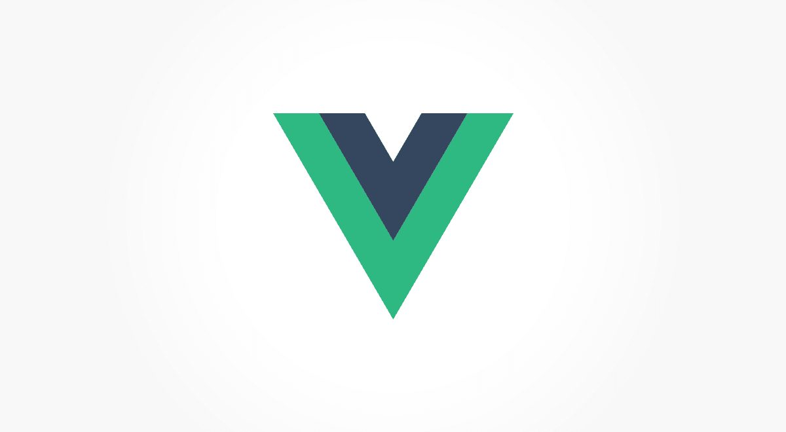
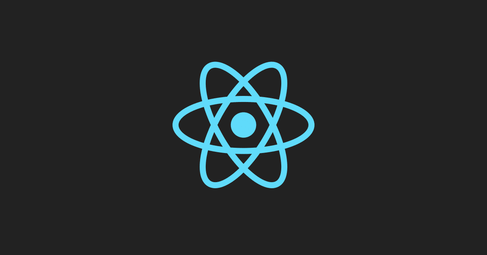
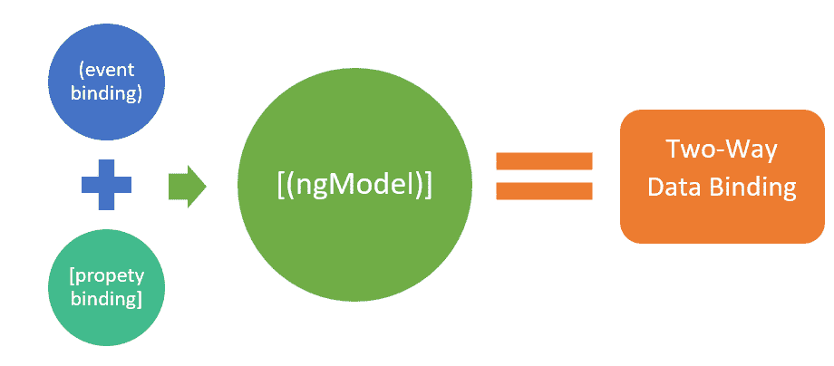
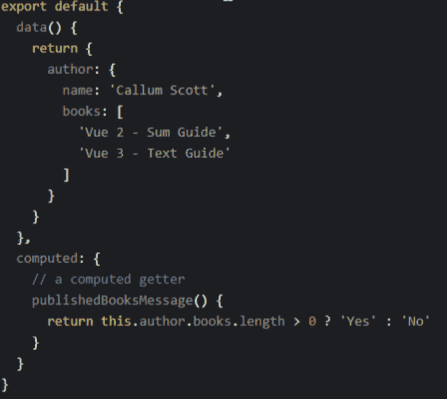
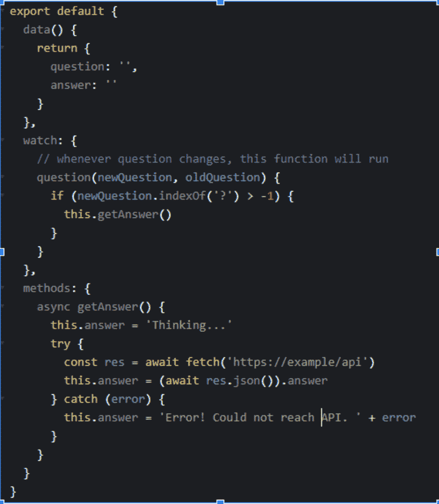
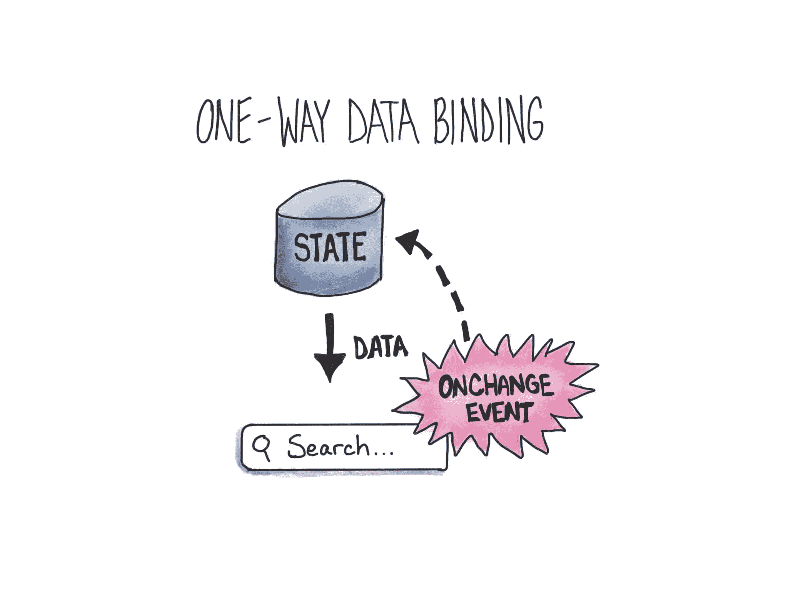

# Vue vs React:应该用哪个？

> 原文：<https://kinsta.com/blog/vue-vs-react/>

现在的企业渴望在短时间内开发出高质量的 web 应用程序。有许多 JavaScript 框架可供你选择来实现一个 web 应用，Vue 和 React 是其中两个最强的竞争者。

在本文中，我们将直接比较 Vue 和 React。因此，如果你是一个刚刚开始一个项目的开发人员，这个指南将帮助你做出正确的决定。

## Vue 是什么？

Vue.js

Vue 是一个灵活、轻量级的基于 JavaScript 的框架，为开发现代前端 web 项目提供了强大的 web 工具。Vue 也被认为是一个[灵活和进化的 JavaScript 框架](https://kinsta.com/blog/vue-js/)，因为它允许在不影响任何基本功能的情况下对应用程序代码进行更改，从而能够创建渐进式 UI。Vue 的高度灵活性还支持将定制模块和可视组件添加到 web 应用程序的功能中。

[Are you team Vue or team React? 👀Click to Tweet](https://twitter.com/intent/tweet?url=https%3A%2F%2Fkinsta.com%2Fblog%2Fvue-vs-react%2F&via=kinsta&text=Are+you+team+Vue+or+team+React%3F+%F0%9F%91%80&hashtags=Vue%2CReact)

### 历史

尤雨溪在与谷歌合作了多个使用 AngularJS 的项目后，设计了 Vue。他后来将自己的思考过程总结如下:“我意识到，如果我可以简单地分离出 Angular 中我喜欢的部分，并开发出令人难以置信的轻量级东西，会怎么样呢？”该项目的第一个源代码提交是在 2013 年 7 月，Vue 是在次年 2 月发布的。

### 使用 Vue 构建的流行 Web 应用程序

这里列出了使用 Vue 构建的流行的 web 应用程序，

*   Gitlab
*   [语法](https://kinsta.com/blog/grammarly-alternative/#overview-of-grammarly)
*   行为
*   拉勒维尔火花
*   Adobe 产品组合
*   9gag
*   行为
*   任天堂(日本电子游戏公司及其开发的电脑游戏名称)
*   字体真棒

React.js

## 什么是反应？

React 是一个开源 JavaScript 库，可用于创建具有复杂用户界面的 web 应用程序。React 允许开发人员构建可重用的定制组件，从而加快开发速度。此外，它快速加载网页的能力使它更容易被搜索引擎使用。总的来说，它是一个优秀的库，鼓励创建简单和高级的企业应用程序。

### 历史

与所有编程框架 [AngularJS 和 Vue](https://kinsta.com/blog/angular-vs-vue/) 相比，React 是最古老的 JavaScript 库。它是由脸书在 2013 年创建的，作为一个为各种网站创建动态界面的工具。虚拟 DOM 是用 React 组件构建的 DOM 元素的表示，是 React 的基础。

### 用 React 构建的流行 Web 应用程序

下面是使用 React 构建的流行 web 应用程序列表，

*   脸谱网
*   网飞
*   推特
*   贝宝
*   英国广播公司新闻
*   美国 Yahoo 公司(提供互联网的信息检索服务)
*   照片墙
*   WhatsApp
*   Dropbox

## Vue 主要特征

Vue 还有一些引人注目的特性，对于启动和运行企业应用程序非常有用。下面解释一些特征，

### 虚拟 DOM

虚拟 DOM 是由几个 JavaScript 框架实现的概念，包括 Vue。不是根据 DOM 进行调整，而是以 JS (JavaScript)数据结构的形式构造和呈现 DOM 的虚拟副本。首先对 JavaScript 数据结构进行修改，然后将后者与初始数据结构进行匹配。

### 双向数据绑定

Vue 提供了如图所示的双向绑定功能，作为其 MVVM 框架的一部分。通过使用 Vue 提供的名为 v-bind 的绑定指令，该功能允许您编辑或将值应用于 HTML 元素、更改样式和应用类。这与 React 等框架不同，后者只提供单向通信。

Two-way binding

### 成分

组件是 Vue 对象，具有定制的 HTML 元素，并且可以重用。Vue 对象和 HTML 元素通过属性和事件进行交互。Vue 组件的代码块对于开发稳定且可扩展的 Vue 应用程序同样重要。

### 计算属性

计算属性有助于监听引入 UI 元素的修改并执行相关的逻辑，从而消除了进一步编码的需要。当我们打算改变一个依赖于另一个被改变的属性的变量时，我们应该使用一个计算属性。其他数据属性会严重影响计算的属性。下面是一个关于计算属性的简单示例，

An example of a computed property

### CSS 过渡和动画

当在 DOM 中添加、更改或删除 HTML 元素时，这个特性提供了多种方法来执行转换。它带有内置的过渡组件，该组件围绕着负责过渡效果返回的元素。开发人员可以轻松使用第三方动画库来增强用户体验。

### 观察者

观察器用于可能定期变化的数据，如表单输入元素。在这种情况下，开发人员不需要执行任何额外的操作。Watcher 处理任何数据更新，同时仍然保持代码简单和快速。

这里有一个简单的代码片段:

An example of watchers

观察器、方法和计算属性可以称为组件的三种主要方式，它们可以利用反应性质。当您需要基于不断变化的数据执行异步或代价高昂的操作时，观察器是最佳选择。

## 反应主要特征

React 还有一些引人注目的特性，对于启动和运行企业应用程序非常有用。下面解释一些特征，

### 虚拟 DOM

这个 React 特性有助于应用程序开发过程的加速和敏捷性。该方法使得在 React 的虚拟内存中重新创建网页变得很容易。虚拟 DOM 因此被用来模仿实际的 DOM。每当应用程序被修改或升级时，通过恢复已经被改变的组件，虚拟 DOM 再次生成完整的 UI。这减少了开发某样东西所需的时间和金钱。

### 单向数据绑定

单向数据绑定意味着 React 利用单向数据流，使程序员能够使用回调函数来修改组件，而不是直接改变它们，如图所示。

One-way binding

Flux 是一个 JavaScript 应用程序设计组件，允许您从固定位置控制数据的流动。它给了开发者更多的权限来控制软件，使其更具适应性和实用性。Flux 有三个主要部分，即 dispatcher、stores 和 views(组件)。

### JSX

JavaScript XML 是一种用于描述应用程序界面设计的标记语言。它创建了一种类似于 HTML 的语法，用于开发 React 组件。React JS 最好的方面之一是 JSX，它允许开发人员非常简单地编写构建块。

## 注册订阅时事通讯

### 想知道我们是怎么让流量增长超过 1000%的吗？

加入 20，000 多名获得我们每周时事通讯和内部消息的人的行列吧！

[Subscribe Now](#newsletter)

### 成分

这意味着基于 React 的应用程序的 UI 由许多组件组成，每个组件都有用 JS 编码的功能。因此，程序员可以在整个应用程序中发送数据，而不会影响 DOM。应用程序的图形和操作受 React JS 组件的影响很大。

### 声明式用户界面

声明式 UI 特性使 React 代码更容易理解，错误修复更简单。不仅对于在线应用，而且对于移动应用，React JS 都是创建动态和交互式用户界面的理想框架。

## Vue 和 React:相似性和共同特征

Vue 是以 React 为灵感创作的。因此，可以发现如下一些相似之处:

*   渐进式 Web 应用程序(PWA)支持
*   虚拟 DOM 使用
*   查看既可组合又可反应的组件
*   JavaScript 代码
*   专注于核心库，合作伙伴库涵盖网络和通用状态管理
*   能够与任何当前的 web 应用程序集成

## Vue vs React:哪个更好？

在当前的开发人员社区中，这些框架并驾齐驱。在本节中，我们将对 Vue 进行比较，并根据框架的共同关注点做出反应。

### 受欢迎程度和就业市场

React 赢得了这场比赛。因为脸书支持这项技术，所以它有更大的受欢迎程度和社区也就不足为奇了。Vue 有一个较小的社区，资源和模块有限，但它仍然受到尤雨溪和团队的支持。

React 自 2013 年成立以来，一直受到社交媒体巨头脸书的支持，在工作机会方面远远领先于 Vue。另一方面，Vue 是一个新的企业家，仍在获得牵引力。

### 学习曲线

Vue 是所有 JavaScript 框架中最容易学习和理解的。据估计，学习它需要几个小时到不到一周的时间。所需要的只是对 ES6 如何工作的基本理解和一些 JavaScript 编程知识。Vue 的文档也很容易掌握，因为它不像其他框架那样广泛。

对于以前使用过 JavaScript 的人来说，React 很容易掌握。由于学习曲线更低，团队的形成变得更简单，因为任何初学者或专业开发人员都可以参与。只有 16.0 以后的版本才是最新的。因此，新开发人员可能难以实现更复杂的功能。

### 性能(速度)

随着每个新选项或组件的增加，Vue 应用程序的状态变得越来越不清楚，这使得应用程序更难更快地加载。幸运的是，这个框架包括一个虚拟 DOM 来提高应用程序的速度。Vue 最重要的一个特点就是[懒加载](https://kinsta.com/blog/wordpress-lazy-load/)。它有助于减少装载时间。

React 应用程序的性能更快，在客户体验方面的性能更简单，分立组件可以很好地协同工作。React 基于组件的结构有助于开发更强大的单页面应用程序，而可重用性降低了代码复杂性，减少了 DOM 交互，加快了页面加载。此外，图书馆侧重于对网站进行必要的修改，而不必重新加载整个页面。因此，它避免了浪费的页面加载，而是刷新了内容。

### 组件和扩展性

在开发基于组件的用户界面时，Vue 和 React 中丰富的组件库使得重用代码更加容易，提高了开发人员的工作效率，并加快了开发过程。

Struggling with downtime and WordPress problems? Kinsta is the hosting solution designed to save you time! [Check out our features](https://kinsta.com/features/)

使用第三方库扩展 Vue 或 React 应用程序非常简单。大多数 React 源代码库仅仅是对现有组件的改进。Vue 中的几个第三方库是插件，使用内置的插件系统本身。

### 状态管理

由于 React 中的状态数据是不可变的，不能立即修改，所以必须使用 setState()函数(或 useState()钩子)来更新本地状态中的任何内容。

但是，因为 Vue 对象上的 data 属性充当应用程序数据的收集器，所以没有理由执行 setState()这样的方法来更改 Vue 中的状态。

### 简化开发的工具和模板

自 2016 年以来，React 提供了一个名为 create-react-app 的第三方 CLI 工具，可以辅助程序员完成 app 构建、脚本编写等任务。以前，React 程序员必须从早期的应用程序中复制文件，或者从头开始。这并不需要很长时间，但这是一个乏味的努力。

另一方面，Vue 有一个名为 Vue CLI 的工具，可以快速构建项目。Vue CLI 有几个优点，包括能够在项目过程中的任何时候添加插件和简单的修改。

### 生态系统

Vue 是一个独立的框架，而 React 需要使用外部库。这是两种技术之间最显著的差异之一。对于路由和状态管理，React 依赖于 Flux/Redux 等其他系统。这些框架通过提供改变状态的单一方式使调试变得更容易。因为脸书将 react-redux 和 react-router 的管理委托给了用户，所以生态系统变得越来越支离破碎。

Vue 的伙伴库数量较少。然而，Vue 目前包含了一些需要在 React 中使用模块的特性，比如 props 验证。Vue 的关键框架，如 Vuex 和 Vue-router，由 Vue 团队维护和支持。

### 安全性

Vue 和 React 都有安全缺陷，尽管 Vue 应用比基于 React 的应用稍微容易保护一些。虽然针对 XSS 问题的自动防御还不可用，但 Vue 程序员可以在实现 HTML 代码之前清理它，或者使用额外的库来帮助防止攻击。您可以直接生成网页，并在生成之前和之后，在您知道 HTML 是安全的情况下保护应用程序。

为了防范 XSS 漏洞、 [SQL 注入](https://kinsta.com/blog/sql-injection/)和其他威胁，React 安全性依赖于遵循安全标准的程序员。虽然 React 使用起来很简单，但是确保 React 项目的安全性需要大量的技能和经验。

### 移动开发

React Native 集成了本机开发和 React 的最大特性，React 是用于创建用户界面的顶级 JavaScript 工具包。你现在可以利用 React Native 和你现有的 Android 和 iOS 应用程序，或者你可以从零开始构建一个全新的应用程序。有了 React Native 的 React 类组件，你可以在 Android 和 iOS 上重用高达 99%的 JS 代码。因此，一个外观和功能都像纯 iOS/Android 应用程序的跨平台应用程序已经创建出来。

您可以制作完全原生的小部件，并完全控制它们的外观。React 原生框架将表示层作为一个完美的状态输出来处理，这使得创建具有自然外观和直观感受的 iOS/Android 合作伙伴应用程序变得简单。

尽管 Vue 落后于 React，但它提供了几个移动开发选项。首先，有 NativeScript，它可以让你编写 Vue 应用程序，也可以将它们编译成原生的 iOS/Android 应用程序。然后是电容器，由发明爱奥尼亚的人发明的。使用一个简单的 API，您可以将 Capacitor 集成到任何现有的 Vue 网站中，并提供原生的 iOS/Android 功能。最后，Vue Native 结合了 Vue 和 React Native 生态系统的优点。在这方面，React 可以说是最适合移动开发的一个。

### 测试和调试

Reactjs 附带了几个有用的测试运行程序，这使得开发过程更容易遵循。例如，Jest、Mocha 和许多其他测试运行程序使测试人员能够遵循运行测试套件的通用方法，这有助于他们发现实际浏览器设置中的缺陷、不需要的功能以及发生过度功能操作的地方。它缩短了上市时间，加快了应用程序部署，并鼓励了更有生产力的氛围。

由于 Vue 才刚刚开始，测试功能是标准的，但是简单有效。它不会提供太多的工具，也不会危及代码的测试能力。Vue Testing Library 和 Vue Test Utils 是 Vue 官方推荐的两个库。因为这个框架支持 CI/CD 和热重装，所以可以建立更快的反馈机制。

### 支持和社区

最大的社交网站脸书总是支持 React。最大的优势是脸书有一个致力于创建和完善 React 的团队。然而，Vue 并没有得到大公司的支持。这并不是说它没有得到社区的支持或者不受欢迎。这是因为 Vue 社区没有 React 社区大。

React 在 StackOverflow 上的问题远远超过 33.1 万个。此外，在撰写本文时，它在 Github 上有超过 174，200 颗星。就 Vue 而言，在 Vue 的 StackOverflow 上有大约 83，400 个问题，在 Github 上有超过 187，800 颗星。

## Vue 与 React 的缺点

和所有技术一样，Vue 和 React 都有各自的弱点。下面是每种方法的一些缺点。

### Vue 的最大缺点包括:

*   双向绑定的挑战
*   移动支持面临的挑战
*   有限插件
*   有限的可扩展性
*   经验有限的程序员
*   编码中灵活性太大
*   社区的使用有一些限制

### React 的最大缺点包括:

*   由于增长速度很快，环境总是在变化，程序员很难适应。
*   随着如此快速的更新和加速，好的文档很难出现。
*   ReactJS 只处理应用程序的 UI 层，因此您需要使用其他工具进行其他部分的开发。
*   如果有很多模板，它们重叠，JSX 可能会混淆。

[Wondering which framework is right for your project? 👀 Look no further ✅Click to Tweet](https://twitter.com/intent/tweet?url=https%3A%2F%2Fkinsta.com%2Fblog%2Fvue-vs-react%2F&via=kinsta&text=Wondering+which+framework+is+right+for+your+project%3F+%F0%9F%91%80+Look+no+further+%E2%9C%85&hashtags=Vue%2CReact)

## 摘要

就它们各自的用例而言，React、Vue 或任何其他基于 JavaScript 的方法都非常壮观。在这种情况下，没有明显的赢家。您需要弄清楚您的用例是什么，然后将其与这些平台的功能相匹配。

React 是一个久经考验的领导者，拥有企业支持和相当大的开源团队。该库更具可伸缩性，允许您创建更复杂的企业级应用程序。因为它是一个库，React 允许它的用户有额外的选择，比如手动重新渲染。它广泛使用了函数式编程技术，正如该库对状态的处理和组件间的交互所证明的那样。

Vue 是一个日益增长的前沿发展概念。它具有更经典的语法，这使得将现有项目转移到 Vue 更容易。它拥有业内最好的文档。核心团队将更多的内置功能和合作伙伴库作为框架添加到 Vue 中。这简化了开发过程，使之更加顺利。

你计划在你的下一个项目中使用哪个——Vue 还是 React——为什么？请在下面的评论区告诉我们。

* * *

让你所有的[应用程序](https://kinsta.com/application-hosting/)、[数据库](https://kinsta.com/database-hosting/)和 [WordPress 网站](https://kinsta.com/wordpress-hosting/)在线并在一个屋檐下。我们功能丰富的高性能云平台包括:

*   在 MyKinsta 仪表盘中轻松设置和管理
*   24/7 专家支持
*   最好的谷歌云平台硬件和网络，由 Kubernetes 提供最大的可扩展性
*   面向速度和安全性的企业级 Cloudflare 集成
*   全球受众覆盖全球多达 35 个数据中心和 275 多个 pop

在第一个月使用托管的[应用程序或托管](https://kinsta.com/application-hosting/)的[数据库，您可以享受 20 美元的优惠，亲自测试一下。探索我们的](https://kinsta.com/database-hosting/)[计划](https://kinsta.com/plans/)或[与销售人员交谈](https://kinsta.com/contact-us/)以找到最适合您的方式。