# 一个用户友好网站的 15 个网页设计原则

> 原文：<https://kinsta.com/blog/web-design-principles/>

想象一下，走进一家零售店去寻找一些新的工作服。当你环顾四周时，你注意到地板上的污渍，杂乱的货架，以及一股奇怪的气味。你会留在商店里从零售商那里买东西吗？

商店设计会影响顾客的行为——网站也是如此。

Clutch 对 612 人的调查发现，83%的参与者会注意到网站的设计是否美观和时尚。或者，50%的参与者会永远离开一个网站，如果他们认为内容不相关或不符合他们的需求。

那么，你如何设计一个客户会喜欢的网站呢？

这就是这篇文章的内容。我们将向你展示为什么良好的网页设计是必不可少的，并分享 15 个网页设计原则，你可以利用它们来建立一个高质量的网站。

### 查看我们的视频指南[网页设计原则](https://www.youtube.com/watch?v=iEXxsC8tUR4)

## 为什么好的网页设计很重要？

网页设计师的平均年薪为 57，000 美元，比初级网页开发人员的平均年薪 44，000 美元多 8，000 美元。设计师获得合理的报酬是有原因的:他们的工作至关重要。

当一个新的潜在客户访问你的网站时，它会给你留下第一印象，影响他们未来与你的品牌的互动。正是在这一点上，他们形成了对你的第一印象。

你的网站也传达了你的品牌的身份，愿景，以及在行业内的地位。如果你有类似产品的竞争对手，一个让人惊叹的网站会让你更加难忘，提升你在竞争中的品牌知名度。

此外，一个强大的网站可以提高你的搜索引擎优化(SEO)努力。

搜索引擎在搜索结果中对网站进行排名时会考虑人们对网站的反应。如果你的跳出率很低，而人们经常访问你网站上的多个页面，搜索引擎可能会把你排在比跳出率高的竞争对手更高的位置。

[技术 SEO](https://kinsta.com/blog/html-best-practices/) 在这里也很重要。具有精心设计的标题、页面结构和链接的网站更容易访问。因此，搜索引擎和客户都喜欢它们。让我们来看看一些重要的网页设计原则。

[Building a new site? ✨ Read this first... 👀Click to Tweet](https://twitter.com/intent/tweet?url=https%3A%2F%2Fkinsta.com%2Fblog%2Fweb-design-principles%2F&via=kinsta&text=Building+a+new+site%3F+%E2%9C%A8+Read+this+first...+%F0%9F%91%80&hashtags=WebDesign%2CUX)

## 有效网页设计的 15 个原则

当我们提到“网页设计原则”时，我们指的是设计网站或网页的结构和视觉元素的一般规则。每个品牌都有不同的网页设计原则——有些符合最佳实践，有些不符合。

为了帮助你打造一个优秀的网站，这里有 15 条网页设计原则(以及有效运用这些原则的网站示例):

### 1.页面应该易于导航

在 Clutch 对网站用户体验的研究中，94%的参与者认为网站导航是“最重要的网站功能”

这并不奇怪为什么。如果一个搜索引擎用户来到你的网站寻找关于“移动设计”的信息，但找不到，自然下一步是点击“返回”并尝试另一个网站。

你如何拥抱精心设计的导航？从酷俱乐部的网站上获取灵感。

当你进入酷俱乐部的主页时，网站的布局极其清晰。您可以使用左侧的按钮导航至关键产品部分(如“纸牌游戏”和“遗愿清单”)，使用右侧的按钮导航至“关于”和“联系”页面。

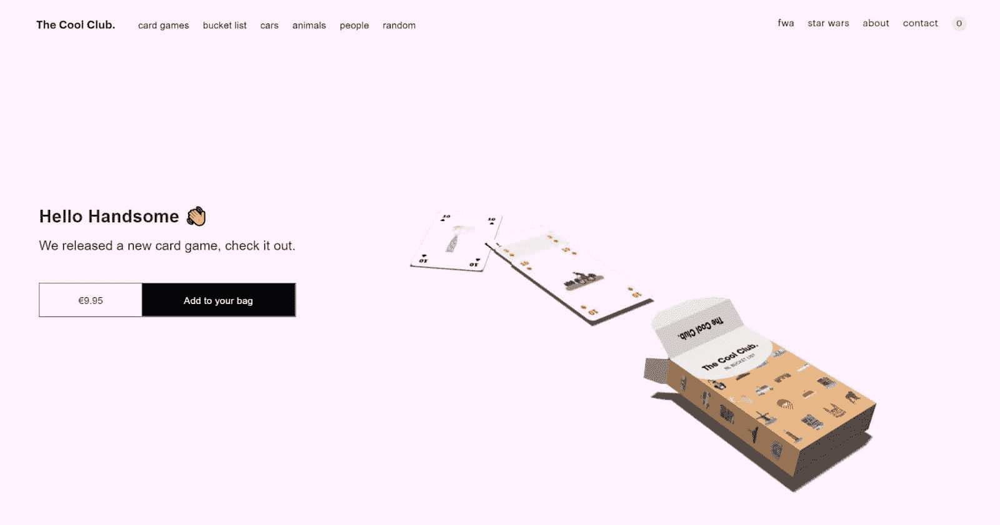

The Cool Club

酷俱乐部的产品页面也非常容易导航。该品牌目前有一个互动的卡片组，具有 54 个很酷的变化和相应的页面。你只需向下滚动并点击你想看更多的卡片。

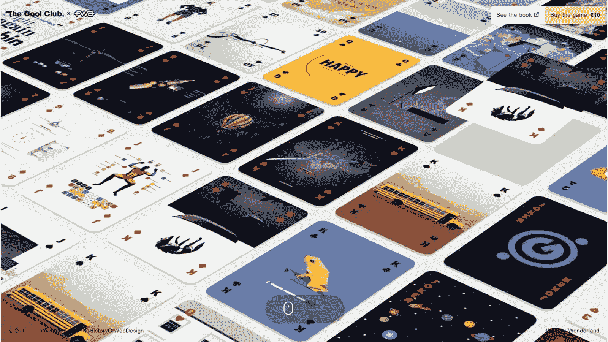

The Cool Club’s website is interactive

要创建一个同样有效的网站，将内容分类成清晰的类别，比如页眉和页脚，并给它们起一个描述性的标题。然后，根据主题对页面进行排序，这样人们就可以轻松地在相似的主题之间导航。

此外，让你的页眉和页脚在整个网站上保持一致。

### 2.总是利用负面空间

负空间(或“空白空间”)是页面主题周围的区域，无论是图像、视频、文本还是按钮。

许多热情的营销人员争先恐后地填满一个页面上的每一个空闲空间，希望给访问者更多的信息会让他们更加投入。然而，这通常会导致令人不知所措的页面。

这就是负空间出现的原因。使用负空间强调每个页面最关键的元素，因为缺乏色彩会将访问者的眼睛吸引到更明亮的区域。

当然，“使用负空间”并不意味着“创建一个无聊的白色网站。”相反，你可以利用你的品牌颜色来利用空间，就像 Garoa 做的那样。

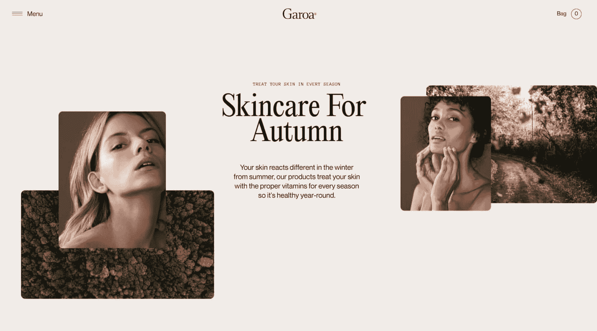

Garoa uses negative space for ambiance

Garoa 的主页使用奶油般的调色板来营造氛围，同时还利用了负空间。结果是你的眼睛会去看中间“秋季护肤”部分的介绍性内容，而不是不太重要的部分。

确保在您自己的网站中利用空白来展示[的层次结构。](https://kinsta.com/blog/website-navigation/)

### 3.页面应该一致，但引人入胜

当你读到像“吉百利”、“好时”或“耐克”这样的品牌名称时，他们的标志、字体和设计风格很可能会立即浮现在脑海中。这就是品牌一致性的力量。

当设计你的网站时，用一致的元素制作页面，给你的品牌一个清晰的视觉识别。这意味着:

*   在标题中使用相同的字体、样式和颜色
*   保持页面之间视觉元素的间距相同
*   使用调色板而不是随机颜色
*   为新闻和博客文章等长格式内容设置布局指南
*   对所有页面使用网站模板

一致的页面不需要看起来完全一致。相反，你可以通过混合元素来平衡一致性和参与度。

例如，您可以为 H1、H2 和 H3 标题使用不同的字体和颜色。或者，你可以改变不同类型页面的布局，把事情混在一起。

### 4.拥抱互补色

互补色是成对的颜色，你可以将它们混合在一起，而不会让你的设计看起来令人眼花缭乱和丑陋。

颜色在屏幕上的显示方式遵循红色、绿色和蓝色(RGB)颜色模型，而不是印刷中使用的青色、洋红色、黄色和黑色(CMYK)模型。画家也经常使用红-黄-蓝(RYB)颜色模型，该模型认为互补色是红-绿、蓝-橙和黄-紫。

无论你更喜欢哪种模式，使用互补色都达到了与黑白相似的目的。[互补色](https://kinsta.com/blog/website-color-schemes/)强调并为你的品牌创造一个清晰的视觉形象。

你可以在 Swab World 网站上看到这个。

在下面的截图中，血癌慈善机构使用绿色和品红色。当您访问不同的网站部分时，这些颜色会变成其他补色组合(尽管所有颜色的饱和度都相似，因此品牌保持一致)。

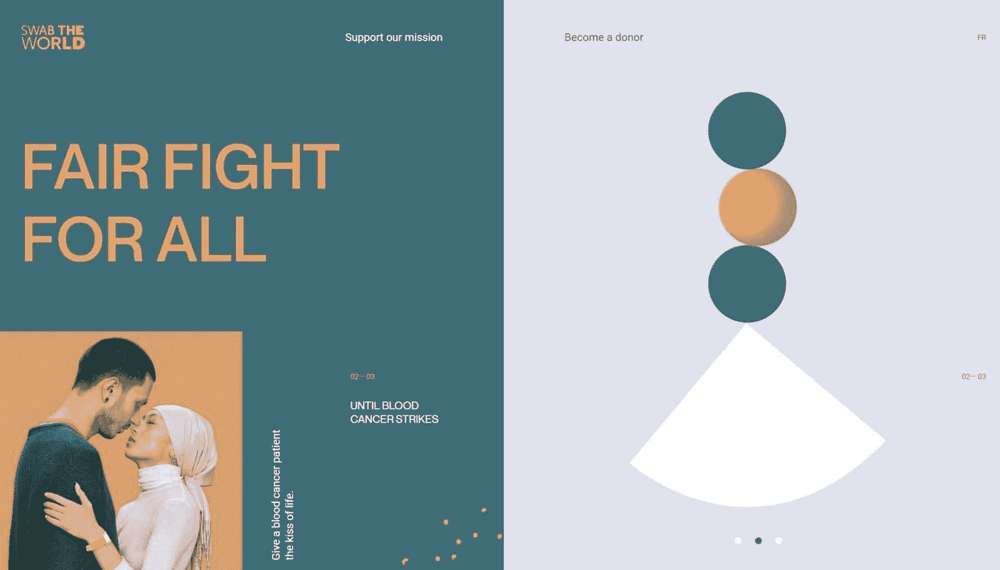

Complementary colors on Swab The World’s website

在你的设计中，互补色是一个简单的原则。如果你想保持简单，选择两种互补色，并将它们添加到对比元素中(如 H2 和正文)。或者在每页上使用每种颜色的多种阴影。

### 5.设计时要考虑你的目标受众

如果你看看酷孩子、Garoa 和 Swab World 的网站，你可能会注意到每个网站都有独特的“感觉”这种感觉来自于为观众量身定制网站的设计。

个性化是这里的最终目标。我们大多数人都喜欢购买我们觉得一致的品牌的产品和服务。事实上，研究表明，72%的消费者重视从“符合他们的信仰和价值观”的公司购买产品因此，如果有人访问你的网站，并看到他们的价值观，目标和优先事项在那里得到反映，他们更有可能从你这里购买。

要使你的网站设计个性化，请考虑:

*   具体来说，哪些图片能引起你的目标市场的共鸣
*   什么样的风格适合你的听众(例如，专业、简约、活泼等等)。)
*   你的目标市场来你的网站看什么主题
*   你如何通过网页设计传达你的品牌定位
*   您的受众对哪些行动号召(CTA)做出回应(以及您应该将它们放在哪里以优化您的[点击率(CTR)](https://kinsta.com/blog/click-through-rate/) )

如果你能利用网站自动化，根据用户的个人资料和之前与你的品牌的互动来提供个人体验，那就更好了。

从向目标人群销售不同产品的竞争对手或品牌那里汲取灵感可能会有所帮助。

### 6.字体应该是可读和可访问的

你在网站上使用的字体决定了你的访问者是否能阅读你写的内容。可以肯定地说，它们非常重要。

选择字体时首先要考虑的是网络安全。操作系统和网络浏览器都支持网页安全字体，因此它们可以在大多数设备上运行。

您还需要考虑可访问性。[无障碍字体](https://kinsta.com/blog/wordpress-accessibility/)应该清晰易读，无论大小。例如，基于草书的字体不太容易理解，而 Times New Roman 则相当容易理解。

## 注册订阅时事通讯

### 想知道我们是怎么让流量增长超过 1000%的吗？

加入 20，000 多名获得我们每周时事通讯和内部消息的人的行列吧！

[Subscribe Now](#newsletter)

此外，选择字体时，留意其他网站上的字体趋势。2021 年，数据科学家李立伟分析了超过 1000 个网站上的字体。他发现了以下趋势:

*   85%的字体不使用衬线(报纸字体中添加的小线条)
*   排名前五的字体包括无衬线字体、Arial 字体、Helvetica 字体、Helvetica 新字体和机器人字体
*   H1 页眉有 58%的概率没有衬线(相比之下段落文本有 93%)
*   段落字体最常见的两种尺寸是 14 像素和 16 像素

你可以选择接受这些信息来选择一种符合人们在网站上寻找的字体样式。或者，你可以选择做一些不同的事情。

维珍是选择了第二种选择的品牌。维珍在下面的截图中使用了至少五种字体。这些字体分隔了页面的各个部分，使它们看起来很吸引人。

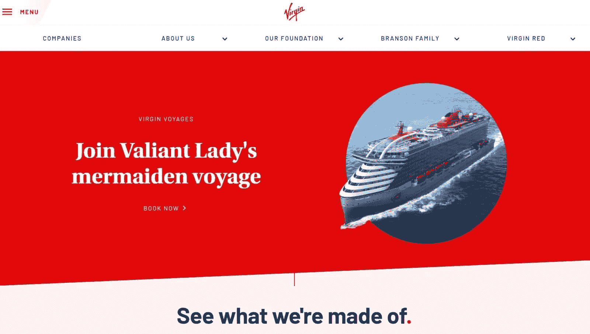

Virgin uses clear, readable, and engaging fonts

### 7.遵循菲特定律和希克定律

心理学家保罗·菲特在 1954 年首次提出了菲特定律，但它在 2022 年仍然与网页设计高度相关。菲特定律认为，目标的大小会影响人们到达目标所需的时间。

在网页设计或用户体验(UX)环境中，这意味着人们点击大按钮会花更少的时间，而点击小按钮会花更多的时间。因此，为了利用菲特定律，你应该让你的 CTA 按钮非常大和突出，这样它们更容易点击。

“简单”在这里至关重要。由英国心理学家威廉·埃德蒙·希克和美国心理学家雷·海曼提出的希克定律认为，人们在每次做决定时都会感到疲劳。

所以，你让网站访问者做的决定越多，他们就越有可能变得疲劳而无法坚持到底。

### 8.使用不变性突出关键信息

当某样东西“不变”时，它会从几个非常相似的选项中脱颖而出，成为一个独特的选项。不变性最明显的例子是在定价页面的计划中突出显示，就像 Box 中的这个。

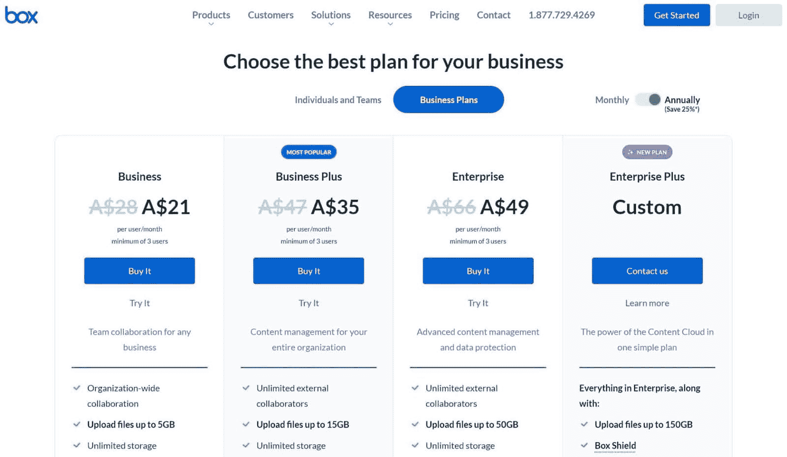

Invariance on Box’s pricing page

但这不是你使用不变性的唯一方式。不变性可以帮助你在页面上建立一个视觉层次，突出关键信息，把人们吸引到页面的重要部分。

例如，看看 Frans Hals 博物馆如何使用不变性在其主页上创建视觉层次:

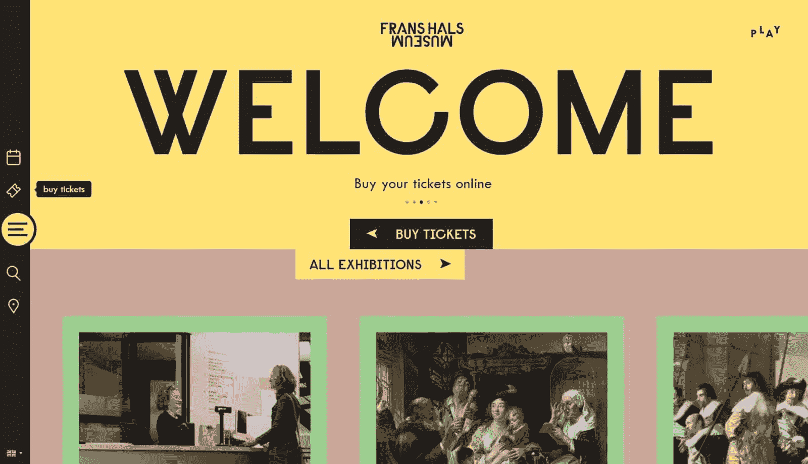

The Frans Hals Museum uses a visual hierarchy

该图中的层次如下:“欢迎”标志、图像、“购买门票”标志、“所有展览”标志，然后是其他内容。

要使用不变性来创建您自己的层次结构，请按重要性顺序排列页面元素。然后，调整每个元素的大小、颜色和位置，直到访问者的视线按照你想要的顺序到达每个元素。

### 9.在 CTA 中:使用人们想点击的清晰语言

我们提到了让你的按钮变大并且易于点击的重要性，但是当你创建按钮的时候，尺寸不是你应该考虑的唯一的事情。

可点击按钮同时具有描述性和说服力。他们让访问者好奇这个按钮链接到什么，并给他们一个去那里的理由。

Struggling with downtime and WordPress problems? Kinsta is the hosting solution designed to save you time! [Check out our features](https://kinsta.com/features/)

一种方法是使用详细的按钮文本，如“点击这里阅读我们的博客”、“在这里找到我们的营销秘密”或“这是我们的 2022 年报告。”另一个是让你的按钮在视觉上令人兴奋或独特。

雨林保护者采取了这两种方法。雨林保护者允许你通过访问不同的地点来浏览亚马逊雨林。每个位置的按钮都包括一个图像和一个动作，比如[“参观村庄”](https://rainforest.arkivert.no/#kart)

### 10.利用 F 模式或 Z 模式

13 年来，尼尔森诺曼集团(NN Group)的研究人员使用眼球追踪来观察 500 多人如何参与内容。这导致他们开发了 F 模式，即人们做的第一件事是向下扫描页面，然后他们从左向右阅读。像这样:

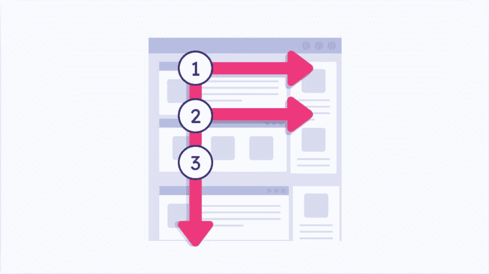

The F-shaped pattern people follow on websites

你可以在你的网站上利用 F 模式，围绕它或一个替代模型来组织你的内容。

脸书在其主页上使用了一个著名的 Z 形图案。当你访问这个页面时，你的眼睛会看到“脸书”标志，然后是“登录”按钮，然后是左边的图片，最后是“创建帐户”按钮。

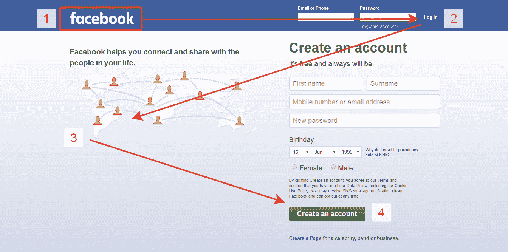

Facebook homepage Z pattern

### 11.好的网站速度快，移动友好

截至 2021 年第四季度，[全球 54.4%](https://www.statista.com/statistics/277125/share-of-website-traffic-coming-from-mobile-devices/) 的网站流量来自移动设备。所以，如果你的网站不支持手机，你可以把流量减半。

速度也会影响网站的有机流量。谷歌的研究显示，如果一个网站的加载时间超过三秒，53%的人会离开。

让你的网站移动友好或快速的最简单的方法是选择一个由专业设计师制作的[快速网站主题](https://kinsta.com/blog/fastest-wordpress-theme/)。或者，如果你想更多地参与你的网站设计，你可以定制一个[响应式网站](https://kinsta.com/blog/responsive-web-design/)。

这就是 1917 年电影背后的设计师们所做的。 *1917* 的网站提供身临其境的体验，让人们投入到电影中。它是专门为移动设备设计的，因为你可以用手指在一战的战壕中四处移动。

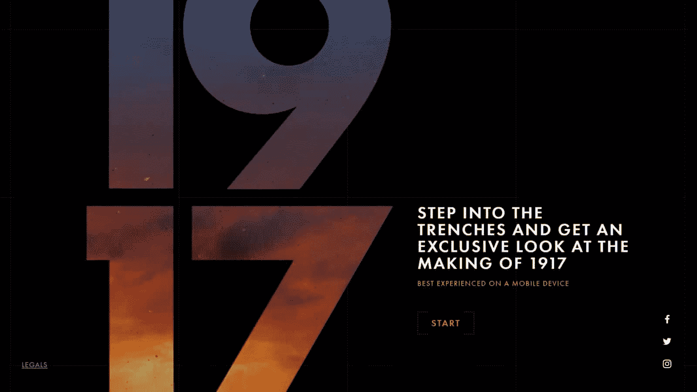

917’s website is designed for mobile devices

如果你观察敏锐，你会注意到 1917 的网站也利用了 F 模式。

### 12.将文本分成小块

考虑一下这个:你搜索“智力游戏”,发现一个网页似乎很有前途。然而，当你点击它时，你会被难以阅读的大段文字淹没。

像许多人一样，你可能会点击关闭网站(不管内容多么有前途！).

密苏里科技大学的眼球追踪研究显示，网站访问者阅读文本的平均时间为 5.59 秒。所以，如果人们不能在这段时间内阅读你的文本，你就不太可能恰当地吸引他们。

通过将文本分成小块来解决这个问题。此外:

*   使用短句
*   远离口语
*   为您使用的任何行业专用词提供定义
*   避免“紫色散文”(不必要的隐喻、副词和形容词)

### 13.使用网格

当我们说“使用网格”时，我们并不是说你应该让你的网站看起来像一个 Excel 表格。相反，把你的网站分成不同的部分，为特定的目的服务，这样访问者可以快速找到内容。

你不需要使用网格线来做到这一点。相反，像阿特拉森一样，用颜色、负空间和阴影来区分网格空间。Atlason 的主页在网格中展示了新的和最畅销的产品。由于访问者可能会寻找这些产品，网格可以帮助他们在几秒钟内找到它们。

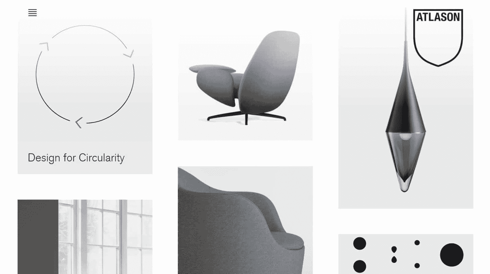

Atlason uses a grid for each product

在你的网站上使用网格最简单的方法之一是选择一个使用网格的主题。示例包括网格框架、砖石网格和穿梭网格。

### 14.记住平衡

在[网页设计](https://kinsta.com/blog/web-design-best-practices/)的背景下，“平衡”指的是设计元素相互之间的关系以及这些元素是否和谐。有很多方法可以在你的网站上创造平衡，包括一些网页设计原则:

*   通过对称(包括两侧对称、径向对称或平移对称)
*   使用互补色或对比色
*   使用相似形状和大小的元素
*   使用重复的模式

你可以在 Woven 的网站上看到《行动中的平衡》。这个网站使用平衡的调色板，黑色和白色在文本中形成对比，对称吸引访问者对内容的注意。

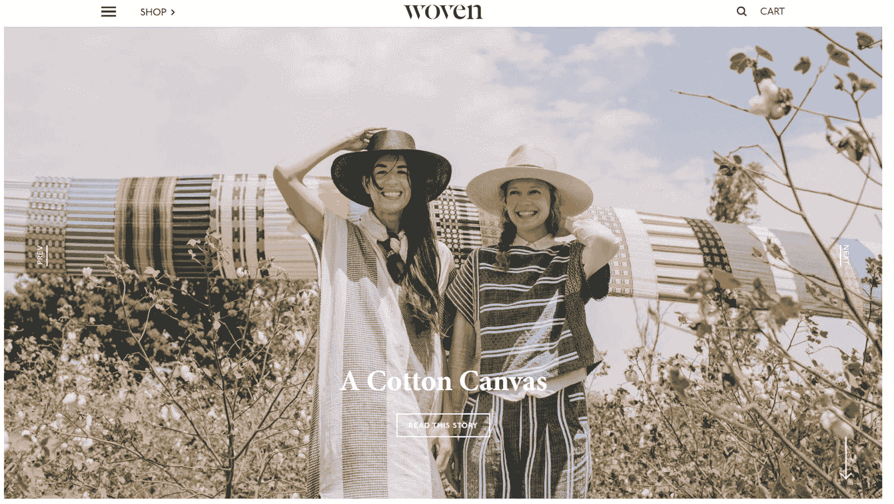

Woven’s website uses symmetry to draw your eyes down

### 15.注意细节

格式塔理论说，人们在看单个元素之前，先把事物看成一个整体。或者像库尔特·考夫卡说的:“整体独立于部分而存在。”虽然人们通常参考心理学的格式塔理论，但它也适用于网页设计。

你需要注意你网站上的小细节，以确保你的设计看起来完美无缺。在设计某些东西时，很容易专注于标题、图像和 CTA 等重要元素，而忘记其他东西，如:

*   页脚和页眉图标
*   社交媒体按钮
*   你如何有效地将你的网站转换成 WordPress(如果适用的话)
*   文本间距
*   打字错误和语法错误
*   浏览器兼容性
*   图像尺寸

在点击“发布”之前仔细检查这些元素，确保你的网站传达出专业性。你可能会忽略小瑕疵，但访客不会。

此外，[与网页设计原则的新趋势和概念保持同步。把这些添加到你的网站上会让它看起来新，新鲜，吸引人。](https://kinsta.com/blog/web-design-courses/)

[When it comes to web design, winging it won't cut it 😅 Check out these guidelines to make sure your new site is customer-friendly 💪Click to Tweet](https://twitter.com/intent/tweet?url=https%3A%2F%2Fkinsta.com%2Fblog%2Fweb-design-principles%2F&via=kinsta&text=When+it+comes+to+web+design%2C+winging+it+won%27t+cut+it+%F0%9F%98%85+Check+out+these+guidelines+to+make+sure+your+new+site+is+customer-friendly+%F0%9F%92%AA&hashtags=WebDesign%2CUX) ## 摘要

一家设计良好的零售店可以提升顾客体验，而一家糟糕的零售店可能会让顾客永远远离你的品牌。网页设计也是一样。

建立一个视觉上吸引人的网站不仅仅是一个有趣的项目。它可以帮助您:

*   传达专业精神
*   与你的访问者建立信任
*   从你的竞争对手中脱颖而出
*   从搜索引擎吸引有机流量

利用本文中的网页设计原则来构建一个让访问者惊叹不已的网站

既然我们已经讨论了所有我们知道的关于网页设计的内容，我们很想听听你的意见。当你访问一个品牌的网站时，你会注意到什么？此外，您是否使用了我们在您的网站上没有提到的原则？请在下面的评论中告诉我们。

* * *

让你所有的[应用程序](https://kinsta.com/application-hosting/)、[数据库](https://kinsta.com/database-hosting/)和 [WordPress 网站](https://kinsta.com/wordpress-hosting/)在线并在一个屋檐下。我们功能丰富的高性能云平台包括:

*   在 MyKinsta 仪表盘中轻松设置和管理
*   24/7 专家支持
*   最好的谷歌云平台硬件和网络，由 Kubernetes 提供最大的可扩展性
*   面向速度和安全性的企业级 Cloudflare 集成
*   全球受众覆盖全球多达 35 个数据中心和 275 多个 pop

在第一个月使用托管的[应用程序或托管](https://kinsta.com/application-hosting/)的[数据库，您可以享受 20 美元的优惠，亲自测试一下。探索我们的](https://kinsta.com/database-hosting/)[计划](https://kinsta.com/plans/)或[与销售人员交谈](https://kinsta.com/contact-us/)以找到最适合您的方式。