# 回望顶级网页设计趋势(2018-2019)

> 原文：<https://kinsta.com/blog/web-design-trends/>

网页设计是不断发展的。随着技术变得越来越强大，设计师们不断尝试新的风格，每年网络世界都会呈现出一系列令人兴奋的独特趋势。根据近年来出现的设计以及正在开发的新技术，可以预测 2020 年将会发生什么。

让我们回顾一下过去几年的网页设计，并研究一下新兴的风格，这样你就可以知道在即将到来的新的一年及以后会有什么期待。

## 为什么要跟上潮流？

不是每个网页设计时尚都是可行的，这是肯定的。做任何事情都有时间和地点，毫无理由地改造你的网站弊大于利，尤其是以牺牲可用性和 UX 为代价的时候。

但是，尽管你不应该在没有认真考虑的情况下就对你的网站进行改版，但跟上网页设计的趋势，尤其是那些基于技术进步的趋势，肯定是有好处的。

例如，如果你还没有听说过[人工智能聊天机器人](https://kinsta.com/blog/chatbot/)、渐进式网络应用或 CSS 网格，你可能正在使用过时的技术，这会让你失去转换。想想[响应式设计](https://kinsta.com/blog/responsive-web-design/)对于互联网是多么具有革命性；你不想在下一次类似的发展再次发生时最后一个上船。

即使这些趋势纯粹是美学上的，跟上它们还是有好处的。例如，一个纯白、干净、简单的网站可能是有用的。但是随着过去几年网页设计越来越前卫，用户也觉得很无聊。

即使是像添加更多的颜色、破碎的网格或微交互动画这样的小变化，也会对保持网站的相关性大有帮助。

> Kinsta 把我宠坏了，所以我现在要求每个供应商都提供这样的服务。我们还试图通过我们的 SaaS 工具支持达到这一水平。
> 
> <footer class="wp-block-kinsta-client-quote__footer">
> 
> 
> 
> <cite class="wp-block-kinsta-client-quote__cite">Suganthan Mohanadasan from @Suganthanmn</cite></footer>

[View plans](https://kinsta.com/plans/)

此外，随着网页设计者成长、学习和适应新技术，这些进步和趋势在美观和功能性方面都变得越来越好。想想 20 年前甚至 10 年前网站的样子和运作方式…我们已经走过了很长的路，还有很长的路要走。

如果你看到一个符合你品牌的现代网页设计趋势，并且有助于或者至少不会损害可用性，那就值得一试。

## 回顾:2018 年网页设计趋势

随着 2020 年的到来，2018 年似乎越来越远。但即使出现了全新的风格，它的趋势仍然继续影响着网络，因为其中许多仍然与现代设计相关，所以回头看看我们已经走了多远是很好的。

几年来，网页设计一直在远离极简主义的简单，朝着大胆的个人主义发展，但这一切在 2018 年达到了顶峰。即使是现在，我们仍然可以感受到它的影响，互联网肯定会继续充满原创的、独特的风格。

### 2D 插图，三维动画

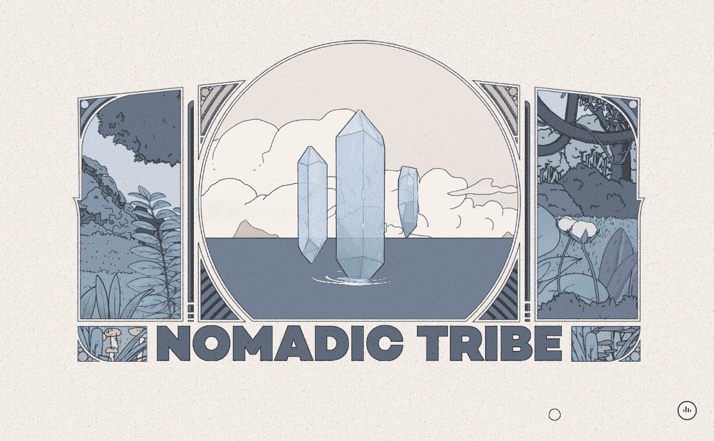

An example of a 2D illustration (Source: Nomadic Tribe)

插图是传达个性的最佳方式之一，2D 的画越来越多。它们有助于品牌推广，让你的网站更加令人难忘，所以这并不奇怪。一个有着惊人插图的网站不太可能被遗忘。

3D 背景动画也变得越来越受欢迎，这要归功于浏览器、动画技术以及电脑和手机等设备的强大功能。3D 动画在[作品集和代理网站](https://kinsta.com/blog/portfolio-website/)上尤为常见，它能立即吸引人们的注意力，并提供有趣的 UI 互动机会。

在未来，手工制作的插图和动画只会越来越受欢迎。他们以一种其他方式无法展示的方式展示你的品牌个性(事实证明这是一种策略)。

### 微妙、扁平和极简主义

Flat design was quite popular (Source: Webflow)

尽管越来越多的原创风格脱颖而出，极简主义仍然主导着互联网。干净简单无疑是吸引人的，即使是在以明亮的颜色或实验元素为特色的网站中，它也经常伴随着单调的设计。

然而，“平面 2.0”，或半平面设计，由于使用了阴影、渐变和其他稍微复杂一些的元素，变得更加根深蒂固。只要极简主义存在，设计师们就会找到一种方法让它旋转起来。

微妙的动画也是 2018 年的一大部分，轻微的视差和温和的悬停效果随处可见。这些允许极简主义网站保持其简单性，同时使整体设计更加漂亮。

### 线形设计

大多数网站在某种程度上包括多边形和几何图形，但几何设计是 2018 年趋势的一大部分。网站完全是围绕简单的形状制作的，如正方形、长方形和线条，它们的特色是更小的细节，如按钮或装饰框。

其中很大一部分是有机的几何形状，或者那些有点不规则和不完美的形状。它们通常以柔和的角和不对称为特征，它们不同寻常的外观相当有趣。多边形的尖角和有机几何的圆边经常被结合在一起以创造一种视觉上吸引人的对比。

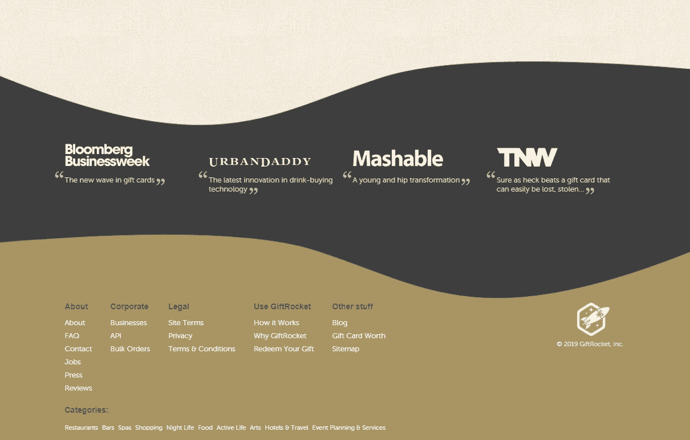

Geometric designs ruled the day  (Source: GiftRocket)

### 明亮大胆的颜色

曾经平淡无奇的互联网现在充满了色彩，充满活力和冒险的调色板遍布每个角落。每种配色方案中一两种柔和色调的日子正在消逝，明亮大胆的调色板很快取而代之。

渐变无处不在，甚至在今天仍然是一个流行的选择，它们强烈而鲜明的色彩充满了许多著名网站的标题。

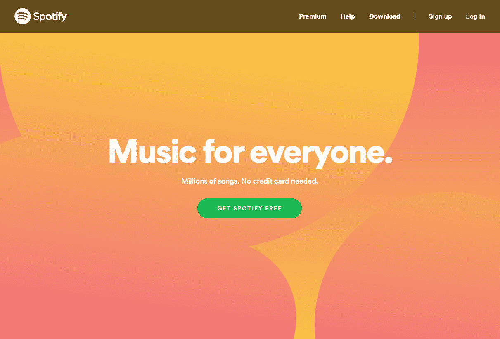

Bold colors spoke volumes  (Source: Spotify)

除了活泼的配色方案外，还有毛刺和失真效果，明亮的闪烁动画出现在许多设计师或开发人员的作品中。虽然它的受欢迎程度有所下降，但你仍然可以在网上找到它们。

### 破碎网格设计

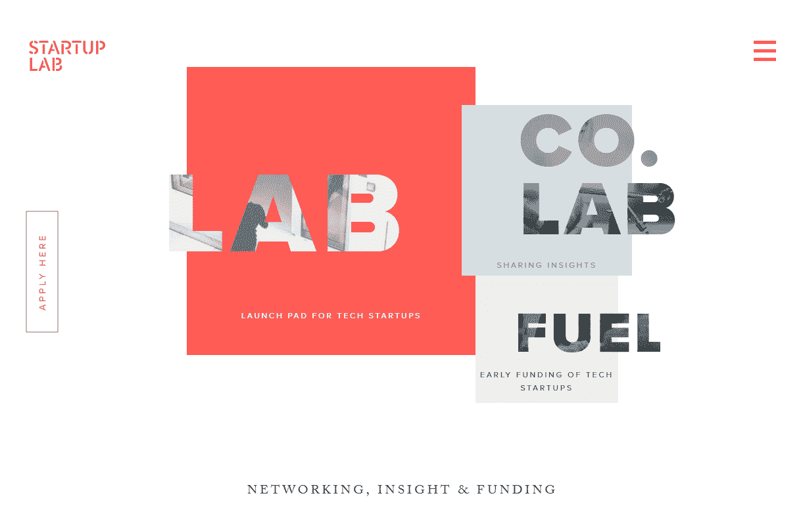

All hail the broken grid  (Source: Startup Lab)

大多数网站都是建立在一个简单的基于网格的布局上，元素被整齐地划分成几个部分。破碎的网格设计打破了这种期望，重叠的元素，将对称性抛到了窗外。这种非传统的布局是打破模式和脱颖而出的最引人注目的方式之一。

另一个引起很多关注的风格是分屏设计，这种技术将屏幕分成两个面板，每个面板都有自己的内容。总的来说，布局变得有趣多了。

### 人工智能和机器学习

聊天机器人是一件大事。这些漂亮的程序动态响应客户，部分或完全自动化支持或购买过程。机器学习允许他们检查数据，学习如何回答问题和评论，并减轻人类支持代理的一些工作量。

但这仅仅是开始。随着技术的不断进步，人工智能和机器学习必将与在线系统更加融合。

### 野蛮主义的兴起

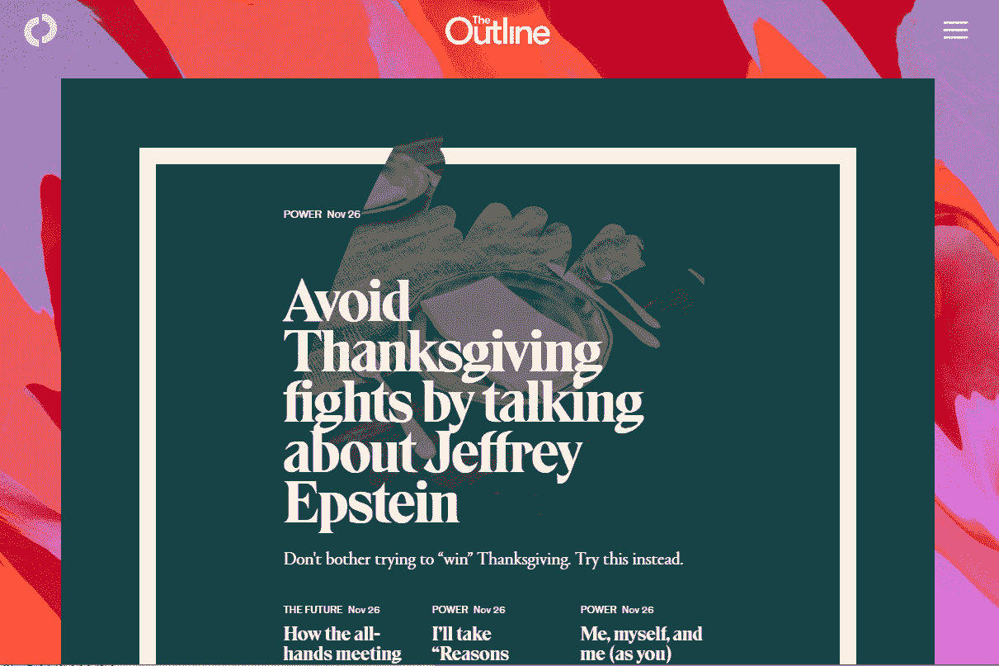

Brutalism is rough on the eyes but makes a statement  (Source: The Outline)

野蛮主义并不好看，但它奇特的吸引力赢得了许多人的心。以花哨的颜色、反 UX 的选择和无处不在的设计为特征，野蛮主义鼓励设计师疯狂地创建一个违背预期的网站。你应该期待在未来看到更多这种不统一的风格。

### 用网页设计讲故事

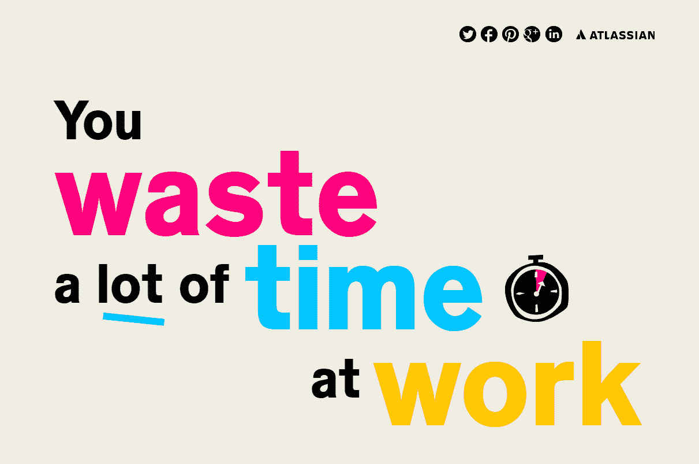

Design can be used to tell a story  -(Source: Atlassian)

视觉效果是有效传达信息的最佳方式之一，无论你是想讲述一个故事，还是让大量数据可读。网页设计师通过[迷人的插图和数据可视化](https://kinsta.com/blog/best-tools-for-freelancers/#design-tools)讲述他们的故事，互动和视觉设计使他们的信息更吸引人，更容易理解。

## 2019 年最大的网页设计趋势

2019 年与 2018 年分享了许多网页设计趋势，比如破碎的网格设计和大胆的调色板。但是事情变得更加疯狂，大胆的设计师进行了大量的实验。

## 注册订阅时事通讯

### 想知道我们是怎么让流量增长超过 1000%的吗？

加入 20，000 多名获得我们每周时事通讯和内部消息的人的行列吧！

[Subscribe Now](#newsletter)

2019 年的跑步主题:规则弯曲和打破。白色，平面，网格为基础的极简主义，明亮和大胆的不对称。虽然干净的设计和留白永远是一个很大的竞争者，但设计师们最近更愿意尝试新事物。我们看到其中许多将在 2020 年全面实施。

### 活力和色彩实验

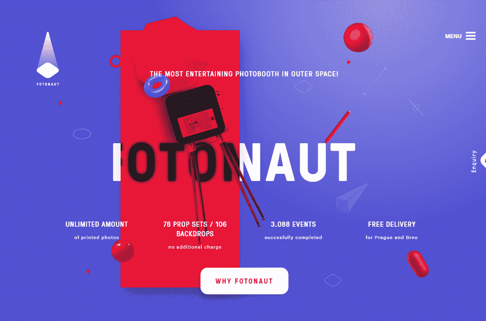

Vibrant colors dominated  (Source: Fotonaut)

互联网越来越丰富多彩。渐变现在很常见，网站经常展示几年前闻所未闻的明亮而浮华的调色板。调色板本身更具实验性，打破了通常互补色或对比色的模式，到处都是。

网站不再炫耀同样的一两种简单、柔和的颜色。柔和的色彩、明亮的色调以及各种尺寸的调色板正在占据主导地位。鲜明的对比，柔和的微妙，充满个性的调色板混合在一起，使互联网更加多样化。

单色也是现在的一大时尚。这通常表现为完全黑白或灰度的黑色网站，但你也可以找到只使用单一颜色的网站。

### 更多插图

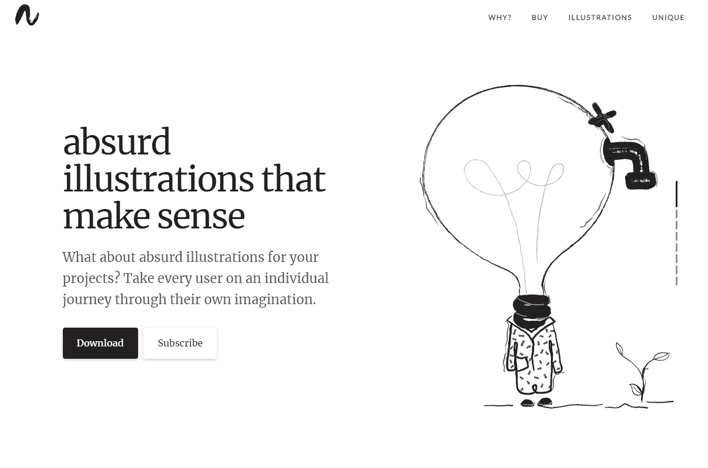

Illustrations were still popular  (Source: absurd)

[插图和视觉内容](https://kinsta.com/blog/visual-content-strategy/)在 2018 年也很重要，但它们仍在继续发展。艺术家们正在采取措施，远离大多数网站采用的典型、简单的插图风格，尝试一些稍微不同的东西。

一个新兴的趋势是古怪、有趣的艺术，它偏离常态，尝试一种更抽象、更随意的风格。这些插图无视典型的界限，完全不怕展示创作者的个性。

3D 插图也相当受欢迎。这只是平面艺术潮流中的一个小小的转变，但却给它注入了许多新的生命。其中一些是 2D 的作品，看起来是 3D 的，而另一些是真实的三维渲染。不管怎样，它们正随着 3D 网络动画迅速获得牵引力。

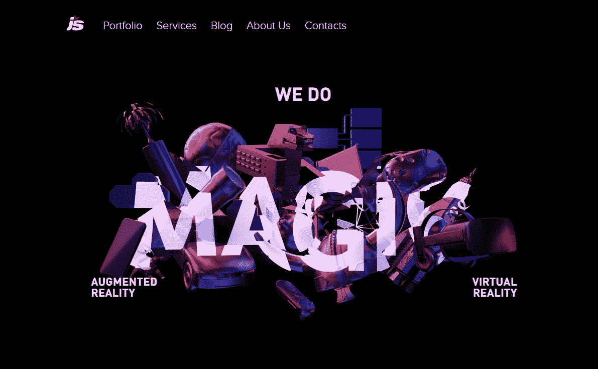

And 3D illustrations made an impact  (Source: Jet Style)

最后但并非最不重要的趋势是动画。动画艺术能立即吸引人们的注意力，并给已经很有表现力的艺术形式增加了一层额外的个性。随着这种时尚获得关注，2D 和 3D 动画艺术都将继续发展。

### 大胆的设计

2019 网页设计可以用三个字来概括:大而大胆。规模越大，实验性越强越好，尤其是当最终结果华而不实，需要立即引起注意的时候。

野兽派网页设计仍然很强大，整个网站都致力于收集野兽派的精华。这种赤裸裸的、丑陋的、反用户的艺术形式无疑表明了一个事实:网页设计从来都只是为了创造良好的用户体验，但是野蛮主义试图把它变成一件艺术品。尚不清楚野蛮主义会持续多久，但这一趋势仍然有狂热的追随者。

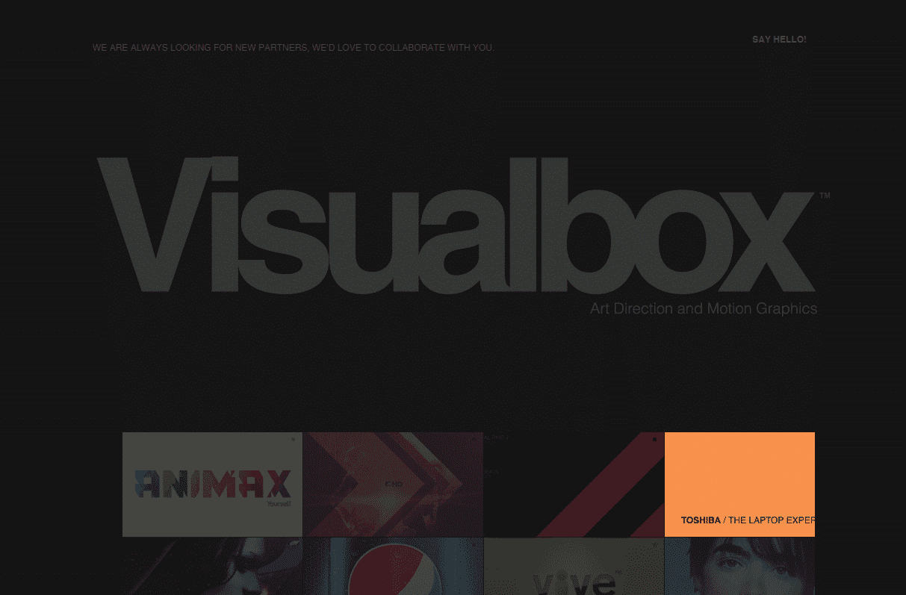

Brutalism is still dominate  (Source: Visualbox)

似乎一切都变得越来越大，但最大的影响是排版和导航。几乎整个屏幕都是文字，甚至完全围绕排版进行设计，几乎没有图像，这种情况并不少见。

厌倦了你的 WordPress 站点缓慢的主机？我们提供超快的服务器和来自 WordPress 专家的 24/7 世界级支持。[查看我们的计划](https://kinsta.com/plans/?in-article-cta)

[字体](https://kinsta.com/blog/wordpress-fonts/)也变得[更有创意](https://kinsta.com/blog/modern-fonts/)，特别是感谢[彩色字体](https://www.colorfonts.wtf/)，这使得定制和渲染看起来像是在 Photoshop 中增强的字体终于成为可能。字体设计作为一个焦点现在是一个可行的网页设计方法。

[导航也在拓展](https://kinsta.com/blog/wordpress-menu-plugins/)。精致的标题导航和优雅的下拉菜单或汉堡菜单正被主流显示所取代，整个屏幕都被用来导航，也经常围绕着巨大的印刷字体。在这份详细的指南中，你可以了解更多关于[网站导航最佳实践](https://kinsta.com/blog/website-navigation/)。

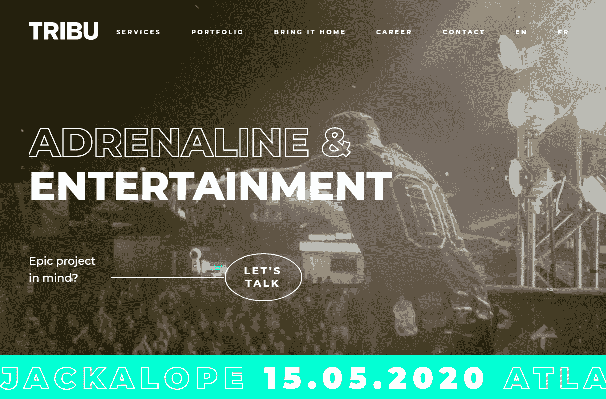

Header designs have made an impact as well  (Source: Tribu)

请留意网页上生动的英雄视频标题、动画背景和更多的视频内容。视频元素曾经是一个问题，因为它们加载速度慢，占用有限的移动数据，但更强大的硬件和后备图像意味着你现在可以在任何地方使用视频。那个拥有全屏动画背景的华丽网站，曾经很少见，现在将变得越来越普遍。

### 不对称

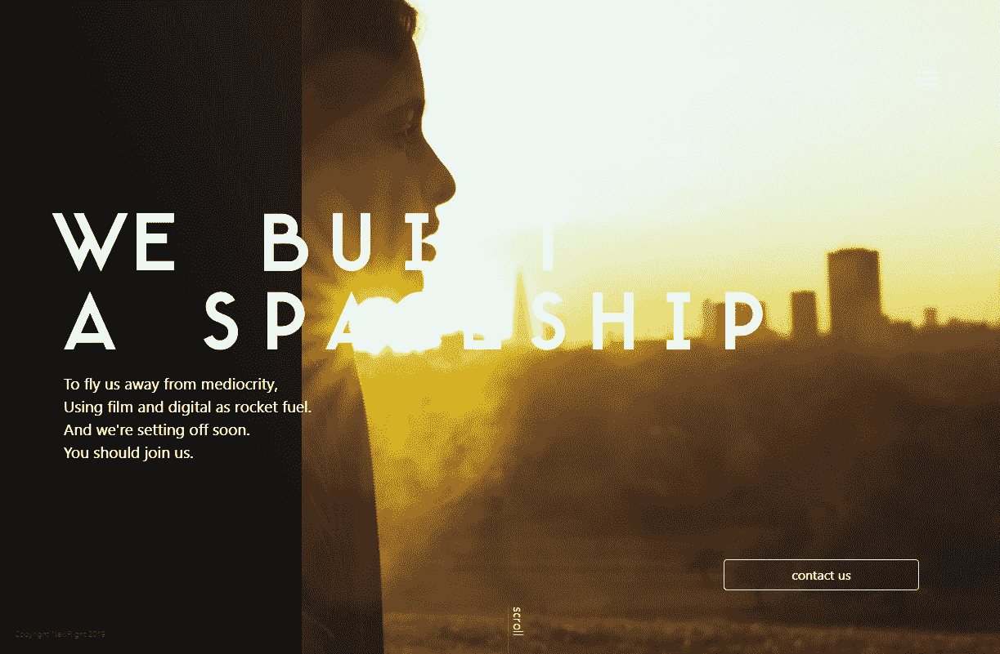

Assymetry is still very popular  (Source: New Flight)

破碎网格设计仍然非常流行。网站经常选择避免典型的布局，选择更艺术的东西，在整个屏幕上有大量重叠的部分和元素。这是一种很难成功的风格，但是一旦你成功了，它看起来就很棒。

但是对于那些对完全打破模式不感兴趣的人来说，一点点的不对称是一个可以接受的选择。不对称分屏设计尤其受欢迎，即使这些网站仍然坚持网格。

说到网格，CSS grid 是对 CSS 的一个超级强大的补充，可以在二维、列和行中工作，并允许您轻松地从头开始创建网站布局。用一点 CSS 魔法你也可以创建一个破碎的网格布局，所以一切皆有可能。Web 设计人员和开发人员开始接触 CSS grid，所以不要错过。

### 更多效果和动画

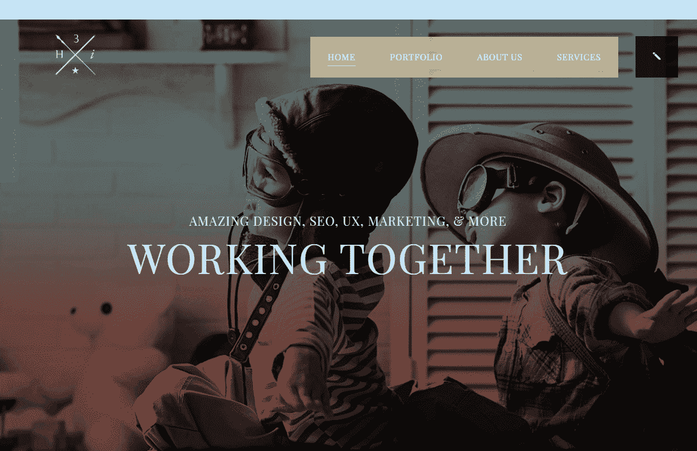

Animations can have a positive impact on UI and UX design  (Source: 3H-i)

尽管野蛮主义在网络的某些角落变得司空见惯，但其余的都集中在 UI/UX 设计上:创造更漂亮的界面，同时改善用户体验。

其中很大一部分是在微观互动中。想一想悬停在[商店](https://kinsta.com/blog/woocommerce-vs-shopify/)的产品上，或者玩一个互动的动画背景。这些微小的动画使网站导航更加有趣，并为点击和悬停这样的小交互带来乐趣。一些网站甚至实现了可爱的迷你游戏。

但这不全是为了好玩。微交互通常与普通的微妙动画有着相同的目的:它们将用户的注意力引向重要的 UI 元素。过度实现会很快变得陈旧，所以这是一个计算出你的网站上应该包含多少动画的游戏。

滚动和视差效果当然一如既往地受欢迎，可以给页面添加动态的分层外观，使其更加有趣。

此外，请注意自定义光标。这些曾经很少出现在小型博客或儿童网站之外，但现在它们是一个流行的选择，尤其是围绕 3D 动画背景或导航构建的网站。一个优雅的自定义光标真的可以提升你的审美。

### 空格

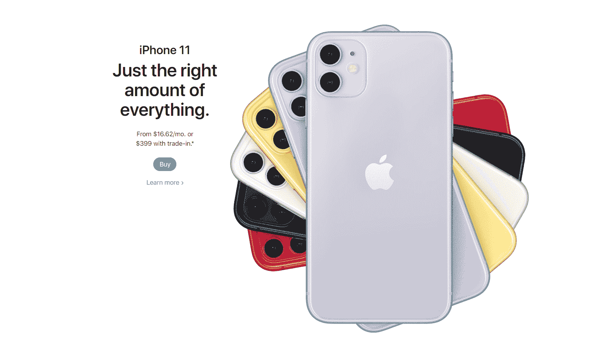

White space still wins  (Source: Apple)

一如既往，留白和简洁的设计将继续在网页设计趋势中占有一席之地。简单干净是一个安全的选择:这是为什么这种风格出现在几乎每一个现代网站上的原因。

但是，即使你的目标是一个更大胆、更独特的方法，空白仍然是你需要解决的问题。[每个站点](https://kinsta.com/blog/wordpress-site-examples/)都需要呼吸空间，留白可以用来精心突出和强调图片或其他内容。

大量的空白空间可以发挥很大的作用，整个屏幕都留白，给重要的元素留出足够的空间。最大限度的留白是一种风格，很可能会在未来几年持续下去。

### 渐进式网络应用

移动设计的下一件大事:渐进式网络应用。这些基于网络的平台建立在像 HTML T1 和 T2 JavaScript T3 这样的代码之上，但是它们的功能和行为就像是移动用户的迷你应用。它们旨在提供应用程序的体验，而不需要实际建立在移动技术上或发布在应用程序商店上。

pwa 可以离线工作，可以发送通知，可以被钉在主屏幕上，但是你不需要下载或者分发任何东西。它们很轻，加载速度也很快，所以不会占用太多带宽。

甚至 Twitter 也加入了 PWAs，为网速慢的人开发了 Twitter Lite 作为解决方案。他们最终把这个系统集成到了他们的主界面上。这证明了这项技术的有效性。

如果你还没有听说过渐进式网络应用，你一定要做一些研究。建立一个可以让你的移动用户体验更流畅。

[Looking for ideas to give your #WordPress site a facelift? Check out the latest web design trends of recent years and get inspired! 👩‍🎨💡Click to Tweet](https://twitter.com/intent/tweet?url=https%3A%2F%2Fkinsta.com%2Fblog%2Fweb-design-trends%2F&via=kinsta&text=Looking+for+ideas+to+give+your+%23WordPress+site+a+facelift%3F+Check+out+the+latest+web+design+trends+of+recent+years+and+get+inspired%21+%F0%9F%91%A9%E2%80%8D%F0%9F%8E%A8%F0%9F%92%A1&hashtags=webdev%2Cdesign)

## 摘要

2018 年和 2019 年对于网络世界来说是激动人心的几年。2020 已经带来了更多冒险的设计。在接下来的几年里，像不对称、明亮的颜色、野蛮主义和引人注目的动画等打破规则的元素将继续流行。

谁知道接下来会发生什么？我们肯定会迎来更多非传统的新艺术风格。

如果你还没有明白，也许是时候重新构思你的一些设计，抓住这些热门的新趋势了。期待看到品牌和设计师真正开始表达自己，互联网变得更加充满活力和有趣。

下一个十年的网页设计很可能以冒险和创新为特征，所以确保你准备好跟上时代。

* * *

让你所有的[应用程序](https://kinsta.com/application-hosting/)、[数据库](https://kinsta.com/database-hosting/)和 [WordPress 网站](https://kinsta.com/wordpress-hosting/)在线并在一个屋檐下。我们功能丰富的高性能云平台包括:

*   在 MyKinsta 仪表盘中轻松设置和管理
*   24/7 专家支持
*   最好的谷歌云平台硬件和网络，由 Kubernetes 提供最大的可扩展性
*   面向速度和安全性的企业级 Cloudflare 集成
*   全球受众覆盖全球多达 35 个数据中心和 275 多个 pop

在第一个月使用托管的[应用程序或托管](https://kinsta.com/application-hosting/)的[数据库，您可以享受 20 美元的优惠，亲自测试一下。探索我们的](https://kinsta.com/database-hosting/)[计划](https://kinsta.com/plans/)或[与销售人员交谈](https://kinsta.com/contact-us/)以找到最适合您的方式。