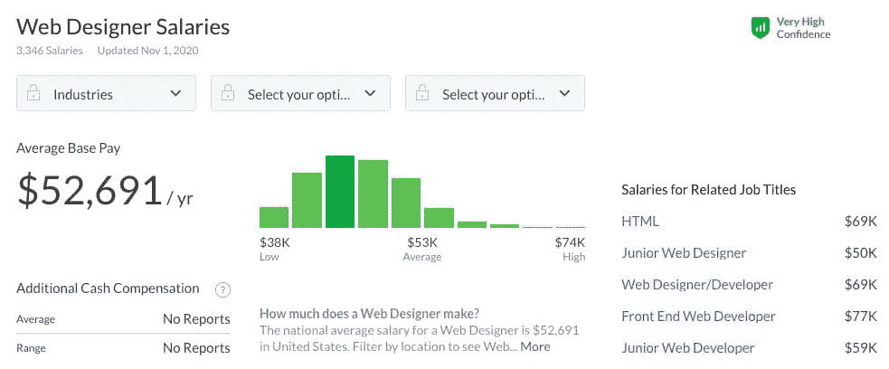
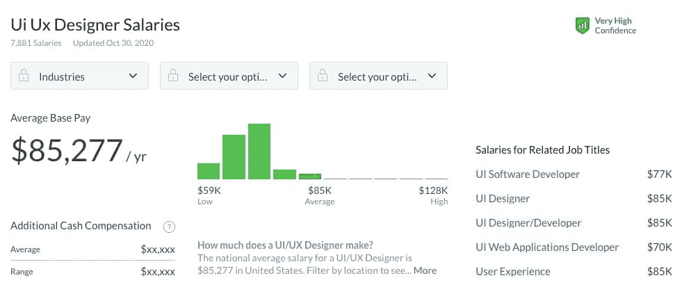
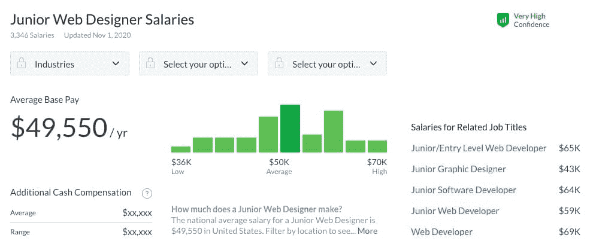
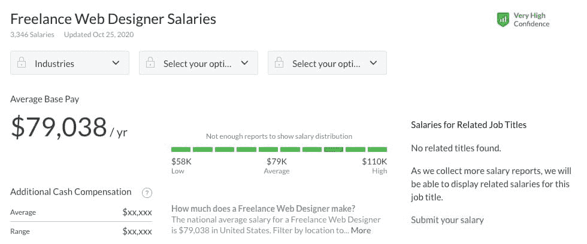
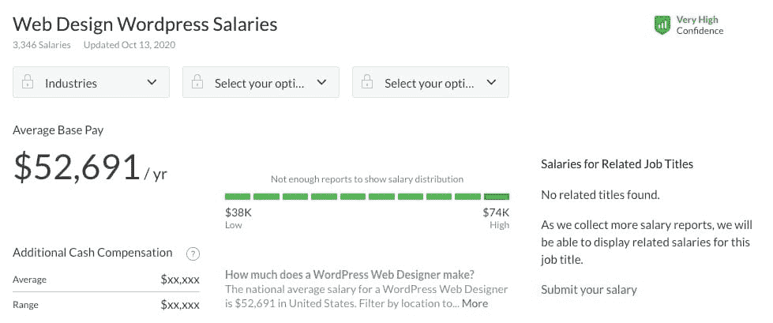
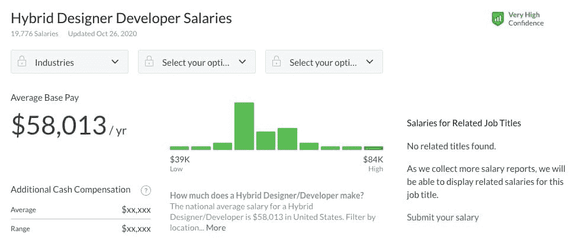

# 2022 年网页设计师的平均工资是多少？深入研究数据

> 原文：<https://kinsta.com/blog/web-designer-salary/>

网页设计为充满激情的创作者提供了一种现代的、独特的方式来表达他们在视觉设计中的创造力和技能。这是一个令人兴奋的职业，尤其是在这个网页设计和开发领域的发展时期。

任何网页设计师都会告诉你，这份工作有起有落。但当它是你真正想做的事情时，它可能是一个令人满意的职业。

但这里有一个大问题:网站设计师的薪水能支付账单吗？如果你决定投身于网页设计事业，你期望得到多少薪水？答案是，这取决于很多因素。

无论你是成为一名自由职业者，全职工作，还是在 WordPress 工作，我们收集了所有经验水平的网页设计师的薪水。

现在让我们看看是否值得努力学习。

## 做一个网页设计师需要什么？

在你担心网页设计师挣多少钱之前，工作要求是什么？除非你遇到他们，否则你根本无法打入这个行业。

在你申请你的第一份网页设计工作之前，准备好这些核心技能。

> 需要在这里大声喊出来。Kinsta 太神奇了，我用它做我的个人网站。支持是迅速和杰出的，他们的服务器是 WordPress 最快的。
> 
> <footer class="wp-block-kinsta-client-quote__footer">
> 
> 
> 
> <cite class="wp-block-kinsta-client-quote__cite">Phillip Stemann</cite></footer>

[View plans](https://kinsta.com/plans/)

第一:教育。严格来说，没有必要拥有学位，雇主越来越多地只根据经验和才能来招聘员工。尽管如此，这还是在冒险，所以至少，你需要有设计、计算机技术或其他相关技能的大专文凭。学士学位就更好了。查看我们的最佳[网页设计在线课程](https://kinsta.com/blog/web-design-courses/)指南。

不管有没有学位，你都需要经验，你应该创建一个文件夹来展示你以前的工作。一份好的投资组合可以让你被雇佣。

最后，要成为一名网页设计师，你需要广泛的技能，有些是技术性的，有些是创造性的。

*   平面设计技巧
*   熟练使用网页设计工具(Photoshop，Sketch，InVision Studio 等)。)
*   一些前端编程知识: [HTML](https://kinsta.com/blog/free-html-editor/) 、 [CSS](https://kinsta.com/blog/wordpress-css/) 、 [JavaScript](https://kinsta.com/blog/defer-parsing-of-javascript/) 等。
*   团队合作和沟通技巧
*   了解 web 标准，如 [SEO](https://kinsta.com/blog/wordpress-seo/) 、可访问性和其他协议。

[有兴趣成为网页设计师吗？✅读此先⬇️ 点击推文](https://twitter.com/intent/tweet?url=https%3A%2F%2Fkinsta.com%2Fblog%2Fweb-designer-salary%2F&via=kinsta&text=Interested+in+becoming+a+web+designer%3F+%E2%9C%85++Read+this+first+%E2%AC%87%EF%B8%8F&hashtags=WebDesign%2CTechCareers)

### 网页设计师的日常工作

作为一名网页设计师，你的任务会根据你在一个项目中的进度而有所不同。你可能会花一整天的时间为客户完善草图和线框，或者为其他人用 HTML 编写整个模型。

从学习交易工具开始。传统的 Adobe 套件(Photoshop、InDesign、XD、Dreamweaver)仍然是许多网页设计师坚持使用的。不过，还有很多更便宜的选择。其中包括 Sketch、Figma、InVision Studio、GIMP、UXPin 等等。

掌握一些编码语言也很重要。HTML，CSS，JavaScript 是必须的。框架和像 Bootstrap 这样的库也值得一看。此外，你还可以选择学习一门 [最好的编程语言来学习](https://kinsta.com/blog/best-programming-language-to-learn/) ，比如 [PHP](https://kinsta.com/blog/php-developer-salary/) ，Python 或者 Ruby。

知道这些工具当然很好，但是[网页设计师用它们做什么呢](https://kinsta.com/blog/responsive-web-design/)？

大多数项目都遵循类似的过程。

第一:概念阶段。这就是沟通技巧的用武之地。你将和其他人一起想出一个网站的概念，项目/品牌指南，和最后期限。这只是概述了项目的范围和跳跃的想法。

然后真正的工作开始了。你将勾画出网站设计，并制作线框，直到你缩小了一个更具体的想法。你可以制作一个网站地图来更好地理解所有的东西是如何布局的。

然后:模型。这些是关于实际网站外观的更深入的想法，尽管你仍然会得到大量的客户输入。在这里，你将改变[颜色](https://kinsta.com/blog/website-color-schemes/)、定位、[排版](https://kinsta.com/blog/web-safe-fonts/)和其他设计元素，使之尽善尽美。

在开发者的帮助下，一旦你有了一个可以工作的网站，接下来就是测试和发布了。确保一切正常运行，没有遗漏任何东西。这就是设计师端网站创建的通常流程。

## 网页设计师的平均工资

虽然有几个因素将决定你期望获得什么样的薪酬——经验、技能或平台的数量——但了解大多数设计师的平均薪酬是有好处的。

这将让你知道一旦你确立了自己的地位，你会期望得到什么。你也可以将它与你感兴趣的其他工作的平均工资进行比较，看看哪一份工资最高。例如，[网站开发人员的薪水](https://kinsta.com/blog/web-developer-salary/)通常在每年 6 万到 7.5 万美元之间。

网页设计工资如何比较？

*   [玻璃门](https://www.glassdoor.com/Salaries/web-designer-salary-SRCH_KO0,12.htm):53k 美元/年，低的 38k 美元，高的 74k 美元。
*   [工资等级](https://www.payscale.com/research/US/Job=Web_Designer/Salary):51k 美元/年，最低 35k 美元，最高 74k 美元。
*   [zip recruiter](https://www.ziprecruiter.com/Salaries/Web-Designer-Salary):6 万美元/年，低的 2.1 万美元，高的 11.4 万美元。
*   [Salary.com](https://www.salary.com/research/salary/benchmark/web-designer-i-salary):6.5 万美元/年，最低 5 万美元，最高 7.7 万美元。

把所有这些数据放在一起，一个网页设计师的平均年薪大约是 5.7 万美元。

Average web designer salary

这些网站收集了来自世界各地的设计师自我报告的薪水。它不像政府收集的数据那样官方，但你可以假设它是相当准确的，有一些误差。

与有经验的 web 开发人员的收入相比，这个工资并不算高。但是，尽管这个行业对网页设计的重视程度低于对开发的重视程度，但你不会因为你的工作而赚到一分钱。一旦你有了稳定的收入，你就应该能够挣到可以维持生活的工资。

在视觉艺术领域，这也是一份收入颇丰的工作——你会比平面设计师、艺术家、插画师或摄影师挣得更多。

### **网页设计 vs. UI 设计 vs. UX 设计薪资**

网页设计和 [UI/UX 设计](https://kinsta.com/blog/responsive-web-design/)齐头并进。大多数设计师对 UI 都有足够的了解，但是这是一个非常复杂的工作，你可以选择把它作为职业。把 UI/UX 设计看作是网页设计的一种特殊形式。

UI，或用户界面，设计师创建网站界面。他们是完善网站精确间距、布局和互动的人。当网页设计师在大画面上工作，选择元素的颜色或一般布局时，用户界面设计师处理最小的细节。

*   [glass door](https://www.glassdoor.com/Salaries/user-interface-designer-salary-SRCH_KO0,23.htm):85k 美元/年，低的 59k 美元，高的 128k 美元。
*   [工资等级](https://www.payscale.com/research/US/Job=User_Interface_Designer/Salary):64k 美元/年，最低 44k 美元，最高 92k 美元。
*   [确实](https://www.indeed.com/salaries/user-interface-designer-Salaries):8.7 万美元/年。

平均下来，你会得到 79k 美元/年的 UI 设计师工资。

还有 UX 的设计师。虽然 UI 设计师让这些细节看起来更好，但让它们感觉更好是 UX 设计师的工作。它们确保浏览网站的感觉良好，动画在恰当的时刻触发，带来完美的体验。

*   [glass door](https://www.glassdoor.com/Salaries/user-experience-designer-salary-SRCH_KO0,24.htm):85k 美元/年，低的 59k 美元，高的 128k 美元。
*   [工资等级](https://www.payscale.com/research/US/Job=UX_Designer/Salary):7.4 万美元/年，最低 5 万美元，最高 10.8 万美元。
*   [的确](https://www.indeed.com/career/user-experience-designer/salaries):10.3 万美元/年。

这里的范围变化很大，但平均每年你可以赚 87 万美元。

最后，还有 UI/UX 设计师组合。这两个工作有很多重叠的地方，所以很多设计师都选择兼收并蓄。

*   [glass door](https://www.glassdoor.com/Salaries/ui-ux-designer-salary-SRCH_KO0,14.htm):85k 美元/年，低的 59k 美元，高的 128k 美元。
*   [确实](https://www.indeed.com/salaries/ux-ui-designer-Salaries):87k 美元/年到 103k 美元/年。
*   [zip recruiter](https://www.ziprecruiter.com/Salaries/UX-UI-Designer-Salary):96k 美元/年，低的 34k 美元，高的 150k 美元。

平均起来，UI/UX 设计师每年可以赚 8.9 万美元。

UI and UX designer salary

如你所见，UI/UX 设计师确实比网页设计师挣得多一点。

这可能是因为这是一份更专业的工作，需要更多的经验，也因为它在更大的项目中更受欢迎。每个项目，无论大小，都需要一个网页设计师。但是，更大的、薪水更高的工作会雇佣多个不同专业的设计师。

## 注册订阅时事通讯

### 想知道我们是怎么让流量增长超过 1000%的吗？

加入 20，000 多名获得我们每周时事通讯和内部消息的人的行列吧！

[Subscribe Now](#newsletter)

### **网页设计经验工资**

经验水平是另一个对你作为网页设计师的收入有很大影响的因素。更多的经验意味着更高的报酬。

作为大三学生，你只有不到三年的经验。你应该大致了解网页设计是如何工作的，也许已经有了一两个项目，但是会有津贴来帮助你适应公司。

*   [glass door](https://www.glassdoor.com/Salaries/junior-web-designer-salary-SRCH_KO0,19.htm):5 万美元/年，低的 3.6 万美元，高的 7 万美元。
*   [Linkedin](https://www.linkedin.com/salary/junior-web-designer-salaries-in-united-states):41k 美元/年，低的 31k 美元，高的 58k 美元。
*   [工资等级](https://www.payscale.com/research/US/Job=Junior_Web_Designer/Salary):4 万美元/年，最低 3 万美元，最高 5.9 万美元。
*   [zip recruiter](https://www.ziprecruiter.com/Salaries/Junior-Web-Designer-Salary):45k 美元/年，低的 31k 美元，高的 59k 美元。

总的来说，初级设计师的年薪约为 4.4 万美元，远低于设计师整体的平均水平。

Junior web designer salary

另一方面，大四学生一般都有 5 年以上的工作经验。到那时你应该知道你在做什么，并且以前做过很多项目。这伴随着高得多的薪水。

*   [glass door](https://www.glassdoor.com/Salaries/senior-web-designer-salary-SRCH_KO0,19.htm):64k 美元/年，低的 46k 美元，高的 90k 美元。
*   [工资等级](https://www.payscale.com/research/US/Job=Senior_Web_Designer/Salary):7.1 万美元/年，最低 5 万美元，最高 9.8 万美元。
*   [zip recruiter](https://www.ziprecruiter.com/Salaries/Senior-Web-Designer-Salary):8.2 万美元/年，低的 4.2 万美元，高的 13 万美元。

这让高级网页设计师每年赚 72000 美元，比初级设计师多将近 30000 美元。

Senior web designer salary

不出所料，大三学生的工资比网页设计的平均工资低一点，大四学生的工资高一点。这不是额外收入的爆炸式增长，但是一旦你进入这个行业，你肯定可以期望赚更多的钱。

### 自由职业网页设计薪水

初级和高级职位是公司中受薪职位的专有职位。许多潜在的设计师选择成为自由职业者，主动寻找客户和承接项目。那你预计能赚多少？

Freelance web designer salary

*   [glass door](https://www.glassdoor.com/Salaries/freelance-web-designer-salary-SRCH_KO0,22.htm):79k 美元/年，低的 58k 美元，高的 110k 美元。
*   [zip recruiter](https://www.ziprecruiter.com/Salaries/How-Much-Does-a-Freelance-Web-Designer-Make-a-Month):56k 美元/年，低的 24k 美元，高的 112k 美元。

没有太多的数据，因为许多自由职业者不报告他们的工资，收入范围可能相当不稳定。但是成功的自由职业者似乎比初级设计师挣得多，年薪 6.8 万美元。

如果你擅长搞定客户，你的薪水可能会相当不错。这肯定不如有薪工作可靠，但许多人已经设法通过自由职业过上了不错的生活。

### WordPress 网页设计师工资

WordPress 网站设计者有一套独特的技能来更好地使用这个流行的平台。你可以使用 HTML 和 CSS 在 WordPress 的界面中设计网站，或者甚至学习一点 Javascript 和 PHP 成为一名主题设计师。这是你做这件事能挣多少钱。

需要为您的客户站点提供超快的、安全的、开发人员友好的托管服务吗？Kinsta 是为 WordPress 开发者设计的，提供了大量的工具和强大的仪表板。[查看我们的计划](https://kinsta.com/plans/?in-article-cta)

*   [玻璃门](https://www.glassdoor.com/Salaries/web-design-wordpress-salary-SRCH_KO0,20.htm):53k 美元/年，低的 38k 美元，高的 74k 美元。
*   [zip recruiter](https://www.ziprecruiter.com/Salaries/Wordpress-Designer-Salary):55k 美元/年，低的 31k 美元，高的 91k 美元。
*   [工资等级](https://www.payscale.com/research/US/Job=Web_Designer/Salary/d21f74c1/Wordpress):45k 美元/年，最低 33k 美元，最高 64k 美元。

这意味着 WordPress 的设计师每年可以赚 51，000 美元。

WordPress web designer salary

WordPress web 设计和开发是一个有点过饱和的领域。这是最容易上手的平台之一，尤其是对自由职业者来说。但这意味着激烈的竞争。除非你擅长设计和自我营销，否则不要指望赚很多钱。

### 混合设计师-开发人员工资

你可能会认为一个能处理好网页设计各个方面的人是稀有且有价值的商品。做一个会编码的网页设计师，或者一个会设计的程序员需要很多技巧。他们甚至被称为 web 开发社区中的“独角兽”,因为他们非常罕见。但是工资值得努力吗？

*   [glass door](https://www.glassdoor.com/Salaries/hybrid-designer-developer-salary-SRCH_KO0,25.htm):58k/年，低的 39k，高的 84k。
*   [工资等级](https://www.payscale.com/research/US/Job=Web_Designer_%26_Developer/Salary):58k 美元/年，最低 39k 美元，最高 89k 美元。

这里列出的薪水非常相似，所以你可以假设平均年薪为 5.8 万美元。

Hybrid designer developer salary

混合设计师和开发人员的收入肯定高于平均水平，但工作量翻倍，你的工资也不会翻倍。如果你喜欢自己制作小网站，这可能是一份值得追求的工作，但大多数时候你的额外资产会被闲置。

无论如何，许多人更喜欢雇佣不同的设计师和开发人员。对于更大的项目，你不可能一个人处理所有的事情。

虽然它可以帮助你作为一个设计师了解开发人员是如何处理事情的，也可以让你更快地实现你自己的想法，但最好还是坚持其中的一个。

尽管如此，拥有一些前端语言的编码能力，如 Javascript、CSS 和 HTML，是非常可取的，可以增加你被雇用的机会。

### 网页设计师与网页开发人员的工资

不幸的是，网页设计师往往比他们的编程同行挣得少。但是差别到底有多大呢？

平均而言，[网页开发人员](https://kinsta.com/blog/web-developer-salary/#the-average-web-developer-salary)的年薪为 6 万-7.5 万美元，而网页设计师的年薪仅为 5.7 万美元。这里的差异相当大。

此外，还有其他因素需要考虑。初级开发人员平均年薪为 5.5 万美元，而高级开发人员年薪为 9.2 万美元。相比之下，在完全相同的经验水平下，设计师的费用为每年 44，000 美元和每年 72，000 美元。开发商开始赚得更多，收入增长更快。

最后，自由职业的网络开发人员每年能挣 72000-75000 美元，而自由设计师每年只能挣 68000 美元。

两者对于创建一个成功的网站都是必要的，为什么会有差异呢？可悲的是，许多创造性的工作报酬不高，设计工作往往被低估。平心而论，开发者需要掌握多种复杂的[编程语言](https://kinsta.com/blog/scripting-languages/)，并学会如何应用。但是这两项工作都需要很多技能。

这并不意味着网页设计师什么也赚不到。你仍然可以赚很多钱，尤其是如果你投身于像用户界面/UX 设计或移动应用程序设计这样的高薪领域。

如果你乐意做任何一份工作，那么仅仅为了更高的薪水去追求发展是值得的。但是设计师也是一样必要的，如果这是你想做的工作，没有理由放弃它。

## 你应该成为一名网页设计师吗？

知道了开发者赚钱多，你可能会问:网页设计是我想从事的职业吗？

虽然网络开发人员的平均收入确实更高，但这并不是为了一些潜在的不相容的东西而放弃你梦想中的职业的理由。这两者在网站创建过程中做的事情非常不同。

开发人员使用复杂的编程语言来创建设计的合理实现，而设计师则采用更直观的方法，专注于创造功能美。设计师做计划，开发人员负责实施。

成为一名设计师或开发人员所需的许多技能是重叠的，但是你每天所做的很多事情是完全不同的。如果你更喜欢计划和视觉学习，大图胜于小细节，网页设计将会是你的完美选择。

如果你对薪水不满意，可以考虑专攻。多面手的网页设计师很常见，而熟练的 UX 设计师或手机设计师则不多见。缩小和完善你的技能组合是可以赚钱的。

Web 开发是一个不断增长的行业，哪里有开发者，哪里就需要设计师。如果这是你想要的职业，工资还算公道，行业也在成长。现在是成为网页设计师的好时机！

[Before you take your next career leap, let's do the math and learn how much you can expect to make as a web designer 💰Click to Tweet](https://twitter.com/intent/tweet?url=https%3A%2F%2Fkinsta.com%2Fblog%2Fweb-designer-salary%2F&via=kinsta&text=Before+you+take+your+next+career+leap%2C+let%27s+do+the+math+and+learn+how+much+you+can+expect+to+make+as+a+web+designer+%F0%9F%92%B0&hashtags=TechJobs%2CWebDesign)

## 摘要

网页设计肯定不是这个领域里收入最高的工作，但这并不意味着它不值得追求。你可以从中成就一份伟大的事业，尤其是如果你追求像 UI/UX 设计这样的利基领域。你的经验越多，你挣的就越多。

网页设计师平均年薪为 5.7 万美元。这将受到一些因素的影响，比如你在公司的职位，如果你专攻 UI 设计，或者你选择使用什么平台。刚开始你可能会挣得少一些，但是坚持下去，你肯定会挣得更多。

不要低估你自己，知道你应该为什么样的工资而工作，学习你所在行业的最佳实践。如果你知道如何运用自己，成为一名成功的网页设计师是不太可能的。

* * *

让你所有的[应用程序](https://kinsta.com/application-hosting/)、[数据库](https://kinsta.com/database-hosting/)和 [WordPress 网站](https://kinsta.com/wordpress-hosting/)在线并在一个屋檐下。我们功能丰富的高性能云平台包括:

*   在 MyKinsta 仪表盘中轻松设置和管理
*   24/7 专家支持
*   最好的谷歌云平台硬件和网络，由 Kubernetes 提供最大的可扩展性
*   面向速度和安全性的企业级 Cloudflare 集成
*   全球受众覆盖全球多达 35 个数据中心和 275 多个 pop

在第一个月使用托管的[应用程序或托管](https://kinsta.com/application-hosting/)的[数据库，您可以享受 20 美元的优惠，亲自测试一下。探索我们的](https://kinsta.com/database-hosting/)[计划](https://kinsta.com/plans/)或[与销售人员交谈](https://kinsta.com/contact-us/)以找到最适合您的方式。