# 2022 年要用的 60 个牛逼的网络开发工具

> 原文：<https://kinsta.com/blog/web-development-tools/>

打开“文本编辑”或记事本，输入“”开始一个新项目，这是一件浪漫而令人兴奋的事情。这就是我们中的许多人开始痴迷于网络编码的原因。在 2022 年，网络开发工具不仅仅是记录我们的文本，它们还帮助我们创建项目并加速整个过程。除此之外，还有比 HTML 和 CSS T2 更多的元素需要考虑。

例如，规划阶段至关重要。你需要考虑线框图、设计选择和协作工作流程。然后是选择理想的 [JavaScript 框架](https://kinsta.com/blog/php-vs-javascript/)，是否使用[集成开发环境(IDE)](https://kinsta.com/blog/php-editor/) ，等等。

在本帖中，我们将看看你在 2022 年想要考虑使用的 60 种网络开发工具。但是在我们开始之前，让我们先谈谈我们认为的 web 开发工具是什么。

## 我们所认为的网络开发工具

从表面上看，对 web 开发工具进行分类似乎很简单。然而，即使潜入浅水区，也要考虑一些模糊界限的因素。

例如，考虑视频流服务是否算作开发工具。在泡沫中，可能不会。然而，如果你用它来为一个特定的设计应用记录你的屏幕，它会突然变成一个独特的协作工具。

在我们看来，web 开发工具是帮助你以一种集中的方式实现项目目标的东西。虽然这并不包括单独的编程语言，但是有*子集、*超集和框架[，比如横跨这条线的 TypeScript](https://kinsta.com/blog/scripting-languages/) 。如果你想[挣大钱](https://kinsta.com/blog/web-developer-salary/#what-do-you-need-to-become-a-web-developer)，关注这些方面是至关重要的。

再举一个例子，[考虑 Git](https://kinsta.com/knowledgebase/git-vs-github/) 。你可能会说这个版本控制系统(VCS)覆盖了很多领域。有一种特定的语言用于运行命令，核心功能在 web 开发方面提供了很多。但是，您也可以将它用作学习工具，特别是通过搜索问题跟踪日志和提交。


> Kinsta 把我宠坏了，所以我现在要求每个供应商都提供这样的服务。我们还试图通过我们的 SaaS 工具支持达到这一水平。
> 
> <footer class="wp-block-kinsta-client-quote__footer">
> 
> 
> 
> <cite class="wp-block-kinsta-client-quote__cite">Suganthan Mohanadasan from @Suganthanmn</cite></footer>

[View plans](https://kinsta.com/plans/)

总的来说，web 开发工具实际上可以是任何使您的项目高效运行的工具。您会在工具列表中注意到这种多样性。

## Web 开发工具如何简化您的工作流程

在接下来的几个词之前，我们会给你一个触发警告:“[关键时刻](https://kotaku.com/crunch-time-why-game-developers-work-such-insane-hours-1704744577)”

是的，这个可怕的短语迫切需要节省时间的 web 开发工具来拯救世界。统计数据显示，越来越多的项目使用 crunch T1 作为标准，许多开发行业至今仍在使用它。

不管你的公司是否使用或需要 crunch 和加班，web 开发工具仍然可以提供帮助。这些工具可以完成繁重的工作，并自动完成日常工作。因此，它们为你的生产力提供了一个有机的提升。

然而，如果你在一个敏捷的项目框架下运作，比如 Scrum T1，他们也会提供额外的好处。例如，考虑一个工具[如 JSFiddle](https://jsfiddle.net/) 如何帮助你在一个 sprint 的末尾与其他团队分享片段，为下一个做准备。

更重要的是，虽然每天的单口相声无处可去，但一个 [Discord server](https://kinsta.com/blog/slack-vs-discord/) 或 [Slack channel](https://kinsta.com/blog/how-to-use-slack/) 可以提供一种更好的方式来关注和调整即将到来的一系列任务，远离你当前 sprint 目标的压力。

总的来说，web 开发工具与计划和执行一样重要。

## 如何为您的项目选择正确的开发堆栈

我们可能会对皈依者说教，但一个一流的网络开发工具值得拥有一台玫瑰金的 MacBook。因此，为您的特定项目选择合适的工具组合对于建立坚实的工作基础至关重要。

如果这是你以前没有考虑过的事情，一个[初始规划阶段](https://kinsta.com/blog/trello-vs-asana/)将被证明是无价的。花一些时间来决定你将使用的工具确实会延迟项目的编码阶段。然而，你以后会得到这个时间，因为会有更少的潜在的软件相关的麻烦。您还会看到更一致的输出水平(假设每个人都在同一页面上)。

### 选择开发堆栈的注意事项

为项目选择[右堆栈](https://medium.com/swlh/what-is-a-technology-stack-choosing-the-right-tech-stack-for-your-web-project-3f295cf60f10)归结为以下几点:

*   复杂度:考虑你的交付物需要有多复杂，因为这将决定堆栈的复杂度。
*   **可扩展性:**如果你的项目是为本地企业设计的，这将需要为全球企业提供不同的解决方案。因此，您需要一个更具可扩展性的堆栈来实现您的目标。
*   **安全性:**毫无疑问，无论你选择什么，都不应该损害[用户和网站的安全性](https://kinsta.com/blog/how-to-use-ssh/)。
*   成本:当然，没有人喜欢超支，如果预算紧张，这将比空白支票簿更重要。

您可以将技术分为两个领域:

*   **服务器端:**在这里，您会想看看您使用的后端技术。例如，你会想看看你在[选择的托管](https://kinsta.com/clients/local-digital/)和 web 服务器、[键值和 SQL 存储](https://kinsta.com/knowledgebase/what-is-mysql/)，你将使用的任何应用和自动化框架，当然还有编程语言。
*   客户端:你的前端工具选择可能会更简单，尤其是当涉及到你使用的语言时。虽然 [HTML、CSS 和 JavaScript](https://kinsta.com/knowledgebase/edit-wordpress-code/) 将成为特色，但是您对 JavaScript 框架(和自动化框架)的选择将需要一些考虑。

当谈到一些[现实世界的开发栈](https://rubygarage.org/blog/technology-stack-for-web-development#article_title_15)时，你会注意到许多大型网站使用 JavaScript 和 [React.js](https://reactjs.org/) 以及 [Nginx](https://kinsta.com/knowledgebase/what-is-nginx/) 的某种组合。你还会在开发栈中看到 [Memcached](https://www.memcached.org/) 、 [Redis](https://kinsta.com/help/redis-cache/) 和 [Ruby on Rails](https://rubyonrails.org/) 。
T13】

## 2022 年要用的 60 个牛逼的网络开发工具

事不宜迟，我们来看看 2022 年推荐使用的 web 开发工具列表。我们已经将它们组织成类别，但是除此之外，这些工具没有特定的顺序。如果你赶时间，请随意跳到下面列出的特定部分。

### 当地发展环境

本地开发环境是任何开发栈的基本部分。然而，它对 web 开发尤其重要。以下是一些最著名的本地开发工具。

#### 1.德夫金斯塔


The DevKinsta splash screen.


我们可能有偏见，但是 [DevKinsta](https://kinsta.com/devkinsta/) 可能会成为 2022 年及以后的头号网络开发工具。

忽略这一点——我们*对*有偏见，我们为我们发布的内容感到自豪！

对于外行来说，DevKinsta 是一种帮助你快速启动本地 WordPress 安装的方式。这是一个完整的套件，可以让你为 macOS 和 Windows 机器设计、开发和部署一个 WordPress 站点(Linux 版本正在开发中)。

您可以根据当前项目定制您的安装。例如，您的“服务器”可以使用 Nginx 或 Apache，您选择的 PHP 版本，运行 [MariaDB 或 MySQL](https://kinsta.com/blog/mariadb-vs-mysql/) ，等等:

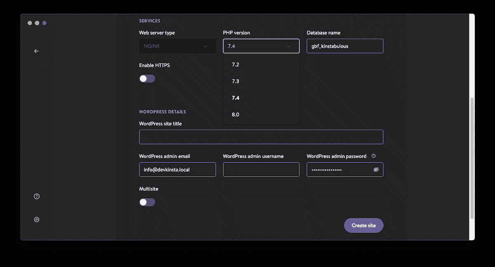

DevKinsta’s setup options.


引擎盖下还有更多。你也可以通过内置的 [SMTP 服务器](https://kinsta.com/blog/smtp-port/)来[调试和测试](https://kinsta.com/blog/wordpress-debug/)电子邮件，对于数据库管理，你可以使用[强大的管理工具](https://kinsta.com/blog/adminer/):


DevKinsta’s Adminer-powered database manager.


总的来说，我们认为 DevKinsta 是现代 WordPress 开发的理想选择。它可以直接进入你的工作流程。

我们为开发人员、设计师、自由职业者和代理商设计了这个工具。然而，几乎任何有日常开发需求的人都会发现 DevKinsta 的价值——尤其是(但不仅仅是)Kinsta 用户。

更重要的是，DevKinsta 是完全免费的！

#### 2\. MAMP


The MAMP logo.


鉴于更快的沙盒工具的出现，你可能会认为用于创建和部署网页的经典工具已经寿终正寝了。然而，传统的 web 服务栈，如 [LAMP](https://help.ubuntu.com/community/ApacheMySQLPHP) 、 [MAMP](https://www.mamp.info/en/mac/) 和 [XAMPP、](https://www.apachefriends.org/download.html)仍然很强大。

通常，他们将操作系统(OS)——Linux、macOS 或 Windows——与 [Apache webserver](https://kinsta.com/blog/nginx-vs-apache/) 、MySQL 数据库以及 Python、PHP 和 Perl 编程语言组合成一个堆栈。因此，像这样的 web 服务栈在 2022 年仍然会被使用。

MAMP 是该工具的 macOS 专用版本。这种方法让您安装一个堆栈，然后进行设计和部署。虽然这个过程可能比更现代的设置更冗长，但在引擎盖下仍然有类似水平的灵活性——或者至少，潜力是存在的。

而在像 DevKinsta 这样的工具中，你将从一个光滑的图形用户界面(GUI)中进行选择，使用 web 服务堆栈，你必须手动安装你需要的附加组件。例如，如果没有“[滚动你自己的](https://kinsta.com/knowledgebase/what-is-localhost/)”，就没有内置的方法来运行 WordPress 站点与[测试邮件](https://documentation.mamp.info/en/MAMP-PRO-Windows/Servers-and-Services/Postfix/)的情况类似。

与其他本地开发环境工具一样，MAMP 完全免费。然而，也有一个适用于 Windows 和 Mac 的 MAMP 的[高级版本，它增加了功能，并提供了一个全面、强大的网络开发工具。](https://www.mamp.info/en/mamp-pro/)

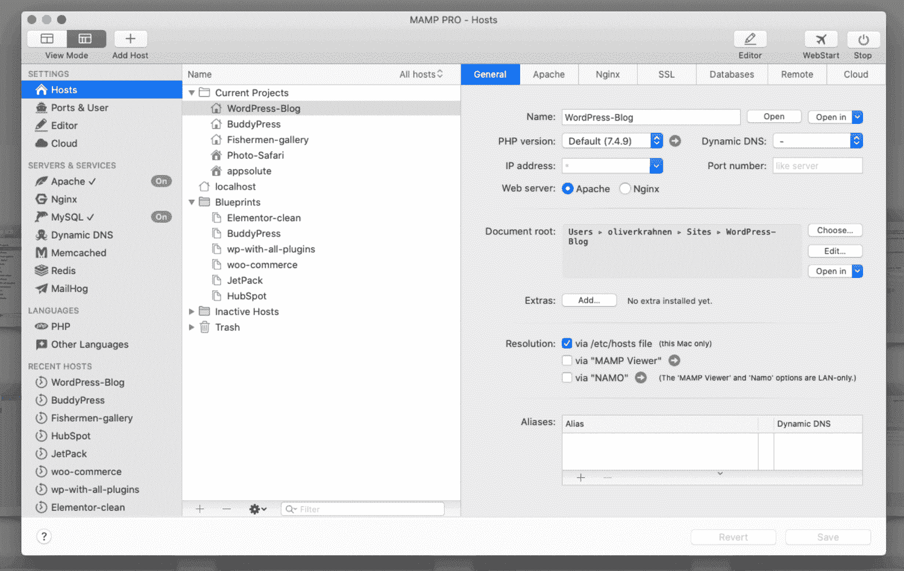

The MAMP Pro dashboard.


由于灵活性和价格的原因，经典的 web 服务栈仍然存在于许多开发人员的计算机上。命令行爱好者自然会被这个解决方案所吸引，尤其是如果你喜欢使用包管理器，比如 [Homebrew](http://brew.sh) 、 [Flatpak](https://www.flatpak.org/) 或 [Ninite](https://ninite.com/) 。

当然，Apache 开发人员也会使用这些堆栈，MySQL 和 Python 或 PHP 开发人员也是如此。推而广之，WordPress 开发者在这里也会有宾至如归的感觉。


#### 3.XAMPP

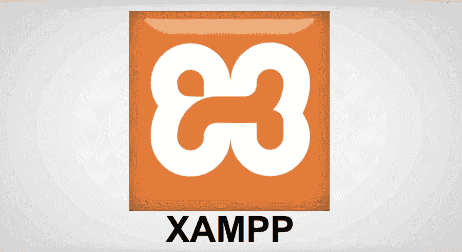

The XAMPP app.


XAMPP 是另一个深受 PHP 开发人员喜爱的 web 服务栈，包括那些开发 WordPress 产品的人。名称中的“X”代表该工具的跨平台特性。它为 Windows、macOS 和 Linux 机器提供安装程序:


The XAMPP downloads page.


虽然各种 web 服务栈之间曾经存在差异，但是不断的更新和改进已经使这个领域变得平等了。尽管如此，XAMPP 还是有一些独特的锦囊妙计。

例如，MySQL 不再是默认的关系数据库管理系统(RDMS)。相反，XAMPP 使用 MariaDB。考虑到在甲骨文收购 T1 之后转向其他解决方案，这可能是对生产服务器更准确的描述。

此外，XAMPP 软件包中还有一个 web 应用安装程序。 [Bitnami](https://bitnami.com/stack/xampp) 类似于 [Softaculous](https://www.softaculous.com/) 等解决方案，但 Bitnami 是 XAMPP 特有的:

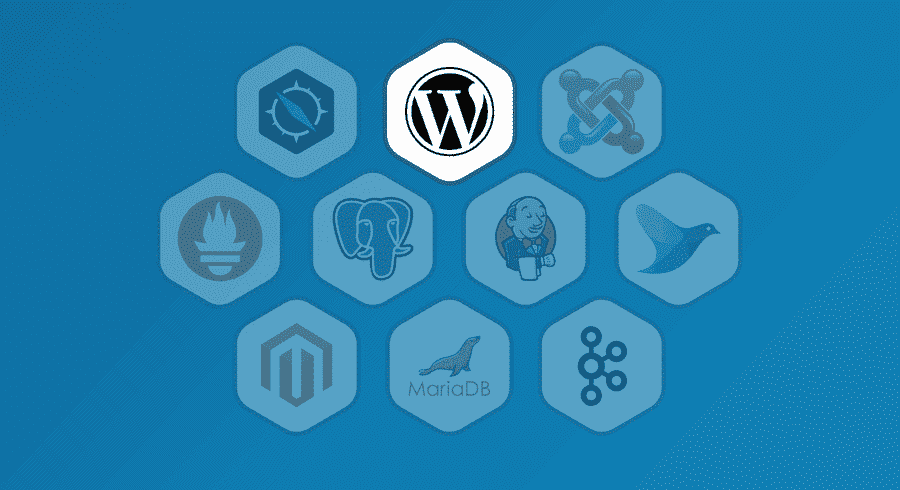

The Bitnami homepage.


虽然有许多可用的应用程序，但你可能对 WordPress 安装程序最感兴趣。尽管如此，仍有许多附加组件可供选择，使 XAMPP 成为当地发展的灵活解决方案。

### 文本和代码编辑器

大多数开发人员喜欢争论应该使用哪种代码编辑器。好吧，我们是夸张的，但是在这个问题上有很多观点，每个编辑都有狂热的支持者。

然而，如果[调查是正确的](https://insights.stackoverflow.com/survey/2019#technology)，你可能正在使用[崇高文本](https://www.sublimetext.com/)、 [Visual Studio 代码(VSCode)](https://code.visualstudio.com/) 或 [IntelliJ IDEA](https://www.jetbrains.com/idea/) 。这是有意义的，因为这三个工具从简单的文本编辑扩展到成熟的集成开发环境(IDE)。然而，还有其他值得一提。让我们来看看其中的几个。

#### 4.Visual Studio 代码

自 2015 年推出以来， [Visual Studio Code](https://code.visualstudio.com/) 的使用在各种开发桌面中呈爆炸式增长。

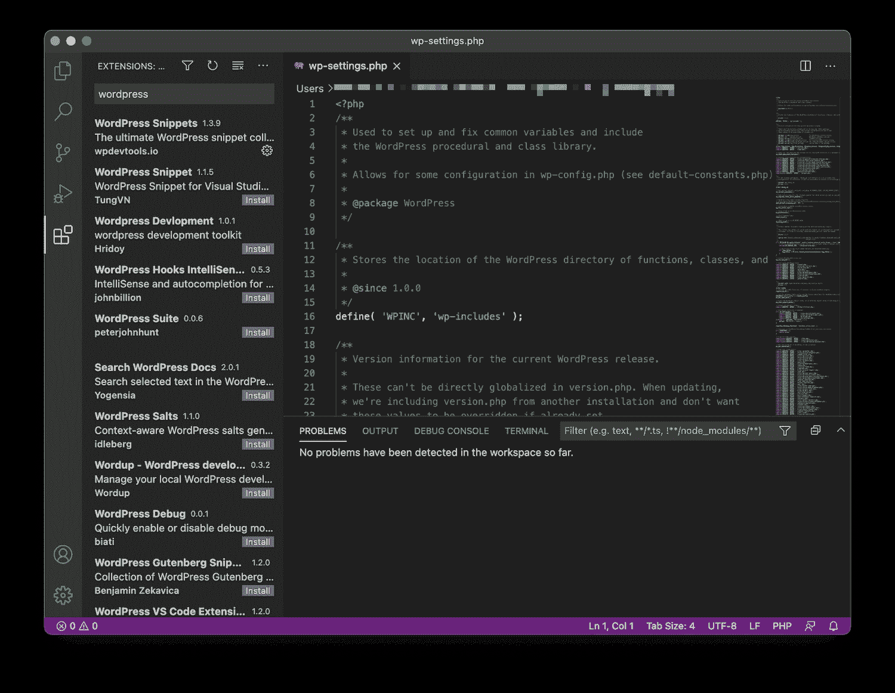

The Visual Studio Code Editor.


这是一个由微软开发的开源代码编辑器，它提供了足够多的被认为是 IDE 的东西。毫无疑问，它提供了足够的功能来占领一半以上的市场——55%的 web 开发人员每天都在使用 Visual Studio 代码。

在其默认设置中，Visual Studio 代码首先是一个文本编辑器。但是，当与它的扩展库结合使用时，它变得足够模块化和灵活，可以满足您的任何开发需求:

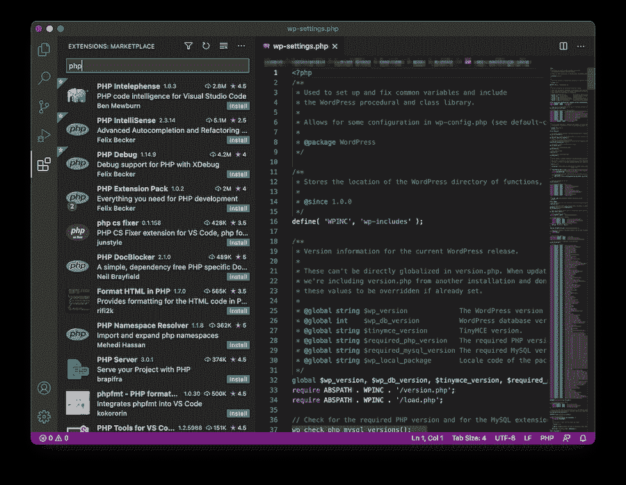

The Visual Studio Code extensions library.


这意味着你可以为你选择的语言安装 linters 和 Fixer(是的，ESLint 和 PHP CS Fixer 就在那里)，还有 Docker 和 vagger 扩展，等等。

说到语言，Visual Studio 代码支持 JavaScript、Node.js 和现成的 TypeScript。然而，扩展生态系统是如此丰富，你将能够找到一些东西来支持你正在使用的语言。

此外，您还会发现与其他微软产品的顶级集成，最著名的是 [GitHub](https://insights.stackoverflow.com/survey/2019#technology) :

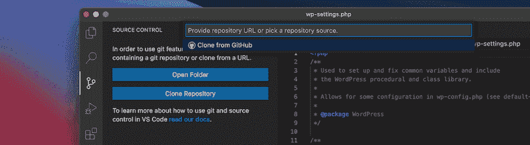

Visual Studio Code has a dedicated VCS integration with GitHub.


Visual Studio 是完全免费的，考虑到它的特性集，它是许多人的理想选择。我们认为 VSCode 是介于思想和崇高文本之间的一个极好的中间地带。说到这里，接下来我们来看看后者。

#### 5.崇高的文本

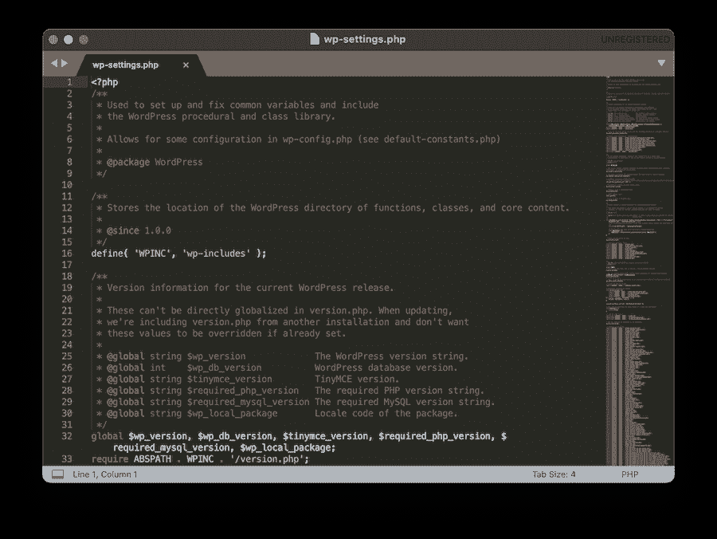

The Sublime Text app.


崇高的文本是文本编辑器世界的中流砥柱。它比大多数其他解决方案更精简，尽管它的外观掩盖了引擎盖下的权力。

例如，你会在其他竞争对手那里看到很多 Sublime Text 提供的东西。在许多解决方案中都可以看到命令面板，因为它使用起来很简单。

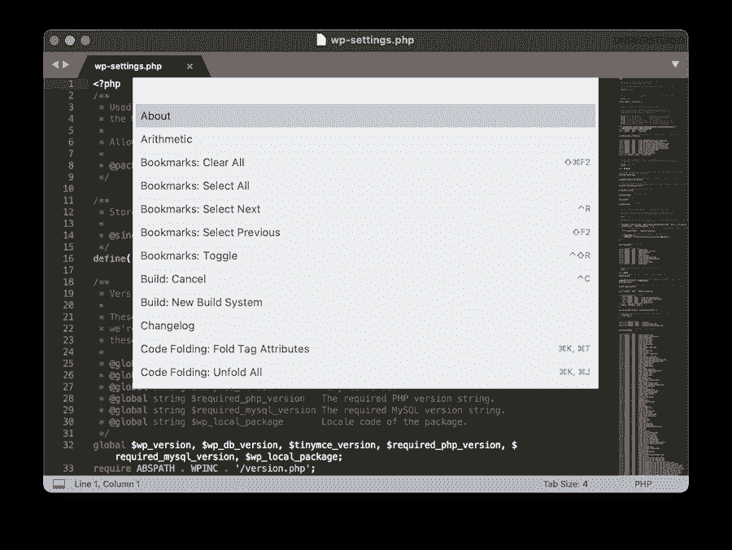

Sublime Text’s Command Palette.


另外还有强大的编辑键盘快捷键，比如[做多选](https://www.sublimetext.com/docs/3/column_selection.html)一次编辑几列。此外，*Goto any*功能提供了类似 Vim 的键盘快捷键组合来遍历您的文件:

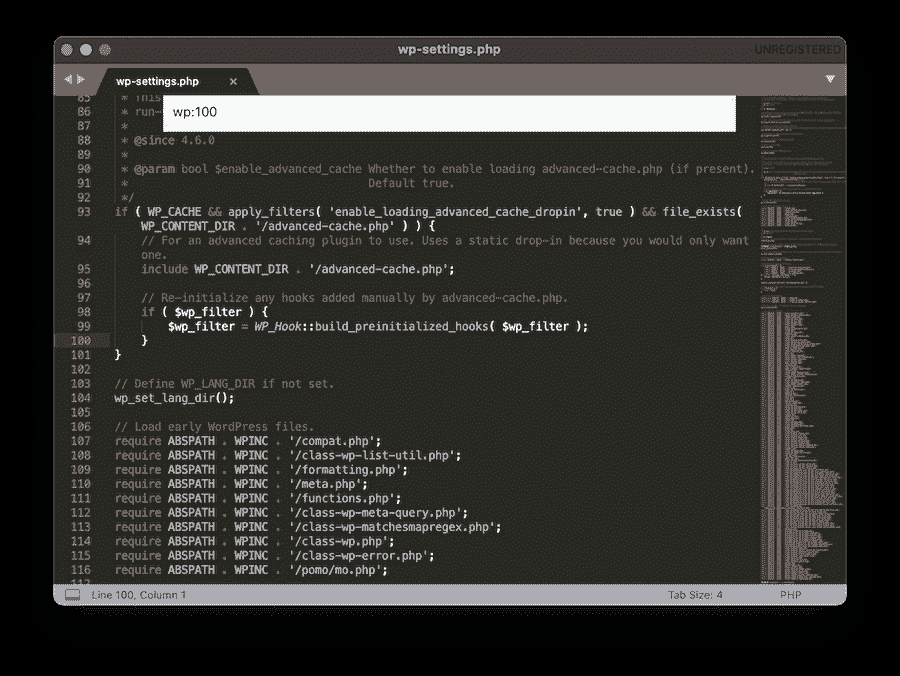

Sublime Text can combine keystrokes to help you navigate.


Sublime Text 是一款高级工具，试用期非常宽松。它可以被认为是免费的，但是为了回馈开发者，你应该[购买一个许可](https://www.sublimehq.com/store/text)用于扩展使用。

在我们看来，对于许多小的或者业余的程序员来说，Sublime Text 提供了一个很好的用户体验(UX)，提供了最基本的东西。它以其令人愉悦的视觉效果、简洁的布局和可扩展性继续受到许多开发人员的青睐。

#### 6.原子

有一段时间， [Atom](http://atom.io) 在开发人员中被大量使用。然而，自从 Visual Studio 代码问世以来，它就很少被采用。这是一个遗憾，因为它是一个伟大的代码编辑器，适用于许多不同的应用程序。

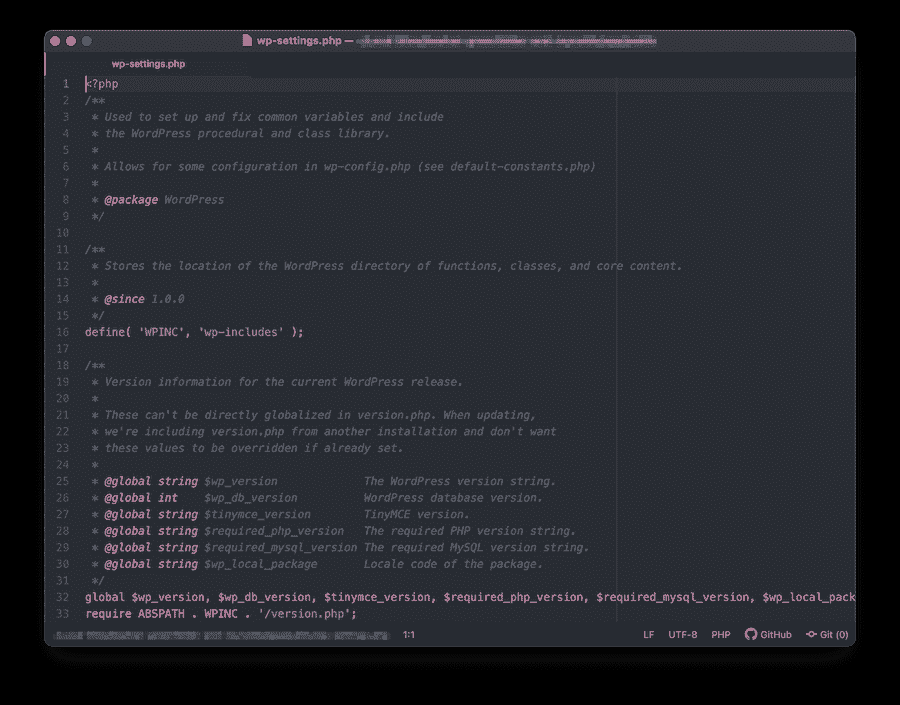

The Atom app.


这是一个 GitHub 开发的应用程序，这可能解释了为什么它在微软的排名一直很低。但是，它会定期更新，可以被视为 Visual Studio 代码的替代版本。

文本编辑是功能性的，像它更大的兄弟一样，它内置了 GitHub 集成。还有许多被称为“包”的附加组件:


Atom’s package installer.


有很多工具可以帮助您根据工作流和项目定制 Atom。Atom 包括几个可供选择的主题，其中一些主题(如 One Dark)非常受欢迎，以至于它们也进入了其他编辑器:

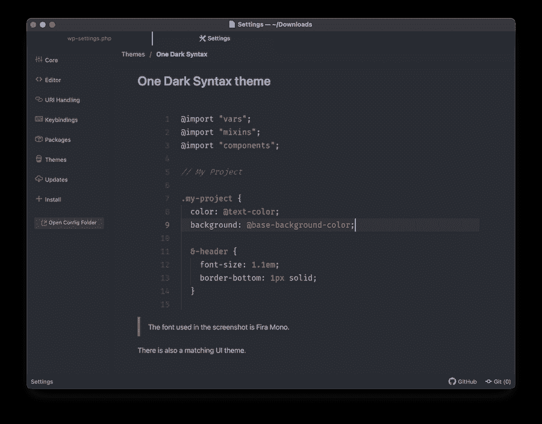

Atom’s One Dark theme.


Atom 是一个值得一试的函数式代码编辑器。然而，由于 Atom 是建立在电子之上的，一些用户抱怨大文件和项目运行缓慢。因此，我们建议它适用于较小的项目和快速脚本(尤其是内置的终端包)，但它可能不是复杂工作的最佳选择。

#### 7.记事本++

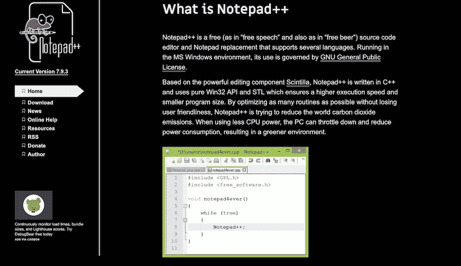

The Notepad++ homepage.


首先，值得一提的是 [Notepad++](https://notepad-plus-plus.org/) 可能不会取代你已经使用的任何“大男孩”代码编辑器，比如 IntelliJ IDEA 或 Visual Studio 代码。但是，对于简单的脚本和一般的文本编辑应用程序，它将为您提供更强大的功能。

根据你的项目，它可能会诱使你改变。尽管 Notepad++很简单，但它被广泛用于各种项目中。

这是一个 Windows 专用的代码编辑器，解释了它名字中的“plus-plus”元素。当然， [Notepad](https://www.microsoft.com/en-us/p/windows-notepad/9msmlrh6lzf3?activetab=pivot:overviewtab) 是一个实用的文本编辑器，默认安装在 Windows 上。Notepad++看起来和它的兄弟一样，但是它也包含了一些特定于开发的特性，比如:

*   选项卡式和拆分式窗口
*   支持近 80 种编程语言
*   [自动完成](https://npp-user-manual.org/docs/auto-completion/)功能
*   一个函数列表，它提供了一个查看文件中所有函数的好方法

更重要的是，Notepad++在项目管理方面非常灵活。它支持三种不同的方法:会话、工作区和项目。一旦你开始深入研究 Notepad++，你会发现你可以将它用于比单页脚本更广泛的项目。

我们认为 Notepad++将会适合那些想要强大功能的开发者，这些功能也是可定制的。在使用上，它有开源的 Vim vibe，这将比其他项目更适合某些类型的项目。

#### 8.JetBrains 套件

当谈到开发 ide 时，JetBrains 解决方案套件(T1)将会是(或非常接近)你的清单的顶端。这种商业模式很聪明，因为虽然 JetBrains 有很多编辑器，但它们实际上都是其字幕编辑器 [IntelliJ IDEA](https://www.jetbrains.com/idea/) 的“子集”。

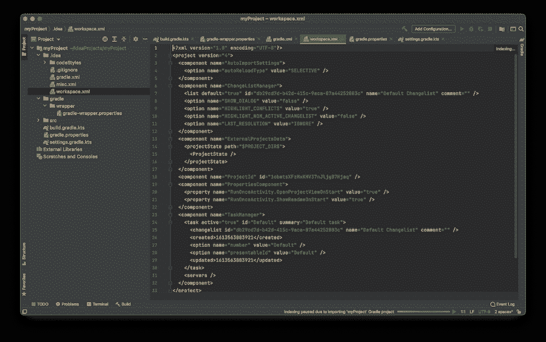

IntelliJ IDEA is a leading Java IDE.


IDEA 自称是 Java IDE。它几乎支持其范围内其他 IDE 工具的所有功能。因此，它也支持许多编程语言。

比如， [PyCharm](https://www.jetbrains.com/pycharm/) 从 IDEA 中剥离了大部分 Python 功能，打包成自己的工具。你还会发现 [phpStorm](https://www.jetbrains.com/phpstorm/) 和 [WebStorm](https://www.jetbrains.com/webstorm/) 也在做同样的事情。

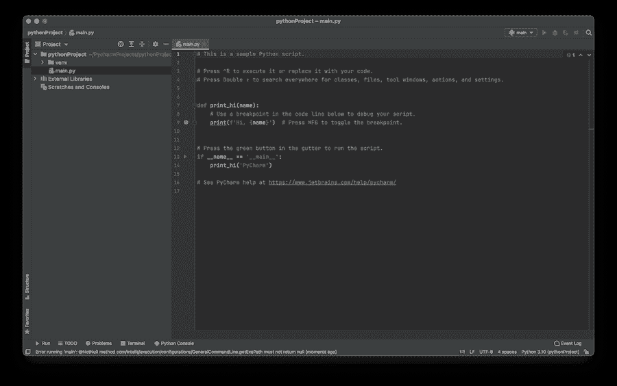

PyCharm is a Python-specific IDE that’s popular in the language space.


使用 IDEA 是一件轻而易举的事情——JetBrains 已经做了很好的工作让你编码，而不是费力地进行配置和设置。这可能令人惊讶，但是使用命令行编辑器(比如 Vim)和使用 IDEA 之间的界限通常很模糊。

这两种工具对工作流和效率的关注是相似的，不过如果您也喜欢这样工作，IDEA 也允许您导入 Vim 键盘绑定。

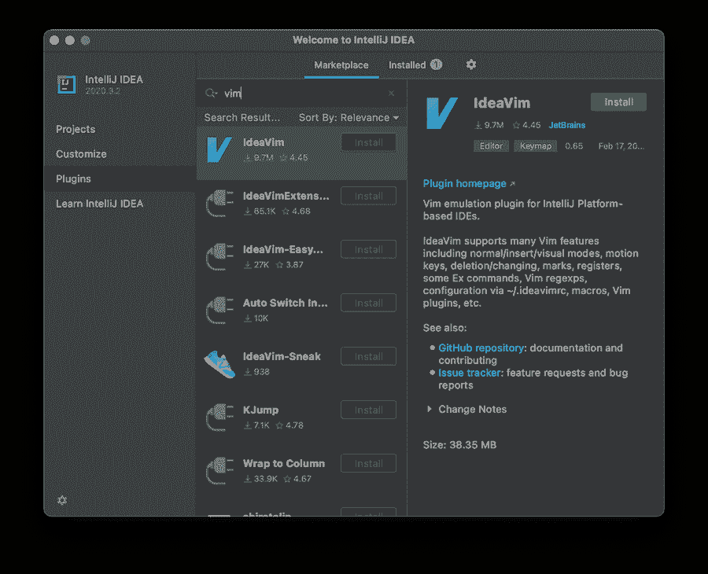

IDEA extensions let you use Vim keyboard bindings to make you feel like a Wizard.


我们假设，如果你是一个大型项目或有软件交易的公司的一部分，你可能会使用 IntelliJ IDEA。它可以是共享项目或在一致的环境中工作。许多 WordPress 开发者正在使用 JetBrains 产品，因为它们在管理项目方面非常强大。

价格也是一个因素，IntelliJ 是建立在一种订阅模式上的，这种订阅模式通常每年达到三四位数。

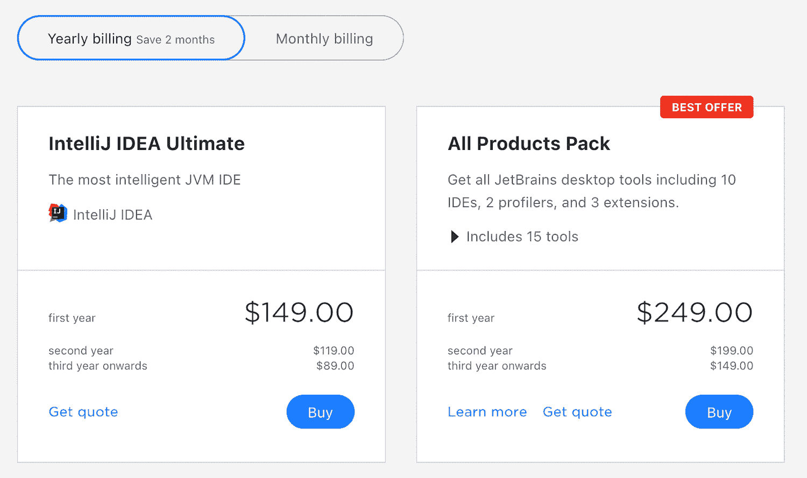

IntelliJ IDEAs pricing screen.


即便如此，JetBrains 产品还是有一些“社区”版本。然而，它们是母软件的精简版本；本质上，它们是去掉了专有元素的开源解决方案。

更重要的是，JetBrains 为开源项目、初创公司、教育机构、码头船长和更多小众群体提供有竞争力的价格。

### 网页设计和原型工具

当然，没有良好的用户体验，网络应用就什么都不是(UX)。因此，你的布局和视觉原型通常需要一个专用的工具。设计工具对于服务器端和客户端的开发都是至关重要的。这里有几个受欢迎的选择。

#### 9.菲格玛

Figma 是一个经常被提及的网络开发工具，它可以让你在设计上进行合作。

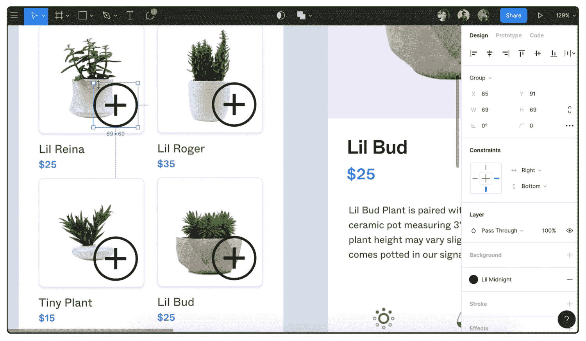

The Figma editor.


您可以使用拖放编辑器来构建界面和其他面向用户的元素。对于开发人员来说，您也可以抓取代码片段植入到您的项目中。Figma 使整个过程——从构思到实施——顺利进行，并在整个项目链中保持修订。

您还可以利用一套统一的工具来帮助选择字体和颜色。该过程与使用单独的工具形成对比，例如[型秤](https://type-scale.com/):

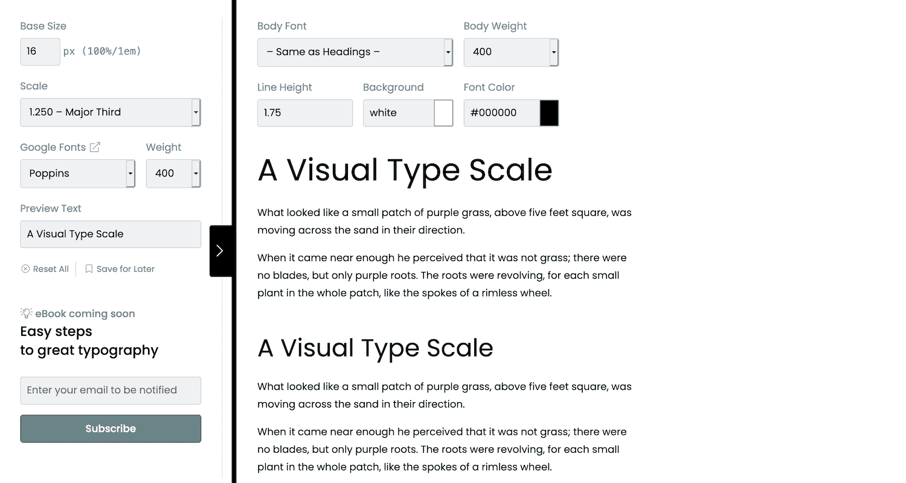

The Type Scale website.


…以及 web 开发工具的子集，如 [Adobe Color](https://color.adobe.com/create/color-wheel) 、[coolers](https://coolors.co)、各种颜色选择器等等。

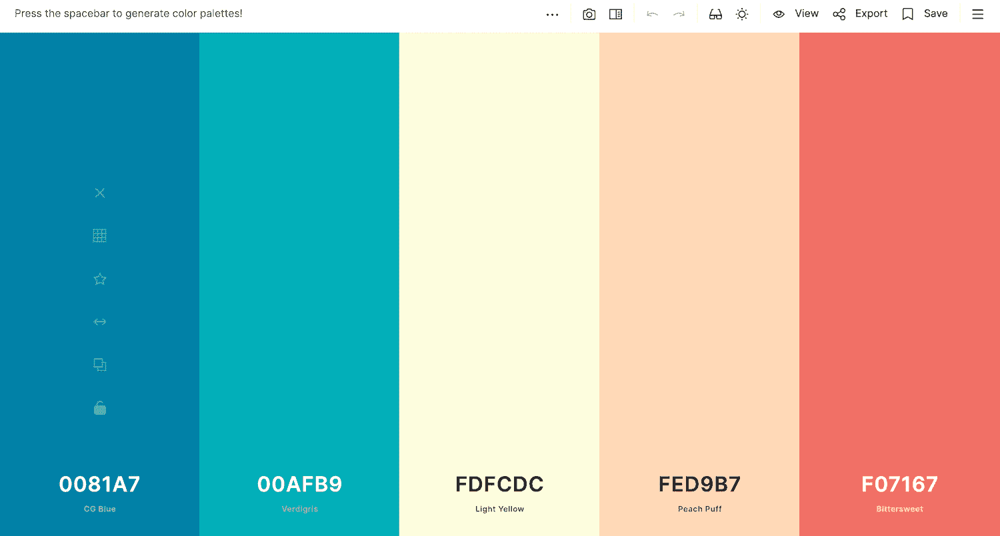

The Coolors color picker.


虽然 Figma 对单个开发人员的项目有价值，但随着规模的扩大，它对团队有更大的好处。团队会喜欢 Figma 的协作方面，比如中央资产存储库和可重用组件。团队领导也将欣赏全面的报告选项，以了解团队成员如何使用各种设计系统。

至于定价，Figma 在[标准层](https://www.figma.com/pricing/)上每个“编辑”的成本是 12 美元，对于基于企业的团队，每个“编辑”的成本上升到 45 美元(对于“编辑”，应该理解为“座位”——这是同一个概念)。因此，价格可能会根据你想要的编辑数量而上涨。

#### 10.素描

[Sketch](https://www.sketch.com/) 是一款仅支持 macOS 的应用，在开发者中也经常被点名:


The Sketch logo.


它之所以受欢迎，是因为 Sketch 包含了许多功能，而且使用起来也很容易，这是一个原生的 macOS 应用程序。看起来有点像[苹果的 Xcode IDE](https://developer.apple.com/xcode/ide/) ，这也不是什么坏事，导航的感觉也很棒。

当然，您可以执行必要的功能，如矢量编辑和约束调整大小。然而，该应用程序中还有更多功能可以帮助您快速生成设计并将其导出给其他人。

例如，以 Sketch 的[智能布局](https://youtu.be/qrgDwQ0Fy1k)功能为例，它使用自适应调整大小来匹配您的尺寸和当前布局。也有许多[协作工具](https://www.sketch.com/for-teams/)给每个人一种方式来深入设计并帮助完善它。


An overview of Sketch for Teams.


Sketch 与 Figma 等工具的不同之处在于，自由职业者或单独的开发人员可以免费加入，然后在需要时购买订阅。在这方面， [Sketch 的定价](https://www.sketch.com/pricing/)要么是一次性支付 99 美元，要么是每个用户每月 9 美元。

#### 11.视觉工作室

[InVision Studio](https://www.invisionapp.com/) 独特地将自己推销为一款“屏幕设计”应用。有道理，理解起来也更清晰。InVision Studio 提供了您所期望的所有标准特性和功能，例如直观的基于图层的编辑器和矢量支持。

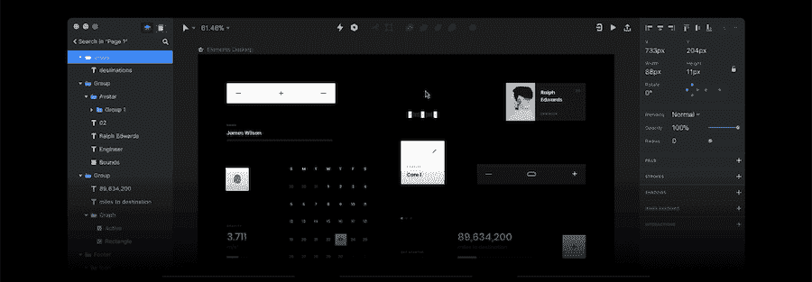

The InVision Studio app.


尽管如此，这个盒子里还有更多与原型制作和创建动画相关的东西。例如，您可以通过指向、单击和拖动来将画板和屏幕链接在一起。此功能让您可以将动画制作作为设计过程的一部分，而不是以后再交付。

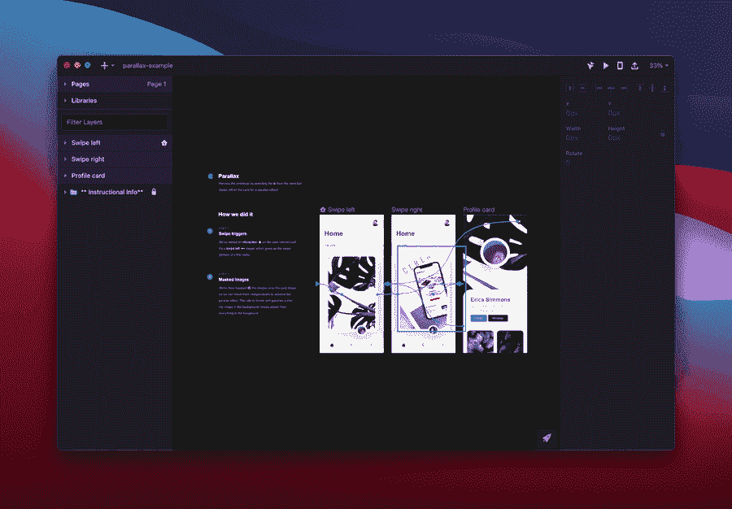

Animations within the InVision Studio app.


说到移交，由于共享组件库、全局同步选项、健壮的**检查**模式等等，整个团队都可以在 InVision Studio 中工作。

[的定价结构](https://www.invisionapp.com/plans)也很有竞争力。InVision Studio 的免费版本为您提供了付费版本的几乎所有功能，只是对您可以保存的文档数量有所限制。专业层对应用程序的功能很有价值(大约 95 美元/用户/年)。

#### 12.亲和力设计者

如果你是一个 Adobe Illustrator 用户，你会在过去遇到过 [Affinity Designer](https://affinity.serif.com/en-us/) 。Serif 的图形设计方法看起来让 Adobe 的解决方案物有所值:


The Affinity Designer app.


自推出以来，由于其与社区的良好关系、一流的设计原则和有吸引力的定价模式，它已经获得了一个蓬勃发展的用户群。您将找到适用于 Mac、Windows 和 iPad 的版本，每个版本都可以处理矢量和/或栅格:


Affinity Designer’s editor.


您在 Illustrator 中习惯使用的工具都已存在，还有一整套颜色配置文件和导出选项:


The export options in Affinity Designer.


简而言之，这些特性和功能可以为您的项目创建专业的图形。更重要的是，定价极具竞争力。它的全价大约为 50 美元，是一次性付款。它没有像 Illustrator 那样合适的基于云的选项。即便如此，只要支付一次性费用，你就能以一种主观上更好的方式获得 Adobe 的范围。

#### 13.CodePen 或 JSFiddle

早些时候讨论 IntelliJ IDEA 时，我们没有提到它的一个次要但方便的特性——[暂存文件](https://www.jetbrains.com/help/idea/scratches.html)。它让您可以快速编写和测试代码片段，而不必影响您当前的工作项目。

对于其他代码编辑器的用户来说，像 [CodePen](https://codepen.io/) 或者 [JSFiddle](https://jsfiddle.net/) 这样的解决方案是一个很好的替代品。它们的工作方式相似:有三个文本编辑器，分别用于 HTML、CSS 和 JavaScript，还有一个输出屏幕来查看结果:

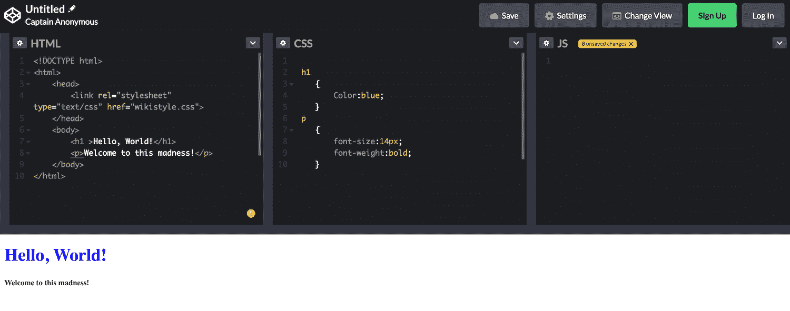

The CodePen console.


你可以根据你的平台命名你的“笔”或“提琴”，保存它，并与他人分享。这是一个非常简单的想法——它可以帮助你在项目的某个方面实现你不成熟的想法。

对于那些想了解文件中某个特定元素并展示可能的修改的开发人员来说,“在线 IDE”是非常宝贵的。此外，还可以通过聊天或“现场麦克风”进行协作:


The JSFiddle Collaboration screen.


总的来说，在线 IDE 可以被认为是一个“潜伏”的 web 开发工具，因为它不太经常被提及，但被许多开发人员用来创建更好的代码。

### Git 客户端

拥有一个集中的方法来存储代码，记录变更，并与团队一起工作而不重复，这是一个[版本控制系统(VCS)](https://kinsta.com/knowledgebase/git-vs-github/) 的任务。这里有几个客户端处理一个 VCS: git。

让我们先讨论一下 VCS 本身。

#### 14.饭桶

Git 对于现代开发人员来说是必不可少的，因此，它是最重要的 web 开发工具之一。简而言之，这是一种记录您对项目代码所做的更改并将它们存储在“存储库”中的方法:

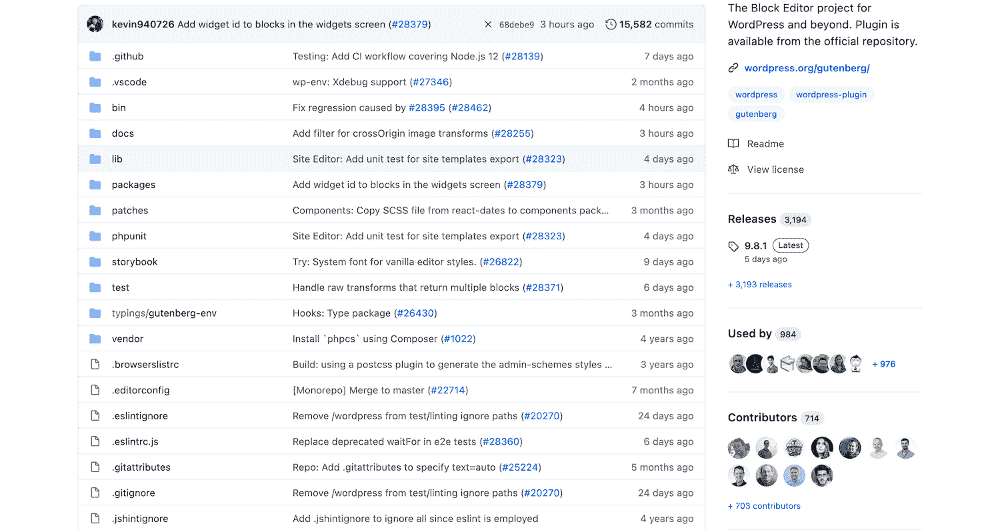

A list of WordPress GitHub commits.


Git 是由 Linux 的创造者 Linus Torvalds 发明的。并使用一系列命令将文件更改添加到一个“暂存区域”，然后将它们“提交”到一个存储库中。从那里，您可以将它们“推”到一个在线托管的远程存储库。

虽然它不是唯一可用的 VCS——WordPress 开发团队[仍然在许多项目中使用 Trac](https://trac.edgewall.org/)——但它是最突出的。诸如 Git 或 Trac 这样的 VCS 通过将代码托管在一个中心位置来帮助团队一起工作。

基本命令是以 git 开头的单字函数，通常从命令行使用。例如:

```
git add file.php
```

这个表达式将**file.php**添加到你的暂存区。换句话说，它将更改记录为您想要存储的内容，而无需对其进行最后的润色。如果您愿意，您可以对一个文件或整个项目执行此操作。

要提交文件，您可以运行`git commit`。在这里，您可以添加一个注释来告诉其他人您的提交。此后，您的更改被存储并推送到主“分支”当然，这取决于您是否正在进行远程“回购”

如果你是 Git 和 VCSs 的新手，GitLab 有一个关于在命令行使用 Git 的很好的初学者指南。稍后我们还会谈到 GitLab 本身。

#### 15.开源代码库

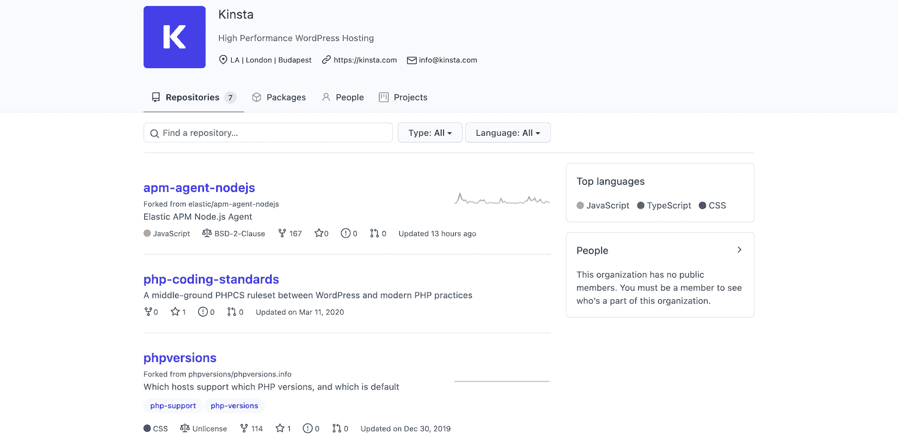

Kinsta’s GitHub page.


对于大多数开发人员来说， [GitHub](https://github.com/) 是*存放项目 Git 库的地方:*

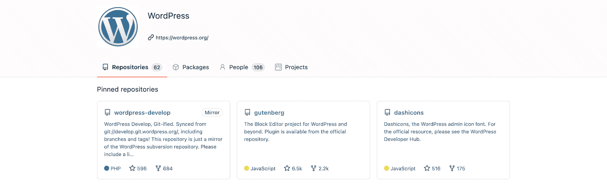

WordPress GitHub repositories.


这是一个微软拥有的解决方案，涵盖了比 Git 托管更多的内容。还有一堆自动化测试工具，并试图为 T2 提供额外的协作功能。

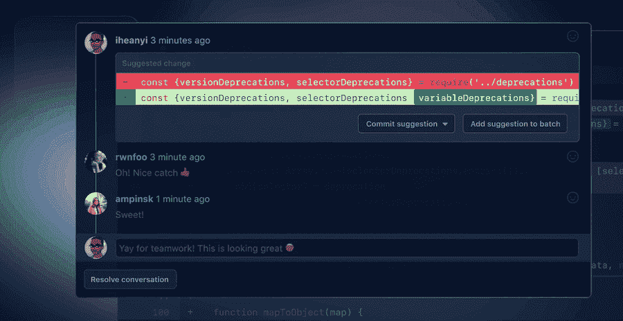

GitHub’s collaboration features.


对于开源项目，GitHub 这样的平台[几乎是事实上的选择。鉴于此，GitHub 作为一个 web 开发工具，对于许多开源用户、学习者和开发者来说是无价的。当挖掘 GitHub 的问题跟踪器来解决已安装软件包的问题时，尤其如此。](https://kinsta.com/knowledgebase/what-is-github/)

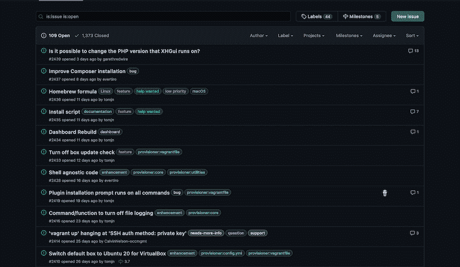

GitHub’s Issue Tracker.


GitHub 不仅仅是用来存储程序回购的。其他的编码项目也是如此，比如 web 开发，甚至书籍。

总的来说，GitHub 是一个很棒的工具，可以帮助从许多不同的分支建立一个健康的社区。然而，它不是唯一的平台。

#### 16\. GitLab


The GitLab logo.


我们之前提到过，但是 [GitLab](http://gitlab.com) 是 GitHub 的竞争对手，有着相似的目标。它本质上是 Git repos 的主机，但也提供了一些其他的额外功能。

虽然 GitHub 自称为“开发平台”，但 GitLab 专注于“DevOps”。在其免费层，GitLab 提供 DevOps 生命周期的每个阶段，静态应用程序安全测试，以及每月约 400 分钟的持续开发(CD)和持续集成(CI)。

GitLab 落在它的社区感上，这是 GitHub 最大的不同。更多的是关于项目的部署和整个周期。这不是负面的，但这确实意味着 GitLab 更像是一个“孤立的”平台，可以说不像 GitHub 那样适合开源项目。

对于大多数团队来说，GitLab 的免费层将是充足的。对于每个用户来说，每年大约 230 美元，你可以获得对你的代码和生产力的分析，大约 10，000 CD/CI 分钟，等等。

#### 17.sourcetree(资源分区)

Sourcetree 不是一个 Git 存储库主机，而是一个用于管理它们的图形用户界面(GUI)。它是众多解决方案之一，比如 [GitKraken](https://www.gitkraken.com/) 、 [Sublime Merge](https://www.sublimemerge.com/) 、 [GitHub 桌面](https://desktop.github.com/)、[更多](https://git-scm.com/downloads/guis)。

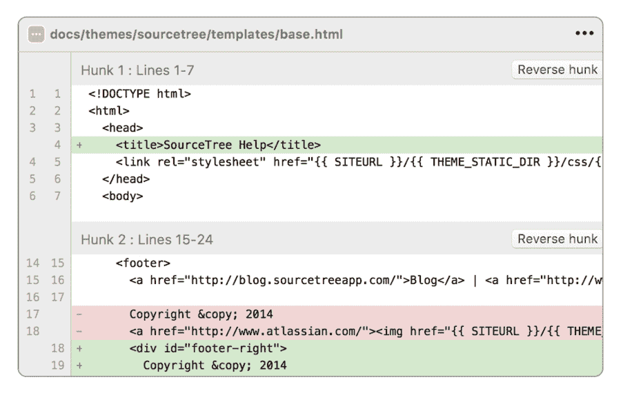

The Sourcetree homepage.


这是 Atlassian 的产品(我们爱 Atlassian！)与其他产品[如 Bitbucket](https://bitbucket.org/) 连接，提供 Git 存储库的可视化表示。

Sourcetree 被宣传为一个简单的 Git 客户端——的确如此——但是它也适合有经验的用户。它有足够的东西来支持一个使用 Git 的团队(还有 [Mercurial](https://www.mercurial-scm.org/) )。

例如，Sourcetree 做一些简单的事情，比如突出显示自上次提交以来的更改，但是如果需要的话，它还会处理更多的事情。团队领导可以审查变更集，根据需要在分支之间工作，并使用图形和信息选项卡可视化代码:

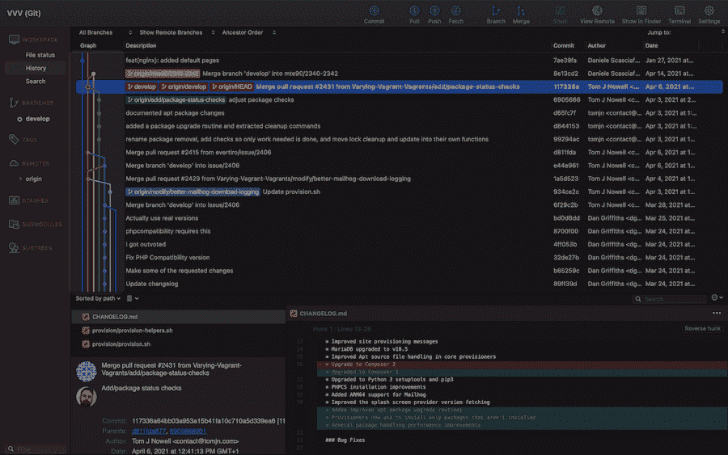

Sourcetree’s graph view.


Git 客户端是否适合您取决于您的环境。如果您还在学习，我们建议您在理解流程和过程的同时使用终端。对于广泛使用 Git 的专业人员或团队来说，像 Sourcetree 这样的客户端将会节省您每天的工作时间。

### 浏览器开发工具

没有 web 浏览器，就没有 web 开发。然而，尽管你选择的浏览器对于[浏览网页](https://kinsta.com/knowledgebase/how-to-clear-browser-cache/)至关重要，你也可以用它来了解它是如何运行的。

大多数现代浏览器都包含特定的开发工具来帮助您分析后端代码，然后您可以将这些代码带回到您的项目中。以下是一些最受欢迎的。

#### 18.Chrome 开发者工具

Chrome 的“dev tools”因其出色的功能集和诊断功能而备受社区推崇。

鉴于基于 Chromium 的浏览器的兴起，许多浏览器都有相同的 DevTools 和相似的快捷方式。你可以查看[微软 Edge](https://microsoftedgewelcome.microsoft.com/en-us/) 、[勇敢](https://kinsta.com/blog/brave-browser-review/)、 [Chromium](https://www.chromium.org/) 本身，以及更多的克隆版本，并在浏览器中使用你的项目。

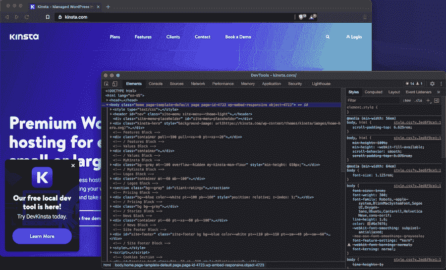

Brave browser’s DevTools.


**元素**标签将是一个经常出现的地方，因为这是你查看页面源代码的地方。在我们看来，**性能**选项卡提供了其他浏览器开发工具无法比拟的页面负载洞察:

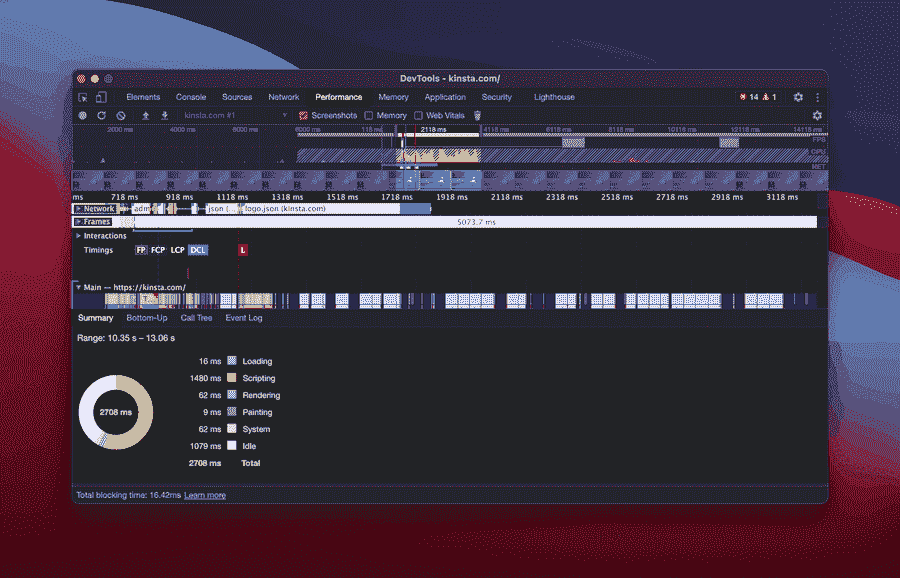

Brave’s Performance tab.


**安全**标签也提供了一些有用的信息，这些信息对于监控(或研究)客户的网站是必要的:

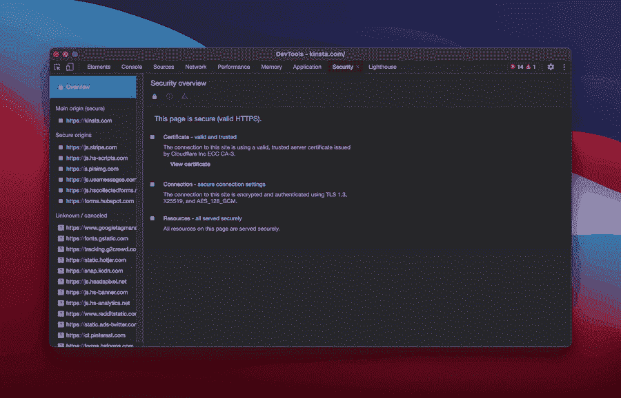

Brave’s Security tab.


更好的是，您将能够直接从基于 Chromium 的浏览器生成 [Google Lighthouse](https://developers.google.com/web/tools/lighthouse/) 报告:

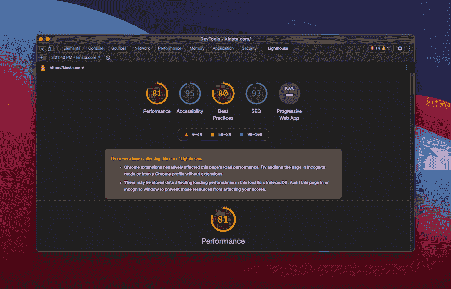

A Google Lighthouse report from Brave’s DevTools.


这里的开发工具主观上是最好的，所以你会发现 Chrome 和基于 Chrome 的用户会依赖它们。尽管其他浏览器也有 DevTools，它们也值得考虑。

#### 19.Firefox 开发工具


The Firefox homepage.


尽管谷歌占据主导地位，火狐每月活跃用户数约为 2 . 2 亿。在过去，开发人员[称赞 Firebug](https://getfirebug.com/) ，它通常是浏览器调试的领导者。

今天，我们有 Firefox 的开发工具:

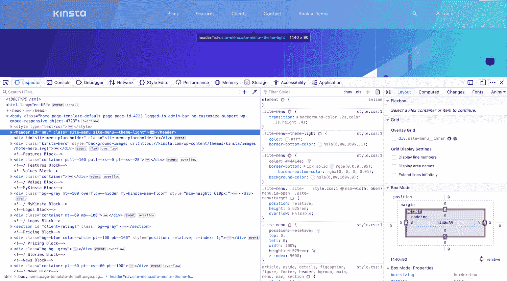

Firefox’s developer tools.


有一组核心功能用于查看站点源代码(**检查器**)、一个**调试器**、**内存**、**存储**等等。

对于初学者来说，**控制台**通常是通向编码的大门，因为你可以直接在浏览器中运行 JavaScript，这是一种测试代码片段并在第一次开始时找到立足点的简单方法:

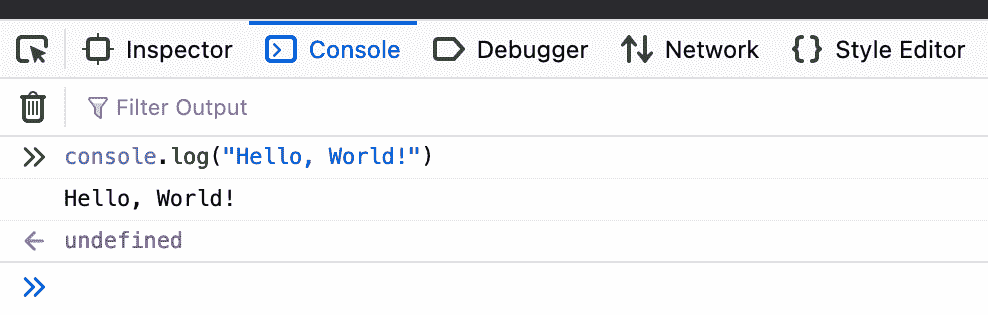

An example of a browser console.


尽管如此，我们认为 Firefox(和其他浏览器)比基于 Chromium 的浏览器更少被打包到开发工具中。不过，对于跨浏览器调试和故障排除，您通常会使用 Firefox。因此，这是一件好事，他们是几乎所有任务的理想选择。

### 前端框架

说到前端，你需要一些适合创建令人惊叹的网站的东西。这里您对框架的选择是至关重要的。你应该总是为这项工作选择最好的工具。

记住这一点，让我们来看看几个受欢迎的选择。

#### 20.引导程序

移动响应是现代网页设计的标准特征。这是一个受欢迎的步骤，考虑到移动浏览已经超越了桌面。有鉴于此，你会想要一种快速建立移动优先网站的方法。

[Bootstrap](https://getbootstrap.com/) 是一个很棒的 web 开发工具，它有很多用途:

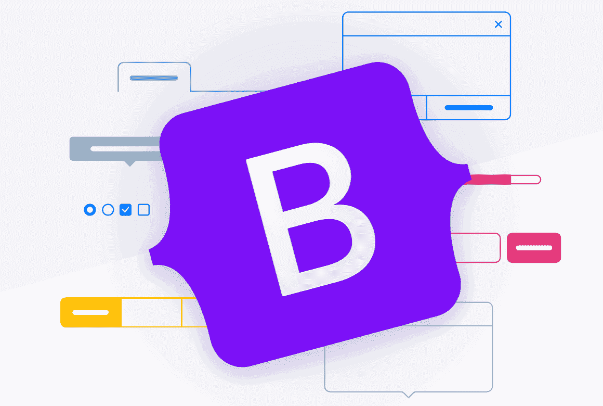

The Bootstrap logo.


这是一个结合了 JavaScript 插件、 [Sass 变量、](https://sass-lang.com/)、一些预建组件、一个高质量的[响应网格系统](https://kinsta.com/partners/wpgridbuilder/)等等的工具包。甚至有一个官方主题的[市场](https://themes.getbootstrap.com/)与 Bootstrap 一起工作，许多 WordPress 网站也使用基于设计框架的主题。

当然，是否使用 Bootstrap 将取决于您的项目需要什么。然而，合乎逻辑的假设是，预算紧张、周转快的 web 开发项目将转向“自举”解决方案，并使其适应 WordPress。鉴于框架和 WordPress 都是免费的，你的时间就成了唯一的成本因素。

#### 21.顺风 CSS

理论上， [Tailwind CSS](https://tailwindcss.com/) 没有意义。它是一种语言的前端框架，是 web 开发核心三位一体的一部分。因此，合乎逻辑的想法是，目标用户已经具备了适当的知识，不需要框架。

实际上，顺风 CSS 让*完美*有意义。这是一种不用离开 HTML 就能设计网站前端的方法。

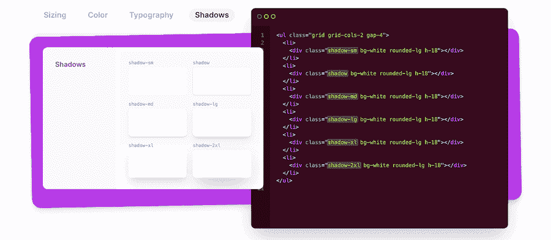

A Tailwind CSS example.


您可以在各种标记中使用实用程序类来添加核心样式表中的 CSS。当然，CSS 仍然是主要的样式来源。当你使用 HTML 构建一个布局时，它只是在你的视野之外。因此，它让你同时发展结构和风格。

这种方法让我们想起了 960 网格系统(T1 ),并且可以很好地与这个框架相吻合。也就是说，用如此多的类打包元素有一个危险，你可能会得到一堆杂乱的代码。使用 Tailwind CSS 需要耐心和自律，但是如果它适合您的项目，它将是一个快速且健壮的框架。

#### 22.布尔玛

在设计网站结构和布局方面，我们已经取得了所有的进步，创建灵活的、反应灵敏的和动态的栏目对许多人来说是一个障碍。虽然处理这不是布尔玛唯一能做的事情，但这种类型的应用程序是框架的核心:

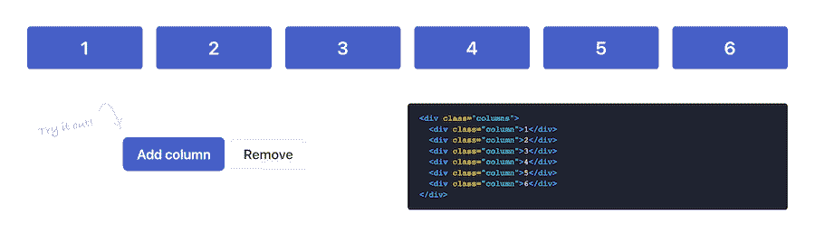

The Bulma website.


很像顺风 CSS，布尔玛隐藏了 CSS，并为你的 HTML 提供了实用类。它采用 Flexbox、移动优先和模块化技术构建。如果您只需要几个组件，那就太好了。如果你愿意，你也可以混合和匹配框架。

更重要的是，你不需要任何 JavaScript 来启动和运行布尔玛，因为它只是 CSS。你可以用最少的代码添加界面元素，比如按钮。这是一个简单明了的开源框架，可以适应您自己项目的需求。在我们的书中，这是一个你应该好好利用的有价值的特质。

#### 23.基础

ZURB 团队在 [Foundation](https://get.foundation/) 中对 CSS 框架有其独特的见解。这是一个移动优先的语义工具，对网站和电子邮件有两种风格:


The Foundation homepage.


基础的构建以可访问性为优先。Foundation 中的每个片段都带有专用的 ARIA 属性。然而，在你到达这个阶段之前，Foundation 对于快速原型是令人印象深刻的，因为你如何把它添加到你的 HTML 中。您可以在页面上创建几乎任何结构元素，甚至是各种类型的菜单和导航:

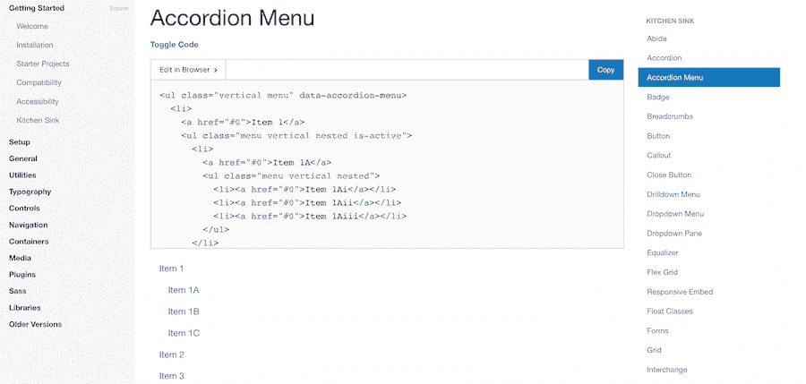

Creating a navigation menu in Foundation.


ZURB 还提供了大量优秀的[文档和教程](https://get.foundation/learn/tutorials.html)供你学习框架的来龙去脉。Foundation 使用起来很简单，但是我们怀疑您可以深入到构建站点，并开发出复杂的布局和功能。

你也可以在基金会网站上找到一堆模板。它们是帮助您起步的基本线框—一个受欢迎的包含:


Foundation’s template library.


总的来说，基金会框架做到了它在锡上所说的。它将是你网站发展的核心，而不是让你附加更多的功能。因此，您可能不会在每个项目中都使用它。尽管如此，在被雇佣的地方，它将在各种各样的网站上做生意。

#### 24.材料-用户界面

我们将在后面更详细地讨论 React，但是现在，要知道 [Material-UI](https://material-ui.com/) 是基于这个 JavaScript 框架的组件库的。对于不知道的人来说，材料设计是谷歌关于如何设计网站前端的“哲学”。这意味着大量的机器人字体和色块:


Material-UI looks to meet Google’s design standards.


您将把这个库导入 React，然后使用专用的 HTML 标签来构建您的站点:

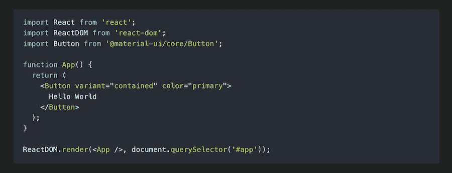

Creating a button in Material-UI.


为了进一步定制元素，可以向 HTML 标记中添加类。整个代码块包装在一个函数中，您将在 React 中呈现细节(以及扩展的页面)。

也有许多免费和付费主题,涵盖许多使用案例和价格:

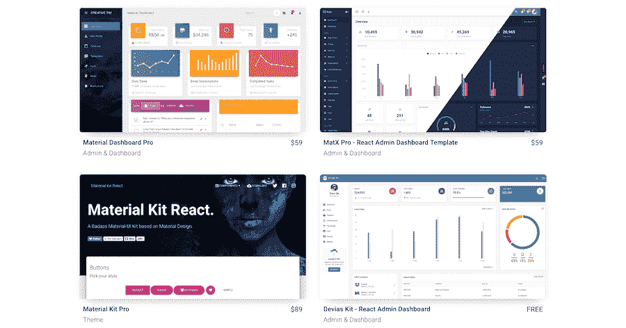

The Material-UI theme library.


因为 Material-UI 有一个特定的用例——围绕材料设计创建站点——如果这是你的目标，它将是一个首选框架。特别是，不管你的预算是多少，主题库都将是一个有价值的入门资源。

#### 25.HTML5 样板文件

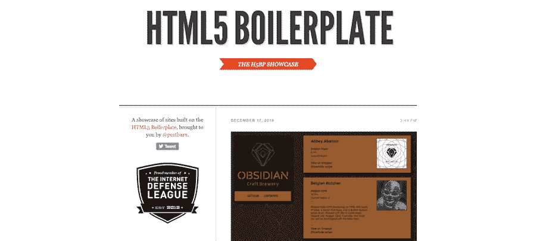

The HTML5 Boilerplate homepage.


如果你是一个 WordPress 开发者，你可能遇到过[下划线](https://underscores.me/)。这是一个基本的 WordPress starter 主题，可以节省你无数的时间来整合你网站的功能和核心元素。 [HTML5 样板文件](https://html5boilerplate.com/)在一般设计层面上做了同样的事情。

因此，它包含了跨越 HTML、CSS 和 JavaScript 的七个文件。它们都只包含呈现页面最必要的文件和代码。除此之外，你的页面如何由你决定。

HTML5 样板文件有很多粉丝，因为它更像是一个节省时间的实用工具，而不是一个成熟的框架。因此，没有开箱即用的视觉效果来惊叹“传递贸易”，但是如果你将 HTML5 样板文件投入使用，你可能会发现它像下划线为 WordPress 开发者所做的那样加速了你的开发。

#### 26.实现

虽然我们不会称 [Materialize](https://materializecss.com/) 为 Material-UI 的竞争对手，但它是另一个使用材料设计原理来创建布局的框架:

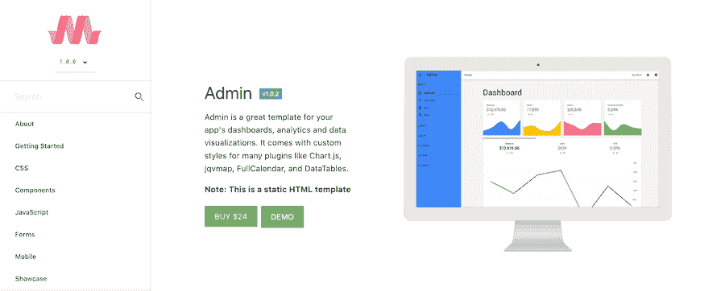

The Materialize homepage.


不过，Materialize 不是使用 React，而是一个 CSS 框架。这使得物化更容易在前端实现。与其他基于 CSS 的框架非常相似，您使用 HTML 中的类在前端拉入元素。

也就是说，对于 modals 和 dropdowns 这样的元素，也有很多 JavaScript 组件:

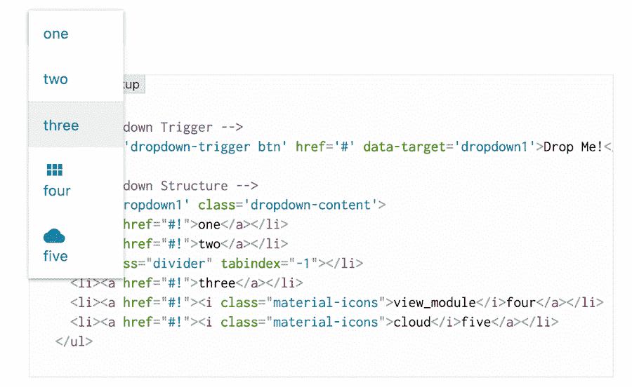

A dropdown menu created with Materialize.


像许多这样的框架一样，有[高级主题](https://materializecss.com/themes.html)帮助你以特定的风格构建布局。不过，它们都是静态的 HTML 主题，如果您想实现 JavaScript，这可能会成为一个问题。在这些情况下，您可能需要考虑 Material-UI。

### Web 应用程序框架

简而言之， [JavaScript 框架或库](https://kinsta.com/blog/javascript-libraries/)让你以不同的方式处理所谓的“普通”代码。在这种情况下，它是为了创建特定的 web 应用程序和站点。也有很多“口味”——让我们来介绍几种。

#### 27.React.js

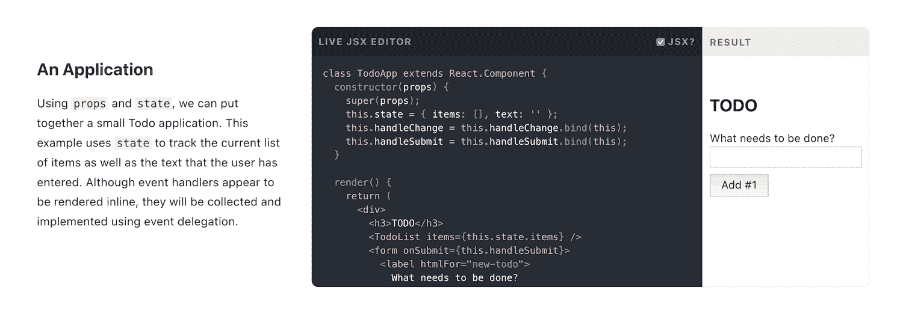

An example of React sandbox code.


React.js 是一个流行的脸书设计的 JavaScript 库，支持许多更现代的 WordPress 元素。WordPress.com 的[后端](https://developer.wordpress.com/calypso/)和块编辑器都使用 React，我们认为这是使用 JavaScript 的接口优先方式。

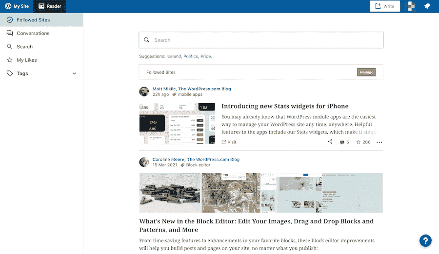

The Calypso backend for WordPress.com is built on React.


因此，WordPress 开发者应该——套用马特·莫楞威格的话——深入学习 React.js。然而，它不仅仅是 WordPress 开发者的框架。

## 注册订阅时事通讯


### 想知道我们是怎么让流量增长超过 1000%的吗？

加入 20，000 多名获得我们每周时事通讯和内部消息的人的行列吧！

[Subscribe Now](#newsletter)

在任何需要现代化动态用户界面(UI)的地方，React 都将是首选。它使用名为 JSX 的 JavaScript 语法扩展来创建元素，然后将这些元素呈现给文档对象模块(DOM):

```
const name = "Ken Starr';

const element = <h1>Hello, {name}</h1>;

ReactDOM.render
  Element,
  document.getElementById('root')
);
```

JSX 中的 JavaScript 变量可以是任何有效的表达式，这允许您构建复杂的参数。这使得 React 成为框架的一个强有力的选择。因为它的受欢迎程度，我们认为 [React 应该在你的“必学”清单上](https://kinsta.com/blog/javascript-libraries/#reactjs)，不管你把开发时间花在哪里。

#### 28.view . js-检视. js

Vue.js 是另一个用于构建用户界面的 JavaScript 框架。它基于“视图层”,非常适合与其他库和框架集成。

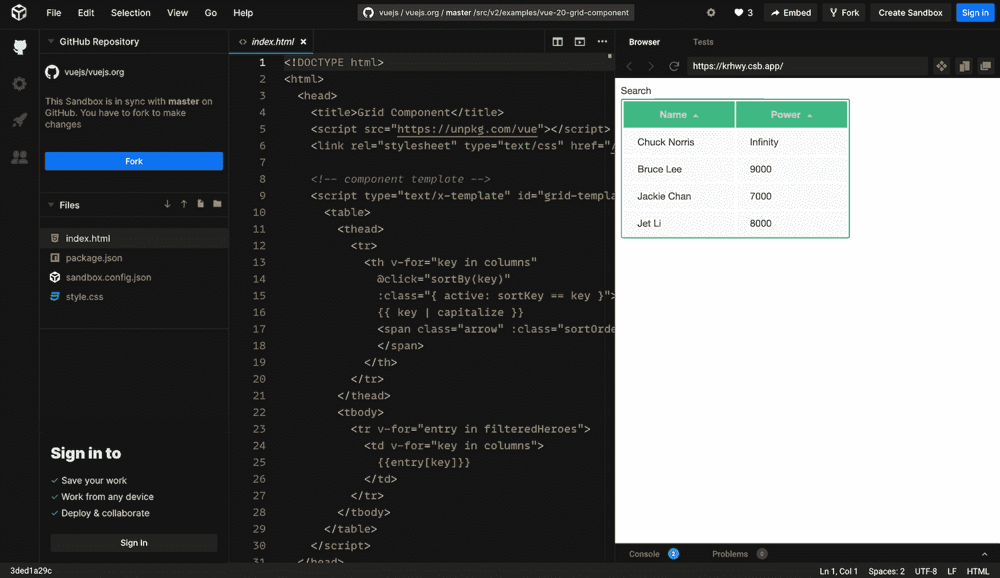

The Vue.js sandbox.


在 HTML 方面，Vue 再容易不过了。您给标签一个 ID，并从 JavaScript 端的字典集调用一个键。数据现在是反应性的，并且数据和 DOM 是链接的。

这样，Vue.js 很像我们在文章前面看到的一些 CSS 框架。这个框架很有吸引力，我们鼓励您浏览文档看看有什么可能。

虽然 Vue.js 支持 JSX 声明，但它更适合使用基于“经典”web 技术的模板。因此，对于不想只使用 JavaScript 的开发人员来说，这将是一个理想的选择。

#### 29.快递. js

我们正在进入元框架领域，因为 [Express.js](http://expressjs.com/) 连接到 [Node.js](https://nodejs.org/en/) 并为其他框架提供基础。

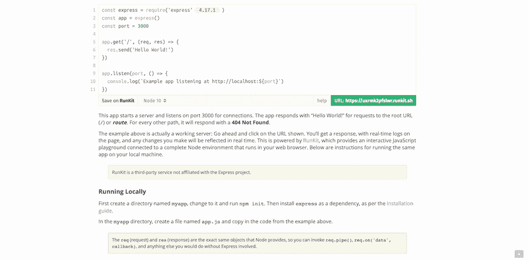

The Express.js homepage.


这是一个极简框架(因此得名)，主要好处是帮助您将服务器端组件组织成熟悉的模型-视图-控制器(MVC)格式。因此，代码看起来比其他框架更复杂——甚至是普通的 JavaScript:

```
var express = require('express');

var app = express();

app.get('/', function(req, res){
  res.send("Hello world!");
});

app.listen(3000);
```

我们认为 Express.js 将适合那些从数据库中提取和推送数据的应用程序。这使得它适合许多现代 web 应用程序和后端开发人员，他们希望以最小的压力处理前端任务。

#### 30.Svelte.js

在为 web 开发时，一个可靠的经验法则是确保你的站点可以在尽可能多的浏览器上运行。也就是说，在某些情况下，你可能想要构建不支持传统浏览器的应用或网站。在这些例子中， [Svelte.js](http://sveltejs.com/) 应该在你的列表的最上面。


The Svelte.js homepage.


该框架因其文件大小而得名——缩小后只有 5kb。它有一个类似 jQuery 的格式，对于熟悉的用户来说很容易理解:

```
$('.hello').text("Hello svelte");
```

在 Svelte API 中有不到 40 个函数，所以开始会很简单。此外，您可以使用`$.fn`轻松添加新功能。

您会发现对 Internet Explorer 9 支持的“polyfills ”,但这几乎是唯一的让步。对于使用超精简框架的超现代浏览器支持，Svelte.js 可能是适合您的。

#### 31.拉勒韦尔

到目前为止，我们已经了解了 JavaScript 或 CSS 框架。鉴于 PHP 的流行，涵盖这种语言的框架也是有意义的。Laravel 是这里的理想选择，因为它的语法和生态系统在许多开发人员中很受欢迎:


The Laravel homepage.


更恰当的说法是, [Laravel 是一个生态系统](https://kinsta.com/knowledgebase/what-is-laravel/),因为它包含了许多帮助你构建项目的工具。即使你不怎么使用框架本身，你也可以使用 [Laravel 的家园](https://laravel.com/docs/8.x/homestead)，一个基于流浪者的本地开发环境。

Laravel 本身是一个基于 Docker 的 PHP 框架，并使用 CLI(称为 Sail)与之交互。就像流浪者一样，你将使用 sail up 来构建容器并运行它们。

不过，Laravel 的弓上还有很多弦。例如，你可以将它用作一个全栈框架，一个用于 [Next.js 应用](https://kinsta.com/knowledgebase/next-js/)的 API 后端，以及几乎所有介于两者之间的东西。

如果你是一名 PHP 开发人员，Laravel 将是你工作流程中的一个核心(如果不熟悉的话)工具。

#### 32.盖茨比（姓）

Gatsby 是一个开源前端框架，最近吸引了很多关注。这是因为 Gatsby 是快速、可伸缩、高性能和安全的。

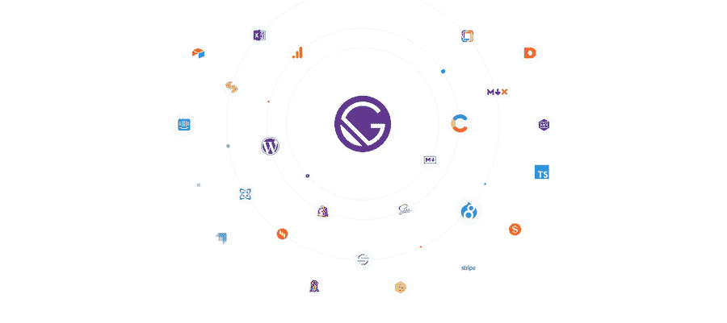

The Gatsby homepage.


有一个[超快速安装过程](https://www.gatsbyjs.com/docs/quick-start/)涉及到节点包管理器(npm)。稍后我们将对此进行详细介绍。虽然它是一个 JavaScript 框架，但 Gatsby 在运行时生成静态 HTML 文件，因此没有办法攻击站点。更重要的是，Gatsby 自动化性能以保持您的站点以最佳配置运行。

在自动化性能、动态缩放和静态 HTML 构建之间，Gatsby 感觉自己就像一个活的有机体。有一个复杂的编码“组成”,包括 JSX、Markdown、CSS，以及更多基于你需求的东西。您工作流程的每一个[步骤](https://www.gatsbyjs.com/docs/how-to/)和堆栈的每一部分都可以根据您的需求进行定制。

WordPress 开发者也会喜欢 Gatsby 如何与平台整合。不过，这并不适合所有情况。例如，如果您需要完全管理基于云的 CMS，这不适合您。即便如此，Gatsby 在大多数情况下都能适应你的项目，而且和 WordPress 配合得非常好。

#### 33.姜戈

尽管有很多关于 Python 是“初学者”或“学习中”编程语言的讨论，但它是许多知名网站的支柱。一些最大的网站(Instagram、优步、Reddit、Pinterest 等等)使用 Django。通常，你会发现没有提到 Python 本身，[，而只有 Django](https://djangoproject.com/) 。

Django 是一个使用 Python 创建服务器端 web 应用程序的框架。它和 Python 本身一样简单易用，格式非常易读。

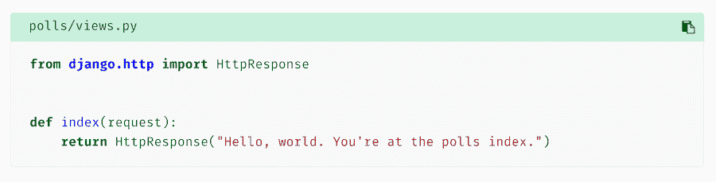

Django’s default formatting.


对于基于逻辑的项目来说，Python 是一种很好的脚本语言，所以在 web 应用程序中利用它是一个很好的选择。更何况 Python 处理速度快，根本文件结构轻。因为 Django 的速度很快，所以与 PHP 相比，它是一个优秀的服务器端框架，并且与更流行的语言一样简单。

也就是说，接受率较低，这可能是由于 Python 作为学习语言的声誉。尽管如此，Django 与 JavaScript 等其他语言配合得很好，是现代 web 应用程序的基础。

当然，如果你计划使用像 WordPress 这样的 CMS，或者你正在为基于 React 的项目创建解决方案，你的选择就更少了。即便如此，我们认为 2022 年在 Django 上运行的网站数量将会上升。

#### 34.Ruby on Rails

几年前，Ruby 编程语言是初级语言和 PHP 脚本替代品的“宠儿”。它经常被比作 Python。

和 Django 一样， [Ruby on Rails](https://rubyonrails.org/) 也是许多开发人员的最爱。


The placeholder page for a new Ruby on Rails project.


你会发现很多服务器端和底层的 web 应用程序都使用了 Ruby。此外，Ruby on Rails 在无数网站上被用作服务器端框架。它使用 MVC 方法，并为 web 服务、页面和数据库提供结构。因此，你有一个现成的准系统网站等着你。

如果 Ruby on Rails 需要调度许多作业并使用第三方解决方案，那么它将适合您的项目。例如，有与文件存储的本机集成，如[谷歌云](https://cloud.google.com/storage/)，以及用于发送电子邮件的包装器。

总的来说，如果您想要一组健壮的缺省值(比如文件夹结构)，并且可以根据需要进行定制，那么这是一个不错的选择。另一方面，如果您喜欢在开发过程中使用 API，这并不是一个很好的选择。

对于大型项目来说，Ruby on Rails 的代码结构可能会变得复杂且难以理解。运行时间也会受到影响，因此它可能不是速度关键型项目的最佳框架。

尽管如此，Ruby on Rails 仍然是领先的 web 服务器端框架之一，对于合适的项目，它的使用速度并没有减慢。

#### 35.以打字打的文件

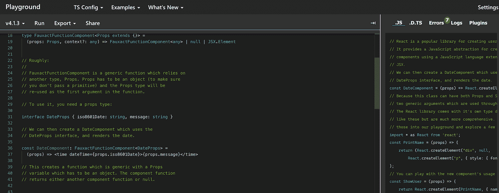

An example of TypeScript code.


简而言之， [TypeScript](https://www.typescriptlang.org/) 为 JavaScript 提供了可选的静态“类型检查”。它是语言的“超集”,也支持许多其他 JavaScript 库。总的来说，TypeScript 是带有一些额外特性的 JavaScript，您可以同时编译这两种语言。

许多开发人员已经转向 TypeScript 来减少他们得到的运行时错误的数量。类型错误[是最常见的](http://gria.org/programming-errors-three-common-types/)之一，减少它们可以给你带来很多额外的时间。

对于一个非常简单的 TypeScript 示例，考虑一个字符串:

let helloWorld = " Hello World

// ^ = let helloWorld: string

这里，TypeScript 对 helloWorld 变量使用 let 而不是通常的 var。由此，TypeScript 知道 helloWorld 是一个字符串，并在此基础上检查它。

最终，TypeScript 并不是一个基本的 web 开发工具，尽管它由于其核心的 marquee 特性而变得更加流行。如果你最终节省了一些非常需要的时间，它可能对你的工作流程至关重要。

#### 36.GraphQL

这里有一个独特的工具，可能会受到在 API 中处理数据的开发人员的青睐。GraphQL 是一种在 API 中使用的查询语言，它也作为一个运行时来提供查询结果。

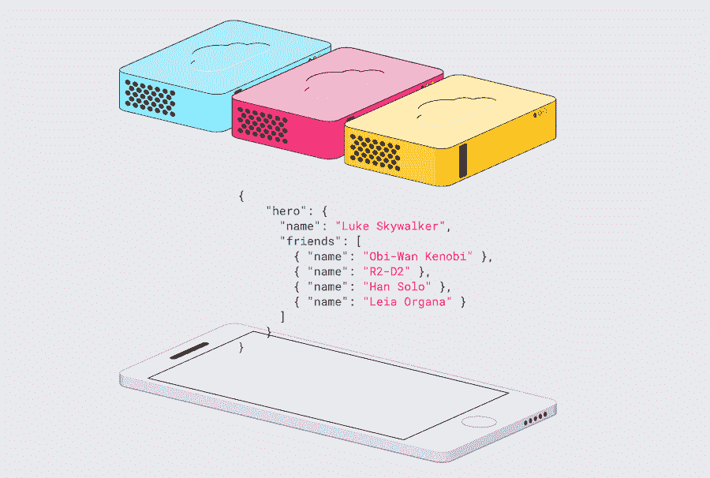

The GraphQL website.


对于标准的 REST API，您经常需要从多个 URL 加载。使用 GraphQL，您可以从单个请求中获取数据。此外，GraphQL APIs 是按类型而不是端点排列的。这种分类有助于提高查询效率，并在出错时提供更明确的错误。

考虑到 GraphQL 是如何实现类型的，类型还可以用来跳过手动解析代码。您还可以向 API 中添加新的字段和类型，而不会影响到您到目前为止所做的工作。

该工具在许多领域都是灵活且可扩展的。因为 GraphQL 为您的项目创建了一个统一的 API，所以您可以引入一个与您选择的项目语言相匹配的引擎。这使得它适用于广泛的应用领域，而不是针对一个普遍问题的利基解决方案。

你会发现 GitHub、Spotify、脸书等网站都在使用 GraphQL。它应该让您了解 GraphQL 是如何在各种各样的大量查询的站点上使用的。因此，在接下来的 12 个月甚至更长时间内，您可能需要不止一次地采用这种解决方案。

### 包管理器

编程语言、框架等等有很多活动的部分。这些依赖项必须以正确的方式下载和安装才能工作。输入包管理器。这些帮助您从命令行下载和安装特定的依赖项。让我们来看看你会遇到的一些工具。

#### 37.节点程序包管理器(npm)

是的，下载安装程序有它的位置。然而，在大多数情况下，从命令行使用包管理器非常简单。它还提供了一种从网上抓取和安装文件的快捷方式。

[节点包管理器(npm)](https://www.npmjs.com/) 是微软拥有的一个特定于 JavaScript 的 web 开发工具，它允许您按需安装特定于语言的包:


The npm homepage.


例如，搜索 React 包会出现超过 155，000 个结果:

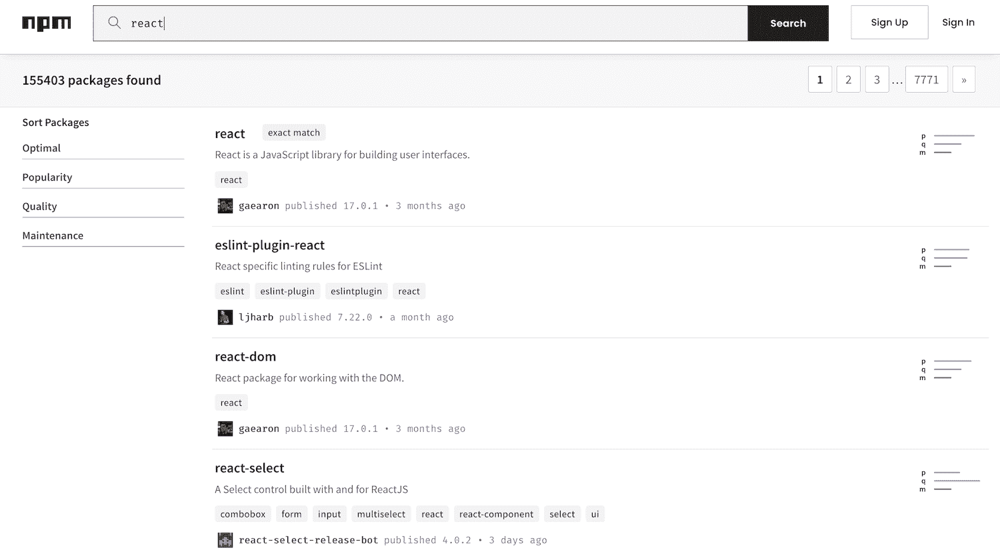

A search performed in npm.


与在线 IDE 一样，npm 是一个没有太多“播放时间”的 web 开发工具，主要是因为它无处不在。因此，几乎每个 web 开发人员都会使用这个工具。

然而，这是不可思议的，现在它在 GitHub 的羽翼下，2022 年将有比以往更多的开发者使用 npm。

#### 38.故事

很像 Python 的 npm 和 pip， [Yarn](https://yarnpkg.com/) 帮助你安装与你的项目及其工具相关的包。这里的区别在于 Yarn 也是一个项目管理工具。

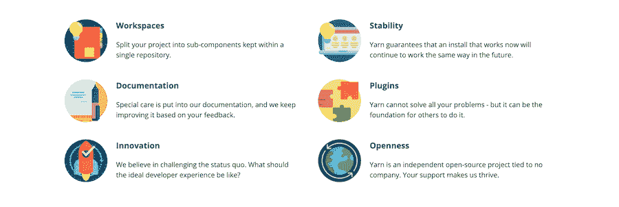

The Yarn homepage.


[安装简单](https://yarnpkg.com/getting-started/install)，为新项目初始化纱线也需要[最少的努力](https://yarnpkg.com/getting-started/usage)。它已经成为一个强大的[开源解决方案](https://yarnpkg.com/getting-started/qa#is-yarn-operated-by-facebook)，用于安装包和管理你的项目。

您将[使用工作空间](https://yarnpkg.com/features/workspaces)来创建“monorepos”，并且您的项目的多个版本都存在于同一个 repo 中，并且可以被交叉引用。你可以为任何 Yarn 不能做的事情安装插件(为此你要添加新的获取器和解析器)。更准确地说，你*可以*安装插件，但是那里[没有太多](https://yarnpkg.com/features/plugins#official-plugins)，至少在官方列表中没有。相反，如果你迫切需要这个功能，你可以自己编码。尽管如此，你还是可以根据你的项目需求来定制纱线。

纱使一个独特的情况下，成为您的主要包装经理。对于一个现实世界的项目，你可能会更多地依赖 npm，但是 Yarn 会以对你有利的方式潜入你的工作流程。

### API 和测试工具

确保事情正常进行是一个经常被忽略的过程，但当事情出错时，也会带来遗憾。因此，项目的测试阶段应该是可靠的、健壮的和彻底的。

考虑到这一点，这里有一些 API 和测试工具供您在项目中使用。

#### 39.霍普斯科奇

由 Netlify 支持， [HoppScotch](https://hoppscotch.io/) 是一个开源 API 开发工具。开发人员称之为“生态系统”，掩盖了其功能。

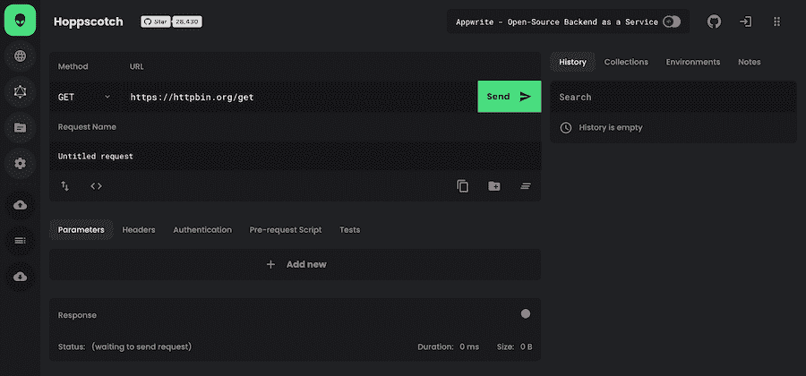

The main HoppScotch page.


这是一个简单而可靠的解决方案，不适合胆小的人。如果你从未使用过这样的工具，学习曲线会很陡。在该应用的任何页面上几乎都没有使用 HoppScotch 的指导，尽管这通常不是问题，因为该工具是为有经验的开发人员设计的。

有许多实时连接(WebSocket、SSE 等等)和一个 GraphQL 实现。我们也喜欢文档创建者:

需要一个给你带来竞争优势的托管解决方案吗？Kinsta 为您提供了令人难以置信的速度、一流的安全性和自动伸缩功能。[查看我们的计划](https://kinsta.com/plans/?in-article-cta)

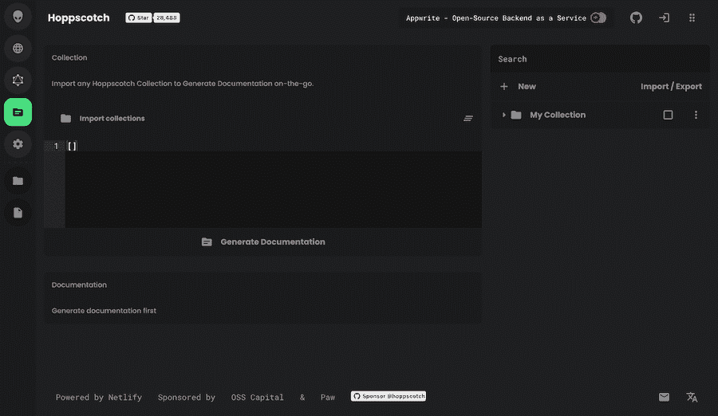

The HoppScotch documentation creator screen.


它与您的 HoppScotch“集合”一起工作，动态创建文档，这是一个受欢迎的省时工具。

总的来说，HoppScotch 是一个会在你的浏览器中经常打开的功能性工具。这是那些你会一直使用却没有意识到的解决方案之一——我们不能再给它更高的评价了！

#### 40.邮递员


The Postman logo.


警告——我们将要提到可怕的“C”字:*协作*。 [Postman](http://postman.com) 是一款 web 开发工具，通过 Postman 平台帮助你作为一个团队创建一个[应用编程接口(API)](https://kinsta.com/blog/wordpress-rest-api/) :

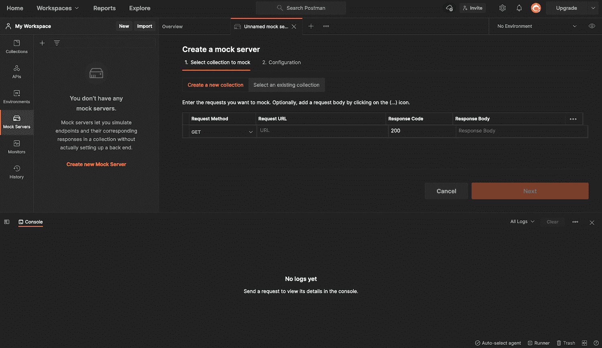

The Postman dashboard.


有大量的[用例](https://www.postman.com/use-cases/)可以将 Postman 集成到您的工作流程中。例如，您可以以标准的方式将它用于应用程序开发，这将直接转化为基于 web 的项目。你可以使用模拟服务器来模拟端点，这将特别吸引 WordPress 开发者。

你甚至可以[创建 onboarding](https://www.postman.com/use-cases/developer-onboarding/) 来帮助你的 API 用户学习诀窍。那些有大量用户流动或显著流量的项目将在这里看到好处。

至于定价，Postman 提供了一个免费等级，但你将从其中一个[高级等级](https://www.postman.com/pricing/)中获得最大价值。根据你的付费周期和用户数量，你将支付大约 12-30 美元。

#### 41.测试库

运行的代码是理想的，但是运行的应用程序才是最终目标。测试库顾名思义:它提供了一套工具来帮助你测试你的项目，并鼓励你使用良好的编码实践。


The Testing Library homepage.


这个想法是你创建代表你的应用程序使用的测试。如果它们运行顺利，你的应用程序也很有可能运行顺利。这是一个关于框架的不可知工具，它不是一个测试运行程序。测试库的核心目的是帮助你编写与实现细节无关的可维护测试。

测试库工具中的一切都围绕着它的[指导原则](https://testing-library.com/docs/guiding-principles/)。因此，你不仅仅是在创建测试——你在学习如何使它们更好、更有价值。

因此，测试库可能会成为你工作流程的一个重要部分。我们认为，几乎所有的项目链都可以从测试库中受益，React 用户几乎肯定会希望将这个工具作为一个标准。

### 协作工具

尽管有开发者反社会的比喻，但事实是技术和协作是携手并进的。

因此，让我们收集一些将用于您下一个项目的优秀协作工具。

#### 42.吉拉

就软件而言，Atlassian 是一家广受欢迎的公司。我们是该公司的几个产品的忠实粉丝:Confluence、Trello、Sourcetree、Bitbucket，以及我们在这里的焦点，[吉拉](https://www.atlassian.com/software/jira/)。


The Jira homepage.


它是使用[敏捷框架](https://airfocus.com/glossary/what-is-an-agile-framework/)的团队的开发工具，尤其是 Scrum，因为它非常流行。因此，您可以在软件包中获得丰富的功能。例如，你可以使用看板来帮助组织任务和冲刺。您还可以实现您评估技术，定制您的方法和项目。

吉拉专注于可重复的工作流程:计划、跟踪、发布和报告。它是几个敏捷框架的核心，尽管你也可以根据你的项目前计划创建你自己的框架。如果你必须在 sprints 之间转换，你可以改进你的项目，扩大或缩小规模。

关于吉拉的好消息是，它有一个免费的起步层，其他层有合理的价格。也就是说，你会发现十人团队是有效使用吉拉的最低要求。这对任何小团体来说都是过度的。

#### 43.Taskade

说到协作工具，很少能找到 [Taskade。](https://www.taskade.com/)这对应用程序不利，因为它是让团队专注于主题的绝佳工具。

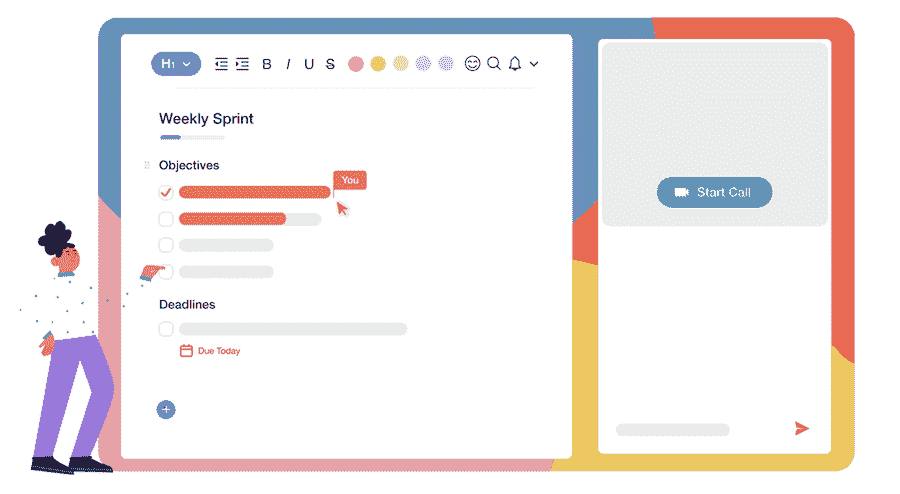

The Taskade dashboard.


如果你是其他协作工具的用户，比如 Asana 或 Basecamp(稍后会有更多介绍)，你会在这里如鱼得水。您最需要的信息，如待办事项和提醒，都集中在引擎盖下。因此，你可以根据你的项目以多种方式展示它。

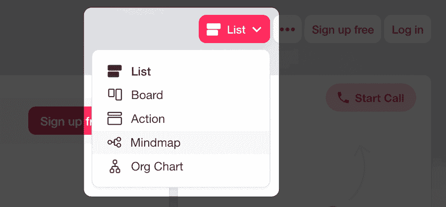

The presentation types in Taskade.


“思维导图”和“组织结构图”视图类型非常出色，每种视图都为您添加的信息提供了不同的视角。

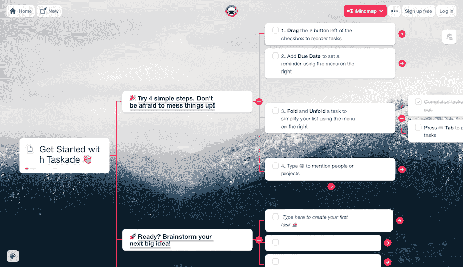

A mind map in Taskade.


这款应用的简单性具有欺骗性。除了一种灵活的呈现和管理任务的方式之外，几乎没有其他东西可以提供。

与你的团队一起工作只需按几下按钮。例如，每个屏幕都有一个可扩展的聊天窗口:

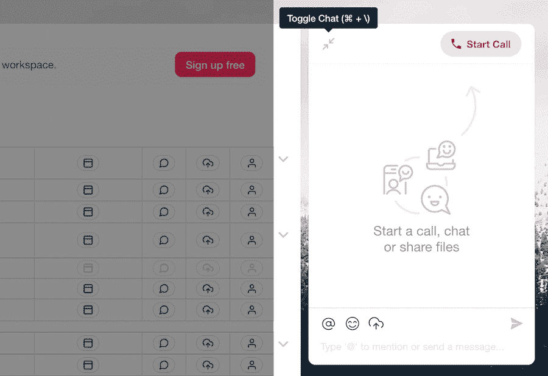

The Taskade chat window.


对于一些人来说，尤其是与其他解决方案相比，Taskade 可能被视为准系统，甚至装备不足。然而，事实并非如此。Taskade 是一种与团队合作的奇妙方式，由于它的简单性，它可以直接用于你正在进行的任何项目。

#### 44.阿萨纳

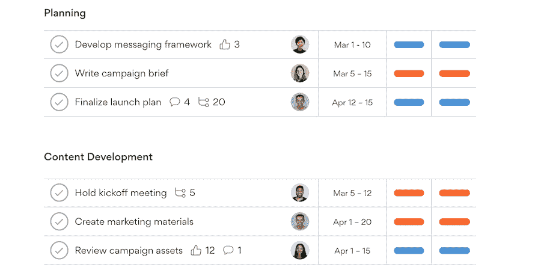

The Asana homepage.


[Asana](http://asana.com) 是协作工具领域比较突出的名字之一。在团队的帮助下，抓住一个项目并使其成型是一件非常困难的事情。Asana 也很擅长适应不同的工作流程。例如，您可以在列表和日历之间切换，也可以访问时间线。

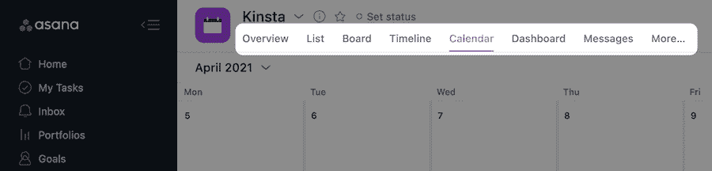

Asana’s workflow types.


还有一些非常棒的基于团队的特性和功能。报告是全面的，并且[在更高的计划](https://asana.com/pricing)中，您可以访问显示与您的团队绩效相关的各种分析的仪表板。甚至有一种方法可以监控每个团队成员的工作量。因此，体式帮助你将嘎吱嘎吱声保持在最低限度，防止团队成员筋疲力尽。

更重要的是，免费层不是全功能应用程序的残缺演示。你可以像扩展团队一样扩展体式，这里有很好的功能来帮助你。例如，您可以向团队成员分配工作并管理每个工作流。您还可以在每个工作区的基础上向整个团队发送一般消息。

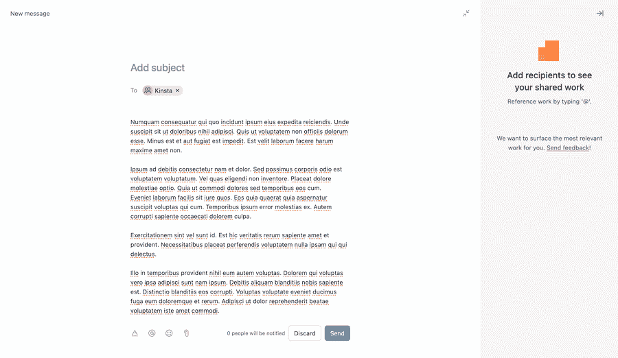

Sending a message in Asana.


这是协作项目管理的老手，但是 Asana 几乎每次都能交付。你会发现你的大部分客户和队友也有一个 Asana 账户，这意味着在应用程序中组装会比你想象的更频繁。

#### 45\. Basecamp

Basecamp 是基于团队的项目管理的另一个重要参与者。这是一个老守卫者，几乎和 WordPress 本身一样历史悠久。核心软件已经存在了很长时间，所以它有值得注意的血统和记录。

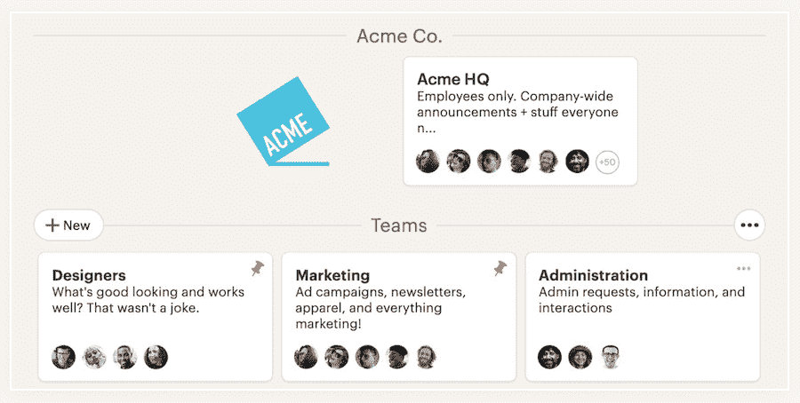

The Basecamp homepage.


理论上，与竞争相比，Basecamp 没有什么令人兴奋的。老实说，许多其他协作应用已经赶上了 Basecamp 提供的功能。然而，这并不是故事的全部。

是的，您可以创建任务和待办事项列表，将它们分配给团队成员，并在项目范围内处理所有事情。然而，Basecamp 的杀手锏是基础设施和设计。

使用 Basecamp 有一个简单的方法:创建一个项目，制定你的任务清单或时间表，并将任务分配给队友。每个项目都有一系列独立的方面来帮助您完成项目:

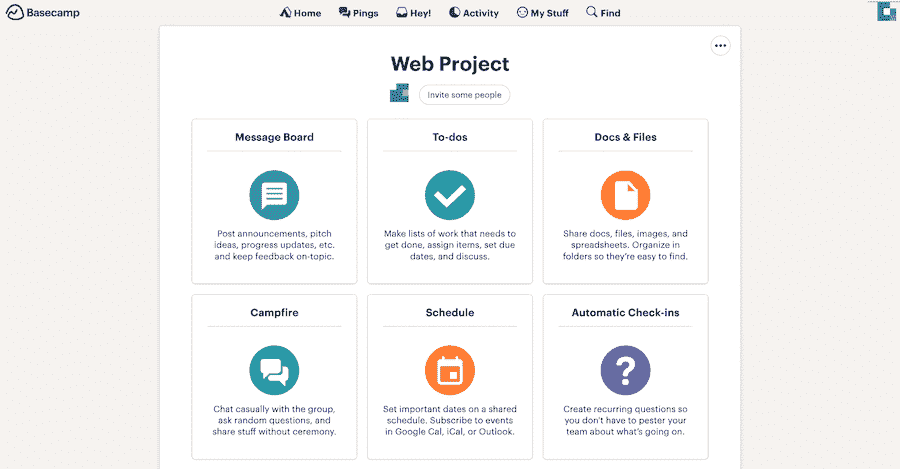

The elements that make up a Basecamp project.


正如我们所说，这里没有什么突破性的东西，但这就是重点。Basecamp 是一个可靠的项目管理系统，没有太多花哨的功能。因此，你会不断回来，因为它是[可靠和可扩展的](https://basecamp.com/extras)基于你的需要。

### 任务执行者

在 web 开发项目中处理微小的任务会带来一个问题。它们是让你更有效率和生产力所必需的。你必须花费时间和精力来完成这些微观任务。

为了帮助你，你需要一个任务执行人。这里有一些我们最喜欢的。

#### 46.咕哝

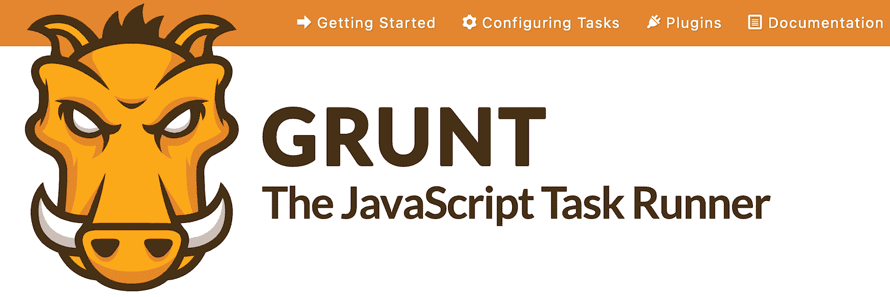

The Grunt homepage.


Grunt 是一个特定于 JavaScript 的任务运行器，旨在自动化一些你每天都会遇到的[平凡而重复的任务](https://gruntjs.com/configuring-tasks)。考虑你通常认为普通的任务:林挺、[、缩小](https://kinsta.com/blog/enable-gzip-compression/)、编译等等。

Grunt 通过一个基于 JSON 的配置文件(称为“Gruntfile”)为您处理这些。这里有一个例子:

```
module.exports = function(grunt) {
  grunt.initConfig({
    jshint: {
      files: ['Gruntfile.js', "src/**/*.js', "test/**/*.js'],
      options: {
        globals: {
          jQuery: true
        }
      }
    },
    watch: {
      files: ['<%= jshint.files %>'],
      tasks: ['jshint']
    }
  });
  grunt.loadNpmTasks('grunt-contrib-jshint');
  grunt.loadNpmTasks('grunt-contrib-watch');
  grunt.registerTask('default', ['jshint']);
};
```

如果你经常发现你的项目在日常任务中浪费时间，Grunt 很可能会成为你的 web 开发工具箱的一部分，就像它已经成为了 WordPress、Bootstrap 和许多其他工具的一部分一样。

#### 47.吞咽


The Gulp logo.


当你比较任务跑者时，通常是吞咽和咕噜之间的较量。Gulp 是一个基于 JavaScript 的工具包，用于自动化您的工作流程并提高您的效率。

您将使用专用文件和“流”在资产和代码被写入磁盘之前对其进行操作。您创建的每个任务都是一个“异步”函数，您可以将其设置为私有或公共。不同之处在于其中一个权限:私有任务不能由最终用户运行，并且被设计为与其他功能一起工作。

说到这里，你可以使用 series()和 parallel()函数来创建任务。这意味着你可以做一些小任务，让它们成为一个更大的系统中的一个齿轮，然后嵌套它们。

此外，您还可以通过[社区创建的插件](https://gulpjs.com/plugins/)来扩展 Gulp 的功能:

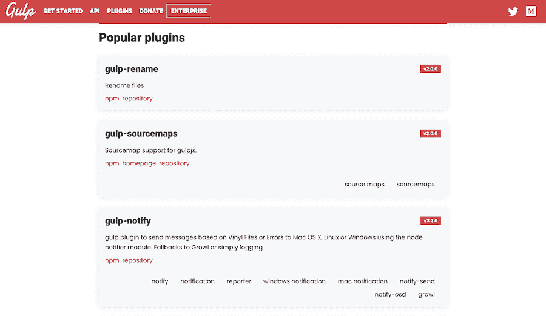

A showcase of Gulp plugins.


这可能是一种概括，但 Gulp 和 Grunt 擅长不同的事情。在处理可能是一组更广泛的指令的一部分的资产时，Gulp 是可靠的。正因为如此，您将希望在每个项目的基础上选择合适的任务运行器。

### 集装箱工具

我们在这里大胆地说，如果你不使用某种形式的容器化或虚拟机工具，你作为 web 开发人员的进步将会受到影响。

当然，这并不一定适用于所有人，但是使用基于容器的开发环境有很多好处。这里有几个选择方案。

#### 48.码头工人

对于许多人来说， [Docker](https://www.docker.com/) 是*选择的*基于容器的开发环境。开源平台并不全是关于容器的，但这是经常提到的使用它的原因。


The Docker logo.


在前端，这是一个简单的过程:点击一个按钮，获得一个虚拟沙盒开发环境。当然，任何表面上看起来简单的事情其实都是深藏在心底的。Docker 将用户界面(UI)、CLI 和 API 与安全条款相结合，让您能够快速部署。

对于许多开发者来说，Docker 将成为创建新应用的核心。网页开发者——尤其是 WordPress 开发者——有一系列工具来完成这项工作。Local by Flywheel 和 DevKinsta 是领先的平台。


Docker powers the DevKinsta app.


注意:我们最近发布了 DevKinsta——一个本地开发工具，帮助你建立新的 WordPress 网站。您还可以通过单击将网站部署到您的 Kinsta 帐户。

Docker 还集成了许多工具——其中一些已经在您的工作流程中了。GitHub、VS Code 等应用程序可以与 Docker 连接，并提供平滑集成。

总的来说，Docker 可以就它所包含的内容发表一整个系列的文章。尽管如此，这些都不是必须的。很可能你每天都在使用 Docker，你已经知道它有多棒了！

#### 49.LXD

简单来说， [LXD](https://linuxcontainers.org/lxd/) 是 Linux 发行版的容器管理器。它是基于映像的，附带了几个为 Linux 预先构建的映像。使用 LXD 可以让您放心，因为您将在相同的默认最终用户操作系统上进行开发。

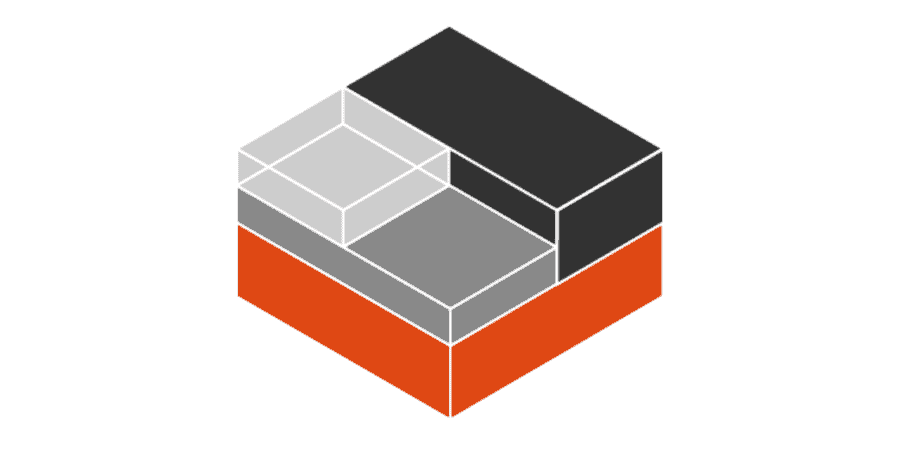

The LXD logo.


它是由 Ubuntu 开发者 Canonical 创建的，当然，它保持了开源结构。您可以使用非特权容器创建安全的环境，使用许多资源控制资源使用，甚至管理网络。

LXD 也是可扩展的，这意味着您可以运行数千个计算节点或保持简单。对于基于云的应用，LXD [与 OpenNebula](https://opennebula.io/get-your-hands-on-v-5-8-edge/) 集成——后者有官方驱动程序来管理 LXD 实例。

默认情况下，许多容器化工具使用 Ubuntu 作为标准的虚拟环境。尽管如此，LXD 已经为运行发行版进行了优化。如果您以前没有尝试过，那就值得花时间来运行一个测试工作区。你会发现它比竞争对手更适合特定的工作流程或客户项目。

### 图像优化工具

资产(或媒体，或任何你喜欢的名字)在网络上是丰富的。有很多专门的基于图像的在线文化。因此，不管使用了多少图像，让您的 web 开发项目表现良好是至关重要的。

以下是一些最流行和最优秀的[图像优化](https://kinsta.com/blog/optimize-images-for-web/)工具。

#### 50.短像素

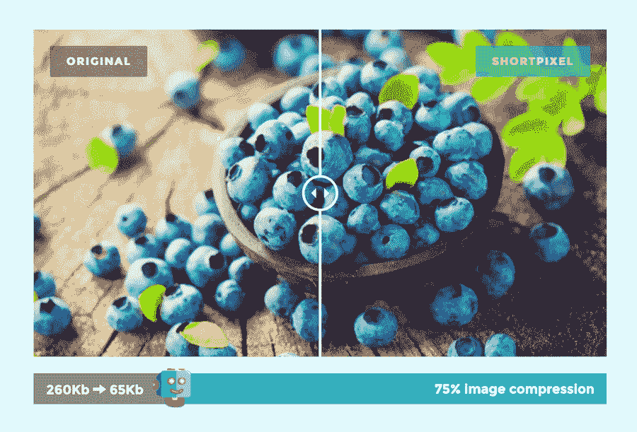

The ShortPixel website.


有许多图像优化应用程序可用，但 [ShortPixel](http://shortpixel.com) 有一个主观上健壮的算法。它能够粉碎图像文件的大小，而不影响质量。如果我们很挑剔，我们会建议，因为默认设置是可用的最高压缩，如果你的图像没有被充分压缩，就没有其他地方可去。不过，这并不是一个重要的批评。

ShortPixel 拥有大量的功能。有三个级别的压缩，一个强大的 PDF 优化器，甚至还有一个 GIF 压缩器。后者是您在许多其他工具中找不到的，因此它是产品线中一个受欢迎的补充。

整个界面也是可访问的:你将图像拖放到上传器上，然后等待 ShortPixel 发挥它的魔力。处理完图像后，您可以批量下载它们，也可以选择下载单个图像:

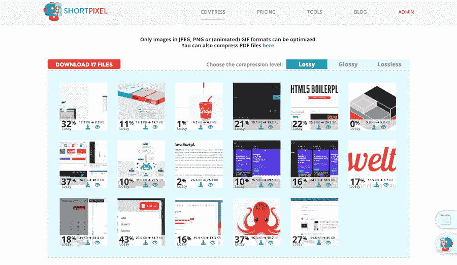

Downloading images from ShortPixel.


ShortPixel API 工具也很健壮。你会发现单独的 API 减少在线和离线图像，全面的 PHP 和。NET 客户端库、基于 JavaScript 的自适应引擎等等。

我们建议 ShortPixel 是一个开发者工具，因为它非常适合连接您的网站或应用程序。我们还会说，它会一下子取代你的 TinyPNG 瘾，特别是如果你想把它作为一个更大的工作流程的一部分。

#### 51.TinyPNG

大家最喜欢的图像优化工具——[TinyPNG](http://tinypng.com)到了。您也可以将 [TinyJPG](http://tinyjpg.com) 捆绑到这个条目中，尽管这两个工具处理相同的图像格式。

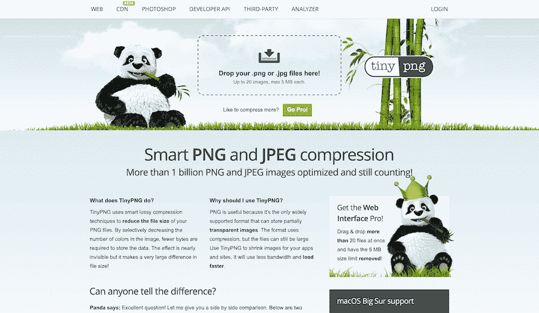

The TinyPNG website.


你会发现 TinyPNG 这些年变化不大。它仍然是一个简单的拖放工具，用于优化您的图像。没有任何花哨的东西，也没有大量的文件格式。尽管如此，TinyPNG *提供的是最高的可用性和与其他工具的集成。*

例如，有一个 [Photoshop 插件](https://tinypng.com/photoshop)和一个用于更细粒度应用的[功能开发者 API](https://tinypng.com/developers) 。甚至 Python 用户也可以参与进来，因为 API 也支持这种语言。已经有[几个插件](https://tinypng.com/third-party)使用 API 为很多第三方工具创建。

我们并不是说 TinyPNG 垄断了图像优化市场，但它通常是许多用户的首选。拍摄图像并将其放入上传程序只需几秒钟，当您获得图像 99.9%的完美再现时，就很容易信任了。

### 网站测试工具

我们之前讨论过测试你的 API 和核心站点代码，尽管这忽略了你的网站的性能。这里有一些我们喜欢的工具，它们也可以帮助你分析你的网站的表现。

#### 52.响应地

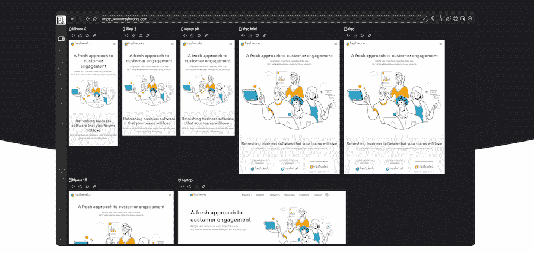

The Responsively app.


如果你曾经被你需要在你的应用中执行和完善的媒体查询的数量所淹没，[相应地检查一下](https://responsively.app)。这是一个开源的前端工具，可以帮助你根据你选择的设备的不同视窗来开发网站。

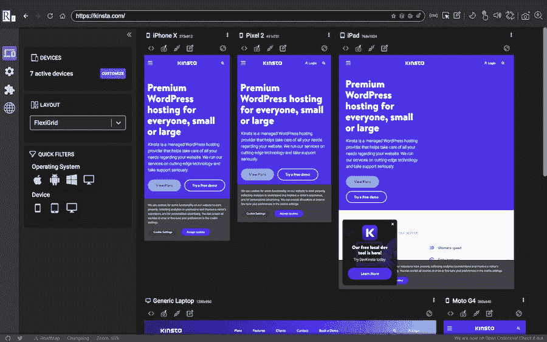

Viewing different devices in Responsively.


最棒的是你可以并排比较布局。它给你一个坚实的机会来提高你的设备之间的一致性。每个设备都是精确的，并且有许多可供选择，如果你的站点针对特定的设备，这是非常好的。

你还可以为 [Mozilla Firefox](https://addons.mozilla.org/en-US/firefox/addon/responsively-helper) 、[微软 Edge](https://microsoftedge.microsoft.com/addons/detail/responsively-helper/ooiejjgflcgkbbehheengalibfehaojn) 和[谷歌 Chrome](https://chrome.google.com/webstore/detail/responsively-helper/jhphiidjkooiaollfiknkokgodbaddcj) 添加专用的浏览器扩展，将页面发送到相应的浏览器。从这里，您可以打开内置的开发工具并开始工作。

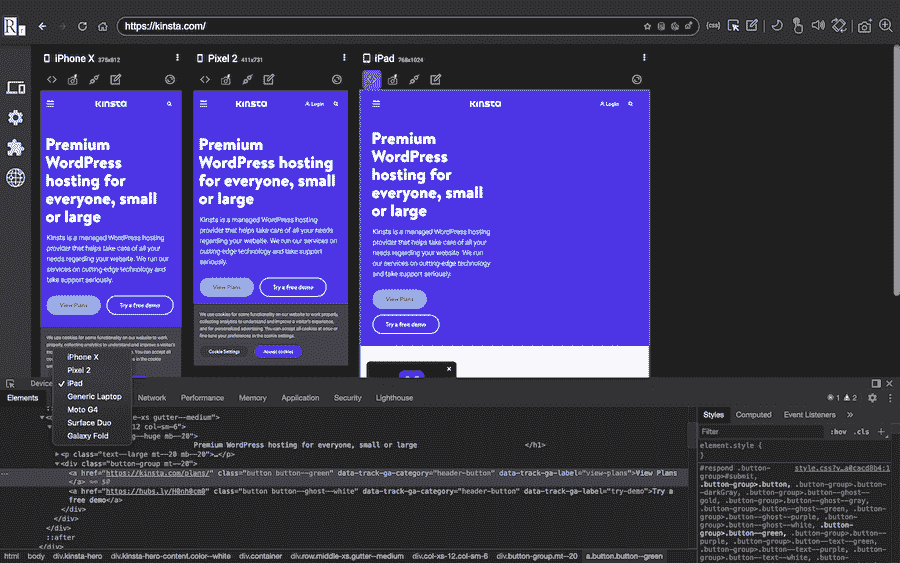

The Responsively inspector.


还有许多其他特性，比如截图功能、热加载支持等等，可以帮助您进行开发。很难对“网络开发者的浏览器”这一口号提出异议。它可能会成为你工作流程的核心部分。

#### 53.谷歌灯塔

对许多人来说，谷歌的 PageSpeed Insights 是一个有价值的工具，可以用来发现一个网站的表现如何，以及你可以在哪里提高加载速度。

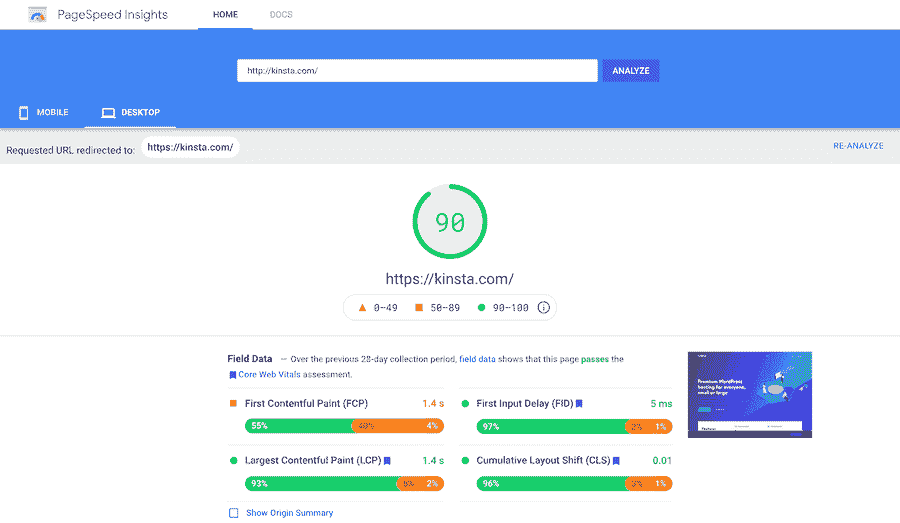

Google’s PageSpeed Insights.


也就是说，深入研究一些软件更有意思。它也可能更适合你的需求。 [Google Lighthouse](https://developers.google.com/web/tools/lighthouse/) 可以在任何网页上运行，并为页面性能、SEO、渐进式网络应用(PWA)等提供审计和报告。

运行 Google Lighthouse 的主要方式是从命令行，使用 Chrome 的 DevTools，或者作为一个节点模块。如果您使用 PageSpeed Insights 接口，Lighthouse 会生成一些分数并提供进一步的见解。

值得注意的是，从表面上看，谷歌灯塔和 PageSpeed Insights 似乎相似。但 PageSpeed Insights 使用的是基于实验室的数据和真实世界的用户数据。Lighthouse 的 suse 分析不考虑用户数据，而是衡量你网站的更多元素。

在我们看来，运行 PageSpeed Insights 和 Lighthouse 都是值得的，尤其是如果你的客户的目标是达到搜索引擎结果页面(SERPs)的顶部。在任何情况下，这都是一个必须掌握的可靠工具，它甚至可以取代 PageSpeed Insights 成为您的首选性能工具。

#### 54.柏树

对于许多开发人员来说，端到端测试并不是一件愉快的事情。 [Cypress](https://www.cypress.io/) 选择了这座小山——这是一个简单的解决方案，打破了端到端测试的趋势，产生了一些出色的东西。

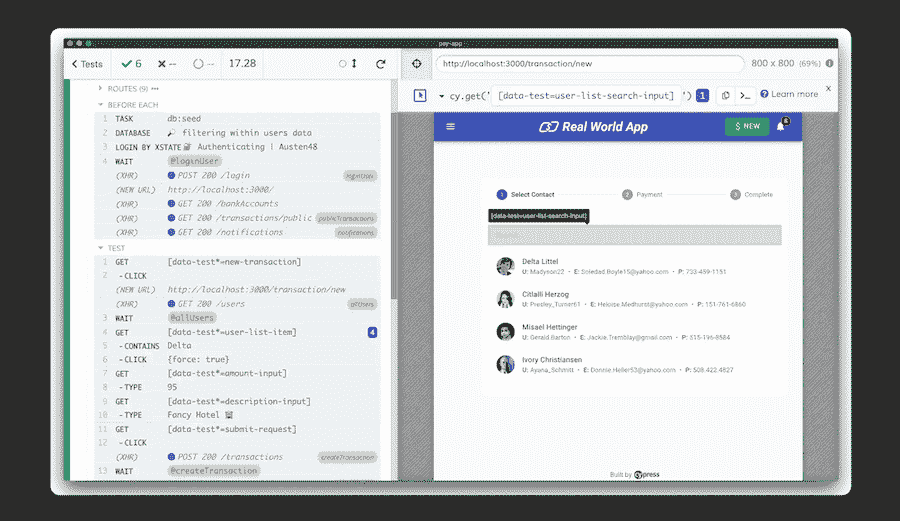

The Cypress homepage.


虽然大多数端到端测试工具都是基于 [Selenium](https://www.selenium.dev/) 的，但是 Cypress 却走了一条不同的路。这意味着用户在基于 Selenium 的测试器中发现的问题在这里不存在。事实上，开发人员希望设置、编写和运行测试变得轻而易举。

为了做到这一点，他们从头开始构建架构，并专注于端到端测试，排除其他形式。为了提高性能，Cypress 与您的程序运行在同一个运行循环中，而不是通过网络执行远程命令。

因为测试代码在浏览器中运行，所以不需要考虑驱动程序或语言绑定。即便如此，您也可以在运行测试之前编译成 JavaScript。

如果您是一名质量保证(QA)工程师或开发人员，希望您的端到端测试能够本地访问您的工作，Cypress 应该引起您的注意。最棒的是还有一个[全功能免费层](https://www.cypress.io/pricing)！

### 55.堆栈溢出和搜索引擎

现在，请允许我们扩展一下 web 开发工具的范围。 [Stack Overflow](http://stackoverflow.com) 是任何对 web 开发稍有了解的人都知道的:

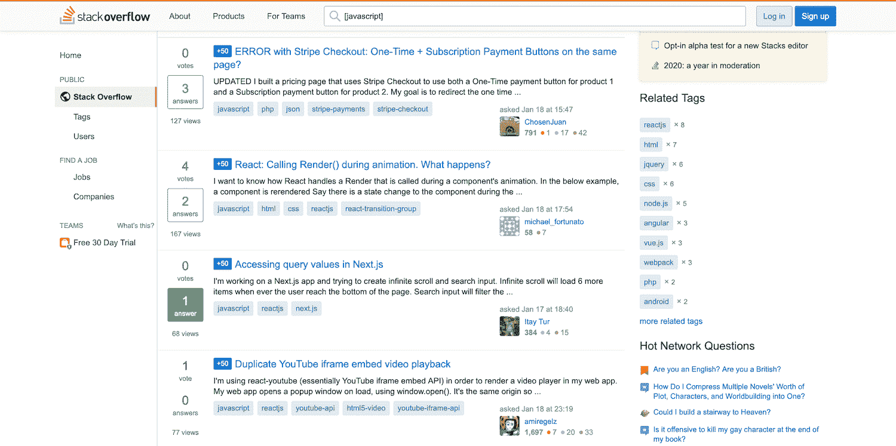

The Stack Overflow website.


这是一个专注于编程的问答网站，也是涵盖所有其他主题的[栈交换](http://stackexchange.com)网络的一部分:

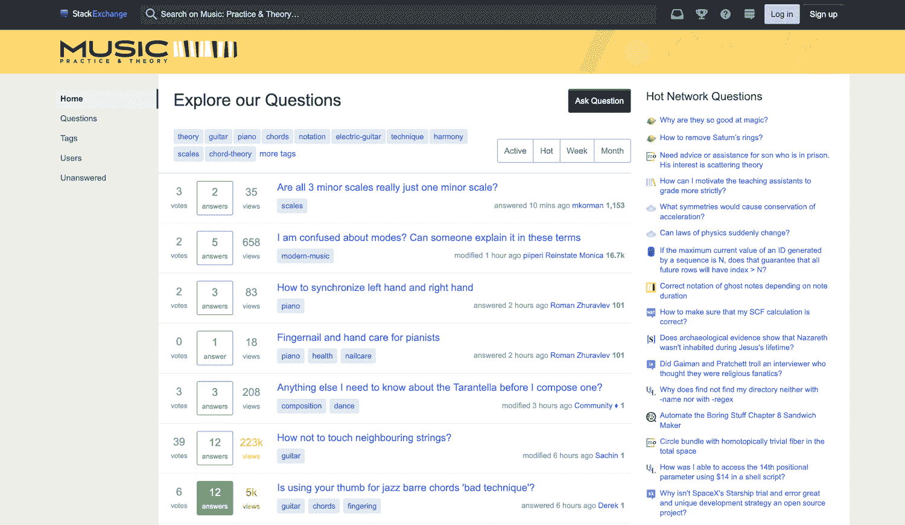

One of many niche sites in the Stack Exchange network.


众所周知，它是成千上万开发者的首选资源，尽管其社区存在一些争议，但流量仍然很大。我们冒昧地说，Stack 和您选择的搜索引擎一起，代表了一种用于学习和提高技能的灵活的 web 开发工具。

例如，当遇到与代码相关的开发障碍时，您可能会遇到堆栈溢出。同样，当一个错误出现时，你不确定如何解决，将它粘贴到搜索引擎是找到你需要的答案的最快方法。

鉴于 [90%的被调查用户](https://insights.stackoverflow.com/survey/2020#technology-what-do-you-do-when-you-get-stuck)去 Stack Overflow 解决问题，很可能每个人都会使用这个工具。然而，对于初学者来说——或者即使你不能清楚地表达你的问题——搜索引擎可能会更友好一些。

### Web 开发参考

如果你是一个认同“RTFM”精神的开发人员，你不需要对以下几个条目进行任何说服。相比之下，如果你喜欢涉入一个问题并解决它，要知道在你之前已经有无数的开发者可能找到了答案。

有鉴于此，看看下面几个 web 开发工具，都是基于 web 参考资料的。

#### 56.MDN Web 文档

早在网络早期，Lycos 就有一个名为 Webmonkey 的网站，旨在向新用户教授 web 开发和编程。这个网站的精神在 Mozilla 的 [MDN Web Docs](https://developer.mozilla.org/en-US/) 中继续存在。Webmoney 于 2004 年关闭，MDN Web Docs 于 2005 年问世，因此两者之间有着天然的契合。

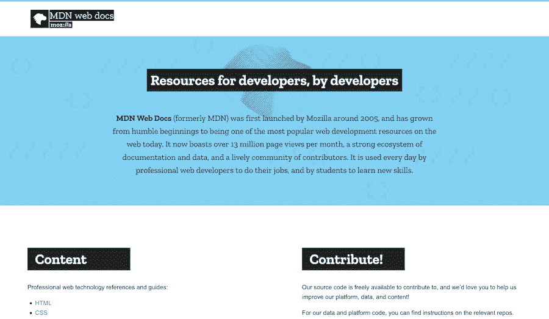

The MDN Web Docs homepage.


这是一个资源集合，在某些情况下可以帮助您学习 web 编程，在其他情况下可以帮助您学习 Mozilla 特定的产品。内容分为两大类:技术和参考指南。您将看到几个基于您现有能力和经验的教程，一个专门的参考指南，以及一些关于前者的更多资源。

这些指南都与开发行业中的特定领域和行业相关。例如， [Web 开发参考](https://developer.mozilla.org/en-US/docs/Web/Reference)充当了附加 HTML、CSS 和 JavaScript 指南的“基石”页面。

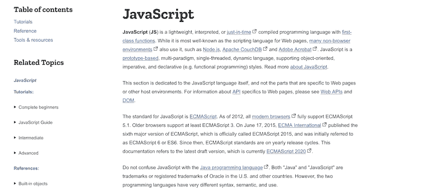

MDN Web Docs JavaScript page.


还有对各种行业的广泛观察，如游戏开发和在该领域开始需要什么:

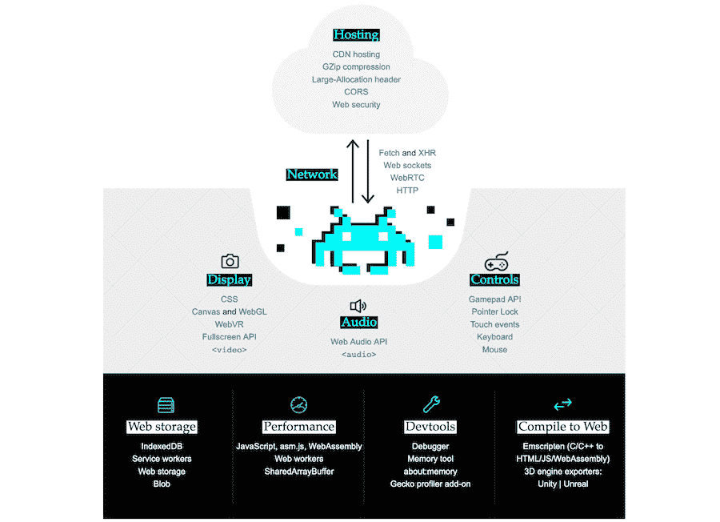

MDN Web Doc’s guide on game development.


MDN Web Docs 是初级 Web 开发人员的必备读物，它也为专家提供了足够多的价值。如果有任何网站值得一个浏览器书签，这就是它！

#### 57.DevDocs — API 文档浏览器

过去，你会将所有购买产品的手册保存在布满灰尘的抽屉或橱柜中。随着生活变得越来越数字化，那些纸质手册已经让位于从每个制造商的网站上下载的 PDF 文件。

通过这样做，我们现在有网站收集管理图书馆中手册的数字版本。它让您可以从一个存储库中找到您需要的内容。因此，web 开发主题也应该存在。

简而言之， [DevDocs](http://devdocs.io) 是一个 API 文档库，我们认为它对几乎所有开发人员都很有价值:

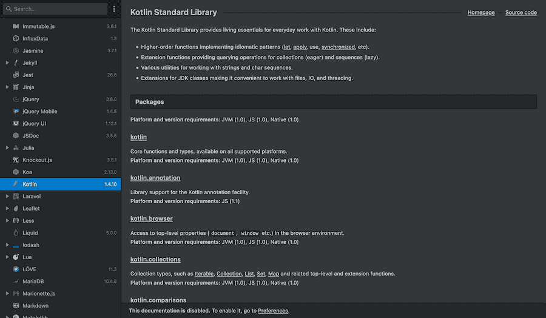

The DevDocs homepage.


在浏览这个库之前，您需要启用您想要的 API 文档。您可以在**首选项**屏幕中完成此操作:

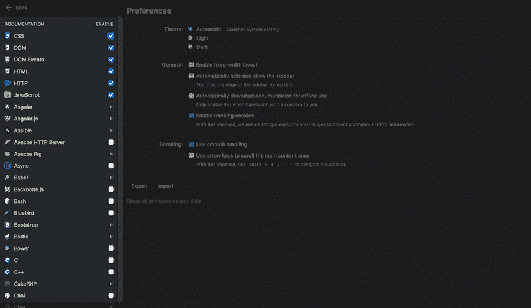

The DevDocs Preferences screen.


完成后，您将能够从专用的树形菜单中访问相关文档:

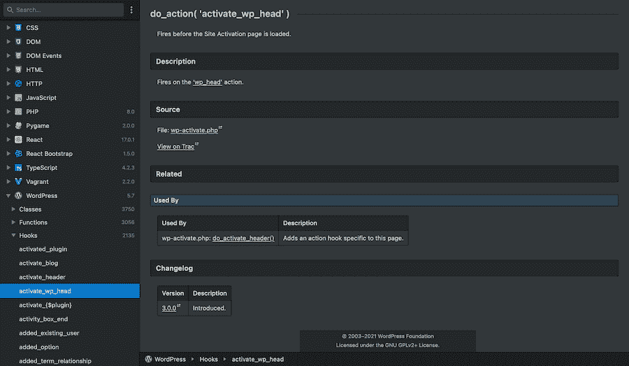

The WordPress API screen.


这是对低效问题的简单解决方案，因为您在一个地方有多个 API 引用。DevDocs 是另一个值得收藏的网站，很遗憾没有一个桌面应用程序可以更快地提供参考。

#### 58.CSS-技巧

Chris Coyier 是许多 web 开发人员都知道的一个名字。我们打赌你已经熟悉了他创建的网站—[CSS—Tricks](https://css-tricks.com/)。顾名思义，这是一个致力于前端编码，特别是 CSS，以及如何变得更好的网站。

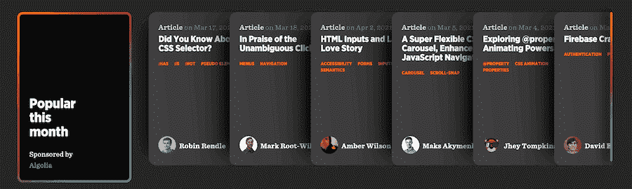

The CSS-Tricks homepage.


正如[关于页面注释](https://css-tricks.com/about/)所言，最初几年，CSS 是主要话题。然而，从那以后，HTML、JavaScript、WordPress 等等变得同样重要，并且经常被讨论。结果是一个专注于前端开发的网站，有大量的文章、视频和指南来启发你。

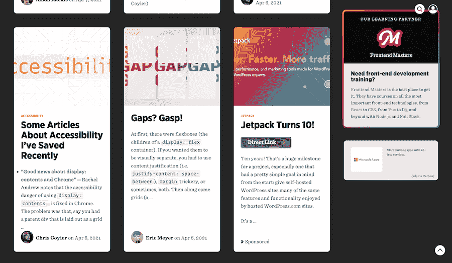

The blogroll for CSS-Tricks.


一个简单但有价值的元素是 [CSS 历书](https://css-tricks.com/almanac/)，它概述了 CSS 中的选择器和属性。如果你需要掌握这门语言的某些方面，这是一个很好的参考资料。

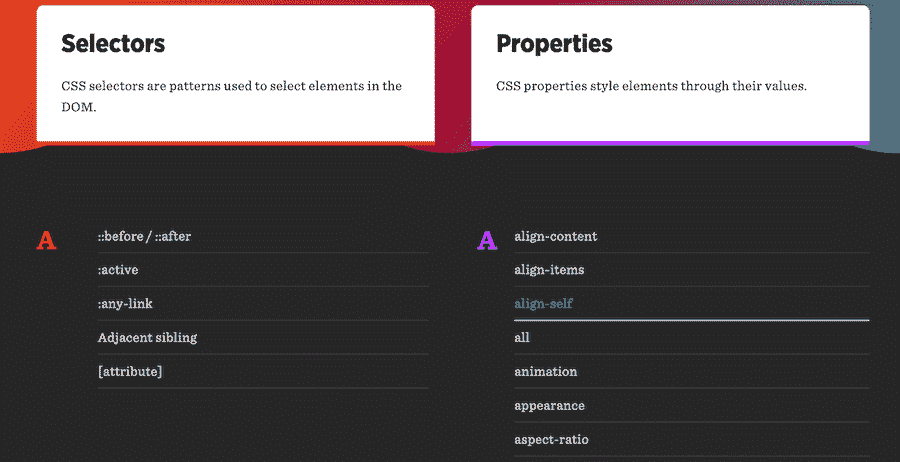

The CSS-Tricks Almanac.


虽然 CSS-Tricks 有类似参考的方面，但它本身并不是参考资源*。不过，不管是通过 RSS 提要还是其他解决方案，它都应该是你经常去的地方。内容质量很高，能以你以前想不到的方式挑战你。至少，[订阅时事通讯](https://css-tricks.com/newsletter/246-communication-is-key/)，等待 CSS-Tricks 进入你的收件箱。*

 *#### 59.开发社区

想象一下，你可以从社交媒体、网络开发和堆栈溢出中提取优秀的部分，然后创建一个将它们融合在一起的网站。结果可能是[开发社区](http://dev.to)。

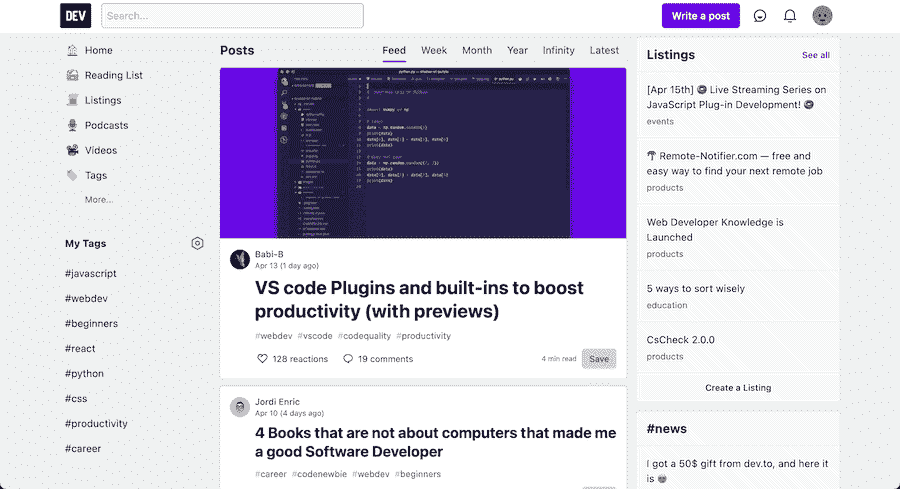

The DEV Community homepage.


这是一个博客平台，也是一个寻找发展问题答案的途径。您选择要关注的标签和人员，您的新闻订阅源就变成了一个自动化的、有管理的帖子和见解时间轴:

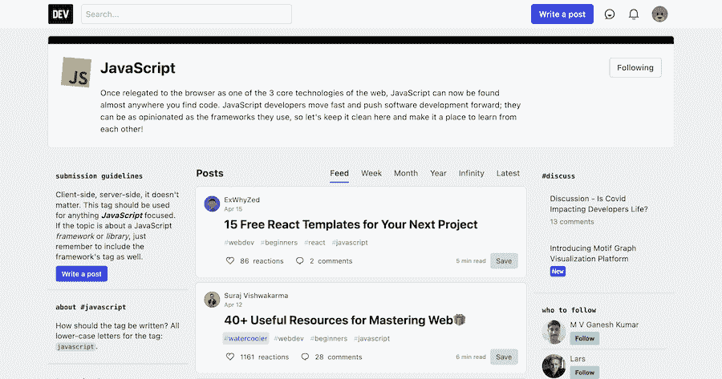

The DEV Community timeline for the JavaScript tag.


如果你愿意的话，可以说这是一个随处可见的信息。DEV 社区的优点是它在这里，它是开发主题的定向整理。把它想象成一个开发者大会的轨道，而不是在公共汽车站偷听和打断一个相关的对话。

这是另一个在你的 RSS 提要中表现良好的网站，或者作为你收件箱中的摘要。因此，它也是一个“沉睡者”资源，因为你会不知不觉地来到这里。

#### 60.我可以用…

你可能会说，Jeeves 开创了通过在网上提问来寻找信息的潮流。各种搜索算法很快取代了他，尽管基于问题的搜索仍然是找到你所需要的东西的可靠方法。

*[我能用…](https://caniuse.com/)* 是[前端开发者对“*有没有问 Jeeves 要 CSS 的？*”](https://kinsta.com/blog/frontend-developer/)

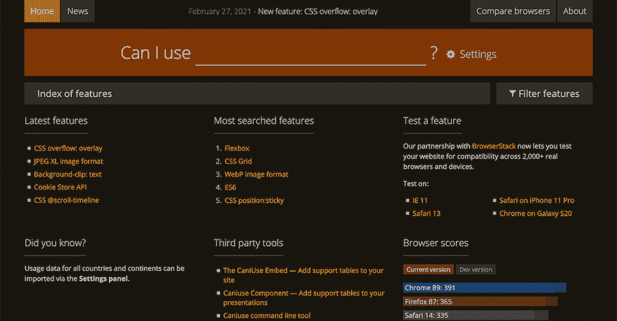

The Can I use… homepage.


前提很简单:您在搜索字段中键入 CSS 选择器或属性，数据库会返回您是否可以使用它来创建网站。你也不局限于 CSS。还支持 JavaScript 和 HTML:

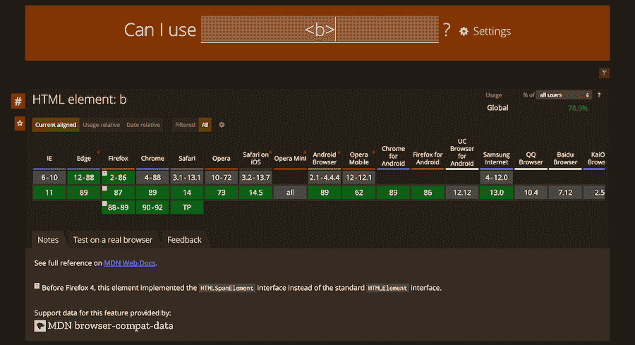

Searching for an HTML element in Can I use…


这是一个前端语言数据库，所以它不会返回 PHP、Python 或其他服务器端语言的结果。即便如此，*我可以使用……*是一个巨大而有价值的工具，它将在多种设备的可访问性和设计方面为您提供帮助。

这是一个简单的提议，只需找出一个特定的元素，看一眼你的目标浏览器是否支持它:

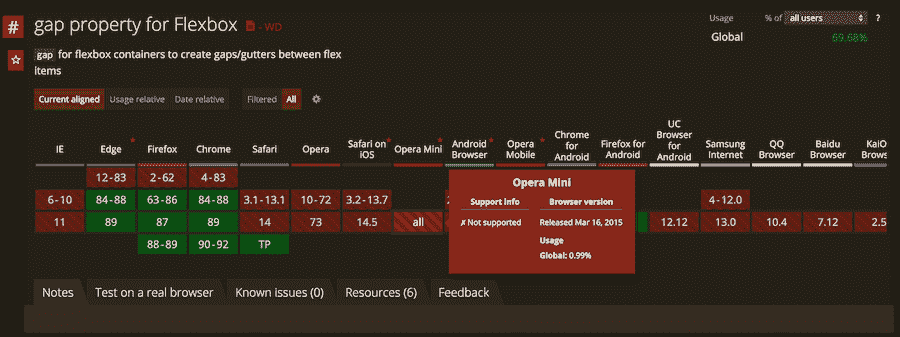

The browser support table in *Can I use…*


如果仔细观察，还可以发现一些统计数据，例如元素的发布日期和使用百分比:

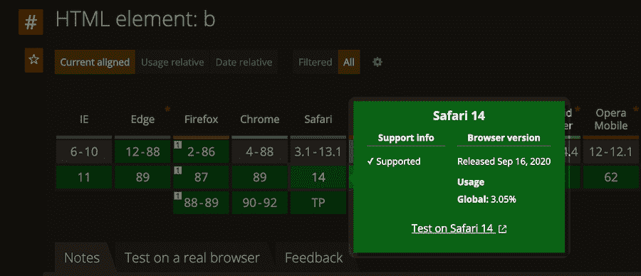

Information for a specific element in Can I use…


总的来说，*我能用吗……*可能不会经常使用。不过，在项目的某些阶段，它几乎会一直开放。一旦你弄清楚你的目标浏览器将支持什么，*我可以使用…* 重新放回你的书签，等待下一次需要它的时候。这是一个有用的服务，当涉及到您的前端代码时，它可以是一个“水载体”。

[From wireframing to design to building collaborative workflows, there's a lot that goes into a successful development project 👨‍💻 These tools will help you keep things streamlined 😌Click to Tweet](https://twitter.com/intent/tweet?url=https%3A%2F%2Fkinsta.com%2Fblog%2Fweb-development-tools%2F&via=kinsta&text=From+wireframing+to+design+to+building+collaborative+workflows%2C+there%27s+a+lot+that+goes+into+a+successful+development+project+%F0%9F%91%A8%E2%80%8D%F0%9F%92%BB+These+tools+will+help+you+keep+things+streamlined+%F0%9F%98%8C&hashtags=WebDeveloper%2CWebDev)

## 摘要

时间和金钱都很紧迫，选择您一直使用的旧的 web 开发工具是合理的。然而，对一个项目的需求做出一个经过深思熟虑的选择将会在时间、成本和生产力上得到回报。

在本帖中，我们介绍了 60 种令人惊叹的网络开发工具，你可以在 2022 年使用这些工具来帮助你和你的团队。可能你已经知道了。如果各种调查都是正确的，那么更多的开发人员会转向 GitHub、TypeScript、不同的 web 服务栈以及众多 JavaScript 框架中的一个来完成项目。

无论您选择使用什么样的 web 开发工具， [Kinsta 客户](https://kinsta.com/plans/?plan=visits-business1&interval=month)都可以通过 MyKinsta 平台获得更多信息。这包括通过使用内置在 [MyKinsta 仪表板](https://kinsta.com/mykinsta/) 中的 [代码缩小功能](https://kinsta.com/help/kinsta-cdn-code-minification) ，快速轻松地提升您的整体优化，允许客户只需简单点击即可实现 CSS 和 JavaScript 的自动缩小。

*你有没有一个 web 开发工具可以推荐开发者在 2022 年使用？请在下面的评论区告诉我们你的想法！*

* * *

让你所有的[应用程序](https://kinsta.com/application-hosting/)、[数据库](https://kinsta.com/database-hosting/)和 [WordPress 网站](https://kinsta.com/wordpress-hosting/)在线并在一个屋檐下。我们功能丰富的高性能云平台包括:

*   在 MyKinsta 仪表盘中轻松设置和管理
*   24/7 专家支持
*   最好的谷歌云平台硬件和网络，由 Kubernetes 提供最大的可扩展性
*   面向速度和安全性的企业级 Cloudflare 集成
*   全球受众覆盖全球多达 35 个数据中心和 275 多个 pop

在第一个月使用托管的[应用程序或托管](https://kinsta.com/application-hosting/)的[数据库，您可以享受 20 美元的优惠，亲自测试一下。探索我们的](https://kinsta.com/database-hosting/)[计划](https://kinsta.com/plans/)或[与销售人员交谈](https://kinsta.com/contact-us/)以找到最适合您的方式。*